# Opinion Poll by Research Affairs for ÖSTERREICH, 16–21 August 2019

<a href="#voting-intentions">Voting Intentions</a> | <a href="#seats">Seats</a> | <a href="#coalitions">Coalitions</a> | <a href="#technical-information">Technical Information</a>

## Voting Intentions

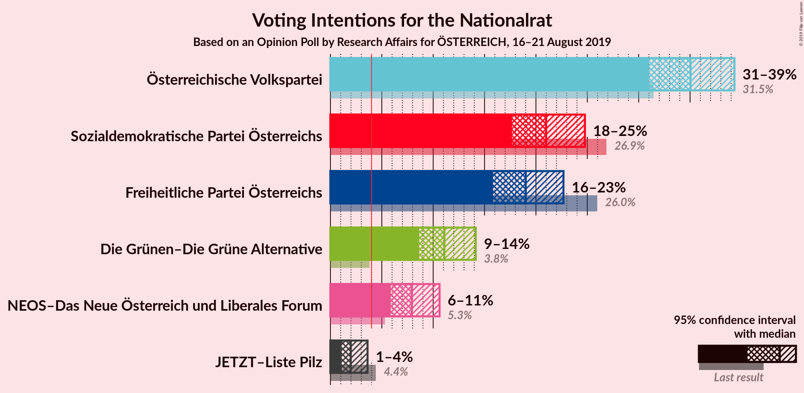

### Confidence Intervals

| Party | Last Result | Poll Result | 80% Confidence Interval | 90% Confidence Interval | 95% Confidence Interval | 99% Confidence Interval |
|:-----:|:-----------:|:-----------:|:-----------------------:|:-----------------------:|:-----------------------:|:-----------------------:|
| Österreichische Volkspartei | 31.5% | 35.0% | 32.4–37.8% |31.7–38.6% |31.0–39.3% |29.8–40.7% |
| Sozialdemokratische Partei Österreichs | 26.9% | 21.0% | 18.8–23.5% |18.2–24.2% |17.7–24.8% |16.7–26.0% |
| Freiheitliche Partei Österreichs | 26.0% | 19.0% | 16.9–21.4% |16.3–22.1% |15.8–22.7% |14.9–23.9% |
| Die Grünen–Die Grüne Alternative | 3.8% | 11.1% | 9.5–13.1% |9.0–13.6% |8.6–14.1% |7.9–15.1% |
| NEOS–Das Neue Österreich und Liberales Forum | 5.3% | 7.9% | 6.6–9.7% |6.2–10.2% |5.9–10.6% |5.3–11.5% |
| JETZT–Liste Pilz | 4.4% | 2.0% | 1.4–3.0% |1.2–3.3% |1.1–3.6% |0.9–4.2% |

*Note:* The poll result column reflects the actual value used in the calculations. Published results may vary slightly, and in addition be rounded to fewer digits.

## Seats

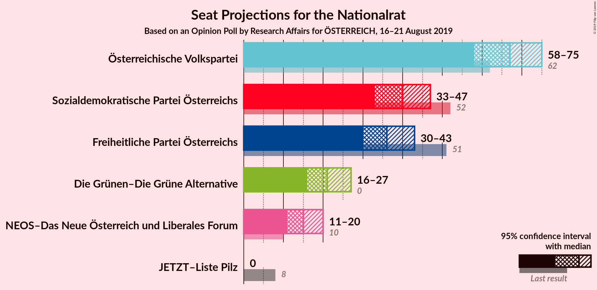

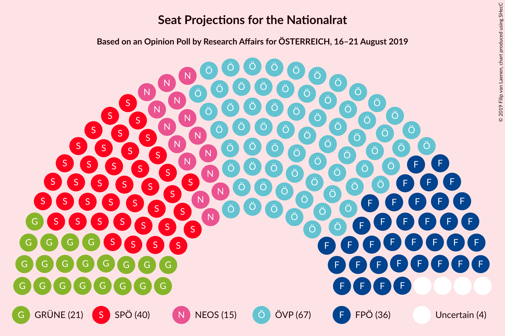

### Confidence Intervals

| Party | Last Result | Median | 80% Confidence Interval | 90% Confidence Interval | 95% Confidence Interval | 99% Confidence Interval |
|:-----:|:-----------:|:------:|:-----------------------:|:-----------------------:|:-----------------------:|:-----------------------:|
| <a href="#österreichische-volkspartei">Österreichische Volkspartei</a> | 62 | 67 | 61–72 |60–74 |58–75 |56–78 |
| <a href="#sozialdemokratische-partei-österreichs">Sozialdemokratische Partei Österreichs</a> | 52 | 40 | 35–45 |34–46 |33–47 |31–50 |
| <a href="#freiheitliche-partei-österreichs">Freiheitliche Partei Österreichs</a> | 51 | 36 | 32–40 |31–42 |30–43 |28–45 |
| <a href="#die-grünen–die-grüne-alternative">Die Grünen–Die Grüne Alternative</a> | 0 | 21 | 18–24 |17–26 |16–27 |14–28 |
| <a href="#neos–das-neue-österreich-und-liberales-forum">NEOS–Das Neue Österreich und Liberales Forum</a> | 10 | 15 | 12–18 |11–19 |11–20 |10–22 |
| <a href="#jetzt–liste-pilz">JETZT–Liste Pilz</a> | 8 | 0 | 0 |0 |0 |0–7 |

### Österreichische Volkspartei

*For a full overview of the results for this party, see the [Österreichische Volkspartei](party-österreichischevolkspartei.html) page.*

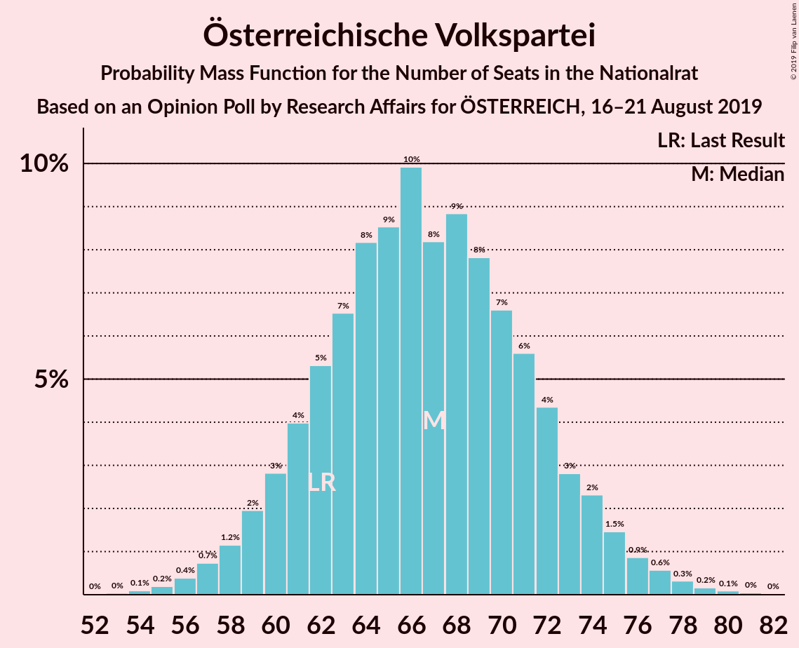

| Number of Seats | Probability | Accumulated | Special Marks |
|:---------------:|:-----------:|:-----------:|:-------------:|
| 53 | 0% | 100% |  |
| 54 | 0.1% | 99.9% |  |
| 55 | 0.2% | 99.8% |  |
| 56 | 0.4% | 99.6% |  |
| 57 | 0.7% | 99.3% |  |
| 58 | 1.2% | 98.5% |  |
| 59 | 2% | 97% |  |
| 60 | 3% | 95% |  |
| 61 | 4% | 93% |  |
| 62 | 5% | 89% | Last Result |
| 63 | 7% | 83% |  |
| 64 | 8% | 77% |  |
| 65 | 9% | 69% |  |
| 66 | 10% | 60% |  |
| 67 | 8% | 50% | Median |
| 68 | 9% | 42% |  |
| 69 | 8% | 33% |  |
| 70 | 7% | 25% |  |
| 71 | 6% | 19% |  |
| 72 | 4% | 13% |  |
| 73 | 3% | 9% |  |
| 74 | 2% | 6% |  |
| 75 | 1.5% | 4% |  |
| 76 | 0.9% | 2% |  |
| 77 | 0.6% | 1.2% |  |
| 78 | 0.3% | 0.7% |  |
| 79 | 0.2% | 0.3% |  |
| 80 | 0.1% | 0.2% |  |
| 81 | 0% | 0.1% |  |
| 82 | 0% | 0% |  |

### Sozialdemokratische Partei Österreichs

*For a full overview of the results for this party, see the [Sozialdemokratische Partei Österreichs](party-sozialdemokratischeparteiösterreichs.html) page.*

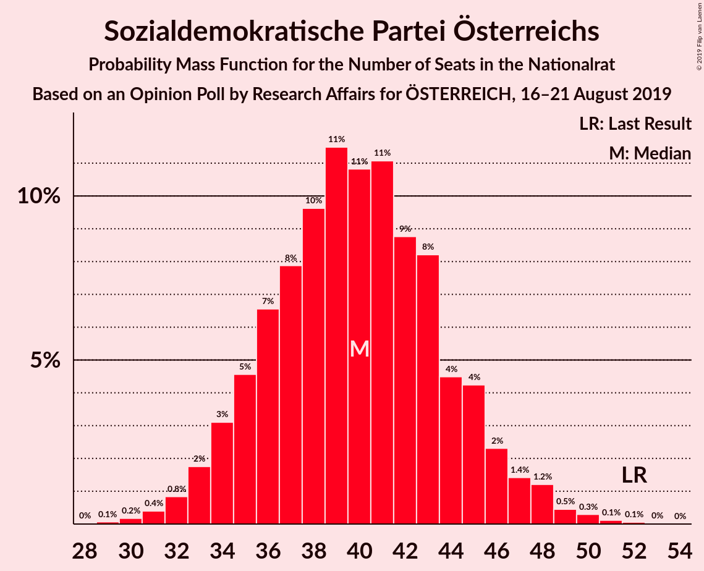

| Number of Seats | Probability | Accumulated | Special Marks |
|:---------------:|:-----------:|:-----------:|:-------------:|
| 29 | 0.1% | 100% |  |
| 30 | 0.2% | 99.9% |  |
| 31 | 0.4% | 99.7% |  |
| 32 | 0.8% | 99.3% |  |
| 33 | 2% | 98.5% |  |
| 34 | 3% | 97% |  |
| 35 | 5% | 94% |  |
| 36 | 6% | 89% |  |
| 37 | 8% | 82% |  |
| 38 | 10% | 74% |  |
| 39 | 11% | 65% |  |
| 40 | 11% | 53% | Median |
| 41 | 10% | 42% |  |
| 42 | 9% | 32% |  |
| 43 | 8% | 23% |  |
| 44 | 5% | 15% |  |
| 45 | 4% | 10% |  |
| 46 | 2% | 6% |  |
| 47 | 2% | 4% |  |
| 48 | 1.0% | 2% |  |
| 49 | 0.5% | 1.0% |  |
| 50 | 0.3% | 0.5% |  |
| 51 | 0.1% | 0.2% |  |
| 52 | 0.1% | 0.1% | Last Result |
| 53 | 0% | 0% |  |

### Freiheitliche Partei Österreichs

*For a full overview of the results for this party, see the [Freiheitliche Partei Österreichs](party-freiheitlicheparteiösterreichs.html) page.*

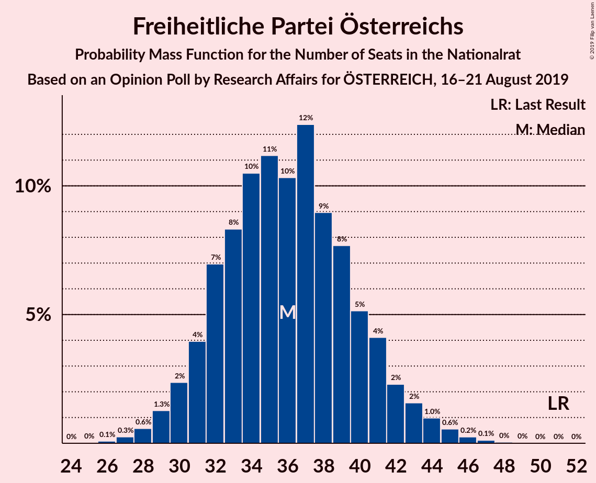

| Number of Seats | Probability | Accumulated | Special Marks |
|:---------------:|:-----------:|:-----------:|:-------------:|
| 26 | 0.1% | 100% |  |
| 27 | 0.2% | 99.9% |  |
| 28 | 0.6% | 99.6% |  |
| 29 | 1.3% | 99.0% |  |
| 30 | 2% | 98% |  |
| 31 | 4% | 95% |  |
| 32 | 6% | 91% |  |
| 33 | 8% | 85% |  |
| 34 | 10% | 77% |  |
| 35 | 11% | 67% |  |
| 36 | 12% | 55% | Median |
| 37 | 10% | 44% |  |
| 38 | 10% | 33% |  |
| 39 | 8% | 23% |  |
| 40 | 6% | 16% |  |
| 41 | 4% | 10% |  |
| 42 | 2% | 6% |  |
| 43 | 2% | 4% |  |
| 44 | 0.9% | 2% |  |
| 45 | 0.5% | 1.0% |  |
| 46 | 0.2% | 0.4% |  |
| 47 | 0.1% | 0.2% |  |
| 48 | 0.1% | 0.1% |  |
| 49 | 0% | 0% |  |
| 50 | 0% | 0% |  |
| 51 | 0% | 0% | Last Result |

### Die Grünen–Die Grüne Alternative

*For a full overview of the results for this party, see the [Die Grünen–Die Grüne Alternative](party-diegrünen–diegrünealternative.html) page.*

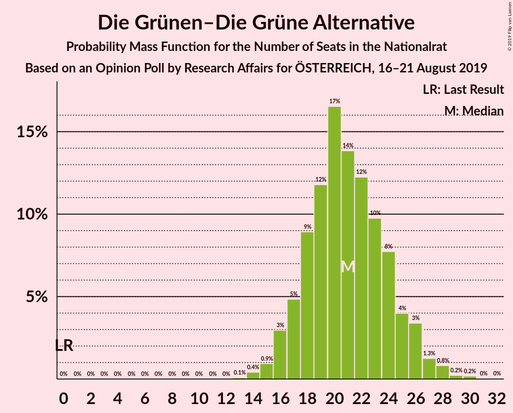

| Number of Seats | Probability | Accumulated | Special Marks |
|:---------------:|:-----------:|:-----------:|:-------------:|
| 0 | 0% | 100% | Last Result |
| 1 | 0% | 100% |  |
| 2 | 0% | 100% |  |
| 3 | 0% | 100% |  |
| 4 | 0% | 100% |  |
| 5 | 0% | 100% |  |
| 6 | 0% | 100% |  |
| 7 | 0% | 100% |  |
| 8 | 0% | 100% |  |
| 9 | 0% | 100% |  |
| 10 | 0% | 100% |  |
| 11 | 0% | 100% |  |
| 12 | 0% | 100% |  |
| 13 | 0.1% | 100% |  |
| 14 | 0.4% | 99.9% |  |
| 15 | 1.0% | 99.5% |  |
| 16 | 3% | 98.5% |  |
| 17 | 5% | 96% |  |
| 18 | 9% | 91% |  |
| 19 | 12% | 82% |  |
| 20 | 15% | 70% |  |
| 21 | 15% | 55% | Median |
| 22 | 13% | 40% |  |
| 23 | 10% | 28% |  |
| 24 | 8% | 18% |  |
| 25 | 4% | 10% |  |
| 26 | 3% | 6% |  |
| 27 | 1.2% | 3% |  |
| 28 | 0.8% | 1.3% |  |
| 29 | 0.2% | 0.5% |  |
| 30 | 0.2% | 0.3% |  |
| 31 | 0% | 0.1% |  |
| 32 | 0% | 0% |  |

### NEOS–Das Neue Österreich und Liberales Forum

*For a full overview of the results for this party, see the [NEOS–Das Neue Österreich und Liberales Forum](party-neos–dasneueösterreichundliberalesforum.html) page.*

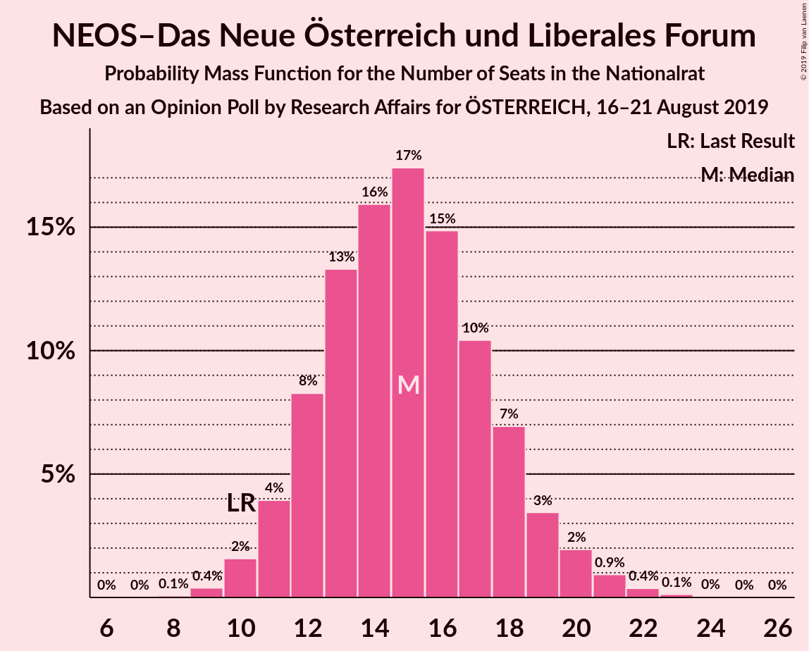

| Number of Seats | Probability | Accumulated | Special Marks |
|:---------------:|:-----------:|:-----------:|:-------------:|
| 8 | 0.1% | 100% |  |
| 9 | 0.4% | 99.9% |  |
| 10 | 2% | 99.5% | Last Result |
| 11 | 4% | 98% |  |
| 12 | 8% | 94% |  |
| 13 | 13% | 86% |  |
| 14 | 16% | 72% |  |
| 15 | 17% | 57% | Median |
| 16 | 15% | 39% |  |
| 17 | 10% | 24% |  |
| 18 | 7% | 14% |  |
| 19 | 3% | 7% |  |
| 20 | 2% | 3% |  |
| 21 | 0.9% | 1.5% |  |
| 22 | 0.4% | 0.6% |  |
| 23 | 0.1% | 0.2% |  |
| 24 | 0% | 0.1% |  |
| 25 | 0% | 0% |  |

### JETZT–Liste Pilz

*For a full overview of the results for this party, see the [JETZT–Liste Pilz](party-jetzt–listepilz.html) page.*

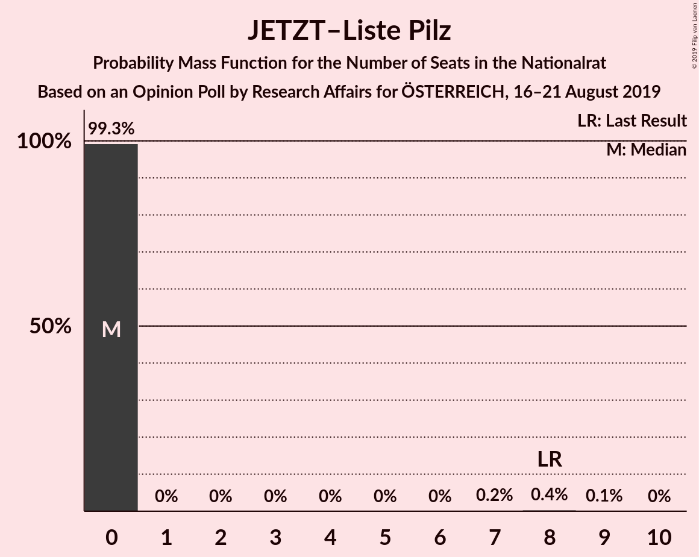

| Number of Seats | Probability | Accumulated | Special Marks |
|:---------------:|:-----------:|:-----------:|:-------------:|
| 0 | 99.2% | 100% | Median |
| 1 | 0% | 0.8% |  |
| 2 | 0% | 0.8% |  |
| 3 | 0% | 0.8% |  |
| 4 | 0% | 0.8% |  |
| 5 | 0% | 0.8% |  |
| 6 | 0% | 0.8% |  |
| 7 | 0.3% | 0.8% |  |
| 8 | 0.4% | 0.5% | Last Result |
| 9 | 0.1% | 0.1% |  |
| 10 | 0% | 0% |  |

## Coalitions

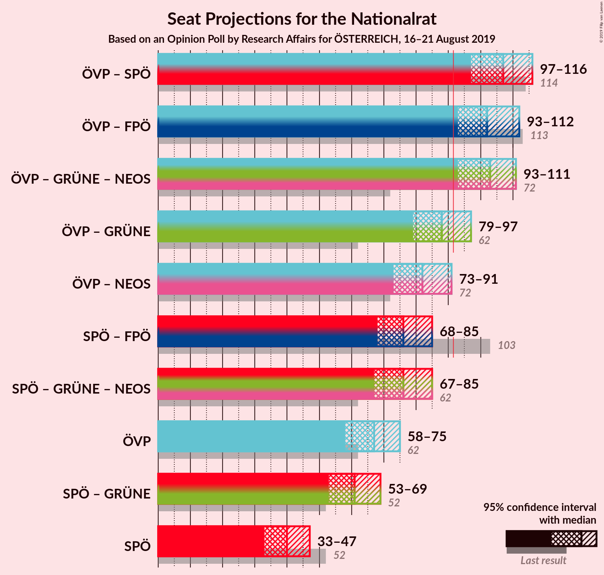

### Confidence Intervals

| Coalition | Last Result | Median | Majority? | 80% Confidence Interval | 90% Confidence Interval | 95% Confidence Interval | 99% Confidence Interval |
|:---------:|:-----------:|:------:|:---------:|:-----------------------:|:-----------------------:|:-----------------------:|:-----------------------:|
| Österreichische Volkspartei – Sozialdemokratische Partei Österreichs | 114 | 106 | 99.9% | 100–113 | 99–114 | 97–116 | 94–119 |
| Österreichische Volkspartei – Die Grünen–Die Grüne Alternative – NEOS–Das Neue Österreich und Liberales Forum | 72 | 103 | 99.2% | 96–109 | 95–111 | 93–112 | 91–115 |
| Österreichische Volkspartei – Freiheitliche Partei Österreichs | 113 | 103 | 99.2% | 96–109 | 95–111 | 93–112 | 91–115 |
| Österreichische Volkspartei – Die Grünen–Die Grüne Alternative | 62 | 88 | 20% | 82–94 | 80–95 | 79–97 | 76–100 |
| Österreichische Volkspartei – NEOS–Das Neue Österreich und Liberales Forum | 72 | 82 | 2% | 76–87 | 74–89 | 73–91 | 70–93 |
| Sozialdemokratische Partei Österreichs – Die Grünen–Die Grüne Alternative – NEOS–Das Neue Österreich und Liberales Forum | 62 | 76 | 0% | 70–82 | 68–83 | 67–85 | 65–88 |
| Sozialdemokratische Partei Österreichs – Freiheitliche Partei Österreichs | 103 | 76 | 0% | 70–82 | 69–84 | 67–85 | 65–87 |
| Österreichische Volkspartei | 62 | 67 | 0% | 61–72 | 60–74 | 58–75 | 56–78 |
| Sozialdemokratische Partei Österreichs – Die Grünen–Die Grüne Alternative | 52 | 61 | 0% | 56–66 | 54–68 | 53–69 | 50–72 |
| Sozialdemokratische Partei Österreichs | 52 | 40 | 0% | 35–45 | 34–46 | 33–47 | 31–50 |

### Österreichische Volkspartei – Sozialdemokratische Partei Österreichs

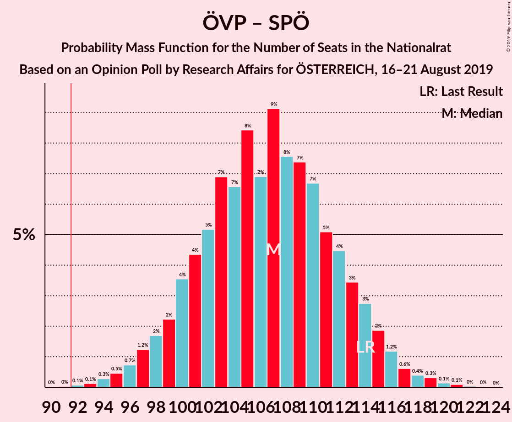

| Number of Seats | Probability | Accumulated | Special Marks |
|:---------------:|:-----------:|:-----------:|:-------------:|
| 91 | 0% | 100% |  |
| 92 | 0.1% | 99.9% | Majority |
| 93 | 0.1% | 99.9% |  |
| 94 | 0.3% | 99.7% |  |
| 95 | 0.4% | 99.5% |  |
| 96 | 0.7% | 99.0% |  |
| 97 | 1.2% | 98% |  |
| 98 | 2% | 97% |  |
| 99 | 2% | 95% |  |
| 100 | 4% | 93% |  |
| 101 | 4% | 89% |  |
| 102 | 6% | 85% |  |
| 103 | 7% | 79% |  |
| 104 | 7% | 73% |  |
| 105 | 8% | 66% |  |
| 106 | 8% | 58% |  |
| 107 | 8% | 50% | Median |
| 108 | 7% | 42% |  |
| 109 | 7% | 34% |  |
| 110 | 7% | 27% |  |
| 111 | 5% | 21% |  |
| 112 | 4% | 15% |  |
| 113 | 3% | 11% |  |
| 114 | 3% | 8% | Last Result |
| 115 | 2% | 5% |  |
| 116 | 1.2% | 3% |  |
| 117 | 0.8% | 2% |  |
| 118 | 0.4% | 1.0% |  |
| 119 | 0.3% | 0.6% |  |
| 120 | 0.1% | 0.3% |  |
| 121 | 0.1% | 0.1% |  |
| 122 | 0% | 0.1% |  |
| 123 | 0% | 0% |  |

### Österreichische Volkspartei – Die Grünen–Die Grüne Alternative – NEOS–Das Neue Österreich und Liberales Forum

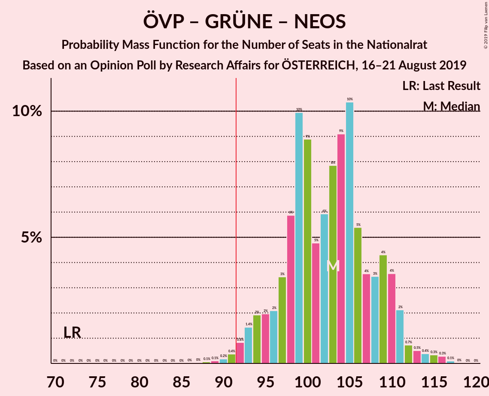

| Number of Seats | Probability | Accumulated | Special Marks |
|:---------------:|:-----------:|:-----------:|:-------------:|
| 72 | 0% | 100% | Last Result |
| 73 | 0% | 100% |  |
| 74 | 0% | 100% |  |
| 75 | 0% | 100% |  |
| 76 | 0% | 100% |  |
| 77 | 0% | 100% |  |
| 78 | 0% | 100% |  |
| 79 | 0% | 100% |  |
| 80 | 0% | 100% |  |
| 81 | 0% | 100% |  |
| 82 | 0% | 100% |  |
| 83 | 0% | 100% |  |
| 84 | 0% | 100% |  |
| 85 | 0% | 100% |  |
| 86 | 0% | 100% |  |
| 87 | 0% | 100% |  |
| 88 | 0.1% | 99.9% |  |
| 89 | 0.1% | 99.9% |  |
| 90 | 0.2% | 99.7% |  |
| 91 | 0.3% | 99.5% |  |
| 92 | 0.7% | 99.2% | Majority |
| 93 | 1.2% | 98% |  |
| 94 | 2% | 97% |  |
| 95 | 2% | 95% |  |
| 96 | 3% | 93% |  |
| 97 | 3% | 90% |  |
| 98 | 5% | 87% |  |
| 99 | 8% | 81% |  |
| 100 | 10% | 73% |  |
| 101 | 6% | 63% |  |
| 102 | 6% | 57% |  |
| 103 | 7% | 51% | Median |
| 104 | 8% | 45% |  |
| 105 | 11% | 36% |  |
| 106 | 7% | 26% |  |
| 107 | 4% | 19% |  |
| 108 | 3% | 15% |  |
| 109 | 3% | 12% |  |
| 110 | 3% | 9% |  |
| 111 | 3% | 5% |  |
| 112 | 1.3% | 3% |  |
| 113 | 0.6% | 2% |  |
| 114 | 0.3% | 1.0% |  |
| 115 | 0.3% | 0.6% |  |
| 116 | 0.2% | 0.4% |  |
| 117 | 0.1% | 0.2% |  |
| 118 | 0% | 0.1% |  |
| 119 | 0% | 0% |  |

### Österreichische Volkspartei – Freiheitliche Partei Österreichs

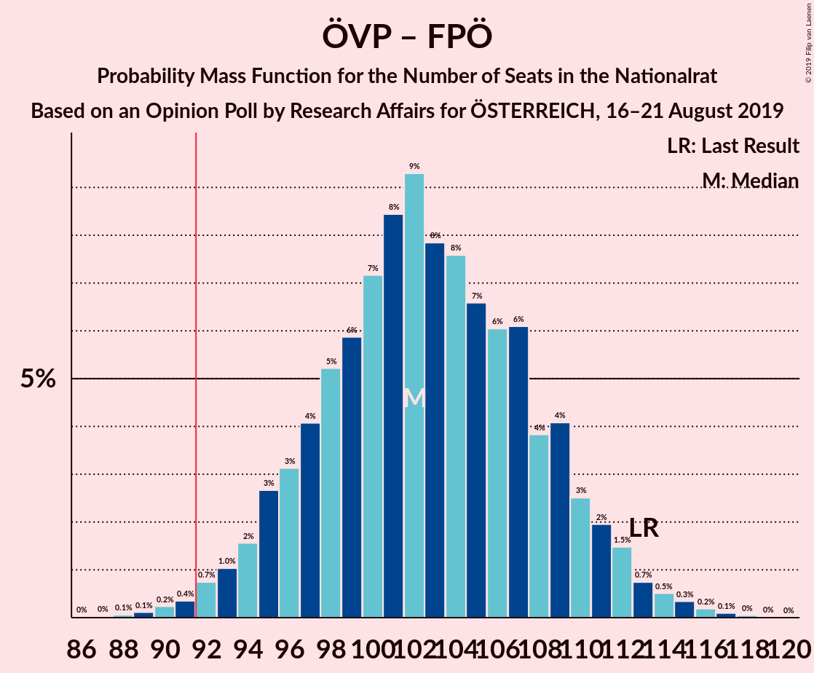

| Number of Seats | Probability | Accumulated | Special Marks |
|:---------------:|:-----------:|:-----------:|:-------------:|
| 87 | 0% | 100% |  |
| 88 | 0.1% | 99.9% |  |
| 89 | 0.1% | 99.9% |  |
| 90 | 0.2% | 99.8% |  |
| 91 | 0.4% | 99.5% |  |
| 92 | 0.7% | 99.2% | Majority |
| 93 | 1.1% | 98% |  |
| 94 | 2% | 97% |  |
| 95 | 3% | 96% |  |
| 96 | 3% | 93% |  |
| 97 | 4% | 90% |  |
| 98 | 6% | 86% |  |
| 99 | 6% | 80% |  |
| 100 | 7% | 75% |  |
| 101 | 8% | 67% |  |
| 102 | 9% | 60% |  |
| 103 | 7% | 50% | Median |
| 104 | 8% | 43% |  |
| 105 | 7% | 35% |  |
| 106 | 7% | 28% |  |
| 107 | 6% | 22% |  |
| 108 | 4% | 16% |  |
| 109 | 4% | 12% |  |
| 110 | 3% | 8% |  |
| 111 | 2% | 5% |  |
| 112 | 2% | 4% |  |
| 113 | 0.8% | 2% | Last Result |
| 114 | 0.5% | 1.2% |  |
| 115 | 0.3% | 0.7% |  |
| 116 | 0.2% | 0.3% |  |
| 117 | 0.1% | 0.2% |  |
| 118 | 0% | 0.1% |  |
| 119 | 0% | 0% |  |

### Österreichische Volkspartei – Die Grünen–Die Grüne Alternative

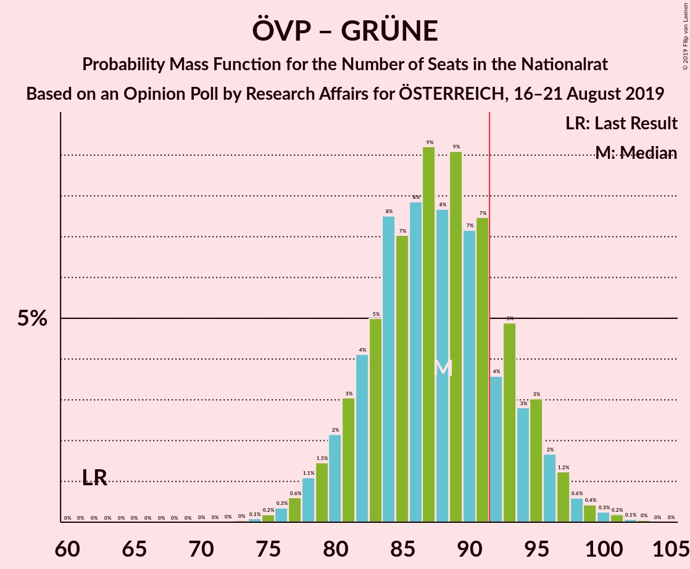

| Number of Seats | Probability | Accumulated | Special Marks |
|:---------------:|:-----------:|:-----------:|:-------------:|
| 62 | 0% | 100% | Last Result |
| 63 | 0% | 100% |  |
| 64 | 0% | 100% |  |
| 65 | 0% | 100% |  |
| 66 | 0% | 100% |  |
| 67 | 0% | 100% |  |
| 68 | 0% | 100% |  |
| 69 | 0% | 100% |  |
| 70 | 0% | 100% |  |
| 71 | 0% | 100% |  |
| 72 | 0% | 100% |  |
| 73 | 0% | 100% |  |
| 74 | 0.1% | 99.9% |  |
| 75 | 0.2% | 99.8% |  |
| 76 | 0.3% | 99.6% |  |
| 77 | 0.6% | 99.3% |  |
| 78 | 1.1% | 98.7% |  |
| 79 | 1.5% | 98% |  |
| 80 | 3% | 96% |  |
| 81 | 3% | 94% |  |
| 82 | 4% | 91% |  |
| 83 | 5% | 87% |  |
| 84 | 7% | 81% |  |
| 85 | 7% | 74% |  |
| 86 | 8% | 67% |  |
| 87 | 9% | 59% |  |
| 88 | 8% | 50% | Median |
| 89 | 9% | 43% |  |
| 90 | 7% | 34% |  |
| 91 | 7% | 27% |  |
| 92 | 5% | 20% | Majority |
| 93 | 5% | 15% |  |
| 94 | 3% | 11% |  |
| 95 | 3% | 8% |  |
| 96 | 2% | 5% |  |
| 97 | 1.2% | 3% |  |
| 98 | 0.7% | 2% |  |
| 99 | 0.4% | 1.0% |  |
| 100 | 0.2% | 0.5% |  |
| 101 | 0.2% | 0.3% |  |
| 102 | 0.1% | 0.2% |  |
| 103 | 0% | 0.1% |  |
| 104 | 0% | 0% |  |

### Österreichische Volkspartei – NEOS–Das Neue Österreich und Liberales Forum

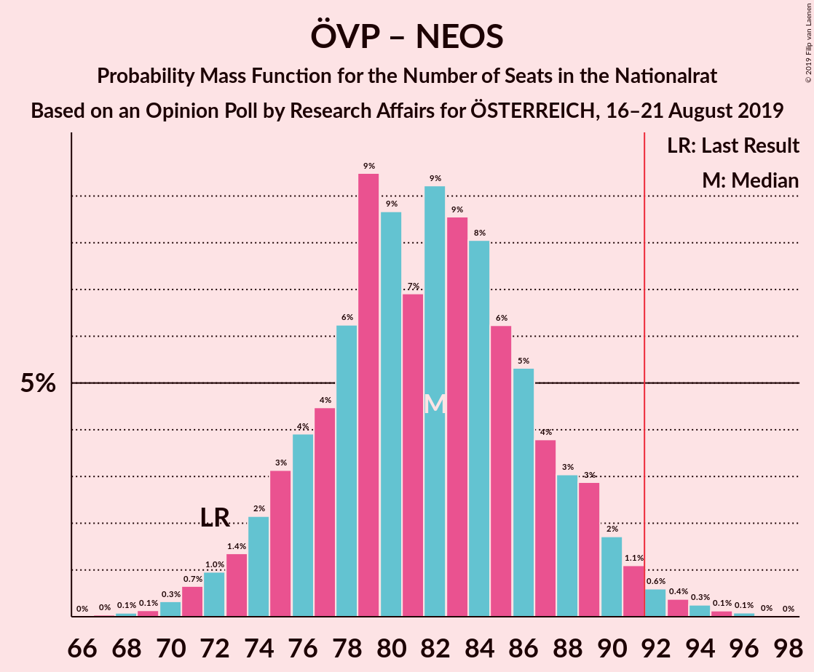

| Number of Seats | Probability | Accumulated | Special Marks |
|:---------------:|:-----------:|:-----------:|:-------------:|
| 67 | 0% | 100% |  |
| 68 | 0.1% | 99.9% |  |
| 69 | 0.1% | 99.8% |  |
| 70 | 0.3% | 99.7% |  |
| 71 | 0.6% | 99.4% |  |
| 72 | 0.9% | 98.8% | Last Result |
| 73 | 1.5% | 98% |  |
| 74 | 2% | 96% |  |
| 75 | 3% | 94% |  |
| 76 | 4% | 91% |  |
| 77 | 5% | 87% |  |
| 78 | 7% | 82% |  |
| 79 | 8% | 75% |  |
| 80 | 8% | 67% |  |
| 81 | 8% | 59% |  |
| 82 | 9% | 51% | Median |
| 83 | 8% | 42% |  |
| 84 | 8% | 34% |  |
| 85 | 6% | 26% |  |
| 86 | 6% | 20% |  |
| 87 | 4% | 14% |  |
| 88 | 3% | 10% |  |
| 89 | 2% | 7% |  |
| 90 | 2% | 4% |  |
| 91 | 1.1% | 3% |  |
| 92 | 0.7% | 2% | Majority |
| 93 | 0.4% | 0.8% |  |
| 94 | 0.2% | 0.5% |  |
| 95 | 0.1% | 0.3% |  |
| 96 | 0.1% | 0.1% |  |
| 97 | 0% | 0.1% |  |
| 98 | 0% | 0% |  |

### Sozialdemokratische Partei Österreichs – Die Grünen–Die Grüne Alternative – NEOS–Das Neue Österreich und Liberales Forum

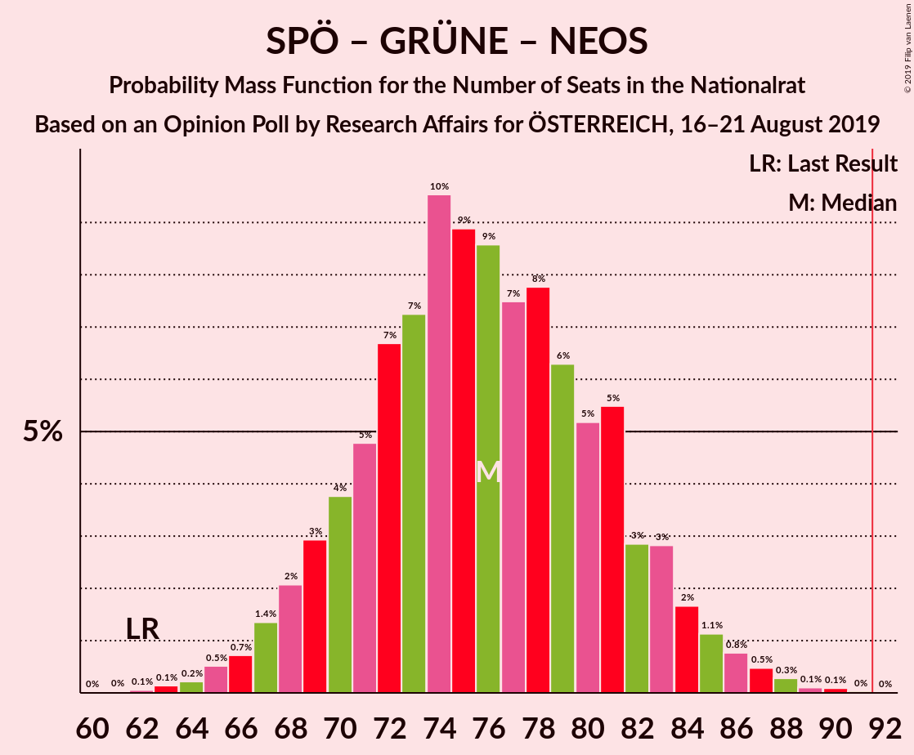

| Number of Seats | Probability | Accumulated | Special Marks |
|:---------------:|:-----------:|:-----------:|:-------------:|
| 62 | 0.1% | 100% | Last Result |
| 63 | 0.1% | 99.9% |  |
| 64 | 0.2% | 99.8% |  |
| 65 | 0.5% | 99.5% |  |
| 66 | 0.7% | 99.0% |  |
| 67 | 1.3% | 98% |  |
| 68 | 2% | 97% |  |
| 69 | 3% | 95% |  |
| 70 | 4% | 92% |  |
| 71 | 5% | 88% |  |
| 72 | 6% | 83% |  |
| 73 | 7% | 77% |  |
| 74 | 10% | 70% |  |
| 75 | 8% | 60% |  |
| 76 | 8% | 52% | Median |
| 77 | 9% | 43% |  |
| 78 | 8% | 35% |  |
| 79 | 6% | 27% |  |
| 80 | 5% | 21% |  |
| 81 | 5% | 15% |  |
| 82 | 3% | 10% |  |
| 83 | 3% | 7% |  |
| 84 | 2% | 4% |  |
| 85 | 1.1% | 3% |  |
| 86 | 0.8% | 2% |  |
| 87 | 0.5% | 1.0% |  |
| 88 | 0.3% | 0.5% |  |
| 89 | 0.1% | 0.3% |  |
| 90 | 0.1% | 0.1% |  |
| 91 | 0% | 0.1% |  |
| 92 | 0% | 0% | Majority |

### Sozialdemokratische Partei Österreichs – Freiheitliche Partei Österreichs

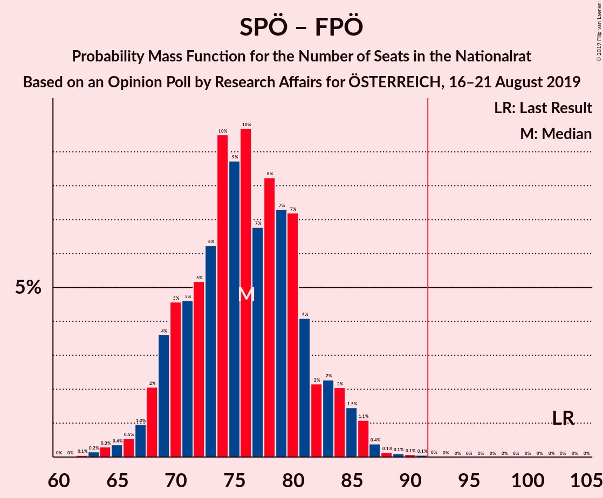

| Number of Seats | Probability | Accumulated | Special Marks |
|:---------------:|:-----------:|:-----------:|:-------------:|
| 62 | 0.1% | 100% |  |
| 63 | 0.1% | 99.9% |  |
| 64 | 0.2% | 99.8% |  |
| 65 | 0.3% | 99.5% |  |
| 66 | 0.6% | 99.2% |  |
| 67 | 1.1% | 98.6% |  |
| 68 | 2% | 97% |  |
| 69 | 3% | 95% |  |
| 70 | 4% | 92% |  |
| 71 | 4% | 88% |  |
| 72 | 6% | 84% |  |
| 73 | 7% | 78% |  |
| 74 | 10% | 71% |  |
| 75 | 8% | 61% |  |
| 76 | 8% | 53% | Median |
| 77 | 7% | 45% |  |
| 78 | 9% | 37% |  |
| 79 | 7% | 28% |  |
| 80 | 7% | 21% |  |
| 81 | 4% | 14% |  |
| 82 | 2% | 10% |  |
| 83 | 3% | 8% |  |
| 84 | 2% | 5% |  |
| 85 | 1.4% | 3% |  |
| 86 | 0.9% | 2% |  |
| 87 | 0.3% | 0.8% |  |
| 88 | 0.2% | 0.5% |  |
| 89 | 0.1% | 0.3% |  |
| 90 | 0.1% | 0.2% |  |
| 91 | 0% | 0.1% |  |
| 92 | 0% | 0% | Majority |
| 93 | 0% | 0% |  |
| 94 | 0% | 0% |  |
| 95 | 0% | 0% |  |
| 96 | 0% | 0% |  |
| 97 | 0% | 0% |  |
| 98 | 0% | 0% |  |
| 99 | 0% | 0% |  |
| 100 | 0% | 0% |  |
| 101 | 0% | 0% |  |
| 102 | 0% | 0% |  |
| 103 | 0% | 0% | Last Result |

### Österreichische Volkspartei

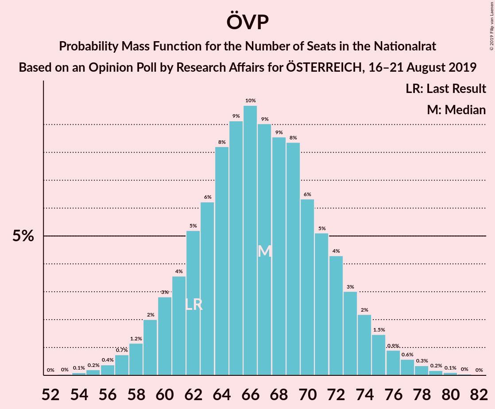

| Number of Seats | Probability | Accumulated | Special Marks |
|:---------------:|:-----------:|:-----------:|:-------------:|
| 53 | 0% | 100% |  |
| 54 | 0.1% | 99.9% |  |
| 55 | 0.2% | 99.8% |  |
| 56 | 0.4% | 99.6% |  |
| 57 | 0.7% | 99.3% |  |
| 58 | 1.2% | 98.5% |  |
| 59 | 2% | 97% |  |
| 60 | 3% | 95% |  |
| 61 | 4% | 93% |  |
| 62 | 5% | 89% | Last Result |
| 63 | 7% | 83% |  |
| 64 | 8% | 77% |  |
| 65 | 9% | 69% |  |
| 66 | 10% | 60% |  |
| 67 | 8% | 50% | Median |
| 68 | 9% | 42% |  |
| 69 | 8% | 33% |  |
| 70 | 7% | 25% |  |
| 71 | 6% | 19% |  |
| 72 | 4% | 13% |  |
| 73 | 3% | 9% |  |
| 74 | 2% | 6% |  |
| 75 | 1.5% | 4% |  |
| 76 | 0.9% | 2% |  |
| 77 | 0.6% | 1.2% |  |
| 78 | 0.3% | 0.7% |  |
| 79 | 0.2% | 0.3% |  |
| 80 | 0.1% | 0.2% |  |
| 81 | 0% | 0.1% |  |
| 82 | 0% | 0% |  |

### Sozialdemokratische Partei Österreichs – Die Grünen–Die Grüne Alternative

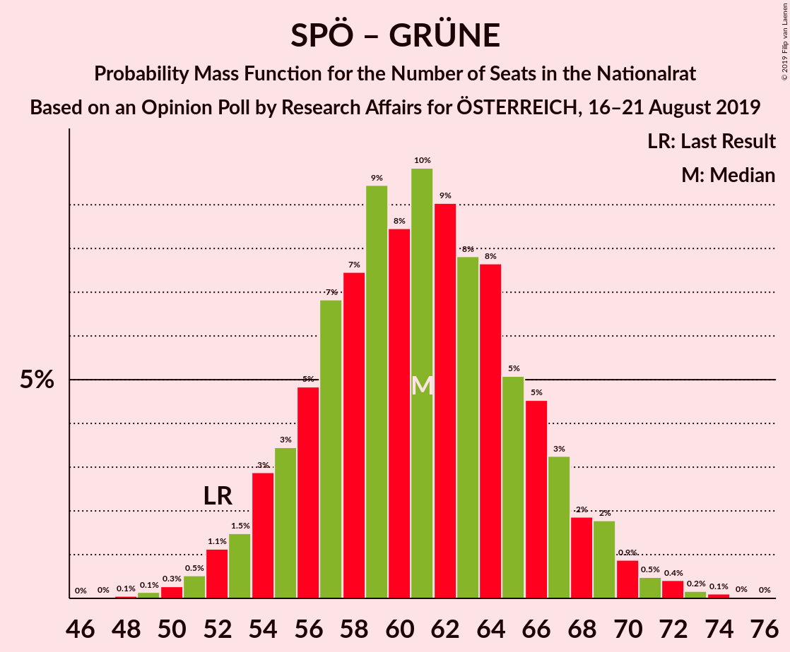

| Number of Seats | Probability | Accumulated | Special Marks |
|:---------------:|:-----------:|:-----------:|:-------------:|
| 48 | 0.1% | 100% |  |
| 49 | 0.1% | 99.9% |  |
| 50 | 0.3% | 99.8% |  |
| 51 | 0.5% | 99.5% |  |
| 52 | 1.1% | 99.0% | Last Result |
| 53 | 1.5% | 98% |  |
| 54 | 3% | 96% |  |
| 55 | 3% | 93% |  |
| 56 | 5% | 90% |  |
| 57 | 7% | 85% |  |
| 58 | 7% | 78% |  |
| 59 | 9% | 71% |  |
| 60 | 8% | 61% |  |
| 61 | 10% | 53% | Median |
| 62 | 9% | 43% |  |
| 63 | 8% | 34% |  |
| 64 | 8% | 26% |  |
| 65 | 5% | 19% |  |
| 66 | 5% | 14% |  |
| 67 | 3% | 9% |  |
| 68 | 2% | 6% |  |
| 69 | 2% | 4% |  |
| 70 | 0.9% | 2% |  |
| 71 | 0.5% | 1.2% |  |
| 72 | 0.4% | 0.8% |  |
| 73 | 0.2% | 0.3% |  |
| 74 | 0.1% | 0.2% |  |
| 75 | 0% | 0.1% |  |
| 76 | 0% | 0% |  |

### Sozialdemokratische Partei Österreichs

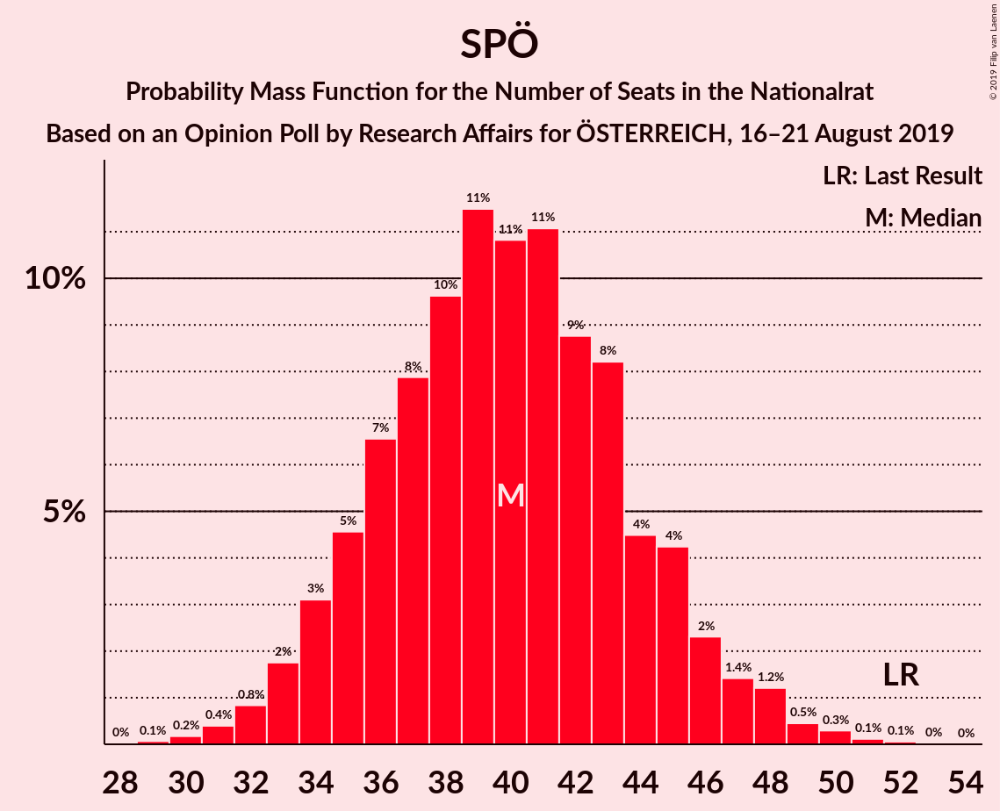

| Number of Seats | Probability | Accumulated | Special Marks |
|:---------------:|:-----------:|:-----------:|:-------------:|
| 29 | 0.1% | 100% |  |
| 30 | 0.2% | 99.9% |  |
| 31 | 0.4% | 99.7% |  |
| 32 | 0.8% | 99.3% |  |
| 33 | 2% | 98.5% |  |
| 34 | 3% | 97% |  |
| 35 | 5% | 94% |  |
| 36 | 6% | 89% |  |
| 37 | 8% | 82% |  |
| 38 | 10% | 74% |  |
| 39 | 11% | 65% |  |
| 40 | 11% | 53% | Median |
| 41 | 10% | 42% |  |
| 42 | 9% | 32% |  |
| 43 | 8% | 23% |  |
| 44 | 5% | 15% |  |
| 45 | 4% | 10% |  |
| 46 | 2% | 6% |  |
| 47 | 2% | 4% |  |
| 48 | 1.0% | 2% |  |
| 49 | 0.5% | 1.0% |  |
| 50 | 0.3% | 0.5% |  |
| 51 | 0.1% | 0.2% |  |
| 52 | 0.1% | 0.1% | Last Result |
| 53 | 0% | 0% |  |

## Technical Information

### Opinion Poll

+ **Polling firm:** Research Affairs
+ **Commissioner(s):** ÖSTERREICH
+ **Fieldwork period:** 16–21 August 2019

### Calculations

+ **Sample size:** 505
+ **Simulations done:** 1,048,576
+ **Error estimate:** 0.93%

