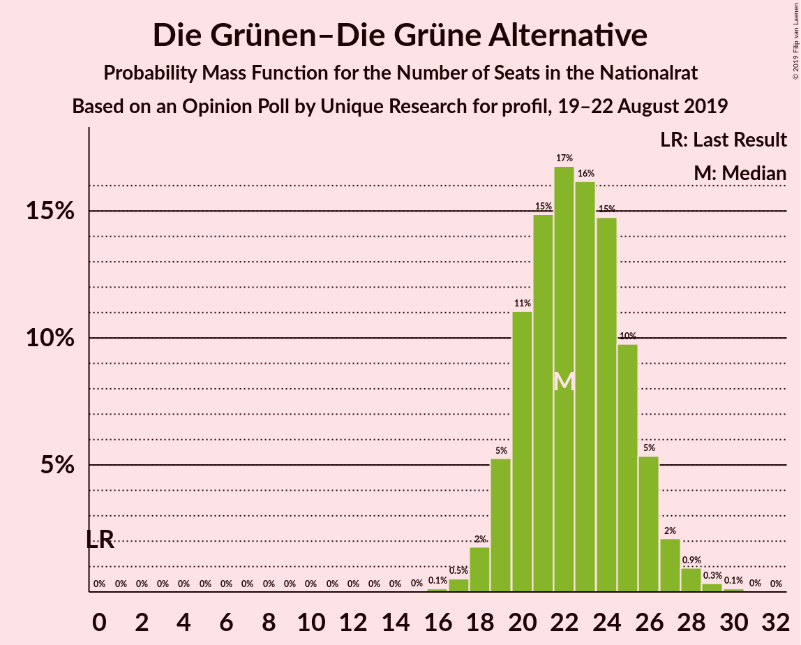
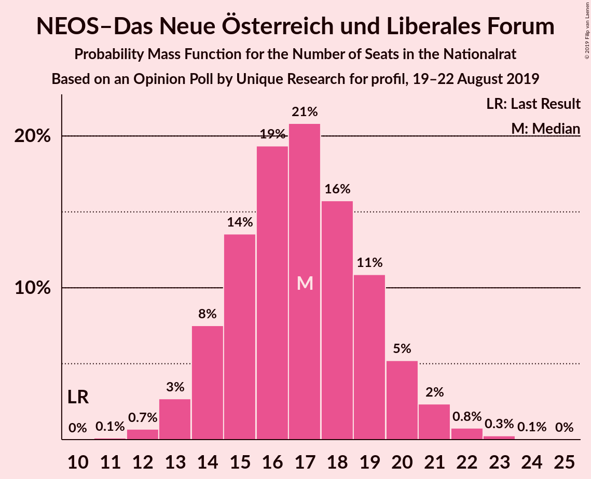
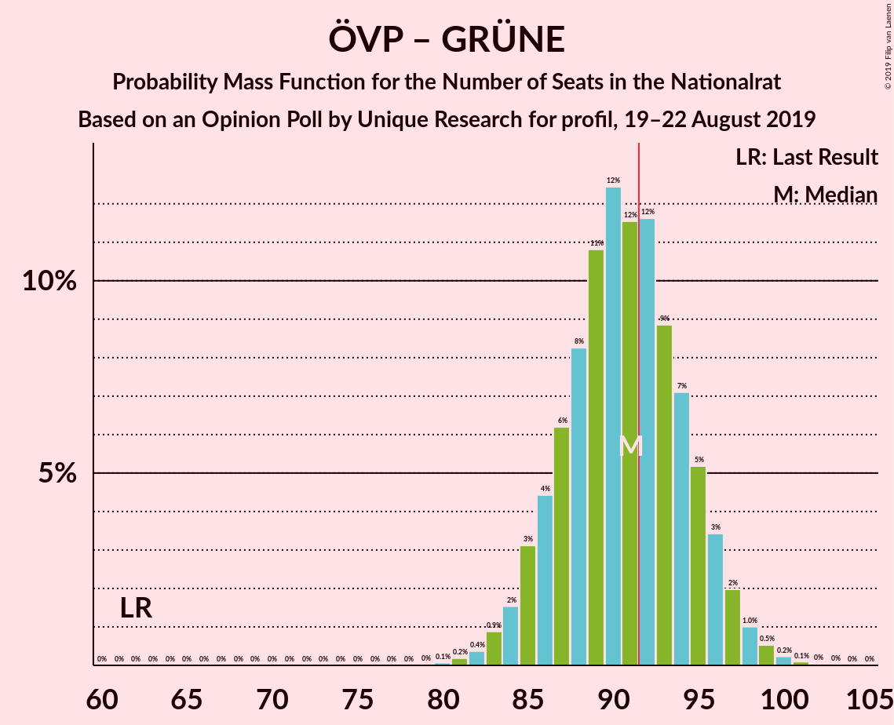
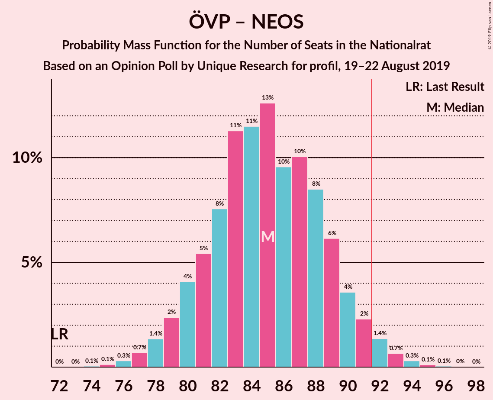
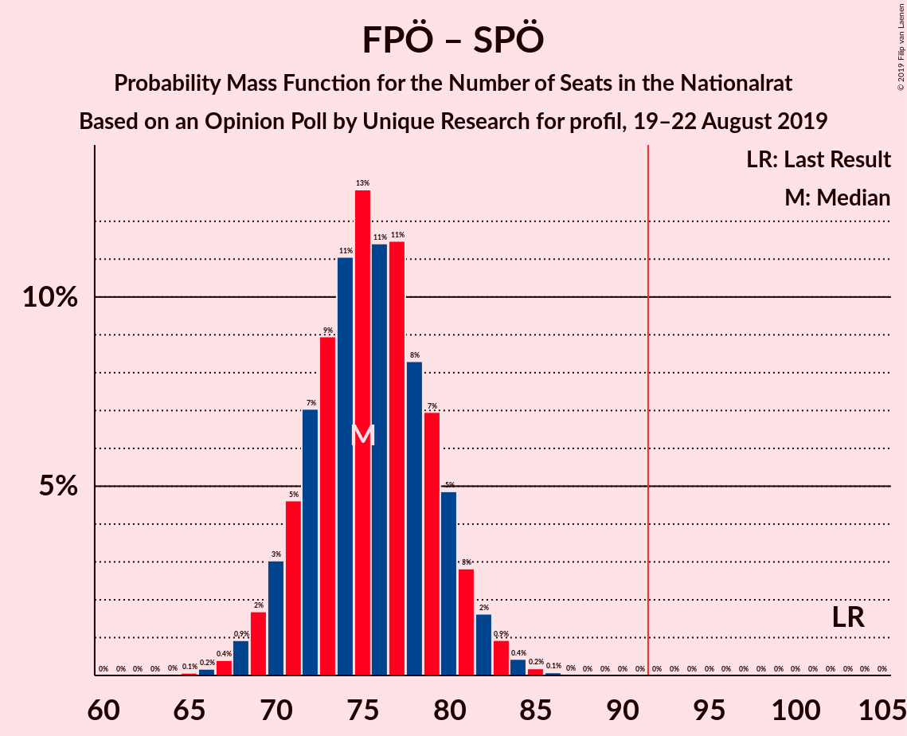
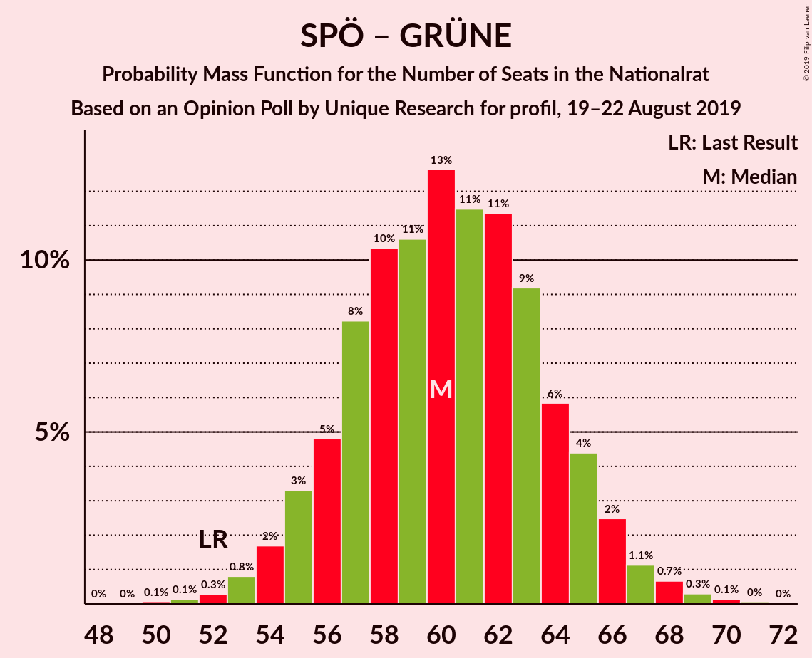

# Opinion Poll by Unique Research for profil, 19–22 August 2019

<a href="#voting-intentions">Voting Intentions</a> | <a href="#seats">Seats</a> | <a href="#coalitions">Coalitions</a> | <a href="#technical-information">Technical Information</a>

## Voting Intentions

### Confidence Intervals

| Party | Last Result | Poll Result | 80% Confidence Interval | 90% Confidence Interval | 95% Confidence Interval | 99% Confidence Interval |
|:-----:|:-----------:|:-----------:|:-----------------------:|:-----------------------:|:-----------------------:|:-----------------------:|
| Österreichische Volkspartei | 31.5% | 36.0% | 33.9–38.2% |33.3–38.9% |32.7–39.4% |31.7–40.5% |
| Sozialdemokratische Partei Österreichs | 26.9% | 20.0% | 18.3–21.9% |17.8–22.5% |17.4–22.9% |16.6–23.9% |
| Freiheitliche Partei Österreichs | 26.0% | 20.0% | 18.3–21.9% |17.8–22.5% |17.4–22.9% |16.6–23.9% |
| Die Grünen–Die Grüne Alternative | 3.8% | 12.0% | 10.6–13.6% |10.2–14.1% |9.9–14.4% |9.3–15.2% |
| NEOS–Das Neue Österreich und Liberales Forum | 5.3% | 9.0% | 7.8–10.4% |7.5–10.8% |7.2–11.2% |6.7–11.9% |
| JETZT–Liste Pilz | 4.4% | 1.0% | 0.7–1.6% |0.6–1.8% |0.5–2.0% |0.4–2.3% |

*Note:* The poll result column reflects the actual value used in the calculations. Published results may vary slightly, and in addition be rounded to fewer digits.

## Seats

### Confidence Intervals

| Party | Last Result | Median | 80% Confidence Interval | 90% Confidence Interval | 95% Confidence Interval | 99% Confidence Interval |
|:-----:|:-----------:|:------:|:-----------------------:|:-----------------------:|:-----------------------:|:-----------------------:|
| <a href="#österreichische-volkspartei">Österreichische Volkspartei</a> | 62 | 68 | 64–72 |63–73 |62–74 |60–77 |
| <a href="#sozialdemokratische-partei-österreichs">Sozialdemokratische Partei Österreichs</a> | 52 | 38 | 34–41 |34–42 |33–43 |31–45 |
| <a href="#freiheitliche-partei-österreichs">Freiheitliche Partei Österreichs</a> | 51 | 37 | 35–42 |33–42 |32–43 |31–45 |
| <a href="#die-grünen–die-grüne-alternative">Die Grünen–Die Grüne Alternative</a> | 0 | 23 | 20–26 |19–26 |19–27 |17–29 |
| <a href="#neos–das-neue-österreich-und-liberales-forum">NEOS–Das Neue Österreich und Liberales Forum</a> | 10 | 17 | 14–19 |14–20 |13–21 |12–22 |
| <a href="#jetzt–liste-pilz">JETZT–Liste Pilz</a> | 8 | 0 | 0 |0 |0 |0 |

### Österreichische Volkspartei

*For a full overview of the results for this party, see the [Österreichische Volkspartei](party-österreichischevolkspartei.html) page.*

| Number of Seats | Probability | Accumulated | Special Marks |
|:---------------:|:-----------:|:-----------:|:-------------:|
| 58 | 0.1% | 100% |  |
| 59 | 0.2% | 99.9% |  |
| 60 | 0.4% | 99.7% |  |
| 61 | 1.2% | 99.3% |  |
| 62 | 2% | 98% | Last Result |
| 63 | 4% | 96% |  |
| 64 | 5% | 92% |  |
| 65 | 6% | 87% |  |
| 66 | 11% | 80% |  |
| 67 | 13% | 69% |  |
| 68 | 11% | 56% | Median |
| 69 | 12% | 45% |  |
| 70 | 12% | 32% |  |
| 71 | 7% | 21% |  |
| 72 | 5% | 14% |  |
| 73 | 4% | 8% |  |
| 74 | 2% | 4% |  |
| 75 | 1.3% | 2% |  |
| 76 | 0.4% | 1.0% |  |
| 77 | 0.4% | 0.6% |  |
| 78 | 0.1% | 0.2% |  |
| 79 | 0% | 0.1% |  |
| 80 | 0% | 0% |  |

### Sozialdemokratische Partei Österreichs

*For a full overview of the results for this party, see the [Sozialdemokratische Partei Österreichs](party-sozialdemokratischeparteiösterreichs.html) page.*

| Number of Seats | Probability | Accumulated | Special Marks |
|:---------------:|:-----------:|:-----------:|:-------------:|
| 29 | 0.1% | 100% |  |
| 30 | 0.1% | 99.9% |  |
| 31 | 0.6% | 99.8% |  |
| 32 | 1.4% | 99.2% |  |
| 33 | 3% | 98% |  |
| 34 | 6% | 95% |  |
| 35 | 8% | 89% |  |
| 36 | 11% | 81% |  |
| 37 | 17% | 70% |  |
| 38 | 14% | 53% | Median |
| 39 | 17% | 39% |  |
| 40 | 8% | 23% |  |
| 41 | 7% | 15% |  |
| 42 | 4% | 8% |  |
| 43 | 3% | 4% |  |
| 44 | 1.0% | 2% |  |
| 45 | 0.5% | 0.8% |  |
| 46 | 0.2% | 0.3% |  |
| 47 | 0.1% | 0.1% |  |
| 48 | 0% | 0% |  |
| 49 | 0% | 0% |  |
| 50 | 0% | 0% |  |
| 51 | 0% | 0% |  |
| 52 | 0% | 0% | Last Result |

### Freiheitliche Partei Österreichs

*For a full overview of the results for this party, see the [Freiheitliche Partei Österreichs](party-freiheitlicheparteiösterreichs.html) page.*

| Number of Seats | Probability | Accumulated | Special Marks |
|:---------------:|:-----------:|:-----------:|:-------------:|
| 30 | 0.1% | 100% |  |
| 31 | 0.7% | 99.8% |  |
| 32 | 2% | 99.1% |  |
| 33 | 3% | 97% |  |
| 34 | 4% | 95% |  |
| 35 | 7% | 90% |  |
| 36 | 16% | 83% |  |
| 37 | 19% | 67% | Median |
| 38 | 12% | 49% |  |
| 39 | 12% | 36% |  |
| 40 | 7% | 24% |  |
| 41 | 6% | 17% |  |
| 42 | 7% | 11% |  |
| 43 | 2% | 4% |  |
| 44 | 0.8% | 1.5% |  |
| 45 | 0.4% | 0.7% |  |
| 46 | 0.2% | 0.3% |  |
| 47 | 0.1% | 0.1% |  |
| 48 | 0% | 0% |  |
| 49 | 0% | 0% |  |
| 50 | 0% | 0% |  |
| 51 | 0% | 0% | Last Result |

### Die Grünen–Die Grüne Alternative

*For a full overview of the results for this party, see the [Die Grünen–Die Grüne Alternative](party-diegrünen–diegrünealternative.html) page.*

| Number of Seats | Probability | Accumulated | Special Marks |
|:---------------:|:-----------:|:-----------:|:-------------:|
| 0 | 0% | 100% | Last Result |
| 1 | 0% | 100% |  |
| 2 | 0% | 100% |  |
| 3 | 0% | 100% |  |
| 4 | 0% | 100% |  |
| 5 | 0% | 100% |  |
| 6 | 0% | 100% |  |
| 7 | 0% | 100% |  |
| 8 | 0% | 100% |  |
| 9 | 0% | 100% |  |
| 10 | 0% | 100% |  |
| 11 | 0% | 100% |  |
| 12 | 0% | 100% |  |
| 13 | 0% | 100% |  |
| 14 | 0% | 100% |  |
| 15 | 0% | 100% |  |
| 16 | 0% | 100% |  |
| 17 | 0.7% | 99.9% |  |
| 18 | 2% | 99.3% |  |
| 19 | 4% | 98% |  |
| 20 | 12% | 93% |  |
| 21 | 19% | 81% |  |
| 22 | 8% | 62% |  |
| 23 | 24% | 54% | Median |
| 24 | 11% | 30% |  |
| 25 | 9% | 19% |  |
| 26 | 7% | 10% |  |
| 27 | 2% | 3% |  |
| 28 | 1.0% | 2% |  |
| 29 | 0.5% | 0.6% |  |
| 30 | 0.1% | 0.1% |  |
| 31 | 0% | 0% |  |

### NEOS–Das Neue Österreich und Liberales Forum

*For a full overview of the results for this party, see the [NEOS–Das Neue Österreich und Liberales Forum](party-neos–dasneueösterreichundliberalesforum.html) page.*

| Number of Seats | Probability | Accumulated | Special Marks |
|:---------------:|:-----------:|:-----------:|:-------------:|
| 10 | 0% | 100% | Last Result |
| 11 | 0.1% | 100% |  |
| 12 | 0.9% | 99.9% |  |
| 13 | 2% | 99.0% |  |
| 14 | 9% | 97% |  |
| 15 | 12% | 88% |  |
| 16 | 18% | 76% |  |
| 17 | 24% | 59% | Median |
| 18 | 14% | 34% |  |
| 19 | 13% | 20% |  |
| 20 | 3% | 7% |  |
| 21 | 3% | 4% |  |
| 22 | 0.6% | 0.9% |  |
| 23 | 0.3% | 0.4% |  |
| 24 | 0.1% | 0.1% |  |
| 25 | 0% | 0% |  |

### JETZT–Liste Pilz

*For a full overview of the results for this party, see the [JETZT–Liste Pilz](party-jetzt–listepilz.html) page.*

| Number of Seats | Probability | Accumulated | Special Marks |
|:---------------:|:-----------:|:-----------:|:-------------:|
| 0 | 100% | 100% | Median |
| 1 | 0% | 0% |  |
| 2 | 0% | 0% |  |
| 3 | 0% | 0% |  |
| 4 | 0% | 0% |  |
| 5 | 0% | 0% |  |
| 6 | 0% | 0% |  |
| 7 | 0% | 0% |  |
| 8 | 0% | 0% | Last Result |

## Coalitions

### Confidence Intervals

| Coalition | Last Result | Median | Majority? | 80% Confidence Interval | 90% Confidence Interval | 95% Confidence Interval | 99% Confidence Interval |
|:---------:|:-----------:|:------:|:---------:|:-----------------------:|:-----------------------:|:-----------------------:|:-----------------------:|
| Österreichische Volkspartei – Die Grünen–Die Grüne Alternative – NEOS–Das Neue Österreich und Liberales Forum | 72 | 108 | 100% | 103–112 | 102–113 | 101–114 | 99–116 |
| Österreichische Volkspartei – Freiheitliche Partei Österreichs | 113 | 106 | 100% | 102–110 | 101–111 | 99–112 | 97–114 |
| Österreichische Volkspartei – Sozialdemokratische Partei Österreichs | 114 | 106 | 100% | 102–110 | 100–111 | 99–112 | 98–114 |
| Österreichische Volkspartei – Die Grünen–Die Grüne Alternative | 62 | 90 | 36% | 86–95 | 85–96 | 84–97 | 82–99 |
| Österreichische Volkspartei – NEOS–Das Neue Österreich und Liberales Forum | 72 | 85 | 3% | 80–89 | 79–90 | 79–92 | 76–93 |
| Sozialdemokratische Partei Österreichs – Die Grünen–Die Grüne Alternative – NEOS–Das Neue Österreich und Liberales Forum | 62 | 77 | 0% | 73–81 | 72–82 | 71–84 | 69–86 |
| Freiheitliche Partei Österreichs – Sozialdemokratische Partei Österreichs | 103 | 75 | 0% | 71–80 | 70–81 | 69–82 | 67–84 |
| Österreichische Volkspartei | 62 | 68 | 0% | 64–72 | 63–73 | 62–74 | 60–77 |
| Sozialdemokratische Partei Österreichs – Die Grünen–Die Grüne Alternative | 52 | 60 | 0% | 56–64 | 55–66 | 55–66 | 53–68 |
| Sozialdemokratische Partei Österreichs | 52 | 38 | 0% | 34–41 | 34–42 | 33–43 | 31–45 |

### Österreichische Volkspartei – Die Grünen–Die Grüne Alternative – NEOS–Das Neue Österreich und Liberales Forum

| Number of Seats | Probability | Accumulated | Special Marks |
|:---------------:|:-----------:|:-----------:|:-------------:|
| 72 | 0% | 100% | Last Result |
| 73 | 0% | 100% |  |
| 74 | 0% | 100% |  |
| 75 | 0% | 100% |  |
| 76 | 0% | 100% |  |
| 77 | 0% | 100% |  |
| 78 | 0% | 100% |  |
| 79 | 0% | 100% |  |
| 80 | 0% | 100% |  |
| 81 | 0% | 100% |  |
| 82 | 0% | 100% |  |
| 83 | 0% | 100% |  |
| 84 | 0% | 100% |  |
| 85 | 0% | 100% |  |
| 86 | 0% | 100% |  |
| 87 | 0% | 100% |  |
| 88 | 0% | 100% |  |
| 89 | 0% | 100% |  |
| 90 | 0% | 100% |  |
| 91 | 0% | 100% |  |
| 92 | 0% | 100% | Majority |
| 93 | 0% | 100% |  |
| 94 | 0% | 100% |  |
| 95 | 0% | 100% |  |
| 96 | 0% | 100% |  |
| 97 | 0.1% | 99.9% |  |
| 98 | 0.2% | 99.9% |  |
| 99 | 0.6% | 99.7% |  |
| 100 | 1.0% | 99.1% |  |
| 101 | 1.3% | 98% |  |
| 102 | 4% | 97% |  |
| 103 | 5% | 93% |  |
| 104 | 7% | 88% |  |
| 105 | 6% | 81% |  |
| 106 | 9% | 75% |  |
| 107 | 14% | 65% |  |
| 108 | 17% | 51% | Median |
| 109 | 9% | 34% |  |
| 110 | 9% | 25% |  |
| 111 | 4% | 16% |  |
| 112 | 4% | 11% |  |
| 113 | 4% | 7% |  |
| 114 | 2% | 3% |  |
| 115 | 0.8% | 1.3% |  |
| 116 | 0.3% | 0.5% |  |
| 117 | 0.2% | 0.3% |  |
| 118 | 0.1% | 0.1% |  |
| 119 | 0% | 0% |  |

### Österreichische Volkspartei – Freiheitliche Partei Österreichs

| Number of Seats | Probability | Accumulated | Special Marks |
|:---------------:|:-----------:|:-----------:|:-------------:|
| 95 | 0.1% | 100% |  |
| 96 | 0.1% | 99.9% |  |
| 97 | 0.4% | 99.8% |  |
| 98 | 0.5% | 99.4% |  |
| 99 | 2% | 98.9% |  |
| 100 | 2% | 97% |  |
| 101 | 3% | 95% |  |
| 102 | 6% | 92% |  |
| 103 | 7% | 86% |  |
| 104 | 15% | 78% |  |
| 105 | 10% | 63% | Median |
| 106 | 11% | 53% |  |
| 107 | 10% | 42% |  |
| 108 | 13% | 32% |  |
| 109 | 6% | 19% |  |
| 110 | 5% | 12% |  |
| 111 | 4% | 8% |  |
| 112 | 2% | 4% |  |
| 113 | 0.9% | 2% | Last Result |
| 114 | 0.5% | 1.0% |  |
| 115 | 0.3% | 0.4% |  |
| 116 | 0.1% | 0.2% |  |
| 117 | 0% | 0% |  |

### Österreichische Volkspartei – Sozialdemokratische Partei Österreichs

| Number of Seats | Probability | Accumulated | Special Marks |
|:---------------:|:-----------:|:-----------:|:-------------:|
| 95 | 0.1% | 100% |  |
| 96 | 0.1% | 99.9% |  |
| 97 | 0.2% | 99.8% |  |
| 98 | 1.1% | 99.6% |  |
| 99 | 2% | 98.5% |  |
| 100 | 2% | 97% |  |
| 101 | 4% | 95% |  |
| 102 | 8% | 91% |  |
| 103 | 8% | 83% |  |
| 104 | 6% | 75% |  |
| 105 | 12% | 69% |  |
| 106 | 19% | 57% | Median |
| 107 | 8% | 38% |  |
| 108 | 7% | 30% |  |
| 109 | 10% | 23% |  |
| 110 | 8% | 14% |  |
| 111 | 1.1% | 6% |  |
| 112 | 3% | 5% |  |
| 113 | 1.3% | 2% |  |
| 114 | 0.5% | 0.8% | Last Result |
| 115 | 0.1% | 0.3% |  |
| 116 | 0.1% | 0.2% |  |
| 117 | 0% | 0% |  |

### Österreichische Volkspartei – Die Grünen–Die Grüne Alternative

| Number of Seats | Probability | Accumulated | Special Marks |
|:---------------:|:-----------:|:-----------:|:-------------:|
| 62 | 0% | 100% | Last Result |
| 63 | 0% | 100% |  |
| 64 | 0% | 100% |  |
| 65 | 0% | 100% |  |
| 66 | 0% | 100% |  |
| 67 | 0% | 100% |  |
| 68 | 0% | 100% |  |
| 69 | 0% | 100% |  |
| 70 | 0% | 100% |  |
| 71 | 0% | 100% |  |
| 72 | 0% | 100% |  |
| 73 | 0% | 100% |  |
| 74 | 0% | 100% |  |
| 75 | 0% | 100% |  |
| 76 | 0% | 100% |  |
| 77 | 0% | 100% |  |
| 78 | 0% | 100% |  |
| 79 | 0% | 100% |  |
| 80 | 0.1% | 100% |  |
| 81 | 0.2% | 99.9% |  |
| 82 | 0.4% | 99.7% |  |
| 83 | 0.8% | 99.3% |  |
| 84 | 2% | 98.5% |  |
| 85 | 3% | 97% |  |
| 86 | 5% | 94% |  |
| 87 | 6% | 89% |  |
| 88 | 6% | 83% |  |
| 89 | 10% | 77% |  |
| 90 | 18% | 67% |  |
| 91 | 13% | 49% | Median |
| 92 | 12% | 36% | Majority |
| 93 | 5% | 24% |  |
| 94 | 6% | 19% |  |
| 95 | 5% | 13% |  |
| 96 | 4% | 8% |  |
| 97 | 3% | 4% |  |
| 98 | 0.7% | 1.4% |  |
| 99 | 0.4% | 0.7% |  |
| 100 | 0.2% | 0.3% |  |
| 101 | 0.1% | 0.1% |  |
| 102 | 0% | 0.1% |  |
| 103 | 0% | 0% |  |

### Österreichische Volkspartei – NEOS–Das Neue Österreich und Liberales Forum

| Number of Seats | Probability | Accumulated | Special Marks |
|:---------------:|:-----------:|:-----------:|:-------------:|
| 72 | 0% | 100% | Last Result |
| 73 | 0% | 100% |  |
| 74 | 0.1% | 100% |  |
| 75 | 0.2% | 99.9% |  |
| 76 | 0.3% | 99.7% |  |
| 77 | 0.5% | 99.5% |  |
| 78 | 1.4% | 99.0% |  |
| 79 | 4% | 98% |  |
| 80 | 5% | 94% |  |
| 81 | 4% | 89% |  |
| 82 | 5% | 85% |  |
| 83 | 12% | 81% |  |
| 84 | 17% | 69% |  |
| 85 | 13% | 52% | Median |
| 86 | 4% | 39% |  |
| 87 | 10% | 35% |  |
| 88 | 11% | 24% |  |
| 89 | 8% | 14% |  |
| 90 | 2% | 6% |  |
| 91 | 1.4% | 4% |  |
| 92 | 1.5% | 3% | Majority |
| 93 | 1.1% | 2% |  |
| 94 | 0.3% | 0.4% |  |
| 95 | 0% | 0.1% |  |
| 96 | 0% | 0.1% |  |
| 97 | 0% | 0% |  |

### Sozialdemokratische Partei Österreichs – Die Grünen–Die Grüne Alternative – NEOS–Das Neue Österreich und Liberales Forum

| Number of Seats | Probability | Accumulated | Special Marks |
|:---------------:|:-----------:|:-----------:|:-------------:|
| 62 | 0% | 100% | Last Result |
| 63 | 0% | 100% |  |
| 64 | 0% | 100% |  |
| 65 | 0% | 100% |  |
| 66 | 0% | 100% |  |
| 67 | 0.1% | 99.9% |  |
| 68 | 0.3% | 99.8% |  |
| 69 | 0.6% | 99.5% |  |
| 70 | 0.9% | 99.0% |  |
| 71 | 2% | 98% |  |
| 72 | 4% | 96% |  |
| 73 | 5% | 92% |  |
| 74 | 6% | 88% |  |
| 75 | 13% | 81% |  |
| 76 | 10% | 68% |  |
| 77 | 11% | 58% |  |
| 78 | 10% | 47% | Median |
| 79 | 15% | 37% |  |
| 80 | 7% | 22% |  |
| 81 | 6% | 14% |  |
| 82 | 3% | 8% |  |
| 83 | 2% | 5% |  |
| 84 | 2% | 3% |  |
| 85 | 0.5% | 1.1% |  |
| 86 | 0.4% | 0.6% |  |
| 87 | 0.1% | 0.2% |  |
| 88 | 0.1% | 0.1% |  |
| 89 | 0% | 0% |  |

### Freiheitliche Partei Österreichs – Sozialdemokratische Partei Österreichs

| Number of Seats | Probability | Accumulated | Special Marks |
|:---------------:|:-----------:|:-----------:|:-------------:|
| 65 | 0.1% | 100% |  |
| 66 | 0.2% | 99.9% |  |
| 67 | 0.3% | 99.7% |  |
| 68 | 0.8% | 99.5% |  |
| 69 | 2% | 98.7% |  |
| 70 | 4% | 97% |  |
| 71 | 4% | 93% |  |
| 72 | 4% | 89% |  |
| 73 | 9% | 84% |  |
| 74 | 9% | 75% |  |
| 75 | 17% | 66% | Median |
| 76 | 14% | 49% |  |
| 77 | 9% | 35% |  |
| 78 | 6% | 25% |  |
| 79 | 7% | 19% |  |
| 80 | 5% | 12% |  |
| 81 | 4% | 7% |  |
| 82 | 1.3% | 3% |  |
| 83 | 1.0% | 2% |  |
| 84 | 0.6% | 0.8% |  |
| 85 | 0.2% | 0.3% |  |
| 86 | 0.1% | 0.1% |  |
| 87 | 0% | 0.1% |  |
| 88 | 0% | 0% |  |
| 89 | 0% | 0% |  |
| 90 | 0% | 0% |  |
| 91 | 0% | 0% |  |
| 92 | 0% | 0% | Majority |
| 93 | 0% | 0% |  |
| 94 | 0% | 0% |  |
| 95 | 0% | 0% |  |
| 96 | 0% | 0% |  |
| 97 | 0% | 0% |  |
| 98 | 0% | 0% |  |
| 99 | 0% | 0% |  |
| 100 | 0% | 0% |  |
| 101 | 0% | 0% |  |
| 102 | 0% | 0% |  |
| 103 | 0% | 0% | Last Result |

### Österreichische Volkspartei

| Number of Seats | Probability | Accumulated | Special Marks |
|:---------------:|:-----------:|:-----------:|:-------------:|
| 58 | 0.1% | 100% |  |
| 59 | 0.2% | 99.9% |  |
| 60 | 0.4% | 99.7% |  |
| 61 | 1.2% | 99.3% |  |
| 62 | 2% | 98% | Last Result |
| 63 | 4% | 96% |  |
| 64 | 5% | 92% |  |
| 65 | 6% | 87% |  |
| 66 | 11% | 80% |  |
| 67 | 13% | 69% |  |
| 68 | 11% | 56% | Median |
| 69 | 12% | 45% |  |
| 70 | 12% | 32% |  |
| 71 | 7% | 21% |  |
| 72 | 5% | 14% |  |
| 73 | 4% | 8% |  |
| 74 | 2% | 4% |  |
| 75 | 1.3% | 2% |  |
| 76 | 0.4% | 1.0% |  |
| 77 | 0.4% | 0.6% |  |
| 78 | 0.1% | 0.2% |  |
| 79 | 0% | 0.1% |  |
| 80 | 0% | 0% |  |

### Sozialdemokratische Partei Österreichs – Die Grünen–Die Grüne Alternative

| Number of Seats | Probability | Accumulated | Special Marks |
|:---------------:|:-----------:|:-----------:|:-------------:|
| 51 | 0.2% | 100% |  |
| 52 | 0.3% | 99.8% | Last Result |
| 53 | 0.7% | 99.5% |  |
| 54 | 1.2% | 98.8% |  |
| 55 | 4% | 98% |  |
| 56 | 5% | 93% |  |
| 57 | 5% | 88% |  |
| 58 | 14% | 83% |  |
| 59 | 10% | 69% |  |
| 60 | 11% | 59% |  |
| 61 | 11% | 48% | Median |
| 62 | 15% | 38% |  |
| 63 | 9% | 23% |  |
| 64 | 4% | 13% |  |
| 65 | 4% | 10% |  |
| 66 | 4% | 6% |  |
| 67 | 0.9% | 2% |  |
| 68 | 0.6% | 1.1% |  |
| 69 | 0.2% | 0.5% |  |
| 70 | 0.2% | 0.2% |  |
| 71 | 0% | 0.1% |  |
| 72 | 0% | 0% |  |

### Sozialdemokratische Partei Österreichs

| Number of Seats | Probability | Accumulated | Special Marks |
|:---------------:|:-----------:|:-----------:|:-------------:|
| 29 | 0.1% | 100% |  |
| 30 | 0.1% | 99.9% |  |
| 31 | 0.6% | 99.8% |  |
| 32 | 1.4% | 99.2% |  |
| 33 | 3% | 98% |  |
| 34 | 6% | 95% |  |
| 35 | 8% | 89% |  |
| 36 | 11% | 81% |  |
| 37 | 17% | 70% |  |
| 38 | 14% | 53% | Median |
| 39 | 17% | 39% |  |
| 40 | 8% | 23% |  |
| 41 | 7% | 15% |  |
| 42 | 4% | 8% |  |
| 43 | 3% | 4% |  |
| 44 | 1.0% | 2% |  |
| 45 | 0.5% | 0.8% |  |
| 46 | 0.2% | 0.3% |  |
| 47 | 0.1% | 0.1% |  |
| 48 | 0% | 0% |  |
| 49 | 0% | 0% |  |
| 50 | 0% | 0% |  |
| 51 | 0% | 0% |  |
| 52 | 0% | 0% | Last Result |

## Technical Information

### Opinion Poll

+ **Polling firm:** Unique Research
+ **Commissioner(s):** profil
+ **Fieldwork period:** 19–22 August 2019

### Calculations

+ **Sample size:** 800
+ **Simulations done:** 131,072
+ **Error estimate:** 0.99%

