# Opinion Poll by Karmasin for PULS 24, 5–10 September 2019

<a href="#voting-intentions">Voting Intentions</a> | <a href="#seats">Seats</a> | <a href="#coalitions">Coalitions</a> | <a href="#technical-information">Technical Information</a>

## Voting Intentions

### Confidence Intervals

| Party | Last Result | Poll Result | 80% Confidence Interval | 90% Confidence Interval | 95% Confidence Interval | 99% Confidence Interval |
|:-----:|:-----------:|:-----------:|:-----------------------:|:-----------------------:|:-----------------------:|:-----------------------:|
| Österreichische Volkspartei | 31.5% | 35.0% | 33.9–36.1% |33.6–36.5% |33.3–36.7% |32.8–37.3% |
| Sozialdemokratische Partei Österreichs | 26.9% | 22.0% | 21.0–23.0% |20.8–23.3% |20.5–23.5% |20.1–24.0% |
| Freiheitliche Partei Österreichs | 26.0% | 19.0% | 18.1–20.0% |17.8–20.2% |17.6–20.5% |17.2–20.9% |
| Die Grünen–Die Grüne Alternative | 3.8% | 12.0% | 11.3–12.8% |11.1–13.0% |10.9–13.2% |10.5–13.6% |
| NEOS–Das Neue Österreich und Liberales Forum | 5.3% | 9.0% | 8.4–9.7% |8.2–9.9% |8.0–10.1% |7.7–10.4% |
| JETZT–Liste Pilz | 4.4% | 2.0% | 1.7–2.4% |1.6–2.5% |1.6–2.6% |1.4–2.8% |

*Note:* The poll result column reflects the actual value used in the calculations. Published results may vary slightly, and in addition be rounded to fewer digits.

## Seats

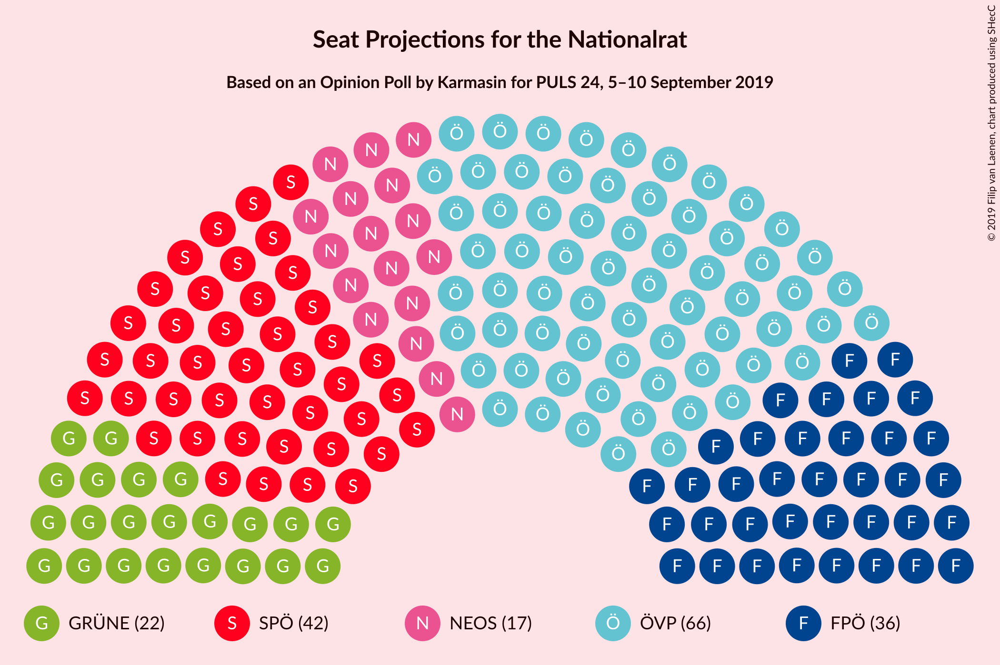

### Confidence Intervals

| Party | Last Result | Median | 80% Confidence Interval | 90% Confidence Interval | 95% Confidence Interval | 99% Confidence Interval |
|:-----:|:-----------:|:------:|:-----------------------:|:-----------------------:|:-----------------------:|:-----------------------:|
| <a href="#österreichische-volkspartei">Österreichische Volkspartei</a> | 62 | 66 | 64–68 |64–69 |63–70 |62–71 |
| <a href="#sozialdemokratische-partei-österreichs">Sozialdemokratische Partei Österreichs</a> | 52 | 41 | 40–43 |39–44 |39–44 |38–45 |
| <a href="#freiheitliche-partei-österreichs">Freiheitliche Partei Österreichs</a> | 51 | 36 | 34–38 |34–38 |33–39 |32–39 |
| <a href="#die-grünen–die-grüne-alternative">Die Grünen–Die Grüne Alternative</a> | 0 | 23 | 21–24 |21–24 |20–25 |20–26 |
| <a href="#neos–das-neue-österreich-und-liberales-forum">NEOS–Das Neue Österreich und Liberales Forum</a> | 10 | 17 | 16–18 |15–18 |15–19 |14–19 |
| <a href="#jetzt–liste-pilz">JETZT–Liste Pilz</a> | 8 | 0 | 0 |0 |0 |0 |

### Österreichische Volkspartei

*For a full overview of the results for this party, see the [Österreichische Volkspartei](party-österreichischevolkspartei.html) page.*

| Number of Seats | Probability | Accumulated | Special Marks |
|:---------------:|:-----------:|:-----------:|:-------------:|
| 61 | 0.1% | 100% |  |
| 62 | 0.7% | 99.9% | Last Result |
| 63 | 4% | 99.2% |  |
| 64 | 8% | 96% |  |
| 65 | 20% | 88% |  |
| 66 | 22% | 68% | Median |
| 67 | 24% | 46% |  |
| 68 | 13% | 22% |  |
| 69 | 6% | 9% |  |
| 70 | 2% | 3% |  |
| 71 | 0.5% | 0.7% |  |
| 72 | 0.1% | 0.1% |  |
| 73 | 0% | 0% |  |

### Sozialdemokratische Partei Österreichs

*For a full overview of the results for this party, see the [Sozialdemokratische Partei Österreichs](party-sozialdemokratischeparteiösterreichs.html) page.*

| Number of Seats | Probability | Accumulated | Special Marks |
|:---------------:|:-----------:|:-----------:|:-------------:|
| 37 | 0.2% | 100% |  |
| 38 | 1.2% | 99.8% |  |
| 39 | 6% | 98.6% |  |
| 40 | 17% | 92% |  |
| 41 | 25% | 75% | Median |
| 42 | 23% | 49% |  |
| 43 | 16% | 26% |  |
| 44 | 7% | 10% |  |
| 45 | 2% | 2% |  |
| 46 | 0.4% | 0.4% |  |
| 47 | 0% | 0% |  |
| 48 | 0% | 0% |  |
| 49 | 0% | 0% |  |
| 50 | 0% | 0% |  |
| 51 | 0% | 0% |  |
| 52 | 0% | 0% | Last Result |

### Freiheitliche Partei Österreichs

*For a full overview of the results for this party, see the [Freiheitliche Partei Österreichs](party-freiheitlicheparteiösterreichs.html) page.*

| Number of Seats | Probability | Accumulated | Special Marks |
|:---------------:|:-----------:|:-----------:|:-------------:|
| 32 | 0.6% | 100% |  |
| 33 | 3% | 99.4% |  |
| 34 | 13% | 96% |  |
| 35 | 22% | 83% |  |
| 36 | 29% | 62% | Median |
| 37 | 23% | 33% |  |
| 38 | 7% | 10% |  |
| 39 | 3% | 3% |  |
| 40 | 0.4% | 0.5% |  |
| 41 | 0.1% | 0.1% |  |
| 42 | 0% | 0% |  |
| 43 | 0% | 0% |  |
| 44 | 0% | 0% |  |
| 45 | 0% | 0% |  |
| 46 | 0% | 0% |  |
| 47 | 0% | 0% |  |
| 48 | 0% | 0% |  |
| 49 | 0% | 0% |  |
| 50 | 0% | 0% |  |
| 51 | 0% | 0% | Last Result |

### Die Grünen–Die Grüne Alternative

*For a full overview of the results for this party, see the [Die Grünen–Die Grüne Alternative](party-diegrünen–diegrünealternative.html) page.*

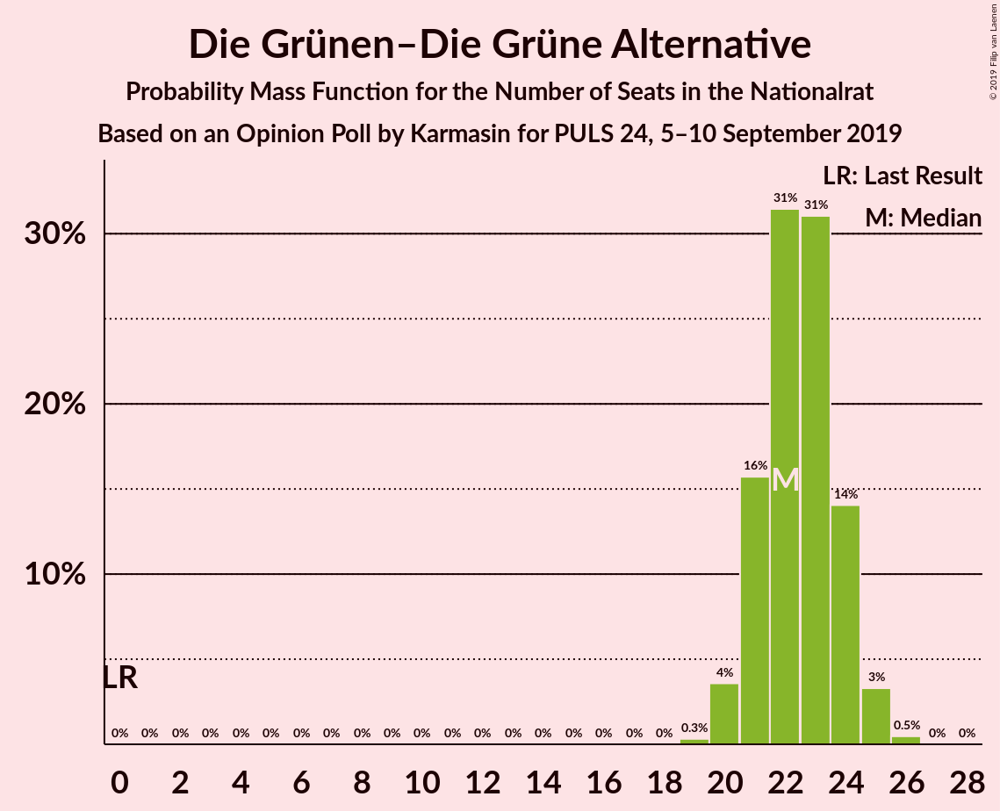

| Number of Seats | Probability | Accumulated | Special Marks |
|:---------------:|:-----------:|:-----------:|:-------------:|
| 0 | 0% | 100% | Last Result |
| 1 | 0% | 100% |  |
| 2 | 0% | 100% |  |
| 3 | 0% | 100% |  |
| 4 | 0% | 100% |  |
| 5 | 0% | 100% |  |
| 6 | 0% | 100% |  |
| 7 | 0% | 100% |  |
| 8 | 0% | 100% |  |
| 9 | 0% | 100% |  |
| 10 | 0% | 100% |  |
| 11 | 0% | 100% |  |
| 12 | 0% | 100% |  |
| 13 | 0% | 100% |  |
| 14 | 0% | 100% |  |
| 15 | 0% | 100% |  |
| 16 | 0% | 100% |  |
| 17 | 0% | 100% |  |
| 18 | 0% | 100% |  |
| 19 | 0.3% | 100% |  |
| 20 | 4% | 99.7% |  |
| 21 | 16% | 96% |  |
| 22 | 28% | 80% |  |
| 23 | 36% | 52% | Median |
| 24 | 12% | 16% |  |
| 25 | 3% | 4% |  |
| 26 | 0.7% | 0.7% |  |
| 27 | 0% | 0% |  |

### NEOS–Das Neue Österreich und Liberales Forum

*For a full overview of the results for this party, see the [NEOS–Das Neue Österreich und Liberales Forum](party-neos–dasneueösterreichundliberalesforum.html) page.*

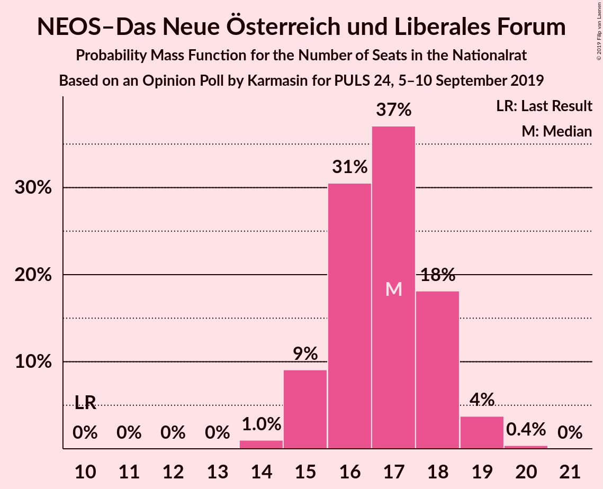

| Number of Seats | Probability | Accumulated | Special Marks |
|:---------------:|:-----------:|:-----------:|:-------------:|
| 10 | 0% | 100% | Last Result |
| 11 | 0% | 100% |  |
| 12 | 0% | 100% |  |
| 13 | 0% | 100% |  |
| 14 | 1.1% | 100% |  |
| 15 | 9% | 98.9% |  |
| 16 | 28% | 90% |  |
| 17 | 38% | 62% | Median |
| 18 | 20% | 24% |  |
| 19 | 3% | 4% |  |
| 20 | 0.4% | 0.4% |  |
| 21 | 0% | 0% |  |

### JETZT–Liste Pilz

*For a full overview of the results for this party, see the [JETZT–Liste Pilz](party-jetzt–listepilz.html) page.*

| Number of Seats | Probability | Accumulated | Special Marks |
|:---------------:|:-----------:|:-----------:|:-------------:|
| 0 | 100% | 100% | Median |
| 1 | 0% | 0% |  |
| 2 | 0% | 0% |  |
| 3 | 0% | 0% |  |
| 4 | 0% | 0% |  |
| 5 | 0% | 0% |  |
| 6 | 0% | 0% |  |
| 7 | 0% | 0% |  |
| 8 | 0% | 0% | Last Result |

## Coalitions

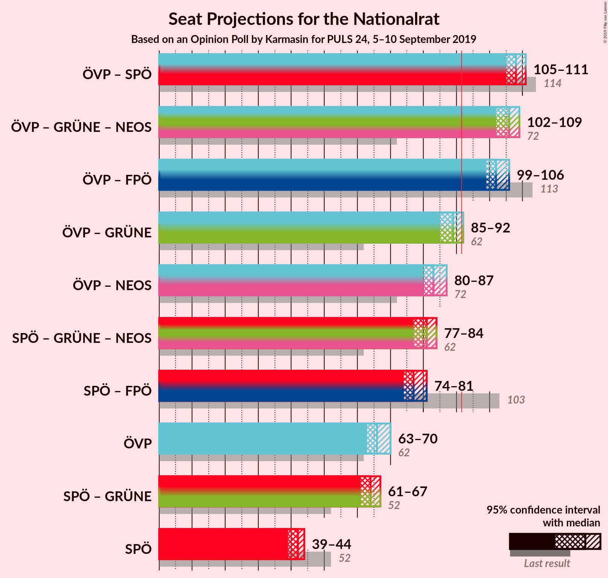

### Confidence Intervals

| Coalition | Last Result | Median | Majority? | 80% Confidence Interval | 90% Confidence Interval | 95% Confidence Interval | 99% Confidence Interval |
|:---------:|:-----------:|:------:|:---------:|:-----------------------:|:-----------------------:|:-----------------------:|:-----------------------:|
| Österreichische Volkspartei – Sozialdemokratische Partei Österreichs | 114 | 108 | 100% | 106–110 | 105–111 | 105–111 | 104–112 |
| Österreichische Volkspartei – Die Grünen–Die Grüne Alternative – NEOS–Das Neue Österreich und Liberales Forum | 72 | 106 | 100% | 103–108 | 103–108 | 102–109 | 101–110 |
| Österreichische Volkspartei – Freiheitliche Partei Österreichs | 113 | 102 | 100% | 100–104 | 99–105 | 99–106 | 98–107 |
| Österreichische Volkspartei – Die Grünen–Die Grüne Alternative | 62 | 89 | 6% | 87–91 | 86–92 | 86–92 | 84–93 |
| Österreichische Volkspartei – NEOS–Das Neue Österreich und Liberales Forum | 72 | 83 | 0% | 81–85 | 80–86 | 80–86 | 79–88 |
| Sozialdemokratische Partei Österreichs – Die Grünen–Die Grüne Alternative – NEOS–Das Neue Österreich und Liberales Forum | 62 | 81 | 0% | 79–83 | 78–84 | 77–84 | 76–85 |
| Sozialdemokratische Partei Österreichs – Freiheitliche Partei Österreichs | 103 | 77 | 0% | 75–80 | 75–80 | 74–81 | 73–82 |
| Österreichische Volkspartei | 62 | 66 | 0% | 64–68 | 64–69 | 63–70 | 62–71 |
| Sozialdemokratische Partei Österreichs – Die Grünen–Die Grüne Alternative | 52 | 64 | 0% | 62–66 | 62–67 | 61–67 | 60–68 |
| Sozialdemokratische Partei Österreichs | 52 | 41 | 0% | 40–43 | 39–44 | 39–44 | 38–45 |

### Österreichische Volkspartei – Sozialdemokratische Partei Österreichs

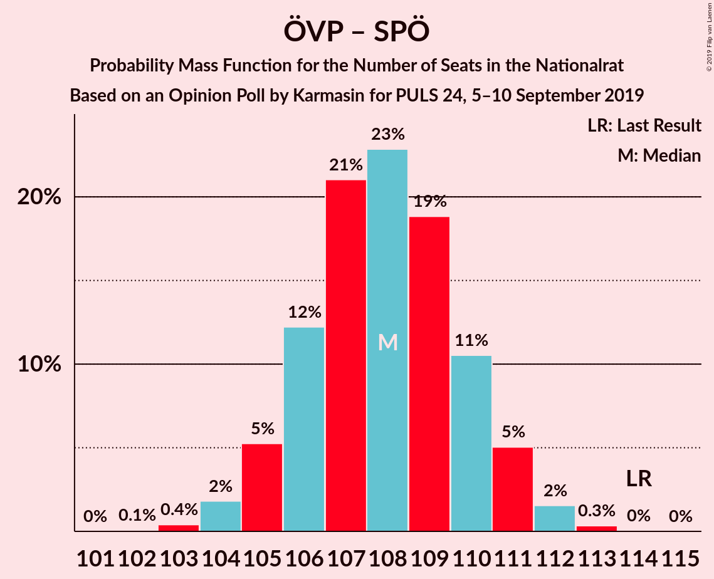

| Number of Seats | Probability | Accumulated | Special Marks |
|:---------------:|:-----------:|:-----------:|:-------------:|
| 102 | 0.1% | 100% |  |
| 103 | 0.3% | 99.9% |  |
| 104 | 2% | 99.6% |  |
| 105 | 4% | 98% |  |
| 106 | 16% | 94% |  |
| 107 | 23% | 78% | Median |
| 108 | 21% | 55% |  |
| 109 | 16% | 34% |  |
| 110 | 12% | 18% |  |
| 111 | 4% | 6% |  |
| 112 | 2% | 2% |  |
| 113 | 0.4% | 0.4% |  |
| 114 | 0% | 0.1% | Last Result |
| 115 | 0% | 0% |  |

### Österreichische Volkspartei – Die Grünen–Die Grüne Alternative – NEOS–Das Neue Österreich und Liberales Forum

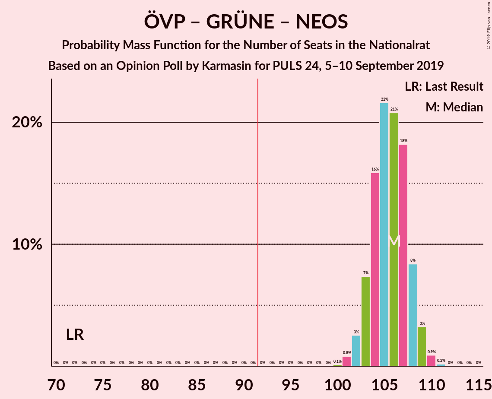

| Number of Seats | Probability | Accumulated | Special Marks |
|:---------------:|:-----------:|:-----------:|:-------------:|
| 72 | 0% | 100% | Last Result |
| 73 | 0% | 100% |  |
| 74 | 0% | 100% |  |
| 75 | 0% | 100% |  |
| 76 | 0% | 100% |  |
| 77 | 0% | 100% |  |
| 78 | 0% | 100% |  |
| 79 | 0% | 100% |  |
| 80 | 0% | 100% |  |
| 81 | 0% | 100% |  |
| 82 | 0% | 100% |  |
| 83 | 0% | 100% |  |
| 84 | 0% | 100% |  |
| 85 | 0% | 100% |  |
| 86 | 0% | 100% |  |
| 87 | 0% | 100% |  |
| 88 | 0% | 100% |  |
| 89 | 0% | 100% |  |
| 90 | 0% | 100% |  |
| 91 | 0% | 100% |  |
| 92 | 0% | 100% | Majority |
| 93 | 0% | 100% |  |
| 94 | 0% | 100% |  |
| 95 | 0% | 100% |  |
| 96 | 0% | 100% |  |
| 97 | 0% | 100% |  |
| 98 | 0% | 100% |  |
| 99 | 0% | 100% |  |
| 100 | 0.2% | 100% |  |
| 101 | 1.0% | 99.8% |  |
| 102 | 1.5% | 98.8% |  |
| 103 | 10% | 97% |  |
| 104 | 16% | 87% |  |
| 105 | 16% | 71% |  |
| 106 | 23% | 55% | Median |
| 107 | 19% | 32% |  |
| 108 | 8% | 12% |  |
| 109 | 3% | 4% |  |
| 110 | 0.7% | 0.9% |  |
| 111 | 0.2% | 0.2% |  |
| 112 | 0% | 0% |  |

### Österreichische Volkspartei – Freiheitliche Partei Österreichs

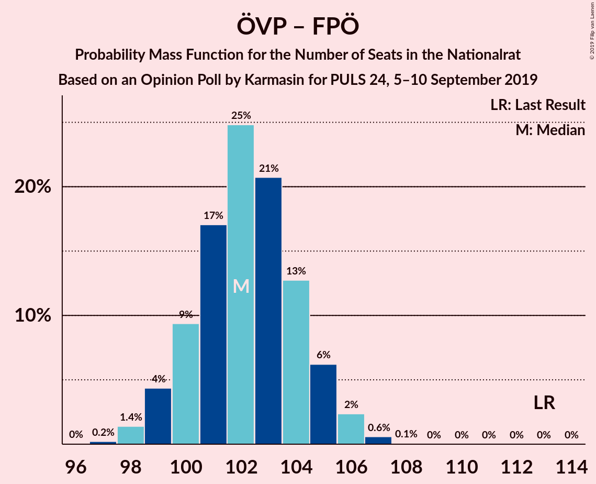

| Number of Seats | Probability | Accumulated | Special Marks |
|:---------------:|:-----------:|:-----------:|:-------------:|
| 97 | 0.2% | 100% |  |
| 98 | 2% | 99.8% |  |
| 99 | 6% | 98% |  |
| 100 | 7% | 92% |  |
| 101 | 19% | 85% |  |
| 102 | 24% | 67% | Median |
| 103 | 20% | 42% |  |
| 104 | 14% | 23% |  |
| 105 | 6% | 9% |  |
| 106 | 2% | 3% |  |
| 107 | 0.7% | 0.7% |  |
| 108 | 0.1% | 0.1% |  |
| 109 | 0% | 0% |  |
| 110 | 0% | 0% |  |
| 111 | 0% | 0% |  |
| 112 | 0% | 0% |  |
| 113 | 0% | 0% | Last Result |

### Österreichische Volkspartei – Die Grünen–Die Grüne Alternative

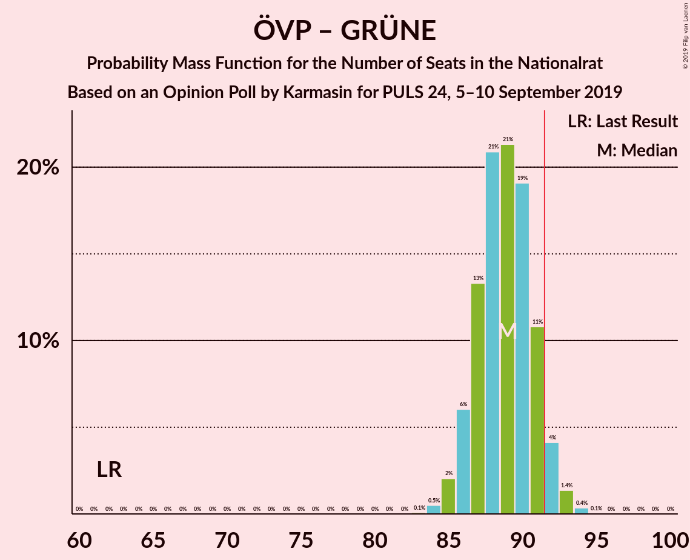

| Number of Seats | Probability | Accumulated | Special Marks |
|:---------------:|:-----------:|:-----------:|:-------------:|
| 62 | 0% | 100% | Last Result |
| 63 | 0% | 100% |  |
| 64 | 0% | 100% |  |
| 65 | 0% | 100% |  |
| 66 | 0% | 100% |  |
| 67 | 0% | 100% |  |
| 68 | 0% | 100% |  |
| 69 | 0% | 100% |  |
| 70 | 0% | 100% |  |
| 71 | 0% | 100% |  |
| 72 | 0% | 100% |  |
| 73 | 0% | 100% |  |
| 74 | 0% | 100% |  |
| 75 | 0% | 100% |  |
| 76 | 0% | 100% |  |
| 77 | 0% | 100% |  |
| 78 | 0% | 100% |  |
| 79 | 0% | 100% |  |
| 80 | 0% | 100% |  |
| 81 | 0% | 100% |  |
| 82 | 0% | 100% |  |
| 83 | 0.1% | 100% |  |
| 84 | 0.6% | 99.9% |  |
| 85 | 2% | 99.3% |  |
| 86 | 8% | 98% |  |
| 87 | 12% | 90% |  |
| 88 | 25% | 79% |  |
| 89 | 17% | 54% | Median |
| 90 | 22% | 37% |  |
| 91 | 9% | 15% |  |
| 92 | 5% | 6% | Majority |
| 93 | 1.1% | 1.5% |  |
| 94 | 0.3% | 0.4% |  |
| 95 | 0% | 0.1% |  |
| 96 | 0% | 0% |  |

### Österreichische Volkspartei – NEOS–Das Neue Österreich und Liberales Forum

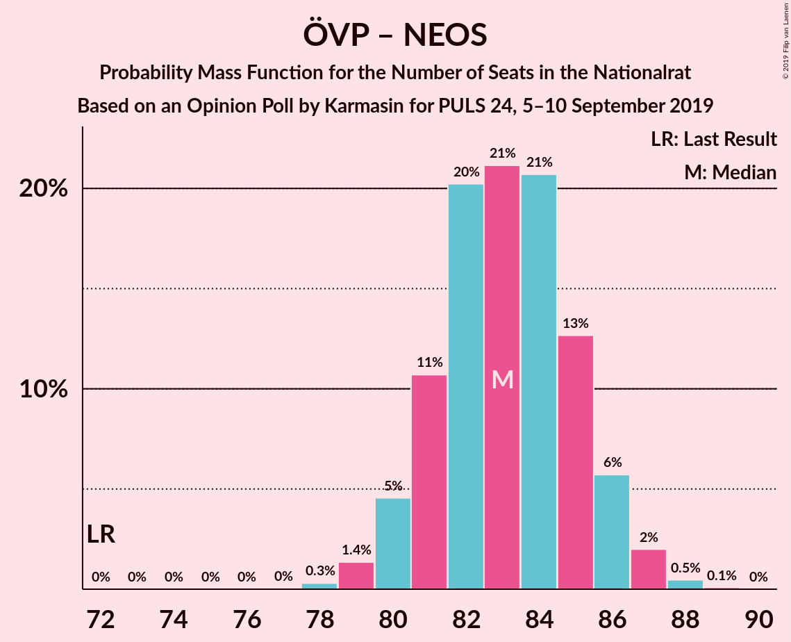

| Number of Seats | Probability | Accumulated | Special Marks |
|:---------------:|:-----------:|:-----------:|:-------------:|
| 72 | 0% | 100% | Last Result |
| 73 | 0% | 100% |  |
| 74 | 0% | 100% |  |
| 75 | 0% | 100% |  |
| 76 | 0% | 100% |  |
| 77 | 0% | 100% |  |
| 78 | 0.3% | 100% |  |
| 79 | 1.2% | 99.6% |  |
| 80 | 5% | 98% |  |
| 81 | 10% | 93% |  |
| 82 | 19% | 83% |  |
| 83 | 21% | 64% | Median |
| 84 | 24% | 43% |  |
| 85 | 11% | 19% |  |
| 86 | 6% | 8% |  |
| 87 | 1.3% | 2% |  |
| 88 | 0.5% | 0.6% |  |
| 89 | 0.1% | 0.1% |  |
| 90 | 0% | 0% |  |

### Sozialdemokratische Partei Österreichs – Die Grünen–Die Grüne Alternative – NEOS–Das Neue Österreich und Liberales Forum

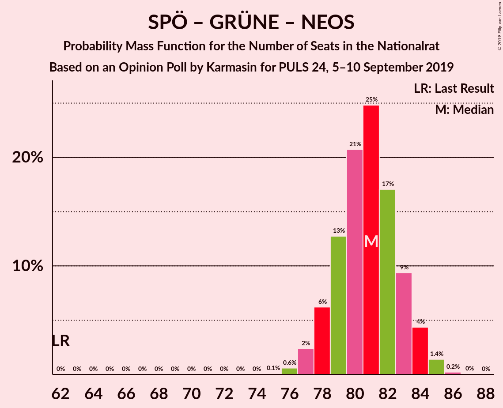

| Number of Seats | Probability | Accumulated | Special Marks |
|:---------------:|:-----------:|:-----------:|:-------------:|
| 62 | 0% | 100% | Last Result |
| 63 | 0% | 100% |  |
| 64 | 0% | 100% |  |
| 65 | 0% | 100% |  |
| 66 | 0% | 100% |  |
| 67 | 0% | 100% |  |
| 68 | 0% | 100% |  |
| 69 | 0% | 100% |  |
| 70 | 0% | 100% |  |
| 71 | 0% | 100% |  |
| 72 | 0% | 100% |  |
| 73 | 0% | 100% |  |
| 74 | 0% | 100% |  |
| 75 | 0.1% | 100% |  |
| 76 | 0.7% | 99.9% |  |
| 77 | 2% | 99.3% |  |
| 78 | 6% | 97% |  |
| 79 | 14% | 91% |  |
| 80 | 20% | 77% |  |
| 81 | 24% | 58% | Median |
| 82 | 19% | 33% |  |
| 83 | 7% | 15% |  |
| 84 | 6% | 8% |  |
| 85 | 2% | 2% |  |
| 86 | 0.2% | 0.2% |  |
| 87 | 0% | 0% |  |

### Sozialdemokratische Partei Österreichs – Freiheitliche Partei Österreichs

| Number of Seats | Probability | Accumulated | Special Marks |
|:---------------:|:-----------:|:-----------:|:-------------:|
| 72 | 0.2% | 100% |  |
| 73 | 0.7% | 99.8% |  |
| 74 | 3% | 99.1% |  |
| 75 | 8% | 96% |  |
| 76 | 19% | 88% |  |
| 77 | 23% | 68% | Median |
| 78 | 16% | 45% |  |
| 79 | 16% | 29% |  |
| 80 | 10% | 13% |  |
| 81 | 1.5% | 3% |  |
| 82 | 1.0% | 1.2% |  |
| 83 | 0.2% | 0.2% |  |
| 84 | 0% | 0% |  |
| 85 | 0% | 0% |  |
| 86 | 0% | 0% |  |
| 87 | 0% | 0% |  |
| 88 | 0% | 0% |  |
| 89 | 0% | 0% |  |
| 90 | 0% | 0% |  |
| 91 | 0% | 0% |  |
| 92 | 0% | 0% | Majority |
| 93 | 0% | 0% |  |
| 94 | 0% | 0% |  |
| 95 | 0% | 0% |  |
| 96 | 0% | 0% |  |
| 97 | 0% | 0% |  |
| 98 | 0% | 0% |  |
| 99 | 0% | 0% |  |
| 100 | 0% | 0% |  |
| 101 | 0% | 0% |  |
| 102 | 0% | 0% |  |
| 103 | 0% | 0% | Last Result |

### Österreichische Volkspartei

| Number of Seats | Probability | Accumulated | Special Marks |
|:---------------:|:-----------:|:-----------:|:-------------:|
| 61 | 0.1% | 100% |  |
| 62 | 0.7% | 99.9% | Last Result |
| 63 | 4% | 99.2% |  |
| 64 | 8% | 96% |  |
| 65 | 20% | 88% |  |
| 66 | 22% | 68% | Median |
| 67 | 24% | 46% |  |
| 68 | 13% | 22% |  |
| 69 | 6% | 9% |  |
| 70 | 2% | 3% |  |
| 71 | 0.5% | 0.7% |  |
| 72 | 0.1% | 0.1% |  |
| 73 | 0% | 0% |  |

### Sozialdemokratische Partei Österreichs – Die Grünen–Die Grüne Alternative

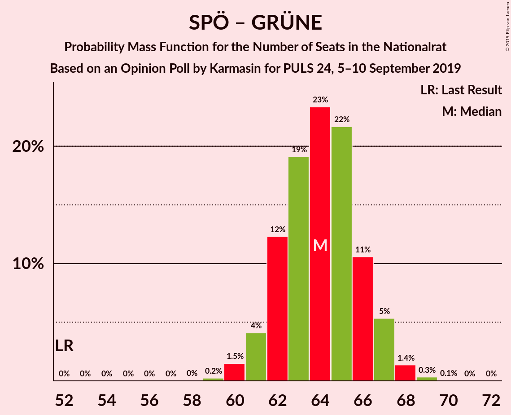

| Number of Seats | Probability | Accumulated | Special Marks |
|:---------------:|:-----------:|:-----------:|:-------------:|
| 52 | 0% | 100% | Last Result |
| 53 | 0% | 100% |  |
| 54 | 0% | 100% |  |
| 55 | 0% | 100% |  |
| 56 | 0% | 100% |  |
| 57 | 0% | 100% |  |
| 58 | 0% | 100% |  |
| 59 | 0.3% | 100% |  |
| 60 | 1.4% | 99.7% |  |
| 61 | 3% | 98% |  |
| 62 | 13% | 95% |  |
| 63 | 20% | 82% |  |
| 64 | 28% | 62% | Median |
| 65 | 14% | 35% |  |
| 66 | 13% | 20% |  |
| 67 | 5% | 7% |  |
| 68 | 2% | 2% |  |
| 69 | 0.4% | 0.4% |  |
| 70 | 0% | 0.1% |  |
| 71 | 0% | 0% |  |

### Sozialdemokratische Partei Österreichs

| Number of Seats | Probability | Accumulated | Special Marks |
|:---------------:|:-----------:|:-----------:|:-------------:|
| 37 | 0.2% | 100% |  |
| 38 | 1.2% | 99.8% |  |
| 39 | 6% | 98.6% |  |
| 40 | 17% | 92% |  |
| 41 | 25% | 75% | Median |
| 42 | 23% | 49% |  |
| 43 | 16% | 26% |  |
| 44 | 7% | 10% |  |
| 45 | 2% | 2% |  |
| 46 | 0.4% | 0.4% |  |
| 47 | 0% | 0% |  |
| 48 | 0% | 0% |  |
| 49 | 0% | 0% |  |
| 50 | 0% | 0% |  |
| 51 | 0% | 0% |  |
| 52 | 0% | 0% | Last Result |

## Technical Information

### Opinion Poll

+ **Polling firm:** Karmasin
+ **Commissioner(s):** PULS 24
+ **Fieldwork period:** 5–10 September 2019

### Calculations

+ **Sample size:** 3000
+ **Simulations done:** 131,072
+ **Error estimate:** 0.78%

