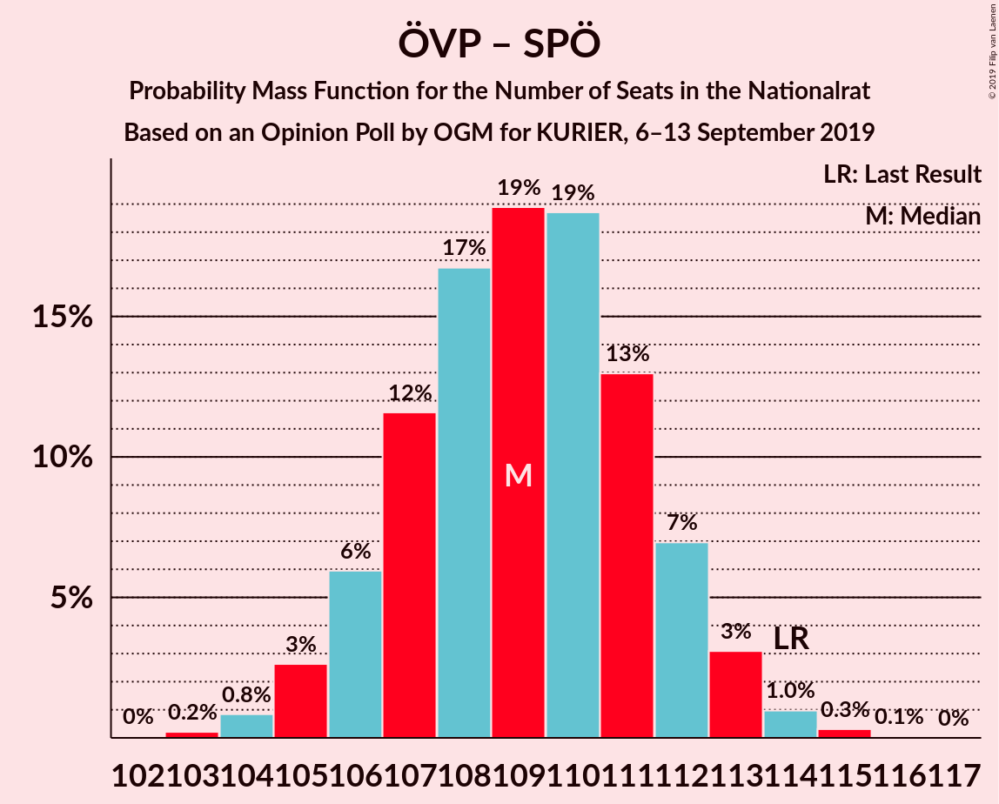
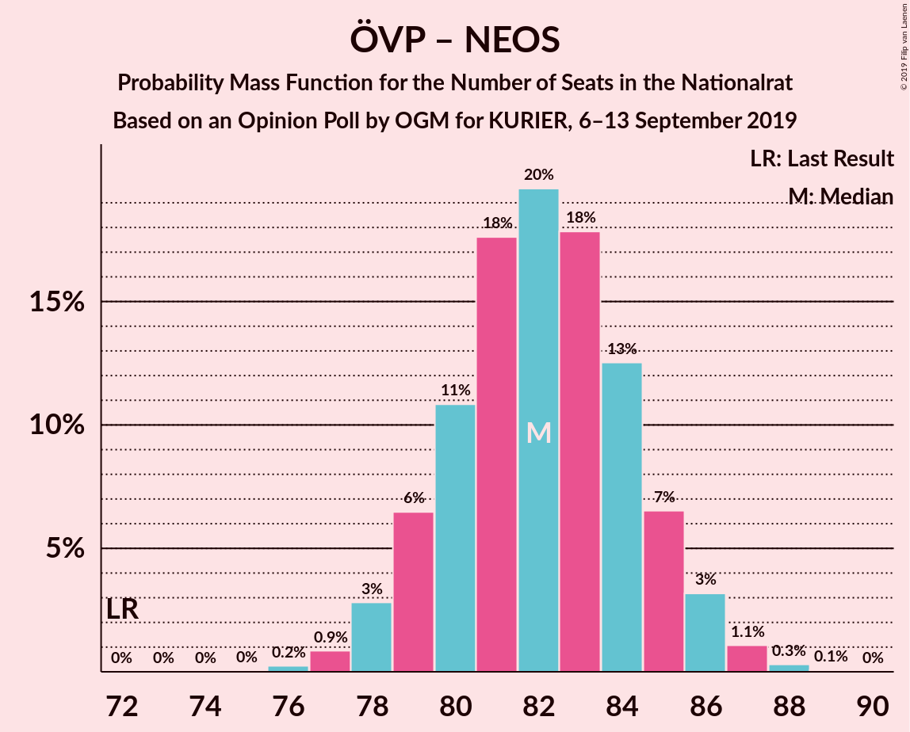

# Opinion Poll by OGM for KURIER, 6–13 September 2019

<a href="#voting-intentions">Voting Intentions</a> | <a href="#seats">Seats</a> | <a href="#coalitions">Coalitions</a> | <a href="#technical-information">Technical Information</a>

## Voting Intentions

### Confidence Intervals

| Party | Last Result | Poll Result | 80% Confidence Interval | 90% Confidence Interval | 95% Confidence Interval | 99% Confidence Interval |
|:-----:|:-----------:|:-----------:|:-----------------------:|:-----------------------:|:-----------------------:|:-----------------------:|
| Österreichische Volkspartei | 31.5% | 35.0% | 33.7–36.3% |33.3–36.7% |33.0–37.0% |32.4–37.7% |
| Sozialdemokratische Partei Österreichs | 26.9% | 22.0% | 20.9–23.2% |20.6–23.5% |20.3–23.8% |19.8–24.4% |
| Freiheitliche Partei Österreichs | 26.0% | 20.0% | 18.9–21.1% |18.6–21.4% |18.4–21.7% |17.8–22.3% |
| Die Grünen–Die Grüne Alternative | 3.8% | 11.0% | 10.2–11.9% |9.9–12.1% |9.7–12.4% |9.3–12.8% |
| NEOS–Das Neue Österreich und Liberales Forum | 5.3% | 8.0% | 7.3–8.8% |7.1–9.0% |6.9–9.2% |6.6–9.6% |
| JETZT–Liste Pilz | 4.4% | 2.0% | 1.6–2.4% |1.6–2.6% |1.5–2.7% |1.3–2.9% |

*Note:* The poll result column reflects the actual value used in the calculations. Published results may vary slightly, and in addition be rounded to fewer digits.

## Seats

### Confidence Intervals

| Party | Last Result | Median | 80% Confidence Interval | 90% Confidence Interval | 95% Confidence Interval | 99% Confidence Interval |
|:-----:|:-----------:|:------:|:-----------------------:|:-----------------------:|:-----------------------:|:-----------------------:|
| <a href="#österreichische-volkspartei">Österreichische Volkspartei</a> | 62 | 67 | 65–70 |64–70 |63–71 |62–72 |
| <a href="#sozialdemokratische-partei-österreichs">Sozialdemokratische Partei Österreichs</a> | 52 | 42 | 40–44 |39–45 |39–45 |38–47 |
| <a href="#freiheitliche-partei-österreichs">Freiheitliche Partei Österreichs</a> | 51 | 38 | 36–40 |36–41 |36–42 |34–42 |
| <a href="#die-grünen–die-grüne-alternative">Die Grünen–Die Grüne Alternative</a> | 0 | 20 | 19–21 |19–22 |19–22 |18–24 |
| <a href="#neos–das-neue-österreich-und-liberales-forum">NEOS–Das Neue Österreich und Liberales Forum</a> | 10 | 15 | 14–17 |13–17 |13–17 |13–18 |
| <a href="#jetzt–liste-pilz">JETZT–Liste Pilz</a> | 8 | 0 | 0 |0 |0 |0 |

### Österreichische Volkspartei

*For a full overview of the results for this party, see the [Österreichische Volkspartei](party-österreichischevolkspartei.html) page.*

| Number of Seats | Probability | Accumulated | Special Marks |
|:---------------:|:-----------:|:-----------:|:-------------:|
| 61 | 0.2% | 100% |  |
| 62 | 0.7% | 99.8% | Last Result |
| 63 | 3% | 99.1% |  |
| 64 | 6% | 97% |  |
| 65 | 10% | 90% |  |
| 66 | 19% | 80% |  |
| 67 | 20% | 61% | Median |
| 68 | 19% | 42% |  |
| 69 | 12% | 22% |  |
| 70 | 6% | 10% |  |
| 71 | 3% | 4% |  |
| 72 | 1.0% | 1.3% |  |
| 73 | 0.2% | 0.3% |  |
| 74 | 0% | 0% |  |

### Sozialdemokratische Partei Österreichs

*For a full overview of the results for this party, see the [Sozialdemokratische Partei Österreichs](party-sozialdemokratischeparteiösterreichs.html) page.*

| Number of Seats | Probability | Accumulated | Special Marks |
|:---------------:|:-----------:|:-----------:|:-------------:|
| 37 | 0.4% | 100% |  |
| 38 | 1.4% | 99.6% |  |
| 39 | 5% | 98% |  |
| 40 | 10% | 93% |  |
| 41 | 21% | 83% |  |
| 42 | 23% | 61% | Median |
| 43 | 17% | 38% |  |
| 44 | 14% | 21% |  |
| 45 | 5% | 7% |  |
| 46 | 2% | 2% |  |
| 47 | 0.5% | 0.6% |  |
| 48 | 0.1% | 0.1% |  |
| 49 | 0% | 0% |  |
| 50 | 0% | 0% |  |
| 51 | 0% | 0% |  |
| 52 | 0% | 0% | Last Result |

### Freiheitliche Partei Österreichs

*For a full overview of the results for this party, see the [Freiheitliche Partei Österreichs](party-freiheitlicheparteiösterreichs.html) page.*

| Number of Seats | Probability | Accumulated | Special Marks |
|:---------------:|:-----------:|:-----------:|:-------------:|
| 33 | 0.1% | 100% |  |
| 34 | 0.5% | 99.9% |  |
| 35 | 2% | 99.5% |  |
| 36 | 8% | 98% |  |
| 37 | 16% | 90% |  |
| 38 | 26% | 74% | Median |
| 39 | 23% | 47% |  |
| 40 | 16% | 24% |  |
| 41 | 6% | 8% |  |
| 42 | 2% | 3% |  |
| 43 | 0.3% | 0.4% |  |
| 44 | 0% | 0.1% |  |
| 45 | 0% | 0% |  |
| 46 | 0% | 0% |  |
| 47 | 0% | 0% |  |
| 48 | 0% | 0% |  |
| 49 | 0% | 0% |  |
| 50 | 0% | 0% |  |
| 51 | 0% | 0% | Last Result |

### Die Grünen–Die Grüne Alternative

*For a full overview of the results for this party, see the [Die Grünen–Die Grüne Alternative](party-diegrünen–diegrünealternative.html) page.*

| Number of Seats | Probability | Accumulated | Special Marks |
|:---------------:|:-----------:|:-----------:|:-------------:|
| 0 | 0% | 100% | Last Result |
| 1 | 0% | 100% |  |
| 2 | 0% | 100% |  |
| 3 | 0% | 100% |  |
| 4 | 0% | 100% |  |
| 5 | 0% | 100% |  |
| 6 | 0% | 100% |  |
| 7 | 0% | 100% |  |
| 8 | 0% | 100% |  |
| 9 | 0% | 100% |  |
| 10 | 0% | 100% |  |
| 11 | 0% | 100% |  |
| 12 | 0% | 100% |  |
| 13 | 0% | 100% |  |
| 14 | 0% | 100% |  |
| 15 | 0% | 100% |  |
| 16 | 0% | 100% |  |
| 17 | 0% | 100% |  |
| 18 | 0.7% | 100% |  |
| 19 | 14% | 99.3% |  |
| 20 | 48% | 85% | Median |
| 21 | 31% | 36% |  |
| 22 | 5% | 6% |  |
| 23 | 0.2% | 1.2% |  |
| 24 | 0.6% | 1.0% |  |
| 25 | 0.3% | 0.4% |  |
| 26 | 0% | 0% |  |

### NEOS–Das Neue Österreich und Liberales Forum

*For a full overview of the results for this party, see the [NEOS–Das Neue Österreich und Liberales Forum](party-neos–dasneueösterreichundliberalesforum.html) page.*

| Number of Seats | Probability | Accumulated | Special Marks |
|:---------------:|:-----------:|:-----------:|:-------------:|
| 10 | 0% | 100% | Last Result |
| 11 | 0% | 100% |  |
| 12 | 0.4% | 100% |  |
| 13 | 5% | 99.6% |  |
| 14 | 19% | 94% |  |
| 15 | 41% | 75% | Median |
| 16 | 24% | 34% |  |
| 17 | 9% | 11% |  |
| 18 | 1.4% | 2% |  |
| 19 | 0.1% | 0.1% |  |
| 20 | 0% | 0% |  |

### JETZT–Liste Pilz

*For a full overview of the results for this party, see the [JETZT–Liste Pilz](party-jetzt–listepilz.html) page.*

| Number of Seats | Probability | Accumulated | Special Marks |
|:---------------:|:-----------:|:-----------:|:-------------:|
| 0 | 100% | 100% | Median |
| 1 | 0% | 0% |  |
| 2 | 0% | 0% |  |
| 3 | 0% | 0% |  |
| 4 | 0% | 0% |  |
| 5 | 0% | 0% |  |
| 6 | 0% | 0% |  |
| 7 | 0% | 0% |  |
| 8 | 0% | 0% | Last Result |

## Coalitions

### Confidence Intervals

| Coalition | Last Result | Median | Majority? | 80% Confidence Interval | 90% Confidence Interval | 95% Confidence Interval | 99% Confidence Interval |
|:---------:|:-----------:|:------:|:---------:|:-----------------------:|:-----------------------:|:-----------------------:|:-----------------------:|
| Österreichische Volkspartei – Sozialdemokratische Partei Österreichs | 114 | 109 | 100% | 106–112 | 106–112 | 105–113 | 104–114 |
| Österreichische Volkspartei – Freiheitliche Partei Österreichs | 113 | 106 | 100% | 103–108 | 102–109 | 102–109 | 100–110 |
| Österreichische Volkspartei – Die Grünen–Die Grüne Alternative – NEOS–Das Neue Österreich und Liberales Forum | 72 | 103 | 100% | 100–105 | 99–106 | 99–106 | 98–108 |
| Österreichische Volkspartei – Die Grünen–Die Grüne Alternative | 62 | 87 | 1.2% | 85–90 | 85–90 | 84–91 | 83–92 |
| Österreichische Volkspartei – NEOS–Das Neue Österreich und Liberales Forum | 72 | 82 | 0% | 80–85 | 79–86 | 78–86 | 77–87 |
| Sozialdemokratische Partei Österreichs – Freiheitliche Partei Österreichs | 103 | 80 | 0% | 78–83 | 77–84 | 77–84 | 75–85 |
| Sozialdemokratische Partei Österreichs – Die Grünen–Die Grüne Alternative – NEOS–Das Neue Österreich und Liberales Forum | 62 | 77 | 0% | 75–80 | 74–81 | 74–81 | 73–83 |
| Österreichische Volkspartei | 62 | 67 | 0% | 65–70 | 64–70 | 63–71 | 62–72 |
| Sozialdemokratische Partei Österreichs – Die Grünen–Die Grüne Alternative | 52 | 62 | 0% | 60–64 | 60–65 | 59–66 | 58–67 |
| Sozialdemokratische Partei Österreichs | 52 | 42 | 0% | 40–44 | 39–45 | 39–45 | 38–47 |

### Österreichische Volkspartei – Sozialdemokratische Partei Österreichs

| Number of Seats | Probability | Accumulated | Special Marks |
|:---------------:|:-----------:|:-----------:|:-------------:|
| 102 | 0.1% | 100% |  |
| 103 | 0.2% | 99.9% |  |
| 104 | 0.8% | 99.7% |  |
| 105 | 3% | 99.0% |  |
| 106 | 7% | 96% |  |
| 107 | 9% | 89% |  |
| 108 | 17% | 80% |  |
| 109 | 20% | 62% | Median |
| 110 | 18% | 43% |  |
| 111 | 13% | 25% |  |
| 112 | 7% | 12% |  |
| 113 | 3% | 4% |  |
| 114 | 0.8% | 1.3% | Last Result |
| 115 | 0.4% | 0.4% |  |
| 116 | 0.1% | 0.1% |  |
| 117 | 0% | 0% |  |

### Österreichische Volkspartei – Freiheitliche Partei Österreichs

| Number of Seats | Probability | Accumulated | Special Marks |
|:---------------:|:-----------:|:-----------:|:-------------:|
| 99 | 0.1% | 100% |  |
| 100 | 0.6% | 99.9% |  |
| 101 | 1.4% | 99.3% |  |
| 102 | 4% | 98% |  |
| 103 | 8% | 94% |  |
| 104 | 19% | 86% |  |
| 105 | 14% | 67% | Median |
| 106 | 23% | 53% |  |
| 107 | 14% | 30% |  |
| 108 | 10% | 16% |  |
| 109 | 3% | 5% |  |
| 110 | 2% | 2% |  |
| 111 | 0.3% | 0.4% |  |
| 112 | 0.1% | 0.1% |  |
| 113 | 0% | 0% | Last Result |

### Österreichische Volkspartei – Die Grünen–Die Grüne Alternative – NEOS–Das Neue Österreich und Liberales Forum

| Number of Seats | Probability | Accumulated | Special Marks |
|:---------------:|:-----------:|:-----------:|:-------------:|
| 72 | 0% | 100% | Last Result |
| 73 | 0% | 100% |  |
| 74 | 0% | 100% |  |
| 75 | 0% | 100% |  |
| 76 | 0% | 100% |  |
| 77 | 0% | 100% |  |
| 78 | 0% | 100% |  |
| 79 | 0% | 100% |  |
| 80 | 0% | 100% |  |
| 81 | 0% | 100% |  |
| 82 | 0% | 100% |  |
| 83 | 0% | 100% |  |
| 84 | 0% | 100% |  |
| 85 | 0% | 100% |  |
| 86 | 0% | 100% |  |
| 87 | 0% | 100% |  |
| 88 | 0% | 100% |  |
| 89 | 0% | 100% |  |
| 90 | 0% | 100% |  |
| 91 | 0% | 100% |  |
| 92 | 0% | 100% | Majority |
| 93 | 0% | 100% |  |
| 94 | 0% | 100% |  |
| 95 | 0% | 100% |  |
| 96 | 0.1% | 100% |  |
| 97 | 0.3% | 99.9% |  |
| 98 | 2% | 99.6% |  |
| 99 | 4% | 98% |  |
| 100 | 8% | 94% |  |
| 101 | 13% | 86% |  |
| 102 | 22% | 72% | Median |
| 103 | 20% | 50% |  |
| 104 | 16% | 30% |  |
| 105 | 9% | 14% |  |
| 106 | 4% | 6% |  |
| 107 | 1.4% | 2% |  |
| 108 | 0.5% | 0.6% |  |
| 109 | 0.1% | 0.1% |  |
| 110 | 0% | 0% |  |

### Österreichische Volkspartei – Die Grünen–Die Grüne Alternative

| Number of Seats | Probability | Accumulated | Special Marks |
|:---------------:|:-----------:|:-----------:|:-------------:|
| 62 | 0% | 100% | Last Result |
| 63 | 0% | 100% |  |
| 64 | 0% | 100% |  |
| 65 | 0% | 100% |  |
| 66 | 0% | 100% |  |
| 67 | 0% | 100% |  |
| 68 | 0% | 100% |  |
| 69 | 0% | 100% |  |
| 70 | 0% | 100% |  |
| 71 | 0% | 100% |  |
| 72 | 0% | 100% |  |
| 73 | 0% | 100% |  |
| 74 | 0% | 100% |  |
| 75 | 0% | 100% |  |
| 76 | 0% | 100% |  |
| 77 | 0% | 100% |  |
| 78 | 0% | 100% |  |
| 79 | 0% | 100% |  |
| 80 | 0% | 100% |  |
| 81 | 0% | 100% |  |
| 82 | 0.2% | 100% |  |
| 83 | 1.1% | 99.8% |  |
| 84 | 4% | 98.7% |  |
| 85 | 9% | 95% |  |
| 86 | 13% | 86% |  |
| 87 | 26% | 73% | Median |
| 88 | 24% | 47% |  |
| 89 | 12% | 22% |  |
| 90 | 7% | 10% |  |
| 91 | 2% | 4% |  |
| 92 | 0.8% | 1.2% | Majority |
| 93 | 0.2% | 0.3% |  |
| 94 | 0.1% | 0.1% |  |
| 95 | 0% | 0% |  |

### Österreichische Volkspartei – NEOS–Das Neue Österreich und Liberales Forum

| Number of Seats | Probability | Accumulated | Special Marks |
|:---------------:|:-----------:|:-----------:|:-------------:|
| 72 | 0% | 100% | Last Result |
| 73 | 0% | 100% |  |
| 74 | 0% | 100% |  |
| 75 | 0% | 100% |  |
| 76 | 0.2% | 100% |  |
| 77 | 0.5% | 99.7% |  |
| 78 | 2% | 99.2% |  |
| 79 | 5% | 97% |  |
| 80 | 9% | 92% |  |
| 81 | 21% | 83% |  |
| 82 | 16% | 62% | Median |
| 83 | 22% | 46% |  |
| 84 | 12% | 24% |  |
| 85 | 6% | 12% |  |
| 86 | 4% | 6% |  |
| 87 | 1.2% | 2% |  |
| 88 | 0.4% | 0.4% |  |
| 89 | 0.1% | 0.1% |  |
| 90 | 0% | 0% |  |

### Sozialdemokratische Partei Österreichs – Freiheitliche Partei Österreichs

| Number of Seats | Probability | Accumulated | Special Marks |
|:---------------:|:-----------:|:-----------:|:-------------:|
| 74 | 0.1% | 100% |  |
| 75 | 0.5% | 99.9% |  |
| 76 | 1.4% | 99.4% |  |
| 77 | 4% | 98% |  |
| 78 | 9% | 94% |  |
| 79 | 16% | 86% |  |
| 80 | 20% | 70% | Median |
| 81 | 22% | 50% |  |
| 82 | 13% | 28% |  |
| 83 | 8% | 14% |  |
| 84 | 4% | 6% |  |
| 85 | 2% | 2% |  |
| 86 | 0.3% | 0.4% |  |
| 87 | 0.1% | 0.1% |  |
| 88 | 0% | 0% |  |
| 89 | 0% | 0% |  |
| 90 | 0% | 0% |  |
| 91 | 0% | 0% |  |
| 92 | 0% | 0% | Majority |
| 93 | 0% | 0% |  |
| 94 | 0% | 0% |  |
| 95 | 0% | 0% |  |
| 96 | 0% | 0% |  |
| 97 | 0% | 0% |  |
| 98 | 0% | 0% |  |
| 99 | 0% | 0% |  |
| 100 | 0% | 0% |  |
| 101 | 0% | 0% |  |
| 102 | 0% | 0% |  |
| 103 | 0% | 0% | Last Result |

### Sozialdemokratische Partei Österreichs – Die Grünen–Die Grüne Alternative – NEOS–Das Neue Österreich und Liberales Forum

| Number of Seats | Probability | Accumulated | Special Marks |
|:---------------:|:-----------:|:-----------:|:-------------:|
| 62 | 0% | 100% | Last Result |
| 63 | 0% | 100% |  |
| 64 | 0% | 100% |  |
| 65 | 0% | 100% |  |
| 66 | 0% | 100% |  |
| 67 | 0% | 100% |  |
| 68 | 0% | 100% |  |
| 69 | 0% | 100% |  |
| 70 | 0% | 100% |  |
| 71 | 0.1% | 100% |  |
| 72 | 0.3% | 99.9% |  |
| 73 | 2% | 99.6% |  |
| 74 | 3% | 98% |  |
| 75 | 10% | 95% |  |
| 76 | 14% | 84% |  |
| 77 | 23% | 70% | Median |
| 78 | 14% | 47% |  |
| 79 | 19% | 33% |  |
| 80 | 8% | 14% |  |
| 81 | 4% | 6% |  |
| 82 | 1.4% | 2% |  |
| 83 | 0.6% | 0.7% |  |
| 84 | 0.1% | 0.1% |  |
| 85 | 0% | 0% |  |

### Österreichische Volkspartei

| Number of Seats | Probability | Accumulated | Special Marks |
|:---------------:|:-----------:|:-----------:|:-------------:|
| 61 | 0.2% | 100% |  |
| 62 | 0.7% | 99.8% | Last Result |
| 63 | 3% | 99.1% |  |
| 64 | 6% | 97% |  |
| 65 | 10% | 90% |  |
| 66 | 19% | 80% |  |
| 67 | 20% | 61% | Median |
| 68 | 19% | 42% |  |
| 69 | 12% | 22% |  |
| 70 | 6% | 10% |  |
| 71 | 3% | 4% |  |
| 72 | 1.0% | 1.3% |  |
| 73 | 0.2% | 0.3% |  |
| 74 | 0% | 0% |  |

### Sozialdemokratische Partei Österreichs – Die Grünen–Die Grüne Alternative

| Number of Seats | Probability | Accumulated | Special Marks |
|:---------------:|:-----------:|:-----------:|:-------------:|
| 52 | 0% | 100% | Last Result |
| 53 | 0% | 100% |  |
| 54 | 0% | 100% |  |
| 55 | 0% | 100% |  |
| 56 | 0% | 100% |  |
| 57 | 0.1% | 100% |  |
| 58 | 0.8% | 99.9% |  |
| 59 | 3% | 99.1% |  |
| 60 | 10% | 96% |  |
| 61 | 15% | 86% |  |
| 62 | 28% | 70% | Median |
| 63 | 18% | 43% |  |
| 64 | 15% | 25% |  |
| 65 | 7% | 10% |  |
| 66 | 2% | 3% |  |
| 67 | 0.6% | 0.9% |  |
| 68 | 0.2% | 0.3% |  |
| 69 | 0.1% | 0.1% |  |
| 70 | 0% | 0% |  |

### Sozialdemokratische Partei Österreichs

| Number of Seats | Probability | Accumulated | Special Marks |
|:---------------:|:-----------:|:-----------:|:-------------:|
| 37 | 0.4% | 100% |  |
| 38 | 1.4% | 99.6% |  |
| 39 | 5% | 98% |  |
| 40 | 10% | 93% |  |
| 41 | 21% | 83% |  |
| 42 | 23% | 61% | Median |
| 43 | 17% | 38% |  |
| 44 | 14% | 21% |  |
| 45 | 5% | 7% |  |
| 46 | 2% | 2% |  |
| 47 | 0.5% | 0.6% |  |
| 48 | 0.1% | 0.1% |  |
| 49 | 0% | 0% |  |
| 50 | 0% | 0% |  |
| 51 | 0% | 0% |  |
| 52 | 0% | 0% | Last Result |

## Technical Information

### Opinion Poll

+ **Polling firm:** OGM
+ **Commissioner(s):** KURIER
+ **Fieldwork period:** 6–13 September 2019

### Calculations

+ **Sample size:** 2167
+ **Simulations done:** 131,072
+ **Error estimate:** 0.99%

