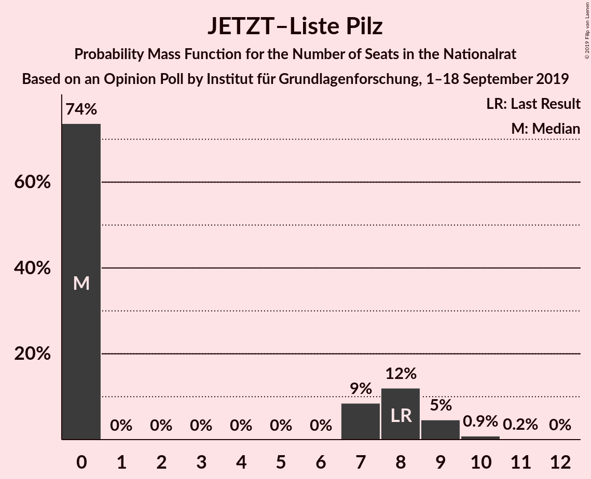
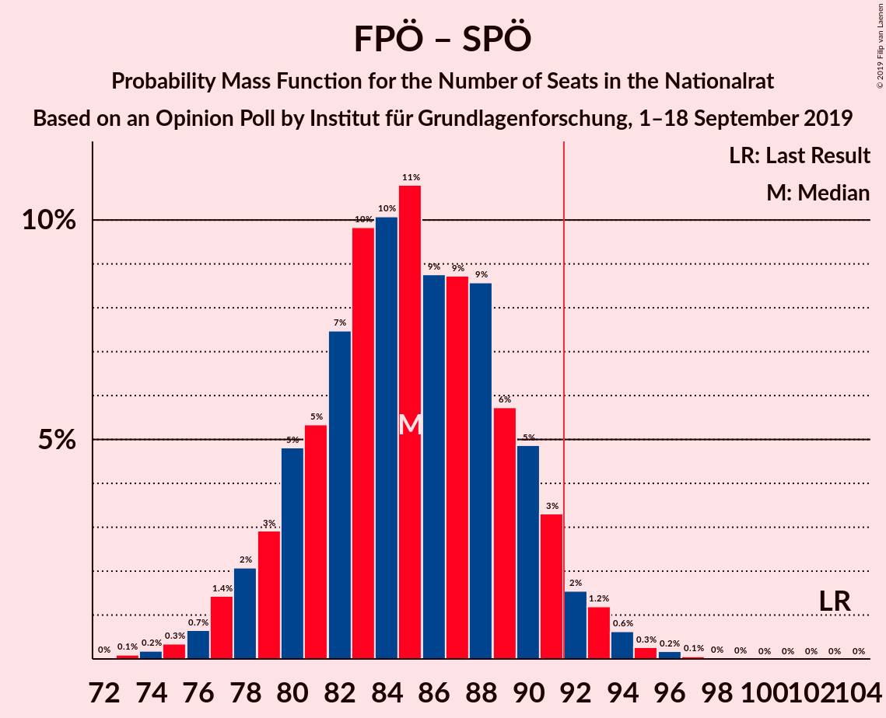

# Opinion Poll by Institut für Grundlagenforschung, 1–18 September 2019

<a href="#voting-intentions">Voting Intentions</a> | <a href="#seats">Seats</a> | <a href="#coalitions">Coalitions</a> | <a href="#technical-information">Technical Information</a>

## Voting Intentions

### Confidence Intervals

| Party | Last Result | Poll Result | 80% Confidence Interval | 90% Confidence Interval | 95% Confidence Interval | 99% Confidence Interval |
|:-----:|:-----------:|:-----------:|:-----------------------:|:-----------------------:|:-----------------------:|:-----------------------:|
| Österreichische Volkspartei | 31.5% | 32.0% | 29.8–34.3% |29.2–34.9% |28.6–35.5% |27.6–36.6% |
| Freiheitliche Partei Österreichs | 26.0% | 26.1% | 24.0–28.3% |23.4–28.9% |23.0–29.4% |22.0–30.5% |
| Sozialdemokratische Partei Österreichs | 26.9% | 19.0% | 17.2–21.0% |16.7–21.6% |16.3–22.1% |15.5–23.1% |
| Die Grünen–Die Grüne Alternative | 3.8% | 11.0% | 9.6–12.6% |9.2–13.1% |8.9–13.5% |8.3–14.3% |
| NEOS–Das Neue Österreich und Liberales Forum | 5.3% | 8.0% | 6.9–9.5% |6.5–9.9% |6.2–10.3% |5.7–11.0% |
| JETZT–Liste Pilz | 4.4% | 3.5% | 2.8–4.6% |2.6–4.9% |2.4–5.2% |2.1–5.7% |

*Note:* The poll result column reflects the actual value used in the calculations. Published results may vary slightly, and in addition be rounded to fewer digits.

## Seats

### Confidence Intervals

| Party | Last Result | Median | 80% Confidence Interval | 90% Confidence Interval | 95% Confidence Interval | 99% Confidence Interval |
|:-----:|:-----------:|:------:|:-----------------------:|:-----------------------:|:-----------------------:|:-----------------------:|
| <a href="#österreichische-volkspartei">Österreichische Volkspartei</a> | 62 | 60 | 56–65 |54–66 |53–67 |51–69 |
| <a href="#freiheitliche-partei-österreichs">Freiheitliche Partei Österreichs</a> | 51 | 49 | 45–53 |44–54 |43–55 |41–58 |
| <a href="#sozialdemokratische-partei-österreichs">Sozialdemokratische Partei Österreichs</a> | 52 | 36 | 32–39 |31–40 |30–41 |29–43 |
| <a href="#die-grünen–die-grüne-alternative">Die Grünen–Die Grüne Alternative</a> | 0 | 20 | 18–24 |17–24 |16–25 |15–27 |
| <a href="#neos–das-neue-österreich-und-liberales-forum">NEOS–Das Neue Österreich und Liberales Forum</a> | 10 | 15 | 12–18 |12–18 |11–19 |10–20 |
| <a href="#jetzt–liste-pilz">JETZT–Liste Pilz</a> | 8 | 0 | 0–8 |0–9 |0–9 |0–10 |

### Österreichische Volkspartei

*For a full overview of the results for this party, see the [Österreichische Volkspartei](party-österreichischevolkspartei.html) page.*

| Number of Seats | Probability | Accumulated | Special Marks |
|:---------------:|:-----------:|:-----------:|:-------------:|
| 49 | 0% | 100% |  |
| 50 | 0.1% | 99.9% |  |
| 51 | 0.3% | 99.8% |  |
| 52 | 0.8% | 99.5% |  |
| 53 | 1.5% | 98.6% |  |
| 54 | 2% | 97% |  |
| 55 | 3% | 95% |  |
| 56 | 5% | 92% |  |
| 57 | 8% | 87% |  |
| 58 | 11% | 79% |  |
| 59 | 10% | 68% |  |
| 60 | 10% | 58% | Median |
| 61 | 11% | 48% |  |
| 62 | 12% | 38% | Last Result |
| 63 | 10% | 26% |  |
| 64 | 6% | 16% |  |
| 65 | 4% | 10% |  |
| 66 | 2% | 6% |  |
| 67 | 2% | 4% |  |
| 68 | 1.3% | 2% |  |
| 69 | 0.7% | 1.1% |  |
| 70 | 0.2% | 0.4% |  |
| 71 | 0.1% | 0.2% |  |
| 72 | 0.1% | 0.1% |  |
| 73 | 0% | 0% |  |

### Freiheitliche Partei Österreichs

*For a full overview of the results for this party, see the [Freiheitliche Partei Österreichs](party-freiheitlicheparteiösterreichs.html) page.*

| Number of Seats | Probability | Accumulated | Special Marks |
|:---------------:|:-----------:|:-----------:|:-------------:|
| 39 | 0.1% | 100% |  |
| 40 | 0.2% | 99.9% |  |
| 41 | 0.4% | 99.7% |  |
| 42 | 1.2% | 99.3% |  |
| 43 | 2% | 98% |  |
| 44 | 3% | 96% |  |
| 45 | 6% | 93% |  |
| 46 | 9% | 87% |  |
| 47 | 10% | 78% |  |
| 48 | 11% | 68% |  |
| 49 | 14% | 57% | Median |
| 50 | 11% | 43% |  |
| 51 | 10% | 32% | Last Result |
| 52 | 7% | 22% |  |
| 53 | 6% | 15% |  |
| 54 | 4% | 9% |  |
| 55 | 2% | 5% |  |
| 56 | 1.2% | 2% |  |
| 57 | 0.7% | 1.3% |  |
| 58 | 0.3% | 0.5% |  |
| 59 | 0.1% | 0.2% |  |
| 60 | 0.1% | 0.1% |  |
| 61 | 0% | 0% |  |

### Sozialdemokratische Partei Österreichs

*For a full overview of the results for this party, see the [Sozialdemokratische Partei Österreichs](party-sozialdemokratischeparteiösterreichs.html) page.*

| Number of Seats | Probability | Accumulated | Special Marks |
|:---------------:|:-----------:|:-----------:|:-------------:|
| 27 | 0.1% | 100% |  |
| 28 | 0.3% | 99.9% |  |
| 29 | 0.7% | 99.6% |  |
| 30 | 2% | 98.9% |  |
| 31 | 4% | 97% |  |
| 32 | 6% | 93% |  |
| 33 | 8% | 88% |  |
| 34 | 10% | 80% |  |
| 35 | 14% | 70% |  |
| 36 | 13% | 55% | Median |
| 37 | 12% | 42% |  |
| 38 | 11% | 30% |  |
| 39 | 8% | 18% |  |
| 40 | 5% | 10% |  |
| 41 | 2% | 5% |  |
| 42 | 1.3% | 2% |  |
| 43 | 0.5% | 0.9% |  |
| 44 | 0.3% | 0.4% |  |
| 45 | 0.1% | 0.2% |  |
| 46 | 0% | 0.1% |  |
| 47 | 0% | 0% |  |
| 48 | 0% | 0% |  |
| 49 | 0% | 0% |  |
| 50 | 0% | 0% |  |
| 51 | 0% | 0% |  |
| 52 | 0% | 0% | Last Result |

### Die Grünen–Die Grüne Alternative

*For a full overview of the results for this party, see the [Die Grünen–Die Grüne Alternative](party-diegrünen–diegrünealternative.html) page.*

| Number of Seats | Probability | Accumulated | Special Marks |
|:---------------:|:-----------:|:-----------:|:-------------:|
| 0 | 0% | 100% | Last Result |
| 1 | 0% | 100% |  |
| 2 | 0% | 100% |  |
| 3 | 0% | 100% |  |
| 4 | 0% | 100% |  |
| 5 | 0% | 100% |  |
| 6 | 0% | 100% |  |
| 7 | 0% | 100% |  |
| 8 | 0% | 100% |  |
| 9 | 0% | 100% |  |
| 10 | 0% | 100% |  |
| 11 | 0% | 100% |  |
| 12 | 0% | 100% |  |
| 13 | 0% | 100% |  |
| 14 | 0.1% | 100% |  |
| 15 | 0.5% | 99.9% |  |
| 16 | 3% | 99.4% |  |
| 17 | 6% | 97% |  |
| 18 | 6% | 91% |  |
| 19 | 14% | 85% |  |
| 20 | 22% | 71% | Median |
| 21 | 16% | 49% |  |
| 22 | 10% | 33% |  |
| 23 | 12% | 23% |  |
| 24 | 7% | 11% |  |
| 25 | 2% | 4% |  |
| 26 | 1.2% | 2% |  |
| 27 | 0.5% | 0.7% |  |
| 28 | 0.1% | 0.2% |  |
| 29 | 0% | 0.1% |  |
| 30 | 0% | 0% |  |

### NEOS–Das Neue Österreich und Liberales Forum

*For a full overview of the results for this party, see the [NEOS–Das Neue Österreich und Liberales Forum](party-neos–dasneueösterreichundliberalesforum.html) page.*

| Number of Seats | Probability | Accumulated | Special Marks |
|:---------------:|:-----------:|:-----------:|:-------------:|
| 9 | 0.1% | 100% |  |
| 10 | 0.6% | 99.9% | Last Result |
| 11 | 2% | 99.3% |  |
| 12 | 7% | 97% |  |
| 13 | 11% | 90% |  |
| 14 | 19% | 78% |  |
| 15 | 21% | 59% | Median |
| 16 | 15% | 38% |  |
| 17 | 13% | 24% |  |
| 18 | 6% | 10% |  |
| 19 | 2% | 4% |  |
| 20 | 1.3% | 2% |  |
| 21 | 0.3% | 0.4% |  |
| 22 | 0.1% | 0.1% |  |
| 23 | 0% | 0% |  |

### JETZT–Liste Pilz

*For a full overview of the results for this party, see the [JETZT–Liste Pilz](party-jetzt–listepilz.html) page.*

| Number of Seats | Probability | Accumulated | Special Marks |
|:---------------:|:-----------:|:-----------:|:-------------:|
| 0 | 74% | 100% | Median |
| 1 | 0% | 26% |  |
| 2 | 0% | 26% |  |
| 3 | 0% | 26% |  |
| 4 | 0% | 26% |  |
| 5 | 0% | 26% |  |
| 6 | 0% | 26% |  |
| 7 | 9% | 26% |  |
| 8 | 12% | 18% | Last Result |
| 9 | 5% | 6% |  |
| 10 | 0.9% | 1.1% |  |
| 11 | 0.2% | 0.3% |  |
| 12 | 0% | 0% |  |

## Coalitions

### Confidence Intervals

| Coalition | Last Result | Median | Majority? | 80% Confidence Interval | 90% Confidence Interval | 95% Confidence Interval | 99% Confidence Interval |
|:---------:|:-----------:|:------:|:---------:|:-----------------------:|:-----------------------:|:-----------------------:|:-----------------------:|
| Österreichische Volkspartei – Freiheitliche Partei Österreichs | 113 | 110 | 100% | 103–114 | 102–117 | 101–118 | 99–119 |
| Österreichische Volkspartei – Sozialdemokratische Partei Österreichs | 114 | 96 | 88% | 91–101 | 90–102 | 88–104 | 86–106 |
| Österreichische Volkspartei – Die Grünen–Die Grüne Alternative – NEOS–Das Neue Österreich und Liberales Forum | 72 | 96 | 87% | 91–101 | 89–102 | 88–103 | 86–106 |
| Freiheitliche Partei Österreichs – Sozialdemokratische Partei Österreichs | 103 | 85 | 4% | 80–90 | 79–91 | 77–92 | 75–95 |
| Österreichische Volkspartei – Die Grünen–Die Grüne Alternative | 62 | 81 | 0.2% | 76–86 | 74–87 | 73–88 | 71–91 |
| Österreichische Volkspartei – NEOS–Das Neue Österreich und Liberales Forum | 72 | 75 | 0% | 70–80 | 69–81 | 68–83 | 66–85 |
| Sozialdemokratische Partei Österreichs – Die Grünen–Die Grüne Alternative – NEOS–Das Neue Österreich und Liberales Forum | 62 | 73 | 0% | 66–75 | 65–76 | 64–78 | 63–81 |
| Österreichische Volkspartei | 62 | 60 | 0% | 56–65 | 54–66 | 53–67 | 51–69 |
| Sozialdemokratische Partei Österreichs – Die Grünen–Die Grüne Alternative | 52 | 57 | 0% | 52–61 | 51–62 | 50–63 | 48–65 |
| Sozialdemokratische Partei Österreichs | 52 | 36 | 0% | 32–39 | 31–40 | 30–41 | 29–43 |

### Österreichische Volkspartei – Freiheitliche Partei Österreichs

| Number of Seats | Probability | Accumulated | Special Marks |
|:---------------:|:-----------:|:-----------:|:-------------:|
| 96 | 0% | 100% |  |
| 97 | 0.1% | 99.9% |  |
| 98 | 0.1% | 99.9% |  |
| 99 | 0.3% | 99.8% |  |
| 100 | 0.9% | 99.4% |  |
| 101 | 2% | 98.6% |  |
| 102 | 4% | 96% |  |
| 103 | 4% | 93% |  |
| 104 | 3% | 89% |  |
| 105 | 2% | 86% |  |
| 106 | 2% | 84% |  |
| 107 | 4% | 82% |  |
| 108 | 11% | 78% |  |
| 109 | 15% | 67% | Median |
| 110 | 18% | 52% |  |
| 111 | 13% | 34% |  |
| 112 | 7% | 21% |  |
| 113 | 3% | 14% | Last Result |
| 114 | 1.2% | 11% |  |
| 115 | 1.2% | 10% |  |
| 116 | 2% | 8% |  |
| 117 | 3% | 6% |  |
| 118 | 2% | 3% |  |
| 119 | 0.9% | 1.3% |  |
| 120 | 0.3% | 0.4% |  |
| 121 | 0.1% | 0.1% |  |
| 122 | 0% | 0% |  |

### Österreichische Volkspartei – Sozialdemokratische Partei Österreichs

| Number of Seats | Probability | Accumulated | Special Marks |
|:---------------:|:-----------:|:-----------:|:-------------:|
| 83 | 0% | 100% |  |
| 84 | 0.1% | 99.9% |  |
| 85 | 0.2% | 99.8% |  |
| 86 | 0.4% | 99.6% |  |
| 87 | 0.8% | 99.2% |  |
| 88 | 1.2% | 98% |  |
| 89 | 2% | 97% |  |
| 90 | 3% | 95% |  |
| 91 | 4% | 92% |  |
| 92 | 6% | 88% | Majority |
| 93 | 7% | 81% |  |
| 94 | 7% | 75% |  |
| 95 | 10% | 67% |  |
| 96 | 10% | 57% | Median |
| 97 | 9% | 47% |  |
| 98 | 10% | 38% |  |
| 99 | 7% | 28% |  |
| 100 | 7% | 21% |  |
| 101 | 4% | 13% |  |
| 102 | 5% | 9% |  |
| 103 | 2% | 5% |  |
| 104 | 1.5% | 3% |  |
| 105 | 1.0% | 2% |  |
| 106 | 0.3% | 0.6% |  |
| 107 | 0.2% | 0.3% |  |
| 108 | 0.1% | 0.1% |  |
| 109 | 0% | 0.1% |  |
| 110 | 0% | 0% |  |
| 111 | 0% | 0% |  |
| 112 | 0% | 0% |  |
| 113 | 0% | 0% |  |
| 114 | 0% | 0% | Last Result |

### Österreichische Volkspartei – Die Grünen–Die Grüne Alternative – NEOS–Das Neue Österreich und Liberales Forum

| Number of Seats | Probability | Accumulated | Special Marks |
|:---------------:|:-----------:|:-----------:|:-------------:|
| 72 | 0% | 100% | Last Result |
| 73 | 0% | 100% |  |
| 74 | 0% | 100% |  |
| 75 | 0% | 100% |  |
| 76 | 0% | 100% |  |
| 77 | 0% | 100% |  |
| 78 | 0% | 100% |  |
| 79 | 0% | 100% |  |
| 80 | 0% | 100% |  |
| 81 | 0% | 100% |  |
| 82 | 0% | 100% |  |
| 83 | 0.1% | 100% |  |
| 84 | 0.1% | 99.9% |  |
| 85 | 0.2% | 99.8% |  |
| 86 | 0.6% | 99.5% |  |
| 87 | 1.0% | 99.0% |  |
| 88 | 2% | 98% |  |
| 89 | 2% | 96% |  |
| 90 | 3% | 94% |  |
| 91 | 4% | 91% |  |
| 92 | 6% | 87% | Majority |
| 93 | 8% | 80% |  |
| 94 | 8% | 72% |  |
| 95 | 10% | 65% | Median |
| 96 | 9% | 55% |  |
| 97 | 9% | 46% |  |
| 98 | 10% | 37% |  |
| 99 | 8% | 27% |  |
| 100 | 7% | 19% |  |
| 101 | 5% | 12% |  |
| 102 | 3% | 8% |  |
| 103 | 2% | 5% |  |
| 104 | 1.1% | 2% |  |
| 105 | 0.6% | 1.3% |  |
| 106 | 0.4% | 0.7% |  |
| 107 | 0.2% | 0.3% |  |
| 108 | 0.1% | 0.1% |  |
| 109 | 0% | 0% |  |

### Freiheitliche Partei Österreichs – Sozialdemokratische Partei Österreichs

| Number of Seats | Probability | Accumulated | Special Marks |
|:---------------:|:-----------:|:-----------:|:-------------:|
| 72 | 0% | 100% |  |
| 73 | 0.1% | 99.9% |  |
| 74 | 0.2% | 99.9% |  |
| 75 | 0.3% | 99.7% |  |
| 76 | 0.7% | 99.3% |  |
| 77 | 1.4% | 98.7% |  |
| 78 | 2% | 97% |  |
| 79 | 3% | 95% |  |
| 80 | 5% | 92% |  |
| 81 | 5% | 87% |  |
| 82 | 7% | 82% |  |
| 83 | 10% | 75% |  |
| 84 | 10% | 65% |  |
| 85 | 11% | 55% | Median |
| 86 | 9% | 44% |  |
| 87 | 9% | 35% |  |
| 88 | 9% | 26% |  |
| 89 | 6% | 18% |  |
| 90 | 5% | 12% |  |
| 91 | 3% | 7% |  |
| 92 | 2% | 4% | Majority |
| 93 | 1.2% | 2% |  |
| 94 | 0.6% | 1.2% |  |
| 95 | 0.3% | 0.5% |  |
| 96 | 0.2% | 0.3% |  |
| 97 | 0.1% | 0.1% |  |
| 98 | 0% | 0% |  |
| 99 | 0% | 0% |  |
| 100 | 0% | 0% |  |
| 101 | 0% | 0% |  |
| 102 | 0% | 0% |  |
| 103 | 0% | 0% | Last Result |

### Österreichische Volkspartei – Die Grünen–Die Grüne Alternative

| Number of Seats | Probability | Accumulated | Special Marks |
|:---------------:|:-----------:|:-----------:|:-------------:|
| 62 | 0% | 100% | Last Result |
| 63 | 0% | 100% |  |
| 64 | 0% | 100% |  |
| 65 | 0% | 100% |  |
| 66 | 0% | 100% |  |
| 67 | 0% | 100% |  |
| 68 | 0% | 100% |  |
| 69 | 0.1% | 99.9% |  |
| 70 | 0.2% | 99.9% |  |
| 71 | 0.5% | 99.7% |  |
| 72 | 0.7% | 99.2% |  |
| 73 | 2% | 98% |  |
| 74 | 2% | 97% |  |
| 75 | 3% | 95% |  |
| 76 | 5% | 92% |  |
| 77 | 6% | 87% |  |
| 78 | 8% | 82% |  |
| 79 | 9% | 74% |  |
| 80 | 10% | 65% | Median |
| 81 | 10% | 55% |  |
| 82 | 10% | 45% |  |
| 83 | 10% | 35% |  |
| 84 | 7% | 25% |  |
| 85 | 6% | 18% |  |
| 86 | 4% | 11% |  |
| 87 | 3% | 7% |  |
| 88 | 2% | 4% |  |
| 89 | 1.0% | 2% |  |
| 90 | 0.6% | 1.1% |  |
| 91 | 0.3% | 0.6% |  |
| 92 | 0.1% | 0.2% | Majority |
| 93 | 0.1% | 0.1% |  |
| 94 | 0% | 0% |  |

### Österreichische Volkspartei – NEOS–Das Neue Österreich und Liberales Forum

| Number of Seats | Probability | Accumulated | Special Marks |
|:---------------:|:-----------:|:-----------:|:-------------:|
| 63 | 0% | 100% |  |
| 64 | 0.1% | 99.9% |  |
| 65 | 0.3% | 99.8% |  |
| 66 | 0.5% | 99.5% |  |
| 67 | 1.1% | 99.0% |  |
| 68 | 2% | 98% |  |
| 69 | 3% | 96% |  |
| 70 | 4% | 93% |  |
| 71 | 5% | 90% |  |
| 72 | 7% | 84% | Last Result |
| 73 | 9% | 77% |  |
| 74 | 10% | 68% |  |
| 75 | 11% | 58% | Median |
| 76 | 9% | 47% |  |
| 77 | 9% | 38% |  |
| 78 | 9% | 29% |  |
| 79 | 7% | 20% |  |
| 80 | 5% | 13% |  |
| 81 | 3% | 8% |  |
| 82 | 2% | 5% |  |
| 83 | 1.4% | 3% |  |
| 84 | 0.7% | 1.4% |  |
| 85 | 0.4% | 0.7% |  |
| 86 | 0.2% | 0.3% |  |
| 87 | 0.1% | 0.1% |  |
| 88 | 0% | 0% |  |

### Sozialdemokratische Partei Österreichs – Die Grünen–Die Grüne Alternative – NEOS–Das Neue Österreich und Liberales Forum

| Number of Seats | Probability | Accumulated | Special Marks |
|:---------------:|:-----------:|:-----------:|:-------------:|
| 60 | 0% | 100% |  |
| 61 | 0.1% | 99.9% |  |
| 62 | 0.2% | 99.9% | Last Result |
| 63 | 0.8% | 99.7% |  |
| 64 | 3% | 98.9% |  |
| 65 | 5% | 96% |  |
| 66 | 6% | 91% |  |
| 67 | 5% | 85% |  |
| 68 | 2% | 80% |  |
| 69 | 2% | 78% |  |
| 70 | 3% | 76% |  |
| 71 | 8% | 73% | Median |
| 72 | 14% | 65% |  |
| 73 | 19% | 51% |  |
| 74 | 15% | 31% |  |
| 75 | 10% | 16% |  |
| 76 | 3% | 7% |  |
| 77 | 1.0% | 4% |  |
| 78 | 0.5% | 3% |  |
| 79 | 0.6% | 2% |  |
| 80 | 0.7% | 2% |  |
| 81 | 0.5% | 0.9% |  |
| 82 | 0.3% | 0.4% |  |
| 83 | 0.1% | 0.2% |  |
| 84 | 0% | 0.1% |  |
| 85 | 0% | 0% |  |

### Österreichische Volkspartei

| Number of Seats | Probability | Accumulated | Special Marks |
|:---------------:|:-----------:|:-----------:|:-------------:|
| 49 | 0% | 100% |  |
| 50 | 0.1% | 99.9% |  |
| 51 | 0.3% | 99.8% |  |
| 52 | 0.8% | 99.5% |  |
| 53 | 1.5% | 98.6% |  |
| 54 | 2% | 97% |  |
| 55 | 3% | 95% |  |
| 56 | 5% | 92% |  |
| 57 | 8% | 87% |  |
| 58 | 11% | 79% |  |
| 59 | 10% | 68% |  |
| 60 | 10% | 58% | Median |
| 61 | 11% | 48% |  |
| 62 | 12% | 38% | Last Result |
| 63 | 10% | 26% |  |
| 64 | 6% | 16% |  |
| 65 | 4% | 10% |  |
| 66 | 2% | 6% |  |
| 67 | 2% | 4% |  |
| 68 | 1.3% | 2% |  |
| 69 | 0.7% | 1.1% |  |
| 70 | 0.2% | 0.4% |  |
| 71 | 0.1% | 0.2% |  |
| 72 | 0.1% | 0.1% |  |
| 73 | 0% | 0% |  |

### Sozialdemokratische Partei Österreichs – Die Grünen–Die Grüne Alternative

| Number of Seats | Probability | Accumulated | Special Marks |
|:---------------:|:-----------:|:-----------:|:-------------:|
| 46 | 0.1% | 100% |  |
| 47 | 0.2% | 99.9% |  |
| 48 | 0.6% | 99.6% |  |
| 49 | 1.3% | 99.1% |  |
| 50 | 2% | 98% |  |
| 51 | 4% | 95% |  |
| 52 | 5% | 91% | Last Result |
| 53 | 6% | 87% |  |
| 54 | 7% | 81% |  |
| 55 | 8% | 73% |  |
| 56 | 10% | 65% | Median |
| 57 | 12% | 55% |  |
| 58 | 14% | 43% |  |
| 59 | 12% | 29% |  |
| 60 | 7% | 18% |  |
| 61 | 5% | 11% |  |
| 62 | 3% | 5% |  |
| 63 | 1.4% | 3% |  |
| 64 | 0.7% | 1.4% |  |
| 65 | 0.3% | 0.7% |  |
| 66 | 0.2% | 0.4% |  |
| 67 | 0.1% | 0.2% |  |
| 68 | 0% | 0.1% |  |
| 69 | 0% | 0% |  |

### Sozialdemokratische Partei Österreichs

| Number of Seats | Probability | Accumulated | Special Marks |
|:---------------:|:-----------:|:-----------:|:-------------:|
| 27 | 0.1% | 100% |  |
| 28 | 0.3% | 99.9% |  |
| 29 | 0.7% | 99.6% |  |
| 30 | 2% | 98.9% |  |
| 31 | 4% | 97% |  |
| 32 | 6% | 93% |  |
| 33 | 8% | 88% |  |
| 34 | 10% | 80% |  |
| 35 | 14% | 70% |  |
| 36 | 13% | 55% | Median |
| 37 | 12% | 42% |  |
| 38 | 11% | 30% |  |
| 39 | 8% | 18% |  |
| 40 | 5% | 10% |  |
| 41 | 2% | 5% |  |
| 42 | 1.3% | 2% |  |
| 43 | 0.5% | 0.9% |  |
| 44 | 0.3% | 0.4% |  |
| 45 | 0.1% | 0.2% |  |
| 46 | 0% | 0.1% |  |
| 47 | 0% | 0% |  |
| 48 | 0% | 0% |  |
| 49 | 0% | 0% |  |
| 50 | 0% | 0% |  |
| 51 | 0% | 0% |  |
| 52 | 0% | 0% | Last Result |

## Technical Information

### Opinion Poll

+ **Polling firm:** Institut für Grundlagenforschung
+ **Commissioner(s):** —
+ **Fieldwork period:** 1–18 September 2019

### Calculations

+ **Sample size:** 710
+ **Simulations done:** 1,048,576
+ **Error estimate:** 1.37%

