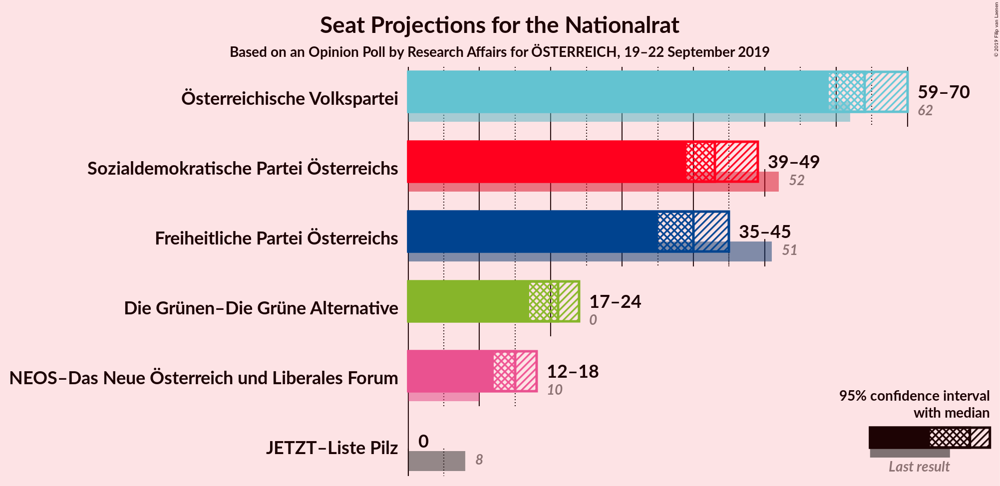
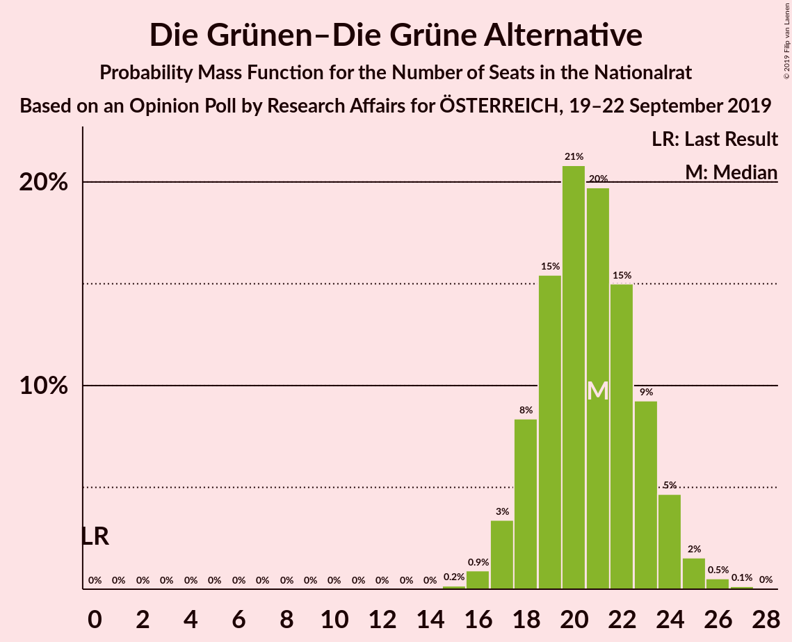
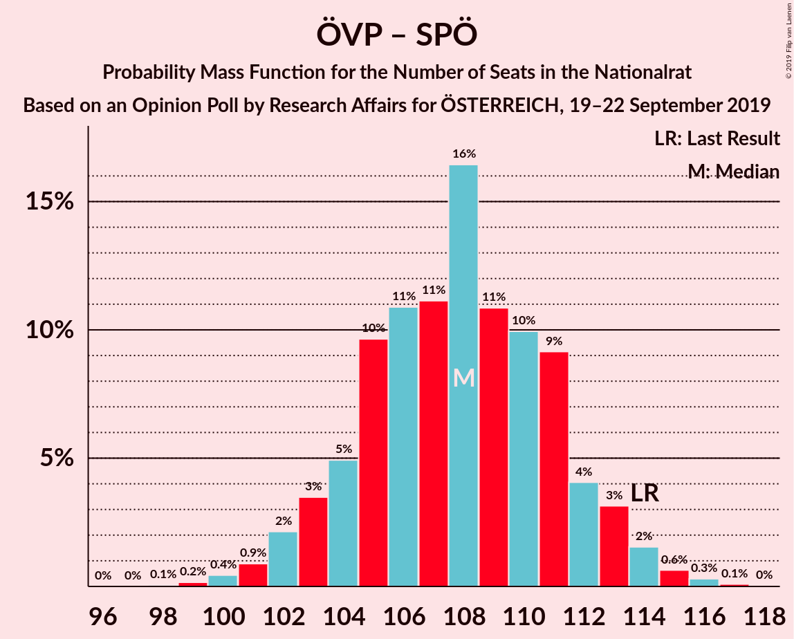
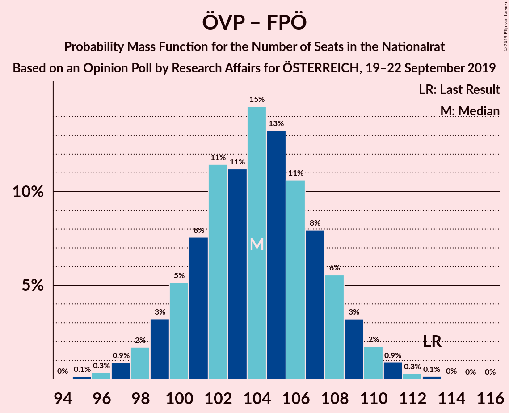
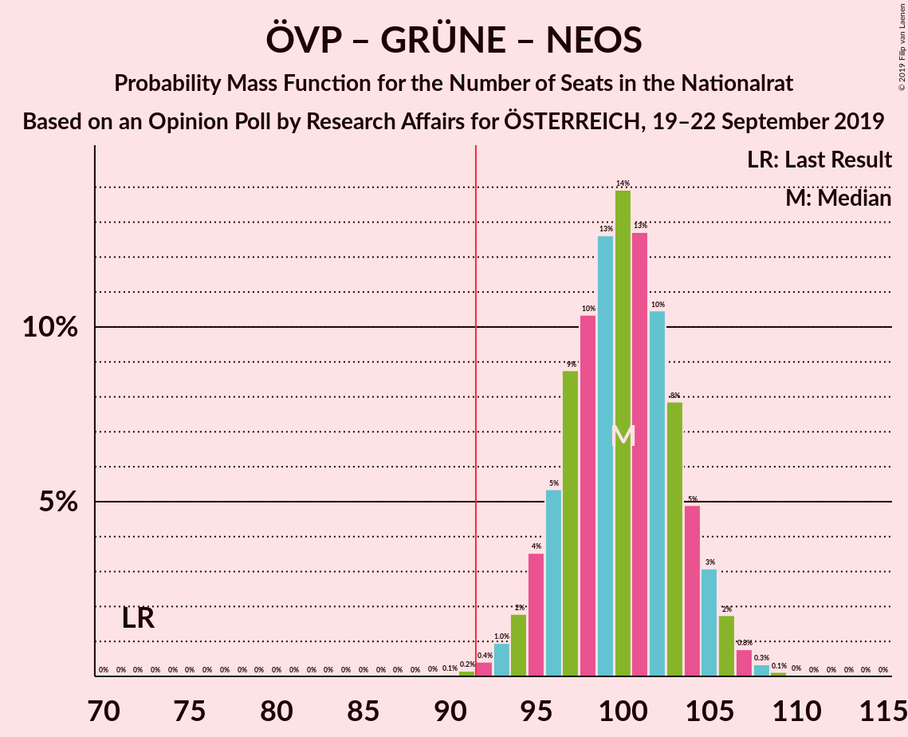
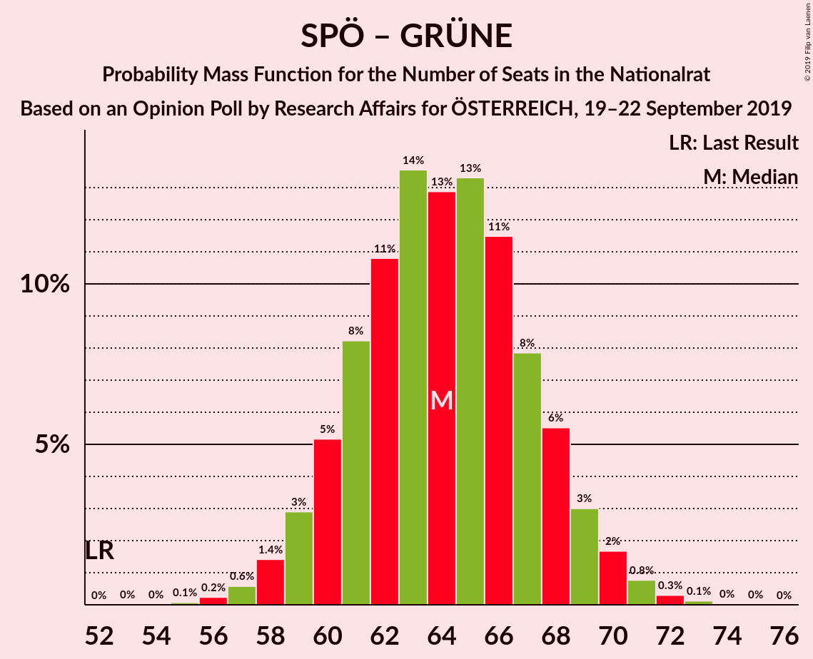

# Opinion Poll by Research Affairs for ÖSTERREICH, 19–22 September 2019

<a href="#voting-intentions">Voting Intentions</a> | <a href="#seats">Seats</a> | <a href="#coalitions">Coalitions</a> | <a href="#technical-information">Technical Information</a>

## Voting Intentions

### Confidence Intervals

| Party | Last Result | Poll Result | 80% Confidence Interval | 90% Confidence Interval | 95% Confidence Interval | 99% Confidence Interval |
|:-----:|:-----------:|:-----------:|:-----------------------:|:-----------------------:|:-----------------------:|:-----------------------:|
| Österreichische Volkspartei | 31.5% | 34.0% | 32.1–36.0% |31.6–36.5% |31.1–37.0% |30.2–38.0% |
| Sozialdemokratische Partei Österreichs | 26.9% | 23.0% | 21.4–24.8% |20.9–25.3% |20.5–25.7% |19.7–26.6% |
| Freiheitliche Partei Österreichs | 26.0% | 21.0% | 19.4–22.7% |19.0–23.2% |18.6–23.6% |17.8–24.5% |
| Die Grünen–Die Grüne Alternative | 3.8% | 11.0% | 9.8–12.4% |9.5–12.8% |9.2–13.1% |8.7–13.8% |
| NEOS–Das Neue Österreich und Liberales Forum | 5.3% | 8.0% | 7.0–9.2% |6.7–9.6% |6.5–9.9% |6.0–10.5% |
| JETZT–Liste Pilz | 4.4% | 2.0% | 1.5–2.7% |1.4–2.9% |1.3–3.1% |1.1–3.4% |

*Note:* The poll result column reflects the actual value used in the calculations. Published results may vary slightly, and in addition be rounded to fewer digits.

## Seats

### Confidence Intervals

| Party | Last Result | Median | 80% Confidence Interval | 90% Confidence Interval | 95% Confidence Interval | 99% Confidence Interval |
|:-----:|:-----------:|:------:|:-----------------------:|:-----------------------:|:-----------------------:|:-----------------------:|
| <a href="#österreichische-volkspartei">Österreichische Volkspartei</a> | 62 | 64 | 61–68 |60–69 |59–70 |57–72 |
| <a href="#sozialdemokratische-partei-österreichs">Sozialdemokratische Partei Österreichs</a> | 52 | 44 | 40–47 |39–48 |39–49 |37–50 |
| <a href="#freiheitliche-partei-österreichs">Freiheitliche Partei Österreichs</a> | 51 | 39 | 36–43 |36–44 |35–45 |34–46 |
| <a href="#die-grünen–die-grüne-alternative">Die Grünen–Die Grüne Alternative</a> | 0 | 20 | 18–23 |18–24 |17–24 |16–26 |
| <a href="#neos–das-neue-österreich-und-liberales-forum">NEOS–Das Neue Österreich und Liberales Forum</a> | 10 | 15 | 13–17 |12–18 |12–18 |11–19 |
| <a href="#jetzt–liste-pilz">JETZT–Liste Pilz</a> | 8 | 0 | 0 |0 |0 |0 |

### Österreichische Volkspartei

*For a full overview of the results for this party, see the [Österreichische Volkspartei](party-österreichischevolkspartei.html) page.*

| Number of Seats | Probability | Accumulated | Special Marks |
|:---------------:|:-----------:|:-----------:|:-------------:|
| 55 | 0% | 100% |  |
| 56 | 0.2% | 99.9% |  |
| 57 | 0.5% | 99.8% |  |
| 58 | 1.2% | 99.3% |  |
| 59 | 2% | 98% |  |
| 60 | 4% | 96% |  |
| 61 | 9% | 92% |  |
| 62 | 9% | 83% | Last Result |
| 63 | 14% | 75% |  |
| 64 | 15% | 61% | Median |
| 65 | 10% | 46% |  |
| 66 | 14% | 36% |  |
| 67 | 9% | 22% |  |
| 68 | 6% | 13% |  |
| 69 | 3% | 7% |  |
| 70 | 2% | 4% |  |
| 71 | 0.9% | 2% |  |
| 72 | 0.5% | 0.8% |  |
| 73 | 0.2% | 0.3% |  |
| 74 | 0.1% | 0.1% |  |
| 75 | 0% | 0% |  |

### Sozialdemokratische Partei Österreichs

*For a full overview of the results for this party, see the [Sozialdemokratische Partei Österreichs](party-sozialdemokratischeparteiösterreichs.html) page.*

| Number of Seats | Probability | Accumulated | Special Marks |
|:---------------:|:-----------:|:-----------:|:-------------:|
| 35 | 0% | 100% |  |
| 36 | 0.2% | 99.9% |  |
| 37 | 0.6% | 99.8% |  |
| 38 | 2% | 99.2% |  |
| 39 | 4% | 98% |  |
| 40 | 4% | 94% |  |
| 41 | 9% | 90% |  |
| 42 | 14% | 81% |  |
| 43 | 13% | 67% |  |
| 44 | 20% | 54% | Median |
| 45 | 15% | 35% |  |
| 46 | 8% | 19% |  |
| 47 | 6% | 11% |  |
| 48 | 3% | 5% |  |
| 49 | 2% | 3% |  |
| 50 | 0.8% | 1.1% |  |
| 51 | 0.2% | 0.3% |  |
| 52 | 0.1% | 0.1% | Last Result |
| 53 | 0% | 0% |  |

### Freiheitliche Partei Österreichs

*For a full overview of the results for this party, see the [Freiheitliche Partei Österreichs](party-freiheitlicheparteiösterreichs.html) page.*

| Number of Seats | Probability | Accumulated | Special Marks |
|:---------------:|:-----------:|:-----------:|:-------------:|
| 32 | 0.1% | 100% |  |
| 33 | 0.3% | 99.9% |  |
| 34 | 1.1% | 99.6% |  |
| 35 | 3% | 98% |  |
| 36 | 6% | 95% |  |
| 37 | 9% | 89% |  |
| 38 | 16% | 81% |  |
| 39 | 15% | 65% | Median |
| 40 | 16% | 49% |  |
| 41 | 10% | 33% |  |
| 42 | 11% | 23% |  |
| 43 | 6% | 12% |  |
| 44 | 3% | 6% |  |
| 45 | 1.4% | 3% |  |
| 46 | 0.9% | 1.3% |  |
| 47 | 0.3% | 0.4% |  |
| 48 | 0.1% | 0.1% |  |
| 49 | 0% | 0% |  |
| 50 | 0% | 0% |  |
| 51 | 0% | 0% | Last Result |

### Die Grünen–Die Grüne Alternative

*For a full overview of the results for this party, see the [Die Grünen–Die Grüne Alternative](party-diegrünen–diegrünealternative.html) page.*

| Number of Seats | Probability | Accumulated | Special Marks |
|:---------------:|:-----------:|:-----------:|:-------------:|
| 0 | 0% | 100% | Last Result |
| 1 | 0% | 100% |  |
| 2 | 0% | 100% |  |
| 3 | 0% | 100% |  |
| 4 | 0% | 100% |  |
| 5 | 0% | 100% |  |
| 6 | 0% | 100% |  |
| 7 | 0% | 100% |  |
| 8 | 0% | 100% |  |
| 9 | 0% | 100% |  |
| 10 | 0% | 100% |  |
| 11 | 0% | 100% |  |
| 12 | 0% | 100% |  |
| 13 | 0% | 100% |  |
| 14 | 0% | 100% |  |
| 15 | 0.2% | 100% |  |
| 16 | 0.9% | 99.8% |  |
| 17 | 3% | 98.9% |  |
| 18 | 8% | 96% |  |
| 19 | 16% | 88% |  |
| 20 | 22% | 71% | Median |
| 21 | 15% | 49% |  |
| 22 | 19% | 34% |  |
| 23 | 8% | 15% |  |
| 24 | 6% | 7% |  |
| 25 | 1.3% | 2% |  |
| 26 | 0.5% | 0.6% |  |
| 27 | 0.1% | 0.2% |  |
| 28 | 0% | 0% |  |

### NEOS–Das Neue Österreich und Liberales Forum

*For a full overview of the results for this party, see the [NEOS–Das Neue Österreich und Liberales Forum](party-neos–dasneueösterreichundliberalesforum.html) page.*

| Number of Seats | Probability | Accumulated | Special Marks |
|:---------------:|:-----------:|:-----------:|:-------------:|
| 10 | 0.1% | 100% | Last Result |
| 11 | 1.1% | 99.9% |  |
| 12 | 5% | 98.8% |  |
| 13 | 16% | 93% |  |
| 14 | 20% | 78% |  |
| 15 | 23% | 58% | Median |
| 16 | 18% | 35% |  |
| 17 | 11% | 17% |  |
| 18 | 4% | 6% |  |
| 19 | 2% | 2% |  |
| 20 | 0.4% | 0.5% |  |
| 21 | 0.1% | 0.1% |  |
| 22 | 0% | 0% |  |

### JETZT–Liste Pilz

*For a full overview of the results for this party, see the [JETZT–Liste Pilz](party-jetzt–listepilz.html) page.*

| Number of Seats | Probability | Accumulated | Special Marks |
|:---------------:|:-----------:|:-----------:|:-------------:|
| 0 | 100% | 100% | Median |
| 1 | 0% | 0% |  |
| 2 | 0% | 0% |  |
| 3 | 0% | 0% |  |
| 4 | 0% | 0% |  |
| 5 | 0% | 0% |  |
| 6 | 0% | 0% |  |
| 7 | 0% | 0% |  |
| 8 | 0% | 0% | Last Result |

## Coalitions

### Confidence Intervals

| Coalition | Last Result | Median | Majority? | 80% Confidence Interval | 90% Confidence Interval | 95% Confidence Interval | 99% Confidence Interval |
|:---------:|:-----------:|:------:|:---------:|:-----------------------:|:-----------------------:|:-----------------------:|:-----------------------:|
| Österreichische Volkspartei – Sozialdemokratische Partei Österreichs | 114 | 108 | 100% | 104–111 | 103–113 | 102–114 | 100–115 |
| Österreichische Volkspartei – Freiheitliche Partei Österreichs | 113 | 104 | 100% | 100–108 | 99–109 | 98–109 | 96–112 |
| Österreichische Volkspartei – Die Grünen–Die Grüne Alternative – NEOS–Das Neue Österreich und Liberales Forum | 72 | 100 | 99.8% | 96–104 | 95–105 | 94–106 | 92–108 |
| Österreichische Volkspartei – Die Grünen–Die Grüne Alternative | 62 | 85 | 2% | 81–89 | 80–90 | 79–91 | 77–92 |
| Sozialdemokratische Partei Österreichs – Freiheitliche Partei Österreichs | 103 | 83 | 0.2% | 79–87 | 78–88 | 77–89 | 75–91 |
| Sozialdemokratische Partei Österreichs – Die Grünen–Die Grüne Alternative – NEOS–Das Neue Österreich und Liberales Forum | 62 | 79 | 0% | 75–83 | 74–84 | 74–85 | 71–86 |
| Österreichische Volkspartei – NEOS–Das Neue Österreich und Liberales Forum | 72 | 79 | 0% | 75–83 | 74–84 | 74–85 | 72–87 |
| Sozialdemokratische Partei Österreichs – Die Grünen–Die Grüne Alternative | 52 | 64 | 0% | 60–68 | 60–69 | 59–70 | 57–71 |
| Österreichische Volkspartei | 62 | 64 | 0% | 61–68 | 60–69 | 59–70 | 57–72 |
| Sozialdemokratische Partei Österreichs | 52 | 44 | 0% | 40–47 | 39–48 | 39–49 | 37–50 |

### Österreichische Volkspartei – Sozialdemokratische Partei Österreichs

| Number of Seats | Probability | Accumulated | Special Marks |
|:---------------:|:-----------:|:-----------:|:-------------:|
| 98 | 0% | 100% |  |
| 99 | 0.2% | 99.9% |  |
| 100 | 0.7% | 99.8% |  |
| 101 | 0.3% | 99.1% |  |
| 102 | 3% | 98.7% |  |
| 103 | 3% | 96% |  |
| 104 | 5% | 93% |  |
| 105 | 8% | 88% |  |
| 106 | 13% | 79% |  |
| 107 | 9% | 66% |  |
| 108 | 17% | 57% | Median |
| 109 | 8% | 39% |  |
| 110 | 6% | 32% |  |
| 111 | 17% | 25% |  |
| 112 | 3% | 9% |  |
| 113 | 2% | 6% |  |
| 114 | 3% | 4% | Last Result |
| 115 | 0.8% | 1.1% |  |
| 116 | 0.1% | 0.3% |  |
| 117 | 0.1% | 0.2% |  |
| 118 | 0% | 0% |  |

### Österreichische Volkspartei – Freiheitliche Partei Österreichs

| Number of Seats | Probability | Accumulated | Special Marks |
|:---------------:|:-----------:|:-----------:|:-------------:|
| 94 | 0.1% | 100% |  |
| 95 | 0.1% | 99.9% |  |
| 96 | 0.3% | 99.8% |  |
| 97 | 0.8% | 99.5% |  |
| 98 | 2% | 98.6% |  |
| 99 | 3% | 97% |  |
| 100 | 5% | 93% |  |
| 101 | 8% | 88% |  |
| 102 | 14% | 80% |  |
| 103 | 10% | 66% | Median |
| 104 | 14% | 56% |  |
| 105 | 11% | 42% |  |
| 106 | 11% | 31% |  |
| 107 | 10% | 20% |  |
| 108 | 4% | 10% |  |
| 109 | 5% | 7% |  |
| 110 | 1.0% | 2% |  |
| 111 | 0.8% | 1.3% |  |
| 112 | 0.3% | 0.5% |  |
| 113 | 0.1% | 0.2% | Last Result |
| 114 | 0% | 0.1% |  |
| 115 | 0% | 0% |  |

### Österreichische Volkspartei – Die Grünen–Die Grüne Alternative – NEOS–Das Neue Österreich und Liberales Forum

| Number of Seats | Probability | Accumulated | Special Marks |
|:---------------:|:-----------:|:-----------:|:-------------:|
| 72 | 0% | 100% | Last Result |
| 73 | 0% | 100% |  |
| 74 | 0% | 100% |  |
| 75 | 0% | 100% |  |
| 76 | 0% | 100% |  |
| 77 | 0% | 100% |  |
| 78 | 0% | 100% |  |
| 79 | 0% | 100% |  |
| 80 | 0% | 100% |  |
| 81 | 0% | 100% |  |
| 82 | 0% | 100% |  |
| 83 | 0% | 100% |  |
| 84 | 0% | 100% |  |
| 85 | 0% | 100% |  |
| 86 | 0% | 100% |  |
| 87 | 0% | 100% |  |
| 88 | 0% | 100% |  |
| 89 | 0% | 100% |  |
| 90 | 0.1% | 100% |  |
| 91 | 0.1% | 99.9% |  |
| 92 | 0.5% | 99.8% | Majority |
| 93 | 0.9% | 99.3% |  |
| 94 | 1.5% | 98% |  |
| 95 | 4% | 97% |  |
| 96 | 5% | 93% |  |
| 97 | 8% | 88% |  |
| 98 | 12% | 81% |  |
| 99 | 13% | 69% | Median |
| 100 | 16% | 55% |  |
| 101 | 12% | 39% |  |
| 102 | 10% | 28% |  |
| 103 | 7% | 18% |  |
| 104 | 5% | 11% |  |
| 105 | 3% | 6% |  |
| 106 | 2% | 3% |  |
| 107 | 0.8% | 1.4% |  |
| 108 | 0.4% | 0.6% |  |
| 109 | 0.1% | 0.2% |  |
| 110 | 0% | 0% |  |

### Österreichische Volkspartei – Die Grünen–Die Grüne Alternative

| Number of Seats | Probability | Accumulated | Special Marks |
|:---------------:|:-----------:|:-----------:|:-------------:|
| 62 | 0% | 100% | Last Result |
| 63 | 0% | 100% |  |
| 64 | 0% | 100% |  |
| 65 | 0% | 100% |  |
| 66 | 0% | 100% |  |
| 67 | 0% | 100% |  |
| 68 | 0% | 100% |  |
| 69 | 0% | 100% |  |
| 70 | 0% | 100% |  |
| 71 | 0% | 100% |  |
| 72 | 0% | 100% |  |
| 73 | 0% | 100% |  |
| 74 | 0% | 100% |  |
| 75 | 0% | 100% |  |
| 76 | 0.1% | 100% |  |
| 77 | 0.5% | 99.9% |  |
| 78 | 0.7% | 99.4% |  |
| 79 | 2% | 98.7% |  |
| 80 | 3% | 96% |  |
| 81 | 5% | 93% |  |
| 82 | 6% | 88% |  |
| 83 | 11% | 82% |  |
| 84 | 14% | 72% | Median |
| 85 | 13% | 57% |  |
| 86 | 19% | 44% |  |
| 87 | 9% | 25% |  |
| 88 | 5% | 16% |  |
| 89 | 3% | 12% |  |
| 90 | 5% | 9% |  |
| 91 | 2% | 3% |  |
| 92 | 1.3% | 2% | Majority |
| 93 | 0.3% | 0.5% |  |
| 94 | 0.1% | 0.2% |  |
| 95 | 0% | 0.1% |  |
| 96 | 0% | 0% |  |

### Sozialdemokratische Partei Österreichs – Freiheitliche Partei Österreichs

| Number of Seats | Probability | Accumulated | Special Marks |
|:---------------:|:-----------:|:-----------:|:-------------:|
| 74 | 0.1% | 100% |  |
| 75 | 0.4% | 99.8% |  |
| 76 | 0.8% | 99.4% |  |
| 77 | 2% | 98.6% |  |
| 78 | 3% | 97% |  |
| 79 | 5% | 94% |  |
| 80 | 7% | 89% |  |
| 81 | 10% | 82% |  |
| 82 | 12% | 72% |  |
| 83 | 16% | 61% | Median |
| 84 | 13% | 45% |  |
| 85 | 12% | 31% |  |
| 86 | 8% | 19% |  |
| 87 | 5% | 12% |  |
| 88 | 4% | 7% |  |
| 89 | 1.5% | 3% |  |
| 90 | 0.9% | 2% |  |
| 91 | 0.5% | 0.7% |  |
| 92 | 0.1% | 0.2% | Majority |
| 93 | 0.1% | 0.1% |  |
| 94 | 0% | 0% |  |
| 95 | 0% | 0% |  |
| 96 | 0% | 0% |  |
| 97 | 0% | 0% |  |
| 98 | 0% | 0% |  |
| 99 | 0% | 0% |  |
| 100 | 0% | 0% |  |
| 101 | 0% | 0% |  |
| 102 | 0% | 0% |  |
| 103 | 0% | 0% | Last Result |

### Sozialdemokratische Partei Österreichs – Die Grünen–Die Grüne Alternative – NEOS–Das Neue Österreich und Liberales Forum

| Number of Seats | Probability | Accumulated | Special Marks |
|:---------------:|:-----------:|:-----------:|:-------------:|
| 62 | 0% | 100% | Last Result |
| 63 | 0% | 100% |  |
| 64 | 0% | 100% |  |
| 65 | 0% | 100% |  |
| 66 | 0% | 100% |  |
| 67 | 0% | 100% |  |
| 68 | 0% | 100% |  |
| 69 | 0% | 100% |  |
| 70 | 0.1% | 99.9% |  |
| 71 | 0.3% | 99.8% |  |
| 72 | 0.8% | 99.5% |  |
| 73 | 1.0% | 98.7% |  |
| 74 | 5% | 98% |  |
| 75 | 4% | 93% |  |
| 76 | 10% | 90% |  |
| 77 | 11% | 80% |  |
| 78 | 11% | 69% |  |
| 79 | 14% | 58% | Median |
| 80 | 10% | 44% |  |
| 81 | 14% | 34% |  |
| 82 | 8% | 20% |  |
| 83 | 5% | 12% |  |
| 84 | 3% | 7% |  |
| 85 | 2% | 3% |  |
| 86 | 0.8% | 1.3% |  |
| 87 | 0.3% | 0.5% |  |
| 88 | 0.1% | 0.2% |  |
| 89 | 0% | 0.1% |  |
| 90 | 0% | 0% |  |

### Österreichische Volkspartei – NEOS–Das Neue Österreich und Liberales Forum

| Number of Seats | Probability | Accumulated | Special Marks |
|:---------------:|:-----------:|:-----------:|:-------------:|
| 70 | 0.1% | 100% |  |
| 71 | 0.4% | 99.9% |  |
| 72 | 0.4% | 99.5% | Last Result |
| 73 | 1.3% | 99.1% |  |
| 74 | 3% | 98% |  |
| 75 | 5% | 95% |  |
| 76 | 7% | 89% |  |
| 77 | 9% | 82% |  |
| 78 | 13% | 73% |  |
| 79 | 12% | 60% | Median |
| 80 | 15% | 48% |  |
| 81 | 12% | 33% |  |
| 82 | 7% | 21% |  |
| 83 | 4% | 13% |  |
| 84 | 6% | 9% |  |
| 85 | 2% | 3% |  |
| 86 | 0.7% | 2% |  |
| 87 | 0.6% | 0.9% |  |
| 88 | 0.3% | 0.4% |  |
| 89 | 0% | 0.1% |  |
| 90 | 0% | 0% |  |

### Sozialdemokratische Partei Österreichs – Die Grünen–Die Grüne Alternative

| Number of Seats | Probability | Accumulated | Special Marks |
|:---------------:|:-----------:|:-----------:|:-------------:|
| 52 | 0% | 100% | Last Result |
| 53 | 0% | 100% |  |
| 54 | 0% | 100% |  |
| 55 | 0.1% | 100% |  |
| 56 | 0.2% | 99.9% |  |
| 57 | 0.7% | 99.7% |  |
| 58 | 1.2% | 98.9% |  |
| 59 | 2% | 98% |  |
| 60 | 6% | 96% |  |
| 61 | 9% | 89% |  |
| 62 | 7% | 81% |  |
| 63 | 14% | 73% |  |
| 64 | 10% | 59% | Median |
| 65 | 14% | 49% |  |
| 66 | 15% | 35% |  |
| 67 | 8% | 19% |  |
| 68 | 4% | 11% |  |
| 69 | 4% | 7% |  |
| 70 | 2% | 3% |  |
| 71 | 0.7% | 1.1% |  |
| 72 | 0.2% | 0.4% |  |
| 73 | 0.1% | 0.2% |  |
| 74 | 0% | 0.1% |  |
| 75 | 0% | 0% |  |

### Österreichische Volkspartei

| Number of Seats | Probability | Accumulated | Special Marks |
|:---------------:|:-----------:|:-----------:|:-------------:|
| 55 | 0% | 100% |  |
| 56 | 0.2% | 99.9% |  |
| 57 | 0.5% | 99.8% |  |
| 58 | 1.2% | 99.3% |  |
| 59 | 2% | 98% |  |
| 60 | 4% | 96% |  |
| 61 | 9% | 92% |  |
| 62 | 9% | 83% | Last Result |
| 63 | 14% | 75% |  |
| 64 | 15% | 61% | Median |
| 65 | 10% | 46% |  |
| 66 | 14% | 36% |  |
| 67 | 9% | 22% |  |
| 68 | 6% | 13% |  |
| 69 | 3% | 7% |  |
| 70 | 2% | 4% |  |
| 71 | 0.9% | 2% |  |
| 72 | 0.5% | 0.8% |  |
| 73 | 0.2% | 0.3% |  |
| 74 | 0.1% | 0.1% |  |
| 75 | 0% | 0% |  |

### Sozialdemokratische Partei Österreichs

| Number of Seats | Probability | Accumulated | Special Marks |
|:---------------:|:-----------:|:-----------:|:-------------:|
| 35 | 0% | 100% |  |
| 36 | 0.2% | 99.9% |  |
| 37 | 0.6% | 99.8% |  |
| 38 | 2% | 99.2% |  |
| 39 | 4% | 98% |  |
| 40 | 4% | 94% |  |
| 41 | 9% | 90% |  |
| 42 | 14% | 81% |  |
| 43 | 13% | 67% |  |
| 44 | 20% | 54% | Median |
| 45 | 15% | 35% |  |
| 46 | 8% | 19% |  |
| 47 | 6% | 11% |  |
| 48 | 3% | 5% |  |
| 49 | 2% | 3% |  |
| 50 | 0.8% | 1.1% |  |
| 51 | 0.2% | 0.3% |  |
| 52 | 0.1% | 0.1% | Last Result |
| 53 | 0% | 0% |  |

## Technical Information

### Opinion Poll

+ **Polling firm:** Research Affairs
+ **Commissioner(s):** ÖSTERREICH
+ **Fieldwork period:** 19–22 September 2019

### Calculations

+ **Sample size:** 1000
+ **Simulations done:** 131,072
+ **Error estimate:** 1.02%

