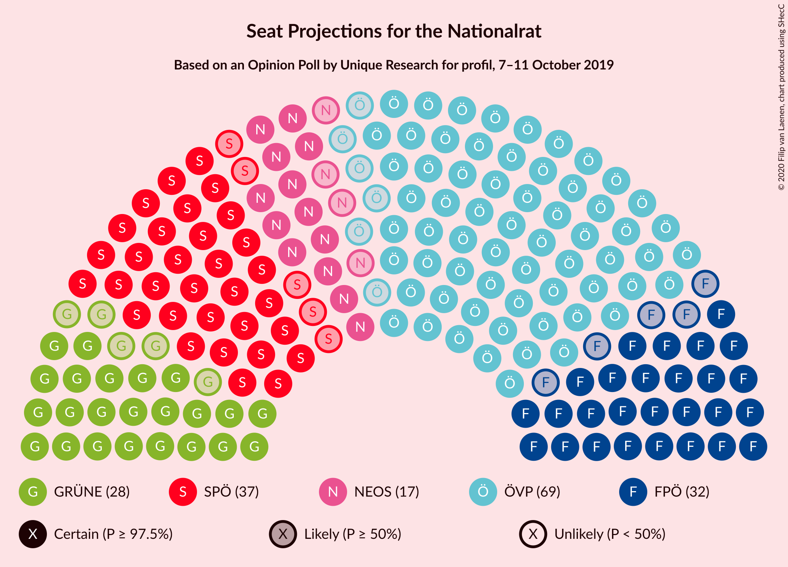
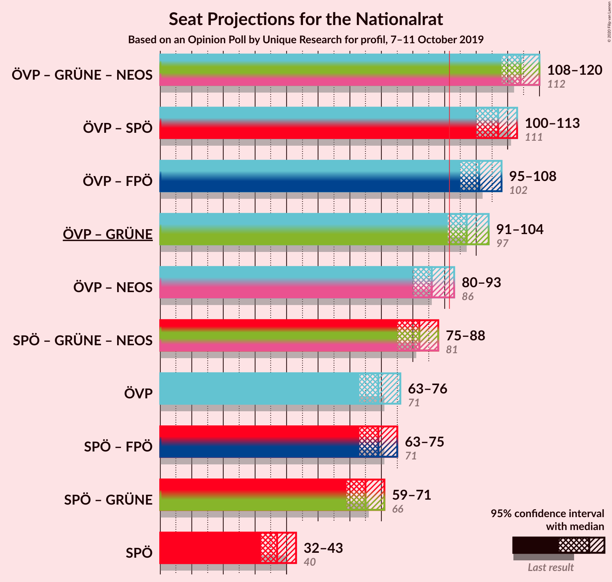
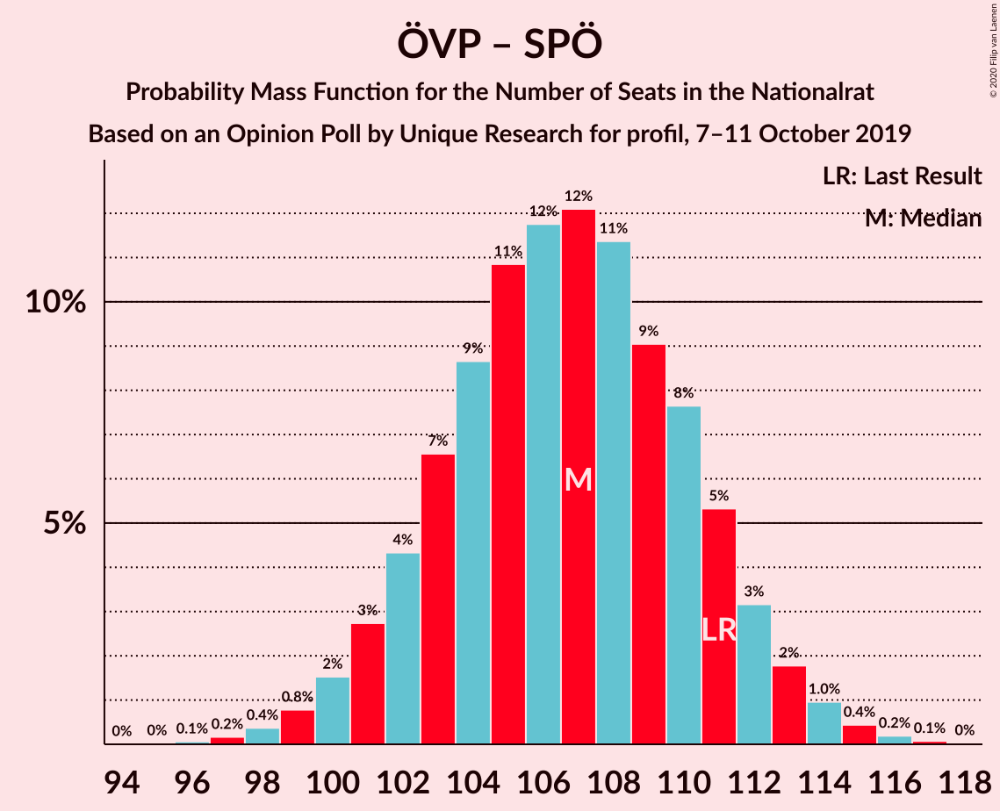
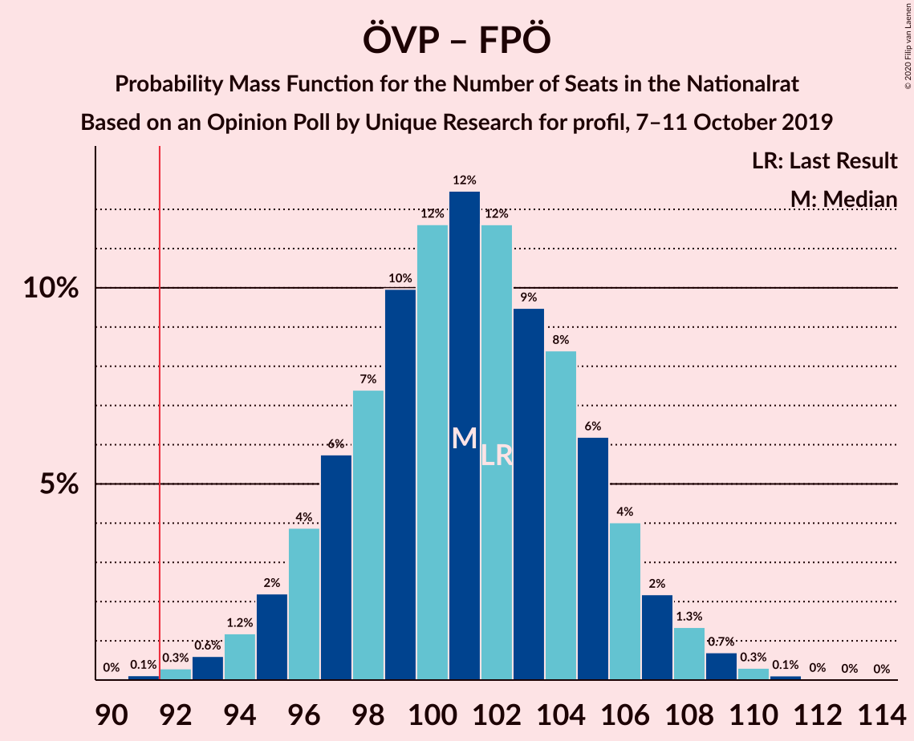
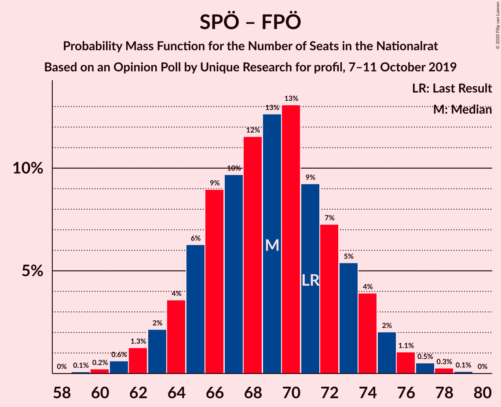

# Opinion Poll by Unique Research for profil, 7–11 October 2019

<a href="#voting-intentions">Voting Intentions</a> | <a href="#seats">Seats</a> | <a href="#coalitions">Coalitions</a> | <a href="#technical-information">Technical Information</a>

## Voting Intentions

### Confidence Intervals

| Party | Last Result | Poll Result | 80% Confidence Interval | 90% Confidence Interval | 95% Confidence Interval | 99% Confidence Interval |
|:-----:|:-----------:|:-----------:|:-----------------------:|:-----------------------:|:-----------------------:|:-----------------------:|
| Österreichische Volkspartei | 37.5% | 37.1% | 34.9–39.3% |34.3–39.9% |33.8–40.5% |32.8–41.5% |
| Sozialdemokratische Partei Österreichs | 21.2% | 20.0% | 18.2–21.9% |17.7–22.4% |17.3–22.9% |16.5–23.8% |
| Freiheitliche Partei Österreichs | 16.2% | 17.0% | 15.4–18.8% |14.9–19.3% |14.5–19.7% |13.8–20.6% |
| Die Grünen–Die Grüne Alternative | 13.9% | 15.0% | 13.5–16.7% |13.1–17.2% |12.7–17.6% |12.0–18.5% |
| NEOS–Das Neue Österreich und Liberales Forum | 8.1% | 9.0% | 7.9–10.5% |7.5–10.9% |7.3–11.2% |6.7–11.9% |

*Note:* The poll result column reflects the actual value used in the calculations. Published results may vary slightly, and in addition be rounded to fewer digits.

## Seats

### Confidence Intervals

| Party | Last Result | Median | 80% Confidence Interval | 90% Confidence Interval | 95% Confidence Interval | 99% Confidence Interval |
|:-----:|:-----------:|:------:|:-----------------------:|:-----------------------:|:-----------------------:|:-----------------------:|
| <a href="#österreichische-volkspartei">Österreichische Volkspartei</a> | 71 | 69 | 65–73 |64–75 |63–76 |61–78 |
| <a href="#sozialdemokratische-partei-österreichs">Sozialdemokratische Partei Österreichs</a> | 40 | 37 | 34–41 |33–42 |32–43 |31–44 |
| <a href="#freiheitliche-partei-österreichs">Freiheitliche Partei Österreichs</a> | 31 | 32 | 28–35 |28–36 |27–37 |26–38 |
| <a href="#die-grünen–die-grüne-alternative">Die Grünen–Die Grüne Alternative</a> | 26 | 28 | 25–31 |24–32 |23–33 |22–34 |
| <a href="#neos–das-neue-österreich-und-liberales-forum">NEOS–Das Neue Österreich und Liberales Forum</a> | 15 | 17 | 14–19 |14–20 |13–21 |12–22 |

### Österreichische Volkspartei

*For a full overview of the results for this party, see the [Österreichische Volkspartei](party-österreichischevolkspartei.html) page.*

| Number of Seats | Probability | Accumulated | Special Marks |
|:---------------:|:-----------:|:-----------:|:-------------:|
| 59 | 0.1% | 100% |  |
| 60 | 0.1% | 99.9% |  |
| 61 | 0.3% | 99.8% |  |
| 62 | 0.8% | 99.4% |  |
| 63 | 2% | 98.7% |  |
| 64 | 2% | 97% |  |
| 65 | 6% | 94% |  |
| 66 | 5% | 88% |  |
| 67 | 11% | 83% |  |
| 68 | 8% | 71% |  |
| 69 | 16% | 63% | Median |
| 70 | 10% | 48% |  |
| 71 | 13% | 38% | Last Result |
| 72 | 7% | 25% |  |
| 73 | 8% | 18% |  |
| 74 | 3% | 10% |  |
| 75 | 4% | 6% |  |
| 76 | 1.5% | 3% |  |
| 77 | 0.7% | 1.3% |  |
| 78 | 0.3% | 0.6% |  |
| 79 | 0.2% | 0.2% |  |
| 80 | 0.1% | 0.1% |  |
| 81 | 0% | 0% |  |

### Sozialdemokratische Partei Österreichs

*For a full overview of the results for this party, see the [Sozialdemokratische Partei Österreichs](party-sozialdemokratischeparteiösterreichs.html) page.*

| Number of Seats | Probability | Accumulated | Special Marks |
|:---------------:|:-----------:|:-----------:|:-------------:|
| 29 | 0.1% | 100% |  |
| 30 | 0.3% | 99.9% |  |
| 31 | 0.9% | 99.6% |  |
| 32 | 2% | 98.8% |  |
| 33 | 4% | 97% |  |
| 34 | 8% | 93% |  |
| 35 | 10% | 85% |  |
| 36 | 13% | 75% |  |
| 37 | 16% | 61% | Median |
| 38 | 14% | 45% |  |
| 39 | 11% | 31% |  |
| 40 | 8% | 20% | Last Result |
| 41 | 7% | 12% |  |
| 42 | 3% | 5% |  |
| 43 | 1.5% | 3% |  |
| 44 | 0.7% | 1.1% |  |
| 45 | 0.3% | 0.4% |  |
| 46 | 0.1% | 0.1% |  |
| 47 | 0% | 0% |  |

### Freiheitliche Partei Österreichs

*For a full overview of the results for this party, see the [Freiheitliche Partei Österreichs](party-freiheitlicheparteiösterreichs.html) page.*

| Number of Seats | Probability | Accumulated | Special Marks |
|:---------------:|:-----------:|:-----------:|:-------------:|
| 24 | 0.1% | 100% |  |
| 25 | 0.4% | 99.9% |  |
| 26 | 1.2% | 99.5% |  |
| 27 | 3% | 98% |  |
| 28 | 6% | 96% |  |
| 29 | 8% | 90% |  |
| 30 | 14% | 81% |  |
| 31 | 16% | 67% | Last Result |
| 32 | 15% | 51% | Median |
| 33 | 14% | 36% |  |
| 34 | 9% | 22% |  |
| 35 | 6% | 13% |  |
| 36 | 4% | 7% |  |
| 37 | 2% | 3% |  |
| 38 | 0.8% | 1.2% |  |
| 39 | 0.3% | 0.4% |  |
| 40 | 0.1% | 0.1% |  |
| 41 | 0% | 0% |  |

### Die Grünen–Die Grüne Alternative

*For a full overview of the results for this party, see the [Die Grünen–Die Grüne Alternative](party-diegrünen–diegrünealternative.html) page.*

| Number of Seats | Probability | Accumulated | Special Marks |
|:---------------:|:-----------:|:-----------:|:-------------:|
| 21 | 0.2% | 100% |  |
| 22 | 0.7% | 99.8% |  |
| 23 | 2% | 99.2% |  |
| 24 | 4% | 97% |  |
| 25 | 9% | 93% |  |
| 26 | 12% | 84% | Last Result |
| 27 | 15% | 72% |  |
| 28 | 19% | 57% | Median |
| 29 | 15% | 38% |  |
| 30 | 9% | 23% |  |
| 31 | 7% | 14% |  |
| 32 | 4% | 7% |  |
| 33 | 1.5% | 3% |  |
| 34 | 0.8% | 1.2% |  |
| 35 | 0.3% | 0.5% |  |
| 36 | 0.1% | 0.1% |  |
| 37 | 0% | 0% |  |

### NEOS–Das Neue Österreich und Liberales Forum

*For a full overview of the results for this party, see the [NEOS–Das Neue Österreich und Liberales Forum](party-neos–dasneueösterreichundliberalesforum.html) page.*

| Number of Seats | Probability | Accumulated | Special Marks |
|:---------------:|:-----------:|:-----------:|:-------------:|
| 11 | 0.1% | 100% |  |
| 12 | 0.7% | 99.9% |  |
| 13 | 3% | 99.2% |  |
| 14 | 8% | 96% |  |
| 15 | 14% | 88% | Last Result |
| 16 | 19% | 74% |  |
| 17 | 22% | 55% | Median |
| 18 | 15% | 33% |  |
| 19 | 10% | 18% |  |
| 20 | 5% | 8% |  |
| 21 | 2% | 3% |  |
| 22 | 0.7% | 1.0% |  |
| 23 | 0.2% | 0.3% |  |
| 24 | 0.1% | 0.1% |  |
| 25 | 0% | 0% |  |

## Coalitions

### Confidence Intervals

| Coalition | Last Result | Median | Majority? | 80% Confidence Interval | 90% Confidence Interval | 95% Confidence Interval | 99% Confidence Interval |
|:---------:|:-----------:|:------:|:---------:|:-----------------------:|:-----------------------:|:-----------------------:|:-----------------------:|
| Österreichische Volkspartei – Die Grünen–Die Grüne Alternative – NEOS–Das Neue Österreich und Liberales Forum | 112 | 114 | 100% | 110–118 | 109–119 | 108–120 | 106–122 |
| Österreichische Volkspartei – Sozialdemokratische Partei Österreichs | 111 | 107 | 100% | 102–111 | 101–112 | 100–113 | 98–115 |
| Österreichische Volkspartei – Freiheitliche Partei Österreichs | 102 | 101 | 99.8% | 97–105 | 96–106 | 95–108 | 93–110 |
| Österreichische Volkspartei – Die Grünen–Die Grüne Alternative | 97 | 97 | 96% | 93–102 | 92–103 | 91–104 | 89–106 |
| Österreichische Volkspartei – NEOS–Das Neue Österreich und Liberales Forum | 86 | 86 | 6% | 82–90 | 81–92 | 80–93 | 78–95 |
| Sozialdemokratische Partei Österreichs – Die Grünen–Die Grüne Alternative – NEOS–Das Neue Österreich und Liberales Forum | 81 | 82 | 0.2% | 78–86 | 77–87 | 75–88 | 73–90 |
| Österreichische Volkspartei | 71 | 69 | 0% | 65–73 | 64–75 | 63–76 | 61–78 |
| Sozialdemokratische Partei Österreichs – Freiheitliche Partei Österreichs | 71 | 69 | 0% | 65–73 | 64–74 | 63–75 | 61–77 |
| Sozialdemokratische Partei Österreichs – Die Grünen–Die Grüne Alternative | 66 | 65 | 0% | 61–69 | 60–70 | 59–71 | 57–73 |
| Sozialdemokratische Partei Österreichs | 40 | 37 | 0% | 34–41 | 33–42 | 32–43 | 31–44 |

### Österreichische Volkspartei – Die Grünen–Die Grüne Alternative – NEOS–Das Neue Österreich und Liberales Forum

| Number of Seats | Probability | Accumulated | Special Marks |
|:---------------:|:-----------:|:-----------:|:-------------:|
| 103 | 0% | 100% |  |
| 104 | 0.1% | 99.9% |  |
| 105 | 0.3% | 99.9% |  |
| 106 | 0.5% | 99.5% |  |
| 107 | 1.2% | 99.0% |  |
| 108 | 2% | 98% |  |
| 109 | 4% | 96% |  |
| 110 | 6% | 93% |  |
| 111 | 8% | 86% |  |
| 112 | 9% | 79% | Last Result |
| 113 | 11% | 70% |  |
| 114 | 15% | 59% | Median |
| 115 | 13% | 44% |  |
| 116 | 9% | 31% |  |
| 117 | 8% | 23% |  |
| 118 | 6% | 14% |  |
| 119 | 4% | 8% |  |
| 120 | 2% | 4% |  |
| 121 | 1.1% | 2% |  |
| 122 | 0.6% | 1.0% |  |
| 123 | 0.3% | 0.4% |  |
| 124 | 0.1% | 0.1% |  |
| 125 | 0% | 0% |  |

### Österreichische Volkspartei – Sozialdemokratische Partei Österreichs

| Number of Seats | Probability | Accumulated | Special Marks |
|:---------------:|:-----------:|:-----------:|:-------------:|
| 96 | 0.1% | 100% |  |
| 97 | 0.2% | 99.9% |  |
| 98 | 0.3% | 99.8% |  |
| 99 | 0.7% | 99.4% |  |
| 100 | 2% | 98.8% |  |
| 101 | 3% | 97% |  |
| 102 | 4% | 94% |  |
| 103 | 6% | 90% |  |
| 104 | 8% | 84% |  |
| 105 | 11% | 76% |  |
| 106 | 12% | 65% | Median |
| 107 | 12% | 53% |  |
| 108 | 12% | 41% |  |
| 109 | 8% | 28% |  |
| 110 | 8% | 21% |  |
| 111 | 5% | 12% | Last Result |
| 112 | 3% | 7% |  |
| 113 | 2% | 3% |  |
| 114 | 1.0% | 2% |  |
| 115 | 0.4% | 0.7% |  |
| 116 | 0.2% | 0.3% |  |
| 117 | 0.1% | 0.1% |  |
| 118 | 0% | 0% |  |

### Österreichische Volkspartei – Freiheitliche Partei Österreichs

| Number of Seats | Probability | Accumulated | Special Marks |
|:---------------:|:-----------:|:-----------:|:-------------:|
| 90 | 0% | 100% |  |
| 91 | 0.1% | 99.9% |  |
| 92 | 0.3% | 99.8% | Majority |
| 93 | 0.7% | 99.6% |  |
| 94 | 1.3% | 98.9% |  |
| 95 | 2% | 98% |  |
| 96 | 4% | 96% |  |
| 97 | 5% | 92% |  |
| 98 | 9% | 86% |  |
| 99 | 9% | 78% |  |
| 100 | 11% | 69% |  |
| 101 | 11% | 57% | Median |
| 102 | 13% | 46% | Last Result |
| 103 | 10% | 33% |  |
| 104 | 7% | 23% |  |
| 105 | 7% | 15% |  |
| 106 | 4% | 9% |  |
| 107 | 2% | 5% |  |
| 108 | 1.3% | 3% |  |
| 109 | 0.6% | 1.2% |  |
| 110 | 0.3% | 0.6% |  |
| 111 | 0.2% | 0.2% |  |
| 112 | 0% | 0.1% |  |
| 113 | 0% | 0% |  |

### Österreichische Volkspartei – Die Grünen–Die Grüne Alternative

| Number of Seats | Probability | Accumulated | Special Marks |
|:---------------:|:-----------:|:-----------:|:-------------:|
| 86 | 0% | 100% |  |
| 87 | 0.1% | 99.9% |  |
| 88 | 0.3% | 99.9% |  |
| 89 | 0.4% | 99.6% |  |
| 90 | 1.0% | 99.2% |  |
| 91 | 2% | 98% |  |
| 92 | 4% | 96% | Majority |
| 93 | 4% | 92% |  |
| 94 | 8% | 88% |  |
| 95 | 10% | 80% |  |
| 96 | 10% | 70% |  |
| 97 | 12% | 61% | Last Result, Median |
| 98 | 13% | 49% |  |
| 99 | 11% | 36% |  |
| 100 | 8% | 25% |  |
| 101 | 6% | 17% |  |
| 102 | 5% | 11% |  |
| 103 | 3% | 6% |  |
| 104 | 1.5% | 3% |  |
| 105 | 0.7% | 1.4% |  |
| 106 | 0.4% | 0.7% |  |
| 107 | 0.2% | 0.3% |  |
| 108 | 0.1% | 0.1% |  |
| 109 | 0% | 0% |  |

### Österreichische Volkspartei – NEOS–Das Neue Österreich und Liberales Forum

| Number of Seats | Probability | Accumulated | Special Marks |
|:---------------:|:-----------:|:-----------:|:-------------:|
| 75 | 0% | 100% |  |
| 76 | 0.1% | 99.9% |  |
| 77 | 0.3% | 99.8% |  |
| 78 | 0.5% | 99.6% |  |
| 79 | 1.2% | 99.0% |  |
| 80 | 2% | 98% |  |
| 81 | 3% | 96% |  |
| 82 | 6% | 93% |  |
| 83 | 7% | 87% |  |
| 84 | 10% | 79% |  |
| 85 | 11% | 70% |  |
| 86 | 13% | 58% | Last Result, Median |
| 87 | 11% | 46% |  |
| 88 | 11% | 35% |  |
| 89 | 8% | 24% |  |
| 90 | 6% | 16% |  |
| 91 | 4% | 10% |  |
| 92 | 3% | 6% | Majority |
| 93 | 2% | 3% |  |
| 94 | 0.7% | 1.3% |  |
| 95 | 0.4% | 0.6% |  |
| 96 | 0.1% | 0.2% |  |
| 97 | 0.1% | 0.1% |  |
| 98 | 0% | 0% |  |

### Sozialdemokratische Partei Österreichs – Die Grünen–Die Grüne Alternative – NEOS–Das Neue Österreich und Liberales Forum

| Number of Seats | Probability | Accumulated | Special Marks |
|:---------------:|:-----------:|:-----------:|:-------------:|
| 71 | 0% | 100% |  |
| 72 | 0.2% | 99.9% |  |
| 73 | 0.3% | 99.8% |  |
| 74 | 0.6% | 99.4% |  |
| 75 | 1.3% | 98.8% |  |
| 76 | 2% | 97% |  |
| 77 | 4% | 95% |  |
| 78 | 7% | 91% |  |
| 79 | 7% | 85% |  |
| 80 | 10% | 77% |  |
| 81 | 13% | 67% | Last Result |
| 82 | 11% | 54% | Median |
| 83 | 11% | 43% |  |
| 84 | 9% | 31% |  |
| 85 | 9% | 22% |  |
| 86 | 5% | 14% |  |
| 87 | 4% | 8% |  |
| 88 | 2% | 4% |  |
| 89 | 1.3% | 2% |  |
| 90 | 0.7% | 1.1% |  |
| 91 | 0.3% | 0.4% |  |
| 92 | 0.1% | 0.2% | Majority |
| 93 | 0% | 0.1% |  |
| 94 | 0% | 0% |  |

### Österreichische Volkspartei

| Number of Seats | Probability | Accumulated | Special Marks |
|:---------------:|:-----------:|:-----------:|:-------------:|
| 59 | 0.1% | 100% |  |
| 60 | 0.1% | 99.9% |  |
| 61 | 0.3% | 99.8% |  |
| 62 | 0.8% | 99.4% |  |
| 63 | 2% | 98.7% |  |
| 64 | 2% | 97% |  |
| 65 | 6% | 94% |  |
| 66 | 5% | 88% |  |
| 67 | 11% | 83% |  |
| 68 | 8% | 71% |  |
| 69 | 16% | 63% | Median |
| 70 | 10% | 48% |  |
| 71 | 13% | 38% | Last Result |
| 72 | 7% | 25% |  |
| 73 | 8% | 18% |  |
| 74 | 3% | 10% |  |
| 75 | 4% | 6% |  |
| 76 | 1.5% | 3% |  |
| 77 | 0.7% | 1.3% |  |
| 78 | 0.3% | 0.6% |  |
| 79 | 0.2% | 0.2% |  |
| 80 | 0.1% | 0.1% |  |
| 81 | 0% | 0% |  |

### Sozialdemokratische Partei Österreichs – Freiheitliche Partei Österreichs

| Number of Seats | Probability | Accumulated | Special Marks |
|:---------------:|:-----------:|:-----------:|:-------------:|
| 59 | 0.1% | 100% |  |
| 60 | 0.3% | 99.9% |  |
| 61 | 0.6% | 99.6% |  |
| 62 | 1.1% | 99.0% |  |
| 63 | 2% | 98% |  |
| 64 | 4% | 96% |  |
| 65 | 6% | 92% |  |
| 66 | 8% | 85% |  |
| 67 | 9% | 77% |  |
| 68 | 13% | 68% |  |
| 69 | 15% | 56% | Median |
| 70 | 11% | 41% |  |
| 71 | 9% | 30% | Last Result |
| 72 | 8% | 21% |  |
| 73 | 6% | 14% |  |
| 74 | 4% | 7% |  |
| 75 | 2% | 4% |  |
| 76 | 1.2% | 2% |  |
| 77 | 0.5% | 1.0% |  |
| 78 | 0.3% | 0.4% |  |
| 79 | 0.1% | 0.1% |  |
| 80 | 0% | 0.1% |  |
| 81 | 0% | 0% |  |

### Sozialdemokratische Partei Österreichs – Die Grünen–Die Grüne Alternative

| Number of Seats | Probability | Accumulated | Special Marks |
|:---------------:|:-----------:|:-----------:|:-------------:|
| 55 | 0.1% | 100% |  |
| 56 | 0.2% | 99.9% |  |
| 57 | 0.5% | 99.8% |  |
| 58 | 1.1% | 99.3% |  |
| 59 | 2% | 98% |  |
| 60 | 4% | 96% |  |
| 61 | 4% | 93% |  |
| 62 | 6% | 88% |  |
| 63 | 12% | 82% |  |
| 64 | 13% | 70% |  |
| 65 | 13% | 57% | Median |
| 66 | 11% | 44% | Last Result |
| 67 | 8% | 33% |  |
| 68 | 9% | 24% |  |
| 69 | 6% | 15% |  |
| 70 | 5% | 9% |  |
| 71 | 2% | 4% |  |
| 72 | 1.1% | 2% |  |
| 73 | 0.7% | 1.1% |  |
| 74 | 0.3% | 0.5% |  |
| 75 | 0.1% | 0.2% |  |
| 76 | 0.1% | 0.1% |  |
| 77 | 0% | 0% |  |

### Sozialdemokratische Partei Österreichs

| Number of Seats | Probability | Accumulated | Special Marks |
|:---------------:|:-----------:|:-----------:|:-------------:|
| 29 | 0.1% | 100% |  |
| 30 | 0.3% | 99.9% |  |
| 31 | 0.9% | 99.6% |  |
| 32 | 2% | 98.8% |  |
| 33 | 4% | 97% |  |
| 34 | 8% | 93% |  |
| 35 | 10% | 85% |  |
| 36 | 13% | 75% |  |
| 37 | 16% | 61% | Median |
| 38 | 14% | 45% |  |
| 39 | 11% | 31% |  |
| 40 | 8% | 20% | Last Result |
| 41 | 7% | 12% |  |
| 42 | 3% | 5% |  |
| 43 | 1.5% | 3% |  |
| 44 | 0.7% | 1.1% |  |
| 45 | 0.3% | 0.4% |  |
| 46 | 0.1% | 0.1% |  |
| 47 | 0% | 0% |  |

## Technical Information

### Opinion Poll

+ **Polling firm:** Unique Research
+ **Commissioner(s):** profil
+ **Fieldwork period:** 7–11 October 2019

### Calculations

+ **Sample size:** 807
+ **Simulations done:** 131,072
+ **Error estimate:** 0.76%

