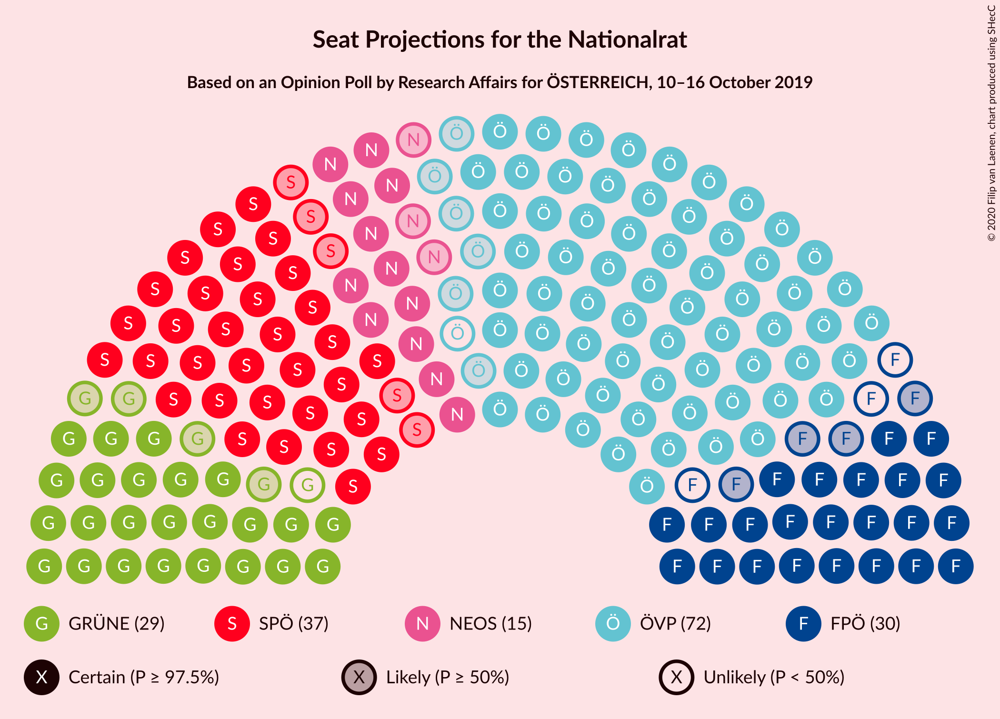
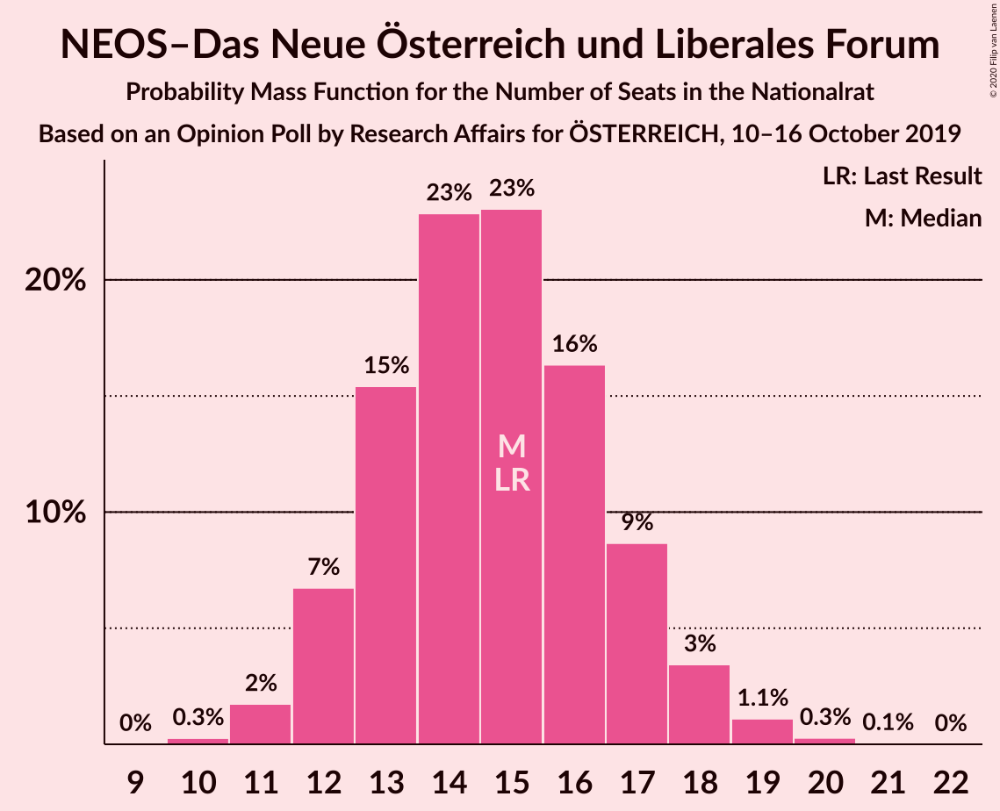
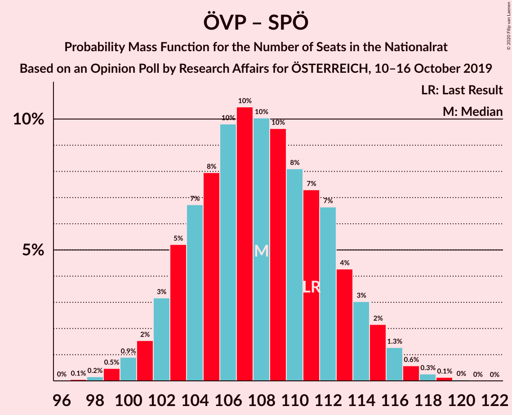
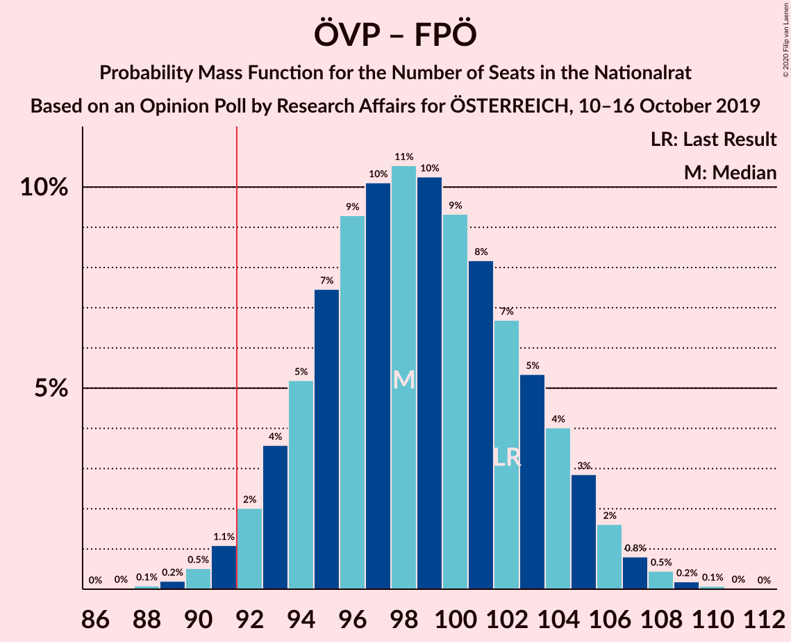
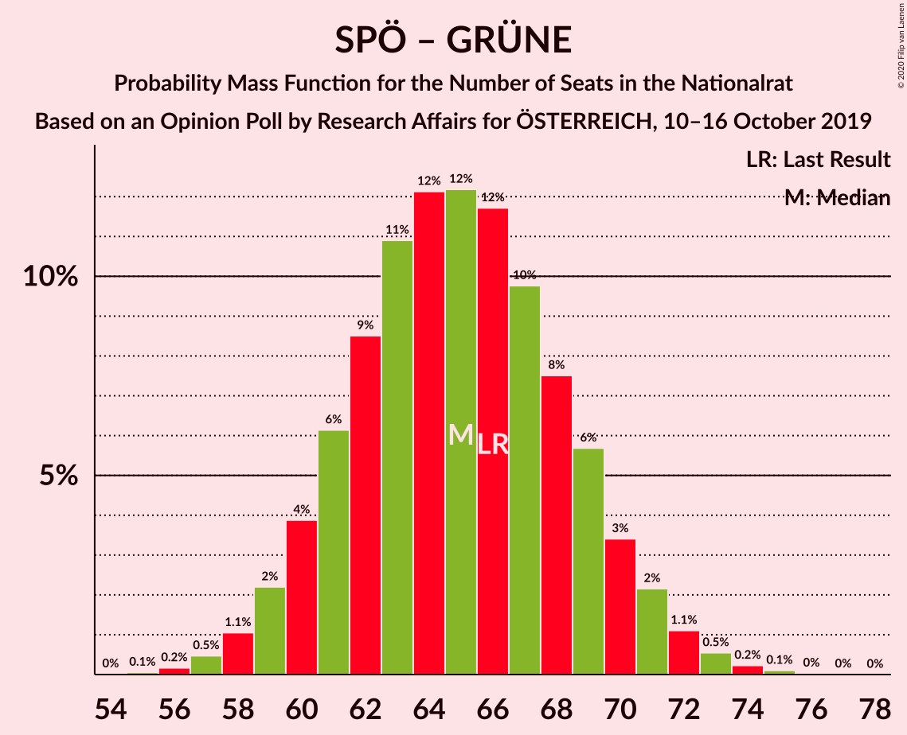

# Opinion Poll by Research Affairs for ÖSTERREICH, 10–16 October 2019

<a href="#voting-intentions">Voting Intentions</a> | <a href="#seats">Seats</a> | <a href="#coalitions">Coalitions</a> | <a href="#technical-information">Technical Information</a>

## Voting Intentions

### Confidence Intervals

| Party | Last Result | Poll Result | 80% Confidence Interval | 90% Confidence Interval | 95% Confidence Interval | 99% Confidence Interval |
|:-----:|:-----------:|:-----------:|:-----------------------:|:-----------------------:|:-----------------------:|:-----------------------:|
| Österreichische Volkspartei | 37.5% | 38.0% | 36.0–40.0% |35.5–40.5% |35.0–41.0% |34.1–42.0% |
| Sozialdemokratische Partei Österreichs | 21.2% | 20.0% | 18.4–21.7% |18.0–22.2% |17.6–22.6% |16.9–23.4% |
| Freiheitliche Partei Österreichs | 16.2% | 15.0% | 13.6–16.5% |13.2–17.0% |12.9–17.3% |12.3–18.1% |
| Die Grünen–Die Grüne Alternative | 13.9% | 15.0% | 13.6–16.5% |13.2–17.0% |12.9–17.3% |12.3–18.1% |
| NEOS–Das Neue Österreich und Liberales Forum | 8.1% | 8.0% | 7.0–9.2% |6.7–9.5% |6.5–9.8% |6.0–10.5% |

*Note:* The poll result column reflects the actual value used in the calculations. Published results may vary slightly, and in addition be rounded to fewer digits.

## Seats

### Confidence Intervals

| Party | Last Result | Median | 80% Confidence Interval | 90% Confidence Interval | 95% Confidence Interval | 99% Confidence Interval |
|:-----:|:-----------:|:------:|:-----------------------:|:-----------------------:|:-----------------------:|:-----------------------:|
| <a href="#österreichische-volkspartei">Österreichische Volkspartei</a> | 71 | 71 | 67–75 |66–76 |65–77 |63–80 |
| <a href="#sozialdemokratische-partei-österreichs">Sozialdemokratische Partei Österreichs</a> | 40 | 37 | 34–40 |33–41 |32–42 |31–44 |
| <a href="#freiheitliche-partei-österreichs">Freiheitliche Partei Österreichs</a> | 31 | 27 | 25–31 |25–31 |23–32 |22–34 |
| <a href="#die-grünen–die-grüne-alternative">Die Grünen–Die Grüne Alternative</a> | 26 | 28 | 25–31 |24–31 |24–32 |22–34 |
| <a href="#neos–das-neue-österreich-und-liberales-forum">NEOS–Das Neue Österreich und Liberales Forum</a> | 15 | 15 | 13–17 |12–18 |12–18 |11–19 |

### Österreichische Volkspartei

*For a full overview of the results for this party, see the [Österreichische Volkspartei](party-österreichischevolkspartei.html) page.*

| Number of Seats | Probability | Accumulated | Special Marks |
|:---------------:|:-----------:|:-----------:|:-------------:|
| 61 | 0.1% | 100% |  |
| 62 | 0.2% | 99.9% |  |
| 63 | 0.5% | 99.7% |  |
| 64 | 1.3% | 99.1% |  |
| 65 | 2% | 98% |  |
| 66 | 5% | 95% |  |
| 67 | 6% | 91% |  |
| 68 | 9% | 85% |  |
| 69 | 11% | 76% |  |
| 70 | 11% | 64% |  |
| 71 | 10% | 53% | Last Result, Median |
| 72 | 13% | 43% |  |
| 73 | 9% | 30% |  |
| 74 | 8% | 21% |  |
| 75 | 4% | 13% |  |
| 76 | 4% | 8% |  |
| 77 | 2% | 4% |  |
| 78 | 0.9% | 2% |  |
| 79 | 0.7% | 1.2% |  |
| 80 | 0.3% | 0.5% |  |
| 81 | 0.2% | 0.2% |  |
| 82 | 0% | 0.1% |  |
| 83 | 0% | 0% |  |

### Sozialdemokratische Partei Österreichs

*For a full overview of the results for this party, see the [Sozialdemokratische Partei Österreichs](party-sozialdemokratischeparteiösterreichs.html) page.*

| Number of Seats | Probability | Accumulated | Special Marks |
|:---------------:|:-----------:|:-----------:|:-------------:|
| 29 | 0% | 100% |  |
| 30 | 0.2% | 99.9% |  |
| 31 | 0.6% | 99.7% |  |
| 32 | 2% | 99.1% |  |
| 33 | 4% | 97% |  |
| 34 | 7% | 93% |  |
| 35 | 11% | 86% |  |
| 36 | 15% | 75% |  |
| 37 | 17% | 60% | Median |
| 38 | 15% | 43% |  |
| 39 | 11% | 28% |  |
| 40 | 8% | 18% | Last Result |
| 41 | 5% | 9% |  |
| 42 | 2% | 4% |  |
| 43 | 1.3% | 2% |  |
| 44 | 0.4% | 0.7% |  |
| 45 | 0.2% | 0.3% |  |
| 46 | 0.1% | 0.1% |  |
| 47 | 0% | 0% |  |

### Freiheitliche Partei Österreichs

*For a full overview of the results for this party, see the [Freiheitliche Partei Österreichs](party-freiheitlicheparteiösterreichs.html) page.*

| Number of Seats | Probability | Accumulated | Special Marks |
|:---------------:|:-----------:|:-----------:|:-------------:|
| 21 | 0.1% | 100% |  |
| 22 | 0.9% | 99.9% |  |
| 23 | 2% | 99.0% |  |
| 24 | 2% | 97% |  |
| 25 | 7% | 95% |  |
| 26 | 21% | 89% |  |
| 27 | 21% | 67% | Median |
| 28 | 10% | 46% |  |
| 29 | 12% | 37% |  |
| 30 | 13% | 25% |  |
| 31 | 8% | 12% | Last Result |
| 32 | 3% | 4% |  |
| 33 | 0.7% | 1.4% |  |
| 34 | 0.5% | 0.8% |  |
| 35 | 0.3% | 0.3% |  |
| 36 | 0% | 0% |  |

### Die Grünen–Die Grüne Alternative

*For a full overview of the results for this party, see the [Die Grünen–Die Grüne Alternative](party-diegrünen–diegrünealternative.html) page.*

| Number of Seats | Probability | Accumulated | Special Marks |
|:---------------:|:-----------:|:-----------:|:-------------:|
| 21 | 0.1% | 100% |  |
| 22 | 0.4% | 99.9% |  |
| 23 | 2% | 99.5% |  |
| 24 | 5% | 98% |  |
| 25 | 9% | 93% |  |
| 26 | 15% | 84% | Last Result |
| 27 | 17% | 69% |  |
| 28 | 17% | 52% | Median |
| 29 | 14% | 35% |  |
| 30 | 11% | 21% |  |
| 31 | 6% | 10% |  |
| 32 | 3% | 5% |  |
| 33 | 1.3% | 2% |  |
| 34 | 0.5% | 0.7% |  |
| 35 | 0.2% | 0.2% |  |
| 36 | 0% | 0.1% |  |
| 37 | 0% | 0% |  |

### NEOS–Das Neue Österreich und Liberales Forum

*For a full overview of the results for this party, see the [NEOS–Das Neue Österreich und Liberales Forum](party-neos–dasneueösterreichundliberalesforum.html) page.*

| Number of Seats | Probability | Accumulated | Special Marks |
|:---------------:|:-----------:|:-----------:|:-------------:|
| 10 | 0.3% | 100% |  |
| 11 | 2% | 99.7% |  |
| 12 | 7% | 98% |  |
| 13 | 15% | 91% |  |
| 14 | 23% | 76% |  |
| 15 | 21% | 53% | Last Result, Median |
| 16 | 17% | 31% |  |
| 17 | 9% | 14% |  |
| 18 | 4% | 5% |  |
| 19 | 1.1% | 1.5% |  |
| 20 | 0.3% | 0.3% |  |
| 21 | 0.1% | 0.1% |  |
| 22 | 0% | 0% |  |

## Coalitions

### Confidence Intervals

| Coalition | Last Result | Median | Majority? | 80% Confidence Interval | 90% Confidence Interval | 95% Confidence Interval | 99% Confidence Interval |
|:---------:|:-----------:|:------:|:---------:|:-----------------------:|:-----------------------:|:-----------------------:|:-----------------------:|
| Österreichische Volkspartei – Die Grünen–Die Grüne Alternative – NEOS–Das Neue Österreich und Liberales Forum | 112 | 113 | 100% | 109–118 | 107–120 | 106–121 | 104–123 |
| Österreichische Volkspartei – Sozialdemokratische Partei Österreichs | 111 | 108 | 100% | 103–113 | 102–114 | 101–115 | 99–117 |
| Österreichische Volkspartei – Die Grünen–Die Grüne Alternative | 97 | 98 | 98% | 94–104 | 93–105 | 92–106 | 90–108 |
| Österreichische Volkspartei – Freiheitliche Partei Österreichs | 102 | 98 | 98% | 94–103 | 93–105 | 92–106 | 90–108 |
| Österreichische Volkspartei – NEOS–Das Neue Österreich und Liberales Forum | 86 | 85 | 5% | 81–90 | 80–91 | 79–92 | 77–95 |
| Sozialdemokratische Partei Österreichs – Die Grünen–Die Grüne Alternative – NEOS–Das Neue Österreich und Liberales Forum | 81 | 80 | 0% | 75–84 | 74–86 | 73–86 | 71–88 |
| Österreichische Volkspartei | 71 | 71 | 0% | 67–75 | 66–76 | 65–77 | 63–80 |
| Sozialdemokratische Partei Österreichs – Die Grünen–Die Grüne Alternative | 66 | 65 | 0% | 61–69 | 60–70 | 59–71 | 57–73 |
| Sozialdemokratische Partei Österreichs – Freiheitliche Partei Österreichs | 71 | 65 | 0% | 61–69 | 60–70 | 59–71 | 57–73 |
| Sozialdemokratische Partei Österreichs | 40 | 37 | 0% | 34–40 | 33–41 | 32–42 | 31–44 |

### Österreichische Volkspartei – Die Grünen–Die Grüne Alternative – NEOS–Das Neue Österreich und Liberales Forum

| Number of Seats | Probability | Accumulated | Special Marks |
|:---------------:|:-----------:|:-----------:|:-------------:|
| 102 | 0.1% | 100% |  |
| 103 | 0.1% | 99.9% |  |
| 104 | 0.4% | 99.8% |  |
| 105 | 0.8% | 99.4% |  |
| 106 | 2% | 98.7% |  |
| 107 | 3% | 97% |  |
| 108 | 4% | 94% |  |
| 109 | 5% | 90% |  |
| 110 | 9% | 85% |  |
| 111 | 10% | 75% |  |
| 112 | 10% | 65% | Last Result |
| 113 | 10% | 56% |  |
| 114 | 10% | 45% | Median |
| 115 | 8% | 36% |  |
| 116 | 7% | 28% |  |
| 117 | 5% | 20% |  |
| 118 | 6% | 15% |  |
| 119 | 4% | 9% |  |
| 120 | 3% | 5% |  |
| 121 | 1.1% | 3% |  |
| 122 | 1.1% | 2% |  |
| 123 | 0.3% | 0.6% |  |
| 124 | 0.2% | 0.2% |  |
| 125 | 0% | 0.1% |  |
| 126 | 0% | 0% |  |

### Österreichische Volkspartei – Sozialdemokratische Partei Österreichs

| Number of Seats | Probability | Accumulated | Special Marks |
|:---------------:|:-----------:|:-----------:|:-------------:|
| 97 | 0% | 100% |  |
| 98 | 0.1% | 99.9% |  |
| 99 | 0.6% | 99.8% |  |
| 100 | 1.0% | 99.2% |  |
| 101 | 1.4% | 98% |  |
| 102 | 3% | 97% |  |
| 103 | 5% | 94% |  |
| 104 | 8% | 89% |  |
| 105 | 7% | 81% |  |
| 106 | 10% | 74% |  |
| 107 | 10% | 65% |  |
| 108 | 12% | 54% | Median |
| 109 | 8% | 43% |  |
| 110 | 9% | 34% |  |
| 111 | 6% | 26% | Last Result |
| 112 | 8% | 19% |  |
| 113 | 5% | 12% |  |
| 114 | 3% | 7% |  |
| 115 | 2% | 4% |  |
| 116 | 1.3% | 2% |  |
| 117 | 0.7% | 1.1% |  |
| 118 | 0.1% | 0.4% |  |
| 119 | 0.2% | 0.3% |  |
| 120 | 0% | 0.1% |  |
| 121 | 0% | 0% |  |

### Österreichische Volkspartei – Die Grünen–Die Grüne Alternative

| Number of Seats | Probability | Accumulated | Special Marks |
|:---------------:|:-----------:|:-----------:|:-------------:|
| 88 | 0.1% | 100% |  |
| 89 | 0.2% | 99.9% |  |
| 90 | 0.5% | 99.7% |  |
| 91 | 1.1% | 99.2% |  |
| 92 | 2% | 98% | Majority |
| 93 | 4% | 96% |  |
| 94 | 6% | 92% |  |
| 95 | 7% | 86% |  |
| 96 | 8% | 79% |  |
| 97 | 12% | 71% | Last Result |
| 98 | 10% | 58% |  |
| 99 | 10% | 49% | Median |
| 100 | 9% | 38% |  |
| 101 | 8% | 29% |  |
| 102 | 6% | 21% |  |
| 103 | 5% | 16% |  |
| 104 | 4% | 11% |  |
| 105 | 3% | 6% |  |
| 106 | 1.5% | 3% |  |
| 107 | 0.8% | 2% |  |
| 108 | 0.5% | 0.8% |  |
| 109 | 0.2% | 0.3% |  |
| 110 | 0.1% | 0.1% |  |
| 111 | 0% | 0% |  |

### Österreichische Volkspartei – Freiheitliche Partei Österreichs

| Number of Seats | Probability | Accumulated | Special Marks |
|:---------------:|:-----------:|:-----------:|:-------------:|
| 88 | 0.1% | 100% |  |
| 89 | 0.2% | 99.9% |  |
| 90 | 0.4% | 99.7% |  |
| 91 | 1.3% | 99.3% |  |
| 92 | 2% | 98% | Majority |
| 93 | 4% | 96% |  |
| 94 | 5% | 92% |  |
| 95 | 8% | 87% |  |
| 96 | 10% | 79% |  |
| 97 | 9% | 69% |  |
| 98 | 12% | 61% | Median |
| 99 | 9% | 49% |  |
| 100 | 9% | 40% |  |
| 101 | 10% | 31% |  |
| 102 | 5% | 21% | Last Result |
| 103 | 6% | 16% |  |
| 104 | 4% | 10% |  |
| 105 | 3% | 6% |  |
| 106 | 1.5% | 3% |  |
| 107 | 0.7% | 2% |  |
| 108 | 0.5% | 0.8% |  |
| 109 | 0.2% | 0.3% |  |
| 110 | 0% | 0.1% |  |
| 111 | 0% | 0.1% |  |
| 112 | 0% | 0% |  |

### Österreichische Volkspartei – NEOS–Das Neue Österreich und Liberales Forum

| Number of Seats | Probability | Accumulated | Special Marks |
|:---------------:|:-----------:|:-----------:|:-------------:|
| 75 | 0.1% | 100% |  |
| 76 | 0.2% | 99.9% |  |
| 77 | 0.5% | 99.7% |  |
| 78 | 1.0% | 99.2% |  |
| 79 | 2% | 98% |  |
| 80 | 4% | 96% |  |
| 81 | 5% | 93% |  |
| 82 | 7% | 88% |  |
| 83 | 9% | 81% |  |
| 84 | 12% | 72% |  |
| 85 | 11% | 60% |  |
| 86 | 11% | 50% | Last Result, Median |
| 87 | 10% | 39% |  |
| 88 | 10% | 29% |  |
| 89 | 6% | 19% |  |
| 90 | 4% | 13% |  |
| 91 | 4% | 9% |  |
| 92 | 2% | 5% | Majority |
| 93 | 1.3% | 2% |  |
| 94 | 0.5% | 1.2% |  |
| 95 | 0.4% | 0.6% |  |
| 96 | 0.1% | 0.2% |  |
| 97 | 0% | 0.1% |  |
| 98 | 0% | 0% |  |

### Sozialdemokratische Partei Österreichs – Die Grünen–Die Grüne Alternative – NEOS–Das Neue Österreich und Liberales Forum

| Number of Seats | Probability | Accumulated | Special Marks |
|:---------------:|:-----------:|:-----------:|:-------------:|
| 69 | 0.1% | 100% |  |
| 70 | 0.2% | 99.9% |  |
| 71 | 0.4% | 99.8% |  |
| 72 | 0.9% | 99.4% |  |
| 73 | 2% | 98.5% |  |
| 74 | 4% | 97% |  |
| 75 | 5% | 93% |  |
| 76 | 5% | 88% |  |
| 77 | 11% | 83% |  |
| 78 | 9% | 71% |  |
| 79 | 10% | 62% |  |
| 80 | 14% | 51% | Median |
| 81 | 8% | 37% | Last Result |
| 82 | 10% | 29% |  |
| 83 | 6% | 19% |  |
| 84 | 5% | 12% |  |
| 85 | 2% | 7% |  |
| 86 | 3% | 5% |  |
| 87 | 0.9% | 2% |  |
| 88 | 0.8% | 1.1% |  |
| 89 | 0.2% | 0.4% |  |
| 90 | 0.1% | 0.2% |  |
| 91 | 0% | 0.1% |  |
| 92 | 0% | 0% | Majority |

### Österreichische Volkspartei

| Number of Seats | Probability | Accumulated | Special Marks |
|:---------------:|:-----------:|:-----------:|:-------------:|
| 61 | 0.1% | 100% |  |
| 62 | 0.2% | 99.9% |  |
| 63 | 0.5% | 99.7% |  |
| 64 | 1.3% | 99.1% |  |
| 65 | 2% | 98% |  |
| 66 | 5% | 95% |  |
| 67 | 6% | 91% |  |
| 68 | 9% | 85% |  |
| 69 | 11% | 76% |  |
| 70 | 11% | 64% |  |
| 71 | 10% | 53% | Last Result, Median |
| 72 | 13% | 43% |  |
| 73 | 9% | 30% |  |
| 74 | 8% | 21% |  |
| 75 | 4% | 13% |  |
| 76 | 4% | 8% |  |
| 77 | 2% | 4% |  |
| 78 | 0.9% | 2% |  |
| 79 | 0.7% | 1.2% |  |
| 80 | 0.3% | 0.5% |  |
| 81 | 0.2% | 0.2% |  |
| 82 | 0% | 0.1% |  |
| 83 | 0% | 0% |  |

### Sozialdemokratische Partei Österreichs – Die Grünen–Die Grüne Alternative

| Number of Seats | Probability | Accumulated | Special Marks |
|:---------------:|:-----------:|:-----------:|:-------------:|
| 55 | 0.1% | 100% |  |
| 56 | 0.2% | 99.9% |  |
| 57 | 0.5% | 99.8% |  |
| 58 | 1.0% | 99.3% |  |
| 59 | 3% | 98% |  |
| 60 | 4% | 96% |  |
| 61 | 7% | 92% |  |
| 62 | 8% | 85% |  |
| 63 | 11% | 77% |  |
| 64 | 12% | 66% |  |
| 65 | 13% | 54% | Median |
| 66 | 11% | 41% | Last Result |
| 67 | 9% | 30% |  |
| 68 | 9% | 21% |  |
| 69 | 5% | 12% |  |
| 70 | 3% | 7% |  |
| 71 | 2% | 4% |  |
| 72 | 1.0% | 2% |  |
| 73 | 0.5% | 0.9% |  |
| 74 | 0.2% | 0.4% |  |
| 75 | 0.1% | 0.2% |  |
| 76 | 0% | 0.1% |  |
| 77 | 0% | 0% |  |

### Sozialdemokratische Partei Österreichs – Freiheitliche Partei Österreichs

| Number of Seats | Probability | Accumulated | Special Marks |
|:---------------:|:-----------:|:-----------:|:-------------:|
| 55 | 0% | 100% |  |
| 56 | 0.2% | 99.9% |  |
| 57 | 0.4% | 99.7% |  |
| 58 | 1.2% | 99.4% |  |
| 59 | 2% | 98% |  |
| 60 | 4% | 97% |  |
| 61 | 6% | 92% |  |
| 62 | 9% | 86% |  |
| 63 | 11% | 77% |  |
| 64 | 12% | 66% | Median |
| 65 | 14% | 55% |  |
| 66 | 12% | 41% |  |
| 67 | 8% | 29% |  |
| 68 | 8% | 21% |  |
| 69 | 6% | 13% |  |
| 70 | 3% | 7% |  |
| 71 | 2% | 4% | Last Result |
| 72 | 1.0% | 2% |  |
| 73 | 0.7% | 1.0% |  |
| 74 | 0.2% | 0.3% |  |
| 75 | 0.1% | 0.1% |  |
| 76 | 0% | 0% |  |

### Sozialdemokratische Partei Österreichs

| Number of Seats | Probability | Accumulated | Special Marks |
|:---------------:|:-----------:|:-----------:|:-------------:|
| 29 | 0% | 100% |  |
| 30 | 0.2% | 99.9% |  |
| 31 | 0.6% | 99.7% |  |
| 32 | 2% | 99.1% |  |
| 33 | 4% | 97% |  |
| 34 | 7% | 93% |  |
| 35 | 11% | 86% |  |
| 36 | 15% | 75% |  |
| 37 | 17% | 60% | Median |
| 38 | 15% | 43% |  |
| 39 | 11% | 28% |  |
| 40 | 8% | 18% | Last Result |
| 41 | 5% | 9% |  |
| 42 | 2% | 4% |  |
| 43 | 1.3% | 2% |  |
| 44 | 0.4% | 0.7% |  |
| 45 | 0.2% | 0.3% |  |
| 46 | 0.1% | 0.1% |  |
| 47 | 0% | 0% |  |

## Technical Information

### Opinion Poll

+ **Polling firm:** Research Affairs
+ **Commissioner(s):** ÖSTERREICH
+ **Fieldwork period:** 10–16 October 2019

### Calculations

+ **Sample size:** 1001
+ **Simulations done:** 131,072
+ **Error estimate:** 2.33%

