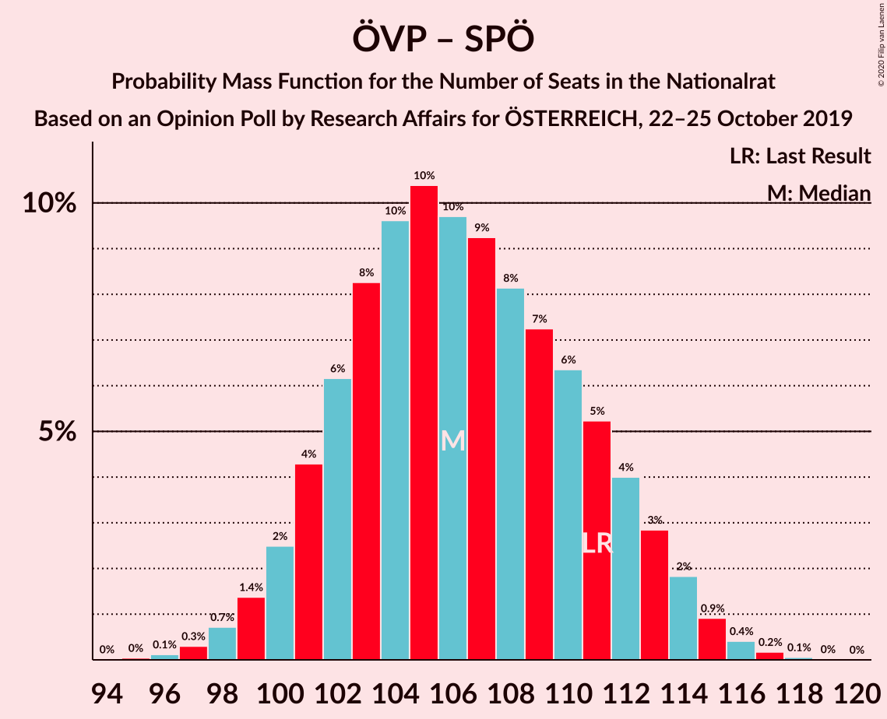
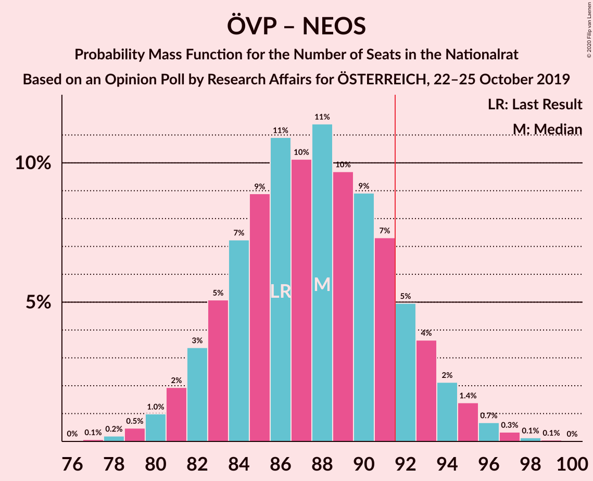
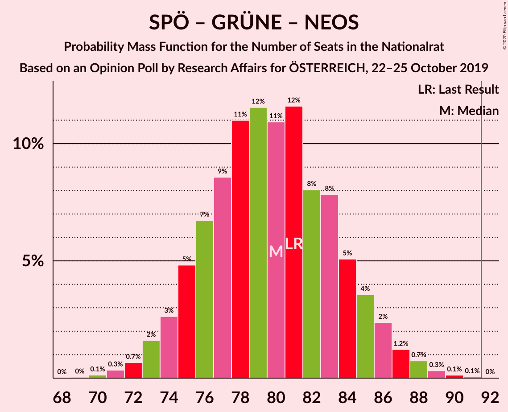
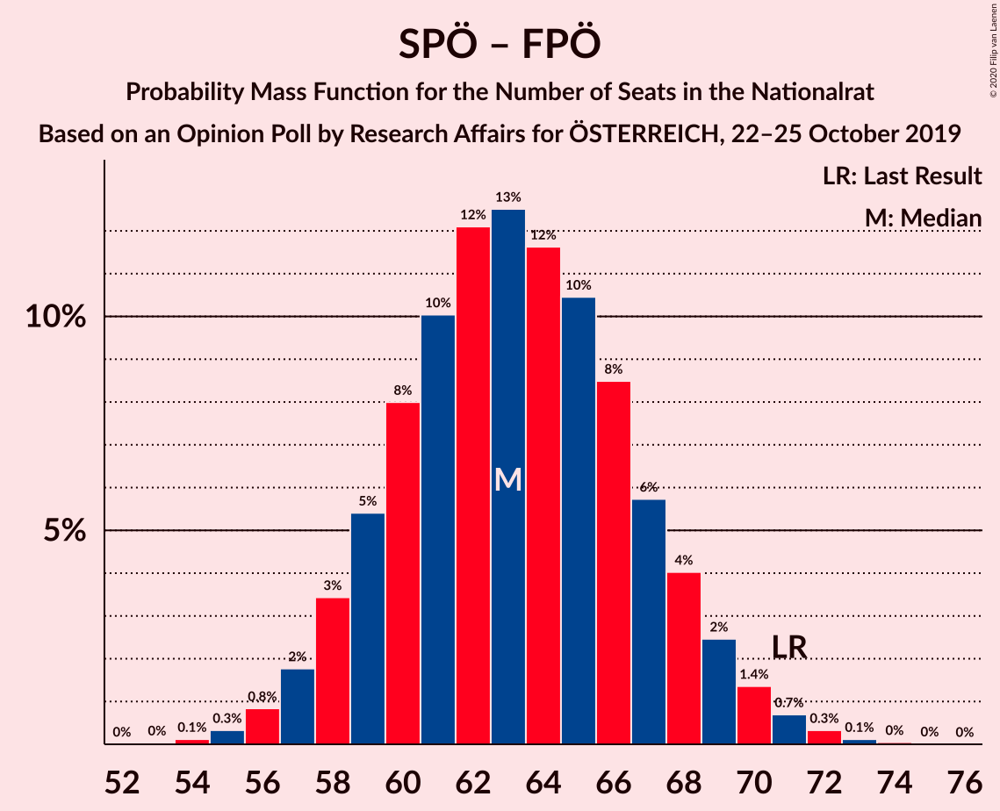

# Opinion Poll by Research Affairs for ÖSTERREICH, 22–25 October 2019

<a href="#voting-intentions">Voting Intentions</a> | <a href="#seats">Seats</a> | <a href="#coalitions">Coalitions</a> | <a href="#technical-information">Technical Information</a>

## Voting Intentions

### Confidence Intervals

| Party | Last Result | Poll Result | 80% Confidence Interval | 90% Confidence Interval | 95% Confidence Interval | 99% Confidence Interval |
|:-----:|:-----------:|:-----------:|:-----------------------:|:-----------------------:|:-----------------------:|:-----------------------:|
| Österreichische Volkspartei | 37.5% | 38.0% | 36.1–40.0% |35.5–40.6% |35.0–41.1% |34.1–42.0% |
| Sozialdemokratische Partei Österreichs | 21.2% | 19.0% | 17.5–20.7% |17.1–21.1% |16.7–21.6% |16.0–22.4% |
| Freiheitliche Partei Österreichs | 16.2% | 15.0% | 13.6–16.5% |13.2–17.0% |12.9–17.4% |12.3–18.1% |
| Die Grünen–Die Grüne Alternative | 13.9% | 15.0% | 13.6–16.5% |13.2–17.0% |12.9–17.4% |12.3–18.1% |
| NEOS–Das Neue Österreich und Liberales Forum | 8.1% | 9.0% | 7.9–10.3% |7.6–10.6% |7.4–10.9% |6.9–11.6% |

*Note:* The poll result column reflects the actual value used in the calculations. Published results may vary slightly, and in addition be rounded to fewer digits.

## Seats

### Confidence Intervals

| Party | Last Result | Median | 80% Confidence Interval | 90% Confidence Interval | 95% Confidence Interval | 99% Confidence Interval |
|:-----:|:-----------:|:------:|:-----------------------:|:-----------------------:|:-----------------------:|:-----------------------:|
| <a href="#österreichische-volkspartei">Österreichische Volkspartei</a> | 71 | 71 | 67–75 |66–77 |65–78 |63–80 |
| <a href="#sozialdemokratische-partei-österreichs">Sozialdemokratische Partei Österreichs</a> | 40 | 35 | 32–39 |31–40 |31–40 |29–42 |
| <a href="#freiheitliche-partei-österreichs">Freiheitliche Partei Österreichs</a> | 31 | 28 | 25–31 |24–32 |24–32 |22–34 |
| <a href="#die-grünen–die-grüne-alternative">Die Grünen–Die Grüne Alternative</a> | 26 | 28 | 25–31 |24–32 |24–32 |22–34 |
| <a href="#neos–das-neue-österreich-und-liberales-forum">NEOS–Das Neue Österreich und Liberales Forum</a> | 15 | 16 | 14–19 |14–20 |13–20 |12–21 |

### Österreichische Volkspartei

*For a full overview of the results for this party, see the [Österreichische Volkspartei](party-österreichischevolkspartei.html) page.*

| Number of Seats | Probability | Accumulated | Special Marks |
|:---------------:|:-----------:|:-----------:|:-------------:|
| 61 | 0.1% | 100% |  |
| 62 | 0.2% | 99.9% |  |
| 63 | 0.5% | 99.7% |  |
| 64 | 1.1% | 99.2% |  |
| 65 | 2% | 98% |  |
| 66 | 4% | 96% |  |
| 67 | 6% | 92% |  |
| 68 | 8% | 86% |  |
| 69 | 10% | 77% |  |
| 70 | 12% | 67% |  |
| 71 | 12% | 55% | Last Result, Median |
| 72 | 11% | 43% |  |
| 73 | 10% | 32% |  |
| 74 | 8% | 23% |  |
| 75 | 6% | 15% |  |
| 76 | 4% | 9% |  |
| 77 | 2% | 5% |  |
| 78 | 1.4% | 3% |  |
| 79 | 0.7% | 1.3% |  |
| 80 | 0.4% | 0.6% |  |
| 81 | 0.1% | 0.2% |  |
| 82 | 0.1% | 0.1% |  |
| 83 | 0% | 0% |  |

### Sozialdemokratische Partei Österreichs

*For a full overview of the results for this party, see the [Sozialdemokratische Partei Österreichs](party-sozialdemokratischeparteiösterreichs.html) page.*

| Number of Seats | Probability | Accumulated | Special Marks |
|:---------------:|:-----------:|:-----------:|:-------------:|
| 28 | 0.1% | 100% |  |
| 29 | 0.5% | 99.9% |  |
| 30 | 1.4% | 99.4% |  |
| 31 | 3% | 98% |  |
| 32 | 7% | 95% |  |
| 33 | 11% | 88% |  |
| 34 | 14% | 77% |  |
| 35 | 16% | 63% | Median |
| 36 | 15% | 47% |  |
| 37 | 12% | 32% |  |
| 38 | 9% | 19% |  |
| 39 | 5% | 11% |  |
| 40 | 3% | 5% | Last Result |
| 41 | 1.4% | 2% |  |
| 42 | 0.6% | 0.9% |  |
| 43 | 0.2% | 0.3% |  |
| 44 | 0.1% | 0.1% |  |
| 45 | 0% | 0% |  |

### Freiheitliche Partei Österreichs

*For a full overview of the results for this party, see the [Freiheitliche Partei Österreichs](party-freiheitlicheparteiösterreichs.html) page.*

| Number of Seats | Probability | Accumulated | Special Marks |
|:---------------:|:-----------:|:-----------:|:-------------:|
| 21 | 0.1% | 100% |  |
| 22 | 0.4% | 99.9% |  |
| 23 | 2% | 99.5% |  |
| 24 | 4% | 98% |  |
| 25 | 8% | 94% |  |
| 26 | 13% | 86% |  |
| 27 | 17% | 72% |  |
| 28 | 19% | 56% | Median |
| 29 | 15% | 37% |  |
| 30 | 11% | 22% |  |
| 31 | 6% | 11% | Last Result |
| 32 | 3% | 5% |  |
| 33 | 1.3% | 2% |  |
| 34 | 0.5% | 0.7% |  |
| 35 | 0.2% | 0.2% |  |
| 36 | 0% | 0.1% |  |
| 37 | 0% | 0% |  |

### Die Grünen–Die Grüne Alternative

*For a full overview of the results for this party, see the [Die Grünen–Die Grüne Alternative](party-diegrünen–diegrünealternative.html) page.*

| Number of Seats | Probability | Accumulated | Special Marks |
|:---------------:|:-----------:|:-----------:|:-------------:|
| 21 | 0.1% | 100% |  |
| 22 | 0.4% | 99.9% |  |
| 23 | 1.5% | 99.5% |  |
| 24 | 4% | 98% |  |
| 25 | 8% | 94% |  |
| 26 | 14% | 86% | Last Result |
| 27 | 17% | 72% |  |
| 28 | 18% | 55% | Median |
| 29 | 15% | 37% |  |
| 30 | 10% | 22% |  |
| 31 | 6% | 11% |  |
| 32 | 3% | 5% |  |
| 33 | 1.3% | 2% |  |
| 34 | 0.5% | 0.7% |  |
| 35 | 0.2% | 0.2% |  |
| 36 | 0% | 0.1% |  |
| 37 | 0% | 0% |  |

### NEOS–Das Neue Österreich und Liberales Forum

*For a full overview of the results for this party, see the [NEOS–Das Neue Österreich und Liberales Forum](party-neos–dasneueösterreichundliberalesforum.html) page.*

| Number of Seats | Probability | Accumulated | Special Marks |
|:---------------:|:-----------:|:-----------:|:-------------:|
| 11 | 0.1% | 100% |  |
| 12 | 0.5% | 99.9% |  |
| 13 | 2% | 99.4% |  |
| 14 | 8% | 97% |  |
| 15 | 16% | 89% | Last Result |
| 16 | 23% | 73% | Median |
| 17 | 22% | 50% |  |
| 18 | 15% | 28% |  |
| 19 | 8% | 13% |  |
| 20 | 4% | 5% |  |
| 21 | 1.3% | 2% |  |
| 22 | 0.4% | 0.5% |  |
| 23 | 0.1% | 0.1% |  |
| 24 | 0% | 0% |  |

## Coalitions

### Confidence Intervals

| Coalition | Last Result | Median | Majority? | 80% Confidence Interval | 90% Confidence Interval | 95% Confidence Interval | 99% Confidence Interval |
|:---------:|:-----------:|:------:|:---------:|:-----------------------:|:-----------------------:|:-----------------------:|:-----------------------:|
| Österreichische Volkspartei – Die Grünen–Die Grüne Alternative – NEOS–Das Neue Österreich und Liberales Forum | 112 | 115 | 100% | 111–120 | 109–122 | 108–123 | 107–125 |
| Österreichische Volkspartei – Sozialdemokratische Partei Österreichs | 111 | 106 | 100% | 102–112 | 100–113 | 99–114 | 98–116 |
| Österreichische Volkspartei – Die Grünen–Die Grüne Alternative | 97 | 99 | 98% | 94–104 | 93–105 | 92–106 | 90–108 |
| Österreichische Volkspartei – Freiheitliche Partei Österreichs | 102 | 99 | 98% | 94–104 | 93–105 | 92–106 | 90–108 |
| Österreichische Volkspartei – NEOS–Das Neue Österreich und Liberales Forum | 86 | 88 | 13% | 83–92 | 82–93 | 81–95 | 79–97 |
| Sozialdemokratische Partei Österreichs – Die Grünen–Die Grüne Alternative – NEOS–Das Neue Österreich und Liberales Forum | 81 | 80 | 0% | 75–84 | 74–85 | 73–86 | 71–89 |
| Österreichische Volkspartei | 71 | 71 | 0% | 67–75 | 66–77 | 65–78 | 63–80 |
| Sozialdemokratische Partei Österreichs – Freiheitliche Partei Österreichs | 71 | 63 | 0% | 59–67 | 58–69 | 57–70 | 55–72 |
| Sozialdemokratische Partei Österreichs – Die Grünen–Die Grüne Alternative | 66 | 63 | 0% | 59–67 | 58–68 | 57–69 | 55–71 |
| Sozialdemokratische Partei Österreichs | 40 | 35 | 0% | 32–39 | 31–40 | 31–40 | 29–42 |

### Österreichische Volkspartei – Die Grünen–Die Grüne Alternative – NEOS–Das Neue Österreich und Liberales Forum

| Number of Seats | Probability | Accumulated | Special Marks |
|:---------------:|:-----------:|:-----------:|:-------------:|
| 104 | 0% | 100% |  |
| 105 | 0.1% | 99.9% |  |
| 106 | 0.3% | 99.8% |  |
| 107 | 0.7% | 99.5% |  |
| 108 | 1.4% | 98.8% |  |
| 109 | 3% | 97% |  |
| 110 | 4% | 95% |  |
| 111 | 6% | 91% |  |
| 112 | 8% | 85% | Last Result |
| 113 | 10% | 77% |  |
| 114 | 10% | 67% |  |
| 115 | 10% | 58% | Median |
| 116 | 9% | 48% |  |
| 117 | 9% | 38% |  |
| 118 | 8% | 29% |  |
| 119 | 6% | 21% |  |
| 120 | 5% | 15% |  |
| 121 | 4% | 10% |  |
| 122 | 3% | 5% |  |
| 123 | 2% | 3% |  |
| 124 | 0.8% | 1.4% |  |
| 125 | 0.4% | 0.6% |  |
| 126 | 0.1% | 0.2% |  |
| 127 | 0.1% | 0.1% |  |
| 128 | 0% | 0% |  |

### Österreichische Volkspartei – Sozialdemokratische Partei Österreichs

| Number of Seats | Probability | Accumulated | Special Marks |
|:---------------:|:-----------:|:-----------:|:-------------:|
| 95 | 0% | 100% |  |
| 96 | 0.1% | 99.9% |  |
| 97 | 0.3% | 99.8% |  |
| 98 | 0.7% | 99.5% |  |
| 99 | 1.4% | 98.8% |  |
| 100 | 2% | 97% |  |
| 101 | 4% | 95% |  |
| 102 | 6% | 91% |  |
| 103 | 8% | 84% |  |
| 104 | 10% | 76% |  |
| 105 | 10% | 67% |  |
| 106 | 10% | 56% | Median |
| 107 | 9% | 46% |  |
| 108 | 8% | 37% |  |
| 109 | 7% | 29% |  |
| 110 | 6% | 22% |  |
| 111 | 5% | 15% | Last Result |
| 112 | 4% | 10% |  |
| 113 | 3% | 6% |  |
| 114 | 2% | 3% |  |
| 115 | 0.9% | 2% |  |
| 116 | 0.4% | 0.7% |  |
| 117 | 0.2% | 0.3% |  |
| 118 | 0.1% | 0.1% |  |
| 119 | 0% | 0% |  |

### Österreichische Volkspartei – Die Grünen–Die Grüne Alternative

| Number of Seats | Probability | Accumulated | Special Marks |
|:---------------:|:-----------:|:-----------:|:-------------:|
| 88 | 0.1% | 100% |  |
| 89 | 0.2% | 99.9% |  |
| 90 | 0.5% | 99.7% |  |
| 91 | 1.0% | 99.3% |  |
| 92 | 2% | 98% | Majority |
| 93 | 3% | 96% |  |
| 94 | 5% | 93% |  |
| 95 | 7% | 88% |  |
| 96 | 8% | 81% |  |
| 97 | 10% | 73% | Last Result |
| 98 | 10% | 63% |  |
| 99 | 11% | 53% | Median |
| 100 | 9% | 42% |  |
| 101 | 9% | 33% |  |
| 102 | 7% | 24% |  |
| 103 | 6% | 17% |  |
| 104 | 4% | 10% |  |
| 105 | 3% | 6% |  |
| 106 | 2% | 4% |  |
| 107 | 0.9% | 2% |  |
| 108 | 0.5% | 0.8% |  |
| 109 | 0.2% | 0.3% |  |
| 110 | 0.1% | 0.1% |  |
| 111 | 0% | 0% |  |

### Österreichische Volkspartei – Freiheitliche Partei Österreichs

| Number of Seats | Probability | Accumulated | Special Marks |
|:---------------:|:-----------:|:-----------:|:-------------:|
| 88 | 0.1% | 100% |  |
| 89 | 0.2% | 99.9% |  |
| 90 | 0.5% | 99.7% |  |
| 91 | 1.0% | 99.3% |  |
| 92 | 2% | 98% | Majority |
| 93 | 3% | 96% |  |
| 94 | 5% | 93% |  |
| 95 | 7% | 88% |  |
| 96 | 8% | 81% |  |
| 97 | 10% | 73% |  |
| 98 | 10% | 63% |  |
| 99 | 10% | 53% | Median |
| 100 | 10% | 43% |  |
| 101 | 8% | 32% |  |
| 102 | 8% | 24% | Last Result |
| 103 | 6% | 17% |  |
| 104 | 4% | 11% |  |
| 105 | 3% | 7% |  |
| 106 | 2% | 4% |  |
| 107 | 0.9% | 2% |  |
| 108 | 0.6% | 1.0% |  |
| 109 | 0.2% | 0.3% |  |
| 110 | 0.1% | 0.1% |  |
| 111 | 0% | 0% |  |

### Österreichische Volkspartei – NEOS–Das Neue Österreich und Liberales Forum

| Number of Seats | Probability | Accumulated | Special Marks |
|:---------------:|:-----------:|:-----------:|:-------------:|
| 77 | 0.1% | 100% |  |
| 78 | 0.2% | 99.9% |  |
| 79 | 0.5% | 99.7% |  |
| 80 | 1.0% | 99.2% |  |
| 81 | 2% | 98% |  |
| 82 | 3% | 96% |  |
| 83 | 5% | 93% |  |
| 84 | 7% | 88% |  |
| 85 | 9% | 81% |  |
| 86 | 11% | 72% | Last Result |
| 87 | 10% | 61% | Median |
| 88 | 11% | 51% |  |
| 89 | 10% | 39% |  |
| 90 | 9% | 30% |  |
| 91 | 7% | 21% |  |
| 92 | 5% | 13% | Majority |
| 93 | 4% | 8% |  |
| 94 | 2% | 5% |  |
| 95 | 1.4% | 3% |  |
| 96 | 0.7% | 1.2% |  |
| 97 | 0.3% | 0.5% |  |
| 98 | 0.1% | 0.2% |  |
| 99 | 0.1% | 0.1% |  |
| 100 | 0% | 0% |  |

### Sozialdemokratische Partei Österreichs – Die Grünen–Die Grüne Alternative – NEOS–Das Neue Österreich und Liberales Forum

| Number of Seats | Probability | Accumulated | Special Marks |
|:---------------:|:-----------:|:-----------:|:-------------:|
| 69 | 0% | 100% |  |
| 70 | 0.1% | 99.9% |  |
| 71 | 0.3% | 99.8% |  |
| 72 | 0.7% | 99.5% |  |
| 73 | 2% | 98.8% |  |
| 74 | 3% | 97% |  |
| 75 | 5% | 95% |  |
| 76 | 7% | 90% |  |
| 77 | 9% | 83% |  |
| 78 | 11% | 74% |  |
| 79 | 12% | 63% | Median |
| 80 | 11% | 52% |  |
| 81 | 12% | 41% | Last Result |
| 82 | 8% | 29% |  |
| 83 | 8% | 21% |  |
| 84 | 5% | 13% |  |
| 85 | 4% | 8% |  |
| 86 | 2% | 5% |  |
| 87 | 1.2% | 2% |  |
| 88 | 0.7% | 1.3% |  |
| 89 | 0.3% | 0.5% |  |
| 90 | 0.1% | 0.2% |  |
| 91 | 0.1% | 0.1% |  |
| 92 | 0% | 0% | Majority |

### Österreichische Volkspartei

| Number of Seats | Probability | Accumulated | Special Marks |
|:---------------:|:-----------:|:-----------:|:-------------:|
| 61 | 0.1% | 100% |  |
| 62 | 0.2% | 99.9% |  |
| 63 | 0.5% | 99.7% |  |
| 64 | 1.1% | 99.2% |  |
| 65 | 2% | 98% |  |
| 66 | 4% | 96% |  |
| 67 | 6% | 92% |  |
| 68 | 8% | 86% |  |
| 69 | 10% | 77% |  |
| 70 | 12% | 67% |  |
| 71 | 12% | 55% | Last Result, Median |
| 72 | 11% | 43% |  |
| 73 | 10% | 32% |  |
| 74 | 8% | 23% |  |
| 75 | 6% | 15% |  |
| 76 | 4% | 9% |  |
| 77 | 2% | 5% |  |
| 78 | 1.4% | 3% |  |
| 79 | 0.7% | 1.3% |  |
| 80 | 0.4% | 0.6% |  |
| 81 | 0.1% | 0.2% |  |
| 82 | 0.1% | 0.1% |  |
| 83 | 0% | 0% |  |

### Sozialdemokratische Partei Österreichs – Freiheitliche Partei Österreichs

| Number of Seats | Probability | Accumulated | Special Marks |
|:---------------:|:-----------:|:-----------:|:-------------:|
| 53 | 0% | 100% |  |
| 54 | 0.1% | 99.9% |  |
| 55 | 0.3% | 99.8% |  |
| 56 | 0.8% | 99.5% |  |
| 57 | 2% | 98.7% |  |
| 58 | 3% | 97% |  |
| 59 | 5% | 93% |  |
| 60 | 8% | 88% |  |
| 61 | 10% | 80% |  |
| 62 | 12% | 70% |  |
| 63 | 13% | 58% | Median |
| 64 | 12% | 45% |  |
| 65 | 10% | 34% |  |
| 66 | 8% | 23% |  |
| 67 | 6% | 15% |  |
| 68 | 4% | 9% |  |
| 69 | 2% | 5% |  |
| 70 | 1.4% | 3% |  |
| 71 | 0.7% | 1.2% | Last Result |
| 72 | 0.3% | 0.5% |  |
| 73 | 0.1% | 0.2% |  |
| 74 | 0% | 0.1% |  |
| 75 | 0% | 0% |  |

### Sozialdemokratische Partei Österreichs – Die Grünen–Die Grüne Alternative

| Number of Seats | Probability | Accumulated | Special Marks |
|:---------------:|:-----------:|:-----------:|:-------------:|
| 53 | 0% | 100% |  |
| 54 | 0.1% | 99.9% |  |
| 55 | 0.4% | 99.8% |  |
| 56 | 0.9% | 99.5% |  |
| 57 | 2% | 98.6% |  |
| 58 | 3% | 97% |  |
| 59 | 5% | 93% |  |
| 60 | 8% | 88% |  |
| 61 | 10% | 80% |  |
| 62 | 12% | 70% |  |
| 63 | 13% | 58% | Median |
| 64 | 12% | 45% |  |
| 65 | 10% | 33% |  |
| 66 | 9% | 23% | Last Result |
| 67 | 6% | 14% |  |
| 68 | 4% | 9% |  |
| 69 | 2% | 5% |  |
| 70 | 1.2% | 2% |  |
| 71 | 0.6% | 1.1% |  |
| 72 | 0.3% | 0.5% |  |
| 73 | 0.1% | 0.2% |  |
| 74 | 0% | 0.1% |  |
| 75 | 0% | 0% |  |

### Sozialdemokratische Partei Österreichs

| Number of Seats | Probability | Accumulated | Special Marks |
|:---------------:|:-----------:|:-----------:|:-------------:|
| 28 | 0.1% | 100% |  |
| 29 | 0.5% | 99.9% |  |
| 30 | 1.4% | 99.4% |  |
| 31 | 3% | 98% |  |
| 32 | 7% | 95% |  |
| 33 | 11% | 88% |  |
| 34 | 14% | 77% |  |
| 35 | 16% | 63% | Median |
| 36 | 15% | 47% |  |
| 37 | 12% | 32% |  |
| 38 | 9% | 19% |  |
| 39 | 5% | 11% |  |
| 40 | 3% | 5% | Last Result |
| 41 | 1.4% | 2% |  |
| 42 | 0.6% | 0.9% |  |
| 43 | 0.2% | 0.3% |  |
| 44 | 0.1% | 0.1% |  |
| 45 | 0% | 0% |  |

## Technical Information

### Opinion Poll

+ **Polling firm:** Research Affairs
+ **Commissioner(s):** ÖSTERREICH
+ **Fieldwork period:** 22–25 October 2019

### Calculations

+ **Sample size:** 1000
+ **Simulations done:** 1,048,576
+ **Error estimate:** 0.52%

