# Opinion Poll by Research Affairs for ÖSTERREICH, 2–7 November 2019

<a href="#voting-intentions">Voting Intentions</a> | <a href="#seats">Seats</a> | <a href="#coalitions">Coalitions</a> | <a href="#technical-information">Technical Information</a>

## Voting Intentions

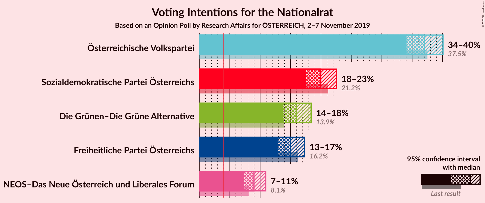

### Confidence Intervals

| Party | Last Result | Poll Result | 80% Confidence Interval | 90% Confidence Interval | 95% Confidence Interval | 99% Confidence Interval |
|:-----:|:-----------:|:-----------:|:-----------------------:|:-----------------------:|:-----------------------:|:-----------------------:|
| Österreichische Volkspartei | 37.5% | 37.0% | 35.1–39.0% |34.6–39.6% |34.1–40.1% |33.2–41.0% |
| Sozialdemokratische Partei Österreichs | 21.2% | 20.0% | 18.4–21.7% |18.0–22.1% |17.6–22.6% |16.9–23.4% |
| Die Grünen–Die Grüne Alternative | 13.9% | 16.0% | 14.6–17.5% |14.2–18.0% |13.8–18.4% |13.2–19.1% |
| Freiheitliche Partei Österreichs | 16.2% | 15.0% | 13.6–16.5% |13.2–16.9% |12.9–17.3% |12.3–18.1% |
| NEOS–Das Neue Österreich und Liberales Forum | 8.1% | 9.0% | 7.9–10.2% |7.6–10.6% |7.4–10.9% |6.9–11.6% |

*Note:* The poll result column reflects the actual value used in the calculations. Published results may vary slightly, and in addition be rounded to fewer digits.

## Seats

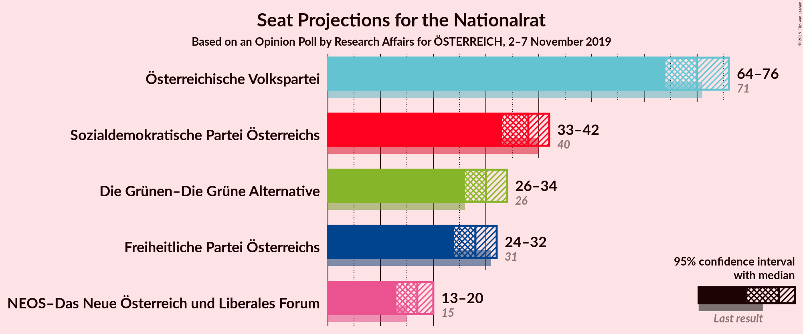

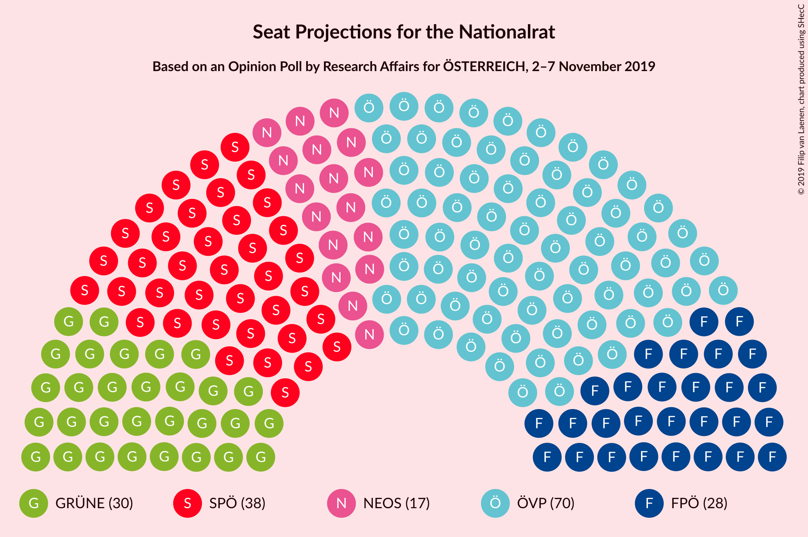

### Confidence Intervals

| Party | Last Result | Median | 80% Confidence Interval | 90% Confidence Interval | 95% Confidence Interval | 99% Confidence Interval |
|:-----:|:-----------:|:------:|:-----------------------:|:-----------------------:|:-----------------------:|:-----------------------:|
| <a href="#österreichische-volkspartei">Österreichische Volkspartei</a> | 71 | 70 | 66–74 |65–75 |64–76 |62–78 |
| <a href="#sozialdemokratische-partei-österreichs">Sozialdemokratische Partei Österreichs</a> | 40 | 38 | 35–41 |34–42 |33–42 |32–44 |
| <a href="#die-grünen–die-grüne-alternative">Die Grünen–Die Grüne Alternative</a> | 26 | 30 | 27–33 |26–34 |26–34 |25–36 |
| <a href="#freiheitliche-partei-österreichs">Freiheitliche Partei Österreichs</a> | 31 | 28 | 25–31 |25–32 |24–32 |23–34 |
| <a href="#neos–das-neue-österreich-und-liberales-forum">NEOS–Das Neue Österreich und Liberales Forum</a> | 15 | 17 | 15–19 |14–20 |13–20 |13–22 |

### Österreichische Volkspartei

*For a full overview of the results for this party, see the [Österreichische Volkspartei](party-österreichischevolkspartei.html) page.*

| Number of Seats | Probability | Accumulated | Special Marks |
|:---------------:|:-----------:|:-----------:|:-------------:|
| 60 | 0.1% | 100% |  |
| 61 | 0.2% | 99.9% |  |
| 62 | 0.3% | 99.8% |  |
| 63 | 0.9% | 99.4% |  |
| 64 | 2% | 98.6% |  |
| 65 | 3% | 97% |  |
| 66 | 6% | 93% |  |
| 67 | 7% | 88% |  |
| 68 | 10% | 80% |  |
| 69 | 12% | 71% |  |
| 70 | 16% | 58% | Median |
| 71 | 12% | 42% | Last Result |
| 72 | 9% | 30% |  |
| 73 | 9% | 21% |  |
| 74 | 5% | 11% |  |
| 75 | 3% | 6% |  |
| 76 | 2% | 3% |  |
| 77 | 0.9% | 2% |  |
| 78 | 0.5% | 0.7% |  |
| 79 | 0.1% | 0.2% |  |
| 80 | 0.1% | 0.1% |  |
| 81 | 0% | 0% |  |

### Sozialdemokratische Partei Österreichs

*For a full overview of the results for this party, see the [Sozialdemokratische Partei Österreichs](party-sozialdemokratischeparteiösterreichs.html) page.*

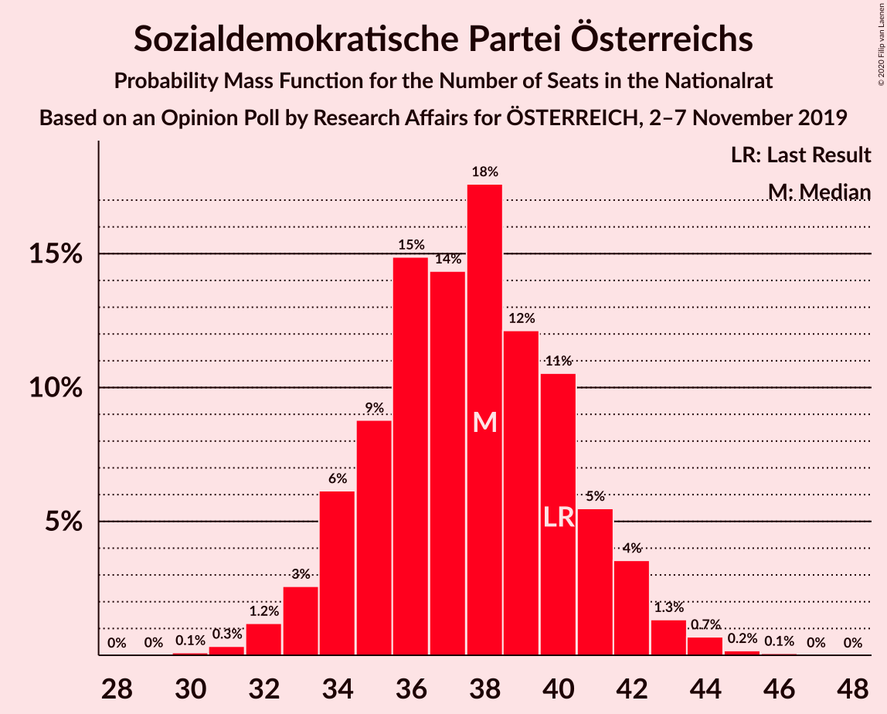

| Number of Seats | Probability | Accumulated | Special Marks |
|:---------------:|:-----------:|:-----------:|:-------------:|
| 30 | 0.1% | 100% |  |
| 31 | 0.3% | 99.9% |  |
| 32 | 1.1% | 99.5% |  |
| 33 | 3% | 98% |  |
| 34 | 5% | 95% |  |
| 35 | 9% | 90% |  |
| 36 | 16% | 81% |  |
| 37 | 14% | 65% |  |
| 38 | 17% | 51% | Median |
| 39 | 13% | 34% |  |
| 40 | 10% | 22% | Last Result |
| 41 | 6% | 11% |  |
| 42 | 3% | 6% |  |
| 43 | 1.2% | 2% |  |
| 44 | 0.8% | 1.0% |  |
| 45 | 0.2% | 0.3% |  |
| 46 | 0.1% | 0.1% |  |
| 47 | 0% | 0% |  |

### Die Grünen–Die Grüne Alternative

*For a full overview of the results for this party, see the [Die Grünen–Die Grüne Alternative](party-diegrünen–diegrünealternative.html) page.*

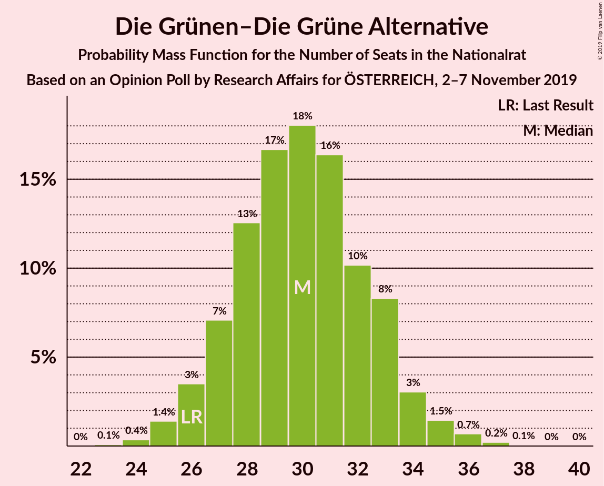

| Number of Seats | Probability | Accumulated | Special Marks |
|:---------------:|:-----------:|:-----------:|:-------------:|
| 23 | 0.1% | 100% |  |
| 24 | 0.4% | 99.9% |  |
| 25 | 1.4% | 99.6% |  |
| 26 | 3% | 98% | Last Result |
| 27 | 7% | 95% |  |
| 28 | 13% | 88% |  |
| 29 | 17% | 75% |  |
| 30 | 18% | 58% | Median |
| 31 | 16% | 40% |  |
| 32 | 10% | 24% |  |
| 33 | 8% | 14% |  |
| 34 | 3% | 5% |  |
| 35 | 1.5% | 2% |  |
| 36 | 0.7% | 1.0% |  |
| 37 | 0.2% | 0.3% |  |
| 38 | 0.1% | 0.1% |  |
| 39 | 0% | 0% |  |

### Freiheitliche Partei Österreichs

*For a full overview of the results for this party, see the [Freiheitliche Partei Österreichs](party-freiheitlicheparteiösterreichs.html) page.*

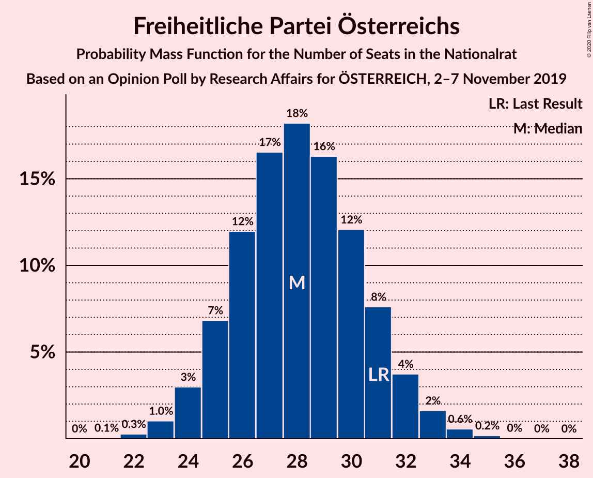

| Number of Seats | Probability | Accumulated | Special Marks |
|:---------------:|:-----------:|:-----------:|:-------------:|
| 21 | 0% | 100% |  |
| 22 | 0.3% | 99.9% |  |
| 23 | 1.0% | 99.7% |  |
| 24 | 3% | 98.7% |  |
| 25 | 7% | 95% |  |
| 26 | 13% | 89% |  |
| 27 | 16% | 76% |  |
| 28 | 17% | 60% | Median |
| 29 | 18% | 43% |  |
| 30 | 10% | 25% |  |
| 31 | 9% | 15% | Last Result |
| 32 | 4% | 6% |  |
| 33 | 1.5% | 2% |  |
| 34 | 0.6% | 0.8% |  |
| 35 | 0.2% | 0.2% |  |
| 36 | 0% | 0.1% |  |
| 37 | 0% | 0% |  |

### NEOS–Das Neue Österreich und Liberales Forum

*For a full overview of the results for this party, see the [NEOS–Das Neue Österreich und Liberales Forum](party-neos–dasneueösterreichundliberalesforum.html) page.*

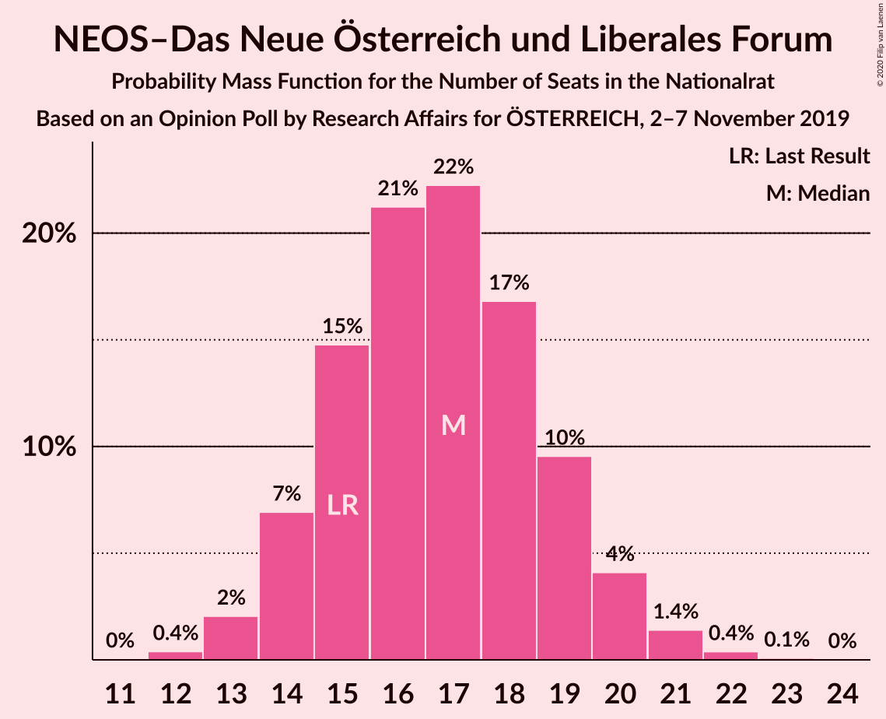

| Number of Seats | Probability | Accumulated | Special Marks |
|:---------------:|:-----------:|:-----------:|:-------------:|
| 12 | 0.4% | 100% |  |
| 13 | 2% | 99.6% |  |
| 14 | 7% | 97% |  |
| 15 | 13% | 91% | Last Result |
| 16 | 23% | 77% |  |
| 17 | 22% | 55% | Median |
| 18 | 18% | 32% |  |
| 19 | 9% | 15% |  |
| 20 | 4% | 6% |  |
| 21 | 2% | 2% |  |
| 22 | 0.4% | 0.5% |  |
| 23 | 0.1% | 0.1% |  |
| 24 | 0% | 0% |  |

## Coalitions

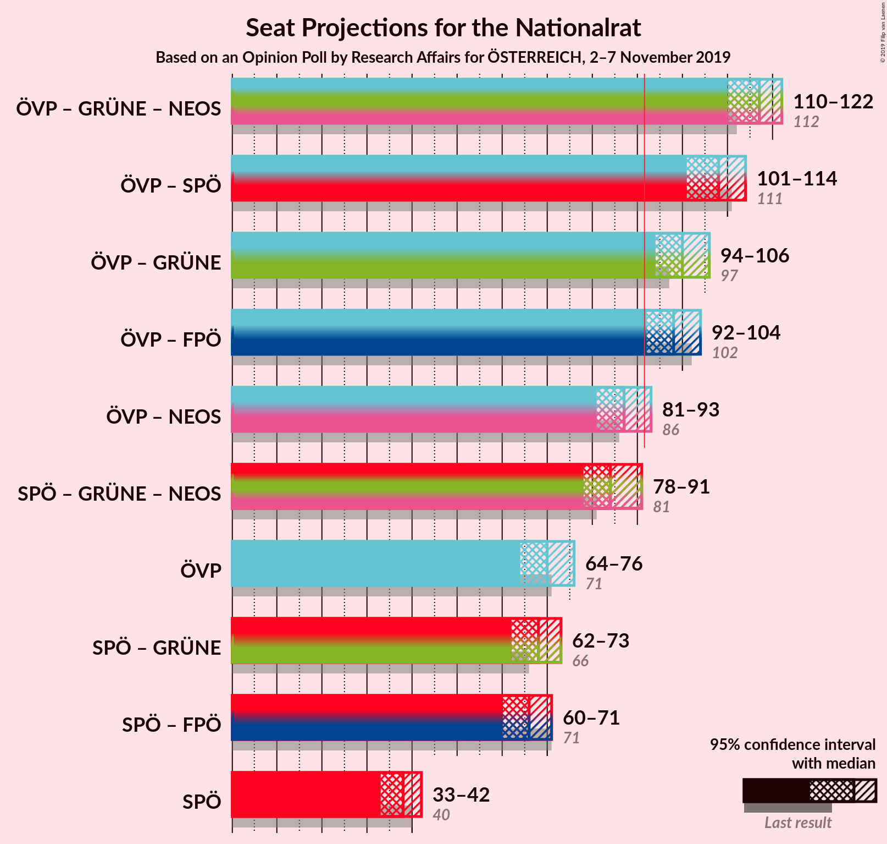

### Confidence Intervals

| Coalition | Last Result | Median | Majority? | 80% Confidence Interval | 90% Confidence Interval | 95% Confidence Interval | 99% Confidence Interval |
|:---------:|:-----------:|:------:|:---------:|:-----------------------:|:-----------------------:|:-----------------------:|:-----------------------:|
| Österreichische Volkspartei – Die Grünen–Die Grüne Alternative – NEOS–Das Neue Österreich und Liberales Forum | 112 | 117 | 100% | 113–121 | 111–122 | 110–122 | 108–124 |
| Österreichische Volkspartei – Sozialdemokratische Partei Österreichs | 111 | 108 | 100% | 104–112 | 102–113 | 101–114 | 99–115 |
| Österreichische Volkspartei – Die Grünen–Die Grüne Alternative | 97 | 100 | 99.5% | 96–104 | 95–105 | 94–106 | 92–108 |
| Österreichische Volkspartei – Freiheitliche Partei Österreichs | 102 | 98 | 98% | 94–102 | 93–103 | 92–104 | 90–106 |
| Österreichische Volkspartei – NEOS–Das Neue Österreich und Liberales Forum | 86 | 87 | 5% | 83–91 | 82–91 | 81–93 | 79–95 |
| Sozialdemokratische Partei Österreichs – Die Grünen–Die Grüne Alternative – NEOS–Das Neue Österreich und Liberales Forum | 81 | 84 | 1.1% | 80–88 | 79–89 | 78–91 | 76–92 |
| Österreichische Volkspartei | 71 | 70 | 0% | 66–74 | 65–75 | 64–76 | 62–78 |
| Sozialdemokratische Partei Österreichs – Die Grünen–Die Grüne Alternative | 66 | 68 | 0% | 64–71 | 63–73 | 62–73 | 60–75 |
| Sozialdemokratische Partei Österreichs – Freiheitliche Partei Österreichs | 71 | 66 | 0% | 62–69 | 61–71 | 60–71 | 58–73 |
| Sozialdemokratische Partei Österreichs | 40 | 38 | 0% | 35–41 | 34–42 | 33–42 | 32–44 |

### Österreichische Volkspartei – Die Grünen–Die Grüne Alternative – NEOS–Das Neue Österreich und Liberales Forum

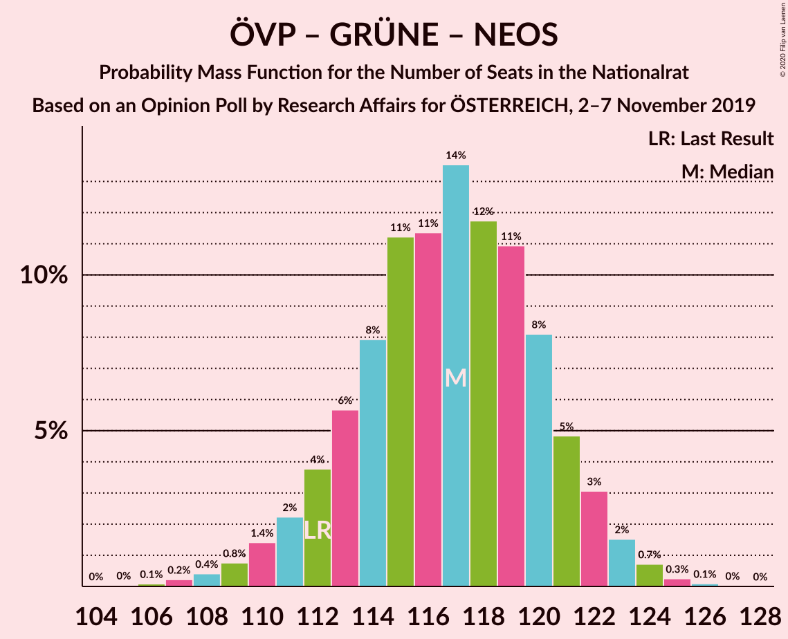

| Number of Seats | Probability | Accumulated | Special Marks |
|:---------------:|:-----------:|:-----------:|:-------------:|
| 105 | 0% | 100% |  |
| 106 | 0.1% | 99.9% |  |
| 107 | 0.2% | 99.8% |  |
| 108 | 0.5% | 99.7% |  |
| 109 | 0.6% | 99.2% |  |
| 110 | 2% | 98.6% |  |
| 111 | 2% | 97% |  |
| 112 | 4% | 95% | Last Result |
| 113 | 4% | 91% |  |
| 114 | 8% | 87% |  |
| 115 | 16% | 79% |  |
| 116 | 9% | 63% |  |
| 117 | 12% | 54% | Median |
| 118 | 11% | 42% |  |
| 119 | 11% | 30% |  |
| 120 | 9% | 20% |  |
| 121 | 6% | 11% |  |
| 122 | 3% | 5% |  |
| 123 | 1.3% | 2% |  |
| 124 | 0.9% | 1.2% |  |
| 125 | 0.2% | 0.3% |  |
| 126 | 0.1% | 0.1% |  |
| 127 | 0% | 0% |  |

### Österreichische Volkspartei – Sozialdemokratische Partei Österreichs

| Number of Seats | Probability | Accumulated | Special Marks |
|:---------------:|:-----------:|:-----------:|:-------------:|
| 96 | 0% | 100% |  |
| 97 | 0.1% | 99.9% |  |
| 98 | 0.2% | 99.8% |  |
| 99 | 0.4% | 99.6% |  |
| 100 | 0.8% | 99.2% |  |
| 101 | 1.4% | 98% |  |
| 102 | 3% | 97% |  |
| 103 | 4% | 94% |  |
| 104 | 6% | 90% |  |
| 105 | 9% | 84% |  |
| 106 | 11% | 74% |  |
| 107 | 12% | 63% |  |
| 108 | 10% | 51% | Median |
| 109 | 14% | 41% |  |
| 110 | 9% | 27% |  |
| 111 | 7% | 18% | Last Result |
| 112 | 5% | 11% |  |
| 113 | 3% | 6% |  |
| 114 | 1.4% | 3% |  |
| 115 | 0.6% | 1.1% |  |
| 116 | 0.4% | 0.5% |  |
| 117 | 0.1% | 0.1% |  |
| 118 | 0% | 0% |  |

### Österreichische Volkspartei – Die Grünen–Die Grüne Alternative

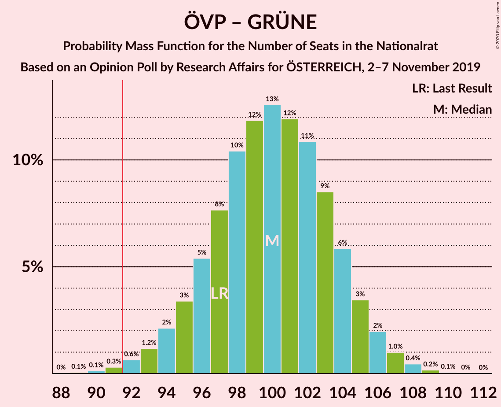

| Number of Seats | Probability | Accumulated | Special Marks |
|:---------------:|:-----------:|:-----------:|:-------------:|
| 89 | 0% | 100% |  |
| 90 | 0.1% | 99.9% |  |
| 91 | 0.3% | 99.8% |  |
| 92 | 0.8% | 99.5% | Majority |
| 93 | 1.1% | 98.8% |  |
| 94 | 2% | 98% |  |
| 95 | 3% | 95% |  |
| 96 | 5% | 92% |  |
| 97 | 8% | 87% | Last Result |
| 98 | 11% | 79% |  |
| 99 | 11% | 68% |  |
| 100 | 12% | 57% | Median |
| 101 | 13% | 45% |  |
| 102 | 9% | 32% |  |
| 103 | 11% | 23% |  |
| 104 | 6% | 13% |  |
| 105 | 3% | 6% |  |
| 106 | 1.5% | 3% |  |
| 107 | 1.1% | 2% |  |
| 108 | 0.4% | 0.7% |  |
| 109 | 0.2% | 0.2% |  |
| 110 | 0.1% | 0.1% |  |
| 111 | 0% | 0% |  |

### Österreichische Volkspartei – Freiheitliche Partei Österreichs

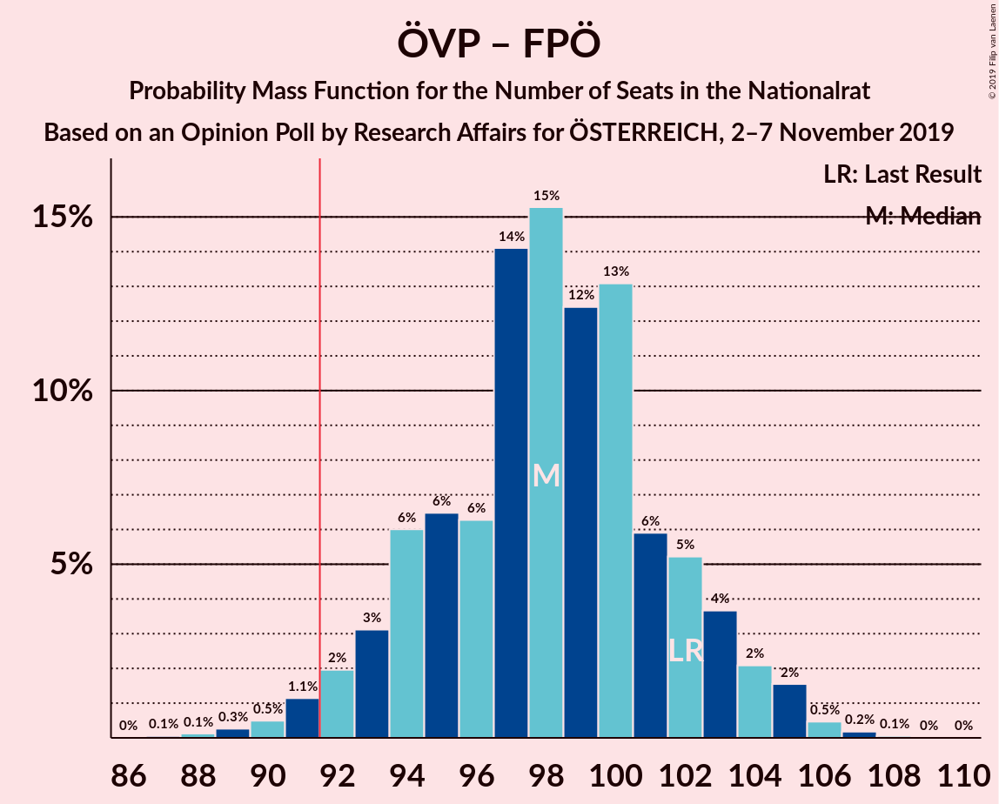

| Number of Seats | Probability | Accumulated | Special Marks |
|:---------------:|:-----------:|:-----------:|:-------------:|
| 87 | 0.1% | 100% |  |
| 88 | 0.1% | 99.9% |  |
| 89 | 0.3% | 99.8% |  |
| 90 | 0.5% | 99.5% |  |
| 91 | 1.1% | 99.0% |  |
| 92 | 2% | 98% | Majority |
| 93 | 3% | 96% |  |
| 94 | 6% | 93% |  |
| 95 | 6% | 87% |  |
| 96 | 6% | 80% |  |
| 97 | 14% | 74% |  |
| 98 | 15% | 60% | Median |
| 99 | 12% | 45% |  |
| 100 | 13% | 32% |  |
| 101 | 6% | 19% |  |
| 102 | 5% | 13% | Last Result |
| 103 | 4% | 8% |  |
| 104 | 2% | 4% |  |
| 105 | 2% | 2% |  |
| 106 | 0.5% | 0.7% |  |
| 107 | 0.2% | 0.3% |  |
| 108 | 0.1% | 0.1% |  |
| 109 | 0% | 0% |  |

### Österreichische Volkspartei – NEOS–Das Neue Österreich und Liberales Forum

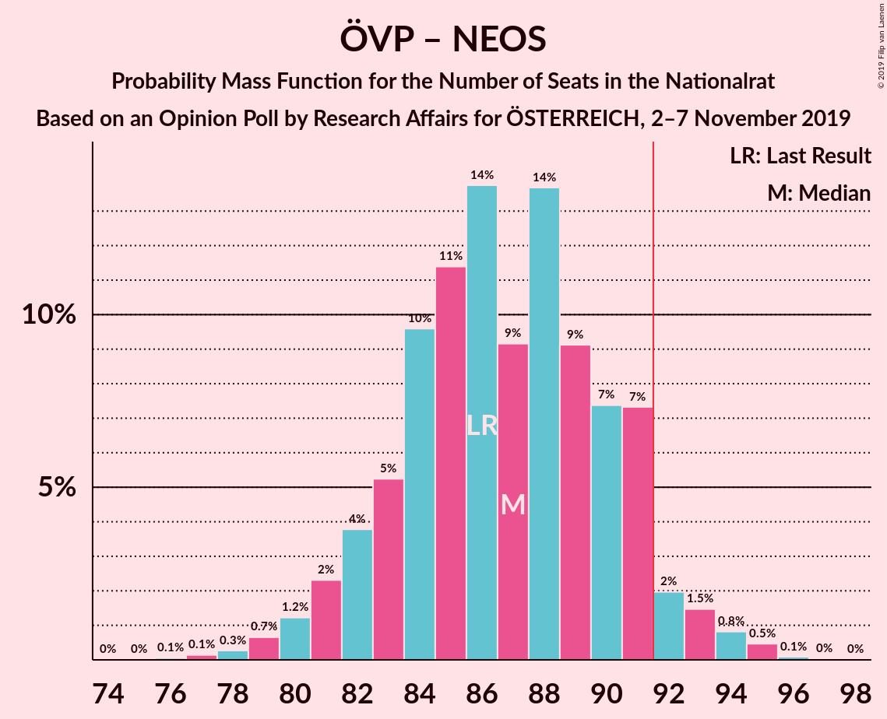

| Number of Seats | Probability | Accumulated | Special Marks |
|:---------------:|:-----------:|:-----------:|:-------------:|
| 76 | 0.1% | 100% |  |
| 77 | 0.1% | 99.9% |  |
| 78 | 0.3% | 99.8% |  |
| 79 | 0.7% | 99.5% |  |
| 80 | 1.2% | 98.9% |  |
| 81 | 2% | 98% |  |
| 82 | 4% | 95% |  |
| 83 | 5% | 92% |  |
| 84 | 10% | 86% |  |
| 85 | 11% | 77% |  |
| 86 | 14% | 65% | Last Result |
| 87 | 9% | 52% | Median |
| 88 | 14% | 42% |  |
| 89 | 9% | 29% |  |
| 90 | 7% | 20% |  |
| 91 | 7% | 12% |  |
| 92 | 2% | 5% | Majority |
| 93 | 1.5% | 3% |  |
| 94 | 0.8% | 1.4% |  |
| 95 | 0.5% | 0.6% |  |
| 96 | 0.1% | 0.1% |  |
| 97 | 0% | 0.1% |  |
| 98 | 0% | 0% |  |

### Sozialdemokratische Partei Österreichs – Die Grünen–Die Grüne Alternative – NEOS–Das Neue Österreich und Liberales Forum

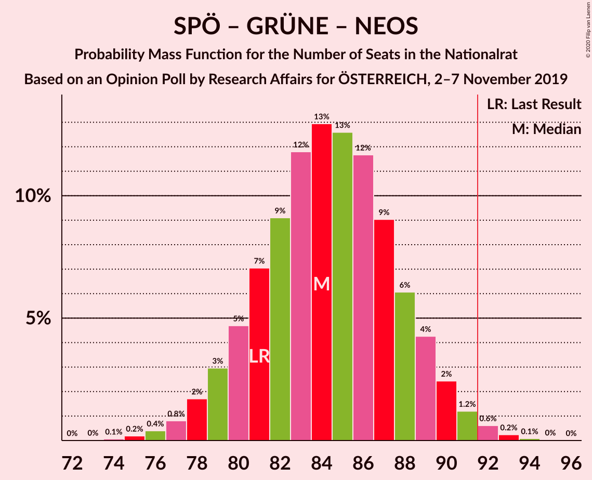

| Number of Seats | Probability | Accumulated | Special Marks |
|:---------------:|:-----------:|:-----------:|:-------------:|
| 74 | 0.1% | 100% |  |
| 75 | 0.2% | 99.9% |  |
| 76 | 0.4% | 99.7% |  |
| 77 | 0.8% | 99.3% |  |
| 78 | 2% | 98.5% |  |
| 79 | 3% | 97% |  |
| 80 | 5% | 94% |  |
| 81 | 7% | 89% | Last Result |
| 82 | 7% | 83% |  |
| 83 | 14% | 75% |  |
| 84 | 13% | 62% |  |
| 85 | 15% | 49% | Median |
| 86 | 14% | 34% |  |
| 87 | 6% | 20% |  |
| 88 | 5% | 14% |  |
| 89 | 5% | 9% |  |
| 90 | 2% | 5% |  |
| 91 | 1.4% | 3% |  |
| 92 | 0.8% | 1.1% | Majority |
| 93 | 0.2% | 0.3% |  |
| 94 | 0.1% | 0.1% |  |
| 95 | 0% | 0% |  |

### Österreichische Volkspartei

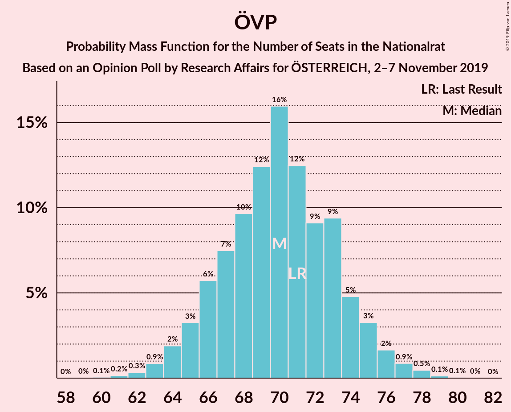

| Number of Seats | Probability | Accumulated | Special Marks |
|:---------------:|:-----------:|:-----------:|:-------------:|
| 60 | 0.1% | 100% |  |
| 61 | 0.2% | 99.9% |  |
| 62 | 0.3% | 99.8% |  |
| 63 | 0.9% | 99.4% |  |
| 64 | 2% | 98.6% |  |
| 65 | 3% | 97% |  |
| 66 | 6% | 93% |  |
| 67 | 7% | 88% |  |
| 68 | 10% | 80% |  |
| 69 | 12% | 71% |  |
| 70 | 16% | 58% | Median |
| 71 | 12% | 42% | Last Result |
| 72 | 9% | 30% |  |
| 73 | 9% | 21% |  |
| 74 | 5% | 11% |  |
| 75 | 3% | 6% |  |
| 76 | 2% | 3% |  |
| 77 | 0.9% | 2% |  |
| 78 | 0.5% | 0.7% |  |
| 79 | 0.1% | 0.2% |  |
| 80 | 0.1% | 0.1% |  |
| 81 | 0% | 0% |  |

### Sozialdemokratische Partei Österreichs – Die Grünen–Die Grüne Alternative

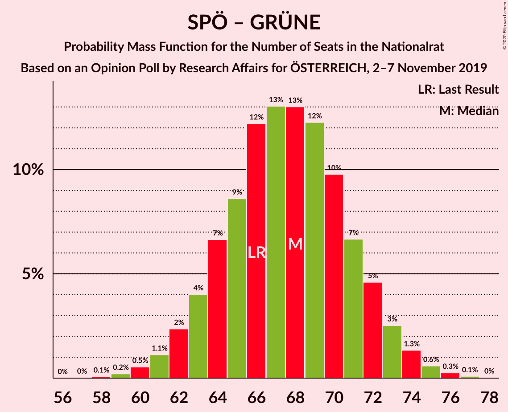

| Number of Seats | Probability | Accumulated | Special Marks |
|:---------------:|:-----------:|:-----------:|:-------------:|
| 58 | 0.1% | 100% |  |
| 59 | 0.2% | 99.9% |  |
| 60 | 0.6% | 99.7% |  |
| 61 | 1.0% | 99.1% |  |
| 62 | 3% | 98% |  |
| 63 | 4% | 96% |  |
| 64 | 6% | 92% |  |
| 65 | 9% | 86% |  |
| 66 | 13% | 77% | Last Result |
| 67 | 12% | 64% |  |
| 68 | 14% | 52% | Median |
| 69 | 14% | 38% |  |
| 70 | 7% | 23% |  |
| 71 | 8% | 16% |  |
| 72 | 4% | 9% |  |
| 73 | 3% | 5% |  |
| 74 | 1.4% | 2% |  |
| 75 | 0.6% | 1.0% |  |
| 76 | 0.3% | 0.4% |  |
| 77 | 0.1% | 0.1% |  |
| 78 | 0% | 0% |  |

### Sozialdemokratische Partei Österreichs – Freiheitliche Partei Österreichs

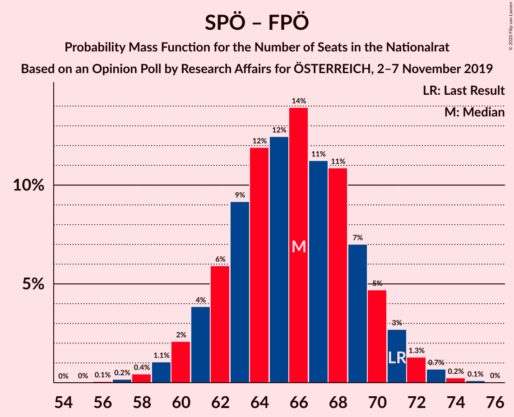

| Number of Seats | Probability | Accumulated | Special Marks |
|:---------------:|:-----------:|:-----------:|:-------------:|
| 56 | 0.1% | 100% |  |
| 57 | 0.1% | 99.9% |  |
| 58 | 0.4% | 99.8% |  |
| 59 | 1.2% | 99.3% |  |
| 60 | 2% | 98% |  |
| 61 | 4% | 96% |  |
| 62 | 7% | 93% |  |
| 63 | 9% | 86% |  |
| 64 | 12% | 76% |  |
| 65 | 12% | 64% |  |
| 66 | 13% | 52% | Median |
| 67 | 9% | 39% |  |
| 68 | 15% | 30% |  |
| 69 | 7% | 15% |  |
| 70 | 3% | 8% |  |
| 71 | 3% | 5% | Last Result |
| 72 | 1.2% | 2% |  |
| 73 | 0.8% | 1.1% |  |
| 74 | 0.2% | 0.4% |  |
| 75 | 0.1% | 0.2% |  |
| 76 | 0% | 0% |  |

### Sozialdemokratische Partei Österreichs

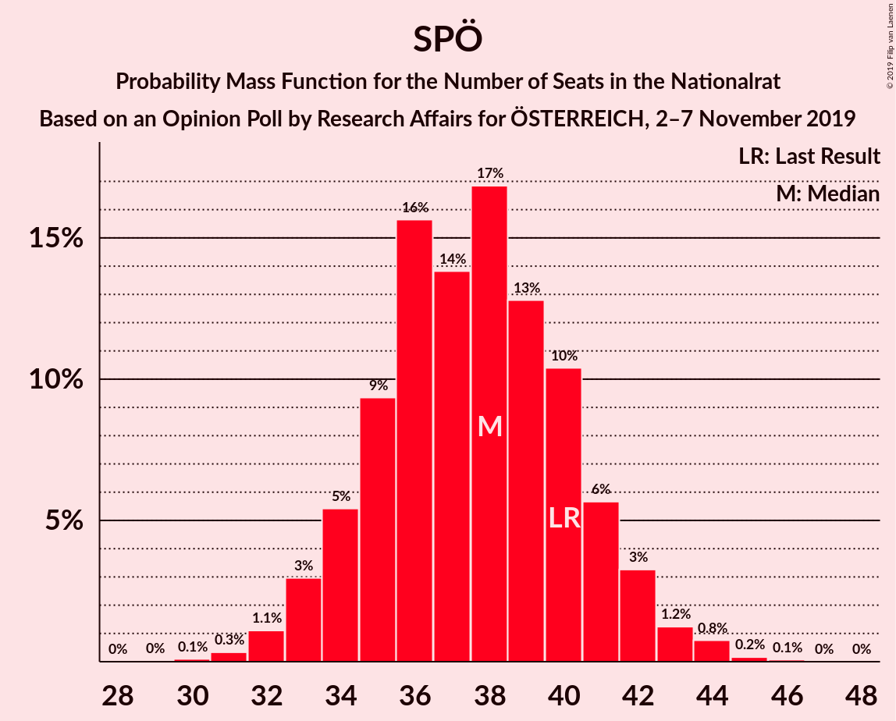

| Number of Seats | Probability | Accumulated | Special Marks |
|:---------------:|:-----------:|:-----------:|:-------------:|
| 30 | 0.1% | 100% |  |
| 31 | 0.3% | 99.9% |  |
| 32 | 1.1% | 99.5% |  |
| 33 | 3% | 98% |  |
| 34 | 5% | 95% |  |
| 35 | 9% | 90% |  |
| 36 | 16% | 81% |  |
| 37 | 14% | 65% |  |
| 38 | 17% | 51% | Median |
| 39 | 13% | 34% |  |
| 40 | 10% | 22% | Last Result |
| 41 | 6% | 11% |  |
| 42 | 3% | 6% |  |
| 43 | 1.2% | 2% |  |
| 44 | 0.8% | 1.0% |  |
| 45 | 0.2% | 0.3% |  |
| 46 | 0.1% | 0.1% |  |
| 47 | 0% | 0% |  |

## Technical Information

### Opinion Poll

+ **Polling firm:** Research Affairs
+ **Commissioner(s):** ÖSTERREICH
+ **Fieldwork period:** 2–7 November 2019

### Calculations

+ **Sample size:** 1002
+ **Simulations done:** 131,072
+ **Error estimate:** 1.01%

