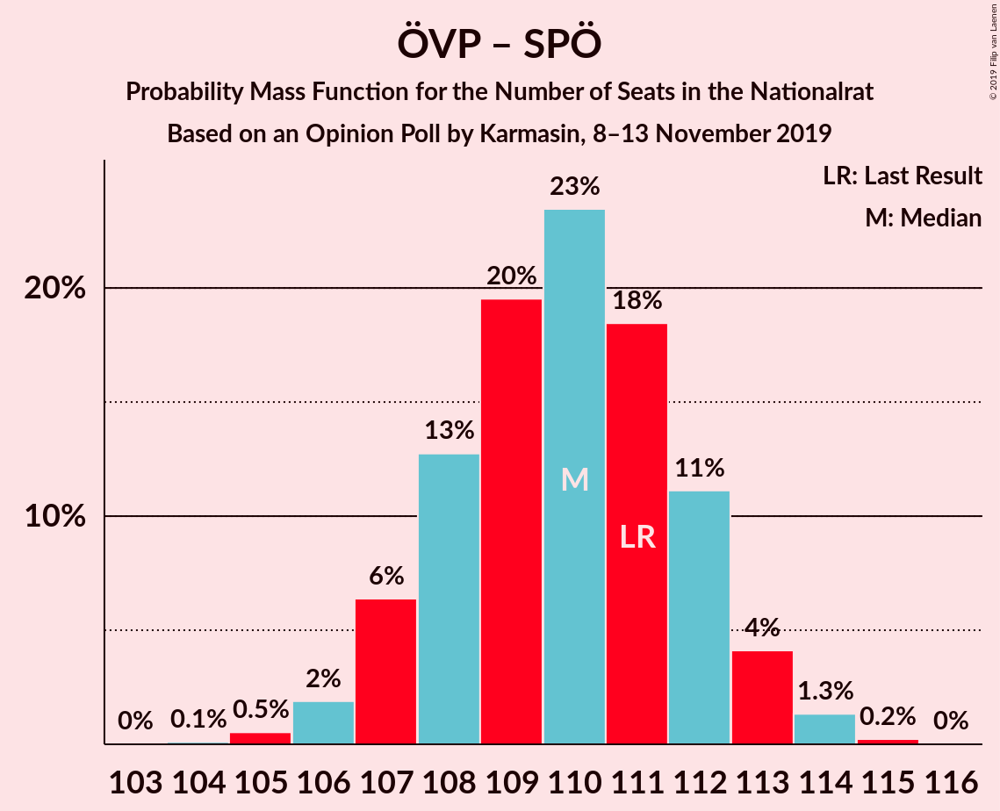
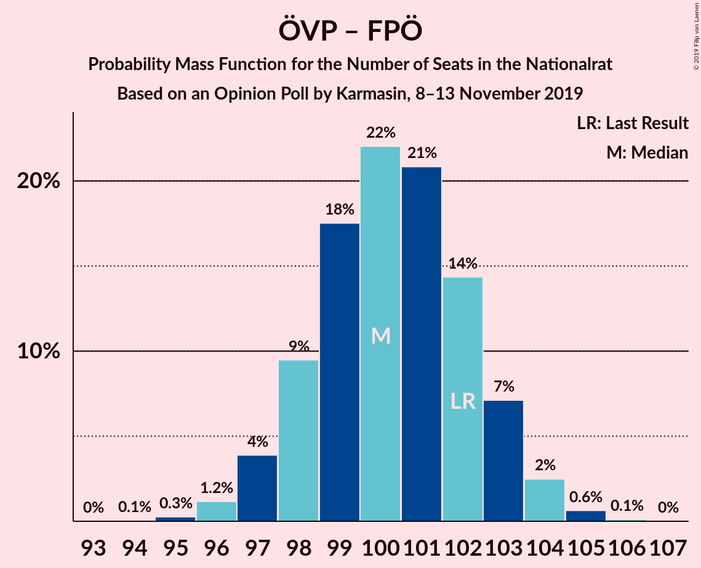
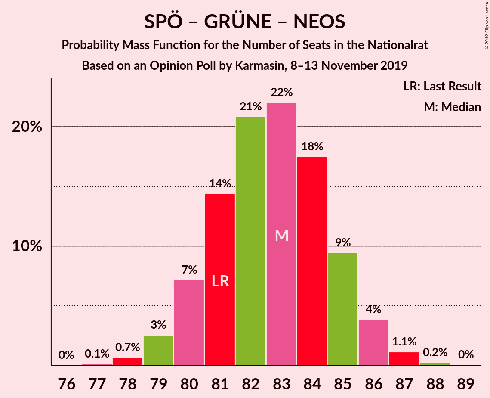

# Opinion Poll by Karmasin, 8–13 November 2019

<a href="#voting-intentions">Voting Intentions</a> | <a href="#seats">Seats</a> | <a href="#coalitions">Coalitions</a> | <a href="#technical-information">Technical Information</a>

## Voting Intentions

### Confidence Intervals

| Party | Last Result | Poll Result | 80% Confidence Interval | 90% Confidence Interval | 95% Confidence Interval | 99% Confidence Interval |
|:-----:|:-----------:|:-----------:|:-----------------------:|:-----------------------:|:-----------------------:|:-----------------------:|
| Österreichische Volkspartei | 37.5% | 38.0% | 36.9–39.2% |36.5–39.5% |36.3–39.8% |35.7–40.3% |
| Sozialdemokratische Partei Österreichs | 21.2% | 20.0% | 19.1–21.0% |18.8–21.2% |18.6–21.5% |18.2–21.9% |
| Freiheitliche Partei Österreichs | 16.2% | 15.0% | 14.2–15.9% |14.0–16.1% |13.8–16.3% |13.4–16.8% |
| Die Grünen–Die Grüne Alternative | 13.9% | 15.0% | 14.2–15.9% |14.0–16.1% |13.8–16.3% |13.4–16.8% |
| NEOS–Das Neue Österreich und Liberales Forum | 8.1% | 9.0% | 8.4–9.7% |8.2–9.9% |8.0–10.1% |7.7–10.4% |

*Note:* The poll result column reflects the actual value used in the calculations. Published results may vary slightly, and in addition be rounded to fewer digits.

## Seats

### Confidence Intervals

| Party | Last Result | Median | 80% Confidence Interval | 90% Confidence Interval | 95% Confidence Interval | 99% Confidence Interval |
|:-----:|:-----------:|:------:|:-----------------------:|:-----------------------:|:-----------------------:|:-----------------------:|
| <a href="#österreichische-volkspartei">Österreichische Volkspartei</a> | 71 | 72 | 70–74 |69–75 |69–75 |68–76 |
| <a href="#sozialdemokratische-partei-österreichs">Sozialdemokratische Partei Österreichs</a> | 40 | 38 | 36–40 |35–40 |35–41 |34–41 |
| <a href="#freiheitliche-partei-österreichs">Freiheitliche Partei Österreichs</a> | 31 | 28 | 27–30 |26–30 |26–31 |25–32 |
| <a href="#die-grünen–die-grüne-alternative">Die Grünen–Die Grüne Alternative</a> | 26 | 28 | 27–30 |26–30 |26–31 |25–31 |
| <a href="#neos–das-neue-österreich-und-liberales-forum">NEOS–Das Neue Österreich und Liberales Forum</a> | 15 | 17 | 15–18 |15–18 |15–19 |14–19 |

### Österreichische Volkspartei

*For a full overview of the results for this party, see the [Österreichische Volkspartei](party-österreichischevolkspartei.html) page.*

| Number of Seats | Probability | Accumulated | Special Marks |
|:---------------:|:-----------:|:-----------:|:-------------:|
| 66 | 0% | 100% |  |
| 67 | 0.3% | 99.9% |  |
| 68 | 1.4% | 99.7% |  |
| 69 | 5% | 98% |  |
| 70 | 11% | 94% |  |
| 71 | 18% | 83% | Last Result |
| 72 | 23% | 65% | Median |
| 73 | 21% | 42% |  |
| 74 | 13% | 21% |  |
| 75 | 6% | 8% |  |
| 76 | 2% | 2% |  |
| 77 | 0.4% | 0.5% |  |
| 78 | 0.1% | 0.1% |  |
| 79 | 0% | 0% |  |

### Sozialdemokratische Partei Österreichs

*For a full overview of the results for this party, see the [Sozialdemokratische Partei Österreichs](party-sozialdemokratischeparteiösterreichs.html) page.*

| Number of Seats | Probability | Accumulated | Special Marks |
|:---------------:|:-----------:|:-----------:|:-------------:|
| 33 | 0.1% | 100% |  |
| 34 | 0.8% | 99.9% |  |
| 35 | 4% | 99.1% |  |
| 36 | 13% | 95% |  |
| 37 | 25% | 82% |  |
| 38 | 27% | 57% | Median |
| 39 | 19% | 30% |  |
| 40 | 8% | 10% | Last Result |
| 41 | 2% | 3% |  |
| 42 | 0.4% | 0.4% |  |
| 43 | 0% | 0% |  |

### Freiheitliche Partei Österreichs

*For a full overview of the results for this party, see the [Freiheitliche Partei Österreichs](party-freiheitlicheparteiösterreichs.html) page.*

| Number of Seats | Probability | Accumulated | Special Marks |
|:---------------:|:-----------:|:-----------:|:-------------:|
| 24 | 0.1% | 100% |  |
| 25 | 1.2% | 99.9% |  |
| 26 | 7% | 98.7% |  |
| 27 | 20% | 91% |  |
| 28 | 32% | 71% | Median |
| 29 | 24% | 40% |  |
| 30 | 12% | 15% |  |
| 31 | 3% | 4% | Last Result |
| 32 | 0.5% | 0.5% |  |
| 33 | 0% | 0% |  |

### Die Grünen–Die Grüne Alternative

*For a full overview of the results for this party, see the [Die Grünen–Die Grüne Alternative](party-diegrünen–diegrünealternative.html) page.*

| Number of Seats | Probability | Accumulated | Special Marks |
|:---------------:|:-----------:|:-----------:|:-------------:|
| 24 | 0.1% | 100% |  |
| 25 | 1.3% | 99.9% |  |
| 26 | 8% | 98.6% | Last Result |
| 27 | 20% | 90% |  |
| 28 | 33% | 71% | Median |
| 29 | 24% | 38% |  |
| 30 | 10% | 14% |  |
| 31 | 3% | 4% |  |
| 32 | 0.4% | 0.4% |  |
| 33 | 0% | 0% |  |

### NEOS–Das Neue Österreich und Liberales Forum

*For a full overview of the results for this party, see the [NEOS–Das Neue Österreich und Liberales Forum](party-neos–dasneueösterreichundliberalesforum.html) page.*

| Number of Seats | Probability | Accumulated | Special Marks |
|:---------------:|:-----------:|:-----------:|:-------------:|
| 14 | 1.0% | 100% |  |
| 15 | 9% | 99.0% | Last Result |
| 16 | 30% | 90% |  |
| 17 | 37% | 60% | Median |
| 18 | 18% | 22% |  |
| 19 | 4% | 4% |  |
| 20 | 0.4% | 0.4% |  |
| 21 | 0% | 0% |  |

## Coalitions

### Confidence Intervals

| Coalition | Last Result | Median | Majority? | 80% Confidence Interval | 90% Confidence Interval | 95% Confidence Interval | 99% Confidence Interval |
|:---------:|:-----------:|:------:|:---------:|:-----------------------:|:-----------------------:|:-----------------------:|:-----------------------:|
| Österreichische Volkspartei – Die Grünen–Die Grüne Alternative – NEOS–Das Neue Österreich und Liberales Forum | 112 | 117 | 100% | 115–119 | 114–120 | 114–120 | 113–121 |
| Österreichische Volkspartei – Sozialdemokratische Partei Österreichs | 111 | 110 | 100% | 108–112 | 107–113 | 106–113 | 105–114 |
| Österreichische Volkspartei – Die Grünen–Die Grüne Alternative | 97 | 100 | 100% | 98–102 | 97–103 | 97–104 | 96–105 |
| Österreichische Volkspartei – Freiheitliche Partei Österreichs | 102 | 100 | 100% | 98–103 | 97–103 | 97–104 | 96–105 |
| Österreichische Volkspartei – NEOS–Das Neue Österreich und Liberales Forum | 86 | 89 | 6% | 87–91 | 86–92 | 85–92 | 84–93 |
| Sozialdemokratische Partei Österreichs – Die Grünen–Die Grüne Alternative – NEOS–Das Neue Österreich und Liberales Forum | 81 | 83 | 0% | 80–85 | 80–86 | 79–86 | 78–87 |
| Österreichische Volkspartei | 71 | 72 | 0% | 70–74 | 69–75 | 69–75 | 68–76 |
| Sozialdemokratische Partei Österreichs – Die Grünen–Die Grüne Alternative | 66 | 66 | 0% | 64–68 | 63–69 | 63–69 | 62–70 |
| Sozialdemokratische Partei Österreichs – Freiheitliche Partei Österreichs | 71 | 66 | 0% | 64–68 | 63–69 | 63–69 | 62–70 |
| Sozialdemokratische Partei Österreichs | 40 | 38 | 0% | 36–40 | 35–40 | 35–41 | 34–41 |

### Österreichische Volkspartei – Die Grünen–Die Grüne Alternative – NEOS–Das Neue Österreich und Liberales Forum

| Number of Seats | Probability | Accumulated | Special Marks |
|:---------------:|:-----------:|:-----------:|:-------------:|
| 111 | 0.1% | 100% |  |
| 112 | 0.4% | 99.9% | Last Result |
| 113 | 1.5% | 99.5% |  |
| 114 | 5% | 98% |  |
| 115 | 11% | 93% |  |
| 116 | 19% | 82% |  |
| 117 | 24% | 63% | Median |
| 118 | 20% | 39% |  |
| 119 | 12% | 19% |  |
| 120 | 5% | 7% |  |
| 121 | 1.4% | 2% |  |
| 122 | 0.3% | 0.3% |  |
| 123 | 0% | 0% |  |

### Österreichische Volkspartei – Sozialdemokratische Partei Österreichs

| Number of Seats | Probability | Accumulated | Special Marks |
|:---------------:|:-----------:|:-----------:|:-------------:|
| 104 | 0.1% | 100% |  |
| 105 | 0.5% | 99.9% |  |
| 106 | 2% | 99.3% |  |
| 107 | 6% | 97% |  |
| 108 | 13% | 91% |  |
| 109 | 19% | 79% |  |
| 110 | 23% | 59% | Median |
| 111 | 19% | 36% | Last Result |
| 112 | 11% | 17% |  |
| 113 | 4% | 6% |  |
| 114 | 1.5% | 2% |  |
| 115 | 0.2% | 0.3% |  |
| 116 | 0.1% | 0.1% |  |
| 117 | 0% | 0% |  |

### Österreichische Volkspartei – Die Grünen–Die Grüne Alternative

| Number of Seats | Probability | Accumulated | Special Marks |
|:---------------:|:-----------:|:-----------:|:-------------:|
| 94 | 0.1% | 100% |  |
| 95 | 0.3% | 99.9% |  |
| 96 | 1.2% | 99.7% |  |
| 97 | 4% | 98.5% | Last Result |
| 98 | 10% | 95% |  |
| 99 | 17% | 85% |  |
| 100 | 23% | 68% | Median |
| 101 | 20% | 45% |  |
| 102 | 14% | 24% |  |
| 103 | 7% | 10% |  |
| 104 | 2% | 3% |  |
| 105 | 0.6% | 0.7% |  |
| 106 | 0.1% | 0.1% |  |
| 107 | 0% | 0% |  |

### Österreichische Volkspartei – Freiheitliche Partei Österreichs

| Number of Seats | Probability | Accumulated | Special Marks |
|:---------------:|:-----------:|:-----------:|:-------------:|
| 94 | 0.1% | 100% |  |
| 95 | 0.3% | 99.9% |  |
| 96 | 1.3% | 99.7% |  |
| 97 | 4% | 98% |  |
| 98 | 10% | 94% |  |
| 99 | 16% | 85% |  |
| 100 | 21% | 68% | Median |
| 101 | 21% | 48% |  |
| 102 | 16% | 26% | Last Result |
| 103 | 7% | 10% |  |
| 104 | 2% | 3% |  |
| 105 | 0.5% | 0.7% |  |
| 106 | 0.1% | 0.1% |  |
| 107 | 0% | 0% |  |

### Österreichische Volkspartei – NEOS–Das Neue Österreich und Liberales Forum

| Number of Seats | Probability | Accumulated | Special Marks |
|:---------------:|:-----------:|:-----------:|:-------------:|
| 83 | 0.1% | 100% |  |
| 84 | 0.5% | 99.9% |  |
| 85 | 2% | 99.3% |  |
| 86 | 6% | 97% | Last Result |
| 87 | 12% | 91% |  |
| 88 | 19% | 79% |  |
| 89 | 23% | 59% | Median |
| 90 | 19% | 37% |  |
| 91 | 11% | 17% |  |
| 92 | 5% | 6% | Majority |
| 93 | 1.4% | 2% |  |
| 94 | 0.3% | 0.4% |  |
| 95 | 0.1% | 0.1% |  |
| 96 | 0% | 0% |  |

### Sozialdemokratische Partei Österreichs – Die Grünen–Die Grüne Alternative – NEOS–Das Neue Österreich und Liberales Forum

| Number of Seats | Probability | Accumulated | Special Marks |
|:---------------:|:-----------:|:-----------:|:-------------:|
| 77 | 0.1% | 100% |  |
| 78 | 0.6% | 99.9% |  |
| 79 | 2% | 99.3% |  |
| 80 | 7% | 97% |  |
| 81 | 16% | 89% | Last Result |
| 82 | 21% | 74% |  |
| 83 | 21% | 52% | Median |
| 84 | 16% | 32% |  |
| 85 | 10% | 15% |  |
| 86 | 4% | 6% |  |
| 87 | 1.2% | 2% |  |
| 88 | 0.2% | 0.3% |  |
| 89 | 0% | 0% |  |

### Österreichische Volkspartei

| Number of Seats | Probability | Accumulated | Special Marks |
|:---------------:|:-----------:|:-----------:|:-------------:|
| 66 | 0% | 100% |  |
| 67 | 0.3% | 99.9% |  |
| 68 | 1.4% | 99.7% |  |
| 69 | 5% | 98% |  |
| 70 | 11% | 94% |  |
| 71 | 18% | 83% | Last Result |
| 72 | 23% | 65% | Median |
| 73 | 21% | 42% |  |
| 74 | 13% | 21% |  |
| 75 | 6% | 8% |  |
| 76 | 2% | 2% |  |
| 77 | 0.4% | 0.5% |  |
| 78 | 0.1% | 0.1% |  |
| 79 | 0% | 0% |  |

### Sozialdemokratische Partei Österreichs – Die Grünen–Die Grüne Alternative

| Number of Seats | Probability | Accumulated | Special Marks |
|:---------------:|:-----------:|:-----------:|:-------------:|
| 60 | 0% | 100% |  |
| 61 | 0.3% | 99.9% |  |
| 62 | 2% | 99.6% |  |
| 63 | 6% | 98% |  |
| 64 | 13% | 92% |  |
| 65 | 21% | 80% |  |
| 66 | 23% | 59% | Last Result, Median |
| 67 | 18% | 36% |  |
| 68 | 11% | 17% |  |
| 69 | 5% | 6% |  |
| 70 | 1.4% | 2% |  |
| 71 | 0.3% | 0.4% |  |
| 72 | 0% | 0.1% |  |
| 73 | 0% | 0% |  |

### Sozialdemokratische Partei Österreichs – Freiheitliche Partei Österreichs

| Number of Seats | Probability | Accumulated | Special Marks |
|:---------------:|:-----------:|:-----------:|:-------------:|
| 60 | 0% | 100% |  |
| 61 | 0.3% | 99.9% |  |
| 62 | 1.4% | 99.6% |  |
| 63 | 5% | 98% |  |
| 64 | 12% | 93% |  |
| 65 | 20% | 81% |  |
| 66 | 24% | 61% | Median |
| 67 | 19% | 37% |  |
| 68 | 11% | 17% |  |
| 69 | 5% | 7% |  |
| 70 | 1.4% | 2% |  |
| 71 | 0.3% | 0.4% | Last Result |
| 72 | 0% | 0.1% |  |
| 73 | 0% | 0% |  |

### Sozialdemokratische Partei Österreichs

| Number of Seats | Probability | Accumulated | Special Marks |
|:---------------:|:-----------:|:-----------:|:-------------:|
| 33 | 0.1% | 100% |  |
| 34 | 0.8% | 99.9% |  |
| 35 | 4% | 99.1% |  |
| 36 | 13% | 95% |  |
| 37 | 25% | 82% |  |
| 38 | 27% | 57% | Median |
| 39 | 19% | 30% |  |
| 40 | 8% | 10% | Last Result |
| 41 | 2% | 3% |  |
| 42 | 0.4% | 0.4% |  |
| 43 | 0% | 0% |  |

## Technical Information

### Opinion Poll

+ **Polling firm:** Karmasin
+ **Commissioner(s):** —
+ **Fieldwork period:** 8–13 November 2019

### Calculations

+ **Sample size:** 3000
+ **Simulations done:** 524,288
+ **Error estimate:** 0.17%

