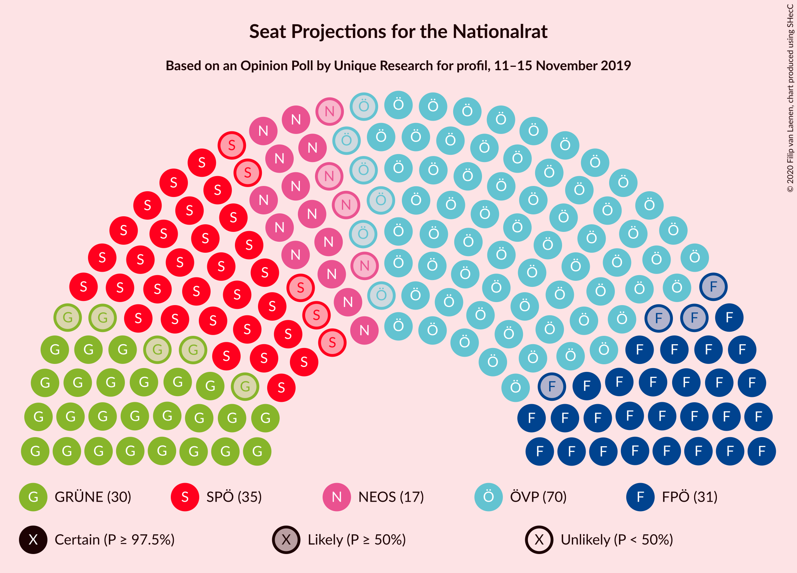
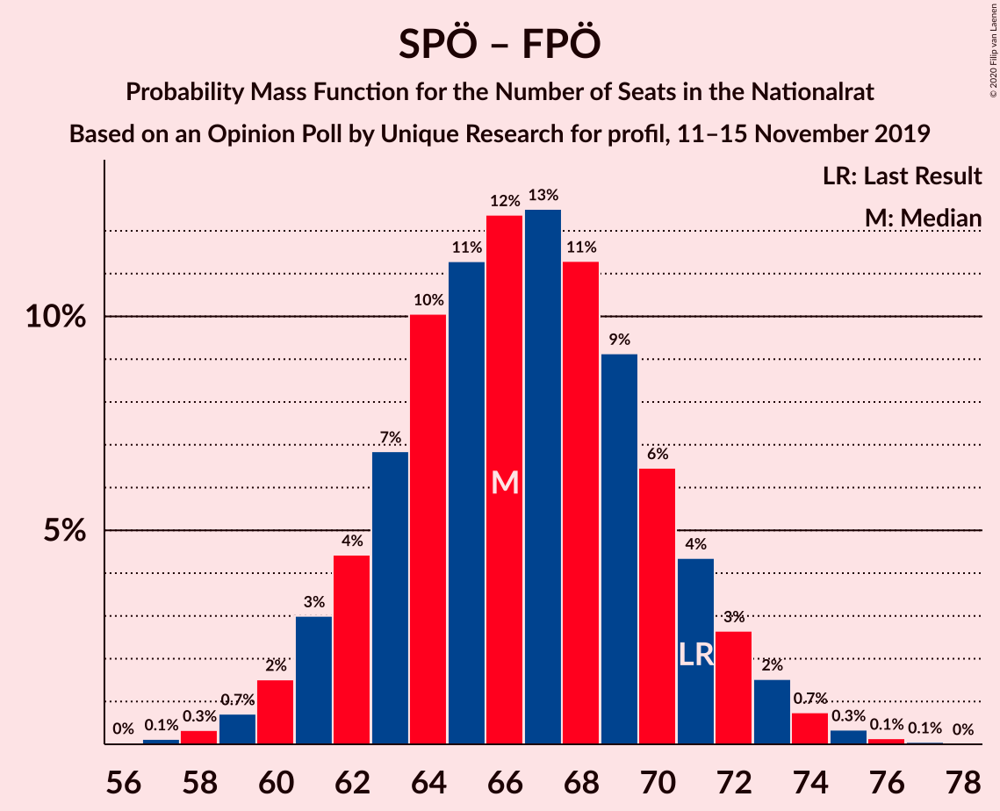

# Opinion Poll by Unique Research for profil, 11–15 November 2019

<a href="#voting-intentions">Voting Intentions</a> | <a href="#seats">Seats</a> | <a href="#coalitions">Coalitions</a> | <a href="#technical-information">Technical Information</a>

## Voting Intentions

### Confidence Intervals

| Party | Last Result | Poll Result | 80% Confidence Interval | 90% Confidence Interval | 95% Confidence Interval | 99% Confidence Interval |
|:-----:|:-----------:|:-----------:|:-----------------------:|:-----------------------:|:-----------------------:|:-----------------------:|
| Österreichische Volkspartei | 37.5% | 37.9% | 35.8–40.2% |35.2–40.8% |34.7–41.3% |33.7–42.4% |
| Sozialdemokratische Partei Österreichs | 21.2% | 19.0% | 17.3–20.8% |16.8–21.4% |16.4–21.8% |15.7–22.7% |
| Freiheitliche Partei Österreichs | 16.2% | 17.0% | 15.4–18.8% |15.0–19.3% |14.6–19.8% |13.9–20.6% |
| Die Grünen–Die Grüne Alternative | 13.9% | 16.0% | 14.5–17.8% |14.1–18.3% |13.7–18.7% |13.0–19.6% |
| NEOS–Das Neue Österreich und Liberales Forum | 8.1% | 9.1% | 7.9–10.5% |7.5–10.9% |7.3–11.2% |6.8–11.9% |

*Note:* The poll result column reflects the actual value used in the calculations. Published results may vary slightly, and in addition be rounded to fewer digits.

## Seats

### Confidence Intervals

| Party | Last Result | Median | 80% Confidence Interval | 90% Confidence Interval | 95% Confidence Interval | 99% Confidence Interval |
|:-----:|:-----------:|:------:|:-----------------------:|:-----------------------:|:-----------------------:|:-----------------------:|
| <a href="#österreichische-volkspartei">Österreichische Volkspartei</a> | 71 | 70 | 67–74 |65–76 |64–77 |62–79 |
| <a href="#sozialdemokratische-partei-österreichs">Sozialdemokratische Partei Österreichs</a> | 40 | 35 | 32–38 |31–39 |30–40 |29–42 |
| <a href="#freiheitliche-partei-österreichs">Freiheitliche Partei Österreichs</a> | 31 | 31 | 28–35 |28–36 |27–36 |25–38 |
| <a href="#die-grünen–die-grüne-alternative">Die Grünen–Die Grüne Alternative</a> | 26 | 30 | 26–33 |26–34 |25–34 |24–36 |
| <a href="#neos–das-neue-österreich-und-liberales-forum">NEOS–Das Neue Österreich und Liberales Forum</a> | 15 | 17 | 14–19 |14–20 |13–20 |12–22 |

### Österreichische Volkspartei

*For a full overview of the results for this party, see the [Österreichische Volkspartei](party-österreichischevolkspartei.html) page.*

| Number of Seats | Probability | Accumulated | Special Marks |
|:---------------:|:-----------:|:-----------:|:-------------:|
| 60 | 0.1% | 100% |  |
| 61 | 0.1% | 99.9% |  |
| 62 | 0.5% | 99.8% |  |
| 63 | 0.5% | 99.3% |  |
| 64 | 1.4% | 98.8% |  |
| 65 | 3% | 97% |  |
| 66 | 4% | 94% |  |
| 67 | 7% | 90% |  |
| 68 | 8% | 83% |  |
| 69 | 13% | 74% |  |
| 70 | 13% | 62% | Median |
| 71 | 13% | 49% | Last Result |
| 72 | 13% | 36% |  |
| 73 | 6% | 23% |  |
| 74 | 8% | 17% |  |
| 75 | 4% | 9% |  |
| 76 | 3% | 6% |  |
| 77 | 2% | 3% |  |
| 78 | 0.7% | 1.2% |  |
| 79 | 0.4% | 0.6% |  |
| 80 | 0.1% | 0.2% |  |
| 81 | 0.1% | 0.1% |  |
| 82 | 0% | 0% |  |

### Sozialdemokratische Partei Österreichs

*For a full overview of the results for this party, see the [Sozialdemokratische Partei Österreichs](party-sozialdemokratischeparteiösterreichs.html) page.*

| Number of Seats | Probability | Accumulated | Special Marks |
|:---------------:|:-----------:|:-----------:|:-------------:|
| 27 | 0.1% | 100% |  |
| 28 | 0.3% | 99.9% |  |
| 29 | 1.0% | 99.6% |  |
| 30 | 2% | 98.6% |  |
| 31 | 5% | 96% |  |
| 32 | 7% | 91% |  |
| 33 | 13% | 84% |  |
| 34 | 14% | 71% |  |
| 35 | 17% | 57% | Median |
| 36 | 13% | 40% |  |
| 37 | 11% | 27% |  |
| 38 | 7% | 16% |  |
| 39 | 5% | 9% |  |
| 40 | 2% | 4% | Last Result |
| 41 | 2% | 2% |  |
| 42 | 0.4% | 0.6% |  |
| 43 | 0.2% | 0.3% |  |
| 44 | 0.1% | 0.1% |  |
| 45 | 0% | 0% |  |

### Freiheitliche Partei Österreichs

*For a full overview of the results for this party, see the [Freiheitliche Partei Österreichs](party-freiheitlicheparteiösterreichs.html) page.*

| Number of Seats | Probability | Accumulated | Special Marks |
|:---------------:|:-----------:|:-----------:|:-------------:|
| 24 | 0.1% | 100% |  |
| 25 | 0.5% | 99.9% |  |
| 26 | 2% | 99.4% |  |
| 27 | 2% | 98% |  |
| 28 | 8% | 96% |  |
| 29 | 11% | 88% |  |
| 30 | 12% | 77% |  |
| 31 | 15% | 65% | Last Result, Median |
| 32 | 17% | 50% |  |
| 33 | 15% | 33% |  |
| 34 | 6% | 18% |  |
| 35 | 7% | 12% |  |
| 36 | 4% | 5% |  |
| 37 | 1.0% | 2% |  |
| 38 | 0.5% | 0.9% |  |
| 39 | 0.3% | 0.4% |  |
| 40 | 0.1% | 0.1% |  |
| 41 | 0% | 0% |  |

### Die Grünen–Die Grüne Alternative

*For a full overview of the results for this party, see the [Die Grünen–Die Grüne Alternative](party-diegrünen–diegrünealternative.html) page.*

| Number of Seats | Probability | Accumulated | Special Marks |
|:---------------:|:-----------:|:-----------:|:-------------:|
| 22 | 0.1% | 100% |  |
| 23 | 0.3% | 99.9% |  |
| 24 | 1.1% | 99.6% |  |
| 25 | 3% | 98% |  |
| 26 | 7% | 96% | Last Result |
| 27 | 7% | 89% |  |
| 28 | 16% | 82% |  |
| 29 | 16% | 66% |  |
| 30 | 18% | 50% | Median |
| 31 | 10% | 32% |  |
| 32 | 11% | 22% |  |
| 33 | 6% | 12% |  |
| 34 | 3% | 6% |  |
| 35 | 2% | 2% |  |
| 36 | 0.6% | 0.9% |  |
| 37 | 0.2% | 0.3% |  |
| 38 | 0% | 0.1% |  |
| 39 | 0% | 0% |  |

### NEOS–Das Neue Österreich und Liberales Forum

*For a full overview of the results for this party, see the [NEOS–Das Neue Österreich und Liberales Forum](party-neos–dasneueösterreichundliberalesforum.html) page.*

| Number of Seats | Probability | Accumulated | Special Marks |
|:---------------:|:-----------:|:-----------:|:-------------:|
| 11 | 0.2% | 100% |  |
| 12 | 0.7% | 99.8% |  |
| 13 | 3% | 99.1% |  |
| 14 | 8% | 96% |  |
| 15 | 16% | 87% | Last Result |
| 16 | 20% | 71% |  |
| 17 | 22% | 52% | Median |
| 18 | 14% | 29% |  |
| 19 | 10% | 16% |  |
| 20 | 4% | 6% |  |
| 21 | 2% | 2% |  |
| 22 | 0.5% | 0.7% |  |
| 23 | 0.1% | 0.2% |  |
| 24 | 0% | 0% |  |

## Coalitions

### Confidence Intervals

| Coalition | Last Result | Median | Majority? | 80% Confidence Interval | 90% Confidence Interval | 95% Confidence Interval | 99% Confidence Interval |
|:---------:|:-----------:|:------:|:---------:|:-----------------------:|:-----------------------:|:-----------------------:|:-----------------------:|
| Österreichische Volkspartei – Die Grünen–Die Grüne Alternative – NEOS–Das Neue Österreich und Liberales Forum | 112 | 117 | 100% | 113–121 | 111–122 | 111–123 | 108–125 |
| Österreichische Volkspartei – Sozialdemokratische Partei Österreichs | 111 | 105 | 100% | 101–110 | 100–110 | 99–112 | 97–113 |
| Österreichische Volkspartei – Freiheitliche Partei Österreichs | 102 | 102 | 99.9% | 98–106 | 96–107 | 96–108 | 93–110 |
| Österreichische Volkspartei – Die Grünen–Die Grüne Alternative | 97 | 99 | 99.4% | 95–104 | 95–106 | 94–106 | 91–108 |
| Österreichische Volkspartei – NEOS–Das Neue Österreich und Liberales Forum | 86 | 87 | 9% | 83–91 | 82–92 | 81–94 | 79–95 |
| Sozialdemokratische Partei Österreichs – Die Grünen–Die Grüne Alternative – NEOS–Das Neue Österreich und Liberales Forum | 81 | 81 | 0.1% | 77–85 | 76–87 | 75–87 | 73–90 |
| Österreichische Volkspartei | 71 | 70 | 0% | 67–74 | 65–76 | 64–77 | 62–79 |
| Sozialdemokratische Partei Österreichs – Freiheitliche Partei Österreichs | 71 | 66 | 0% | 62–70 | 61–72 | 60–72 | 58–75 |
| Sozialdemokratische Partei Österreichs – Die Grünen–Die Grüne Alternative | 66 | 65 | 0% | 61–68 | 59–70 | 58–71 | 57–72 |
| Sozialdemokratische Partei Österreichs | 40 | 35 | 0% | 32–38 | 31–39 | 30–40 | 29–42 |

### Österreichische Volkspartei – Die Grünen–Die Grüne Alternative – NEOS–Das Neue Österreich und Liberales Forum

| Number of Seats | Probability | Accumulated | Special Marks |
|:---------------:|:-----------:|:-----------:|:-------------:|
| 106 | 0% | 100% |  |
| 107 | 0.2% | 99.9% |  |
| 108 | 0.3% | 99.8% |  |
| 109 | 0.7% | 99.5% |  |
| 110 | 1.2% | 98.8% |  |
| 111 | 3% | 98% |  |
| 112 | 4% | 94% | Last Result |
| 113 | 6% | 90% |  |
| 114 | 10% | 84% |  |
| 115 | 8% | 74% |  |
| 116 | 15% | 66% |  |
| 117 | 12% | 51% | Median |
| 118 | 12% | 39% |  |
| 119 | 10% | 27% |  |
| 120 | 7% | 17% |  |
| 121 | 5% | 10% |  |
| 122 | 3% | 6% |  |
| 123 | 2% | 3% |  |
| 124 | 0.7% | 1.3% |  |
| 125 | 0.4% | 0.6% |  |
| 126 | 0.1% | 0.2% |  |
| 127 | 0% | 0.1% |  |
| 128 | 0% | 0% |  |

### Österreichische Volkspartei – Sozialdemokratische Partei Österreichs

| Number of Seats | Probability | Accumulated | Special Marks |
|:---------------:|:-----------:|:-----------:|:-------------:|
| 95 | 0.1% | 100% |  |
| 96 | 0.2% | 99.9% |  |
| 97 | 0.3% | 99.6% |  |
| 98 | 1.0% | 99.4% |  |
| 99 | 2% | 98% |  |
| 100 | 3% | 97% |  |
| 101 | 8% | 94% |  |
| 102 | 5% | 87% |  |
| 103 | 7% | 82% |  |
| 104 | 17% | 74% |  |
| 105 | 8% | 58% | Median |
| 106 | 11% | 49% |  |
| 107 | 14% | 38% |  |
| 108 | 6% | 24% |  |
| 109 | 7% | 18% |  |
| 110 | 8% | 12% |  |
| 111 | 1.2% | 4% | Last Result |
| 112 | 2% | 3% |  |
| 113 | 0.8% | 1.2% |  |
| 114 | 0.2% | 0.5% |  |
| 115 | 0.2% | 0.3% |  |
| 116 | 0.1% | 0.1% |  |
| 117 | 0% | 0% |  |

### Österreichische Volkspartei – Freiheitliche Partei Österreichs

| Number of Seats | Probability | Accumulated | Special Marks |
|:---------------:|:-----------:|:-----------:|:-------------:|
| 91 | 0.1% | 100% |  |
| 92 | 0.2% | 99.9% | Majority |
| 93 | 0.3% | 99.7% |  |
| 94 | 0.5% | 99.5% |  |
| 95 | 1.4% | 99.0% |  |
| 96 | 3% | 98% |  |
| 97 | 4% | 95% |  |
| 98 | 6% | 91% |  |
| 99 | 7% | 86% |  |
| 100 | 13% | 79% |  |
| 101 | 11% | 66% | Median |
| 102 | 14% | 55% | Last Result |
| 103 | 11% | 41% |  |
| 104 | 9% | 30% |  |
| 105 | 7% | 21% |  |
| 106 | 6% | 14% |  |
| 107 | 4% | 8% |  |
| 108 | 2% | 4% |  |
| 109 | 1.1% | 2% |  |
| 110 | 0.3% | 0.7% |  |
| 111 | 0.2% | 0.4% |  |
| 112 | 0.1% | 0.1% |  |
| 113 | 0% | 0% |  |

### Österreichische Volkspartei – Die Grünen–Die Grüne Alternative

| Number of Seats | Probability | Accumulated | Special Marks |
|:---------------:|:-----------:|:-----------:|:-------------:|
| 90 | 0.1% | 100% |  |
| 91 | 0.4% | 99.9% |  |
| 92 | 0.4% | 99.4% | Majority |
| 93 | 0.4% | 99.0% |  |
| 94 | 3% | 98.6% |  |
| 95 | 6% | 96% |  |
| 96 | 3% | 89% |  |
| 97 | 3% | 86% | Last Result |
| 98 | 13% | 83% |  |
| 99 | 20% | 70% |  |
| 100 | 7% | 49% | Median |
| 101 | 5% | 43% |  |
| 102 | 15% | 38% |  |
| 103 | 12% | 22% |  |
| 104 | 3% | 10% |  |
| 105 | 2% | 8% |  |
| 106 | 3% | 6% |  |
| 107 | 2% | 2% |  |
| 108 | 0.2% | 0.6% |  |
| 109 | 0.1% | 0.4% |  |
| 110 | 0.2% | 0.2% |  |
| 111 | 0.1% | 0.1% |  |
| 112 | 0% | 0% |  |

### Österreichische Volkspartei – NEOS–Das Neue Österreich und Liberales Forum

| Number of Seats | Probability | Accumulated | Special Marks |
|:---------------:|:-----------:|:-----------:|:-------------:|
| 76 | 0% | 100% |  |
| 77 | 0.1% | 99.9% |  |
| 78 | 0.3% | 99.8% |  |
| 79 | 0.6% | 99.6% |  |
| 80 | 1.4% | 99.0% |  |
| 81 | 2% | 98% |  |
| 82 | 4% | 96% |  |
| 83 | 5% | 91% |  |
| 84 | 9% | 86% |  |
| 85 | 8% | 78% |  |
| 86 | 14% | 70% | Last Result |
| 87 | 12% | 56% | Median |
| 88 | 14% | 44% |  |
| 89 | 8% | 30% |  |
| 90 | 9% | 23% |  |
| 91 | 5% | 14% |  |
| 92 | 5% | 9% | Majority |
| 93 | 2% | 4% |  |
| 94 | 2% | 3% |  |
| 95 | 0.5% | 0.9% |  |
| 96 | 0.3% | 0.5% |  |
| 97 | 0.1% | 0.2% |  |
| 98 | 0% | 0.1% |  |
| 99 | 0% | 0% |  |

### Sozialdemokratische Partei Österreichs – Die Grünen–Die Grüne Alternative – NEOS–Das Neue Österreich und Liberales Forum

| Number of Seats | Probability | Accumulated | Special Marks |
|:---------------:|:-----------:|:-----------:|:-------------:|
| 71 | 0.1% | 100% |  |
| 72 | 0.2% | 99.9% |  |
| 73 | 0.3% | 99.6% |  |
| 74 | 1.1% | 99.3% |  |
| 75 | 2% | 98% |  |
| 76 | 4% | 96% |  |
| 77 | 6% | 92% |  |
| 78 | 7% | 86% |  |
| 79 | 9% | 79% |  |
| 80 | 11% | 70% |  |
| 81 | 14% | 59% | Last Result |
| 82 | 11% | 45% | Median |
| 83 | 13% | 34% |  |
| 84 | 7% | 21% |  |
| 85 | 6% | 14% |  |
| 86 | 4% | 9% |  |
| 87 | 3% | 5% |  |
| 88 | 1.4% | 2% |  |
| 89 | 0.5% | 1.0% |  |
| 90 | 0.3% | 0.5% |  |
| 91 | 0.2% | 0.3% |  |
| 92 | 0.1% | 0.1% | Majority |
| 93 | 0% | 0% |  |

### Österreichische Volkspartei

| Number of Seats | Probability | Accumulated | Special Marks |
|:---------------:|:-----------:|:-----------:|:-------------:|
| 60 | 0.1% | 100% |  |
| 61 | 0.1% | 99.9% |  |
| 62 | 0.5% | 99.8% |  |
| 63 | 0.5% | 99.3% |  |
| 64 | 1.4% | 98.8% |  |
| 65 | 3% | 97% |  |
| 66 | 4% | 94% |  |
| 67 | 7% | 90% |  |
| 68 | 8% | 83% |  |
| 69 | 13% | 74% |  |
| 70 | 13% | 62% | Median |
| 71 | 13% | 49% | Last Result |
| 72 | 13% | 36% |  |
| 73 | 6% | 23% |  |
| 74 | 8% | 17% |  |
| 75 | 4% | 9% |  |
| 76 | 3% | 6% |  |
| 77 | 2% | 3% |  |
| 78 | 0.7% | 1.2% |  |
| 79 | 0.4% | 0.6% |  |
| 80 | 0.1% | 0.2% |  |
| 81 | 0.1% | 0.1% |  |
| 82 | 0% | 0% |  |

### Sozialdemokratische Partei Österreichs – Freiheitliche Partei Österreichs

| Number of Seats | Probability | Accumulated | Special Marks |
|:---------------:|:-----------:|:-----------:|:-------------:|
| 56 | 0% | 100% |  |
| 57 | 0.1% | 99.9% |  |
| 58 | 0.4% | 99.8% |  |
| 59 | 0.7% | 99.4% |  |
| 60 | 2% | 98.7% |  |
| 61 | 3% | 97% |  |
| 62 | 5% | 94% |  |
| 63 | 7% | 90% |  |
| 64 | 10% | 83% |  |
| 65 | 12% | 73% |  |
| 66 | 12% | 61% | Median |
| 67 | 15% | 49% |  |
| 68 | 8% | 34% |  |
| 69 | 10% | 26% |  |
| 70 | 6% | 16% |  |
| 71 | 4% | 10% | Last Result |
| 72 | 3% | 6% |  |
| 73 | 1.2% | 2% |  |
| 74 | 0.7% | 1.2% |  |
| 75 | 0.3% | 0.5% |  |
| 76 | 0.2% | 0.2% |  |
| 77 | 0% | 0.1% |  |
| 78 | 0% | 0% |  |

### Sozialdemokratische Partei Österreichs – Die Grünen–Die Grüne Alternative

| Number of Seats | Probability | Accumulated | Special Marks |
|:---------------:|:-----------:|:-----------:|:-------------:|
| 55 | 0.1% | 100% |  |
| 56 | 0.3% | 99.9% |  |
| 57 | 0.4% | 99.6% |  |
| 58 | 2% | 99.2% |  |
| 59 | 3% | 97% |  |
| 60 | 3% | 94% |  |
| 61 | 8% | 91% |  |
| 62 | 11% | 83% |  |
| 63 | 8% | 72% |  |
| 64 | 11% | 64% |  |
| 65 | 19% | 52% | Median |
| 66 | 6% | 33% | Last Result |
| 67 | 9% | 27% |  |
| 68 | 9% | 19% |  |
| 69 | 4% | 10% |  |
| 70 | 2% | 5% |  |
| 71 | 2% | 4% |  |
| 72 | 1.1% | 2% |  |
| 73 | 0.2% | 0.5% |  |
| 74 | 0.2% | 0.3% |  |
| 75 | 0.1% | 0.1% |  |
| 76 | 0% | 0% |  |

### Sozialdemokratische Partei Österreichs

| Number of Seats | Probability | Accumulated | Special Marks |
|:---------------:|:-----------:|:-----------:|:-------------:|
| 27 | 0.1% | 100% |  |
| 28 | 0.3% | 99.9% |  |
| 29 | 1.0% | 99.6% |  |
| 30 | 2% | 98.6% |  |
| 31 | 5% | 96% |  |
| 32 | 7% | 91% |  |
| 33 | 13% | 84% |  |
| 34 | 14% | 71% |  |
| 35 | 17% | 57% | Median |
| 36 | 13% | 40% |  |
| 37 | 11% | 27% |  |
| 38 | 7% | 16% |  |
| 39 | 5% | 9% |  |
| 40 | 2% | 4% | Last Result |
| 41 | 2% | 2% |  |
| 42 | 0.4% | 0.6% |  |
| 43 | 0.2% | 0.3% |  |
| 44 | 0.1% | 0.1% |  |
| 45 | 0% | 0% |  |

## Technical Information

### Opinion Poll

+ **Polling firm:** Unique Research
+ **Commissioner(s):** profil
+ **Fieldwork period:** 11–15 November 2019

### Calculations

+ **Sample size:** 817
+ **Simulations done:** 131,072
+ **Error estimate:** 0.70%

