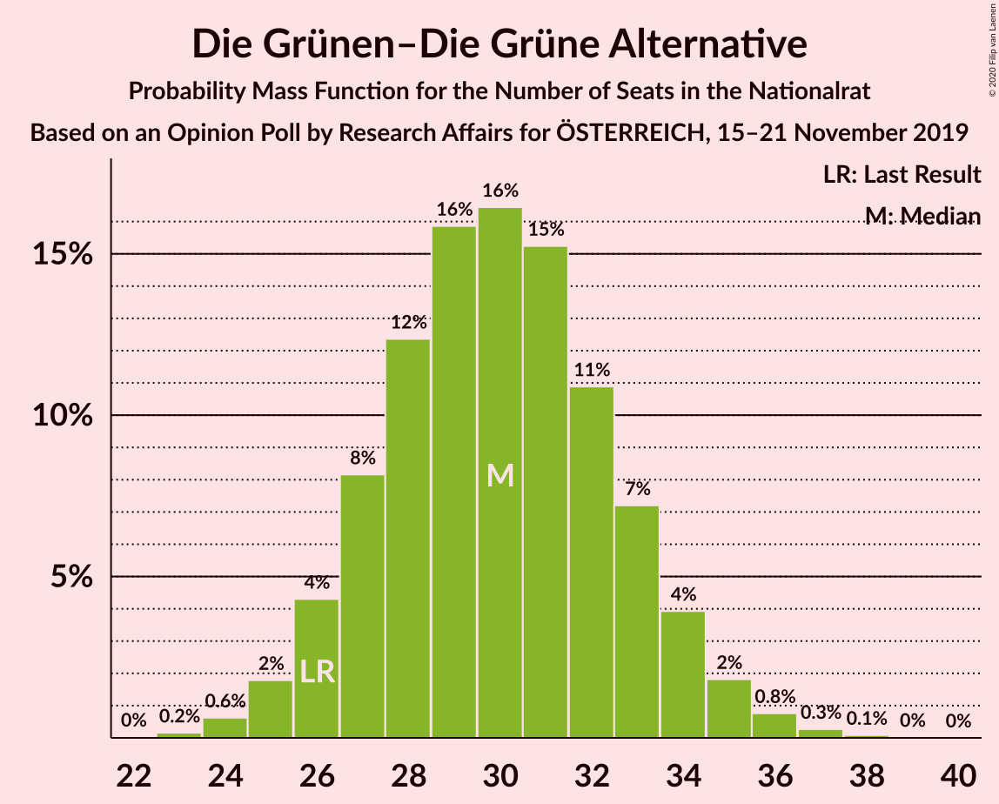
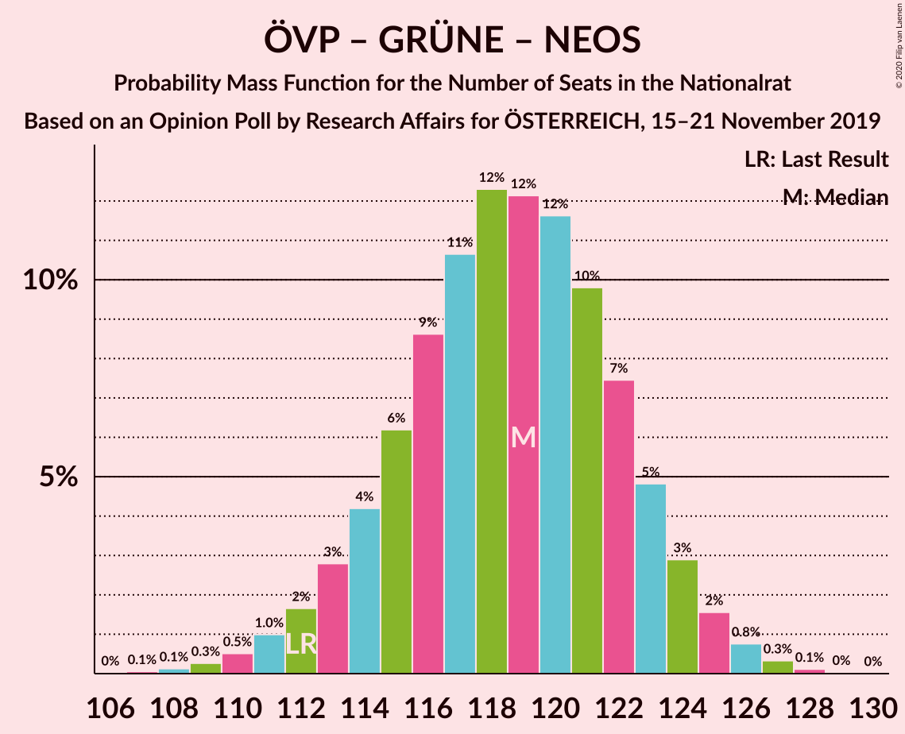
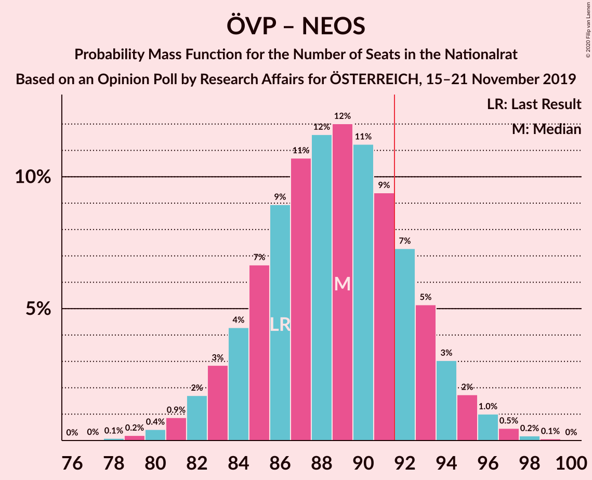

# Opinion Poll by Research Affairs for ÖSTERREICH, 15–21 November 2019

<a href="#voting-intentions">Voting Intentions</a> | <a href="#seats">Seats</a> | <a href="#coalitions">Coalitions</a> | <a href="#technical-information">Technical Information</a>

## Voting Intentions

### Confidence Intervals

| Party | Last Result | Poll Result | 80% Confidence Interval | 90% Confidence Interval | 95% Confidence Interval | 99% Confidence Interval |
|:-----:|:-----------:|:-----------:|:-----------------------:|:-----------------------:|:-----------------------:|:-----------------------:|
| Österreichische Volkspartei | 37.5% | 38.0% | 36.0–40.2% |35.4–40.8% |34.9–41.3% |33.9–42.3% |
| Sozialdemokratische Partei Österreichs | 21.2% | 20.0% | 18.4–21.9% |17.9–22.4% |17.5–22.8% |16.8–23.7% |
| Die Grünen–Die Grüne Alternative | 13.9% | 15.9% | 14.4–17.6% |14.0–18.1% |13.7–18.5% |13.0–19.4% |
| Freiheitliche Partei Österreichs | 16.2% | 14.0% | 12.6–15.6% |12.2–16.1% |11.9–16.5% |11.2–17.3% |
| NEOS–Das Neue Österreich und Liberales Forum | 8.1% | 9.0% | 7.9–10.4% |7.5–10.7% |7.3–11.1% |6.8–11.8% |

*Note:* The poll result column reflects the actual value used in the calculations. Published results may vary slightly, and in addition be rounded to fewer digits.

## Seats

### Confidence Intervals

| Party | Last Result | Median | 80% Confidence Interval | 90% Confidence Interval | 95% Confidence Interval | 99% Confidence Interval |
|:-----:|:-----------:|:------:|:-----------------------:|:-----------------------:|:-----------------------:|:-----------------------:|
| <a href="#österreichische-volkspartei">Österreichische Volkspartei</a> | 71 | 72 | 68–76 |67–77 |66–78 |64–80 |
| <a href="#sozialdemokratische-partei-österreichs">Sozialdemokratische Partei Österreichs</a> | 40 | 38 | 34–41 |33–42 |33–43 |32–44 |
| <a href="#die-grünen–die-grüne-alternative">Die Grünen–Die Grüne Alternative</a> | 26 | 30 | 27–33 |26–34 |26–35 |24–36 |
| <a href="#freiheitliche-partei-österreichs">Freiheitliche Partei Österreichs</a> | 31 | 26 | 24–29 |23–30 |22–31 |21–32 |
| <a href="#neos–das-neue-österreich-und-liberales-forum">NEOS–Das Neue Österreich und Liberales Forum</a> | 15 | 16 | 15–19 |14–20 |14–20 |12–22 |

### Österreichische Volkspartei

*For a full overview of the results for this party, see the [Österreichische Volkspartei](party-österreichischevolkspartei.html) page.*

| Number of Seats | Probability | Accumulated | Special Marks |
|:---------------:|:-----------:|:-----------:|:-------------:|
| 61 | 0% | 100% |  |
| 62 | 0.1% | 99.9% |  |
| 63 | 0.3% | 99.9% |  |
| 64 | 0.6% | 99.6% |  |
| 65 | 0.7% | 98.9% |  |
| 66 | 2% | 98% |  |
| 67 | 4% | 96% |  |
| 68 | 4% | 93% |  |
| 69 | 10% | 89% |  |
| 70 | 10% | 78% |  |
| 71 | 11% | 68% | Last Result |
| 72 | 16% | 57% | Median |
| 73 | 13% | 41% |  |
| 74 | 9% | 28% |  |
| 75 | 8% | 19% |  |
| 76 | 6% | 11% |  |
| 77 | 1.2% | 5% |  |
| 78 | 2% | 4% |  |
| 79 | 0.9% | 2% |  |
| 80 | 0.4% | 0.7% |  |
| 81 | 0.2% | 0.3% |  |
| 82 | 0.1% | 0.1% |  |
| 83 | 0% | 0% |  |

### Sozialdemokratische Partei Österreichs

*For a full overview of the results for this party, see the [Sozialdemokratische Partei Österreichs](party-sozialdemokratischeparteiösterreichs.html) page.*

| Number of Seats | Probability | Accumulated | Special Marks |
|:---------------:|:-----------:|:-----------:|:-------------:|
| 30 | 0.2% | 100% |  |
| 31 | 0.2% | 99.8% |  |
| 32 | 1.0% | 99.6% |  |
| 33 | 4% | 98.6% |  |
| 34 | 5% | 95% |  |
| 35 | 10% | 90% |  |
| 36 | 5% | 80% |  |
| 37 | 16% | 75% |  |
| 38 | 21% | 58% | Median |
| 39 | 18% | 37% |  |
| 40 | 5% | 19% | Last Result |
| 41 | 6% | 14% |  |
| 42 | 4% | 8% |  |
| 43 | 3% | 4% |  |
| 44 | 0.3% | 0.7% |  |
| 45 | 0.2% | 0.4% |  |
| 46 | 0.1% | 0.2% |  |
| 47 | 0.1% | 0.1% |  |
| 48 | 0% | 0% |  |

### Die Grünen–Die Grüne Alternative

*For a full overview of the results for this party, see the [Die Grünen–Die Grüne Alternative](party-diegrünen–diegrünealternative.html) page.*

| Number of Seats | Probability | Accumulated | Special Marks |
|:---------------:|:-----------:|:-----------:|:-------------:|
| 23 | 0.1% | 100% |  |
| 24 | 0.6% | 99.8% |  |
| 25 | 2% | 99.3% |  |
| 26 | 3% | 98% | Last Result |
| 27 | 8% | 94% |  |
| 28 | 13% | 86% |  |
| 29 | 17% | 73% |  |
| 30 | 20% | 56% | Median |
| 31 | 11% | 36% |  |
| 32 | 10% | 25% |  |
| 33 | 9% | 15% |  |
| 34 | 3% | 6% |  |
| 35 | 2% | 3% |  |
| 36 | 0.6% | 1.1% |  |
| 37 | 0.4% | 0.5% |  |
| 38 | 0.1% | 0.1% |  |
| 39 | 0% | 0% |  |

### Freiheitliche Partei Österreichs

*For a full overview of the results for this party, see the [Freiheitliche Partei Österreichs](party-freiheitlicheparteiösterreichs.html) page.*

| Number of Seats | Probability | Accumulated | Special Marks |
|:---------------:|:-----------:|:-----------:|:-------------:|
| 19 | 0% | 100% |  |
| 20 | 0.2% | 99.9% |  |
| 21 | 0.7% | 99.7% |  |
| 22 | 3% | 99.0% |  |
| 23 | 6% | 96% |  |
| 24 | 9% | 90% |  |
| 25 | 19% | 81% |  |
| 26 | 21% | 62% | Median |
| 27 | 15% | 41% |  |
| 28 | 13% | 27% |  |
| 29 | 6% | 14% |  |
| 30 | 5% | 8% |  |
| 31 | 2% | 3% | Last Result |
| 32 | 1.0% | 1.3% |  |
| 33 | 0.2% | 0.3% |  |
| 34 | 0% | 0.1% |  |
| 35 | 0% | 0% |  |

### NEOS–Das Neue Österreich und Liberales Forum

*For a full overview of the results for this party, see the [NEOS–Das Neue Österreich und Liberales Forum](party-neos–dasneueösterreichundliberalesforum.html) page.*

| Number of Seats | Probability | Accumulated | Special Marks |
|:---------------:|:-----------:|:-----------:|:-------------:|
| 11 | 0.1% | 100% |  |
| 12 | 0.5% | 99.9% |  |
| 13 | 2% | 99.4% |  |
| 14 | 7% | 98% |  |
| 15 | 12% | 91% | Last Result |
| 16 | 35% | 79% | Median |
| 17 | 11% | 44% |  |
| 18 | 15% | 33% |  |
| 19 | 11% | 17% |  |
| 20 | 4% | 6% |  |
| 21 | 1.1% | 2% |  |
| 22 | 0.8% | 1.0% |  |
| 23 | 0.1% | 0.2% |  |
| 24 | 0% | 0% |  |

## Coalitions

### Confidence Intervals

| Coalition | Last Result | Median | Majority? | 80% Confidence Interval | 90% Confidence Interval | 95% Confidence Interval | 99% Confidence Interval |
|:---------:|:-----------:|:------:|:---------:|:-----------------------:|:-----------------------:|:-----------------------:|:-----------------------:|
| Österreichische Volkspartei – Die Grünen–Die Grüne Alternative – NEOS–Das Neue Österreich und Liberales Forum | 112 | 119 | 100% | 115–122 | 114–124 | 112–124 | 110–126 |
| Österreichische Volkspartei – Sozialdemokratische Partei Österreichs | 111 | 109 | 100% | 105–113 | 104–116 | 103–116 | 101–117 |
| Österreichische Volkspartei – Die Grünen–Die Grüne Alternative | 97 | 102 | 99.9% | 98–106 | 97–106 | 95–108 | 93–110 |
| Österreichische Volkspartei – Freiheitliche Partei Österreichs | 102 | 98 | 97% | 94–102 | 93–103 | 91–104 | 89–107 |
| Österreichische Volkspartei – NEOS–Das Neue Österreich und Liberales Forum | 86 | 88 | 16% | 85–93 | 83–94 | 82–95 | 80–97 |
| Sozialdemokratische Partei Österreichs – Die Grünen–Die Grüne Alternative – NEOS–Das Neue Österreich und Liberales Forum | 81 | 85 | 2% | 80–89 | 79–90 | 79–91 | 76–92 |
| Österreichische Volkspartei | 71 | 72 | 0% | 68–76 | 67–77 | 66–78 | 64–80 |
| Sozialdemokratische Partei Österreichs – Die Grünen–Die Grüne Alternative | 66 | 68 | 0% | 64–71 | 63–73 | 61–74 | 60–76 |
| Sozialdemokratische Partei Österreichs – Freiheitliche Partei Österreichs | 71 | 64 | 0% | 60–68 | 59–69 | 58–69 | 56–72 |
| Sozialdemokratische Partei Österreichs | 40 | 38 | 0% | 34–41 | 33–42 | 33–43 | 32–44 |

### Österreichische Volkspartei – Die Grünen–Die Grüne Alternative – NEOS–Das Neue Österreich und Liberales Forum

| Number of Seats | Probability | Accumulated | Special Marks |
|:---------------:|:-----------:|:-----------:|:-------------:|
| 107 | 0.1% | 100% |  |
| 108 | 0.1% | 99.9% |  |
| 109 | 0.2% | 99.8% |  |
| 110 | 0.5% | 99.6% |  |
| 111 | 0.5% | 99.1% |  |
| 112 | 2% | 98.6% | Last Result |
| 113 | 1.0% | 97% |  |
| 114 | 4% | 96% |  |
| 115 | 8% | 92% |  |
| 116 | 11% | 85% |  |
| 117 | 11% | 74% |  |
| 118 | 9% | 63% | Median |
| 119 | 19% | 54% |  |
| 120 | 10% | 36% |  |
| 121 | 12% | 25% |  |
| 122 | 4% | 14% |  |
| 123 | 4% | 9% |  |
| 124 | 3% | 5% |  |
| 125 | 1.3% | 2% |  |
| 126 | 0.6% | 1.1% |  |
| 127 | 0.4% | 0.5% |  |
| 128 | 0.1% | 0.1% |  |
| 129 | 0% | 0% |  |

### Österreichische Volkspartei – Sozialdemokratische Partei Österreichs

| Number of Seats | Probability | Accumulated | Special Marks |
|:---------------:|:-----------:|:-----------:|:-------------:|
| 98 | 0% | 100% |  |
| 99 | 0% | 99.9% |  |
| 100 | 0.4% | 99.9% |  |
| 101 | 0.7% | 99.5% |  |
| 102 | 0.3% | 98.9% |  |
| 103 | 1.2% | 98.6% |  |
| 104 | 3% | 97% |  |
| 105 | 6% | 94% |  |
| 106 | 2% | 88% |  |
| 107 | 2% | 86% |  |
| 108 | 17% | 84% |  |
| 109 | 24% | 67% |  |
| 110 | 3% | 43% | Median |
| 111 | 4% | 40% | Last Result |
| 112 | 20% | 35% |  |
| 113 | 9% | 16% |  |
| 114 | 1.1% | 7% |  |
| 115 | 0.6% | 6% |  |
| 116 | 4% | 5% |  |
| 117 | 1.0% | 1.3% |  |
| 118 | 0% | 0.3% |  |
| 119 | 0.2% | 0.2% |  |
| 120 | 0.1% | 0.1% |  |
| 121 | 0% | 0% |  |

### Österreichische Volkspartei – Die Grünen–Die Grüne Alternative

| Number of Seats | Probability | Accumulated | Special Marks |
|:---------------:|:-----------:|:-----------:|:-------------:|
| 90 | 0% | 100% |  |
| 91 | 0.1% | 99.9% |  |
| 92 | 0.2% | 99.9% | Majority |
| 93 | 0.3% | 99.7% |  |
| 94 | 0.5% | 99.3% |  |
| 95 | 2% | 98.8% |  |
| 96 | 1.3% | 97% |  |
| 97 | 1.3% | 96% | Last Result |
| 98 | 13% | 95% |  |
| 99 | 6% | 82% |  |
| 100 | 6% | 76% |  |
| 101 | 19% | 70% |  |
| 102 | 4% | 51% | Median |
| 103 | 20% | 46% |  |
| 104 | 3% | 26% |  |
| 105 | 12% | 23% |  |
| 106 | 6% | 11% |  |
| 107 | 1.1% | 5% |  |
| 108 | 0.9% | 3% |  |
| 109 | 2% | 2% |  |
| 110 | 0.7% | 0.9% |  |
| 111 | 0% | 0.2% |  |
| 112 | 0.1% | 0.1% |  |
| 113 | 0% | 0% |  |

### Österreichische Volkspartei – Freiheitliche Partei Österreichs

| Number of Seats | Probability | Accumulated | Special Marks |
|:---------------:|:-----------:|:-----------:|:-------------:|
| 87 | 0.1% | 100% |  |
| 88 | 0.3% | 99.9% |  |
| 89 | 0.2% | 99.6% |  |
| 90 | 0.5% | 99.5% |  |
| 91 | 2% | 98.9% |  |
| 92 | 1.4% | 97% | Majority |
| 93 | 3% | 96% |  |
| 94 | 6% | 92% |  |
| 95 | 7% | 86% |  |
| 96 | 7% | 79% |  |
| 97 | 12% | 73% |  |
| 98 | 17% | 60% | Median |
| 99 | 9% | 43% |  |
| 100 | 12% | 34% |  |
| 101 | 10% | 23% |  |
| 102 | 3% | 12% | Last Result |
| 103 | 6% | 9% |  |
| 104 | 2% | 4% |  |
| 105 | 0.5% | 2% |  |
| 106 | 0.6% | 1.1% |  |
| 107 | 0.4% | 0.5% |  |
| 108 | 0.1% | 0.2% |  |
| 109 | 0% | 0.1% |  |
| 110 | 0% | 0% |  |

### Österreichische Volkspartei – NEOS–Das Neue Österreich und Liberales Forum

| Number of Seats | Probability | Accumulated | Special Marks |
|:---------------:|:-----------:|:-----------:|:-------------:|
| 77 | 0% | 100% |  |
| 78 | 0% | 99.9% |  |
| 79 | 0.1% | 99.9% |  |
| 80 | 0.4% | 99.8% |  |
| 81 | 0.8% | 99.3% |  |
| 82 | 1.4% | 98.6% |  |
| 83 | 3% | 97% |  |
| 84 | 3% | 94% |  |
| 85 | 7% | 91% |  |
| 86 | 6% | 84% | Last Result |
| 87 | 14% | 78% |  |
| 88 | 14% | 64% | Median |
| 89 | 14% | 50% |  |
| 90 | 7% | 36% |  |
| 91 | 13% | 29% |  |
| 92 | 6% | 16% | Majority |
| 93 | 5% | 10% |  |
| 94 | 2% | 5% |  |
| 95 | 0.8% | 3% |  |
| 96 | 1.5% | 2% |  |
| 97 | 0.3% | 0.5% |  |
| 98 | 0.1% | 0.2% |  |
| 99 | 0.1% | 0.1% |  |
| 100 | 0% | 0% |  |

### Sozialdemokratische Partei Österreichs – Die Grünen–Die Grüne Alternative – NEOS–Das Neue Österreich und Liberales Forum

| Number of Seats | Probability | Accumulated | Special Marks |
|:---------------:|:-----------:|:-----------:|:-------------:|
| 74 | 0.1% | 100% |  |
| 75 | 0.2% | 99.9% |  |
| 76 | 0.7% | 99.7% |  |
| 77 | 0.6% | 99.0% |  |
| 78 | 0.7% | 98% |  |
| 79 | 4% | 98% |  |
| 80 | 6% | 94% |  |
| 81 | 3% | 88% | Last Result |
| 82 | 12% | 84% |  |
| 83 | 12% | 72% |  |
| 84 | 9% | 61% | Median |
| 85 | 17% | 52% |  |
| 86 | 11% | 34% |  |
| 87 | 7% | 23% |  |
| 88 | 7% | 17% |  |
| 89 | 5% | 10% |  |
| 90 | 2% | 6% |  |
| 91 | 1.2% | 3% |  |
| 92 | 1.5% | 2% | Majority |
| 93 | 0.2% | 0.4% |  |
| 94 | 0.1% | 0.2% |  |
| 95 | 0.1% | 0.1% |  |
| 96 | 0% | 0% |  |

### Österreichische Volkspartei

| Number of Seats | Probability | Accumulated | Special Marks |
|:---------------:|:-----------:|:-----------:|:-------------:|
| 61 | 0% | 100% |  |
| 62 | 0.1% | 99.9% |  |
| 63 | 0.3% | 99.9% |  |
| 64 | 0.6% | 99.6% |  |
| 65 | 0.7% | 98.9% |  |
| 66 | 2% | 98% |  |
| 67 | 4% | 96% |  |
| 68 | 4% | 93% |  |
| 69 | 10% | 89% |  |
| 70 | 10% | 78% |  |
| 71 | 11% | 68% | Last Result |
| 72 | 16% | 57% | Median |
| 73 | 13% | 41% |  |
| 74 | 9% | 28% |  |
| 75 | 8% | 19% |  |
| 76 | 6% | 11% |  |
| 77 | 1.2% | 5% |  |
| 78 | 2% | 4% |  |
| 79 | 0.9% | 2% |  |
| 80 | 0.4% | 0.7% |  |
| 81 | 0.2% | 0.3% |  |
| 82 | 0.1% | 0.1% |  |
| 83 | 0% | 0% |  |

### Sozialdemokratische Partei Österreichs – Die Grünen–Die Grüne Alternative

| Number of Seats | Probability | Accumulated | Special Marks |
|:---------------:|:-----------:|:-----------:|:-------------:|
| 58 | 0.1% | 100% |  |
| 59 | 0.3% | 99.8% |  |
| 60 | 0.4% | 99.6% |  |
| 61 | 2% | 99.2% |  |
| 62 | 1.3% | 97% |  |
| 63 | 4% | 96% |  |
| 64 | 7% | 92% |  |
| 65 | 6% | 85% |  |
| 66 | 17% | 78% | Last Result |
| 67 | 8% | 62% |  |
| 68 | 12% | 53% | Median |
| 69 | 14% | 41% |  |
| 70 | 9% | 27% |  |
| 71 | 9% | 18% |  |
| 72 | 3% | 10% |  |
| 73 | 3% | 7% |  |
| 74 | 3% | 4% |  |
| 75 | 0.6% | 1.4% |  |
| 76 | 0.5% | 0.7% |  |
| 77 | 0.2% | 0.3% |  |
| 78 | 0.1% | 0.1% |  |
| 79 | 0% | 0% |  |

### Sozialdemokratische Partei Österreichs – Freiheitliche Partei Österreichs

| Number of Seats | Probability | Accumulated | Special Marks |
|:---------------:|:-----------:|:-----------:|:-------------:|
| 54 | 0% | 100% |  |
| 55 | 0.1% | 99.9% |  |
| 56 | 0.5% | 99.8% |  |
| 57 | 0.6% | 99.3% |  |
| 58 | 2% | 98.6% |  |
| 59 | 4% | 97% |  |
| 60 | 4% | 92% |  |
| 61 | 7% | 88% |  |
| 62 | 13% | 82% |  |
| 63 | 10% | 69% |  |
| 64 | 19% | 59% | Median |
| 65 | 9% | 40% |  |
| 66 | 10% | 32% |  |
| 67 | 10% | 21% |  |
| 68 | 5% | 11% |  |
| 69 | 4% | 6% |  |
| 70 | 0.4% | 2% |  |
| 71 | 1.4% | 2% | Last Result |
| 72 | 0.3% | 0.6% |  |
| 73 | 0.3% | 0.3% |  |
| 74 | 0% | 0.1% |  |
| 75 | 0% | 0% |  |

### Sozialdemokratische Partei Österreichs

| Number of Seats | Probability | Accumulated | Special Marks |
|:---------------:|:-----------:|:-----------:|:-------------:|
| 30 | 0.2% | 100% |  |
| 31 | 0.2% | 99.8% |  |
| 32 | 1.0% | 99.6% |  |
| 33 | 4% | 98.6% |  |
| 34 | 5% | 95% |  |
| 35 | 10% | 90% |  |
| 36 | 5% | 80% |  |
| 37 | 16% | 75% |  |
| 38 | 21% | 58% | Median |
| 39 | 18% | 37% |  |
| 40 | 5% | 19% | Last Result |
| 41 | 6% | 14% |  |
| 42 | 4% | 8% |  |
| 43 | 3% | 4% |  |
| 44 | 0.3% | 0.7% |  |
| 45 | 0.2% | 0.4% |  |
| 46 | 0.1% | 0.2% |  |
| 47 | 0.1% | 0.1% |  |
| 48 | 0% | 0% |  |

## Technical Information

### Opinion Poll

+ **Polling firm:** Research Affairs
+ **Commissioner(s):** ÖSTERREICH
+ **Fieldwork period:** 15–21 November 2019

### Calculations

+ **Sample size:** 878
+ **Simulations done:** 16,384
+ **Error estimate:** 1.01%

