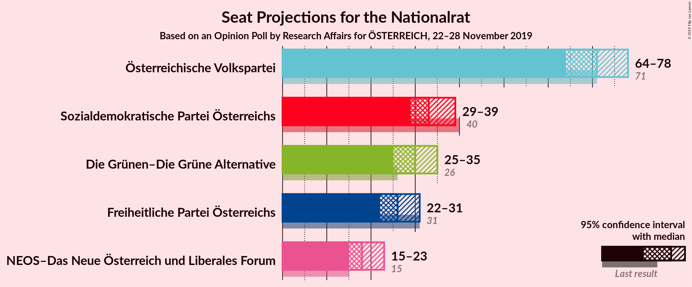
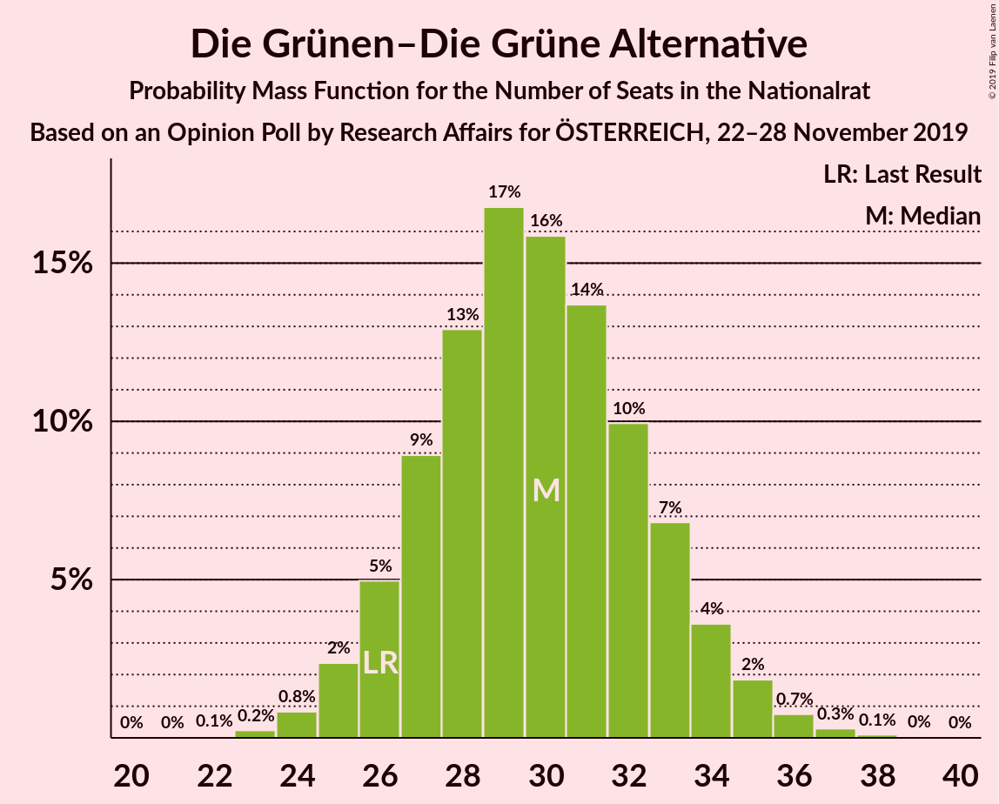
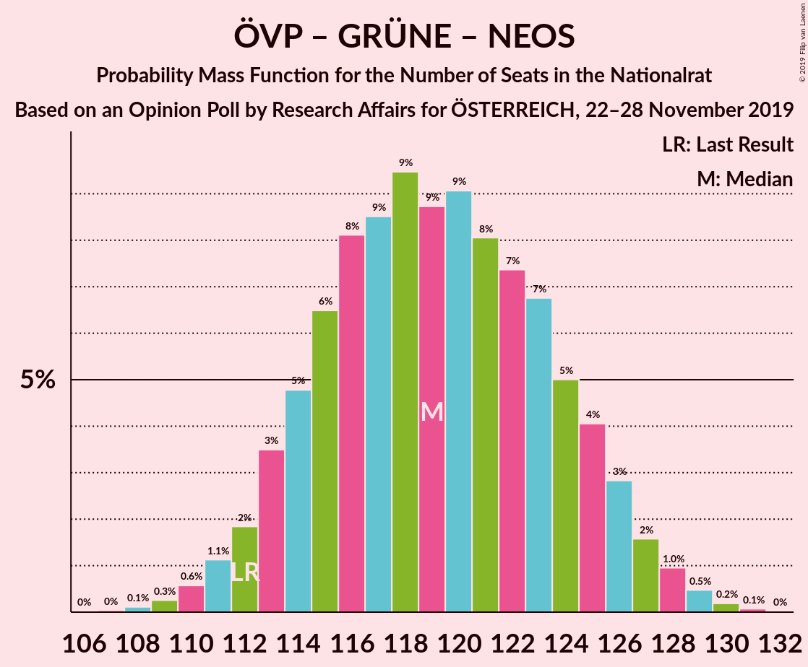
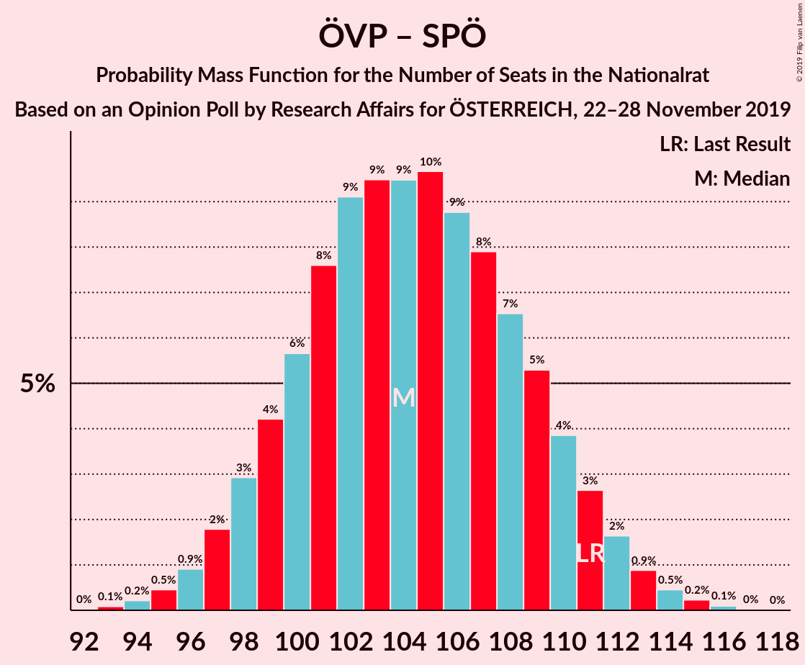
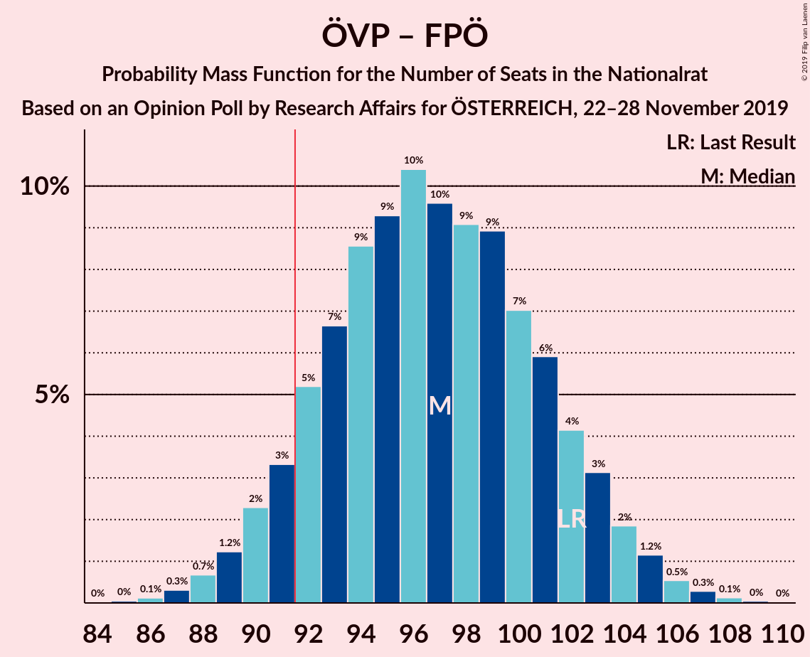
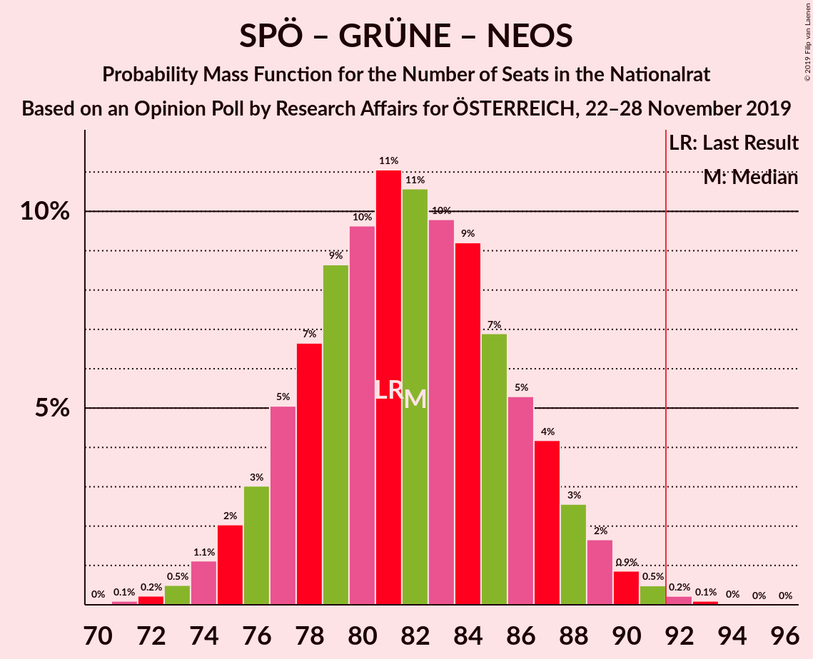
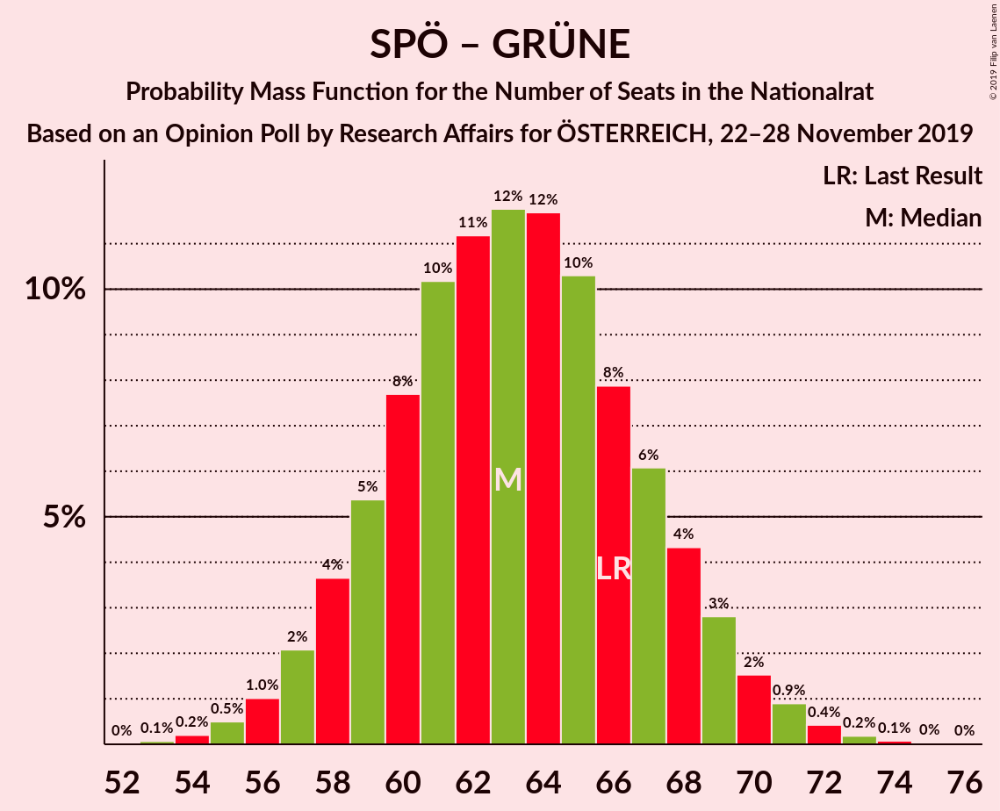

# Opinion Poll by Research Affairs for ÖSTERREICH, 22–28 November 2019

<a href="#voting-intentions">Voting Intentions</a> | <a href="#seats">Seats</a> | <a href="#coalitions">Coalitions</a> | <a href="#technical-information">Technical Information</a>

## Voting Intentions

### Confidence Intervals

| Party | Last Result | Poll Result | 80% Confidence Interval | 90% Confidence Interval | 95% Confidence Interval | 99% Confidence Interval |
|:-----:|:-----------:|:-----------:|:-----------------------:|:-----------------------:|:-----------------------:|:-----------------------:|
| Österreichische Volkspartei | 37.5% | 37.9% | 35.9–40.1% |35.3–40.7% |34.8–41.2% |33.8–42.3% |
| Sozialdemokratische Partei Österreichs | 21.2% | 18.0% | 16.4–19.8% |16.0–20.3% |15.6–20.7% |14.8–21.6% |
| Die Grünen–Die Grüne Alternative | 13.9% | 16.0% | 14.5–17.7% |14.1–18.2% |13.7–18.6% |13.0–19.5% |
| Freiheitliche Partei Österreichs | 16.2% | 14.0% | 12.5–15.6% |12.1–16.0% |11.8–16.4% |11.2–17.2% |
| NEOS–Das Neue Österreich und Liberales Forum | 8.1% | 10.0% | 8.8–11.5% |8.5–11.9% |8.2–12.2% |7.7–12.9% |

*Note:* The poll result column reflects the actual value used in the calculations. Published results may vary slightly, and in addition be rounded to fewer digits.

## Seats

### Confidence Intervals

| Party | Last Result | Median | 80% Confidence Interval | 90% Confidence Interval | 95% Confidence Interval | 99% Confidence Interval |
|:-----:|:-----------:|:------:|:-----------------------:|:-----------------------:|:-----------------------:|:-----------------------:|
| <a href="#österreichische-volkspartei">Österreichische Volkspartei</a> | 71 | 71 | 67–75 |65–77 |64–78 |62–80 |
| <a href="#sozialdemokratische-partei-österreichs">Sozialdemokratische Partei Österreichs</a> | 40 | 33 | 30–37 |29–38 |29–39 |27–40 |
| <a href="#die-grünen–die-grüne-alternative">Die Grünen–Die Grüne Alternative</a> | 26 | 30 | 27–33 |26–34 |25–35 |24–36 |
| <a href="#freiheitliche-partei-österreichs">Freiheitliche Partei Österreichs</a> | 31 | 26 | 23–29 |22–30 |22–30 |20–32 |
| <a href="#neos–das-neue-österreich-und-liberales-forum">NEOS–Das Neue Österreich und Liberales Forum</a> | 15 | 18 | 16–21 |15–22 |15–23 |14–24 |

### Österreichische Volkspartei

*For a full overview of the results for this party, see the [Österreichische Volkspartei](party-österreichischevolkspartei.html) page.*

| Number of Seats | Probability | Accumulated | Special Marks |
|:---------------:|:-----------:|:-----------:|:-------------:|
| 60 | 0.1% | 100% |  |
| 61 | 0.1% | 99.9% |  |
| 62 | 0.4% | 99.8% |  |
| 63 | 0.8% | 99.4% |  |
| 64 | 2% | 98.7% |  |
| 65 | 2% | 97% |  |
| 66 | 4% | 94% |  |
| 67 | 7% | 90% |  |
| 68 | 7% | 83% |  |
| 69 | 11% | 76% |  |
| 70 | 11% | 65% |  |
| 71 | 11% | 54% | Last Result, Median |
| 72 | 10% | 43% |  |
| 73 | 11% | 33% |  |
| 74 | 8% | 22% |  |
| 75 | 5% | 14% |  |
| 76 | 4% | 9% |  |
| 77 | 3% | 6% |  |
| 78 | 2% | 3% |  |
| 79 | 0.8% | 1.5% |  |
| 80 | 0.4% | 0.6% |  |
| 81 | 0.1% | 0.3% |  |
| 82 | 0.1% | 0.1% |  |
| 83 | 0% | 0% |  |

### Sozialdemokratische Partei Österreichs

*For a full overview of the results for this party, see the [Sozialdemokratische Partei Österreichs](party-sozialdemokratischeparteiösterreichs.html) page.*

| Number of Seats | Probability | Accumulated | Special Marks |
|:---------------:|:-----------:|:-----------:|:-------------:|
| 26 | 0.1% | 100% |  |
| 27 | 0.5% | 99.8% |  |
| 28 | 1.4% | 99.4% |  |
| 29 | 4% | 98% |  |
| 30 | 6% | 94% |  |
| 31 | 12% | 88% |  |
| 32 | 12% | 77% |  |
| 33 | 16% | 64% | Median |
| 34 | 14% | 48% |  |
| 35 | 13% | 34% |  |
| 36 | 9% | 21% |  |
| 37 | 6% | 12% |  |
| 38 | 3% | 6% |  |
| 39 | 2% | 3% |  |
| 40 | 0.7% | 1.1% | Last Result |
| 41 | 0.2% | 0.4% |  |
| 42 | 0.1% | 0.1% |  |
| 43 | 0% | 0% |  |

### Die Grünen–Die Grüne Alternative

*For a full overview of the results for this party, see the [Die Grünen–Die Grüne Alternative](party-diegrünen–diegrünealternative.html) page.*

| Number of Seats | Probability | Accumulated | Special Marks |
|:---------------:|:-----------:|:-----------:|:-------------:|
| 22 | 0.1% | 100% |  |
| 23 | 0.3% | 99.9% |  |
| 24 | 0.9% | 99.7% |  |
| 25 | 2% | 98.8% |  |
| 26 | 4% | 97% | Last Result |
| 27 | 10% | 93% |  |
| 28 | 15% | 83% |  |
| 29 | 17% | 69% |  |
| 30 | 14% | 51% | Median |
| 31 | 13% | 37% |  |
| 32 | 9% | 23% |  |
| 33 | 8% | 15% |  |
| 34 | 4% | 7% |  |
| 35 | 2% | 3% |  |
| 36 | 0.5% | 1.0% |  |
| 37 | 0.3% | 0.5% |  |
| 38 | 0.1% | 0.2% |  |
| 39 | 0% | 0% |  |

### Freiheitliche Partei Österreichs

*For a full overview of the results for this party, see the [Freiheitliche Partei Österreichs](party-freiheitlicheparteiösterreichs.html) page.*

| Number of Seats | Probability | Accumulated | Special Marks |
|:---------------:|:-----------:|:-----------:|:-------------:|
| 19 | 0.1% | 100% |  |
| 20 | 0.5% | 99.9% |  |
| 21 | 2% | 99.4% |  |
| 22 | 5% | 98% |  |
| 23 | 8% | 93% |  |
| 24 | 12% | 85% |  |
| 25 | 17% | 73% |  |
| 26 | 17% | 56% | Median |
| 27 | 15% | 39% |  |
| 28 | 11% | 24% |  |
| 29 | 7% | 13% |  |
| 30 | 3% | 6% |  |
| 31 | 2% | 2% | Last Result |
| 32 | 0.6% | 0.9% |  |
| 33 | 0.2% | 0.3% |  |
| 34 | 0.1% | 0.1% |  |
| 35 | 0% | 0% |  |

### NEOS–Das Neue Österreich und Liberales Forum

*For a full overview of the results for this party, see the [NEOS–Das Neue Österreich und Liberales Forum](party-neos–dasneueösterreichundliberalesforum.html) page.*

| Number of Seats | Probability | Accumulated | Special Marks |
|:---------------:|:-----------:|:-----------:|:-------------:|
| 13 | 0.3% | 100% |  |
| 14 | 1.2% | 99.7% |  |
| 15 | 4% | 98.5% | Last Result |
| 16 | 10% | 95% |  |
| 17 | 15% | 85% |  |
| 18 | 22% | 70% | Median |
| 19 | 17% | 48% |  |
| 20 | 16% | 31% |  |
| 21 | 8% | 15% |  |
| 22 | 4% | 7% |  |
| 23 | 2% | 3% |  |
| 24 | 0.6% | 0.9% |  |
| 25 | 0.2% | 0.2% |  |
| 26 | 0% | 0.1% |  |
| 27 | 0% | 0% |  |

## Coalitions

### Confidence Intervals

| Coalition | Last Result | Median | Majority? | 80% Confidence Interval | 90% Confidence Interval | 95% Confidence Interval | 99% Confidence Interval |
|:---------:|:-----------:|:------:|:---------:|:-----------------------:|:-----------------------:|:-----------------------:|:-----------------------:|
| Österreichische Volkspartei – Die Grünen–Die Grüne Alternative – NEOS–Das Neue Österreich und Liberales Forum | 112 | 119 | 100% | 114–125 | 113–126 | 112–127 | 110–129 |
| Österreichische Volkspartei – Sozialdemokratische Partei Österreichs | 111 | 104 | 100% | 99–109 | 98–111 | 97–112 | 95–114 |
| Österreichische Volkspartei – Die Grünen–Die Grüne Alternative | 97 | 101 | 99.3% | 96–105 | 94–107 | 94–108 | 91–111 |
| Österreichische Volkspartei – Freiheitliche Partei Österreichs | 102 | 97 | 92% | 92–102 | 91–103 | 90–104 | 87–106 |
| Österreichische Volkspartei – NEOS–Das Neue Österreich und Liberales Forum | 86 | 89 | 28% | 85–94 | 83–96 | 82–97 | 80–99 |
| Sozialdemokratische Partei Österreichs – Die Grünen–Die Grüne Alternative – NEOS–Das Neue Österreich und Liberales Forum | 81 | 82 | 0.4% | 77–86 | 76–88 | 75–89 | 73–91 |
| Österreichische Volkspartei | 71 | 71 | 0% | 67–75 | 65–77 | 64–78 | 62–80 |
| Sozialdemokratische Partei Österreichs – Die Grünen–Die Grüne Alternative | 66 | 63 | 0% | 59–68 | 58–69 | 57–70 | 55–72 |
| Sozialdemokratische Partei Österreichs – Freiheitliche Partei Österreichs | 71 | 59 | 0% | 55–64 | 54–65 | 53–66 | 51–68 |
| Sozialdemokratische Partei Österreichs | 40 | 33 | 0% | 30–37 | 29–38 | 29–39 | 27–40 |

### Österreichische Volkspartei – Die Grünen–Die Grüne Alternative – NEOS–Das Neue Österreich und Liberales Forum

| Number of Seats | Probability | Accumulated | Special Marks |
|:---------------:|:-----------:|:-----------:|:-------------:|
| 107 | 0% | 100% |  |
| 108 | 0.1% | 99.9% |  |
| 109 | 0.3% | 99.8% |  |
| 110 | 0.6% | 99.6% |  |
| 111 | 1.1% | 99.0% |  |
| 112 | 2% | 98% | Last Result |
| 113 | 3% | 96% |  |
| 114 | 5% | 92% |  |
| 115 | 7% | 88% |  |
| 116 | 8% | 81% |  |
| 117 | 8% | 73% |  |
| 118 | 10% | 65% |  |
| 119 | 9% | 55% | Median |
| 120 | 8% | 46% |  |
| 121 | 9% | 38% |  |
| 122 | 8% | 29% |  |
| 123 | 6% | 21% |  |
| 124 | 5% | 15% |  |
| 125 | 4% | 10% |  |
| 126 | 2% | 6% |  |
| 127 | 2% | 3% |  |
| 128 | 0.8% | 2% |  |
| 129 | 0.6% | 0.9% |  |
| 130 | 0.2% | 0.3% |  |
| 131 | 0.1% | 0.1% |  |
| 132 | 0% | 0% |  |

### Österreichische Volkspartei – Sozialdemokratische Partei Österreichs

| Number of Seats | Probability | Accumulated | Special Marks |
|:---------------:|:-----------:|:-----------:|:-------------:|
| 93 | 0.1% | 100% |  |
| 94 | 0.3% | 99.9% |  |
| 95 | 0.4% | 99.6% |  |
| 96 | 1.0% | 99.2% |  |
| 97 | 2% | 98% |  |
| 98 | 3% | 97% |  |
| 99 | 4% | 94% |  |
| 100 | 6% | 89% |  |
| 101 | 7% | 83% |  |
| 102 | 9% | 77% |  |
| 103 | 10% | 67% |  |
| 104 | 9% | 57% | Median |
| 105 | 10% | 48% |  |
| 106 | 9% | 38% |  |
| 107 | 8% | 30% |  |
| 108 | 7% | 22% |  |
| 109 | 5% | 15% |  |
| 110 | 3% | 9% |  |
| 111 | 3% | 6% | Last Result |
| 112 | 2% | 3% |  |
| 113 | 0.9% | 2% |  |
| 114 | 0.4% | 0.8% |  |
| 115 | 0.2% | 0.4% |  |
| 116 | 0.1% | 0.1% |  |
| 117 | 0% | 0.1% |  |
| 118 | 0% | 0% |  |

### Österreichische Volkspartei – Die Grünen–Die Grüne Alternative

| Number of Seats | Probability | Accumulated | Special Marks |
|:---------------:|:-----------:|:-----------:|:-------------:|
| 89 | 0.1% | 100% |  |
| 90 | 0.1% | 99.9% |  |
| 91 | 0.5% | 99.8% |  |
| 92 | 0.6% | 99.3% | Majority |
| 93 | 1.0% | 98.6% |  |
| 94 | 3% | 98% |  |
| 95 | 4% | 95% |  |
| 96 | 4% | 91% |  |
| 97 | 7% | 86% | Last Result |
| 98 | 10% | 79% |  |
| 99 | 8% | 69% |  |
| 100 | 9% | 61% |  |
| 101 | 10% | 52% | Median |
| 102 | 12% | 42% |  |
| 103 | 5% | 30% |  |
| 104 | 5% | 24% |  |
| 105 | 10% | 19% |  |
| 106 | 3% | 10% |  |
| 107 | 2% | 6% |  |
| 108 | 3% | 5% |  |
| 109 | 1.2% | 2% |  |
| 110 | 0.2% | 0.8% |  |
| 111 | 0.4% | 0.5% |  |
| 112 | 0.1% | 0.1% |  |
| 113 | 0% | 0% |  |

### Österreichische Volkspartei – Freiheitliche Partei Österreichs

| Number of Seats | Probability | Accumulated | Special Marks |
|:---------------:|:-----------:|:-----------:|:-------------:|
| 85 | 0% | 100% |  |
| 86 | 0.1% | 99.9% |  |
| 87 | 0.3% | 99.8% |  |
| 88 | 0.6% | 99.5% |  |
| 89 | 1.3% | 98.9% |  |
| 90 | 2% | 98% |  |
| 91 | 3% | 95% |  |
| 92 | 5% | 92% | Majority |
| 93 | 7% | 87% |  |
| 94 | 7% | 79% |  |
| 95 | 10% | 73% |  |
| 96 | 9% | 62% |  |
| 97 | 10% | 53% | Median |
| 98 | 10% | 43% |  |
| 99 | 9% | 33% |  |
| 100 | 6% | 23% |  |
| 101 | 7% | 17% |  |
| 102 | 4% | 10% | Last Result |
| 103 | 2% | 7% |  |
| 104 | 2% | 5% |  |
| 105 | 1.2% | 2% |  |
| 106 | 0.5% | 0.9% |  |
| 107 | 0.2% | 0.4% |  |
| 108 | 0.1% | 0.2% |  |
| 109 | 0% | 0.1% |  |
| 110 | 0% | 0% |  |

### Österreichische Volkspartei – NEOS–Das Neue Österreich und Liberales Forum

| Number of Seats | Probability | Accumulated | Special Marks |
|:---------------:|:-----------:|:-----------:|:-------------:|
| 78 | 0.1% | 100% |  |
| 79 | 0.2% | 99.9% |  |
| 80 | 0.3% | 99.7% |  |
| 81 | 0.8% | 99.4% |  |
| 82 | 2% | 98.6% |  |
| 83 | 2% | 97% |  |
| 84 | 5% | 95% |  |
| 85 | 4% | 90% |  |
| 86 | 8% | 86% | Last Result |
| 87 | 8% | 78% |  |
| 88 | 9% | 69% |  |
| 89 | 12% | 60% | Median |
| 90 | 8% | 48% |  |
| 91 | 11% | 39% |  |
| 92 | 9% | 28% | Majority |
| 93 | 5% | 20% |  |
| 94 | 6% | 15% |  |
| 95 | 3% | 9% |  |
| 96 | 3% | 6% |  |
| 97 | 1.3% | 3% |  |
| 98 | 0.8% | 2% |  |
| 99 | 0.5% | 0.8% |  |
| 100 | 0.1% | 0.3% |  |
| 101 | 0.1% | 0.2% |  |
| 102 | 0% | 0% |  |

### Sozialdemokratische Partei Österreichs – Die Grünen–Die Grüne Alternative – NEOS–Das Neue Österreich und Liberales Forum

| Number of Seats | Probability | Accumulated | Special Marks |
|:---------------:|:-----------:|:-----------:|:-------------:|
| 71 | 0.1% | 100% |  |
| 72 | 0.2% | 99.9% |  |
| 73 | 0.6% | 99.7% |  |
| 74 | 1.0% | 99.1% |  |
| 75 | 2% | 98% |  |
| 76 | 3% | 96% |  |
| 77 | 6% | 93% |  |
| 78 | 6% | 87% |  |
| 79 | 10% | 81% |  |
| 80 | 8% | 71% |  |
| 81 | 11% | 63% | Last Result, Median |
| 82 | 11% | 52% |  |
| 83 | 9% | 41% |  |
| 84 | 9% | 32% |  |
| 85 | 7% | 23% |  |
| 86 | 6% | 15% |  |
| 87 | 3% | 9% |  |
| 88 | 3% | 6% |  |
| 89 | 1.5% | 3% |  |
| 90 | 1.0% | 2% |  |
| 91 | 0.5% | 0.8% |  |
| 92 | 0.2% | 0.4% | Majority |
| 93 | 0.1% | 0.2% |  |
| 94 | 0% | 0.1% |  |
| 95 | 0% | 0% |  |

### Österreichische Volkspartei

| Number of Seats | Probability | Accumulated | Special Marks |
|:---------------:|:-----------:|:-----------:|:-------------:|
| 60 | 0.1% | 100% |  |
| 61 | 0.1% | 99.9% |  |
| 62 | 0.4% | 99.8% |  |
| 63 | 0.8% | 99.4% |  |
| 64 | 2% | 98.7% |  |
| 65 | 2% | 97% |  |
| 66 | 4% | 94% |  |
| 67 | 7% | 90% |  |
| 68 | 7% | 83% |  |
| 69 | 11% | 76% |  |
| 70 | 11% | 65% |  |
| 71 | 11% | 54% | Last Result, Median |
| 72 | 10% | 43% |  |
| 73 | 11% | 33% |  |
| 74 | 8% | 22% |  |
| 75 | 5% | 14% |  |
| 76 | 4% | 9% |  |
| 77 | 3% | 6% |  |
| 78 | 2% | 3% |  |
| 79 | 0.8% | 1.5% |  |
| 80 | 0.4% | 0.6% |  |
| 81 | 0.1% | 0.3% |  |
| 82 | 0.1% | 0.1% |  |
| 83 | 0% | 0% |  |

### Sozialdemokratische Partei Österreichs – Die Grünen–Die Grüne Alternative

| Number of Seats | Probability | Accumulated | Special Marks |
|:---------------:|:-----------:|:-----------:|:-------------:|
| 53 | 0.1% | 100% |  |
| 54 | 0.2% | 99.9% |  |
| 55 | 0.5% | 99.7% |  |
| 56 | 1.0% | 99.2% |  |
| 57 | 2% | 98% |  |
| 58 | 4% | 96% |  |
| 59 | 5% | 92% |  |
| 60 | 9% | 88% |  |
| 61 | 11% | 79% |  |
| 62 | 11% | 68% |  |
| 63 | 11% | 57% | Median |
| 64 | 12% | 46% |  |
| 65 | 9% | 34% |  |
| 66 | 9% | 25% | Last Result |
| 67 | 6% | 17% |  |
| 68 | 5% | 11% |  |
| 69 | 2% | 6% |  |
| 70 | 2% | 3% |  |
| 71 | 0.8% | 2% |  |
| 72 | 0.5% | 0.8% |  |
| 73 | 0.1% | 0.3% |  |
| 74 | 0.1% | 0.1% |  |
| 75 | 0% | 0% |  |

### Sozialdemokratische Partei Österreichs – Freiheitliche Partei Österreichs

| Number of Seats | Probability | Accumulated | Special Marks |
|:---------------:|:-----------:|:-----------:|:-------------:|
| 49 | 0% | 100% |  |
| 50 | 0.1% | 99.9% |  |
| 51 | 0.4% | 99.8% |  |
| 52 | 1.0% | 99.4% |  |
| 53 | 2% | 98% |  |
| 54 | 4% | 97% |  |
| 55 | 5% | 93% |  |
| 56 | 7% | 88% |  |
| 57 | 11% | 81% |  |
| 58 | 11% | 70% |  |
| 59 | 13% | 60% | Median |
| 60 | 11% | 47% |  |
| 61 | 11% | 36% |  |
| 62 | 9% | 25% |  |
| 63 | 7% | 17% |  |
| 64 | 5% | 10% |  |
| 65 | 3% | 6% |  |
| 66 | 2% | 3% |  |
| 67 | 0.7% | 1.4% |  |
| 68 | 0.4% | 0.7% |  |
| 69 | 0.2% | 0.3% |  |
| 70 | 0.1% | 0.1% |  |
| 71 | 0% | 0% | Last Result |

### Sozialdemokratische Partei Österreichs

| Number of Seats | Probability | Accumulated | Special Marks |
|:---------------:|:-----------:|:-----------:|:-------------:|
| 26 | 0.1% | 100% |  |
| 27 | 0.5% | 99.8% |  |
| 28 | 1.4% | 99.4% |  |
| 29 | 4% | 98% |  |
| 30 | 6% | 94% |  |
| 31 | 12% | 88% |  |
| 32 | 12% | 77% |  |
| 33 | 16% | 64% | Median |
| 34 | 14% | 48% |  |
| 35 | 13% | 34% |  |
| 36 | 9% | 21% |  |
| 37 | 6% | 12% |  |
| 38 | 3% | 6% |  |
| 39 | 2% | 3% |  |
| 40 | 0.7% | 1.1% | Last Result |
| 41 | 0.2% | 0.4% |  |
| 42 | 0.1% | 0.1% |  |
| 43 | 0% | 0% |  |

## Technical Information

### Opinion Poll

+ **Polling firm:** Research Affairs
+ **Commissioner(s):** ÖSTERREICH
+ **Fieldwork period:** 22–28 November 2019

### Calculations

+ **Sample size:** 867
+ **Simulations done:** 131,072
+ **Error estimate:** 0.78%

