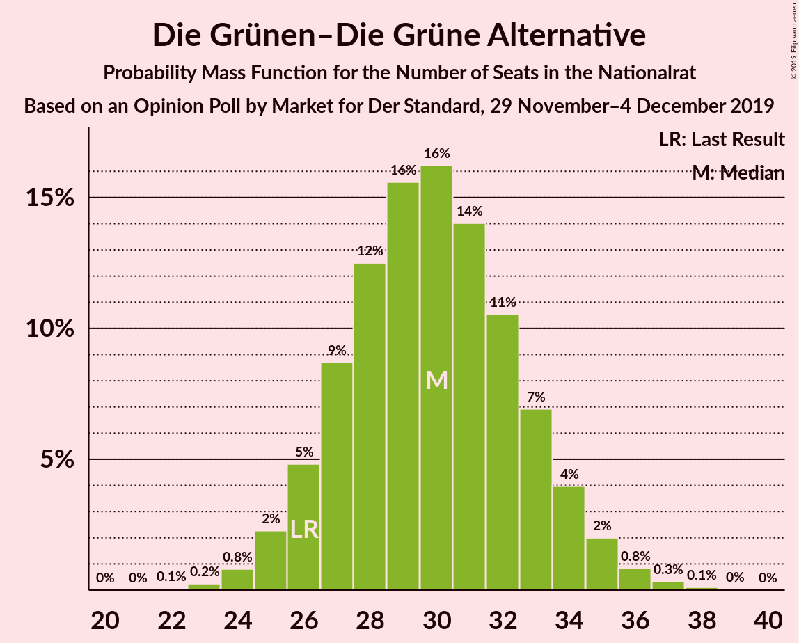
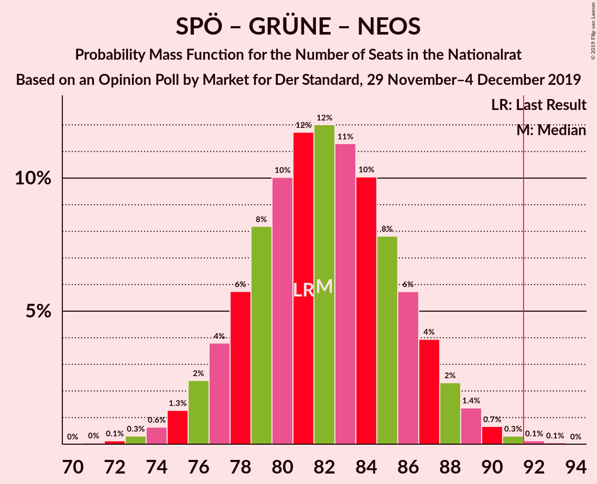
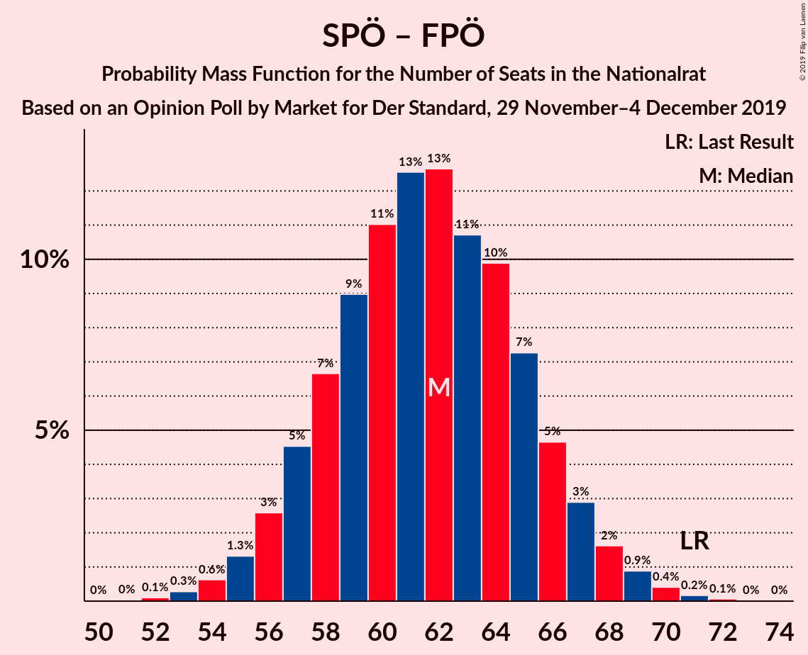

# Opinion Poll by Market for Der Standard, 29 November–4 December 2019

<a href="#voting-intentions">Voting Intentions</a> | <a href="#seats">Seats</a> | <a href="#coalitions">Coalitions</a> | <a href="#technical-information">Technical Information</a>

## Voting Intentions

### Confidence Intervals

| Party | Last Result | Poll Result | 80% Confidence Interval | 90% Confidence Interval | 95% Confidence Interval | 99% Confidence Interval |
|:-----:|:-----------:|:-----------:|:-----------------------:|:-----------------------:|:-----------------------:|:-----------------------:|
| Österreichische Volkspartei | 37.5% | 39.0% | 36.8–41.3% |36.2–41.9% |35.7–42.5% |34.6–43.6% |
| Sozialdemokratische Partei Österreichs | 21.2% | 18.1% | 16.4–19.9% |15.9–20.4% |15.5–20.9% |14.8–21.8% |
| Die Grünen–Die Grüne Alternative | 13.9% | 16.0% | 14.5–17.8% |14.0–18.3% |13.6–18.8% |12.9–19.6% |
| Freiheitliche Partei Österreichs | 16.2% | 15.0% | 13.5–16.8% |13.1–17.3% |12.7–17.7% |12.0–18.5% |
| NEOS–Das Neue Österreich und Liberales Forum | 8.1% | 10.0% | 8.7–11.5% |8.4–11.9% |8.1–12.3% |7.5–13.0% |

*Note:* The poll result column reflects the actual value used in the calculations. Published results may vary slightly, and in addition be rounded to fewer digits.

## Seats

### Confidence Intervals

| Party | Last Result | Median | 80% Confidence Interval | 90% Confidence Interval | 95% Confidence Interval | 99% Confidence Interval |
|:-----:|:-----------:|:------:|:-----------------------:|:-----------------------:|:-----------------------:|:-----------------------:|
| <a href="#österreichische-volkspartei">Österreichische Volkspartei</a> | 71 | 73 | 69–77 |68–78 |67–79 |65–82 |
| <a href="#sozialdemokratische-partei-österreichs">Sozialdemokratische Partei Österreichs</a> | 40 | 34 | 30–37 |30–38 |29–39 |27–41 |
| <a href="#die-grünen–die-grüne-alternative">Die Grünen–Die Grüne Alternative</a> | 26 | 30 | 27–33 |26–34 |25–35 |24–36 |
| <a href="#freiheitliche-partei-österreichs">Freiheitliche Partei Österreichs</a> | 31 | 28 | 25–31 |24–32 |23–33 |22–34 |
| <a href="#neos–das-neue-österreich-und-liberales-forum">NEOS–Das Neue Österreich und Liberales Forum</a> | 15 | 18 | 16–21 |15–22 |15–23 |14–24 |

### Österreichische Volkspartei

*For a full overview of the results for this party, see the [Österreichische Volkspartei](party-österreichischevolkspartei.html) page.*

| Number of Seats | Probability | Accumulated | Special Marks |
|:---------------:|:-----------:|:-----------:|:-------------:|
| 63 | 0.1% | 100% |  |
| 64 | 0.2% | 99.9% |  |
| 65 | 0.5% | 99.6% |  |
| 66 | 1.2% | 99.1% |  |
| 67 | 2% | 98% |  |
| 68 | 4% | 96% |  |
| 69 | 6% | 92% |  |
| 70 | 8% | 86% |  |
| 71 | 10% | 78% | Last Result |
| 72 | 12% | 68% |  |
| 73 | 12% | 56% | Median |
| 74 | 12% | 44% |  |
| 75 | 10% | 33% |  |
| 76 | 8% | 22% |  |
| 77 | 6% | 14% |  |
| 78 | 4% | 8% |  |
| 79 | 2% | 5% |  |
| 80 | 1.3% | 2% |  |
| 81 | 0.6% | 1.1% |  |
| 82 | 0.3% | 0.5% |  |
| 83 | 0.1% | 0.2% |  |
| 84 | 0% | 0.1% |  |
| 85 | 0% | 0% |  |

### Sozialdemokratische Partei Österreichs

*For a full overview of the results for this party, see the [Sozialdemokratische Partei Österreichs](party-sozialdemokratischeparteiösterreichs.html) page.*

| Number of Seats | Probability | Accumulated | Special Marks |
|:---------------:|:-----------:|:-----------:|:-------------:|
| 26 | 0.1% | 100% |  |
| 27 | 0.4% | 99.8% |  |
| 28 | 1.3% | 99.4% |  |
| 29 | 3% | 98% |  |
| 30 | 6% | 95% |  |
| 31 | 9% | 89% |  |
| 32 | 13% | 80% |  |
| 33 | 15% | 67% |  |
| 34 | 15% | 52% | Median |
| 35 | 13% | 36% |  |
| 36 | 10% | 24% |  |
| 37 | 6% | 14% |  |
| 38 | 4% | 7% |  |
| 39 | 2% | 3% |  |
| 40 | 0.8% | 1.4% | Last Result |
| 41 | 0.3% | 0.5% |  |
| 42 | 0.1% | 0.2% |  |
| 43 | 0% | 0.1% |  |
| 44 | 0% | 0% |  |

### Die Grünen–Die Grüne Alternative

*For a full overview of the results for this party, see the [Die Grünen–Die Grüne Alternative](party-diegrünen–diegrünealternative.html) page.*

| Number of Seats | Probability | Accumulated | Special Marks |
|:---------------:|:-----------:|:-----------:|:-------------:|
| 22 | 0.1% | 100% |  |
| 23 | 0.2% | 99.9% |  |
| 24 | 0.8% | 99.7% |  |
| 25 | 2% | 98.9% |  |
| 26 | 5% | 97% | Last Result |
| 27 | 9% | 92% |  |
| 28 | 12% | 83% |  |
| 29 | 16% | 71% |  |
| 30 | 16% | 55% | Median |
| 31 | 14% | 39% |  |
| 32 | 11% | 25% |  |
| 33 | 7% | 14% |  |
| 34 | 4% | 7% |  |
| 35 | 2% | 3% |  |
| 36 | 0.8% | 1.3% |  |
| 37 | 0.3% | 0.5% |  |
| 38 | 0.1% | 0.2% |  |
| 39 | 0% | 0% |  |

### Freiheitliche Partei Österreichs

*For a full overview of the results for this party, see the [Freiheitliche Partei Österreichs](party-freiheitlicheparteiösterreichs.html) page.*

| Number of Seats | Probability | Accumulated | Special Marks |
|:---------------:|:-----------:|:-----------:|:-------------:|
| 21 | 0.2% | 100% |  |
| 22 | 0.6% | 99.8% |  |
| 23 | 2% | 99.2% |  |
| 24 | 4% | 97% |  |
| 25 | 8% | 93% |  |
| 26 | 13% | 85% |  |
| 27 | 15% | 72% |  |
| 28 | 17% | 57% | Median |
| 29 | 15% | 40% |  |
| 30 | 11% | 25% |  |
| 31 | 7% | 14% | Last Result |
| 32 | 4% | 7% |  |
| 33 | 2% | 3% |  |
| 34 | 0.8% | 1.3% |  |
| 35 | 0.3% | 0.5% |  |
| 36 | 0.1% | 0.1% |  |
| 37 | 0% | 0% |  |

### NEOS–Das Neue Österreich und Liberales Forum

*For a full overview of the results for this party, see the [NEOS–Das Neue Österreich und Liberales Forum](party-neos–dasneueösterreichundliberalesforum.html) page.*

| Number of Seats | Probability | Accumulated | Special Marks |
|:---------------:|:-----------:|:-----------:|:-------------:|
| 12 | 0% | 100% |  |
| 13 | 0.3% | 99.9% |  |
| 14 | 1.5% | 99.6% |  |
| 15 | 5% | 98% | Last Result |
| 16 | 10% | 94% |  |
| 17 | 16% | 84% |  |
| 18 | 20% | 68% | Median |
| 19 | 19% | 48% |  |
| 20 | 14% | 30% |  |
| 21 | 9% | 16% |  |
| 22 | 4% | 7% |  |
| 23 | 2% | 3% |  |
| 24 | 0.7% | 0.9% |  |
| 25 | 0.2% | 0.3% |  |
| 26 | 0.1% | 0.1% |  |
| 27 | 0% | 0% |  |

## Coalitions

### Confidence Intervals

| Coalition | Last Result | Median | Majority? | 80% Confidence Interval | 90% Confidence Interval | 95% Confidence Interval | 99% Confidence Interval |
|:---------:|:-----------:|:------:|:---------:|:-----------------------:|:-----------------------:|:-----------------------:|:-----------------------:|
| Österreichische Volkspartei – Die Grünen–Die Grüne Alternative – NEOS–Das Neue Österreich und Liberales Forum | 112 | 121 | 100% | 117–125 | 116–126 | 115–127 | 113–129 |
| Österreichische Volkspartei – Sozialdemokratische Partei Österreichs | 111 | 107 | 100% | 102–111 | 101–112 | 100–113 | 98–115 |
| Österreichische Volkspartei – Die Grünen–Die Grüne Alternative | 97 | 103 | 100% | 99–107 | 97–108 | 96–109 | 94–111 |
| Österreichische Volkspartei – Freiheitliche Partei Österreichs | 102 | 101 | 99.8% | 97–105 | 96–106 | 94–107 | 92–109 |
| Österreichische Volkspartei – NEOS–Das Neue Österreich und Liberales Forum | 86 | 92 | 50% | 87–96 | 86–97 | 85–98 | 83–100 |
| Sozialdemokratische Partei Österreichs – Die Grünen–Die Grüne Alternative – NEOS–Das Neue Österreich und Liberales Forum | 81 | 82 | 0.2% | 78–86 | 77–87 | 76–89 | 73–91 |
| Österreichische Volkspartei | 71 | 73 | 0% | 69–77 | 68–78 | 67–79 | 65–82 |
| Sozialdemokratische Partei Österreichs – Die Grünen–Die Grüne Alternative | 66 | 64 | 0% | 59–68 | 58–69 | 57–70 | 56–72 |
| Sozialdemokratische Partei Österreichs – Freiheitliche Partei Österreichs | 71 | 62 | 0% | 58–66 | 57–67 | 56–68 | 54–70 |
| Sozialdemokratische Partei Österreichs | 40 | 34 | 0% | 30–37 | 30–38 | 29–39 | 27–41 |

### Österreichische Volkspartei – Die Grünen–Die Grüne Alternative – NEOS–Das Neue Österreich und Liberales Forum

| Number of Seats | Probability | Accumulated | Special Marks |
|:---------------:|:-----------:|:-----------:|:-------------:|
| 111 | 0.1% | 100% |  |
| 112 | 0.2% | 99.9% | Last Result |
| 113 | 0.4% | 99.7% |  |
| 114 | 0.9% | 99.3% |  |
| 115 | 2% | 98% |  |
| 116 | 3% | 97% |  |
| 117 | 5% | 94% |  |
| 118 | 7% | 89% |  |
| 119 | 10% | 82% |  |
| 120 | 11% | 72% |  |
| 121 | 13% | 61% | Median |
| 122 | 13% | 49% |  |
| 123 | 11% | 36% |  |
| 124 | 9% | 25% |  |
| 125 | 7% | 16% |  |
| 126 | 5% | 9% |  |
| 127 | 3% | 5% |  |
| 128 | 1.3% | 2% |  |
| 129 | 0.6% | 1.1% |  |
| 130 | 0.3% | 0.4% |  |
| 131 | 0.1% | 0.1% |  |
| 132 | 0% | 0% |  |

### Österreichische Volkspartei – Sozialdemokratische Partei Österreichs

| Number of Seats | Probability | Accumulated | Special Marks |
|:---------------:|:-----------:|:-----------:|:-------------:|
| 96 | 0.1% | 100% |  |
| 97 | 0.2% | 99.9% |  |
| 98 | 0.4% | 99.7% |  |
| 99 | 0.8% | 99.4% |  |
| 100 | 2% | 98.5% |  |
| 101 | 3% | 97% |  |
| 102 | 4% | 94% |  |
| 103 | 6% | 90% |  |
| 104 | 9% | 84% |  |
| 105 | 10% | 75% |  |
| 106 | 12% | 64% |  |
| 107 | 12% | 53% | Median |
| 108 | 11% | 40% |  |
| 109 | 9% | 29% |  |
| 110 | 8% | 20% |  |
| 111 | 5% | 12% | Last Result |
| 112 | 3% | 7% |  |
| 113 | 2% | 4% |  |
| 114 | 1.0% | 2% |  |
| 115 | 0.5% | 0.9% |  |
| 116 | 0.2% | 0.3% |  |
| 117 | 0.1% | 0.1% |  |
| 118 | 0% | 0% |  |

### Österreichische Volkspartei – Die Grünen–Die Grüne Alternative

| Number of Seats | Probability | Accumulated | Special Marks |
|:---------------:|:-----------:|:-----------:|:-------------:|
| 92 | 0.1% | 100% | Majority |
| 93 | 0.1% | 99.9% |  |
| 94 | 0.3% | 99.8% |  |
| 95 | 0.7% | 99.4% |  |
| 96 | 1.4% | 98.7% |  |
| 97 | 2% | 97% | Last Result |
| 98 | 4% | 95% |  |
| 99 | 6% | 91% |  |
| 100 | 8% | 85% |  |
| 101 | 10% | 77% |  |
| 102 | 11% | 66% |  |
| 103 | 13% | 55% | Median |
| 104 | 11% | 43% |  |
| 105 | 10% | 31% |  |
| 106 | 8% | 22% |  |
| 107 | 5% | 14% |  |
| 108 | 4% | 8% |  |
| 109 | 2% | 4% |  |
| 110 | 1.2% | 2% |  |
| 111 | 0.6% | 1.0% |  |
| 112 | 0.3% | 0.4% |  |
| 113 | 0.1% | 0.2% |  |
| 114 | 0% | 0.1% |  |
| 115 | 0% | 0% |  |

### Österreichische Volkspartei – Freiheitliche Partei Österreichs

| Number of Seats | Probability | Accumulated | Special Marks |
|:---------------:|:-----------:|:-----------:|:-------------:|
| 90 | 0.1% | 100% |  |
| 91 | 0.1% | 99.9% |  |
| 92 | 0.3% | 99.8% | Majority |
| 93 | 0.7% | 99.5% |  |
| 94 | 1.4% | 98.8% |  |
| 95 | 2% | 97% |  |
| 96 | 4% | 95% |  |
| 97 | 6% | 91% |  |
| 98 | 8% | 85% |  |
| 99 | 10% | 78% |  |
| 100 | 11% | 68% |  |
| 101 | 12% | 56% | Median |
| 102 | 12% | 44% | Last Result |
| 103 | 10% | 33% |  |
| 104 | 8% | 23% |  |
| 105 | 6% | 14% |  |
| 106 | 4% | 9% |  |
| 107 | 2% | 5% |  |
| 108 | 1.3% | 2% |  |
| 109 | 0.6% | 1.1% |  |
| 110 | 0.3% | 0.5% |  |
| 111 | 0.1% | 0.2% |  |
| 112 | 0% | 0.1% |  |
| 113 | 0% | 0% |  |

### Österreichische Volkspartei – NEOS–Das Neue Österreich und Liberales Forum

| Number of Seats | Probability | Accumulated | Special Marks |
|:---------------:|:-----------:|:-----------:|:-------------:|
| 81 | 0.1% | 100% |  |
| 82 | 0.2% | 99.9% |  |
| 83 | 0.4% | 99.7% |  |
| 84 | 0.9% | 99.2% |  |
| 85 | 2% | 98% |  |
| 86 | 3% | 96% | Last Result |
| 87 | 5% | 93% |  |
| 88 | 7% | 89% |  |
| 89 | 9% | 82% |  |
| 90 | 11% | 73% |  |
| 91 | 12% | 62% | Median |
| 92 | 12% | 50% | Majority |
| 93 | 11% | 38% |  |
| 94 | 9% | 27% |  |
| 95 | 7% | 18% |  |
| 96 | 5% | 11% |  |
| 97 | 3% | 7% |  |
| 98 | 2% | 3% |  |
| 99 | 0.9% | 2% |  |
| 100 | 0.5% | 0.8% |  |
| 101 | 0.2% | 0.3% |  |
| 102 | 0.1% | 0.1% |  |
| 103 | 0% | 0% |  |

### Sozialdemokratische Partei Österreichs – Die Grünen–Die Grüne Alternative – NEOS–Das Neue Österreich und Liberales Forum

| Number of Seats | Probability | Accumulated | Special Marks |
|:---------------:|:-----------:|:-----------:|:-------------:|
| 71 | 0% | 100% |  |
| 72 | 0.1% | 99.9% |  |
| 73 | 0.3% | 99.8% |  |
| 74 | 0.6% | 99.5% |  |
| 75 | 1.3% | 98.9% |  |
| 76 | 2% | 98% |  |
| 77 | 4% | 95% |  |
| 78 | 6% | 91% |  |
| 79 | 8% | 86% |  |
| 80 | 10% | 77% |  |
| 81 | 12% | 67% | Last Result |
| 82 | 12% | 56% | Median |
| 83 | 11% | 44% |  |
| 84 | 10% | 32% |  |
| 85 | 8% | 22% |  |
| 86 | 6% | 15% |  |
| 87 | 4% | 9% |  |
| 88 | 2% | 5% |  |
| 89 | 1.4% | 3% |  |
| 90 | 0.7% | 1.2% |  |
| 91 | 0.3% | 0.5% |  |
| 92 | 0.1% | 0.2% | Majority |
| 93 | 0.1% | 0.1% |  |
| 94 | 0% | 0% |  |

### Österreichische Volkspartei

| Number of Seats | Probability | Accumulated | Special Marks |
|:---------------:|:-----------:|:-----------:|:-------------:|
| 63 | 0.1% | 100% |  |
| 64 | 0.2% | 99.9% |  |
| 65 | 0.5% | 99.6% |  |
| 66 | 1.2% | 99.1% |  |
| 67 | 2% | 98% |  |
| 68 | 4% | 96% |  |
| 69 | 6% | 92% |  |
| 70 | 8% | 86% |  |
| 71 | 10% | 78% | Last Result |
| 72 | 12% | 68% |  |
| 73 | 12% | 56% | Median |
| 74 | 12% | 44% |  |
| 75 | 10% | 33% |  |
| 76 | 8% | 22% |  |
| 77 | 6% | 14% |  |
| 78 | 4% | 8% |  |
| 79 | 2% | 5% |  |
| 80 | 1.3% | 2% |  |
| 81 | 0.6% | 1.1% |  |
| 82 | 0.3% | 0.5% |  |
| 83 | 0.1% | 0.2% |  |
| 84 | 0% | 0.1% |  |
| 85 | 0% | 0% |  |

### Sozialdemokratische Partei Österreichs – Die Grünen–Die Grüne Alternative

| Number of Seats | Probability | Accumulated | Special Marks |
|:---------------:|:-----------:|:-----------:|:-------------:|
| 53 | 0% | 100% |  |
| 54 | 0.1% | 99.9% |  |
| 55 | 0.3% | 99.8% |  |
| 56 | 0.7% | 99.5% |  |
| 57 | 1.5% | 98.8% |  |
| 58 | 3% | 97% |  |
| 59 | 5% | 94% |  |
| 60 | 7% | 90% |  |
| 61 | 9% | 83% |  |
| 62 | 11% | 74% |  |
| 63 | 13% | 63% |  |
| 64 | 13% | 50% | Median |
| 65 | 11% | 38% |  |
| 66 | 9% | 26% | Last Result |
| 67 | 7% | 17% |  |
| 68 | 5% | 11% |  |
| 69 | 3% | 6% |  |
| 70 | 2% | 3% |  |
| 71 | 0.8% | 1.5% |  |
| 72 | 0.4% | 0.6% |  |
| 73 | 0.2% | 0.3% |  |
| 74 | 0.1% | 0.1% |  |
| 75 | 0% | 0% |  |

### Sozialdemokratische Partei Österreichs – Freiheitliche Partei Österreichs

| Number of Seats | Probability | Accumulated | Special Marks |
|:---------------:|:-----------:|:-----------:|:-------------:|
| 52 | 0.1% | 100% |  |
| 53 | 0.3% | 99.9% |  |
| 54 | 0.6% | 99.6% |  |
| 55 | 1.3% | 98.9% |  |
| 56 | 3% | 98% |  |
| 57 | 5% | 95% |  |
| 58 | 7% | 90% |  |
| 59 | 9% | 84% |  |
| 60 | 11% | 75% |  |
| 61 | 13% | 64% |  |
| 62 | 13% | 51% | Median |
| 63 | 11% | 39% |  |
| 64 | 10% | 28% |  |
| 65 | 7% | 18% |  |
| 66 | 5% | 11% |  |
| 67 | 3% | 6% |  |
| 68 | 2% | 3% |  |
| 69 | 0.9% | 2% |  |
| 70 | 0.4% | 0.7% |  |
| 71 | 0.2% | 0.3% | Last Result |
| 72 | 0.1% | 0.1% |  |
| 73 | 0% | 0% |  |

### Sozialdemokratische Partei Österreichs

| Number of Seats | Probability | Accumulated | Special Marks |
|:---------------:|:-----------:|:-----------:|:-------------:|
| 26 | 0.1% | 100% |  |
| 27 | 0.4% | 99.8% |  |
| 28 | 1.3% | 99.4% |  |
| 29 | 3% | 98% |  |
| 30 | 6% | 95% |  |
| 31 | 9% | 89% |  |
| 32 | 13% | 80% |  |
| 33 | 15% | 67% |  |
| 34 | 15% | 52% | Median |
| 35 | 13% | 36% |  |
| 36 | 10% | 24% |  |
| 37 | 6% | 14% |  |
| 38 | 4% | 7% |  |
| 39 | 2% | 3% |  |
| 40 | 0.8% | 1.4% | Last Result |
| 41 | 0.3% | 0.5% |  |
| 42 | 0.1% | 0.2% |  |
| 43 | 0% | 0.1% |  |
| 44 | 0% | 0% |  |

## Technical Information

### Opinion Poll

+ **Polling firm:** Market
+ **Commissioner(s):** Der Standard
+ **Fieldwork period:** 29 November–4 December 2019

### Calculations

+ **Sample size:** 792
+ **Simulations done:** 1,048,576
+ **Error estimate:** 0.94%

