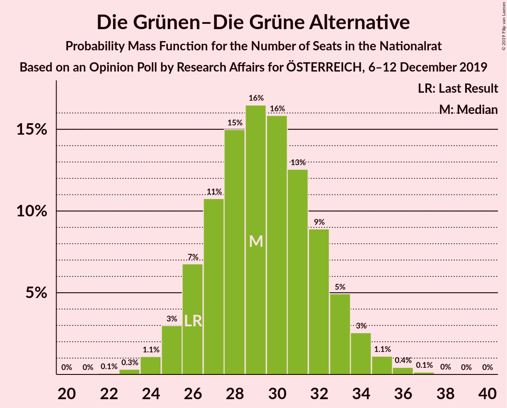
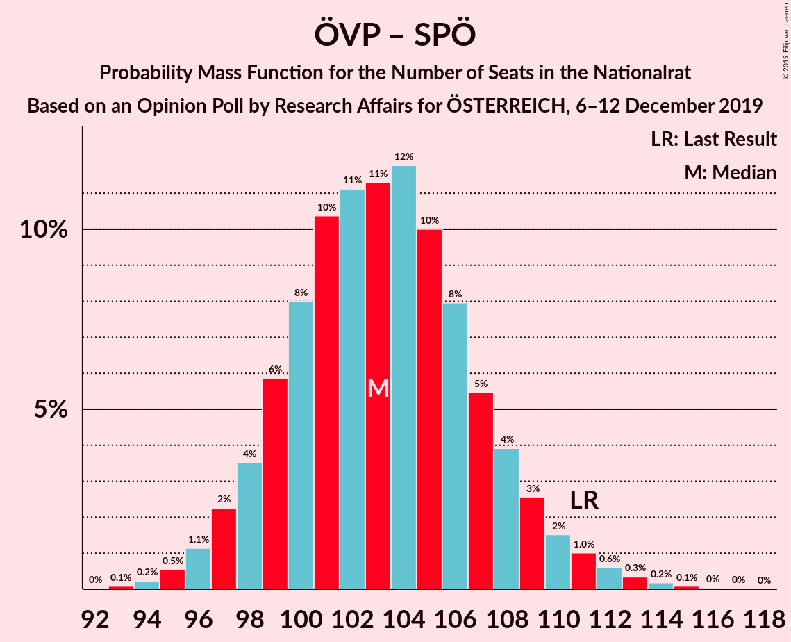

# Opinion Poll by Research Affairs for ÖSTERREICH, 6–12 December 2019

<a href="#voting-intentions">Voting Intentions</a> | <a href="#seats">Seats</a> | <a href="#coalitions">Coalitions</a> | <a href="#technical-information">Technical Information</a>

## Voting Intentions

### Confidence Intervals

| Party | Last Result | Poll Result | 80% Confidence Interval | 90% Confidence Interval | 95% Confidence Interval | 99% Confidence Interval |
|:-----:|:-----------:|:-----------:|:-----------------------:|:-----------------------:|:-----------------------:|:-----------------------:|
| Österreichische Volkspartei | 37.5% | 39.0% | 36.9–41.1% |36.3–41.7% |35.8–42.2% |34.8–43.3% |
| Sozialdemokratische Partei Österreichs | 21.2% | 17.0% | 15.5–18.8% |15.0–19.3% |14.7–19.7% |14.0–20.5% |
| Die Grünen–Die Grüne Alternative | 13.9% | 16.0% | 14.5–17.7% |14.1–18.2% |13.7–18.6% |13.0–19.4% |
| Freiheitliche Partei Österreichs | 16.2% | 14.1% | 12.6–15.7% |12.2–16.1% |11.9–16.5% |11.3–17.3% |
| NEOS–Das Neue Österreich und Liberales Forum | 8.1% | 9.0% | 7.9–10.4% |7.6–10.8% |7.3–11.1% |6.8–11.8% |

*Note:* The poll result column reflects the actual value used in the calculations. Published results may vary slightly, and in addition be rounded to fewer digits.

## Seats

### Confidence Intervals

| Party | Last Result | Median | 80% Confidence Interval | 90% Confidence Interval | 95% Confidence Interval | 99% Confidence Interval |
|:-----:|:-----------:|:------:|:-----------------------:|:-----------------------:|:-----------------------:|:-----------------------:|
| <a href="#österreichische-volkspartei">Österreichische Volkspartei</a> | 71 | 72 | 68–76 |67–77 |66–79 |64–81 |
| <a href="#sozialdemokratische-partei-österreichs">Sozialdemokratische Partei Österreichs</a> | 40 | 31 | 28–34 |27–35 |27–36 |25–38 |
| <a href="#die-grünen–die-grüne-alternative">Die Grünen–Die Grüne Alternative</a> | 26 | 30 | 26–32 |25–33 |25–34 |24–36 |
| <a href="#freiheitliche-partei-österreichs">Freiheitliche Partei Österreichs</a> | 31 | 26 | 23–29 |22–29 |22–30 |20–32 |
| <a href="#neos–das-neue-österreich-und-liberales-forum">NEOS–Das Neue Österreich und Liberales Forum</a> | 15 | 16 | 14–19 |14–20 |13–20 |12–22 |

### Österreichische Volkspartei

*For a full overview of the results for this party, see the [Österreichische Volkspartei](party-österreichischevolkspartei.html) page.*

| Number of Seats | Probability | Accumulated | Special Marks |
|:---------------:|:-----------:|:-----------:|:-------------:|
| 62 | 0.1% | 100% |  |
| 63 | 0.2% | 99.9% |  |
| 64 | 0.5% | 99.7% |  |
| 65 | 1.4% | 99.2% |  |
| 66 | 2% | 98% |  |
| 67 | 4% | 95% |  |
| 68 | 6% | 92% |  |
| 69 | 9% | 86% |  |
| 70 | 12% | 77% |  |
| 71 | 13% | 65% | Last Result |
| 72 | 11% | 52% | Median |
| 73 | 10% | 42% |  |
| 74 | 11% | 32% |  |
| 75 | 8% | 21% |  |
| 76 | 5% | 13% |  |
| 77 | 3% | 8% |  |
| 78 | 2% | 5% |  |
| 79 | 1.5% | 3% |  |
| 80 | 0.6% | 1.1% |  |
| 81 | 0.3% | 0.5% |  |
| 82 | 0.2% | 0.3% |  |
| 83 | 0.1% | 0.1% |  |
| 84 | 0% | 0% |  |

### Sozialdemokratische Partei Österreichs

*For a full overview of the results for this party, see the [Sozialdemokratische Partei Österreichs](party-sozialdemokratischeparteiösterreichs.html) page.*

| Number of Seats | Probability | Accumulated | Special Marks |
|:---------------:|:-----------:|:-----------:|:-------------:|
| 24 | 0.1% | 100% |  |
| 25 | 0.5% | 99.9% |  |
| 26 | 1.3% | 99.4% |  |
| 27 | 4% | 98% |  |
| 28 | 7% | 94% |  |
| 29 | 13% | 88% |  |
| 30 | 16% | 75% |  |
| 31 | 15% | 59% | Median |
| 32 | 16% | 44% |  |
| 33 | 11% | 28% |  |
| 34 | 8% | 18% |  |
| 35 | 5% | 9% |  |
| 36 | 2% | 4% |  |
| 37 | 1.2% | 2% |  |
| 38 | 0.5% | 0.7% |  |
| 39 | 0.2% | 0.2% |  |
| 40 | 0% | 0.1% | Last Result |
| 41 | 0% | 0% |  |

### Die Grünen–Die Grüne Alternative

*For a full overview of the results for this party, see the [Die Grünen–Die Grüne Alternative](party-diegrünen–diegrünealternative.html) page.*

| Number of Seats | Probability | Accumulated | Special Marks |
|:---------------:|:-----------:|:-----------:|:-------------:|
| 22 | 0% | 100% |  |
| 23 | 0.3% | 99.9% |  |
| 24 | 1.3% | 99.7% |  |
| 25 | 4% | 98% |  |
| 26 | 8% | 95% | Last Result |
| 27 | 10% | 86% |  |
| 28 | 10% | 77% |  |
| 29 | 15% | 66% |  |
| 30 | 19% | 51% | Median |
| 31 | 13% | 32% |  |
| 32 | 10% | 20% |  |
| 33 | 5% | 10% |  |
| 34 | 3% | 4% |  |
| 35 | 1.2% | 2% |  |
| 36 | 0.4% | 0.6% |  |
| 37 | 0.1% | 0.2% |  |
| 38 | 0% | 0.1% |  |
| 39 | 0% | 0% |  |

### Freiheitliche Partei Österreichs

*For a full overview of the results for this party, see the [Freiheitliche Partei Österreichs](party-freiheitlicheparteiösterreichs.html) page.*

| Number of Seats | Probability | Accumulated | Special Marks |
|:---------------:|:-----------:|:-----------:|:-------------:|
| 19 | 0.1% | 100% |  |
| 20 | 0.4% | 99.9% |  |
| 21 | 2% | 99.5% |  |
| 22 | 4% | 98% |  |
| 23 | 9% | 93% |  |
| 24 | 14% | 84% |  |
| 25 | 16% | 70% |  |
| 26 | 17% | 55% | Median |
| 27 | 17% | 38% |  |
| 28 | 11% | 21% |  |
| 29 | 6% | 10% |  |
| 30 | 3% | 5% |  |
| 31 | 1.2% | 2% | Last Result |
| 32 | 0.5% | 0.7% |  |
| 33 | 0.2% | 0.2% |  |
| 34 | 0% | 0.1% |  |
| 35 | 0% | 0% |  |

### NEOS–Das Neue Österreich und Liberales Forum

*For a full overview of the results for this party, see the [NEOS–Das Neue Österreich und Liberales Forum](party-neos–dasneueösterreichundliberalesforum.html) page.*

| Number of Seats | Probability | Accumulated | Special Marks |
|:---------------:|:-----------:|:-----------:|:-------------:|
| 11 | 0.1% | 100% |  |
| 12 | 0.9% | 99.9% |  |
| 13 | 4% | 98.9% |  |
| 14 | 10% | 95% |  |
| 15 | 16% | 85% | Last Result |
| 16 | 22% | 70% | Median |
| 17 | 20% | 48% |  |
| 18 | 14% | 28% |  |
| 19 | 8% | 13% |  |
| 20 | 4% | 5% |  |
| 21 | 1.3% | 2% |  |
| 22 | 0.4% | 0.5% |  |
| 23 | 0.1% | 0.1% |  |
| 24 | 0% | 0% |  |

## Coalitions

### Confidence Intervals

| Coalition | Last Result | Median | Majority? | 80% Confidence Interval | 90% Confidence Interval | 95% Confidence Interval | 99% Confidence Interval |
|:---------:|:-----------:|:------:|:---------:|:-----------------------:|:-----------------------:|:-----------------------:|:-----------------------:|
| Österreichische Volkspartei – Die Grünen–Die Grüne Alternative – NEOS–Das Neue Österreich und Liberales Forum | 112 | 118 | 100% | 113–123 | 112–123 | 112–124 | 109–128 |
| Österreichische Volkspartei – Sozialdemokratische Partei Österreichs | 111 | 103 | 100% | 99–108 | 98–109 | 97–110 | 95–113 |
| Österreichische Volkspartei – Die Grünen–Die Grüne Alternative | 97 | 101 | 99.9% | 97–106 | 96–107 | 95–108 | 93–111 |
| Österreichische Volkspartei – Freiheitliche Partei Österreichs | 102 | 98 | 97% | 93–102 | 92–104 | 91–105 | 89–107 |
| Österreichische Volkspartei – NEOS–Das Neue Österreich und Liberales Forum | 86 | 88 | 17% | 84–93 | 83–94 | 82–95 | 80–98 |
| Sozialdemokratische Partei Österreichs – Die Grünen–Die Grüne Alternative – NEOS–Das Neue Österreich und Liberales Forum | 81 | 77 | 0% | 73–81 | 72–83 | 71–84 | 69–86 |
| Österreichische Volkspartei | 71 | 72 | 0% | 68–76 | 67–77 | 66–79 | 64–81 |
| Sozialdemokratische Partei Österreichs – Die Grünen–Die Grüne Alternative | 66 | 60 | 0% | 57–65 | 56–66 | 55–67 | 53–69 |
| Sozialdemokratische Partei Österreichs – Freiheitliche Partei Österreichs | 71 | 57 | 0% | 52–61 | 52–62 | 51–63 | 50–65 |
| Sozialdemokratische Partei Österreichs | 40 | 31 | 0% | 28–34 | 27–35 | 27–36 | 25–38 |

### Österreichische Volkspartei – Die Grünen–Die Grüne Alternative – NEOS–Das Neue Österreich und Liberales Forum

| Number of Seats | Probability | Accumulated | Special Marks |
|:---------------:|:-----------:|:-----------:|:-------------:|
| 107 | 0.1% | 100% |  |
| 108 | 0.2% | 99.9% |  |
| 109 | 0.3% | 99.7% |  |
| 110 | 0.2% | 99.4% |  |
| 111 | 1.3% | 99.2% |  |
| 112 | 4% | 98% | Last Result |
| 113 | 6% | 94% |  |
| 114 | 5% | 87% |  |
| 115 | 3% | 82% |  |
| 116 | 9% | 79% |  |
| 117 | 17% | 70% |  |
| 118 | 20% | 53% | Median |
| 119 | 8% | 32% |  |
| 120 | 3% | 24% |  |
| 121 | 4% | 21% |  |
| 122 | 7% | 17% |  |
| 123 | 6% | 10% |  |
| 124 | 2% | 4% |  |
| 125 | 0.2% | 2% |  |
| 126 | 0.2% | 2% |  |
| 127 | 0.6% | 2% |  |
| 128 | 0.9% | 1.1% |  |
| 129 | 0.1% | 0.2% |  |
| 130 | 0% | 0% |  |

### Österreichische Volkspartei – Sozialdemokratische Partei Österreichs

| Number of Seats | Probability | Accumulated | Special Marks |
|:---------------:|:-----------:|:-----------:|:-------------:|
| 92 | 0% | 100% | Majority |
| 93 | 0.1% | 99.9% |  |
| 94 | 0.2% | 99.9% |  |
| 95 | 0.5% | 99.6% |  |
| 96 | 1.0% | 99.2% |  |
| 97 | 2% | 98% |  |
| 98 | 4% | 96% |  |
| 99 | 7% | 92% |  |
| 100 | 10% | 85% |  |
| 101 | 10% | 75% |  |
| 102 | 13% | 65% |  |
| 103 | 9% | 53% | Median |
| 104 | 9% | 43% |  |
| 105 | 9% | 35% |  |
| 106 | 9% | 26% |  |
| 107 | 6% | 17% |  |
| 108 | 5% | 11% |  |
| 109 | 3% | 6% |  |
| 110 | 2% | 4% |  |
| 111 | 1.0% | 2% | Last Result |
| 112 | 0.4% | 1.2% |  |
| 113 | 0.4% | 0.8% |  |
| 114 | 0.3% | 0.4% |  |
| 115 | 0.1% | 0.2% |  |
| 116 | 0% | 0.1% |  |
| 117 | 0% | 0% |  |

### Österreichische Volkspartei – Die Grünen–Die Grüne Alternative

| Number of Seats | Probability | Accumulated | Special Marks |
|:---------------:|:-----------:|:-----------:|:-------------:|
| 91 | 0.1% | 100% |  |
| 92 | 0.2% | 99.9% | Majority |
| 93 | 0.6% | 99.7% |  |
| 94 | 1.1% | 99.1% |  |
| 95 | 2% | 98% |  |
| 96 | 4% | 96% |  |
| 97 | 5% | 92% | Last Result |
| 98 | 7% | 87% |  |
| 99 | 10% | 80% |  |
| 100 | 11% | 70% |  |
| 101 | 12% | 59% |  |
| 102 | 12% | 47% | Median |
| 103 | 10% | 34% |  |
| 104 | 7% | 24% |  |
| 105 | 6% | 17% |  |
| 106 | 4% | 11% |  |
| 107 | 3% | 7% |  |
| 108 | 2% | 4% |  |
| 109 | 0.9% | 2% |  |
| 110 | 0.5% | 1.2% |  |
| 111 | 0.3% | 0.6% |  |
| 112 | 0.2% | 0.3% |  |
| 113 | 0.1% | 0.2% |  |
| 114 | 0% | 0.1% |  |
| 115 | 0% | 0% |  |

### Österreichische Volkspartei – Freiheitliche Partei Österreichs

| Number of Seats | Probability | Accumulated | Special Marks |
|:---------------:|:-----------:|:-----------:|:-------------:|
| 87 | 0.1% | 100% |  |
| 88 | 0.2% | 99.9% |  |
| 89 | 0.3% | 99.8% |  |
| 90 | 0.9% | 99.4% |  |
| 91 | 2% | 98.5% |  |
| 92 | 3% | 97% | Majority |
| 93 | 6% | 94% |  |
| 94 | 6% | 88% |  |
| 95 | 9% | 82% |  |
| 96 | 11% | 73% |  |
| 97 | 11% | 62% |  |
| 98 | 11% | 51% | Median |
| 99 | 9% | 39% |  |
| 100 | 11% | 30% |  |
| 101 | 6% | 19% |  |
| 102 | 5% | 13% | Last Result |
| 103 | 3% | 8% |  |
| 104 | 2% | 5% |  |
| 105 | 1.1% | 3% |  |
| 106 | 0.8% | 2% |  |
| 107 | 0.5% | 0.9% |  |
| 108 | 0.2% | 0.4% |  |
| 109 | 0.1% | 0.2% |  |
| 110 | 0.1% | 0.1% |  |
| 111 | 0% | 0% |  |

### Österreichische Volkspartei – NEOS–Das Neue Österreich und Liberales Forum

| Number of Seats | Probability | Accumulated | Special Marks |
|:---------------:|:-----------:|:-----------:|:-------------:|
| 78 | 0.1% | 100% |  |
| 79 | 0.2% | 99.9% |  |
| 80 | 0.5% | 99.7% |  |
| 81 | 1.1% | 99.3% |  |
| 82 | 2% | 98% |  |
| 83 | 4% | 96% |  |
| 84 | 4% | 92% |  |
| 85 | 7% | 88% |  |
| 86 | 9% | 81% | Last Result |
| 87 | 11% | 72% |  |
| 88 | 17% | 61% | Median |
| 89 | 9% | 44% |  |
| 90 | 10% | 35% |  |
| 91 | 8% | 25% |  |
| 92 | 6% | 17% | Majority |
| 93 | 5% | 11% |  |
| 94 | 3% | 6% |  |
| 95 | 2% | 4% |  |
| 96 | 1.0% | 2% |  |
| 97 | 0.6% | 1.1% |  |
| 98 | 0.3% | 0.6% |  |
| 99 | 0.1% | 0.2% |  |
| 100 | 0.1% | 0.1% |  |
| 101 | 0% | 0% |  |

### Sozialdemokratische Partei Österreichs – Die Grünen–Die Grüne Alternative – NEOS–Das Neue Österreich und Liberales Forum

| Number of Seats | Probability | Accumulated | Special Marks |
|:---------------:|:-----------:|:-----------:|:-------------:|
| 67 | 0.1% | 100% |  |
| 68 | 0.2% | 99.9% |  |
| 69 | 0.5% | 99.6% |  |
| 70 | 1.2% | 99.1% |  |
| 71 | 3% | 98% |  |
| 72 | 4% | 95% |  |
| 73 | 5% | 91% |  |
| 74 | 9% | 86% |  |
| 75 | 10% | 77% |  |
| 76 | 11% | 67% |  |
| 77 | 11% | 56% | Median |
| 78 | 11% | 45% |  |
| 79 | 10% | 33% |  |
| 80 | 9% | 23% |  |
| 81 | 5% | 15% | Last Result |
| 82 | 4% | 10% |  |
| 83 | 3% | 6% |  |
| 84 | 1.5% | 3% |  |
| 85 | 0.8% | 2% |  |
| 86 | 0.4% | 0.8% |  |
| 87 | 0.2% | 0.4% |  |
| 88 | 0.1% | 0.2% |  |
| 89 | 0% | 0.1% |  |
| 90 | 0% | 0% |  |

### Österreichische Volkspartei

| Number of Seats | Probability | Accumulated | Special Marks |
|:---------------:|:-----------:|:-----------:|:-------------:|
| 62 | 0.1% | 100% |  |
| 63 | 0.2% | 99.9% |  |
| 64 | 0.5% | 99.7% |  |
| 65 | 1.4% | 99.2% |  |
| 66 | 2% | 98% |  |
| 67 | 4% | 95% |  |
| 68 | 6% | 92% |  |
| 69 | 9% | 86% |  |
| 70 | 12% | 77% |  |
| 71 | 13% | 65% | Last Result |
| 72 | 11% | 52% | Median |
| 73 | 10% | 42% |  |
| 74 | 11% | 32% |  |
| 75 | 8% | 21% |  |
| 76 | 5% | 13% |  |
| 77 | 3% | 8% |  |
| 78 | 2% | 5% |  |
| 79 | 1.5% | 3% |  |
| 80 | 0.6% | 1.1% |  |
| 81 | 0.3% | 0.5% |  |
| 82 | 0.2% | 0.3% |  |
| 83 | 0.1% | 0.1% |  |
| 84 | 0% | 0% |  |

### Sozialdemokratische Partei Österreichs – Die Grünen–Die Grüne Alternative

| Number of Seats | Probability | Accumulated | Special Marks |
|:---------------:|:-----------:|:-----------:|:-------------:|
| 51 | 0.1% | 100% |  |
| 52 | 0.2% | 99.9% |  |
| 53 | 0.5% | 99.7% |  |
| 54 | 1.1% | 99.2% |  |
| 55 | 2% | 98% |  |
| 56 | 4% | 96% |  |
| 57 | 7% | 91% |  |
| 58 | 9% | 84% |  |
| 59 | 11% | 75% |  |
| 60 | 14% | 64% |  |
| 61 | 12% | 50% | Median |
| 62 | 11% | 37% |  |
| 63 | 8% | 26% |  |
| 64 | 7% | 18% |  |
| 65 | 5% | 11% |  |
| 66 | 3% | 6% | Last Result |
| 67 | 1.5% | 3% |  |
| 68 | 0.6% | 2% |  |
| 69 | 0.6% | 0.9% |  |
| 70 | 0.2% | 0.3% |  |
| 71 | 0.1% | 0.1% |  |
| 72 | 0% | 0% |  |

### Sozialdemokratische Partei Österreichs – Freiheitliche Partei Österreichs

| Number of Seats | Probability | Accumulated | Special Marks |
|:---------------:|:-----------:|:-----------:|:-------------:|
| 47 | 0.1% | 100% |  |
| 48 | 0.2% | 99.9% |  |
| 49 | 0.1% | 99.8% |  |
| 50 | 0.2% | 99.6% |  |
| 51 | 2% | 99.4% |  |
| 52 | 7% | 97% |  |
| 53 | 6% | 90% |  |
| 54 | 2% | 84% |  |
| 55 | 6% | 82% |  |
| 56 | 21% | 77% |  |
| 57 | 22% | 56% | Median |
| 58 | 8% | 34% |  |
| 59 | 3% | 26% |  |
| 60 | 7% | 23% |  |
| 61 | 8% | 15% |  |
| 62 | 5% | 7% |  |
| 63 | 0.9% | 3% |  |
| 64 | 0.8% | 2% |  |
| 65 | 0.7% | 1.1% |  |
| 66 | 0.3% | 0.4% |  |
| 67 | 0% | 0.1% |  |
| 68 | 0% | 0.1% |  |
| 69 | 0% | 0% |  |
| 70 | 0% | 0% |  |
| 71 | 0% | 0% | Last Result |

### Sozialdemokratische Partei Österreichs

| Number of Seats | Probability | Accumulated | Special Marks |
|:---------------:|:-----------:|:-----------:|:-------------:|
| 24 | 0.1% | 100% |  |
| 25 | 0.5% | 99.9% |  |
| 26 | 1.3% | 99.4% |  |
| 27 | 4% | 98% |  |
| 28 | 7% | 94% |  |
| 29 | 13% | 88% |  |
| 30 | 16% | 75% |  |
| 31 | 15% | 59% | Median |
| 32 | 16% | 44% |  |
| 33 | 11% | 28% |  |
| 34 | 8% | 18% |  |
| 35 | 5% | 9% |  |
| 36 | 2% | 4% |  |
| 37 | 1.2% | 2% |  |
| 38 | 0.5% | 0.7% |  |
| 39 | 0.2% | 0.2% |  |
| 40 | 0% | 0.1% | Last Result |
| 41 | 0% | 0% |  |

## Technical Information

### Opinion Poll

+ **Polling firm:** Research Affairs
+ **Commissioner(s):** ÖSTERREICH
+ **Fieldwork period:** 6–12 December 2019

### Calculations

+ **Sample size:** 875
+ **Simulations done:** 131,072
+ **Error estimate:** 1.48%

