# Opinion Poll by Unique Research for profil, 9–13 December 2019

<a href="#voting-intentions">Voting Intentions</a> | <a href="#seats">Seats</a> | <a href="#coalitions">Coalitions</a> | <a href="#technical-information">Technical Information</a>

## Voting Intentions

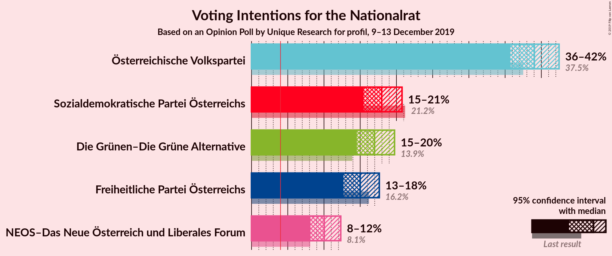

### Confidence Intervals

| Party | Last Result | Poll Result | 80% Confidence Interval | 90% Confidence Interval | 95% Confidence Interval | 99% Confidence Interval |
|:-----:|:-----------:|:-----------:|:-----------------------:|:-----------------------:|:-----------------------:|:-----------------------:|
| Österreichische Volkspartei | 37.5% | 39.0% | 36.9–41.3% |36.2–41.9% |35.7–42.4% |34.7–43.5% |
| Sozialdemokratische Partei Österreichs | 21.2% | 18.0% | 16.3–19.8% |15.9–20.3% |15.5–20.8% |14.7–21.7% |
| Die Grünen–Die Grüne Alternative | 13.9% | 17.0% | 15.4–18.8% |14.9–19.3% |14.5–19.7% |13.8–20.6% |
| Freiheitliche Partei Österreichs | 16.2% | 15.0% | 13.5–16.7% |13.1–17.2% |12.7–17.6% |12.0–18.5% |
| NEOS–Das Neue Österreich und Liberales Forum | 8.1% | 10.0% | 8.8–11.5% |8.4–11.9% |8.1–12.3% |7.6–13.1% |

*Note:* The poll result column reflects the actual value used in the calculations. Published results may vary slightly, and in addition be rounded to fewer digits.

## Seats

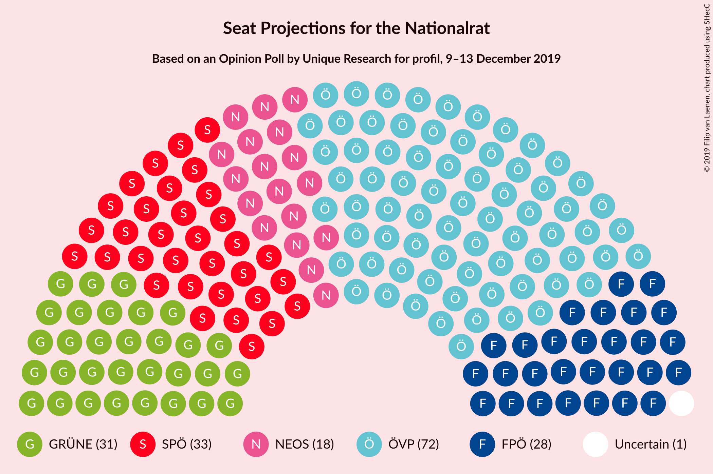

### Confidence Intervals

| Party | Last Result | Median | 80% Confidence Interval | 90% Confidence Interval | 95% Confidence Interval | 99% Confidence Interval |
|:-----:|:-----------:|:------:|:-----------------------:|:-----------------------:|:-----------------------:|:-----------------------:|
| <a href="#österreichische-volkspartei">Österreichische Volkspartei</a> | 71 | 73 | 68–77 |67–78 |66–79 |64–81 |
| <a href="#sozialdemokratische-partei-österreichs">Sozialdemokratische Partei Österreichs</a> | 40 | 33 | 30–36 |29–37 |28–38 |27–40 |
| <a href="#die-grünen–die-grüne-alternative">Die Grünen–Die Grüne Alternative</a> | 26 | 31 | 28–34 |27–36 |27–36 |25–38 |
| <a href="#freiheitliche-partei-österreichs">Freiheitliche Partei Österreichs</a> | 31 | 28 | 25–31 |24–32 |23–32 |22–34 |
| <a href="#neos–das-neue-österreich-und-liberales-forum">NEOS–Das Neue Österreich und Liberales Forum</a> | 15 | 18 | 16–21 |15–22 |15–22 |14–24 |

### Österreichische Volkspartei

*For a full overview of the results for this party, see the [Österreichische Volkspartei](party-österreichischevolkspartei.html) page.*

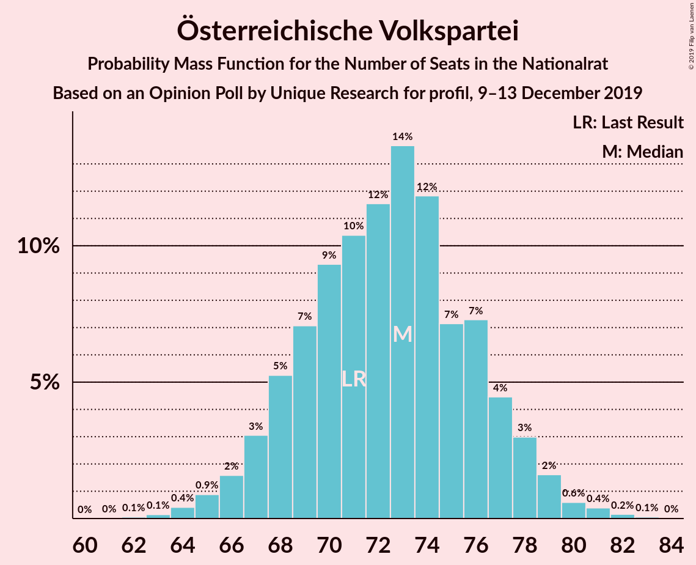

| Number of Seats | Probability | Accumulated | Special Marks |
|:---------------:|:-----------:|:-----------:|:-------------:|
| 62 | 0.1% | 100% |  |
| 63 | 0.1% | 99.9% |  |
| 64 | 0.4% | 99.8% |  |
| 65 | 0.9% | 99.4% |  |
| 66 | 2% | 98% |  |
| 67 | 3% | 97% |  |
| 68 | 5% | 94% |  |
| 69 | 7% | 89% |  |
| 70 | 9% | 82% |  |
| 71 | 10% | 72% | Last Result |
| 72 | 12% | 62% |  |
| 73 | 14% | 50% | Median |
| 74 | 12% | 37% |  |
| 75 | 7% | 25% |  |
| 76 | 7% | 18% |  |
| 77 | 4% | 10% |  |
| 78 | 3% | 6% |  |
| 79 | 2% | 3% |  |
| 80 | 0.6% | 1.2% |  |
| 81 | 0.4% | 0.6% |  |
| 82 | 0.2% | 0.2% |  |
| 83 | 0.1% | 0.1% |  |
| 84 | 0% | 0% |  |

### Sozialdemokratische Partei Österreichs

*For a full overview of the results for this party, see the [Sozialdemokratische Partei Österreichs](party-sozialdemokratischeparteiösterreichs.html) page.*

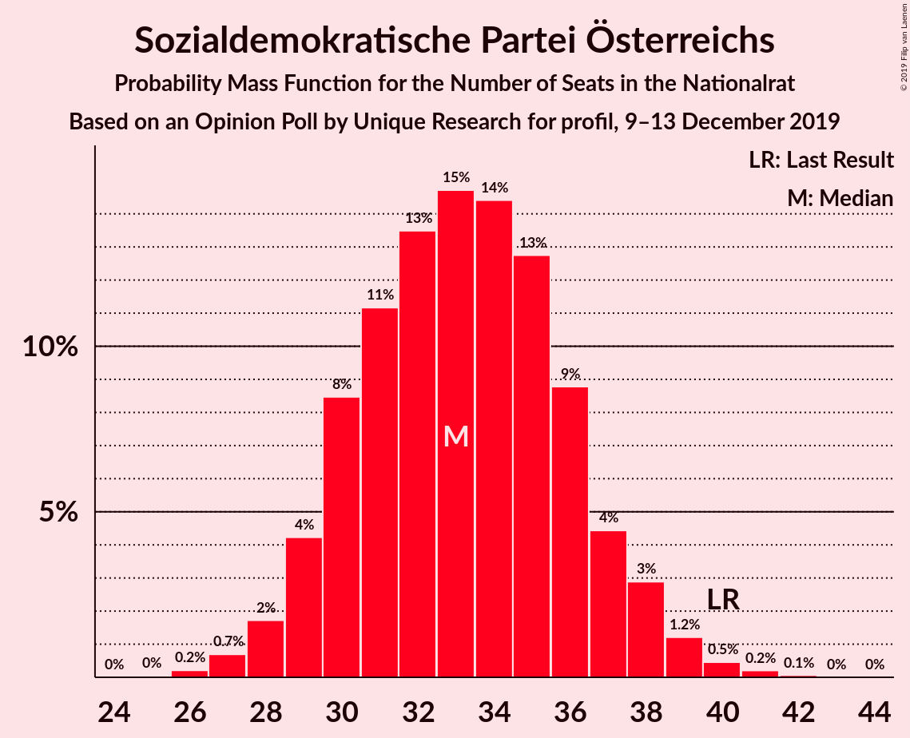

| Number of Seats | Probability | Accumulated | Special Marks |
|:---------------:|:-----------:|:-----------:|:-------------:|
| 25 | 0% | 100% |  |
| 26 | 0.2% | 99.9% |  |
| 27 | 0.7% | 99.7% |  |
| 28 | 2% | 99.0% |  |
| 29 | 4% | 97% |  |
| 30 | 8% | 93% |  |
| 31 | 11% | 85% |  |
| 32 | 13% | 73% |  |
| 33 | 15% | 60% | Median |
| 34 | 14% | 45% |  |
| 35 | 13% | 31% |  |
| 36 | 9% | 18% |  |
| 37 | 4% | 9% |  |
| 38 | 3% | 5% |  |
| 39 | 1.2% | 2% |  |
| 40 | 0.5% | 0.8% | Last Result |
| 41 | 0.2% | 0.3% |  |
| 42 | 0.1% | 0.1% |  |
| 43 | 0% | 0% |  |

### Die Grünen–Die Grüne Alternative

*For a full overview of the results for this party, see the [Die Grünen–Die Grüne Alternative](party-diegrünen–diegrünealternative.html) page.*

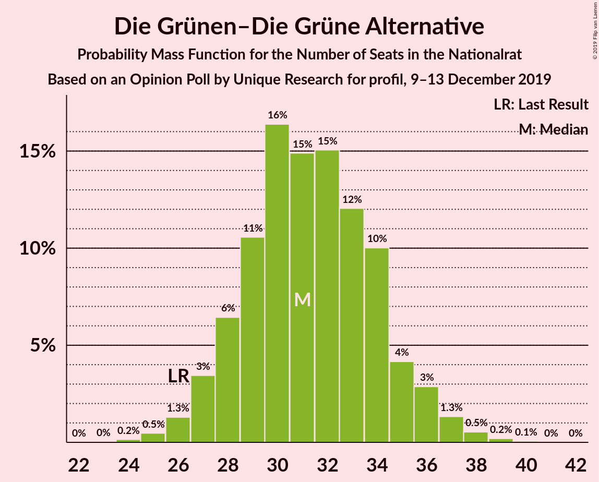

| Number of Seats | Probability | Accumulated | Special Marks |
|:---------------:|:-----------:|:-----------:|:-------------:|
| 24 | 0.2% | 100% |  |
| 25 | 0.5% | 99.8% |  |
| 26 | 1.3% | 99.3% | Last Result |
| 27 | 3% | 98% |  |
| 28 | 6% | 95% |  |
| 29 | 11% | 88% |  |
| 30 | 16% | 78% |  |
| 31 | 15% | 61% | Median |
| 32 | 15% | 46% |  |
| 33 | 12% | 31% |  |
| 34 | 10% | 19% |  |
| 35 | 4% | 9% |  |
| 36 | 3% | 5% |  |
| 37 | 1.3% | 2% |  |
| 38 | 0.5% | 0.8% |  |
| 39 | 0.2% | 0.3% |  |
| 40 | 0.1% | 0.1% |  |
| 41 | 0% | 0% |  |

### Freiheitliche Partei Österreichs

*For a full overview of the results for this party, see the [Freiheitliche Partei Österreichs](party-freiheitlicheparteiösterreichs.html) page.*

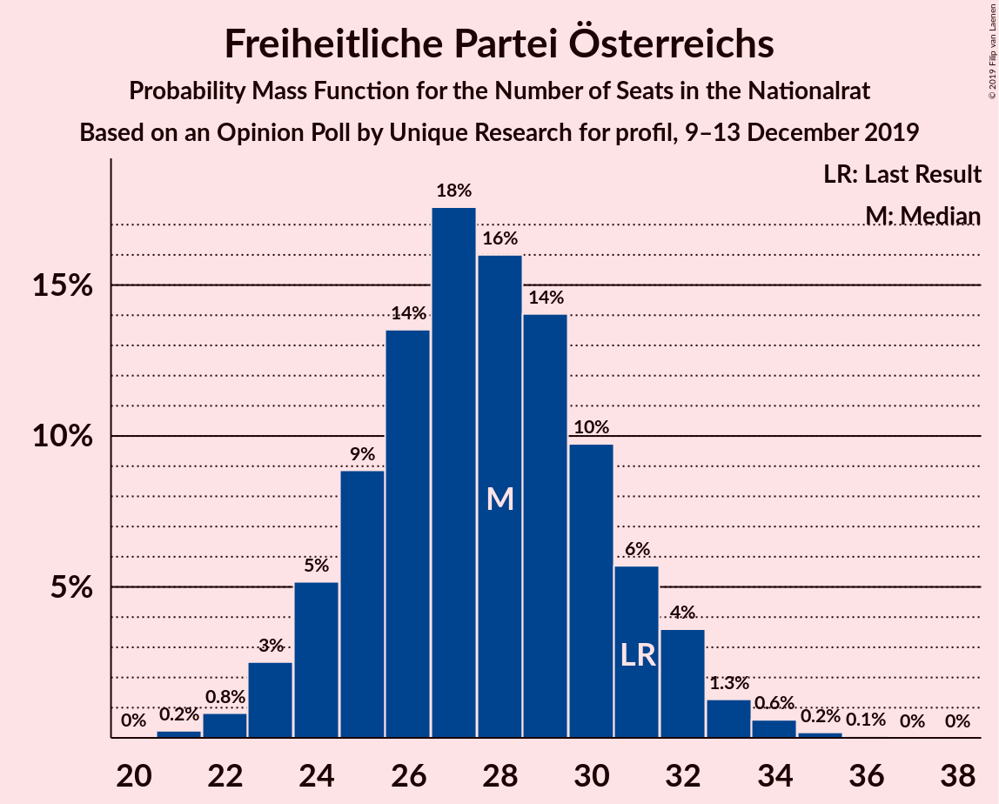

| Number of Seats | Probability | Accumulated | Special Marks |
|:---------------:|:-----------:|:-----------:|:-------------:|
| 20 | 0% | 100% |  |
| 21 | 0.2% | 99.9% |  |
| 22 | 0.8% | 99.7% |  |
| 23 | 3% | 98.9% |  |
| 24 | 5% | 96% |  |
| 25 | 9% | 91% |  |
| 26 | 14% | 82% |  |
| 27 | 18% | 69% |  |
| 28 | 16% | 51% | Median |
| 29 | 14% | 35% |  |
| 30 | 10% | 21% |  |
| 31 | 6% | 11% | Last Result |
| 32 | 4% | 6% |  |
| 33 | 1.3% | 2% |  |
| 34 | 0.6% | 0.9% |  |
| 35 | 0.2% | 0.3% |  |
| 36 | 0.1% | 0.1% |  |
| 37 | 0% | 0% |  |

### NEOS–Das Neue Österreich und Liberales Forum

*For a full overview of the results for this party, see the [NEOS–Das Neue Österreich und Liberales Forum](party-neos–dasneueösterreichundliberalesforum.html) page.*

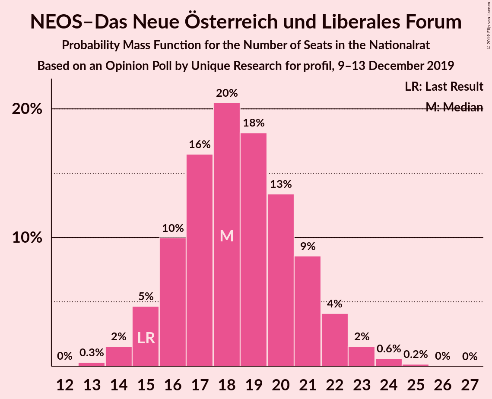

| Number of Seats | Probability | Accumulated | Special Marks |
|:---------------:|:-----------:|:-----------:|:-------------:|
| 13 | 0.3% | 100% |  |
| 14 | 1.4% | 99.7% |  |
| 15 | 5% | 98% | Last Result |
| 16 | 10% | 94% |  |
| 17 | 15% | 83% |  |
| 18 | 22% | 68% | Median |
| 19 | 18% | 46% |  |
| 20 | 13% | 28% |  |
| 21 | 8% | 15% |  |
| 22 | 4% | 7% |  |
| 23 | 1.3% | 2% |  |
| 24 | 0.6% | 0.8% |  |
| 25 | 0.2% | 0.2% |  |
| 26 | 0% | 0.1% |  |
| 27 | 0% | 0% |  |

## Coalitions

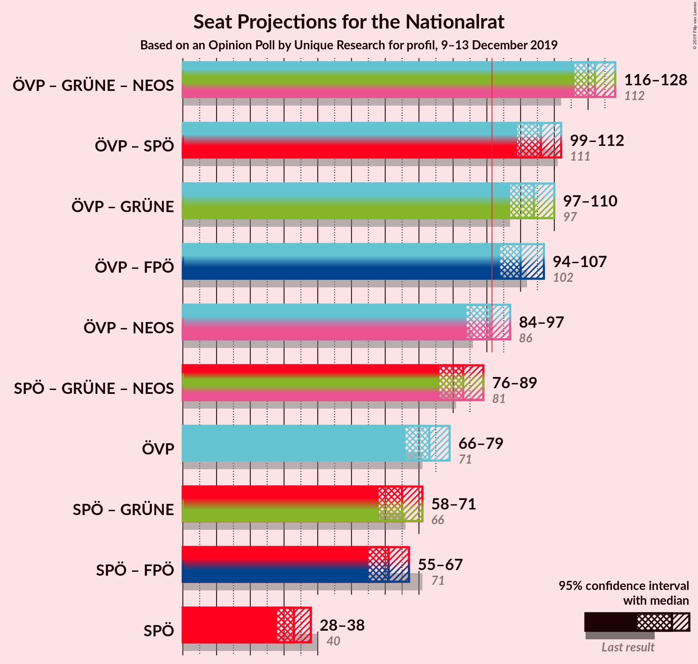

### Confidence Intervals

| Coalition | Last Result | Median | Majority? | 80% Confidence Interval | 90% Confidence Interval | 95% Confidence Interval | 99% Confidence Interval |
|:---------:|:-----------:|:------:|:---------:|:-----------------------:|:-----------------------:|:-----------------------:|:-----------------------:|
| Österreichische Volkspartei – Die Grünen–Die Grüne Alternative – NEOS–Das Neue Österreich und Liberales Forum | 112 | 122 | 100% | 118–126 | 117–127 | 116–128 | 114–130 |
| Österreichische Volkspartei – Sozialdemokratische Partei Österreichs | 111 | 106 | 100% | 102–110 | 100–111 | 99–112 | 97–114 |
| Österreichische Volkspartei – Die Grünen–Die Grüne Alternative | 97 | 104 | 100% | 100–108 | 98–109 | 97–110 | 95–112 |
| Österreichische Volkspartei – Freiheitliche Partei Österreichs | 102 | 100 | 99.6% | 96–104 | 95–105 | 94–107 | 92–109 |
| Österreichische Volkspartei – NEOS–Das Neue Österreich und Liberales Forum | 86 | 91 | 42% | 87–95 | 85–96 | 84–97 | 82–99 |
| Sozialdemokratische Partei Österreichs – Die Grünen–Die Grüne Alternative – NEOS–Das Neue Österreich und Liberales Forum | 81 | 83 | 0.4% | 79–87 | 78–88 | 76–89 | 74–91 |
| Österreichische Volkspartei | 71 | 73 | 0% | 68–77 | 67–78 | 66–79 | 64–81 |
| Sozialdemokratische Partei Österreichs – Die Grünen–Die Grüne Alternative | 66 | 65 | 0% | 61–69 | 59–70 | 58–71 | 57–73 |
| Sozialdemokratische Partei Österreichs – Freiheitliche Partei Österreichs | 71 | 61 | 0% | 57–65 | 56–66 | 55–67 | 53–69 |
| Sozialdemokratische Partei Österreichs | 40 | 33 | 0% | 30–36 | 29–37 | 28–38 | 27–40 |

### Österreichische Volkspartei – Die Grünen–Die Grüne Alternative – NEOS–Das Neue Österreich und Liberales Forum

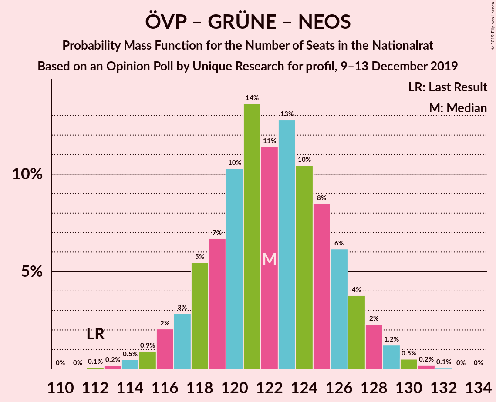

| Number of Seats | Probability | Accumulated | Special Marks |
|:---------------:|:-----------:|:-----------:|:-------------:|
| 112 | 0.1% | 100% | Last Result |
| 113 | 0.2% | 99.9% |  |
| 114 | 0.5% | 99.7% |  |
| 115 | 0.9% | 99.2% |  |
| 116 | 2% | 98% |  |
| 117 | 3% | 96% |  |
| 118 | 5% | 93% |  |
| 119 | 7% | 88% |  |
| 120 | 10% | 81% |  |
| 121 | 14% | 71% |  |
| 122 | 11% | 57% | Median |
| 123 | 13% | 46% |  |
| 124 | 10% | 33% |  |
| 125 | 8% | 23% |  |
| 126 | 6% | 14% |  |
| 127 | 4% | 8% |  |
| 128 | 2% | 4% |  |
| 129 | 1.2% | 2% |  |
| 130 | 0.5% | 0.8% |  |
| 131 | 0.2% | 0.3% |  |
| 132 | 0.1% | 0.1% |  |
| 133 | 0% | 0% |  |

### Österreichische Volkspartei – Sozialdemokratische Partei Österreichs

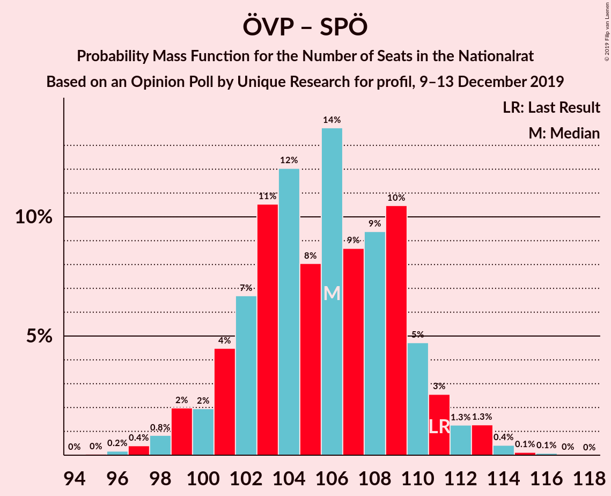

| Number of Seats | Probability | Accumulated | Special Marks |
|:---------------:|:-----------:|:-----------:|:-------------:|
| 95 | 0% | 100% |  |
| 96 | 0.2% | 99.9% |  |
| 97 | 0.4% | 99.7% |  |
| 98 | 0.8% | 99.3% |  |
| 99 | 2% | 98.5% |  |
| 100 | 2% | 97% |  |
| 101 | 4% | 95% |  |
| 102 | 7% | 90% |  |
| 103 | 11% | 83% |  |
| 104 | 12% | 73% |  |
| 105 | 8% | 61% |  |
| 106 | 14% | 53% | Median |
| 107 | 9% | 39% |  |
| 108 | 9% | 30% |  |
| 109 | 10% | 21% |  |
| 110 | 5% | 10% |  |
| 111 | 3% | 6% | Last Result |
| 112 | 1.3% | 3% |  |
| 113 | 1.3% | 2% |  |
| 114 | 0.4% | 0.7% |  |
| 115 | 0.1% | 0.2% |  |
| 116 | 0.1% | 0.1% |  |
| 117 | 0% | 0% |  |

### Österreichische Volkspartei – Die Grünen–Die Grüne Alternative

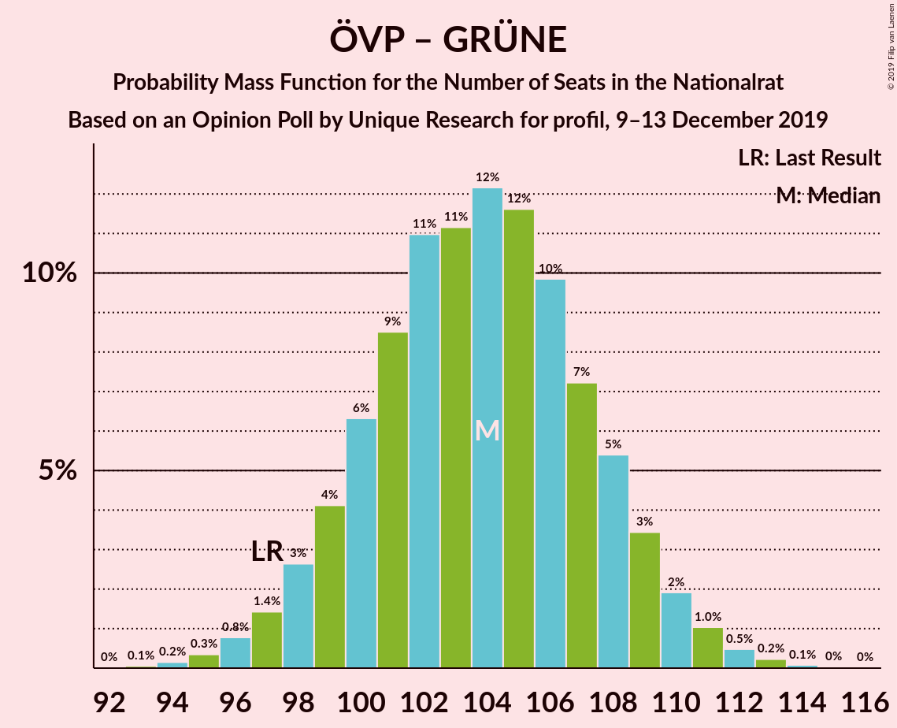

| Number of Seats | Probability | Accumulated | Special Marks |
|:---------------:|:-----------:|:-----------:|:-------------:|
| 93 | 0.1% | 100% |  |
| 94 | 0.1% | 99.9% |  |
| 95 | 0.4% | 99.8% |  |
| 96 | 0.9% | 99.4% |  |
| 97 | 1.5% | 98% | Last Result |
| 98 | 2% | 97% |  |
| 99 | 4% | 95% |  |
| 100 | 6% | 91% |  |
| 101 | 9% | 85% |  |
| 102 | 12% | 76% |  |
| 103 | 12% | 64% |  |
| 104 | 11% | 52% | Median |
| 105 | 12% | 42% |  |
| 106 | 10% | 30% |  |
| 107 | 7% | 20% |  |
| 108 | 6% | 13% |  |
| 109 | 3% | 7% |  |
| 110 | 2% | 4% |  |
| 111 | 1.0% | 2% |  |
| 112 | 0.5% | 0.8% |  |
| 113 | 0.2% | 0.4% |  |
| 114 | 0.1% | 0.1% |  |
| 115 | 0% | 0% |  |

### Österreichische Volkspartei – Freiheitliche Partei Österreichs

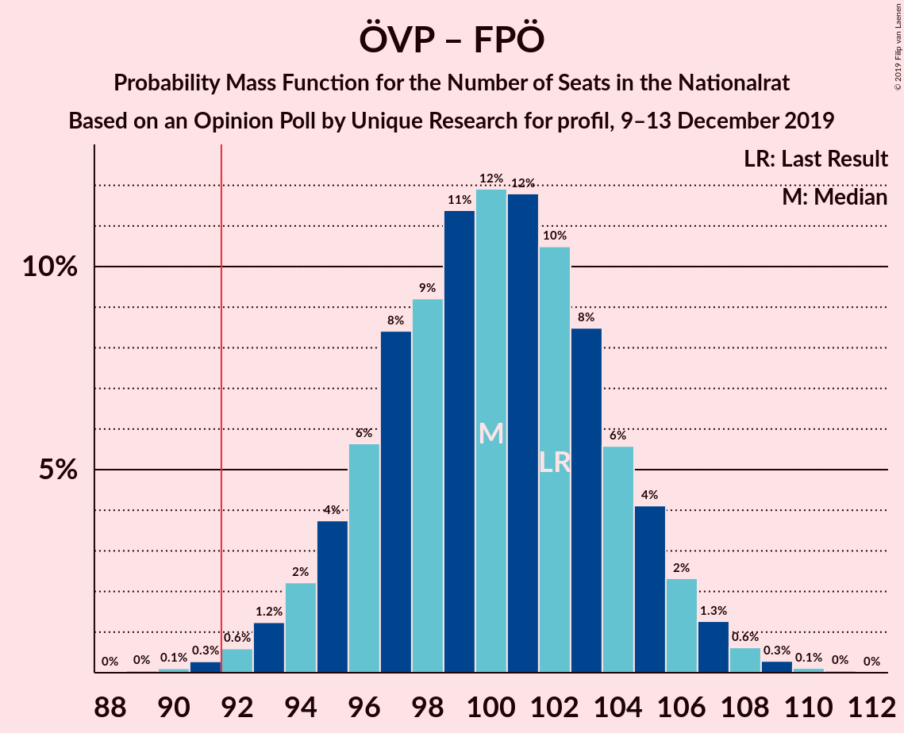

| Number of Seats | Probability | Accumulated | Special Marks |
|:---------------:|:-----------:|:-----------:|:-------------:|
| 89 | 0% | 100% |  |
| 90 | 0.1% | 99.9% |  |
| 91 | 0.3% | 99.8% |  |
| 92 | 0.6% | 99.6% | Majority |
| 93 | 1.3% | 99.0% |  |
| 94 | 2% | 98% |  |
| 95 | 4% | 96% |  |
| 96 | 5% | 92% |  |
| 97 | 9% | 87% |  |
| 98 | 9% | 78% |  |
| 99 | 12% | 68% |  |
| 100 | 11% | 56% |  |
| 101 | 12% | 45% | Median |
| 102 | 10% | 34% | Last Result |
| 103 | 10% | 24% |  |
| 104 | 5% | 14% |  |
| 105 | 4% | 9% |  |
| 106 | 2% | 5% |  |
| 107 | 2% | 3% |  |
| 108 | 0.4% | 1.0% |  |
| 109 | 0.4% | 0.5% |  |
| 110 | 0.1% | 0.2% |  |
| 111 | 0.1% | 0.1% |  |
| 112 | 0% | 0% |  |

### Österreichische Volkspartei – NEOS–Das Neue Österreich und Liberales Forum

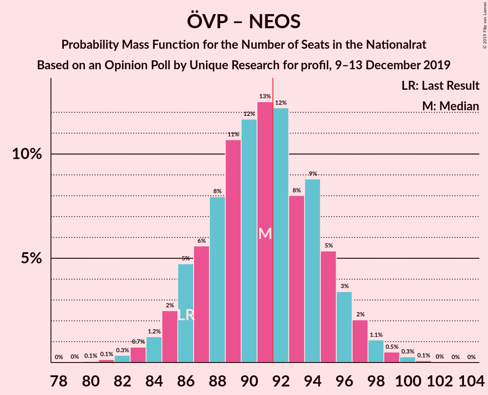

| Number of Seats | Probability | Accumulated | Special Marks |
|:---------------:|:-----------:|:-----------:|:-------------:|
| 80 | 0.1% | 100% |  |
| 81 | 0.1% | 99.9% |  |
| 82 | 0.3% | 99.8% |  |
| 83 | 0.7% | 99.4% |  |
| 84 | 1.2% | 98.7% |  |
| 85 | 2% | 97% |  |
| 86 | 5% | 95% | Last Result |
| 87 | 6% | 90% |  |
| 88 | 8% | 85% |  |
| 89 | 11% | 77% |  |
| 90 | 12% | 66% |  |
| 91 | 13% | 54% | Median |
| 92 | 12% | 42% | Majority |
| 93 | 8% | 30% |  |
| 94 | 9% | 22% |  |
| 95 | 5% | 13% |  |
| 96 | 3% | 7% |  |
| 97 | 2% | 4% |  |
| 98 | 1.1% | 2% |  |
| 99 | 0.5% | 0.9% |  |
| 100 | 0.3% | 0.4% |  |
| 101 | 0.1% | 0.1% |  |
| 102 | 0% | 0.1% |  |
| 103 | 0% | 0% |  |

### Sozialdemokratische Partei Österreichs – Die Grünen–Die Grüne Alternative – NEOS–Das Neue Österreich und Liberales Forum

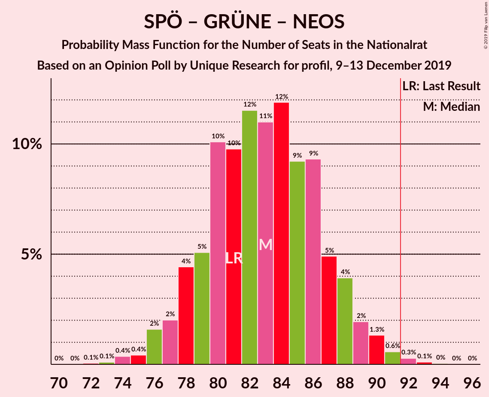

| Number of Seats | Probability | Accumulated | Special Marks |
|:---------------:|:-----------:|:-----------:|:-------------:|
| 72 | 0.1% | 100% |  |
| 73 | 0.1% | 99.9% |  |
| 74 | 0.4% | 99.8% |  |
| 75 | 0.4% | 99.5% |  |
| 76 | 2% | 99.0% |  |
| 77 | 2% | 97% |  |
| 78 | 4% | 95% |  |
| 79 | 5% | 91% |  |
| 80 | 10% | 86% |  |
| 81 | 10% | 76% | Last Result |
| 82 | 12% | 66% | Median |
| 83 | 11% | 55% |  |
| 84 | 12% | 44% |  |
| 85 | 9% | 32% |  |
| 86 | 9% | 22% |  |
| 87 | 5% | 13% |  |
| 88 | 4% | 8% |  |
| 89 | 2% | 4% |  |
| 90 | 1.3% | 2% |  |
| 91 | 0.6% | 1.0% |  |
| 92 | 0.3% | 0.4% | Majority |
| 93 | 0.1% | 0.2% |  |
| 94 | 0% | 0.1% |  |
| 95 | 0% | 0% |  |

### Österreichische Volkspartei

| Number of Seats | Probability | Accumulated | Special Marks |
|:---------------:|:-----------:|:-----------:|:-------------:|
| 62 | 0.1% | 100% |  |
| 63 | 0.1% | 99.9% |  |
| 64 | 0.4% | 99.8% |  |
| 65 | 0.9% | 99.4% |  |
| 66 | 2% | 98% |  |
| 67 | 3% | 97% |  |
| 68 | 5% | 94% |  |
| 69 | 7% | 89% |  |
| 70 | 9% | 82% |  |
| 71 | 10% | 72% | Last Result |
| 72 | 12% | 62% |  |
| 73 | 14% | 50% | Median |
| 74 | 12% | 37% |  |
| 75 | 7% | 25% |  |
| 76 | 7% | 18% |  |
| 77 | 4% | 10% |  |
| 78 | 3% | 6% |  |
| 79 | 2% | 3% |  |
| 80 | 0.6% | 1.2% |  |
| 81 | 0.4% | 0.6% |  |
| 82 | 0.2% | 0.2% |  |
| 83 | 0.1% | 0.1% |  |
| 84 | 0% | 0% |  |

### Sozialdemokratische Partei Österreichs – Die Grünen–Die Grüne Alternative

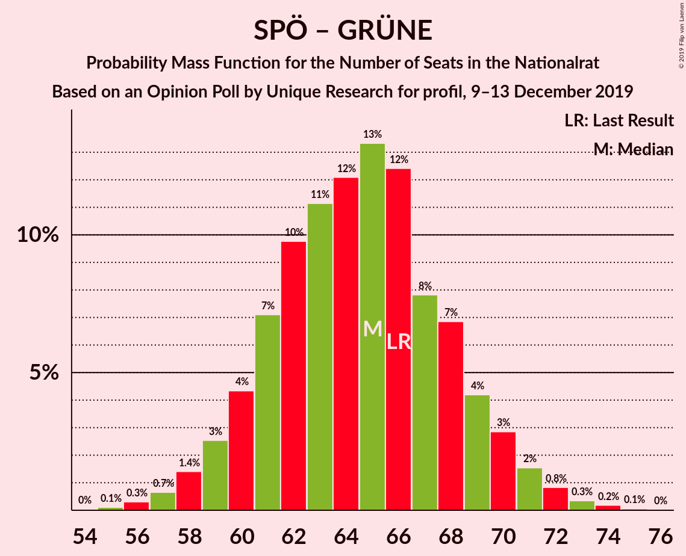

| Number of Seats | Probability | Accumulated | Special Marks |
|:---------------:|:-----------:|:-----------:|:-------------:|
| 54 | 0% | 100% |  |
| 55 | 0.1% | 99.9% |  |
| 56 | 0.3% | 99.8% |  |
| 57 | 0.7% | 99.5% |  |
| 58 | 1.4% | 98.9% |  |
| 59 | 3% | 97% |  |
| 60 | 4% | 95% |  |
| 61 | 7% | 91% |  |
| 62 | 10% | 83% |  |
| 63 | 11% | 74% |  |
| 64 | 12% | 63% | Median |
| 65 | 13% | 50% |  |
| 66 | 12% | 37% | Last Result |
| 67 | 8% | 25% |  |
| 68 | 7% | 17% |  |
| 69 | 4% | 10% |  |
| 70 | 3% | 6% |  |
| 71 | 2% | 3% |  |
| 72 | 0.8% | 1.5% |  |
| 73 | 0.3% | 0.6% |  |
| 74 | 0.2% | 0.3% |  |
| 75 | 0.1% | 0.1% |  |
| 76 | 0% | 0% |  |

### Sozialdemokratische Partei Österreichs – Freiheitliche Partei Österreichs

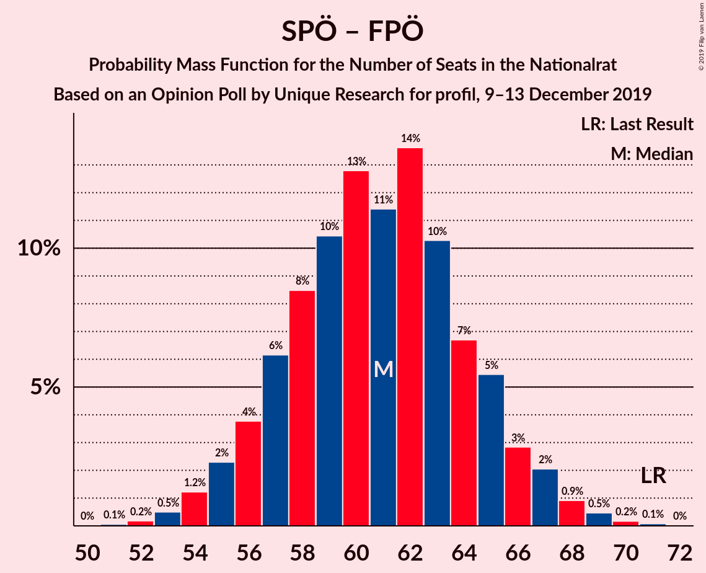

| Number of Seats | Probability | Accumulated | Special Marks |
|:---------------:|:-----------:|:-----------:|:-------------:|
| 51 | 0.1% | 100% |  |
| 52 | 0.2% | 99.9% |  |
| 53 | 0.5% | 99.7% |  |
| 54 | 1.2% | 99.2% |  |
| 55 | 2% | 98% |  |
| 56 | 4% | 96% |  |
| 57 | 6% | 92% |  |
| 58 | 8% | 86% |  |
| 59 | 10% | 77% |  |
| 60 | 13% | 67% |  |
| 61 | 11% | 54% | Median |
| 62 | 14% | 43% |  |
| 63 | 10% | 29% |  |
| 64 | 7% | 19% |  |
| 65 | 5% | 12% |  |
| 66 | 3% | 7% |  |
| 67 | 2% | 4% |  |
| 68 | 0.9% | 2% |  |
| 69 | 0.5% | 0.8% |  |
| 70 | 0.2% | 0.3% |  |
| 71 | 0.1% | 0.1% | Last Result |
| 72 | 0% | 0% |  |

### Sozialdemokratische Partei Österreichs

| Number of Seats | Probability | Accumulated | Special Marks |
|:---------------:|:-----------:|:-----------:|:-------------:|
| 25 | 0% | 100% |  |
| 26 | 0.2% | 99.9% |  |
| 27 | 0.7% | 99.7% |  |
| 28 | 2% | 99.0% |  |
| 29 | 4% | 97% |  |
| 30 | 8% | 93% |  |
| 31 | 11% | 85% |  |
| 32 | 13% | 73% |  |
| 33 | 15% | 60% | Median |
| 34 | 14% | 45% |  |
| 35 | 13% | 31% |  |
| 36 | 9% | 18% |  |
| 37 | 4% | 9% |  |
| 38 | 3% | 5% |  |
| 39 | 1.2% | 2% |  |
| 40 | 0.5% | 0.8% | Last Result |
| 41 | 0.2% | 0.3% |  |
| 42 | 0.1% | 0.1% |  |
| 43 | 0% | 0% |  |

## Technical Information

### Opinion Poll

+ **Polling firm:** Unique Research
+ **Commissioner(s):** profil
+ **Fieldwork period:** 9–13 December 2019

### Calculations

+ **Sample size:** 807
+ **Simulations done:** 131,072
+ **Error estimate:** 0.53%

