# Opinion Poll by Research Affairs for ÖSTERREICH, 12–19 December 2019

<a href="#voting-intentions">Voting Intentions</a> | <a href="#seats">Seats</a> | <a href="#coalitions">Coalitions</a> | <a href="#technical-information">Technical Information</a>

## Voting Intentions

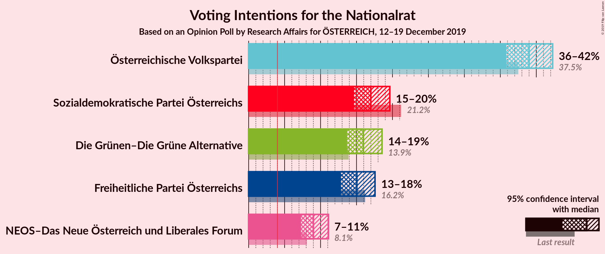

### Confidence Intervals

| Party | Last Result | Poll Result | 80% Confidence Interval | 90% Confidence Interval | 95% Confidence Interval | 99% Confidence Interval |
|:-----:|:-----------:|:-----------:|:-----------------------:|:-----------------------:|:-----------------------:|:-----------------------:|
| Österreichische Volkspartei | 37.5% | 39.0% | 36.9–41.1% |36.3–41.7% |35.8–42.3% |34.8–43.3% |
| Sozialdemokratische Partei Österreichs | 21.2% | 17.0% | 15.5–18.7% |15.0–19.2% |14.6–19.6% |13.9–20.5% |
| Die Grünen–Die Grüne Alternative | 13.9% | 16.0% | 14.5–17.6% |14.0–18.1% |13.7–18.5% |13.0–19.4% |
| Freiheitliche Partei Österreichs | 16.2% | 15.1% | 13.6–16.7% |13.2–17.2% |12.8–17.6% |12.2–18.4% |
| NEOS–Das Neue Österreich und Liberales Forum | 8.1% | 9.0% | 7.9–10.4% |7.6–10.8% |7.3–11.1% |6.8–11.8% |

*Note:* The poll result column reflects the actual value used in the calculations. Published results may vary slightly, and in addition be rounded to fewer digits.

## Seats

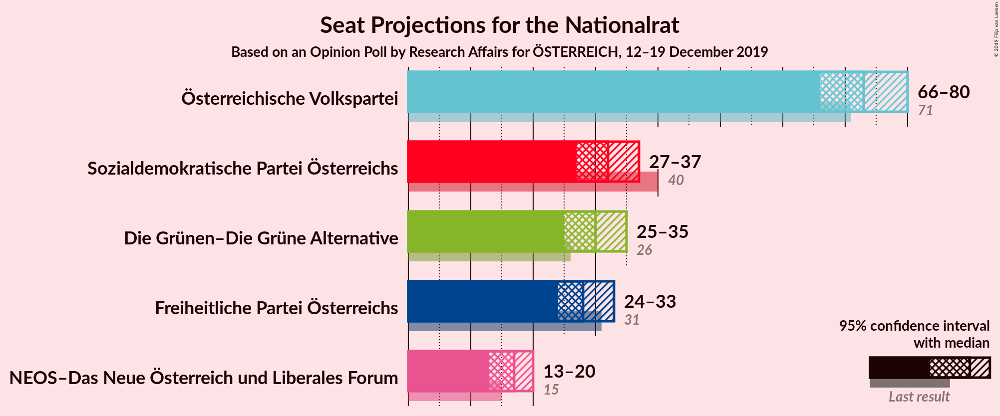

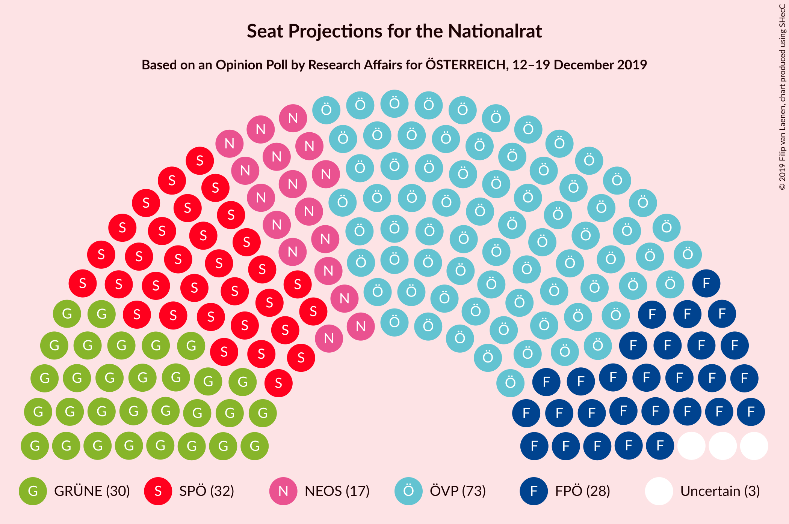

### Confidence Intervals

| Party | Last Result | Median | 80% Confidence Interval | 90% Confidence Interval | 95% Confidence Interval | 99% Confidence Interval |
|:-----:|:-----------:|:------:|:-----------------------:|:-----------------------:|:-----------------------:|:-----------------------:|
| <a href="#österreichische-volkspartei">Österreichische Volkspartei</a> | 71 | 73 | 68–77 |67–79 |66–80 |64–82 |
| <a href="#sozialdemokratische-partei-österreichs">Sozialdemokratische Partei Österreichs</a> | 40 | 32 | 28–35 |28–36 |27–37 |26–38 |
| <a href="#die-grünen–die-grüne-alternative">Die Grünen–Die Grüne Alternative</a> | 26 | 30 | 27–33 |26–34 |25–35 |24–36 |
| <a href="#freiheitliche-partei-österreichs">Freiheitliche Partei Österreichs</a> | 31 | 28 | 25–31 |24–32 |24–33 |22–34 |
| <a href="#neos–das-neue-österreich-und-liberales-forum">NEOS–Das Neue Österreich und Liberales Forum</a> | 15 | 17 | 14–19 |14–20 |13–20 |12–22 |

### Österreichische Volkspartei

*For a full overview of the results for this party, see the [Österreichische Volkspartei](party-österreichischevolkspartei.html) page.*

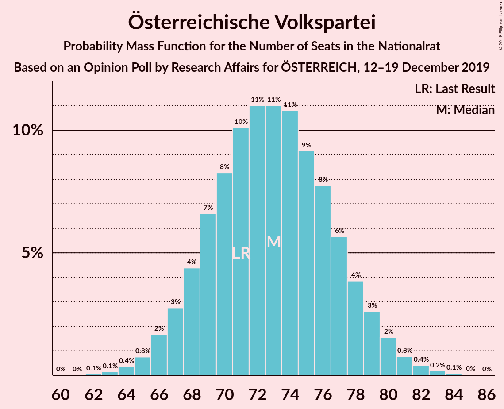

| Number of Seats | Probability | Accumulated | Special Marks |
|:---------------:|:-----------:|:-----------:|:-------------:|
| 62 | 0.1% | 100% |  |
| 63 | 0.1% | 99.9% |  |
| 64 | 0.4% | 99.8% |  |
| 65 | 0.8% | 99.4% |  |
| 66 | 2% | 98.7% |  |
| 67 | 3% | 97% |  |
| 68 | 4% | 94% |  |
| 69 | 7% | 90% |  |
| 70 | 8% | 83% |  |
| 71 | 10% | 75% | Last Result |
| 72 | 11% | 65% |  |
| 73 | 11% | 54% | Median |
| 74 | 11% | 43% |  |
| 75 | 9% | 32% |  |
| 76 | 8% | 23% |  |
| 77 | 6% | 15% |  |
| 78 | 4% | 9% |  |
| 79 | 3% | 6% |  |
| 80 | 2% | 3% |  |
| 81 | 0.8% | 1.5% |  |
| 82 | 0.4% | 0.7% |  |
| 83 | 0.2% | 0.3% |  |
| 84 | 0.1% | 0.1% |  |
| 85 | 0% | 0% |  |

### Sozialdemokratische Partei Österreichs

*For a full overview of the results for this party, see the [Sozialdemokratische Partei Österreichs](party-sozialdemokratischeparteiösterreichs.html) page.*

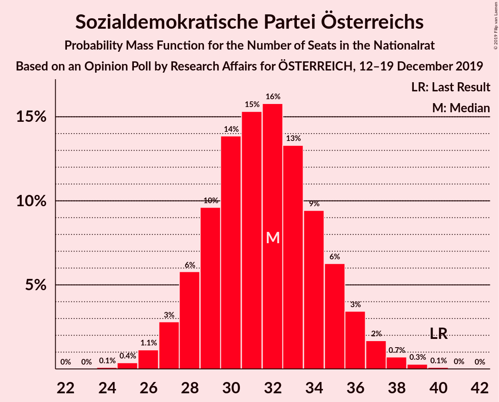

| Number of Seats | Probability | Accumulated | Special Marks |
|:---------------:|:-----------:|:-----------:|:-------------:|
| 24 | 0.1% | 100% |  |
| 25 | 0.4% | 99.9% |  |
| 26 | 1.1% | 99.5% |  |
| 27 | 3% | 98% |  |
| 28 | 6% | 96% |  |
| 29 | 10% | 90% |  |
| 30 | 14% | 80% |  |
| 31 | 15% | 66% |  |
| 32 | 16% | 51% | Median |
| 33 | 13% | 35% |  |
| 34 | 9% | 22% |  |
| 35 | 6% | 12% |  |
| 36 | 3% | 6% |  |
| 37 | 2% | 3% |  |
| 38 | 0.7% | 1.1% |  |
| 39 | 0.3% | 0.4% |  |
| 40 | 0.1% | 0.1% | Last Result |
| 41 | 0% | 0% |  |

### Die Grünen–Die Grüne Alternative

*For a full overview of the results for this party, see the [Die Grünen–Die Grüne Alternative](party-diegrünen–diegrünealternative.html) page.*

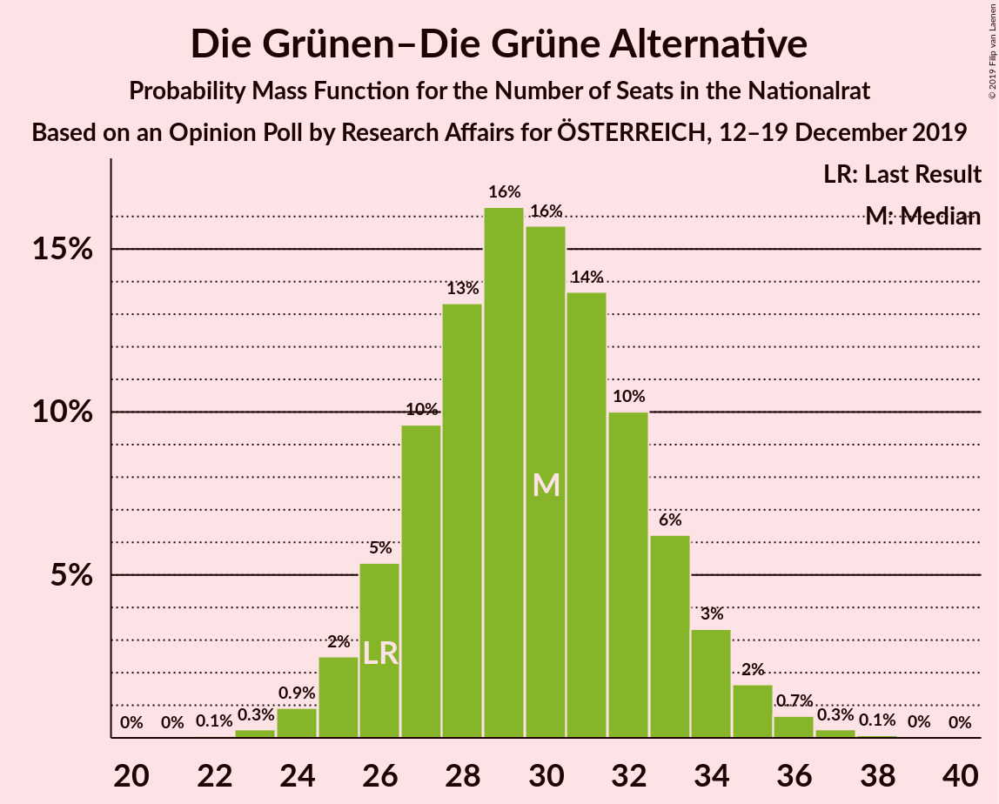

| Number of Seats | Probability | Accumulated | Special Marks |
|:---------------:|:-----------:|:-----------:|:-------------:|
| 22 | 0.1% | 100% |  |
| 23 | 0.3% | 99.9% |  |
| 24 | 0.9% | 99.7% |  |
| 25 | 2% | 98.8% |  |
| 26 | 5% | 96% | Last Result |
| 27 | 10% | 91% |  |
| 28 | 13% | 81% |  |
| 29 | 16% | 68% |  |
| 30 | 16% | 52% | Median |
| 31 | 14% | 36% |  |
| 32 | 10% | 22% |  |
| 33 | 6% | 12% |  |
| 34 | 3% | 6% |  |
| 35 | 2% | 3% |  |
| 36 | 0.7% | 1.0% |  |
| 37 | 0.3% | 0.4% |  |
| 38 | 0.1% | 0.1% |  |
| 39 | 0% | 0% |  |

### Freiheitliche Partei Österreichs

*For a full overview of the results for this party, see the [Freiheitliche Partei Österreichs](party-freiheitlicheparteiösterreichs.html) page.*

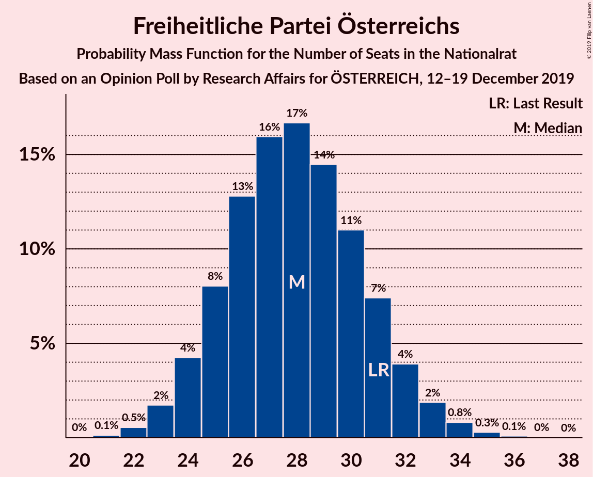

| Number of Seats | Probability | Accumulated | Special Marks |
|:---------------:|:-----------:|:-----------:|:-------------:|
| 21 | 0.1% | 100% |  |
| 22 | 0.5% | 99.8% |  |
| 23 | 2% | 99.3% |  |
| 24 | 4% | 98% |  |
| 25 | 8% | 93% |  |
| 26 | 13% | 85% |  |
| 27 | 16% | 72% |  |
| 28 | 17% | 57% | Median |
| 29 | 14% | 40% |  |
| 30 | 11% | 25% |  |
| 31 | 7% | 14% | Last Result |
| 32 | 4% | 7% |  |
| 33 | 2% | 3% |  |
| 34 | 0.8% | 1.2% |  |
| 35 | 0.3% | 0.4% |  |
| 36 | 0.1% | 0.1% |  |
| 37 | 0% | 0% |  |

### NEOS–Das Neue Österreich und Liberales Forum

*For a full overview of the results for this party, see the [NEOS–Das Neue Österreich und Liberales Forum](party-neos–dasneueösterreichundliberalesforum.html) page.*

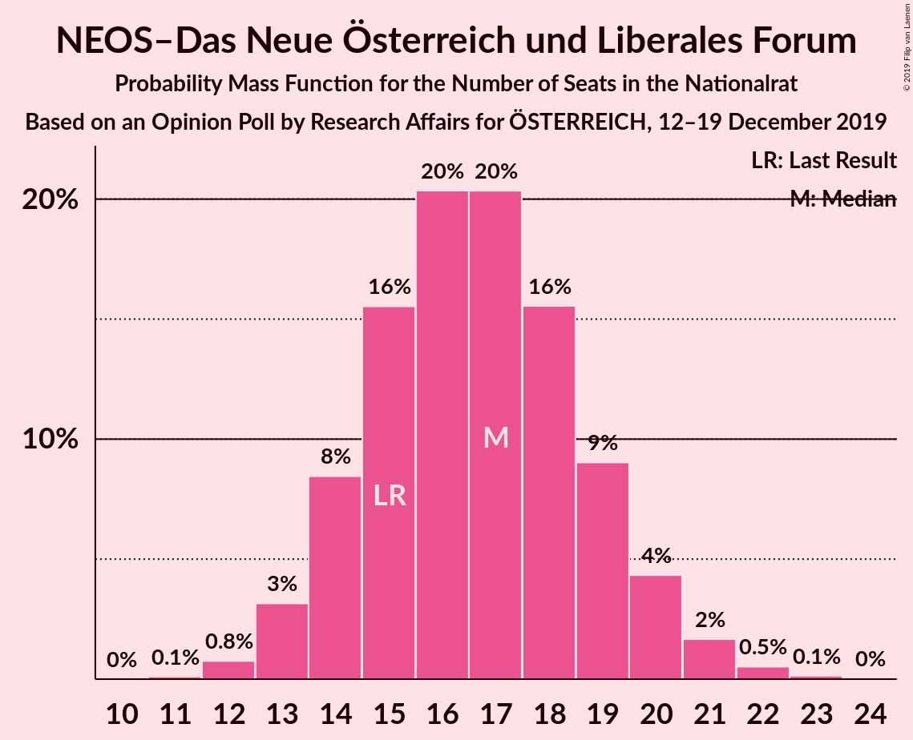

| Number of Seats | Probability | Accumulated | Special Marks |
|:---------------:|:-----------:|:-----------:|:-------------:|
| 11 | 0.1% | 100% |  |
| 12 | 0.8% | 99.9% |  |
| 13 | 3% | 99.1% |  |
| 14 | 8% | 96% |  |
| 15 | 16% | 88% | Last Result |
| 16 | 20% | 72% |  |
| 17 | 20% | 52% | Median |
| 18 | 16% | 31% |  |
| 19 | 9% | 16% |  |
| 20 | 4% | 7% |  |
| 21 | 2% | 2% |  |
| 22 | 0.5% | 0.7% |  |
| 23 | 0.1% | 0.2% |  |
| 24 | 0% | 0% |  |

## Coalitions

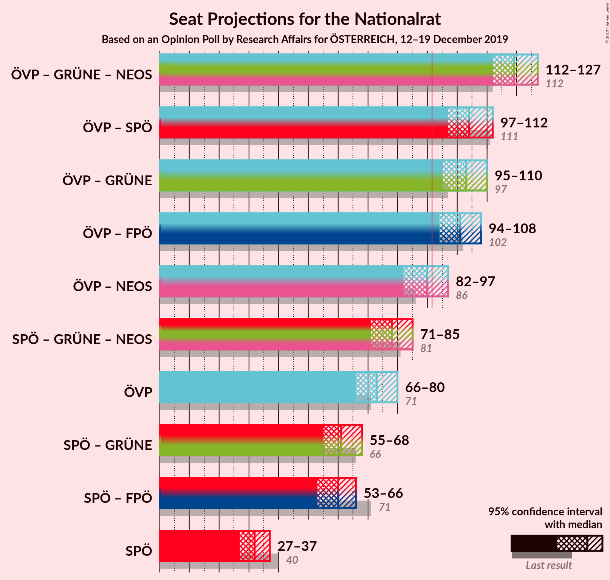

### Confidence Intervals

| Coalition | Last Result | Median | Majority? | 80% Confidence Interval | 90% Confidence Interval | 95% Confidence Interval | 99% Confidence Interval |
|:---------:|:-----------:|:------:|:---------:|:-----------------------:|:-----------------------:|:-----------------------:|:-----------------------:|
| Österreichische Volkspartei – Die Grünen–Die Grüne Alternative – NEOS–Das Neue Österreich und Liberales Forum | 112 | 119 | 100% | 114–124 | 113–126 | 112–127 | 110–129 |
| Österreichische Volkspartei – Sozialdemokratische Partei Österreichs | 111 | 104 | 100% | 100–110 | 98–111 | 97–112 | 95–114 |
| Österreichische Volkspartei – Die Grünen–Die Grüne Alternative | 97 | 103 | 99.9% | 98–108 | 96–109 | 95–110 | 93–112 |
| Österreichische Volkspartei – Freiheitliche Partei Österreichs | 102 | 101 | 99.5% | 96–106 | 95–107 | 94–108 | 92–110 |
| Österreichische Volkspartei – NEOS–Das Neue Österreich und Liberales Forum | 86 | 90 | 30% | 85–94 | 84–96 | 82–97 | 80–99 |
| Sozialdemokratische Partei Österreichs – Die Grünen–Die Grüne Alternative – NEOS–Das Neue Österreich und Liberales Forum | 81 | 78 | 0% | 73–83 | 72–84 | 71–85 | 69–87 |
| Österreichische Volkspartei | 71 | 73 | 0% | 68–77 | 67–79 | 66–80 | 64–82 |
| Sozialdemokratische Partei Österreichs – Die Grünen–Die Grüne Alternative | 66 | 61 | 0% | 57–66 | 56–67 | 55–68 | 53–70 |
| Sozialdemokratische Partei Österreichs – Freiheitliche Partei Österreichs | 71 | 60 | 0% | 55–64 | 54–65 | 53–66 | 52–68 |
| Sozialdemokratische Partei Österreichs | 40 | 32 | 0% | 28–35 | 28–36 | 27–37 | 26–38 |

### Österreichische Volkspartei – Die Grünen–Die Grüne Alternative – NEOS–Das Neue Österreich und Liberales Forum

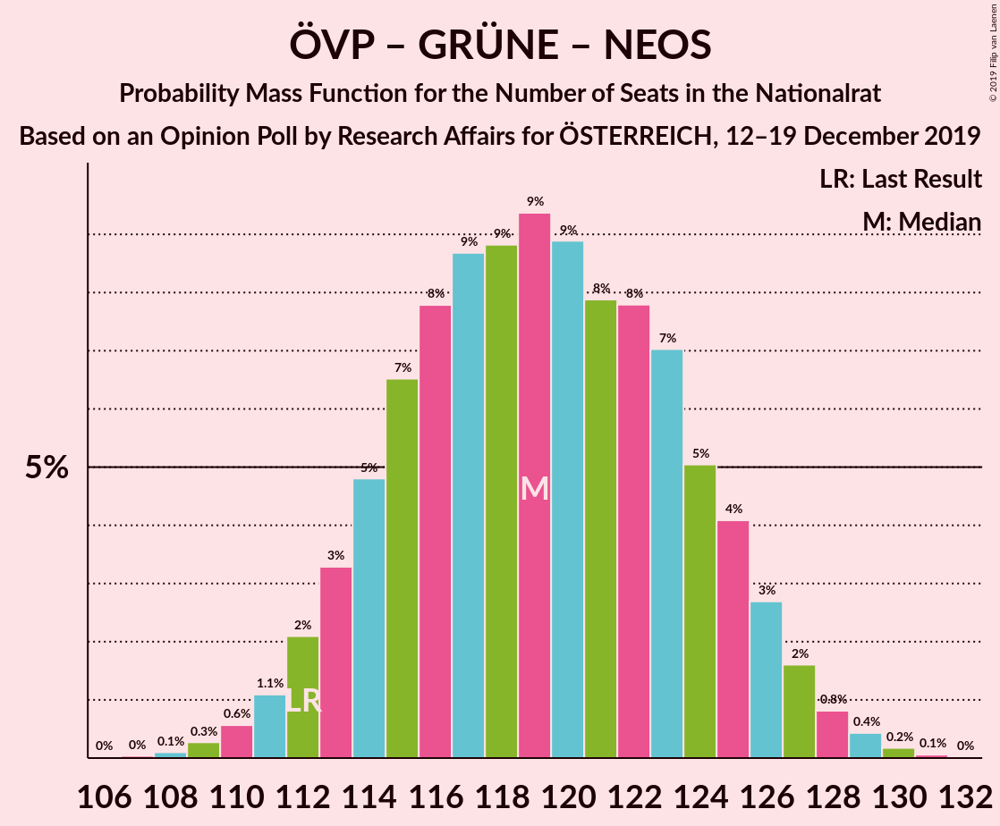

| Number of Seats | Probability | Accumulated | Special Marks |
|:---------------:|:-----------:|:-----------:|:-------------:|
| 107 | 0% | 100% |  |
| 108 | 0.1% | 99.9% |  |
| 109 | 0.3% | 99.8% |  |
| 110 | 0.6% | 99.6% |  |
| 111 | 1.1% | 99.0% |  |
| 112 | 2% | 98% | Last Result |
| 113 | 3% | 96% |  |
| 114 | 5% | 93% |  |
| 115 | 7% | 88% |  |
| 116 | 8% | 81% |  |
| 117 | 9% | 73% |  |
| 118 | 9% | 65% |  |
| 119 | 9% | 56% |  |
| 120 | 9% | 47% | Median |
| 121 | 8% | 38% |  |
| 122 | 8% | 30% |  |
| 123 | 7% | 22% |  |
| 124 | 5% | 15% |  |
| 125 | 4% | 10% |  |
| 126 | 3% | 6% |  |
| 127 | 2% | 3% |  |
| 128 | 0.8% | 2% |  |
| 129 | 0.4% | 0.7% |  |
| 130 | 0.2% | 0.3% |  |
| 131 | 0.1% | 0.1% |  |
| 132 | 0% | 0% |  |

### Österreichische Volkspartei – Sozialdemokratische Partei Österreichs

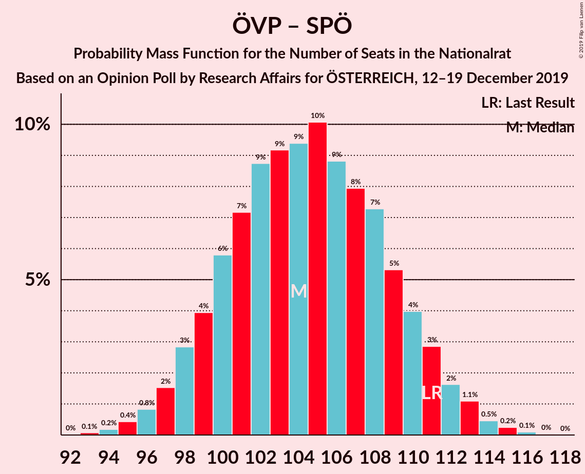

| Number of Seats | Probability | Accumulated | Special Marks |
|:---------------:|:-----------:|:-----------:|:-------------:|
| 93 | 0.1% | 100% |  |
| 94 | 0.2% | 99.9% |  |
| 95 | 0.4% | 99.7% |  |
| 96 | 0.8% | 99.3% |  |
| 97 | 2% | 98% |  |
| 98 | 3% | 97% |  |
| 99 | 4% | 94% |  |
| 100 | 6% | 90% |  |
| 101 | 7% | 84% |  |
| 102 | 9% | 77% |  |
| 103 | 9% | 68% |  |
| 104 | 9% | 59% |  |
| 105 | 10% | 50% | Median |
| 106 | 9% | 40% |  |
| 107 | 8% | 31% |  |
| 108 | 7% | 23% |  |
| 109 | 5% | 16% |  |
| 110 | 4% | 10% |  |
| 111 | 3% | 6% | Last Result |
| 112 | 2% | 4% |  |
| 113 | 1.1% | 2% |  |
| 114 | 0.5% | 0.9% |  |
| 115 | 0.2% | 0.4% |  |
| 116 | 0.1% | 0.1% |  |
| 117 | 0% | 0% |  |

### Österreichische Volkspartei – Die Grünen–Die Grüne Alternative

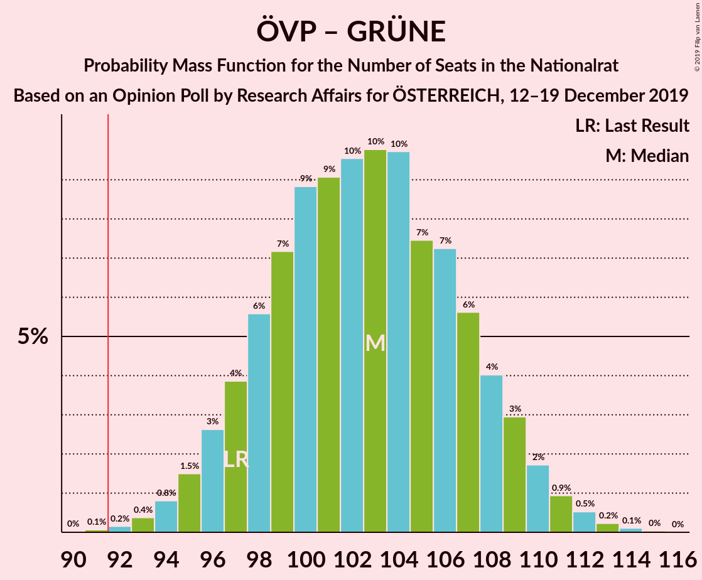

| Number of Seats | Probability | Accumulated | Special Marks |
|:---------------:|:-----------:|:-----------:|:-------------:|
| 91 | 0.1% | 100% |  |
| 92 | 0.2% | 99.9% | Majority |
| 93 | 0.4% | 99.7% |  |
| 94 | 0.8% | 99.4% |  |
| 95 | 1.5% | 98.6% |  |
| 96 | 3% | 97% |  |
| 97 | 4% | 94% | Last Result |
| 98 | 6% | 91% |  |
| 99 | 7% | 85% |  |
| 100 | 9% | 78% |  |
| 101 | 9% | 69% |  |
| 102 | 10% | 60% |  |
| 103 | 10% | 50% | Median |
| 104 | 10% | 41% |  |
| 105 | 7% | 31% |  |
| 106 | 7% | 23% |  |
| 107 | 6% | 16% |  |
| 108 | 4% | 11% |  |
| 109 | 3% | 7% |  |
| 110 | 2% | 4% |  |
| 111 | 0.9% | 2% |  |
| 112 | 0.5% | 0.9% |  |
| 113 | 0.2% | 0.4% |  |
| 114 | 0.1% | 0.2% |  |
| 115 | 0% | 0.1% |  |
| 116 | 0% | 0% |  |

### Österreichische Volkspartei – Freiheitliche Partei Österreichs

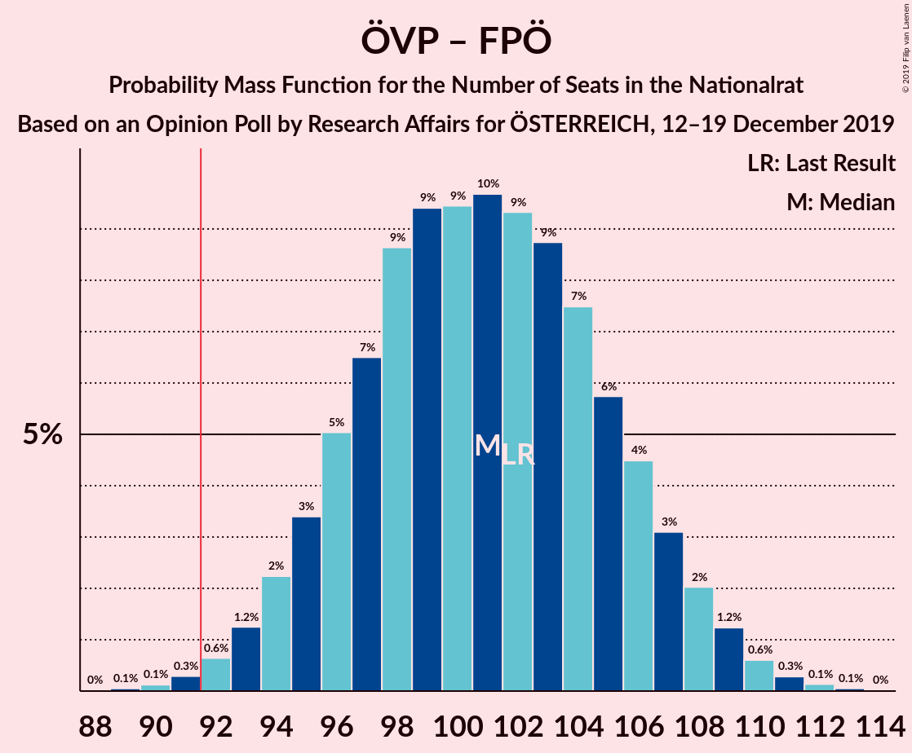

| Number of Seats | Probability | Accumulated | Special Marks |
|:---------------:|:-----------:|:-----------:|:-------------:|
| 89 | 0.1% | 100% |  |
| 90 | 0.1% | 99.9% |  |
| 91 | 0.3% | 99.8% |  |
| 92 | 0.6% | 99.5% | Majority |
| 93 | 1.2% | 98.9% |  |
| 94 | 2% | 98% |  |
| 95 | 3% | 95% |  |
| 96 | 5% | 92% |  |
| 97 | 7% | 87% |  |
| 98 | 9% | 80% |  |
| 99 | 9% | 72% |  |
| 100 | 9% | 62% |  |
| 101 | 10% | 53% | Median |
| 102 | 9% | 43% | Last Result |
| 103 | 9% | 34% |  |
| 104 | 7% | 25% |  |
| 105 | 6% | 18% |  |
| 106 | 4% | 12% |  |
| 107 | 3% | 7% |  |
| 108 | 2% | 4% |  |
| 109 | 1.2% | 2% |  |
| 110 | 0.6% | 1.1% |  |
| 111 | 0.3% | 0.5% |  |
| 112 | 0.1% | 0.2% |  |
| 113 | 0.1% | 0.1% |  |
| 114 | 0% | 0% |  |

### Österreichische Volkspartei – NEOS–Das Neue Österreich und Liberales Forum

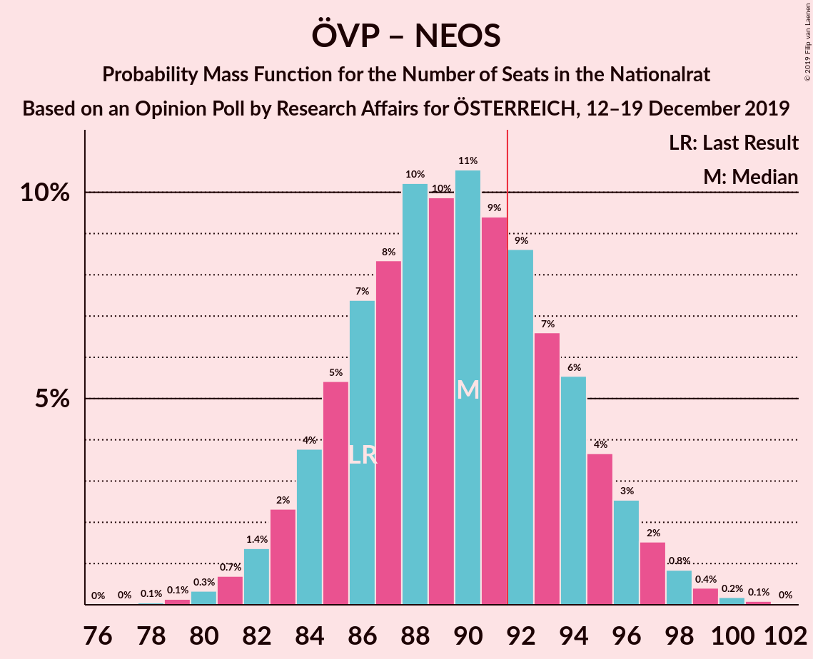

| Number of Seats | Probability | Accumulated | Special Marks |
|:---------------:|:-----------:|:-----------:|:-------------:|
| 78 | 0.1% | 100% |  |
| 79 | 0.1% | 99.9% |  |
| 80 | 0.3% | 99.8% |  |
| 81 | 0.7% | 99.4% |  |
| 82 | 1.4% | 98.7% |  |
| 83 | 2% | 97% |  |
| 84 | 4% | 95% |  |
| 85 | 5% | 91% |  |
| 86 | 7% | 86% | Last Result |
| 87 | 8% | 78% |  |
| 88 | 10% | 70% |  |
| 89 | 10% | 60% |  |
| 90 | 11% | 50% | Median |
| 91 | 9% | 39% |  |
| 92 | 9% | 30% | Majority |
| 93 | 7% | 21% |  |
| 94 | 6% | 15% |  |
| 95 | 4% | 9% |  |
| 96 | 3% | 6% |  |
| 97 | 2% | 3% |  |
| 98 | 0.8% | 2% |  |
| 99 | 0.4% | 0.7% |  |
| 100 | 0.2% | 0.3% |  |
| 101 | 0.1% | 0.1% |  |
| 102 | 0% | 0% |  |

### Sozialdemokratische Partei Österreichs – Die Grünen–Die Grüne Alternative – NEOS–Das Neue Österreich und Liberales Forum

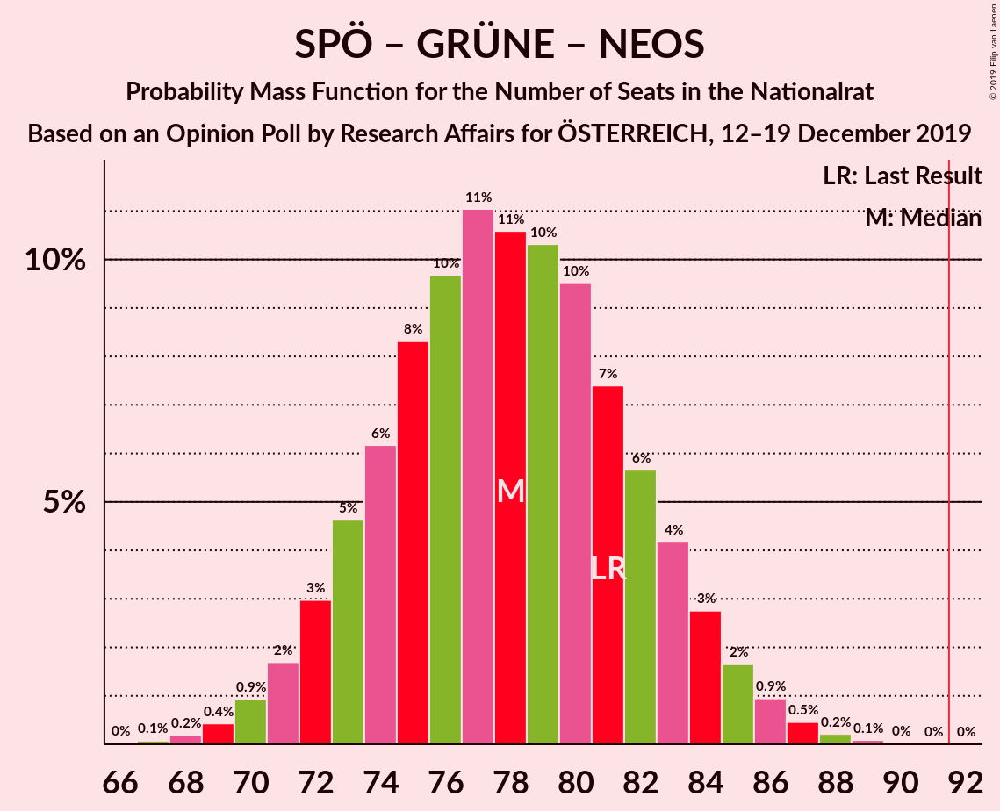

| Number of Seats | Probability | Accumulated | Special Marks |
|:---------------:|:-----------:|:-----------:|:-------------:|
| 67 | 0.1% | 100% |  |
| 68 | 0.2% | 99.9% |  |
| 69 | 0.4% | 99.7% |  |
| 70 | 0.9% | 99.3% |  |
| 71 | 2% | 98% |  |
| 72 | 3% | 97% |  |
| 73 | 5% | 94% |  |
| 74 | 6% | 89% |  |
| 75 | 8% | 83% |  |
| 76 | 10% | 75% |  |
| 77 | 11% | 65% |  |
| 78 | 11% | 54% |  |
| 79 | 10% | 43% | Median |
| 80 | 10% | 33% |  |
| 81 | 7% | 23% | Last Result |
| 82 | 6% | 16% |  |
| 83 | 4% | 10% |  |
| 84 | 3% | 6% |  |
| 85 | 2% | 3% |  |
| 86 | 0.9% | 2% |  |
| 87 | 0.5% | 0.8% |  |
| 88 | 0.2% | 0.4% |  |
| 89 | 0.1% | 0.1% |  |
| 90 | 0% | 0.1% |  |
| 91 | 0% | 0% |  |

### Österreichische Volkspartei

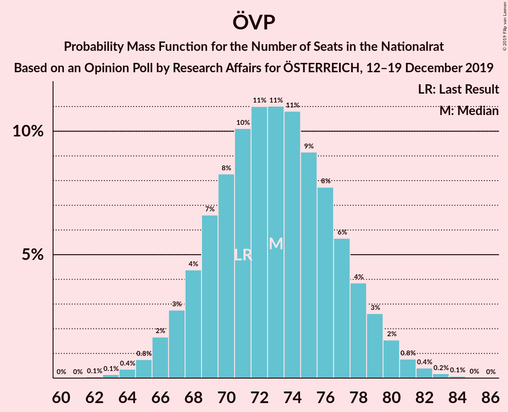

| Number of Seats | Probability | Accumulated | Special Marks |
|:---------------:|:-----------:|:-----------:|:-------------:|
| 62 | 0.1% | 100% |  |
| 63 | 0.1% | 99.9% |  |
| 64 | 0.4% | 99.8% |  |
| 65 | 0.8% | 99.4% |  |
| 66 | 2% | 98.7% |  |
| 67 | 3% | 97% |  |
| 68 | 4% | 94% |  |
| 69 | 7% | 90% |  |
| 70 | 8% | 83% |  |
| 71 | 10% | 75% | Last Result |
| 72 | 11% | 65% |  |
| 73 | 11% | 54% | Median |
| 74 | 11% | 43% |  |
| 75 | 9% | 32% |  |
| 76 | 8% | 23% |  |
| 77 | 6% | 15% |  |
| 78 | 4% | 9% |  |
| 79 | 3% | 6% |  |
| 80 | 2% | 3% |  |
| 81 | 0.8% | 1.5% |  |
| 82 | 0.4% | 0.7% |  |
| 83 | 0.2% | 0.3% |  |
| 84 | 0.1% | 0.1% |  |
| 85 | 0% | 0% |  |

### Sozialdemokratische Partei Österreichs – Die Grünen–Die Grüne Alternative

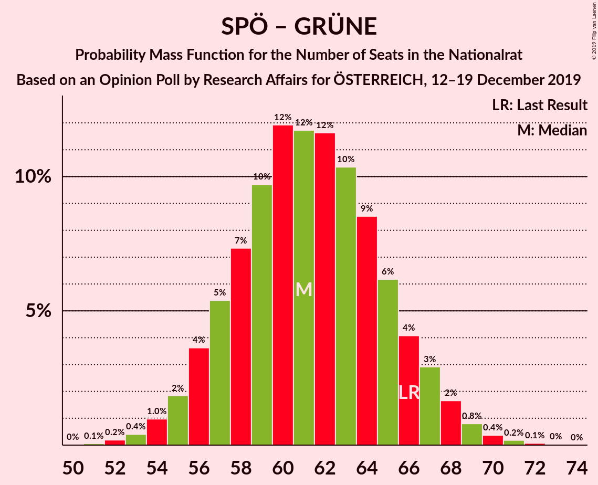

| Number of Seats | Probability | Accumulated | Special Marks |
|:---------------:|:-----------:|:-----------:|:-------------:|
| 51 | 0.1% | 100% |  |
| 52 | 0.2% | 99.9% |  |
| 53 | 0.4% | 99.7% |  |
| 54 | 1.0% | 99.3% |  |
| 55 | 2% | 98% |  |
| 56 | 4% | 97% |  |
| 57 | 5% | 93% |  |
| 58 | 7% | 87% |  |
| 59 | 10% | 80% |  |
| 60 | 12% | 70% |  |
| 61 | 12% | 59% |  |
| 62 | 12% | 47% | Median |
| 63 | 10% | 35% |  |
| 64 | 9% | 25% |  |
| 65 | 6% | 16% |  |
| 66 | 4% | 10% | Last Result |
| 67 | 3% | 6% |  |
| 68 | 2% | 3% |  |
| 69 | 0.8% | 1.5% |  |
| 70 | 0.4% | 0.7% |  |
| 71 | 0.2% | 0.3% |  |
| 72 | 0.1% | 0.1% |  |
| 73 | 0% | 0% |  |

### Sozialdemokratische Partei Österreichs – Freiheitliche Partei Österreichs

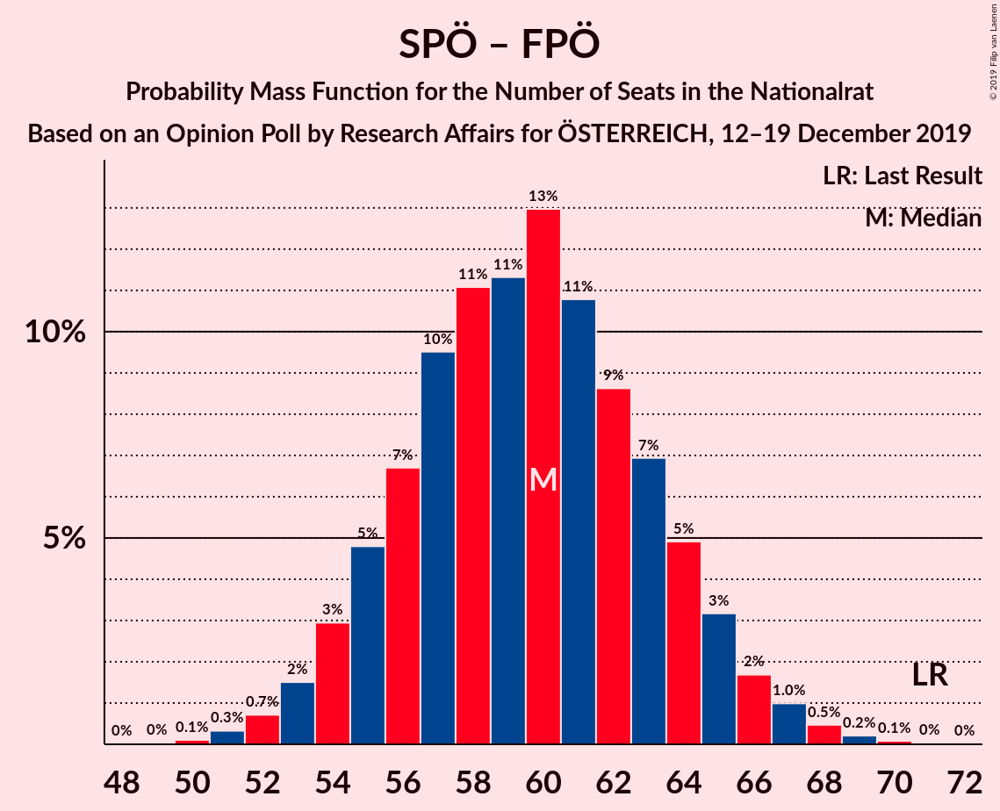

| Number of Seats | Probability | Accumulated | Special Marks |
|:---------------:|:-----------:|:-----------:|:-------------:|
| 49 | 0% | 100% |  |
| 50 | 0.1% | 99.9% |  |
| 51 | 0.3% | 99.8% |  |
| 52 | 0.7% | 99.5% |  |
| 53 | 2% | 98.8% |  |
| 54 | 3% | 97% |  |
| 55 | 5% | 94% |  |
| 56 | 7% | 90% |  |
| 57 | 10% | 83% |  |
| 58 | 11% | 73% |  |
| 59 | 11% | 62% |  |
| 60 | 13% | 51% | Median |
| 61 | 11% | 38% |  |
| 62 | 9% | 27% |  |
| 63 | 7% | 19% |  |
| 64 | 5% | 12% |  |
| 65 | 3% | 7% |  |
| 66 | 2% | 3% |  |
| 67 | 1.0% | 2% |  |
| 68 | 0.5% | 0.8% |  |
| 69 | 0.2% | 0.3% |  |
| 70 | 0.1% | 0.1% |  |
| 71 | 0% | 0% | Last Result |

### Sozialdemokratische Partei Österreichs

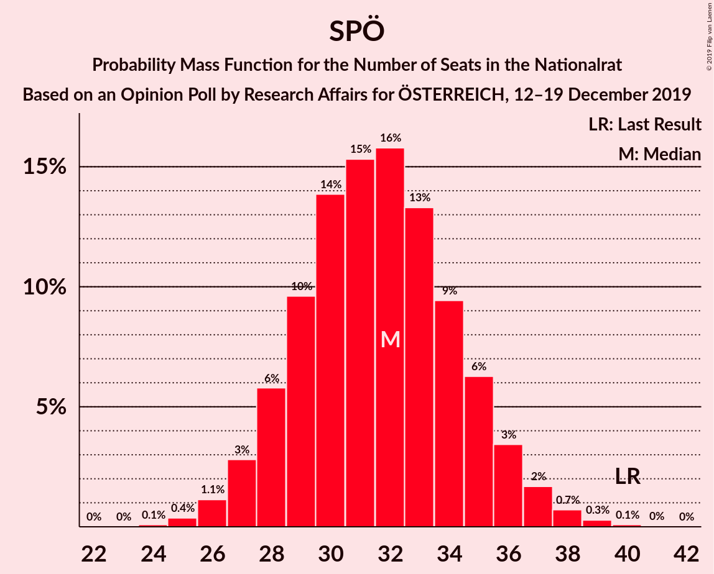

| Number of Seats | Probability | Accumulated | Special Marks |
|:---------------:|:-----------:|:-----------:|:-------------:|
| 24 | 0.1% | 100% |  |
| 25 | 0.4% | 99.9% |  |
| 26 | 1.1% | 99.5% |  |
| 27 | 3% | 98% |  |
| 28 | 6% | 96% |  |
| 29 | 10% | 90% |  |
| 30 | 14% | 80% |  |
| 31 | 15% | 66% |  |
| 32 | 16% | 51% | Median |
| 33 | 13% | 35% |  |
| 34 | 9% | 22% |  |
| 35 | 6% | 12% |  |
| 36 | 3% | 6% |  |
| 37 | 2% | 3% |  |
| 38 | 0.7% | 1.1% |  |
| 39 | 0.3% | 0.4% |  |
| 40 | 0.1% | 0.1% | Last Result |
| 41 | 0% | 0% |  |

## Technical Information

### Opinion Poll

+ **Polling firm:** Research Affairs
+ **Commissioner(s):** ÖSTERREICH
+ **Fieldwork period:** 12–19 December 2019

### Calculations

+ **Sample size:** 877
+ **Simulations done:** 1,048,576
+ **Error estimate:** 0.27%

