# Opinion Poll by Peter Hajek for ATV, 12–20 February 2018

<a href="#voting-intentions">Voting Intentions</a> | <a href="#seats">Seats</a> | <a href="#coalitions">Coalitions</a> | <a href="#technical-information">Technical Information</a>

## Voting Intentions

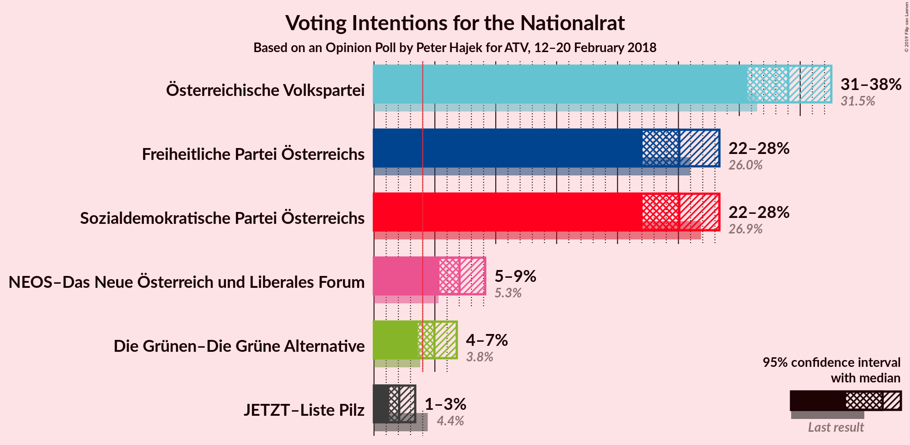

### Confidence Intervals

| Party | Last Result | Poll Result | 80% Confidence Interval | 90% Confidence Interval | 95% Confidence Interval | 99% Confidence Interval |
|:-----:|:-----------:|:-----------:|:-----------------------:|:-----------------------:|:-----------------------:|:-----------------------:|
| Österreichische Volkspartei | 31.5% | 34.0% | 31.8–36.3% |31.2–37.0% |30.7–37.6% |29.6–38.7% |
| Sozialdemokratische Partei Österreichs | 26.9% | 25.1% | 23.1–27.2% |22.5–27.8% |22.1–28.4% |21.1–29.4% |
| Freiheitliche Partei Österreichs | 26.0% | 25.1% | 23.1–27.2% |22.5–27.8% |22.1–28.4% |21.1–29.4% |
| NEOS–Das Neue Österreich und Liberales Forum | 5.3% | 7.0% | 5.9–8.4% |5.6–8.8% |5.4–9.1% |4.9–9.8% |
| Die Grünen–Die Grüne Alternative | 3.8% | 5.0% | 4.1–6.2% |3.8–6.5% |3.6–6.8% |3.2–7.4% |
| JETZT–Liste Pilz | 4.4% | 2.1% | 1.5–2.9% |1.4–3.2% |1.2–3.4% |1.0–3.8% |

*Note:* The poll result column reflects the actual value used in the calculations. Published results may vary slightly, and in addition be rounded to fewer digits.

## Seats

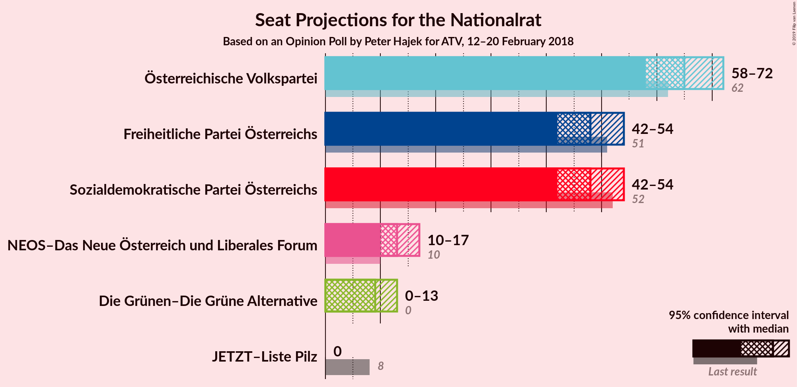

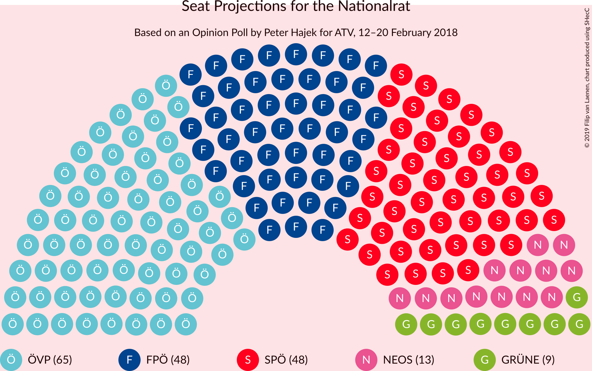

### Confidence Intervals

| Party | Last Result | Median | 80% Confidence Interval | 90% Confidence Interval | 95% Confidence Interval | 99% Confidence Interval |
|:-----:|:-----------:|:------:|:-----------------------:|:-----------------------:|:-----------------------:|:-----------------------:|
| <a href="#österreichische-volkspartei">Österreichische Volkspartei</a> | 62 | 65 | 61–70 |60–71 |58–72 |56–75 |
| <a href="#sozialdemokratische-partei-österreichs">Sozialdemokratische Partei Österreichs</a> | 52 | 48 | 44–52 |43–53 |42–54 |40–56 |
| <a href="#freiheitliche-partei-österreichs">Freiheitliche Partei Österreichs</a> | 51 | 48 | 44–52 |43–53 |42–54 |40–56 |
| <a href="#neos–das-neue-österreich-und-liberales-forum">NEOS–Das Neue Österreich und Liberales Forum</a> | 10 | 13 | 11–16 |10–16 |10–17 |9–18 |
| <a href="#die-grünen–die-grüne-alternative">Die Grünen–Die Grüne Alternative</a> | 0 | 9 | 7–11 |0–12 |0–13 |0–14 |
| <a href="#jetzt–liste-pilz">JETZT–Liste Pilz</a> | 8 | 0 | 0 |0 |0 |0 |

### Österreichische Volkspartei

*For a full overview of the results for this party, see the [Österreichische Volkspartei](party-österreichischevolkspartei.html) page.*

| Number of Seats | Probability | Accumulated | Special Marks |
|:---------------:|:-----------:|:-----------:|:-------------:|
| 54 | 0% | 100% |  |
| 55 | 0.1% | 99.9% |  |
| 56 | 0.5% | 99.8% |  |
| 57 | 0.8% | 99.4% |  |
| 58 | 1.3% | 98.5% |  |
| 59 | 2% | 97% |  |
| 60 | 3% | 95% |  |
| 61 | 5% | 93% |  |
| 62 | 5% | 88% | Last Result |
| 63 | 10% | 83% |  |
| 64 | 18% | 72% |  |
| 65 | 12% | 54% | Median |
| 66 | 10% | 42% |  |
| 67 | 6% | 33% |  |
| 68 | 7% | 27% |  |
| 69 | 7% | 20% |  |
| 70 | 7% | 13% |  |
| 71 | 2% | 6% |  |
| 72 | 2% | 4% |  |
| 73 | 0.7% | 2% |  |
| 74 | 0.3% | 0.8% |  |
| 75 | 0.2% | 0.5% |  |
| 76 | 0.2% | 0.3% |  |
| 77 | 0.1% | 0.1% |  |
| 78 | 0% | 0% |  |

### Sozialdemokratische Partei Österreichs

*For a full overview of the results for this party, see the [Sozialdemokratische Partei Österreichs](party-sozialdemokratischeparteiösterreichs.html) page.*

| Number of Seats | Probability | Accumulated | Special Marks |
|:---------------:|:-----------:|:-----------:|:-------------:|
| 38 | 0% | 100% |  |
| 39 | 0.2% | 99.9% |  |
| 40 | 0.4% | 99.8% |  |
| 41 | 1.0% | 99.4% |  |
| 42 | 2% | 98% |  |
| 43 | 4% | 96% |  |
| 44 | 6% | 92% |  |
| 45 | 9% | 86% |  |
| 46 | 10% | 77% |  |
| 47 | 11% | 67% |  |
| 48 | 15% | 56% | Median |
| 49 | 13% | 41% |  |
| 50 | 9% | 28% |  |
| 51 | 8% | 20% |  |
| 52 | 5% | 12% | Last Result |
| 53 | 3% | 8% |  |
| 54 | 2% | 4% |  |
| 55 | 1.1% | 2% |  |
| 56 | 0.6% | 1.1% |  |
| 57 | 0.3% | 0.5% |  |
| 58 | 0.1% | 0.2% |  |
| 59 | 0% | 0.1% |  |
| 60 | 0% | 0% |  |

### Freiheitliche Partei Österreichs

*For a full overview of the results for this party, see the [Freiheitliche Partei Österreichs](party-freiheitlicheparteiösterreichs.html) page.*

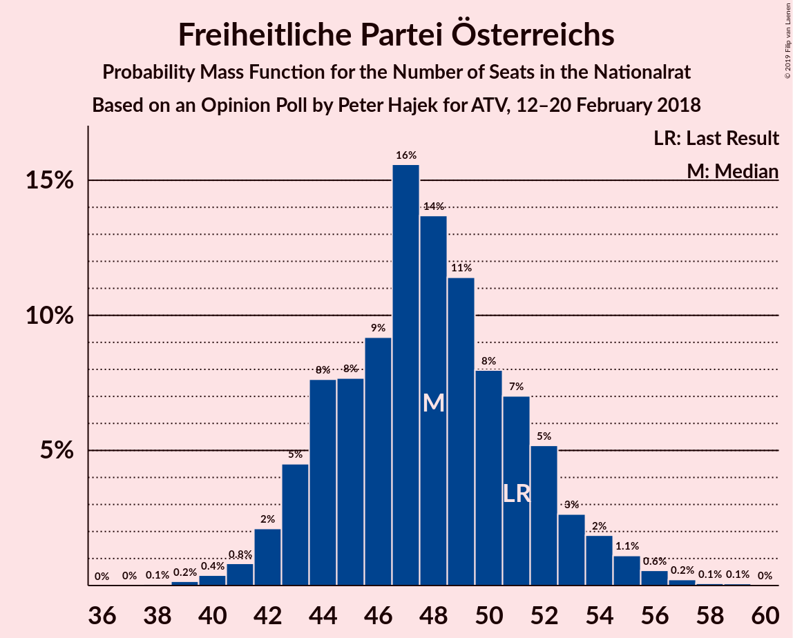

| Number of Seats | Probability | Accumulated | Special Marks |
|:---------------:|:-----------:|:-----------:|:-------------:|
| 38 | 0.1% | 100% |  |
| 39 | 0.2% | 99.9% |  |
| 40 | 0.4% | 99.8% |  |
| 41 | 0.8% | 99.4% |  |
| 42 | 2% | 98.6% |  |
| 43 | 5% | 96% |  |
| 44 | 8% | 92% |  |
| 45 | 8% | 84% |  |
| 46 | 9% | 77% |  |
| 47 | 16% | 67% |  |
| 48 | 14% | 52% | Median |
| 49 | 11% | 38% |  |
| 50 | 8% | 27% |  |
| 51 | 7% | 19% | Last Result |
| 52 | 5% | 12% |  |
| 53 | 3% | 7% |  |
| 54 | 2% | 4% |  |
| 55 | 1.1% | 2% |  |
| 56 | 0.6% | 1.0% |  |
| 57 | 0.2% | 0.4% |  |
| 58 | 0.1% | 0.2% |  |
| 59 | 0.1% | 0.1% |  |
| 60 | 0% | 0% |  |

### NEOS–Das Neue Österreich und Liberales Forum

*For a full overview of the results for this party, see the [NEOS–Das Neue Österreich und Liberales Forum](party-neos–dasneueösterreichundliberalesforum.html) page.*

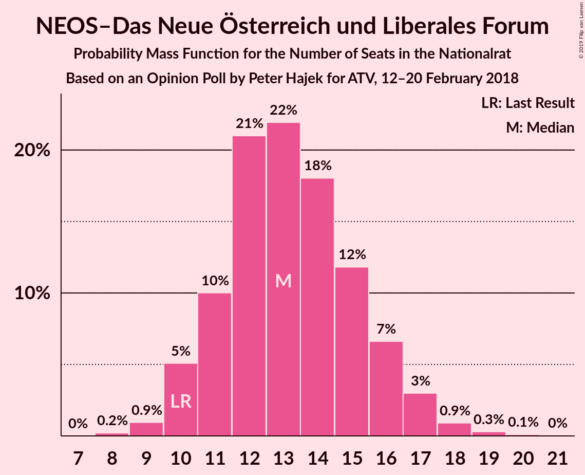

| Number of Seats | Probability | Accumulated | Special Marks |
|:---------------:|:-----------:|:-----------:|:-------------:|
| 8 | 0.2% | 100% |  |
| 9 | 0.9% | 99.8% |  |
| 10 | 5% | 98.8% | Last Result |
| 11 | 10% | 94% |  |
| 12 | 21% | 84% |  |
| 13 | 22% | 63% | Median |
| 14 | 18% | 41% |  |
| 15 | 12% | 23% |  |
| 16 | 7% | 11% |  |
| 17 | 3% | 4% |  |
| 18 | 0.9% | 1.3% |  |
| 19 | 0.3% | 0.4% |  |
| 20 | 0.1% | 0.1% |  |
| 21 | 0% | 0% |  |

### Die Grünen–Die Grüne Alternative

*For a full overview of the results for this party, see the [Die Grünen–Die Grüne Alternative](party-diegrünen–diegrünealternative.html) page.*

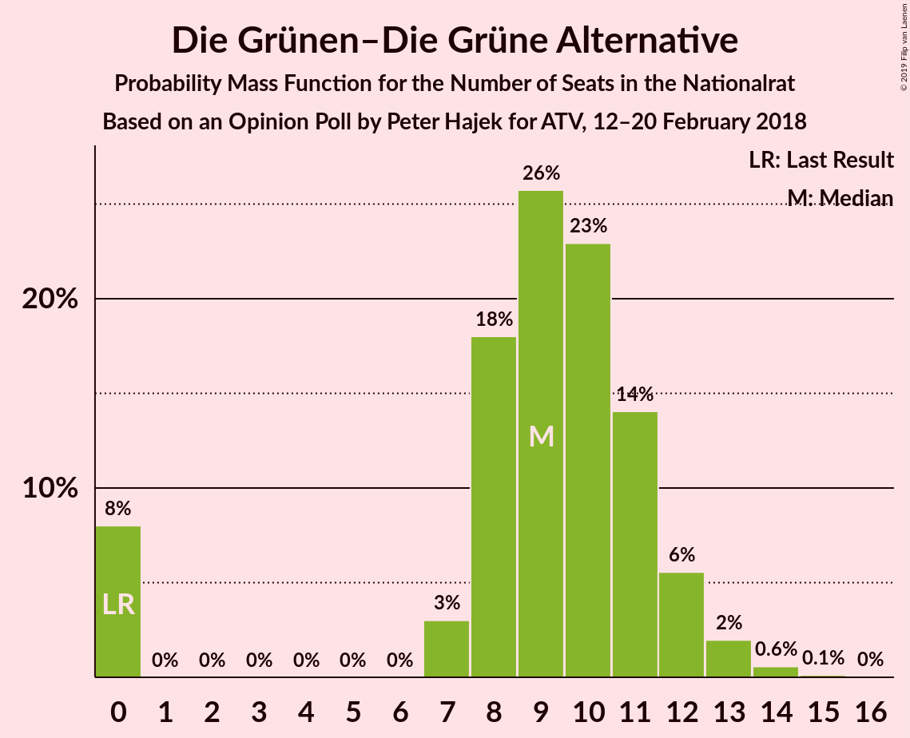

| Number of Seats | Probability | Accumulated | Special Marks |
|:---------------:|:-----------:|:-----------:|:-------------:|
| 0 | 8% | 100% | Last Result |
| 1 | 0% | 92% |  |
| 2 | 0% | 92% |  |
| 3 | 0% | 92% |  |
| 4 | 0% | 92% |  |
| 5 | 0% | 92% |  |
| 6 | 0% | 92% |  |
| 7 | 3% | 92% |  |
| 8 | 18% | 89% |  |
| 9 | 26% | 71% | Median |
| 10 | 23% | 45% |  |
| 11 | 14% | 22% |  |
| 12 | 6% | 8% |  |
| 13 | 2% | 3% |  |
| 14 | 0.6% | 0.7% |  |
| 15 | 0.1% | 0.1% |  |
| 16 | 0% | 0% |  |

### JETZT–Liste Pilz

*For a full overview of the results for this party, see the [JETZT–Liste Pilz](party-jetzt–listepilz.html) page.*

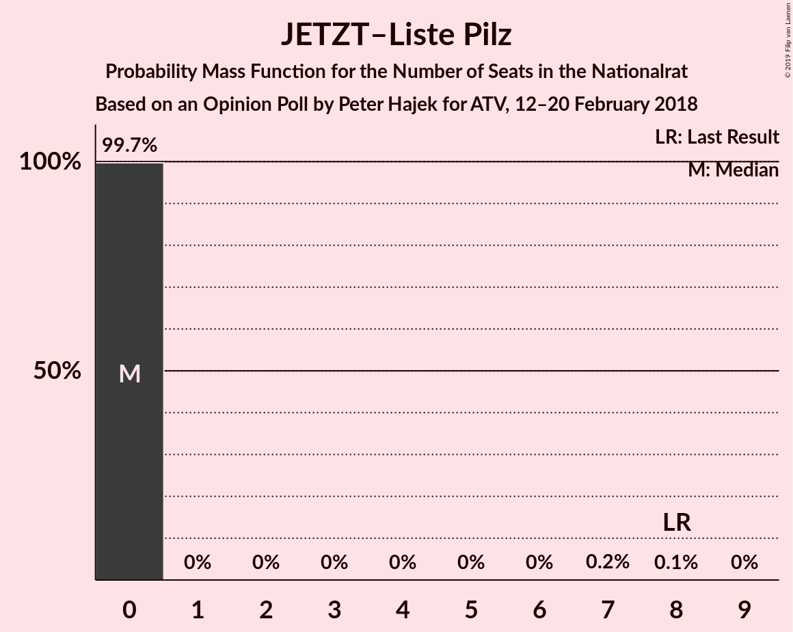

| Number of Seats | Probability | Accumulated | Special Marks |
|:---------------:|:-----------:|:-----------:|:-------------:|
| 0 | 99.7% | 100% | Median |
| 1 | 0% | 0.3% |  |
| 2 | 0% | 0.3% |  |
| 3 | 0% | 0.3% |  |
| 4 | 0% | 0.3% |  |
| 5 | 0% | 0.3% |  |
| 6 | 0% | 0.3% |  |
| 7 | 0.2% | 0.3% |  |
| 8 | 0.1% | 0.1% | Last Result |
| 9 | 0% | 0% |  |

## Coalitions

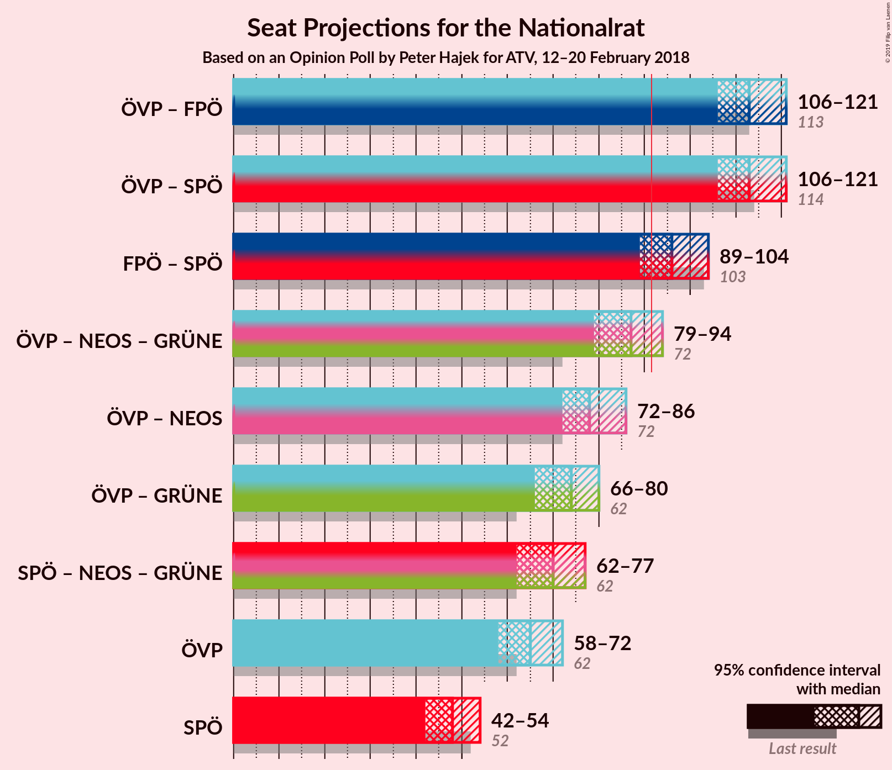

### Confidence Intervals

| Coalition | Last Result | Median | Majority? | 80% Confidence Interval | 90% Confidence Interval | 95% Confidence Interval | 99% Confidence Interval |
|:---------:|:-----------:|:------:|:---------:|:-----------------------:|:-----------------------:|:-----------------------:|:-----------------------:|
| Österreichische Volkspartei – Freiheitliche Partei Österreichs | 113 | 113 | 100% | 109–118 | 107–120 | 106–121 | 104–125 |
| Österreichische Volkspartei – Sozialdemokratische Partei Österreichs | 114 | 113 | 100% | 108–118 | 107–120 | 106–121 | 104–124 |
| Freiheitliche Partei Österreichs – Sozialdemokratische Partei Österreichs | 103 | 96 | 88% | 91–101 | 90–102 | 89–104 | 87–107 |
| Österreichische Volkspartei – NEOS–Das Neue Österreich und Liberales Forum – Die Grünen–Die Grüne Alternative | 72 | 87 | 12% | 82–92 | 81–93 | 79–94 | 76–96 |
| Österreichische Volkspartei – NEOS–Das Neue Österreich und Liberales Forum | 72 | 78 | 0.1% | 74–83 | 73–85 | 72–86 | 69–88 |
| Österreichische Volkspartei – Die Grünen–Die Grüne Alternative | 62 | 74 | 0% | 69–79 | 68–80 | 66–80 | 63–83 |
| Sozialdemokratische Partei Österreichs – NEOS–Das Neue Österreich und Liberales Forum – Die Grünen–Die Grüne Alternative | 62 | 70 | 0% | 65–74 | 63–76 | 62–77 | 58–79 |
| Österreichische Volkspartei | 62 | 65 | 0% | 61–70 | 60–71 | 58–72 | 56–75 |
| Sozialdemokratische Partei Österreichs | 52 | 48 | 0% | 44–52 | 43–53 | 42–54 | 40–56 |

### Österreichische Volkspartei – Freiheitliche Partei Österreichs

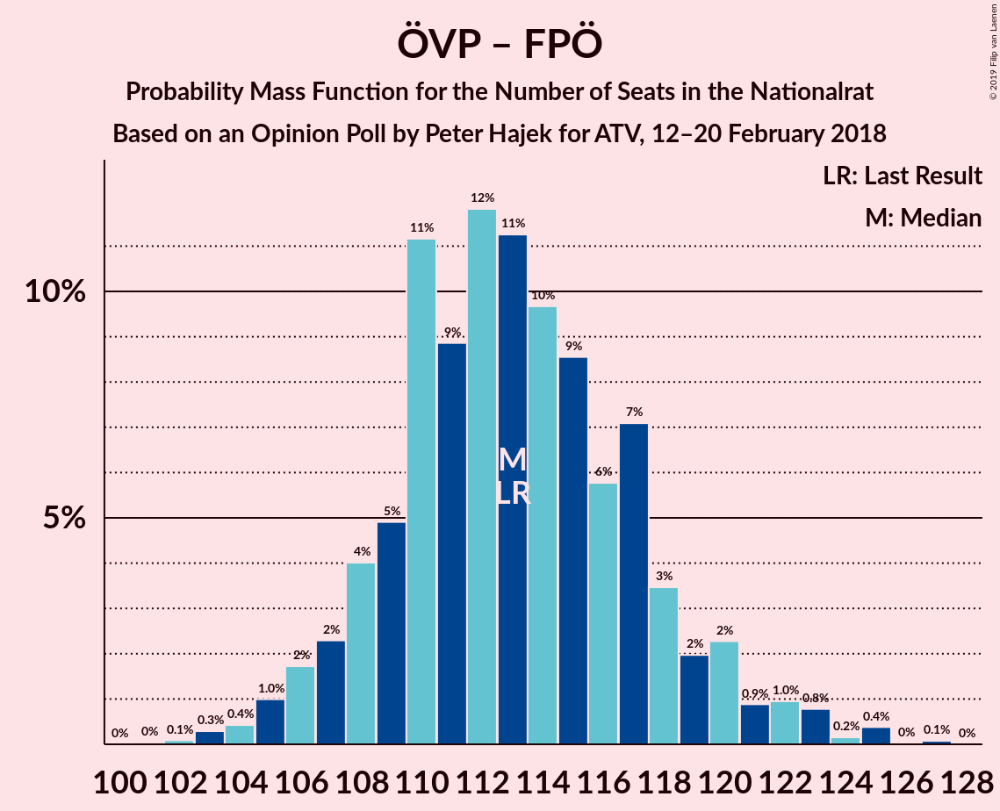

| Number of Seats | Probability | Accumulated | Special Marks |
|:---------------:|:-----------:|:-----------:|:-------------:|
| 101 | 0% | 100% |  |
| 102 | 0.1% | 99.9% |  |
| 103 | 0.3% | 99.9% |  |
| 104 | 0.4% | 99.6% |  |
| 105 | 1.0% | 99.1% |  |
| 106 | 2% | 98% |  |
| 107 | 2% | 96% |  |
| 108 | 4% | 94% |  |
| 109 | 5% | 90% |  |
| 110 | 11% | 85% |  |
| 111 | 9% | 74% |  |
| 112 | 12% | 65% |  |
| 113 | 11% | 53% | Last Result, Median |
| 114 | 10% | 42% |  |
| 115 | 9% | 32% |  |
| 116 | 6% | 24% |  |
| 117 | 7% | 18% |  |
| 118 | 3% | 11% |  |
| 119 | 2% | 8% |  |
| 120 | 2% | 6% |  |
| 121 | 0.9% | 3% |  |
| 122 | 1.0% | 2% |  |
| 123 | 0.8% | 1.4% |  |
| 124 | 0.2% | 0.7% |  |
| 125 | 0.4% | 0.5% |  |
| 126 | 0% | 0.1% |  |
| 127 | 0.1% | 0.1% |  |
| 128 | 0% | 0% |  |

### Österreichische Volkspartei – Sozialdemokratische Partei Österreichs

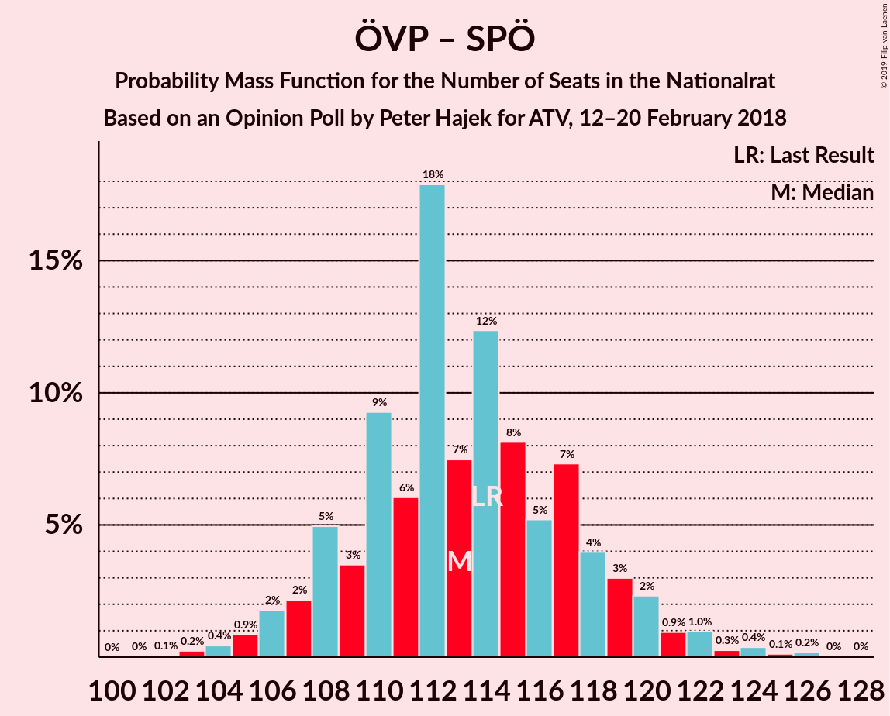

| Number of Seats | Probability | Accumulated | Special Marks |
|:---------------:|:-----------:|:-----------:|:-------------:|
| 101 | 0% | 100% |  |
| 102 | 0.1% | 99.9% |  |
| 103 | 0.2% | 99.9% |  |
| 104 | 0.4% | 99.6% |  |
| 105 | 0.9% | 99.2% |  |
| 106 | 2% | 98% |  |
| 107 | 2% | 97% |  |
| 108 | 5% | 94% |  |
| 109 | 3% | 89% |  |
| 110 | 9% | 86% |  |
| 111 | 6% | 77% |  |
| 112 | 18% | 71% |  |
| 113 | 7% | 53% | Median |
| 114 | 12% | 45% | Last Result |
| 115 | 8% | 33% |  |
| 116 | 5% | 25% |  |
| 117 | 7% | 20% |  |
| 118 | 4% | 12% |  |
| 119 | 3% | 8% |  |
| 120 | 2% | 5% |  |
| 121 | 0.9% | 3% |  |
| 122 | 1.0% | 2% |  |
| 123 | 0.3% | 1.0% |  |
| 124 | 0.4% | 0.8% |  |
| 125 | 0.1% | 0.4% |  |
| 126 | 0.2% | 0.3% |  |
| 127 | 0% | 0.1% |  |
| 128 | 0% | 0% |  |

### Freiheitliche Partei Österreichs – Sozialdemokratische Partei Österreichs

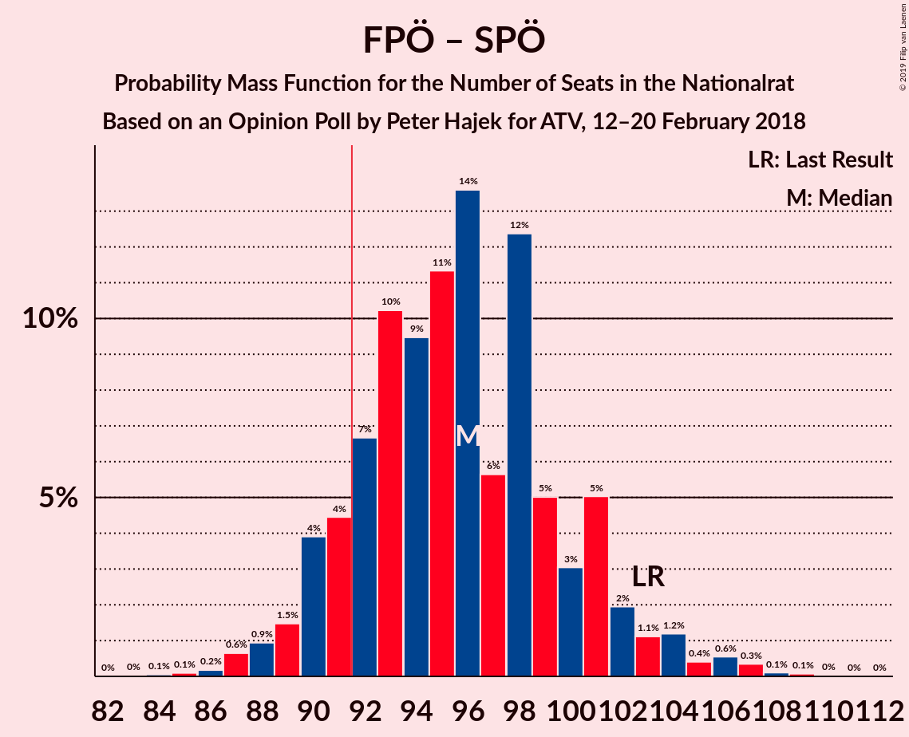

| Number of Seats | Probability | Accumulated | Special Marks |
|:---------------:|:-----------:|:-----------:|:-------------:|
| 84 | 0.1% | 100% |  |
| 85 | 0.1% | 99.9% |  |
| 86 | 0.2% | 99.8% |  |
| 87 | 0.6% | 99.6% |  |
| 88 | 0.9% | 99.0% |  |
| 89 | 1.5% | 98% |  |
| 90 | 4% | 97% |  |
| 91 | 4% | 93% |  |
| 92 | 7% | 88% | Majority |
| 93 | 10% | 82% |  |
| 94 | 9% | 71% |  |
| 95 | 11% | 62% |  |
| 96 | 14% | 51% | Median |
| 97 | 6% | 37% |  |
| 98 | 12% | 31% |  |
| 99 | 5% | 19% |  |
| 100 | 3% | 14% |  |
| 101 | 5% | 11% |  |
| 102 | 2% | 6% |  |
| 103 | 1.1% | 4% | Last Result |
| 104 | 1.2% | 3% |  |
| 105 | 0.4% | 2% |  |
| 106 | 0.6% | 1.1% |  |
| 107 | 0.3% | 0.6% |  |
| 108 | 0.1% | 0.2% |  |
| 109 | 0.1% | 0.1% |  |
| 110 | 0% | 0.1% |  |
| 111 | 0% | 0% |  |

### Österreichische Volkspartei – NEOS–Das Neue Österreich und Liberales Forum – Die Grünen–Die Grüne Alternative

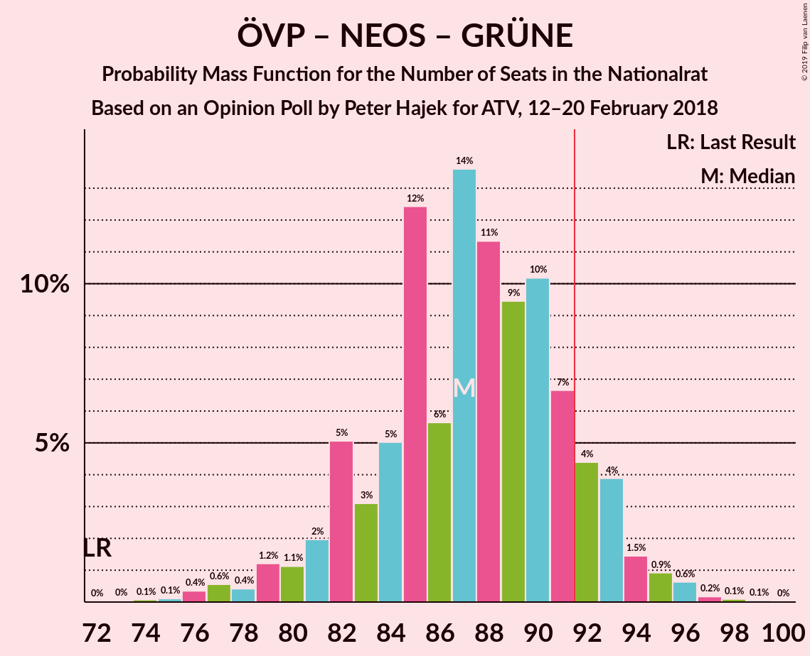

| Number of Seats | Probability | Accumulated | Special Marks |
|:---------------:|:-----------:|:-----------:|:-------------:|
| 72 | 0% | 100% | Last Result |
| 73 | 0% | 100% |  |
| 74 | 0.1% | 99.9% |  |
| 75 | 0.1% | 99.9% |  |
| 76 | 0.4% | 99.8% |  |
| 77 | 0.6% | 99.4% |  |
| 78 | 0.4% | 98.8% |  |
| 79 | 1.2% | 98% |  |
| 80 | 1.1% | 97% |  |
| 81 | 2% | 96% |  |
| 82 | 5% | 94% |  |
| 83 | 3% | 89% |  |
| 84 | 5% | 86% |  |
| 85 | 12% | 81% |  |
| 86 | 6% | 69% |  |
| 87 | 14% | 63% | Median |
| 88 | 11% | 49% |  |
| 89 | 9% | 38% |  |
| 90 | 10% | 28% |  |
| 91 | 7% | 18% |  |
| 92 | 4% | 12% | Majority |
| 93 | 4% | 7% |  |
| 94 | 1.5% | 3% |  |
| 95 | 0.9% | 2% |  |
| 96 | 0.6% | 1.0% |  |
| 97 | 0.2% | 0.3% |  |
| 98 | 0.1% | 0.2% |  |
| 99 | 0.1% | 0.1% |  |
| 100 | 0% | 0% |  |

### Österreichische Volkspartei – NEOS–Das Neue Österreich und Liberales Forum

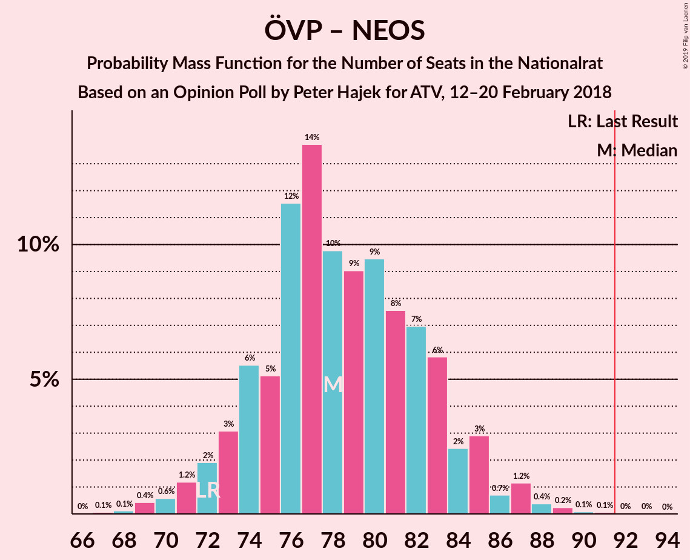

| Number of Seats | Probability | Accumulated | Special Marks |
|:---------------:|:-----------:|:-----------:|:-------------:|
| 67 | 0.1% | 100% |  |
| 68 | 0.1% | 99.9% |  |
| 69 | 0.4% | 99.8% |  |
| 70 | 0.6% | 99.3% |  |
| 71 | 1.2% | 98.8% |  |
| 72 | 2% | 98% | Last Result |
| 73 | 3% | 96% |  |
| 74 | 6% | 93% |  |
| 75 | 5% | 87% |  |
| 76 | 12% | 82% |  |
| 77 | 14% | 70% |  |
| 78 | 10% | 57% | Median |
| 79 | 9% | 47% |  |
| 80 | 9% | 38% |  |
| 81 | 8% | 28% |  |
| 82 | 7% | 21% |  |
| 83 | 6% | 14% |  |
| 84 | 2% | 8% |  |
| 85 | 3% | 6% |  |
| 86 | 0.7% | 3% |  |
| 87 | 1.2% | 2% |  |
| 88 | 0.4% | 0.8% |  |
| 89 | 0.2% | 0.4% |  |
| 90 | 0.1% | 0.2% |  |
| 91 | 0.1% | 0.1% |  |
| 92 | 0% | 0.1% | Majority |
| 93 | 0% | 0% |  |

### Österreichische Volkspartei – Die Grünen–Die Grüne Alternative

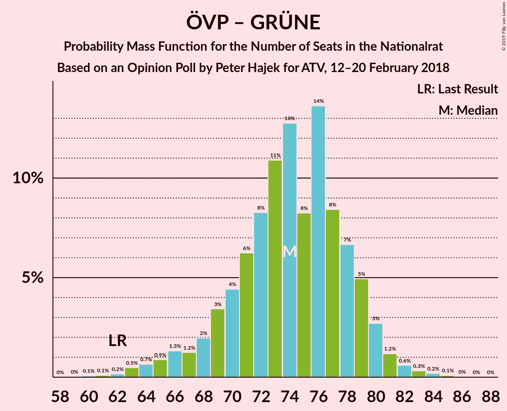

| Number of Seats | Probability | Accumulated | Special Marks |
|:---------------:|:-----------:|:-----------:|:-------------:|
| 59 | 0% | 100% |  |
| 60 | 0.1% | 99.9% |  |
| 61 | 0.1% | 99.9% |  |
| 62 | 0.2% | 99.8% | Last Result |
| 63 | 0.5% | 99.6% |  |
| 64 | 0.7% | 99.1% |  |
| 65 | 0.9% | 98% |  |
| 66 | 1.3% | 98% |  |
| 67 | 1.2% | 96% |  |
| 68 | 2% | 95% |  |
| 69 | 3% | 93% |  |
| 70 | 4% | 90% |  |
| 71 | 6% | 85% |  |
| 72 | 8% | 79% |  |
| 73 | 11% | 71% |  |
| 74 | 13% | 60% | Median |
| 75 | 8% | 47% |  |
| 76 | 14% | 39% |  |
| 77 | 8% | 25% |  |
| 78 | 7% | 17% |  |
| 79 | 5% | 10% |  |
| 80 | 3% | 5% |  |
| 81 | 1.2% | 2% |  |
| 82 | 0.6% | 1.3% |  |
| 83 | 0.3% | 0.7% |  |
| 84 | 0.2% | 0.3% |  |
| 85 | 0.1% | 0.2% |  |
| 86 | 0% | 0.1% |  |
| 87 | 0% | 0% |  |

### Sozialdemokratische Partei Österreichs – NEOS–Das Neue Österreich und Liberales Forum – Die Grünen–Die Grüne Alternative

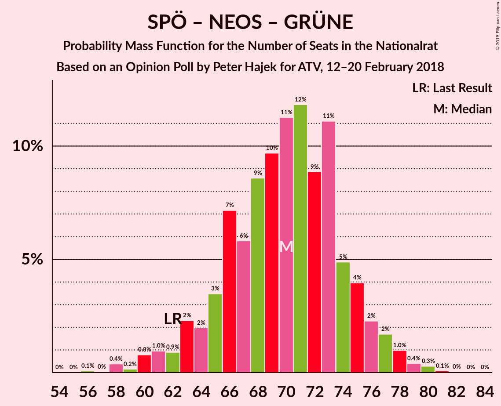

| Number of Seats | Probability | Accumulated | Special Marks |
|:---------------:|:-----------:|:-----------:|:-------------:|
| 56 | 0.1% | 100% |  |
| 57 | 0% | 99.9% |  |
| 58 | 0.4% | 99.9% |  |
| 59 | 0.2% | 99.5% |  |
| 60 | 0.8% | 99.3% |  |
| 61 | 1.0% | 98.5% |  |
| 62 | 0.9% | 98% | Last Result |
| 63 | 2% | 97% |  |
| 64 | 2% | 94% |  |
| 65 | 3% | 92% |  |
| 66 | 7% | 89% |  |
| 67 | 6% | 82% |  |
| 68 | 9% | 76% |  |
| 69 | 10% | 67% |  |
| 70 | 11% | 58% | Median |
| 71 | 12% | 46% |  |
| 72 | 9% | 35% |  |
| 73 | 11% | 26% |  |
| 74 | 5% | 15% |  |
| 75 | 4% | 10% |  |
| 76 | 2% | 6% |  |
| 77 | 2% | 3% |  |
| 78 | 1.0% | 2% |  |
| 79 | 0.4% | 0.8% |  |
| 80 | 0.3% | 0.4% |  |
| 81 | 0.1% | 0.1% |  |
| 82 | 0% | 0.1% |  |
| 83 | 0% | 0% |  |

### Österreichische Volkspartei

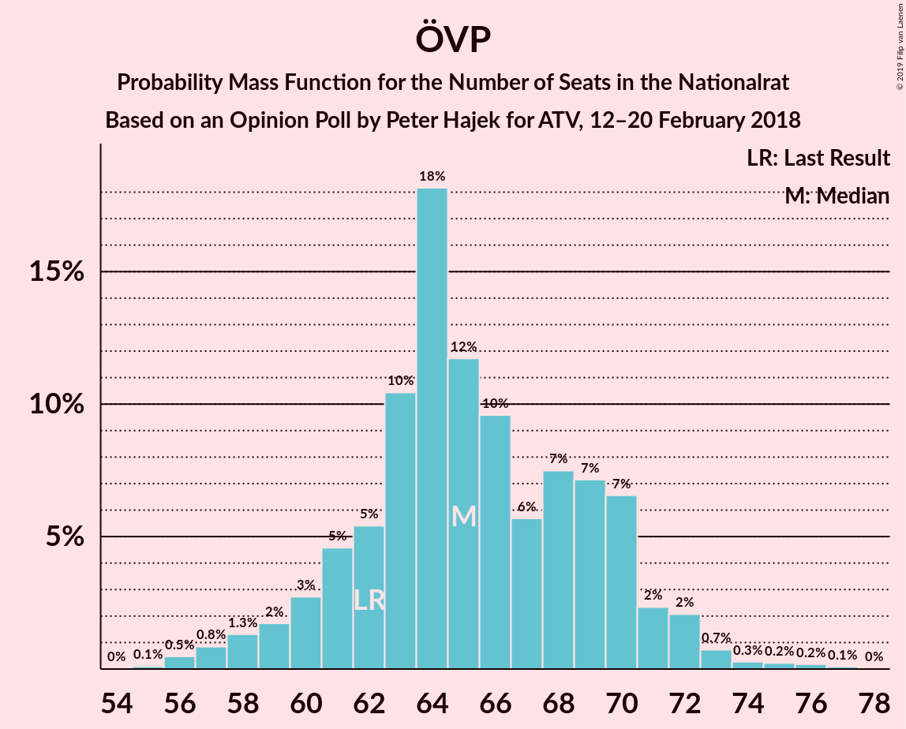

| Number of Seats | Probability | Accumulated | Special Marks |
|:---------------:|:-----------:|:-----------:|:-------------:|
| 54 | 0% | 100% |  |
| 55 | 0.1% | 99.9% |  |
| 56 | 0.5% | 99.8% |  |
| 57 | 0.8% | 99.4% |  |
| 58 | 1.3% | 98.5% |  |
| 59 | 2% | 97% |  |
| 60 | 3% | 95% |  |
| 61 | 5% | 93% |  |
| 62 | 5% | 88% | Last Result |
| 63 | 10% | 83% |  |
| 64 | 18% | 72% |  |
| 65 | 12% | 54% | Median |
| 66 | 10% | 42% |  |
| 67 | 6% | 33% |  |
| 68 | 7% | 27% |  |
| 69 | 7% | 20% |  |
| 70 | 7% | 13% |  |
| 71 | 2% | 6% |  |
| 72 | 2% | 4% |  |
| 73 | 0.7% | 2% |  |
| 74 | 0.3% | 0.8% |  |
| 75 | 0.2% | 0.5% |  |
| 76 | 0.2% | 0.3% |  |
| 77 | 0.1% | 0.1% |  |
| 78 | 0% | 0% |  |

### Sozialdemokratische Partei Österreichs

| Number of Seats | Probability | Accumulated | Special Marks |
|:---------------:|:-----------:|:-----------:|:-------------:|
| 38 | 0% | 100% |  |
| 39 | 0.2% | 99.9% |  |
| 40 | 0.4% | 99.8% |  |
| 41 | 1.0% | 99.4% |  |
| 42 | 2% | 98% |  |
| 43 | 4% | 96% |  |
| 44 | 6% | 92% |  |
| 45 | 9% | 86% |  |
| 46 | 10% | 77% |  |
| 47 | 11% | 67% |  |
| 48 | 15% | 56% | Median |
| 49 | 13% | 41% |  |
| 50 | 9% | 28% |  |
| 51 | 8% | 20% |  |
| 52 | 5% | 12% | Last Result |
| 53 | 3% | 8% |  |
| 54 | 2% | 4% |  |
| 55 | 1.1% | 2% |  |
| 56 | 0.6% | 1.1% |  |
| 57 | 0.3% | 0.5% |  |
| 58 | 0.1% | 0.2% |  |
| 59 | 0% | 0.1% |  |
| 60 | 0% | 0% |  |

## Technical Information

### Opinion Poll

+ **Polling firm:** Peter Hajek
+ **Commissioner(s):** ATV
+ **Fieldwork period:** 12–20 February 2018

### Calculations

+ **Sample size:** 726
+ **Simulations done:** 131,072
+ **Error estimate:** 1.51%

