# Opinion Poll by Research Affairs for ÖSTERREICH, 15–21 February 2018

<a href="#voting-intentions">Voting Intentions</a> | <a href="#seats">Seats</a> | <a href="#coalitions">Coalitions</a> | <a href="#technical-information">Technical Information</a>

## Voting Intentions

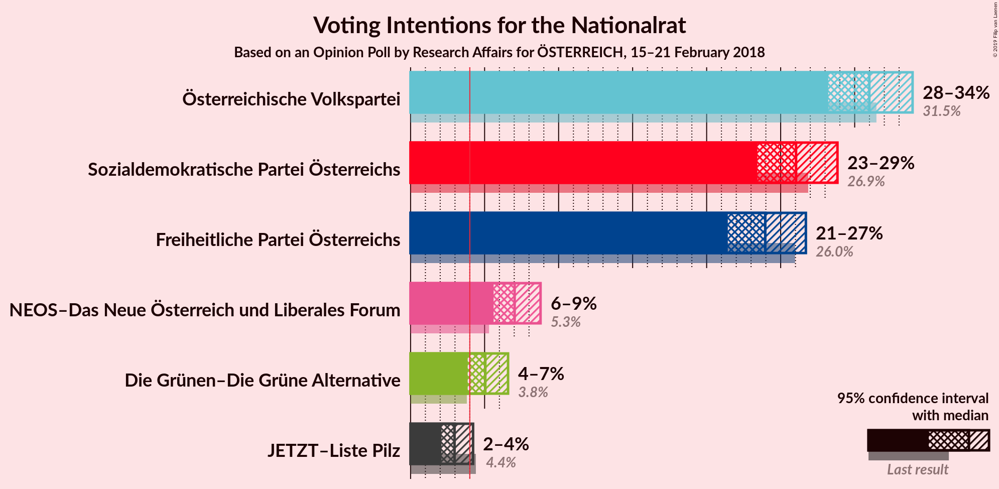

### Confidence Intervals

| Party | Last Result | Poll Result | 80% Confidence Interval | 90% Confidence Interval | 95% Confidence Interval | 99% Confidence Interval |
|:-----:|:-----------:|:-----------:|:-----------------------:|:-----------------------:|:-----------------------:|:-----------------------:|
| Österreichische Volkspartei | 31.5% | 31.0% | 29.2–32.9% |28.7–33.4% |28.2–33.9% |27.3–34.8% |
| Sozialdemokratische Partei Österreichs | 26.9% | 26.0% | 24.3–27.9% |23.8–28.4% |23.4–28.8% |22.6–29.7% |
| Freiheitliche Partei Österreichs | 26.0% | 24.0% | 22.3–25.7% |21.8–26.3% |21.4–26.7% |20.7–27.6% |
| NEOS–Das Neue Österreich und Liberales Forum | 5.3% | 7.0% | 6.1–8.2% |5.8–8.5% |5.6–8.8% |5.2–9.4% |
| Die Grünen–Die Grüne Alternative | 3.8% | 5.0% | 4.3–6.1% |4.0–6.3% |3.9–6.6% |3.5–7.1% |
| JETZT–Liste Pilz | 4.4% | 3.0% | 2.4–3.8% |2.2–4.0% |2.1–4.2% |1.8–4.6% |

*Note:* The poll result column reflects the actual value used in the calculations. Published results may vary slightly, and in addition be rounded to fewer digits.

## Seats

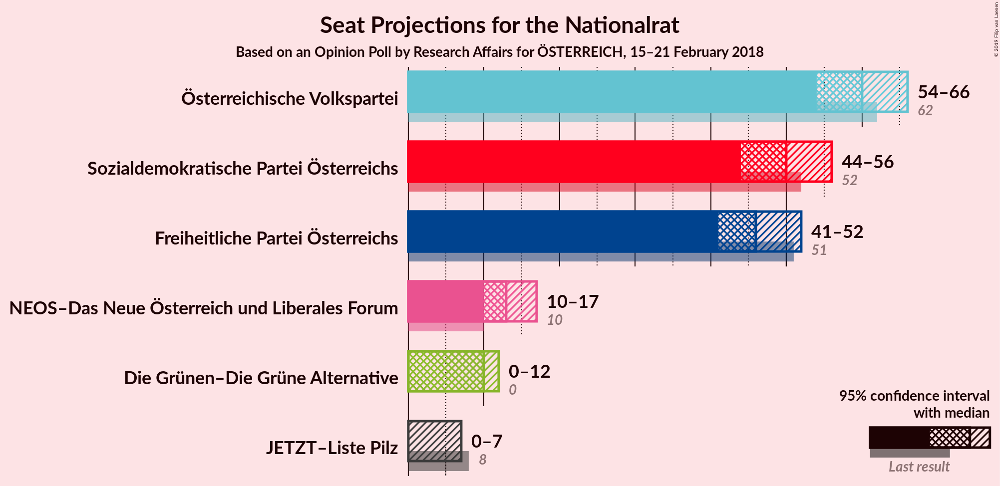

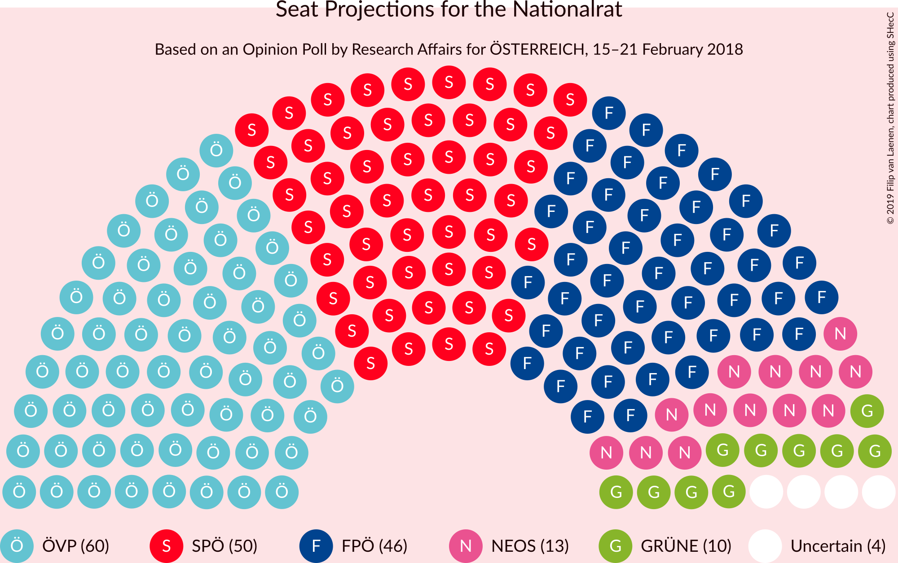

### Confidence Intervals

| Party | Last Result | Median | 80% Confidence Interval | 90% Confidence Interval | 95% Confidence Interval | 99% Confidence Interval |
|:-----:|:-----------:|:------:|:-----------------------:|:-----------------------:|:-----------------------:|:-----------------------:|
| <a href="#österreichische-volkspartei">Österreichische Volkspartei</a> | 62 | 60 | 56–64 |54–65 |54–66 |52–68 |
| <a href="#sozialdemokratische-partei-österreichs">Sozialdemokratische Partei Österreichs</a> | 52 | 50 | 46–54 |45–55 |44–56 |43–58 |
| <a href="#freiheitliche-partei-österreichs">Freiheitliche Partei Österreichs</a> | 51 | 46 | 42–50 |41–51 |41–52 |39–53 |
| <a href="#neos–das-neue-österreich-und-liberales-forum">NEOS–Das Neue Österreich und Liberales Forum</a> | 10 | 13 | 11–15 |11–16 |10–17 |10–18 |
| <a href="#die-grünen–die-grüne-alternative">Die Grünen–Die Grüne Alternative</a> | 0 | 10 | 8–11 |7–12 |0–12 |0–13 |
| <a href="#jetzt–liste-pilz">JETZT–Liste Pilz</a> | 8 | 0 | 0 |0 |0–7 |0–8 |

### Österreichische Volkspartei

*For a full overview of the results for this party, see the [Österreichische Volkspartei](party-österreichischevolkspartei.html) page.*

| Number of Seats | Probability | Accumulated | Special Marks |
|:---------------:|:-----------:|:-----------:|:-------------:|
| 50 | 0.1% | 100% |  |
| 51 | 0.3% | 99.9% |  |
| 52 | 0.4% | 99.6% |  |
| 53 | 1.4% | 99.2% |  |
| 54 | 3% | 98% |  |
| 55 | 4% | 95% |  |
| 56 | 5% | 91% |  |
| 57 | 9% | 86% |  |
| 58 | 13% | 76% |  |
| 59 | 11% | 64% |  |
| 60 | 11% | 53% | Median |
| 61 | 13% | 41% |  |
| 62 | 9% | 28% | Last Result |
| 63 | 6% | 19% |  |
| 64 | 6% | 13% |  |
| 65 | 3% | 7% |  |
| 66 | 2% | 4% |  |
| 67 | 1.2% | 2% |  |
| 68 | 0.4% | 0.8% |  |
| 69 | 0.2% | 0.4% |  |
| 70 | 0.2% | 0.2% |  |
| 71 | 0% | 0.1% |  |
| 72 | 0% | 0% |  |

### Sozialdemokratische Partei Österreichs

*For a full overview of the results for this party, see the [Sozialdemokratische Partei Österreichs](party-sozialdemokratischeparteiösterreichs.html) page.*

| Number of Seats | Probability | Accumulated | Special Marks |
|:---------------:|:-----------:|:-----------:|:-------------:|
| 41 | 0.1% | 100% |  |
| 42 | 0.4% | 99.9% |  |
| 43 | 0.6% | 99.6% |  |
| 44 | 2% | 99.0% |  |
| 45 | 3% | 97% |  |
| 46 | 6% | 94% |  |
| 47 | 7% | 89% |  |
| 48 | 13% | 82% |  |
| 49 | 12% | 69% |  |
| 50 | 10% | 58% | Median |
| 51 | 16% | 48% |  |
| 52 | 11% | 32% | Last Result |
| 53 | 8% | 21% |  |
| 54 | 6% | 13% |  |
| 55 | 4% | 7% |  |
| 56 | 2% | 4% |  |
| 57 | 1.1% | 2% |  |
| 58 | 0.5% | 0.8% |  |
| 59 | 0.2% | 0.4% |  |
| 60 | 0.1% | 0.1% |  |
| 61 | 0% | 0% |  |

### Freiheitliche Partei Österreichs

*For a full overview of the results for this party, see the [Freiheitliche Partei Österreichs](party-freiheitlicheparteiösterreichs.html) page.*

| Number of Seats | Probability | Accumulated | Special Marks |
|:---------------:|:-----------:|:-----------:|:-------------:|
| 37 | 0% | 100% |  |
| 38 | 0.2% | 99.9% |  |
| 39 | 0.6% | 99.8% |  |
| 40 | 2% | 99.1% |  |
| 41 | 3% | 98% |  |
| 42 | 6% | 95% |  |
| 43 | 7% | 89% |  |
| 44 | 10% | 82% |  |
| 45 | 10% | 72% |  |
| 46 | 17% | 61% | Median |
| 47 | 14% | 44% |  |
| 48 | 9% | 30% |  |
| 49 | 10% | 21% |  |
| 50 | 5% | 12% |  |
| 51 | 4% | 7% | Last Result |
| 52 | 2% | 4% |  |
| 53 | 2% | 2% |  |
| 54 | 0.2% | 0.4% |  |
| 55 | 0.1% | 0.2% |  |
| 56 | 0.1% | 0.1% |  |
| 57 | 0% | 0% |  |

### NEOS–Das Neue Österreich und Liberales Forum

*For a full overview of the results for this party, see the [NEOS–Das Neue Österreich und Liberales Forum](party-neos–dasneueösterreichundliberalesforum.html) page.*

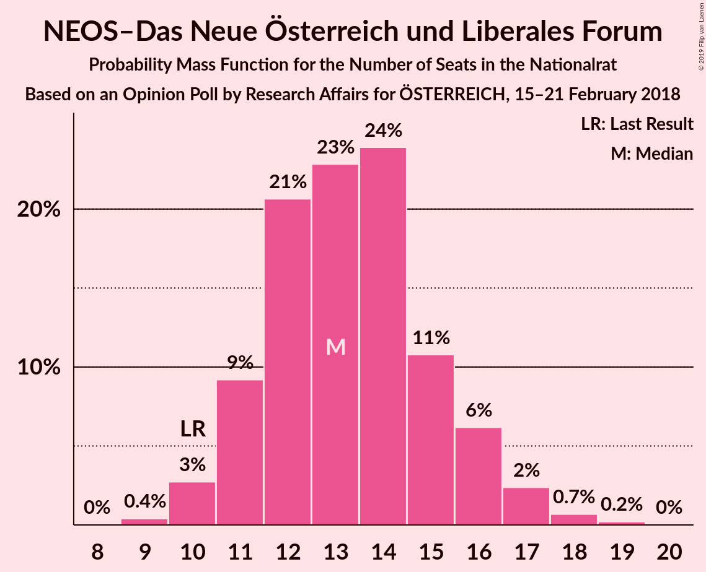

| Number of Seats | Probability | Accumulated | Special Marks |
|:---------------:|:-----------:|:-----------:|:-------------:|
| 9 | 0.4% | 100% |  |
| 10 | 3% | 99.6% | Last Result |
| 11 | 9% | 97% |  |
| 12 | 21% | 88% |  |
| 13 | 23% | 67% | Median |
| 14 | 24% | 44% |  |
| 15 | 11% | 20% |  |
| 16 | 6% | 9% |  |
| 17 | 2% | 3% |  |
| 18 | 0.7% | 0.9% |  |
| 19 | 0.2% | 0.2% |  |
| 20 | 0% | 0% |  |

### Die Grünen–Die Grüne Alternative

*For a full overview of the results for this party, see the [Die Grünen–Die Grüne Alternative](party-diegrünen–diegrünealternative.html) page.*

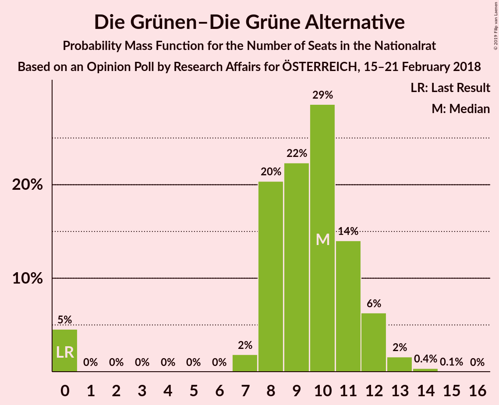

| Number of Seats | Probability | Accumulated | Special Marks |
|:---------------:|:-----------:|:-----------:|:-------------:|
| 0 | 5% | 100% | Last Result |
| 1 | 0% | 95% |  |
| 2 | 0% | 95% |  |
| 3 | 0% | 95% |  |
| 4 | 0% | 95% |  |
| 5 | 0% | 95% |  |
| 6 | 0% | 95% |  |
| 7 | 2% | 95% |  |
| 8 | 20% | 94% |  |
| 9 | 22% | 73% |  |
| 10 | 29% | 51% | Median |
| 11 | 14% | 22% |  |
| 12 | 6% | 8% |  |
| 13 | 2% | 2% |  |
| 14 | 0.4% | 0.4% |  |
| 15 | 0.1% | 0.1% |  |
| 16 | 0% | 0% |  |

### JETZT–Liste Pilz

*For a full overview of the results for this party, see the [JETZT–Liste Pilz](party-jetzt–listepilz.html) page.*

| Number of Seats | Probability | Accumulated | Special Marks |
|:---------------:|:-----------:|:-----------:|:-------------:|
| 0 | 95% | 100% | Median |
| 1 | 0% | 5% |  |
| 2 | 0% | 5% |  |
| 3 | 0% | 5% |  |
| 4 | 0% | 5% |  |
| 5 | 0% | 5% |  |
| 6 | 0% | 5% |  |
| 7 | 3% | 5% |  |
| 8 | 2% | 2% | Last Result |
| 9 | 0.3% | 0.3% |  |
| 10 | 0% | 0% |  |

## Coalitions

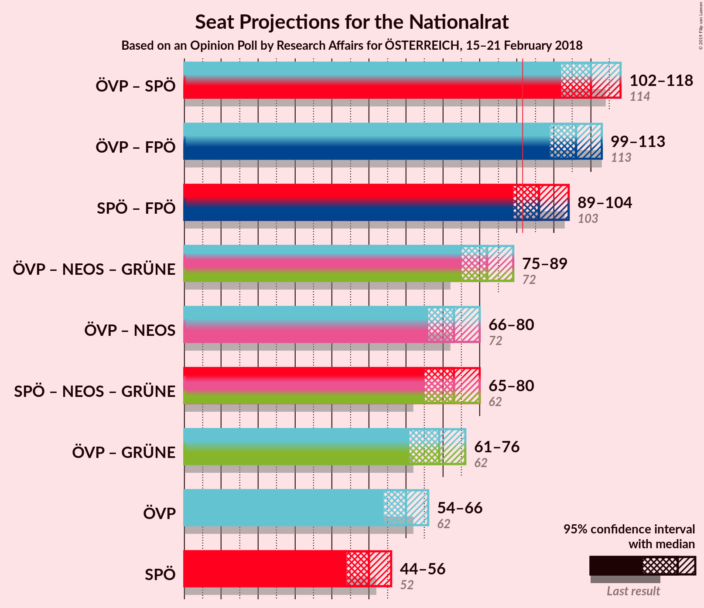

### Confidence Intervals

| Coalition | Last Result | Median | Majority? | 80% Confidence Interval | 90% Confidence Interval | 95% Confidence Interval | 99% Confidence Interval |
|:---------:|:-----------:|:------:|:---------:|:-----------------------:|:-----------------------:|:-----------------------:|:-----------------------:|
| Österreichische Volkspartei – Sozialdemokratische Partei Österreichs | 114 | 110 | 100% | 105–115 | 103–117 | 102–118 | 99–121 |
| Österreichische Volkspartei – Freiheitliche Partei Österreichs | 113 | 106 | 100% | 101–111 | 100–112 | 99–113 | 96–117 |
| Sozialdemokratische Partei Österreichs – Freiheitliche Partei Österreichs | 103 | 96 | 89% | 91–102 | 90–103 | 89–104 | 87–107 |
| Österreichische Volkspartei – NEOS–Das Neue Österreich und Liberales Forum – Die Grünen–Die Grüne Alternative | 72 | 82 | 0.5% | 77–87 | 76–88 | 75–89 | 72–92 |
| Österreichische Volkspartei – NEOS–Das Neue Österreich und Liberales Forum | 72 | 73 | 0% | 69–78 | 67–79 | 66–80 | 65–82 |
| Sozialdemokratische Partei Österreichs – NEOS–Das Neue Österreich und Liberales Forum – Die Grünen–Die Grüne Alternative | 62 | 73 | 0% | 68–77 | 66–78 | 65–80 | 63–82 |
| Österreichische Volkspartei – Die Grünen–Die Grüne Alternative | 62 | 69 | 0% | 64–73 | 63–75 | 61–76 | 58–78 |
| Österreichische Volkspartei | 62 | 60 | 0% | 56–64 | 54–65 | 54–66 | 52–68 |
| Sozialdemokratische Partei Österreichs | 52 | 50 | 0% | 46–54 | 45–55 | 44–56 | 43–58 |

### Österreichische Volkspartei – Sozialdemokratische Partei Österreichs

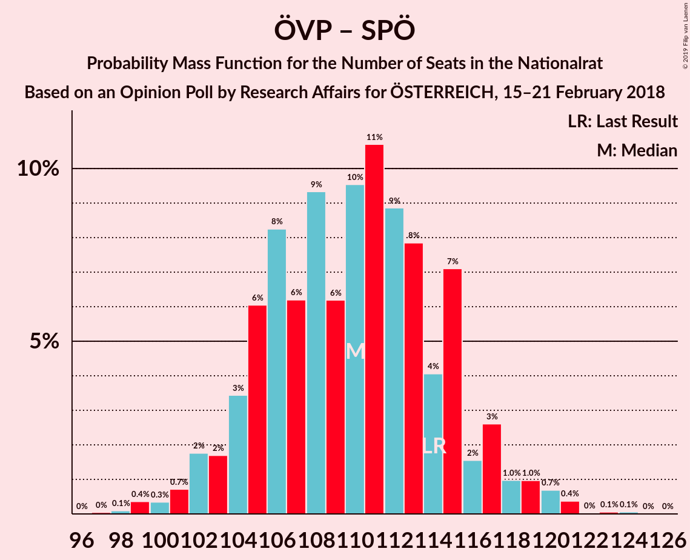

| Number of Seats | Probability | Accumulated | Special Marks |
|:---------------:|:-----------:|:-----------:|:-------------:|
| 97 | 0% | 100% |  |
| 98 | 0.1% | 99.9% |  |
| 99 | 0.4% | 99.8% |  |
| 100 | 0.3% | 99.5% |  |
| 101 | 0.7% | 99.1% |  |
| 102 | 2% | 98% |  |
| 103 | 2% | 97% |  |
| 104 | 3% | 95% |  |
| 105 | 6% | 92% |  |
| 106 | 8% | 85% |  |
| 107 | 6% | 77% |  |
| 108 | 9% | 71% |  |
| 109 | 6% | 62% |  |
| 110 | 10% | 55% | Median |
| 111 | 11% | 46% |  |
| 112 | 9% | 35% |  |
| 113 | 8% | 26% |  |
| 114 | 4% | 19% | Last Result |
| 115 | 7% | 14% |  |
| 116 | 2% | 7% |  |
| 117 | 3% | 6% |  |
| 118 | 1.0% | 3% |  |
| 119 | 1.0% | 2% |  |
| 120 | 0.7% | 1.3% |  |
| 121 | 0.4% | 0.6% |  |
| 122 | 0% | 0.2% |  |
| 123 | 0.1% | 0.2% |  |
| 124 | 0.1% | 0.1% |  |
| 125 | 0% | 0% |  |

### Österreichische Volkspartei – Freiheitliche Partei Österreichs

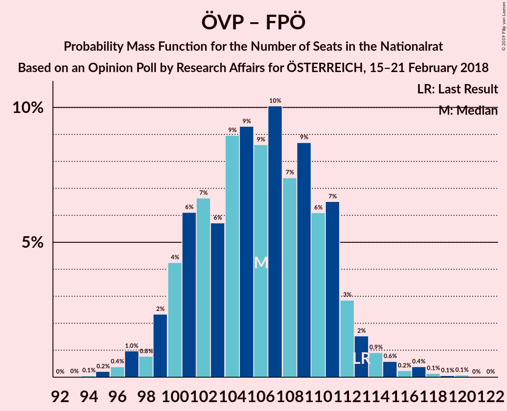

| Number of Seats | Probability | Accumulated | Special Marks |
|:---------------:|:-----------:|:-----------:|:-------------:|
| 93 | 0% | 100% |  |
| 94 | 0.1% | 99.9% |  |
| 95 | 0.2% | 99.9% |  |
| 96 | 0.4% | 99.7% |  |
| 97 | 1.0% | 99.3% |  |
| 98 | 0.8% | 98% |  |
| 99 | 2% | 98% |  |
| 100 | 4% | 95% |  |
| 101 | 6% | 91% |  |
| 102 | 7% | 85% |  |
| 103 | 6% | 78% |  |
| 104 | 9% | 72% |  |
| 105 | 9% | 64% |  |
| 106 | 9% | 54% | Median |
| 107 | 10% | 46% |  |
| 108 | 7% | 36% |  |
| 109 | 9% | 28% |  |
| 110 | 6% | 19% |  |
| 111 | 7% | 13% |  |
| 112 | 3% | 7% |  |
| 113 | 2% | 4% | Last Result |
| 114 | 0.9% | 2% |  |
| 115 | 0.6% | 2% |  |
| 116 | 0.2% | 0.9% |  |
| 117 | 0.4% | 0.7% |  |
| 118 | 0.1% | 0.3% |  |
| 119 | 0.1% | 0.2% |  |
| 120 | 0.1% | 0.1% |  |
| 121 | 0% | 0% |  |

### Sozialdemokratische Partei Österreichs – Freiheitliche Partei Österreichs

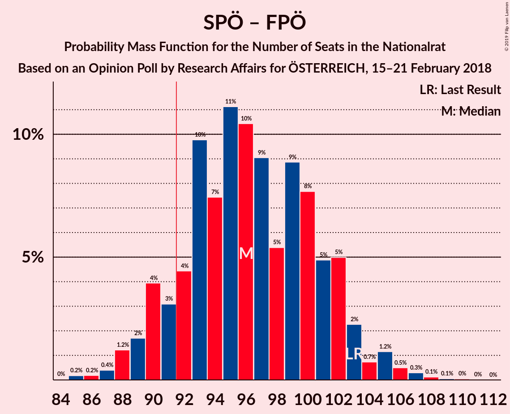

| Number of Seats | Probability | Accumulated | Special Marks |
|:---------------:|:-----------:|:-----------:|:-------------:|
| 84 | 0% | 100% |  |
| 85 | 0.2% | 99.9% |  |
| 86 | 0.2% | 99.8% |  |
| 87 | 0.4% | 99.6% |  |
| 88 | 1.2% | 99.2% |  |
| 89 | 2% | 98% |  |
| 90 | 4% | 96% |  |
| 91 | 3% | 92% |  |
| 92 | 4% | 89% | Majority |
| 93 | 10% | 85% |  |
| 94 | 7% | 75% |  |
| 95 | 11% | 68% |  |
| 96 | 10% | 56% | Median |
| 97 | 9% | 46% |  |
| 98 | 5% | 37% |  |
| 99 | 9% | 32% |  |
| 100 | 8% | 23% |  |
| 101 | 5% | 15% |  |
| 102 | 5% | 10% |  |
| 103 | 2% | 5% | Last Result |
| 104 | 0.7% | 3% |  |
| 105 | 1.2% | 2% |  |
| 106 | 0.5% | 1.0% |  |
| 107 | 0.3% | 0.5% |  |
| 108 | 0.1% | 0.2% |  |
| 109 | 0.1% | 0.1% |  |
| 110 | 0% | 0.1% |  |
| 111 | 0% | 0% |  |

### Österreichische Volkspartei – NEOS–Das Neue Österreich und Liberales Forum – Die Grünen–Die Grüne Alternative

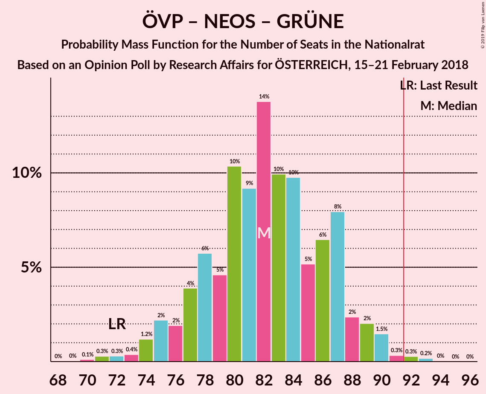

| Number of Seats | Probability | Accumulated | Special Marks |
|:---------------:|:-----------:|:-----------:|:-------------:|
| 69 | 0% | 100% |  |
| 70 | 0.1% | 99.9% |  |
| 71 | 0.3% | 99.8% |  |
| 72 | 0.3% | 99.5% | Last Result |
| 73 | 0.4% | 99.2% |  |
| 74 | 1.2% | 98.8% |  |
| 75 | 2% | 98% |  |
| 76 | 2% | 95% |  |
| 77 | 4% | 94% |  |
| 78 | 6% | 90% |  |
| 79 | 5% | 84% |  |
| 80 | 10% | 79% |  |
| 81 | 9% | 69% |  |
| 82 | 14% | 60% |  |
| 83 | 10% | 46% | Median |
| 84 | 10% | 36% |  |
| 85 | 5% | 26% |  |
| 86 | 6% | 21% |  |
| 87 | 8% | 15% |  |
| 88 | 2% | 7% |  |
| 89 | 2% | 4% |  |
| 90 | 1.5% | 2% |  |
| 91 | 0.3% | 0.8% |  |
| 92 | 0.3% | 0.5% | Majority |
| 93 | 0.2% | 0.2% |  |
| 94 | 0% | 0.1% |  |
| 95 | 0% | 0% |  |

### Österreichische Volkspartei – NEOS–Das Neue Österreich und Liberales Forum

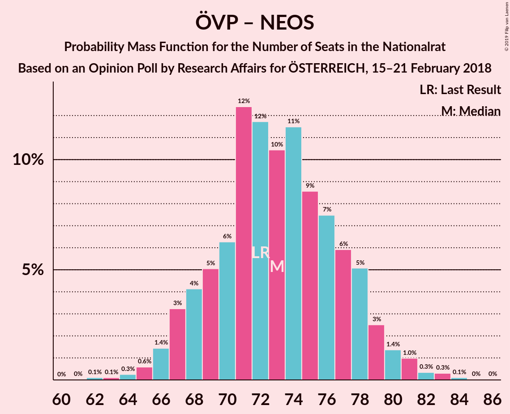

| Number of Seats | Probability | Accumulated | Special Marks |
|:---------------:|:-----------:|:-----------:|:-------------:|
| 62 | 0.1% | 100% |  |
| 63 | 0.1% | 99.9% |  |
| 64 | 0.3% | 99.8% |  |
| 65 | 0.6% | 99.5% |  |
| 66 | 1.4% | 98.9% |  |
| 67 | 3% | 97% |  |
| 68 | 4% | 94% |  |
| 69 | 5% | 90% |  |
| 70 | 6% | 85% |  |
| 71 | 12% | 79% |  |
| 72 | 12% | 66% | Last Result |
| 73 | 10% | 55% | Median |
| 74 | 11% | 44% |  |
| 75 | 9% | 33% |  |
| 76 | 7% | 24% |  |
| 77 | 6% | 17% |  |
| 78 | 5% | 11% |  |
| 79 | 3% | 6% |  |
| 80 | 1.4% | 3% |  |
| 81 | 1.0% | 2% |  |
| 82 | 0.3% | 0.8% |  |
| 83 | 0.3% | 0.5% |  |
| 84 | 0.1% | 0.2% |  |
| 85 | 0% | 0.1% |  |
| 86 | 0% | 0% |  |

### Sozialdemokratische Partei Österreichs – NEOS–Das Neue Österreich und Liberales Forum – Die Grünen–Die Grüne Alternative

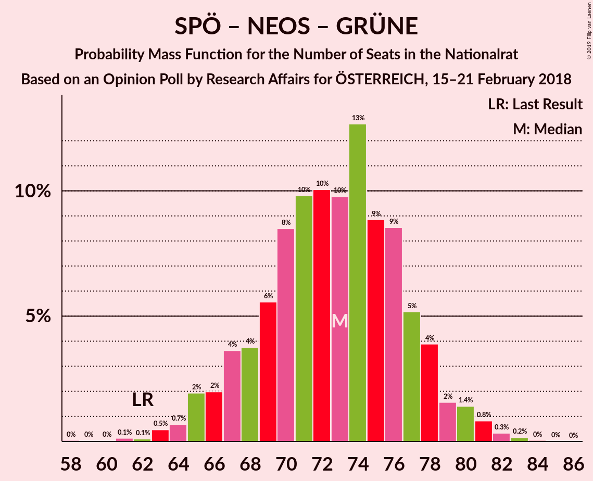

| Number of Seats | Probability | Accumulated | Special Marks |
|:---------------:|:-----------:|:-----------:|:-------------:|
| 58 | 0% | 100% |  |
| 59 | 0% | 99.9% |  |
| 60 | 0% | 99.9% |  |
| 61 | 0.1% | 99.9% |  |
| 62 | 0.1% | 99.7% | Last Result |
| 63 | 0.5% | 99.6% |  |
| 64 | 0.7% | 99.2% |  |
| 65 | 2% | 98% |  |
| 66 | 2% | 97% |  |
| 67 | 4% | 95% |  |
| 68 | 4% | 91% |  |
| 69 | 6% | 87% |  |
| 70 | 8% | 82% |  |
| 71 | 10% | 73% |  |
| 72 | 10% | 63% |  |
| 73 | 10% | 53% | Median |
| 74 | 13% | 43% |  |
| 75 | 9% | 31% |  |
| 76 | 9% | 22% |  |
| 77 | 5% | 13% |  |
| 78 | 4% | 8% |  |
| 79 | 2% | 4% |  |
| 80 | 1.4% | 3% |  |
| 81 | 0.8% | 1.4% |  |
| 82 | 0.3% | 0.6% |  |
| 83 | 0.2% | 0.2% |  |
| 84 | 0% | 0.1% |  |
| 85 | 0% | 0% |  |

### Österreichische Volkspartei – Die Grünen–Die Grüne Alternative

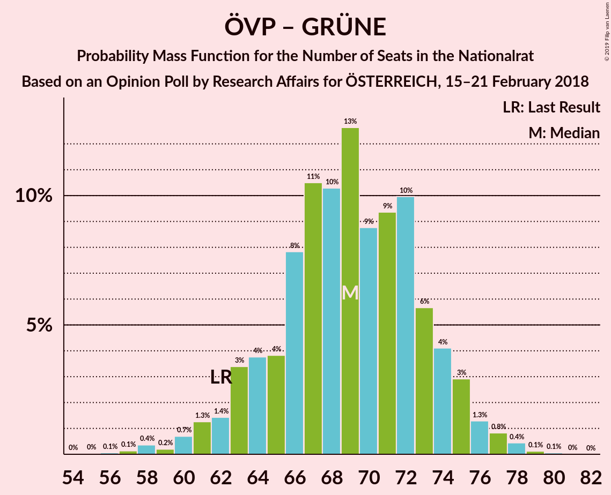

| Number of Seats | Probability | Accumulated | Special Marks |
|:---------------:|:-----------:|:-----------:|:-------------:|
| 55 | 0% | 100% |  |
| 56 | 0.1% | 99.9% |  |
| 57 | 0.1% | 99.9% |  |
| 58 | 0.4% | 99.8% |  |
| 59 | 0.2% | 99.4% |  |
| 60 | 0.7% | 99.2% |  |
| 61 | 1.3% | 98% |  |
| 62 | 1.4% | 97% | Last Result |
| 63 | 3% | 96% |  |
| 64 | 4% | 92% |  |
| 65 | 4% | 89% |  |
| 66 | 8% | 85% |  |
| 67 | 11% | 77% |  |
| 68 | 10% | 66% |  |
| 69 | 13% | 56% |  |
| 70 | 9% | 44% | Median |
| 71 | 9% | 35% |  |
| 72 | 10% | 25% |  |
| 73 | 6% | 15% |  |
| 74 | 4% | 10% |  |
| 75 | 3% | 6% |  |
| 76 | 1.3% | 3% |  |
| 77 | 0.8% | 1.5% |  |
| 78 | 0.4% | 0.7% |  |
| 79 | 0.1% | 0.2% |  |
| 80 | 0.1% | 0.1% |  |
| 81 | 0% | 0% |  |

### Österreichische Volkspartei

| Number of Seats | Probability | Accumulated | Special Marks |
|:---------------:|:-----------:|:-----------:|:-------------:|
| 50 | 0.1% | 100% |  |
| 51 | 0.3% | 99.9% |  |
| 52 | 0.4% | 99.6% |  |
| 53 | 1.4% | 99.2% |  |
| 54 | 3% | 98% |  |
| 55 | 4% | 95% |  |
| 56 | 5% | 91% |  |
| 57 | 9% | 86% |  |
| 58 | 13% | 76% |  |
| 59 | 11% | 64% |  |
| 60 | 11% | 53% | Median |
| 61 | 13% | 41% |  |
| 62 | 9% | 28% | Last Result |
| 63 | 6% | 19% |  |
| 64 | 6% | 13% |  |
| 65 | 3% | 7% |  |
| 66 | 2% | 4% |  |
| 67 | 1.2% | 2% |  |
| 68 | 0.4% | 0.8% |  |
| 69 | 0.2% | 0.4% |  |
| 70 | 0.2% | 0.2% |  |
| 71 | 0% | 0.1% |  |
| 72 | 0% | 0% |  |

### Sozialdemokratische Partei Österreichs

| Number of Seats | Probability | Accumulated | Special Marks |
|:---------------:|:-----------:|:-----------:|:-------------:|
| 41 | 0.1% | 100% |  |
| 42 | 0.4% | 99.9% |  |
| 43 | 0.6% | 99.6% |  |
| 44 | 2% | 99.0% |  |
| 45 | 3% | 97% |  |
| 46 | 6% | 94% |  |
| 47 | 7% | 89% |  |
| 48 | 13% | 82% |  |
| 49 | 12% | 69% |  |
| 50 | 10% | 58% | Median |
| 51 | 16% | 48% |  |
| 52 | 11% | 32% | Last Result |
| 53 | 8% | 21% |  |
| 54 | 6% | 13% |  |
| 55 | 4% | 7% |  |
| 56 | 2% | 4% |  |
| 57 | 1.1% | 2% |  |
| 58 | 0.5% | 0.8% |  |
| 59 | 0.2% | 0.4% |  |
| 60 | 0.1% | 0.1% |  |
| 61 | 0% | 0% |  |

## Technical Information

### Opinion Poll

+ **Polling firm:** Research Affairs
+ **Commissioner(s):** ÖSTERREICH
+ **Fieldwork period:** 15–21 February 2018

### Calculations

+ **Sample size:** 1010
+ **Simulations done:** 131,072
+ **Error estimate:** 1.89%

