# Opinion Poll by Market for Der Standard, 6–8 March 2018

<a href="#voting-intentions">Voting Intentions</a> | <a href="#seats">Seats</a> | <a href="#coalitions">Coalitions</a> | <a href="#technical-information">Technical Information</a>

## Voting Intentions

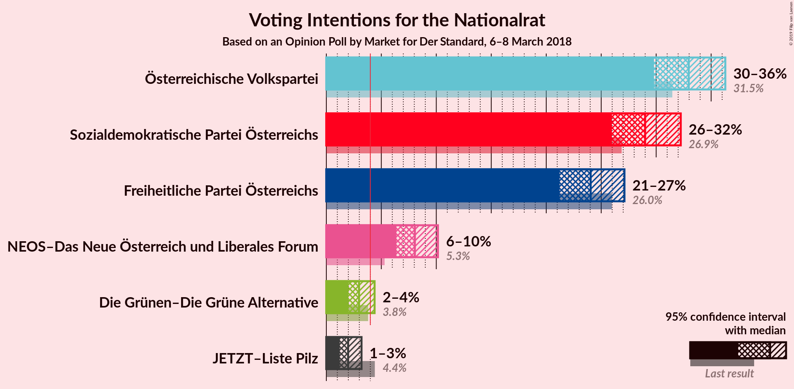

### Confidence Intervals

| Party | Last Result | Poll Result | 80% Confidence Interval | 90% Confidence Interval | 95% Confidence Interval | 99% Confidence Interval |
|:-----:|:-----------:|:-----------:|:-----------------------:|:-----------------------:|:-----------------------:|:-----------------------:|
| Österreichische Volkspartei | 31.5% | 33.0% | 30.9–35.1% |30.3–35.8% |29.8–36.3% |28.8–37.3% |
| Sozialdemokratische Partei Österreichs | 26.9% | 29.0% | 27.0–31.1% |26.4–31.7% |26.0–32.2% |25.0–33.3% |
| Freiheitliche Partei Österreichs | 26.0% | 24.0% | 22.2–26.0% |21.7–26.6% |21.2–27.1% |20.3–28.1% |
| NEOS–Das Neue Österreich und Liberales Forum | 5.3% | 8.1% | 6.9–9.4% |6.6–9.8% |6.4–10.2% |5.9–10.8% |
| Die Grünen–Die Grüne Alternative | 3.8% | 3.0% | 2.3–3.9% |2.1–4.2% |2.0–4.4% |1.7–4.9% |
| JETZT–Liste Pilz | 4.4% | 2.0% | 1.5–2.8% |1.3–3.0% |1.2–3.2% |1.0–3.6% |

*Note:* The poll result column reflects the actual value used in the calculations. Published results may vary slightly, and in addition be rounded to fewer digits.

## Seats

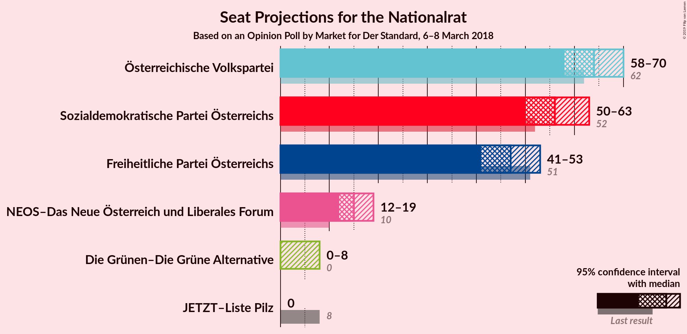

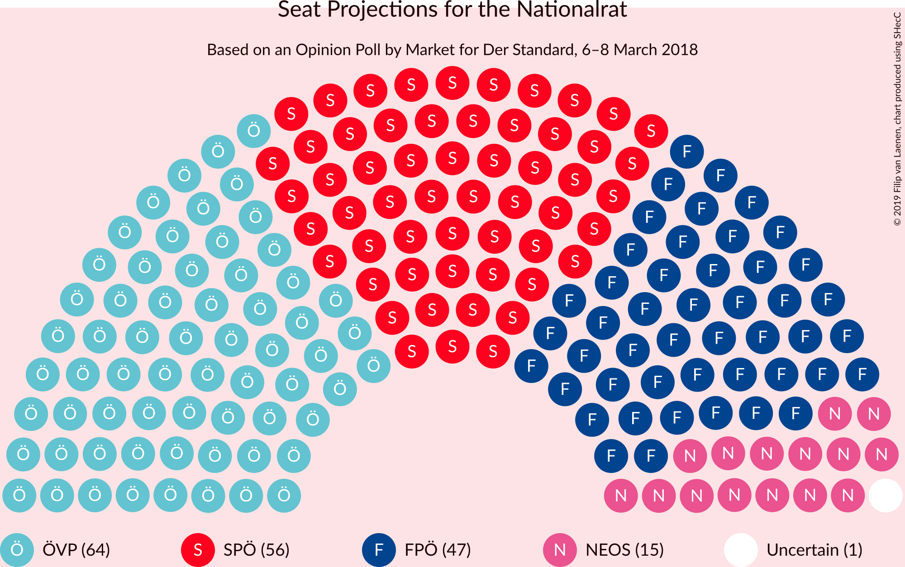

### Confidence Intervals

| Party | Last Result | Median | 80% Confidence Interval | 90% Confidence Interval | 95% Confidence Interval | 99% Confidence Interval |
|:-----:|:-----------:|:------:|:-----------------------:|:-----------------------:|:-----------------------:|:-----------------------:|
| <a href="#österreichische-volkspartei">Österreichische Volkspartei</a> | 62 | 64 | 60–68 |59–69 |58–70 |56–73 |
| <a href="#sozialdemokratische-partei-österreichs">Sozialdemokratische Partei Österreichs</a> | 52 | 56 | 53–61 |51–61 |50–63 |48–64 |
| <a href="#freiheitliche-partei-österreichs">Freiheitliche Partei Österreichs</a> | 51 | 47 | 43–51 |42–52 |41–53 |39–54 |
| <a href="#neos–das-neue-österreich-und-liberales-forum">NEOS–Das Neue Österreich und Liberales Forum</a> | 10 | 15 | 13–18 |13–19 |12–19 |11–21 |
| <a href="#die-grünen–die-grüne-alternative">Die Grünen–Die Grüne Alternative</a> | 0 | 0 | 0 |0–7 |0–8 |0–9 |
| <a href="#jetzt–liste-pilz">JETZT–Liste Pilz</a> | 8 | 0 | 0 |0 |0 |0 |

### Österreichische Volkspartei

*For a full overview of the results for this party, see the [Österreichische Volkspartei](party-österreichischevolkspartei.html) page.*

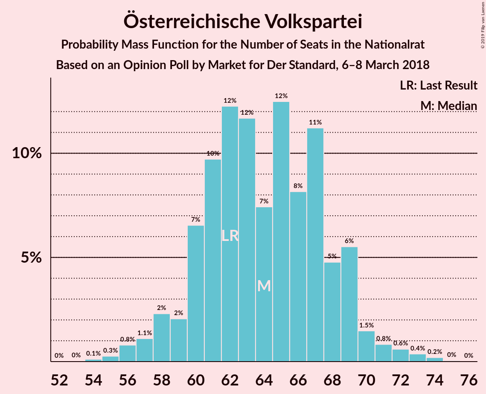

| Number of Seats | Probability | Accumulated | Special Marks |
|:---------------:|:-----------:|:-----------:|:-------------:|
| 54 | 0.1% | 100% |  |
| 55 | 0.3% | 99.8% |  |
| 56 | 0.8% | 99.6% |  |
| 57 | 1.1% | 98.8% |  |
| 58 | 2% | 98% |  |
| 59 | 2% | 95% |  |
| 60 | 7% | 93% |  |
| 61 | 10% | 87% |  |
| 62 | 12% | 77% | Last Result |
| 63 | 12% | 65% |  |
| 64 | 7% | 53% | Median |
| 65 | 12% | 46% |  |
| 66 | 8% | 33% |  |
| 67 | 11% | 25% |  |
| 68 | 5% | 14% |  |
| 69 | 6% | 9% |  |
| 70 | 1.5% | 4% |  |
| 71 | 0.8% | 2% |  |
| 72 | 0.6% | 1.2% |  |
| 73 | 0.4% | 0.6% |  |
| 74 | 0.2% | 0.3% |  |
| 75 | 0% | 0.1% |  |
| 76 | 0% | 0% |  |

### Sozialdemokratische Partei Österreichs

*For a full overview of the results for this party, see the [Sozialdemokratische Partei Österreichs](party-sozialdemokratischeparteiösterreichs.html) page.*

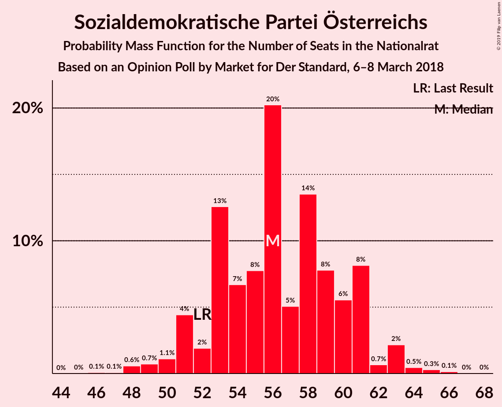

| Number of Seats | Probability | Accumulated | Special Marks |
|:---------------:|:-----------:|:-----------:|:-------------:|
| 46 | 0.1% | 100% |  |
| 47 | 0.1% | 99.9% |  |
| 48 | 0.6% | 99.8% |  |
| 49 | 0.7% | 99.3% |  |
| 50 | 1.1% | 98.5% |  |
| 51 | 4% | 97% |  |
| 52 | 2% | 93% | Last Result |
| 53 | 13% | 91% |  |
| 54 | 7% | 79% |  |
| 55 | 8% | 72% |  |
| 56 | 20% | 64% | Median |
| 57 | 5% | 44% |  |
| 58 | 14% | 39% |  |
| 59 | 8% | 25% |  |
| 60 | 6% | 17% |  |
| 61 | 8% | 12% |  |
| 62 | 0.7% | 4% |  |
| 63 | 2% | 3% |  |
| 64 | 0.5% | 0.9% |  |
| 65 | 0.3% | 0.5% |  |
| 66 | 0.1% | 0.2% |  |
| 67 | 0% | 0.1% |  |
| 68 | 0% | 0% |  |

### Freiheitliche Partei Österreichs

*For a full overview of the results for this party, see the [Freiheitliche Partei Österreichs](party-freiheitlicheparteiösterreichs.html) page.*

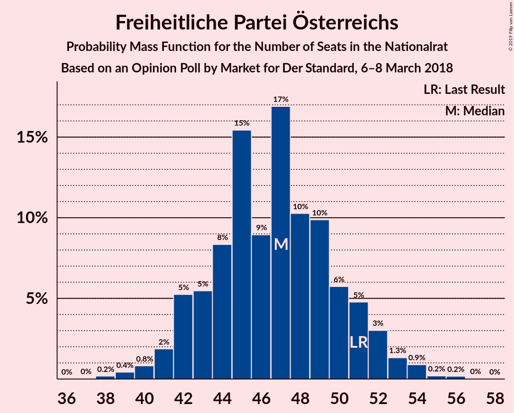

| Number of Seats | Probability | Accumulated | Special Marks |
|:---------------:|:-----------:|:-----------:|:-------------:|
| 38 | 0.2% | 100% |  |
| 39 | 0.4% | 99.8% |  |
| 40 | 0.8% | 99.3% |  |
| 41 | 2% | 98.5% |  |
| 42 | 5% | 97% |  |
| 43 | 5% | 91% |  |
| 44 | 8% | 86% |  |
| 45 | 15% | 78% |  |
| 46 | 9% | 62% |  |
| 47 | 17% | 53% | Median |
| 48 | 10% | 36% |  |
| 49 | 10% | 26% |  |
| 50 | 6% | 16% |  |
| 51 | 5% | 10% | Last Result |
| 52 | 3% | 6% |  |
| 53 | 1.3% | 3% |  |
| 54 | 0.9% | 1.3% |  |
| 55 | 0.2% | 0.4% |  |
| 56 | 0.2% | 0.2% |  |
| 57 | 0% | 0.1% |  |
| 58 | 0% | 0% |  |

### NEOS–Das Neue Österreich und Liberales Forum

*For a full overview of the results for this party, see the [NEOS–Das Neue Österreich und Liberales Forum](party-neos–dasneueösterreichundliberalesforum.html) page.*

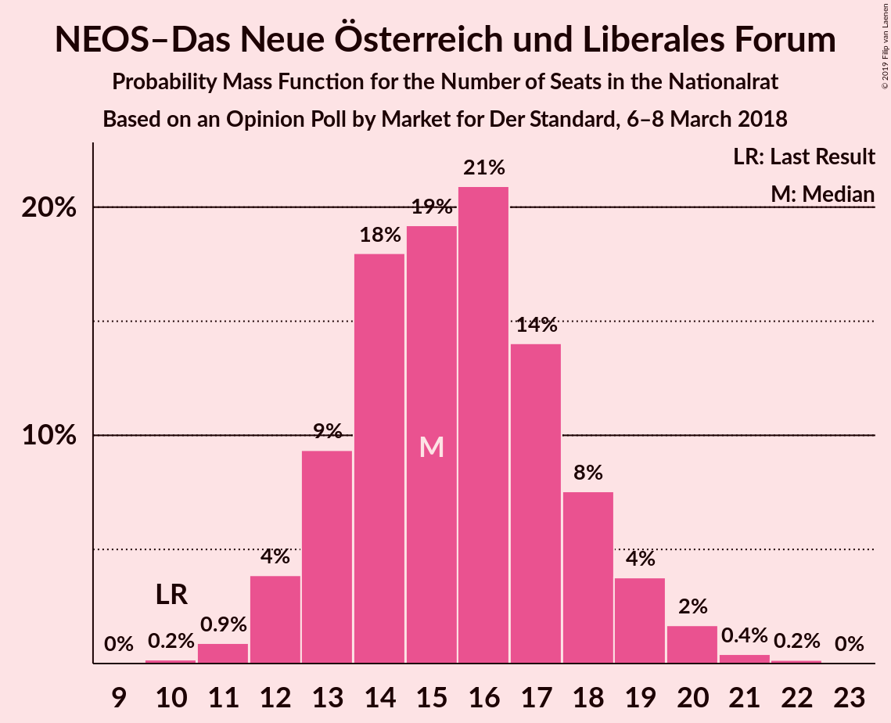

| Number of Seats | Probability | Accumulated | Special Marks |
|:---------------:|:-----------:|:-----------:|:-------------:|
| 10 | 0.2% | 100% | Last Result |
| 11 | 0.9% | 99.8% |  |
| 12 | 4% | 98.9% |  |
| 13 | 9% | 95% |  |
| 14 | 18% | 86% |  |
| 15 | 19% | 68% | Median |
| 16 | 21% | 49% |  |
| 17 | 14% | 28% |  |
| 18 | 8% | 14% |  |
| 19 | 4% | 6% |  |
| 20 | 2% | 2% |  |
| 21 | 0.4% | 0.6% |  |
| 22 | 0.2% | 0.2% |  |
| 23 | 0% | 0% |  |

### Die Grünen–Die Grüne Alternative

*For a full overview of the results for this party, see the [Die Grünen–Die Grüne Alternative](party-diegrünen–diegrünealternative.html) page.*

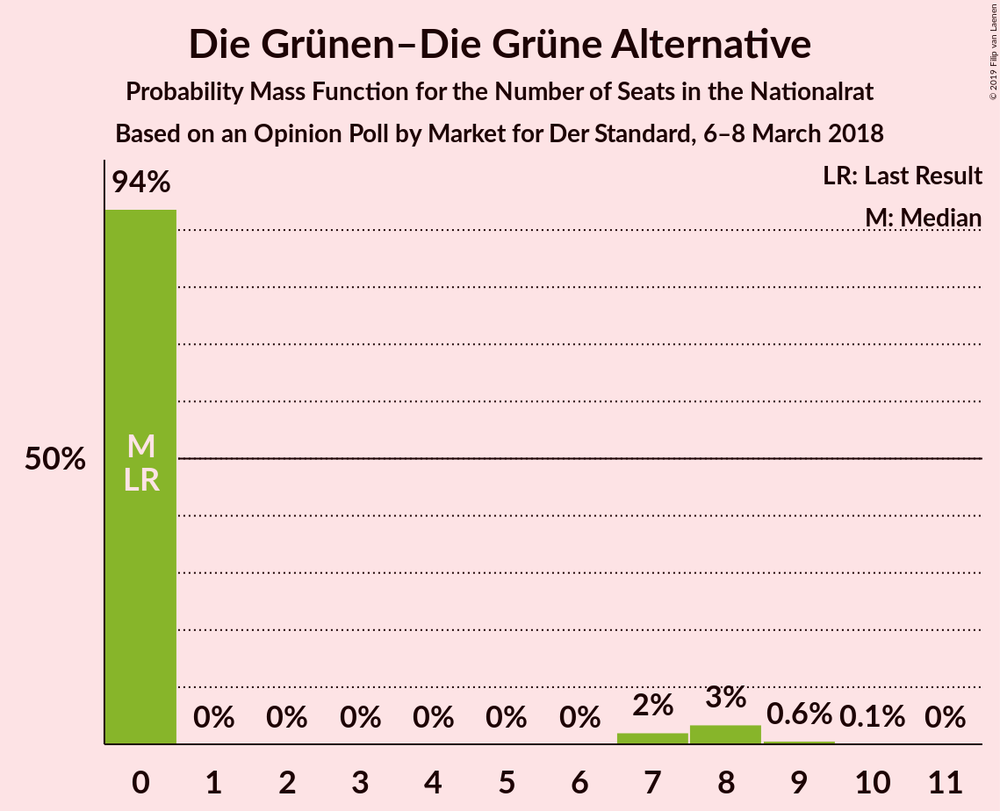

| Number of Seats | Probability | Accumulated | Special Marks |
|:---------------:|:-----------:|:-----------:|:-------------:|
| 0 | 94% | 100% | Last Result, Median |
| 1 | 0% | 6% |  |
| 2 | 0% | 6% |  |
| 3 | 0% | 6% |  |
| 4 | 0% | 6% |  |
| 5 | 0% | 6% |  |
| 6 | 0% | 6% |  |
| 7 | 2% | 6% |  |
| 8 | 3% | 4% |  |
| 9 | 0.6% | 0.7% |  |
| 10 | 0.1% | 0.1% |  |
| 11 | 0% | 0% |  |

### JETZT–Liste Pilz

*For a full overview of the results for this party, see the [JETZT–Liste Pilz](party-jetzt–listepilz.html) page.*

| Number of Seats | Probability | Accumulated | Special Marks |
|:---------------:|:-----------:|:-----------:|:-------------:|
| 0 | 99.9% | 100% | Median |
| 1 | 0% | 0.1% |  |
| 2 | 0% | 0.1% |  |
| 3 | 0% | 0.1% |  |
| 4 | 0% | 0.1% |  |
| 5 | 0% | 0.1% |  |
| 6 | 0% | 0.1% |  |
| 7 | 0.1% | 0.1% |  |
| 8 | 0% | 0% | Last Result |

## Coalitions

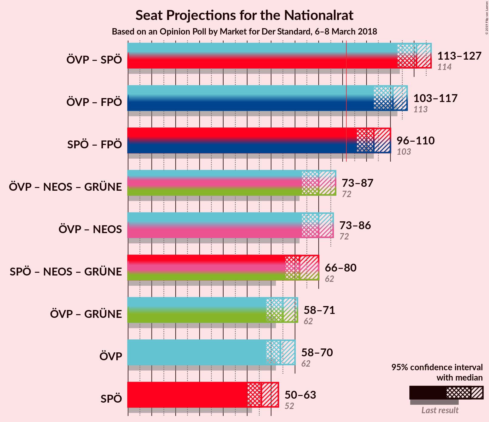

### Confidence Intervals

| Coalition | Last Result | Median | Majority? | 80% Confidence Interval | 90% Confidence Interval | 95% Confidence Interval | 99% Confidence Interval |
|:---------:|:-----------:|:------:|:---------:|:-----------------------:|:-----------------------:|:-----------------------:|:-----------------------:|
| Österreichische Volkspartei – Sozialdemokratische Partei Österreichs | 114 | 121 | 100% | 116–125 | 114–126 | 113–127 | 111–129 |
| Österreichische Volkspartei – Freiheitliche Partei Österreichs | 113 | 111 | 100% | 106–115 | 105–116 | 103–117 | 101–119 |
| Sozialdemokratische Partei Österreichs – Freiheitliche Partei Österreichs | 103 | 103 | 99.9% | 98–107 | 97–109 | 96–110 | 93–112 |
| Österreichische Volkspartei – NEOS–Das Neue Österreich und Liberales Forum – Die Grünen–Die Grüne Alternative | 72 | 80 | 0.1% | 76–85 | 74–86 | 73–87 | 71–90 |
| Österreichische Volkspartei – NEOS–Das Neue Österreich und Liberales Forum | 72 | 80 | 0% | 75–84 | 74–85 | 73–86 | 70–88 |
| Sozialdemokratische Partei Österreichs – NEOS–Das Neue Österreich und Liberales Forum – Die Grünen–Die Grüne Alternative | 62 | 72 | 0% | 68–77 | 67–78 | 66–80 | 64–82 |
| Österreichische Volkspartei – Die Grünen–Die Grüne Alternative | 62 | 65 | 0% | 60–69 | 59–70 | 58–71 | 56–74 |
| Österreichische Volkspartei | 62 | 64 | 0% | 60–68 | 59–69 | 58–70 | 56–73 |
| Sozialdemokratische Partei Österreichs | 52 | 56 | 0% | 53–61 | 51–61 | 50–63 | 48–64 |

### Österreichische Volkspartei – Sozialdemokratische Partei Österreichs

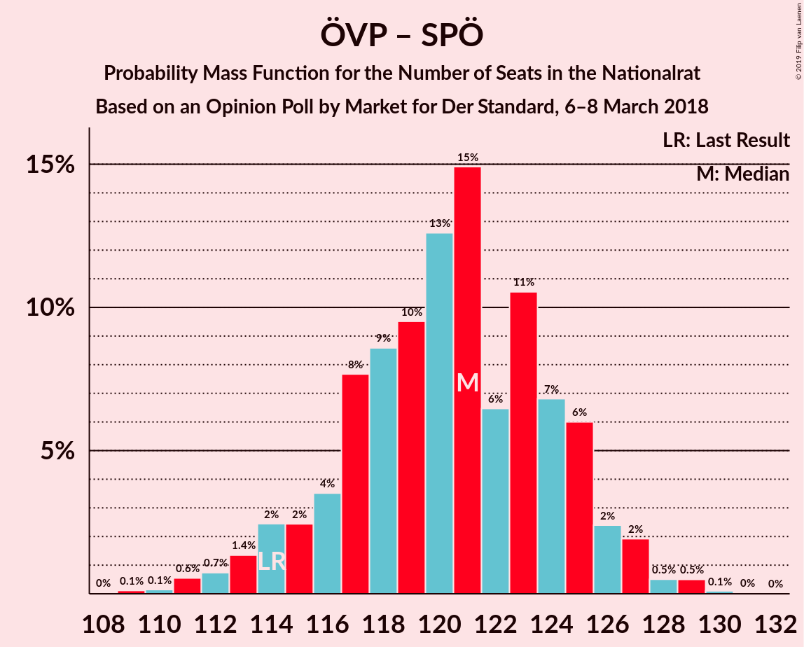

| Number of Seats | Probability | Accumulated | Special Marks |
|:---------------:|:-----------:|:-----------:|:-------------:|
| 108 | 0% | 100% |  |
| 109 | 0.1% | 99.9% |  |
| 110 | 0.1% | 99.8% |  |
| 111 | 0.6% | 99.7% |  |
| 112 | 0.7% | 99.1% |  |
| 113 | 1.4% | 98% |  |
| 114 | 2% | 97% | Last Result |
| 115 | 2% | 95% |  |
| 116 | 4% | 92% |  |
| 117 | 8% | 89% |  |
| 118 | 9% | 81% |  |
| 119 | 10% | 72% |  |
| 120 | 13% | 63% | Median |
| 121 | 15% | 50% |  |
| 122 | 6% | 35% |  |
| 123 | 11% | 29% |  |
| 124 | 7% | 18% |  |
| 125 | 6% | 12% |  |
| 126 | 2% | 5% |  |
| 127 | 2% | 3% |  |
| 128 | 0.5% | 1.2% |  |
| 129 | 0.5% | 0.7% |  |
| 130 | 0.1% | 0.2% |  |
| 131 | 0% | 0.1% |  |
| 132 | 0% | 0% |  |

### Österreichische Volkspartei – Freiheitliche Partei Österreichs

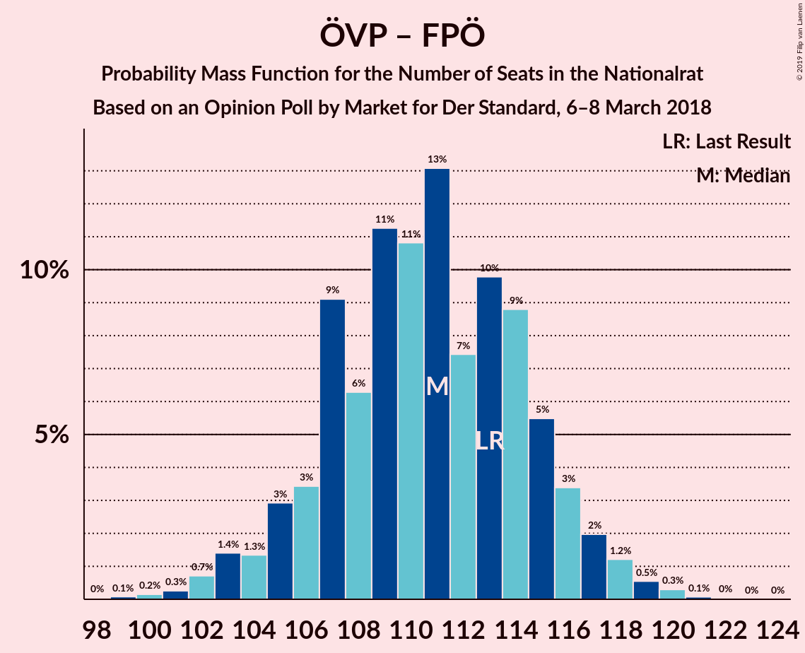

| Number of Seats | Probability | Accumulated | Special Marks |
|:---------------:|:-----------:|:-----------:|:-------------:|
| 98 | 0% | 100% |  |
| 99 | 0.1% | 99.9% |  |
| 100 | 0.2% | 99.9% |  |
| 101 | 0.3% | 99.7% |  |
| 102 | 0.7% | 99.4% |  |
| 103 | 1.4% | 98.7% |  |
| 104 | 1.3% | 97% |  |
| 105 | 3% | 96% |  |
| 106 | 3% | 93% |  |
| 107 | 9% | 90% |  |
| 108 | 6% | 81% |  |
| 109 | 11% | 74% |  |
| 110 | 11% | 63% |  |
| 111 | 13% | 52% | Median |
| 112 | 7% | 39% |  |
| 113 | 10% | 32% | Last Result |
| 114 | 9% | 22% |  |
| 115 | 5% | 13% |  |
| 116 | 3% | 8% |  |
| 117 | 2% | 4% |  |
| 118 | 1.2% | 2% |  |
| 119 | 0.5% | 1.0% |  |
| 120 | 0.3% | 0.4% |  |
| 121 | 0.1% | 0.1% |  |
| 122 | 0% | 0.1% |  |
| 123 | 0% | 0% |  |

### Sozialdemokratische Partei Österreichs – Freiheitliche Partei Österreichs

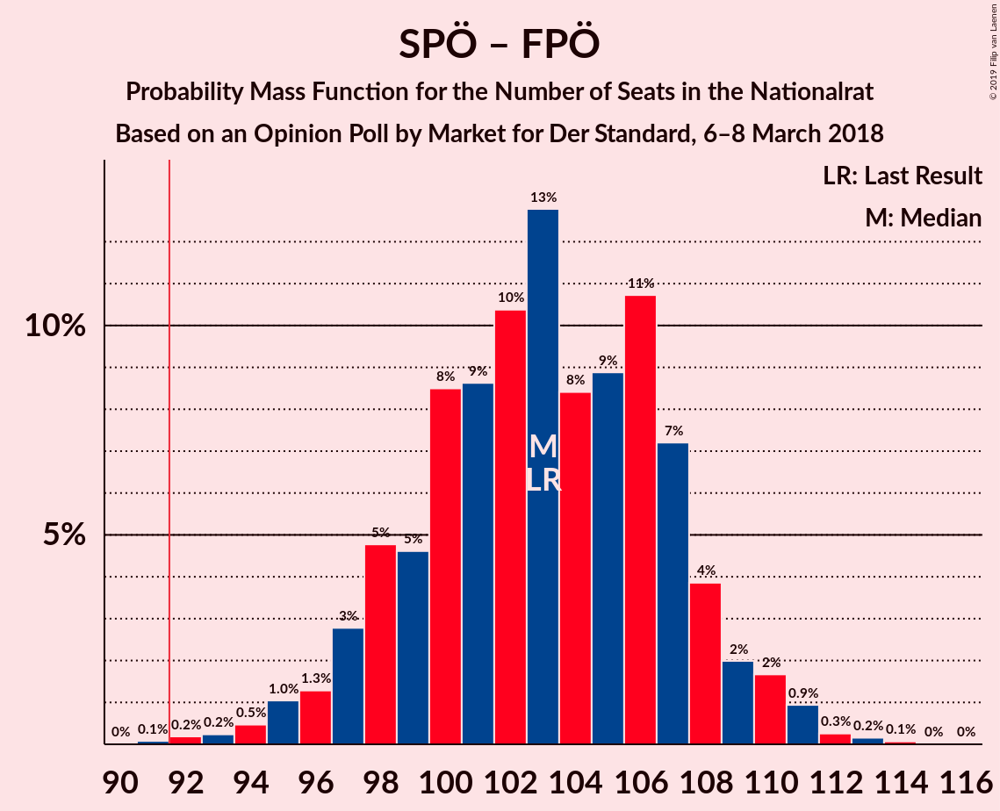

| Number of Seats | Probability | Accumulated | Special Marks |
|:---------------:|:-----------:|:-----------:|:-------------:|
| 91 | 0.1% | 100% |  |
| 92 | 0.2% | 99.9% | Majority |
| 93 | 0.2% | 99.7% |  |
| 94 | 0.5% | 99.5% |  |
| 95 | 1.0% | 99.0% |  |
| 96 | 1.3% | 98% |  |
| 97 | 3% | 97% |  |
| 98 | 5% | 94% |  |
| 99 | 5% | 89% |  |
| 100 | 8% | 84% |  |
| 101 | 9% | 76% |  |
| 102 | 10% | 67% |  |
| 103 | 13% | 57% | Last Result, Median |
| 104 | 8% | 44% |  |
| 105 | 9% | 36% |  |
| 106 | 11% | 27% |  |
| 107 | 7% | 16% |  |
| 108 | 4% | 9% |  |
| 109 | 2% | 5% |  |
| 110 | 2% | 3% |  |
| 111 | 0.9% | 1.5% |  |
| 112 | 0.3% | 0.5% |  |
| 113 | 0.2% | 0.3% |  |
| 114 | 0.1% | 0.1% |  |
| 115 | 0% | 0% |  |

### Österreichische Volkspartei – NEOS–Das Neue Österreich und Liberales Forum – Die Grünen–Die Grüne Alternative

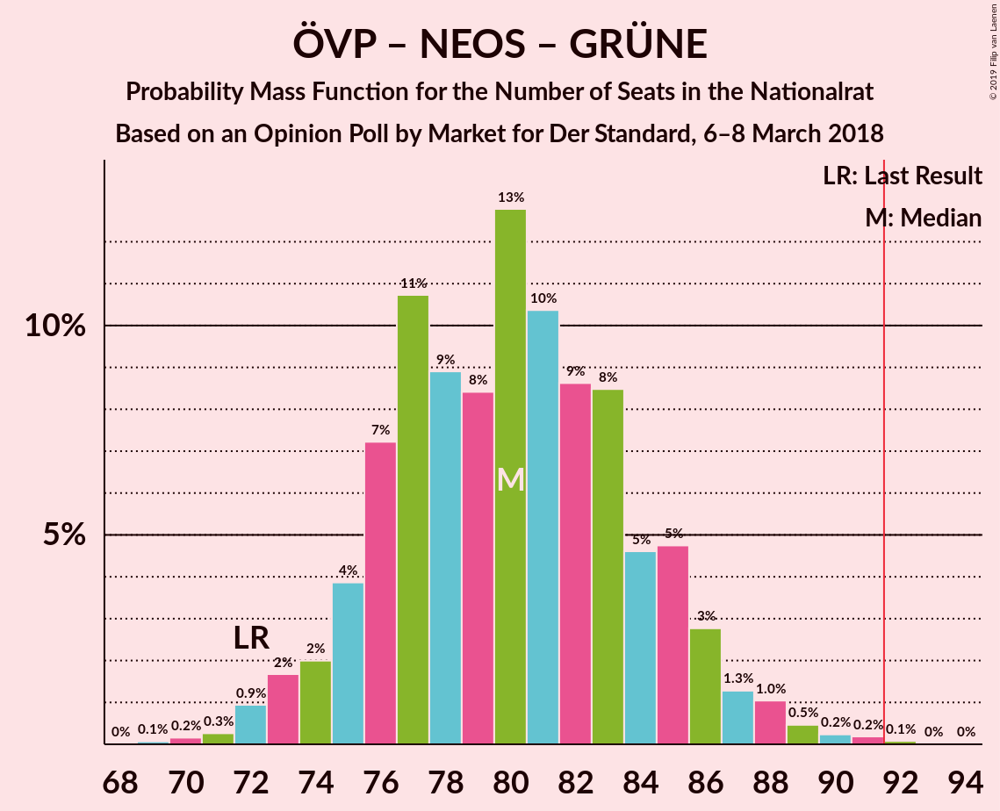

| Number of Seats | Probability | Accumulated | Special Marks |
|:---------------:|:-----------:|:-----------:|:-------------:|
| 69 | 0.1% | 100% |  |
| 70 | 0.2% | 99.9% |  |
| 71 | 0.3% | 99.7% |  |
| 72 | 0.9% | 99.5% | Last Result |
| 73 | 2% | 98.5% |  |
| 74 | 2% | 97% |  |
| 75 | 4% | 95% |  |
| 76 | 7% | 91% |  |
| 77 | 11% | 84% |  |
| 78 | 9% | 73% |  |
| 79 | 8% | 64% | Median |
| 80 | 13% | 56% |  |
| 81 | 10% | 43% |  |
| 82 | 9% | 33% |  |
| 83 | 8% | 24% |  |
| 84 | 5% | 15% |  |
| 85 | 5% | 11% |  |
| 86 | 3% | 6% |  |
| 87 | 1.3% | 3% |  |
| 88 | 1.0% | 2% |  |
| 89 | 0.5% | 1.0% |  |
| 90 | 0.2% | 0.5% |  |
| 91 | 0.2% | 0.3% |  |
| 92 | 0.1% | 0.1% | Majority |
| 93 | 0% | 0% |  |

### Österreichische Volkspartei – NEOS–Das Neue Österreich und Liberales Forum

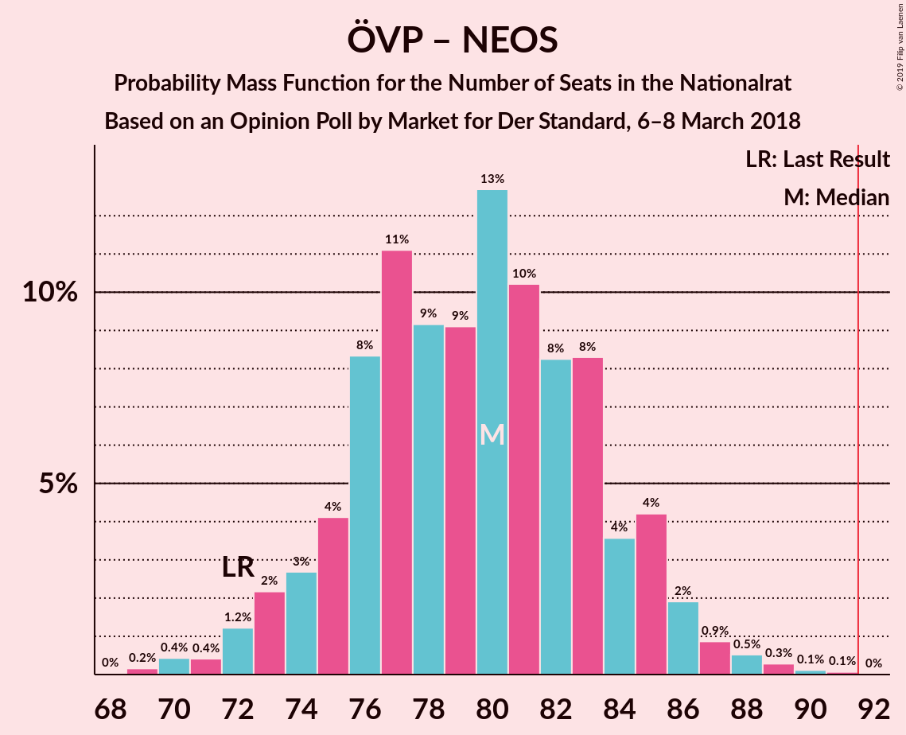

| Number of Seats | Probability | Accumulated | Special Marks |
|:---------------:|:-----------:|:-----------:|:-------------:|
| 68 | 0% | 100% |  |
| 69 | 0.2% | 99.9% |  |
| 70 | 0.4% | 99.8% |  |
| 71 | 0.4% | 99.3% |  |
| 72 | 1.2% | 98.9% | Last Result |
| 73 | 2% | 98% |  |
| 74 | 3% | 96% |  |
| 75 | 4% | 93% |  |
| 76 | 8% | 89% |  |
| 77 | 11% | 80% |  |
| 78 | 9% | 69% |  |
| 79 | 9% | 60% | Median |
| 80 | 13% | 51% |  |
| 81 | 10% | 38% |  |
| 82 | 8% | 28% |  |
| 83 | 8% | 20% |  |
| 84 | 4% | 12% |  |
| 85 | 4% | 8% |  |
| 86 | 2% | 4% |  |
| 87 | 0.9% | 2% |  |
| 88 | 0.5% | 1.0% |  |
| 89 | 0.3% | 0.5% |  |
| 90 | 0.1% | 0.2% |  |
| 91 | 0.1% | 0.1% |  |
| 92 | 0% | 0% | Majority |

### Sozialdemokratische Partei Österreichs – NEOS–Das Neue Österreich und Liberales Forum – Die Grünen–Die Grüne Alternative

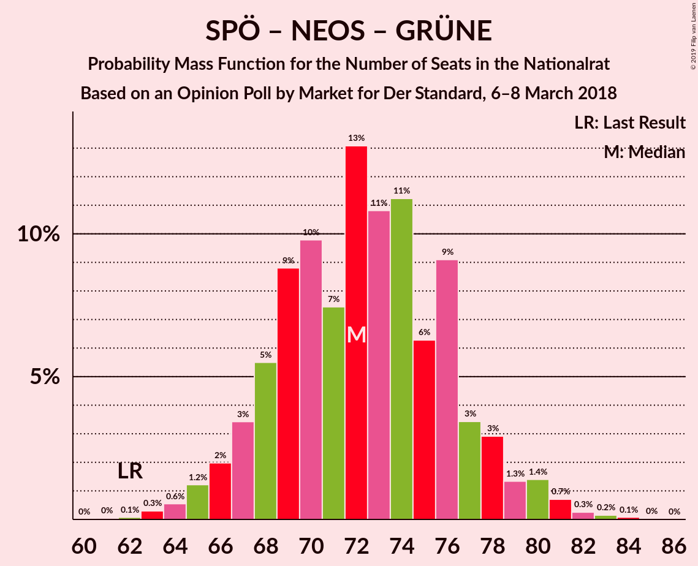

| Number of Seats | Probability | Accumulated | Special Marks |
|:---------------:|:-----------:|:-----------:|:-------------:|
| 61 | 0% | 100% |  |
| 62 | 0.1% | 99.9% | Last Result |
| 63 | 0.3% | 99.9% |  |
| 64 | 0.6% | 99.6% |  |
| 65 | 1.2% | 99.0% |  |
| 66 | 2% | 98% |  |
| 67 | 3% | 96% |  |
| 68 | 5% | 92% |  |
| 69 | 9% | 87% |  |
| 70 | 10% | 78% |  |
| 71 | 7% | 68% | Median |
| 72 | 13% | 61% |  |
| 73 | 11% | 48% |  |
| 74 | 11% | 37% |  |
| 75 | 6% | 26% |  |
| 76 | 9% | 19% |  |
| 77 | 3% | 10% |  |
| 78 | 3% | 7% |  |
| 79 | 1.3% | 4% |  |
| 80 | 1.4% | 3% |  |
| 81 | 0.7% | 1.3% |  |
| 82 | 0.3% | 0.5% |  |
| 83 | 0.2% | 0.3% |  |
| 84 | 0.1% | 0.1% |  |
| 85 | 0% | 0.1% |  |
| 86 | 0% | 0% |  |

### Österreichische Volkspartei – Die Grünen–Die Grüne Alternative

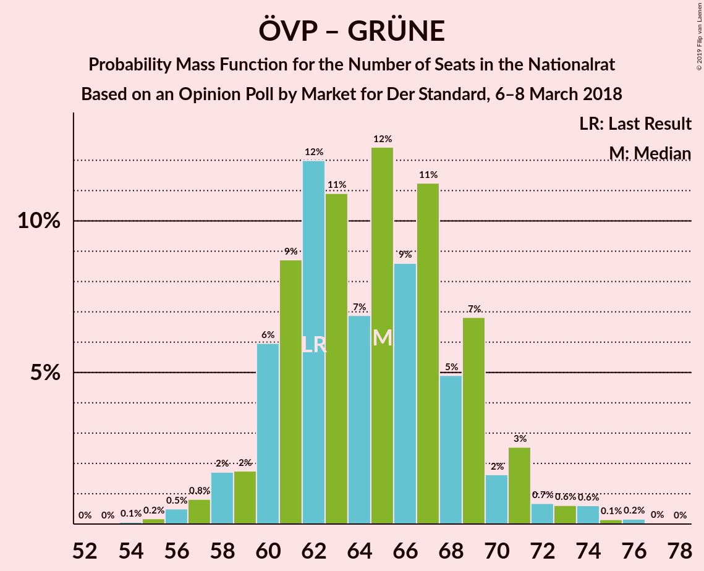

| Number of Seats | Probability | Accumulated | Special Marks |
|:---------------:|:-----------:|:-----------:|:-------------:|
| 54 | 0.1% | 100% |  |
| 55 | 0.2% | 99.9% |  |
| 56 | 0.5% | 99.7% |  |
| 57 | 0.8% | 99.2% |  |
| 58 | 2% | 98% |  |
| 59 | 2% | 97% |  |
| 60 | 6% | 95% |  |
| 61 | 9% | 89% |  |
| 62 | 12% | 80% | Last Result |
| 63 | 11% | 68% |  |
| 64 | 7% | 57% | Median |
| 65 | 12% | 50% |  |
| 66 | 9% | 38% |  |
| 67 | 11% | 29% |  |
| 68 | 5% | 18% |  |
| 69 | 7% | 13% |  |
| 70 | 2% | 6% |  |
| 71 | 3% | 5% |  |
| 72 | 0.7% | 2% |  |
| 73 | 0.6% | 2% |  |
| 74 | 0.6% | 1.0% |  |
| 75 | 0.1% | 0.4% |  |
| 76 | 0.2% | 0.2% |  |
| 77 | 0% | 0.1% |  |
| 78 | 0% | 0% |  |

### Österreichische Volkspartei

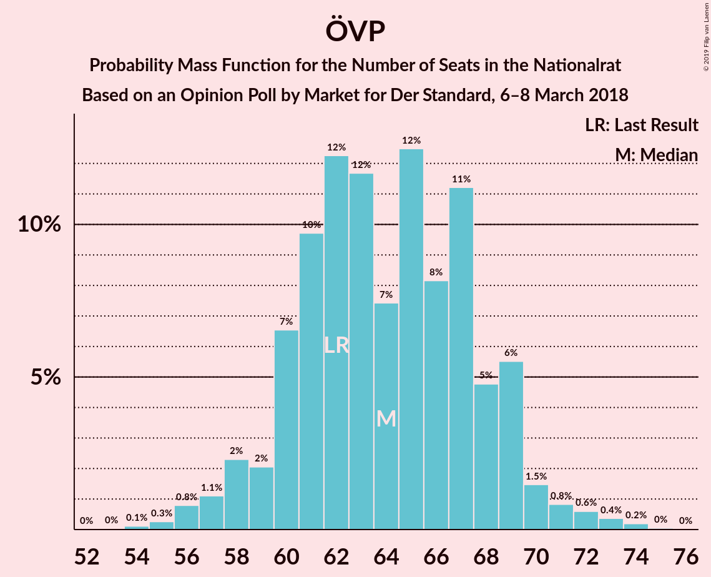

| Number of Seats | Probability | Accumulated | Special Marks |
|:---------------:|:-----------:|:-----------:|:-------------:|
| 54 | 0.1% | 100% |  |
| 55 | 0.3% | 99.8% |  |
| 56 | 0.8% | 99.6% |  |
| 57 | 1.1% | 98.8% |  |
| 58 | 2% | 98% |  |
| 59 | 2% | 95% |  |
| 60 | 7% | 93% |  |
| 61 | 10% | 87% |  |
| 62 | 12% | 77% | Last Result |
| 63 | 12% | 65% |  |
| 64 | 7% | 53% | Median |
| 65 | 12% | 46% |  |
| 66 | 8% | 33% |  |
| 67 | 11% | 25% |  |
| 68 | 5% | 14% |  |
| 69 | 6% | 9% |  |
| 70 | 1.5% | 4% |  |
| 71 | 0.8% | 2% |  |
| 72 | 0.6% | 1.2% |  |
| 73 | 0.4% | 0.6% |  |
| 74 | 0.2% | 0.3% |  |
| 75 | 0% | 0.1% |  |
| 76 | 0% | 0% |  |

### Sozialdemokratische Partei Österreichs

| Number of Seats | Probability | Accumulated | Special Marks |
|:---------------:|:-----------:|:-----------:|:-------------:|
| 46 | 0.1% | 100% |  |
| 47 | 0.1% | 99.9% |  |
| 48 | 0.6% | 99.8% |  |
| 49 | 0.7% | 99.3% |  |
| 50 | 1.1% | 98.5% |  |
| 51 | 4% | 97% |  |
| 52 | 2% | 93% | Last Result |
| 53 | 13% | 91% |  |
| 54 | 7% | 79% |  |
| 55 | 8% | 72% |  |
| 56 | 20% | 64% | Median |
| 57 | 5% | 44% |  |
| 58 | 14% | 39% |  |
| 59 | 8% | 25% |  |
| 60 | 6% | 17% |  |
| 61 | 8% | 12% |  |
| 62 | 0.7% | 4% |  |
| 63 | 2% | 3% |  |
| 64 | 0.5% | 0.9% |  |
| 65 | 0.3% | 0.5% |  |
| 66 | 0.1% | 0.2% |  |
| 67 | 0% | 0.1% |  |
| 68 | 0% | 0% |  |

## Technical Information

### Opinion Poll

+ **Polling firm:** Market
+ **Commissioner(s):** Der Standard
+ **Fieldwork period:** 6–8 March 2018

### Calculations

+ **Sample size:** 807
+ **Simulations done:** 131,072
+ **Error estimate:** 2.65%

