# Opinion Poll by Unique Research for profil, 12–15 March 2018

<a href="#voting-intentions">Voting Intentions</a> | <a href="#seats">Seats</a> | <a href="#coalitions">Coalitions</a> | <a href="#technical-information">Technical Information</a>

## Voting Intentions

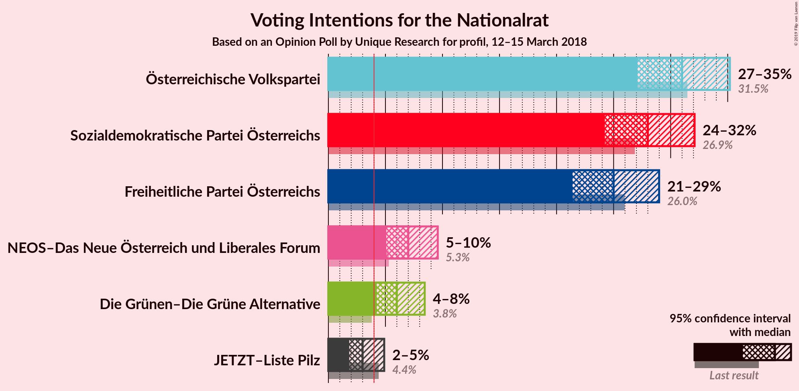

### Confidence Intervals

| Party | Last Result | Poll Result | 80% Confidence Interval | 90% Confidence Interval | 95% Confidence Interval | 99% Confidence Interval |
|:-----:|:-----------:|:-----------:|:-----------------------:|:-----------------------:|:-----------------------:|:-----------------------:|
| Österreichische Volkspartei | 31.5% | 31.0% | 28.4–33.7% |27.7–34.5% |27.1–35.2% |25.9–36.5% |
| Sozialdemokratische Partei Österreichs | 26.9% | 28.0% | 25.5–30.7% |24.8–31.4% |24.2–32.1% |23.1–33.4% |
| Freiheitliche Partei Österreichs | 26.0% | 25.0% | 22.6–27.6% |22.0–28.3% |21.4–29.0% |20.3–30.3% |
| NEOS–Das Neue Österreich und Liberales Forum | 5.3% | 7.0% | 5.7–8.7% |5.4–9.2% |5.1–9.6% |4.5–10.5% |
| Die Grünen–Die Grüne Alternative | 3.8% | 6.0% | 4.8–7.6% |4.5–8.0% |4.2–8.4% |3.7–9.3% |
| JETZT–Liste Pilz | 4.4% | 3.0% | 2.2–4.2% |2.0–4.6% |1.8–4.9% |1.5–5.5% |

*Note:* The poll result column reflects the actual value used in the calculations. Published results may vary slightly, and in addition be rounded to fewer digits.

## Seats

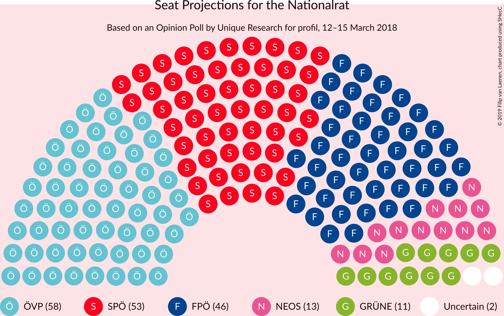

### Confidence Intervals

| Party | Last Result | Median | 80% Confidence Interval | 90% Confidence Interval | 95% Confidence Interval | 99% Confidence Interval |
|:-----:|:-----------:|:------:|:-----------------------:|:-----------------------:|:-----------------------:|:-----------------------:|
| <a href="#österreichische-volkspartei">Österreichische Volkspartei</a> | 62 | 58 | 53–63 |52–65 |51–66 |48–69 |
| <a href="#sozialdemokratische-partei-österreichs">Sozialdemokratische Partei Österreichs</a> | 52 | 53 | 48–58 |46–59 |45–61 |43–62 |
| <a href="#freiheitliche-partei-österreichs">Freiheitliche Partei Österreichs</a> | 51 | 46 | 43–51 |41–52 |40–53 |38–57 |
| <a href="#neos–das-neue-österreich-und-liberales-forum">NEOS–Das Neue Österreich und Liberales Forum</a> | 10 | 13 | 10–16 |9–17 |9–18 |8–19 |
| <a href="#die-grünen–die-grüne-alternative">Die Grünen–Die Grüne Alternative</a> | 0 | 11 | 9–14 |8–15 |8–15 |0–17 |
| <a href="#jetzt–liste-pilz">JETZT–Liste Pilz</a> | 8 | 0 | 0–7 |0–8 |0–9 |0–10 |

### Österreichische Volkspartei

*For a full overview of the results for this party, see the [Österreichische Volkspartei](party-österreichischevolkspartei.html) page.*

| Number of Seats | Probability | Accumulated | Special Marks |
|:---------------:|:-----------:|:-----------:|:-------------:|
| 46 | 0.1% | 100% |  |
| 47 | 0.1% | 99.9% |  |
| 48 | 0.8% | 99.8% |  |
| 49 | 0.4% | 99.0% |  |
| 50 | 1.0% | 98.6% |  |
| 51 | 2% | 98% |  |
| 52 | 3% | 96% |  |
| 53 | 5% | 93% |  |
| 54 | 4% | 88% |  |
| 55 | 10% | 84% |  |
| 56 | 11% | 74% |  |
| 57 | 5% | 63% |  |
| 58 | 10% | 57% | Median |
| 59 | 6% | 48% |  |
| 60 | 7% | 42% |  |
| 61 | 16% | 35% |  |
| 62 | 5% | 19% | Last Result |
| 63 | 5% | 14% |  |
| 64 | 2% | 9% |  |
| 65 | 3% | 7% |  |
| 66 | 1.4% | 4% |  |
| 67 | 0.7% | 2% |  |
| 68 | 1.0% | 2% |  |
| 69 | 0.4% | 0.6% |  |
| 70 | 0.1% | 0.2% |  |
| 71 | 0.1% | 0.2% |  |
| 72 | 0% | 0% |  |

### Sozialdemokratische Partei Österreichs

*For a full overview of the results for this party, see the [Sozialdemokratische Partei Österreichs](party-sozialdemokratischeparteiösterreichs.html) page.*

| Number of Seats | Probability | Accumulated | Special Marks |
|:---------------:|:-----------:|:-----------:|:-------------:|
| 41 | 0% | 100% |  |
| 42 | 0.1% | 99.9% |  |
| 43 | 0.9% | 99.8% |  |
| 44 | 1.1% | 98.9% |  |
| 45 | 1.2% | 98% |  |
| 46 | 3% | 97% |  |
| 47 | 3% | 94% |  |
| 48 | 3% | 91% |  |
| 49 | 6% | 88% |  |
| 50 | 8% | 82% |  |
| 51 | 17% | 74% |  |
| 52 | 6% | 57% | Last Result |
| 53 | 10% | 51% | Median |
| 54 | 13% | 41% |  |
| 55 | 3% | 28% |  |
| 56 | 6% | 25% |  |
| 57 | 9% | 19% |  |
| 58 | 4% | 10% |  |
| 59 | 4% | 7% |  |
| 60 | 0.6% | 3% |  |
| 61 | 1.0% | 3% |  |
| 62 | 1.1% | 2% |  |
| 63 | 0.1% | 0.5% |  |
| 64 | 0.1% | 0.4% |  |
| 65 | 0.2% | 0.3% |  |
| 66 | 0.1% | 0.1% |  |
| 67 | 0% | 0% |  |

### Freiheitliche Partei Österreichs

*For a full overview of the results for this party, see the [Freiheitliche Partei Österreichs](party-freiheitlicheparteiösterreichs.html) page.*

| Number of Seats | Probability | Accumulated | Special Marks |
|:---------------:|:-----------:|:-----------:|:-------------:|
| 35 | 0% | 100% |  |
| 36 | 0.2% | 99.9% |  |
| 37 | 0.2% | 99.8% |  |
| 38 | 0.3% | 99.6% |  |
| 39 | 0.6% | 99.3% |  |
| 40 | 1.5% | 98.7% |  |
| 41 | 3% | 97% |  |
| 42 | 1.4% | 94% |  |
| 43 | 6% | 93% |  |
| 44 | 7% | 87% |  |
| 45 | 13% | 80% |  |
| 46 | 21% | 67% | Median |
| 47 | 9% | 46% |  |
| 48 | 9% | 37% |  |
| 49 | 12% | 27% |  |
| 50 | 4% | 15% |  |
| 51 | 2% | 11% | Last Result |
| 52 | 4% | 9% |  |
| 53 | 2% | 4% |  |
| 54 | 0.7% | 2% |  |
| 55 | 0.5% | 2% |  |
| 56 | 0.4% | 1.2% |  |
| 57 | 0.5% | 0.8% |  |
| 58 | 0.2% | 0.3% |  |
| 59 | 0% | 0.1% |  |
| 60 | 0% | 0.1% |  |
| 61 | 0% | 0.1% |  |
| 62 | 0% | 0% |  |

### NEOS–Das Neue Österreich und Liberales Forum

*For a full overview of the results for this party, see the [NEOS–Das Neue Österreich und Liberales Forum](party-neos–dasneueösterreichundliberalesforum.html) page.*

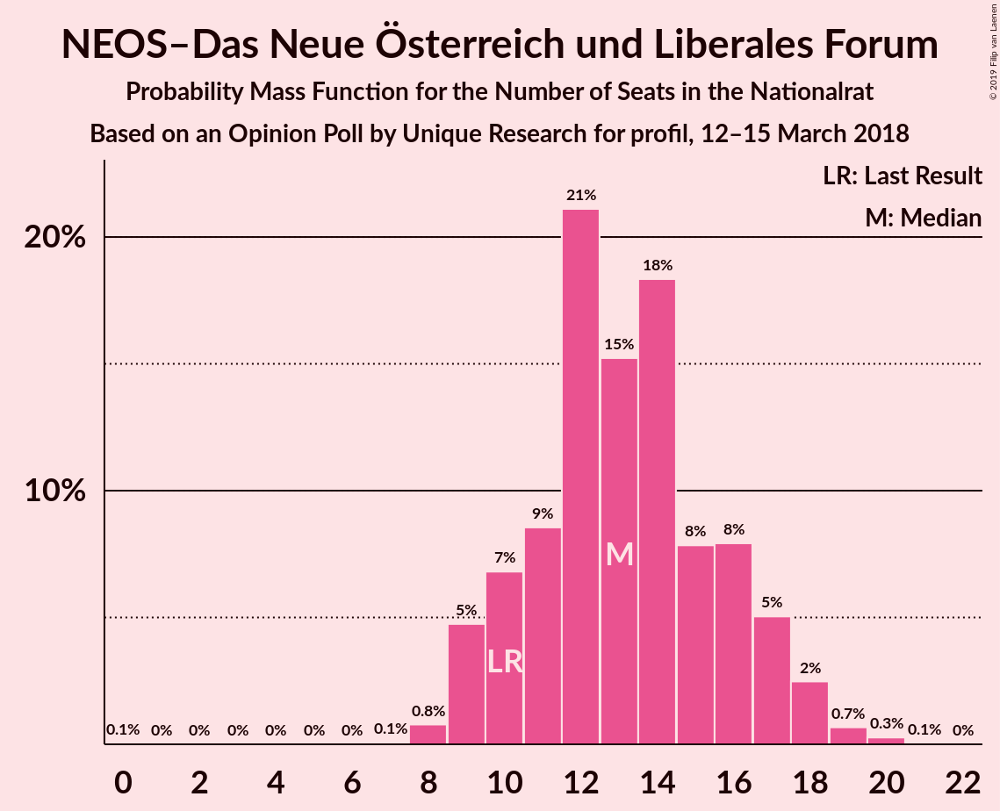

| Number of Seats | Probability | Accumulated | Special Marks |
|:---------------:|:-----------:|:-----------:|:-------------:|
| 0 | 0.1% | 100% |  |
| 1 | 0% | 99.9% |  |
| 2 | 0% | 99.9% |  |
| 3 | 0% | 99.9% |  |
| 4 | 0% | 99.9% |  |
| 5 | 0% | 99.9% |  |
| 6 | 0% | 99.9% |  |
| 7 | 0.1% | 99.9% |  |
| 8 | 0.8% | 99.9% |  |
| 9 | 5% | 99.1% |  |
| 10 | 7% | 94% | Last Result |
| 11 | 9% | 88% |  |
| 12 | 21% | 79% |  |
| 13 | 15% | 58% | Median |
| 14 | 18% | 43% |  |
| 15 | 8% | 24% |  |
| 16 | 8% | 16% |  |
| 17 | 5% | 9% |  |
| 18 | 2% | 4% |  |
| 19 | 0.7% | 1.0% |  |
| 20 | 0.3% | 0.4% |  |
| 21 | 0.1% | 0.1% |  |
| 22 | 0% | 0% |  |

### Die Grünen–Die Grüne Alternative

*For a full overview of the results for this party, see the [Die Grünen–Die Grüne Alternative](party-diegrünen–diegrünealternative.html) page.*

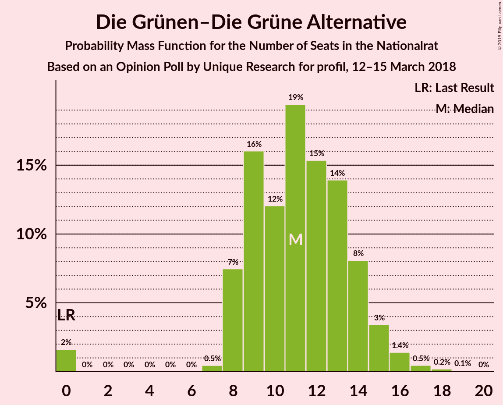

| Number of Seats | Probability | Accumulated | Special Marks |
|:---------------:|:-----------:|:-----------:|:-------------:|
| 0 | 2% | 100% | Last Result |
| 1 | 0% | 98% |  |
| 2 | 0% | 98% |  |
| 3 | 0% | 98% |  |
| 4 | 0% | 98% |  |
| 5 | 0% | 98% |  |
| 6 | 0% | 98% |  |
| 7 | 0.5% | 98% |  |
| 8 | 7% | 98% |  |
| 9 | 16% | 90% |  |
| 10 | 12% | 74% |  |
| 11 | 19% | 62% | Median |
| 12 | 15% | 43% |  |
| 13 | 14% | 28% |  |
| 14 | 8% | 14% |  |
| 15 | 3% | 6% |  |
| 16 | 1.4% | 2% |  |
| 17 | 0.5% | 0.8% |  |
| 18 | 0.2% | 0.3% |  |
| 19 | 0.1% | 0.1% |  |
| 20 | 0% | 0% |  |

### JETZT–Liste Pilz

*For a full overview of the results for this party, see the [JETZT–Liste Pilz](party-jetzt–listepilz.html) page.*

| Number of Seats | Probability | Accumulated | Special Marks |
|:---------------:|:-----------:|:-----------:|:-------------:|
| 0 | 87% | 100% | Median |
| 1 | 0% | 13% |  |
| 2 | 0% | 13% |  |
| 3 | 0% | 13% |  |
| 4 | 0% | 13% |  |
| 5 | 0% | 13% |  |
| 6 | 0% | 13% |  |
| 7 | 5% | 13% |  |
| 8 | 6% | 8% | Last Result |
| 9 | 2% | 3% |  |
| 10 | 0.5% | 0.6% |  |
| 11 | 0.1% | 0.1% |  |
| 12 | 0% | 0% |  |

## Coalitions

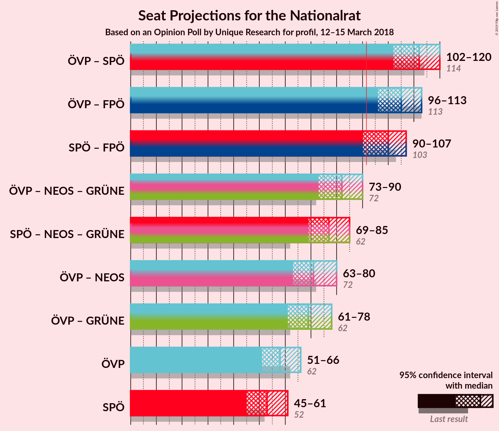

### Confidence Intervals

| Coalition | Last Result | Median | Majority? | 80% Confidence Interval | 90% Confidence Interval | 95% Confidence Interval | 99% Confidence Interval |
|:---------:|:-----------:|:------:|:---------:|:-----------------------:|:-----------------------:|:-----------------------:|:-----------------------:|
| Österreichische Volkspartei – Sozialdemokratische Partei Österreichs | 114 | 112 | 100% | 105–116 | 104–118 | 102–120 | 99–122 |
| Österreichische Volkspartei – Freiheitliche Partei Österreichs | 113 | 105 | 99.9% | 100–111 | 98–112 | 96–113 | 94–116 |
| Sozialdemokratische Partei Österreichs – Freiheitliche Partei Österreichs | 103 | 100 | 96% | 94–104 | 93–107 | 90–107 | 88–111 |
| Österreichische Volkspartei – NEOS–Das Neue Österreich und Liberales Forum – Die Grünen–Die Grüne Alternative | 72 | 82 | 2% | 77–88 | 75–90 | 73–90 | 70–94 |
| Sozialdemokratische Partei Österreichs – NEOS–Das Neue Österreich und Liberales Forum – Die Grünen–Die Grüne Alternative | 62 | 77 | 0% | 71–82 | 70–83 | 69–85 | 64–87 |
| Österreichische Volkspartei – NEOS–Das Neue Österreich und Liberales Forum | 72 | 71 | 0% | 65–78 | 64–79 | 63–80 | 61–82 |
| Österreichische Volkspartei – Die Grünen–Die Grüne Alternative | 62 | 69 | 0% | 64–74 | 62–74 | 61–78 | 57–80 |
| Österreichische Volkspartei | 62 | 58 | 0% | 53–63 | 52–65 | 51–66 | 48–69 |
| Sozialdemokratische Partei Österreichs | 52 | 53 | 0% | 48–58 | 46–59 | 45–61 | 43–62 |

### Österreichische Volkspartei – Sozialdemokratische Partei Österreichs

| Number of Seats | Probability | Accumulated | Special Marks |
|:---------------:|:-----------:|:-----------:|:-------------:|
| 97 | 0.1% | 100% |  |
| 98 | 0.2% | 99.9% |  |
| 99 | 0.3% | 99.7% |  |
| 100 | 0.7% | 99.4% |  |
| 101 | 0.9% | 98.7% |  |
| 102 | 0.4% | 98% |  |
| 103 | 0.5% | 97% |  |
| 104 | 2% | 97% |  |
| 105 | 6% | 95% |  |
| 106 | 9% | 88% |  |
| 107 | 3% | 79% |  |
| 108 | 8% | 76% |  |
| 109 | 7% | 68% |  |
| 110 | 4% | 61% |  |
| 111 | 5% | 57% | Median |
| 112 | 14% | 52% |  |
| 113 | 4% | 38% |  |
| 114 | 9% | 34% | Last Result |
| 115 | 13% | 25% |  |
| 116 | 4% | 12% |  |
| 117 | 3% | 8% |  |
| 118 | 2% | 6% |  |
| 119 | 0.8% | 3% |  |
| 120 | 0.9% | 3% |  |
| 121 | 1.2% | 2% |  |
| 122 | 0.1% | 0.6% |  |
| 123 | 0.3% | 0.5% |  |
| 124 | 0% | 0.2% |  |
| 125 | 0.1% | 0.1% |  |
| 126 | 0% | 0% |  |

### Österreichische Volkspartei – Freiheitliche Partei Österreichs

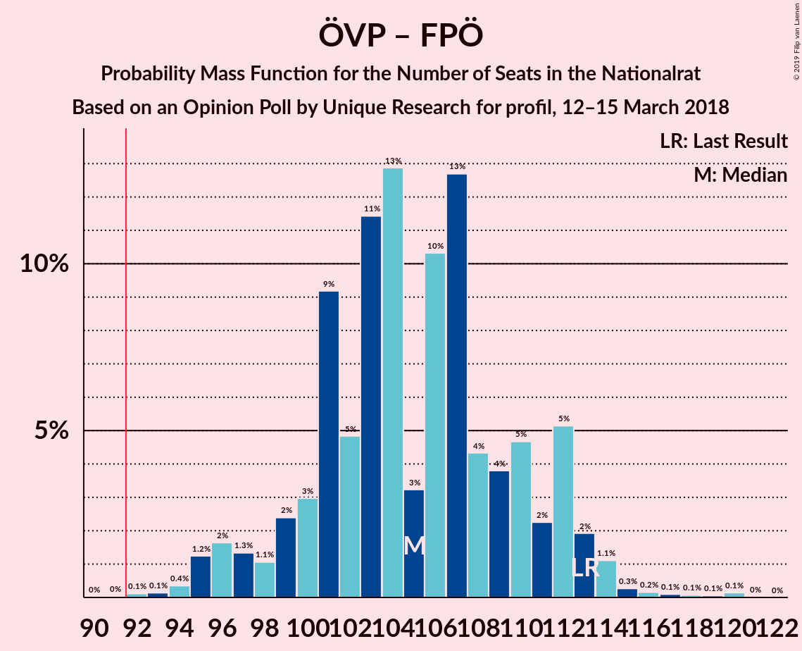

| Number of Seats | Probability | Accumulated | Special Marks |
|:---------------:|:-----------:|:-----------:|:-------------:|
| 90 | 0% | 100% |  |
| 91 | 0% | 99.9% |  |
| 92 | 0.1% | 99.9% | Majority |
| 93 | 0.1% | 99.8% |  |
| 94 | 0.4% | 99.7% |  |
| 95 | 1.2% | 99.3% |  |
| 96 | 2% | 98% |  |
| 97 | 1.3% | 96% |  |
| 98 | 1.1% | 95% |  |
| 99 | 2% | 94% |  |
| 100 | 3% | 92% |  |
| 101 | 9% | 89% |  |
| 102 | 5% | 79% |  |
| 103 | 11% | 75% |  |
| 104 | 13% | 63% | Median |
| 105 | 3% | 50% |  |
| 106 | 10% | 47% |  |
| 107 | 13% | 37% |  |
| 108 | 4% | 24% |  |
| 109 | 4% | 20% |  |
| 110 | 5% | 16% |  |
| 111 | 2% | 11% |  |
| 112 | 5% | 9% |  |
| 113 | 2% | 4% | Last Result |
| 114 | 1.1% | 2% |  |
| 115 | 0.3% | 0.8% |  |
| 116 | 0.2% | 0.5% |  |
| 117 | 0.1% | 0.4% |  |
| 118 | 0.1% | 0.3% |  |
| 119 | 0.1% | 0.2% |  |
| 120 | 0.1% | 0.2% |  |
| 121 | 0% | 0% |  |

### Sozialdemokratische Partei Österreichs – Freiheitliche Partei Österreichs

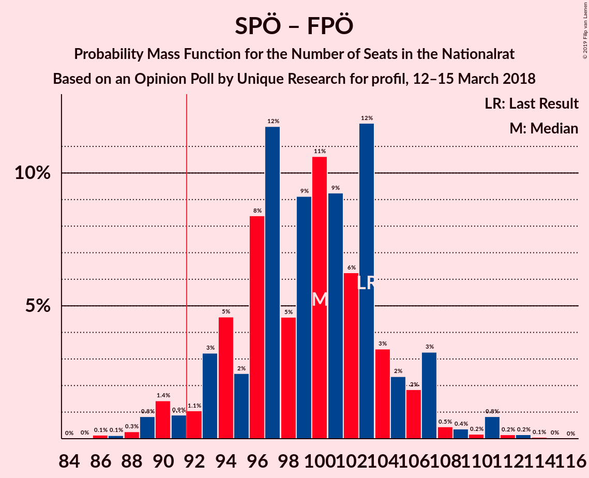

| Number of Seats | Probability | Accumulated | Special Marks |
|:---------------:|:-----------:|:-----------:|:-------------:|
| 85 | 0% | 100% |  |
| 86 | 0.1% | 99.9% |  |
| 87 | 0.1% | 99.8% |  |
| 88 | 0.3% | 99.7% |  |
| 89 | 0.8% | 99.4% |  |
| 90 | 1.4% | 98.6% |  |
| 91 | 0.9% | 97% |  |
| 92 | 1.1% | 96% | Majority |
| 93 | 3% | 95% |  |
| 94 | 5% | 92% |  |
| 95 | 2% | 87% |  |
| 96 | 8% | 85% |  |
| 97 | 12% | 77% |  |
| 98 | 5% | 65% |  |
| 99 | 9% | 60% | Median |
| 100 | 11% | 51% |  |
| 101 | 9% | 40% |  |
| 102 | 6% | 31% |  |
| 103 | 12% | 25% | Last Result |
| 104 | 3% | 13% |  |
| 105 | 2% | 10% |  |
| 106 | 2% | 7% |  |
| 107 | 3% | 6% |  |
| 108 | 0.5% | 2% |  |
| 109 | 0.4% | 2% |  |
| 110 | 0.2% | 1.4% |  |
| 111 | 0.8% | 1.3% |  |
| 112 | 0.2% | 0.4% |  |
| 113 | 0.2% | 0.3% |  |
| 114 | 0.1% | 0.1% |  |
| 115 | 0% | 0% |  |

### Österreichische Volkspartei – NEOS–Das Neue Österreich und Liberales Forum – Die Grünen–Die Grüne Alternative

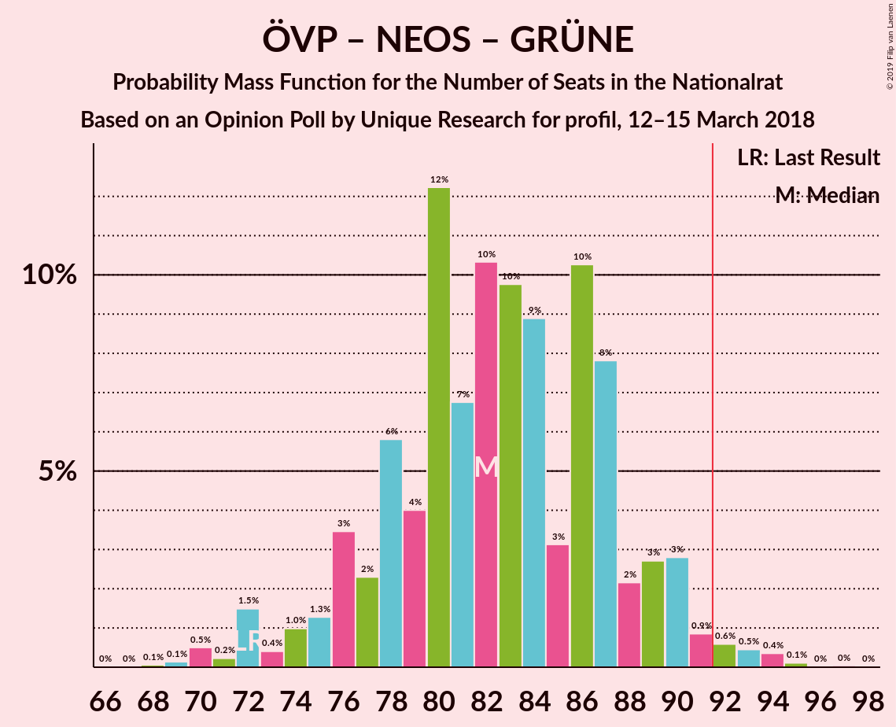

| Number of Seats | Probability | Accumulated | Special Marks |
|:---------------:|:-----------:|:-----------:|:-------------:|
| 68 | 0.1% | 100% |  |
| 69 | 0.1% | 99.9% |  |
| 70 | 0.5% | 99.8% |  |
| 71 | 0.2% | 99.3% |  |
| 72 | 1.5% | 99.0% | Last Result |
| 73 | 0.4% | 98% |  |
| 74 | 1.0% | 97% |  |
| 75 | 1.3% | 96% |  |
| 76 | 3% | 95% |  |
| 77 | 2% | 91% |  |
| 78 | 6% | 89% |  |
| 79 | 4% | 83% |  |
| 80 | 12% | 79% |  |
| 81 | 7% | 67% |  |
| 82 | 10% | 60% | Median |
| 83 | 10% | 50% |  |
| 84 | 9% | 40% |  |
| 85 | 3% | 31% |  |
| 86 | 10% | 28% |  |
| 87 | 8% | 18% |  |
| 88 | 2% | 10% |  |
| 89 | 3% | 8% |  |
| 90 | 3% | 5% |  |
| 91 | 0.9% | 2% |  |
| 92 | 0.6% | 2% | Majority |
| 93 | 0.5% | 1.0% |  |
| 94 | 0.4% | 0.5% |  |
| 95 | 0.1% | 0.2% |  |
| 96 | 0% | 0.1% |  |
| 97 | 0% | 0.1% |  |
| 98 | 0% | 0% |  |

### Sozialdemokratische Partei Österreichs – NEOS–Das Neue Österreich und Liberales Forum – Die Grünen–Die Grüne Alternative

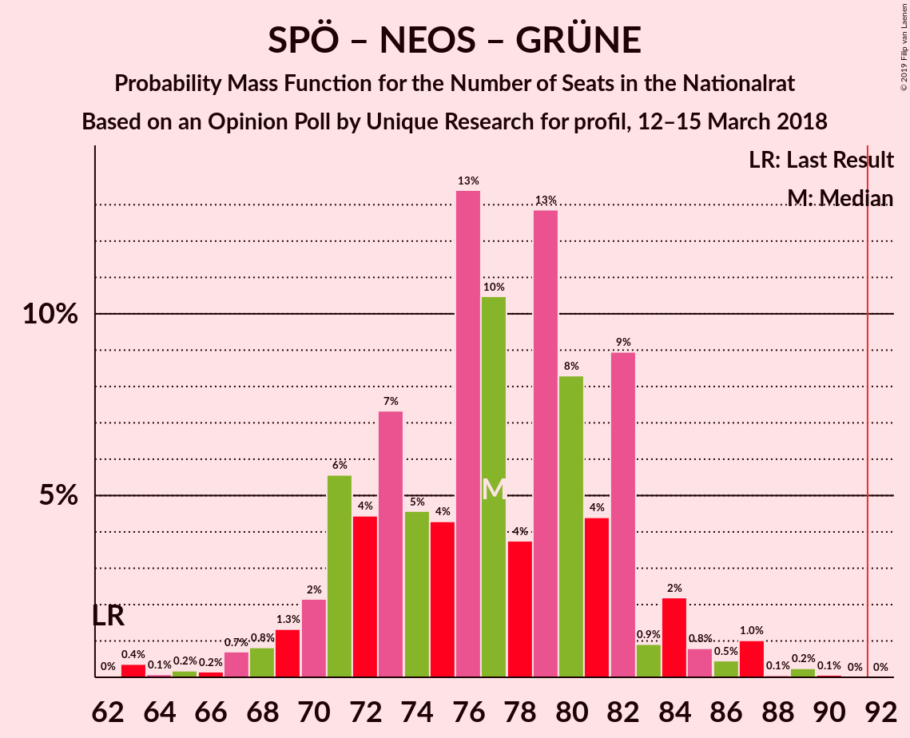

| Number of Seats | Probability | Accumulated | Special Marks |
|:---------------:|:-----------:|:-----------:|:-------------:|
| 62 | 0% | 100% | Last Result |
| 63 | 0.4% | 99.9% |  |
| 64 | 0.1% | 99.6% |  |
| 65 | 0.2% | 99.5% |  |
| 66 | 0.2% | 99.3% |  |
| 67 | 0.7% | 99.2% |  |
| 68 | 0.8% | 98% |  |
| 69 | 1.3% | 98% |  |
| 70 | 2% | 96% |  |
| 71 | 6% | 94% |  |
| 72 | 4% | 89% |  |
| 73 | 7% | 84% |  |
| 74 | 5% | 77% |  |
| 75 | 4% | 72% |  |
| 76 | 13% | 68% |  |
| 77 | 10% | 55% | Median |
| 78 | 4% | 44% |  |
| 79 | 13% | 40% |  |
| 80 | 8% | 27% |  |
| 81 | 4% | 19% |  |
| 82 | 9% | 15% |  |
| 83 | 0.9% | 6% |  |
| 84 | 2% | 5% |  |
| 85 | 0.8% | 3% |  |
| 86 | 0.5% | 2% |  |
| 87 | 1.0% | 1.4% |  |
| 88 | 0.1% | 0.4% |  |
| 89 | 0.2% | 0.4% |  |
| 90 | 0.1% | 0.1% |  |
| 91 | 0% | 0% |  |

### Österreichische Volkspartei – NEOS–Das Neue Österreich und Liberales Forum

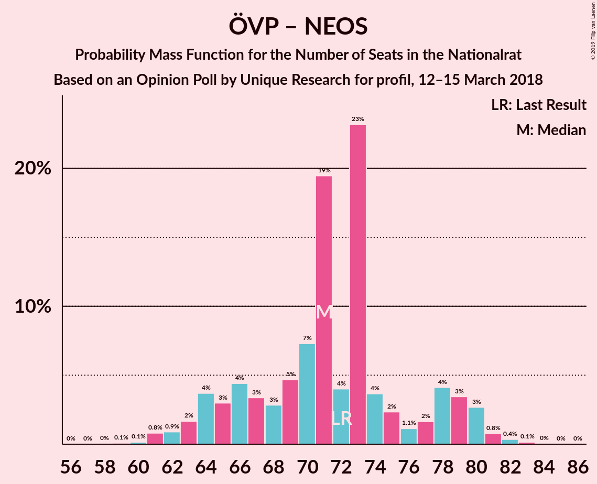

| Number of Seats | Probability | Accumulated | Special Marks |
|:---------------:|:-----------:|:-----------:|:-------------:|
| 57 | 0% | 100% |  |
| 58 | 0% | 99.9% |  |
| 59 | 0.1% | 99.9% |  |
| 60 | 0.1% | 99.8% |  |
| 61 | 0.8% | 99.7% |  |
| 62 | 0.9% | 98.9% |  |
| 63 | 2% | 98% |  |
| 64 | 4% | 96% |  |
| 65 | 3% | 93% |  |
| 66 | 4% | 90% |  |
| 67 | 3% | 85% |  |
| 68 | 3% | 82% |  |
| 69 | 5% | 79% |  |
| 70 | 7% | 74% |  |
| 71 | 19% | 67% | Median |
| 72 | 4% | 48% | Last Result |
| 73 | 23% | 44% |  |
| 74 | 4% | 20% |  |
| 75 | 2% | 17% |  |
| 76 | 1.1% | 14% |  |
| 77 | 2% | 13% |  |
| 78 | 4% | 12% |  |
| 79 | 3% | 8% |  |
| 80 | 3% | 4% |  |
| 81 | 0.8% | 1.4% |  |
| 82 | 0.4% | 0.6% |  |
| 83 | 0.1% | 0.3% |  |
| 84 | 0% | 0.1% |  |
| 85 | 0% | 0.1% |  |
| 86 | 0% | 0% |  |

### Österreichische Volkspartei – Die Grünen–Die Grüne Alternative

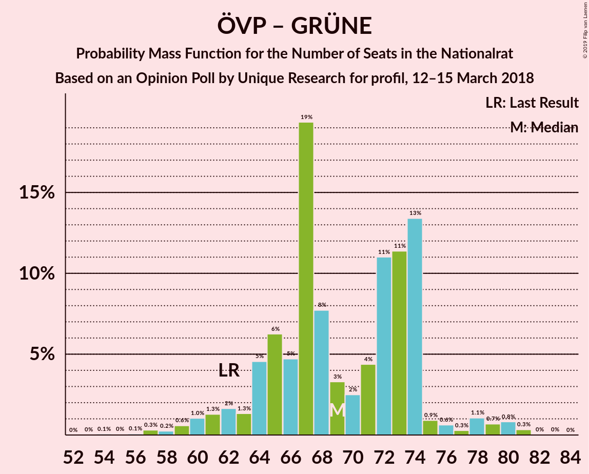

| Number of Seats | Probability | Accumulated | Special Marks |
|:---------------:|:-----------:|:-----------:|:-------------:|
| 54 | 0.1% | 100% |  |
| 55 | 0% | 99.9% |  |
| 56 | 0.1% | 99.8% |  |
| 57 | 0.3% | 99.8% |  |
| 58 | 0.2% | 99.5% |  |
| 59 | 0.6% | 99.2% |  |
| 60 | 1.0% | 98.6% |  |
| 61 | 1.3% | 98% |  |
| 62 | 2% | 96% | Last Result |
| 63 | 1.3% | 95% |  |
| 64 | 5% | 93% |  |
| 65 | 6% | 89% |  |
| 66 | 5% | 83% |  |
| 67 | 19% | 78% |  |
| 68 | 8% | 58% |  |
| 69 | 3% | 51% | Median |
| 70 | 2% | 47% |  |
| 71 | 4% | 45% |  |
| 72 | 11% | 41% |  |
| 73 | 11% | 30% |  |
| 74 | 13% | 18% |  |
| 75 | 0.9% | 5% |  |
| 76 | 0.6% | 4% |  |
| 77 | 0.3% | 3% |  |
| 78 | 1.1% | 3% |  |
| 79 | 0.7% | 2% |  |
| 80 | 0.8% | 1.2% |  |
| 81 | 0.3% | 0.4% |  |
| 82 | 0% | 0.1% |  |
| 83 | 0% | 0% |  |

### Österreichische Volkspartei

| Number of Seats | Probability | Accumulated | Special Marks |
|:---------------:|:-----------:|:-----------:|:-------------:|
| 46 | 0.1% | 100% |  |
| 47 | 0.1% | 99.9% |  |
| 48 | 0.8% | 99.8% |  |
| 49 | 0.4% | 99.0% |  |
| 50 | 1.0% | 98.6% |  |
| 51 | 2% | 98% |  |
| 52 | 3% | 96% |  |
| 53 | 5% | 93% |  |
| 54 | 4% | 88% |  |
| 55 | 10% | 84% |  |
| 56 | 11% | 74% |  |
| 57 | 5% | 63% |  |
| 58 | 10% | 57% | Median |
| 59 | 6% | 48% |  |
| 60 | 7% | 42% |  |
| 61 | 16% | 35% |  |
| 62 | 5% | 19% | Last Result |
| 63 | 5% | 14% |  |
| 64 | 2% | 9% |  |
| 65 | 3% | 7% |  |
| 66 | 1.4% | 4% |  |
| 67 | 0.7% | 2% |  |
| 68 | 1.0% | 2% |  |
| 69 | 0.4% | 0.6% |  |
| 70 | 0.1% | 0.2% |  |
| 71 | 0.1% | 0.2% |  |
| 72 | 0% | 0% |  |

### Sozialdemokratische Partei Österreichs

| Number of Seats | Probability | Accumulated | Special Marks |
|:---------------:|:-----------:|:-----------:|:-------------:|
| 41 | 0% | 100% |  |
| 42 | 0.1% | 99.9% |  |
| 43 | 0.9% | 99.8% |  |
| 44 | 1.1% | 98.9% |  |
| 45 | 1.2% | 98% |  |
| 46 | 3% | 97% |  |
| 47 | 3% | 94% |  |
| 48 | 3% | 91% |  |
| 49 | 6% | 88% |  |
| 50 | 8% | 82% |  |
| 51 | 17% | 74% |  |
| 52 | 6% | 57% | Last Result |
| 53 | 10% | 51% | Median |
| 54 | 13% | 41% |  |
| 55 | 3% | 28% |  |
| 56 | 6% | 25% |  |
| 57 | 9% | 19% |  |
| 58 | 4% | 10% |  |
| 59 | 4% | 7% |  |
| 60 | 0.6% | 3% |  |
| 61 | 1.0% | 3% |  |
| 62 | 1.1% | 2% |  |
| 63 | 0.1% | 0.5% |  |
| 64 | 0.1% | 0.4% |  |
| 65 | 0.2% | 0.3% |  |
| 66 | 0.1% | 0.1% |  |
| 67 | 0% | 0% |  |

## Technical Information

### Opinion Poll

+ **Polling firm:** Unique Research
+ **Commissioner(s):** profil
+ **Fieldwork period:** 12–15 March 2018

### Calculations

+ **Sample size:** 500
+ **Simulations done:** 131,072
+ **Error estimate:** 1.39%

