# Opinion Poll by IMAS for Kronen Zeitung, 14 February–18 March 2018

<a href="#voting-intentions">Voting Intentions</a> | <a href="#seats">Seats</a> | <a href="#coalitions">Coalitions</a> | <a href="#technical-information">Technical Information</a>

## Voting Intentions

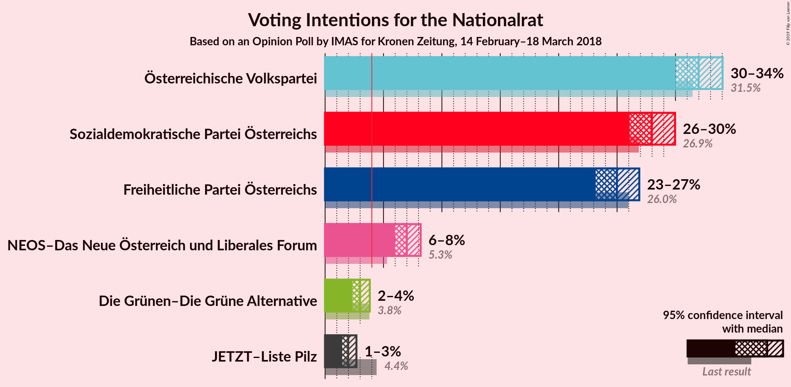

### Confidence Intervals

| Party | Last Result | Poll Result | 80% Confidence Interval | 90% Confidence Interval | 95% Confidence Interval | 99% Confidence Interval |
|:-----:|:-----------:|:-----------:|:-----------------------:|:-----------------------:|:-----------------------:|:-----------------------:|
| Österreichische Volkspartei | 31.5% | 32.0% | 30.7–33.3% |30.3–33.7% |30.0–34.0% |29.4–34.7% |
| Sozialdemokratische Partei Österreichs | 26.9% | 28.0% | 26.7–29.3% |26.4–29.6% |26.1–30.0% |25.5–30.6% |
| Freiheitliche Partei Österreichs | 26.0% | 25.0% | 23.8–26.2% |23.5–26.6% |23.2–26.9% |22.6–27.5% |
| NEOS–Das Neue Österreich und Liberales Forum | 5.3% | 7.0% | 6.3–7.8% |6.1–8.0% |6.0–8.2% |5.7–8.6% |
| Die Grünen–Die Grüne Alternative | 3.8% | 3.0% | 2.6–3.5% |2.4–3.7% |2.3–3.8% |2.1–4.1% |
| JETZT–Liste Pilz | 4.4% | 2.0% | 1.6–2.4% |1.5–2.6% |1.5–2.7% |1.3–2.9% |

*Note:* The poll result column reflects the actual value used in the calculations. Published results may vary slightly, and in addition be rounded to fewer digits.

## Seats

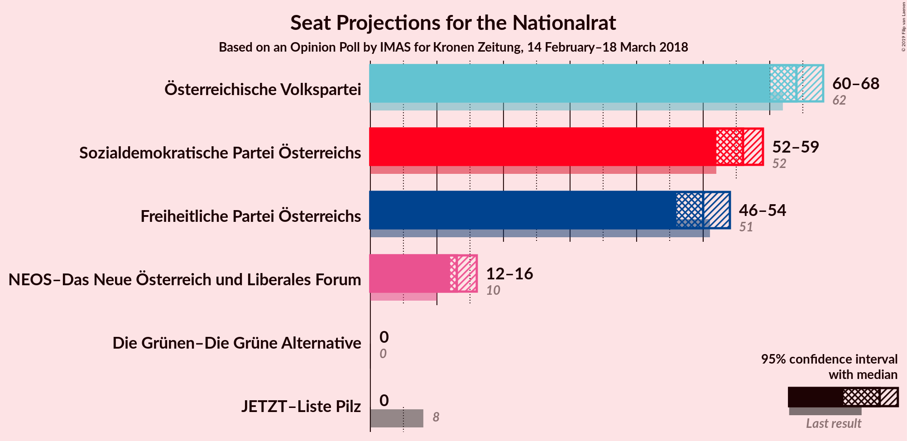

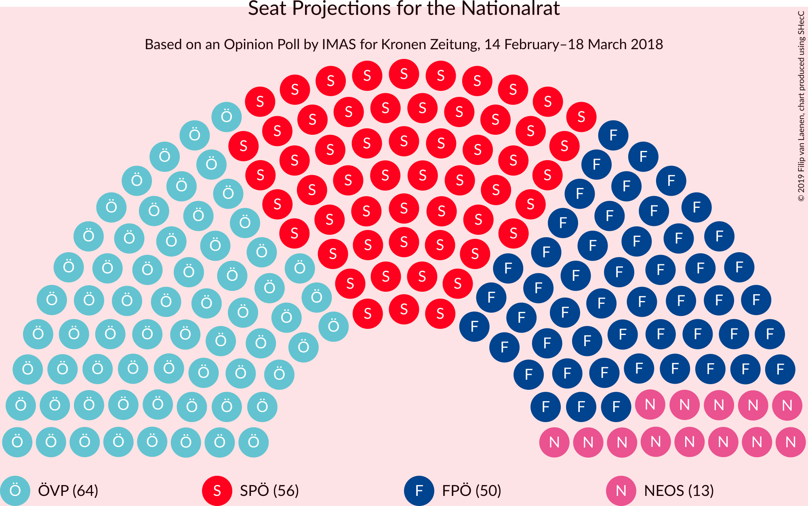

### Confidence Intervals

| Party | Last Result | Median | 80% Confidence Interval | 90% Confidence Interval | 95% Confidence Interval | 99% Confidence Interval |
|:-----:|:-----------:|:------:|:-----------------------:|:-----------------------:|:-----------------------:|:-----------------------:|
| <a href="#österreichische-volkspartei">Österreichische Volkspartei</a> | 62 | 64 | 61–66 |61–67 |60–68 |59–69 |
| <a href="#sozialdemokratische-partei-österreichs">Sozialdemokratische Partei Österreichs</a> | 52 | 56 | 54–58 |53–58 |52–59 |51–61 |
| <a href="#freiheitliche-partei-österreichs">Freiheitliche Partei Österreichs</a> | 51 | 50 | 47–52 |47–53 |46–54 |45–55 |
| <a href="#neos–das-neue-österreich-und-liberales-forum">NEOS–Das Neue Österreich und Liberales Forum</a> | 10 | 13 | 12–15 |12–15 |12–16 |11–17 |
| <a href="#die-grünen–die-grüne-alternative">Die Grünen–Die Grüne Alternative</a> | 0 | 0 | 0 |0 |0 |0–7 |
| <a href="#jetzt–liste-pilz">JETZT–Liste Pilz</a> | 8 | 0 | 0 |0 |0 |0 |

### Österreichische Volkspartei

*For a full overview of the results for this party, see the [Österreichische Volkspartei](party-österreichischevolkspartei.html) page.*

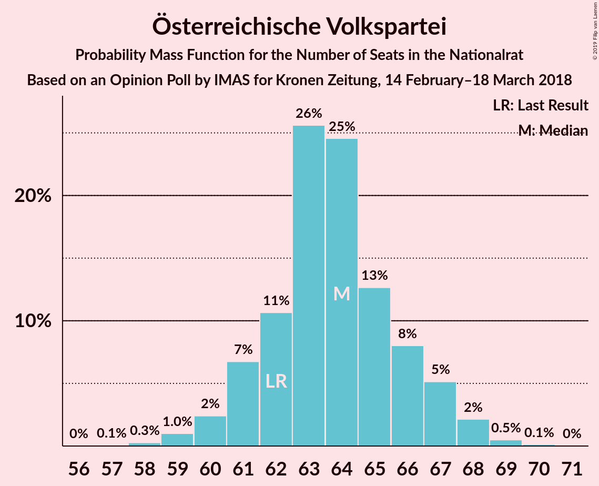

| Number of Seats | Probability | Accumulated | Special Marks |
|:---------------:|:-----------:|:-----------:|:-------------:|
| 57 | 0.1% | 100% |  |
| 58 | 0.3% | 99.9% |  |
| 59 | 1.0% | 99.6% |  |
| 60 | 2% | 98.6% |  |
| 61 | 7% | 96% |  |
| 62 | 11% | 89% | Last Result |
| 63 | 26% | 79% |  |
| 64 | 25% | 53% | Median |
| 65 | 13% | 29% |  |
| 66 | 8% | 16% |  |
| 67 | 5% | 8% |  |
| 68 | 2% | 3% |  |
| 69 | 0.5% | 0.7% |  |
| 70 | 0.1% | 0.2% |  |
| 71 | 0% | 0% |  |

### Sozialdemokratische Partei Österreichs

*For a full overview of the results for this party, see the [Sozialdemokratische Partei Österreichs](party-sozialdemokratischeparteiösterreichs.html) page.*

| Number of Seats | Probability | Accumulated | Special Marks |
|:---------------:|:-----------:|:-----------:|:-------------:|
| 49 | 0.1% | 100% |  |
| 50 | 0.3% | 99.9% |  |
| 51 | 0.8% | 99.6% |  |
| 52 | 2% | 98.8% | Last Result |
| 53 | 6% | 97% |  |
| 54 | 12% | 92% |  |
| 55 | 23% | 80% |  |
| 56 | 28% | 57% | Median |
| 57 | 15% | 29% |  |
| 58 | 10% | 14% |  |
| 59 | 3% | 4% |  |
| 60 | 1.1% | 2% |  |
| 61 | 0.4% | 0.6% |  |
| 62 | 0.2% | 0.2% |  |
| 63 | 0% | 0% |  |

### Freiheitliche Partei Österreichs

*For a full overview of the results for this party, see the [Freiheitliche Partei Österreichs](party-freiheitlicheparteiösterreichs.html) page.*

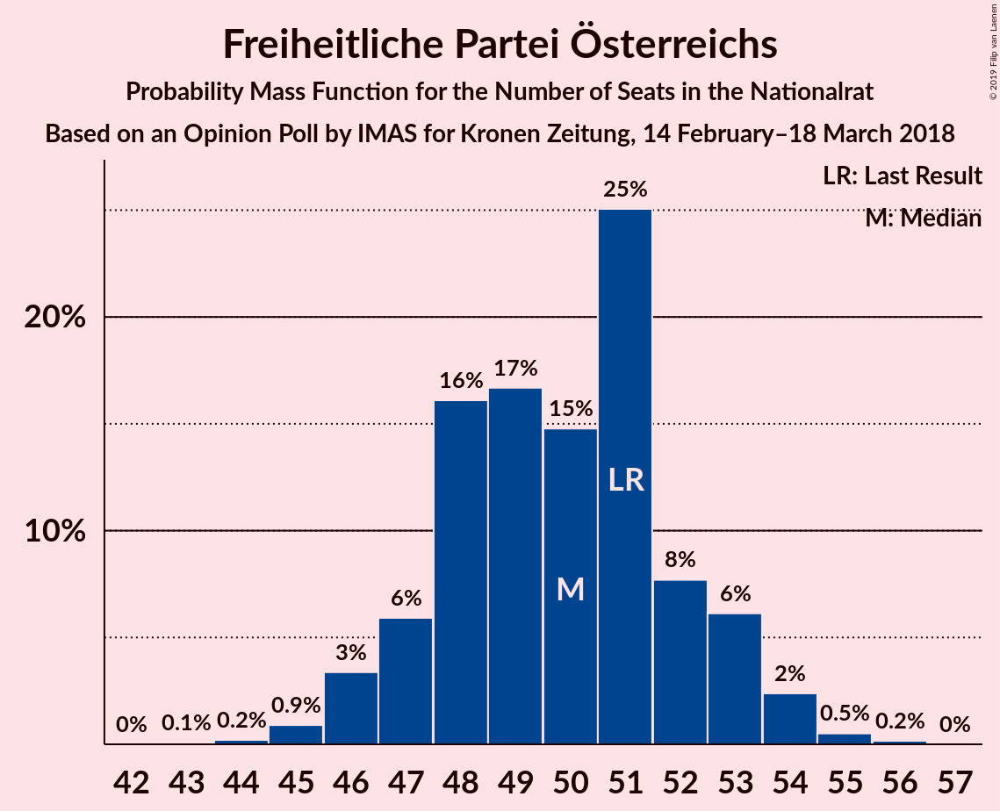

| Number of Seats | Probability | Accumulated | Special Marks |
|:---------------:|:-----------:|:-----------:|:-------------:|
| 43 | 0.1% | 100% |  |
| 44 | 0.2% | 99.9% |  |
| 45 | 0.9% | 99.7% |  |
| 46 | 3% | 98.8% |  |
| 47 | 6% | 95% |  |
| 48 | 16% | 90% |  |
| 49 | 17% | 73% |  |
| 50 | 15% | 57% | Median |
| 51 | 25% | 42% | Last Result |
| 52 | 8% | 17% |  |
| 53 | 6% | 9% |  |
| 54 | 2% | 3% |  |
| 55 | 0.5% | 0.7% |  |
| 56 | 0.2% | 0.2% |  |
| 57 | 0% | 0% |  |

### NEOS–Das Neue Österreich und Liberales Forum

*For a full overview of the results for this party, see the [NEOS–Das Neue Österreich und Liberales Forum](party-neos–dasneueösterreichundliberalesforum.html) page.*

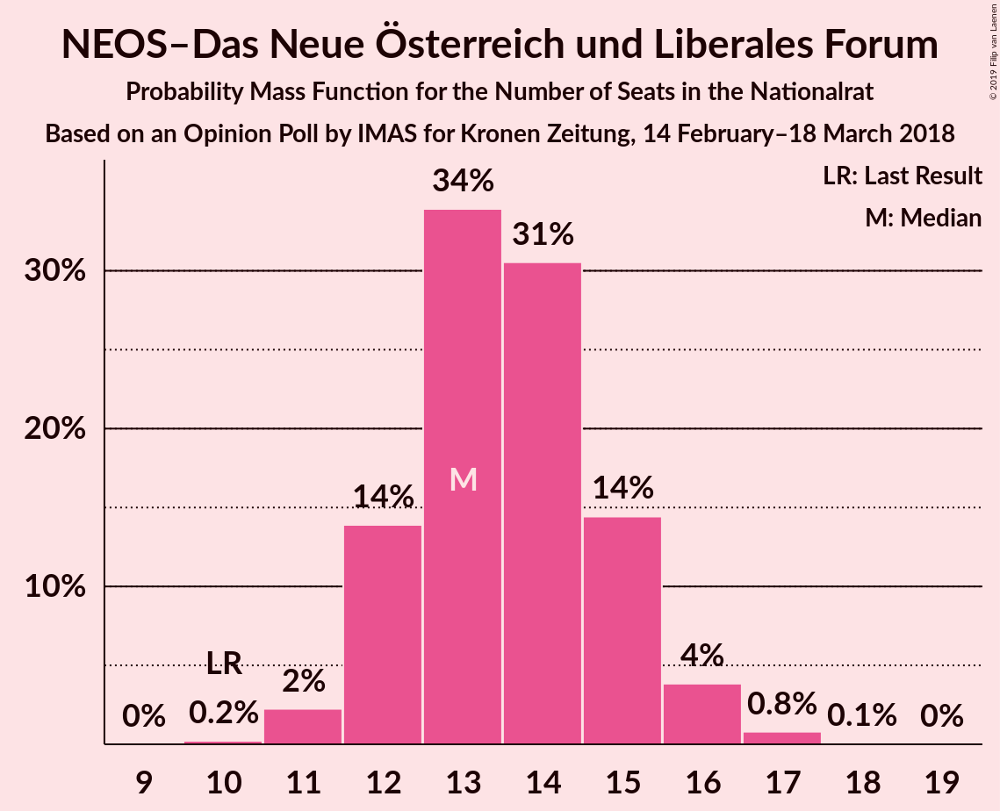

| Number of Seats | Probability | Accumulated | Special Marks |
|:---------------:|:-----------:|:-----------:|:-------------:|
| 10 | 0.2% | 100% | Last Result |
| 11 | 2% | 99.8% |  |
| 12 | 14% | 98% |  |
| 13 | 34% | 84% | Median |
| 14 | 31% | 50% |  |
| 15 | 14% | 19% |  |
| 16 | 4% | 5% |  |
| 17 | 0.8% | 0.9% |  |
| 18 | 0.1% | 0.1% |  |
| 19 | 0% | 0% |  |

### Die Grünen–Die Grüne Alternative

*For a full overview of the results for this party, see the [Die Grünen–Die Grüne Alternative](party-diegrünen–diegrünealternative.html) page.*

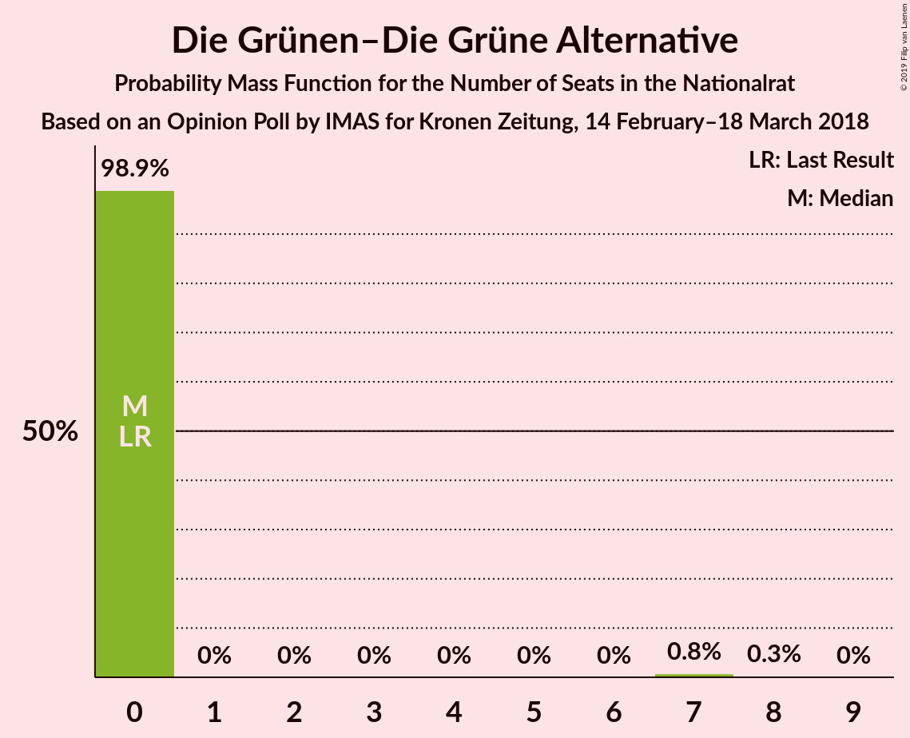

| Number of Seats | Probability | Accumulated | Special Marks |
|:---------------:|:-----------:|:-----------:|:-------------:|
| 0 | 98.9% | 100% | Last Result, Median |
| 1 | 0% | 1.1% |  |
| 2 | 0% | 1.1% |  |
| 3 | 0% | 1.1% |  |
| 4 | 0% | 1.1% |  |
| 5 | 0% | 1.1% |  |
| 6 | 0% | 1.1% |  |
| 7 | 0.8% | 1.1% |  |
| 8 | 0.3% | 0.3% |  |
| 9 | 0% | 0% |  |

### JETZT–Liste Pilz

*For a full overview of the results for this party, see the [JETZT–Liste Pilz](party-jetzt–listepilz.html) page.*

| Number of Seats | Probability | Accumulated | Special Marks |
|:---------------:|:-----------:|:-----------:|:-------------:|
| 0 | 100% | 100% | Median |
| 1 | 0% | 0% |  |
| 2 | 0% | 0% |  |
| 3 | 0% | 0% |  |
| 4 | 0% | 0% |  |
| 5 | 0% | 0% |  |
| 6 | 0% | 0% |  |
| 7 | 0% | 0% |  |
| 8 | 0% | 0% | Last Result |

## Coalitions

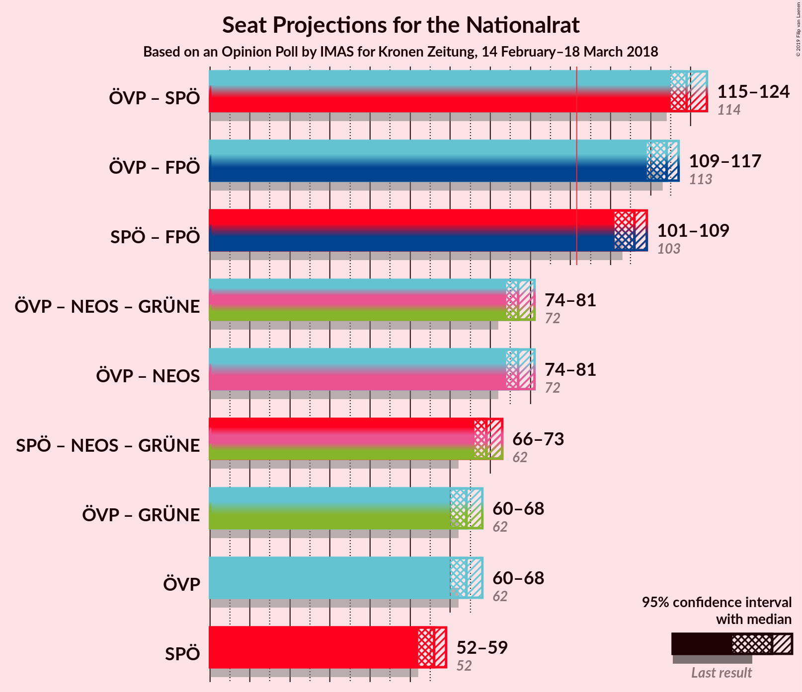

### Confidence Intervals

| Coalition | Last Result | Median | Majority? | 80% Confidence Interval | 90% Confidence Interval | 95% Confidence Interval | 99% Confidence Interval |
|:---------:|:-----------:|:------:|:---------:|:-----------------------:|:-----------------------:|:-----------------------:|:-----------------------:|
| Österreichische Volkspartei – Sozialdemokratische Partei Österreichs | 114 | 119 | 100% | 117–122 | 116–123 | 115–124 | 114–125 |
| Österreichische Volkspartei – Freiheitliche Partei Österreichs | 113 | 114 | 100% | 111–116 | 110–117 | 109–117 | 107–119 |
| Sozialdemokratische Partei Österreichs – Freiheitliche Partei Österreichs | 103 | 106 | 100% | 103–108 | 102–109 | 101–109 | 100–111 |
| Österreichische Volkspartei – NEOS–Das Neue Österreich und Liberales Forum – Die Grünen–Die Grüne Alternative | 72 | 77 | 0% | 75–80 | 74–81 | 74–81 | 72–83 |
| Österreichische Volkspartei – NEOS–Das Neue Österreich und Liberales Forum | 72 | 77 | 0% | 75–80 | 74–81 | 74–81 | 72–83 |
| Sozialdemokratische Partei Österreichs – NEOS–Das Neue Österreich und Liberales Forum – Die Grünen–Die Grüne Alternative | 62 | 69 | 0% | 67–72 | 66–72 | 66–73 | 64–76 |
| Österreichische Volkspartei – Die Grünen–Die Grüne Alternative | 62 | 64 | 0% | 62–66 | 61–67 | 60–68 | 59–69 |
| Österreichische Volkspartei | 62 | 64 | 0% | 61–66 | 61–67 | 60–68 | 59–69 |
| Sozialdemokratische Partei Österreichs | 52 | 56 | 0% | 54–58 | 53–58 | 52–59 | 51–61 |

### Österreichische Volkspartei – Sozialdemokratische Partei Österreichs

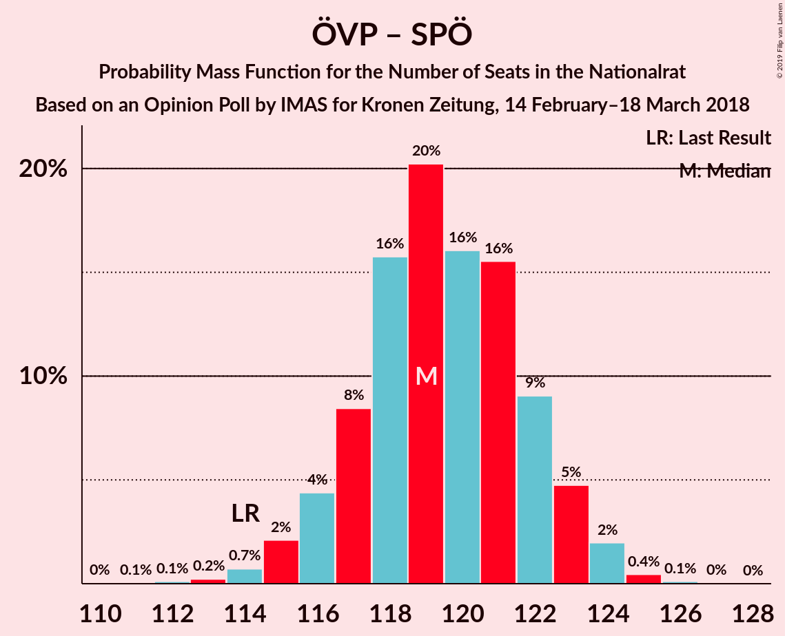

| Number of Seats | Probability | Accumulated | Special Marks |
|:---------------:|:-----------:|:-----------:|:-------------:|
| 111 | 0.1% | 100% |  |
| 112 | 0.1% | 99.9% |  |
| 113 | 0.2% | 99.8% |  |
| 114 | 0.7% | 99.6% | Last Result |
| 115 | 2% | 98.9% |  |
| 116 | 4% | 97% |  |
| 117 | 8% | 92% |  |
| 118 | 16% | 84% |  |
| 119 | 20% | 68% |  |
| 120 | 16% | 48% | Median |
| 121 | 16% | 32% |  |
| 122 | 9% | 16% |  |
| 123 | 5% | 7% |  |
| 124 | 2% | 3% |  |
| 125 | 0.4% | 0.6% |  |
| 126 | 0.1% | 0.1% |  |
| 127 | 0% | 0% |  |

### Österreichische Volkspartei – Freiheitliche Partei Österreichs

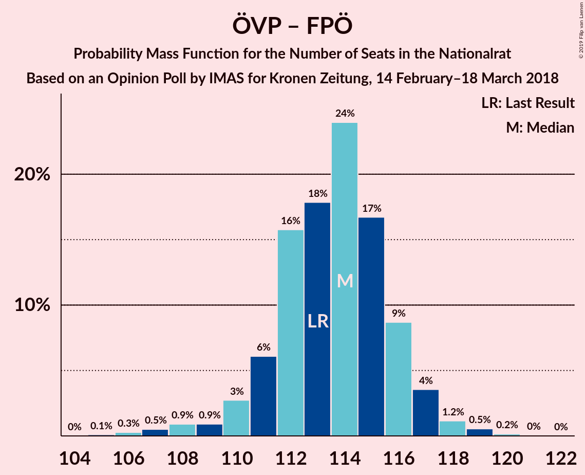

| Number of Seats | Probability | Accumulated | Special Marks |
|:---------------:|:-----------:|:-----------:|:-------------:|
| 105 | 0.1% | 100% |  |
| 106 | 0.3% | 99.9% |  |
| 107 | 0.5% | 99.6% |  |
| 108 | 0.9% | 99.1% |  |
| 109 | 0.9% | 98% |  |
| 110 | 3% | 97% |  |
| 111 | 6% | 95% |  |
| 112 | 16% | 88% |  |
| 113 | 18% | 73% | Last Result |
| 114 | 24% | 55% | Median |
| 115 | 17% | 31% |  |
| 116 | 9% | 14% |  |
| 117 | 4% | 5% |  |
| 118 | 1.2% | 2% |  |
| 119 | 0.5% | 0.7% |  |
| 120 | 0.2% | 0.2% |  |
| 121 | 0% | 0% |  |

### Sozialdemokratische Partei Österreichs – Freiheitliche Partei Österreichs

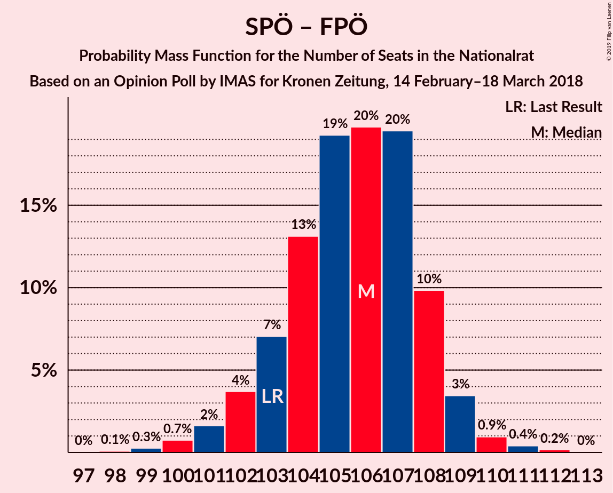

| Number of Seats | Probability | Accumulated | Special Marks |
|:---------------:|:-----------:|:-----------:|:-------------:|
| 97 | 0% | 100% |  |
| 98 | 0.1% | 99.9% |  |
| 99 | 0.3% | 99.9% |  |
| 100 | 0.7% | 99.6% |  |
| 101 | 2% | 98.9% |  |
| 102 | 4% | 97% |  |
| 103 | 7% | 94% | Last Result |
| 104 | 13% | 86% |  |
| 105 | 19% | 73% |  |
| 106 | 20% | 54% | Median |
| 107 | 20% | 34% |  |
| 108 | 10% | 15% |  |
| 109 | 3% | 5% |  |
| 110 | 0.9% | 2% |  |
| 111 | 0.4% | 0.6% |  |
| 112 | 0.2% | 0.2% |  |
| 113 | 0% | 0% |  |

### Österreichische Volkspartei – NEOS–Das Neue Österreich und Liberales Forum – Die Grünen–Die Grüne Alternative

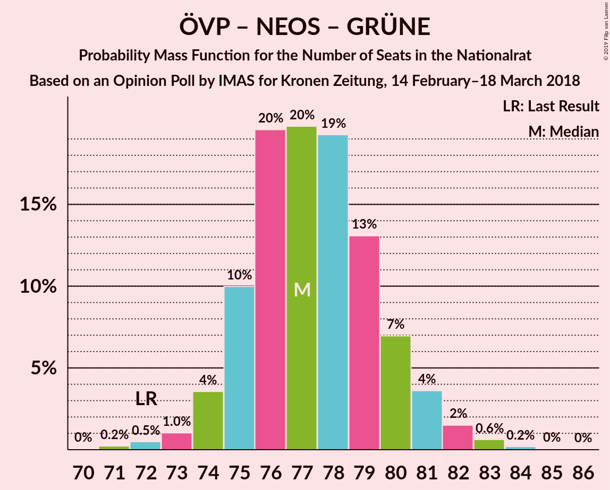

| Number of Seats | Probability | Accumulated | Special Marks |
|:---------------:|:-----------:|:-----------:|:-------------:|
| 70 | 0% | 100% |  |
| 71 | 0.2% | 99.9% |  |
| 72 | 0.5% | 99.7% | Last Result |
| 73 | 1.0% | 99.2% |  |
| 74 | 4% | 98% |  |
| 75 | 10% | 95% |  |
| 76 | 20% | 85% |  |
| 77 | 20% | 65% | Median |
| 78 | 19% | 45% |  |
| 79 | 13% | 26% |  |
| 80 | 7% | 13% |  |
| 81 | 4% | 6% |  |
| 82 | 2% | 2% |  |
| 83 | 0.6% | 0.9% |  |
| 84 | 0.2% | 0.3% |  |
| 85 | 0% | 0.1% |  |
| 86 | 0% | 0% |  |

### Österreichische Volkspartei – NEOS–Das Neue Österreich und Liberales Forum

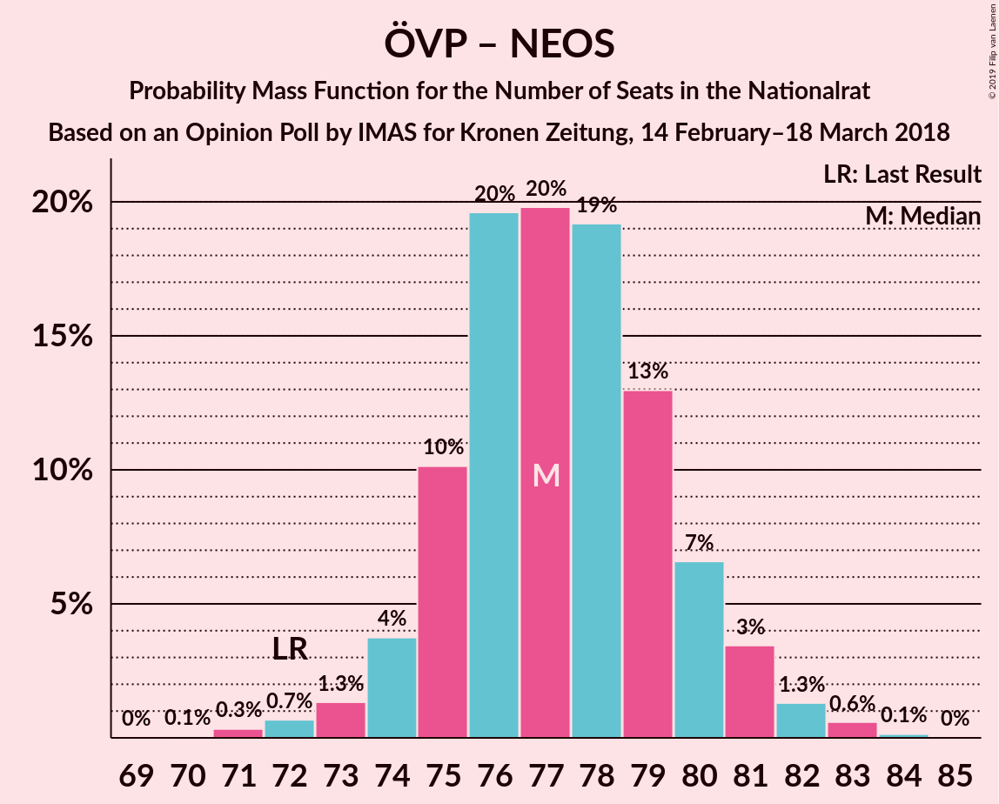

| Number of Seats | Probability | Accumulated | Special Marks |
|:---------------:|:-----------:|:-----------:|:-------------:|
| 70 | 0.1% | 100% |  |
| 71 | 0.3% | 99.9% |  |
| 72 | 0.7% | 99.6% | Last Result |
| 73 | 1.3% | 98.9% |  |
| 74 | 4% | 98% |  |
| 75 | 10% | 94% |  |
| 76 | 20% | 84% |  |
| 77 | 20% | 64% | Median |
| 78 | 19% | 44% |  |
| 79 | 13% | 25% |  |
| 80 | 7% | 12% |  |
| 81 | 3% | 6% |  |
| 82 | 1.3% | 2% |  |
| 83 | 0.6% | 0.8% |  |
| 84 | 0.1% | 0.2% |  |
| 85 | 0% | 0% |  |

### Sozialdemokratische Partei Österreichs – NEOS–Das Neue Österreich und Liberales Forum – Die Grünen–Die Grüne Alternative

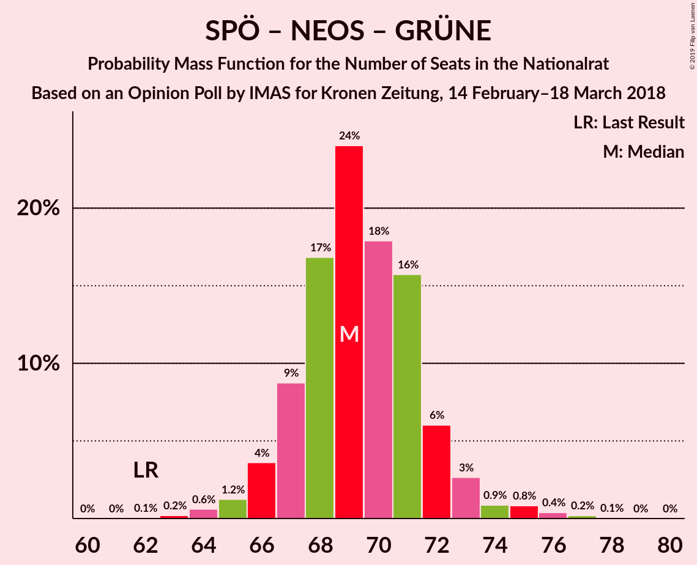

| Number of Seats | Probability | Accumulated | Special Marks |
|:---------------:|:-----------:|:-----------:|:-------------:|
| 62 | 0.1% | 100% | Last Result |
| 63 | 0.2% | 99.9% |  |
| 64 | 0.6% | 99.7% |  |
| 65 | 1.2% | 99.1% |  |
| 66 | 4% | 98% |  |
| 67 | 9% | 94% |  |
| 68 | 17% | 86% |  |
| 69 | 24% | 69% | Median |
| 70 | 18% | 45% |  |
| 71 | 16% | 27% |  |
| 72 | 6% | 11% |  |
| 73 | 3% | 5% |  |
| 74 | 0.9% | 2% |  |
| 75 | 0.8% | 1.5% |  |
| 76 | 0.4% | 0.6% |  |
| 77 | 0.2% | 0.3% |  |
| 78 | 0.1% | 0.1% |  |
| 79 | 0% | 0% |  |

### Österreichische Volkspartei – Die Grünen–Die Grüne Alternative

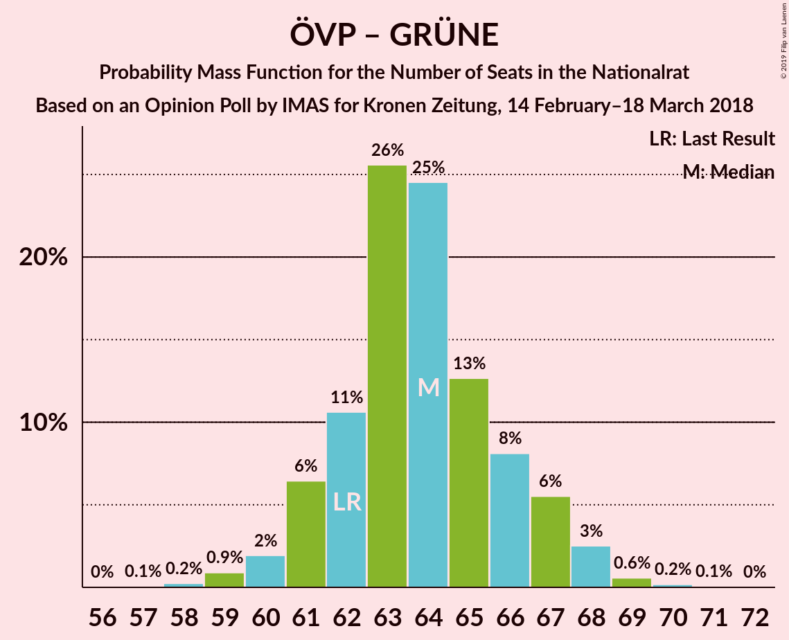

| Number of Seats | Probability | Accumulated | Special Marks |
|:---------------:|:-----------:|:-----------:|:-------------:|
| 57 | 0.1% | 100% |  |
| 58 | 0.2% | 99.9% |  |
| 59 | 0.9% | 99.7% |  |
| 60 | 2% | 98.8% |  |
| 61 | 6% | 97% |  |
| 62 | 11% | 90% | Last Result |
| 63 | 26% | 80% |  |
| 64 | 25% | 54% | Median |
| 65 | 13% | 30% |  |
| 66 | 8% | 17% |  |
| 67 | 6% | 9% |  |
| 68 | 3% | 3% |  |
| 69 | 0.6% | 0.9% |  |
| 70 | 0.2% | 0.3% |  |
| 71 | 0.1% | 0.1% |  |
| 72 | 0% | 0% |  |

### Österreichische Volkspartei

| Number of Seats | Probability | Accumulated | Special Marks |
|:---------------:|:-----------:|:-----------:|:-------------:|
| 57 | 0.1% | 100% |  |
| 58 | 0.3% | 99.9% |  |
| 59 | 1.0% | 99.6% |  |
| 60 | 2% | 98.6% |  |
| 61 | 7% | 96% |  |
| 62 | 11% | 89% | Last Result |
| 63 | 26% | 79% |  |
| 64 | 25% | 53% | Median |
| 65 | 13% | 29% |  |
| 66 | 8% | 16% |  |
| 67 | 5% | 8% |  |
| 68 | 2% | 3% |  |
| 69 | 0.5% | 0.7% |  |
| 70 | 0.1% | 0.2% |  |
| 71 | 0% | 0% |  |

### Sozialdemokratische Partei Österreichs

| Number of Seats | Probability | Accumulated | Special Marks |
|:---------------:|:-----------:|:-----------:|:-------------:|
| 49 | 0.1% | 100% |  |
| 50 | 0.3% | 99.9% |  |
| 51 | 0.8% | 99.6% |  |
| 52 | 2% | 98.8% | Last Result |
| 53 | 6% | 97% |  |
| 54 | 12% | 92% |  |
| 55 | 23% | 80% |  |
| 56 | 28% | 57% | Median |
| 57 | 15% | 29% |  |
| 58 | 10% | 14% |  |
| 59 | 3% | 4% |  |
| 60 | 1.1% | 2% |  |
| 61 | 0.4% | 0.6% |  |
| 62 | 0.2% | 0.2% |  |
| 63 | 0% | 0% |  |

## Technical Information

### Opinion Poll

+ **Polling firm:** IMAS
+ **Commissioner(s):** Kronen Zeitung
+ **Fieldwork period:** 14 February–18 March 2018

### Calculations

+ **Sample size:** 2073
+ **Simulations done:** 131,072
+ **Error estimate:** 0.30%

