# Opinion Poll by market for Der Standard, 26–29 March 2018

<a href="#voting-intentions">Voting Intentions</a> | <a href="#seats">Seats</a> | <a href="#coalitions">Coalitions</a> | <a href="#technical-information">Technical Information</a>

## Voting Intentions

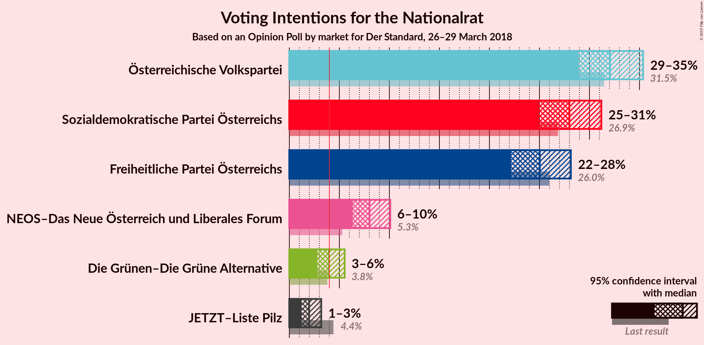

### Confidence Intervals

| Party | Last Result | Poll Result | 80% Confidence Interval | 90% Confidence Interval | 95% Confidence Interval | 99% Confidence Interval |
|:-----:|:-----------:|:-----------:|:-----------------------:|:-----------------------:|:-----------------------:|:-----------------------:|
| Österreichische Volkspartei | 31.5% | 32.1% | 30.0–34.2% |29.4–34.8% |28.9–35.4% |28.0–36.4% |
| Sozialdemokratische Partei Österreichs | 26.9% | 28.0% | 26.0–30.1% |25.5–30.7% |25.0–31.2% |24.1–32.2% |
| Freiheitliche Partei Österreichs | 26.0% | 25.0% | 23.2–27.1% |22.6–27.6% |22.2–28.1% |21.3–29.1% |
| NEOS–Das Neue Österreich und Liberales Forum | 5.3% | 8.0% | 6.9–9.4% |6.6–9.8% |6.3–10.1% |5.8–10.8% |
| Die Grünen–Die Grüne Alternative | 3.8% | 3.9% | 3.2–5.0% |3.0–5.3% |2.8–5.5% |2.5–6.1% |
| JETZT–Liste Pilz | 4.4% | 2.0% | 1.5–2.8% |1.3–3.0% |1.2–3.2% |1.0–3.6% |

*Note:* The poll result column reflects the actual value used in the calculations. Published results may vary slightly, and in addition be rounded to fewer digits.

## Seats

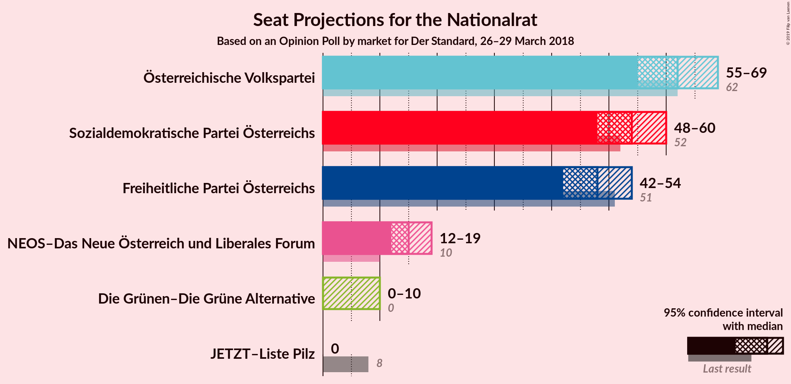

### Confidence Intervals

| Party | Last Result | Median | 80% Confidence Interval | 90% Confidence Interval | 95% Confidence Interval | 99% Confidence Interval |
|:-----:|:-----------:|:------:|:-----------------------:|:-----------------------:|:-----------------------:|:-----------------------:|
| <a href="#österreichische-volkspartei">Österreichische Volkspartei</a> | 62 | 62 | 57–67 |56–68 |55–69 |53–71 |
| <a href="#sozialdemokratische-partei-österreichs">Sozialdemokratische Partei Österreichs</a> | 52 | 54 | 50–58 |49–59 |48–60 |46–62 |
| <a href="#freiheitliche-partei-österreichs">Freiheitliche Partei Österreichs</a> | 51 | 48 | 44–53 |43–54 |42–54 |40–56 |
| <a href="#neos–das-neue-österreich-und-liberales-forum">NEOS–Das Neue Österreich und Liberales Forum</a> | 10 | 15 | 13–18 |12–19 |12–19 |11–21 |
| <a href="#die-grünen–die-grüne-alternative">Die Grünen–Die Grüne Alternative</a> | 0 | 0 | 0–9 |0–10 |0–10 |0–11 |
| <a href="#jetzt–liste-pilz">JETZT–Liste Pilz</a> | 8 | 0 | 0 |0 |0 |0 |

### Österreichische Volkspartei

*For a full overview of the results for this party, see the [Österreichische Volkspartei](party-österreichischevolkspartei.html) page.*

| Number of Seats | Probability | Accumulated | Special Marks |
|:---------------:|:-----------:|:-----------:|:-------------:|
| 51 | 0% | 100% |  |
| 52 | 0.2% | 99.9% |  |
| 53 | 0.3% | 99.8% |  |
| 54 | 0.8% | 99.4% |  |
| 55 | 2% | 98.6% |  |
| 56 | 2% | 97% |  |
| 57 | 6% | 95% |  |
| 58 | 6% | 89% |  |
| 59 | 7% | 83% |  |
| 60 | 11% | 76% |  |
| 61 | 11% | 66% |  |
| 62 | 10% | 55% | Last Result, Median |
| 63 | 9% | 45% |  |
| 64 | 13% | 36% |  |
| 65 | 6% | 23% |  |
| 66 | 6% | 18% |  |
| 67 | 5% | 11% |  |
| 68 | 3% | 6% |  |
| 69 | 1.4% | 3% |  |
| 70 | 0.7% | 2% |  |
| 71 | 0.5% | 0.8% |  |
| 72 | 0.2% | 0.3% |  |
| 73 | 0.1% | 0.1% |  |
| 74 | 0% | 0% |  |

### Sozialdemokratische Partei Österreichs

*For a full overview of the results for this party, see the [Sozialdemokratische Partei Österreichs](party-sozialdemokratischeparteiösterreichs.html) page.*

| Number of Seats | Probability | Accumulated | Special Marks |
|:---------------:|:-----------:|:-----------:|:-------------:|
| 44 | 0.1% | 100% |  |
| 45 | 0.2% | 99.9% |  |
| 46 | 0.5% | 99.6% |  |
| 47 | 1.2% | 99.1% |  |
| 48 | 2% | 98% |  |
| 49 | 4% | 96% |  |
| 50 | 5% | 92% |  |
| 51 | 9% | 87% |  |
| 52 | 12% | 79% | Last Result |
| 53 | 10% | 67% |  |
| 54 | 17% | 57% | Median |
| 55 | 9% | 40% |  |
| 56 | 10% | 31% |  |
| 57 | 7% | 21% |  |
| 58 | 5% | 13% |  |
| 59 | 5% | 8% |  |
| 60 | 2% | 3% |  |
| 61 | 0.7% | 1.4% |  |
| 62 | 0.4% | 0.7% |  |
| 63 | 0.2% | 0.3% |  |
| 64 | 0.1% | 0.1% |  |
| 65 | 0% | 0% |  |

### Freiheitliche Partei Österreichs

*For a full overview of the results for this party, see the [Freiheitliche Partei Österreichs](party-freiheitlicheparteiösterreichs.html) page.*

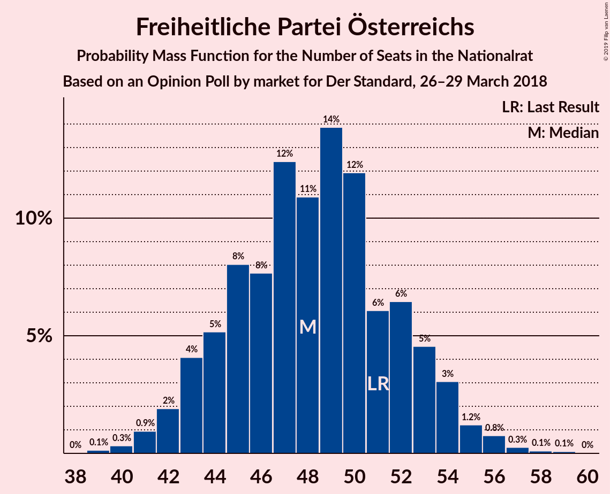

| Number of Seats | Probability | Accumulated | Special Marks |
|:---------------:|:-----------:|:-----------:|:-------------:|
| 39 | 0.1% | 100% |  |
| 40 | 0.3% | 99.8% |  |
| 41 | 0.9% | 99.5% |  |
| 42 | 2% | 98.5% |  |
| 43 | 4% | 97% |  |
| 44 | 5% | 93% |  |
| 45 | 8% | 87% |  |
| 46 | 8% | 79% |  |
| 47 | 12% | 72% |  |
| 48 | 11% | 59% | Median |
| 49 | 14% | 48% |  |
| 50 | 12% | 35% |  |
| 51 | 6% | 23% | Last Result |
| 52 | 6% | 17% |  |
| 53 | 5% | 10% |  |
| 54 | 3% | 6% |  |
| 55 | 1.2% | 2% |  |
| 56 | 0.8% | 1.2% |  |
| 57 | 0.3% | 0.5% |  |
| 58 | 0.1% | 0.2% |  |
| 59 | 0.1% | 0.1% |  |
| 60 | 0% | 0% |  |

### NEOS–Das Neue Österreich und Liberales Forum

*For a full overview of the results for this party, see the [NEOS–Das Neue Österreich und Liberales Forum](party-neos–dasneueösterreichundliberalesforum.html) page.*

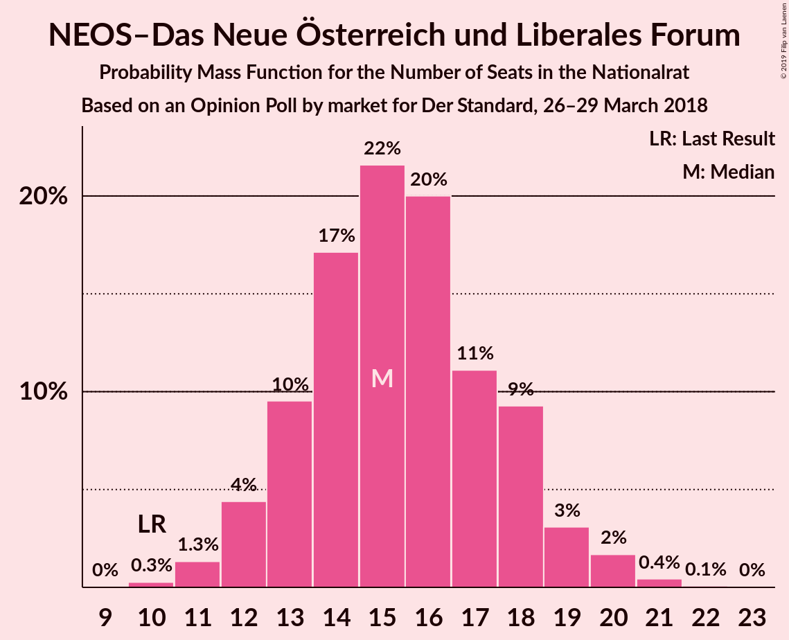

| Number of Seats | Probability | Accumulated | Special Marks |
|:---------------:|:-----------:|:-----------:|:-------------:|
| 10 | 0.3% | 100% | Last Result |
| 11 | 1.3% | 99.7% |  |
| 12 | 4% | 98% |  |
| 13 | 10% | 94% |  |
| 14 | 17% | 84% |  |
| 15 | 22% | 67% | Median |
| 16 | 20% | 46% |  |
| 17 | 11% | 26% |  |
| 18 | 9% | 15% |  |
| 19 | 3% | 5% |  |
| 20 | 2% | 2% |  |
| 21 | 0.4% | 0.6% |  |
| 22 | 0.1% | 0.1% |  |
| 23 | 0% | 0% |  |

### Die Grünen–Die Grüne Alternative

*For a full overview of the results for this party, see the [Die Grünen–Die Grüne Alternative](party-diegrünen–diegrünealternative.html) page.*

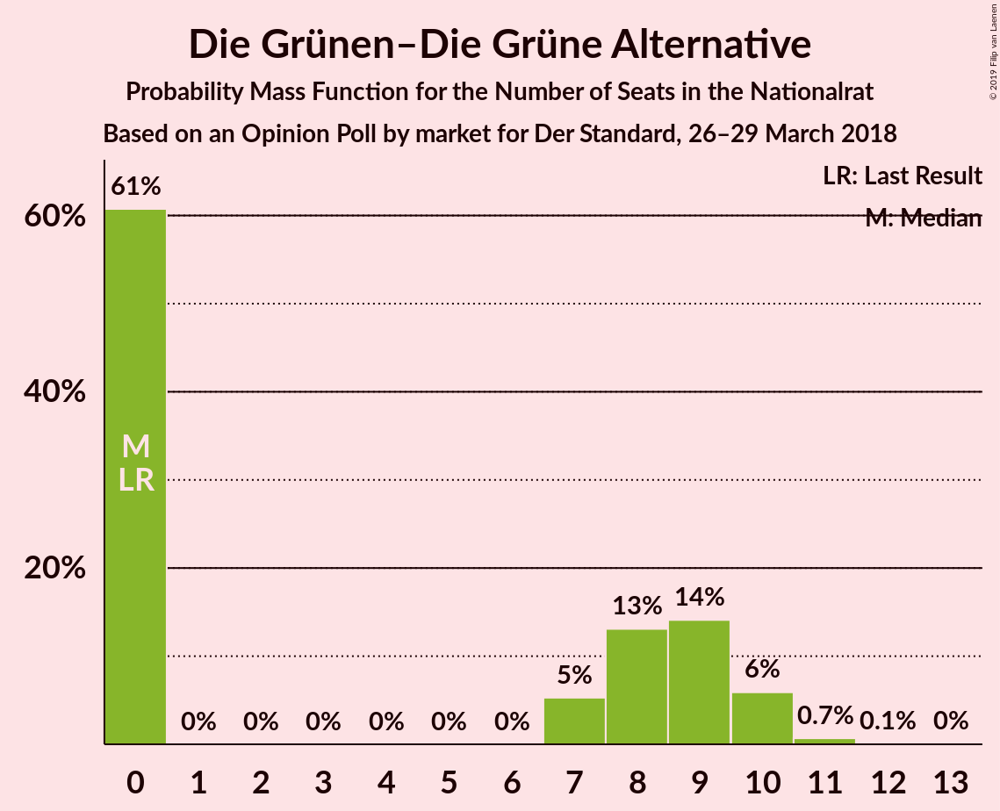

| Number of Seats | Probability | Accumulated | Special Marks |
|:---------------:|:-----------:|:-----------:|:-------------:|
| 0 | 61% | 100% | Last Result, Median |
| 1 | 0% | 39% |  |
| 2 | 0% | 39% |  |
| 3 | 0% | 39% |  |
| 4 | 0% | 39% |  |
| 5 | 0% | 39% |  |
| 6 | 0% | 39% |  |
| 7 | 5% | 39% |  |
| 8 | 13% | 34% |  |
| 9 | 14% | 21% |  |
| 10 | 6% | 7% |  |
| 11 | 0.7% | 0.8% |  |
| 12 | 0.1% | 0.2% |  |
| 13 | 0% | 0% |  |

### JETZT–Liste Pilz

*For a full overview of the results for this party, see the [JETZT–Liste Pilz](party-jetzt–listepilz.html) page.*

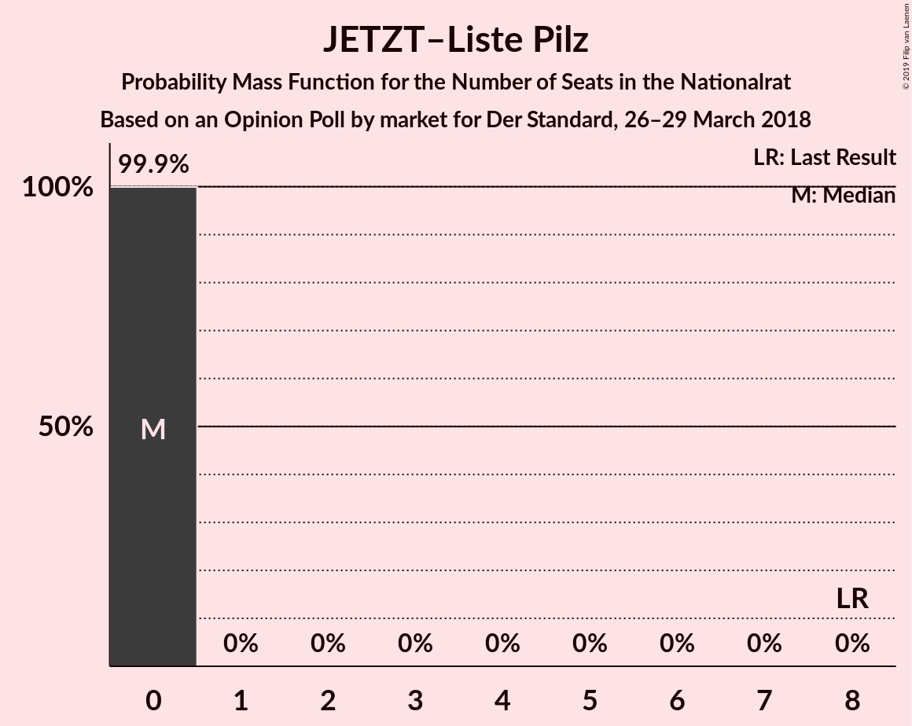

| Number of Seats | Probability | Accumulated | Special Marks |
|:---------------:|:-----------:|:-----------:|:-------------:|
| 0 | 99.9% | 100% | Median |
| 1 | 0% | 0.1% |  |
| 2 | 0% | 0.1% |  |
| 3 | 0% | 0.1% |  |
| 4 | 0% | 0.1% |  |
| 5 | 0% | 0.1% |  |
| 6 | 0% | 0.1% |  |
| 7 | 0% | 0.1% |  |
| 8 | 0% | 0% | Last Result |

## Coalitions

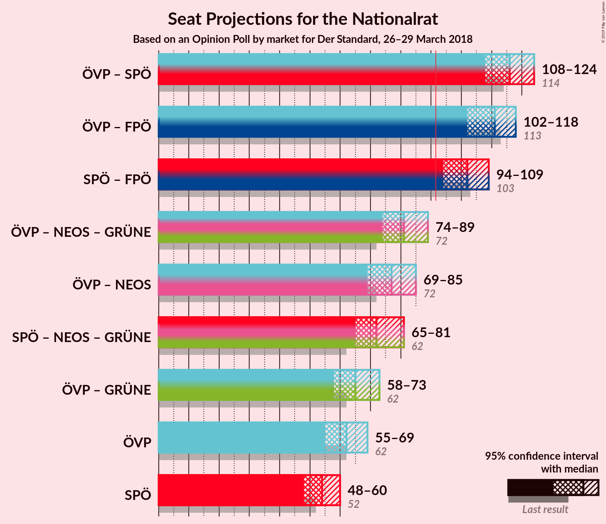

### Confidence Intervals

| Coalition | Last Result | Median | Majority? | 80% Confidence Interval | 90% Confidence Interval | 95% Confidence Interval | 99% Confidence Interval |
|:---------:|:-----------:|:------:|:---------:|:-----------------------:|:-----------------------:|:-----------------------:|:-----------------------:|
| Österreichische Volkspartei – Sozialdemokratische Partei Österreichs | 114 | 116 | 100% | 110–121 | 109–122 | 108–124 | 106–125 |
| Österreichische Volkspartei – Freiheitliche Partei Österreichs | 113 | 111 | 100% | 104–116 | 103–117 | 102–118 | 100–120 |
| Sozialdemokratische Partei Österreichs – Freiheitliche Partei Österreichs | 103 | 102 | 99.6% | 97–107 | 96–109 | 94–109 | 92–112 |
| Österreichische Volkspartei – NEOS–Das Neue Österreich und Liberales Forum – Die Grünen–Die Grüne Alternative | 72 | 81 | 0.4% | 76–86 | 74–87 | 74–89 | 71–91 |
| Österreichische Volkspartei – NEOS–Das Neue Österreich und Liberales Forum | 72 | 77 | 0% | 72–82 | 71–83 | 69–85 | 68–87 |
| Sozialdemokratische Partei Österreichs – NEOS–Das Neue Österreich und Liberales Forum – Die Grünen–Die Grüne Alternative | 62 | 72 | 0% | 67–79 | 66–80 | 65–81 | 63–83 |
| Österreichische Volkspartei – Die Grünen–Die Grüne Alternative | 62 | 65 | 0% | 60–71 | 59–72 | 58–73 | 56–76 |
| Österreichische Volkspartei | 62 | 62 | 0% | 57–67 | 56–68 | 55–69 | 53–71 |
| Sozialdemokratische Partei Österreichs | 52 | 54 | 0% | 50–58 | 49–59 | 48–60 | 46–62 |

### Österreichische Volkspartei – Sozialdemokratische Partei Österreichs

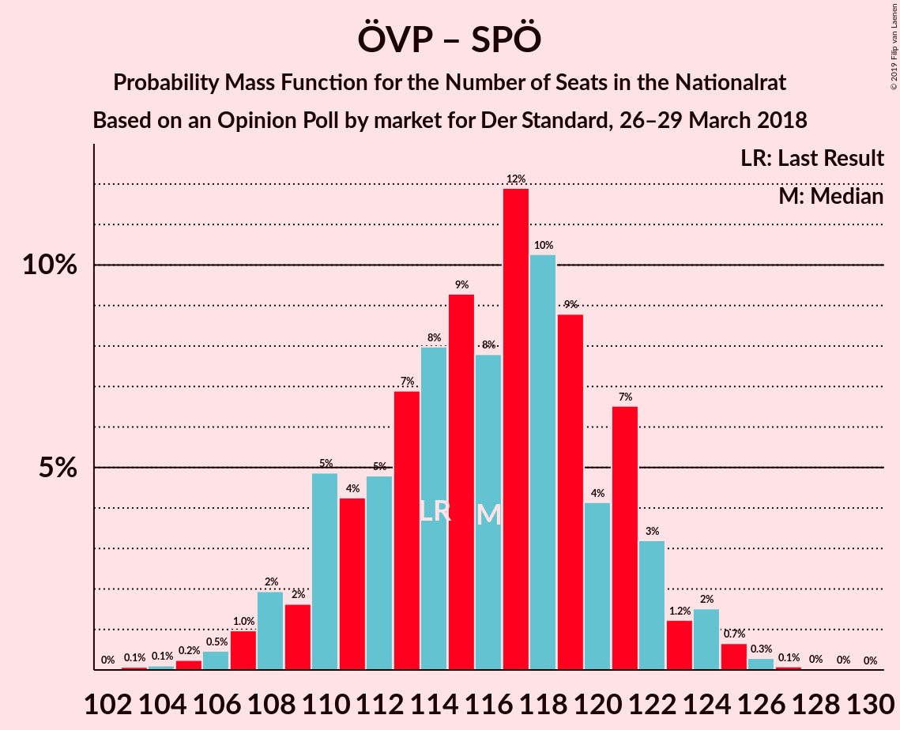

| Number of Seats | Probability | Accumulated | Special Marks |
|:---------------:|:-----------:|:-----------:|:-------------:|
| 103 | 0.1% | 100% |  |
| 104 | 0.1% | 99.9% |  |
| 105 | 0.2% | 99.8% |  |
| 106 | 0.5% | 99.6% |  |
| 107 | 1.0% | 99.1% |  |
| 108 | 2% | 98% |  |
| 109 | 2% | 96% |  |
| 110 | 5% | 95% |  |
| 111 | 4% | 90% |  |
| 112 | 5% | 85% |  |
| 113 | 7% | 81% |  |
| 114 | 8% | 74% | Last Result |
| 115 | 9% | 66% |  |
| 116 | 8% | 56% | Median |
| 117 | 12% | 49% |  |
| 118 | 10% | 37% |  |
| 119 | 9% | 26% |  |
| 120 | 4% | 18% |  |
| 121 | 7% | 14% |  |
| 122 | 3% | 7% |  |
| 123 | 1.2% | 4% |  |
| 124 | 2% | 3% |  |
| 125 | 0.7% | 1.1% |  |
| 126 | 0.3% | 0.4% |  |
| 127 | 0.1% | 0.1% |  |
| 128 | 0% | 0.1% |  |
| 129 | 0% | 0% |  |

### Österreichische Volkspartei – Freiheitliche Partei Österreichs

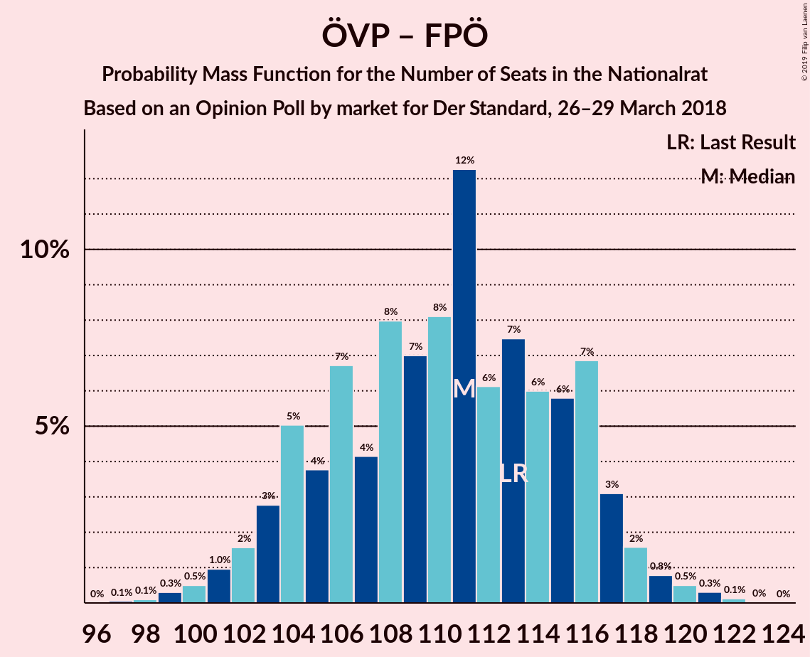

| Number of Seats | Probability | Accumulated | Special Marks |
|:---------------:|:-----------:|:-----------:|:-------------:|
| 97 | 0.1% | 100% |  |
| 98 | 0.1% | 99.9% |  |
| 99 | 0.3% | 99.8% |  |
| 100 | 0.5% | 99.5% |  |
| 101 | 1.0% | 99.0% |  |
| 102 | 2% | 98% |  |
| 103 | 3% | 96% |  |
| 104 | 5% | 94% |  |
| 105 | 4% | 89% |  |
| 106 | 7% | 85% |  |
| 107 | 4% | 78% |  |
| 108 | 8% | 74% |  |
| 109 | 7% | 66% |  |
| 110 | 8% | 59% | Median |
| 111 | 12% | 51% |  |
| 112 | 6% | 39% |  |
| 113 | 7% | 33% | Last Result |
| 114 | 6% | 25% |  |
| 115 | 6% | 19% |  |
| 116 | 7% | 13% |  |
| 117 | 3% | 6% |  |
| 118 | 2% | 3% |  |
| 119 | 0.8% | 2% |  |
| 120 | 0.5% | 1.0% |  |
| 121 | 0.3% | 0.5% |  |
| 122 | 0.1% | 0.2% |  |
| 123 | 0% | 0% |  |

### Sozialdemokratische Partei Österreichs – Freiheitliche Partei Österreichs

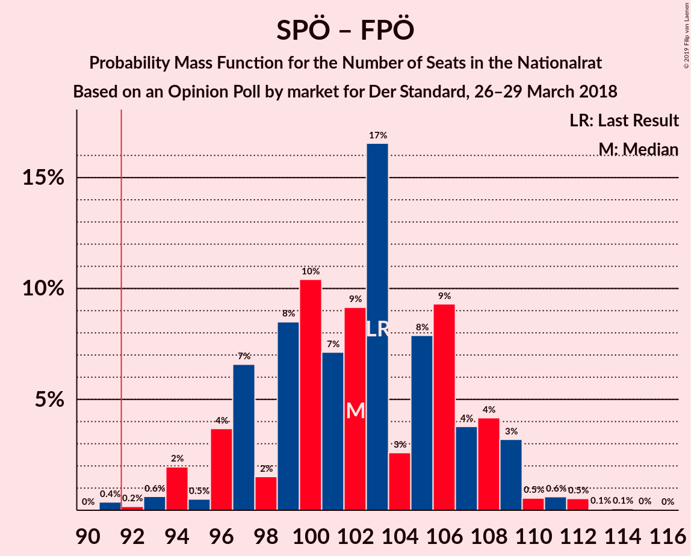

| Number of Seats | Probability | Accumulated | Special Marks |
|:---------------:|:-----------:|:-----------:|:-------------:|
| 90 | 0% | 100% |  |
| 91 | 0.4% | 99.9% |  |
| 92 | 0.2% | 99.6% | Majority |
| 93 | 0.6% | 99.4% |  |
| 94 | 2% | 98.8% |  |
| 95 | 0.5% | 97% |  |
| 96 | 4% | 96% |  |
| 97 | 7% | 93% |  |
| 98 | 2% | 86% |  |
| 99 | 8% | 85% |  |
| 100 | 10% | 76% |  |
| 101 | 7% | 66% |  |
| 102 | 9% | 59% | Median |
| 103 | 17% | 49% | Last Result |
| 104 | 3% | 33% |  |
| 105 | 8% | 30% |  |
| 106 | 9% | 22% |  |
| 107 | 4% | 13% |  |
| 108 | 4% | 9% |  |
| 109 | 3% | 5% |  |
| 110 | 0.5% | 2% |  |
| 111 | 0.6% | 1.3% |  |
| 112 | 0.5% | 0.7% |  |
| 113 | 0.1% | 0.2% |  |
| 114 | 0.1% | 0.1% |  |
| 115 | 0% | 0% |  |

### Österreichische Volkspartei – NEOS–Das Neue Österreich und Liberales Forum – Die Grünen–Die Grüne Alternative

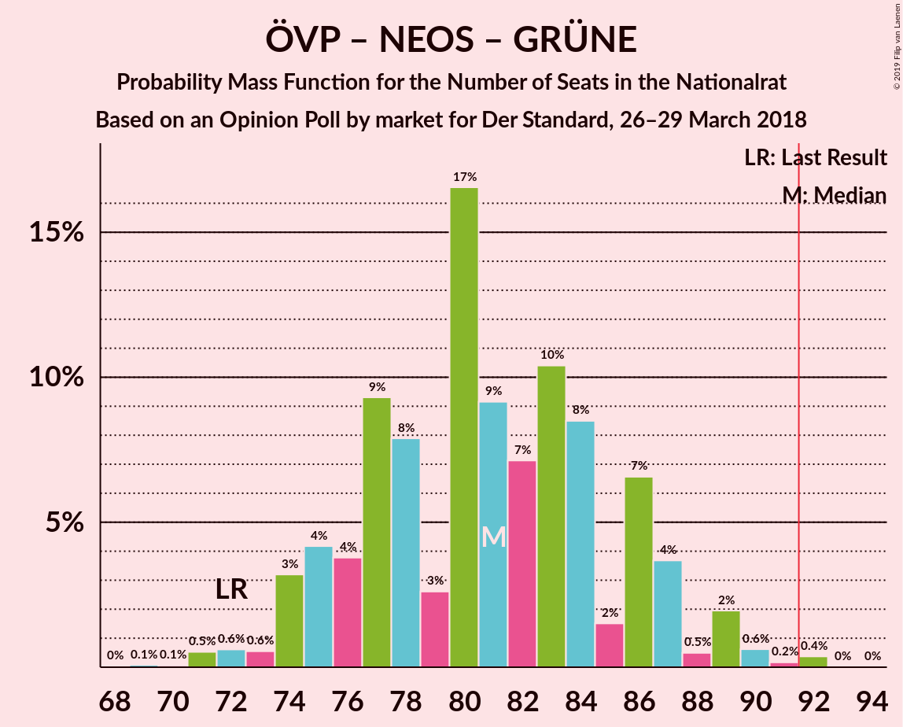

| Number of Seats | Probability | Accumulated | Special Marks |
|:---------------:|:-----------:|:-----------:|:-------------:|
| 69 | 0.1% | 100% |  |
| 70 | 0.1% | 99.9% |  |
| 71 | 0.5% | 99.8% |  |
| 72 | 0.6% | 99.3% | Last Result |
| 73 | 0.6% | 98.7% |  |
| 74 | 3% | 98% |  |
| 75 | 4% | 95% |  |
| 76 | 4% | 91% |  |
| 77 | 9% | 87% | Median |
| 78 | 8% | 78% |  |
| 79 | 3% | 70% |  |
| 80 | 17% | 67% |  |
| 81 | 9% | 51% |  |
| 82 | 7% | 41% |  |
| 83 | 10% | 34% |  |
| 84 | 8% | 24% |  |
| 85 | 2% | 15% |  |
| 86 | 7% | 14% |  |
| 87 | 4% | 7% |  |
| 88 | 0.5% | 4% |  |
| 89 | 2% | 3% |  |
| 90 | 0.6% | 1.2% |  |
| 91 | 0.2% | 0.6% |  |
| 92 | 0.4% | 0.4% | Majority |
| 93 | 0% | 0% |  |

### Österreichische Volkspartei – NEOS–Das Neue Österreich und Liberales Forum

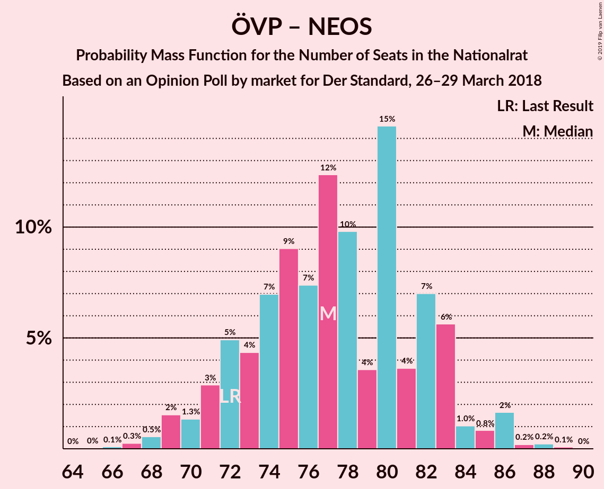

| Number of Seats | Probability | Accumulated | Special Marks |
|:---------------:|:-----------:|:-----------:|:-------------:|
| 65 | 0% | 100% |  |
| 66 | 0.1% | 99.9% |  |
| 67 | 0.3% | 99.8% |  |
| 68 | 0.5% | 99.6% |  |
| 69 | 2% | 99.0% |  |
| 70 | 1.3% | 97% |  |
| 71 | 3% | 96% |  |
| 72 | 5% | 93% | Last Result |
| 73 | 4% | 88% |  |
| 74 | 7% | 84% |  |
| 75 | 9% | 77% |  |
| 76 | 7% | 68% |  |
| 77 | 12% | 61% | Median |
| 78 | 10% | 48% |  |
| 79 | 4% | 38% |  |
| 80 | 15% | 35% |  |
| 81 | 4% | 20% |  |
| 82 | 7% | 17% |  |
| 83 | 6% | 10% |  |
| 84 | 1.0% | 4% |  |
| 85 | 0.8% | 3% |  |
| 86 | 2% | 2% |  |
| 87 | 0.2% | 0.5% |  |
| 88 | 0.2% | 0.3% |  |
| 89 | 0.1% | 0.1% |  |
| 90 | 0% | 0% |  |

### Sozialdemokratische Partei Österreichs – NEOS–Das Neue Österreich und Liberales Forum – Die Grünen–Die Grüne Alternative

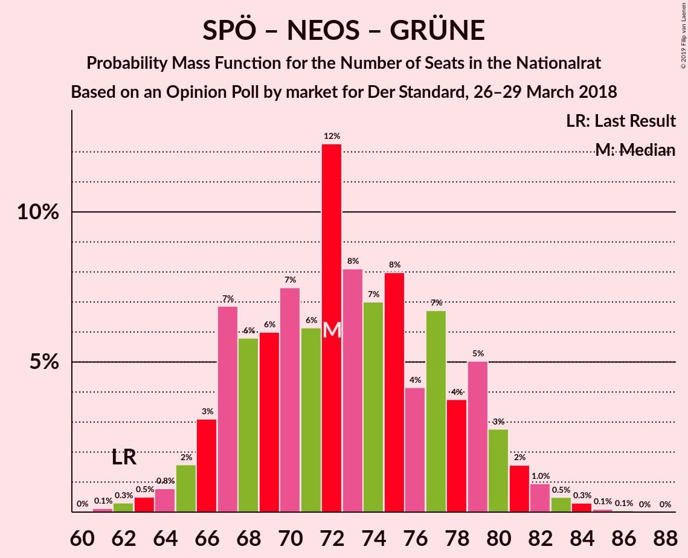

| Number of Seats | Probability | Accumulated | Special Marks |
|:---------------:|:-----------:|:-----------:|:-------------:|
| 61 | 0.1% | 100% |  |
| 62 | 0.3% | 99.8% | Last Result |
| 63 | 0.5% | 99.5% |  |
| 64 | 0.8% | 99.0% |  |
| 65 | 2% | 98% |  |
| 66 | 3% | 97% |  |
| 67 | 7% | 94% |  |
| 68 | 6% | 87% |  |
| 69 | 6% | 81% | Median |
| 70 | 7% | 75% |  |
| 71 | 6% | 67% |  |
| 72 | 12% | 61% |  |
| 73 | 8% | 49% |  |
| 74 | 7% | 41% |  |
| 75 | 8% | 34% |  |
| 76 | 4% | 26% |  |
| 77 | 7% | 22% |  |
| 78 | 4% | 15% |  |
| 79 | 5% | 11% |  |
| 80 | 3% | 6% |  |
| 81 | 2% | 3% |  |
| 82 | 1.0% | 2% |  |
| 83 | 0.5% | 1.0% |  |
| 84 | 0.3% | 0.5% |  |
| 85 | 0.1% | 0.2% |  |
| 86 | 0.1% | 0.1% |  |
| 87 | 0% | 0% |  |

### Österreichische Volkspartei – Die Grünen–Die Grüne Alternative

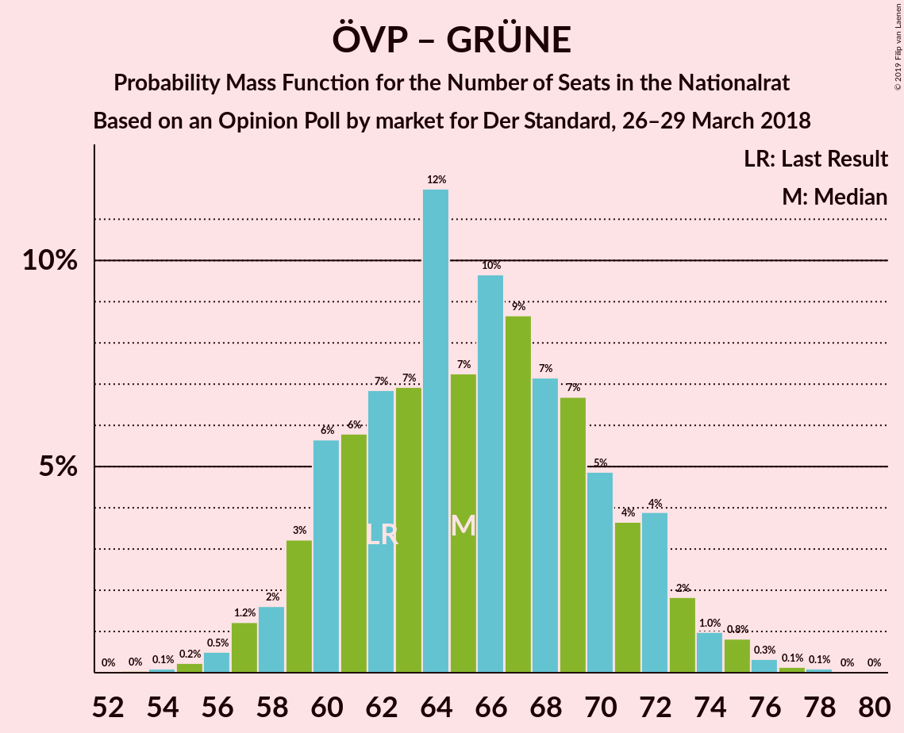

| Number of Seats | Probability | Accumulated | Special Marks |
|:---------------:|:-----------:|:-----------:|:-------------:|
| 53 | 0% | 100% |  |
| 54 | 0.1% | 99.9% |  |
| 55 | 0.2% | 99.8% |  |
| 56 | 0.5% | 99.6% |  |
| 57 | 1.2% | 99.1% |  |
| 58 | 2% | 98% |  |
| 59 | 3% | 96% |  |
| 60 | 6% | 93% |  |
| 61 | 6% | 87% |  |
| 62 | 7% | 82% | Last Result, Median |
| 63 | 7% | 75% |  |
| 64 | 12% | 68% |  |
| 65 | 7% | 56% |  |
| 66 | 10% | 49% |  |
| 67 | 9% | 39% |  |
| 68 | 7% | 31% |  |
| 69 | 7% | 23% |  |
| 70 | 5% | 17% |  |
| 71 | 4% | 12% |  |
| 72 | 4% | 8% |  |
| 73 | 2% | 4% |  |
| 74 | 1.0% | 2% |  |
| 75 | 0.8% | 1.4% |  |
| 76 | 0.3% | 0.6% |  |
| 77 | 0.1% | 0.3% |  |
| 78 | 0.1% | 0.1% |  |
| 79 | 0% | 0% |  |

### Österreichische Volkspartei

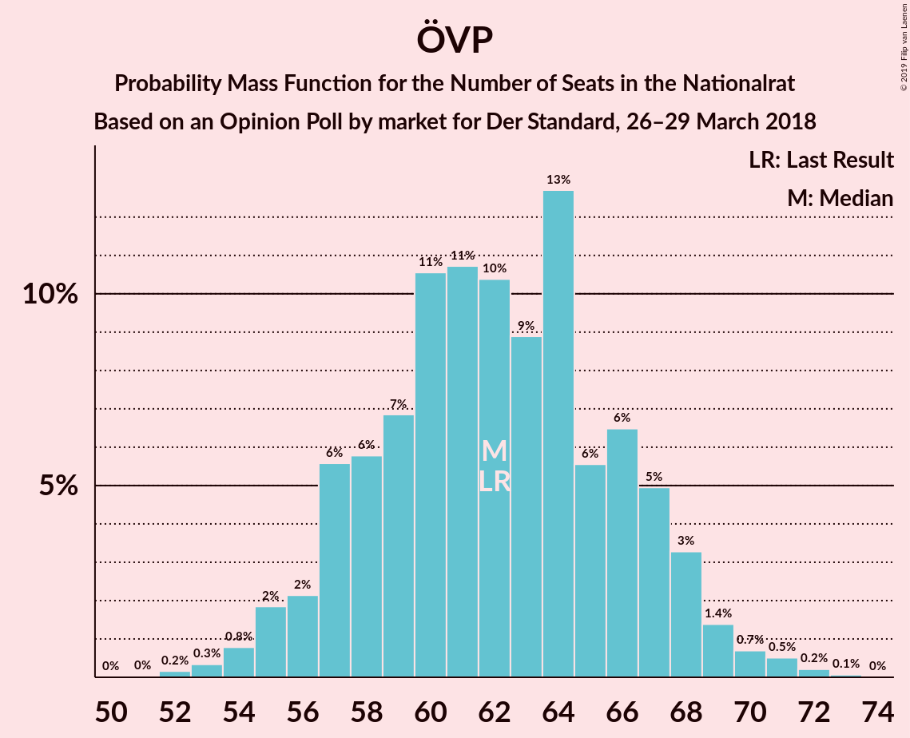

| Number of Seats | Probability | Accumulated | Special Marks |
|:---------------:|:-----------:|:-----------:|:-------------:|
| 51 | 0% | 100% |  |
| 52 | 0.2% | 99.9% |  |
| 53 | 0.3% | 99.8% |  |
| 54 | 0.8% | 99.4% |  |
| 55 | 2% | 98.6% |  |
| 56 | 2% | 97% |  |
| 57 | 6% | 95% |  |
| 58 | 6% | 89% |  |
| 59 | 7% | 83% |  |
| 60 | 11% | 76% |  |
| 61 | 11% | 66% |  |
| 62 | 10% | 55% | Last Result, Median |
| 63 | 9% | 45% |  |
| 64 | 13% | 36% |  |
| 65 | 6% | 23% |  |
| 66 | 6% | 18% |  |
| 67 | 5% | 11% |  |
| 68 | 3% | 6% |  |
| 69 | 1.4% | 3% |  |
| 70 | 0.7% | 2% |  |
| 71 | 0.5% | 0.8% |  |
| 72 | 0.2% | 0.3% |  |
| 73 | 0.1% | 0.1% |  |
| 74 | 0% | 0% |  |

### Sozialdemokratische Partei Österreichs

| Number of Seats | Probability | Accumulated | Special Marks |
|:---------------:|:-----------:|:-----------:|:-------------:|
| 44 | 0.1% | 100% |  |
| 45 | 0.2% | 99.9% |  |
| 46 | 0.5% | 99.6% |  |
| 47 | 1.2% | 99.1% |  |
| 48 | 2% | 98% |  |
| 49 | 4% | 96% |  |
| 50 | 5% | 92% |  |
| 51 | 9% | 87% |  |
| 52 | 12% | 79% | Last Result |
| 53 | 10% | 67% |  |
| 54 | 17% | 57% | Median |
| 55 | 9% | 40% |  |
| 56 | 10% | 31% |  |
| 57 | 7% | 21% |  |
| 58 | 5% | 13% |  |
| 59 | 5% | 8% |  |
| 60 | 2% | 3% |  |
| 61 | 0.7% | 1.4% |  |
| 62 | 0.4% | 0.7% |  |
| 63 | 0.2% | 0.3% |  |
| 64 | 0.1% | 0.1% |  |
| 65 | 0% | 0% |  |

## Technical Information

### Opinion Poll

+ **Polling firm:** market
+ **Commissioner(s):** Der Standard
+ **Fieldwork period:** 26–29 March 2018

### Calculations

+ **Sample size:** 811
+ **Simulations done:** 131,072
+ **Error estimate:** 0.95%

