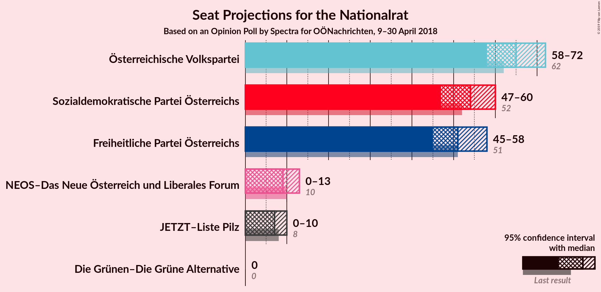
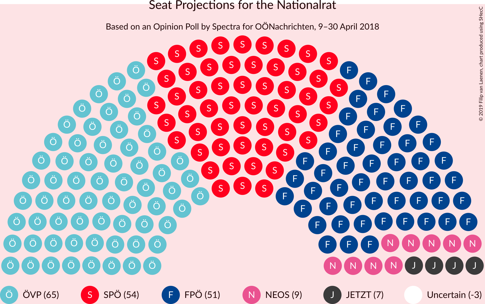
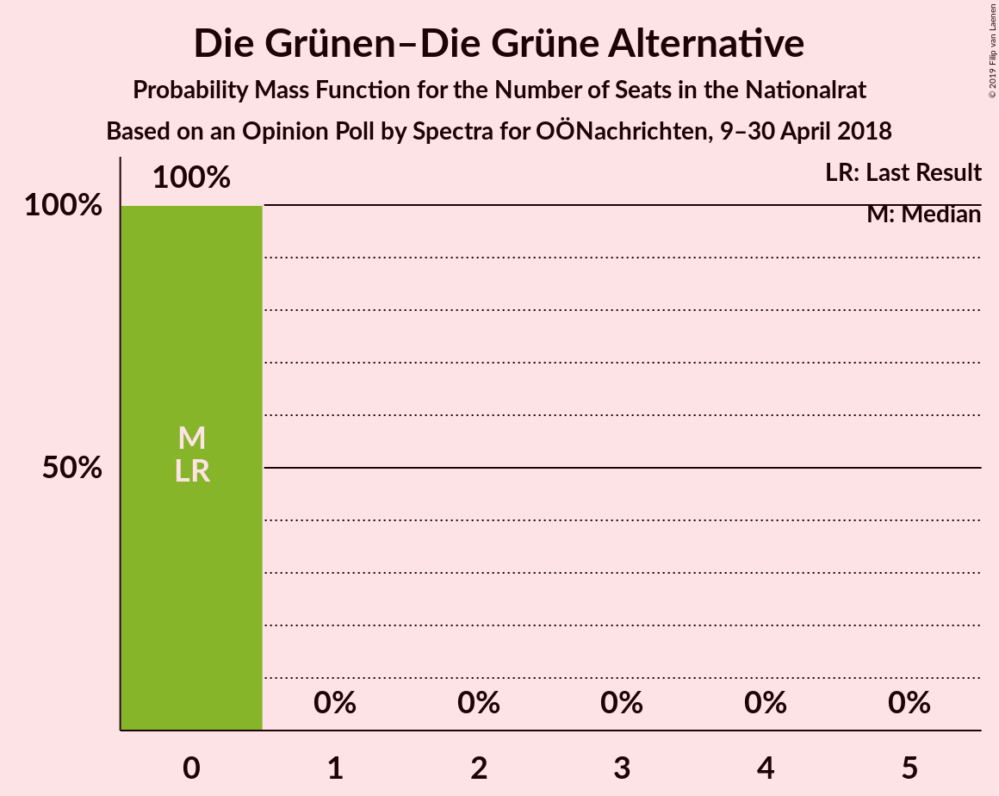
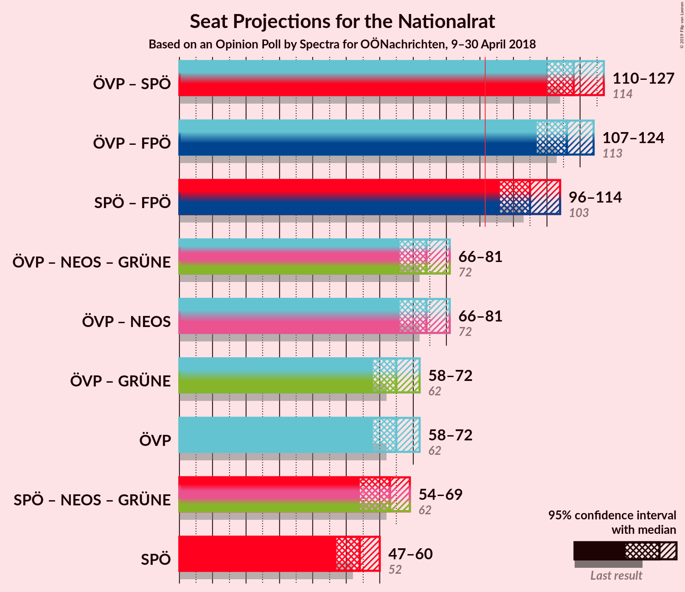
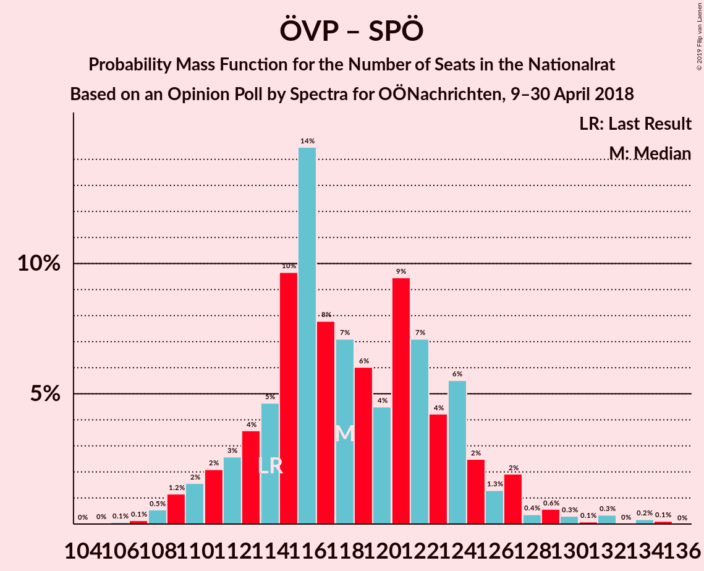
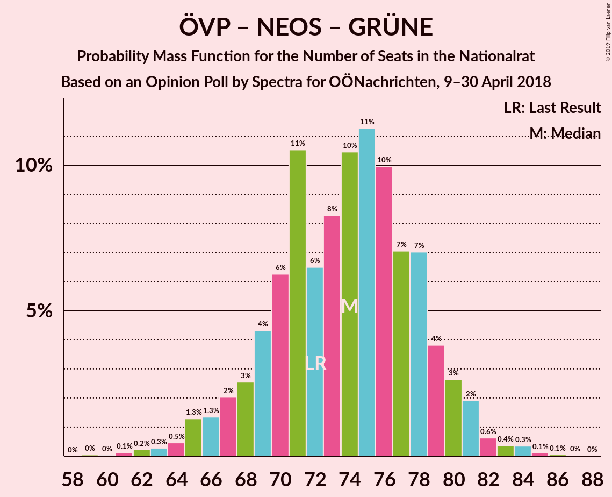

# Opinion Poll by Spectra for OÖNachrichten, 9–30 April 2018

<a href="#voting-intentions">Voting Intentions</a> | <a href="#seats">Seats</a> | <a href="#coalitions">Coalitions</a> | <a href="#technical-information">Technical Information</a>

## Voting Intentions

### Confidence Intervals

| Party | Last Result | Poll Result | 80% Confidence Interval | 90% Confidence Interval | 95% Confidence Interval | 99% Confidence Interval |
|:-----:|:-----------:|:-----------:|:-----------------------:|:-----------------------:|:-----------------------:|:-----------------------:|
| Österreichische Volkspartei | 31.5% | 34.0% | 31.8–36.3% |31.2–36.9% |30.7–37.5% |29.6–38.6% |
| Sozialdemokratische Partei Österreichs | 26.9% | 28.0% | 26.0–30.2% |25.4–30.9% |24.9–31.4% |24.0–32.5% |
| Freiheitliche Partei Österreichs | 26.0% | 27.0% | 24.9–29.1% |24.4–29.8% |23.9–30.3% |22.9–31.4% |
| NEOS–Das Neue Österreich und Liberales Forum | 5.3% | 5.0% | 4.1–6.2% |3.9–6.5% |3.7–6.8% |3.3–7.5% |
| JETZT–Liste Pilz | 4.4% | 4.1% | 3.3–5.2% |3.0–5.5% |2.9–5.7% |2.5–6.3% |
| Die Grünen–Die Grüne Alternative | 3.8% | 0.9% | 0.6–1.6% |0.5–1.8% |0.5–2.0% |0.3–2.3% |

*Note:* The poll result column reflects the actual value used in the calculations. Published results may vary slightly, and in addition be rounded to fewer digits.

## Seats

### Confidence Intervals

| Party | Last Result | Median | 80% Confidence Interval | 90% Confidence Interval | 95% Confidence Interval | 99% Confidence Interval |
|:-----:|:-----------:|:------:|:-----------------------:|:-----------------------:|:-----------------------:|:-----------------------:|
| <a href="#österreichische-volkspartei">Österreichische Volkspartei</a> | 62 | 65 | 60–69 |59–71 |58–72 |56–75 |
| <a href="#sozialdemokratische-partei-österreichs">Sozialdemokratische Partei Österreichs</a> | 52 | 54 | 49–58 |48–60 |47–60 |45–62 |
| <a href="#freiheitliche-partei-österreichs">Freiheitliche Partei Österreichs</a> | 51 | 51 | 47–56 |46–57 |45–58 |43–60 |
| <a href="#neos–das-neue-österreich-und-liberales-forum">NEOS–Das Neue Österreich und Liberales Forum</a> | 10 | 9 | 7–11 |0–12 |0–13 |0–14 |
| <a href="#jetzt–liste-pilz">JETZT–Liste Pilz</a> | 8 | 7 | 0–9 |0–10 |0–10 |0–11 |
| <a href="#die-grünen–die-grüne-alternative">Die Grünen–Die Grüne Alternative</a> | 0 | 0 | 0 |0 |0 |0 |

### Österreichische Volkspartei

*For a full overview of the results for this party, see the [Österreichische Volkspartei](party-österreichischevolkspartei.html) page.*

| Number of Seats | Probability | Accumulated | Special Marks |
|:---------------:|:-----------:|:-----------:|:-------------:|
| 53 | 0% | 100% |  |
| 54 | 0.1% | 99.9% |  |
| 55 | 0.2% | 99.8% |  |
| 56 | 0.3% | 99.6% |  |
| 57 | 2% | 99.3% |  |
| 58 | 2% | 98% |  |
| 59 | 2% | 95% |  |
| 60 | 4% | 94% |  |
| 61 | 6% | 90% |  |
| 62 | 5% | 84% | Last Result |
| 63 | 16% | 80% |  |
| 64 | 8% | 64% |  |
| 65 | 13% | 57% | Median |
| 66 | 13% | 44% |  |
| 67 | 11% | 31% |  |
| 68 | 6% | 20% |  |
| 69 | 6% | 14% |  |
| 70 | 4% | 9% |  |
| 71 | 2% | 5% |  |
| 72 | 1.4% | 3% |  |
| 73 | 0.2% | 2% |  |
| 74 | 0.7% | 1.4% |  |
| 75 | 0.5% | 0.7% |  |
| 76 | 0.1% | 0.2% |  |
| 77 | 0% | 0.1% |  |
| 78 | 0% | 0.1% |  |
| 79 | 0% | 0% |  |

### Sozialdemokratische Partei Österreichs

*For a full overview of the results for this party, see the [Sozialdemokratische Partei Österreichs](party-sozialdemokratischeparteiösterreichs.html) page.*

| Number of Seats | Probability | Accumulated | Special Marks |
|:---------------:|:-----------:|:-----------:|:-------------:|
| 43 | 0.1% | 100% |  |
| 44 | 0.2% | 99.9% |  |
| 45 | 0.4% | 99.7% |  |
| 46 | 2% | 99.3% |  |
| 47 | 2% | 98% |  |
| 48 | 3% | 96% |  |
| 49 | 7% | 93% |  |
| 50 | 5% | 86% |  |
| 51 | 11% | 81% |  |
| 52 | 9% | 70% | Last Result |
| 53 | 11% | 61% |  |
| 54 | 13% | 50% | Median |
| 55 | 14% | 37% |  |
| 56 | 6% | 24% |  |
| 57 | 6% | 17% |  |
| 58 | 4% | 12% |  |
| 59 | 2% | 8% |  |
| 60 | 5% | 6% |  |
| 61 | 0.5% | 1.4% |  |
| 62 | 0.5% | 0.9% |  |
| 63 | 0.3% | 0.5% |  |
| 64 | 0.1% | 0.2% |  |
| 65 | 0.1% | 0.1% |  |
| 66 | 0% | 0% |  |

### Freiheitliche Partei Österreichs

*For a full overview of the results for this party, see the [Freiheitliche Partei Österreichs](party-freiheitlicheparteiösterreichs.html) page.*

| Number of Seats | Probability | Accumulated | Special Marks |
|:---------------:|:-----------:|:-----------:|:-------------:|
| 41 | 0.1% | 100% |  |
| 42 | 0.2% | 99.9% |  |
| 43 | 0.4% | 99.7% |  |
| 44 | 0.9% | 99.4% |  |
| 45 | 2% | 98% |  |
| 46 | 4% | 96% |  |
| 47 | 4% | 92% |  |
| 48 | 8% | 89% |  |
| 49 | 7% | 81% |  |
| 50 | 15% | 74% |  |
| 51 | 10% | 59% | Last Result, Median |
| 52 | 15% | 48% |  |
| 53 | 10% | 33% |  |
| 54 | 6% | 23% |  |
| 55 | 5% | 17% |  |
| 56 | 5% | 12% |  |
| 57 | 3% | 6% |  |
| 58 | 2% | 3% |  |
| 59 | 0.5% | 1.5% |  |
| 60 | 0.6% | 1.0% |  |
| 61 | 0.2% | 0.4% |  |
| 62 | 0.1% | 0.2% |  |
| 63 | 0.1% | 0.1% |  |
| 64 | 0% | 0% |  |

### NEOS–Das Neue Österreich und Liberales Forum

*For a full overview of the results for this party, see the [NEOS–Das Neue Österreich und Liberales Forum](party-neos–dasneueösterreichundliberalesforum.html) page.*

| Number of Seats | Probability | Accumulated | Special Marks |
|:---------------:|:-----------:|:-----------:|:-------------:|
| 0 | 7% | 100% |  |
| 1 | 0% | 93% |  |
| 2 | 0% | 93% |  |
| 3 | 0% | 93% |  |
| 4 | 0% | 93% |  |
| 5 | 0% | 93% |  |
| 6 | 0% | 93% |  |
| 7 | 4% | 93% |  |
| 8 | 19% | 89% |  |
| 9 | 27% | 70% | Median |
| 10 | 20% | 43% | Last Result |
| 11 | 15% | 23% |  |
| 12 | 5% | 8% |  |
| 13 | 2% | 3% |  |
| 14 | 0.5% | 0.6% |  |
| 15 | 0.1% | 0.2% |  |
| 16 | 0% | 0% |  |

### JETZT–Liste Pilz

*For a full overview of the results for this party, see the [JETZT–Liste Pilz](party-jetzt–listepilz.html) page.*

| Number of Seats | Probability | Accumulated | Special Marks |
|:---------------:|:-----------:|:-----------:|:-------------:|
| 0 | 45% | 100% |  |
| 1 | 0% | 55% |  |
| 2 | 0% | 55% |  |
| 3 | 0% | 55% |  |
| 4 | 0% | 55% |  |
| 5 | 0% | 55% |  |
| 6 | 0% | 55% |  |
| 7 | 18% | 55% | Median |
| 8 | 20% | 37% | Last Result |
| 9 | 10% | 17% |  |
| 10 | 5% | 7% |  |
| 11 | 2% | 2% |  |
| 12 | 0.3% | 0.4% |  |
| 13 | 0% | 0.1% |  |
| 14 | 0% | 0% |  |

### Die Grünen–Die Grüne Alternative

*For a full overview of the results for this party, see the [Die Grünen–Die Grüne Alternative](party-diegrünen–diegrünealternative.html) page.*

| Number of Seats | Probability | Accumulated | Special Marks |
|:---------------:|:-----------:|:-----------:|:-------------:|
| 0 | 100% | 100% | Last Result, Median |

## Coalitions

### Confidence Intervals

| Coalition | Last Result | Median | Majority? | 80% Confidence Interval | 90% Confidence Interval | 95% Confidence Interval | 99% Confidence Interval |
|:---------:|:-----------:|:------:|:---------:|:-----------------------:|:-----------------------:|:-----------------------:|:-----------------------:|
| Österreichische Volkspartei – Sozialdemokratische Partei Österreichs | 114 | 118 | 100% | 113–124 | 111–126 | 110–127 | 108–132 |
| Österreichische Volkspartei – Freiheitliche Partei Österreichs | 113 | 116 | 100% | 111–121 | 109–123 | 107–124 | 105–128 |
| Sozialdemokratische Partei Österreichs – Freiheitliche Partei Österreichs | 103 | 105 | 100% | 99–110 | 98–112 | 96–114 | 94–116 |
| Österreichische Volkspartei – NEOS–Das Neue Österreich und Liberales Forum – Die Grünen–Die Grüne Alternative | 72 | 74 | 0% | 69–78 | 67–80 | 66–81 | 63–84 |
| Österreichische Volkspartei – NEOS–Das Neue Österreich und Liberales Forum | 72 | 74 | 0% | 69–78 | 67–80 | 66–81 | 63–84 |
| Österreichische Volkspartei – Die Grünen–Die Grüne Alternative | 62 | 65 | 0% | 60–69 | 59–71 | 58–72 | 56–75 |
| Österreichische Volkspartei | 62 | 65 | 0% | 60–69 | 59–71 | 58–72 | 56–75 |
| Sozialdemokratische Partei Österreichs – NEOS–Das Neue Österreich und Liberales Forum – Die Grünen–Die Grüne Alternative | 62 | 63 | 0% | 57–67 | 55–68 | 54–69 | 51–72 |
| Sozialdemokratische Partei Österreichs | 52 | 54 | 0% | 49–58 | 48–60 | 47–60 | 45–62 |

### Österreichische Volkspartei – Sozialdemokratische Partei Österreichs

| Number of Seats | Probability | Accumulated | Special Marks |
|:---------------:|:-----------:|:-----------:|:-------------:|
| 105 | 0% | 100% |  |
| 106 | 0.1% | 99.9% |  |
| 107 | 0.1% | 99.9% |  |
| 108 | 0.5% | 99.7% |  |
| 109 | 1.2% | 99.2% |  |
| 110 | 2% | 98% |  |
| 111 | 2% | 96% |  |
| 112 | 3% | 94% |  |
| 113 | 4% | 92% |  |
| 114 | 5% | 88% | Last Result |
| 115 | 10% | 84% |  |
| 116 | 14% | 74% |  |
| 117 | 8% | 59% |  |
| 118 | 7% | 52% |  |
| 119 | 6% | 45% | Median |
| 120 | 4% | 39% |  |
| 121 | 9% | 34% |  |
| 122 | 7% | 25% |  |
| 123 | 4% | 17% |  |
| 124 | 6% | 13% |  |
| 125 | 2% | 8% |  |
| 126 | 1.3% | 5% |  |
| 127 | 2% | 4% |  |
| 128 | 0.4% | 2% |  |
| 129 | 0.6% | 2% |  |
| 130 | 0.3% | 1.1% |  |
| 131 | 0.1% | 0.8% |  |
| 132 | 0.3% | 0.7% |  |
| 133 | 0% | 0.3% |  |
| 134 | 0.2% | 0.3% |  |
| 135 | 0.1% | 0.1% |  |
| 136 | 0% | 0% |  |

### Österreichische Volkspartei – Freiheitliche Partei Österreichs

| Number of Seats | Probability | Accumulated | Special Marks |
|:---------------:|:-----------:|:-----------:|:-------------:|
| 104 | 0.1% | 100% |  |
| 105 | 0.5% | 99.9% |  |
| 106 | 1.0% | 99.4% |  |
| 107 | 2% | 98% |  |
| 108 | 2% | 97% |  |
| 109 | 3% | 95% |  |
| 110 | 3% | 93% |  |
| 111 | 3% | 90% |  |
| 112 | 3% | 87% |  |
| 113 | 3% | 84% | Last Result |
| 114 | 6% | 81% |  |
| 115 | 17% | 74% |  |
| 116 | 8% | 58% | Median |
| 117 | 10% | 50% |  |
| 118 | 11% | 40% |  |
| 119 | 12% | 28% |  |
| 120 | 5% | 16% |  |
| 121 | 3% | 11% |  |
| 122 | 2% | 8% |  |
| 123 | 3% | 6% |  |
| 124 | 1.1% | 3% |  |
| 125 | 0.9% | 2% |  |
| 126 | 0.3% | 2% |  |
| 127 | 0.4% | 1.3% |  |
| 128 | 0.4% | 0.8% |  |
| 129 | 0.1% | 0.4% |  |
| 130 | 0.1% | 0.3% |  |
| 131 | 0.1% | 0.1% |  |
| 132 | 0% | 0.1% |  |
| 133 | 0.1% | 0.1% |  |
| 134 | 0% | 0% |  |

### Sozialdemokratische Partei Österreichs – Freiheitliche Partei Österreichs

| Number of Seats | Probability | Accumulated | Special Marks |
|:---------------:|:-----------:|:-----------:|:-------------:|
| 92 | 0.1% | 100% | Majority |
| 93 | 0.1% | 99.9% |  |
| 94 | 0.5% | 99.8% |  |
| 95 | 0.7% | 99.3% |  |
| 96 | 1.4% | 98.6% |  |
| 97 | 1.3% | 97% |  |
| 98 | 2% | 96% |  |
| 99 | 7% | 94% |  |
| 100 | 4% | 86% |  |
| 101 | 7% | 83% |  |
| 102 | 8% | 76% |  |
| 103 | 6% | 68% | Last Result |
| 104 | 8% | 62% |  |
| 105 | 13% | 54% | Median |
| 106 | 5% | 41% |  |
| 107 | 9% | 35% |  |
| 108 | 6% | 27% |  |
| 109 | 6% | 20% |  |
| 110 | 5% | 14% |  |
| 111 | 3% | 9% |  |
| 112 | 2% | 6% |  |
| 113 | 2% | 5% |  |
| 114 | 0.9% | 3% |  |
| 115 | 0.6% | 2% |  |
| 116 | 1.1% | 1.4% |  |
| 117 | 0.1% | 0.3% |  |
| 118 | 0.1% | 0.2% |  |
| 119 | 0% | 0.1% |  |
| 120 | 0% | 0.1% |  |
| 121 | 0.1% | 0.1% |  |
| 122 | 0% | 0% |  |

### Österreichische Volkspartei – NEOS–Das Neue Österreich und Liberales Forum – Die Grünen–Die Grüne Alternative

| Number of Seats | Probability | Accumulated | Special Marks |
|:---------------:|:-----------:|:-----------:|:-------------:|
| 59 | 0% | 100% |  |
| 60 | 0% | 99.9% |  |
| 61 | 0.1% | 99.9% |  |
| 62 | 0.2% | 99.8% |  |
| 63 | 0.3% | 99.5% |  |
| 64 | 0.5% | 99.3% |  |
| 65 | 1.3% | 98.8% |  |
| 66 | 1.3% | 98% |  |
| 67 | 2% | 96% |  |
| 68 | 3% | 94% |  |
| 69 | 4% | 92% |  |
| 70 | 6% | 87% |  |
| 71 | 11% | 81% |  |
| 72 | 6% | 70% | Last Result |
| 73 | 8% | 64% |  |
| 74 | 10% | 56% | Median |
| 75 | 11% | 45% |  |
| 76 | 10% | 34% |  |
| 77 | 7% | 24% |  |
| 78 | 7% | 17% |  |
| 79 | 4% | 10% |  |
| 80 | 3% | 6% |  |
| 81 | 2% | 3% |  |
| 82 | 0.6% | 2% |  |
| 83 | 0.4% | 0.9% |  |
| 84 | 0.3% | 0.6% |  |
| 85 | 0.1% | 0.2% |  |
| 86 | 0.1% | 0.1% |  |
| 87 | 0% | 0% |  |

### Österreichische Volkspartei – NEOS–Das Neue Österreich und Liberales Forum

| Number of Seats | Probability | Accumulated | Special Marks |
|:---------------:|:-----------:|:-----------:|:-------------:|
| 59 | 0% | 100% |  |
| 60 | 0% | 99.9% |  |
| 61 | 0.1% | 99.9% |  |
| 62 | 0.2% | 99.8% |  |
| 63 | 0.3% | 99.5% |  |
| 64 | 0.5% | 99.3% |  |
| 65 | 1.3% | 98.8% |  |
| 66 | 1.3% | 98% |  |
| 67 | 2% | 96% |  |
| 68 | 3% | 94% |  |
| 69 | 4% | 92% |  |
| 70 | 6% | 87% |  |
| 71 | 11% | 81% |  |
| 72 | 6% | 70% | Last Result |
| 73 | 8% | 64% |  |
| 74 | 10% | 56% | Median |
| 75 | 11% | 45% |  |
| 76 | 10% | 34% |  |
| 77 | 7% | 24% |  |
| 78 | 7% | 17% |  |
| 79 | 4% | 10% |  |
| 80 | 3% | 6% |  |
| 81 | 2% | 3% |  |
| 82 | 0.6% | 2% |  |
| 83 | 0.4% | 0.9% |  |
| 84 | 0.3% | 0.6% |  |
| 85 | 0.1% | 0.2% |  |
| 86 | 0.1% | 0.1% |  |
| 87 | 0% | 0% |  |

### Österreichische Volkspartei – Die Grünen–Die Grüne Alternative

| Number of Seats | Probability | Accumulated | Special Marks |
|:---------------:|:-----------:|:-----------:|:-------------:|
| 53 | 0% | 100% |  |
| 54 | 0.1% | 99.9% |  |
| 55 | 0.2% | 99.8% |  |
| 56 | 0.3% | 99.6% |  |
| 57 | 2% | 99.3% |  |
| 58 | 2% | 98% |  |
| 59 | 2% | 95% |  |
| 60 | 4% | 94% |  |
| 61 | 6% | 90% |  |
| 62 | 5% | 84% | Last Result |
| 63 | 16% | 80% |  |
| 64 | 8% | 64% |  |
| 65 | 13% | 57% | Median |
| 66 | 13% | 44% |  |
| 67 | 11% | 31% |  |
| 68 | 6% | 20% |  |
| 69 | 6% | 14% |  |
| 70 | 4% | 9% |  |
| 71 | 2% | 5% |  |
| 72 | 1.4% | 3% |  |
| 73 | 0.2% | 2% |  |
| 74 | 0.7% | 1.4% |  |
| 75 | 0.5% | 0.7% |  |
| 76 | 0.1% | 0.2% |  |
| 77 | 0% | 0.1% |  |
| 78 | 0% | 0.1% |  |
| 79 | 0% | 0% |  |

### Österreichische Volkspartei

| Number of Seats | Probability | Accumulated | Special Marks |
|:---------------:|:-----------:|:-----------:|:-------------:|
| 53 | 0% | 100% |  |
| 54 | 0.1% | 99.9% |  |
| 55 | 0.2% | 99.8% |  |
| 56 | 0.3% | 99.6% |  |
| 57 | 2% | 99.3% |  |
| 58 | 2% | 98% |  |
| 59 | 2% | 95% |  |
| 60 | 4% | 94% |  |
| 61 | 6% | 90% |  |
| 62 | 5% | 84% | Last Result |
| 63 | 16% | 80% |  |
| 64 | 8% | 64% |  |
| 65 | 13% | 57% | Median |
| 66 | 13% | 44% |  |
| 67 | 11% | 31% |  |
| 68 | 6% | 20% |  |
| 69 | 6% | 14% |  |
| 70 | 4% | 9% |  |
| 71 | 2% | 5% |  |
| 72 | 1.4% | 3% |  |
| 73 | 0.2% | 2% |  |
| 74 | 0.7% | 1.4% |  |
| 75 | 0.5% | 0.7% |  |
| 76 | 0.1% | 0.2% |  |
| 77 | 0% | 0.1% |  |
| 78 | 0% | 0.1% |  |
| 79 | 0% | 0% |  |

### Sozialdemokratische Partei Österreichs – NEOS–Das Neue Österreich und Liberales Forum – Die Grünen–Die Grüne Alternative

| Number of Seats | Probability | Accumulated | Special Marks |
|:---------------:|:-----------:|:-----------:|:-------------:|
| 47 | 0% | 100% |  |
| 48 | 0% | 99.9% |  |
| 49 | 0.1% | 99.9% |  |
| 50 | 0.1% | 99.8% |  |
| 51 | 0.4% | 99.7% |  |
| 52 | 0.3% | 99.4% |  |
| 53 | 0.9% | 99.1% |  |
| 54 | 1.2% | 98% |  |
| 55 | 2% | 97% |  |
| 56 | 2% | 95% |  |
| 57 | 3% | 93% |  |
| 58 | 5% | 90% |  |
| 59 | 8% | 85% |  |
| 60 | 10% | 77% |  |
| 61 | 10% | 68% |  |
| 62 | 7% | 57% | Last Result |
| 63 | 7% | 50% | Median |
| 64 | 12% | 43% |  |
| 65 | 11% | 31% |  |
| 66 | 7% | 20% |  |
| 67 | 4% | 13% |  |
| 68 | 4% | 8% |  |
| 69 | 2% | 4% |  |
| 70 | 1.2% | 2% |  |
| 71 | 0.3% | 0.8% |  |
| 72 | 0.2% | 0.5% |  |
| 73 | 0.2% | 0.3% |  |
| 74 | 0% | 0.1% |  |
| 75 | 0% | 0.1% |  |
| 76 | 0% | 0% |  |

### Sozialdemokratische Partei Österreichs

| Number of Seats | Probability | Accumulated | Special Marks |
|:---------------:|:-----------:|:-----------:|:-------------:|
| 43 | 0.1% | 100% |  |
| 44 | 0.2% | 99.9% |  |
| 45 | 0.4% | 99.7% |  |
| 46 | 2% | 99.3% |  |
| 47 | 2% | 98% |  |
| 48 | 3% | 96% |  |
| 49 | 7% | 93% |  |
| 50 | 5% | 86% |  |
| 51 | 11% | 81% |  |
| 52 | 9% | 70% | Last Result |
| 53 | 11% | 61% |  |
| 54 | 13% | 50% | Median |
| 55 | 14% | 37% |  |
| 56 | 6% | 24% |  |
| 57 | 6% | 17% |  |
| 58 | 4% | 12% |  |
| 59 | 2% | 8% |  |
| 60 | 5% | 6% |  |
| 61 | 0.5% | 1.4% |  |
| 62 | 0.5% | 0.9% |  |
| 63 | 0.3% | 0.5% |  |
| 64 | 0.1% | 0.2% |  |
| 65 | 0.1% | 0.1% |  |
| 66 | 0% | 0% |  |

## Technical Information

### Opinion Poll

+ **Polling firm:** Spectra
+ **Commissioner(s):** OÖNachrichten
+ **Fieldwork period:** 9–30 April 2018

### Calculations

+ **Sample size:** 738
+ **Simulations done:** 131,072
+ **Error estimate:** 1.05%

