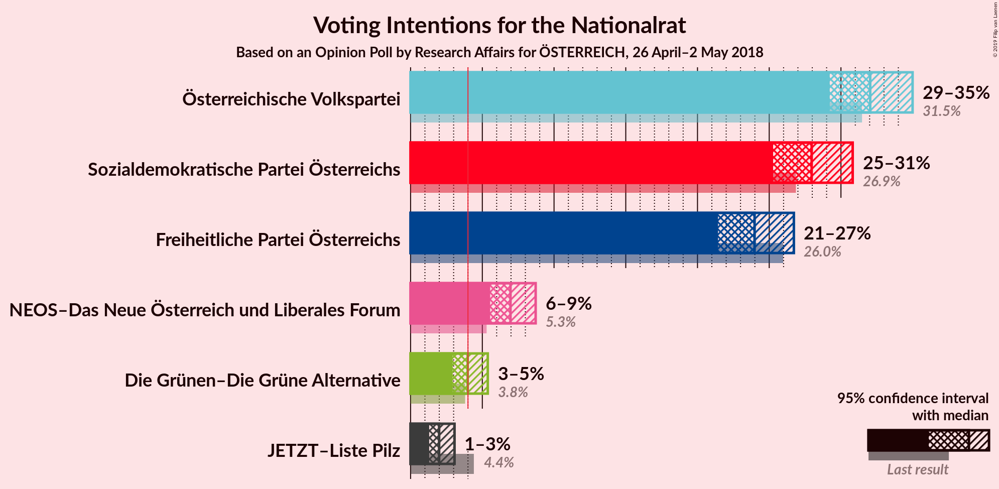
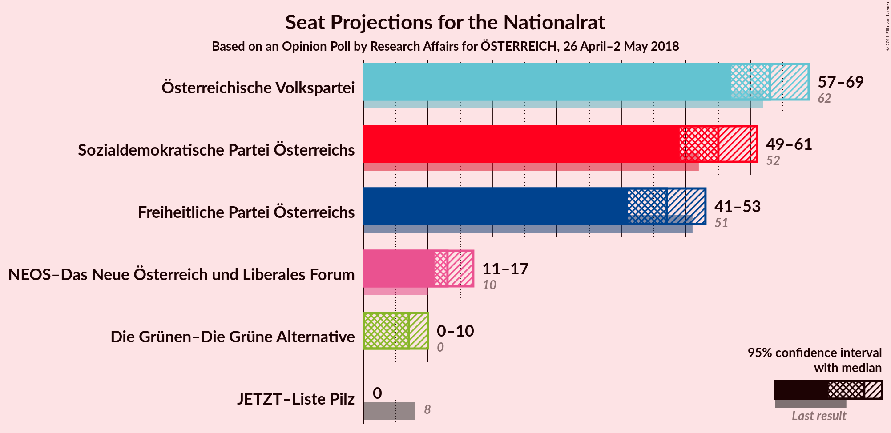
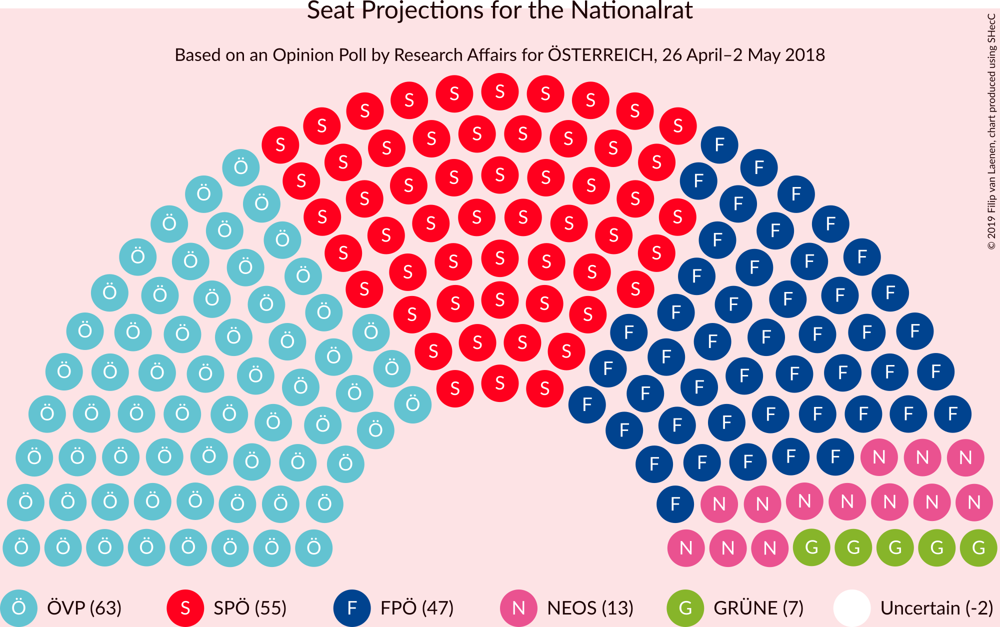
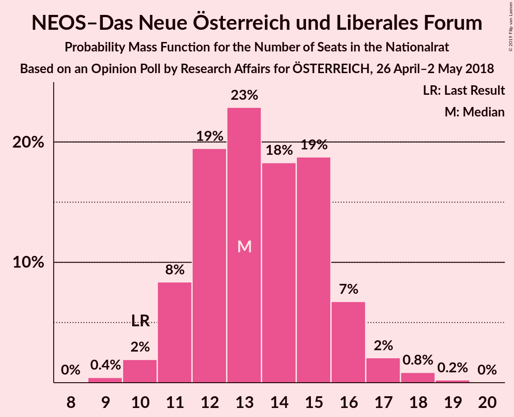
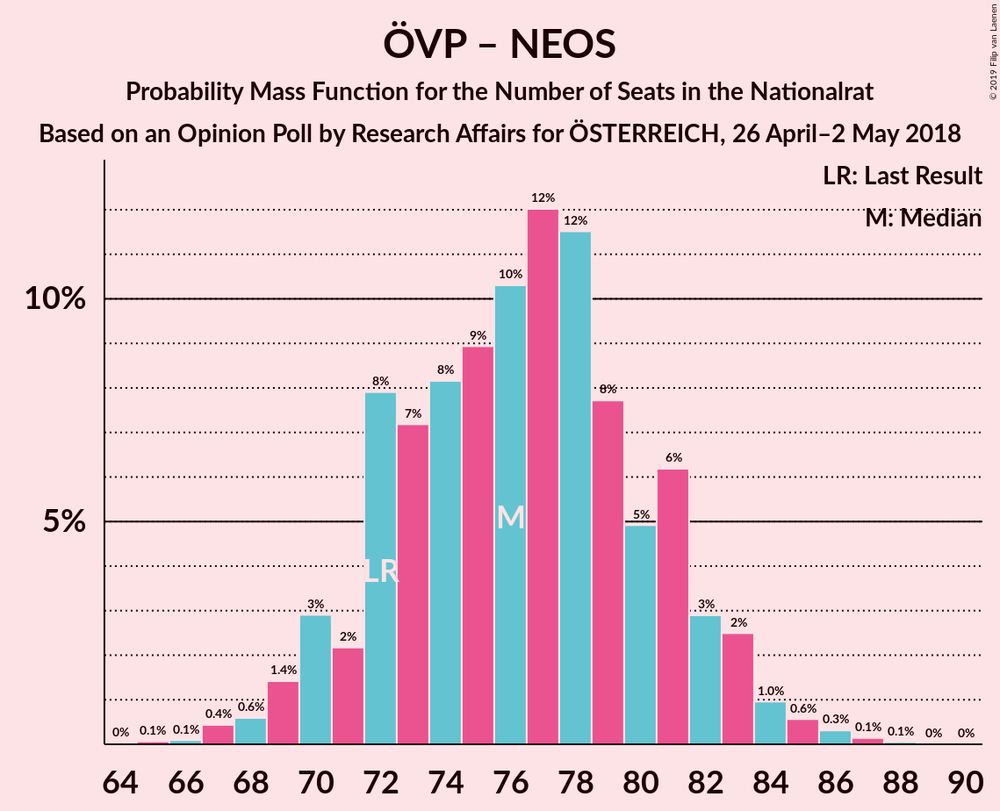
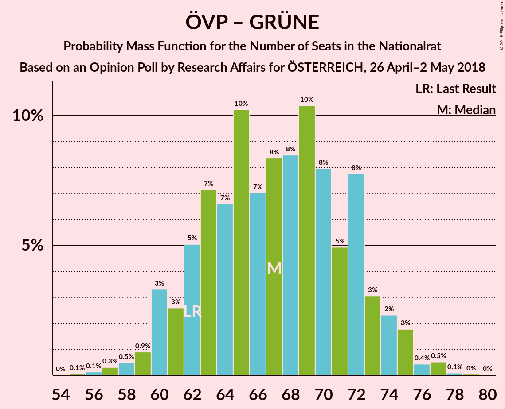

# Opinion Poll by Research Affairs for ÖSTERREICH, 26 April–2 May 2018

<a href="#voting-intentions">Voting Intentions</a> | <a href="#seats">Seats</a> | <a href="#coalitions">Coalitions</a> | <a href="#technical-information">Technical Information</a>

## Voting Intentions

### Confidence Intervals

| Party | Last Result | Poll Result | 80% Confidence Interval | 90% Confidence Interval | 95% Confidence Interval | 99% Confidence Interval |
|:-----:|:-----------:|:-----------:|:-----------------------:|:-----------------------:|:-----------------------:|:-----------------------:|
| Österreichische Volkspartei | 31.5% | 32.0% | 30.2–34.0% |29.7–34.5% |29.2–35.0% |28.3–35.9% |
| Sozialdemokratische Partei Österreichs | 26.9% | 28.0% | 26.2–29.8% |25.7–30.4% |25.3–30.8% |24.4–31.7% |
| Freiheitliche Partei Österreichs | 26.0% | 24.0% | 22.3–25.8% |21.8–26.3% |21.4–26.7% |20.7–27.6% |
| NEOS–Das Neue Österreich und Liberales Forum | 5.3% | 7.0% | 6.0–8.1% |5.8–8.4% |5.5–8.7% |5.1–9.3% |
| Die Grünen–Die Grüne Alternative | 3.8% | 4.0% | 3.3–4.9% |3.1–5.2% |2.9–5.4% |2.6–5.9% |
| JETZT–Liste Pilz | 4.4% | 2.0% | 1.5–2.7% |1.4–2.9% |1.3–3.1% |1.1–3.4% |

*Note:* The poll result column reflects the actual value used in the calculations. Published results may vary slightly, and in addition be rounded to fewer digits.

## Seats

### Confidence Intervals

| Party | Last Result | Median | 80% Confidence Interval | 90% Confidence Interval | 95% Confidence Interval | 99% Confidence Interval |
|:-----:|:-----------:|:------:|:-----------------------:|:-----------------------:|:-----------------------:|:-----------------------:|
| <a href="#österreichische-volkspartei">Österreichische Volkspartei</a> | 62 | 63 | 59–68 |58–68 |57–69 |55–71 |
| <a href="#sozialdemokratische-partei-österreichs">Sozialdemokratische Partei Österreichs</a> | 52 | 55 | 51–59 |50–60 |49–61 |47–63 |
| <a href="#freiheitliche-partei-österreichs">Freiheitliche Partei Österreichs</a> | 51 | 47 | 43–51 |42–52 |41–53 |40–54 |
| <a href="#neos–das-neue-österreich-und-liberales-forum">NEOS–Das Neue Österreich und Liberales Forum</a> | 10 | 13 | 11–15 |11–16 |11–17 |10–18 |
| <a href="#die-grünen–die-grüne-alternative">Die Grünen–Die Grüne Alternative</a> | 0 | 7 | 0–9 |0–10 |0–10 |0–11 |
| <a href="#jetzt–liste-pilz">JETZT–Liste Pilz</a> | 8 | 0 | 0 |0 |0 |0 |

### Österreichische Volkspartei

*For a full overview of the results for this party, see the [Österreichische Volkspartei](party-österreichischevolkspartei.html) page.*

| Number of Seats | Probability | Accumulated | Special Marks |
|:---------------:|:-----------:|:-----------:|:-------------:|
| 53 | 0.1% | 100% |  |
| 54 | 0.2% | 99.8% |  |
| 55 | 0.7% | 99.6% |  |
| 56 | 1.1% | 98.9% |  |
| 57 | 2% | 98% |  |
| 58 | 5% | 95% |  |
| 59 | 5% | 91% |  |
| 60 | 10% | 85% |  |
| 61 | 10% | 76% |  |
| 62 | 12% | 66% | Last Result |
| 63 | 13% | 54% | Median |
| 64 | 10% | 41% |  |
| 65 | 12% | 31% |  |
| 66 | 6% | 20% |  |
| 67 | 4% | 14% |  |
| 68 | 6% | 10% |  |
| 69 | 2% | 5% |  |
| 70 | 1.0% | 2% |  |
| 71 | 1.0% | 1.4% |  |
| 72 | 0.2% | 0.4% |  |
| 73 | 0.2% | 0.2% |  |
| 74 | 0% | 0% |  |

### Sozialdemokratische Partei Österreichs

*For a full overview of the results for this party, see the [Sozialdemokratische Partei Österreichs](party-sozialdemokratischeparteiösterreichs.html) page.*

| Number of Seats | Probability | Accumulated | Special Marks |
|:---------------:|:-----------:|:-----------:|:-------------:|
| 45 | 0.1% | 100% |  |
| 46 | 0.2% | 99.9% |  |
| 47 | 0.4% | 99.7% |  |
| 48 | 0.8% | 99.3% |  |
| 49 | 3% | 98% |  |
| 50 | 4% | 96% |  |
| 51 | 6% | 92% |  |
| 52 | 10% | 86% | Last Result |
| 53 | 12% | 76% |  |
| 54 | 8% | 64% |  |
| 55 | 12% | 56% | Median |
| 56 | 14% | 44% |  |
| 57 | 10% | 30% |  |
| 58 | 8% | 20% |  |
| 59 | 6% | 12% |  |
| 60 | 4% | 7% |  |
| 61 | 2% | 3% |  |
| 62 | 0.9% | 1.4% |  |
| 63 | 0.3% | 0.5% |  |
| 64 | 0.1% | 0.2% |  |
| 65 | 0.1% | 0.1% |  |
| 66 | 0% | 0% |  |

### Freiheitliche Partei Österreichs

*For a full overview of the results for this party, see the [Freiheitliche Partei Österreichs](party-freiheitlicheparteiösterreichs.html) page.*

| Number of Seats | Probability | Accumulated | Special Marks |
|:---------------:|:-----------:|:-----------:|:-------------:|
| 38 | 0.1% | 100% |  |
| 39 | 0.2% | 99.9% |  |
| 40 | 0.6% | 99.7% |  |
| 41 | 2% | 99.0% |  |
| 42 | 3% | 97% |  |
| 43 | 5% | 94% |  |
| 44 | 8% | 89% |  |
| 45 | 8% | 80% |  |
| 46 | 22% | 72% |  |
| 47 | 8% | 50% | Median |
| 48 | 11% | 42% |  |
| 49 | 15% | 31% |  |
| 50 | 3% | 16% |  |
| 51 | 7% | 13% | Last Result |
| 52 | 3% | 5% |  |
| 53 | 1.0% | 3% |  |
| 54 | 2% | 2% |  |
| 55 | 0.1% | 0.4% |  |
| 56 | 0.2% | 0.3% |  |
| 57 | 0.1% | 0.1% |  |
| 58 | 0% | 0% |  |

### NEOS–Das Neue Österreich und Liberales Forum

*For a full overview of the results for this party, see the [NEOS–Das Neue Österreich und Liberales Forum](party-neos–dasneueösterreichundliberalesforum.html) page.*

| Number of Seats | Probability | Accumulated | Special Marks |
|:---------------:|:-----------:|:-----------:|:-------------:|
| 9 | 0.4% | 100% |  |
| 10 | 2% | 99.5% | Last Result |
| 11 | 8% | 98% |  |
| 12 | 19% | 89% |  |
| 13 | 23% | 70% | Median |
| 14 | 18% | 47% |  |
| 15 | 19% | 29% |  |
| 16 | 7% | 10% |  |
| 17 | 2% | 3% |  |
| 18 | 0.8% | 1.1% |  |
| 19 | 0.2% | 0.3% |  |
| 20 | 0% | 0% |  |

### Die Grünen–Die Grüne Alternative

*For a full overview of the results for this party, see the [Die Grünen–Die Grüne Alternative](party-diegrünen–diegrünealternative.html) page.*

| Number of Seats | Probability | Accumulated | Special Marks |
|:---------------:|:-----------:|:-----------:|:-------------:|
| 0 | 49% | 100% | Last Result |
| 1 | 0% | 51% |  |
| 2 | 0% | 51% |  |
| 3 | 0% | 51% |  |
| 4 | 0% | 51% |  |
| 5 | 0% | 51% |  |
| 6 | 0% | 51% |  |
| 7 | 5% | 51% | Median |
| 8 | 30% | 46% |  |
| 9 | 11% | 16% |  |
| 10 | 4% | 5% |  |
| 11 | 0.9% | 1.0% |  |
| 12 | 0.1% | 0.1% |  |
| 13 | 0% | 0% |  |

### JETZT–Liste Pilz

*For a full overview of the results for this party, see the [JETZT–Liste Pilz](party-jetzt–listepilz.html) page.*

| Number of Seats | Probability | Accumulated | Special Marks |
|:---------------:|:-----------:|:-----------:|:-------------:|
| 0 | 100% | 100% | Median |
| 1 | 0% | 0% |  |
| 2 | 0% | 0% |  |
| 3 | 0% | 0% |  |
| 4 | 0% | 0% |  |
| 5 | 0% | 0% |  |
| 6 | 0% | 0% |  |
| 7 | 0% | 0% |  |
| 8 | 0% | 0% | Last Result |

## Coalitions

### Confidence Intervals

| Coalition | Last Result | Median | Majority? | 80% Confidence Interval | 90% Confidence Interval | 95% Confidence Interval | 99% Confidence Interval |
|:---------:|:-----------:|:------:|:---------:|:-----------------------:|:-----------------------:|:-----------------------:|:-----------------------:|
| Österreichische Volkspartei – Sozialdemokratische Partei Österreichs | 114 | 117 | 100% | 112–123 | 111–124 | 109–126 | 107–127 |
| Österreichische Volkspartei – Freiheitliche Partei Österreichs | 113 | 110 | 100% | 105–115 | 103–116 | 102–118 | 100–119 |
| Sozialdemokratische Partei Österreichs – Freiheitliche Partei Österreichs | 103 | 102 | 99.7% | 97–107 | 95–108 | 94–110 | 92–111 |
| Österreichische Volkspartei – NEOS–Das Neue Österreich und Liberales Forum – Die Grünen–Die Grüne Alternative | 72 | 81 | 0.1% | 76–86 | 74–87 | 73–88 | 71–90 |
| Österreichische Volkspartei – NEOS–Das Neue Österreich und Liberales Forum | 72 | 76 | 0% | 72–81 | 70–82 | 69–83 | 67–86 |
| Sozialdemokratische Partei Österreichs – NEOS–Das Neue Österreich und Liberales Forum – Die Grünen–Die Grüne Alternative | 62 | 72 | 0% | 67–78 | 66–79 | 65–80 | 63–82 |
| Österreichische Volkspartei – Die Grünen–Die Grüne Alternative | 62 | 67 | 0% | 62–72 | 60–74 | 60–75 | 57–77 |
| Österreichische Volkspartei | 62 | 63 | 0% | 59–68 | 58–68 | 57–69 | 55–71 |
| Sozialdemokratische Partei Österreichs | 52 | 55 | 0% | 51–59 | 50–60 | 49–61 | 47–63 |

### Österreichische Volkspartei – Sozialdemokratische Partei Österreichs

| Number of Seats | Probability | Accumulated | Special Marks |
|:---------------:|:-----------:|:-----------:|:-------------:|
| 104 | 0% | 100% |  |
| 105 | 0.1% | 99.9% |  |
| 106 | 0.1% | 99.9% |  |
| 107 | 0.3% | 99.7% |  |
| 108 | 0.9% | 99.4% |  |
| 109 | 1.0% | 98% |  |
| 110 | 1.4% | 97% |  |
| 111 | 2% | 96% |  |
| 112 | 4% | 94% |  |
| 113 | 6% | 90% |  |
| 114 | 9% | 84% | Last Result |
| 115 | 7% | 75% |  |
| 116 | 8% | 68% |  |
| 117 | 10% | 60% |  |
| 118 | 7% | 50% | Median |
| 119 | 9% | 43% |  |
| 120 | 7% | 35% |  |
| 121 | 6% | 28% |  |
| 122 | 7% | 22% |  |
| 123 | 5% | 15% |  |
| 124 | 5% | 10% |  |
| 125 | 2% | 5% |  |
| 126 | 1.2% | 3% |  |
| 127 | 0.9% | 1.3% |  |
| 128 | 0.2% | 0.4% |  |
| 129 | 0.1% | 0.2% |  |
| 130 | 0% | 0% |  |

### Österreichische Volkspartei – Freiheitliche Partei Österreichs

| Number of Seats | Probability | Accumulated | Special Marks |
|:---------------:|:-----------:|:-----------:|:-------------:|
| 97 | 0% | 100% |  |
| 98 | 0.1% | 99.9% |  |
| 99 | 0.3% | 99.8% |  |
| 100 | 0.2% | 99.6% |  |
| 101 | 1.3% | 99.3% |  |
| 102 | 2% | 98% |  |
| 103 | 2% | 96% |  |
| 104 | 4% | 94% |  |
| 105 | 6% | 90% |  |
| 106 | 6% | 84% |  |
| 107 | 9% | 79% |  |
| 108 | 9% | 69% |  |
| 109 | 6% | 60% |  |
| 110 | 9% | 55% | Median |
| 111 | 11% | 46% |  |
| 112 | 8% | 35% |  |
| 113 | 8% | 27% | Last Result |
| 114 | 6% | 19% |  |
| 115 | 6% | 13% |  |
| 116 | 3% | 8% |  |
| 117 | 2% | 5% |  |
| 118 | 1.3% | 3% |  |
| 119 | 0.8% | 1.3% |  |
| 120 | 0.3% | 0.5% |  |
| 121 | 0.1% | 0.2% |  |
| 122 | 0% | 0% |  |

### Sozialdemokratische Partei Österreichs – Freiheitliche Partei Österreichs

| Number of Seats | Probability | Accumulated | Special Marks |
|:---------------:|:-----------:|:-----------:|:-------------:|
| 90 | 0.1% | 100% |  |
| 91 | 0.1% | 99.8% |  |
| 92 | 0.5% | 99.7% | Majority |
| 93 | 0.6% | 99.2% |  |
| 94 | 2% | 98.6% |  |
| 95 | 2% | 97% |  |
| 96 | 4% | 95% |  |
| 97 | 6% | 91% |  |
| 98 | 6% | 85% |  |
| 99 | 8% | 79% |  |
| 100 | 9% | 71% |  |
| 101 | 9% | 62% |  |
| 102 | 10% | 52% | Median |
| 103 | 8% | 42% | Last Result |
| 104 | 7% | 34% |  |
| 105 | 10% | 28% |  |
| 106 | 6% | 17% |  |
| 107 | 4% | 11% |  |
| 108 | 2% | 7% |  |
| 109 | 2% | 5% |  |
| 110 | 1.4% | 3% |  |
| 111 | 0.7% | 1.1% |  |
| 112 | 0.3% | 0.5% |  |
| 113 | 0.1% | 0.2% |  |
| 114 | 0% | 0.1% |  |
| 115 | 0% | 0% |  |

### Österreichische Volkspartei – NEOS–Das Neue Österreich und Liberales Forum – Die Grünen–Die Grüne Alternative

| Number of Seats | Probability | Accumulated | Special Marks |
|:---------------:|:-----------:|:-----------:|:-------------:|
| 68 | 0% | 100% |  |
| 69 | 0.1% | 99.9% |  |
| 70 | 0.2% | 99.8% |  |
| 71 | 0.5% | 99.6% |  |
| 72 | 0.8% | 99.1% | Last Result |
| 73 | 2% | 98% |  |
| 74 | 3% | 96% |  |
| 75 | 3% | 93% |  |
| 76 | 5% | 90% |  |
| 77 | 7% | 85% |  |
| 78 | 11% | 78% |  |
| 79 | 7% | 67% |  |
| 80 | 8% | 60% |  |
| 81 | 10% | 52% |  |
| 82 | 9% | 42% |  |
| 83 | 9% | 33% | Median |
| 84 | 7% | 24% |  |
| 85 | 5% | 17% |  |
| 86 | 5% | 12% |  |
| 87 | 3% | 6% |  |
| 88 | 1.3% | 3% |  |
| 89 | 1.0% | 2% |  |
| 90 | 0.5% | 0.8% |  |
| 91 | 0.2% | 0.3% |  |
| 92 | 0.1% | 0.1% | Majority |
| 93 | 0% | 0% |  |

### Österreichische Volkspartei – NEOS–Das Neue Österreich und Liberales Forum

| Number of Seats | Probability | Accumulated | Special Marks |
|:---------------:|:-----------:|:-----------:|:-------------:|
| 65 | 0.1% | 100% |  |
| 66 | 0.1% | 99.9% |  |
| 67 | 0.4% | 99.8% |  |
| 68 | 0.6% | 99.4% |  |
| 69 | 1.4% | 98.8% |  |
| 70 | 3% | 97% |  |
| 71 | 2% | 94% |  |
| 72 | 8% | 92% | Last Result |
| 73 | 7% | 84% |  |
| 74 | 8% | 77% |  |
| 75 | 9% | 69% |  |
| 76 | 10% | 60% | Median |
| 77 | 12% | 50% |  |
| 78 | 12% | 38% |  |
| 79 | 8% | 26% |  |
| 80 | 5% | 19% |  |
| 81 | 6% | 14% |  |
| 82 | 3% | 7% |  |
| 83 | 2% | 5% |  |
| 84 | 1.0% | 2% |  |
| 85 | 0.6% | 1.1% |  |
| 86 | 0.3% | 0.5% |  |
| 87 | 0.1% | 0.2% |  |
| 88 | 0.1% | 0.1% |  |
| 89 | 0% | 0% |  |

### Sozialdemokratische Partei Österreichs – NEOS–Das Neue Österreich und Liberales Forum – Die Grünen–Die Grüne Alternative

| Number of Seats | Probability | Accumulated | Special Marks |
|:---------------:|:-----------:|:-----------:|:-------------:|
| 60 | 0% | 100% |  |
| 61 | 0% | 99.9% |  |
| 62 | 0.2% | 99.9% | Last Result |
| 63 | 0.4% | 99.7% |  |
| 64 | 1.4% | 99.3% |  |
| 65 | 2% | 98% |  |
| 66 | 2% | 96% |  |
| 67 | 4% | 94% |  |
| 68 | 6% | 90% |  |
| 69 | 6% | 83% |  |
| 70 | 9% | 77% |  |
| 71 | 8% | 68% |  |
| 72 | 11% | 60% |  |
| 73 | 9% | 49% |  |
| 74 | 6% | 40% |  |
| 75 | 8% | 34% | Median |
| 76 | 9% | 26% |  |
| 77 | 5% | 17% |  |
| 78 | 5% | 12% |  |
| 79 | 3% | 7% |  |
| 80 | 1.4% | 4% |  |
| 81 | 1.1% | 2% |  |
| 82 | 0.8% | 1.1% |  |
| 83 | 0.2% | 0.3% |  |
| 84 | 0.1% | 0.1% |  |
| 85 | 0% | 0% |  |

### Österreichische Volkspartei – Die Grünen–Die Grüne Alternative

| Number of Seats | Probability | Accumulated | Special Marks |
|:---------------:|:-----------:|:-----------:|:-------------:|
| 55 | 0.1% | 100% |  |
| 56 | 0.1% | 99.9% |  |
| 57 | 0.3% | 99.8% |  |
| 58 | 0.5% | 99.5% |  |
| 59 | 0.9% | 99.0% |  |
| 60 | 3% | 98% |  |
| 61 | 3% | 95% |  |
| 62 | 5% | 92% | Last Result |
| 63 | 7% | 87% |  |
| 64 | 7% | 80% |  |
| 65 | 10% | 73% |  |
| 66 | 7% | 63% |  |
| 67 | 8% | 56% |  |
| 68 | 8% | 48% |  |
| 69 | 10% | 39% |  |
| 70 | 8% | 29% | Median |
| 71 | 5% | 21% |  |
| 72 | 8% | 16% |  |
| 73 | 3% | 8% |  |
| 74 | 2% | 5% |  |
| 75 | 2% | 3% |  |
| 76 | 0.4% | 1.1% |  |
| 77 | 0.5% | 0.7% |  |
| 78 | 0.1% | 0.2% |  |
| 79 | 0% | 0.1% |  |
| 80 | 0% | 0% |  |

### Österreichische Volkspartei

| Number of Seats | Probability | Accumulated | Special Marks |
|:---------------:|:-----------:|:-----------:|:-------------:|
| 53 | 0.1% | 100% |  |
| 54 | 0.2% | 99.8% |  |
| 55 | 0.7% | 99.6% |  |
| 56 | 1.1% | 98.9% |  |
| 57 | 2% | 98% |  |
| 58 | 5% | 95% |  |
| 59 | 5% | 91% |  |
| 60 | 10% | 85% |  |
| 61 | 10% | 76% |  |
| 62 | 12% | 66% | Last Result |
| 63 | 13% | 54% | Median |
| 64 | 10% | 41% |  |
| 65 | 12% | 31% |  |
| 66 | 6% | 20% |  |
| 67 | 4% | 14% |  |
| 68 | 6% | 10% |  |
| 69 | 2% | 5% |  |
| 70 | 1.0% | 2% |  |
| 71 | 1.0% | 1.4% |  |
| 72 | 0.2% | 0.4% |  |
| 73 | 0.2% | 0.2% |  |
| 74 | 0% | 0% |  |

### Sozialdemokratische Partei Österreichs

| Number of Seats | Probability | Accumulated | Special Marks |
|:---------------:|:-----------:|:-----------:|:-------------:|
| 45 | 0.1% | 100% |  |
| 46 | 0.2% | 99.9% |  |
| 47 | 0.4% | 99.7% |  |
| 48 | 0.8% | 99.3% |  |
| 49 | 3% | 98% |  |
| 50 | 4% | 96% |  |
| 51 | 6% | 92% |  |
| 52 | 10% | 86% | Last Result |
| 53 | 12% | 76% |  |
| 54 | 8% | 64% |  |
| 55 | 12% | 56% | Median |
| 56 | 14% | 44% |  |
| 57 | 10% | 30% |  |
| 58 | 8% | 20% |  |
| 59 | 6% | 12% |  |
| 60 | 4% | 7% |  |
| 61 | 2% | 3% |  |
| 62 | 0.9% | 1.4% |  |
| 63 | 0.3% | 0.5% |  |
| 64 | 0.1% | 0.2% |  |
| 65 | 0.1% | 0.1% |  |
| 66 | 0% | 0% |  |

## Technical Information

### Opinion Poll

+ **Polling firm:** Research Affairs
+ **Commissioner(s):** ÖSTERREICH
+ **Fieldwork period:** 26 April–2 May 2018

### Calculations

+ **Sample size:** 1005
+ **Simulations done:** 131,072
+ **Error estimate:** 1.20%

