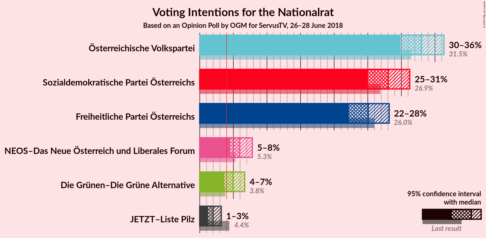
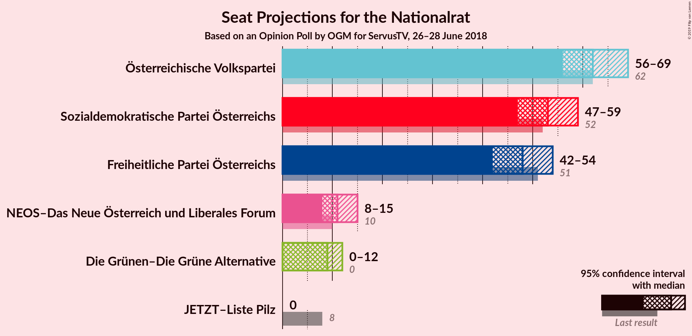
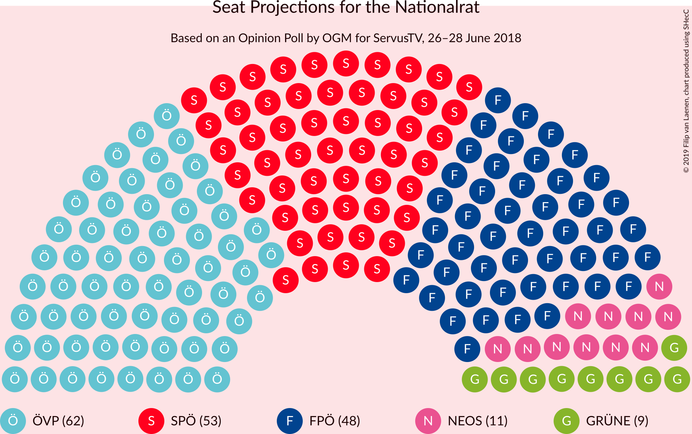
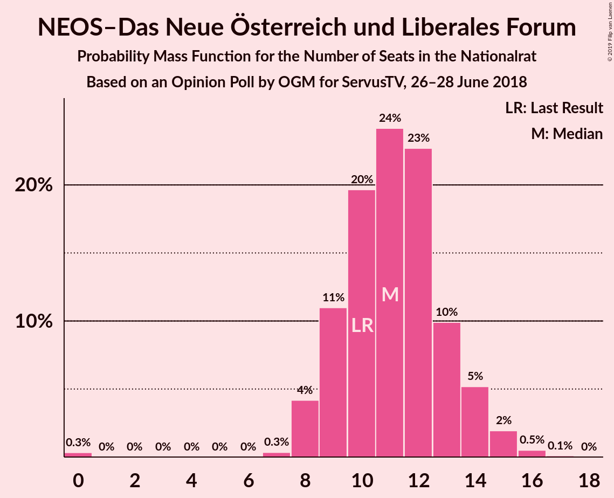
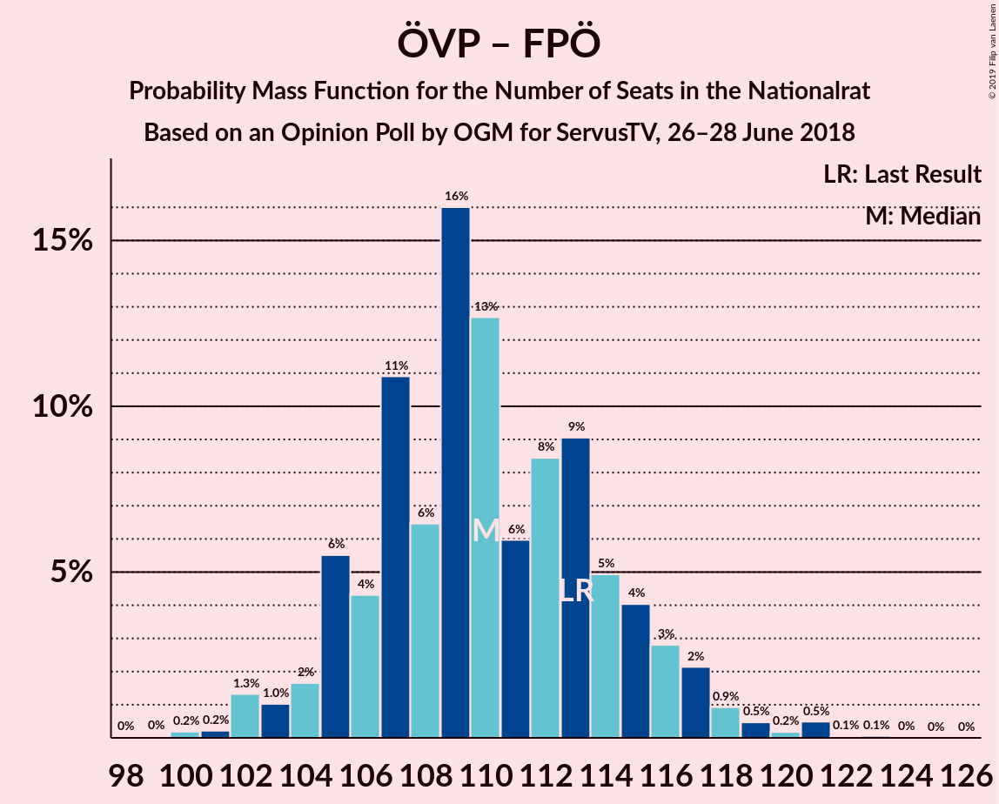
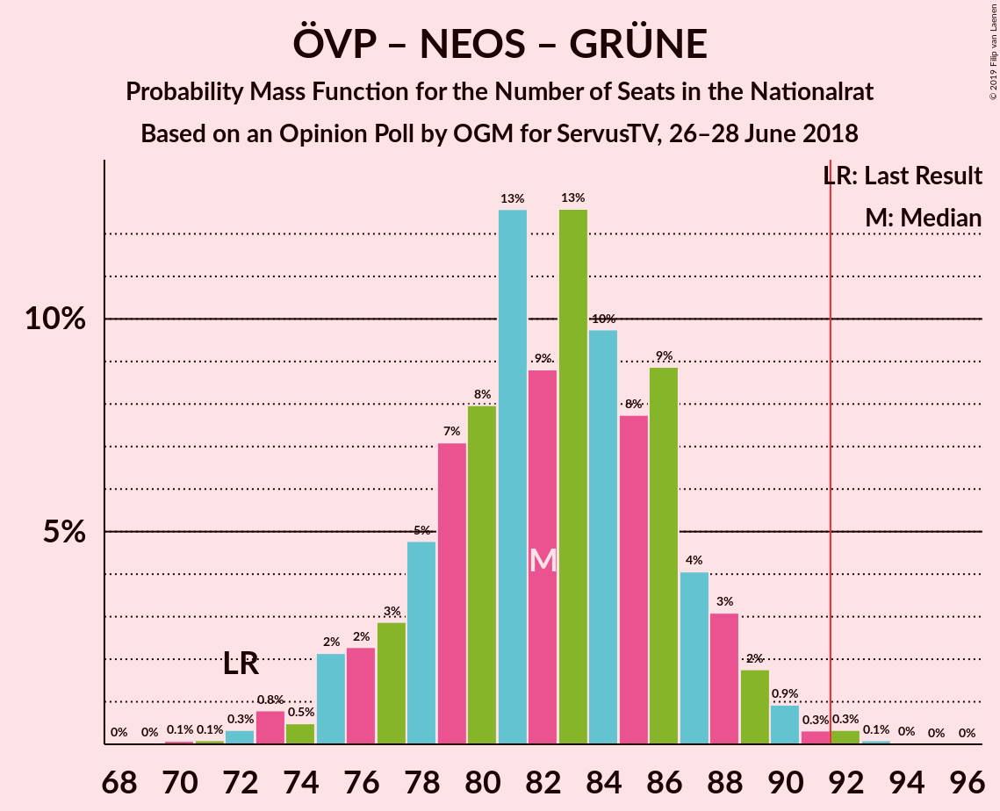
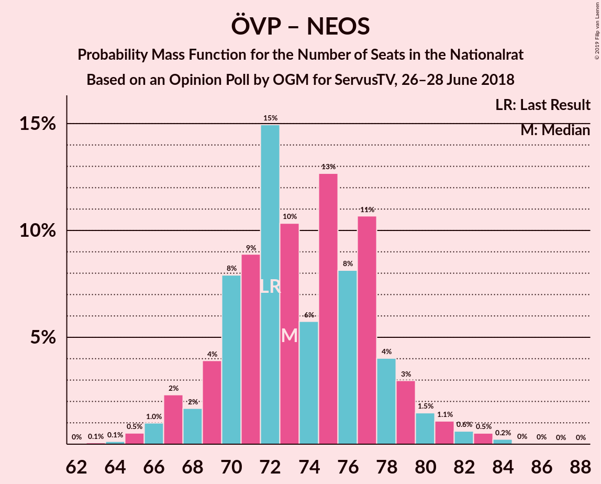
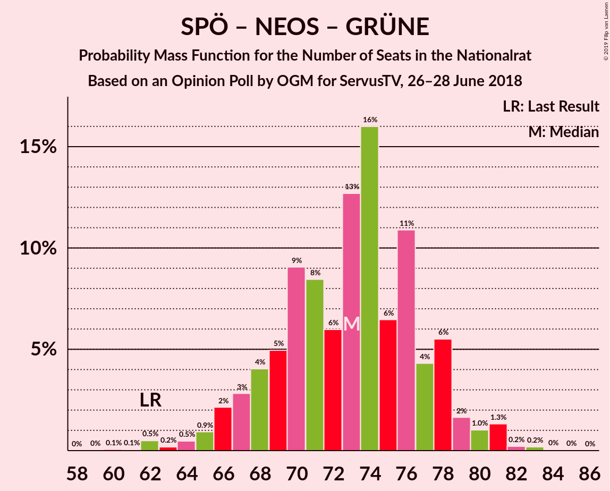
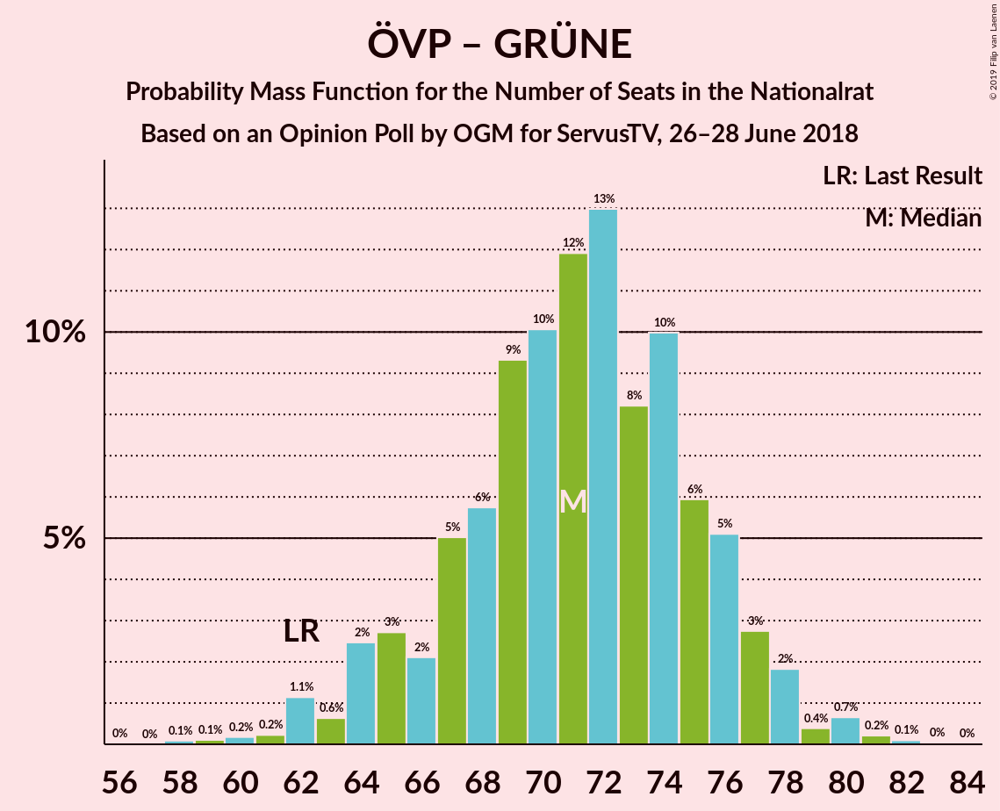

# Opinion Poll by OGM for ServusTV, 26–28 June 2018

<a href="#voting-intentions">Voting Intentions</a> | <a href="#seats">Seats</a> | <a href="#coalitions">Coalitions</a> | <a href="#technical-information">Technical Information</a>

## Voting Intentions

### Confidence Intervals

| Party | Last Result | Poll Result | 80% Confidence Interval | 90% Confidence Interval | 95% Confidence Interval | 99% Confidence Interval |
|:-----:|:-----------:|:-----------:|:-----------------------:|:-----------------------:|:-----------------------:|:-----------------------:|
| Österreichische Volkspartei | 31.5% | 33.0% | 30.9–35.2% |30.3–35.8% |29.8–36.3% |28.9–37.4% |
| Sozialdemokratische Partei Österreichs | 26.9% | 28.0% | 26.1–30.1% |25.5–30.7% |25.0–31.2% |24.1–32.3% |
| Freiheitliche Partei Österreichs | 26.0% | 25.1% | 23.2–27.1% |22.6–27.7% |22.2–28.2% |21.3–29.2% |
| NEOS–Das Neue Österreich und Liberales Forum | 5.3% | 6.0% | 5.0–7.2% |4.7–7.5% |4.5–7.8% |4.1–8.4% |
| Die Grünen–Die Grüne Alternative | 3.8% | 5.0% | 4.1–6.1% |3.9–6.4% |3.7–6.7% |3.3–7.3% |
| JETZT–Liste Pilz | 4.4% | 2.0% | 1.5–2.8% |1.3–3.0% |1.2–3.2% |1.0–3.6% |

*Note:* The poll result column reflects the actual value used in the calculations. Published results may vary slightly, and in addition be rounded to fewer digits.

## Seats

### Confidence Intervals

| Party | Last Result | Median | 80% Confidence Interval | 90% Confidence Interval | 95% Confidence Interval | 99% Confidence Interval |
|:-----:|:-----------:|:------:|:-----------------------:|:-----------------------:|:-----------------------:|:-----------------------:|
| <a href="#österreichische-volkspartei">Österreichische Volkspartei</a> | 62 | 62 | 58–67 |57–68 |56–69 |55–71 |
| <a href="#sozialdemokratische-partei-österreichs">Sozialdemokratische Partei Österreichs</a> | 52 | 53 | 49–57 |48–58 |47–59 |46–62 |
| <a href="#freiheitliche-partei-österreichs">Freiheitliche Partei Österreichs</a> | 51 | 48 | 44–52 |43–53 |42–54 |40–55 |
| <a href="#neos–das-neue-österreich-und-liberales-forum">NEOS–Das Neue Österreich und Liberales Forum</a> | 10 | 11 | 9–13 |9–14 |8–15 |7–16 |
| <a href="#die-grünen–die-grüne-alternative">Die Grünen–Die Grüne Alternative</a> | 0 | 9 | 7–11 |0–12 |0–12 |0–13 |
| <a href="#jetzt–liste-pilz">JETZT–Liste Pilz</a> | 8 | 0 | 0 |0 |0 |0 |

### Österreichische Volkspartei

*For a full overview of the results for this party, see the [Österreichische Volkspartei](party-österreichischevolkspartei.html) page.*

| Number of Seats | Probability | Accumulated | Special Marks |
|:---------------:|:-----------:|:-----------:|:-------------:|
| 53 | 0.1% | 100% |  |
| 54 | 0.2% | 99.8% |  |
| 55 | 0.9% | 99.6% |  |
| 56 | 2% | 98.7% |  |
| 57 | 3% | 97% |  |
| 58 | 4% | 94% |  |
| 59 | 6% | 90% |  |
| 60 | 11% | 84% |  |
| 61 | 13% | 72% |  |
| 62 | 11% | 60% | Last Result, Median |
| 63 | 10% | 49% |  |
| 64 | 11% | 39% |  |
| 65 | 9% | 27% |  |
| 66 | 8% | 18% |  |
| 67 | 4% | 10% |  |
| 68 | 3% | 6% |  |
| 69 | 2% | 4% |  |
| 70 | 1.0% | 2% |  |
| 71 | 0.5% | 0.9% |  |
| 72 | 0.2% | 0.4% |  |
| 73 | 0.2% | 0.2% |  |
| 74 | 0% | 0.1% |  |
| 75 | 0% | 0% |  |

### Sozialdemokratische Partei Österreichs

*For a full overview of the results for this party, see the [Sozialdemokratische Partei Österreichs](party-sozialdemokratischeparteiösterreichs.html) page.*

| Number of Seats | Probability | Accumulated | Special Marks |
|:---------------:|:-----------:|:-----------:|:-------------:|
| 44 | 0.1% | 100% |  |
| 45 | 0.3% | 99.8% |  |
| 46 | 1.0% | 99.5% |  |
| 47 | 2% | 98.5% |  |
| 48 | 3% | 97% |  |
| 49 | 6% | 94% |  |
| 50 | 7% | 88% |  |
| 51 | 9% | 81% |  |
| 52 | 13% | 72% | Last Result |
| 53 | 13% | 59% | Median |
| 54 | 11% | 45% |  |
| 55 | 12% | 34% |  |
| 56 | 7% | 21% |  |
| 57 | 6% | 14% |  |
| 58 | 3% | 8% |  |
| 59 | 3% | 5% |  |
| 60 | 0.8% | 2% |  |
| 61 | 0.4% | 1.0% |  |
| 62 | 0.4% | 0.6% |  |
| 63 | 0.2% | 0.3% |  |
| 64 | 0% | 0.1% |  |
| 65 | 0% | 0% |  |

### Freiheitliche Partei Österreichs

*For a full overview of the results for this party, see the [Freiheitliche Partei Österreichs](party-freiheitlicheparteiösterreichs.html) page.*

| Number of Seats | Probability | Accumulated | Special Marks |
|:---------------:|:-----------:|:-----------:|:-------------:|
| 38 | 0.1% | 100% |  |
| 39 | 0.2% | 99.9% |  |
| 40 | 0.5% | 99.8% |  |
| 41 | 1.5% | 99.3% |  |
| 42 | 2% | 98% |  |
| 43 | 3% | 96% |  |
| 44 | 7% | 92% |  |
| 45 | 11% | 85% |  |
| 46 | 14% | 74% |  |
| 47 | 10% | 60% |  |
| 48 | 14% | 51% | Median |
| 49 | 14% | 37% |  |
| 50 | 6% | 23% |  |
| 51 | 6% | 16% | Last Result |
| 52 | 5% | 11% |  |
| 53 | 3% | 6% |  |
| 54 | 2% | 3% |  |
| 55 | 0.6% | 1.1% |  |
| 56 | 0.2% | 0.5% |  |
| 57 | 0.1% | 0.2% |  |
| 58 | 0.1% | 0.1% |  |
| 59 | 0% | 0% |  |

### NEOS–Das Neue Österreich und Liberales Forum

*For a full overview of the results for this party, see the [NEOS–Das Neue Österreich und Liberales Forum](party-neos–dasneueösterreichundliberalesforum.html) page.*

| Number of Seats | Probability | Accumulated | Special Marks |
|:---------------:|:-----------:|:-----------:|:-------------:|
| 0 | 0.3% | 100% |  |
| 1 | 0% | 99.7% |  |
| 2 | 0% | 99.7% |  |
| 3 | 0% | 99.7% |  |
| 4 | 0% | 99.7% |  |
| 5 | 0% | 99.7% |  |
| 6 | 0% | 99.7% |  |
| 7 | 0.3% | 99.7% |  |
| 8 | 4% | 99.3% |  |
| 9 | 11% | 95% |  |
| 10 | 20% | 84% | Last Result |
| 11 | 24% | 65% | Median |
| 12 | 23% | 40% |  |
| 13 | 10% | 18% |  |
| 14 | 5% | 8% |  |
| 15 | 2% | 3% |  |
| 16 | 0.5% | 0.6% |  |
| 17 | 0.1% | 0.1% |  |
| 18 | 0% | 0% |  |

### Die Grünen–Die Grüne Alternative

*For a full overview of the results for this party, see the [Die Grünen–Die Grüne Alternative](party-diegrünen–diegrünealternative.html) page.*

| Number of Seats | Probability | Accumulated | Special Marks |
|:---------------:|:-----------:|:-----------:|:-------------:|
| 0 | 8% | 100% | Last Result |
| 1 | 0% | 92% |  |
| 2 | 0% | 92% |  |
| 3 | 0% | 92% |  |
| 4 | 0% | 92% |  |
| 5 | 0% | 92% |  |
| 6 | 0% | 92% |  |
| 7 | 4% | 92% |  |
| 8 | 19% | 88% |  |
| 9 | 28% | 69% | Median |
| 10 | 24% | 41% |  |
| 11 | 10% | 17% |  |
| 12 | 6% | 7% |  |
| 13 | 1.1% | 2% |  |
| 14 | 0.4% | 0.4% |  |
| 15 | 0.1% | 0.1% |  |
| 16 | 0% | 0% |  |

### JETZT–Liste Pilz

*For a full overview of the results for this party, see the [JETZT–Liste Pilz](party-jetzt–listepilz.html) page.*

| Number of Seats | Probability | Accumulated | Special Marks |
|:---------------:|:-----------:|:-----------:|:-------------:|
| 0 | 99.9% | 100% | Median |
| 1 | 0% | 0.1% |  |
| 2 | 0% | 0.1% |  |
| 3 | 0% | 0.1% |  |
| 4 | 0% | 0.1% |  |
| 5 | 0% | 0.1% |  |
| 6 | 0% | 0.1% |  |
| 7 | 0.1% | 0.1% |  |
| 8 | 0% | 0% | Last Result |

## Coalitions

### Confidence Intervals

| Coalition | Last Result | Median | Majority? | 80% Confidence Interval | 90% Confidence Interval | 95% Confidence Interval | 99% Confidence Interval |
|:---------:|:-----------:|:------:|:---------:|:-----------------------:|:-----------------------:|:-----------------------:|:-----------------------:|
| Österreichische Volkspartei – Sozialdemokratische Partei Österreichs | 114 | 116 | 100% | 111–120 | 110–122 | 109–123 | 107–126 |
| Österreichische Volkspartei – Freiheitliche Partei Österreichs | 113 | 110 | 100% | 105–115 | 105–116 | 103–117 | 102–121 |
| Sozialdemokratische Partei Österreichs – Freiheitliche Partei Österreichs | 103 | 101 | 99.5% | 96–105 | 95–107 | 94–108 | 92–111 |
| Österreichische Volkspartei – NEOS–Das Neue Österreich und Liberales Forum – Die Grünen–Die Grüne Alternative | 72 | 82 | 0.5% | 78–87 | 76–88 | 75–89 | 72–91 |
| Österreichische Volkspartei – NEOS–Das Neue Österreich und Liberales Forum | 72 | 73 | 0% | 70–78 | 68–79 | 67–81 | 65–83 |
| Sozialdemokratische Partei Österreichs – NEOS–Das Neue Österreich und Liberales Forum – Die Grünen–Die Grüne Alternative | 62 | 73 | 0% | 68–77 | 67–78 | 66–80 | 62–81 |
| Österreichische Volkspartei – Die Grünen–Die Grüne Alternative | 62 | 71 | 0% | 67–76 | 65–77 | 64–78 | 61–80 |
| Österreichische Volkspartei | 62 | 62 | 0% | 58–67 | 57–68 | 56–69 | 55–71 |
| Sozialdemokratische Partei Österreichs | 52 | 53 | 0% | 49–57 | 48–58 | 47–59 | 46–62 |

### Österreichische Volkspartei – Sozialdemokratische Partei Österreichs

| Number of Seats | Probability | Accumulated | Special Marks |
|:---------------:|:-----------:|:-----------:|:-------------:|
| 105 | 0.1% | 100% |  |
| 106 | 0.2% | 99.9% |  |
| 107 | 0.3% | 99.6% |  |
| 108 | 0.9% | 99.3% |  |
| 109 | 2% | 98% |  |
| 110 | 3% | 96% |  |
| 111 | 4% | 93% |  |
| 112 | 6% | 89% |  |
| 113 | 14% | 83% |  |
| 114 | 5% | 70% | Last Result |
| 115 | 13% | 64% | Median |
| 116 | 13% | 51% |  |
| 117 | 11% | 39% |  |
| 118 | 7% | 27% |  |
| 119 | 6% | 21% |  |
| 120 | 5% | 15% |  |
| 121 | 3% | 10% |  |
| 122 | 2% | 7% |  |
| 123 | 2% | 4% |  |
| 124 | 0.8% | 2% |  |
| 125 | 0.6% | 1.3% |  |
| 126 | 0.2% | 0.7% |  |
| 127 | 0.2% | 0.4% |  |
| 128 | 0.2% | 0.3% |  |
| 129 | 0% | 0.1% |  |
| 130 | 0% | 0% |  |

### Österreichische Volkspartei – Freiheitliche Partei Österreichs

| Number of Seats | Probability | Accumulated | Special Marks |
|:---------------:|:-----------:|:-----------:|:-------------:|
| 99 | 0% | 100% |  |
| 100 | 0.2% | 99.9% |  |
| 101 | 0.2% | 99.7% |  |
| 102 | 1.3% | 99.5% |  |
| 103 | 1.0% | 98% |  |
| 104 | 2% | 97% |  |
| 105 | 6% | 96% |  |
| 106 | 4% | 90% |  |
| 107 | 11% | 86% |  |
| 108 | 6% | 75% |  |
| 109 | 16% | 68% |  |
| 110 | 13% | 52% | Median |
| 111 | 6% | 40% |  |
| 112 | 8% | 34% |  |
| 113 | 9% | 25% | Last Result |
| 114 | 5% | 16% |  |
| 115 | 4% | 11% |  |
| 116 | 3% | 7% |  |
| 117 | 2% | 4% |  |
| 118 | 0.9% | 2% |  |
| 119 | 0.5% | 1.3% |  |
| 120 | 0.2% | 0.8% |  |
| 121 | 0.5% | 0.7% |  |
| 122 | 0.1% | 0.2% |  |
| 123 | 0.1% | 0.1% |  |
| 124 | 0% | 0.1% |  |
| 125 | 0% | 0% |  |

### Sozialdemokratische Partei Österreichs – Freiheitliche Partei Österreichs

| Number of Seats | Probability | Accumulated | Special Marks |
|:---------------:|:-----------:|:-----------:|:-------------:|
| 89 | 0% | 100% |  |
| 90 | 0.1% | 99.9% |  |
| 91 | 0.3% | 99.9% |  |
| 92 | 0.3% | 99.5% | Majority |
| 93 | 0.9% | 99.2% |  |
| 94 | 2% | 98% |  |
| 95 | 3% | 96% |  |
| 96 | 4% | 93% |  |
| 97 | 9% | 89% |  |
| 98 | 8% | 80% |  |
| 99 | 10% | 73% |  |
| 100 | 13% | 63% |  |
| 101 | 9% | 50% | Median |
| 102 | 13% | 42% |  |
| 103 | 8% | 29% | Last Result |
| 104 | 7% | 21% |  |
| 105 | 5% | 14% |  |
| 106 | 3% | 9% |  |
| 107 | 2% | 6% |  |
| 108 | 2% | 4% |  |
| 109 | 0.5% | 2% |  |
| 110 | 0.8% | 1.4% |  |
| 111 | 0.3% | 0.6% |  |
| 112 | 0.1% | 0.2% |  |
| 113 | 0.1% | 0.1% |  |
| 114 | 0% | 0.1% |  |
| 115 | 0% | 0% |  |

### Österreichische Volkspartei – NEOS–Das Neue Österreich und Liberales Forum – Die Grünen–Die Grüne Alternative

| Number of Seats | Probability | Accumulated | Special Marks |
|:---------------:|:-----------:|:-----------:|:-------------:|
| 69 | 0% | 100% |  |
| 70 | 0.1% | 99.9% |  |
| 71 | 0.1% | 99.9% |  |
| 72 | 0.3% | 99.8% | Last Result |
| 73 | 0.8% | 99.4% |  |
| 74 | 0.5% | 98.6% |  |
| 75 | 2% | 98% |  |
| 76 | 2% | 96% |  |
| 77 | 3% | 94% |  |
| 78 | 5% | 91% |  |
| 79 | 7% | 86% |  |
| 80 | 8% | 79% |  |
| 81 | 13% | 71% |  |
| 82 | 9% | 58% | Median |
| 83 | 13% | 50% |  |
| 84 | 10% | 37% |  |
| 85 | 8% | 27% |  |
| 86 | 9% | 20% |  |
| 87 | 4% | 11% |  |
| 88 | 3% | 7% |  |
| 89 | 2% | 3% |  |
| 90 | 0.9% | 2% |  |
| 91 | 0.3% | 0.8% |  |
| 92 | 0.3% | 0.5% | Majority |
| 93 | 0.1% | 0.1% |  |
| 94 | 0% | 0.1% |  |
| 95 | 0% | 0% |  |

### Österreichische Volkspartei – NEOS–Das Neue Österreich und Liberales Forum

| Number of Seats | Probability | Accumulated | Special Marks |
|:---------------:|:-----------:|:-----------:|:-------------:|
| 62 | 0% | 100% |  |
| 63 | 0.1% | 99.9% |  |
| 64 | 0.1% | 99.9% |  |
| 65 | 0.5% | 99.7% |  |
| 66 | 1.0% | 99.2% |  |
| 67 | 2% | 98% |  |
| 68 | 2% | 96% |  |
| 69 | 4% | 94% |  |
| 70 | 8% | 90% |  |
| 71 | 9% | 82% |  |
| 72 | 15% | 74% | Last Result |
| 73 | 10% | 59% | Median |
| 74 | 6% | 48% |  |
| 75 | 13% | 42% |  |
| 76 | 8% | 30% |  |
| 77 | 11% | 22% |  |
| 78 | 4% | 11% |  |
| 79 | 3% | 7% |  |
| 80 | 1.5% | 4% |  |
| 81 | 1.1% | 3% |  |
| 82 | 0.6% | 1.5% |  |
| 83 | 0.5% | 0.9% |  |
| 84 | 0.2% | 0.3% |  |
| 85 | 0% | 0.1% |  |
| 86 | 0% | 0.1% |  |
| 87 | 0% | 0% |  |

### Sozialdemokratische Partei Österreichs – NEOS–Das Neue Österreich und Liberales Forum – Die Grünen–Die Grüne Alternative

| Number of Seats | Probability | Accumulated | Special Marks |
|:---------------:|:-----------:|:-----------:|:-------------:|
| 59 | 0% | 100% |  |
| 60 | 0.1% | 99.9% |  |
| 61 | 0.1% | 99.9% |  |
| 62 | 0.5% | 99.8% | Last Result |
| 63 | 0.2% | 99.3% |  |
| 64 | 0.5% | 99.2% |  |
| 65 | 0.9% | 98.7% |  |
| 66 | 2% | 98% |  |
| 67 | 3% | 96% |  |
| 68 | 4% | 93% |  |
| 69 | 5% | 89% |  |
| 70 | 9% | 84% |  |
| 71 | 8% | 75% |  |
| 72 | 6% | 66% |  |
| 73 | 13% | 60% | Median |
| 74 | 16% | 48% |  |
| 75 | 6% | 32% |  |
| 76 | 11% | 25% |  |
| 77 | 4% | 14% |  |
| 78 | 6% | 10% |  |
| 79 | 2% | 4% |  |
| 80 | 1.0% | 3% |  |
| 81 | 1.3% | 2% |  |
| 82 | 0.2% | 0.5% |  |
| 83 | 0.2% | 0.3% |  |
| 84 | 0% | 0.1% |  |
| 85 | 0% | 0% |  |

### Österreichische Volkspartei – Die Grünen–Die Grüne Alternative

| Number of Seats | Probability | Accumulated | Special Marks |
|:---------------:|:-----------:|:-----------:|:-------------:|
| 58 | 0.1% | 100% |  |
| 59 | 0.1% | 99.9% |  |
| 60 | 0.2% | 99.8% |  |
| 61 | 0.2% | 99.6% |  |
| 62 | 1.1% | 99.4% | Last Result |
| 63 | 0.6% | 98% |  |
| 64 | 2% | 98% |  |
| 65 | 3% | 95% |  |
| 66 | 2% | 92% |  |
| 67 | 5% | 90% |  |
| 68 | 6% | 85% |  |
| 69 | 9% | 80% |  |
| 70 | 10% | 70% |  |
| 71 | 12% | 60% | Median |
| 72 | 13% | 48% |  |
| 73 | 8% | 35% |  |
| 74 | 10% | 27% |  |
| 75 | 6% | 17% |  |
| 76 | 5% | 11% |  |
| 77 | 3% | 6% |  |
| 78 | 2% | 3% |  |
| 79 | 0.4% | 1.4% |  |
| 80 | 0.7% | 1.0% |  |
| 81 | 0.2% | 0.4% |  |
| 82 | 0.1% | 0.1% |  |
| 83 | 0% | 0.1% |  |
| 84 | 0% | 0% |  |

### Österreichische Volkspartei

| Number of Seats | Probability | Accumulated | Special Marks |
|:---------------:|:-----------:|:-----------:|:-------------:|
| 53 | 0.1% | 100% |  |
| 54 | 0.2% | 99.8% |  |
| 55 | 0.9% | 99.6% |  |
| 56 | 2% | 98.7% |  |
| 57 | 3% | 97% |  |
| 58 | 4% | 94% |  |
| 59 | 6% | 90% |  |
| 60 | 11% | 84% |  |
| 61 | 13% | 72% |  |
| 62 | 11% | 60% | Last Result, Median |
| 63 | 10% | 49% |  |
| 64 | 11% | 39% |  |
| 65 | 9% | 27% |  |
| 66 | 8% | 18% |  |
| 67 | 4% | 10% |  |
| 68 | 3% | 6% |  |
| 69 | 2% | 4% |  |
| 70 | 1.0% | 2% |  |
| 71 | 0.5% | 0.9% |  |
| 72 | 0.2% | 0.4% |  |
| 73 | 0.2% | 0.2% |  |
| 74 | 0% | 0.1% |  |
| 75 | 0% | 0% |  |

### Sozialdemokratische Partei Österreichs

| Number of Seats | Probability | Accumulated | Special Marks |
|:---------------:|:-----------:|:-----------:|:-------------:|
| 44 | 0.1% | 100% |  |
| 45 | 0.3% | 99.8% |  |
| 46 | 1.0% | 99.5% |  |
| 47 | 2% | 98.5% |  |
| 48 | 3% | 97% |  |
| 49 | 6% | 94% |  |
| 50 | 7% | 88% |  |
| 51 | 9% | 81% |  |
| 52 | 13% | 72% | Last Result |
| 53 | 13% | 59% | Median |
| 54 | 11% | 45% |  |
| 55 | 12% | 34% |  |
| 56 | 7% | 21% |  |
| 57 | 6% | 14% |  |
| 58 | 3% | 8% |  |
| 59 | 3% | 5% |  |
| 60 | 0.8% | 2% |  |
| 61 | 0.4% | 1.0% |  |
| 62 | 0.4% | 0.6% |  |
| 63 | 0.2% | 0.3% |  |
| 64 | 0% | 0.1% |  |
| 65 | 0% | 0% |  |

## Technical Information

### Opinion Poll

+ **Polling firm:** OGM
+ **Commissioner(s):** ServusTV
+ **Fieldwork period:** 26–28 June 2018

### Calculations

+ **Sample size:** 806
+ **Simulations done:** 131,072
+ **Error estimate:** 2.18%

