# Opinion Poll by Spectra for OÖNachrichten, 6–29 June 2018

<a href="#voting-intentions">Voting Intentions</a> | <a href="#seats">Seats</a> | <a href="#coalitions">Coalitions</a> | <a href="#technical-information">Technical Information</a>

## Voting Intentions

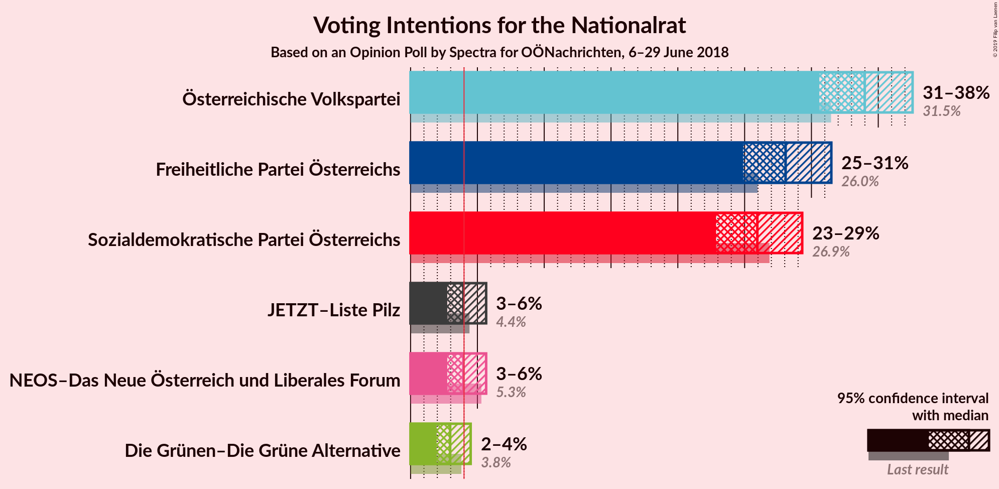

### Confidence Intervals

| Party | Last Result | Poll Result | 80% Confidence Interval | 90% Confidence Interval | 95% Confidence Interval | 99% Confidence Interval |
|:-----:|:-----------:|:-----------:|:-----------------------:|:-----------------------:|:-----------------------:|:-----------------------:|
| Österreichische Volkspartei | 31.5% | 34.0% | 31.8–36.3% |31.1–37.0% |30.6–37.6% |29.5–38.7% |
| Freiheitliche Partei Österreichs | 26.0% | 28.1% | 26.0–30.3% |25.4–30.9% |24.9–31.5% |23.9–32.6% |
| Sozialdemokratische Partei Österreichs | 26.9% | 26.0% | 23.9–28.2% |23.4–28.8% |22.9–29.3% |21.9–30.4% |
| NEOS–Das Neue Österreich und Liberales Forum | 5.3% | 3.9% | 3.2–5.1% |2.9–5.4% |2.7–5.7% |2.4–6.2% |
| JETZT–Liste Pilz | 4.4% | 3.9% | 3.2–5.1% |2.9–5.4% |2.7–5.7% |2.4–6.2% |
| Die Grünen–Die Grüne Alternative | 3.8% | 3.0% | 2.3–4.0% |2.1–4.2% |2.0–4.5% |1.7–5.0% |

*Note:* The poll result column reflects the actual value used in the calculations. Published results may vary slightly, and in addition be rounded to fewer digits.

## Seats

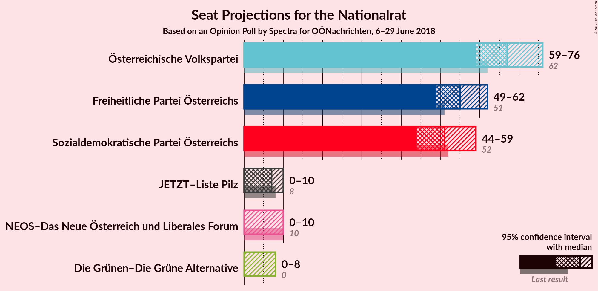

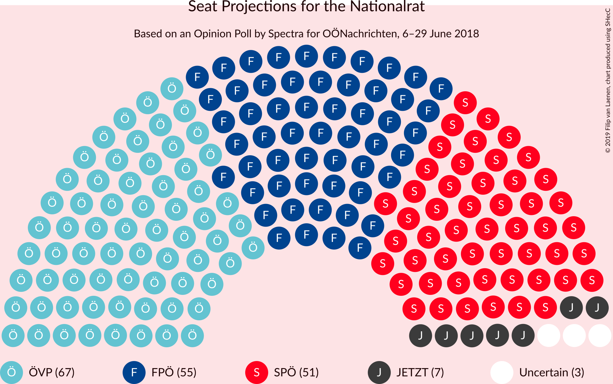

### Confidence Intervals

| Party | Last Result | Median | 80% Confidence Interval | 90% Confidence Interval | 95% Confidence Interval | 99% Confidence Interval |
|:-----:|:-----------:|:------:|:-----------------------:|:-----------------------:|:-----------------------:|:-----------------------:|
| <a href="#österreichische-volkspartei">Österreichische Volkspartei</a> | 62 | 67 | 62–73 |61–75 |59–76 |57–78 |
| <a href="#freiheitliche-partei-österreichs">Freiheitliche Partei Österreichs</a> | 51 | 55 | 51–59 |50–60 |49–62 |46–64 |
| <a href="#sozialdemokratische-partei-österreichs">Sozialdemokratische Partei Österreichs</a> | 52 | 51 | 46–56 |46–57 |44–59 |42–60 |
| <a href="#neos–das-neue-österreich-und-liberales-forum">NEOS–Das Neue Österreich und Liberales Forum</a> | 10 | 0 | 0–9 |0–10 |0–10 |0–12 |
| <a href="#jetzt–liste-pilz">JETZT–Liste Pilz</a> | 8 | 7 | 0–9 |0–10 |0–10 |0–12 |
| <a href="#die-grünen–die-grüne-alternative">Die Grünen–Die Grüne Alternative</a> | 0 | 0 | 0 |0–7 |0–8 |0–9 |

### Österreichische Volkspartei

*For a full overview of the results for this party, see the [Österreichische Volkspartei](party-österreichischevolkspartei.html) page.*

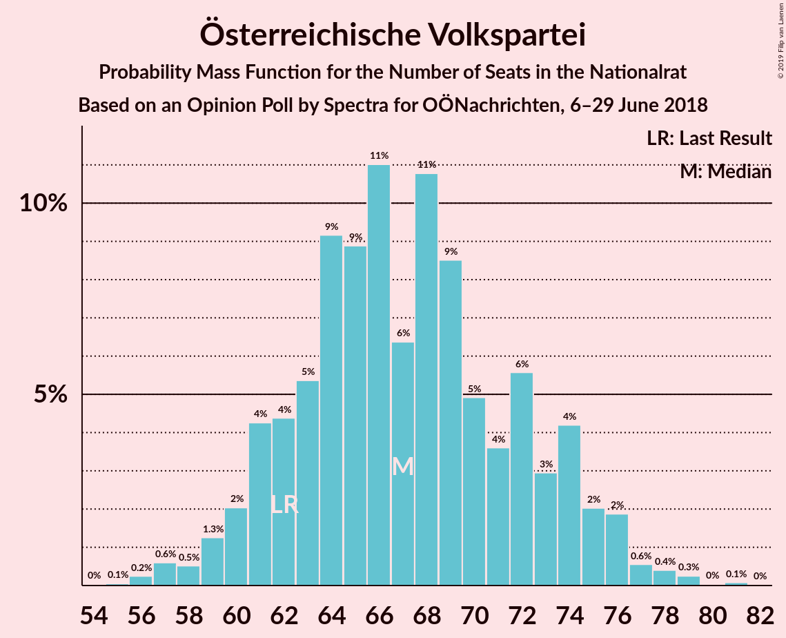

| Number of Seats | Probability | Accumulated | Special Marks |
|:---------------:|:-----------:|:-----------:|:-------------:|
| 54 | 0% | 100% |  |
| 55 | 0.1% | 99.9% |  |
| 56 | 0.2% | 99.9% |  |
| 57 | 0.6% | 99.6% |  |
| 58 | 0.5% | 99.0% |  |
| 59 | 1.3% | 98.5% |  |
| 60 | 2% | 97% |  |
| 61 | 4% | 95% |  |
| 62 | 4% | 91% | Last Result |
| 63 | 5% | 87% |  |
| 64 | 9% | 81% |  |
| 65 | 9% | 72% |  |
| 66 | 11% | 63% |  |
| 67 | 6% | 52% | Median |
| 68 | 11% | 46% |  |
| 69 | 9% | 35% |  |
| 70 | 5% | 26% |  |
| 71 | 4% | 22% |  |
| 72 | 6% | 18% |  |
| 73 | 3% | 12% |  |
| 74 | 4% | 9% |  |
| 75 | 2% | 5% |  |
| 76 | 2% | 3% |  |
| 77 | 0.6% | 1.3% |  |
| 78 | 0.4% | 0.8% |  |
| 79 | 0.3% | 0.4% |  |
| 80 | 0% | 0.1% |  |
| 81 | 0.1% | 0.1% |  |
| 82 | 0% | 0% |  |

### Freiheitliche Partei Österreichs

*For a full overview of the results for this party, see the [Freiheitliche Partei Österreichs](party-freiheitlicheparteiösterreichs.html) page.*

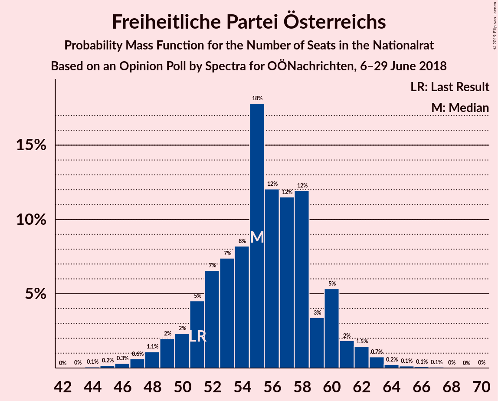

| Number of Seats | Probability | Accumulated | Special Marks |
|:---------------:|:-----------:|:-----------:|:-------------:|
| 44 | 0.1% | 100% |  |
| 45 | 0.2% | 99.9% |  |
| 46 | 0.3% | 99.7% |  |
| 47 | 0.6% | 99.4% |  |
| 48 | 1.1% | 98.8% |  |
| 49 | 2% | 98% |  |
| 50 | 2% | 96% |  |
| 51 | 5% | 93% | Last Result |
| 52 | 7% | 89% |  |
| 53 | 7% | 82% |  |
| 54 | 8% | 75% |  |
| 55 | 18% | 67% | Median |
| 56 | 12% | 49% |  |
| 57 | 12% | 37% |  |
| 58 | 12% | 25% |  |
| 59 | 3% | 13% |  |
| 60 | 5% | 10% |  |
| 61 | 2% | 5% |  |
| 62 | 1.5% | 3% |  |
| 63 | 0.7% | 1.3% |  |
| 64 | 0.2% | 0.6% |  |
| 65 | 0.1% | 0.4% |  |
| 66 | 0.1% | 0.2% |  |
| 67 | 0.1% | 0.1% |  |
| 68 | 0% | 0.1% |  |
| 69 | 0% | 0% |  |

### Sozialdemokratische Partei Österreichs

*For a full overview of the results for this party, see the [Sozialdemokratische Partei Österreichs](party-sozialdemokratischeparteiösterreichs.html) page.*

| Number of Seats | Probability | Accumulated | Special Marks |
|:---------------:|:-----------:|:-----------:|:-------------:|
| 40 | 0.1% | 100% |  |
| 41 | 0.1% | 99.9% |  |
| 42 | 0.3% | 99.8% |  |
| 43 | 0.8% | 99.4% |  |
| 44 | 1.3% | 98.6% |  |
| 45 | 2% | 97% |  |
| 46 | 6% | 95% |  |
| 47 | 4% | 89% |  |
| 48 | 7% | 85% |  |
| 49 | 13% | 79% |  |
| 50 | 11% | 65% |  |
| 51 | 5% | 55% | Median |
| 52 | 11% | 49% | Last Result |
| 53 | 13% | 38% |  |
| 54 | 7% | 25% |  |
| 55 | 5% | 18% |  |
| 56 | 7% | 13% |  |
| 57 | 3% | 6% |  |
| 58 | 0.4% | 3% |  |
| 59 | 1.5% | 3% |  |
| 60 | 1.1% | 2% |  |
| 61 | 0.1% | 0.4% |  |
| 62 | 0.1% | 0.3% |  |
| 63 | 0.2% | 0.2% |  |
| 64 | 0% | 0% |  |

### NEOS–Das Neue Österreich und Liberales Forum

*For a full overview of the results for this party, see the [NEOS–Das Neue Österreich und Liberales Forum](party-neos–dasneueösterreichundliberalesforum.html) page.*

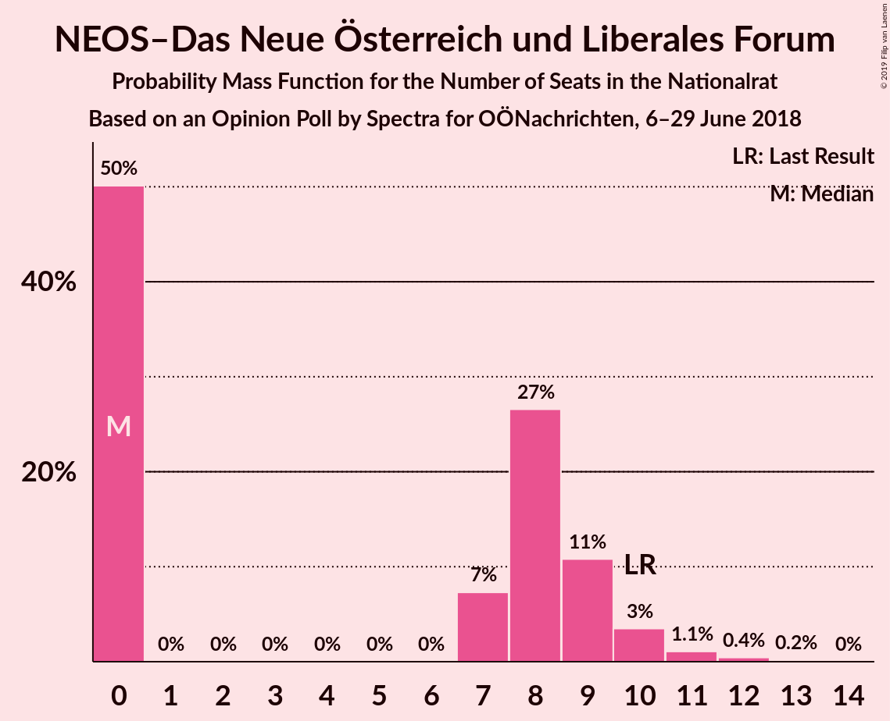

| Number of Seats | Probability | Accumulated | Special Marks |
|:---------------:|:-----------:|:-----------:|:-------------:|
| 0 | 50% | 100% | Median |
| 1 | 0% | 50% |  |
| 2 | 0% | 50% |  |
| 3 | 0% | 50% |  |
| 4 | 0% | 50% |  |
| 5 | 0% | 50% |  |
| 6 | 0% | 50% |  |
| 7 | 7% | 50% |  |
| 8 | 27% | 43% |  |
| 9 | 11% | 16% |  |
| 10 | 3% | 5% | Last Result |
| 11 | 1.1% | 2% |  |
| 12 | 0.4% | 0.6% |  |
| 13 | 0.2% | 0.2% |  |
| 14 | 0% | 0% |  |

### JETZT–Liste Pilz

*For a full overview of the results for this party, see the [JETZT–Liste Pilz](party-jetzt–listepilz.html) page.*

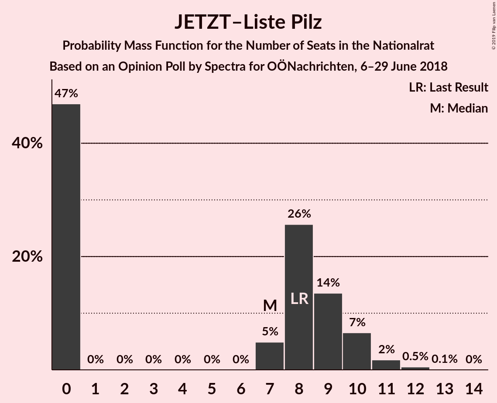

| Number of Seats | Probability | Accumulated | Special Marks |
|:---------------:|:-----------:|:-----------:|:-------------:|
| 0 | 47% | 100% |  |
| 1 | 0% | 53% |  |
| 2 | 0% | 53% |  |
| 3 | 0% | 53% |  |
| 4 | 0% | 53% |  |
| 5 | 0% | 53% |  |
| 6 | 0% | 53% |  |
| 7 | 5% | 53% | Median |
| 8 | 26% | 48% | Last Result |
| 9 | 14% | 22% |  |
| 10 | 7% | 9% |  |
| 11 | 2% | 2% |  |
| 12 | 0.5% | 0.6% |  |
| 13 | 0.1% | 0.1% |  |
| 14 | 0% | 0% |  |

### Die Grünen–Die Grüne Alternative

*For a full overview of the results for this party, see the [Die Grünen–Die Grüne Alternative](party-diegrünen–diegrünealternative.html) page.*

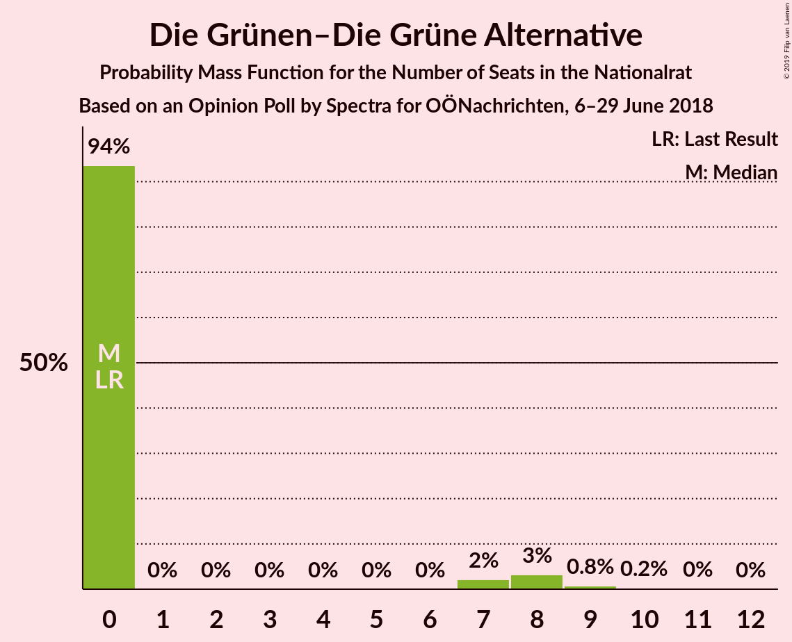

| Number of Seats | Probability | Accumulated | Special Marks |
|:---------------:|:-----------:|:-----------:|:-------------:|
| 0 | 94% | 100% | Last Result, Median |
| 1 | 0% | 6% |  |
| 2 | 0% | 6% |  |
| 3 | 0% | 6% |  |
| 4 | 0% | 6% |  |
| 5 | 0% | 6% |  |
| 6 | 0% | 6% |  |
| 7 | 2% | 6% |  |
| 8 | 3% | 4% |  |
| 9 | 0.8% | 1.0% |  |
| 10 | 0.2% | 0.2% |  |
| 11 | 0% | 0.1% |  |
| 12 | 0% | 0% |  |

## Coalitions

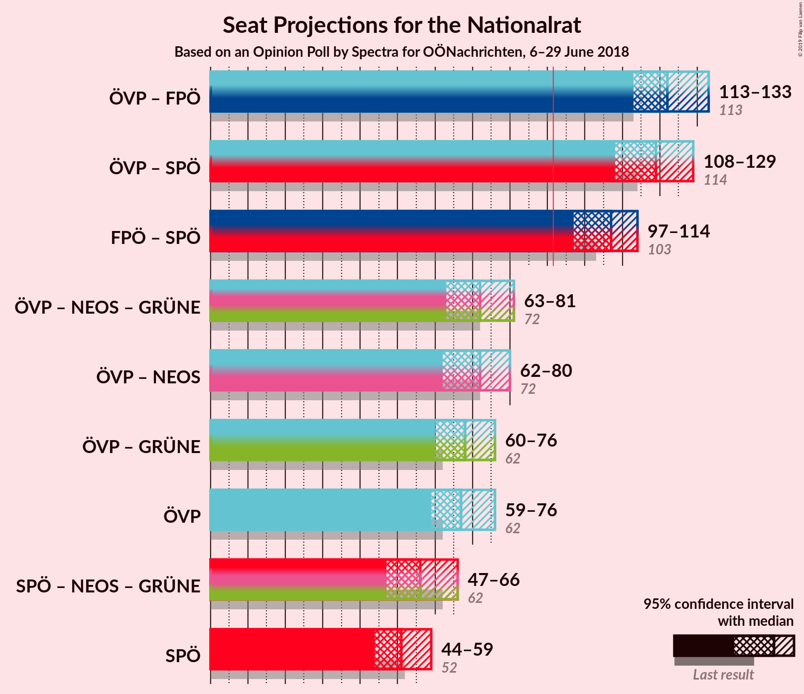

### Confidence Intervals

| Coalition | Last Result | Median | Majority? | 80% Confidence Interval | 90% Confidence Interval | 95% Confidence Interval | 99% Confidence Interval |
|:---------:|:-----------:|:------:|:---------:|:-----------------------:|:-----------------------:|:-----------------------:|:-----------------------:|
| Österreichische Volkspartei – Freiheitliche Partei Österreichs | 113 | 122 | 100% | 116–130 | 114–131 | 113–133 | 109–135 |
| Österreichische Volkspartei – Sozialdemokratische Partei Österreichs | 114 | 119 | 100% | 111–126 | 109–128 | 108–129 | 105–131 |
| Freiheitliche Partei Österreichs – Sozialdemokratische Partei Österreichs | 103 | 107 | 99.9% | 102–111 | 98–113 | 97–114 | 94–117 |
| Österreichische Volkspartei – NEOS–Das Neue Österreich und Liberales Forum – Die Grünen–Die Grüne Alternative | 72 | 72 | 0% | 66–78 | 64–79 | 63–81 | 61–85 |
| Österreichische Volkspartei – NEOS–Das Neue Österreich und Liberales Forum | 72 | 72 | 0% | 66–77 | 64–78 | 62–80 | 61–82 |
| Österreichische Volkspartei – Die Grünen–Die Grüne Alternative | 62 | 68 | 0% | 62–74 | 61–75 | 60–76 | 57–80 |
| Österreichische Volkspartei | 62 | 67 | 0% | 62–73 | 61–75 | 59–76 | 57–78 |
| Sozialdemokratische Partei Österreichs – NEOS–Das Neue Österreich und Liberales Forum – Die Grünen–Die Grüne Alternative | 62 | 56 | 0% | 49–62 | 48–64 | 47–66 | 45–69 |
| Sozialdemokratische Partei Österreichs | 52 | 51 | 0% | 46–56 | 46–57 | 44–59 | 42–60 |

### Österreichische Volkspartei – Freiheitliche Partei Österreichs

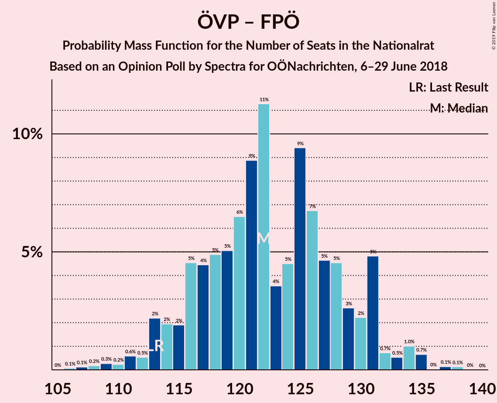

| Number of Seats | Probability | Accumulated | Special Marks |
|:---------------:|:-----------:|:-----------:|:-------------:|
| 106 | 0.1% | 100% |  |
| 107 | 0.1% | 99.9% |  |
| 108 | 0.2% | 99.8% |  |
| 109 | 0.3% | 99.6% |  |
| 110 | 0.2% | 99.3% |  |
| 111 | 0.6% | 99.1% |  |
| 112 | 0.5% | 98.5% |  |
| 113 | 2% | 98% | Last Result |
| 114 | 2% | 96% |  |
| 115 | 2% | 94% |  |
| 116 | 5% | 92% |  |
| 117 | 4% | 87% |  |
| 118 | 5% | 83% |  |
| 119 | 5% | 78% |  |
| 120 | 6% | 73% |  |
| 121 | 9% | 66% |  |
| 122 | 11% | 58% | Median |
| 123 | 4% | 46% |  |
| 124 | 5% | 43% |  |
| 125 | 9% | 38% |  |
| 126 | 7% | 29% |  |
| 127 | 5% | 22% |  |
| 128 | 5% | 17% |  |
| 129 | 3% | 13% |  |
| 130 | 2% | 10% |  |
| 131 | 5% | 8% |  |
| 132 | 0.7% | 3% |  |
| 133 | 0.5% | 3% |  |
| 134 | 1.0% | 2% |  |
| 135 | 0.7% | 1.0% |  |
| 136 | 0% | 0.3% |  |
| 137 | 0.1% | 0.3% |  |
| 138 | 0.1% | 0.2% |  |
| 139 | 0% | 0% |  |

### Österreichische Volkspartei – Sozialdemokratische Partei Österreichs

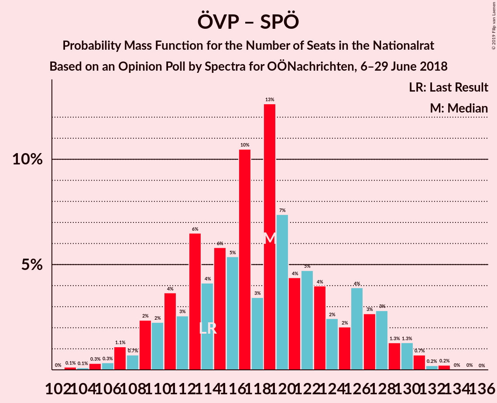

| Number of Seats | Probability | Accumulated | Special Marks |
|:---------------:|:-----------:|:-----------:|:-------------:|
| 102 | 0% | 100% |  |
| 103 | 0.1% | 99.9% |  |
| 104 | 0.1% | 99.8% |  |
| 105 | 0.3% | 99.7% |  |
| 106 | 0.3% | 99.4% |  |
| 107 | 1.1% | 99.1% |  |
| 108 | 0.7% | 98% |  |
| 109 | 2% | 97% |  |
| 110 | 2% | 95% |  |
| 111 | 4% | 93% |  |
| 112 | 3% | 89% |  |
| 113 | 6% | 86% |  |
| 114 | 4% | 80% | Last Result |
| 115 | 6% | 76% |  |
| 116 | 5% | 70% |  |
| 117 | 10% | 65% |  |
| 118 | 3% | 54% | Median |
| 119 | 13% | 51% |  |
| 120 | 7% | 38% |  |
| 121 | 4% | 31% |  |
| 122 | 5% | 26% |  |
| 123 | 4% | 22% |  |
| 124 | 2% | 18% |  |
| 125 | 2% | 15% |  |
| 126 | 4% | 13% |  |
| 127 | 3% | 9% |  |
| 128 | 3% | 7% |  |
| 129 | 1.3% | 4% |  |
| 130 | 1.3% | 2% |  |
| 131 | 0.7% | 1.2% |  |
| 132 | 0.2% | 0.5% |  |
| 133 | 0.2% | 0.3% |  |
| 134 | 0% | 0.1% |  |
| 135 | 0% | 0% |  |

### Freiheitliche Partei Österreichs – Sozialdemokratische Partei Österreichs

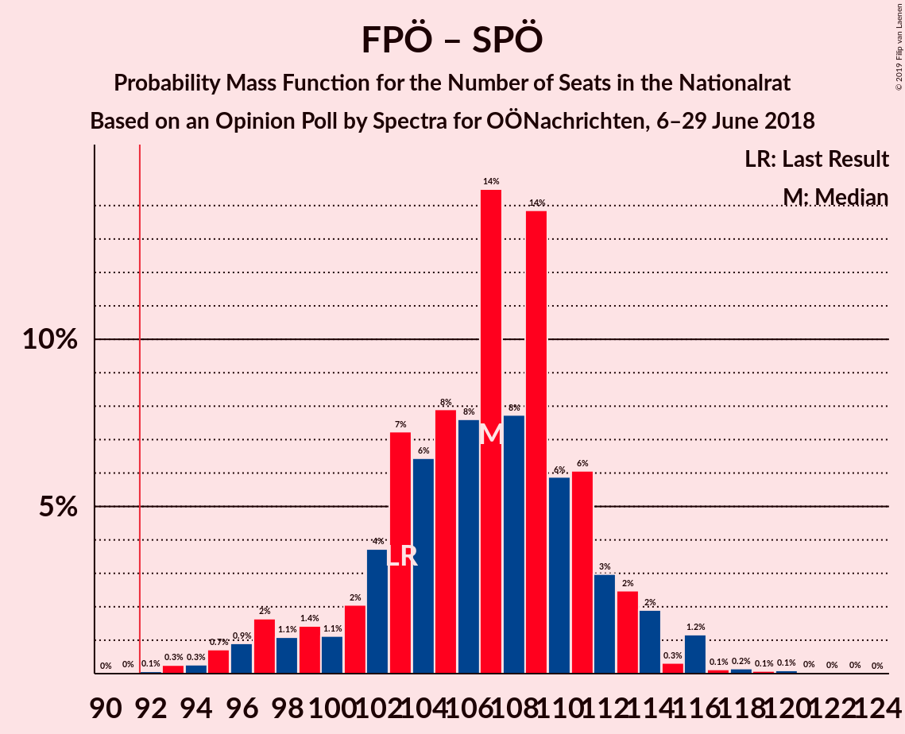

| Number of Seats | Probability | Accumulated | Special Marks |
|:---------------:|:-----------:|:-----------:|:-------------:|
| 91 | 0% | 100% |  |
| 92 | 0.1% | 99.9% | Majority |
| 93 | 0.3% | 99.9% |  |
| 94 | 0.3% | 99.6% |  |
| 95 | 0.7% | 99.3% |  |
| 96 | 0.9% | 98.6% |  |
| 97 | 2% | 98% |  |
| 98 | 1.1% | 96% |  |
| 99 | 1.4% | 95% |  |
| 100 | 1.1% | 94% |  |
| 101 | 2% | 92% |  |
| 102 | 4% | 90% |  |
| 103 | 7% | 87% | Last Result |
| 104 | 6% | 79% |  |
| 105 | 8% | 73% |  |
| 106 | 8% | 65% | Median |
| 107 | 14% | 57% |  |
| 108 | 8% | 43% |  |
| 109 | 14% | 35% |  |
| 110 | 6% | 21% |  |
| 111 | 6% | 15% |  |
| 112 | 3% | 9% |  |
| 113 | 2% | 6% |  |
| 114 | 2% | 4% |  |
| 115 | 0.3% | 2% |  |
| 116 | 1.2% | 2% |  |
| 117 | 0.1% | 0.6% |  |
| 118 | 0.2% | 0.4% |  |
| 119 | 0.1% | 0.3% |  |
| 120 | 0.1% | 0.2% |  |
| 121 | 0% | 0.1% |  |
| 122 | 0% | 0.1% |  |
| 123 | 0% | 0% |  |

### Österreichische Volkspartei – NEOS–Das Neue Österreich und Liberales Forum – Die Grünen–Die Grüne Alternative

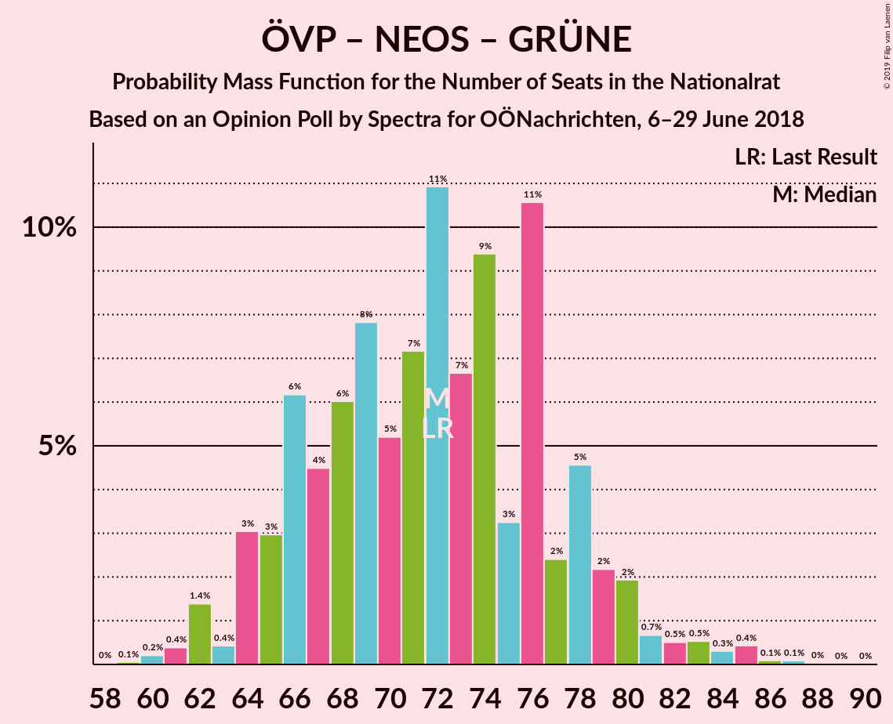

| Number of Seats | Probability | Accumulated | Special Marks |
|:---------------:|:-----------:|:-----------:|:-------------:|
| 58 | 0% | 100% |  |
| 59 | 0.1% | 99.9% |  |
| 60 | 0.2% | 99.9% |  |
| 61 | 0.4% | 99.7% |  |
| 62 | 1.4% | 99.3% |  |
| 63 | 0.4% | 98% |  |
| 64 | 3% | 97% |  |
| 65 | 3% | 94% |  |
| 66 | 6% | 91% |  |
| 67 | 4% | 85% | Median |
| 68 | 6% | 81% |  |
| 69 | 8% | 75% |  |
| 70 | 5% | 67% |  |
| 71 | 7% | 62% |  |
| 72 | 11% | 55% | Last Result |
| 73 | 7% | 44% |  |
| 74 | 9% | 37% |  |
| 75 | 3% | 28% |  |
| 76 | 11% | 24% |  |
| 77 | 2% | 14% |  |
| 78 | 5% | 11% |  |
| 79 | 2% | 7% |  |
| 80 | 2% | 5% |  |
| 81 | 0.7% | 3% |  |
| 82 | 0.5% | 2% |  |
| 83 | 0.5% | 2% |  |
| 84 | 0.3% | 1.0% |  |
| 85 | 0.4% | 0.7% |  |
| 86 | 0.1% | 0.2% |  |
| 87 | 0.1% | 0.1% |  |
| 88 | 0% | 0.1% |  |
| 89 | 0% | 0% |  |

### Österreichische Volkspartei – NEOS–Das Neue Österreich und Liberales Forum

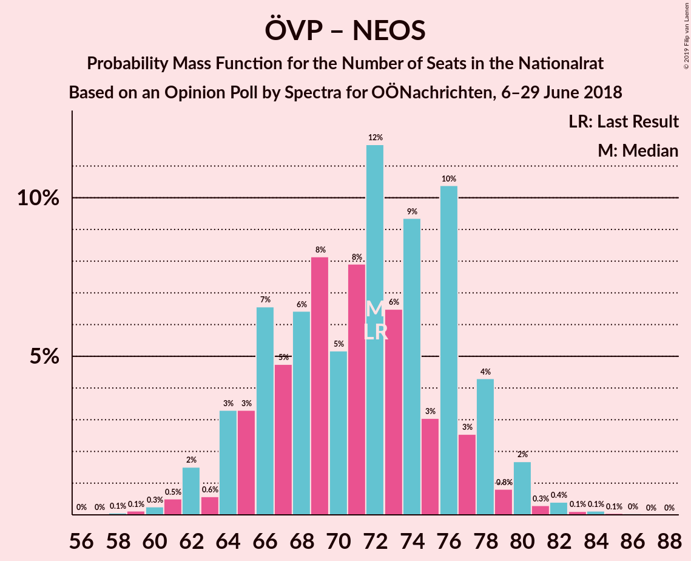

| Number of Seats | Probability | Accumulated | Special Marks |
|:---------------:|:-----------:|:-----------:|:-------------:|
| 57 | 0% | 100% |  |
| 58 | 0.1% | 99.9% |  |
| 59 | 0.1% | 99.9% |  |
| 60 | 0.3% | 99.8% |  |
| 61 | 0.5% | 99.5% |  |
| 62 | 2% | 99.0% |  |
| 63 | 0.6% | 97% |  |
| 64 | 3% | 97% |  |
| 65 | 3% | 94% |  |
| 66 | 7% | 90% |  |
| 67 | 5% | 84% | Median |
| 68 | 6% | 79% |  |
| 69 | 8% | 73% |  |
| 70 | 5% | 64% |  |
| 71 | 8% | 59% |  |
| 72 | 12% | 51% | Last Result |
| 73 | 6% | 40% |  |
| 74 | 9% | 33% |  |
| 75 | 3% | 24% |  |
| 76 | 10% | 21% |  |
| 77 | 3% | 10% |  |
| 78 | 4% | 8% |  |
| 79 | 0.8% | 4% |  |
| 80 | 2% | 3% |  |
| 81 | 0.3% | 1.1% |  |
| 82 | 0.4% | 0.8% |  |
| 83 | 0.1% | 0.4% |  |
| 84 | 0.1% | 0.2% |  |
| 85 | 0.1% | 0.1% |  |
| 86 | 0% | 0.1% |  |
| 87 | 0% | 0% |  |

### Österreichische Volkspartei – Die Grünen–Die Grüne Alternative

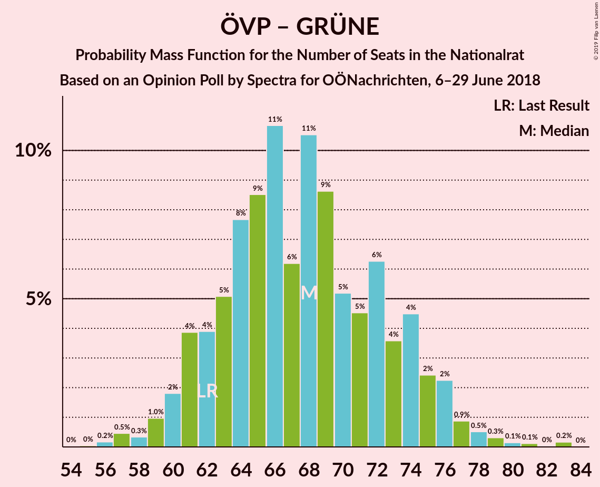

| Number of Seats | Probability | Accumulated | Special Marks |
|:---------------:|:-----------:|:-----------:|:-------------:|
| 55 | 0% | 100% |  |
| 56 | 0.2% | 99.9% |  |
| 57 | 0.5% | 99.7% |  |
| 58 | 0.3% | 99.3% |  |
| 59 | 1.0% | 98.9% |  |
| 60 | 2% | 98% |  |
| 61 | 4% | 96% |  |
| 62 | 4% | 92% | Last Result |
| 63 | 5% | 88% |  |
| 64 | 8% | 83% |  |
| 65 | 9% | 76% |  |
| 66 | 11% | 67% |  |
| 67 | 6% | 56% | Median |
| 68 | 11% | 50% |  |
| 69 | 9% | 40% |  |
| 70 | 5% | 31% |  |
| 71 | 5% | 26% |  |
| 72 | 6% | 21% |  |
| 73 | 4% | 15% |  |
| 74 | 4% | 11% |  |
| 75 | 2% | 7% |  |
| 76 | 2% | 4% |  |
| 77 | 0.9% | 2% |  |
| 78 | 0.5% | 1.3% |  |
| 79 | 0.3% | 0.8% |  |
| 80 | 0.1% | 0.5% |  |
| 81 | 0.1% | 0.4% |  |
| 82 | 0% | 0.2% |  |
| 83 | 0.2% | 0.2% |  |
| 84 | 0% | 0% |  |

### Österreichische Volkspartei

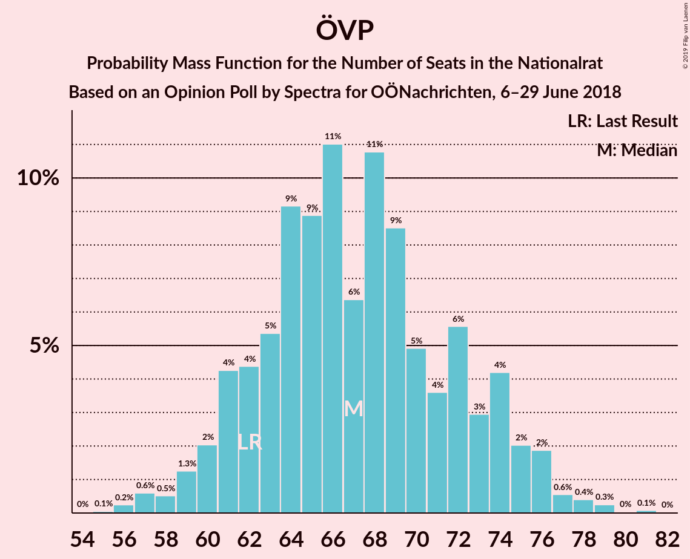

| Number of Seats | Probability | Accumulated | Special Marks |
|:---------------:|:-----------:|:-----------:|:-------------:|
| 54 | 0% | 100% |  |
| 55 | 0.1% | 99.9% |  |
| 56 | 0.2% | 99.9% |  |
| 57 | 0.6% | 99.6% |  |
| 58 | 0.5% | 99.0% |  |
| 59 | 1.3% | 98.5% |  |
| 60 | 2% | 97% |  |
| 61 | 4% | 95% |  |
| 62 | 4% | 91% | Last Result |
| 63 | 5% | 87% |  |
| 64 | 9% | 81% |  |
| 65 | 9% | 72% |  |
| 66 | 11% | 63% |  |
| 67 | 6% | 52% | Median |
| 68 | 11% | 46% |  |
| 69 | 9% | 35% |  |
| 70 | 5% | 26% |  |
| 71 | 4% | 22% |  |
| 72 | 6% | 18% |  |
| 73 | 3% | 12% |  |
| 74 | 4% | 9% |  |
| 75 | 2% | 5% |  |
| 76 | 2% | 3% |  |
| 77 | 0.6% | 1.3% |  |
| 78 | 0.4% | 0.8% |  |
| 79 | 0.3% | 0.4% |  |
| 80 | 0% | 0.1% |  |
| 81 | 0.1% | 0.1% |  |
| 82 | 0% | 0% |  |

### Sozialdemokratische Partei Österreichs – NEOS–Das Neue Österreich und Liberales Forum – Die Grünen–Die Grüne Alternative

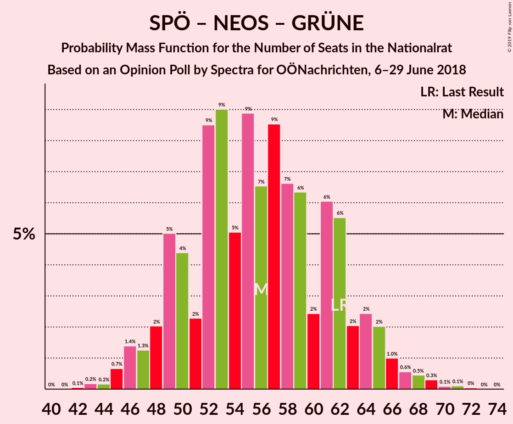

| Number of Seats | Probability | Accumulated | Special Marks |
|:---------------:|:-----------:|:-----------:|:-------------:|
| 42 | 0.1% | 100% |  |
| 43 | 0.2% | 99.9% |  |
| 44 | 0.2% | 99.8% |  |
| 45 | 0.7% | 99.6% |  |
| 46 | 1.4% | 98.9% |  |
| 47 | 1.3% | 98% |  |
| 48 | 2% | 96% |  |
| 49 | 5% | 94% |  |
| 50 | 4% | 89% |  |
| 51 | 2% | 85% | Median |
| 52 | 9% | 83% |  |
| 53 | 9% | 74% |  |
| 54 | 5% | 65% |  |
| 55 | 9% | 60% |  |
| 56 | 7% | 51% |  |
| 57 | 9% | 45% |  |
| 58 | 7% | 36% |  |
| 59 | 6% | 29% |  |
| 60 | 2% | 23% |  |
| 61 | 6% | 21% |  |
| 62 | 6% | 15% | Last Result |
| 63 | 2% | 9% |  |
| 64 | 2% | 7% |  |
| 65 | 2% | 5% |  |
| 66 | 1.0% | 3% |  |
| 67 | 0.6% | 2% |  |
| 68 | 0.5% | 1.0% |  |
| 69 | 0.3% | 0.6% |  |
| 70 | 0.1% | 0.3% |  |
| 71 | 0.1% | 0.2% |  |
| 72 | 0% | 0.1% |  |
| 73 | 0% | 0% |  |

### Sozialdemokratische Partei Österreichs

| Number of Seats | Probability | Accumulated | Special Marks |
|:---------------:|:-----------:|:-----------:|:-------------:|
| 40 | 0.1% | 100% |  |
| 41 | 0.1% | 99.9% |  |
| 42 | 0.3% | 99.8% |  |
| 43 | 0.8% | 99.4% |  |
| 44 | 1.3% | 98.6% |  |
| 45 | 2% | 97% |  |
| 46 | 6% | 95% |  |
| 47 | 4% | 89% |  |
| 48 | 7% | 85% |  |
| 49 | 13% | 79% |  |
| 50 | 11% | 65% |  |
| 51 | 5% | 55% | Median |
| 52 | 11% | 49% | Last Result |
| 53 | 13% | 38% |  |
| 54 | 7% | 25% |  |
| 55 | 5% | 18% |  |
| 56 | 7% | 13% |  |
| 57 | 3% | 6% |  |
| 58 | 0.4% | 3% |  |
| 59 | 1.5% | 3% |  |
| 60 | 1.1% | 2% |  |
| 61 | 0.1% | 0.4% |  |
| 62 | 0.1% | 0.3% |  |
| 63 | 0.2% | 0.2% |  |
| 64 | 0% | 0% |  |

## Technical Information

### Opinion Poll

+ **Polling firm:** Spectra
+ **Commissioner(s):** OÖNachrichten
+ **Fieldwork period:** 6–29 June 2018

### Calculations

+ **Sample size:** 709
+ **Simulations done:** 131,072
+ **Error estimate:** 2.35%

