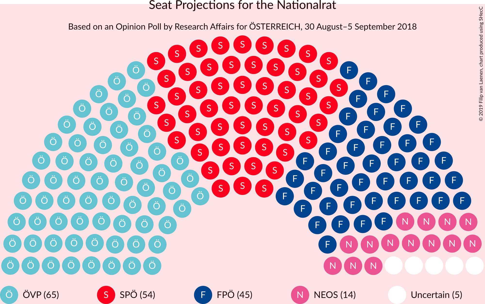
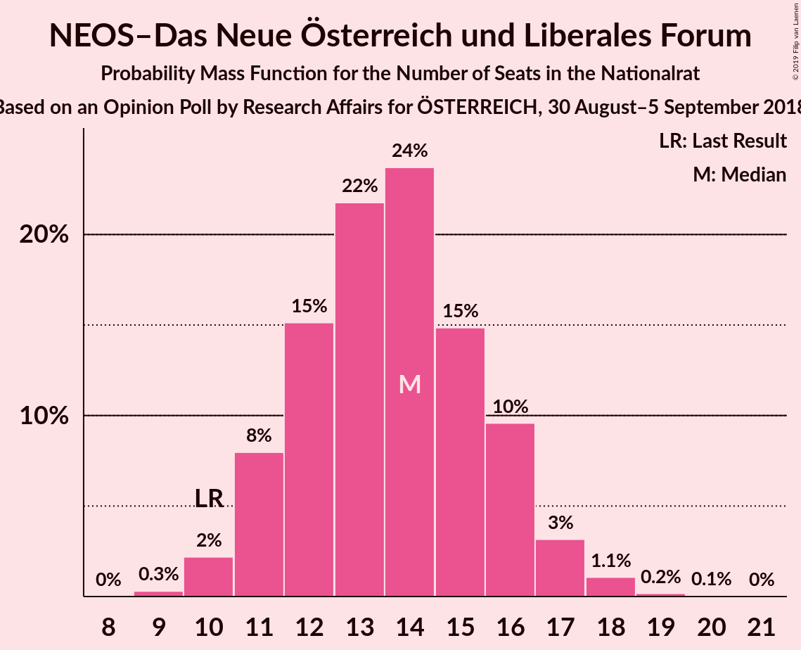
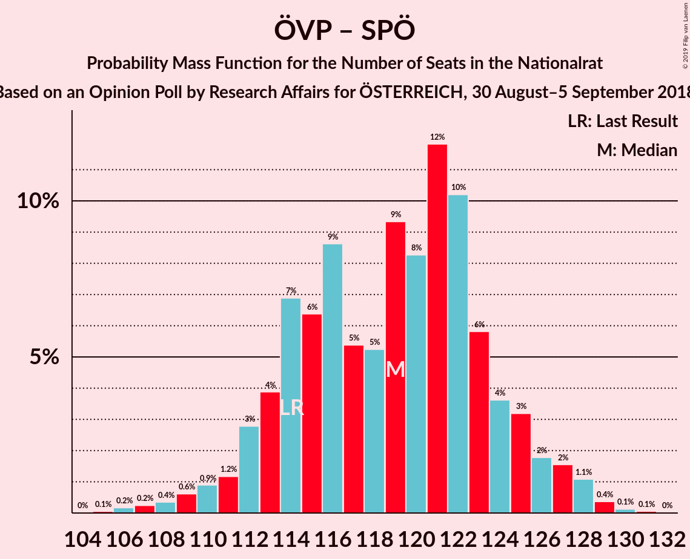
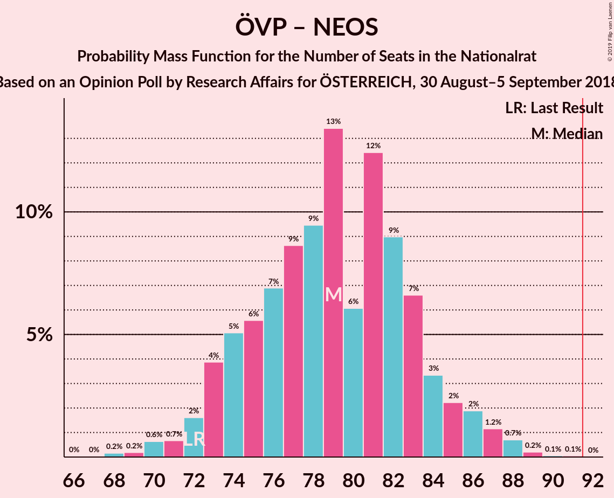
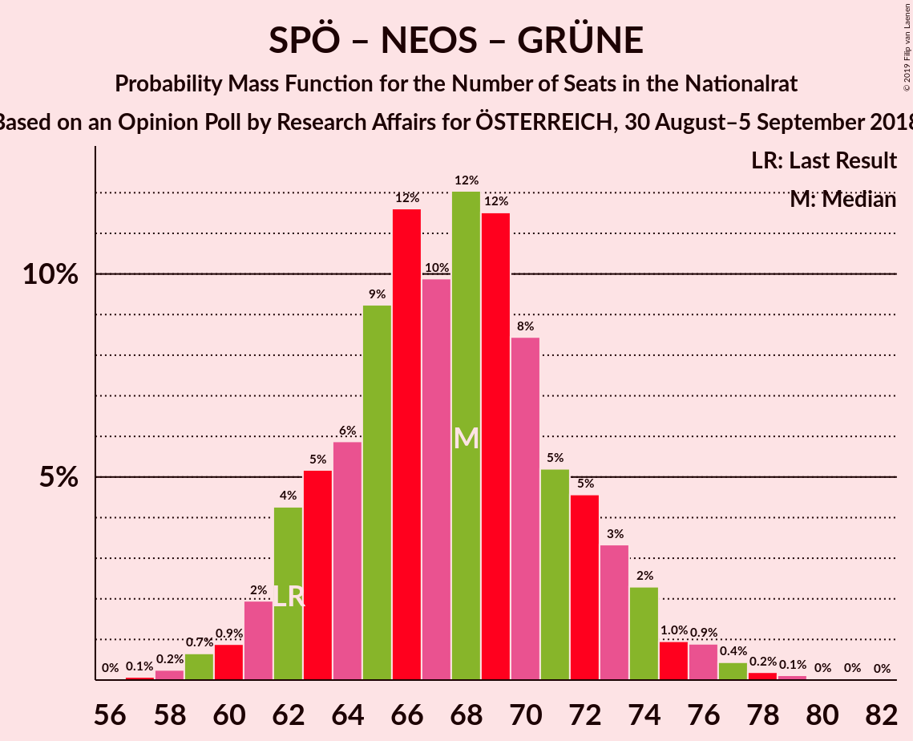
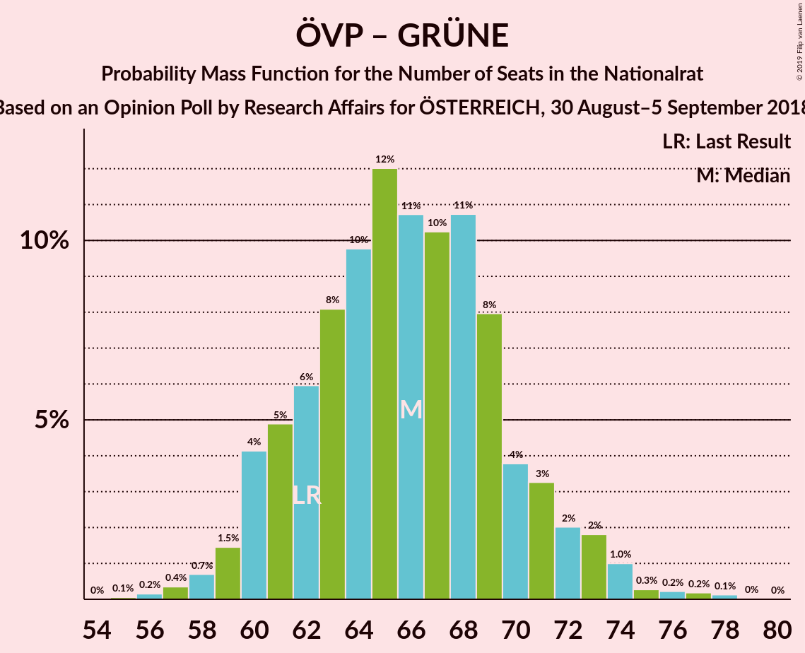

# Opinion Poll by Research Affairs for ÖSTERREICH, 30 August–5 September 2018

<a href="#voting-intentions">Voting Intentions</a> | <a href="#seats">Seats</a> | <a href="#coalitions">Coalitions</a> | <a href="#technical-information">Technical Information</a>

## Voting Intentions

### Confidence Intervals

| Party | Last Result | Poll Result | 80% Confidence Interval | 90% Confidence Interval | 95% Confidence Interval | 99% Confidence Interval |
|:-----:|:-----------:|:-----------:|:-----------------------:|:-----------------------:|:-----------------------:|:-----------------------:|
| Österreichische Volkspartei | 31.5% | 33.0% | 31.2–35.0% |30.6–35.5% |30.2–36.0% |29.3–37.0% |
| Sozialdemokratische Partei Österreichs | 26.9% | 27.0% | 25.3–28.9% |24.8–29.4% |24.4–29.9% |23.6–30.8% |
| Freiheitliche Partei Österreichs | 26.0% | 23.0% | 21.3–24.7% |20.9–25.2% |20.5–25.7% |19.7–26.5% |
| NEOS–Das Neue Österreich und Liberales Forum | 5.3% | 7.0% | 6.1–8.1% |5.8–8.5% |5.6–8.7% |5.1–9.3% |
| JETZT–Liste Pilz | 4.4% | 3.0% | 2.4–3.8% |2.2–4.0% |2.1–4.3% |1.8–4.7% |
| Die Grünen–Die Grüne Alternative | 3.8% | 3.0% | 2.4–3.8% |2.2–4.0% |2.1–4.3% |1.8–4.7% |

*Note:* The poll result column reflects the actual value used in the calculations. Published results may vary slightly, and in addition be rounded to fewer digits.

## Seats

### Confidence Intervals

| Party | Last Result | Median | 80% Confidence Interval | 90% Confidence Interval | 95% Confidence Interval | 99% Confidence Interval |
|:-----:|:-----------:|:------:|:-----------------------:|:-----------------------:|:-----------------------:|:-----------------------:|
| <a href="#österreichische-volkspartei">Österreichische Volkspartei</a> | 62 | 65 | 61–69 |60–71 |59–72 |57–74 |
| <a href="#sozialdemokratische-partei-österreichs">Sozialdemokratische Partei Österreichs</a> | 52 | 54 | 50–57 |49–58 |48–60 |46–62 |
| <a href="#freiheitliche-partei-österreichs">Freiheitliche Partei Österreichs</a> | 51 | 45 | 42–49 |41–50 |40–51 |38–53 |
| <a href="#neos–das-neue-österreich-und-liberales-forum">NEOS–Das Neue Österreich und Liberales Forum</a> | 10 | 14 | 11–16 |11–16 |10–17 |10–18 |
| <a href="#jetzt–liste-pilz">JETZT–Liste Pilz</a> | 8 | 0 | 0 |0–7 |0–8 |0–9 |
| <a href="#die-grünen–die-grüne-alternative">Die Grünen–Die Grüne Alternative</a> | 0 | 0 | 0 |0–7 |0–8 |0–9 |

### Österreichische Volkspartei

*For a full overview of the results for this party, see the [Österreichische Volkspartei](party-österreichischevolkspartei.html) page.*

| Number of Seats | Probability | Accumulated | Special Marks |
|:---------------:|:-----------:|:-----------:|:-------------:|
| 55 | 0.1% | 100% |  |
| 56 | 0.2% | 99.9% |  |
| 57 | 0.5% | 99.6% |  |
| 58 | 0.9% | 99.2% |  |
| 59 | 2% | 98% |  |
| 60 | 4% | 96% |  |
| 61 | 5% | 92% |  |
| 62 | 6% | 87% | Last Result |
| 63 | 9% | 80% |  |
| 64 | 10% | 72% |  |
| 65 | 12% | 61% | Median |
| 66 | 11% | 49% |  |
| 67 | 10% | 38% |  |
| 68 | 11% | 28% |  |
| 69 | 8% | 17% |  |
| 70 | 3% | 9% |  |
| 71 | 3% | 6% |  |
| 72 | 2% | 3% |  |
| 73 | 1.1% | 2% |  |
| 74 | 0.4% | 0.6% |  |
| 75 | 0.1% | 0.3% |  |
| 76 | 0.1% | 0.1% |  |
| 77 | 0% | 0.1% |  |
| 78 | 0% | 0% |  |

### Sozialdemokratische Partei Österreichs

*For a full overview of the results for this party, see the [Sozialdemokratische Partei Österreichs](party-sozialdemokratischeparteiösterreichs.html) page.*

| Number of Seats | Probability | Accumulated | Special Marks |
|:---------------:|:-----------:|:-----------:|:-------------:|
| 44 | 0.1% | 100% |  |
| 45 | 0.2% | 99.9% |  |
| 46 | 0.6% | 99.7% |  |
| 47 | 1.4% | 99.1% |  |
| 48 | 3% | 98% |  |
| 49 | 5% | 95% |  |
| 50 | 7% | 90% |  |
| 51 | 11% | 83% |  |
| 52 | 9% | 72% | Last Result |
| 53 | 11% | 63% |  |
| 54 | 16% | 52% | Median |
| 55 | 11% | 36% |  |
| 56 | 8% | 25% |  |
| 57 | 8% | 17% |  |
| 58 | 4% | 9% |  |
| 59 | 2% | 5% |  |
| 60 | 2% | 3% |  |
| 61 | 0.7% | 1.3% |  |
| 62 | 0.3% | 0.5% |  |
| 63 | 0.1% | 0.2% |  |
| 64 | 0% | 0.1% |  |
| 65 | 0% | 0% |  |

### Freiheitliche Partei Österreichs

*For a full overview of the results for this party, see the [Freiheitliche Partei Österreichs](party-freiheitlicheparteiösterreichs.html) page.*

| Number of Seats | Probability | Accumulated | Special Marks |
|:---------------:|:-----------:|:-----------:|:-------------:|
| 36 | 0.1% | 100% |  |
| 37 | 0.1% | 99.9% |  |
| 38 | 0.6% | 99.8% |  |
| 39 | 1.2% | 99.2% |  |
| 40 | 3% | 98% |  |
| 41 | 4% | 95% |  |
| 42 | 6% | 91% |  |
| 43 | 13% | 85% |  |
| 44 | 11% | 72% |  |
| 45 | 13% | 61% | Median |
| 46 | 12% | 48% |  |
| 47 | 11% | 36% |  |
| 48 | 10% | 25% |  |
| 49 | 8% | 15% |  |
| 50 | 4% | 7% |  |
| 51 | 2% | 3% | Last Result |
| 52 | 0.6% | 1.4% |  |
| 53 | 0.5% | 0.8% |  |
| 54 | 0.2% | 0.3% |  |
| 55 | 0.1% | 0.1% |  |
| 56 | 0% | 0% |  |

### NEOS–Das Neue Österreich und Liberales Forum

*For a full overview of the results for this party, see the [NEOS–Das Neue Österreich und Liberales Forum](party-neos–dasneueösterreichundliberalesforum.html) page.*

| Number of Seats | Probability | Accumulated | Special Marks |
|:---------------:|:-----------:|:-----------:|:-------------:|
| 9 | 0.3% | 100% |  |
| 10 | 2% | 99.7% | Last Result |
| 11 | 8% | 97% |  |
| 12 | 15% | 90% |  |
| 13 | 22% | 74% |  |
| 14 | 24% | 53% | Median |
| 15 | 15% | 29% |  |
| 16 | 10% | 14% |  |
| 17 | 3% | 4% |  |
| 18 | 1.1% | 1.3% |  |
| 19 | 0.2% | 0.2% |  |
| 20 | 0.1% | 0.1% |  |
| 21 | 0% | 0% |  |

### JETZT–Liste Pilz

*For a full overview of the results for this party, see the [JETZT–Liste Pilz](party-jetzt–listepilz.html) page.*

| Number of Seats | Probability | Accumulated | Special Marks |
|:---------------:|:-----------:|:-----------:|:-------------:|
| 0 | 95% | 100% | Median |
| 1 | 0% | 5% |  |
| 2 | 0% | 5% |  |
| 3 | 0% | 5% |  |
| 4 | 0% | 5% |  |
| 5 | 0% | 5% |  |
| 6 | 0% | 5% |  |
| 7 | 0.7% | 5% |  |
| 8 | 4% | 5% | Last Result |
| 9 | 0.6% | 0.7% |  |
| 10 | 0.1% | 0.1% |  |
| 11 | 0% | 0% |  |

### Die Grünen–Die Grüne Alternative

*For a full overview of the results for this party, see the [Die Grünen–Die Grüne Alternative](party-diegrünen–diegrünealternative.html) page.*

| Number of Seats | Probability | Accumulated | Special Marks |
|:---------------:|:-----------:|:-----------:|:-------------:|
| 0 | 95% | 100% | Last Result, Median |
| 1 | 0% | 5% |  |
| 2 | 0% | 5% |  |
| 3 | 0% | 5% |  |
| 4 | 0% | 5% |  |
| 5 | 0% | 5% |  |
| 6 | 0% | 5% |  |
| 7 | 2% | 5% |  |
| 8 | 3% | 3% |  |
| 9 | 0.5% | 0.6% |  |
| 10 | 0.1% | 0.1% |  |
| 11 | 0% | 0% |  |

## Coalitions

### Confidence Intervals

| Coalition | Last Result | Median | Majority? | 80% Confidence Interval | 90% Confidence Interval | 95% Confidence Interval | 99% Confidence Interval |
|:---------:|:-----------:|:------:|:---------:|:-----------------------:|:-----------------------:|:-----------------------:|:-----------------------:|
| Österreichische Volkspartei – Sozialdemokratische Partei Österreichs | 114 | 119 | 100% | 113–124 | 112–125 | 111–127 | 107–129 |
| Österreichische Volkspartei – Freiheitliche Partei Österreichs | 113 | 111 | 100% | 105–116 | 104–117 | 103–119 | 100–120 |
| Sozialdemokratische Partei Österreichs – Freiheitliche Partei Österreichs | 103 | 99 | 97% | 94–104 | 92–105 | 91–106 | 88–108 |
| Österreichische Volkspartei – NEOS–Das Neue Österreich und Liberales Forum – Die Grünen–Die Grüne Alternative | 72 | 79 | 0.1% | 74–84 | 73–86 | 73–87 | 70–89 |
| Österreichische Volkspartei – NEOS–Das Neue Österreich und Liberales Forum | 72 | 79 | 0% | 74–83 | 73–85 | 72–86 | 70–88 |
| Sozialdemokratische Partei Österreichs – NEOS–Das Neue Österreich und Liberales Forum – Die Grünen–Die Grüne Alternative | 62 | 68 | 0% | 63–72 | 62–73 | 61–75 | 59–77 |
| Österreichische Volkspartei – Die Grünen–Die Grüne Alternative | 62 | 66 | 0% | 61–70 | 60–72 | 59–73 | 57–76 |
| Österreichische Volkspartei | 62 | 65 | 0% | 61–69 | 60–71 | 59–72 | 57–74 |
| Sozialdemokratische Partei Österreichs | 52 | 54 | 0% | 50–57 | 49–58 | 48–60 | 46–62 |

### Österreichische Volkspartei – Sozialdemokratische Partei Österreichs

| Number of Seats | Probability | Accumulated | Special Marks |
|:---------------:|:-----------:|:-----------:|:-------------:|
| 105 | 0.1% | 100% |  |
| 106 | 0.2% | 99.9% |  |
| 107 | 0.2% | 99.7% |  |
| 108 | 0.4% | 99.5% |  |
| 109 | 0.6% | 99.1% |  |
| 110 | 0.9% | 98.5% |  |
| 111 | 1.2% | 98% |  |
| 112 | 3% | 96% |  |
| 113 | 4% | 94% |  |
| 114 | 7% | 90% | Last Result |
| 115 | 6% | 83% |  |
| 116 | 9% | 77% |  |
| 117 | 5% | 68% |  |
| 118 | 5% | 63% |  |
| 119 | 9% | 57% | Median |
| 120 | 8% | 48% |  |
| 121 | 12% | 40% |  |
| 122 | 10% | 28% |  |
| 123 | 6% | 18% |  |
| 124 | 4% | 12% |  |
| 125 | 3% | 8% |  |
| 126 | 2% | 5% |  |
| 127 | 2% | 3% |  |
| 128 | 1.1% | 2% |  |
| 129 | 0.4% | 0.6% |  |
| 130 | 0.1% | 0.2% |  |
| 131 | 0.1% | 0.1% |  |
| 132 | 0% | 0% |  |

### Österreichische Volkspartei – Freiheitliche Partei Österreichs

| Number of Seats | Probability | Accumulated | Special Marks |
|:---------------:|:-----------:|:-----------:|:-------------:|
| 97 | 0% | 100% |  |
| 98 | 0.1% | 99.9% |  |
| 99 | 0.1% | 99.8% |  |
| 100 | 0.4% | 99.7% |  |
| 101 | 0.5% | 99.3% |  |
| 102 | 1.0% | 98.8% |  |
| 103 | 2% | 98% |  |
| 104 | 3% | 96% |  |
| 105 | 3% | 93% |  |
| 106 | 6% | 89% |  |
| 107 | 6% | 84% |  |
| 108 | 7% | 77% |  |
| 109 | 12% | 70% |  |
| 110 | 7% | 59% | Median |
| 111 | 8% | 51% |  |
| 112 | 7% | 44% |  |
| 113 | 8% | 37% | Last Result |
| 114 | 7% | 28% |  |
| 115 | 8% | 21% |  |
| 116 | 4% | 13% |  |
| 117 | 4% | 9% |  |
| 118 | 2% | 5% |  |
| 119 | 1.3% | 3% |  |
| 120 | 1.0% | 1.4% |  |
| 121 | 0.3% | 0.5% |  |
| 122 | 0.1% | 0.2% |  |
| 123 | 0% | 0.1% |  |
| 124 | 0% | 0% |  |

### Sozialdemokratische Partei Österreichs – Freiheitliche Partei Österreichs

| Number of Seats | Probability | Accumulated | Special Marks |
|:---------------:|:-----------:|:-----------:|:-------------:|
| 86 | 0% | 100% |  |
| 87 | 0.2% | 99.9% |  |
| 88 | 0.3% | 99.7% |  |
| 89 | 0.5% | 99.5% |  |
| 90 | 1.0% | 98.9% |  |
| 91 | 1.4% | 98% |  |
| 92 | 3% | 97% | Majority |
| 93 | 2% | 94% |  |
| 94 | 5% | 91% |  |
| 95 | 7% | 86% |  |
| 96 | 10% | 79% |  |
| 97 | 8% | 69% |  |
| 98 | 8% | 61% |  |
| 99 | 7% | 54% | Median |
| 100 | 8% | 46% |  |
| 101 | 12% | 38% |  |
| 102 | 9% | 26% |  |
| 103 | 4% | 17% | Last Result |
| 104 | 5% | 13% |  |
| 105 | 4% | 8% |  |
| 106 | 2% | 4% |  |
| 107 | 0.7% | 2% |  |
| 108 | 1.0% | 1.4% |  |
| 109 | 0.2% | 0.5% |  |
| 110 | 0.2% | 0.3% |  |
| 111 | 0% | 0.1% |  |
| 112 | 0% | 0% |  |

### Österreichische Volkspartei – NEOS–Das Neue Österreich und Liberales Forum – Die Grünen–Die Grüne Alternative

| Number of Seats | Probability | Accumulated | Special Marks |
|:---------------:|:-----------:|:-----------:|:-------------:|
| 68 | 0.1% | 100% |  |
| 69 | 0.1% | 99.9% |  |
| 70 | 0.4% | 99.7% |  |
| 71 | 0.5% | 99.3% |  |
| 72 | 1.1% | 98.8% | Last Result |
| 73 | 4% | 98% |  |
| 74 | 4% | 94% |  |
| 75 | 5% | 90% |  |
| 76 | 6% | 84% |  |
| 77 | 9% | 78% |  |
| 78 | 9% | 69% |  |
| 79 | 13% | 61% | Median |
| 80 | 6% | 47% |  |
| 81 | 12% | 41% |  |
| 82 | 10% | 29% |  |
| 83 | 7% | 19% |  |
| 84 | 4% | 12% |  |
| 85 | 3% | 8% |  |
| 86 | 2% | 6% |  |
| 87 | 2% | 3% |  |
| 88 | 0.9% | 2% |  |
| 89 | 0.4% | 0.8% |  |
| 90 | 0.2% | 0.4% |  |
| 91 | 0.1% | 0.2% |  |
| 92 | 0% | 0.1% | Majority |
| 93 | 0% | 0% |  |

### Österreichische Volkspartei – NEOS–Das Neue Österreich und Liberales Forum

| Number of Seats | Probability | Accumulated | Special Marks |
|:---------------:|:-----------:|:-----------:|:-------------:|
| 67 | 0% | 100% |  |
| 68 | 0.2% | 99.9% |  |
| 69 | 0.2% | 99.8% |  |
| 70 | 0.6% | 99.6% |  |
| 71 | 0.7% | 99.0% |  |
| 72 | 2% | 98% | Last Result |
| 73 | 4% | 97% |  |
| 74 | 5% | 93% |  |
| 75 | 6% | 88% |  |
| 76 | 7% | 82% |  |
| 77 | 9% | 75% |  |
| 78 | 9% | 67% |  |
| 79 | 13% | 57% | Median |
| 80 | 6% | 44% |  |
| 81 | 12% | 38% |  |
| 82 | 9% | 25% |  |
| 83 | 7% | 16% |  |
| 84 | 3% | 10% |  |
| 85 | 2% | 6% |  |
| 86 | 2% | 4% |  |
| 87 | 1.2% | 2% |  |
| 88 | 0.7% | 1.0% |  |
| 89 | 0.2% | 0.3% |  |
| 90 | 0.1% | 0.1% |  |
| 91 | 0.1% | 0.1% |  |
| 92 | 0% | 0% | Majority |

### Sozialdemokratische Partei Österreichs – NEOS–Das Neue Österreich und Liberales Forum – Die Grünen–Die Grüne Alternative

| Number of Seats | Probability | Accumulated | Special Marks |
|:---------------:|:-----------:|:-----------:|:-------------:|
| 57 | 0.1% | 100% |  |
| 58 | 0.2% | 99.9% |  |
| 59 | 0.7% | 99.6% |  |
| 60 | 0.9% | 99.0% |  |
| 61 | 2% | 98% |  |
| 62 | 4% | 96% | Last Result |
| 63 | 5% | 92% |  |
| 64 | 6% | 87% |  |
| 65 | 9% | 81% |  |
| 66 | 12% | 72% |  |
| 67 | 10% | 60% |  |
| 68 | 12% | 50% | Median |
| 69 | 12% | 38% |  |
| 70 | 8% | 27% |  |
| 71 | 5% | 18% |  |
| 72 | 5% | 13% |  |
| 73 | 3% | 8% |  |
| 74 | 2% | 5% |  |
| 75 | 1.0% | 3% |  |
| 76 | 0.9% | 2% |  |
| 77 | 0.4% | 0.8% |  |
| 78 | 0.2% | 0.4% |  |
| 79 | 0.1% | 0.2% |  |
| 80 | 0% | 0.1% |  |
| 81 | 0% | 0% |  |

### Österreichische Volkspartei – Die Grünen–Die Grüne Alternative

| Number of Seats | Probability | Accumulated | Special Marks |
|:---------------:|:-----------:|:-----------:|:-------------:|
| 55 | 0.1% | 100% |  |
| 56 | 0.2% | 99.9% |  |
| 57 | 0.4% | 99.8% |  |
| 58 | 0.7% | 99.4% |  |
| 59 | 1.5% | 98.7% |  |
| 60 | 4% | 97% |  |
| 61 | 5% | 93% |  |
| 62 | 6% | 88% | Last Result |
| 63 | 8% | 82% |  |
| 64 | 10% | 74% |  |
| 65 | 12% | 64% | Median |
| 66 | 11% | 52% |  |
| 67 | 10% | 42% |  |
| 68 | 11% | 31% |  |
| 69 | 8% | 21% |  |
| 70 | 4% | 13% |  |
| 71 | 3% | 9% |  |
| 72 | 2% | 6% |  |
| 73 | 2% | 4% |  |
| 74 | 1.0% | 2% |  |
| 75 | 0.3% | 0.9% |  |
| 76 | 0.2% | 0.6% |  |
| 77 | 0.2% | 0.4% |  |
| 78 | 0.1% | 0.2% |  |
| 79 | 0% | 0% |  |

### Österreichische Volkspartei

| Number of Seats | Probability | Accumulated | Special Marks |
|:---------------:|:-----------:|:-----------:|:-------------:|
| 55 | 0.1% | 100% |  |
| 56 | 0.2% | 99.9% |  |
| 57 | 0.5% | 99.6% |  |
| 58 | 0.9% | 99.2% |  |
| 59 | 2% | 98% |  |
| 60 | 4% | 96% |  |
| 61 | 5% | 92% |  |
| 62 | 6% | 87% | Last Result |
| 63 | 9% | 80% |  |
| 64 | 10% | 72% |  |
| 65 | 12% | 61% | Median |
| 66 | 11% | 49% |  |
| 67 | 10% | 38% |  |
| 68 | 11% | 28% |  |
| 69 | 8% | 17% |  |
| 70 | 3% | 9% |  |
| 71 | 3% | 6% |  |
| 72 | 2% | 3% |  |
| 73 | 1.1% | 2% |  |
| 74 | 0.4% | 0.6% |  |
| 75 | 0.1% | 0.3% |  |
| 76 | 0.1% | 0.1% |  |
| 77 | 0% | 0.1% |  |
| 78 | 0% | 0% |  |

### Sozialdemokratische Partei Österreichs

| Number of Seats | Probability | Accumulated | Special Marks |
|:---------------:|:-----------:|:-----------:|:-------------:|
| 44 | 0.1% | 100% |  |
| 45 | 0.2% | 99.9% |  |
| 46 | 0.6% | 99.7% |  |
| 47 | 1.4% | 99.1% |  |
| 48 | 3% | 98% |  |
| 49 | 5% | 95% |  |
| 50 | 7% | 90% |  |
| 51 | 11% | 83% |  |
| 52 | 9% | 72% | Last Result |
| 53 | 11% | 63% |  |
| 54 | 16% | 52% | Median |
| 55 | 11% | 36% |  |
| 56 | 8% | 25% |  |
| 57 | 8% | 17% |  |
| 58 | 4% | 9% |  |
| 59 | 2% | 5% |  |
| 60 | 2% | 3% |  |
| 61 | 0.7% | 1.3% |  |
| 62 | 0.3% | 0.5% |  |
| 63 | 0.1% | 0.2% |  |
| 64 | 0% | 0.1% |  |
| 65 | 0% | 0% |  |

## Technical Information

### Opinion Poll

+ **Polling firm:** Research Affairs
+ **Commissioner(s):** ÖSTERREICH
+ **Fieldwork period:** 30 August–5 September 2018

### Calculations

+ **Sample size:** 1002
+ **Simulations done:** 131,072
+ **Error estimate:** 1.08%

