# Opinion Poll by Research Affairs for ÖSTERREICH, 19–20 September 2018

<a href="#voting-intentions">Voting Intentions</a> | <a href="#seats">Seats</a> | <a href="#coalitions">Coalitions</a> | <a href="#technical-information">Technical Information</a>

## Voting Intentions

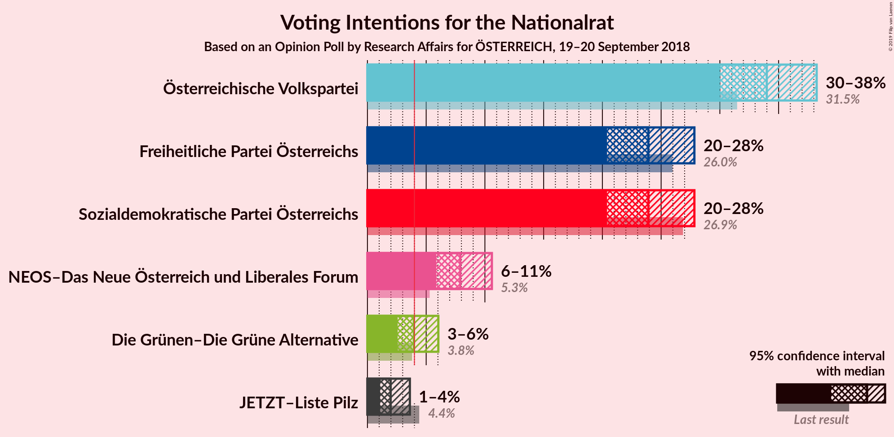

### Confidence Intervals

| Party | Last Result | Poll Result | 80% Confidence Interval | 90% Confidence Interval | 95% Confidence Interval | 99% Confidence Interval |
|:-----:|:-----------:|:-----------:|:-----------------------:|:-----------------------:|:-----------------------:|:-----------------------:|
| Österreichische Volkspartei | 31.5% | 34.0% | 31.4–36.8% |30.6–37.6% |30.0–38.2% |28.8–39.6% |
| Sozialdemokratische Partei Österreichs | 26.9% | 23.9% | 21.6–26.5% |21.0–27.2% |20.4–27.8% |19.3–29.1% |
| Freiheitliche Partei Österreichs | 26.0% | 23.9% | 21.6–26.5% |21.0–27.2% |20.4–27.8% |19.3–29.1% |
| NEOS–Das Neue Österreich und Liberales Forum | 5.3% | 7.9% | 6.6–9.7% |6.2–10.2% |5.9–10.6% |5.3–11.5% |
| Die Grünen–Die Grüne Alternative | 3.8% | 4.0% | 3.0–5.3% |2.8–5.7% |2.6–6.0% |2.2–6.8% |
| JETZT–Liste Pilz | 4.4% | 2.0% | 1.4–3.0% |1.2–3.3% |1.1–3.6% |0.9–4.2% |

*Note:* The poll result column reflects the actual value used in the calculations. Published results may vary slightly, and in addition be rounded to fewer digits.

## Seats

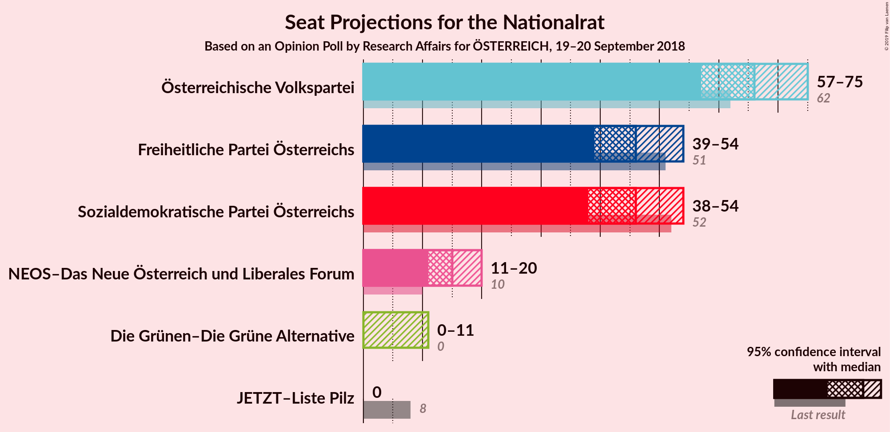

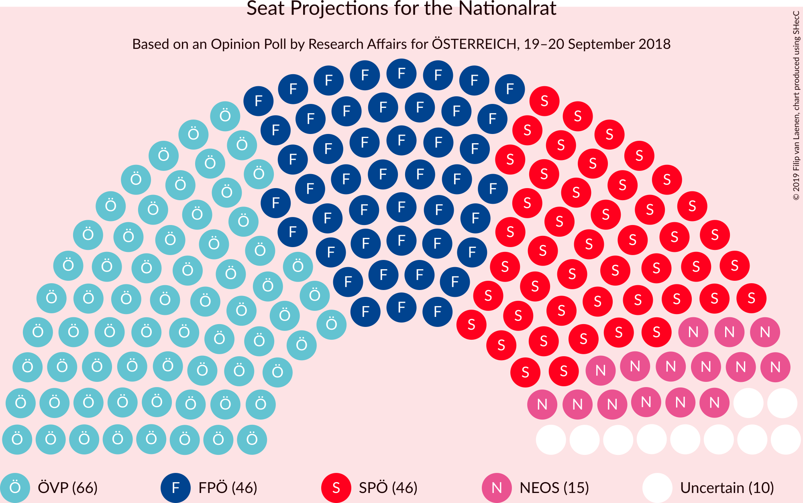

### Confidence Intervals

| Party | Last Result | Median | 80% Confidence Interval | 90% Confidence Interval | 95% Confidence Interval | 99% Confidence Interval |
|:-----:|:-----------:|:------:|:-----------------------:|:-----------------------:|:-----------------------:|:-----------------------:|
| <a href="#österreichische-volkspartei">Österreichische Volkspartei</a> | 62 | 66 | 60–71 |58–73 |57–75 |54–78 |
| <a href="#sozialdemokratische-partei-österreichs">Sozialdemokratische Partei Österreichs</a> | 52 | 46 | 41–51 |40–53 |38–54 |36–57 |
| <a href="#freiheitliche-partei-österreichs">Freiheitliche Partei Österreichs</a> | 51 | 46 | 41–51 |40–53 |39–54 |36–57 |
| <a href="#neos–das-neue-österreich-und-liberales-forum">NEOS–Das Neue Österreich und Liberales Forum</a> | 10 | 15 | 12–18 |12–19 |11–20 |10–22 |
| <a href="#die-grünen–die-grüne-alternative">Die Grünen–Die Grüne Alternative</a> | 0 | 0 | 0–10 |0–10 |0–11 |0–12 |
| <a href="#jetzt–liste-pilz">JETZT–Liste Pilz</a> | 8 | 0 | 0 |0 |0 |0–7 |

### Österreichische Volkspartei

*For a full overview of the results for this party, see the [Österreichische Volkspartei](party-österreichischevolkspartei.html) page.*

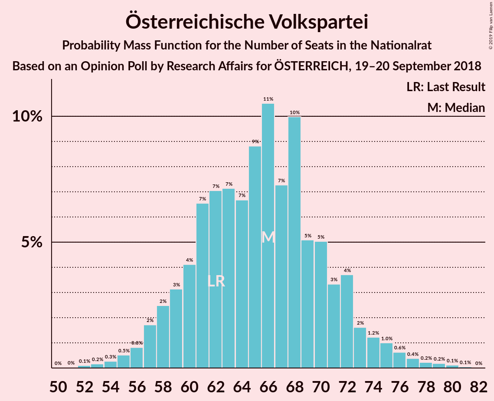

| Number of Seats | Probability | Accumulated | Special Marks |
|:---------------:|:-----------:|:-----------:|:-------------:|
| 51 | 0% | 100% |  |
| 52 | 0.1% | 99.9% |  |
| 53 | 0.2% | 99.8% |  |
| 54 | 0.3% | 99.7% |  |
| 55 | 0.5% | 99.4% |  |
| 56 | 0.8% | 98.9% |  |
| 57 | 2% | 98% |  |
| 58 | 2% | 96% |  |
| 59 | 3% | 94% |  |
| 60 | 4% | 91% |  |
| 61 | 7% | 87% |  |
| 62 | 7% | 80% | Last Result |
| 63 | 7% | 73% |  |
| 64 | 7% | 66% |  |
| 65 | 9% | 59% |  |
| 66 | 11% | 50% | Median |
| 67 | 7% | 40% |  |
| 68 | 10% | 33% |  |
| 69 | 5% | 23% |  |
| 70 | 5% | 18% |  |
| 71 | 3% | 12% |  |
| 72 | 4% | 9% |  |
| 73 | 2% | 5% |  |
| 74 | 1.2% | 4% |  |
| 75 | 1.0% | 3% |  |
| 76 | 0.6% | 2% |  |
| 77 | 0.4% | 1.0% |  |
| 78 | 0.2% | 0.6% |  |
| 79 | 0.2% | 0.4% |  |
| 80 | 0.1% | 0.2% |  |
| 81 | 0.1% | 0.1% |  |
| 82 | 0% | 0% |  |

### Sozialdemokratische Partei Österreichs

*For a full overview of the results for this party, see the [Sozialdemokratische Partei Österreichs](party-sozialdemokratischeparteiösterreichs.html) page.*

| Number of Seats | Probability | Accumulated | Special Marks |
|:---------------:|:-----------:|:-----------:|:-------------:|
| 34 | 0.1% | 100% |  |
| 35 | 0.1% | 99.9% |  |
| 36 | 0.4% | 99.8% |  |
| 37 | 0.5% | 99.4% |  |
| 38 | 1.5% | 98.9% |  |
| 39 | 2% | 97% |  |
| 40 | 2% | 95% |  |
| 41 | 6% | 93% |  |
| 42 | 4% | 87% |  |
| 43 | 12% | 84% |  |
| 44 | 9% | 72% |  |
| 45 | 12% | 62% |  |
| 46 | 11% | 50% | Median |
| 47 | 4% | 39% |  |
| 48 | 11% | 35% |  |
| 49 | 3% | 24% |  |
| 50 | 8% | 21% |  |
| 51 | 6% | 14% |  |
| 52 | 2% | 8% | Last Result |
| 53 | 3% | 5% |  |
| 54 | 0.5% | 3% |  |
| 55 | 1.4% | 2% |  |
| 56 | 0.2% | 0.7% |  |
| 57 | 0.3% | 0.6% |  |
| 58 | 0.2% | 0.3% |  |
| 59 | 0% | 0.1% |  |
| 60 | 0.1% | 0.1% |  |
| 61 | 0% | 0% |  |

### Freiheitliche Partei Österreichs

*For a full overview of the results for this party, see the [Freiheitliche Partei Österreichs](party-freiheitlicheparteiösterreichs.html) page.*

| Number of Seats | Probability | Accumulated | Special Marks |
|:---------------:|:-----------:|:-----------:|:-------------:|
| 34 | 0.1% | 100% |  |
| 35 | 0.1% | 99.9% |  |
| 36 | 0.3% | 99.8% |  |
| 37 | 0.9% | 99.5% |  |
| 38 | 1.0% | 98.6% |  |
| 39 | 2% | 98% |  |
| 40 | 4% | 95% |  |
| 41 | 4% | 91% |  |
| 42 | 7% | 87% |  |
| 43 | 9% | 80% |  |
| 44 | 5% | 71% |  |
| 45 | 15% | 65% |  |
| 46 | 8% | 51% | Median |
| 47 | 8% | 43% |  |
| 48 | 10% | 35% |  |
| 49 | 4% | 25% |  |
| 50 | 6% | 21% |  |
| 51 | 6% | 15% | Last Result |
| 52 | 2% | 8% |  |
| 53 | 3% | 6% |  |
| 54 | 1.4% | 3% |  |
| 55 | 0.6% | 1.5% |  |
| 56 | 0.4% | 0.9% |  |
| 57 | 0.3% | 0.5% |  |
| 58 | 0.1% | 0.2% |  |
| 59 | 0.1% | 0.2% |  |
| 60 | 0% | 0.1% |  |
| 61 | 0% | 0% |  |

### NEOS–Das Neue Österreich und Liberales Forum

*For a full overview of the results for this party, see the [NEOS–Das Neue Österreich und Liberales Forum](party-neos–dasneueösterreichundliberalesforum.html) page.*

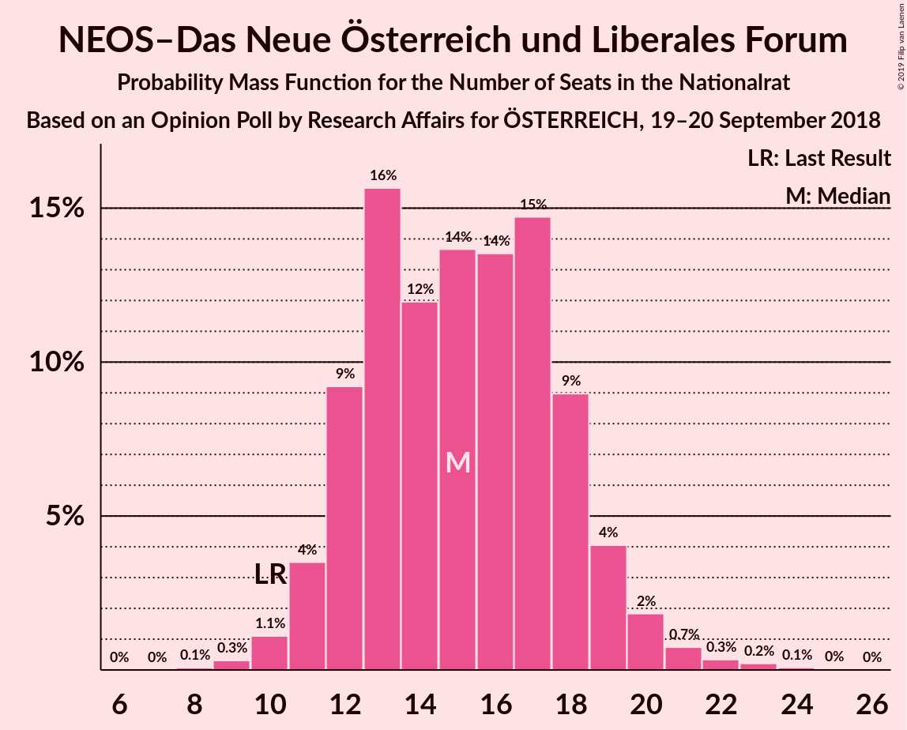

| Number of Seats | Probability | Accumulated | Special Marks |
|:---------------:|:-----------:|:-----------:|:-------------:|
| 8 | 0.1% | 100% |  |
| 9 | 0.3% | 99.9% |  |
| 10 | 1.1% | 99.6% | Last Result |
| 11 | 4% | 98.5% |  |
| 12 | 9% | 95% |  |
| 13 | 16% | 86% |  |
| 14 | 12% | 70% |  |
| 15 | 14% | 58% | Median |
| 16 | 14% | 45% |  |
| 17 | 15% | 31% |  |
| 18 | 9% | 16% |  |
| 19 | 4% | 7% |  |
| 20 | 2% | 3% |  |
| 21 | 0.7% | 1.4% |  |
| 22 | 0.3% | 0.7% |  |
| 23 | 0.2% | 0.3% |  |
| 24 | 0.1% | 0.1% |  |
| 25 | 0% | 0% |  |

### Die Grünen–Die Grüne Alternative

*For a full overview of the results for this party, see the [Die Grünen–Die Grüne Alternative](party-diegrünen–diegrünealternative.html) page.*

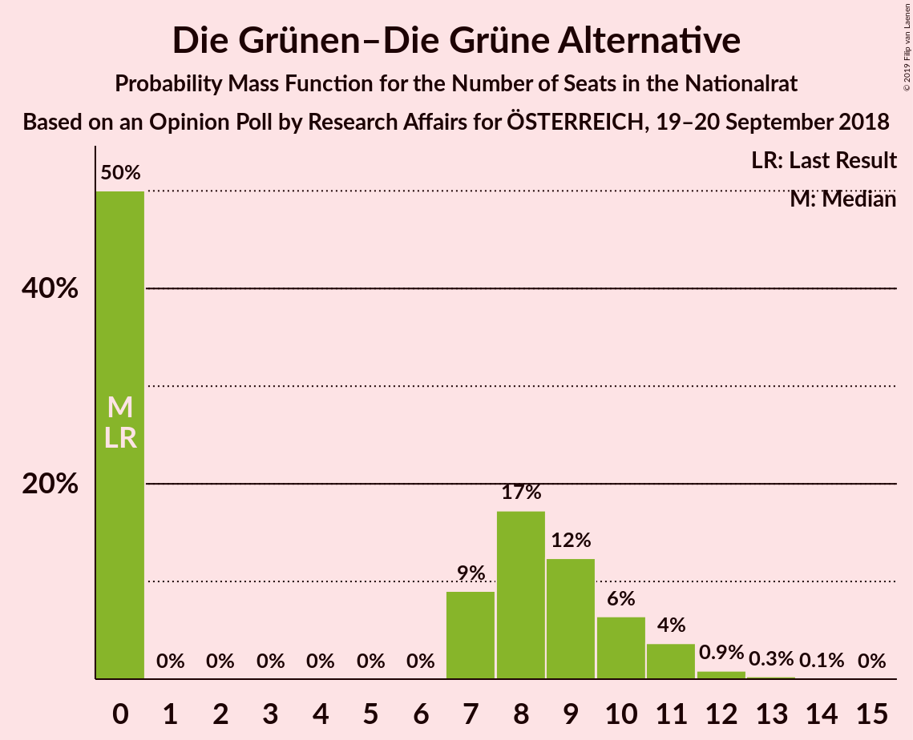

| Number of Seats | Probability | Accumulated | Special Marks |
|:---------------:|:-----------:|:-----------:|:-------------:|
| 0 | 50% | 100% | Last Result, Median |
| 1 | 0% | 50% |  |
| 2 | 0% | 50% |  |
| 3 | 0% | 50% |  |
| 4 | 0% | 50% |  |
| 5 | 0% | 50% |  |
| 6 | 0% | 50% |  |
| 7 | 9% | 50% |  |
| 8 | 17% | 41% |  |
| 9 | 12% | 24% |  |
| 10 | 6% | 11% |  |
| 11 | 4% | 5% |  |
| 12 | 0.9% | 1.2% |  |
| 13 | 0.3% | 0.4% |  |
| 14 | 0.1% | 0.1% |  |
| 15 | 0% | 0% |  |

### JETZT–Liste Pilz

*For a full overview of the results for this party, see the [JETZT–Liste Pilz](party-jetzt–listepilz.html) page.*

| Number of Seats | Probability | Accumulated | Special Marks |
|:---------------:|:-----------:|:-----------:|:-------------:|
| 0 | 99.4% | 100% | Median |
| 1 | 0% | 0.6% |  |
| 2 | 0% | 0.6% |  |
| 3 | 0% | 0.6% |  |
| 4 | 0% | 0.6% |  |
| 5 | 0% | 0.6% |  |
| 6 | 0% | 0.6% |  |
| 7 | 0.1% | 0.6% |  |
| 8 | 0.4% | 0.4% | Last Result |
| 9 | 0.1% | 0.1% |  |
| 10 | 0% | 0% |  |

## Coalitions

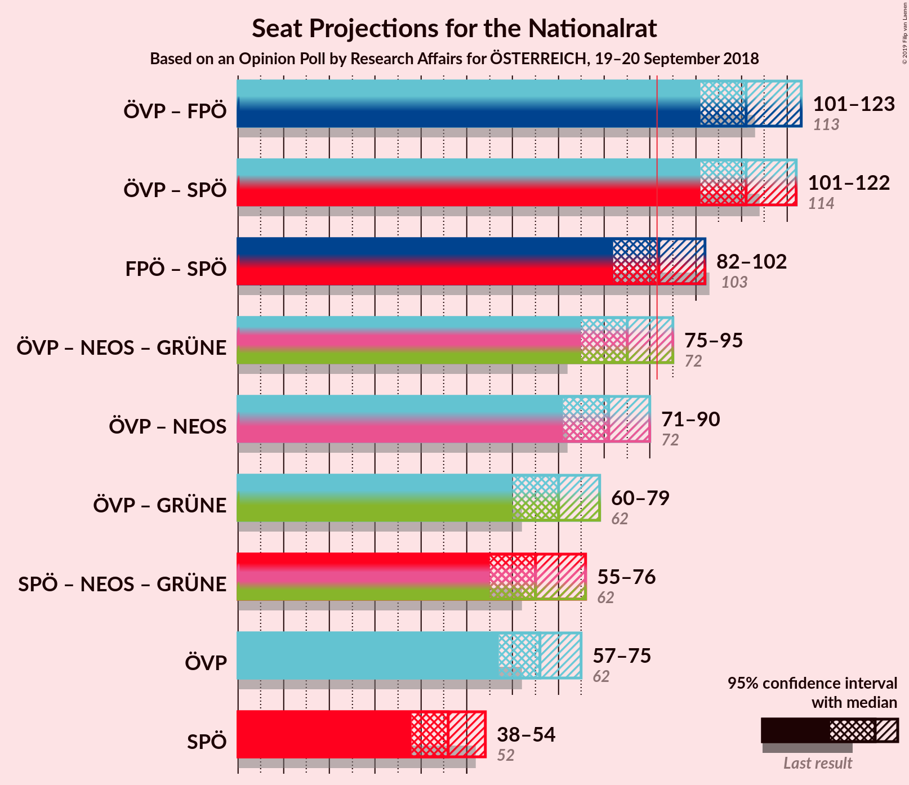

### Confidence Intervals

| Coalition | Last Result | Median | Majority? | 80% Confidence Interval | 90% Confidence Interval | 95% Confidence Interval | 99% Confidence Interval |
|:---------:|:-----------:|:------:|:---------:|:-----------------------:|:-----------------------:|:-----------------------:|:-----------------------:|
| Österreichische Volkspartei – Freiheitliche Partei Österreichs | 113 | 111 | 100% | 105–119 | 102–122 | 101–123 | 98–126 |
| Österreichische Volkspartei – Sozialdemokratische Partei Österreichs | 114 | 111 | 100% | 104–118 | 103–120 | 101–122 | 98–126 |
| Freiheitliche Partei Österreichs – Sozialdemokratische Partei Österreichs | 103 | 92 | 51% | 85–99 | 83–101 | 82–102 | 79–106 |
| Österreichische Volkspartei – NEOS–Das Neue Österreich und Liberales Forum – Die Grünen–Die Grüne Alternative | 72 | 85 | 10% | 78–92 | 77–93 | 75–95 | 72–99 |
| Österreichische Volkspartei – NEOS–Das Neue Österreich und Liberales Forum | 72 | 81 | 1.4% | 74–87 | 73–88 | 71–90 | 69–94 |
| Österreichische Volkspartei – Die Grünen–Die Grüne Alternative | 62 | 70 | 0% | 63–76 | 61–78 | 60–79 | 57–83 |
| Sozialdemokratische Partei Österreichs – NEOS–Das Neue Österreich und Liberales Forum – Die Grünen–Die Grüne Alternative | 62 | 65 | 0% | 58–72 | 57–74 | 55–76 | 53–78 |
| Österreichische Volkspartei | 62 | 66 | 0% | 60–71 | 58–73 | 57–75 | 54–78 |
| Sozialdemokratische Partei Österreichs | 52 | 46 | 0% | 41–51 | 40–53 | 38–54 | 36–57 |

### Österreichische Volkspartei – Freiheitliche Partei Österreichs

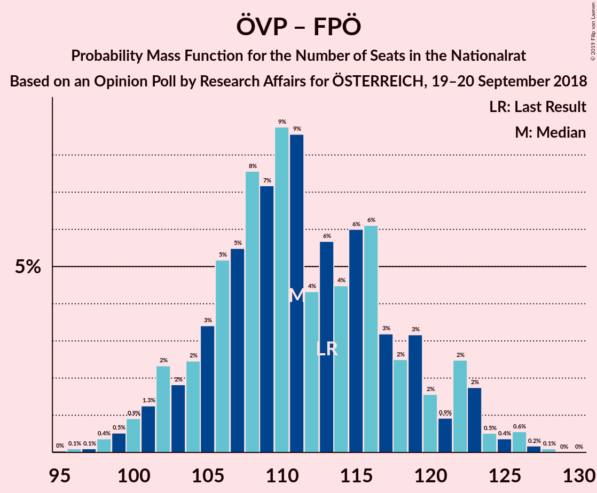

| Number of Seats | Probability | Accumulated | Special Marks |
|:---------------:|:-----------:|:-----------:|:-------------:|
| 95 | 0% | 100% |  |
| 96 | 0.1% | 99.9% |  |
| 97 | 0.1% | 99.8% |  |
| 98 | 0.4% | 99.7% |  |
| 99 | 0.5% | 99.4% |  |
| 100 | 0.9% | 98.8% |  |
| 101 | 1.3% | 98% |  |
| 102 | 2% | 97% |  |
| 103 | 2% | 94% |  |
| 104 | 2% | 93% |  |
| 105 | 3% | 90% |  |
| 106 | 5% | 87% |  |
| 107 | 5% | 81% |  |
| 108 | 8% | 76% |  |
| 109 | 7% | 68% |  |
| 110 | 9% | 61% |  |
| 111 | 9% | 52% |  |
| 112 | 4% | 44% | Median |
| 113 | 6% | 40% | Last Result |
| 114 | 4% | 34% |  |
| 115 | 6% | 29% |  |
| 116 | 6% | 23% |  |
| 117 | 3% | 17% |  |
| 118 | 2% | 14% |  |
| 119 | 3% | 12% |  |
| 120 | 2% | 8% |  |
| 121 | 0.9% | 7% |  |
| 122 | 2% | 6% |  |
| 123 | 2% | 4% |  |
| 124 | 0.5% | 2% |  |
| 125 | 0.4% | 1.2% |  |
| 126 | 0.6% | 0.9% |  |
| 127 | 0.2% | 0.3% |  |
| 128 | 0.1% | 0.1% |  |
| 129 | 0% | 0% |  |

### Österreichische Volkspartei – Sozialdemokratische Partei Österreichs

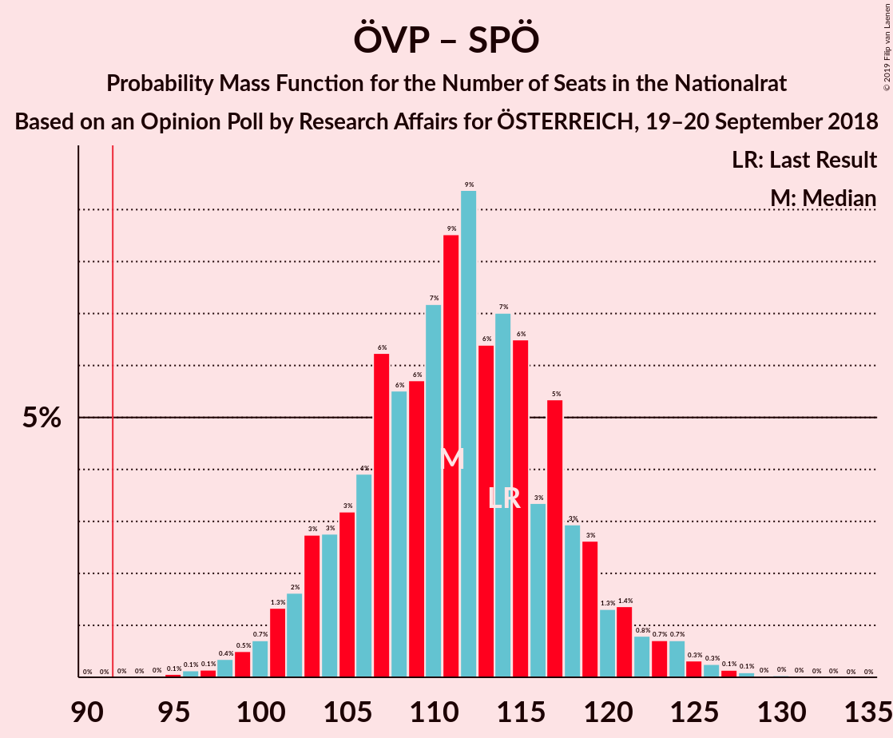

| Number of Seats | Probability | Accumulated | Special Marks |
|:---------------:|:-----------:|:-----------:|:-------------:|
| 95 | 0.1% | 100% |  |
| 96 | 0.1% | 99.9% |  |
| 97 | 0.1% | 99.8% |  |
| 98 | 0.4% | 99.6% |  |
| 99 | 0.5% | 99.3% |  |
| 100 | 0.7% | 98.8% |  |
| 101 | 1.3% | 98% |  |
| 102 | 2% | 97% |  |
| 103 | 3% | 95% |  |
| 104 | 3% | 92% |  |
| 105 | 3% | 90% |  |
| 106 | 4% | 86% |  |
| 107 | 6% | 83% |  |
| 108 | 6% | 76% |  |
| 109 | 6% | 71% |  |
| 110 | 7% | 65% |  |
| 111 | 9% | 58% |  |
| 112 | 9% | 49% | Median |
| 113 | 6% | 40% |  |
| 114 | 7% | 34% | Last Result |
| 115 | 6% | 27% |  |
| 116 | 3% | 20% |  |
| 117 | 5% | 17% |  |
| 118 | 3% | 11% |  |
| 119 | 3% | 8% |  |
| 120 | 1.3% | 6% |  |
| 121 | 1.4% | 4% |  |
| 122 | 0.8% | 3% |  |
| 123 | 0.7% | 2% |  |
| 124 | 0.7% | 2% |  |
| 125 | 0.3% | 0.9% |  |
| 126 | 0.3% | 0.6% |  |
| 127 | 0.1% | 0.3% |  |
| 128 | 0.1% | 0.2% |  |
| 129 | 0% | 0.1% |  |
| 130 | 0% | 0.1% |  |
| 131 | 0% | 0% |  |

### Freiheitliche Partei Österreichs – Sozialdemokratische Partei Österreichs

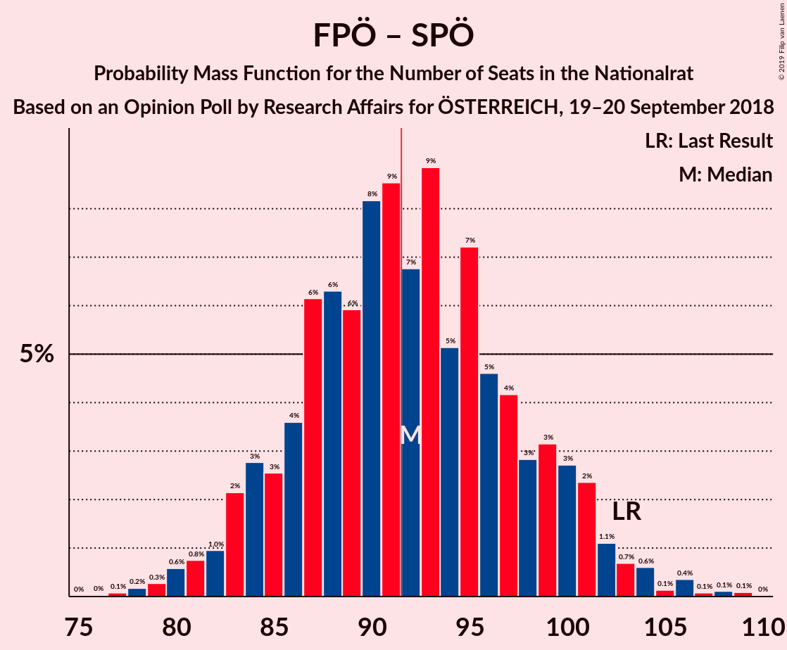

| Number of Seats | Probability | Accumulated | Special Marks |
|:---------------:|:-----------:|:-----------:|:-------------:|
| 76 | 0% | 100% |  |
| 77 | 0.1% | 99.9% |  |
| 78 | 0.2% | 99.9% |  |
| 79 | 0.3% | 99.7% |  |
| 80 | 0.6% | 99.4% |  |
| 81 | 0.8% | 98.8% |  |
| 82 | 1.0% | 98% |  |
| 83 | 2% | 97% |  |
| 84 | 3% | 95% |  |
| 85 | 3% | 92% |  |
| 86 | 4% | 90% |  |
| 87 | 6% | 86% |  |
| 88 | 6% | 80% |  |
| 89 | 6% | 74% |  |
| 90 | 8% | 68% |  |
| 91 | 9% | 60% |  |
| 92 | 7% | 51% | Median, Majority |
| 93 | 9% | 44% |  |
| 94 | 5% | 35% |  |
| 95 | 7% | 30% |  |
| 96 | 5% | 23% |  |
| 97 | 4% | 18% |  |
| 98 | 3% | 14% |  |
| 99 | 3% | 11% |  |
| 100 | 3% | 8% |  |
| 101 | 2% | 6% |  |
| 102 | 1.1% | 3% |  |
| 103 | 0.7% | 2% | Last Result |
| 104 | 0.6% | 1.4% |  |
| 105 | 0.1% | 0.8% |  |
| 106 | 0.4% | 0.7% |  |
| 107 | 0.1% | 0.3% |  |
| 108 | 0.1% | 0.2% |  |
| 109 | 0.1% | 0.1% |  |
| 110 | 0% | 0% |  |

### Österreichische Volkspartei – NEOS–Das Neue Österreich und Liberales Forum – Die Grünen–Die Grüne Alternative

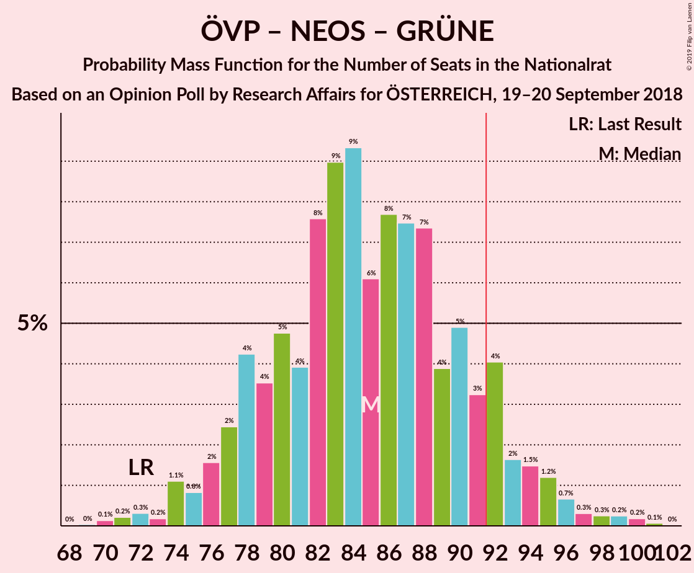

| Number of Seats | Probability | Accumulated | Special Marks |
|:---------------:|:-----------:|:-----------:|:-------------:|
| 69 | 0% | 100% |  |
| 70 | 0.1% | 99.9% |  |
| 71 | 0.2% | 99.8% |  |
| 72 | 0.3% | 99.6% | Last Result |
| 73 | 0.2% | 99.3% |  |
| 74 | 1.1% | 99.1% |  |
| 75 | 0.8% | 98% |  |
| 76 | 2% | 97% |  |
| 77 | 2% | 96% |  |
| 78 | 4% | 93% |  |
| 79 | 4% | 89% |  |
| 80 | 5% | 85% |  |
| 81 | 4% | 81% | Median |
| 82 | 8% | 77% |  |
| 83 | 9% | 69% |  |
| 84 | 9% | 60% |  |
| 85 | 6% | 51% |  |
| 86 | 8% | 45% |  |
| 87 | 7% | 37% |  |
| 88 | 7% | 30% |  |
| 89 | 4% | 22% |  |
| 90 | 5% | 18% |  |
| 91 | 3% | 13% |  |
| 92 | 4% | 10% | Majority |
| 93 | 2% | 6% |  |
| 94 | 1.5% | 4% |  |
| 95 | 1.2% | 3% |  |
| 96 | 0.7% | 2% |  |
| 97 | 0.3% | 1.1% |  |
| 98 | 0.3% | 0.8% |  |
| 99 | 0.2% | 0.5% |  |
| 100 | 0.2% | 0.3% |  |
| 101 | 0.1% | 0.1% |  |
| 102 | 0% | 0% |  |

### Österreichische Volkspartei – NEOS–Das Neue Österreich und Liberales Forum

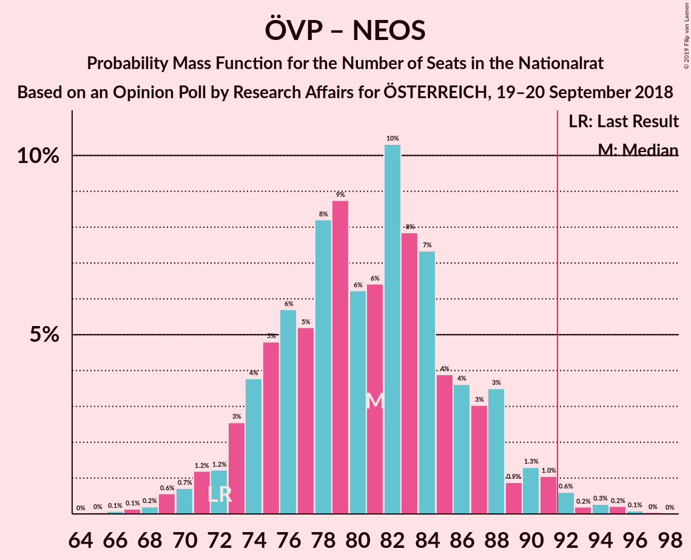

| Number of Seats | Probability | Accumulated | Special Marks |
|:---------------:|:-----------:|:-----------:|:-------------:|
| 65 | 0% | 100% |  |
| 66 | 0.1% | 99.9% |  |
| 67 | 0.1% | 99.9% |  |
| 68 | 0.2% | 99.7% |  |
| 69 | 0.6% | 99.5% |  |
| 70 | 0.7% | 99.0% |  |
| 71 | 1.2% | 98% |  |
| 72 | 1.2% | 97% | Last Result |
| 73 | 3% | 96% |  |
| 74 | 4% | 93% |  |
| 75 | 5% | 90% |  |
| 76 | 6% | 85% |  |
| 77 | 5% | 79% |  |
| 78 | 8% | 74% |  |
| 79 | 9% | 66% |  |
| 80 | 6% | 57% |  |
| 81 | 6% | 51% | Median |
| 82 | 10% | 44% |  |
| 83 | 8% | 34% |  |
| 84 | 7% | 26% |  |
| 85 | 4% | 19% |  |
| 86 | 4% | 15% |  |
| 87 | 3% | 11% |  |
| 88 | 3% | 8% |  |
| 89 | 0.9% | 5% |  |
| 90 | 1.3% | 4% |  |
| 91 | 1.0% | 2% |  |
| 92 | 0.6% | 1.4% | Majority |
| 93 | 0.2% | 0.8% |  |
| 94 | 0.3% | 0.6% |  |
| 95 | 0.2% | 0.4% |  |
| 96 | 0.1% | 0.2% |  |
| 97 | 0% | 0.1% |  |
| 98 | 0% | 0% |  |

### Österreichische Volkspartei – Die Grünen–Die Grüne Alternative

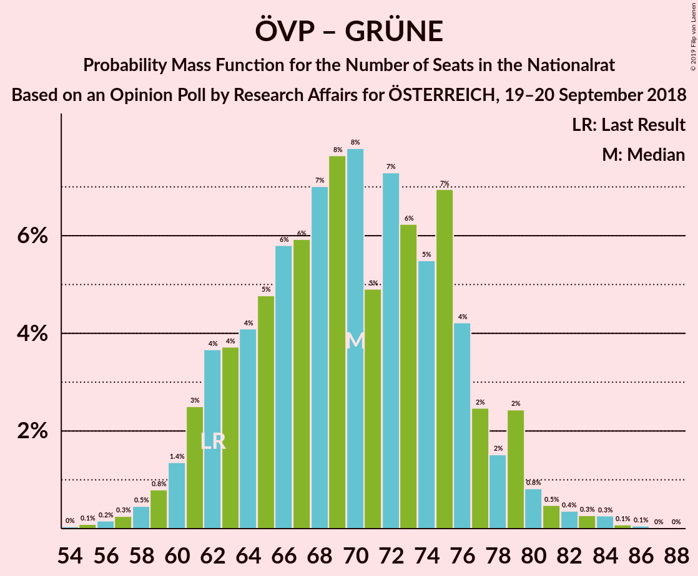

| Number of Seats | Probability | Accumulated | Special Marks |
|:---------------:|:-----------:|:-----------:|:-------------:|
| 54 | 0% | 100% |  |
| 55 | 0.1% | 99.9% |  |
| 56 | 0.2% | 99.8% |  |
| 57 | 0.3% | 99.7% |  |
| 58 | 0.5% | 99.4% |  |
| 59 | 0.8% | 99.0% |  |
| 60 | 1.4% | 98% |  |
| 61 | 3% | 97% |  |
| 62 | 4% | 94% | Last Result |
| 63 | 4% | 91% |  |
| 64 | 4% | 87% |  |
| 65 | 5% | 83% |  |
| 66 | 6% | 78% | Median |
| 67 | 6% | 72% |  |
| 68 | 7% | 66% |  |
| 69 | 8% | 59% |  |
| 70 | 8% | 52% |  |
| 71 | 5% | 44% |  |
| 72 | 7% | 39% |  |
| 73 | 6% | 32% |  |
| 74 | 5% | 25% |  |
| 75 | 7% | 20% |  |
| 76 | 4% | 13% |  |
| 77 | 2% | 9% |  |
| 78 | 2% | 6% |  |
| 79 | 2% | 5% |  |
| 80 | 0.8% | 2% |  |
| 81 | 0.5% | 2% |  |
| 82 | 0.4% | 1.1% |  |
| 83 | 0.3% | 0.7% |  |
| 84 | 0.3% | 0.4% |  |
| 85 | 0.1% | 0.2% |  |
| 86 | 0.1% | 0.1% |  |
| 87 | 0% | 0% |  |

### Sozialdemokratische Partei Österreichs – NEOS–Das Neue Österreich und Liberales Forum – Die Grünen–Die Grüne Alternative

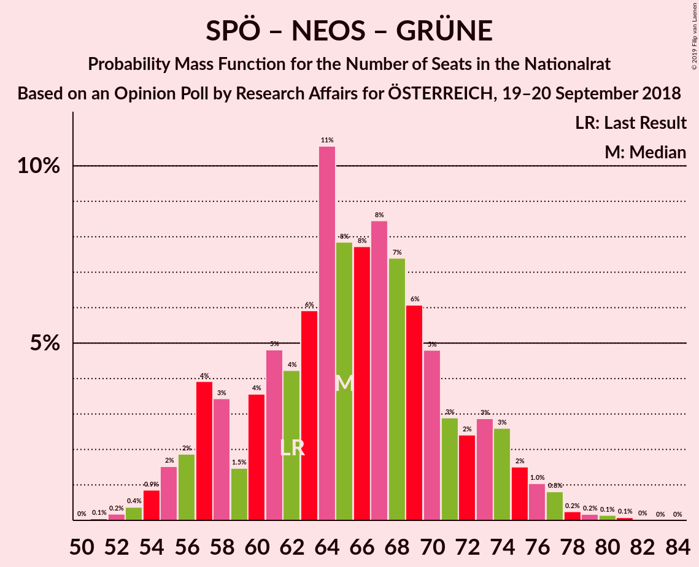

| Number of Seats | Probability | Accumulated | Special Marks |
|:---------------:|:-----------:|:-----------:|:-------------:|
| 50 | 0% | 100% |  |
| 51 | 0.1% | 99.9% |  |
| 52 | 0.2% | 99.9% |  |
| 53 | 0.4% | 99.7% |  |
| 54 | 0.9% | 99.3% |  |
| 55 | 2% | 98% |  |
| 56 | 2% | 97% |  |
| 57 | 4% | 95% |  |
| 58 | 3% | 91% |  |
| 59 | 1.5% | 88% |  |
| 60 | 4% | 86% |  |
| 61 | 5% | 83% | Median |
| 62 | 4% | 78% | Last Result |
| 63 | 6% | 74% |  |
| 64 | 11% | 68% |  |
| 65 | 8% | 57% |  |
| 66 | 8% | 49% |  |
| 67 | 8% | 42% |  |
| 68 | 7% | 33% |  |
| 69 | 6% | 26% |  |
| 70 | 5% | 20% |  |
| 71 | 3% | 15% |  |
| 72 | 2% | 12% |  |
| 73 | 3% | 10% |  |
| 74 | 3% | 7% |  |
| 75 | 2% | 4% |  |
| 76 | 1.0% | 3% |  |
| 77 | 0.8% | 2% |  |
| 78 | 0.2% | 0.7% |  |
| 79 | 0.2% | 0.5% |  |
| 80 | 0.1% | 0.3% |  |
| 81 | 0.1% | 0.1% |  |
| 82 | 0% | 0.1% |  |
| 83 | 0% | 0% |  |

### Österreichische Volkspartei

| Number of Seats | Probability | Accumulated | Special Marks |
|:---------------:|:-----------:|:-----------:|:-------------:|
| 51 | 0% | 100% |  |
| 52 | 0.1% | 99.9% |  |
| 53 | 0.2% | 99.8% |  |
| 54 | 0.3% | 99.7% |  |
| 55 | 0.5% | 99.4% |  |
| 56 | 0.8% | 98.9% |  |
| 57 | 2% | 98% |  |
| 58 | 2% | 96% |  |
| 59 | 3% | 94% |  |
| 60 | 4% | 91% |  |
| 61 | 7% | 87% |  |
| 62 | 7% | 80% | Last Result |
| 63 | 7% | 73% |  |
| 64 | 7% | 66% |  |
| 65 | 9% | 59% |  |
| 66 | 11% | 50% | Median |
| 67 | 7% | 40% |  |
| 68 | 10% | 33% |  |
| 69 | 5% | 23% |  |
| 70 | 5% | 18% |  |
| 71 | 3% | 12% |  |
| 72 | 4% | 9% |  |
| 73 | 2% | 5% |  |
| 74 | 1.2% | 4% |  |
| 75 | 1.0% | 3% |  |
| 76 | 0.6% | 2% |  |
| 77 | 0.4% | 1.0% |  |
| 78 | 0.2% | 0.6% |  |
| 79 | 0.2% | 0.4% |  |
| 80 | 0.1% | 0.2% |  |
| 81 | 0.1% | 0.1% |  |
| 82 | 0% | 0% |  |

### Sozialdemokratische Partei Österreichs

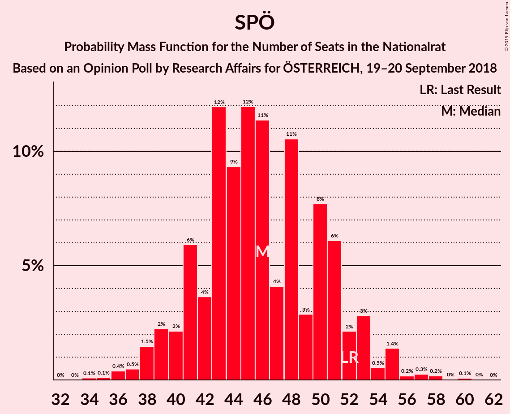

| Number of Seats | Probability | Accumulated | Special Marks |
|:---------------:|:-----------:|:-----------:|:-------------:|
| 34 | 0.1% | 100% |  |
| 35 | 0.1% | 99.9% |  |
| 36 | 0.4% | 99.8% |  |
| 37 | 0.5% | 99.4% |  |
| 38 | 1.5% | 98.9% |  |
| 39 | 2% | 97% |  |
| 40 | 2% | 95% |  |
| 41 | 6% | 93% |  |
| 42 | 4% | 87% |  |
| 43 | 12% | 84% |  |
| 44 | 9% | 72% |  |
| 45 | 12% | 62% |  |
| 46 | 11% | 50% | Median |
| 47 | 4% | 39% |  |
| 48 | 11% | 35% |  |
| 49 | 3% | 24% |  |
| 50 | 8% | 21% |  |
| 51 | 6% | 14% |  |
| 52 | 2% | 8% | Last Result |
| 53 | 3% | 5% |  |
| 54 | 0.5% | 3% |  |
| 55 | 1.4% | 2% |  |
| 56 | 0.2% | 0.7% |  |
| 57 | 0.3% | 0.6% |  |
| 58 | 0.2% | 0.3% |  |
| 59 | 0% | 0.1% |  |
| 60 | 0.1% | 0.1% |  |
| 61 | 0% | 0% |  |

## Technical Information

### Opinion Poll

+ **Polling firm:** Research Affairs
+ **Commissioner(s):** ÖSTERREICH
+ **Fieldwork period:** 19–20 September 2018

### Calculations

+ **Sample size:** 506
+ **Simulations done:** 131,072
+ **Error estimate:** 1.17%

