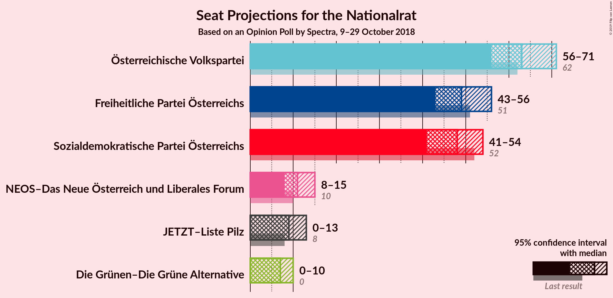
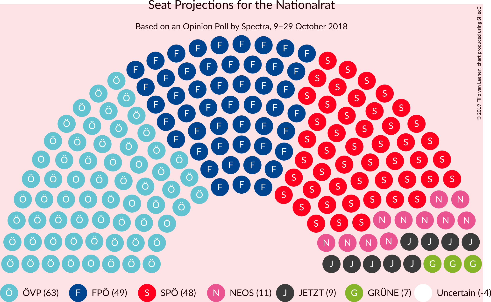
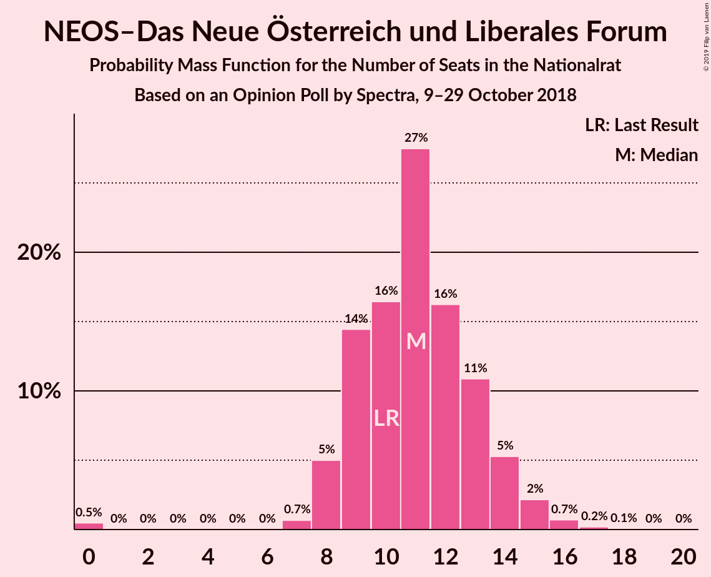
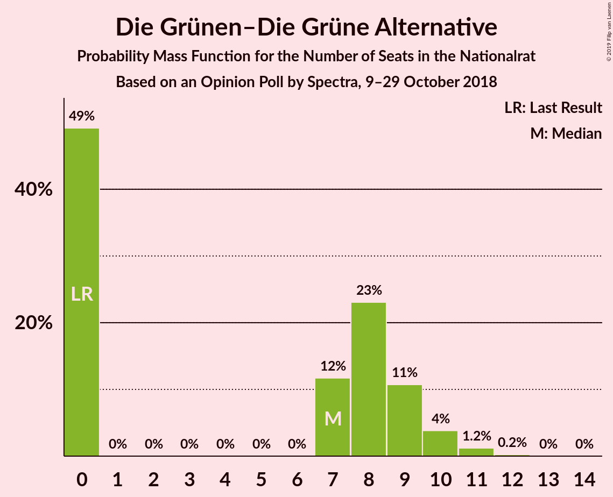
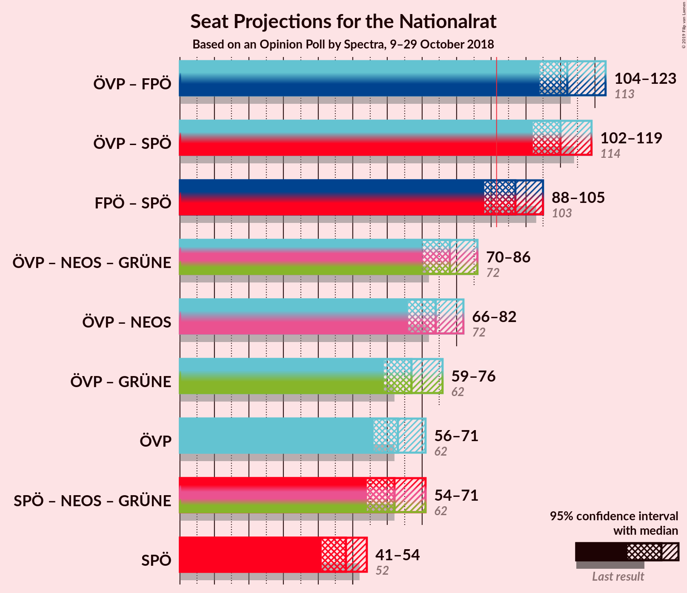
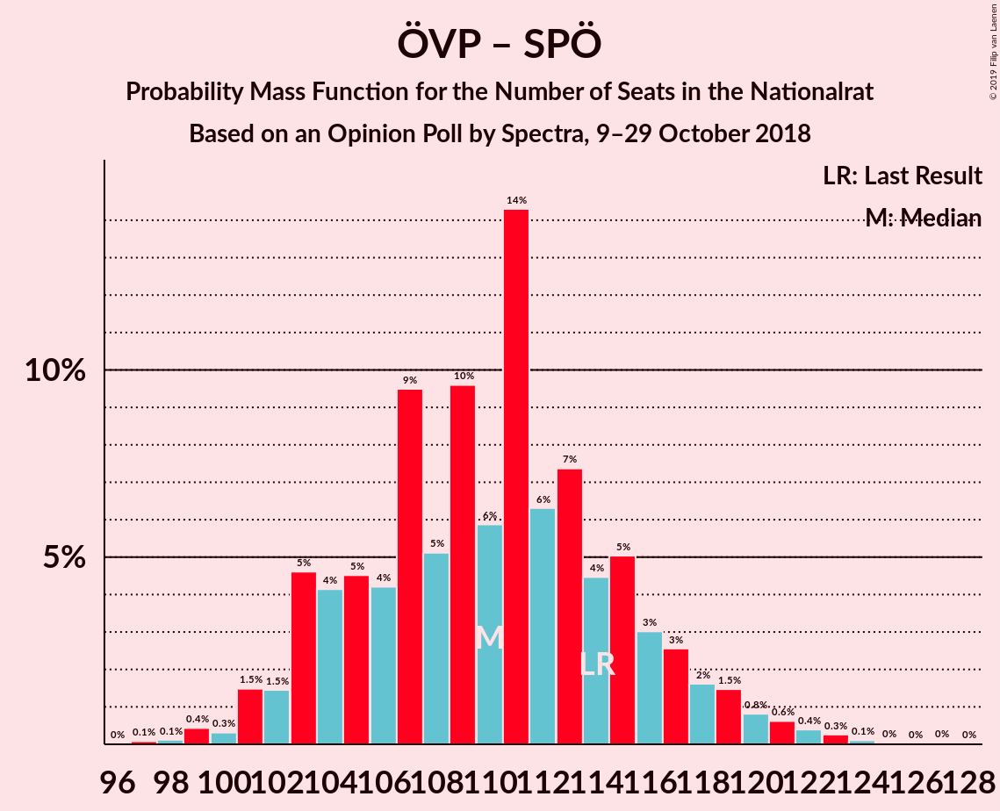
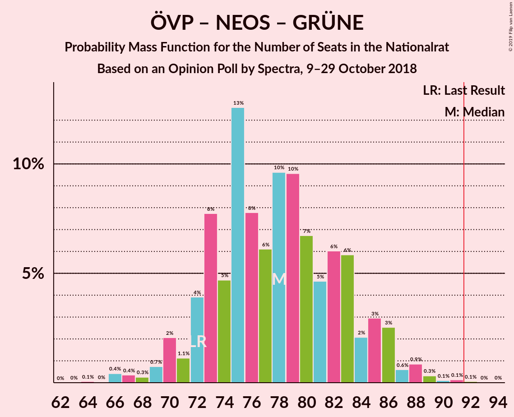
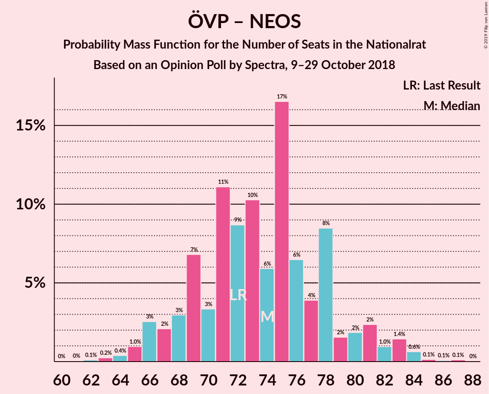
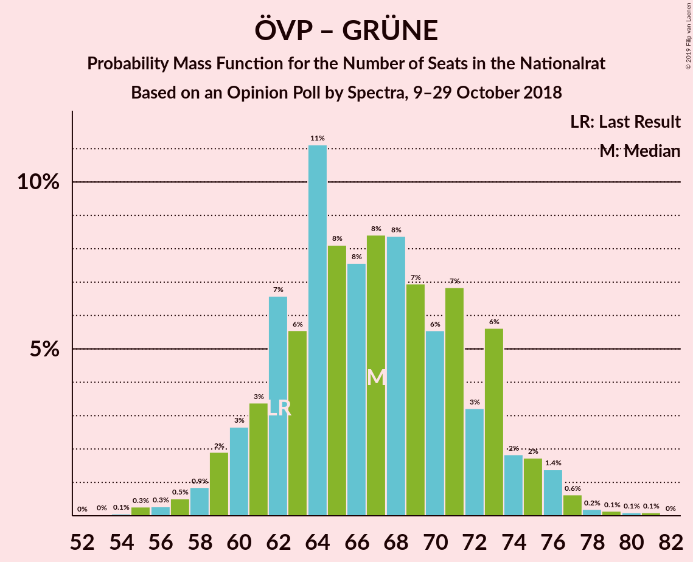
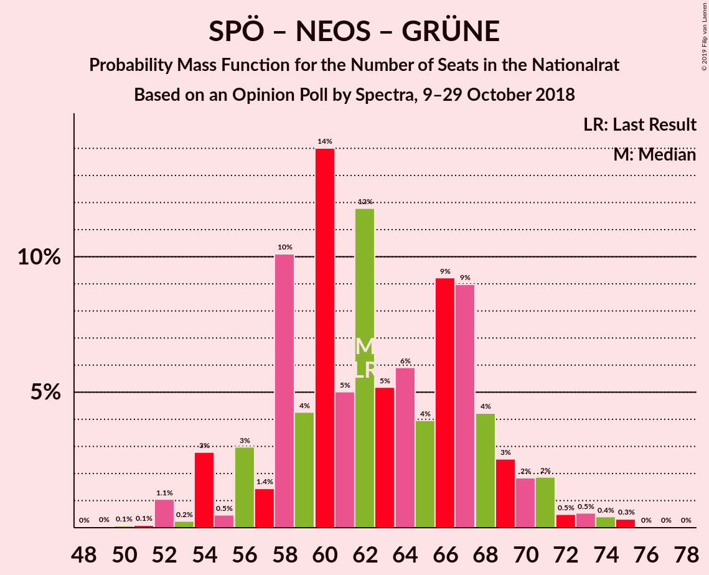

# Opinion Poll by Spectra, 9–29 October 2018

<a href="#voting-intentions">Voting Intentions</a> | <a href="#seats">Seats</a> | <a href="#coalitions">Coalitions</a> | <a href="#technical-information">Technical Information</a>

## Voting Intentions

### Confidence Intervals

| Party | Last Result | Poll Result | 80% Confidence Interval | 90% Confidence Interval | 95% Confidence Interval | 99% Confidence Interval |
|:-----:|:-----------:|:-----------:|:-----------------------:|:-----------------------:|:-----------------------:|:-----------------------:|
| Österreichische Volkspartei | 31.5% | 33.1% | 30.8–35.4% |30.2–36.0% |29.7–36.6% |28.6–37.7% |
| Freiheitliche Partei Österreichs | 26.0% | 26.0% | 24.0–28.2% |23.4–28.8% |22.9–29.4% |21.9–30.4% |
| Sozialdemokratische Partei Österreichs | 26.9% | 25.0% | 23.0–27.2% |22.4–27.8% |21.9–28.3% |21.0–29.4% |
| NEOS–Das Neue Österreich und Liberales Forum | 5.3% | 5.9% | 4.9–7.2% |4.6–7.6% |4.4–7.9% |4.0–8.6% |
| JETZT–Liste Pilz | 4.4% | 4.9% | 4.0–6.2% |3.8–6.5% |3.6–6.8% |3.2–7.4% |
| Die Grünen–Die Grüne Alternative | 3.8% | 4.0% | 3.2–5.1% |2.9–5.4% |2.7–5.7% |2.4–6.2% |

*Note:* The poll result column reflects the actual value used in the calculations. Published results may vary slightly, and in addition be rounded to fewer digits.

## Seats

### Confidence Intervals

| Party | Last Result | Median | 80% Confidence Interval | 90% Confidence Interval | 95% Confidence Interval | 99% Confidence Interval |
|:-----:|:-----------:|:------:|:-----------------------:|:-----------------------:|:-----------------------:|:-----------------------:|
| <a href="#österreichische-volkspartei">Österreichische Volkspartei</a> | 62 | 63 | 58–67 |57–69 |56–71 |54–73 |
| <a href="#freiheitliche-partei-österreichs">Freiheitliche Partei Österreichs</a> | 51 | 49 | 45–53 |43–55 |43–56 |41–58 |
| <a href="#sozialdemokratische-partei-österreichs">Sozialdemokratische Partei Österreichs</a> | 52 | 48 | 43–51 |42–53 |41–54 |39–56 |
| <a href="#neos–das-neue-österreich-und-liberales-forum">NEOS–Das Neue Österreich und Liberales Forum</a> | 10 | 11 | 9–13 |8–14 |8–15 |7–16 |
| <a href="#jetzt–liste-pilz">JETZT–Liste Pilz</a> | 8 | 9 | 7–11 |0–12 |0–13 |0–14 |
| <a href="#die-grünen–die-grüne-alternative">Die Grünen–Die Grüne Alternative</a> | 0 | 7 | 0–9 |0–10 |0–10 |0–11 |

### Österreichische Volkspartei

*For a full overview of the results for this party, see the [Österreichische Volkspartei](party-österreichischevolkspartei.html) page.*

| Number of Seats | Probability | Accumulated | Special Marks |
|:---------------:|:-----------:|:-----------:|:-------------:|
| 51 | 0% | 100% |  |
| 52 | 0.2% | 99.9% |  |
| 53 | 0.2% | 99.8% |  |
| 54 | 0.9% | 99.5% |  |
| 55 | 1.1% | 98.6% |  |
| 56 | 2% | 98% |  |
| 57 | 3% | 95% |  |
| 58 | 5% | 92% |  |
| 59 | 7% | 87% |  |
| 60 | 10% | 80% |  |
| 61 | 8% | 70% |  |
| 62 | 12% | 62% | Last Result |
| 63 | 8% | 51% | Median |
| 64 | 13% | 43% |  |
| 65 | 10% | 30% |  |
| 66 | 7% | 20% |  |
| 67 | 4% | 13% |  |
| 68 | 3% | 9% |  |
| 69 | 2% | 6% |  |
| 70 | 2% | 4% |  |
| 71 | 2% | 3% |  |
| 72 | 0.3% | 1.3% |  |
| 73 | 0.7% | 0.9% |  |
| 74 | 0.1% | 0.2% |  |
| 75 | 0.1% | 0.1% |  |
| 76 | 0% | 0.1% |  |
| 77 | 0% | 0% |  |

### Freiheitliche Partei Österreichs

*For a full overview of the results for this party, see the [Freiheitliche Partei Österreichs](party-freiheitlicheparteiösterreichs.html) page.*

| Number of Seats | Probability | Accumulated | Special Marks |
|:---------------:|:-----------:|:-----------:|:-------------:|
| 39 | 0% | 100% |  |
| 40 | 0.3% | 99.9% |  |
| 41 | 0.4% | 99.6% |  |
| 42 | 0.6% | 99.2% |  |
| 43 | 4% | 98.7% |  |
| 44 | 3% | 95% |  |
| 45 | 4% | 92% |  |
| 46 | 11% | 88% |  |
| 47 | 9% | 77% |  |
| 48 | 7% | 68% |  |
| 49 | 19% | 61% | Median |
| 50 | 5% | 42% |  |
| 51 | 5% | 37% | Last Result |
| 52 | 18% | 32% |  |
| 53 | 4% | 14% |  |
| 54 | 3% | 9% |  |
| 55 | 4% | 6% |  |
| 56 | 0.7% | 3% |  |
| 57 | 0.9% | 2% |  |
| 58 | 0.7% | 1.1% |  |
| 59 | 0.2% | 0.4% |  |
| 60 | 0.1% | 0.2% |  |
| 61 | 0% | 0.1% |  |
| 62 | 0% | 0% |  |

### Sozialdemokratische Partei Österreichs

*For a full overview of the results for this party, see the [Sozialdemokratische Partei Österreichs](party-sozialdemokratischeparteiösterreichs.html) page.*

| Number of Seats | Probability | Accumulated | Special Marks |
|:---------------:|:-----------:|:-----------:|:-------------:|
| 37 | 0.1% | 100% |  |
| 38 | 0.2% | 99.9% |  |
| 39 | 0.4% | 99.7% |  |
| 40 | 1.0% | 99.2% |  |
| 41 | 2% | 98% |  |
| 42 | 3% | 97% |  |
| 43 | 6% | 94% |  |
| 44 | 7% | 88% |  |
| 45 | 11% | 81% |  |
| 46 | 6% | 70% |  |
| 47 | 13% | 64% |  |
| 48 | 13% | 50% | Median |
| 49 | 15% | 37% |  |
| 50 | 6% | 22% |  |
| 51 | 7% | 16% |  |
| 52 | 4% | 9% | Last Result |
| 53 | 2% | 5% |  |
| 54 | 1.0% | 3% |  |
| 55 | 1.4% | 2% |  |
| 56 | 0.4% | 0.8% |  |
| 57 | 0.1% | 0.4% |  |
| 58 | 0.1% | 0.2% |  |
| 59 | 0.1% | 0.1% |  |
| 60 | 0% | 0.1% |  |
| 61 | 0% | 0% |  |

### NEOS–Das Neue Österreich und Liberales Forum

*For a full overview of the results for this party, see the [NEOS–Das Neue Österreich und Liberales Forum](party-neos–dasneueösterreichundliberalesforum.html) page.*

| Number of Seats | Probability | Accumulated | Special Marks |
|:---------------:|:-----------:|:-----------:|:-------------:|
| 0 | 0.5% | 100% |  |
| 1 | 0% | 99.5% |  |
| 2 | 0% | 99.5% |  |
| 3 | 0% | 99.5% |  |
| 4 | 0% | 99.5% |  |
| 5 | 0% | 99.5% |  |
| 6 | 0% | 99.5% |  |
| 7 | 0.7% | 99.5% |  |
| 8 | 5% | 98.9% |  |
| 9 | 14% | 94% |  |
| 10 | 16% | 79% | Last Result |
| 11 | 27% | 63% | Median |
| 12 | 16% | 36% |  |
| 13 | 11% | 19% |  |
| 14 | 5% | 8% |  |
| 15 | 2% | 3% |  |
| 16 | 0.7% | 1.0% |  |
| 17 | 0.2% | 0.3% |  |
| 18 | 0.1% | 0.1% |  |
| 19 | 0% | 0% |  |

### JETZT–Liste Pilz

*For a full overview of the results for this party, see the [JETZT–Liste Pilz](party-jetzt–listepilz.html) page.*

| Number of Seats | Probability | Accumulated | Special Marks |
|:---------------:|:-----------:|:-----------:|:-------------:|
| 0 | 10% | 100% |  |
| 1 | 0% | 90% |  |
| 2 | 0% | 90% |  |
| 3 | 0% | 90% |  |
| 4 | 0% | 90% |  |
| 5 | 0% | 90% |  |
| 6 | 0% | 90% |  |
| 7 | 5% | 90% |  |
| 8 | 21% | 86% | Last Result |
| 9 | 25% | 65% | Median |
| 10 | 20% | 40% |  |
| 11 | 10% | 20% |  |
| 12 | 7% | 10% |  |
| 13 | 2% | 3% |  |
| 14 | 0.5% | 0.7% |  |
| 15 | 0.1% | 0.1% |  |
| 16 | 0% | 0% |  |

### Die Grünen–Die Grüne Alternative

*For a full overview of the results for this party, see the [Die Grünen–Die Grüne Alternative](party-diegrünen–diegrünealternative.html) page.*

| Number of Seats | Probability | Accumulated | Special Marks |
|:---------------:|:-----------:|:-----------:|:-------------:|
| 0 | 49% | 100% | Last Result |
| 1 | 0% | 51% |  |
| 2 | 0% | 51% |  |
| 3 | 0% | 51% |  |
| 4 | 0% | 51% |  |
| 5 | 0% | 51% |  |
| 6 | 0% | 51% |  |
| 7 | 12% | 51% | Median |
| 8 | 23% | 39% |  |
| 9 | 11% | 16% |  |
| 10 | 4% | 5% |  |
| 11 | 1.2% | 1.5% |  |
| 12 | 0.2% | 0.3% |  |
| 13 | 0% | 0.1% |  |
| 14 | 0% | 0% |  |

## Coalitions

### Confidence Intervals

| Coalition | Last Result | Median | Majority? | 80% Confidence Interval | 90% Confidence Interval | 95% Confidence Interval | 99% Confidence Interval |
|:---------:|:-----------:|:------:|:---------:|:-----------------------:|:-----------------------:|:-----------------------:|:-----------------------:|
| Österreichische Volkspartei – Freiheitliche Partei Österreichs | 113 | 112 | 100% | 107–118 | 104–120 | 104–123 | 101–124 |
| Österreichische Volkspartei – Sozialdemokratische Partei Österreichs | 114 | 110 | 100% | 104–116 | 103–118 | 102–119 | 99–123 |
| Freiheitliche Partei Österreichs – Sozialdemokratische Partei Österreichs | 103 | 97 | 87% | 91–102 | 90–103 | 88–105 | 86–109 |
| Österreichische Volkspartei – NEOS–Das Neue Österreich und Liberales Forum – Die Grünen–Die Grüne Alternative | 72 | 78 | 0.1% | 73–83 | 71–85 | 70–86 | 66–89 |
| Österreichische Volkspartei – NEOS–Das Neue Österreich und Liberales Forum | 72 | 74 | 0% | 69–78 | 67–81 | 66–82 | 64–84 |
| Österreichische Volkspartei – Die Grünen–Die Grüne Alternative | 62 | 67 | 0% | 62–73 | 60–74 | 59–76 | 56–78 |
| Österreichische Volkspartei | 62 | 63 | 0% | 58–67 | 57–69 | 56–71 | 54–73 |
| Sozialdemokratische Partei Österreichs – NEOS–Das Neue Österreich und Liberales Forum – Die Grünen–Die Grüne Alternative | 62 | 62 | 0% | 58–68 | 56–70 | 54–71 | 52–74 |
| Sozialdemokratische Partei Österreichs | 52 | 48 | 0% | 43–51 | 42–53 | 41–54 | 39–56 |

### Österreichische Volkspartei – Freiheitliche Partei Österreichs

| Number of Seats | Probability | Accumulated | Special Marks |
|:---------------:|:-----------:|:-----------:|:-------------:|
| 99 | 0.1% | 100% |  |
| 100 | 0.2% | 99.9% |  |
| 101 | 0.4% | 99.7% |  |
| 102 | 0.3% | 99.2% |  |
| 103 | 1.3% | 98.9% |  |
| 104 | 3% | 98% |  |
| 105 | 2% | 95% |  |
| 106 | 2% | 93% |  |
| 107 | 6% | 91% |  |
| 108 | 12% | 84% |  |
| 109 | 4% | 72% |  |
| 110 | 7% | 69% |  |
| 111 | 11% | 62% |  |
| 112 | 8% | 51% | Median |
| 113 | 6% | 43% | Last Result |
| 114 | 9% | 37% |  |
| 115 | 9% | 28% |  |
| 116 | 5% | 19% |  |
| 117 | 3% | 14% |  |
| 118 | 3% | 11% |  |
| 119 | 2% | 8% |  |
| 120 | 1.5% | 6% |  |
| 121 | 1.1% | 4% |  |
| 122 | 0.6% | 3% |  |
| 123 | 2% | 3% |  |
| 124 | 0.9% | 1.1% |  |
| 125 | 0.1% | 0.2% |  |
| 126 | 0% | 0.2% |  |
| 127 | 0.1% | 0.1% |  |
| 128 | 0% | 0.1% |  |
| 129 | 0% | 0.1% |  |
| 130 | 0% | 0% |  |

### Österreichische Volkspartei – Sozialdemokratische Partei Österreichs

| Number of Seats | Probability | Accumulated | Special Marks |
|:---------------:|:-----------:|:-----------:|:-------------:|
| 97 | 0.1% | 100% |  |
| 98 | 0.1% | 99.9% |  |
| 99 | 0.4% | 99.8% |  |
| 100 | 0.3% | 99.3% |  |
| 101 | 1.5% | 99.0% |  |
| 102 | 1.5% | 98% |  |
| 103 | 5% | 96% |  |
| 104 | 4% | 91% |  |
| 105 | 5% | 87% |  |
| 106 | 4% | 83% |  |
| 107 | 9% | 79% |  |
| 108 | 5% | 69% |  |
| 109 | 10% | 64% |  |
| 110 | 6% | 54% |  |
| 111 | 14% | 48% | Median |
| 112 | 6% | 34% |  |
| 113 | 7% | 28% |  |
| 114 | 4% | 21% | Last Result |
| 115 | 5% | 16% |  |
| 116 | 3% | 11% |  |
| 117 | 3% | 8% |  |
| 118 | 2% | 5% |  |
| 119 | 1.5% | 4% |  |
| 120 | 0.8% | 2% |  |
| 121 | 0.6% | 2% |  |
| 122 | 0.4% | 0.9% |  |
| 123 | 0.3% | 0.5% |  |
| 124 | 0.1% | 0.2% |  |
| 125 | 0% | 0.1% |  |
| 126 | 0% | 0.1% |  |
| 127 | 0% | 0.1% |  |
| 128 | 0% | 0% |  |

### Freiheitliche Partei Österreichs – Sozialdemokratische Partei Österreichs

| Number of Seats | Probability | Accumulated | Special Marks |
|:---------------:|:-----------:|:-----------:|:-------------:|
| 83 | 0% | 100% |  |
| 84 | 0.1% | 99.9% |  |
| 85 | 0.3% | 99.8% |  |
| 86 | 0.5% | 99.6% |  |
| 87 | 0.6% | 99.1% |  |
| 88 | 1.0% | 98% |  |
| 89 | 2% | 97% |  |
| 90 | 4% | 96% |  |
| 91 | 5% | 91% |  |
| 92 | 4% | 87% | Majority |
| 93 | 5% | 82% |  |
| 94 | 5% | 77% |  |
| 95 | 11% | 72% |  |
| 96 | 8% | 61% |  |
| 97 | 8% | 53% | Median |
| 98 | 13% | 45% |  |
| 99 | 8% | 32% |  |
| 100 | 8% | 24% |  |
| 101 | 5% | 16% |  |
| 102 | 4% | 11% |  |
| 103 | 2% | 7% | Last Result |
| 104 | 2% | 5% |  |
| 105 | 0.6% | 3% |  |
| 106 | 1.1% | 2% |  |
| 107 | 0.3% | 1.3% |  |
| 108 | 0.4% | 1.1% |  |
| 109 | 0.2% | 0.6% |  |
| 110 | 0.2% | 0.4% |  |
| 111 | 0.1% | 0.2% |  |
| 112 | 0.1% | 0.1% |  |
| 113 | 0% | 0% |  |

### Österreichische Volkspartei – NEOS–Das Neue Österreich und Liberales Forum – Die Grünen–Die Grüne Alternative

| Number of Seats | Probability | Accumulated | Special Marks |
|:---------------:|:-----------:|:-----------:|:-------------:|
| 64 | 0.1% | 100% |  |
| 65 | 0% | 99.9% |  |
| 66 | 0.4% | 99.9% |  |
| 67 | 0.4% | 99.5% |  |
| 68 | 0.3% | 99.1% |  |
| 69 | 0.7% | 98.9% |  |
| 70 | 2% | 98% |  |
| 71 | 1.1% | 96% |  |
| 72 | 4% | 95% | Last Result |
| 73 | 8% | 91% |  |
| 74 | 5% | 83% |  |
| 75 | 13% | 79% |  |
| 76 | 8% | 66% |  |
| 77 | 6% | 58% |  |
| 78 | 10% | 52% |  |
| 79 | 10% | 42% |  |
| 80 | 7% | 33% |  |
| 81 | 5% | 26% | Median |
| 82 | 6% | 22% |  |
| 83 | 6% | 16% |  |
| 84 | 2% | 10% |  |
| 85 | 3% | 8% |  |
| 86 | 3% | 5% |  |
| 87 | 0.6% | 2% |  |
| 88 | 0.9% | 2% |  |
| 89 | 0.3% | 0.7% |  |
| 90 | 0.1% | 0.3% |  |
| 91 | 0.1% | 0.2% |  |
| 92 | 0.1% | 0.1% | Majority |
| 93 | 0% | 0% |  |

### Österreichische Volkspartei – NEOS–Das Neue Österreich und Liberales Forum

| Number of Seats | Probability | Accumulated | Special Marks |
|:---------------:|:-----------:|:-----------:|:-------------:|
| 61 | 0% | 100% |  |
| 62 | 0.1% | 99.9% |  |
| 63 | 0.2% | 99.8% |  |
| 64 | 0.4% | 99.6% |  |
| 65 | 1.0% | 99.2% |  |
| 66 | 3% | 98% |  |
| 67 | 2% | 96% |  |
| 68 | 3% | 94% |  |
| 69 | 7% | 91% |  |
| 70 | 3% | 84% |  |
| 71 | 11% | 80% |  |
| 72 | 9% | 69% | Last Result |
| 73 | 10% | 61% |  |
| 74 | 6% | 50% | Median |
| 75 | 17% | 45% |  |
| 76 | 6% | 28% |  |
| 77 | 4% | 22% |  |
| 78 | 8% | 18% |  |
| 79 | 2% | 9% |  |
| 80 | 2% | 8% |  |
| 81 | 2% | 6% |  |
| 82 | 1.0% | 3% |  |
| 83 | 1.4% | 2% |  |
| 84 | 0.6% | 1.0% |  |
| 85 | 0.1% | 0.4% |  |
| 86 | 0.1% | 0.2% |  |
| 87 | 0.1% | 0.2% |  |
| 88 | 0% | 0% |  |

### Österreichische Volkspartei – Die Grünen–Die Grüne Alternative

| Number of Seats | Probability | Accumulated | Special Marks |
|:---------------:|:-----------:|:-----------:|:-------------:|
| 54 | 0.1% | 100% |  |
| 55 | 0.3% | 99.9% |  |
| 56 | 0.3% | 99.6% |  |
| 57 | 0.5% | 99.4% |  |
| 58 | 0.9% | 98.8% |  |
| 59 | 2% | 98% |  |
| 60 | 3% | 96% |  |
| 61 | 3% | 93% |  |
| 62 | 7% | 90% | Last Result |
| 63 | 6% | 83% |  |
| 64 | 11% | 78% |  |
| 65 | 8% | 67% |  |
| 66 | 8% | 59% |  |
| 67 | 8% | 51% |  |
| 68 | 8% | 43% |  |
| 69 | 7% | 34% |  |
| 70 | 6% | 27% | Median |
| 71 | 7% | 22% |  |
| 72 | 3% | 15% |  |
| 73 | 6% | 12% |  |
| 74 | 2% | 6% |  |
| 75 | 2% | 4% |  |
| 76 | 1.4% | 3% |  |
| 77 | 0.6% | 1.2% |  |
| 78 | 0.2% | 0.6% |  |
| 79 | 0.1% | 0.4% |  |
| 80 | 0.1% | 0.2% |  |
| 81 | 0.1% | 0.1% |  |
| 82 | 0% | 0% |  |

### Österreichische Volkspartei

| Number of Seats | Probability | Accumulated | Special Marks |
|:---------------:|:-----------:|:-----------:|:-------------:|
| 51 | 0% | 100% |  |
| 52 | 0.2% | 99.9% |  |
| 53 | 0.2% | 99.8% |  |
| 54 | 0.9% | 99.5% |  |
| 55 | 1.1% | 98.6% |  |
| 56 | 2% | 98% |  |
| 57 | 3% | 95% |  |
| 58 | 5% | 92% |  |
| 59 | 7% | 87% |  |
| 60 | 10% | 80% |  |
| 61 | 8% | 70% |  |
| 62 | 12% | 62% | Last Result |
| 63 | 8% | 51% | Median |
| 64 | 13% | 43% |  |
| 65 | 10% | 30% |  |
| 66 | 7% | 20% |  |
| 67 | 4% | 13% |  |
| 68 | 3% | 9% |  |
| 69 | 2% | 6% |  |
| 70 | 2% | 4% |  |
| 71 | 2% | 3% |  |
| 72 | 0.3% | 1.3% |  |
| 73 | 0.7% | 0.9% |  |
| 74 | 0.1% | 0.2% |  |
| 75 | 0.1% | 0.1% |  |
| 76 | 0% | 0.1% |  |
| 77 | 0% | 0% |  |

### Sozialdemokratische Partei Österreichs – NEOS–Das Neue Österreich und Liberales Forum – Die Grünen–Die Grüne Alternative

| Number of Seats | Probability | Accumulated | Special Marks |
|:---------------:|:-----------:|:-----------:|:-------------:|
| 48 | 0% | 100% |  |
| 49 | 0% | 99.9% |  |
| 50 | 0.1% | 99.9% |  |
| 51 | 0.1% | 99.8% |  |
| 52 | 1.1% | 99.7% |  |
| 53 | 0.2% | 98.7% |  |
| 54 | 3% | 98% |  |
| 55 | 0.5% | 96% |  |
| 56 | 3% | 95% |  |
| 57 | 1.4% | 92% |  |
| 58 | 10% | 91% |  |
| 59 | 4% | 81% |  |
| 60 | 14% | 76% |  |
| 61 | 5% | 62% |  |
| 62 | 12% | 57% | Last Result |
| 63 | 5% | 46% |  |
| 64 | 6% | 40% |  |
| 65 | 4% | 34% |  |
| 66 | 9% | 31% | Median |
| 67 | 9% | 21% |  |
| 68 | 4% | 12% |  |
| 69 | 3% | 8% |  |
| 70 | 2% | 6% |  |
| 71 | 2% | 4% |  |
| 72 | 0.5% | 2% |  |
| 73 | 0.5% | 1.4% |  |
| 74 | 0.4% | 0.8% |  |
| 75 | 0.3% | 0.4% |  |
| 76 | 0% | 0.1% |  |
| 77 | 0% | 0.1% |  |
| 78 | 0% | 0% |  |

### Sozialdemokratische Partei Österreichs

| Number of Seats | Probability | Accumulated | Special Marks |
|:---------------:|:-----------:|:-----------:|:-------------:|
| 37 | 0.1% | 100% |  |
| 38 | 0.2% | 99.9% |  |
| 39 | 0.4% | 99.7% |  |
| 40 | 1.0% | 99.2% |  |
| 41 | 2% | 98% |  |
| 42 | 3% | 97% |  |
| 43 | 6% | 94% |  |
| 44 | 7% | 88% |  |
| 45 | 11% | 81% |  |
| 46 | 6% | 70% |  |
| 47 | 13% | 64% |  |
| 48 | 13% | 50% | Median |
| 49 | 15% | 37% |  |
| 50 | 6% | 22% |  |
| 51 | 7% | 16% |  |
| 52 | 4% | 9% | Last Result |
| 53 | 2% | 5% |  |
| 54 | 1.0% | 3% |  |
| 55 | 1.4% | 2% |  |
| 56 | 0.4% | 0.8% |  |
| 57 | 0.1% | 0.4% |  |
| 58 | 0.1% | 0.2% |  |
| 59 | 0.1% | 0.1% |  |
| 60 | 0% | 0.1% |  |
| 61 | 0% | 0% |  |

## Technical Information

### Opinion Poll

+ **Polling firm:** Spectra
+ **Commissioner(s):** —
+ **Fieldwork period:** 9–29 October 2018

### Calculations

+ **Sample size:** 708
+ **Simulations done:** 131,072
+ **Error estimate:** 1.91%

