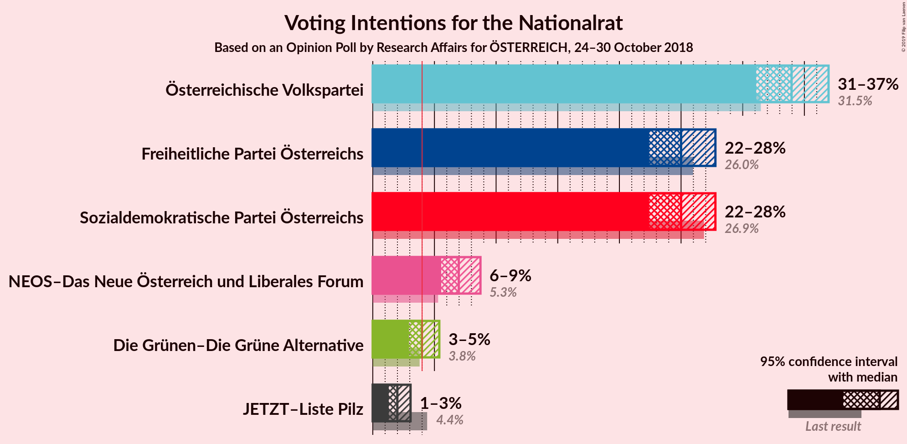
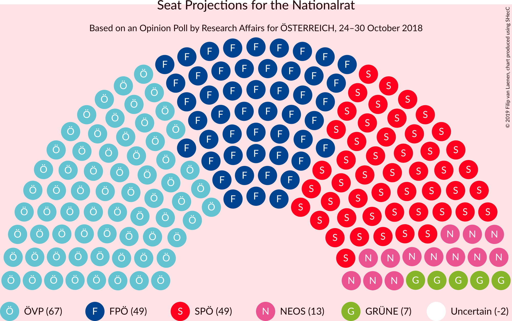
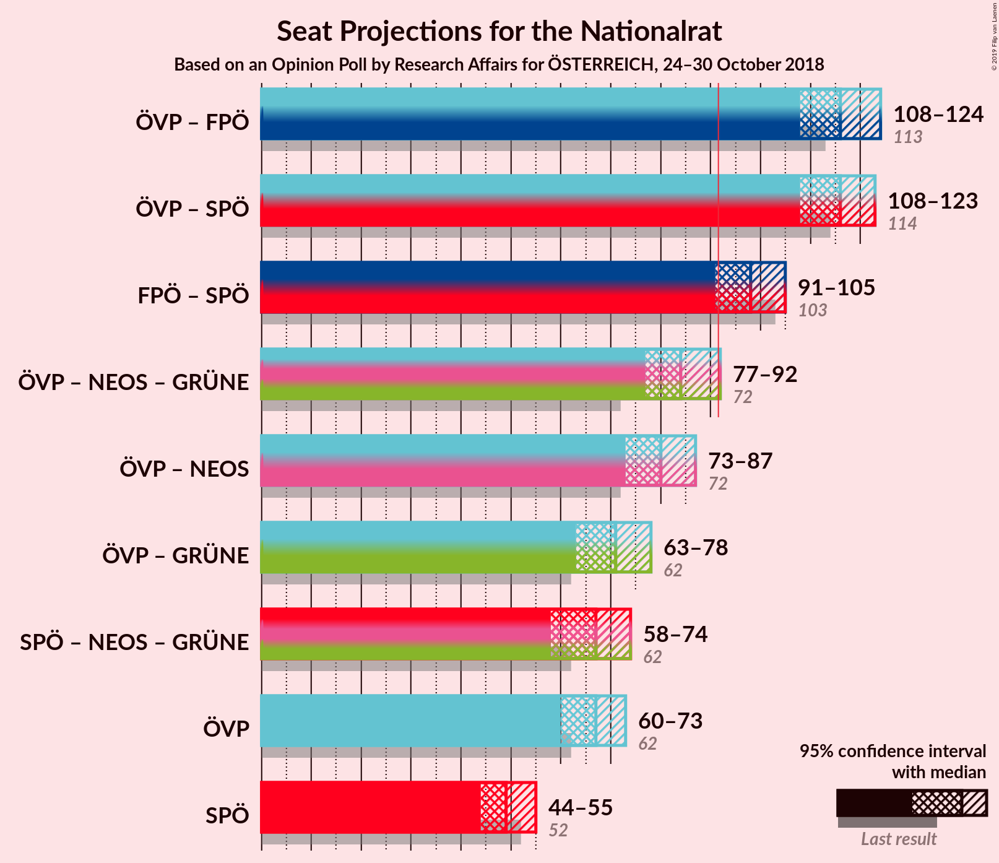
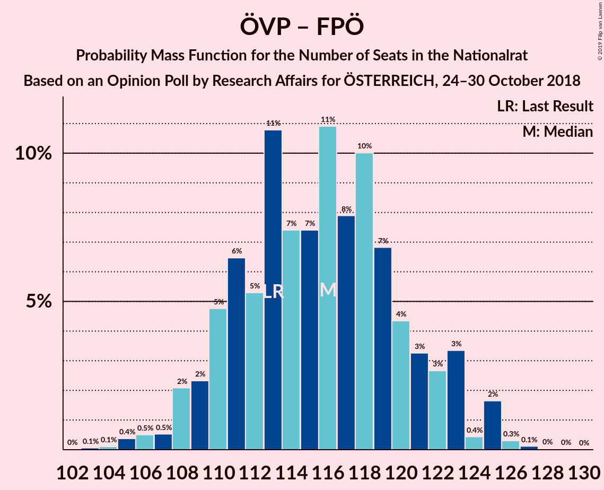
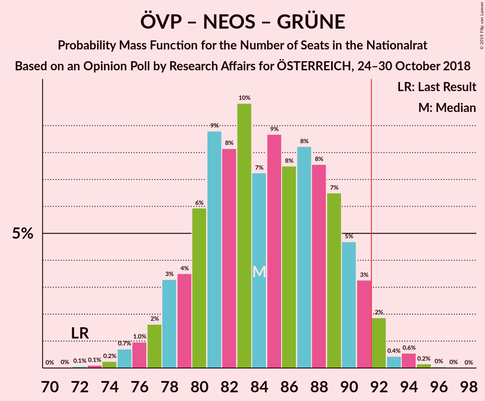
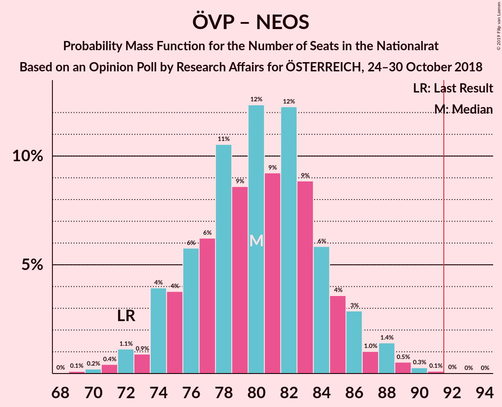
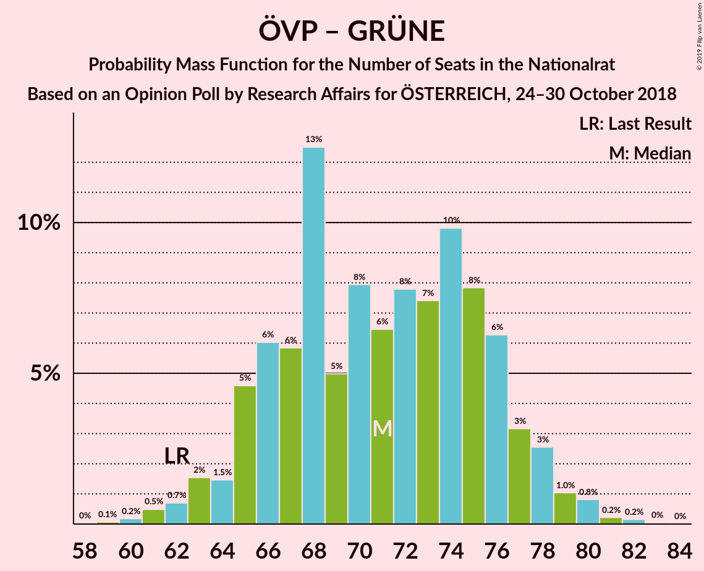
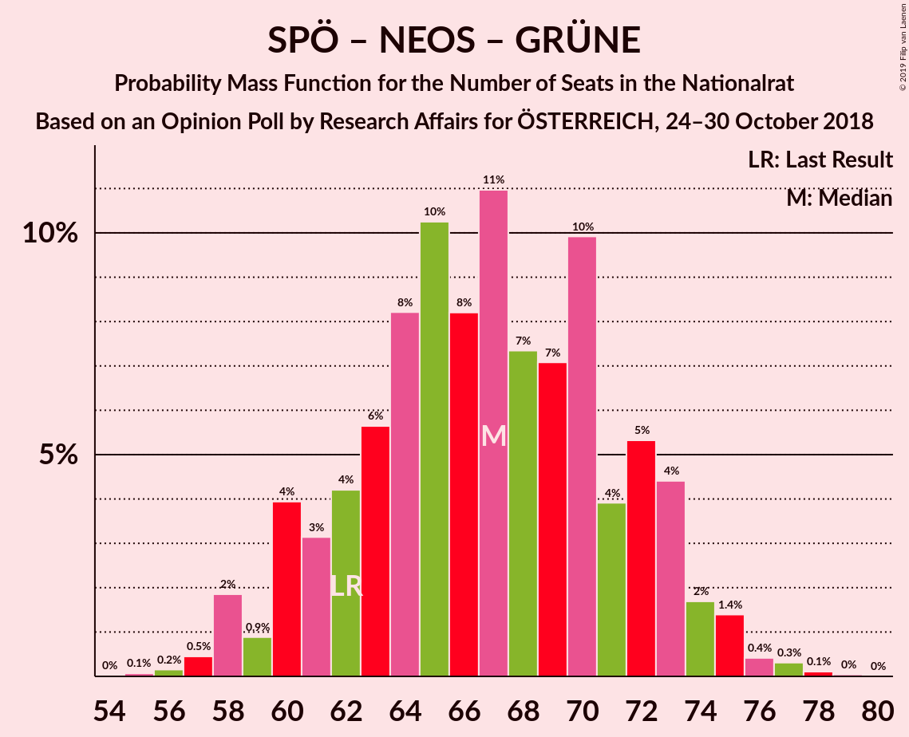

# Opinion Poll by Research Affairs for ÖSTERREICH, 24–30 October 2018

<a href="#voting-intentions">Voting Intentions</a> | <a href="#seats">Seats</a> | <a href="#coalitions">Coalitions</a> | <a href="#technical-information">Technical Information</a>

## Voting Intentions

### Confidence Intervals

| Party | Last Result | Poll Result | 80% Confidence Interval | 90% Confidence Interval | 95% Confidence Interval | 99% Confidence Interval |
|:-----:|:-----------:|:-----------:|:-----------------------:|:-----------------------:|:-----------------------:|:-----------------------:|
| Österreichische Volkspartei | 31.5% | 34.0% | 32.1–35.9% |31.6–36.5% |31.1–37.0% |30.2–37.9% |
| Sozialdemokratische Partei Österreichs | 26.9% | 25.0% | 23.3–26.8% |22.8–27.3% |22.4–27.8% |21.6–28.7% |
| Freiheitliche Partei Österreichs | 26.0% | 25.0% | 23.3–26.8% |22.8–27.3% |22.4–27.8% |21.6–28.7% |
| NEOS–Das Neue Österreich und Liberales Forum | 5.3% | 7.0% | 6.0–8.1% |5.8–8.4% |5.5–8.7% |5.1–9.3% |
| Die Grünen–Die Grüne Alternative | 3.8% | 4.0% | 3.3–4.9% |3.1–5.2% |2.9–5.4% |2.6–5.9% |
| JETZT–Liste Pilz | 4.4% | 2.0% | 1.5–2.7% |1.4–2.9% |1.3–3.1% |1.1–3.4% |

*Note:* The poll result column reflects the actual value used in the calculations. Published results may vary slightly, and in addition be rounded to fewer digits.

## Seats

### Confidence Intervals

| Party | Last Result | Median | 80% Confidence Interval | 90% Confidence Interval | 95% Confidence Interval | 99% Confidence Interval |
|:-----:|:-----------:|:------:|:-----------------------:|:-----------------------:|:-----------------------:|:-----------------------:|
| <a href="#österreichische-volkspartei">Österreichische Volkspartei</a> | 62 | 67 | 62–71 |61–72 |60–73 |58–75 |
| <a href="#sozialdemokratische-partei-österreichs">Sozialdemokratische Partei Österreichs</a> | 52 | 49 | 45–53 |44–54 |44–55 |42–57 |
| <a href="#freiheitliche-partei-österreichs">Freiheitliche Partei Österreichs</a> | 51 | 49 | 45–53 |44–54 |43–55 |42–56 |
| <a href="#neos–das-neue-österreich-und-liberales-forum">NEOS–Das Neue Österreich und Liberales Forum</a> | 10 | 13 | 11–16 |11–16 |11–17 |10–18 |
| <a href="#die-grünen–die-grüne-alternative">Die Grünen–Die Grüne Alternative</a> | 0 | 7 | 0–9 |0–10 |0–10 |0–11 |
| <a href="#jetzt–liste-pilz">JETZT–Liste Pilz</a> | 8 | 0 | 0 |0 |0 |0 |

### Österreichische Volkspartei

*For a full overview of the results for this party, see the [Österreichische Volkspartei](party-österreichischevolkspartei.html) page.*

| Number of Seats | Probability | Accumulated | Special Marks |
|:---------------:|:-----------:|:-----------:|:-------------:|
| 56 | 0% | 100% |  |
| 57 | 0.2% | 99.9% |  |
| 58 | 0.4% | 99.7% |  |
| 59 | 0.6% | 99.3% |  |
| 60 | 2% | 98.7% |  |
| 61 | 3% | 96% |  |
| 62 | 4% | 93% | Last Result |
| 63 | 6% | 89% |  |
| 64 | 8% | 83% |  |
| 65 | 9% | 74% |  |
| 66 | 11% | 65% |  |
| 67 | 14% | 55% | Median |
| 68 | 16% | 40% |  |
| 69 | 6% | 24% |  |
| 70 | 7% | 18% |  |
| 71 | 4% | 12% |  |
| 72 | 4% | 8% |  |
| 73 | 1.5% | 4% |  |
| 74 | 1.1% | 2% |  |
| 75 | 0.7% | 1.1% |  |
| 76 | 0.2% | 0.4% |  |
| 77 | 0.1% | 0.2% |  |
| 78 | 0% | 0.1% |  |
| 79 | 0% | 0% |  |

### Sozialdemokratische Partei Österreichs

*For a full overview of the results for this party, see the [Sozialdemokratische Partei Österreichs](party-sozialdemokratischeparteiösterreichs.html) page.*

| Number of Seats | Probability | Accumulated | Special Marks |
|:---------------:|:-----------:|:-----------:|:-------------:|
| 40 | 0.1% | 100% |  |
| 41 | 0.2% | 99.9% |  |
| 42 | 0.8% | 99.7% |  |
| 43 | 1.3% | 98.9% |  |
| 44 | 3% | 98% |  |
| 45 | 6% | 94% |  |
| 46 | 13% | 88% |  |
| 47 | 9% | 75% |  |
| 48 | 11% | 66% |  |
| 49 | 12% | 55% | Median |
| 50 | 14% | 43% |  |
| 51 | 9% | 29% |  |
| 52 | 5% | 20% | Last Result |
| 53 | 7% | 15% |  |
| 54 | 5% | 8% |  |
| 55 | 2% | 3% |  |
| 56 | 0.3% | 0.9% |  |
| 57 | 0.3% | 0.6% |  |
| 58 | 0.2% | 0.2% |  |
| 59 | 0% | 0.1% |  |
| 60 | 0% | 0% |  |

### Freiheitliche Partei Österreichs

*For a full overview of the results for this party, see the [Freiheitliche Partei Österreichs](party-freiheitlicheparteiösterreichs.html) page.*

| Number of Seats | Probability | Accumulated | Special Marks |
|:---------------:|:-----------:|:-----------:|:-------------:|
| 40 | 0.1% | 100% |  |
| 41 | 0.3% | 99.9% |  |
| 42 | 0.7% | 99.6% |  |
| 43 | 2% | 98.9% |  |
| 44 | 3% | 97% |  |
| 45 | 5% | 94% |  |
| 46 | 11% | 89% |  |
| 47 | 11% | 78% |  |
| 48 | 14% | 67% |  |
| 49 | 10% | 53% | Median |
| 50 | 9% | 43% |  |
| 51 | 15% | 34% | Last Result |
| 52 | 7% | 19% |  |
| 53 | 4% | 12% |  |
| 54 | 3% | 7% |  |
| 55 | 3% | 4% |  |
| 56 | 0.7% | 1.1% |  |
| 57 | 0.3% | 0.4% |  |
| 58 | 0.1% | 0.2% |  |
| 59 | 0.1% | 0.1% |  |
| 60 | 0% | 0% |  |

### NEOS–Das Neue Österreich und Liberales Forum

*For a full overview of the results for this party, see the [NEOS–Das Neue Österreich und Liberales Forum](party-neos–dasneueösterreichundliberalesforum.html) page.*

| Number of Seats | Probability | Accumulated | Special Marks |
|:---------------:|:-----------:|:-----------:|:-------------:|
| 9 | 0.4% | 100% |  |
| 10 | 2% | 99.6% | Last Result |
| 11 | 8% | 98% |  |
| 12 | 21% | 89% |  |
| 13 | 19% | 68% | Median |
| 14 | 21% | 48% |  |
| 15 | 15% | 28% |  |
| 16 | 10% | 13% |  |
| 17 | 2% | 3% |  |
| 18 | 0.6% | 0.8% |  |
| 19 | 0.2% | 0.3% |  |
| 20 | 0% | 0% |  |

### Die Grünen–Die Grüne Alternative

*For a full overview of the results for this party, see the [Die Grünen–Die Grüne Alternative](party-diegrünen–diegrünealternative.html) page.*

| Number of Seats | Probability | Accumulated | Special Marks |
|:---------------:|:-----------:|:-----------:|:-------------:|
| 0 | 47% | 100% | Last Result |
| 1 | 0% | 53% |  |
| 2 | 0% | 53% |  |
| 3 | 0% | 53% |  |
| 4 | 0% | 53% |  |
| 5 | 0% | 53% |  |
| 6 | 0% | 53% |  |
| 7 | 10% | 53% | Median |
| 8 | 23% | 42% |  |
| 9 | 14% | 19% |  |
| 10 | 4% | 5% |  |
| 11 | 0.8% | 0.9% |  |
| 12 | 0.1% | 0.1% |  |
| 13 | 0% | 0% |  |

### JETZT–Liste Pilz

*For a full overview of the results for this party, see the [JETZT–Liste Pilz](party-jetzt–listepilz.html) page.*

| Number of Seats | Probability | Accumulated | Special Marks |
|:---------------:|:-----------:|:-----------:|:-------------:|
| 0 | 100% | 100% | Median |
| 1 | 0% | 0% |  |
| 2 | 0% | 0% |  |
| 3 | 0% | 0% |  |
| 4 | 0% | 0% |  |
| 5 | 0% | 0% |  |
| 6 | 0% | 0% |  |
| 7 | 0% | 0% |  |
| 8 | 0% | 0% | Last Result |

## Coalitions

### Confidence Intervals

| Coalition | Last Result | Median | Majority? | 80% Confidence Interval | 90% Confidence Interval | 95% Confidence Interval | 99% Confidence Interval |
|:---------:|:-----------:|:------:|:---------:|:-----------------------:|:-----------------------:|:-----------------------:|:-----------------------:|
| Österreichische Volkspartei – Freiheitliche Partei Österreichs | 113 | 116 | 100% | 110–121 | 109–123 | 108–124 | 105–125 |
| Österreichische Volkspartei – Sozialdemokratische Partei Österreichs | 114 | 116 | 100% | 111–121 | 109–123 | 108–123 | 105–125 |
| Freiheitliche Partei Österreichs – Sozialdemokratische Partei Österreichs | 103 | 98 | 95% | 93–103 | 92–104 | 91–105 | 88–107 |
| Österreichische Volkspartei – NEOS–Das Neue Österreich und Liberales Forum – Die Grünen–Die Grüne Alternative | 72 | 84 | 3% | 79–90 | 78–91 | 77–92 | 75–94 |
| Österreichische Volkspartei – NEOS–Das Neue Österreich und Liberales Forum | 72 | 80 | 0.1% | 75–84 | 74–86 | 73–87 | 71–89 |
| Österreichische Volkspartei – Die Grünen–Die Grüne Alternative | 62 | 71 | 0% | 66–76 | 65–77 | 63–78 | 61–80 |
| Sozialdemokratische Partei Österreichs – NEOS–Das Neue Österreich und Liberales Forum – Die Grünen–Die Grüne Alternative | 62 | 67 | 0% | 61–72 | 60–73 | 58–74 | 57–76 |
| Österreichische Volkspartei | 62 | 67 | 0% | 62–71 | 61–72 | 60–73 | 58–75 |
| Sozialdemokratische Partei Österreichs | 52 | 49 | 0% | 45–53 | 44–54 | 44–55 | 42–57 |

### Österreichische Volkspartei – Freiheitliche Partei Österreichs

| Number of Seats | Probability | Accumulated | Special Marks |
|:---------------:|:-----------:|:-----------:|:-------------:|
| 102 | 0% | 100% |  |
| 103 | 0.1% | 99.9% |  |
| 104 | 0.1% | 99.9% |  |
| 105 | 0.4% | 99.8% |  |
| 106 | 0.5% | 99.4% |  |
| 107 | 0.5% | 98.9% |  |
| 108 | 2% | 98% |  |
| 109 | 2% | 96% |  |
| 110 | 5% | 94% |  |
| 111 | 6% | 89% |  |
| 112 | 5% | 83% |  |
| 113 | 11% | 77% | Last Result |
| 114 | 7% | 67% |  |
| 115 | 7% | 59% |  |
| 116 | 11% | 52% | Median |
| 117 | 8% | 41% |  |
| 118 | 10% | 33% |  |
| 119 | 7% | 23% |  |
| 120 | 4% | 16% |  |
| 121 | 3% | 12% |  |
| 122 | 3% | 9% |  |
| 123 | 3% | 6% |  |
| 124 | 0.4% | 3% |  |
| 125 | 2% | 2% |  |
| 126 | 0.3% | 0.5% |  |
| 127 | 0.1% | 0.2% |  |
| 128 | 0% | 0.1% |  |
| 129 | 0% | 0% |  |

### Österreichische Volkspartei – Sozialdemokratische Partei Österreichs

| Number of Seats | Probability | Accumulated | Special Marks |
|:---------------:|:-----------:|:-----------:|:-------------:|
| 102 | 0% | 100% |  |
| 103 | 0% | 99.9% |  |
| 104 | 0.1% | 99.9% |  |
| 105 | 0.4% | 99.8% |  |
| 106 | 1.2% | 99.4% |  |
| 107 | 0.6% | 98% |  |
| 108 | 0.9% | 98% |  |
| 109 | 2% | 97% |  |
| 110 | 3% | 95% |  |
| 111 | 10% | 92% |  |
| 112 | 7% | 82% |  |
| 113 | 9% | 75% |  |
| 114 | 8% | 65% | Last Result |
| 115 | 5% | 58% |  |
| 116 | 12% | 53% | Median |
| 117 | 10% | 41% |  |
| 118 | 8% | 31% |  |
| 119 | 6% | 23% |  |
| 120 | 3% | 17% |  |
| 121 | 4% | 14% |  |
| 122 | 3% | 10% |  |
| 123 | 4% | 6% |  |
| 124 | 2% | 2% |  |
| 125 | 0.3% | 0.6% |  |
| 126 | 0.2% | 0.3% |  |
| 127 | 0% | 0.1% |  |
| 128 | 0% | 0.1% |  |
| 129 | 0% | 0% |  |

### Freiheitliche Partei Österreichs – Sozialdemokratische Partei Österreichs

| Number of Seats | Probability | Accumulated | Special Marks |
|:---------------:|:-----------:|:-----------:|:-------------:|
| 86 | 0.1% | 100% |  |
| 87 | 0.2% | 99.9% |  |
| 88 | 0.5% | 99.7% |  |
| 89 | 0.7% | 99.2% |  |
| 90 | 0.6% | 98.6% |  |
| 91 | 3% | 98% |  |
| 92 | 4% | 95% | Majority |
| 93 | 5% | 92% |  |
| 94 | 8% | 86% |  |
| 95 | 8% | 78% |  |
| 96 | 9% | 70% |  |
| 97 | 9% | 62% |  |
| 98 | 9% | 53% | Median |
| 99 | 7% | 44% |  |
| 100 | 10% | 37% |  |
| 101 | 7% | 27% |  |
| 102 | 8% | 21% |  |
| 103 | 5% | 13% | Last Result |
| 104 | 3% | 7% |  |
| 105 | 2% | 4% |  |
| 106 | 1.3% | 2% |  |
| 107 | 0.6% | 1.1% |  |
| 108 | 0.3% | 0.5% |  |
| 109 | 0.1% | 0.2% |  |
| 110 | 0.1% | 0.1% |  |
| 111 | 0% | 0% |  |

### Österreichische Volkspartei – NEOS–Das Neue Österreich und Liberales Forum – Die Grünen–Die Grüne Alternative

| Number of Seats | Probability | Accumulated | Special Marks |
|:---------------:|:-----------:|:-----------:|:-------------:|
| 72 | 0.1% | 100% | Last Result |
| 73 | 0.1% | 99.9% |  |
| 74 | 0.2% | 99.8% |  |
| 75 | 0.7% | 99.6% |  |
| 76 | 1.0% | 98.9% |  |
| 77 | 2% | 98% |  |
| 78 | 3% | 96% |  |
| 79 | 4% | 93% |  |
| 80 | 6% | 89% |  |
| 81 | 9% | 84% |  |
| 82 | 8% | 75% |  |
| 83 | 10% | 67% |  |
| 84 | 7% | 57% |  |
| 85 | 9% | 50% |  |
| 86 | 8% | 41% |  |
| 87 | 8% | 33% | Median |
| 88 | 8% | 25% |  |
| 89 | 7% | 18% |  |
| 90 | 5% | 11% |  |
| 91 | 3% | 6% |  |
| 92 | 2% | 3% | Majority |
| 93 | 0.4% | 1.2% |  |
| 94 | 0.6% | 0.8% |  |
| 95 | 0.2% | 0.2% |  |
| 96 | 0% | 0.1% |  |
| 97 | 0% | 0% |  |

### Österreichische Volkspartei – NEOS–Das Neue Österreich und Liberales Forum

| Number of Seats | Probability | Accumulated | Special Marks |
|:---------------:|:-----------:|:-----------:|:-------------:|
| 69 | 0.1% | 100% |  |
| 70 | 0.2% | 99.9% |  |
| 71 | 0.4% | 99.7% |  |
| 72 | 1.1% | 99.2% | Last Result |
| 73 | 0.9% | 98% |  |
| 74 | 4% | 97% |  |
| 75 | 4% | 93% |  |
| 76 | 6% | 90% |  |
| 77 | 6% | 84% |  |
| 78 | 11% | 78% |  |
| 79 | 9% | 67% |  |
| 80 | 12% | 58% | Median |
| 81 | 9% | 46% |  |
| 82 | 12% | 37% |  |
| 83 | 9% | 25% |  |
| 84 | 6% | 16% |  |
| 85 | 4% | 10% |  |
| 86 | 3% | 6% |  |
| 87 | 1.0% | 3% |  |
| 88 | 1.4% | 2% |  |
| 89 | 0.5% | 1.0% |  |
| 90 | 0.3% | 0.4% |  |
| 91 | 0.1% | 0.2% |  |
| 92 | 0% | 0.1% | Majority |
| 93 | 0% | 0% |  |

### Österreichische Volkspartei – Die Grünen–Die Grüne Alternative

| Number of Seats | Probability | Accumulated | Special Marks |
|:---------------:|:-----------:|:-----------:|:-------------:|
| 59 | 0.1% | 100% |  |
| 60 | 0.2% | 99.9% |  |
| 61 | 0.5% | 99.7% |  |
| 62 | 0.7% | 99.2% | Last Result |
| 63 | 2% | 98.5% |  |
| 64 | 1.5% | 97% |  |
| 65 | 5% | 96% |  |
| 66 | 6% | 91% |  |
| 67 | 6% | 85% |  |
| 68 | 13% | 79% |  |
| 69 | 5% | 67% |  |
| 70 | 8% | 62% |  |
| 71 | 6% | 54% |  |
| 72 | 8% | 47% |  |
| 73 | 7% | 39% |  |
| 74 | 10% | 32% | Median |
| 75 | 8% | 22% |  |
| 76 | 6% | 14% |  |
| 77 | 3% | 8% |  |
| 78 | 3% | 5% |  |
| 79 | 1.0% | 2% |  |
| 80 | 0.8% | 1.2% |  |
| 81 | 0.2% | 0.4% |  |
| 82 | 0.2% | 0.2% |  |
| 83 | 0% | 0.1% |  |
| 84 | 0% | 0% |  |

### Sozialdemokratische Partei Österreichs – NEOS–Das Neue Österreich und Liberales Forum – Die Grünen–Die Grüne Alternative

| Number of Seats | Probability | Accumulated | Special Marks |
|:---------------:|:-----------:|:-----------:|:-------------:|
| 55 | 0.1% | 100% |  |
| 56 | 0.2% | 99.9% |  |
| 57 | 0.5% | 99.7% |  |
| 58 | 2% | 99.3% |  |
| 59 | 0.9% | 97% |  |
| 60 | 4% | 97% |  |
| 61 | 3% | 93% |  |
| 62 | 4% | 89% | Last Result |
| 63 | 6% | 85% |  |
| 64 | 8% | 80% |  |
| 65 | 10% | 71% |  |
| 66 | 8% | 61% |  |
| 67 | 11% | 53% |  |
| 68 | 7% | 42% |  |
| 69 | 7% | 35% | Median |
| 70 | 10% | 28% |  |
| 71 | 4% | 18% |  |
| 72 | 5% | 14% |  |
| 73 | 4% | 8% |  |
| 74 | 2% | 4% |  |
| 75 | 1.4% | 2% |  |
| 76 | 0.4% | 0.9% |  |
| 77 | 0.3% | 0.5% |  |
| 78 | 0.1% | 0.2% |  |
| 79 | 0% | 0.1% |  |
| 80 | 0% | 0% |  |

### Österreichische Volkspartei

| Number of Seats | Probability | Accumulated | Special Marks |
|:---------------:|:-----------:|:-----------:|:-------------:|
| 56 | 0% | 100% |  |
| 57 | 0.2% | 99.9% |  |
| 58 | 0.4% | 99.7% |  |
| 59 | 0.6% | 99.3% |  |
| 60 | 2% | 98.7% |  |
| 61 | 3% | 96% |  |
| 62 | 4% | 93% | Last Result |
| 63 | 6% | 89% |  |
| 64 | 8% | 83% |  |
| 65 | 9% | 74% |  |
| 66 | 11% | 65% |  |
| 67 | 14% | 55% | Median |
| 68 | 16% | 40% |  |
| 69 | 6% | 24% |  |
| 70 | 7% | 18% |  |
| 71 | 4% | 12% |  |
| 72 | 4% | 8% |  |
| 73 | 1.5% | 4% |  |
| 74 | 1.1% | 2% |  |
| 75 | 0.7% | 1.1% |  |
| 76 | 0.2% | 0.4% |  |
| 77 | 0.1% | 0.2% |  |
| 78 | 0% | 0.1% |  |
| 79 | 0% | 0% |  |

### Sozialdemokratische Partei Österreichs

| Number of Seats | Probability | Accumulated | Special Marks |
|:---------------:|:-----------:|:-----------:|:-------------:|
| 40 | 0.1% | 100% |  |
| 41 | 0.2% | 99.9% |  |
| 42 | 0.8% | 99.7% |  |
| 43 | 1.3% | 98.9% |  |
| 44 | 3% | 98% |  |
| 45 | 6% | 94% |  |
| 46 | 13% | 88% |  |
| 47 | 9% | 75% |  |
| 48 | 11% | 66% |  |
| 49 | 12% | 55% | Median |
| 50 | 14% | 43% |  |
| 51 | 9% | 29% |  |
| 52 | 5% | 20% | Last Result |
| 53 | 7% | 15% |  |
| 54 | 5% | 8% |  |
| 55 | 2% | 3% |  |
| 56 | 0.3% | 0.9% |  |
| 57 | 0.3% | 0.6% |  |
| 58 | 0.2% | 0.2% |  |
| 59 | 0% | 0.1% |  |
| 60 | 0% | 0% |  |

## Technical Information

### Opinion Poll

+ **Polling firm:** Research Affairs
+ **Commissioner(s):** ÖSTERREICH
+ **Fieldwork period:** 24–30 October 2018

### Calculations

+ **Sample size:** 1004
+ **Simulations done:** 131,072
+ **Error estimate:** 2.30%

