# Opinion Poll by Research Affairs for ÖSTERREICH, 3–9 January 2019

<a href="#voting-intentions">Voting Intentions</a> | <a href="#seats">Seats</a> | <a href="#coalitions">Coalitions</a> | <a href="#technical-information">Technical Information</a>

## Voting Intentions

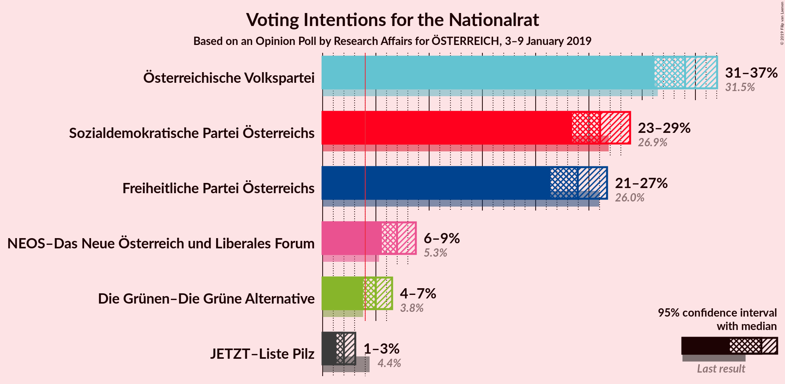

### Confidence Intervals

| Party | Last Result | Poll Result | 80% Confidence Interval | 90% Confidence Interval | 95% Confidence Interval | 99% Confidence Interval |
|:-----:|:-----------:|:-----------:|:-----------------------:|:-----------------------:|:-----------------------:|:-----------------------:|
| Österreichische Volkspartei | 31.5% | 34.0% | 32.1–36.0% |31.6–36.5% |31.2–37.0% |30.3–38.0% |
| Sozialdemokratische Partei Österreichs | 26.9% | 26.0% | 24.3–27.9% |23.8–28.4% |23.4–28.9% |22.6–29.8% |
| Freiheitliche Partei Österreichs | 26.0% | 24.0% | 22.3–25.7% |21.8–26.3% |21.4–26.7% |20.6–27.6% |
| NEOS–Das Neue Österreich und Liberales Forum | 5.3% | 7.0% | 6.1–8.1% |5.8–8.5% |5.6–8.7% |5.1–9.3% |
| Die Grünen–Die Grüne Alternative | 3.8% | 5.0% | 4.2–6.0% |4.0–6.3% |3.8–6.5% |3.5–7.0% |
| JETZT–Liste Pilz | 4.4% | 2.0% | 1.5–2.7% |1.4–2.9% |1.3–3.1% |1.1–3.4% |

*Note:* The poll result column reflects the actual value used in the calculations. Published results may vary slightly, and in addition be rounded to fewer digits.

## Seats

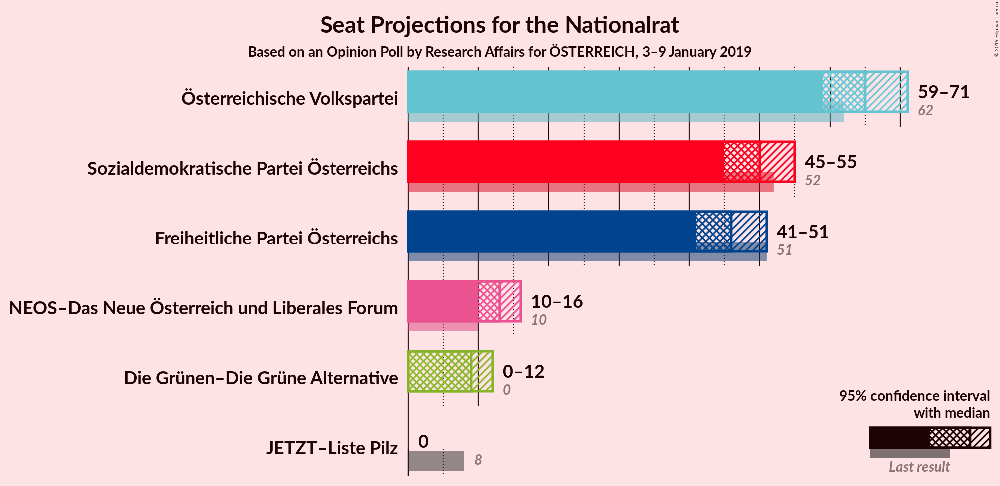

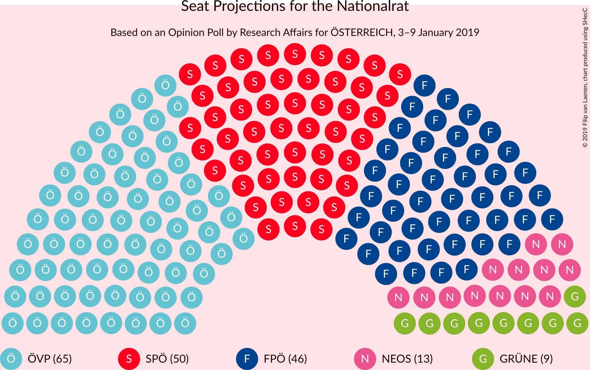

### Confidence Intervals

| Party | Last Result | Median | 80% Confidence Interval | 90% Confidence Interval | 95% Confidence Interval | 99% Confidence Interval |
|:-----:|:-----------:|:------:|:-----------------------:|:-----------------------:|:-----------------------:|:-----------------------:|
| <a href="#österreichische-volkspartei">Österreichische Volkspartei</a> | 62 | 65 | 62–69 |60–70 |59–71 |58–74 |
| <a href="#sozialdemokratische-partei-österreichs">Sozialdemokratische Partei Österreichs</a> | 52 | 50 | 47–53 |46–54 |45–55 |43–57 |
| <a href="#freiheitliche-partei-österreichs">Freiheitliche Partei Österreichs</a> | 51 | 46 | 42–49 |42–50 |41–51 |39–53 |
| <a href="#neos–das-neue-österreich-und-liberales-forum">NEOS–Das Neue Österreich und Liberales Forum</a> | 10 | 13 | 11–15 |11–16 |10–16 |9–17 |
| <a href="#die-grünen–die-grüne-alternative">Die Grünen–Die Grüne Alternative</a> | 0 | 9 | 8–11 |7–11 |0–12 |0–13 |
| <a href="#jetzt–liste-pilz">JETZT–Liste Pilz</a> | 8 | 0 | 0 |0 |0 |0 |

### Österreichische Volkspartei

*For a full overview of the results for this party, see the [Österreichische Volkspartei](party-österreichischevolkspartei.html) page.*

| Number of Seats | Probability | Accumulated | Special Marks |
|:---------------:|:-----------:|:-----------:|:-------------:|
| 56 | 0.1% | 100% |  |
| 57 | 0.2% | 99.9% |  |
| 58 | 0.6% | 99.7% |  |
| 59 | 2% | 99.1% |  |
| 60 | 3% | 97% |  |
| 61 | 3% | 94% |  |
| 62 | 7% | 91% | Last Result |
| 63 | 13% | 83% |  |
| 64 | 12% | 70% |  |
| 65 | 13% | 58% | Median |
| 66 | 13% | 45% |  |
| 67 | 10% | 32% |  |
| 68 | 9% | 22% |  |
| 69 | 5% | 13% |  |
| 70 | 4% | 7% |  |
| 71 | 1.3% | 4% |  |
| 72 | 1.5% | 2% |  |
| 73 | 0.4% | 0.9% |  |
| 74 | 0.4% | 0.6% |  |
| 75 | 0.1% | 0.2% |  |
| 76 | 0.1% | 0.1% |  |
| 77 | 0% | 0% |  |

### Sozialdemokratische Partei Österreichs

*For a full overview of the results for this party, see the [Sozialdemokratische Partei Österreichs](party-sozialdemokratischeparteiösterreichs.html) page.*

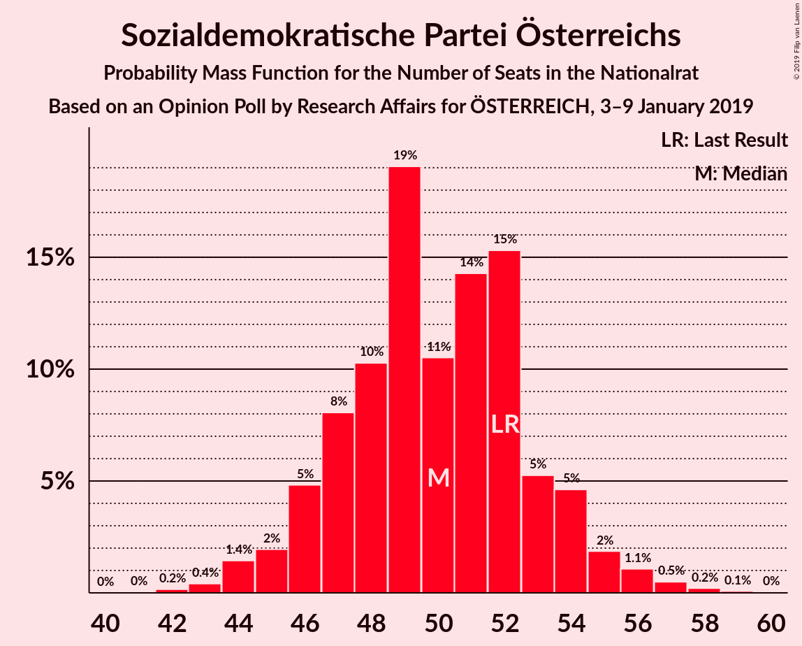

| Number of Seats | Probability | Accumulated | Special Marks |
|:---------------:|:-----------:|:-----------:|:-------------:|
| 41 | 0% | 100% |  |
| 42 | 0.2% | 99.9% |  |
| 43 | 0.4% | 99.8% |  |
| 44 | 1.4% | 99.4% |  |
| 45 | 2% | 98% |  |
| 46 | 5% | 96% |  |
| 47 | 8% | 91% |  |
| 48 | 10% | 83% |  |
| 49 | 19% | 73% |  |
| 50 | 11% | 54% | Median |
| 51 | 14% | 43% |  |
| 52 | 15% | 29% | Last Result |
| 53 | 5% | 14% |  |
| 54 | 5% | 8% |  |
| 55 | 2% | 4% |  |
| 56 | 1.1% | 2% |  |
| 57 | 0.5% | 0.8% |  |
| 58 | 0.2% | 0.3% |  |
| 59 | 0.1% | 0.1% |  |
| 60 | 0% | 0% |  |

### Freiheitliche Partei Österreichs

*For a full overview of the results for this party, see the [Freiheitliche Partei Österreichs](party-freiheitlicheparteiösterreichs.html) page.*

| Number of Seats | Probability | Accumulated | Special Marks |
|:---------------:|:-----------:|:-----------:|:-------------:|
| 38 | 0.2% | 100% |  |
| 39 | 0.4% | 99.8% |  |
| 40 | 1.2% | 99.4% |  |
| 41 | 3% | 98% |  |
| 42 | 6% | 95% |  |
| 43 | 9% | 90% |  |
| 44 | 12% | 81% |  |
| 45 | 13% | 69% |  |
| 46 | 17% | 55% | Median |
| 47 | 12% | 39% |  |
| 48 | 10% | 26% |  |
| 49 | 8% | 16% |  |
| 50 | 5% | 8% |  |
| 51 | 2% | 4% | Last Result |
| 52 | 1.2% | 2% |  |
| 53 | 0.5% | 0.8% |  |
| 54 | 0.2% | 0.3% |  |
| 55 | 0.1% | 0.1% |  |
| 56 | 0% | 0% |  |

### NEOS–Das Neue Österreich und Liberales Forum

*For a full overview of the results for this party, see the [NEOS–Das Neue Österreich und Liberales Forum](party-neos–dasneueösterreichundliberalesforum.html) page.*

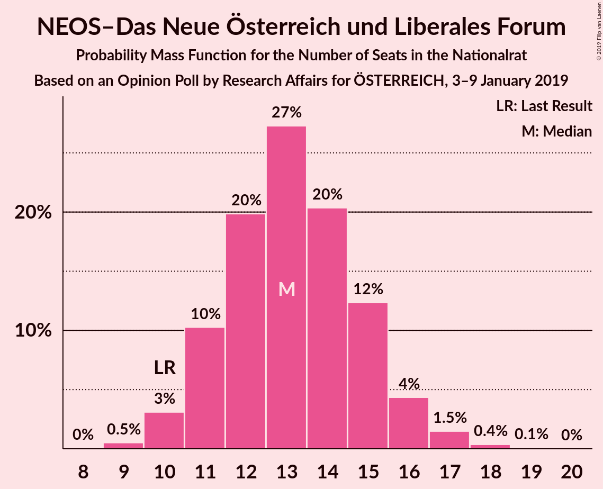

| Number of Seats | Probability | Accumulated | Special Marks |
|:---------------:|:-----------:|:-----------:|:-------------:|
| 9 | 0.5% | 100% |  |
| 10 | 3% | 99.4% | Last Result |
| 11 | 10% | 96% |  |
| 12 | 20% | 86% |  |
| 13 | 27% | 66% | Median |
| 14 | 20% | 39% |  |
| 15 | 12% | 19% |  |
| 16 | 4% | 6% |  |
| 17 | 1.5% | 2% |  |
| 18 | 0.4% | 0.5% |  |
| 19 | 0.1% | 0.1% |  |
| 20 | 0% | 0% |  |

### Die Grünen–Die Grüne Alternative

*For a full overview of the results for this party, see the [Die Grünen–Die Grüne Alternative](party-diegrünen–diegrünealternative.html) page.*

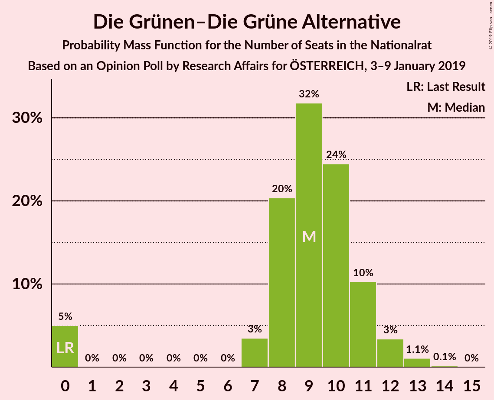

| Number of Seats | Probability | Accumulated | Special Marks |
|:---------------:|:-----------:|:-----------:|:-------------:|
| 0 | 5% | 100% | Last Result |
| 1 | 0% | 95% |  |
| 2 | 0% | 95% |  |
| 3 | 0% | 95% |  |
| 4 | 0% | 95% |  |
| 5 | 0% | 95% |  |
| 6 | 0% | 95% |  |
| 7 | 3% | 95% |  |
| 8 | 20% | 92% |  |
| 9 | 32% | 71% | Median |
| 10 | 24% | 39% |  |
| 11 | 10% | 15% |  |
| 12 | 3% | 5% |  |
| 13 | 1.1% | 1.2% |  |
| 14 | 0.1% | 0.2% |  |
| 15 | 0% | 0% |  |

### JETZT–Liste Pilz

*For a full overview of the results for this party, see the [JETZT–Liste Pilz](party-jetzt–listepilz.html) page.*

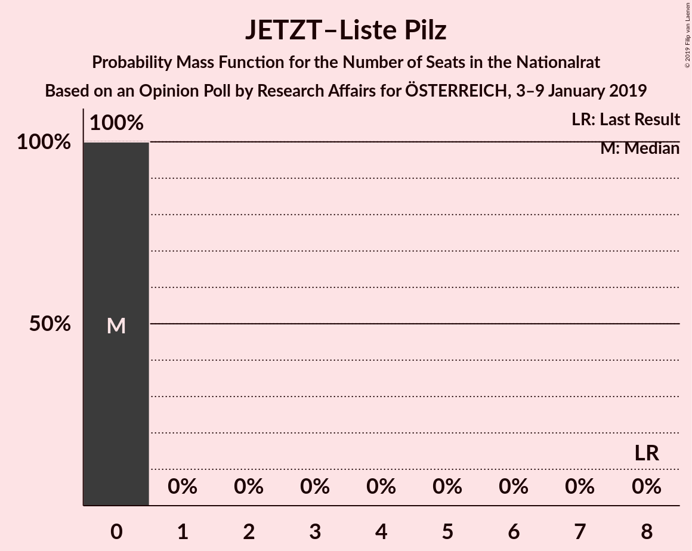

| Number of Seats | Probability | Accumulated | Special Marks |
|:---------------:|:-----------:|:-----------:|:-------------:|
| 0 | 100% | 100% | Median |
| 1 | 0% | 0% |  |
| 2 | 0% | 0% |  |
| 3 | 0% | 0% |  |
| 4 | 0% | 0% |  |
| 5 | 0% | 0% |  |
| 6 | 0% | 0% |  |
| 7 | 0% | 0% |  |
| 8 | 0% | 0% | Last Result |

## Coalitions

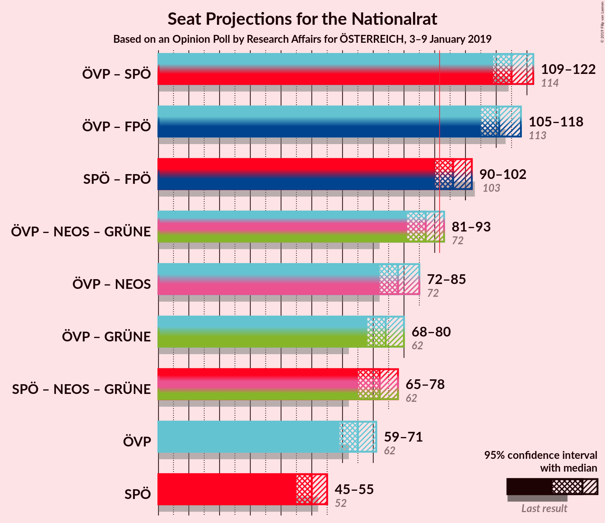

### Confidence Intervals

| Coalition | Last Result | Median | Majority? | 80% Confidence Interval | 90% Confidence Interval | 95% Confidence Interval | 99% Confidence Interval |
|:---------:|:-----------:|:------:|:---------:|:-----------------------:|:-----------------------:|:-----------------------:|:-----------------------:|
| Österreichische Volkspartei – Sozialdemokratische Partei Österreichs | 114 | 115 | 100% | 111–119 | 110–120 | 109–122 | 107–125 |
| Österreichische Volkspartei – Freiheitliche Partei Österreichs | 113 | 111 | 100% | 107–115 | 106–117 | 105–118 | 103–121 |
| Sozialdemokratische Partei Österreichs – Freiheitliche Partei Österreichs | 103 | 96 | 92% | 92–99 | 91–101 | 90–102 | 88–104 |
| Österreichische Volkspartei – NEOS–Das Neue Österreich und Liberales Forum – Die Grünen–Die Grüne Alternative | 72 | 87 | 8% | 84–91 | 82–92 | 81–93 | 79–95 |
| Österreichische Volkspartei – NEOS–Das Neue Österreich und Liberales Forum | 72 | 78 | 0% | 75–82 | 73–83 | 72–85 | 71–87 |
| Österreichische Volkspartei – Die Grünen–Die Grüne Alternative | 62 | 74 | 0% | 70–78 | 69–79 | 68–80 | 66–82 |
| Sozialdemokratische Partei Österreichs – NEOS–Das Neue Österreich und Liberales Forum – Die Grünen–Die Grüne Alternative | 62 | 72 | 0% | 68–76 | 66–77 | 65–78 | 62–80 |
| Österreichische Volkspartei | 62 | 65 | 0% | 62–69 | 60–70 | 59–71 | 58–74 |
| Sozialdemokratische Partei Österreichs | 52 | 50 | 0% | 47–53 | 46–54 | 45–55 | 43–57 |

### Österreichische Volkspartei – Sozialdemokratische Partei Österreichs

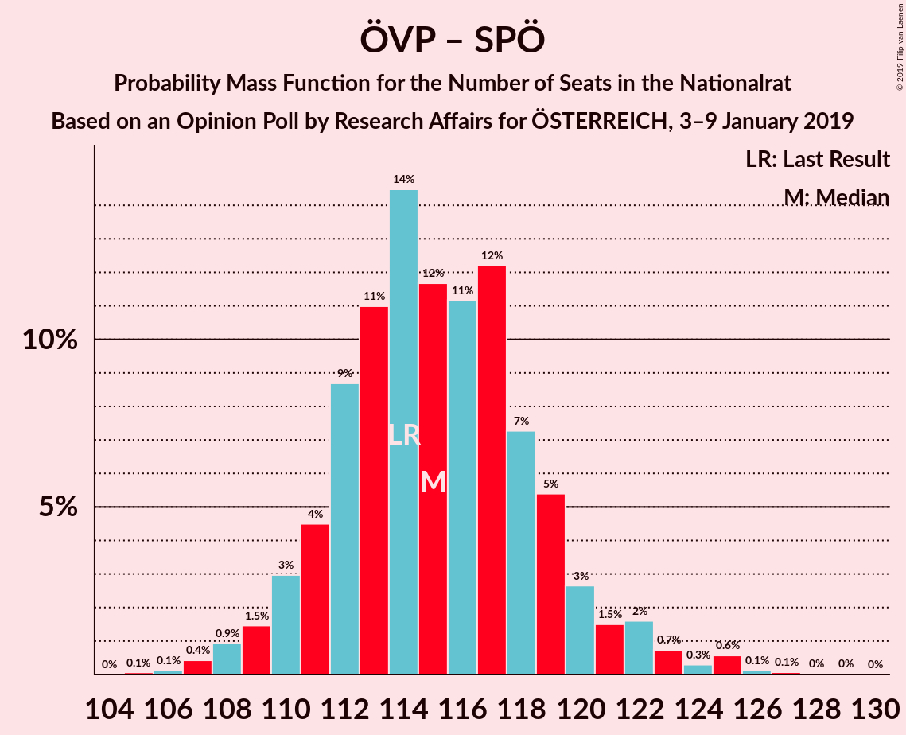

| Number of Seats | Probability | Accumulated | Special Marks |
|:---------------:|:-----------:|:-----------:|:-------------:|
| 105 | 0.1% | 100% |  |
| 106 | 0.1% | 99.9% |  |
| 107 | 0.4% | 99.8% |  |
| 108 | 0.9% | 99.4% |  |
| 109 | 1.5% | 98% |  |
| 110 | 3% | 97% |  |
| 111 | 4% | 94% |  |
| 112 | 9% | 89% |  |
| 113 | 11% | 81% |  |
| 114 | 14% | 70% | Last Result |
| 115 | 12% | 55% | Median |
| 116 | 11% | 44% |  |
| 117 | 12% | 32% |  |
| 118 | 7% | 20% |  |
| 119 | 5% | 13% |  |
| 120 | 3% | 8% |  |
| 121 | 1.5% | 5% |  |
| 122 | 2% | 3% |  |
| 123 | 0.7% | 2% |  |
| 124 | 0.3% | 1.1% |  |
| 125 | 0.6% | 0.8% |  |
| 126 | 0.1% | 0.3% |  |
| 127 | 0.1% | 0.1% |  |
| 128 | 0% | 0.1% |  |
| 129 | 0% | 0% |  |

### Österreichische Volkspartei – Freiheitliche Partei Österreichs

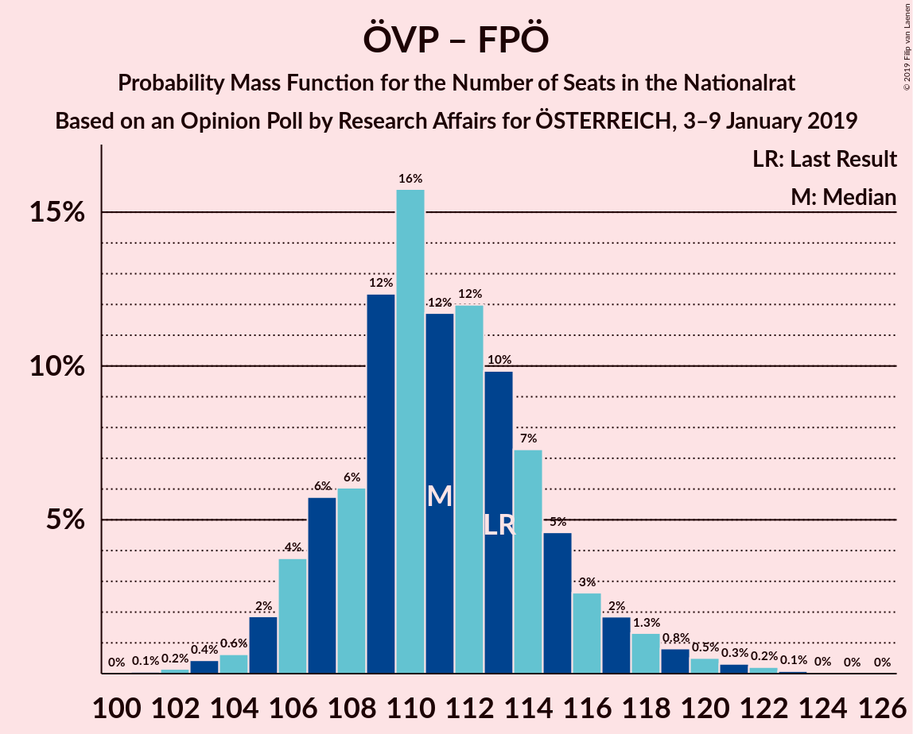

| Number of Seats | Probability | Accumulated | Special Marks |
|:---------------:|:-----------:|:-----------:|:-------------:|
| 101 | 0.1% | 100% |  |
| 102 | 0.2% | 99.9% |  |
| 103 | 0.4% | 99.8% |  |
| 104 | 0.6% | 99.3% |  |
| 105 | 2% | 98.7% |  |
| 106 | 4% | 97% |  |
| 107 | 6% | 93% |  |
| 108 | 6% | 87% |  |
| 109 | 12% | 81% |  |
| 110 | 16% | 69% |  |
| 111 | 12% | 53% | Median |
| 112 | 12% | 41% |  |
| 113 | 10% | 30% | Last Result |
| 114 | 7% | 20% |  |
| 115 | 5% | 12% |  |
| 116 | 3% | 8% |  |
| 117 | 2% | 5% |  |
| 118 | 1.3% | 3% |  |
| 119 | 0.8% | 2% |  |
| 120 | 0.5% | 1.2% |  |
| 121 | 0.3% | 0.7% |  |
| 122 | 0.2% | 0.3% |  |
| 123 | 0.1% | 0.1% |  |
| 124 | 0% | 0.1% |  |
| 125 | 0% | 0% |  |

### Sozialdemokratische Partei Österreichs – Freiheitliche Partei Österreichs

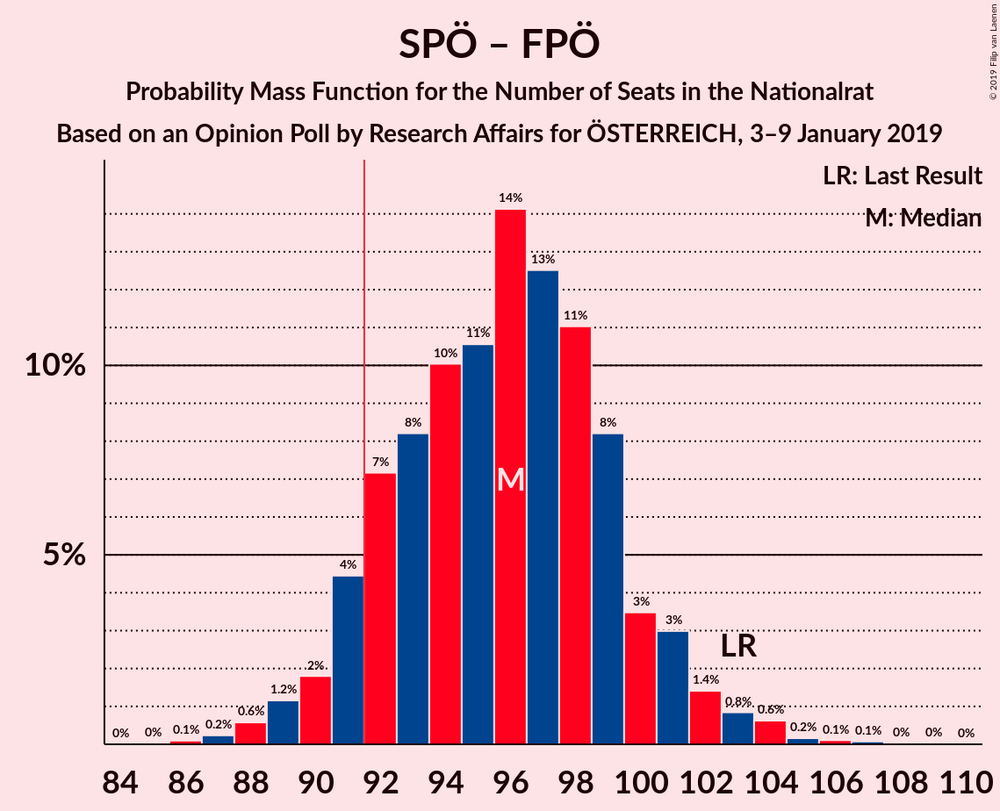

| Number of Seats | Probability | Accumulated | Special Marks |
|:---------------:|:-----------:|:-----------:|:-------------:|
| 86 | 0.1% | 100% |  |
| 87 | 0.2% | 99.9% |  |
| 88 | 0.6% | 99.6% |  |
| 89 | 1.2% | 99.1% |  |
| 90 | 2% | 98% |  |
| 91 | 4% | 96% |  |
| 92 | 7% | 92% | Majority |
| 93 | 8% | 84% |  |
| 94 | 10% | 76% |  |
| 95 | 11% | 66% |  |
| 96 | 14% | 56% | Median |
| 97 | 13% | 42% |  |
| 98 | 11% | 29% |  |
| 99 | 8% | 18% |  |
| 100 | 3% | 10% |  |
| 101 | 3% | 6% |  |
| 102 | 1.4% | 3% |  |
| 103 | 0.8% | 2% | Last Result |
| 104 | 0.6% | 1.0% |  |
| 105 | 0.2% | 0.4% |  |
| 106 | 0.1% | 0.3% |  |
| 107 | 0.1% | 0.1% |  |
| 108 | 0% | 0.1% |  |
| 109 | 0% | 0% |  |

### Österreichische Volkspartei – NEOS–Das Neue Österreich und Liberales Forum – Die Grünen–Die Grüne Alternative

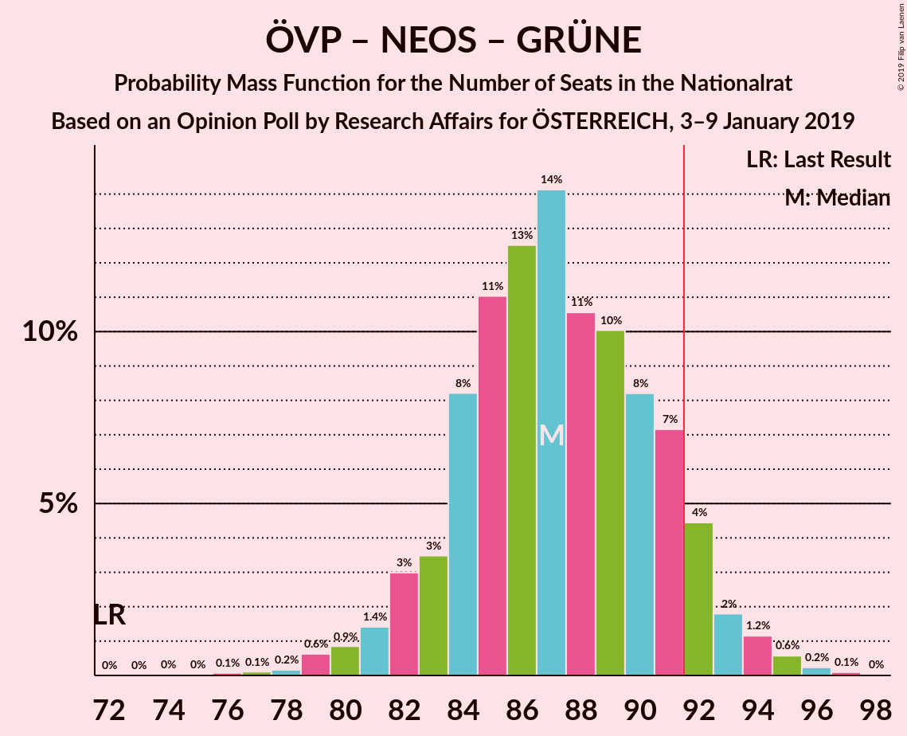

| Number of Seats | Probability | Accumulated | Special Marks |
|:---------------:|:-----------:|:-----------:|:-------------:|
| 72 | 0% | 100% | Last Result |
| 73 | 0% | 100% |  |
| 74 | 0% | 100% |  |
| 75 | 0% | 100% |  |
| 76 | 0.1% | 99.9% |  |
| 77 | 0.1% | 99.9% |  |
| 78 | 0.2% | 99.7% |  |
| 79 | 0.6% | 99.6% |  |
| 80 | 0.9% | 99.0% |  |
| 81 | 1.4% | 98% |  |
| 82 | 3% | 97% |  |
| 83 | 3% | 94% |  |
| 84 | 8% | 90% |  |
| 85 | 11% | 82% |  |
| 86 | 13% | 71% |  |
| 87 | 14% | 58% | Median |
| 88 | 11% | 44% |  |
| 89 | 10% | 34% |  |
| 90 | 8% | 24% |  |
| 91 | 7% | 16% |  |
| 92 | 4% | 8% | Majority |
| 93 | 2% | 4% |  |
| 94 | 1.2% | 2% |  |
| 95 | 0.6% | 0.9% |  |
| 96 | 0.2% | 0.4% |  |
| 97 | 0.1% | 0.1% |  |
| 98 | 0% | 0% |  |

### Österreichische Volkspartei – NEOS–Das Neue Österreich und Liberales Forum

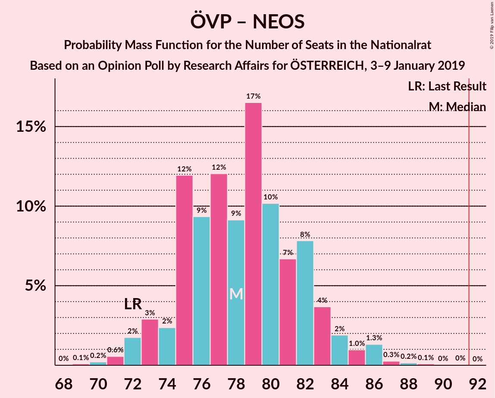

| Number of Seats | Probability | Accumulated | Special Marks |
|:---------------:|:-----------:|:-----------:|:-------------:|
| 69 | 0.1% | 100% |  |
| 70 | 0.2% | 99.9% |  |
| 71 | 0.6% | 99.7% |  |
| 72 | 2% | 99.1% | Last Result |
| 73 | 3% | 97% |  |
| 74 | 2% | 94% |  |
| 75 | 12% | 92% |  |
| 76 | 9% | 80% |  |
| 77 | 12% | 71% |  |
| 78 | 9% | 59% | Median |
| 79 | 17% | 50% |  |
| 80 | 10% | 33% |  |
| 81 | 7% | 23% |  |
| 82 | 8% | 16% |  |
| 83 | 4% | 8% |  |
| 84 | 2% | 5% |  |
| 85 | 1.0% | 3% |  |
| 86 | 1.3% | 2% |  |
| 87 | 0.3% | 0.6% |  |
| 88 | 0.2% | 0.3% |  |
| 89 | 0.1% | 0.2% |  |
| 90 | 0% | 0.1% |  |
| 91 | 0% | 0% |  |

### Österreichische Volkspartei – Die Grünen–Die Grüne Alternative

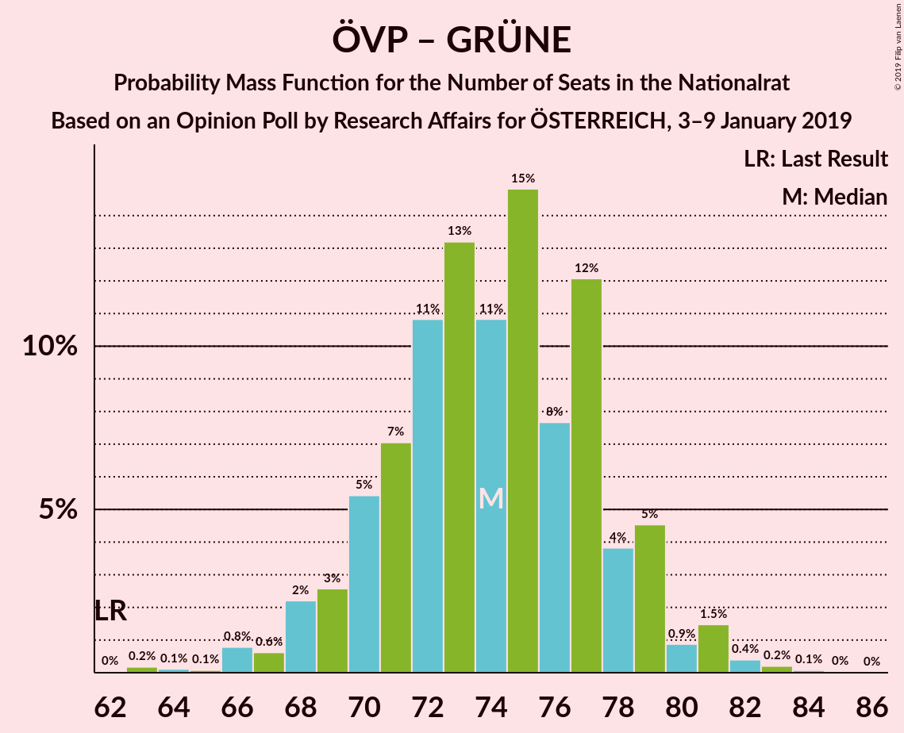

| Number of Seats | Probability | Accumulated | Special Marks |
|:---------------:|:-----------:|:-----------:|:-------------:|
| 62 | 0% | 100% | Last Result |
| 63 | 0.2% | 99.9% |  |
| 64 | 0.1% | 99.7% |  |
| 65 | 0.1% | 99.6% |  |
| 66 | 0.8% | 99.5% |  |
| 67 | 0.6% | 98.8% |  |
| 68 | 2% | 98% |  |
| 69 | 3% | 96% |  |
| 70 | 5% | 93% |  |
| 71 | 7% | 88% |  |
| 72 | 11% | 81% |  |
| 73 | 13% | 70% |  |
| 74 | 11% | 57% | Median |
| 75 | 15% | 46% |  |
| 76 | 8% | 31% |  |
| 77 | 12% | 24% |  |
| 78 | 4% | 11% |  |
| 79 | 5% | 8% |  |
| 80 | 0.9% | 3% |  |
| 81 | 1.5% | 2% |  |
| 82 | 0.4% | 0.7% |  |
| 83 | 0.2% | 0.3% |  |
| 84 | 0.1% | 0.1% |  |
| 85 | 0% | 0% |  |

### Sozialdemokratische Partei Österreichs – NEOS–Das Neue Österreich und Liberales Forum – Die Grünen–Die Grüne Alternative

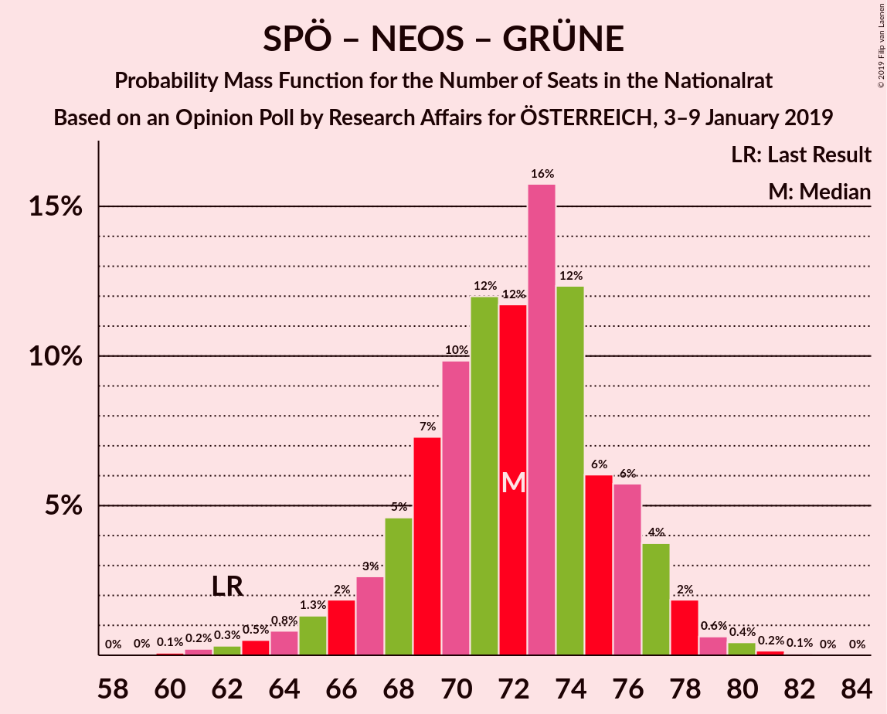

| Number of Seats | Probability | Accumulated | Special Marks |
|:---------------:|:-----------:|:-----------:|:-------------:|
| 59 | 0% | 100% |  |
| 60 | 0.1% | 99.9% |  |
| 61 | 0.2% | 99.9% |  |
| 62 | 0.3% | 99.7% | Last Result |
| 63 | 0.5% | 99.3% |  |
| 64 | 0.8% | 98.8% |  |
| 65 | 1.3% | 98% |  |
| 66 | 2% | 97% |  |
| 67 | 3% | 95% |  |
| 68 | 5% | 92% |  |
| 69 | 7% | 88% |  |
| 70 | 10% | 80% |  |
| 71 | 12% | 70% |  |
| 72 | 12% | 58% | Median |
| 73 | 16% | 47% |  |
| 74 | 12% | 31% |  |
| 75 | 6% | 19% |  |
| 76 | 6% | 13% |  |
| 77 | 4% | 7% |  |
| 78 | 2% | 3% |  |
| 79 | 0.6% | 1.3% |  |
| 80 | 0.4% | 0.7% |  |
| 81 | 0.2% | 0.2% |  |
| 82 | 0.1% | 0.1% |  |
| 83 | 0% | 0% |  |

### Österreichische Volkspartei

| Number of Seats | Probability | Accumulated | Special Marks |
|:---------------:|:-----------:|:-----------:|:-------------:|
| 56 | 0.1% | 100% |  |
| 57 | 0.2% | 99.9% |  |
| 58 | 0.6% | 99.7% |  |
| 59 | 2% | 99.1% |  |
| 60 | 3% | 97% |  |
| 61 | 3% | 94% |  |
| 62 | 7% | 91% | Last Result |
| 63 | 13% | 83% |  |
| 64 | 12% | 70% |  |
| 65 | 13% | 58% | Median |
| 66 | 13% | 45% |  |
| 67 | 10% | 32% |  |
| 68 | 9% | 22% |  |
| 69 | 5% | 13% |  |
| 70 | 4% | 7% |  |
| 71 | 1.3% | 4% |  |
| 72 | 1.5% | 2% |  |
| 73 | 0.4% | 0.9% |  |
| 74 | 0.4% | 0.6% |  |
| 75 | 0.1% | 0.2% |  |
| 76 | 0.1% | 0.1% |  |
| 77 | 0% | 0% |  |

### Sozialdemokratische Partei Österreichs

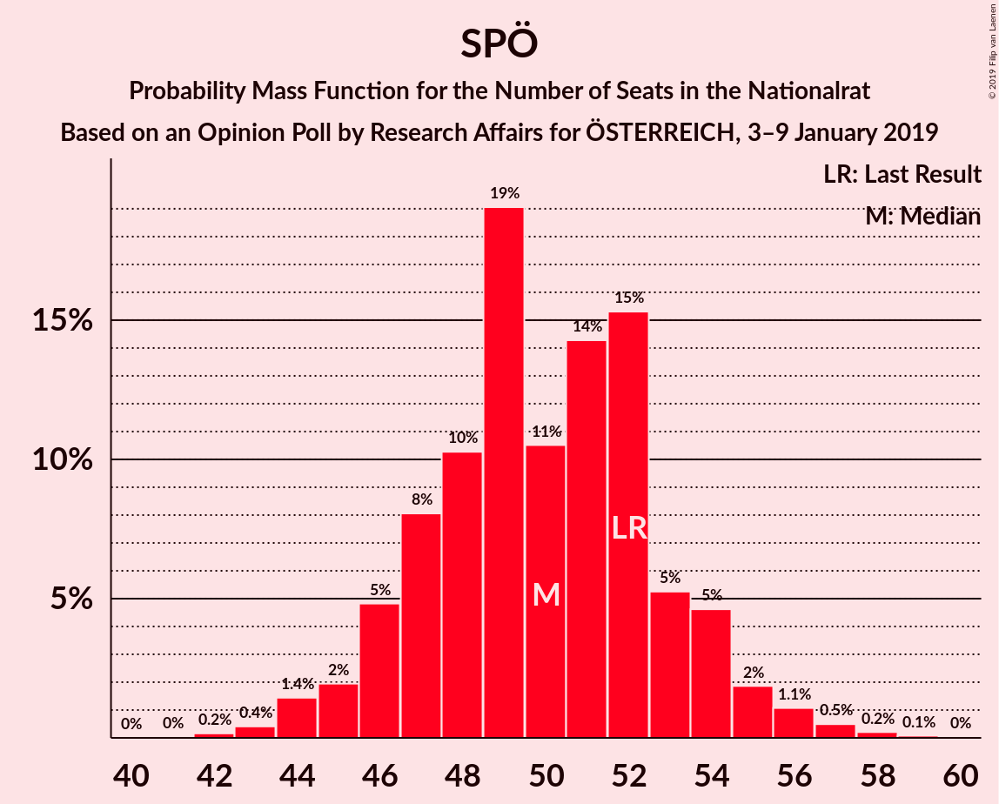

| Number of Seats | Probability | Accumulated | Special Marks |
|:---------------:|:-----------:|:-----------:|:-------------:|
| 41 | 0% | 100% |  |
| 42 | 0.2% | 99.9% |  |
| 43 | 0.4% | 99.8% |  |
| 44 | 1.4% | 99.4% |  |
| 45 | 2% | 98% |  |
| 46 | 5% | 96% |  |
| 47 | 8% | 91% |  |
| 48 | 10% | 83% |  |
| 49 | 19% | 73% |  |
| 50 | 11% | 54% | Median |
| 51 | 14% | 43% |  |
| 52 | 15% | 29% | Last Result |
| 53 | 5% | 14% |  |
| 54 | 5% | 8% |  |
| 55 | 2% | 4% |  |
| 56 | 1.1% | 2% |  |
| 57 | 0.5% | 0.8% |  |
| 58 | 0.2% | 0.3% |  |
| 59 | 0.1% | 0.1% |  |
| 60 | 0% | 0% |  |

## Technical Information

### Opinion Poll

+ **Polling firm:** Research Affairs
+ **Commissioner(s):** ÖSTERREICH
+ **Fieldwork period:** 3–9 January 2019

### Calculations

+ **Sample size:** 1002
+ **Simulations done:** 131,072
+ **Error estimate:** 0.96%

