# Opinion Poll by market for Der Standard, 18–20 February 2019

<a href="#voting-intentions">Voting Intentions</a> | <a href="#seats">Seats</a> | <a href="#coalitions">Coalitions</a> | <a href="#technical-information">Technical Information</a>

## Voting Intentions

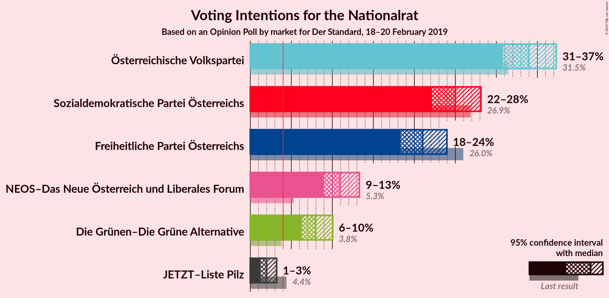

### Confidence Intervals

| Party | Last Result | Poll Result | 80% Confidence Interval | 90% Confidence Interval | 95% Confidence Interval | 99% Confidence Interval |
|:-----:|:-----------:|:-----------:|:-----------------------:|:-----------------------:|:-----------------------:|:-----------------------:|
| Österreichische Volkspartei | 31.5% | 34.0% | 31.9–36.2% |31.3–36.8% |30.8–37.3% |29.8–38.4% |
| Sozialdemokratische Partei Österreichs | 26.9% | 25.0% | 23.1–27.0% |22.6–27.6% |22.1–28.1% |21.2–29.1% |
| Freiheitliche Partei Österreichs | 26.0% | 21.0% | 19.3–23.0% |18.8–23.5% |18.3–24.0% |17.5–24.9% |
| NEOS–Das Neue Österreich und Liberales Forum | 5.3% | 10.9% | 9.6–12.5% |9.3–12.9% |9.0–13.3% |8.4–14.1% |
| Die Grünen–Die Grüne Alternative | 3.8% | 8.0% | 6.9–9.3% |6.5–9.7% |6.3–10.0% |5.8–10.7% |
| JETZT–Liste Pilz | 4.4% | 2.0% | 1.5–2.8% |1.3–3.0% |1.2–3.2% |1.0–3.6% |

*Note:* The poll result column reflects the actual value used in the calculations. Published results may vary slightly, and in addition be rounded to fewer digits.

## Seats

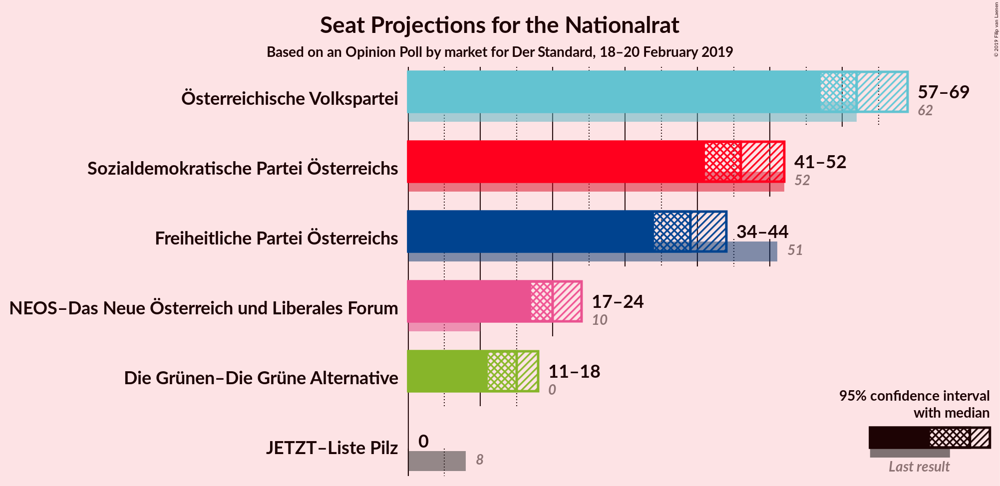

### Confidence Intervals

| Party | Last Result | Median | 80% Confidence Interval | 90% Confidence Interval | 95% Confidence Interval | 99% Confidence Interval |
|:-----:|:-----------:|:------:|:-----------------------:|:-----------------------:|:-----------------------:|:-----------------------:|
| <a href="#österreichische-volkspartei">Österreichische Volkspartei</a> | 62 | 62 | 59–67 |58–69 |57–69 |55–71 |
| <a href="#sozialdemokratische-partei-österreichs">Sozialdemokratische Partei Österreichs</a> | 52 | 46 | 42–50 |41–51 |41–52 |40–54 |
| <a href="#freiheitliche-partei-österreichs">Freiheitliche Partei Österreichs</a> | 51 | 39 | 36–43 |34–43 |34–44 |32–46 |
| <a href="#neos–das-neue-österreich-und-liberales-forum">NEOS–Das Neue Österreich und Liberales Forum</a> | 10 | 20 | 18–23 |17–24 |17–24 |16–26 |
| <a href="#die-grünen–die-grüne-alternative">Die Grünen–Die Grüne Alternative</a> | 0 | 15 | 13–17 |12–18 |11–18 |10–20 |
| <a href="#jetzt–liste-pilz">JETZT–Liste Pilz</a> | 8 | 0 | 0 |0 |0 |0 |

### Österreichische Volkspartei

*For a full overview of the results for this party, see the [Österreichische Volkspartei](party-österreichischevolkspartei.html) page.*

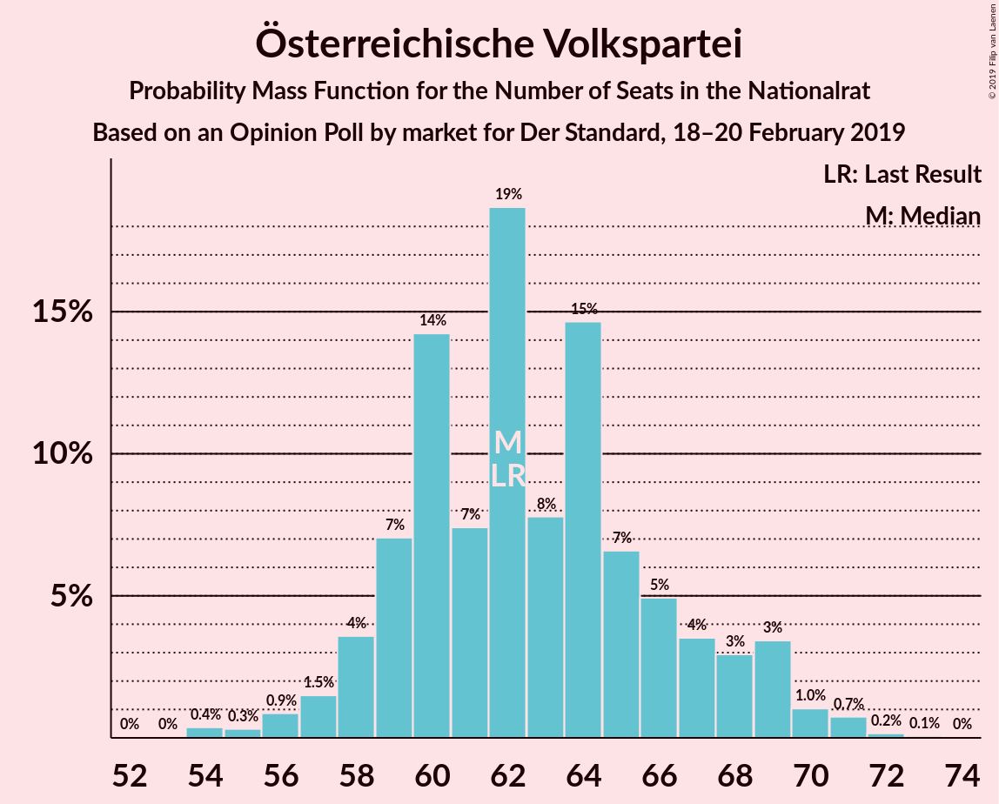

| Number of Seats | Probability | Accumulated | Special Marks |
|:---------------:|:-----------:|:-----------:|:-------------:|
| 53 | 0% | 100% |  |
| 54 | 0.4% | 99.9% |  |
| 55 | 0.3% | 99.5% |  |
| 56 | 0.9% | 99.2% |  |
| 57 | 1.5% | 98% |  |
| 58 | 4% | 97% |  |
| 59 | 7% | 93% |  |
| 60 | 14% | 86% |  |
| 61 | 7% | 72% |  |
| 62 | 19% | 65% | Last Result, Median |
| 63 | 8% | 46% |  |
| 64 | 15% | 38% |  |
| 65 | 7% | 23% |  |
| 66 | 5% | 17% |  |
| 67 | 4% | 12% |  |
| 68 | 3% | 8% |  |
| 69 | 3% | 5% |  |
| 70 | 1.0% | 2% |  |
| 71 | 0.7% | 1.0% |  |
| 72 | 0.2% | 0.3% |  |
| 73 | 0.1% | 0.1% |  |
| 74 | 0% | 0% |  |

### Sozialdemokratische Partei Österreichs

*For a full overview of the results for this party, see the [Sozialdemokratische Partei Österreichs](party-sozialdemokratischeparteiösterreichs.html) page.*

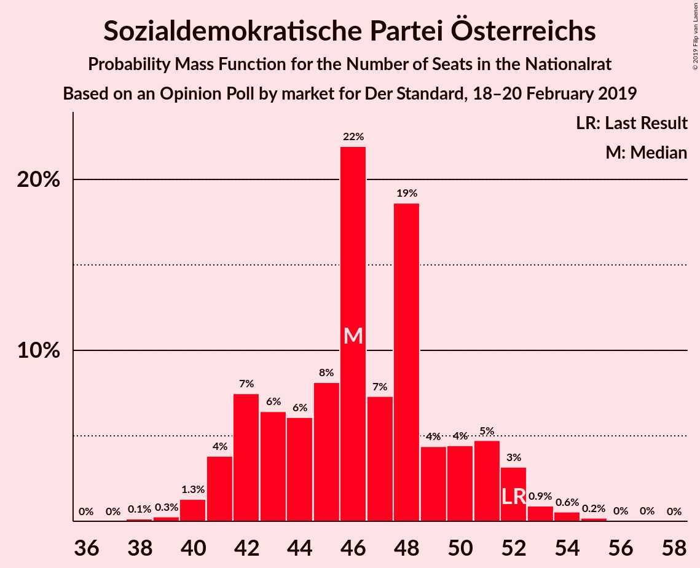

| Number of Seats | Probability | Accumulated | Special Marks |
|:---------------:|:-----------:|:-----------:|:-------------:|
| 38 | 0.1% | 100% |  |
| 39 | 0.3% | 99.8% |  |
| 40 | 1.3% | 99.5% |  |
| 41 | 4% | 98% |  |
| 42 | 7% | 94% |  |
| 43 | 6% | 87% |  |
| 44 | 6% | 81% |  |
| 45 | 8% | 74% |  |
| 46 | 22% | 66% | Median |
| 47 | 7% | 44% |  |
| 48 | 19% | 37% |  |
| 49 | 4% | 18% |  |
| 50 | 4% | 14% |  |
| 51 | 5% | 10% |  |
| 52 | 3% | 5% | Last Result |
| 53 | 0.9% | 2% |  |
| 54 | 0.6% | 0.8% |  |
| 55 | 0.2% | 0.3% |  |
| 56 | 0% | 0.1% |  |
| 57 | 0% | 0% |  |

### Freiheitliche Partei Österreichs

*For a full overview of the results for this party, see the [Freiheitliche Partei Österreichs](party-freiheitlicheparteiösterreichs.html) page.*

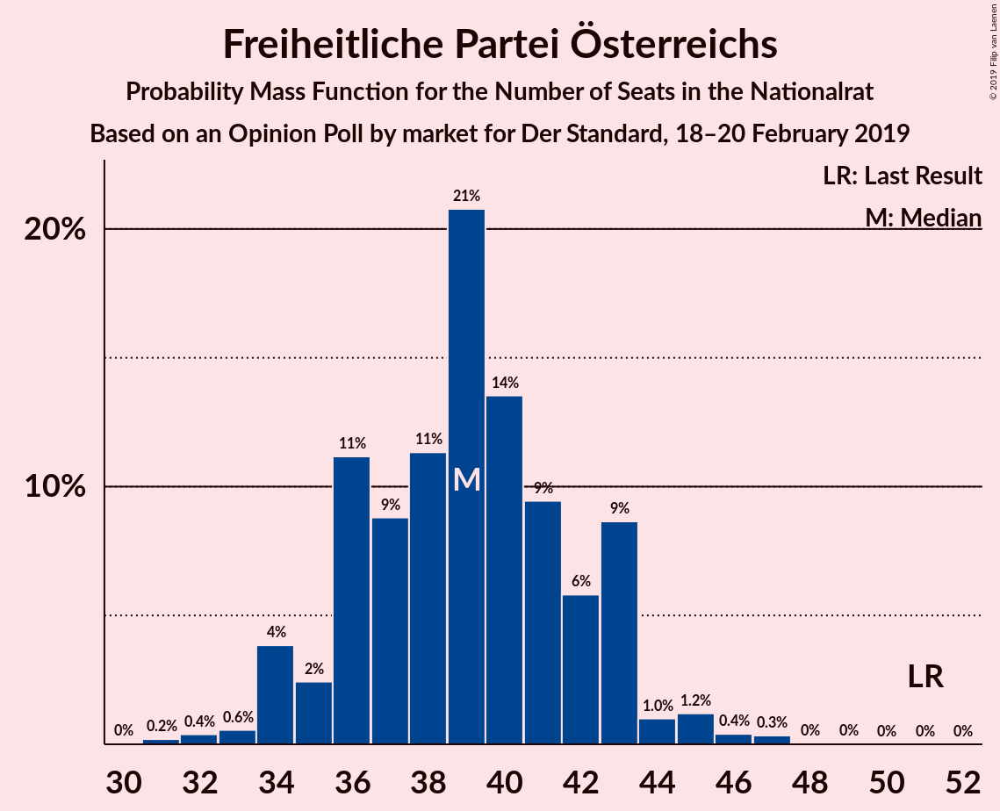

| Number of Seats | Probability | Accumulated | Special Marks |
|:---------------:|:-----------:|:-----------:|:-------------:|
| 31 | 0.2% | 100% |  |
| 32 | 0.4% | 99.8% |  |
| 33 | 0.6% | 99.4% |  |
| 34 | 4% | 98.8% |  |
| 35 | 2% | 95% |  |
| 36 | 11% | 93% |  |
| 37 | 9% | 81% |  |
| 38 | 11% | 73% |  |
| 39 | 21% | 61% | Median |
| 40 | 14% | 40% |  |
| 41 | 9% | 27% |  |
| 42 | 6% | 17% |  |
| 43 | 9% | 12% |  |
| 44 | 1.0% | 3% |  |
| 45 | 1.2% | 2% |  |
| 46 | 0.4% | 0.8% |  |
| 47 | 0.3% | 0.4% |  |
| 48 | 0% | 0.1% |  |
| 49 | 0% | 0% |  |
| 50 | 0% | 0% |  |
| 51 | 0% | 0% | Last Result |

### NEOS–Das Neue Österreich und Liberales Forum

*For a full overview of the results for this party, see the [NEOS–Das Neue Österreich und Liberales Forum](party-neos–dasneueösterreichundliberalesforum.html) page.*

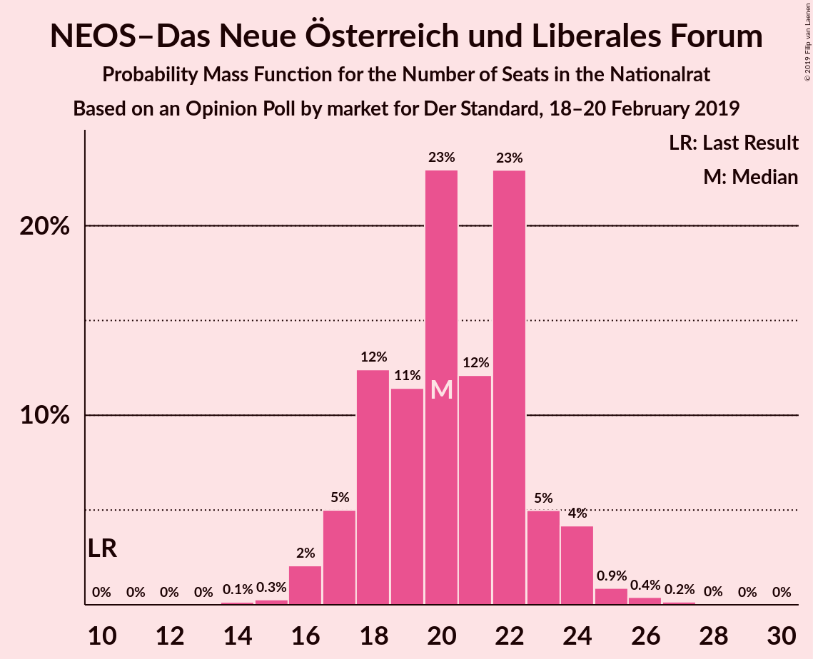

| Number of Seats | Probability | Accumulated | Special Marks |
|:---------------:|:-----------:|:-----------:|:-------------:|
| 10 | 0% | 100% | Last Result |
| 11 | 0% | 100% |  |
| 12 | 0% | 100% |  |
| 13 | 0% | 100% |  |
| 14 | 0.1% | 100% |  |
| 15 | 0.3% | 99.8% |  |
| 16 | 2% | 99.6% |  |
| 17 | 5% | 98% |  |
| 18 | 12% | 92% |  |
| 19 | 11% | 80% |  |
| 20 | 23% | 69% | Median |
| 21 | 12% | 46% |  |
| 22 | 23% | 34% |  |
| 23 | 5% | 11% |  |
| 24 | 4% | 6% |  |
| 25 | 0.9% | 1.5% |  |
| 26 | 0.4% | 0.6% |  |
| 27 | 0.2% | 0.2% |  |
| 28 | 0% | 0.1% |  |
| 29 | 0% | 0% |  |

### Die Grünen–Die Grüne Alternative

*For a full overview of the results for this party, see the [Die Grünen–Die Grüne Alternative](party-diegrünen–diegrünealternative.html) page.*

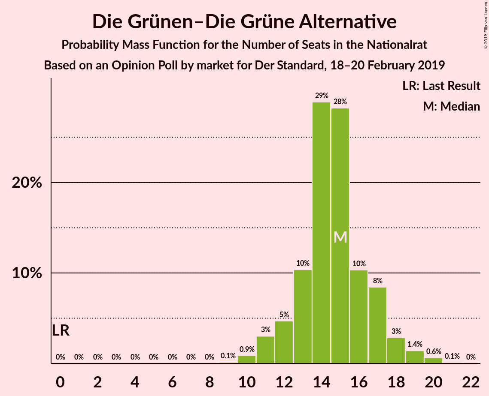

| Number of Seats | Probability | Accumulated | Special Marks |
|:---------------:|:-----------:|:-----------:|:-------------:|
| 0 | 0% | 100% | Last Result |
| 1 | 0% | 100% |  |
| 2 | 0% | 100% |  |
| 3 | 0% | 100% |  |
| 4 | 0% | 100% |  |
| 5 | 0% | 100% |  |
| 6 | 0% | 100% |  |
| 7 | 0% | 100% |  |
| 8 | 0% | 100% |  |
| 9 | 0.1% | 100% |  |
| 10 | 0.9% | 99.9% |  |
| 11 | 3% | 99.0% |  |
| 12 | 5% | 96% |  |
| 13 | 10% | 91% |  |
| 14 | 29% | 81% |  |
| 15 | 28% | 52% | Median |
| 16 | 10% | 24% |  |
| 17 | 8% | 13% |  |
| 18 | 3% | 5% |  |
| 19 | 1.4% | 2% |  |
| 20 | 0.6% | 0.8% |  |
| 21 | 0.1% | 0.1% |  |
| 22 | 0% | 0% |  |

### JETZT–Liste Pilz

*For a full overview of the results for this party, see the [JETZT–Liste Pilz](party-jetzt–listepilz.html) page.*

| Number of Seats | Probability | Accumulated | Special Marks |
|:---------------:|:-----------:|:-----------:|:-------------:|
| 0 | 99.9% | 100% | Median |
| 1 | 0% | 0.1% |  |
| 2 | 0% | 0.1% |  |
| 3 | 0% | 0.1% |  |
| 4 | 0% | 0.1% |  |
| 5 | 0% | 0.1% |  |
| 6 | 0% | 0.1% |  |
| 7 | 0.1% | 0.1% |  |
| 8 | 0% | 0% | Last Result |

## Coalitions

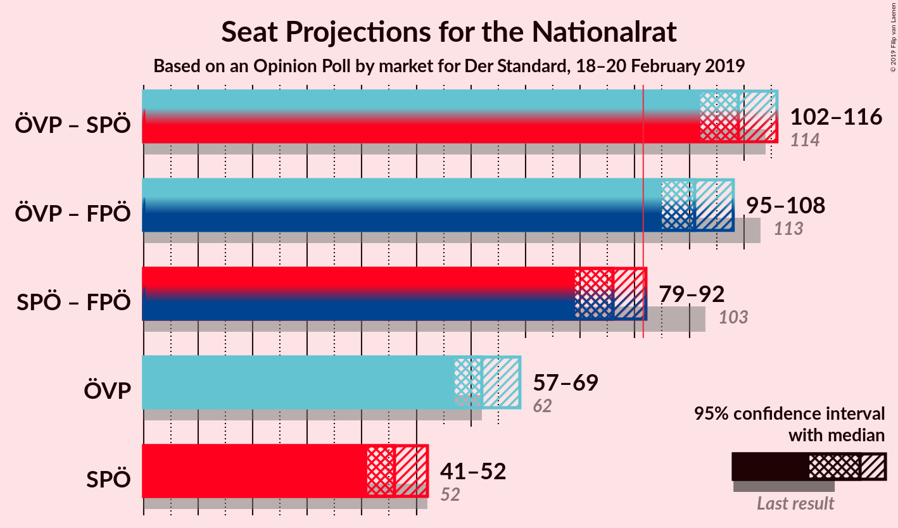

### Confidence Intervals

| Coalition | Last Result | Median | Majority? | 80% Confidence Interval | 90% Confidence Interval | 95% Confidence Interval | 99% Confidence Interval |
|:---------:|:-----------:|:------:|:---------:|:-----------------------:|:-----------------------:|:-----------------------:|:-----------------------:|
| Österreichische Volkspartei – Sozialdemokratische Partei Österreichs | 114 | 109 | 100% | 105–114 | 104–114 | 102–116 | 101–118 |
| Österreichische Volkspartei – Freiheitliche Partei Österreichs | 113 | 101 | 100% | 98–107 | 96–107 | 95–108 | 94–110 |
| Sozialdemokratische Partei Österreichs – Freiheitliche Partei Österreichs | 103 | 86 | 3% | 81–89 | 80–91 | 79–92 | 77–94 |
| Österreichische Volkspartei | 62 | 62 | 0% | 59–67 | 58–69 | 57–69 | 55–71 |
| Sozialdemokratische Partei Österreichs | 52 | 46 | 0% | 42–50 | 41–51 | 41–52 | 40–54 |

### Österreichische Volkspartei – Sozialdemokratische Partei Österreichs

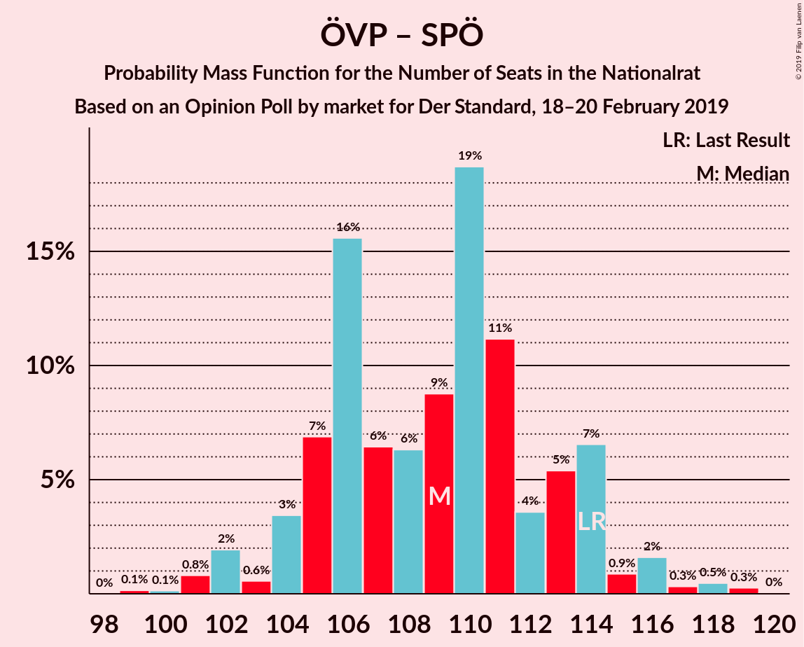

| Number of Seats | Probability | Accumulated | Special Marks |
|:---------------:|:-----------:|:-----------:|:-------------:|
| 99 | 0.1% | 100% |  |
| 100 | 0.1% | 99.8% |  |
| 101 | 0.8% | 99.7% |  |
| 102 | 2% | 98.9% |  |
| 103 | 0.6% | 97% |  |
| 104 | 3% | 96% |  |
| 105 | 7% | 93% |  |
| 106 | 16% | 86% |  |
| 107 | 6% | 70% |  |
| 108 | 6% | 64% | Median |
| 109 | 9% | 58% |  |
| 110 | 19% | 49% |  |
| 111 | 11% | 30% |  |
| 112 | 4% | 19% |  |
| 113 | 5% | 15% |  |
| 114 | 7% | 10% | Last Result |
| 115 | 0.9% | 4% |  |
| 116 | 2% | 3% |  |
| 117 | 0.3% | 1.1% |  |
| 118 | 0.5% | 0.8% |  |
| 119 | 0.3% | 0.3% |  |
| 120 | 0% | 0% |  |

### Österreichische Volkspartei – Freiheitliche Partei Österreichs

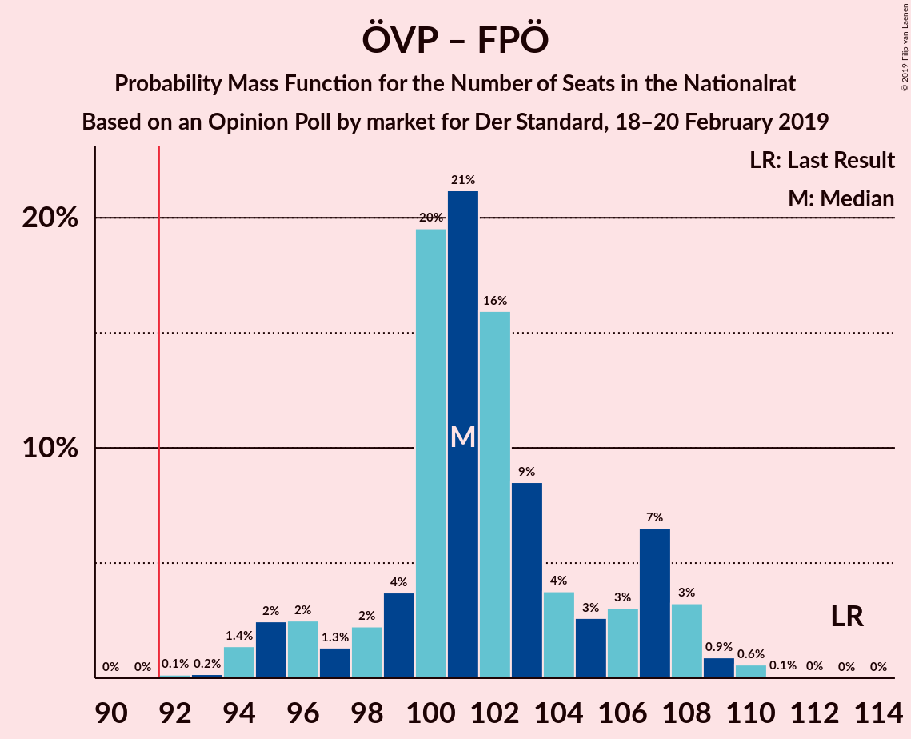

| Number of Seats | Probability | Accumulated | Special Marks |
|:---------------:|:-----------:|:-----------:|:-------------:|
| 92 | 0.1% | 100% | Majority |
| 93 | 0.2% | 99.8% |  |
| 94 | 1.4% | 99.6% |  |
| 95 | 2% | 98% |  |
| 96 | 2% | 96% |  |
| 97 | 1.3% | 93% |  |
| 98 | 2% | 92% |  |
| 99 | 4% | 90% |  |
| 100 | 20% | 86% |  |
| 101 | 21% | 66% | Median |
| 102 | 16% | 45% |  |
| 103 | 9% | 29% |  |
| 104 | 4% | 21% |  |
| 105 | 3% | 17% |  |
| 106 | 3% | 14% |  |
| 107 | 7% | 11% |  |
| 108 | 3% | 5% |  |
| 109 | 0.9% | 2% |  |
| 110 | 0.6% | 0.8% |  |
| 111 | 0.1% | 0.2% |  |
| 112 | 0% | 0.1% |  |
| 113 | 0% | 0% | Last Result |

### Sozialdemokratische Partei Österreichs – Freiheitliche Partei Österreichs

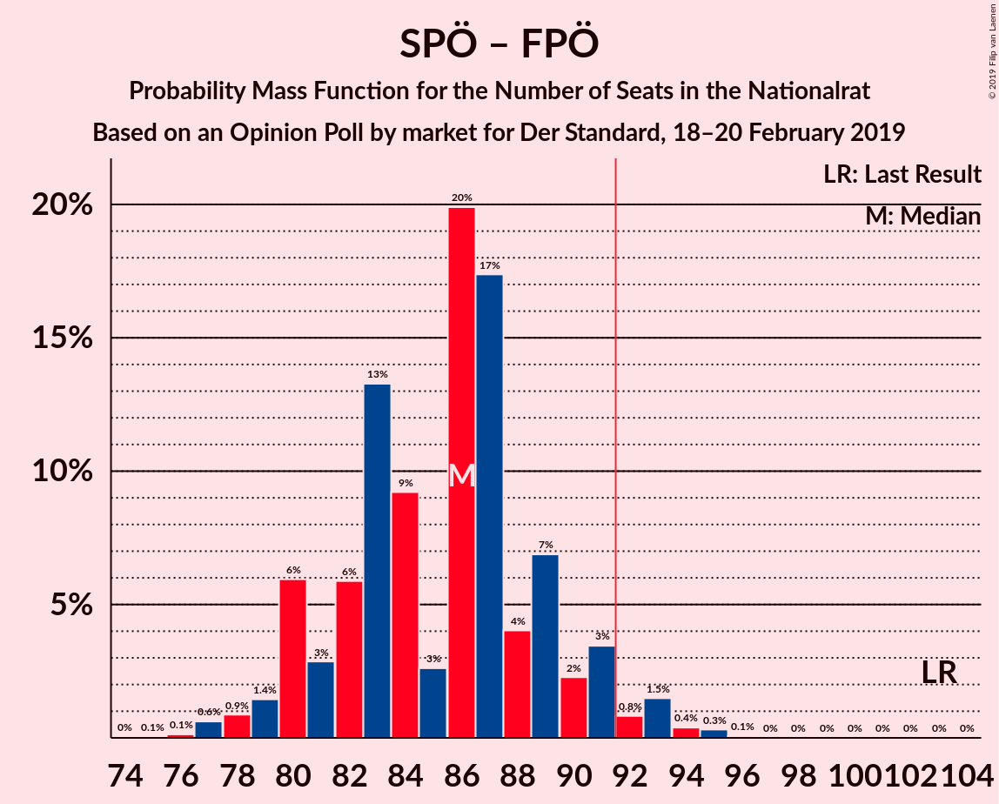

| Number of Seats | Probability | Accumulated | Special Marks |
|:---------------:|:-----------:|:-----------:|:-------------:|
| 75 | 0.1% | 100% |  |
| 76 | 0.1% | 99.9% |  |
| 77 | 0.6% | 99.8% |  |
| 78 | 0.9% | 99.1% |  |
| 79 | 1.4% | 98% |  |
| 80 | 6% | 97% |  |
| 81 | 3% | 91% |  |
| 82 | 6% | 88% |  |
| 83 | 13% | 82% |  |
| 84 | 9% | 69% |  |
| 85 | 3% | 60% | Median |
| 86 | 20% | 57% |  |
| 87 | 17% | 37% |  |
| 88 | 4% | 20% |  |
| 89 | 7% | 16% |  |
| 90 | 2% | 9% |  |
| 91 | 3% | 7% |  |
| 92 | 0.8% | 3% | Majority |
| 93 | 1.5% | 2% |  |
| 94 | 0.4% | 0.8% |  |
| 95 | 0.3% | 0.4% |  |
| 96 | 0.1% | 0.1% |  |
| 97 | 0% | 0% |  |
| 98 | 0% | 0% |  |
| 99 | 0% | 0% |  |
| 100 | 0% | 0% |  |
| 101 | 0% | 0% |  |
| 102 | 0% | 0% |  |
| 103 | 0% | 0% | Last Result |

### Österreichische Volkspartei

| Number of Seats | Probability | Accumulated | Special Marks |
|:---------------:|:-----------:|:-----------:|:-------------:|
| 53 | 0% | 100% |  |
| 54 | 0.4% | 99.9% |  |
| 55 | 0.3% | 99.5% |  |
| 56 | 0.9% | 99.2% |  |
| 57 | 1.5% | 98% |  |
| 58 | 4% | 97% |  |
| 59 | 7% | 93% |  |
| 60 | 14% | 86% |  |
| 61 | 7% | 72% |  |
| 62 | 19% | 65% | Last Result, Median |
| 63 | 8% | 46% |  |
| 64 | 15% | 38% |  |
| 65 | 7% | 23% |  |
| 66 | 5% | 17% |  |
| 67 | 4% | 12% |  |
| 68 | 3% | 8% |  |
| 69 | 3% | 5% |  |
| 70 | 1.0% | 2% |  |
| 71 | 0.7% | 1.0% |  |
| 72 | 0.2% | 0.3% |  |
| 73 | 0.1% | 0.1% |  |
| 74 | 0% | 0% |  |

### Sozialdemokratische Partei Österreichs

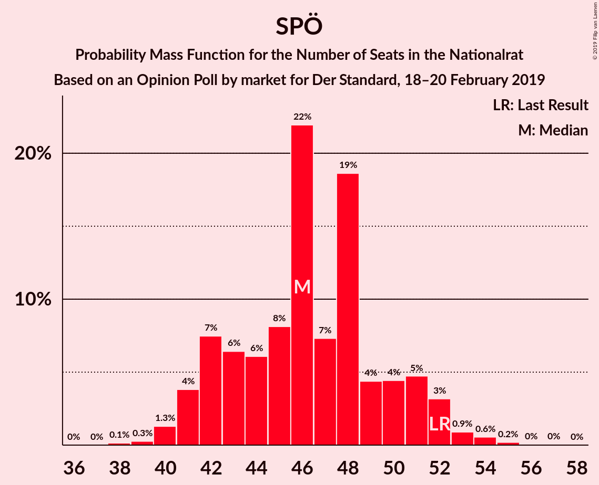

| Number of Seats | Probability | Accumulated | Special Marks |
|:---------------:|:-----------:|:-----------:|:-------------:|
| 38 | 0.1% | 100% |  |
| 39 | 0.3% | 99.8% |  |
| 40 | 1.3% | 99.5% |  |
| 41 | 4% | 98% |  |
| 42 | 7% | 94% |  |
| 43 | 6% | 87% |  |
| 44 | 6% | 81% |  |
| 45 | 8% | 74% |  |
| 46 | 22% | 66% | Median |
| 47 | 7% | 44% |  |
| 48 | 19% | 37% |  |
| 49 | 4% | 18% |  |
| 50 | 4% | 14% |  |
| 51 | 5% | 10% |  |
| 52 | 3% | 5% | Last Result |
| 53 | 0.9% | 2% |  |
| 54 | 0.6% | 0.8% |  |
| 55 | 0.2% | 0.3% |  |
| 56 | 0% | 0.1% |  |
| 57 | 0% | 0% |  |

## Technical Information

### Opinion Poll

+ **Polling firm:** market
+ **Commissioner(s):** Der Standard
+ **Fieldwork period:** 18–20 February 2019

### Calculations

+ **Sample size:** 804
+ **Simulations done:** 131,072
+ **Error estimate:** 1.01%

