# Opinion Poll by Unique Research for Heute, 4–7 March 2019

<a href="#voting-intentions">Voting Intentions</a> | <a href="#seats">Seats</a> | <a href="#coalitions">Coalitions</a> | <a href="#technical-information">Technical Information</a>

## Voting Intentions

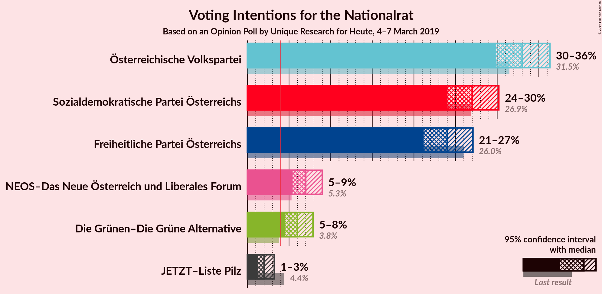

### Confidence Intervals

| Party | Last Result | Poll Result | 80% Confidence Interval | 90% Confidence Interval | 95% Confidence Interval | 99% Confidence Interval |
|:-----:|:-----------:|:-----------:|:-----------------------:|:-----------------------:|:-----------------------:|:-----------------------:|
| Österreichische Volkspartei | 31.5% | 33.0% | 30.9–35.2% |30.3–35.8% |29.8–36.3% |28.8–37.4% |
| Sozialdemokratische Partei Österreichs | 26.9% | 27.0% | 25.1–29.1% |24.5–29.7% |24.0–30.2% |23.1–31.2% |
| Freiheitliche Partei Österreichs | 26.0% | 24.0% | 22.1–26.0% |21.6–26.6% |21.2–27.1% |20.3–28.1% |
| NEOS–Das Neue Österreich und Liberales Forum | 5.3% | 7.0% | 6.0–8.3% |5.7–8.7% |5.4–9.0% |5.0–9.6% |
| Die Grünen–Die Grüne Alternative | 3.8% | 6.0% | 5.0–7.2% |4.8–7.6% |4.6–7.9% |4.1–8.5% |
| JETZT–Liste Pilz | 4.4% | 2.0% | 1.5–2.8% |1.4–3.0% |1.2–3.2% |1.0–3.7% |

*Note:* The poll result column reflects the actual value used in the calculations. Published results may vary slightly, and in addition be rounded to fewer digits.

## Seats

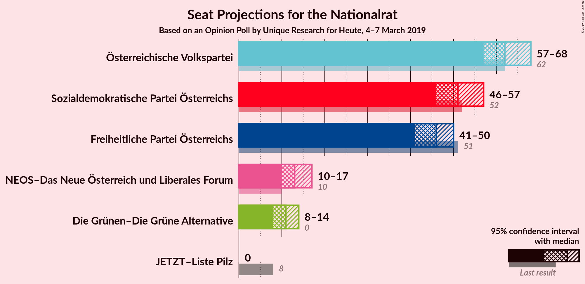

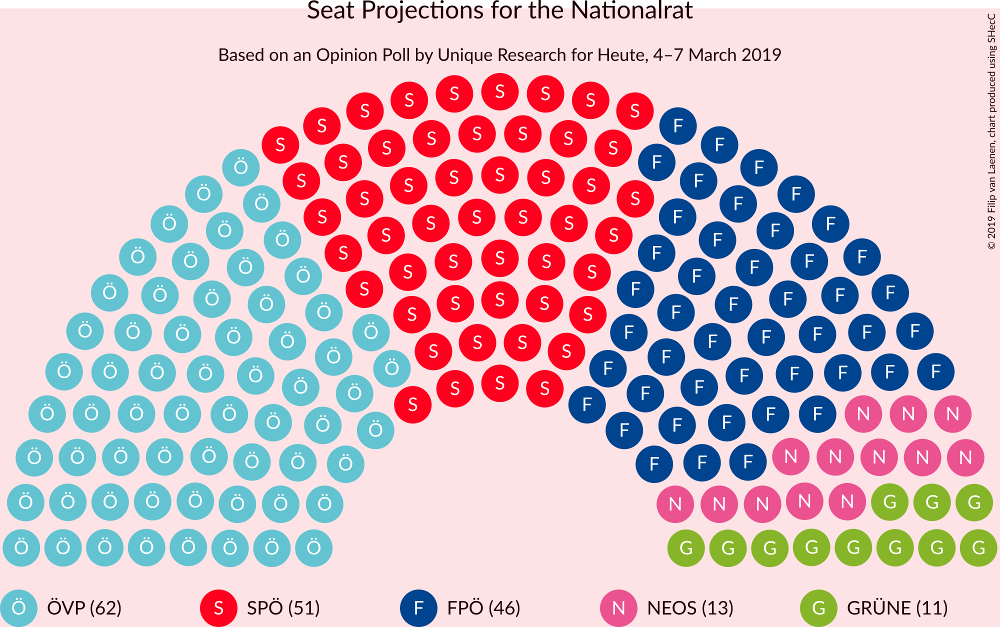

### Confidence Intervals

| Party | Last Result | Median | 80% Confidence Interval | 90% Confidence Interval | 95% Confidence Interval | 99% Confidence Interval |
|:-----:|:-----------:|:------:|:-----------------------:|:-----------------------:|:-----------------------:|:-----------------------:|
| <a href="#österreichische-volkspartei">Österreichische Volkspartei</a> | 62 | 62 | 59–66 |58–67 |57–68 |55–70 |
| <a href="#sozialdemokratische-partei-österreichs">Sozialdemokratische Partei Österreichs</a> | 52 | 51 | 47–54 |46–56 |46–57 |44–59 |
| <a href="#freiheitliche-partei-österreichs">Freiheitliche Partei Österreichs</a> | 51 | 46 | 43–49 |42–50 |41–50 |39–52 |
| <a href="#neos–das-neue-österreich-und-liberales-forum">NEOS–Das Neue Österreich und Liberales Forum</a> | 10 | 13 | 11–15 |10–16 |10–17 |9–18 |
| <a href="#die-grünen–die-grüne-alternative">Die Grünen–Die Grüne Alternative</a> | 0 | 11 | 9–13 |9–14 |8–14 |8–15 |
| <a href="#jetzt–liste-pilz">JETZT–Liste Pilz</a> | 8 | 0 | 0 |0 |0 |0 |

### Österreichische Volkspartei

*For a full overview of the results for this party, see the [Österreichische Volkspartei](party-österreichischevolkspartei.html) page.*

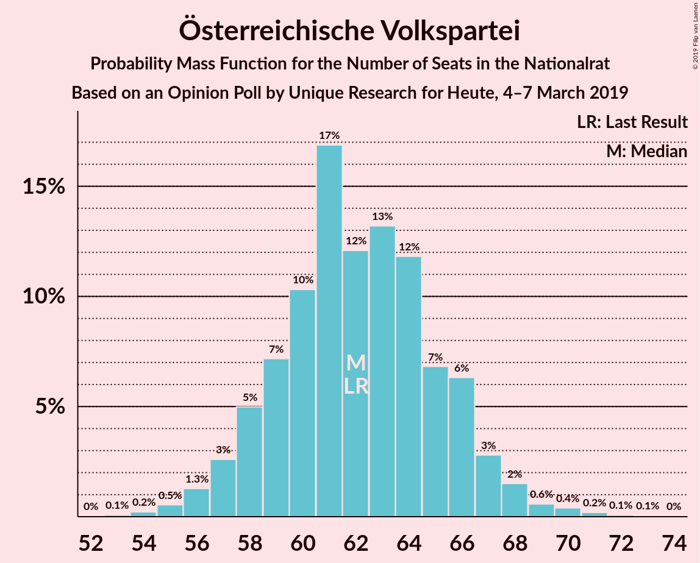

| Number of Seats | Probability | Accumulated | Special Marks |
|:---------------:|:-----------:|:-----------:|:-------------:|
| 53 | 0.1% | 100% |  |
| 54 | 0.2% | 99.9% |  |
| 55 | 0.5% | 99.7% |  |
| 56 | 1.3% | 99.1% |  |
| 57 | 3% | 98% |  |
| 58 | 5% | 95% |  |
| 59 | 7% | 90% |  |
| 60 | 10% | 83% |  |
| 61 | 17% | 73% |  |
| 62 | 12% | 56% | Last Result, Median |
| 63 | 13% | 44% |  |
| 64 | 12% | 31% |  |
| 65 | 7% | 19% |  |
| 66 | 6% | 12% |  |
| 67 | 3% | 6% |  |
| 68 | 2% | 3% |  |
| 69 | 0.6% | 1.3% |  |
| 70 | 0.4% | 0.8% |  |
| 71 | 0.2% | 0.4% |  |
| 72 | 0.1% | 0.2% |  |
| 73 | 0.1% | 0.1% |  |
| 74 | 0% | 0% |  |

### Sozialdemokratische Partei Österreichs

*For a full overview of the results for this party, see the [Sozialdemokratische Partei Österreichs](party-sozialdemokratischeparteiösterreichs.html) page.*

| Number of Seats | Probability | Accumulated | Special Marks |
|:---------------:|:-----------:|:-----------:|:-------------:|
| 42 | 0.1% | 100% |  |
| 43 | 0.2% | 99.8% |  |
| 44 | 0.6% | 99.6% |  |
| 45 | 1.4% | 99.0% |  |
| 46 | 3% | 98% |  |
| 47 | 7% | 94% |  |
| 48 | 8% | 88% |  |
| 49 | 10% | 80% |  |
| 50 | 14% | 69% |  |
| 51 | 17% | 55% | Median |
| 52 | 13% | 37% | Last Result |
| 53 | 9% | 24% |  |
| 54 | 6% | 15% |  |
| 55 | 4% | 9% |  |
| 56 | 2% | 5% |  |
| 57 | 2% | 3% |  |
| 58 | 0.6% | 1.1% |  |
| 59 | 0.4% | 0.6% |  |
| 60 | 0.1% | 0.2% |  |
| 61 | 0.1% | 0.1% |  |
| 62 | 0% | 0% |  |

### Freiheitliche Partei Österreichs

*For a full overview of the results for this party, see the [Freiheitliche Partei Österreichs](party-freiheitlicheparteiösterreichs.html) page.*

| Number of Seats | Probability | Accumulated | Special Marks |
|:---------------:|:-----------:|:-----------:|:-------------:|
| 36 | 0% | 100% |  |
| 37 | 0.2% | 99.9% |  |
| 38 | 0.2% | 99.8% |  |
| 39 | 0.6% | 99.5% |  |
| 40 | 1.2% | 98.9% |  |
| 41 | 2% | 98% |  |
| 42 | 3% | 96% |  |
| 43 | 9% | 92% |  |
| 44 | 13% | 83% |  |
| 45 | 12% | 69% |  |
| 46 | 17% | 58% | Median |
| 47 | 21% | 40% |  |
| 48 | 6% | 20% |  |
| 49 | 8% | 14% |  |
| 50 | 4% | 6% |  |
| 51 | 1.3% | 2% | Last Result |
| 52 | 0.9% | 1.2% |  |
| 53 | 0.2% | 0.3% |  |
| 54 | 0.1% | 0.1% |  |
| 55 | 0% | 0.1% |  |
| 56 | 0% | 0% |  |

### NEOS–Das Neue Österreich und Liberales Forum

*For a full overview of the results for this party, see the [NEOS–Das Neue Österreich und Liberales Forum](party-neos–dasneueösterreichundliberalesforum.html) page.*

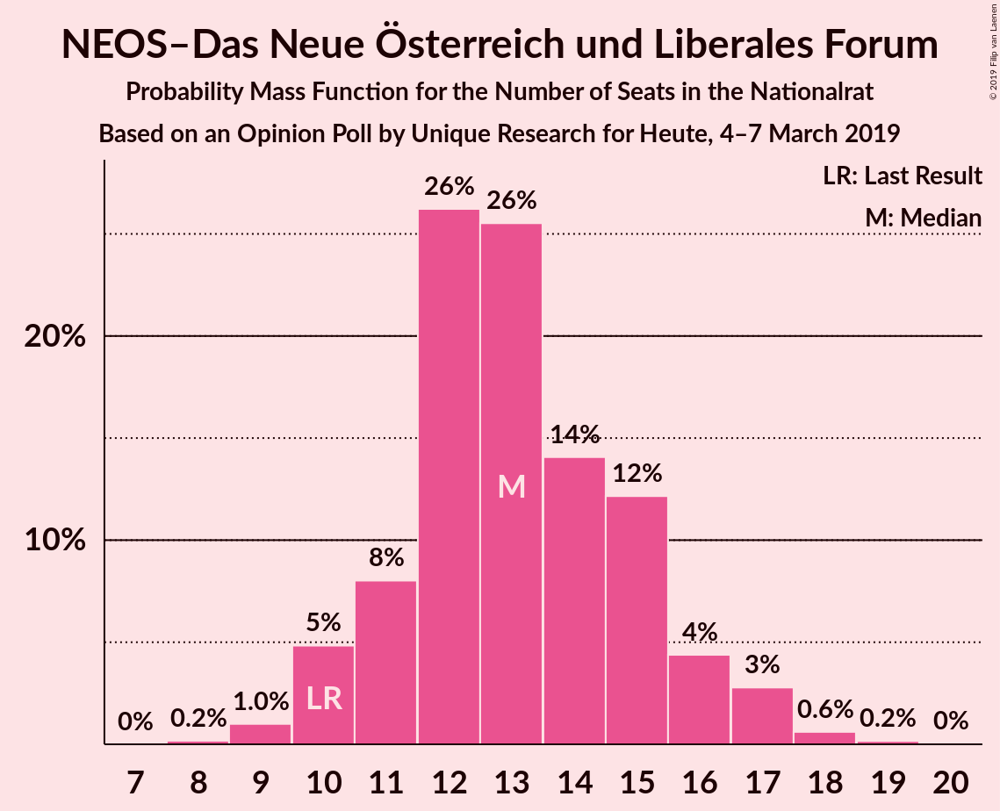

| Number of Seats | Probability | Accumulated | Special Marks |
|:---------------:|:-----------:|:-----------:|:-------------:|
| 8 | 0.2% | 100% |  |
| 9 | 1.0% | 99.8% |  |
| 10 | 5% | 98.8% | Last Result |
| 11 | 8% | 94% |  |
| 12 | 26% | 86% |  |
| 13 | 26% | 60% | Median |
| 14 | 14% | 34% |  |
| 15 | 12% | 20% |  |
| 16 | 4% | 8% |  |
| 17 | 3% | 4% |  |
| 18 | 0.6% | 0.8% |  |
| 19 | 0.2% | 0.2% |  |
| 20 | 0% | 0% |  |

### Die Grünen–Die Grüne Alternative

*For a full overview of the results for this party, see the [Die Grünen–Die Grüne Alternative](party-diegrünen–diegrünealternative.html) page.*

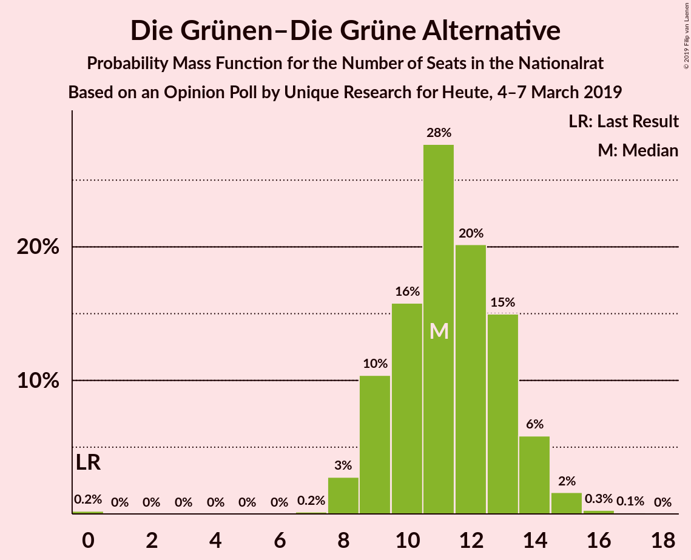

| Number of Seats | Probability | Accumulated | Special Marks |
|:---------------:|:-----------:|:-----------:|:-------------:|
| 0 | 0.2% | 100% | Last Result |
| 1 | 0% | 99.8% |  |
| 2 | 0% | 99.8% |  |
| 3 | 0% | 99.8% |  |
| 4 | 0% | 99.8% |  |
| 5 | 0% | 99.8% |  |
| 6 | 0% | 99.8% |  |
| 7 | 0.2% | 99.8% |  |
| 8 | 3% | 99.6% |  |
| 9 | 10% | 97% |  |
| 10 | 16% | 86% |  |
| 11 | 28% | 71% | Median |
| 12 | 20% | 43% |  |
| 13 | 15% | 23% |  |
| 14 | 6% | 8% |  |
| 15 | 2% | 2% |  |
| 16 | 0.3% | 0.4% |  |
| 17 | 0.1% | 0.1% |  |
| 18 | 0% | 0% |  |

### JETZT–Liste Pilz

*For a full overview of the results for this party, see the [JETZT–Liste Pilz](party-jetzt–listepilz.html) page.*

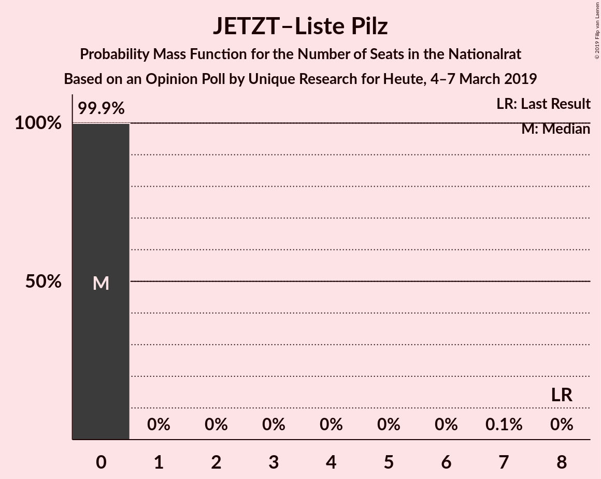

| Number of Seats | Probability | Accumulated | Special Marks |
|:---------------:|:-----------:|:-----------:|:-------------:|
| 0 | 99.9% | 100% | Median |
| 1 | 0% | 0.1% |  |
| 2 | 0% | 0.1% |  |
| 3 | 0% | 0.1% |  |
| 4 | 0% | 0.1% |  |
| 5 | 0% | 0.1% |  |
| 6 | 0% | 0.1% |  |
| 7 | 0.1% | 0.1% |  |
| 8 | 0% | 0% | Last Result |

## Coalitions

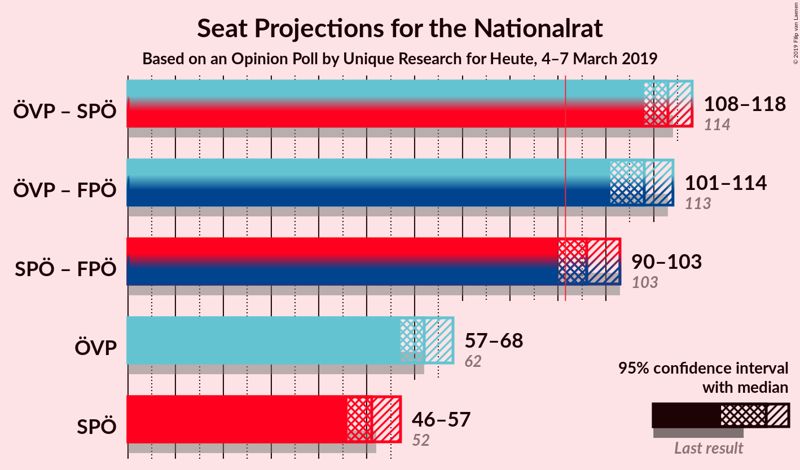

### Confidence Intervals

| Coalition | Last Result | Median | Majority? | 80% Confidence Interval | 90% Confidence Interval | 95% Confidence Interval | 99% Confidence Interval |
|:---------:|:-----------:|:------:|:---------:|:-----------------------:|:-----------------------:|:-----------------------:|:-----------------------:|
| Österreichische Volkspartei – Sozialdemokratische Partei Österreichs | 114 | 113 | 100% | 110–115 | 109–117 | 108–118 | 106–122 |
| Österreichische Volkspartei – Freiheitliche Partei Österreichs | 113 | 108 | 100% | 104–112 | 103–113 | 101–114 | 99–116 |
| Sozialdemokratische Partei Österreichs – Freiheitliche Partei Österreichs | 103 | 96 | 95% | 93–101 | 91–102 | 90–103 | 88–105 |
| Österreichische Volkspartei | 62 | 62 | 0% | 59–66 | 58–67 | 57–68 | 55–70 |
| Sozialdemokratische Partei Österreichs | 52 | 51 | 0% | 47–54 | 46–56 | 46–57 | 44–59 |

### Österreichische Volkspartei – Sozialdemokratische Partei Österreichs

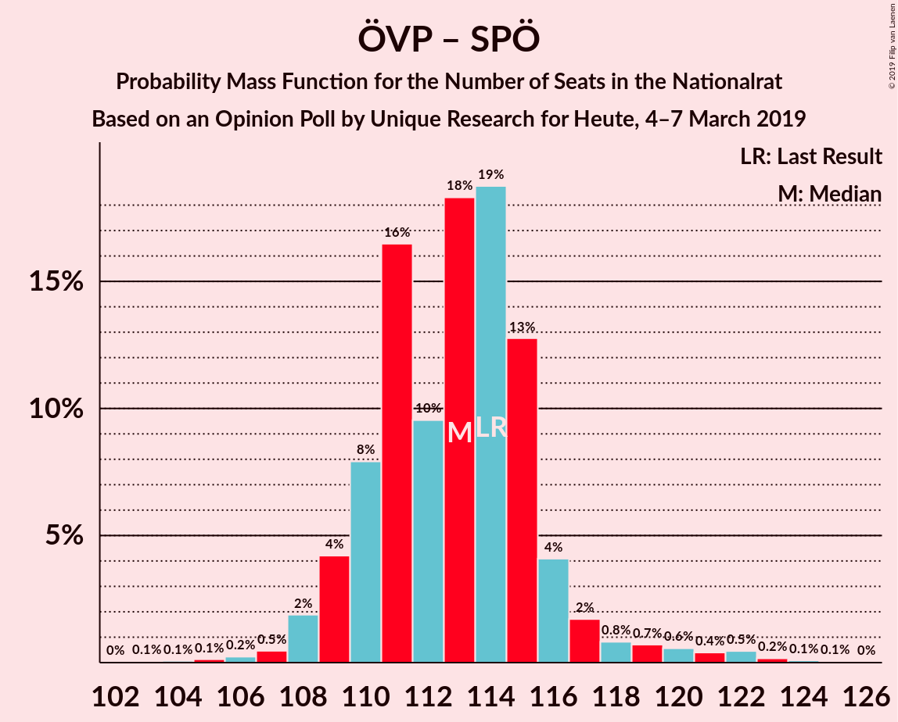

| Number of Seats | Probability | Accumulated | Special Marks |
|:---------------:|:-----------:|:-----------:|:-------------:|
| 102 | 0% | 100% |  |
| 103 | 0.1% | 99.9% |  |
| 104 | 0.1% | 99.9% |  |
| 105 | 0.1% | 99.8% |  |
| 106 | 0.2% | 99.7% |  |
| 107 | 0.5% | 99.4% |  |
| 108 | 2% | 99.0% |  |
| 109 | 4% | 97% |  |
| 110 | 8% | 93% |  |
| 111 | 16% | 85% |  |
| 112 | 10% | 68% |  |
| 113 | 18% | 59% | Median |
| 114 | 19% | 41% | Last Result |
| 115 | 13% | 22% |  |
| 116 | 4% | 9% |  |
| 117 | 2% | 5% |  |
| 118 | 0.8% | 3% |  |
| 119 | 0.7% | 2% |  |
| 120 | 0.6% | 2% |  |
| 121 | 0.4% | 1.2% |  |
| 122 | 0.5% | 0.8% |  |
| 123 | 0.2% | 0.4% |  |
| 124 | 0.1% | 0.2% |  |
| 125 | 0.1% | 0.1% |  |
| 126 | 0% | 0% |  |

### Österreichische Volkspartei – Freiheitliche Partei Österreichs

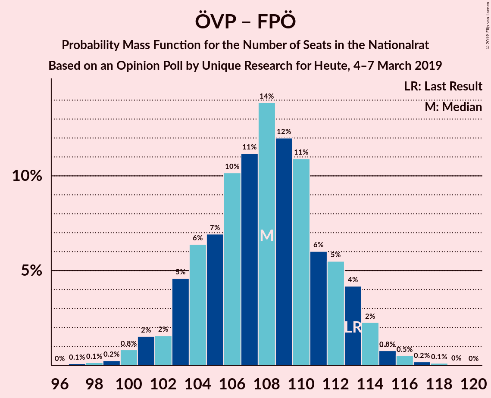

| Number of Seats | Probability | Accumulated | Special Marks |
|:---------------:|:-----------:|:-----------:|:-------------:|
| 97 | 0.1% | 100% |  |
| 98 | 0.1% | 99.9% |  |
| 99 | 0.2% | 99.7% |  |
| 100 | 0.8% | 99.5% |  |
| 101 | 2% | 98.7% |  |
| 102 | 2% | 97% |  |
| 103 | 5% | 96% |  |
| 104 | 6% | 91% |  |
| 105 | 7% | 85% |  |
| 106 | 10% | 78% |  |
| 107 | 11% | 68% |  |
| 108 | 14% | 56% | Median |
| 109 | 12% | 42% |  |
| 110 | 11% | 30% |  |
| 111 | 6% | 20% |  |
| 112 | 5% | 14% |  |
| 113 | 4% | 8% | Last Result |
| 114 | 2% | 4% |  |
| 115 | 0.8% | 2% |  |
| 116 | 0.5% | 0.9% |  |
| 117 | 0.2% | 0.3% |  |
| 118 | 0.1% | 0.2% |  |
| 119 | 0% | 0.1% |  |
| 120 | 0% | 0% |  |

### Sozialdemokratische Partei Österreichs – Freiheitliche Partei Österreichs

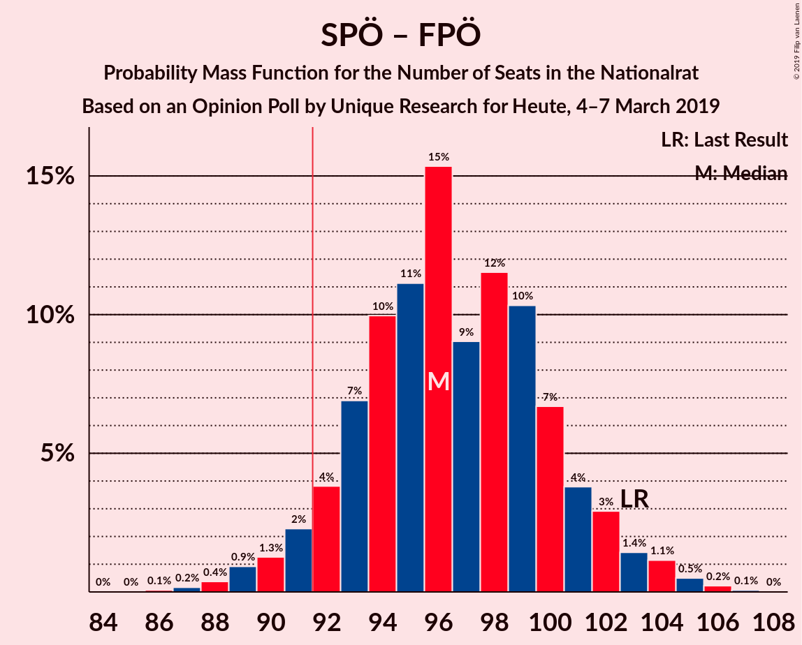

| Number of Seats | Probability | Accumulated | Special Marks |
|:---------------:|:-----------:|:-----------:|:-------------:|
| 86 | 0.1% | 100% |  |
| 87 | 0.2% | 99.9% |  |
| 88 | 0.4% | 99.7% |  |
| 89 | 0.9% | 99.4% |  |
| 90 | 1.3% | 98% |  |
| 91 | 2% | 97% |  |
| 92 | 4% | 95% | Majority |
| 93 | 7% | 91% |  |
| 94 | 10% | 84% |  |
| 95 | 11% | 74% |  |
| 96 | 15% | 63% |  |
| 97 | 9% | 48% | Median |
| 98 | 12% | 39% |  |
| 99 | 10% | 27% |  |
| 100 | 7% | 17% |  |
| 101 | 4% | 10% |  |
| 102 | 3% | 6% |  |
| 103 | 1.4% | 3% | Last Result |
| 104 | 1.1% | 2% |  |
| 105 | 0.5% | 0.8% |  |
| 106 | 0.2% | 0.3% |  |
| 107 | 0.1% | 0.1% |  |
| 108 | 0% | 0% |  |

### Österreichische Volkspartei

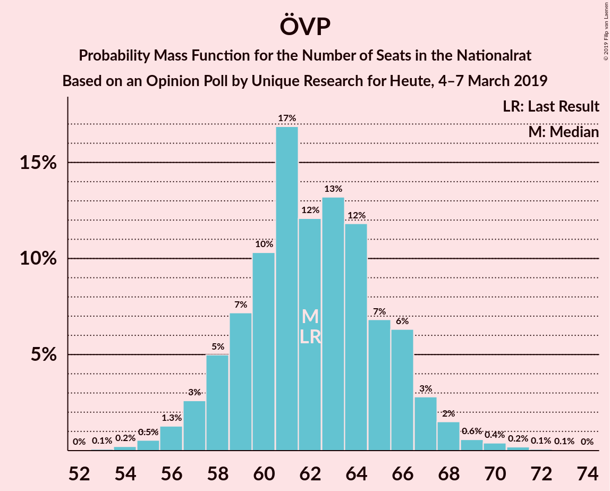

| Number of Seats | Probability | Accumulated | Special Marks |
|:---------------:|:-----------:|:-----------:|:-------------:|
| 53 | 0.1% | 100% |  |
| 54 | 0.2% | 99.9% |  |
| 55 | 0.5% | 99.7% |  |
| 56 | 1.3% | 99.1% |  |
| 57 | 3% | 98% |  |
| 58 | 5% | 95% |  |
| 59 | 7% | 90% |  |
| 60 | 10% | 83% |  |
| 61 | 17% | 73% |  |
| 62 | 12% | 56% | Last Result, Median |
| 63 | 13% | 44% |  |
| 64 | 12% | 31% |  |
| 65 | 7% | 19% |  |
| 66 | 6% | 12% |  |
| 67 | 3% | 6% |  |
| 68 | 2% | 3% |  |
| 69 | 0.6% | 1.3% |  |
| 70 | 0.4% | 0.8% |  |
| 71 | 0.2% | 0.4% |  |
| 72 | 0.1% | 0.2% |  |
| 73 | 0.1% | 0.1% |  |
| 74 | 0% | 0% |  |

### Sozialdemokratische Partei Österreichs

| Number of Seats | Probability | Accumulated | Special Marks |
|:---------------:|:-----------:|:-----------:|:-------------:|
| 42 | 0.1% | 100% |  |
| 43 | 0.2% | 99.8% |  |
| 44 | 0.6% | 99.6% |  |
| 45 | 1.4% | 99.0% |  |
| 46 | 3% | 98% |  |
| 47 | 7% | 94% |  |
| 48 | 8% | 88% |  |
| 49 | 10% | 80% |  |
| 50 | 14% | 69% |  |
| 51 | 17% | 55% | Median |
| 52 | 13% | 37% | Last Result |
| 53 | 9% | 24% |  |
| 54 | 6% | 15% |  |
| 55 | 4% | 9% |  |
| 56 | 2% | 5% |  |
| 57 | 2% | 3% |  |
| 58 | 0.6% | 1.1% |  |
| 59 | 0.4% | 0.6% |  |
| 60 | 0.1% | 0.2% |  |
| 61 | 0.1% | 0.1% |  |
| 62 | 0% | 0% |  |

## Technical Information

### Opinion Poll

+ **Polling firm:** Unique Research
+ **Commissioner(s):** Heute
+ **Fieldwork period:** 4–7 March 2019

### Calculations

+ **Sample size:** 800
+ **Simulations done:** 131,072
+ **Error estimate:** 1.27%

