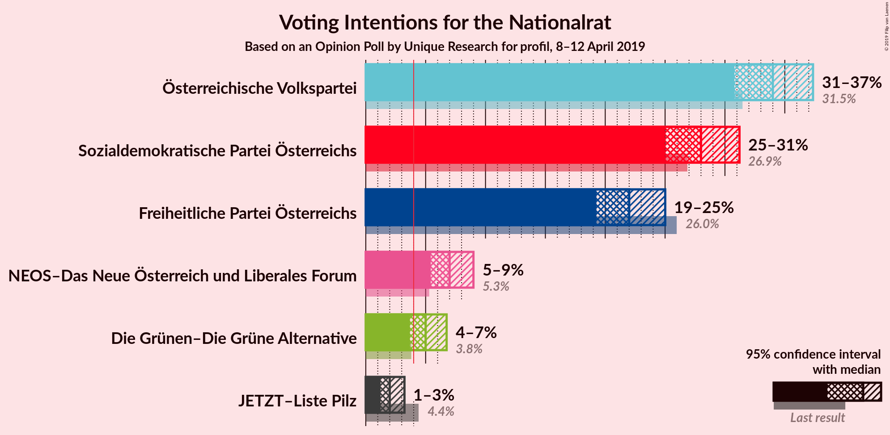
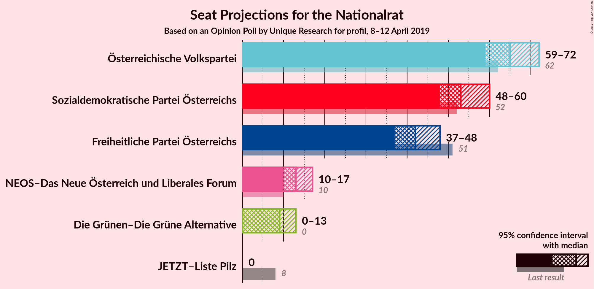
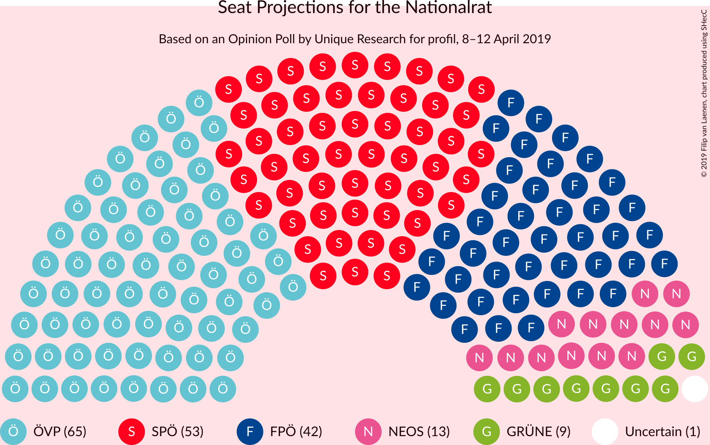
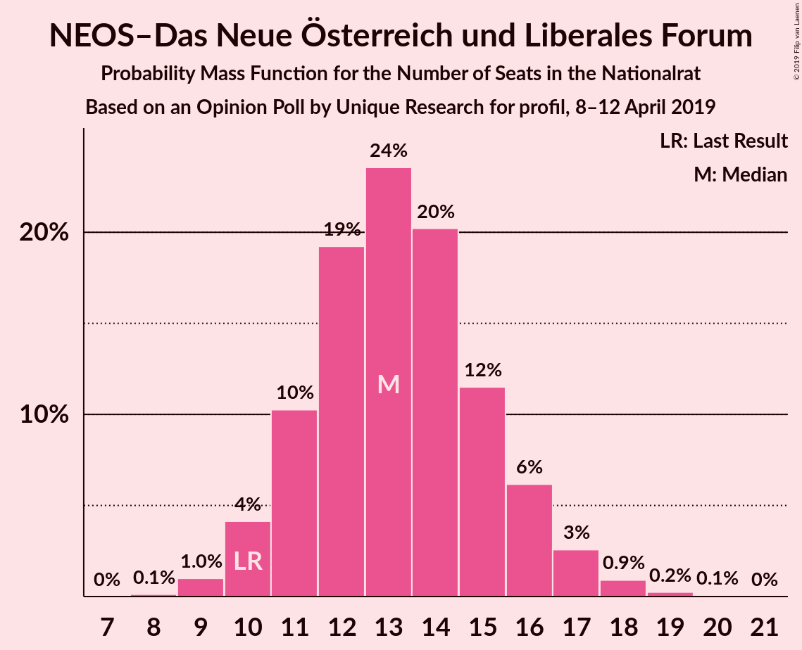
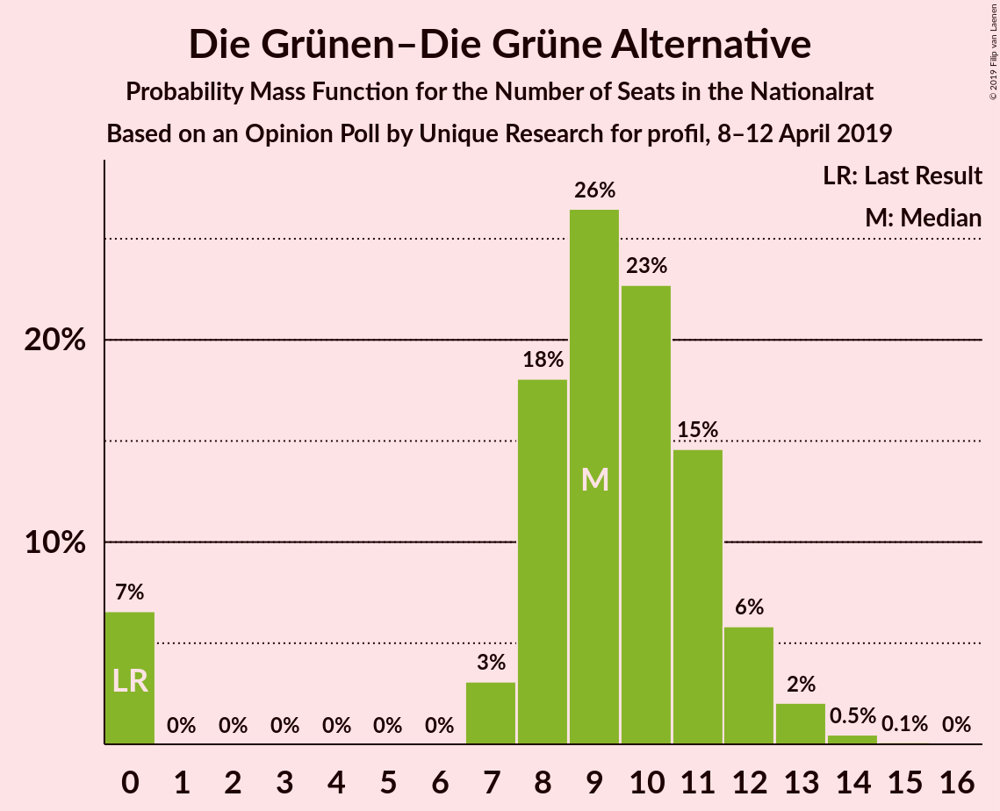
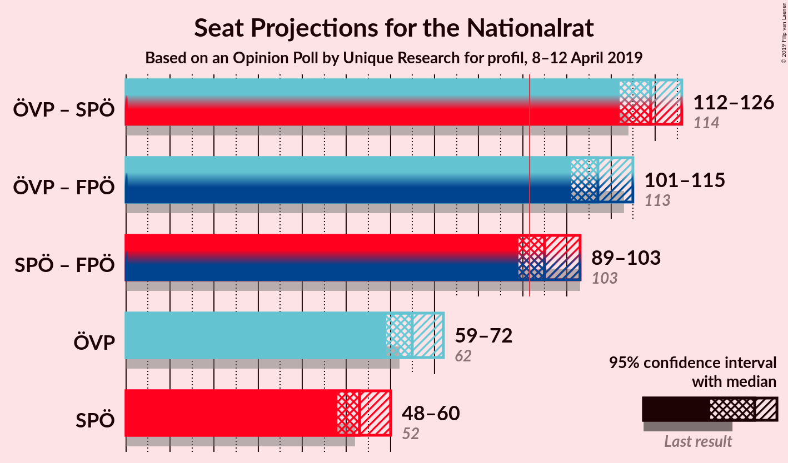
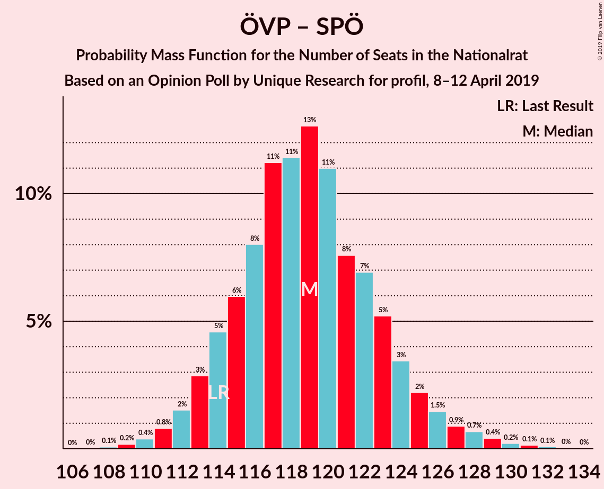
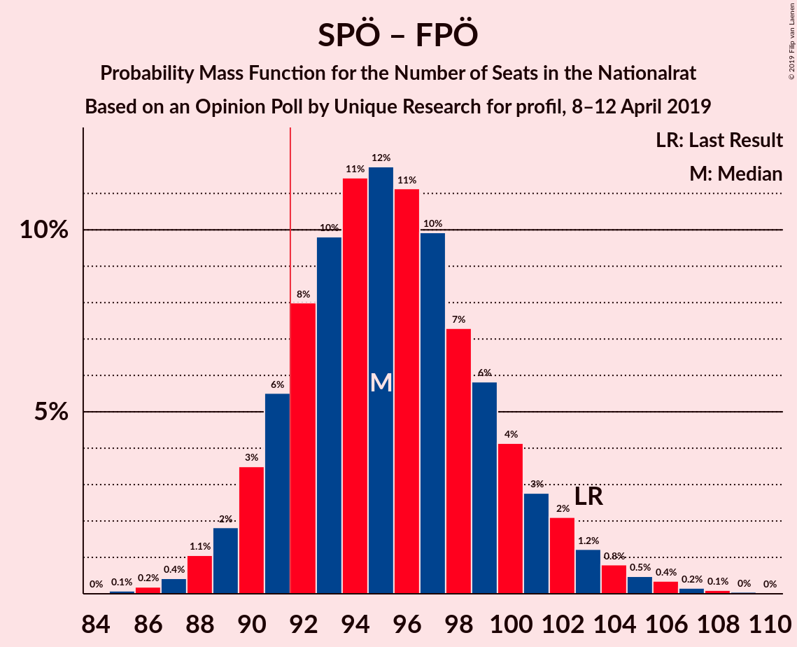

# Opinion Poll by Unique Research for profil, 8–12 April 2019

<a href="#voting-intentions">Voting Intentions</a> | <a href="#seats">Seats</a> | <a href="#coalitions">Coalitions</a> | <a href="#technical-information">Technical Information</a>

## Voting Intentions

### Confidence Intervals

| Party | Last Result | Poll Result | 80% Confidence Interval | 90% Confidence Interval | 95% Confidence Interval | 99% Confidence Interval |
|:-----:|:-----------:|:-----------:|:-----------------------:|:-----------------------:|:-----------------------:|:-----------------------:|
| Österreichische Volkspartei | 31.5% | 34.0% | 31.9–36.2% |31.3–36.8% |30.8–37.4% |29.8–38.4% |
| Sozialdemokratische Partei Österreichs | 26.9% | 28.0% | 26.0–30.1% |25.5–30.7% |25.0–31.2% |24.1–32.3% |
| Freiheitliche Partei Österreichs | 26.0% | 22.0% | 20.2–24.0% |19.7–24.5% |19.3–25.0% |18.4–26.0% |
| NEOS–Das Neue Österreich und Liberales Forum | 5.3% | 7.0% | 6.0–8.3% |5.7–8.7% |5.4–9.0% |5.0–9.6% |
| Die Grünen–Die Grüne Alternative | 3.8% | 5.0% | 4.1–6.1% |3.9–6.5% |3.7–6.8% |3.3–7.3% |
| JETZT–Liste Pilz | 4.4% | 2.0% | 1.5–2.8% |1.4–3.0% |1.2–3.2% |1.0–3.7% |

*Note:* The poll result column reflects the actual value used in the calculations. Published results may vary slightly, and in addition be rounded to fewer digits.

## Seats

### Confidence Intervals

| Party | Last Result | Median | 80% Confidence Interval | 90% Confidence Interval | 95% Confidence Interval | 99% Confidence Interval |
|:-----:|:-----------:|:------:|:-----------------------:|:-----------------------:|:-----------------------:|:-----------------------:|
| <a href="#österreichische-volkspartei">Österreichische Volkspartei</a> | 62 | 65 | 61–70 |60–71 |59–72 |57–74 |
| <a href="#sozialdemokratische-partei-österreichs">Sozialdemokratische Partei Österreichs</a> | 52 | 53 | 50–57 |49–59 |48–60 |46–62 |
| <a href="#freiheitliche-partei-österreichs">Freiheitliche Partei Österreichs</a> | 51 | 42 | 38–46 |37–47 |37–48 |35–50 |
| <a href="#neos–das-neue-österreich-und-liberales-forum">NEOS–Das Neue Österreich und Liberales Forum</a> | 10 | 13 | 11–15 |10–16 |10–17 |9–18 |
| <a href="#die-grünen–die-grüne-alternative">Die Grünen–Die Grüne Alternative</a> | 0 | 9 | 8–11 |0–12 |0–13 |0–14 |
| <a href="#jetzt–liste-pilz">JETZT–Liste Pilz</a> | 8 | 0 | 0 |0 |0 |0 |

### Österreichische Volkspartei

*For a full overview of the results for this party, see the [Österreichische Volkspartei](party-österreichischevolkspartei.html) page.*

| Number of Seats | Probability | Accumulated | Special Marks |
|:---------------:|:-----------:|:-----------:|:-------------:|
| 55 | 0.1% | 100% |  |
| 56 | 0.2% | 99.9% |  |
| 57 | 0.5% | 99.7% |  |
| 58 | 1.1% | 99.1% |  |
| 59 | 2% | 98% |  |
| 60 | 3% | 96% |  |
| 61 | 5% | 94% |  |
| 62 | 7% | 89% | Last Result |
| 63 | 11% | 82% |  |
| 64 | 11% | 71% |  |
| 65 | 12% | 60% | Median |
| 66 | 11% | 48% |  |
| 67 | 12% | 38% |  |
| 68 | 9% | 26% |  |
| 69 | 7% | 17% |  |
| 70 | 4% | 10% |  |
| 71 | 2% | 6% |  |
| 72 | 2% | 4% |  |
| 73 | 1.2% | 2% |  |
| 74 | 0.4% | 0.8% |  |
| 75 | 0.2% | 0.4% |  |
| 76 | 0.1% | 0.2% |  |
| 77 | 0% | 0.1% |  |
| 78 | 0% | 0% |  |

### Sozialdemokratische Partei Österreichs

*For a full overview of the results for this party, see the [Sozialdemokratische Partei Österreichs](party-sozialdemokratischeparteiösterreichs.html) page.*

| Number of Seats | Probability | Accumulated | Special Marks |
|:---------------:|:-----------:|:-----------:|:-------------:|
| 44 | 0.1% | 100% |  |
| 45 | 0.2% | 99.9% |  |
| 46 | 0.6% | 99.6% |  |
| 47 | 1.4% | 99.0% |  |
| 48 | 3% | 98% |  |
| 49 | 5% | 95% |  |
| 50 | 7% | 90% |  |
| 51 | 11% | 84% |  |
| 52 | 11% | 73% | Last Result |
| 53 | 13% | 61% | Median |
| 54 | 12% | 48% |  |
| 55 | 10% | 36% |  |
| 56 | 9% | 25% |  |
| 57 | 7% | 17% |  |
| 58 | 4% | 10% |  |
| 59 | 2% | 5% |  |
| 60 | 2% | 3% |  |
| 61 | 0.8% | 2% |  |
| 62 | 0.4% | 0.7% |  |
| 63 | 0.2% | 0.3% |  |
| 64 | 0.1% | 0.2% |  |
| 65 | 0% | 0.1% |  |
| 66 | 0% | 0% |  |

### Freiheitliche Partei Österreichs

*For a full overview of the results for this party, see the [Freiheitliche Partei Österreichs](party-freiheitlicheparteiösterreichs.html) page.*

| Number of Seats | Probability | Accumulated | Special Marks |
|:---------------:|:-----------:|:-----------:|:-------------:|
| 33 | 0.1% | 100% |  |
| 34 | 0.2% | 99.9% |  |
| 35 | 0.7% | 99.7% |  |
| 36 | 1.4% | 99.0% |  |
| 37 | 3% | 98% |  |
| 38 | 6% | 95% |  |
| 39 | 7% | 88% |  |
| 40 | 12% | 81% |  |
| 41 | 15% | 69% |  |
| 42 | 12% | 54% | Median |
| 43 | 14% | 42% |  |
| 44 | 11% | 28% |  |
| 45 | 7% | 17% |  |
| 46 | 5% | 11% |  |
| 47 | 3% | 6% |  |
| 48 | 2% | 3% |  |
| 49 | 0.8% | 1.4% |  |
| 50 | 0.4% | 0.6% |  |
| 51 | 0.2% | 0.3% | Last Result |
| 52 | 0.1% | 0.1% |  |
| 53 | 0% | 0% |  |

### NEOS–Das Neue Österreich und Liberales Forum

*For a full overview of the results for this party, see the [NEOS–Das Neue Österreich und Liberales Forum](party-neos–dasneueösterreichundliberalesforum.html) page.*

| Number of Seats | Probability | Accumulated | Special Marks |
|:---------------:|:-----------:|:-----------:|:-------------:|
| 8 | 0.1% | 100% |  |
| 9 | 1.0% | 99.9% |  |
| 10 | 4% | 98.9% | Last Result |
| 11 | 10% | 95% |  |
| 12 | 19% | 84% |  |
| 13 | 24% | 65% | Median |
| 14 | 20% | 42% |  |
| 15 | 12% | 21% |  |
| 16 | 6% | 10% |  |
| 17 | 3% | 4% |  |
| 18 | 0.9% | 1.2% |  |
| 19 | 0.2% | 0.3% |  |
| 20 | 0.1% | 0.1% |  |
| 21 | 0% | 0% |  |

### Die Grünen–Die Grüne Alternative

*For a full overview of the results for this party, see the [Die Grünen–Die Grüne Alternative](party-diegrünen–diegrünealternative.html) page.*

| Number of Seats | Probability | Accumulated | Special Marks |
|:---------------:|:-----------:|:-----------:|:-------------:|
| 0 | 7% | 100% | Last Result |
| 1 | 0% | 93% |  |
| 2 | 0% | 93% |  |
| 3 | 0% | 93% |  |
| 4 | 0% | 93% |  |
| 5 | 0% | 93% |  |
| 6 | 0% | 93% |  |
| 7 | 3% | 93% |  |
| 8 | 18% | 90% |  |
| 9 | 26% | 72% | Median |
| 10 | 23% | 46% |  |
| 11 | 15% | 23% |  |
| 12 | 6% | 8% |  |
| 13 | 2% | 3% |  |
| 14 | 0.5% | 0.6% |  |
| 15 | 0.1% | 0.1% |  |
| 16 | 0% | 0% |  |

### JETZT–Liste Pilz

*For a full overview of the results for this party, see the [JETZT–Liste Pilz](party-jetzt–listepilz.html) page.*

| Number of Seats | Probability | Accumulated | Special Marks |
|:---------------:|:-----------:|:-----------:|:-------------:|
| 0 | 99.9% | 100% | Median |
| 1 | 0% | 0.1% |  |
| 2 | 0% | 0.1% |  |
| 3 | 0% | 0.1% |  |
| 4 | 0% | 0.1% |  |
| 5 | 0% | 0.1% |  |
| 6 | 0% | 0.1% |  |
| 7 | 0.1% | 0.1% |  |
| 8 | 0% | 0% | Last Result |

## Coalitions

### Confidence Intervals

| Coalition | Last Result | Median | Majority? | 80% Confidence Interval | 90% Confidence Interval | 95% Confidence Interval | 99% Confidence Interval |
|:---------:|:-----------:|:------:|:---------:|:-----------------------:|:-----------------------:|:-----------------------:|:-----------------------:|
| Österreichische Volkspartei – Sozialdemokratische Partei Österreichs | 114 | 119 | 100% | 114–123 | 113–125 | 112–126 | 110–129 |
| Österreichische Volkspartei – Freiheitliche Partei Österreichs | 113 | 107 | 100% | 103–112 | 102–113 | 101–115 | 98–118 |
| Sozialdemokratische Partei Österreichs – Freiheitliche Partei Österreichs | 103 | 95 | 87% | 91–100 | 90–102 | 89–103 | 87–106 |
| Österreichische Volkspartei | 62 | 65 | 0% | 61–70 | 60–71 | 59–72 | 57–74 |
| Sozialdemokratische Partei Österreichs | 52 | 53 | 0% | 50–57 | 49–59 | 48–60 | 46–62 |

### Österreichische Volkspartei – Sozialdemokratische Partei Österreichs

| Number of Seats | Probability | Accumulated | Special Marks |
|:---------------:|:-----------:|:-----------:|:-------------:|
| 108 | 0.1% | 100% |  |
| 109 | 0.2% | 99.9% |  |
| 110 | 0.4% | 99.7% |  |
| 111 | 0.8% | 99.3% |  |
| 112 | 2% | 98.5% |  |
| 113 | 3% | 97% |  |
| 114 | 5% | 94% | Last Result |
| 115 | 6% | 90% |  |
| 116 | 8% | 84% |  |
| 117 | 11% | 76% |  |
| 118 | 11% | 64% | Median |
| 119 | 13% | 53% |  |
| 120 | 11% | 40% |  |
| 121 | 8% | 29% |  |
| 122 | 7% | 22% |  |
| 123 | 5% | 15% |  |
| 124 | 3% | 10% |  |
| 125 | 2% | 6% |  |
| 126 | 1.5% | 4% |  |
| 127 | 0.9% | 2% |  |
| 128 | 0.7% | 2% |  |
| 129 | 0.4% | 0.9% |  |
| 130 | 0.2% | 0.5% |  |
| 131 | 0.1% | 0.3% |  |
| 132 | 0.1% | 0.1% |  |
| 133 | 0% | 0.1% |  |
| 134 | 0% | 0% |  |

### Österreichische Volkspartei – Freiheitliche Partei Österreichs

| Number of Seats | Probability | Accumulated | Special Marks |
|:---------------:|:-----------:|:-----------:|:-------------:|
| 96 | 0.1% | 100% |  |
| 97 | 0.1% | 99.9% |  |
| 98 | 0.3% | 99.8% |  |
| 99 | 0.7% | 99.5% |  |
| 100 | 1.2% | 98.8% |  |
| 101 | 2% | 98% |  |
| 102 | 3% | 95% |  |
| 103 | 6% | 92% |  |
| 104 | 7% | 86% |  |
| 105 | 10% | 79% |  |
| 106 | 11% | 69% |  |
| 107 | 12% | 59% | Median |
| 108 | 11% | 47% |  |
| 109 | 10% | 36% |  |
| 110 | 8% | 26% |  |
| 111 | 6% | 18% |  |
| 112 | 4% | 12% |  |
| 113 | 3% | 8% | Last Result |
| 114 | 2% | 5% |  |
| 115 | 1.4% | 3% |  |
| 116 | 0.8% | 2% |  |
| 117 | 0.3% | 0.9% |  |
| 118 | 0.3% | 0.6% |  |
| 119 | 0.2% | 0.3% |  |
| 120 | 0.1% | 0.1% |  |
| 121 | 0% | 0.1% |  |
| 122 | 0% | 0% |  |

### Sozialdemokratische Partei Österreichs – Freiheitliche Partei Österreichs

| Number of Seats | Probability | Accumulated | Special Marks |
|:---------------:|:-----------:|:-----------:|:-------------:|
| 85 | 0.1% | 100% |  |
| 86 | 0.2% | 99.9% |  |
| 87 | 0.4% | 99.7% |  |
| 88 | 1.1% | 99.3% |  |
| 89 | 2% | 98% |  |
| 90 | 3% | 96% |  |
| 91 | 6% | 93% |  |
| 92 | 8% | 87% | Majority |
| 93 | 10% | 79% |  |
| 94 | 11% | 70% |  |
| 95 | 12% | 58% | Median |
| 96 | 11% | 46% |  |
| 97 | 10% | 35% |  |
| 98 | 7% | 25% |  |
| 99 | 6% | 18% |  |
| 100 | 4% | 12% |  |
| 101 | 3% | 8% |  |
| 102 | 2% | 5% |  |
| 103 | 1.2% | 3% | Last Result |
| 104 | 0.8% | 2% |  |
| 105 | 0.5% | 1.2% |  |
| 106 | 0.4% | 0.7% |  |
| 107 | 0.2% | 0.3% |  |
| 108 | 0.1% | 0.2% |  |
| 109 | 0% | 0.1% |  |
| 110 | 0% | 0% |  |

### Österreichische Volkspartei

| Number of Seats | Probability | Accumulated | Special Marks |
|:---------------:|:-----------:|:-----------:|:-------------:|
| 55 | 0.1% | 100% |  |
| 56 | 0.2% | 99.9% |  |
| 57 | 0.5% | 99.7% |  |
| 58 | 1.1% | 99.1% |  |
| 59 | 2% | 98% |  |
| 60 | 3% | 96% |  |
| 61 | 5% | 94% |  |
| 62 | 7% | 89% | Last Result |
| 63 | 11% | 82% |  |
| 64 | 11% | 71% |  |
| 65 | 12% | 60% | Median |
| 66 | 11% | 48% |  |
| 67 | 12% | 38% |  |
| 68 | 9% | 26% |  |
| 69 | 7% | 17% |  |
| 70 | 4% | 10% |  |
| 71 | 2% | 6% |  |
| 72 | 2% | 4% |  |
| 73 | 1.2% | 2% |  |
| 74 | 0.4% | 0.8% |  |
| 75 | 0.2% | 0.4% |  |
| 76 | 0.1% | 0.2% |  |
| 77 | 0% | 0.1% |  |
| 78 | 0% | 0% |  |

### Sozialdemokratische Partei Österreichs

| Number of Seats | Probability | Accumulated | Special Marks |
|:---------------:|:-----------:|:-----------:|:-------------:|
| 44 | 0.1% | 100% |  |
| 45 | 0.2% | 99.9% |  |
| 46 | 0.6% | 99.6% |  |
| 47 | 1.4% | 99.0% |  |
| 48 | 3% | 98% |  |
| 49 | 5% | 95% |  |
| 50 | 7% | 90% |  |
| 51 | 11% | 84% |  |
| 52 | 11% | 73% | Last Result |
| 53 | 13% | 61% | Median |
| 54 | 12% | 48% |  |
| 55 | 10% | 36% |  |
| 56 | 9% | 25% |  |
| 57 | 7% | 17% |  |
| 58 | 4% | 10% |  |
| 59 | 2% | 5% |  |
| 60 | 2% | 3% |  |
| 61 | 0.8% | 2% |  |
| 62 | 0.4% | 0.7% |  |
| 63 | 0.2% | 0.3% |  |
| 64 | 0.1% | 0.2% |  |
| 65 | 0% | 0.1% |  |
| 66 | 0% | 0% |  |

## Technical Information

### Opinion Poll

+ **Polling firm:** Unique Research
+ **Commissioner(s):** profil
+ **Fieldwork period:** 8–12 April 2019

### Calculations

+ **Sample size:** 800
+ **Simulations done:** 1,048,576
+ **Error estimate:** 1.74%

