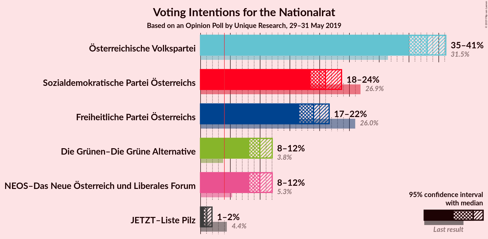
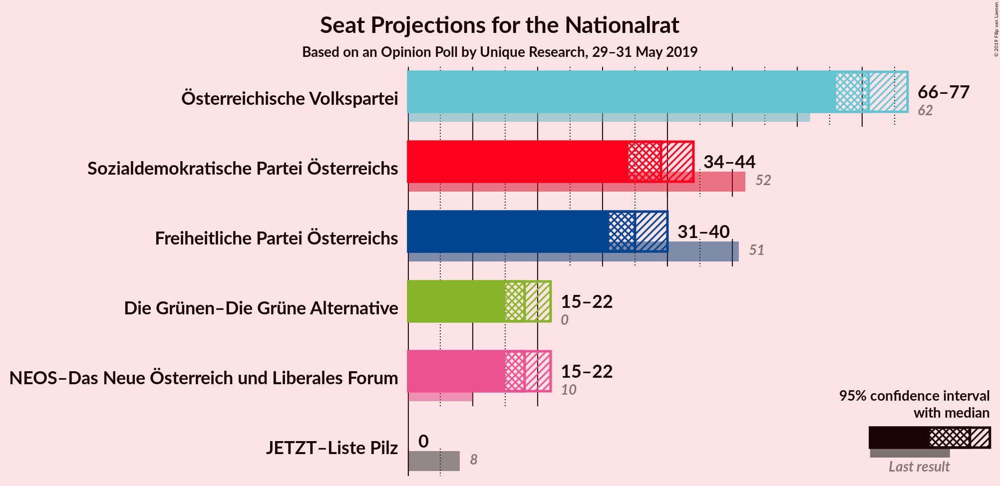
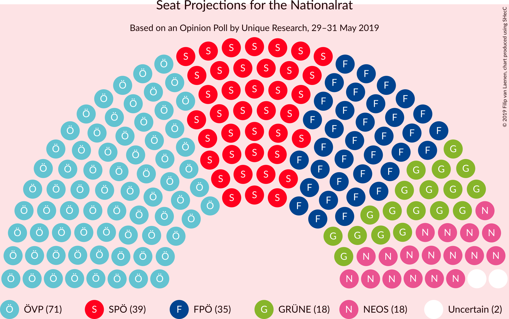
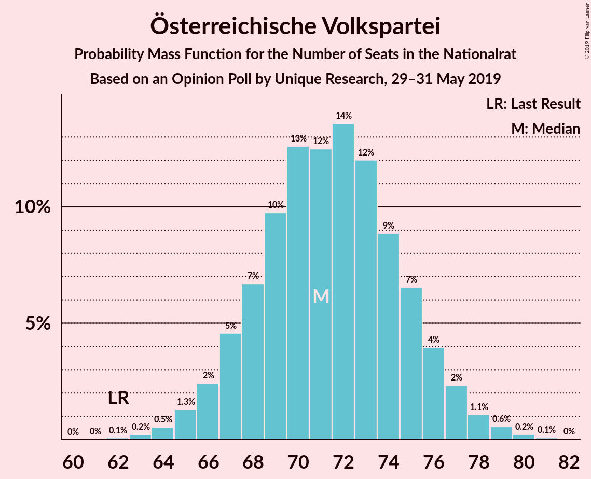
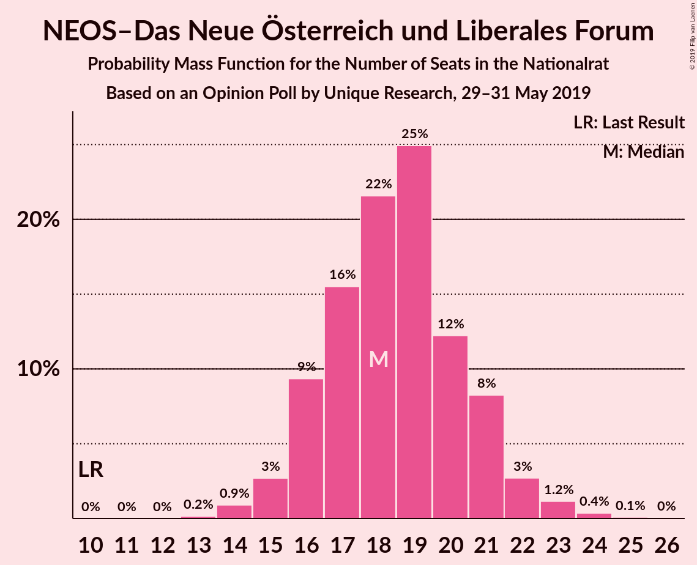
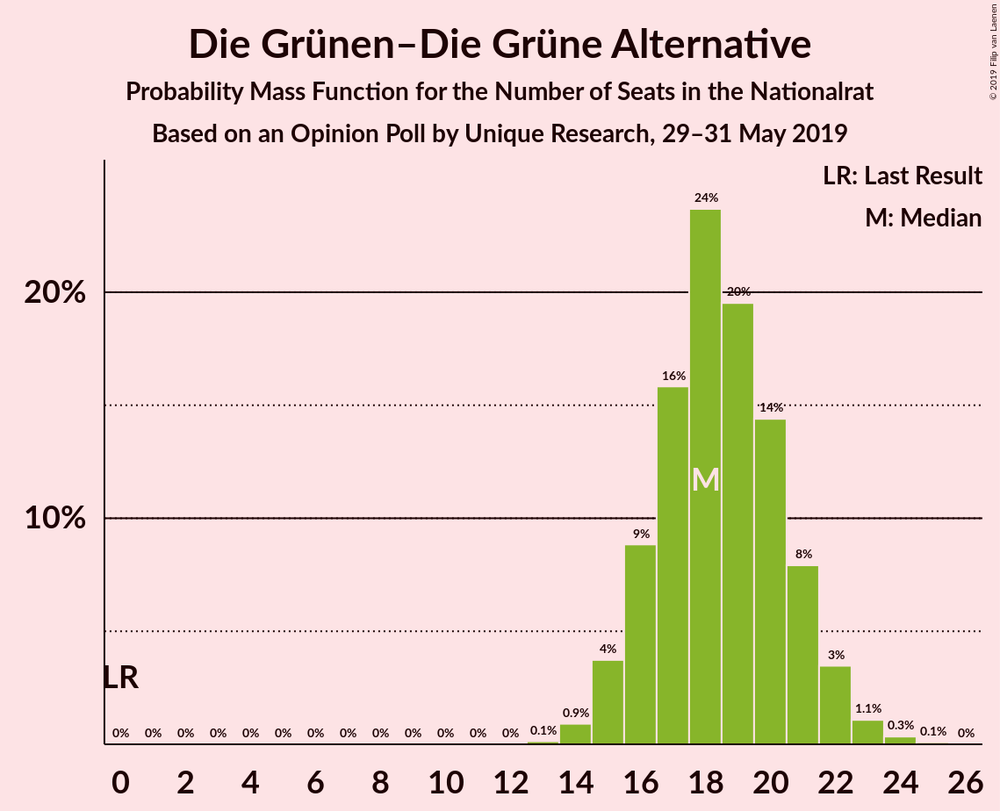
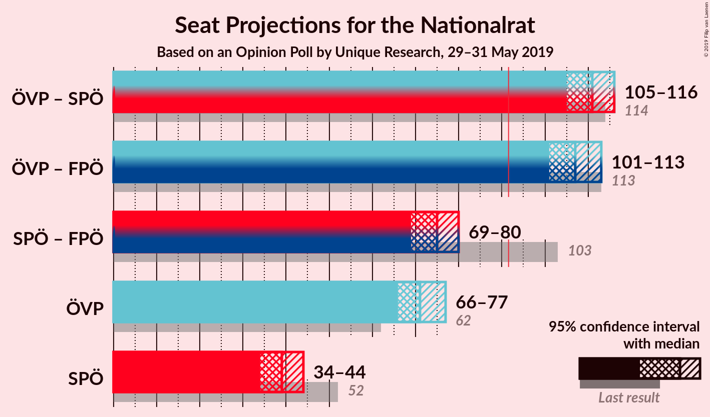
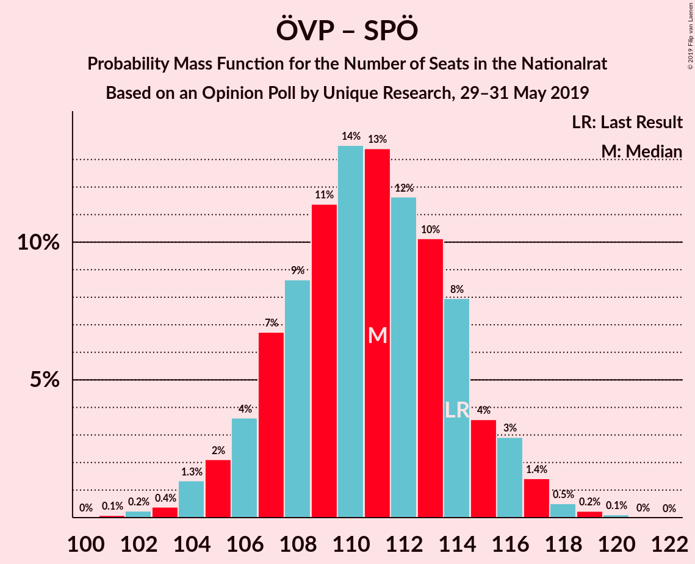
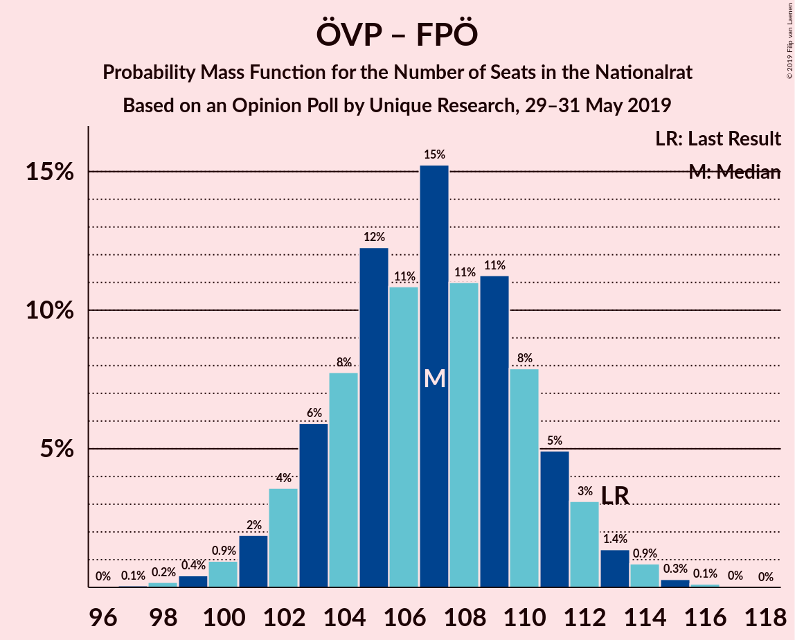
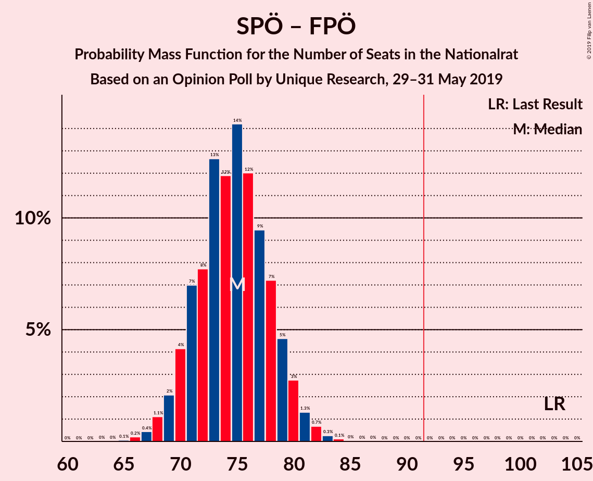

# Opinion Poll by Unique Research, 29–31 May 2019

<a href="#voting-intentions">Voting Intentions</a> | <a href="#seats">Seats</a> | <a href="#coalitions">Coalitions</a> | <a href="#technical-information">Technical Information</a>

## Voting Intentions

### Confidence Intervals

| Party | Last Result | Poll Result | 80% Confidence Interval | 90% Confidence Interval | 95% Confidence Interval | 99% Confidence Interval |
|:-----:|:-----------:|:-----------:|:-----------------------:|:-----------------------:|:-----------------------:|:-----------------------:|
| Österreichische Volkspartei | 31.5% | 38.1% | 36.1–40.1% |35.5–40.7% |35.0–41.2% |34.1–42.2% |
| Sozialdemokratische Partei Österreichs | 26.9% | 21.0% | 19.3–22.7% |18.9–23.2% |18.5–23.7% |17.7–24.5% |
| Freiheitliche Partei Österreichs | 26.0% | 19.0% | 17.4–20.7% |17.0–21.2% |16.6–21.6% |15.9–22.4% |
| NEOS–Das Neue Österreich und Liberales Forum | 5.3% | 10.0% | 8.8–11.3% |8.5–11.7% |8.2–12.0% |7.7–12.7% |
| Die Grünen–Die Grüne Alternative | 3.8% | 10.0% | 8.8–11.3% |8.5–11.7% |8.2–12.0% |7.7–12.7% |
| JETZT–Liste Pilz | 4.4% | 1.0% | 0.7–1.6% |0.6–1.8% |0.6–1.9% |0.4–2.2% |

*Note:* The poll result column reflects the actual value used in the calculations. Published results may vary slightly, and in addition be rounded to fewer digits.

## Seats

### Confidence Intervals

| Party | Last Result | Median | 80% Confidence Interval | 90% Confidence Interval | 95% Confidence Interval | 99% Confidence Interval |
|:-----:|:-----------:|:------:|:-----------------------:|:-----------------------:|:-----------------------:|:-----------------------:|
| <a href="#österreichische-volkspartei">Österreichische Volkspartei</a> | 62 | 71 | 68–75 |67–76 |66–77 |64–79 |
| <a href="#sozialdemokratische-partei-österreichs">Sozialdemokratische Partei Österreichs</a> | 52 | 39 | 36–42 |35–43 |34–44 |33–46 |
| <a href="#freiheitliche-partei-österreichs">Freiheitliche Partei Österreichs</a> | 51 | 35 | 32–38 |32–39 |31–40 |30–42 |
| <a href="#neos–das-neue-österreich-und-liberales-forum">NEOS–Das Neue Österreich und Liberales Forum</a> | 10 | 18 | 16–21 |16–21 |15–22 |14–23 |
| <a href="#die-grünen–die-grüne-alternative">Die Grünen–Die Grüne Alternative</a> | 0 | 18 | 16–21 |16–22 |15–22 |14–23 |
| <a href="#jetzt–liste-pilz">JETZT–Liste Pilz</a> | 8 | 0 | 0 |0 |0 |0 |

### Österreichische Volkspartei

*For a full overview of the results for this party, see the [Österreichische Volkspartei](party-österreichischevolkspartei.html) page.*

| Number of Seats | Probability | Accumulated | Special Marks |
|:---------------:|:-----------:|:-----------:|:-------------:|
| 62 | 0.1% | 100% | Last Result |
| 63 | 0.2% | 99.9% |  |
| 64 | 0.5% | 99.7% |  |
| 65 | 1.3% | 99.1% |  |
| 66 | 2% | 98% |  |
| 67 | 5% | 95% |  |
| 68 | 7% | 91% |  |
| 69 | 10% | 84% |  |
| 70 | 13% | 74% |  |
| 71 | 12% | 62% | Median |
| 72 | 14% | 49% |  |
| 73 | 12% | 36% |  |
| 74 | 9% | 24% |  |
| 75 | 7% | 15% |  |
| 76 | 4% | 8% |  |
| 77 | 2% | 4% |  |
| 78 | 1.1% | 2% |  |
| 79 | 0.6% | 0.9% |  |
| 80 | 0.2% | 0.3% |  |
| 81 | 0.1% | 0.1% |  |
| 82 | 0% | 0% |  |

### Sozialdemokratische Partei Österreichs

*For a full overview of the results for this party, see the [Sozialdemokratische Partei Österreichs](party-sozialdemokratischeparteiösterreichs.html) page.*

| Number of Seats | Probability | Accumulated | Special Marks |
|:---------------:|:-----------:|:-----------:|:-------------:|
| 31 | 0% | 100% |  |
| 32 | 0.2% | 99.9% |  |
| 33 | 0.6% | 99.8% |  |
| 34 | 2% | 99.2% |  |
| 35 | 4% | 97% |  |
| 36 | 7% | 94% |  |
| 37 | 12% | 87% |  |
| 38 | 14% | 75% |  |
| 39 | 16% | 61% | Median |
| 40 | 14% | 45% |  |
| 41 | 12% | 30% |  |
| 42 | 9% | 18% |  |
| 43 | 4% | 9% |  |
| 44 | 3% | 5% |  |
| 45 | 1.1% | 2% |  |
| 46 | 0.4% | 0.7% |  |
| 47 | 0.2% | 0.2% |  |
| 48 | 0% | 0.1% |  |
| 49 | 0% | 0% |  |
| 50 | 0% | 0% |  |
| 51 | 0% | 0% |  |
| 52 | 0% | 0% | Last Result |

### Freiheitliche Partei Österreichs

*For a full overview of the results for this party, see the [Freiheitliche Partei Österreichs](party-freiheitlicheparteiösterreichs.html) page.*

| Number of Seats | Probability | Accumulated | Special Marks |
|:---------------:|:-----------:|:-----------:|:-------------:|
| 28 | 0.1% | 100% |  |
| 29 | 0.3% | 99.9% |  |
| 30 | 1.1% | 99.6% |  |
| 31 | 3% | 98% |  |
| 32 | 6% | 96% |  |
| 33 | 10% | 90% |  |
| 34 | 15% | 80% |  |
| 35 | 17% | 65% | Median |
| 36 | 16% | 48% |  |
| 37 | 13% | 32% |  |
| 38 | 9% | 18% |  |
| 39 | 5% | 10% |  |
| 40 | 3% | 4% |  |
| 41 | 1.2% | 2% |  |
| 42 | 0.5% | 0.7% |  |
| 43 | 0.2% | 0.2% |  |
| 44 | 0% | 0.1% |  |
| 45 | 0% | 0% |  |
| 46 | 0% | 0% |  |
| 47 | 0% | 0% |  |
| 48 | 0% | 0% |  |
| 49 | 0% | 0% |  |
| 50 | 0% | 0% |  |
| 51 | 0% | 0% | Last Result |

### NEOS–Das Neue Österreich und Liberales Forum

*For a full overview of the results for this party, see the [NEOS–Das Neue Österreich und Liberales Forum](party-neos–dasneueösterreichundliberalesforum.html) page.*

| Number of Seats | Probability | Accumulated | Special Marks |
|:---------------:|:-----------:|:-----------:|:-------------:|
| 10 | 0% | 100% | Last Result |
| 11 | 0% | 100% |  |
| 12 | 0% | 100% |  |
| 13 | 0.2% | 100% |  |
| 14 | 0.9% | 99.8% |  |
| 15 | 3% | 98.9% |  |
| 16 | 9% | 96% |  |
| 17 | 16% | 87% |  |
| 18 | 22% | 71% | Median |
| 19 | 25% | 50% |  |
| 20 | 12% | 25% |  |
| 21 | 8% | 13% |  |
| 22 | 3% | 4% |  |
| 23 | 1.2% | 2% |  |
| 24 | 0.4% | 0.5% |  |
| 25 | 0.1% | 0.1% |  |
| 26 | 0% | 0% |  |

### Die Grünen–Die Grüne Alternative

*For a full overview of the results for this party, see the [Die Grünen–Die Grüne Alternative](party-diegrünen–diegrünealternative.html) page.*

| Number of Seats | Probability | Accumulated | Special Marks |
|:---------------:|:-----------:|:-----------:|:-------------:|
| 0 | 0% | 100% | Last Result |
| 1 | 0% | 100% |  |
| 2 | 0% | 100% |  |
| 3 | 0% | 100% |  |
| 4 | 0% | 100% |  |
| 5 | 0% | 100% |  |
| 6 | 0% | 100% |  |
| 7 | 0% | 100% |  |
| 8 | 0% | 100% |  |
| 9 | 0% | 100% |  |
| 10 | 0% | 100% |  |
| 11 | 0% | 100% |  |
| 12 | 0% | 100% |  |
| 13 | 0.1% | 100% |  |
| 14 | 0.9% | 99.9% |  |
| 15 | 4% | 98.9% |  |
| 16 | 9% | 95% |  |
| 17 | 16% | 86% |  |
| 18 | 24% | 71% | Median |
| 19 | 20% | 47% |  |
| 20 | 14% | 27% |  |
| 21 | 8% | 13% |  |
| 22 | 3% | 5% |  |
| 23 | 1.1% | 2% |  |
| 24 | 0.3% | 0.5% |  |
| 25 | 0.1% | 0.1% |  |
| 26 | 0% | 0% |  |

### JETZT–Liste Pilz

*For a full overview of the results for this party, see the [JETZT–Liste Pilz](party-jetzt–listepilz.html) page.*

| Number of Seats | Probability | Accumulated | Special Marks |
|:---------------:|:-----------:|:-----------:|:-------------:|
| 0 | 100% | 100% | Median |
| 1 | 0% | 0% |  |
| 2 | 0% | 0% |  |
| 3 | 0% | 0% |  |
| 4 | 0% | 0% |  |
| 5 | 0% | 0% |  |
| 6 | 0% | 0% |  |
| 7 | 0% | 0% |  |
| 8 | 0% | 0% | Last Result |

## Coalitions

### Confidence Intervals

| Coalition | Last Result | Median | Majority? | 80% Confidence Interval | 90% Confidence Interval | 95% Confidence Interval | 99% Confidence Interval |
|:---------:|:-----------:|:------:|:---------:|:-----------------------:|:-----------------------:|:-----------------------:|:-----------------------:|
| Österreichische Volkspartei – Sozialdemokratische Partei Österreichs | 114 | 111 | 100% | 107–114 | 106–116 | 105–116 | 103–118 |
| Österreichische Volkspartei – Freiheitliche Partei Österreichs | 113 | 107 | 100% | 103–111 | 102–112 | 101–113 | 99–114 |
| Sozialdemokratische Partei Österreichs – Freiheitliche Partei Österreichs | 103 | 75 | 0% | 71–78 | 70–80 | 69–80 | 67–82 |
| Österreichische Volkspartei | 62 | 71 | 0% | 68–75 | 67–76 | 66–77 | 64–79 |
| Sozialdemokratische Partei Österreichs | 52 | 39 | 0% | 36–42 | 35–43 | 34–44 | 33–46 |

### Österreichische Volkspartei – Sozialdemokratische Partei Österreichs

| Number of Seats | Probability | Accumulated | Special Marks |
|:---------------:|:-----------:|:-----------:|:-------------:|
| 101 | 0.1% | 100% |  |
| 102 | 0.2% | 99.9% |  |
| 103 | 0.4% | 99.6% |  |
| 104 | 1.3% | 99.3% |  |
| 105 | 2% | 98% |  |
| 106 | 4% | 96% |  |
| 107 | 7% | 92% |  |
| 108 | 9% | 85% |  |
| 109 | 11% | 77% |  |
| 110 | 14% | 65% | Median |
| 111 | 13% | 52% |  |
| 112 | 12% | 39% |  |
| 113 | 10% | 27% |  |
| 114 | 8% | 17% | Last Result |
| 115 | 4% | 9% |  |
| 116 | 3% | 5% |  |
| 117 | 1.4% | 2% |  |
| 118 | 0.5% | 0.9% |  |
| 119 | 0.2% | 0.4% |  |
| 120 | 0.1% | 0.1% |  |
| 121 | 0% | 0% |  |

### Österreichische Volkspartei – Freiheitliche Partei Österreichs

| Number of Seats | Probability | Accumulated | Special Marks |
|:---------------:|:-----------:|:-----------:|:-------------:|
| 97 | 0.1% | 100% |  |
| 98 | 0.2% | 99.9% |  |
| 99 | 0.4% | 99.7% |  |
| 100 | 0.9% | 99.3% |  |
| 101 | 2% | 98% |  |
| 102 | 4% | 96% |  |
| 103 | 6% | 93% |  |
| 104 | 8% | 87% |  |
| 105 | 12% | 79% |  |
| 106 | 11% | 67% | Median |
| 107 | 15% | 56% |  |
| 108 | 11% | 41% |  |
| 109 | 11% | 30% |  |
| 110 | 8% | 19% |  |
| 111 | 5% | 11% |  |
| 112 | 3% | 6% |  |
| 113 | 1.4% | 3% | Last Result |
| 114 | 0.9% | 1.3% |  |
| 115 | 0.3% | 0.5% |  |
| 116 | 0.1% | 0.2% |  |
| 117 | 0% | 0.1% |  |
| 118 | 0% | 0% |  |

### Sozialdemokratische Partei Österreichs – Freiheitliche Partei Österreichs

| Number of Seats | Probability | Accumulated | Special Marks |
|:---------------:|:-----------:|:-----------:|:-------------:|
| 65 | 0.1% | 100% |  |
| 66 | 0.2% | 99.9% |  |
| 67 | 0.4% | 99.7% |  |
| 68 | 1.1% | 99.3% |  |
| 69 | 2% | 98% |  |
| 70 | 4% | 96% |  |
| 71 | 7% | 92% |  |
| 72 | 8% | 85% |  |
| 73 | 13% | 77% |  |
| 74 | 12% | 65% | Median |
| 75 | 14% | 53% |  |
| 76 | 12% | 38% |  |
| 77 | 9% | 26% |  |
| 78 | 7% | 17% |  |
| 79 | 5% | 10% |  |
| 80 | 3% | 5% |  |
| 81 | 1.3% | 2% |  |
| 82 | 0.7% | 1.1% |  |
| 83 | 0.3% | 0.4% |  |
| 84 | 0.1% | 0.2% |  |
| 85 | 0% | 0.1% |  |
| 86 | 0% | 0% |  |
| 87 | 0% | 0% |  |
| 88 | 0% | 0% |  |
| 89 | 0% | 0% |  |
| 90 | 0% | 0% |  |
| 91 | 0% | 0% |  |
| 92 | 0% | 0% | Majority |
| 93 | 0% | 0% |  |
| 94 | 0% | 0% |  |
| 95 | 0% | 0% |  |
| 96 | 0% | 0% |  |
| 97 | 0% | 0% |  |
| 98 | 0% | 0% |  |
| 99 | 0% | 0% |  |
| 100 | 0% | 0% |  |
| 101 | 0% | 0% |  |
| 102 | 0% | 0% |  |
| 103 | 0% | 0% | Last Result |

### Österreichische Volkspartei

| Number of Seats | Probability | Accumulated | Special Marks |
|:---------------:|:-----------:|:-----------:|:-------------:|
| 62 | 0.1% | 100% | Last Result |
| 63 | 0.2% | 99.9% |  |
| 64 | 0.5% | 99.7% |  |
| 65 | 1.3% | 99.1% |  |
| 66 | 2% | 98% |  |
| 67 | 5% | 95% |  |
| 68 | 7% | 91% |  |
| 69 | 10% | 84% |  |
| 70 | 13% | 74% |  |
| 71 | 12% | 62% | Median |
| 72 | 14% | 49% |  |
| 73 | 12% | 36% |  |
| 74 | 9% | 24% |  |
| 75 | 7% | 15% |  |
| 76 | 4% | 8% |  |
| 77 | 2% | 4% |  |
| 78 | 1.1% | 2% |  |
| 79 | 0.6% | 0.9% |  |
| 80 | 0.2% | 0.3% |  |
| 81 | 0.1% | 0.1% |  |
| 82 | 0% | 0% |  |

### Sozialdemokratische Partei Österreichs

| Number of Seats | Probability | Accumulated | Special Marks |
|:---------------:|:-----------:|:-----------:|:-------------:|
| 31 | 0% | 100% |  |
| 32 | 0.2% | 99.9% |  |
| 33 | 0.6% | 99.8% |  |
| 34 | 2% | 99.2% |  |
| 35 | 4% | 97% |  |
| 36 | 7% | 94% |  |
| 37 | 12% | 87% |  |
| 38 | 14% | 75% |  |
| 39 | 16% | 61% | Median |
| 40 | 14% | 45% |  |
| 41 | 12% | 30% |  |
| 42 | 9% | 18% |  |
| 43 | 4% | 9% |  |
| 44 | 3% | 5% |  |
| 45 | 1.1% | 2% |  |
| 46 | 0.4% | 0.7% |  |
| 47 | 0.2% | 0.2% |  |
| 48 | 0% | 0.1% |  |
| 49 | 0% | 0% |  |
| 50 | 0% | 0% |  |
| 51 | 0% | 0% |  |
| 52 | 0% | 0% | Last Result |

## Technical Information

### Opinion Poll

+ **Polling firm:** Unique Research
+ **Commissioner(s):** —
+ **Fieldwork period:** 29–31 May 2019

### Calculations

+ **Sample size:** 954
+ **Simulations done:** 1,048,576
+ **Error estimate:** 1.81%

