# Opinion Poll by Market for Der Standard, 8–9 July 2019

<a href="#voting-intentions">Voting Intentions</a> | <a href="#seats">Seats</a> | <a href="#coalitions">Coalitions</a> | <a href="#technical-information">Technical Information</a>

## Voting Intentions

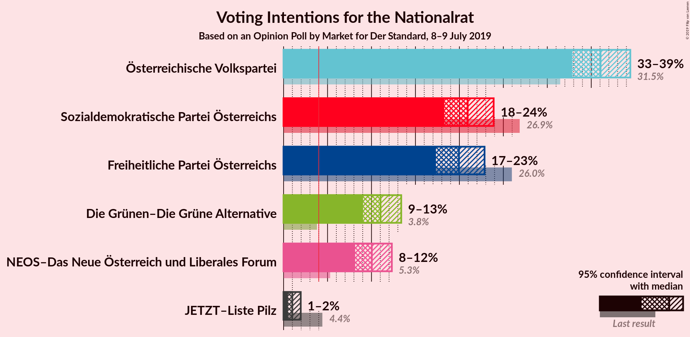

### Confidence Intervals

| Party | Last Result | Poll Result | 80% Confidence Interval | 90% Confidence Interval | 95% Confidence Interval | 99% Confidence Interval |
|:-----:|:-----------:|:-----------:|:-----------------------:|:-----------------------:|:-----------------------:|:-----------------------:|
| Österreichische Volkspartei | 31.5% | 36.1% | 33.9–38.3% |33.3–38.9% |32.8–39.4% |31.8–40.5% |
| Sozialdemokratische Partei Österreichs | 26.9% | 20.9% | 19.2–22.9% |18.7–23.4% |18.3–23.9% |17.5–24.8% |
| Freiheitliche Partei Österreichs | 26.0% | 20.0% | 18.2–21.9% |17.7–22.4% |17.3–22.9% |16.5–23.8% |
| Die Grünen–Die Grüne Alternative | 3.8% | 11.0% | 9.7–12.6% |9.4–13.0% |9.0–13.4% |8.5–14.2% |
| NEOS–Das Neue Österreich und Liberales Forum | 5.3% | 10.0% | 8.8–11.5% |8.4–11.9% |8.1–12.3% |7.6–13.1% |
| JETZT–Liste Pilz | 4.4% | 1.0% | 0.7–1.6% |0.6–1.8% |0.5–2.0% |0.4–2.3% |

*Note:* The poll result column reflects the actual value used in the calculations. Published results may vary slightly, and in addition be rounded to fewer digits.

## Seats

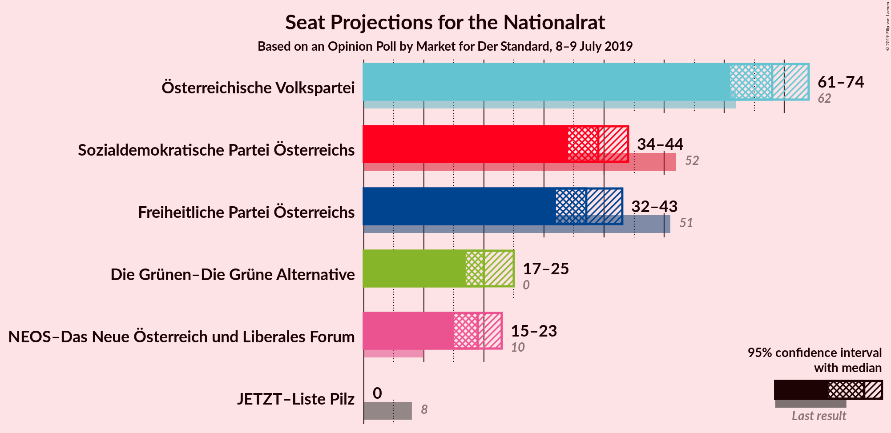

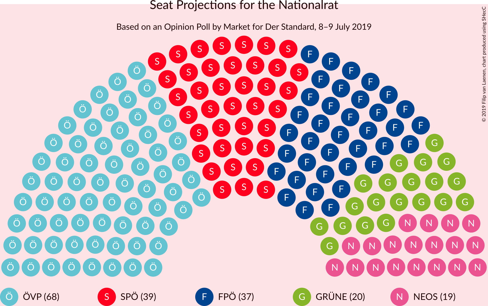

### Confidence Intervals

| Party | Last Result | Median | 80% Confidence Interval | 90% Confidence Interval | 95% Confidence Interval | 99% Confidence Interval |
|:-----:|:-----------:|:------:|:-----------------------:|:-----------------------:|:-----------------------:|:-----------------------:|
| <a href="#österreichische-volkspartei">Österreichische Volkspartei</a> | 62 | 68 | 63–72 |62–73 |61–74 |59–76 |
| <a href="#sozialdemokratische-partei-österreichs">Sozialdemokratische Partei Österreichs</a> | 52 | 39 | 36–43 |35–44 |34–44 |32–46 |
| <a href="#freiheitliche-partei-österreichs">Freiheitliche Partei Österreichs</a> | 51 | 37 | 34–41 |33–42 |32–43 |31–44 |
| <a href="#die-grünen–die-grüne-alternative">Die Grünen–Die Grüne Alternative</a> | 0 | 20 | 18–23 |17–24 |17–25 |15–26 |
| <a href="#neos–das-neue-österreich-und-liberales-forum">NEOS–Das Neue Österreich und Liberales Forum</a> | 10 | 19 | 16–21 |15–22 |15–23 |14–24 |
| <a href="#jetzt–liste-pilz">JETZT–Liste Pilz</a> | 8 | 0 | 0 |0 |0 |0 |

### Österreichische Volkspartei

*For a full overview of the results for this party, see the [Österreichische Volkspartei](party-österreichischevolkspartei.html) page.*

| Number of Seats | Probability | Accumulated | Special Marks |
|:---------------:|:-----------:|:-----------:|:-------------:|
| 57 | 0% | 100% |  |
| 58 | 0.1% | 99.9% |  |
| 59 | 0.3% | 99.8% |  |
| 60 | 0.8% | 99.5% |  |
| 61 | 1.5% | 98.7% |  |
| 62 | 3% | 97% | Last Result |
| 63 | 5% | 94% |  |
| 64 | 7% | 90% |  |
| 65 | 8% | 83% |  |
| 66 | 11% | 75% |  |
| 67 | 14% | 64% |  |
| 68 | 13% | 50% | Median |
| 69 | 11% | 37% |  |
| 70 | 9% | 27% |  |
| 71 | 7% | 17% |  |
| 72 | 4% | 10% |  |
| 73 | 3% | 6% |  |
| 74 | 2% | 3% |  |
| 75 | 1.0% | 2% |  |
| 76 | 0.4% | 0.7% |  |
| 77 | 0.2% | 0.3% |  |
| 78 | 0.1% | 0.1% |  |
| 79 | 0% | 0% |  |

### Sozialdemokratische Partei Österreichs

*For a full overview of the results for this party, see the [Sozialdemokratische Partei Österreichs](party-sozialdemokratischeparteiösterreichs.html) page.*

| Number of Seats | Probability | Accumulated | Special Marks |
|:---------------:|:-----------:|:-----------:|:-------------:|
| 31 | 0.1% | 100% |  |
| 32 | 0.4% | 99.8% |  |
| 33 | 1.0% | 99.4% |  |
| 34 | 2% | 98% |  |
| 35 | 5% | 96% |  |
| 36 | 8% | 91% |  |
| 37 | 11% | 83% |  |
| 38 | 14% | 72% |  |
| 39 | 14% | 58% | Median |
| 40 | 14% | 44% |  |
| 41 | 10% | 30% |  |
| 42 | 9% | 19% |  |
| 43 | 5% | 11% |  |
| 44 | 3% | 6% |  |
| 45 | 1.4% | 2% |  |
| 46 | 0.7% | 1.1% |  |
| 47 | 0.3% | 0.4% |  |
| 48 | 0.1% | 0.1% |  |
| 49 | 0% | 0% |  |
| 50 | 0% | 0% |  |
| 51 | 0% | 0% |  |
| 52 | 0% | 0% | Last Result |

### Freiheitliche Partei Österreichs

*For a full overview of the results for this party, see the [Freiheitliche Partei Österreichs](party-freiheitlicheparteiösterreichs.html) page.*

| Number of Seats | Probability | Accumulated | Special Marks |
|:---------------:|:-----------:|:-----------:|:-------------:|
| 29 | 0.1% | 100% |  |
| 30 | 0.3% | 99.9% |  |
| 31 | 0.8% | 99.6% |  |
| 32 | 2% | 98.8% |  |
| 33 | 4% | 97% |  |
| 34 | 6% | 92% |  |
| 35 | 12% | 86% |  |
| 36 | 13% | 74% |  |
| 37 | 15% | 61% | Median |
| 38 | 14% | 45% |  |
| 39 | 12% | 32% |  |
| 40 | 9% | 20% |  |
| 41 | 5% | 11% |  |
| 42 | 3% | 6% |  |
| 43 | 2% | 3% |  |
| 44 | 0.6% | 1.0% |  |
| 45 | 0.3% | 0.4% |  |
| 46 | 0.1% | 0.1% |  |
| 47 | 0% | 0% |  |
| 48 | 0% | 0% |  |
| 49 | 0% | 0% |  |
| 50 | 0% | 0% |  |
| 51 | 0% | 0% | Last Result |

### Die Grünen–Die Grüne Alternative

*For a full overview of the results for this party, see the [Die Grünen–Die Grüne Alternative](party-diegrünen–diegrünealternative.html) page.*

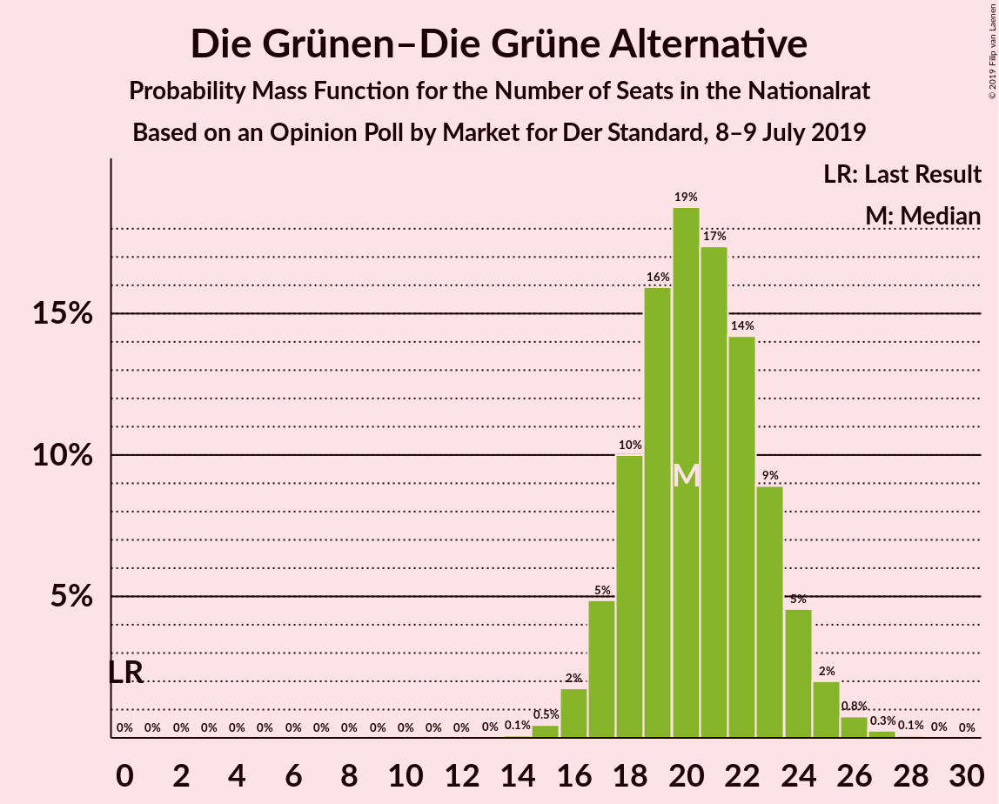

| Number of Seats | Probability | Accumulated | Special Marks |
|:---------------:|:-----------:|:-----------:|:-------------:|
| 0 | 0% | 100% | Last Result |
| 1 | 0% | 100% |  |
| 2 | 0% | 100% |  |
| 3 | 0% | 100% |  |
| 4 | 0% | 100% |  |
| 5 | 0% | 100% |  |
| 6 | 0% | 100% |  |
| 7 | 0% | 100% |  |
| 8 | 0% | 100% |  |
| 9 | 0% | 100% |  |
| 10 | 0% | 100% |  |
| 11 | 0% | 100% |  |
| 12 | 0% | 100% |  |
| 13 | 0% | 100% |  |
| 14 | 0.1% | 100% |  |
| 15 | 0.5% | 99.9% |  |
| 16 | 2% | 99.5% |  |
| 17 | 5% | 98% |  |
| 18 | 10% | 93% |  |
| 19 | 16% | 83% |  |
| 20 | 19% | 67% | Median |
| 21 | 17% | 48% |  |
| 22 | 14% | 31% |  |
| 23 | 9% | 17% |  |
| 24 | 5% | 8% |  |
| 25 | 2% | 3% |  |
| 26 | 0.8% | 1.1% |  |
| 27 | 0.3% | 0.3% |  |
| 28 | 0.1% | 0.1% |  |
| 29 | 0% | 0% |  |

### NEOS–Das Neue Österreich und Liberales Forum

*For a full overview of the results for this party, see the [NEOS–Das Neue Österreich und Liberales Forum](party-neos–dasneueösterreichundliberalesforum.html) page.*

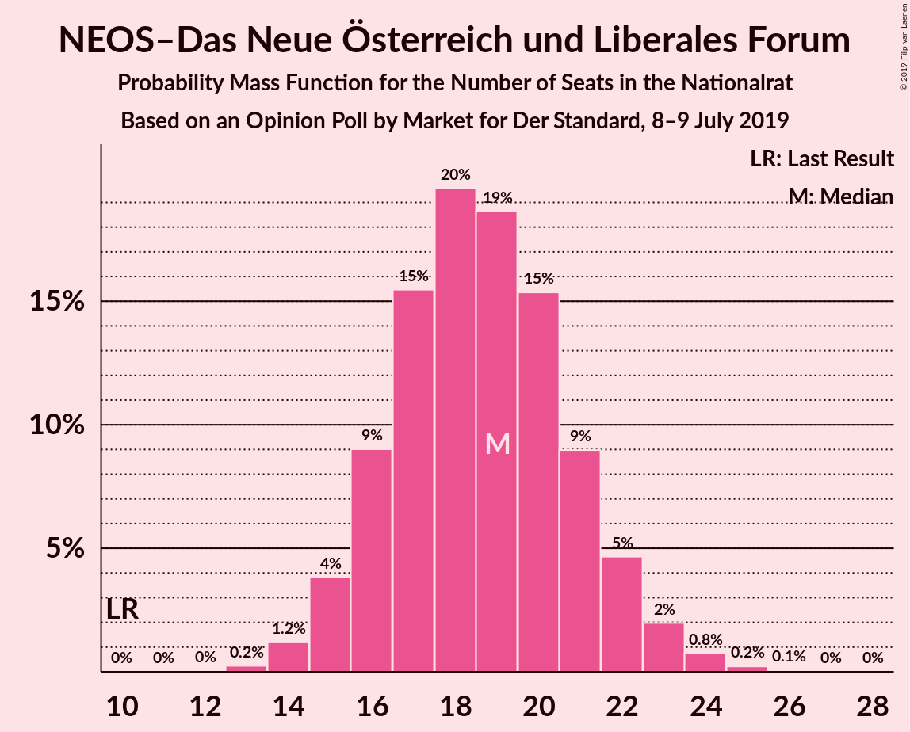

| Number of Seats | Probability | Accumulated | Special Marks |
|:---------------:|:-----------:|:-----------:|:-------------:|
| 10 | 0% | 100% | Last Result |
| 11 | 0% | 100% |  |
| 12 | 0% | 100% |  |
| 13 | 0.2% | 100% |  |
| 14 | 1.2% | 99.7% |  |
| 15 | 4% | 98.5% |  |
| 16 | 9% | 95% |  |
| 17 | 15% | 86% |  |
| 18 | 20% | 70% |  |
| 19 | 19% | 51% | Median |
| 20 | 15% | 32% |  |
| 21 | 9% | 17% |  |
| 22 | 5% | 8% |  |
| 23 | 2% | 3% |  |
| 24 | 0.8% | 1.0% |  |
| 25 | 0.2% | 0.3% |  |
| 26 | 0.1% | 0.1% |  |
| 27 | 0% | 0% |  |

### JETZT–Liste Pilz

*For a full overview of the results for this party, see the [JETZT–Liste Pilz](party-jetzt–listepilz.html) page.*

| Number of Seats | Probability | Accumulated | Special Marks |
|:---------------:|:-----------:|:-----------:|:-------------:|
| 0 | 100% | 100% | Median |
| 1 | 0% | 0% |  |
| 2 | 0% | 0% |  |
| 3 | 0% | 0% |  |
| 4 | 0% | 0% |  |
| 5 | 0% | 0% |  |
| 6 | 0% | 0% |  |
| 7 | 0% | 0% |  |
| 8 | 0% | 0% | Last Result |

## Coalitions

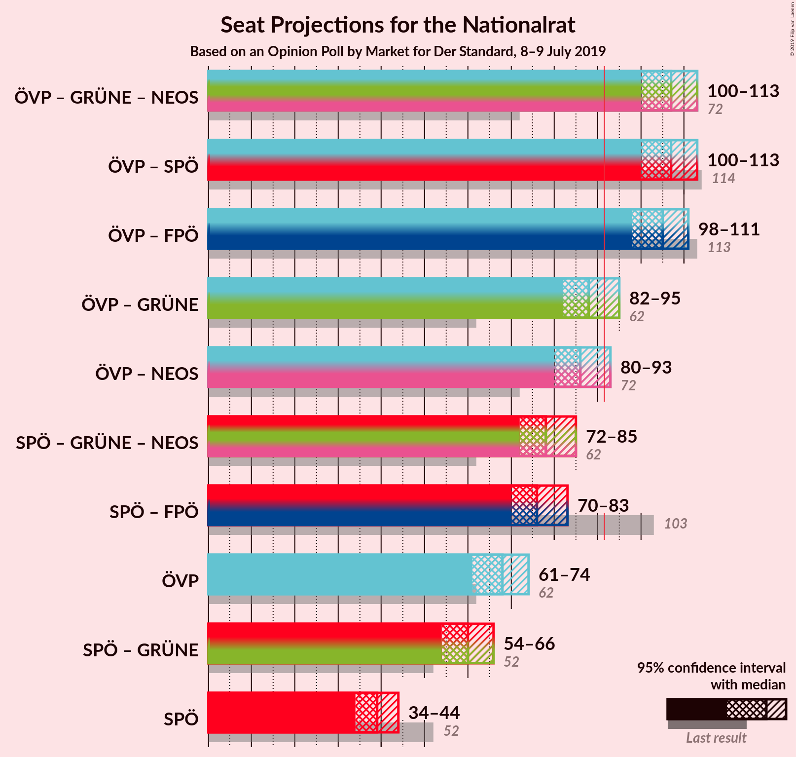

### Confidence Intervals

| Coalition | Last Result | Median | Majority? | 80% Confidence Interval | 90% Confidence Interval | 95% Confidence Interval | 99% Confidence Interval |
|:---------:|:-----------:|:------:|:---------:|:-----------------------:|:-----------------------:|:-----------------------:|:-----------------------:|
| Österreichische Volkspartei – Die Grünen–Die Grüne Alternative – NEOS–Das Neue Österreich und Liberales Forum | 72 | 107 | 100% | 102–111 | 101–112 | 100–113 | 98–115 |
| Österreichische Volkspartei – Sozialdemokratische Partei Österreichs | 114 | 107 | 100% | 103–111 | 101–112 | 100–113 | 98–115 |
| Österreichische Volkspartei – Freiheitliche Partei Österreichs | 113 | 105 | 100% | 101–109 | 99–110 | 98–111 | 96–113 |
| Österreichische Volkspartei – Die Grünen–Die Grüne Alternative | 62 | 88 | 14% | 84–92 | 83–93 | 82–95 | 80–96 |
| Österreichische Volkspartei – NEOS–Das Neue Österreich und Liberales Forum | 72 | 86 | 5% | 82–90 | 81–92 | 80–93 | 78–95 |
| Sozialdemokratische Partei Österreichs – Die Grünen–Die Grüne Alternative – NEOS–Das Neue Österreich und Liberales Forum | 62 | 78 | 0% | 74–82 | 73–84 | 72–85 | 70–87 |
| Sozialdemokratische Partei Österreichs – Freiheitliche Partei Österreichs | 103 | 76 | 0% | 72–81 | 71–82 | 70–83 | 68–85 |
| Österreichische Volkspartei | 62 | 68 | 0% | 63–72 | 62–73 | 61–74 | 59–76 |
| Sozialdemokratische Partei Österreichs – Die Grünen–Die Grüne Alternative | 52 | 60 | 0% | 56–64 | 55–65 | 54–66 | 52–68 |
| Sozialdemokratische Partei Österreichs | 52 | 39 | 0% | 36–43 | 35–44 | 34–44 | 32–46 |

### Österreichische Volkspartei – Die Grünen–Die Grüne Alternative – NEOS–Das Neue Österreich und Liberales Forum

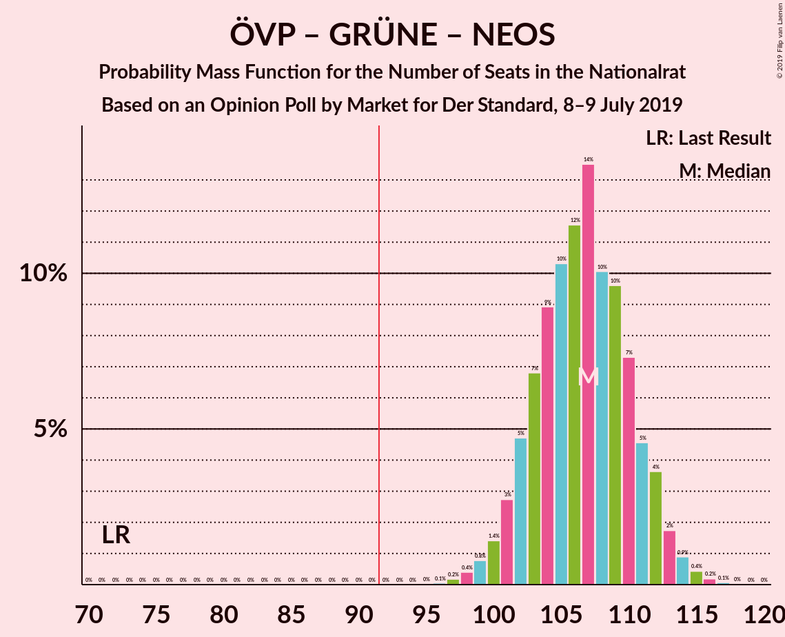

| Number of Seats | Probability | Accumulated | Special Marks |
|:---------------:|:-----------:|:-----------:|:-------------:|
| 72 | 0% | 100% | Last Result |
| 73 | 0% | 100% |  |
| 74 | 0% | 100% |  |
| 75 | 0% | 100% |  |
| 76 | 0% | 100% |  |
| 77 | 0% | 100% |  |
| 78 | 0% | 100% |  |
| 79 | 0% | 100% |  |
| 80 | 0% | 100% |  |
| 81 | 0% | 100% |  |
| 82 | 0% | 100% |  |
| 83 | 0% | 100% |  |
| 84 | 0% | 100% |  |
| 85 | 0% | 100% |  |
| 86 | 0% | 100% |  |
| 87 | 0% | 100% |  |
| 88 | 0% | 100% |  |
| 89 | 0% | 100% |  |
| 90 | 0% | 100% |  |
| 91 | 0% | 100% |  |
| 92 | 0% | 100% | Majority |
| 93 | 0% | 100% |  |
| 94 | 0% | 100% |  |
| 95 | 0% | 100% |  |
| 96 | 0.1% | 100% |  |
| 97 | 0.2% | 99.9% |  |
| 98 | 0.4% | 99.7% |  |
| 99 | 0.8% | 99.3% |  |
| 100 | 1.4% | 98.5% |  |
| 101 | 3% | 97% |  |
| 102 | 5% | 94% |  |
| 103 | 7% | 90% |  |
| 104 | 9% | 83% |  |
| 105 | 10% | 74% |  |
| 106 | 12% | 64% |  |
| 107 | 14% | 52% | Median |
| 108 | 10% | 39% |  |
| 109 | 10% | 28% |  |
| 110 | 7% | 19% |  |
| 111 | 5% | 12% |  |
| 112 | 4% | 7% |  |
| 113 | 2% | 3% |  |
| 114 | 0.9% | 2% |  |
| 115 | 0.4% | 0.7% |  |
| 116 | 0.2% | 0.3% |  |
| 117 | 0.1% | 0.1% |  |
| 118 | 0% | 0% |  |

### Österreichische Volkspartei – Sozialdemokratische Partei Österreichs

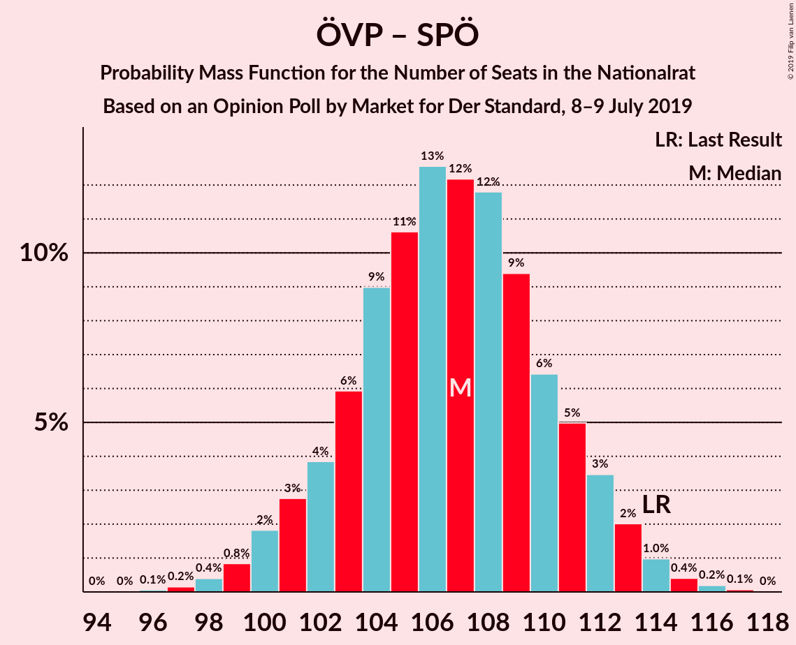

| Number of Seats | Probability | Accumulated | Special Marks |
|:---------------:|:-----------:|:-----------:|:-------------:|
| 96 | 0.1% | 100% |  |
| 97 | 0.2% | 99.9% |  |
| 98 | 0.4% | 99.8% |  |
| 99 | 0.8% | 99.4% |  |
| 100 | 2% | 98.5% |  |
| 101 | 3% | 97% |  |
| 102 | 4% | 94% |  |
| 103 | 6% | 90% |  |
| 104 | 9% | 84% |  |
| 105 | 11% | 75% |  |
| 106 | 13% | 65% |  |
| 107 | 12% | 52% | Median |
| 108 | 12% | 40% |  |
| 109 | 9% | 28% |  |
| 110 | 6% | 19% |  |
| 111 | 5% | 12% |  |
| 112 | 3% | 7% |  |
| 113 | 2% | 4% |  |
| 114 | 1.0% | 2% | Last Result |
| 115 | 0.4% | 0.7% |  |
| 116 | 0.2% | 0.3% |  |
| 117 | 0.1% | 0.1% |  |
| 118 | 0% | 0% |  |

### Österreichische Volkspartei – Freiheitliche Partei Österreichs

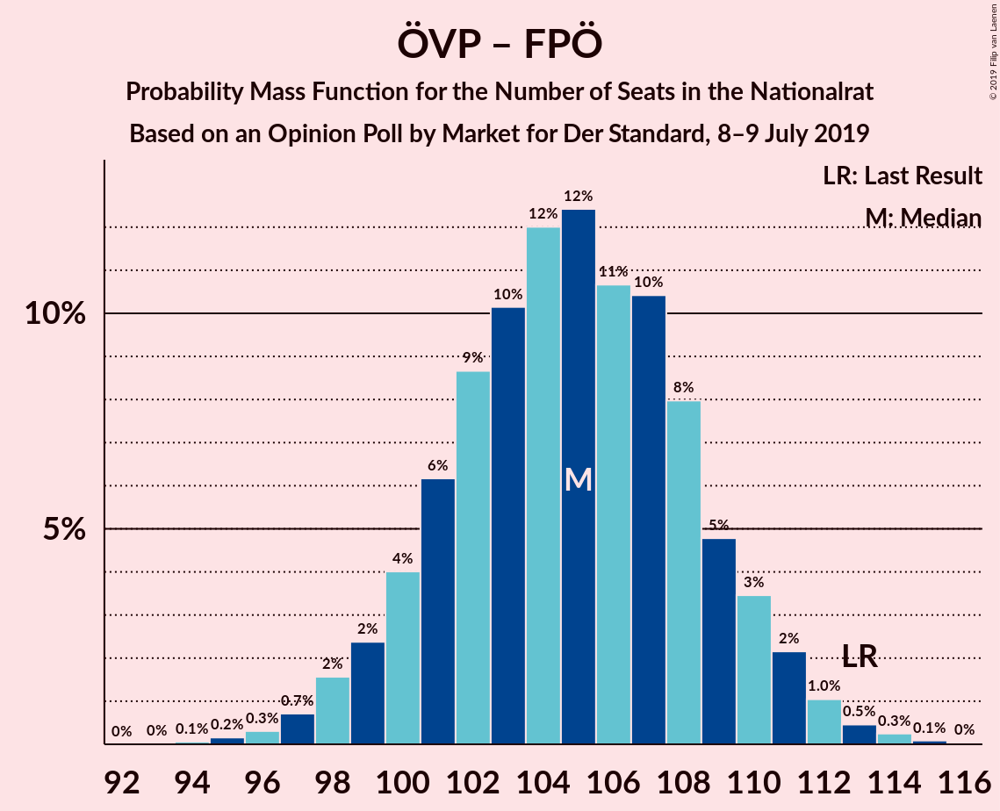

| Number of Seats | Probability | Accumulated | Special Marks |
|:---------------:|:-----------:|:-----------:|:-------------:|
| 94 | 0.1% | 100% |  |
| 95 | 0.2% | 99.9% |  |
| 96 | 0.3% | 99.7% |  |
| 97 | 0.7% | 99.4% |  |
| 98 | 2% | 98.7% |  |
| 99 | 2% | 97% |  |
| 100 | 4% | 95% |  |
| 101 | 6% | 91% |  |
| 102 | 9% | 85% |  |
| 103 | 10% | 76% |  |
| 104 | 12% | 66% |  |
| 105 | 12% | 54% | Median |
| 106 | 11% | 41% |  |
| 107 | 10% | 31% |  |
| 108 | 8% | 20% |  |
| 109 | 5% | 12% |  |
| 110 | 3% | 8% |  |
| 111 | 2% | 4% |  |
| 112 | 1.0% | 2% |  |
| 113 | 0.5% | 0.8% | Last Result |
| 114 | 0.3% | 0.4% |  |
| 115 | 0.1% | 0.1% |  |
| 116 | 0% | 0% |  |

### Österreichische Volkspartei – Die Grünen–Die Grüne Alternative

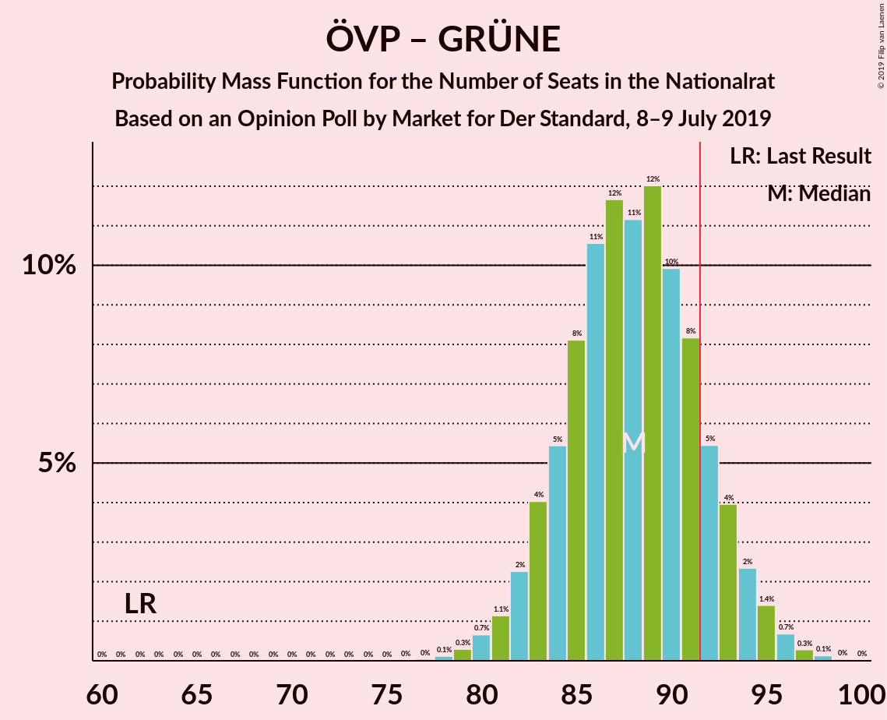

| Number of Seats | Probability | Accumulated | Special Marks |
|:---------------:|:-----------:|:-----------:|:-------------:|
| 62 | 0% | 100% | Last Result |
| 63 | 0% | 100% |  |
| 64 | 0% | 100% |  |
| 65 | 0% | 100% |  |
| 66 | 0% | 100% |  |
| 67 | 0% | 100% |  |
| 68 | 0% | 100% |  |
| 69 | 0% | 100% |  |
| 70 | 0% | 100% |  |
| 71 | 0% | 100% |  |
| 72 | 0% | 100% |  |
| 73 | 0% | 100% |  |
| 74 | 0% | 100% |  |
| 75 | 0% | 100% |  |
| 76 | 0% | 100% |  |
| 77 | 0% | 100% |  |
| 78 | 0.1% | 99.9% |  |
| 79 | 0.3% | 99.8% |  |
| 80 | 0.7% | 99.5% |  |
| 81 | 1.1% | 98.9% |  |
| 82 | 2% | 98% |  |
| 83 | 4% | 95% |  |
| 84 | 5% | 91% |  |
| 85 | 8% | 86% |  |
| 86 | 11% | 78% |  |
| 87 | 12% | 67% |  |
| 88 | 11% | 56% | Median |
| 89 | 12% | 44% |  |
| 90 | 10% | 32% |  |
| 91 | 8% | 23% |  |
| 92 | 5% | 14% | Majority |
| 93 | 4% | 9% |  |
| 94 | 2% | 5% |  |
| 95 | 1.4% | 3% |  |
| 96 | 0.7% | 1.2% |  |
| 97 | 0.3% | 0.5% |  |
| 98 | 0.1% | 0.2% |  |
| 99 | 0% | 0.1% |  |
| 100 | 0% | 0% |  |

### Österreichische Volkspartei – NEOS–Das Neue Österreich und Liberales Forum

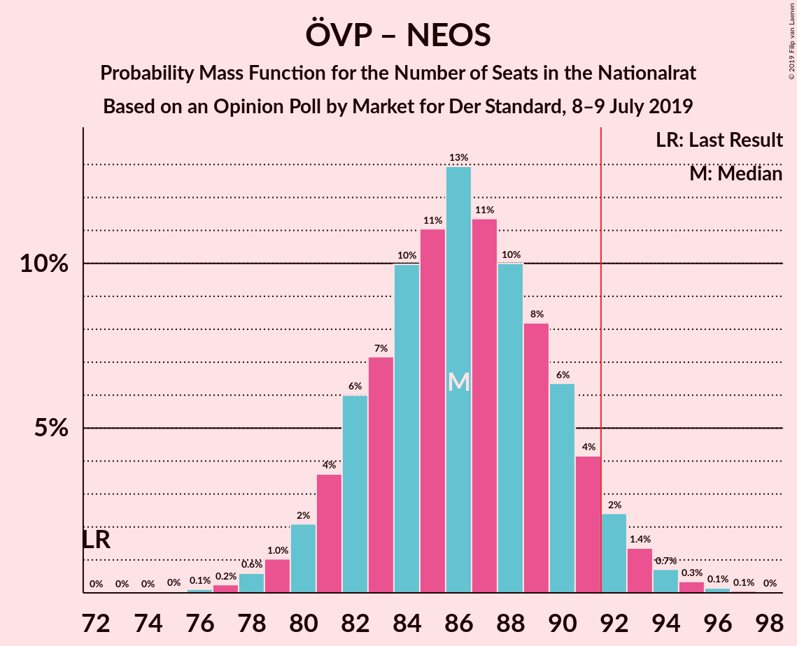

| Number of Seats | Probability | Accumulated | Special Marks |
|:---------------:|:-----------:|:-----------:|:-------------:|
| 72 | 0% | 100% | Last Result |
| 73 | 0% | 100% |  |
| 74 | 0% | 100% |  |
| 75 | 0% | 100% |  |
| 76 | 0.1% | 99.9% |  |
| 77 | 0.2% | 99.8% |  |
| 78 | 0.6% | 99.6% |  |
| 79 | 1.0% | 99.0% |  |
| 80 | 2% | 98% |  |
| 81 | 4% | 96% |  |
| 82 | 6% | 92% |  |
| 83 | 7% | 86% |  |
| 84 | 10% | 79% |  |
| 85 | 11% | 69% |  |
| 86 | 13% | 58% |  |
| 87 | 11% | 45% | Median |
| 88 | 10% | 34% |  |
| 89 | 8% | 24% |  |
| 90 | 6% | 16% |  |
| 91 | 4% | 9% |  |
| 92 | 2% | 5% | Majority |
| 93 | 1.4% | 3% |  |
| 94 | 0.7% | 1.3% |  |
| 95 | 0.3% | 0.6% |  |
| 96 | 0.1% | 0.2% |  |
| 97 | 0.1% | 0.1% |  |
| 98 | 0% | 0% |  |

### Sozialdemokratische Partei Österreichs – Die Grünen–Die Grüne Alternative – NEOS–Das Neue Österreich und Liberales Forum

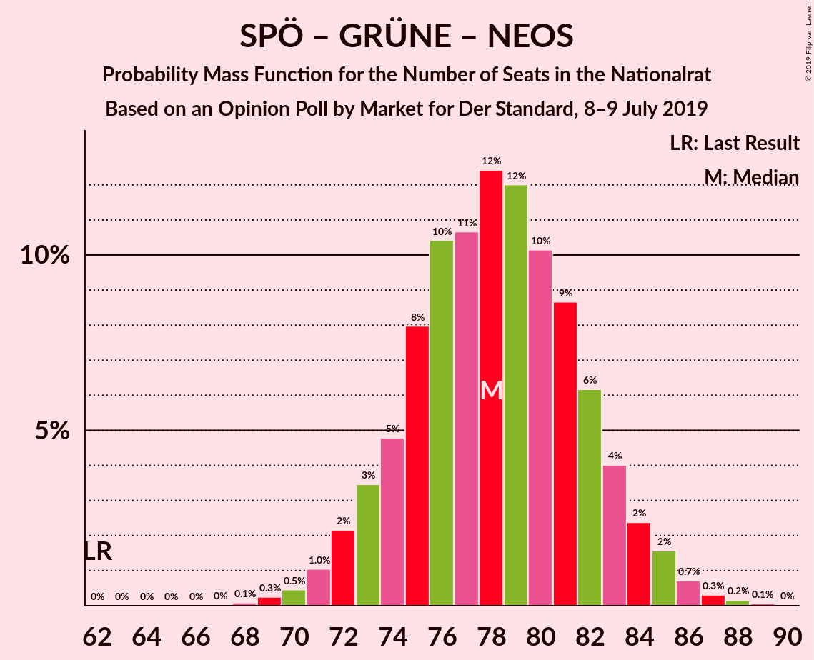

| Number of Seats | Probability | Accumulated | Special Marks |
|:---------------:|:-----------:|:-----------:|:-------------:|
| 62 | 0% | 100% | Last Result |
| 63 | 0% | 100% |  |
| 64 | 0% | 100% |  |
| 65 | 0% | 100% |  |
| 66 | 0% | 100% |  |
| 67 | 0% | 100% |  |
| 68 | 0.1% | 100% |  |
| 69 | 0.3% | 99.9% |  |
| 70 | 0.5% | 99.6% |  |
| 71 | 1.0% | 99.2% |  |
| 72 | 2% | 98% |  |
| 73 | 3% | 96% |  |
| 74 | 5% | 92% |  |
| 75 | 8% | 88% |  |
| 76 | 10% | 80% |  |
| 77 | 11% | 69% |  |
| 78 | 12% | 59% | Median |
| 79 | 12% | 46% |  |
| 80 | 10% | 34% |  |
| 81 | 9% | 24% |  |
| 82 | 6% | 15% |  |
| 83 | 4% | 9% |  |
| 84 | 2% | 5% |  |
| 85 | 2% | 3% |  |
| 86 | 0.7% | 1.3% |  |
| 87 | 0.3% | 0.6% |  |
| 88 | 0.2% | 0.3% |  |
| 89 | 0.1% | 0.1% |  |
| 90 | 0% | 0% |  |

### Sozialdemokratische Partei Österreichs – Freiheitliche Partei Österreichs

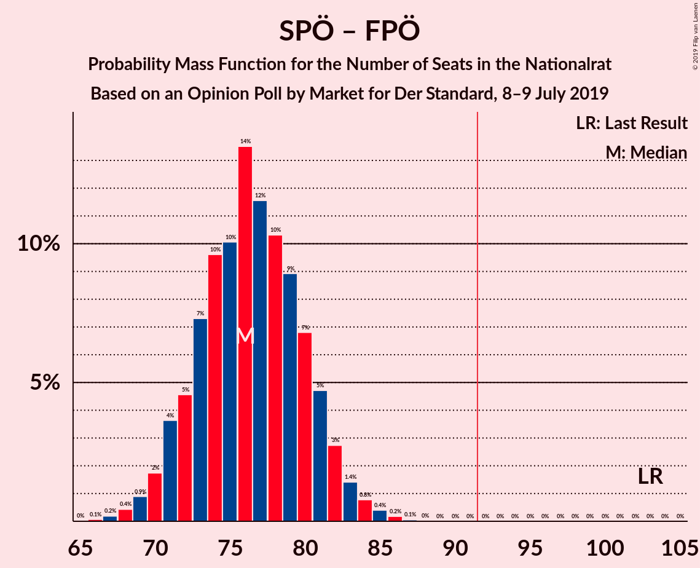

| Number of Seats | Probability | Accumulated | Special Marks |
|:---------------:|:-----------:|:-----------:|:-------------:|
| 66 | 0.1% | 100% |  |
| 67 | 0.2% | 99.9% |  |
| 68 | 0.4% | 99.7% |  |
| 69 | 0.9% | 99.3% |  |
| 70 | 2% | 98% |  |
| 71 | 4% | 97% |  |
| 72 | 5% | 93% |  |
| 73 | 7% | 88% |  |
| 74 | 10% | 81% |  |
| 75 | 10% | 72% |  |
| 76 | 14% | 61% | Median |
| 77 | 12% | 48% |  |
| 78 | 10% | 36% |  |
| 79 | 9% | 26% |  |
| 80 | 7% | 17% |  |
| 81 | 5% | 10% |  |
| 82 | 3% | 6% |  |
| 83 | 1.4% | 3% |  |
| 84 | 0.8% | 1.5% |  |
| 85 | 0.4% | 0.7% |  |
| 86 | 0.2% | 0.3% |  |
| 87 | 0.1% | 0.1% |  |
| 88 | 0% | 0% |  |
| 89 | 0% | 0% |  |
| 90 | 0% | 0% |  |
| 91 | 0% | 0% |  |
| 92 | 0% | 0% | Majority |
| 93 | 0% | 0% |  |
| 94 | 0% | 0% |  |
| 95 | 0% | 0% |  |
| 96 | 0% | 0% |  |
| 97 | 0% | 0% |  |
| 98 | 0% | 0% |  |
| 99 | 0% | 0% |  |
| 100 | 0% | 0% |  |
| 101 | 0% | 0% |  |
| 102 | 0% | 0% |  |
| 103 | 0% | 0% | Last Result |

### Österreichische Volkspartei

| Number of Seats | Probability | Accumulated | Special Marks |
|:---------------:|:-----------:|:-----------:|:-------------:|
| 57 | 0% | 100% |  |
| 58 | 0.1% | 99.9% |  |
| 59 | 0.3% | 99.8% |  |
| 60 | 0.8% | 99.5% |  |
| 61 | 1.5% | 98.7% |  |
| 62 | 3% | 97% | Last Result |
| 63 | 5% | 94% |  |
| 64 | 7% | 90% |  |
| 65 | 8% | 83% |  |
| 66 | 11% | 75% |  |
| 67 | 14% | 64% |  |
| 68 | 13% | 50% | Median |
| 69 | 11% | 37% |  |
| 70 | 9% | 27% |  |
| 71 | 7% | 17% |  |
| 72 | 4% | 10% |  |
| 73 | 3% | 6% |  |
| 74 | 2% | 3% |  |
| 75 | 1.0% | 2% |  |
| 76 | 0.4% | 0.7% |  |
| 77 | 0.2% | 0.3% |  |
| 78 | 0.1% | 0.1% |  |
| 79 | 0% | 0% |  |

### Sozialdemokratische Partei Österreichs – Die Grünen–Die Grüne Alternative

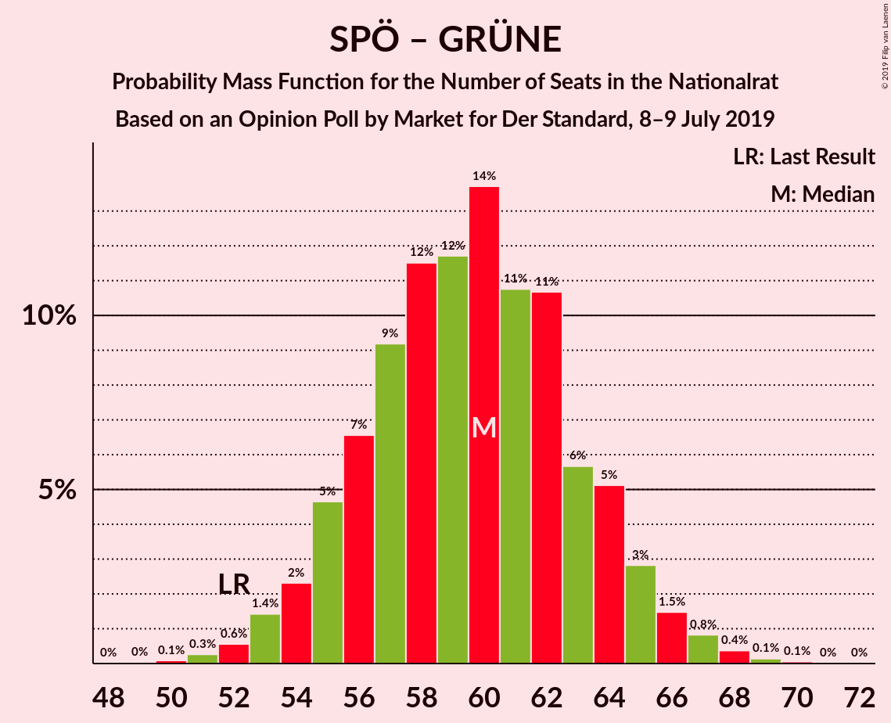

| Number of Seats | Probability | Accumulated | Special Marks |
|:---------------:|:-----------:|:-----------:|:-------------:|
| 50 | 0.1% | 100% |  |
| 51 | 0.3% | 99.9% |  |
| 52 | 0.6% | 99.6% | Last Result |
| 53 | 1.4% | 99.0% |  |
| 54 | 2% | 98% |  |
| 55 | 5% | 95% |  |
| 56 | 7% | 91% |  |
| 57 | 9% | 84% |  |
| 58 | 12% | 75% |  |
| 59 | 12% | 63% | Median |
| 60 | 14% | 52% |  |
| 61 | 11% | 38% |  |
| 62 | 11% | 27% |  |
| 63 | 6% | 17% |  |
| 64 | 5% | 11% |  |
| 65 | 3% | 6% |  |
| 66 | 1.5% | 3% |  |
| 67 | 0.8% | 1.4% |  |
| 68 | 0.4% | 0.6% |  |
| 69 | 0.1% | 0.2% |  |
| 70 | 0.1% | 0.1% |  |
| 71 | 0% | 0% |  |

### Sozialdemokratische Partei Österreichs

| Number of Seats | Probability | Accumulated | Special Marks |
|:---------------:|:-----------:|:-----------:|:-------------:|
| 31 | 0.1% | 100% |  |
| 32 | 0.4% | 99.8% |  |
| 33 | 1.0% | 99.4% |  |
| 34 | 2% | 98% |  |
| 35 | 5% | 96% |  |
| 36 | 8% | 91% |  |
| 37 | 11% | 83% |  |
| 38 | 14% | 72% |  |
| 39 | 14% | 58% | Median |
| 40 | 14% | 44% |  |
| 41 | 10% | 30% |  |
| 42 | 9% | 19% |  |
| 43 | 5% | 11% |  |
| 44 | 3% | 6% |  |
| 45 | 1.4% | 2% |  |
| 46 | 0.7% | 1.1% |  |
| 47 | 0.3% | 0.4% |  |
| 48 | 0.1% | 0.1% |  |
| 49 | 0% | 0% |  |
| 50 | 0% | 0% |  |
| 51 | 0% | 0% |  |
| 52 | 0% | 0% | Last Result |

## Technical Information

### Opinion Poll

+ **Polling firm:** Market
+ **Commissioner(s):** Der Standard
+ **Fieldwork period:** 8–9 July 2019

### Calculations

+ **Sample size:** 807
+ **Simulations done:** 1,048,576
+ **Error estimate:** 0.93%

