# Opinion Poll by Research Affairs for ÖSTERREICH, 18–24 July 2019

<a href="#voting-intentions">Voting Intentions</a> | <a href="#seats">Seats</a> | <a href="#coalitions">Coalitions</a> | <a href="#technical-information">Technical Information</a>

## Voting Intentions

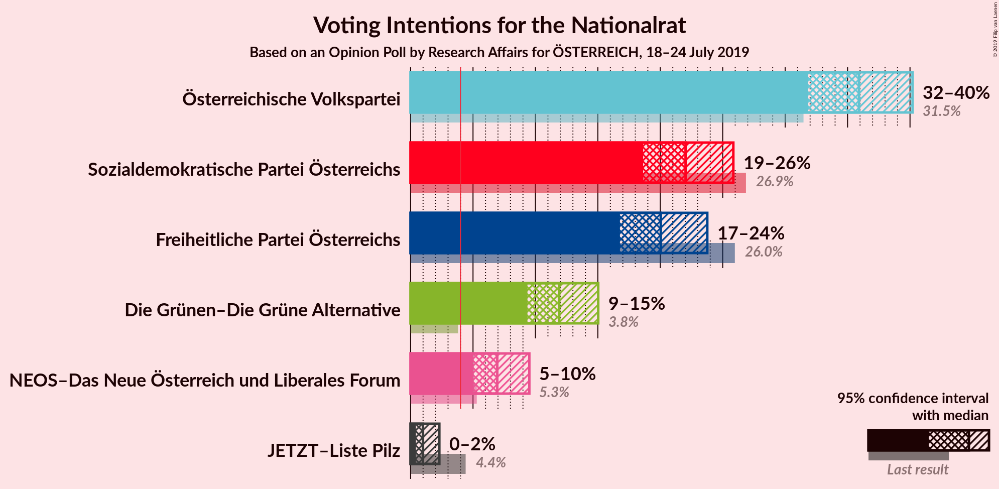

### Confidence Intervals

| Party | Last Result | Poll Result | 80% Confidence Interval | 90% Confidence Interval | 95% Confidence Interval | 99% Confidence Interval |
|:-----:|:-----------:|:-----------:|:-----------------------:|:-----------------------:|:-----------------------:|:-----------------------:|
| Österreichische Volkspartei | 31.5% | 35.9% | 33.2–38.7% |32.5–39.5% |31.8–40.2% |30.6–41.6% |
| Sozialdemokratische Partei Österreichs | 26.9% | 22.0% | 19.8–24.5% |19.2–25.2% |18.6–25.8% |17.6–27.1% |
| Freiheitliche Partei Österreichs | 26.0% | 20.0% | 17.9–22.5% |17.3–23.2% |16.8–23.8% |15.8–25.0% |
| Die Grünen–Die Grüne Alternative | 3.8% | 11.9% | 10.2–13.9% |9.8–14.5% |9.4–15.0% |8.6–16.1% |
| NEOS–Das Neue Österreich und Liberales Forum | 5.3% | 6.9% | 5.7–8.6% |5.3–9.1% |5.0–9.5% |4.5–10.4% |
| JETZT–Liste Pilz | 4.4% | 1.0% | 0.6–1.8% |0.5–2.1% |0.4–2.3% |0.3–2.8% |

*Note:* The poll result column reflects the actual value used in the calculations. Published results may vary slightly, and in addition be rounded to fewer digits.

## Seats

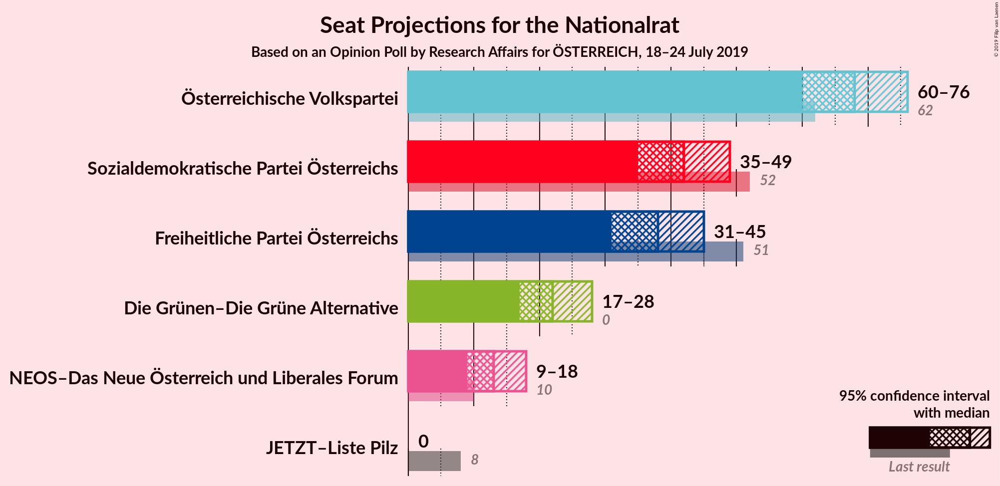

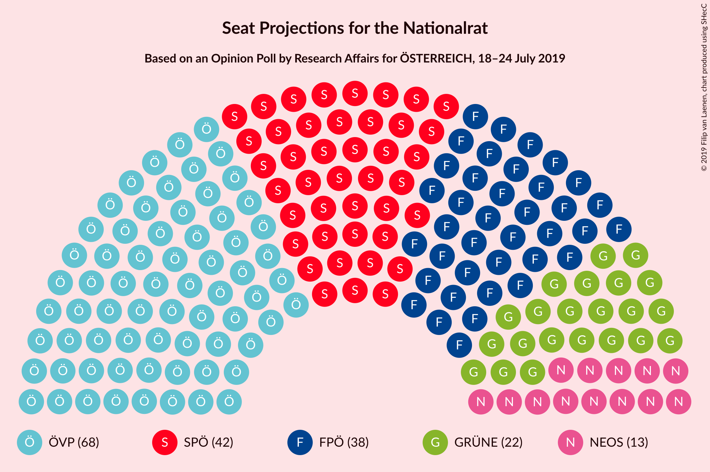

### Confidence Intervals

| Party | Last Result | Median | 80% Confidence Interval | 90% Confidence Interval | 95% Confidence Interval | 99% Confidence Interval |
|:-----:|:-----------:|:------:|:-----------------------:|:-----------------------:|:-----------------------:|:-----------------------:|
| <a href="#österreichische-volkspartei">Österreichische Volkspartei</a> | 62 | 68 | 63–73 |61–75 |60–76 |58–78 |
| <a href="#sozialdemokratische-partei-österreichs">Sozialdemokratische Partei Österreichs</a> | 52 | 42 | 37–46 |36–48 |35–49 |33–51 |
| <a href="#freiheitliche-partei-österreichs">Freiheitliche Partei Österreichs</a> | 51 | 38 | 34–42 |32–44 |31–45 |30–47 |
| <a href="#die-grünen–die-grüne-alternative">Die Grünen–Die Grüne Alternative</a> | 0 | 22 | 19–26 |18–27 |17–28 |16–30 |
| <a href="#neos–das-neue-österreich-und-liberales-forum">NEOS–Das Neue Österreich und Liberales Forum</a> | 10 | 13 | 10–16 |10–17 |9–18 |8–19 |
| <a href="#jetzt–liste-pilz">JETZT–Liste Pilz</a> | 8 | 0 | 0 |0 |0 |0 |

### Österreichische Volkspartei

*For a full overview of the results for this party, see the [Österreichische Volkspartei](party-österreichischevolkspartei.html) page.*

| Number of Seats | Probability | Accumulated | Special Marks |
|:---------------:|:-----------:|:-----------:|:-------------:|
| 55 | 0.1% | 100% |  |
| 56 | 0.1% | 99.9% |  |
| 57 | 0.2% | 99.8% |  |
| 58 | 0.5% | 99.6% |  |
| 59 | 0.9% | 99.1% |  |
| 60 | 1.4% | 98% |  |
| 61 | 2% | 97% |  |
| 62 | 3% | 95% | Last Result |
| 63 | 5% | 91% |  |
| 64 | 6% | 86% |  |
| 65 | 7% | 80% |  |
| 66 | 9% | 73% |  |
| 67 | 9% | 64% |  |
| 68 | 11% | 55% | Median |
| 69 | 9% | 44% |  |
| 70 | 9% | 35% |  |
| 71 | 7% | 26% |  |
| 72 | 6% | 19% |  |
| 73 | 5% | 13% |  |
| 74 | 3% | 9% |  |
| 75 | 2% | 5% |  |
| 76 | 1.3% | 3% |  |
| 77 | 0.8% | 2% |  |
| 78 | 0.5% | 1.0% |  |
| 79 | 0.3% | 0.5% |  |
| 80 | 0.1% | 0.2% |  |
| 81 | 0.1% | 0.1% |  |
| 82 | 0% | 0.1% |  |
| 83 | 0% | 0% |  |

### Sozialdemokratische Partei Österreichs

*For a full overview of the results for this party, see the [Sozialdemokratische Partei Österreichs](party-sozialdemokratischeparteiösterreichs.html) page.*

| Number of Seats | Probability | Accumulated | Special Marks |
|:---------------:|:-----------:|:-----------:|:-------------:|
| 31 | 0.1% | 100% |  |
| 32 | 0.2% | 99.9% |  |
| 33 | 0.4% | 99.7% |  |
| 34 | 0.9% | 99.2% |  |
| 35 | 2% | 98% |  |
| 36 | 3% | 96% |  |
| 37 | 6% | 93% |  |
| 38 | 7% | 88% |  |
| 39 | 7% | 80% |  |
| 40 | 13% | 74% |  |
| 41 | 11% | 61% |  |
| 42 | 10% | 50% | Median |
| 43 | 12% | 40% |  |
| 44 | 6% | 28% |  |
| 45 | 8% | 21% |  |
| 46 | 6% | 14% |  |
| 47 | 3% | 8% |  |
| 48 | 3% | 5% |  |
| 49 | 1.1% | 3% |  |
| 50 | 0.6% | 1.4% |  |
| 51 | 0.5% | 0.8% |  |
| 52 | 0.2% | 0.3% | Last Result |
| 53 | 0.1% | 0.2% |  |
| 54 | 0% | 0.1% |  |
| 55 | 0% | 0% |  |

### Freiheitliche Partei Österreichs

*For a full overview of the results for this party, see the [Freiheitliche Partei Österreichs](party-freiheitlicheparteiösterreichs.html) page.*

| Number of Seats | Probability | Accumulated | Special Marks |
|:---------------:|:-----------:|:-----------:|:-------------:|
| 28 | 0.1% | 100% |  |
| 29 | 0.3% | 99.8% |  |
| 30 | 0.7% | 99.5% |  |
| 31 | 1.5% | 98.8% |  |
| 32 | 3% | 97% |  |
| 33 | 4% | 95% |  |
| 34 | 7% | 90% |  |
| 35 | 8% | 83% |  |
| 36 | 11% | 75% |  |
| 37 | 11% | 64% |  |
| 38 | 12% | 53% | Median |
| 39 | 10% | 41% |  |
| 40 | 9% | 30% |  |
| 41 | 7% | 21% |  |
| 42 | 5% | 14% |  |
| 43 | 4% | 9% |  |
| 44 | 2% | 5% |  |
| 45 | 1.3% | 3% |  |
| 46 | 0.8% | 2% |  |
| 47 | 0.4% | 0.7% |  |
| 48 | 0.2% | 0.3% |  |
| 49 | 0.1% | 0.1% |  |
| 50 | 0% | 0.1% |  |
| 51 | 0% | 0% | Last Result |

### Die Grünen–Die Grüne Alternative

*For a full overview of the results for this party, see the [Die Grünen–Die Grüne Alternative](party-diegrünen–diegrünealternative.html) page.*

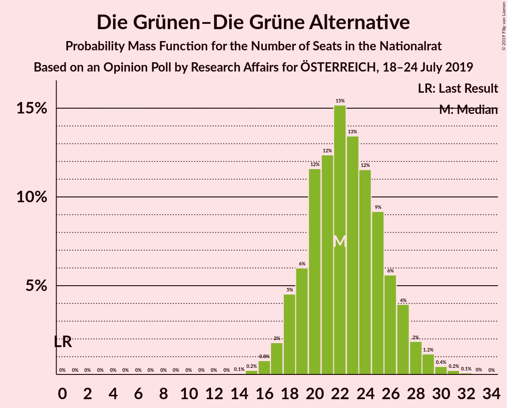

| Number of Seats | Probability | Accumulated | Special Marks |
|:---------------:|:-----------:|:-----------:|:-------------:|
| 0 | 0% | 100% | Last Result |
| 1 | 0% | 100% |  |
| 2 | 0% | 100% |  |
| 3 | 0% | 100% |  |
| 4 | 0% | 100% |  |
| 5 | 0% | 100% |  |
| 6 | 0% | 100% |  |
| 7 | 0% | 100% |  |
| 8 | 0% | 100% |  |
| 9 | 0% | 100% |  |
| 10 | 0% | 100% |  |
| 11 | 0% | 100% |  |
| 12 | 0% | 100% |  |
| 13 | 0% | 100% |  |
| 14 | 0.1% | 100% |  |
| 15 | 0.2% | 99.9% |  |
| 16 | 0.8% | 99.7% |  |
| 17 | 2% | 98.9% |  |
| 18 | 5% | 97% |  |
| 19 | 6% | 93% |  |
| 20 | 12% | 87% |  |
| 21 | 12% | 75% |  |
| 22 | 15% | 63% | Median |
| 23 | 13% | 47% |  |
| 24 | 12% | 34% |  |
| 25 | 9% | 23% |  |
| 26 | 6% | 13% |  |
| 27 | 4% | 8% |  |
| 28 | 2% | 4% |  |
| 29 | 1.2% | 2% |  |
| 30 | 0.4% | 0.8% |  |
| 31 | 0.2% | 0.3% |  |
| 32 | 0.1% | 0.1% |  |
| 33 | 0% | 0% |  |

### NEOS–Das Neue Österreich und Liberales Forum

*For a full overview of the results for this party, see the [NEOS–Das Neue Österreich und Liberales Forum](party-neos–dasneueösterreichundliberalesforum.html) page.*

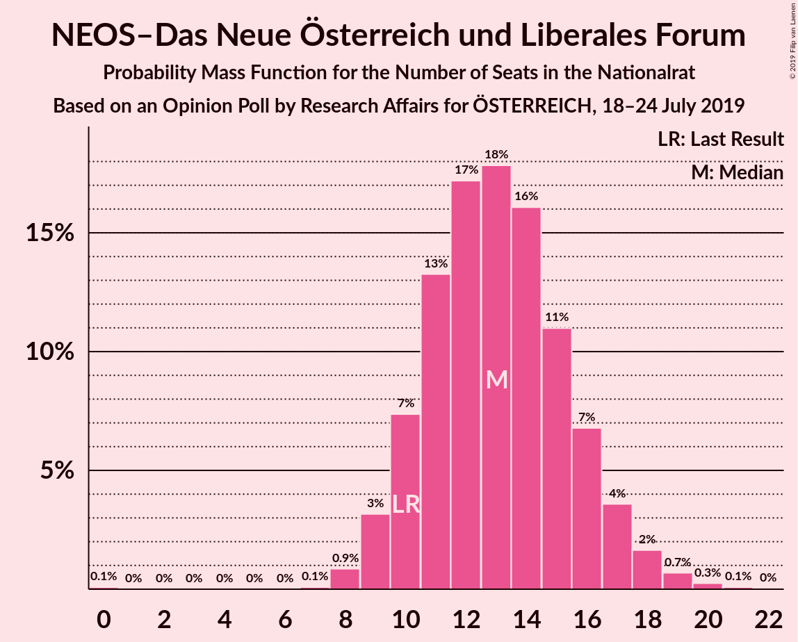

| Number of Seats | Probability | Accumulated | Special Marks |
|:---------------:|:-----------:|:-----------:|:-------------:|
| 0 | 0.1% | 100% |  |
| 1 | 0% | 99.9% |  |
| 2 | 0% | 99.9% |  |
| 3 | 0% | 99.9% |  |
| 4 | 0% | 99.9% |  |
| 5 | 0% | 99.9% |  |
| 6 | 0% | 99.9% |  |
| 7 | 0.1% | 99.9% |  |
| 8 | 0.9% | 99.8% |  |
| 9 | 3% | 99.0% |  |
| 10 | 7% | 96% | Last Result |
| 11 | 13% | 88% |  |
| 12 | 17% | 75% |  |
| 13 | 18% | 58% | Median |
| 14 | 16% | 40% |  |
| 15 | 11% | 24% |  |
| 16 | 7% | 13% |  |
| 17 | 4% | 6% |  |
| 18 | 2% | 3% |  |
| 19 | 0.7% | 1.1% |  |
| 20 | 0.3% | 0.4% |  |
| 21 | 0.1% | 0.1% |  |
| 22 | 0% | 0% |  |

### JETZT–Liste Pilz

*For a full overview of the results for this party, see the [JETZT–Liste Pilz](party-jetzt–listepilz.html) page.*

| Number of Seats | Probability | Accumulated | Special Marks |
|:---------------:|:-----------:|:-----------:|:-------------:|
| 0 | 100% | 100% | Median |
| 1 | 0% | 0% |  |
| 2 | 0% | 0% |  |
| 3 | 0% | 0% |  |
| 4 | 0% | 0% |  |
| 5 | 0% | 0% |  |
| 6 | 0% | 0% |  |
| 7 | 0% | 0% |  |
| 8 | 0% | 0% | Last Result |

## Coalitions

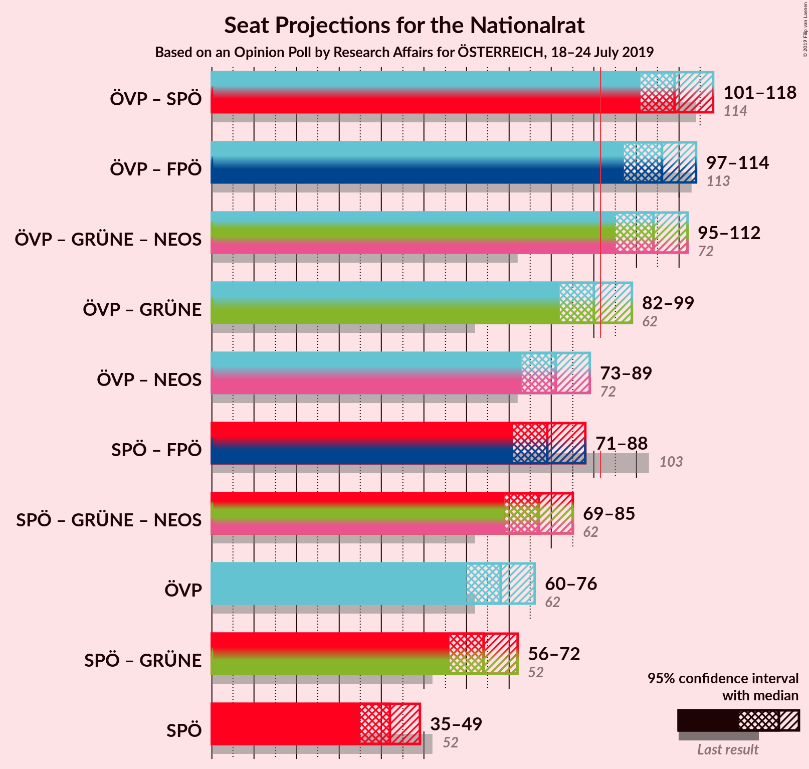

### Confidence Intervals

| Coalition | Last Result | Median | Majority? | 80% Confidence Interval | 90% Confidence Interval | 95% Confidence Interval | 99% Confidence Interval |
|:---------:|:-----------:|:------:|:---------:|:-----------------------:|:-----------------------:|:-----------------------:|:-----------------------:|
| Österreichische Volkspartei – Sozialdemokratische Partei Österreichs | 114 | 109 | 100% | 104–115 | 103–116 | 101–118 | 99–120 |
| Österreichische Volkspartei – Freiheitliche Partei Österreichs | 113 | 106 | 100% | 100–111 | 99–113 | 97–114 | 95–116 |
| Österreichische Volkspartei – Die Grünen–Die Grüne Alternative – NEOS–Das Neue Österreich und Liberales Forum | 72 | 104 | 99.8% | 98–109 | 97–110 | 95–112 | 92–114 |
| Österreichische Volkspartei – Die Grünen–Die Grüne Alternative | 62 | 90 | 40% | 85–96 | 83–97 | 82–99 | 80–101 |
| Österreichische Volkspartei – NEOS–Das Neue Österreich und Liberales Forum | 72 | 81 | 0.6% | 76–86 | 74–88 | 73–89 | 70–92 |
| Sozialdemokratische Partei Österreichs – Freiheitliche Partei Österreichs | 103 | 79 | 0.2% | 74–85 | 73–86 | 71–88 | 69–90 |
| Sozialdemokratische Partei Österreichs – Die Grünen–Die Grüne Alternative – NEOS–Das Neue Österreich und Liberales Forum | 62 | 77 | 0% | 72–82 | 70–84 | 69–85 | 66–88 |
| Österreichische Volkspartei | 62 | 68 | 0% | 63–73 | 61–75 | 60–76 | 58–78 |
| Sozialdemokratische Partei Österreichs – Die Grünen–Die Grüne Alternative | 52 | 64 | 0% | 59–69 | 58–71 | 56–72 | 54–75 |
| Sozialdemokratische Partei Österreichs | 52 | 42 | 0% | 37–46 | 36–48 | 35–49 | 33–51 |

### Österreichische Volkspartei – Sozialdemokratische Partei Österreichs

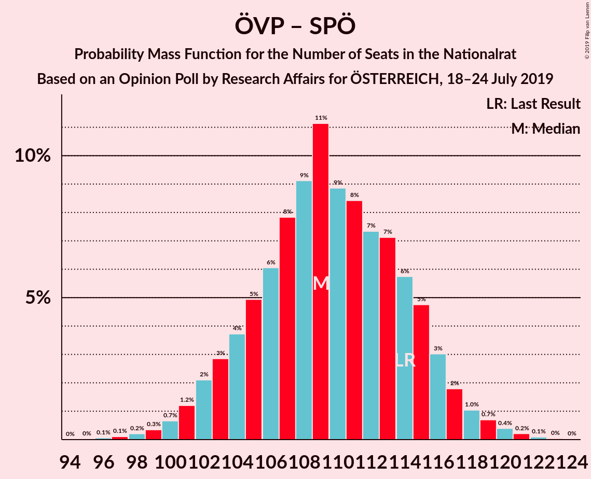

| Number of Seats | Probability | Accumulated | Special Marks |
|:---------------:|:-----------:|:-----------:|:-------------:|
| 96 | 0.1% | 100% |  |
| 97 | 0.1% | 99.9% |  |
| 98 | 0.2% | 99.8% |  |
| 99 | 0.3% | 99.6% |  |
| 100 | 0.7% | 99.2% |  |
| 101 | 1.2% | 98.6% |  |
| 102 | 2% | 97% |  |
| 103 | 3% | 95% |  |
| 104 | 4% | 92% |  |
| 105 | 5% | 89% |  |
| 106 | 6% | 84% |  |
| 107 | 8% | 78% |  |
| 108 | 9% | 70% |  |
| 109 | 11% | 61% |  |
| 110 | 9% | 50% | Median |
| 111 | 8% | 41% |  |
| 112 | 7% | 32% |  |
| 113 | 7% | 25% |  |
| 114 | 6% | 18% | Last Result |
| 115 | 5% | 12% |  |
| 116 | 3% | 7% |  |
| 117 | 2% | 4% |  |
| 118 | 1.0% | 3% |  |
| 119 | 0.7% | 1.5% |  |
| 120 | 0.4% | 0.8% |  |
| 121 | 0.2% | 0.4% |  |
| 122 | 0.1% | 0.2% |  |
| 123 | 0% | 0.1% |  |
| 124 | 0% | 0% |  |

### Österreichische Volkspartei – Freiheitliche Partei Österreichs

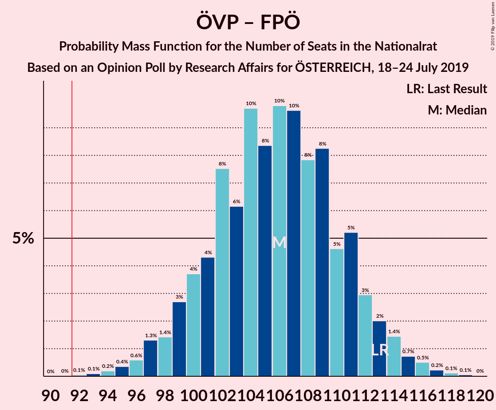

| Number of Seats | Probability | Accumulated | Special Marks |
|:---------------:|:-----------:|:-----------:|:-------------:|
| 92 | 0.1% | 100% | Majority |
| 93 | 0.1% | 99.9% |  |
| 94 | 0.2% | 99.8% |  |
| 95 | 0.4% | 99.6% |  |
| 96 | 0.6% | 99.3% |  |
| 97 | 1.3% | 98.7% |  |
| 98 | 1.4% | 97% |  |
| 99 | 3% | 96% |  |
| 100 | 4% | 93% |  |
| 101 | 4% | 90% |  |
| 102 | 8% | 85% |  |
| 103 | 6% | 78% |  |
| 104 | 10% | 72% |  |
| 105 | 8% | 62% |  |
| 106 | 10% | 53% | Median |
| 107 | 10% | 44% |  |
| 108 | 8% | 34% |  |
| 109 | 8% | 26% |  |
| 110 | 5% | 18% |  |
| 111 | 5% | 13% |  |
| 112 | 3% | 8% |  |
| 113 | 2% | 5% | Last Result |
| 114 | 1.4% | 3% |  |
| 115 | 0.7% | 2% |  |
| 116 | 0.5% | 1.0% |  |
| 117 | 0.2% | 0.4% |  |
| 118 | 0.1% | 0.2% |  |
| 119 | 0.1% | 0.1% |  |
| 120 | 0% | 0% |  |

### Österreichische Volkspartei – Die Grünen–Die Grüne Alternative – NEOS–Das Neue Österreich und Liberales Forum

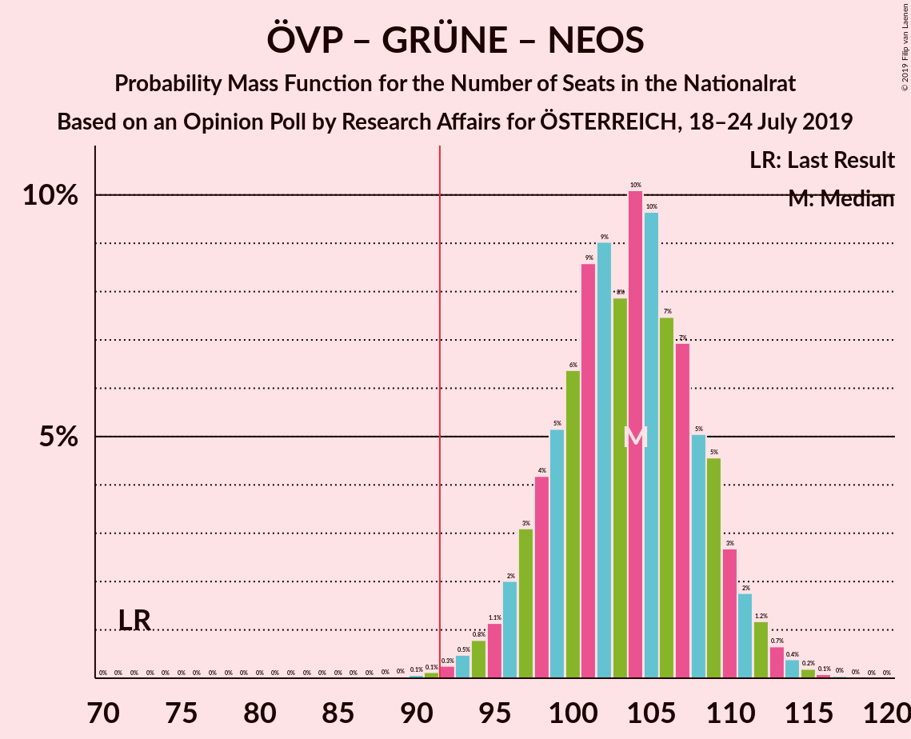

| Number of Seats | Probability | Accumulated | Special Marks |
|:---------------:|:-----------:|:-----------:|:-------------:|
| 72 | 0% | 100% | Last Result |
| 73 | 0% | 100% |  |
| 74 | 0% | 100% |  |
| 75 | 0% | 100% |  |
| 76 | 0% | 100% |  |
| 77 | 0% | 100% |  |
| 78 | 0% | 100% |  |
| 79 | 0% | 100% |  |
| 80 | 0% | 100% |  |
| 81 | 0% | 100% |  |
| 82 | 0% | 100% |  |
| 83 | 0% | 100% |  |
| 84 | 0% | 100% |  |
| 85 | 0% | 100% |  |
| 86 | 0% | 100% |  |
| 87 | 0% | 100% |  |
| 88 | 0% | 100% |  |
| 89 | 0% | 100% |  |
| 90 | 0.1% | 99.9% |  |
| 91 | 0.1% | 99.9% |  |
| 92 | 0.3% | 99.8% | Majority |
| 93 | 0.5% | 99.5% |  |
| 94 | 0.8% | 99.0% |  |
| 95 | 1.1% | 98% |  |
| 96 | 2% | 97% |  |
| 97 | 3% | 95% |  |
| 98 | 4% | 92% |  |
| 99 | 5% | 88% |  |
| 100 | 6% | 83% |  |
| 101 | 9% | 76% |  |
| 102 | 9% | 68% |  |
| 103 | 8% | 59% | Median |
| 104 | 10% | 51% |  |
| 105 | 10% | 41% |  |
| 106 | 7% | 31% |  |
| 107 | 7% | 24% |  |
| 108 | 5% | 17% |  |
| 109 | 5% | 12% |  |
| 110 | 3% | 7% |  |
| 111 | 2% | 4% |  |
| 112 | 1.2% | 3% |  |
| 113 | 0.7% | 1.4% |  |
| 114 | 0.4% | 0.7% |  |
| 115 | 0.2% | 0.3% |  |
| 116 | 0.1% | 0.2% |  |
| 117 | 0% | 0.1% |  |
| 118 | 0% | 0% |  |

### Österreichische Volkspartei – Die Grünen–Die Grüne Alternative

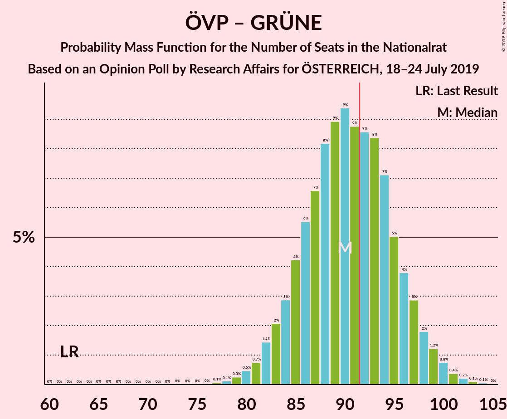

| Number of Seats | Probability | Accumulated | Special Marks |
|:---------------:|:-----------:|:-----------:|:-------------:|
| 62 | 0% | 100% | Last Result |
| 63 | 0% | 100% |  |
| 64 | 0% | 100% |  |
| 65 | 0% | 100% |  |
| 66 | 0% | 100% |  |
| 67 | 0% | 100% |  |
| 68 | 0% | 100% |  |
| 69 | 0% | 100% |  |
| 70 | 0% | 100% |  |
| 71 | 0% | 100% |  |
| 72 | 0% | 100% |  |
| 73 | 0% | 100% |  |
| 74 | 0% | 100% |  |
| 75 | 0% | 100% |  |
| 76 | 0% | 100% |  |
| 77 | 0.1% | 100% |  |
| 78 | 0.1% | 99.9% |  |
| 79 | 0.3% | 99.8% |  |
| 80 | 0.5% | 99.5% |  |
| 81 | 0.7% | 99.0% |  |
| 82 | 1.4% | 98% |  |
| 83 | 2% | 97% |  |
| 84 | 3% | 95% |  |
| 85 | 4% | 92% |  |
| 86 | 6% | 88% |  |
| 87 | 7% | 82% |  |
| 88 | 8% | 76% |  |
| 89 | 9% | 67% |  |
| 90 | 9% | 58% | Median |
| 91 | 9% | 49% |  |
| 92 | 9% | 40% | Majority |
| 93 | 8% | 32% |  |
| 94 | 7% | 23% |  |
| 95 | 5% | 16% |  |
| 96 | 4% | 11% |  |
| 97 | 3% | 7% |  |
| 98 | 2% | 5% |  |
| 99 | 1.2% | 3% |  |
| 100 | 0.8% | 2% |  |
| 101 | 0.4% | 0.8% |  |
| 102 | 0.2% | 0.4% |  |
| 103 | 0.1% | 0.2% |  |
| 104 | 0.1% | 0.1% |  |
| 105 | 0% | 0% |  |

### Österreichische Volkspartei – NEOS–Das Neue Österreich und Liberales Forum

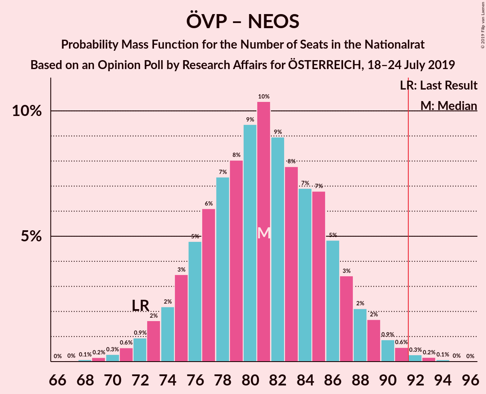

| Number of Seats | Probability | Accumulated | Special Marks |
|:---------------:|:-----------:|:-----------:|:-------------:|
| 67 | 0% | 100% |  |
| 68 | 0.1% | 99.9% |  |
| 69 | 0.2% | 99.9% |  |
| 70 | 0.3% | 99.7% |  |
| 71 | 0.6% | 99.4% |  |
| 72 | 0.9% | 98.9% | Last Result |
| 73 | 2% | 98% |  |
| 74 | 2% | 96% |  |
| 75 | 3% | 94% |  |
| 76 | 5% | 91% |  |
| 77 | 6% | 86% |  |
| 78 | 7% | 80% |  |
| 79 | 8% | 72% |  |
| 80 | 9% | 64% |  |
| 81 | 10% | 55% | Median |
| 82 | 9% | 45% |  |
| 83 | 8% | 36% |  |
| 84 | 7% | 28% |  |
| 85 | 7% | 21% |  |
| 86 | 5% | 14% |  |
| 87 | 3% | 9% |  |
| 88 | 2% | 6% |  |
| 89 | 2% | 4% |  |
| 90 | 0.9% | 2% |  |
| 91 | 0.6% | 1.1% |  |
| 92 | 0.3% | 0.6% | Majority |
| 93 | 0.2% | 0.3% |  |
| 94 | 0.1% | 0.1% |  |
| 95 | 0% | 0.1% |  |
| 96 | 0% | 0% |  |

### Sozialdemokratische Partei Österreichs – Freiheitliche Partei Österreichs

| Number of Seats | Probability | Accumulated | Special Marks |
|:---------------:|:-----------:|:-----------:|:-------------:|
| 66 | 0% | 100% |  |
| 67 | 0.1% | 99.9% |  |
| 68 | 0.2% | 99.8% |  |
| 69 | 0.4% | 99.6% |  |
| 70 | 0.7% | 99.2% |  |
| 71 | 1.3% | 98% |  |
| 72 | 2% | 97% |  |
| 73 | 3% | 95% |  |
| 74 | 5% | 93% |  |
| 75 | 5% | 88% |  |
| 76 | 7% | 83% |  |
| 77 | 8% | 76% |  |
| 78 | 10% | 68% |  |
| 79 | 10% | 58% |  |
| 80 | 8% | 48% | Median |
| 81 | 9% | 40% |  |
| 82 | 9% | 31% |  |
| 83 | 6% | 23% |  |
| 84 | 5% | 16% |  |
| 85 | 4% | 11% |  |
| 86 | 3% | 7% |  |
| 87 | 2% | 5% |  |
| 88 | 1.1% | 3% |  |
| 89 | 0.7% | 2% |  |
| 90 | 0.4% | 0.9% |  |
| 91 | 0.2% | 0.4% |  |
| 92 | 0.1% | 0.2% | Majority |
| 93 | 0.1% | 0.1% |  |
| 94 | 0% | 0% |  |
| 95 | 0% | 0% |  |
| 96 | 0% | 0% |  |
| 97 | 0% | 0% |  |
| 98 | 0% | 0% |  |
| 99 | 0% | 0% |  |
| 100 | 0% | 0% |  |
| 101 | 0% | 0% |  |
| 102 | 0% | 0% |  |
| 103 | 0% | 0% | Last Result |

### Sozialdemokratische Partei Österreichs – Die Grünen–Die Grüne Alternative – NEOS–Das Neue Österreich und Liberales Forum

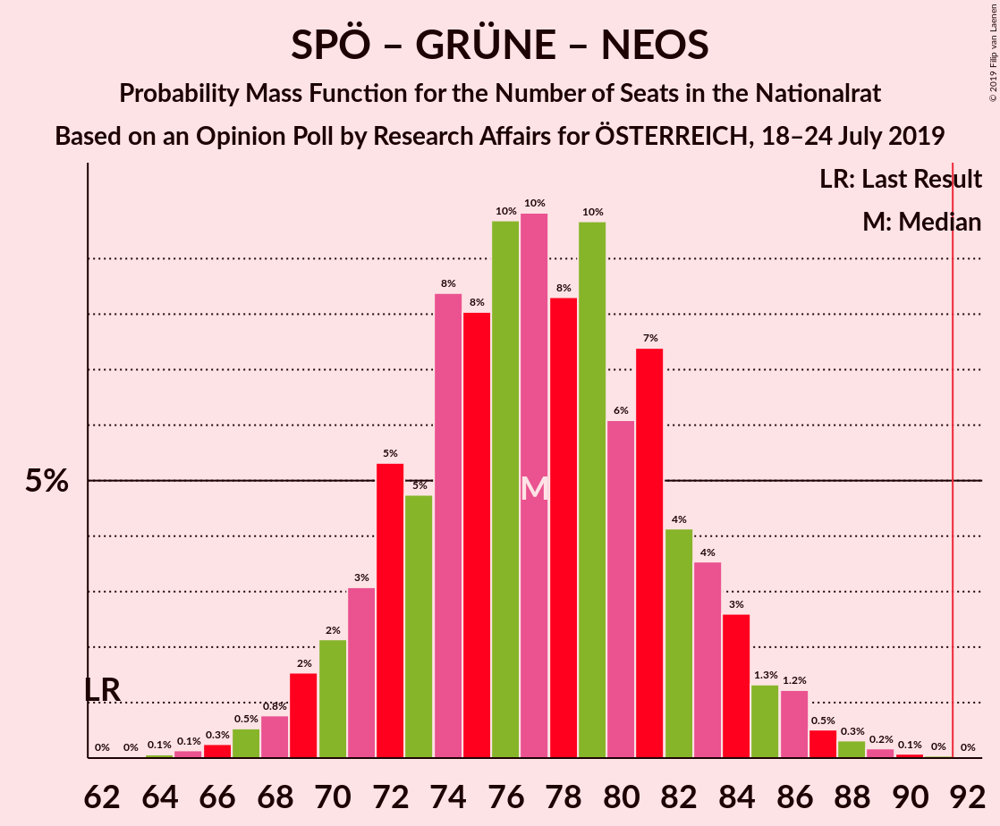

| Number of Seats | Probability | Accumulated | Special Marks |
|:---------------:|:-----------:|:-----------:|:-------------:|
| 62 | 0% | 100% | Last Result |
| 63 | 0% | 100% |  |
| 64 | 0.1% | 100% |  |
| 65 | 0.1% | 99.9% |  |
| 66 | 0.3% | 99.7% |  |
| 67 | 0.5% | 99.5% |  |
| 68 | 0.8% | 99.0% |  |
| 69 | 2% | 98% |  |
| 70 | 2% | 97% |  |
| 71 | 3% | 95% |  |
| 72 | 5% | 91% |  |
| 73 | 5% | 86% |  |
| 74 | 8% | 81% |  |
| 75 | 8% | 73% |  |
| 76 | 10% | 65% |  |
| 77 | 10% | 55% | Median |
| 78 | 8% | 45% |  |
| 79 | 10% | 37% |  |
| 80 | 6% | 27% |  |
| 81 | 7% | 21% |  |
| 82 | 4% | 14% |  |
| 83 | 4% | 10% |  |
| 84 | 3% | 6% |  |
| 85 | 1.3% | 4% |  |
| 86 | 1.2% | 2% |  |
| 87 | 0.5% | 1.1% |  |
| 88 | 0.3% | 0.6% |  |
| 89 | 0.2% | 0.3% |  |
| 90 | 0.1% | 0.1% |  |
| 91 | 0% | 0.1% |  |
| 92 | 0% | 0% | Majority |

### Österreichische Volkspartei

| Number of Seats | Probability | Accumulated | Special Marks |
|:---------------:|:-----------:|:-----------:|:-------------:|
| 55 | 0.1% | 100% |  |
| 56 | 0.1% | 99.9% |  |
| 57 | 0.2% | 99.8% |  |
| 58 | 0.5% | 99.6% |  |
| 59 | 0.9% | 99.1% |  |
| 60 | 1.4% | 98% |  |
| 61 | 2% | 97% |  |
| 62 | 3% | 95% | Last Result |
| 63 | 5% | 91% |  |
| 64 | 6% | 86% |  |
| 65 | 7% | 80% |  |
| 66 | 9% | 73% |  |
| 67 | 9% | 64% |  |
| 68 | 11% | 55% | Median |
| 69 | 9% | 44% |  |
| 70 | 9% | 35% |  |
| 71 | 7% | 26% |  |
| 72 | 6% | 19% |  |
| 73 | 5% | 13% |  |
| 74 | 3% | 9% |  |
| 75 | 2% | 5% |  |
| 76 | 1.3% | 3% |  |
| 77 | 0.8% | 2% |  |
| 78 | 0.5% | 1.0% |  |
| 79 | 0.3% | 0.5% |  |
| 80 | 0.1% | 0.2% |  |
| 81 | 0.1% | 0.1% |  |
| 82 | 0% | 0.1% |  |
| 83 | 0% | 0% |  |

### Sozialdemokratische Partei Österreichs – Die Grünen–Die Grüne Alternative

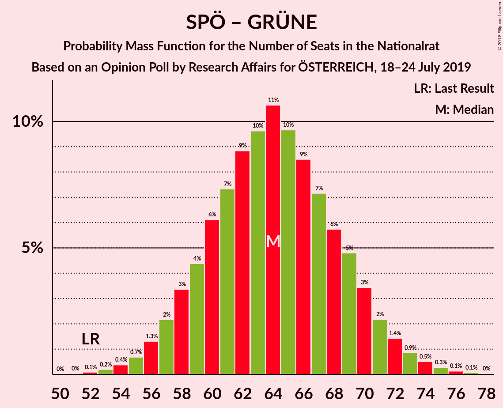

| Number of Seats | Probability | Accumulated | Special Marks |
|:---------------:|:-----------:|:-----------:|:-------------:|
| 51 | 0% | 100% |  |
| 52 | 0.1% | 99.9% | Last Result |
| 53 | 0.2% | 99.8% |  |
| 54 | 0.4% | 99.6% |  |
| 55 | 0.7% | 99.3% |  |
| 56 | 1.3% | 98.6% |  |
| 57 | 2% | 97% |  |
| 58 | 3% | 95% |  |
| 59 | 4% | 92% |  |
| 60 | 6% | 87% |  |
| 61 | 7% | 81% |  |
| 62 | 9% | 74% |  |
| 63 | 10% | 65% |  |
| 64 | 11% | 55% | Median |
| 65 | 10% | 45% |  |
| 66 | 9% | 35% |  |
| 67 | 7% | 27% |  |
| 68 | 6% | 19% |  |
| 69 | 5% | 14% |  |
| 70 | 3% | 9% |  |
| 71 | 2% | 6% |  |
| 72 | 1.4% | 3% |  |
| 73 | 0.9% | 2% |  |
| 74 | 0.5% | 1.0% |  |
| 75 | 0.3% | 0.5% |  |
| 76 | 0.1% | 0.3% |  |
| 77 | 0.1% | 0.1% |  |
| 78 | 0% | 0% |  |

### Sozialdemokratische Partei Österreichs

| Number of Seats | Probability | Accumulated | Special Marks |
|:---------------:|:-----------:|:-----------:|:-------------:|
| 31 | 0.1% | 100% |  |
| 32 | 0.2% | 99.9% |  |
| 33 | 0.4% | 99.7% |  |
| 34 | 0.9% | 99.2% |  |
| 35 | 2% | 98% |  |
| 36 | 3% | 96% |  |
| 37 | 6% | 93% |  |
| 38 | 7% | 88% |  |
| 39 | 7% | 80% |  |
| 40 | 13% | 74% |  |
| 41 | 11% | 61% |  |
| 42 | 10% | 50% | Median |
| 43 | 12% | 40% |  |
| 44 | 6% | 28% |  |
| 45 | 8% | 21% |  |
| 46 | 6% | 14% |  |
| 47 | 3% | 8% |  |
| 48 | 3% | 5% |  |
| 49 | 1.1% | 3% |  |
| 50 | 0.6% | 1.4% |  |
| 51 | 0.5% | 0.8% |  |
| 52 | 0.2% | 0.3% | Last Result |
| 53 | 0.1% | 0.2% |  |
| 54 | 0% | 0.1% |  |
| 55 | 0% | 0% |  |

## Technical Information

### Opinion Poll

+ **Polling firm:** Research Affairs
+ **Commissioner(s):** ÖSTERREICH
+ **Fieldwork period:** 18–24 July 2019

### Calculations

+ **Sample size:** 504
+ **Simulations done:** 1,048,576
+ **Error estimate:** 1.02%

