# Opinion Poll by Research Affairs for ÖSTERREICH, 25–31 July 2019

<a href="#voting-intentions">Voting Intentions</a> | <a href="#seats">Seats</a> | <a href="#coalitions">Coalitions</a> | <a href="#technical-information">Technical Information</a>

## Voting Intentions

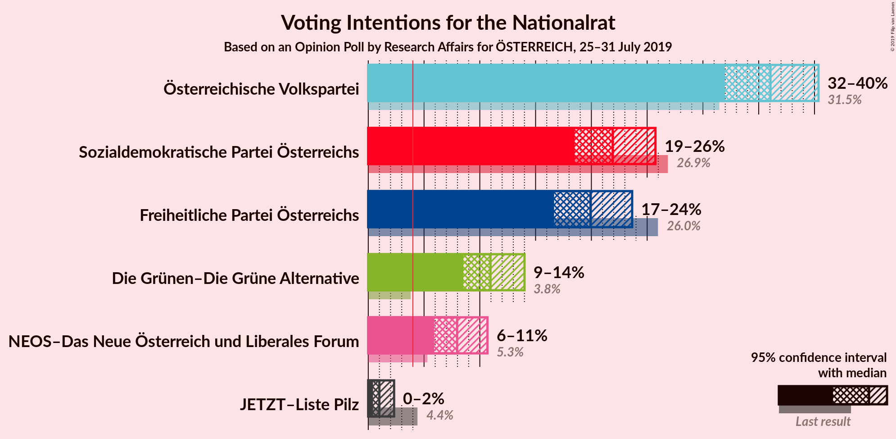

### Confidence Intervals

| Party | Last Result | Poll Result | 80% Confidence Interval | 90% Confidence Interval | 95% Confidence Interval | 99% Confidence Interval |
|:-----:|:-----------:|:-----------:|:-----------------------:|:-----------------------:|:-----------------------:|:-----------------------:|
| Österreichische Volkspartei | 31.5% | 36.1% | 33.4–38.9% |32.6–39.7% |32.0–40.4% |30.7–41.7% |
| Sozialdemokratische Partei Österreichs | 26.9% | 21.9% | 19.7–24.4% |19.1–25.1% |18.5–25.7% |17.5–27.0% |
| Freiheitliche Partei Österreichs | 26.0% | 19.9% | 17.8–22.4% |17.2–23.0% |16.7–23.7% |15.7–24.8% |
| Die Grünen–Die Grüne Alternative | 3.8% | 11.0% | 9.3–12.9% |8.9–13.5% |8.5–14.0% |7.8–15.0% |
| NEOS–Das Neue Österreich und Liberales Forum | 5.3% | 8.0% | 6.6–9.7% |6.2–10.2% |5.9–10.7% |5.3–11.6% |
| JETZT–Liste Pilz | 4.4% | 1.0% | 0.6–1.8% |0.5–2.1% |0.4–2.3% |0.3–2.8% |

*Note:* The poll result column reflects the actual value used in the calculations. Published results may vary slightly, and in addition be rounded to fewer digits.

## Seats

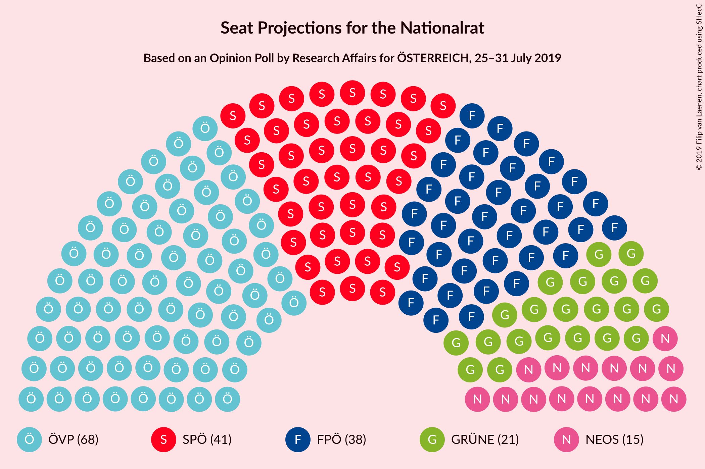

### Confidence Intervals

| Party | Last Result | Median | 80% Confidence Interval | 90% Confidence Interval | 95% Confidence Interval | 99% Confidence Interval |
|:-----:|:-----------:|:------:|:-----------------------:|:-----------------------:|:-----------------------:|:-----------------------:|
| <a href="#österreichische-volkspartei">Österreichische Volkspartei</a> | 62 | 68 | 63–74 |62–75 |60–76 |58–79 |
| <a href="#sozialdemokratische-partei-österreichs">Sozialdemokratische Partei Österreichs</a> | 52 | 41 | 37–46 |36–47 |35–49 |33–51 |
| <a href="#freiheitliche-partei-österreichs">Freiheitliche Partei Österreichs</a> | 51 | 38 | 33–42 |32–43 |31–44 |29–47 |
| <a href="#die-grünen–die-grüne-alternative">Die Grünen–Die Grüne Alternative</a> | 0 | 21 | 17–24 |16–25 |16–26 |14–28 |
| <a href="#neos–das-neue-österreich-und-liberales-forum">NEOS–Das Neue Österreich und Liberales Forum</a> | 10 | 15 | 12–18 |11–19 |11–20 |10–21 |
| <a href="#jetzt–liste-pilz">JETZT–Liste Pilz</a> | 8 | 0 | 0 |0 |0 |0 |

### Österreichische Volkspartei

*For a full overview of the results for this party, see the [Österreichische Volkspartei](party-österreichischevolkspartei.html) page.*

| Number of Seats | Probability | Accumulated | Special Marks |
|:---------------:|:-----------:|:-----------:|:-------------:|
| 55 | 0% | 100% |  |
| 56 | 0.1% | 99.9% |  |
| 57 | 0.2% | 99.8% |  |
| 58 | 0.4% | 99.6% |  |
| 59 | 0.7% | 99.3% |  |
| 60 | 1.2% | 98.6% |  |
| 61 | 2% | 97% |  |
| 62 | 3% | 95% | Last Result |
| 63 | 5% | 92% |  |
| 64 | 6% | 87% |  |
| 65 | 7% | 82% |  |
| 66 | 9% | 75% |  |
| 67 | 8% | 66% |  |
| 68 | 11% | 58% | Median |
| 69 | 11% | 47% |  |
| 70 | 8% | 36% |  |
| 71 | 7% | 28% |  |
| 72 | 6% | 21% |  |
| 73 | 4% | 15% |  |
| 74 | 4% | 10% |  |
| 75 | 3% | 6% |  |
| 76 | 1.3% | 3% |  |
| 77 | 0.9% | 2% |  |
| 78 | 0.5% | 1.2% |  |
| 79 | 0.3% | 0.7% |  |
| 80 | 0.2% | 0.3% |  |
| 81 | 0.1% | 0.1% |  |
| 82 | 0% | 0.1% |  |
| 83 | 0% | 0% |  |

### Sozialdemokratische Partei Österreichs

*For a full overview of the results for this party, see the [Sozialdemokratische Partei Österreichs](party-sozialdemokratischeparteiösterreichs.html) page.*

| Number of Seats | Probability | Accumulated | Special Marks |
|:---------------:|:-----------:|:-----------:|:-------------:|
| 31 | 0.1% | 100% |  |
| 32 | 0.3% | 99.9% |  |
| 33 | 0.5% | 99.6% |  |
| 34 | 1.2% | 99.1% |  |
| 35 | 2% | 98% |  |
| 36 | 4% | 96% |  |
| 37 | 5% | 92% |  |
| 38 | 8% | 87% |  |
| 39 | 10% | 80% |  |
| 40 | 11% | 70% |  |
| 41 | 10% | 59% | Median |
| 42 | 11% | 48% |  |
| 43 | 10% | 37% |  |
| 44 | 8% | 27% |  |
| 45 | 6% | 19% |  |
| 46 | 5% | 13% |  |
| 47 | 3% | 7% |  |
| 48 | 2% | 4% |  |
| 49 | 1.3% | 3% |  |
| 50 | 0.6% | 1.3% |  |
| 51 | 0.3% | 0.6% |  |
| 52 | 0.1% | 0.3% | Last Result |
| 53 | 0.1% | 0.1% |  |
| 54 | 0% | 0.1% |  |
| 55 | 0% | 0% |  |

### Freiheitliche Partei Österreichs

*For a full overview of the results for this party, see the [Freiheitliche Partei Österreichs](party-freiheitlicheparteiösterreichs.html) page.*

| Number of Seats | Probability | Accumulated | Special Marks |
|:---------------:|:-----------:|:-----------:|:-------------:|
| 27 | 0.1% | 100% |  |
| 28 | 0.2% | 99.9% |  |
| 29 | 0.3% | 99.8% |  |
| 30 | 1.0% | 99.5% |  |
| 31 | 1.3% | 98% |  |
| 32 | 4% | 97% |  |
| 33 | 4% | 93% |  |
| 34 | 9% | 90% |  |
| 35 | 6% | 81% |  |
| 36 | 14% | 75% |  |
| 37 | 8% | 60% |  |
| 38 | 15% | 53% | Median |
| 39 | 9% | 38% |  |
| 40 | 10% | 29% |  |
| 41 | 6% | 19% |  |
| 42 | 5% | 13% |  |
| 43 | 3% | 8% |  |
| 44 | 2% | 5% |  |
| 45 | 1.3% | 2% |  |
| 46 | 0.5% | 1.2% |  |
| 47 | 0.4% | 0.7% |  |
| 48 | 0.1% | 0.3% |  |
| 49 | 0.1% | 0.1% |  |
| 50 | 0% | 0% |  |
| 51 | 0% | 0% | Last Result |

### Die Grünen–Die Grüne Alternative

*For a full overview of the results for this party, see the [Die Grünen–Die Grüne Alternative](party-diegrünen–diegrünealternative.html) page.*

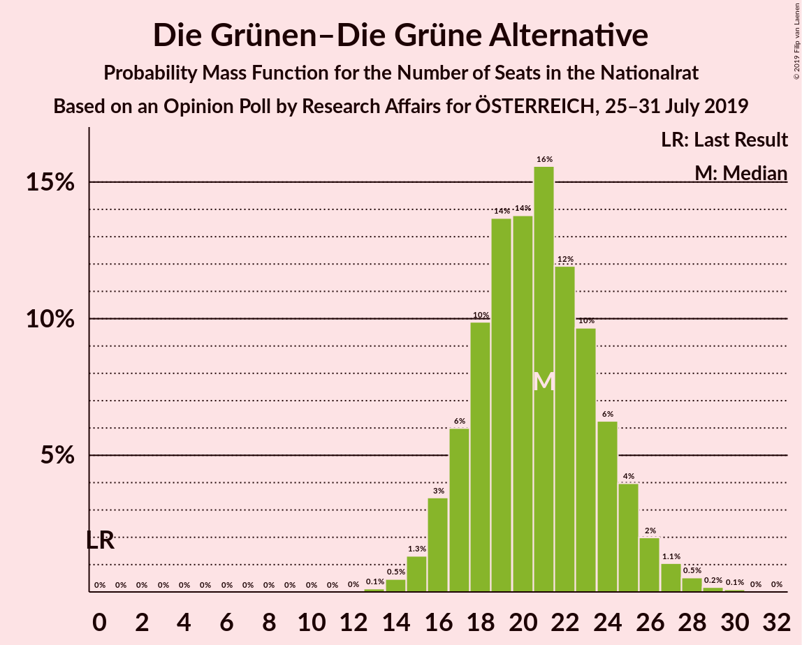

| Number of Seats | Probability | Accumulated | Special Marks |
|:---------------:|:-----------:|:-----------:|:-------------:|
| 0 | 0% | 100% | Last Result |
| 1 | 0% | 100% |  |
| 2 | 0% | 100% |  |
| 3 | 0% | 100% |  |
| 4 | 0% | 100% |  |
| 5 | 0% | 100% |  |
| 6 | 0% | 100% |  |
| 7 | 0% | 100% |  |
| 8 | 0% | 100% |  |
| 9 | 0% | 100% |  |
| 10 | 0% | 100% |  |
| 11 | 0% | 100% |  |
| 12 | 0% | 100% |  |
| 13 | 0.1% | 100% |  |
| 14 | 0.5% | 99.9% |  |
| 15 | 1.3% | 99.4% |  |
| 16 | 3% | 98% |  |
| 17 | 6% | 95% |  |
| 18 | 10% | 89% |  |
| 19 | 14% | 79% |  |
| 20 | 14% | 65% |  |
| 21 | 16% | 51% | Median |
| 22 | 12% | 36% |  |
| 23 | 10% | 24% |  |
| 24 | 6% | 14% |  |
| 25 | 4% | 8% |  |
| 26 | 2% | 4% |  |
| 27 | 1.1% | 2% |  |
| 28 | 0.5% | 0.8% |  |
| 29 | 0.2% | 0.3% |  |
| 30 | 0.1% | 0.1% |  |
| 31 | 0% | 0% |  |

### NEOS–Das Neue Österreich und Liberales Forum

*For a full overview of the results for this party, see the [NEOS–Das Neue Österreich und Liberales Forum](party-neos–dasneueösterreichundliberalesforum.html) page.*

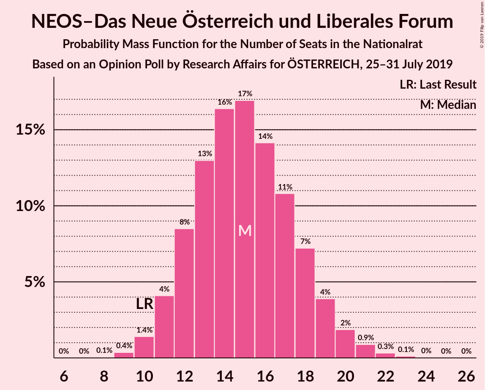

| Number of Seats | Probability | Accumulated | Special Marks |
|:---------------:|:-----------:|:-----------:|:-------------:|
| 8 | 0.1% | 100% |  |
| 9 | 0.4% | 99.9% |  |
| 10 | 1.4% | 99.6% | Last Result |
| 11 | 4% | 98% |  |
| 12 | 8% | 94% |  |
| 13 | 13% | 86% |  |
| 14 | 16% | 73% |  |
| 15 | 17% | 56% | Median |
| 16 | 14% | 39% |  |
| 17 | 11% | 25% |  |
| 18 | 7% | 14% |  |
| 19 | 4% | 7% |  |
| 20 | 2% | 3% |  |
| 21 | 0.9% | 1.4% |  |
| 22 | 0.3% | 0.5% |  |
| 23 | 0.1% | 0.2% |  |
| 24 | 0% | 0.1% |  |
| 25 | 0% | 0% |  |

### JETZT–Liste Pilz

*For a full overview of the results for this party, see the [JETZT–Liste Pilz](party-jetzt–listepilz.html) page.*

| Number of Seats | Probability | Accumulated | Special Marks |
|:---------------:|:-----------:|:-----------:|:-------------:|
| 0 | 100% | 100% | Median |
| 1 | 0% | 0% |  |
| 2 | 0% | 0% |  |
| 3 | 0% | 0% |  |
| 4 | 0% | 0% |  |
| 5 | 0% | 0% |  |
| 6 | 0% | 0% |  |
| 7 | 0% | 0% |  |
| 8 | 0% | 0% | Last Result |

## Coalitions

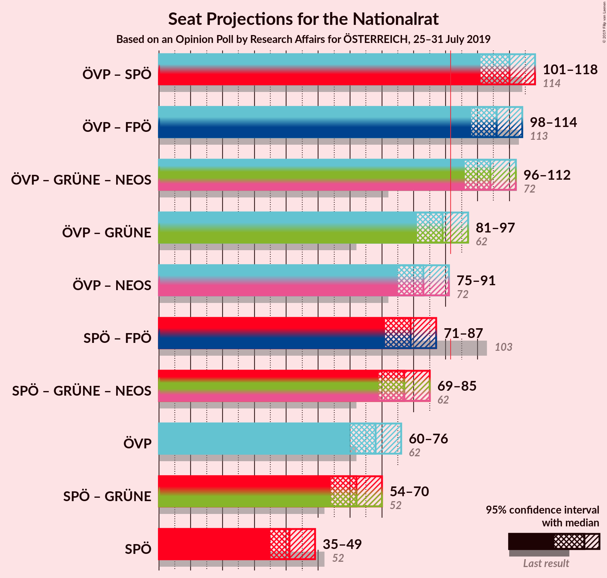

### Confidence Intervals

| Coalition | Last Result | Median | Majority? | 80% Confidence Interval | 90% Confidence Interval | 95% Confidence Interval | 99% Confidence Interval |
|:---------:|:-----------:|:------:|:---------:|:-----------------------:|:-----------------------:|:-----------------------:|:-----------------------:|
| Österreichische Volkspartei – Sozialdemokratische Partei Österreichs | 114 | 110 | 100% | 104–115 | 103–116 | 101–118 | 99–120 |
| Österreichische Volkspartei – Freiheitliche Partei Österreichs | 113 | 106 | 100% | 100–111 | 99–113 | 98–114 | 95–116 |
| Österreichische Volkspartei – Die Grünen–Die Grüne Alternative – NEOS–Das Neue Österreich und Liberales Forum | 72 | 104 | 99.8% | 98–109 | 97–111 | 96–112 | 93–114 |
| Österreichische Volkspartei – Die Grünen–Die Grüne Alternative | 62 | 89 | 26% | 84–94 | 82–96 | 81–97 | 78–100 |
| Österreichische Volkspartei – NEOS–Das Neue Österreich und Liberales Forum | 72 | 83 | 2% | 78–89 | 76–90 | 75–91 | 72–94 |
| Sozialdemokratische Partei Österreichs – Freiheitliche Partei Österreichs | 103 | 79 | 0.1% | 74–84 | 72–86 | 71–87 | 68–90 |
| Sozialdemokratische Partei Österreichs – Die Grünen–Die Grüne Alternative – NEOS–Das Neue Österreich und Liberales Forum | 62 | 77 | 0% | 72–82 | 70–84 | 69–85 | 66–88 |
| Österreichische Volkspartei | 62 | 68 | 0% | 63–74 | 62–75 | 60–76 | 58–79 |
| Sozialdemokratische Partei Österreichs – Die Grünen–Die Grüne Alternative | 52 | 62 | 0% | 57–67 | 56–69 | 54–70 | 52–73 |
| Sozialdemokratische Partei Österreichs | 52 | 41 | 0% | 37–46 | 36–47 | 35–49 | 33–51 |

### Österreichische Volkspartei – Sozialdemokratische Partei Österreichs

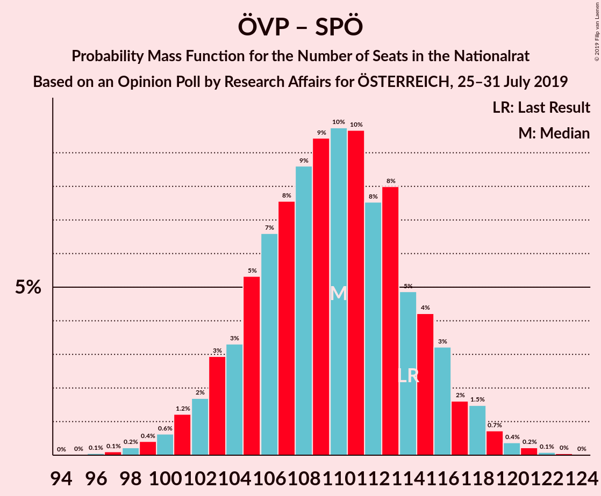

| Number of Seats | Probability | Accumulated | Special Marks |
|:---------------:|:-----------:|:-----------:|:-------------:|
| 96 | 0.1% | 100% |  |
| 97 | 0.1% | 99.9% |  |
| 98 | 0.2% | 99.8% |  |
| 99 | 0.4% | 99.6% |  |
| 100 | 0.6% | 99.2% |  |
| 101 | 1.2% | 98.5% |  |
| 102 | 2% | 97% |  |
| 103 | 3% | 96% |  |
| 104 | 3% | 93% |  |
| 105 | 5% | 89% |  |
| 106 | 7% | 84% |  |
| 107 | 8% | 77% |  |
| 108 | 9% | 70% |  |
| 109 | 9% | 61% | Median |
| 110 | 10% | 52% |  |
| 111 | 10% | 42% |  |
| 112 | 8% | 32% |  |
| 113 | 8% | 25% |  |
| 114 | 5% | 17% | Last Result |
| 115 | 4% | 12% |  |
| 116 | 3% | 8% |  |
| 117 | 2% | 5% |  |
| 118 | 1.5% | 3% |  |
| 119 | 0.7% | 1.5% |  |
| 120 | 0.4% | 0.8% |  |
| 121 | 0.2% | 0.4% |  |
| 122 | 0.1% | 0.2% |  |
| 123 | 0% | 0.1% |  |
| 124 | 0% | 0% |  |

### Österreichische Volkspartei – Freiheitliche Partei Österreichs

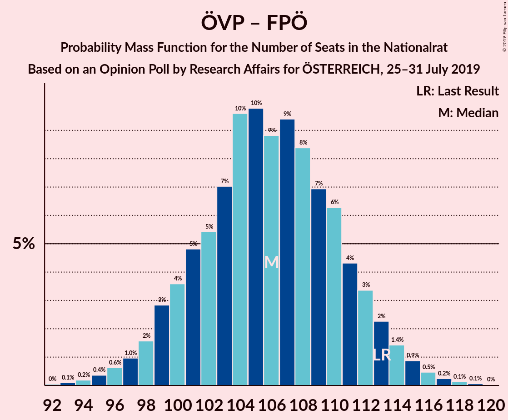

| Number of Seats | Probability | Accumulated | Special Marks |
|:---------------:|:-----------:|:-----------:|:-------------:|
| 92 | 0% | 100% | Majority |
| 93 | 0.1% | 99.9% |  |
| 94 | 0.2% | 99.8% |  |
| 95 | 0.4% | 99.6% |  |
| 96 | 0.6% | 99.3% |  |
| 97 | 1.0% | 98.6% |  |
| 98 | 2% | 98% |  |
| 99 | 3% | 96% |  |
| 100 | 4% | 93% |  |
| 101 | 5% | 90% |  |
| 102 | 5% | 85% |  |
| 103 | 7% | 79% |  |
| 104 | 10% | 72% |  |
| 105 | 10% | 63% |  |
| 106 | 9% | 53% | Median |
| 107 | 9% | 44% |  |
| 108 | 8% | 35% |  |
| 109 | 7% | 26% |  |
| 110 | 6% | 19% |  |
| 111 | 4% | 13% |  |
| 112 | 3% | 9% |  |
| 113 | 2% | 6% | Last Result |
| 114 | 1.4% | 3% |  |
| 115 | 0.9% | 2% |  |
| 116 | 0.5% | 0.9% |  |
| 117 | 0.2% | 0.5% |  |
| 118 | 0.1% | 0.2% |  |
| 119 | 0.1% | 0.1% |  |
| 120 | 0% | 0% |  |

### Österreichische Volkspartei – Die Grünen–Die Grüne Alternative – NEOS–Das Neue Österreich und Liberales Forum

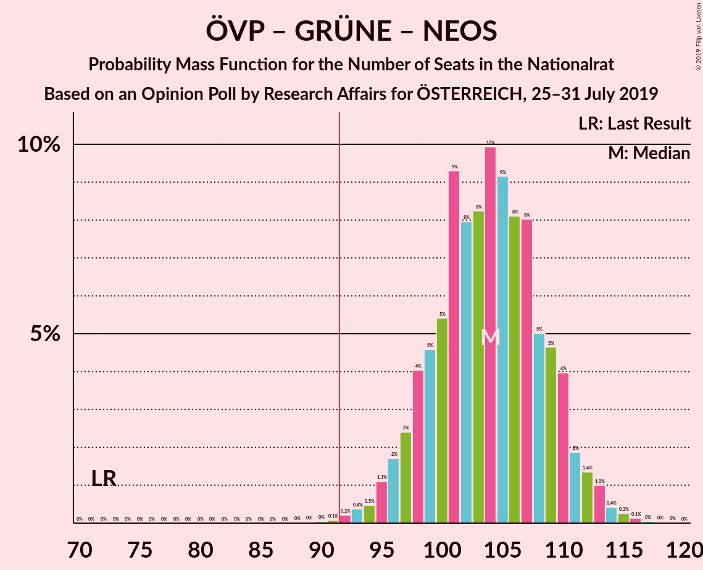

| Number of Seats | Probability | Accumulated | Special Marks |
|:---------------:|:-----------:|:-----------:|:-------------:|
| 72 | 0% | 100% | Last Result |
| 73 | 0% | 100% |  |
| 74 | 0% | 100% |  |
| 75 | 0% | 100% |  |
| 76 | 0% | 100% |  |
| 77 | 0% | 100% |  |
| 78 | 0% | 100% |  |
| 79 | 0% | 100% |  |
| 80 | 0% | 100% |  |
| 81 | 0% | 100% |  |
| 82 | 0% | 100% |  |
| 83 | 0% | 100% |  |
| 84 | 0% | 100% |  |
| 85 | 0% | 100% |  |
| 86 | 0% | 100% |  |
| 87 | 0% | 100% |  |
| 88 | 0% | 100% |  |
| 89 | 0% | 100% |  |
| 90 | 0% | 100% |  |
| 91 | 0.1% | 99.9% |  |
| 92 | 0.2% | 99.8% | Majority |
| 93 | 0.4% | 99.6% |  |
| 94 | 0.5% | 99.2% |  |
| 95 | 1.1% | 98.8% |  |
| 96 | 2% | 98% |  |
| 97 | 2% | 96% |  |
| 98 | 4% | 94% |  |
| 99 | 5% | 90% |  |
| 100 | 5% | 85% |  |
| 101 | 9% | 80% |  |
| 102 | 8% | 70% |  |
| 103 | 8% | 62% |  |
| 104 | 10% | 54% | Median |
| 105 | 9% | 44% |  |
| 106 | 8% | 35% |  |
| 107 | 8% | 27% |  |
| 108 | 5% | 19% |  |
| 109 | 5% | 14% |  |
| 110 | 4% | 9% |  |
| 111 | 2% | 5% |  |
| 112 | 1.4% | 3% |  |
| 113 | 1.0% | 2% |  |
| 114 | 0.4% | 0.9% |  |
| 115 | 0.3% | 0.5% |  |
| 116 | 0.1% | 0.2% |  |
| 117 | 0% | 0.1% |  |
| 118 | 0% | 0% |  |

### Österreichische Volkspartei – Die Grünen–Die Grüne Alternative

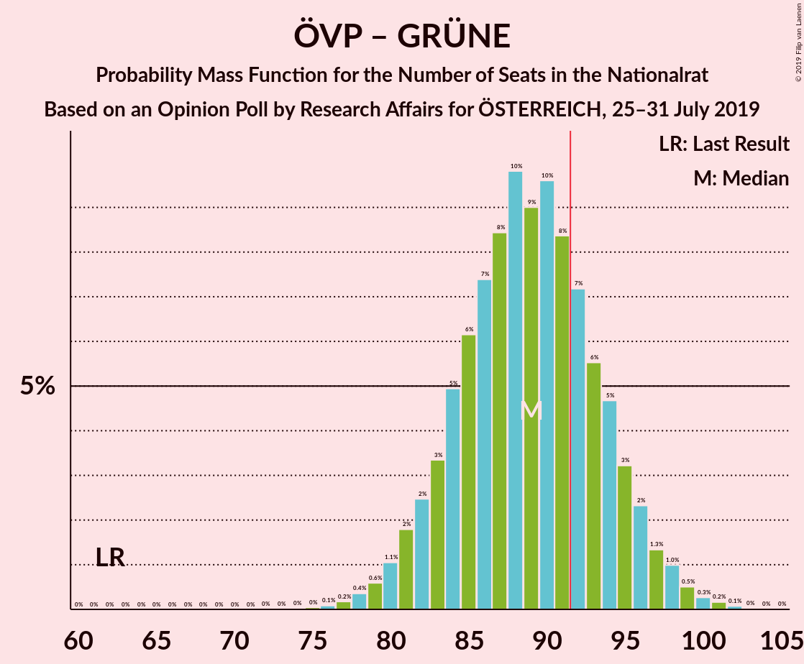

| Number of Seats | Probability | Accumulated | Special Marks |
|:---------------:|:-----------:|:-----------:|:-------------:|
| 62 | 0% | 100% | Last Result |
| 63 | 0% | 100% |  |
| 64 | 0% | 100% |  |
| 65 | 0% | 100% |  |
| 66 | 0% | 100% |  |
| 67 | 0% | 100% |  |
| 68 | 0% | 100% |  |
| 69 | 0% | 100% |  |
| 70 | 0% | 100% |  |
| 71 | 0% | 100% |  |
| 72 | 0% | 100% |  |
| 73 | 0% | 100% |  |
| 74 | 0% | 100% |  |
| 75 | 0% | 100% |  |
| 76 | 0.1% | 99.9% |  |
| 77 | 0.2% | 99.8% |  |
| 78 | 0.4% | 99.7% |  |
| 79 | 0.6% | 99.3% |  |
| 80 | 1.1% | 98.7% |  |
| 81 | 2% | 98% |  |
| 82 | 2% | 96% |  |
| 83 | 3% | 93% |  |
| 84 | 5% | 90% |  |
| 85 | 6% | 85% |  |
| 86 | 7% | 79% |  |
| 87 | 8% | 72% |  |
| 88 | 10% | 63% |  |
| 89 | 9% | 53% | Median |
| 90 | 10% | 44% |  |
| 91 | 8% | 35% |  |
| 92 | 7% | 26% | Majority |
| 93 | 6% | 19% |  |
| 94 | 5% | 14% |  |
| 95 | 3% | 9% |  |
| 96 | 2% | 6% |  |
| 97 | 1.3% | 3% |  |
| 98 | 1.0% | 2% |  |
| 99 | 0.5% | 1.1% |  |
| 100 | 0.3% | 0.6% |  |
| 101 | 0.2% | 0.3% |  |
| 102 | 0.1% | 0.1% |  |
| 103 | 0% | 0.1% |  |
| 104 | 0% | 0% |  |

### Österreichische Volkspartei – NEOS–Das Neue Österreich und Liberales Forum

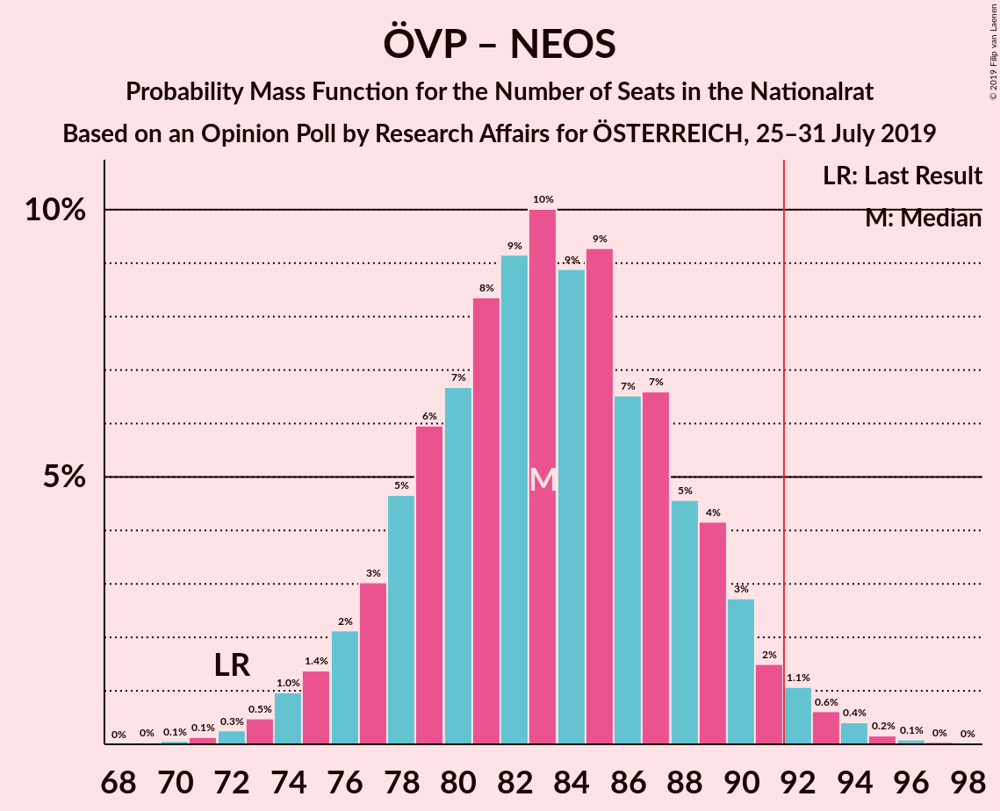

| Number of Seats | Probability | Accumulated | Special Marks |
|:---------------:|:-----------:|:-----------:|:-------------:|
| 69 | 0% | 100% |  |
| 70 | 0.1% | 99.9% |  |
| 71 | 0.1% | 99.9% |  |
| 72 | 0.3% | 99.8% | Last Result |
| 73 | 0.5% | 99.5% |  |
| 74 | 1.0% | 99.0% |  |
| 75 | 1.4% | 98% |  |
| 76 | 2% | 97% |  |
| 77 | 3% | 95% |  |
| 78 | 5% | 92% |  |
| 79 | 6% | 87% |  |
| 80 | 7% | 81% |  |
| 81 | 8% | 74% |  |
| 82 | 9% | 66% |  |
| 83 | 10% | 57% | Median |
| 84 | 9% | 47% |  |
| 85 | 9% | 38% |  |
| 86 | 7% | 29% |  |
| 87 | 7% | 22% |  |
| 88 | 5% | 15% |  |
| 89 | 4% | 11% |  |
| 90 | 3% | 7% |  |
| 91 | 2% | 4% |  |
| 92 | 1.1% | 2% | Majority |
| 93 | 0.6% | 1.4% |  |
| 94 | 0.4% | 0.7% |  |
| 95 | 0.2% | 0.3% |  |
| 96 | 0.1% | 0.2% |  |
| 97 | 0% | 0.1% |  |
| 98 | 0% | 0% |  |

### Sozialdemokratische Partei Österreichs – Freiheitliche Partei Österreichs

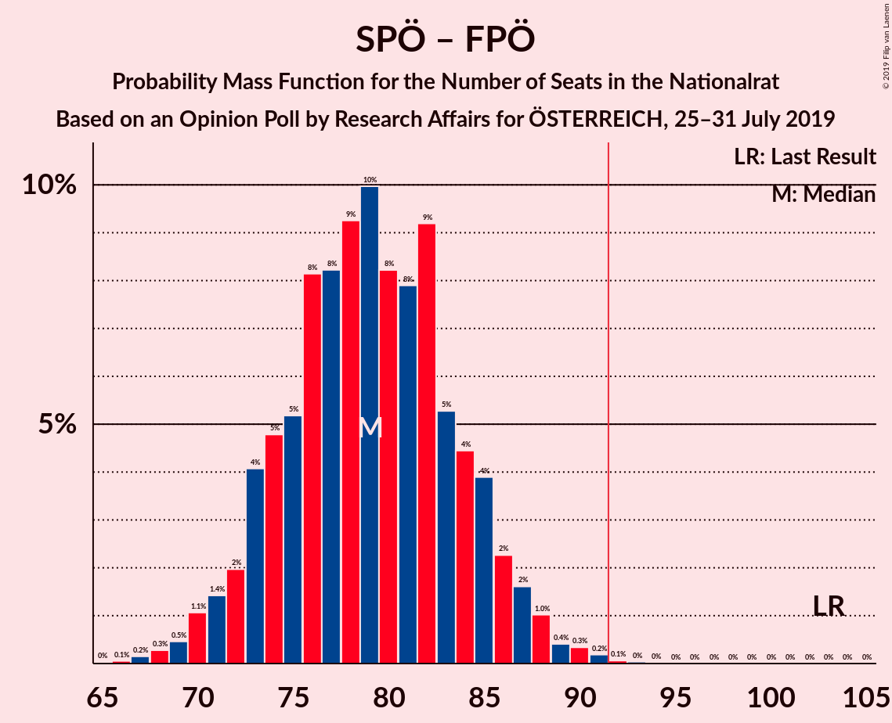

| Number of Seats | Probability | Accumulated | Special Marks |
|:---------------:|:-----------:|:-----------:|:-------------:|
| 65 | 0% | 100% |  |
| 66 | 0.1% | 99.9% |  |
| 67 | 0.2% | 99.9% |  |
| 68 | 0.3% | 99.7% |  |
| 69 | 0.5% | 99.5% |  |
| 70 | 1.1% | 99.0% |  |
| 71 | 1.4% | 98% |  |
| 72 | 2% | 97% |  |
| 73 | 4% | 95% |  |
| 74 | 5% | 90% |  |
| 75 | 5% | 86% |  |
| 76 | 8% | 80% |  |
| 77 | 8% | 72% |  |
| 78 | 9% | 64% |  |
| 79 | 10% | 55% | Median |
| 80 | 8% | 45% |  |
| 81 | 8% | 37% |  |
| 82 | 9% | 29% |  |
| 83 | 5% | 20% |  |
| 84 | 4% | 14% |  |
| 85 | 4% | 10% |  |
| 86 | 2% | 6% |  |
| 87 | 2% | 4% |  |
| 88 | 1.0% | 2% |  |
| 89 | 0.4% | 1.1% |  |
| 90 | 0.3% | 0.7% |  |
| 91 | 0.2% | 0.3% |  |
| 92 | 0.1% | 0.1% | Majority |
| 93 | 0% | 0.1% |  |
| 94 | 0% | 0% |  |
| 95 | 0% | 0% |  |
| 96 | 0% | 0% |  |
| 97 | 0% | 0% |  |
| 98 | 0% | 0% |  |
| 99 | 0% | 0% |  |
| 100 | 0% | 0% |  |
| 101 | 0% | 0% |  |
| 102 | 0% | 0% |  |
| 103 | 0% | 0% | Last Result |

### Sozialdemokratische Partei Österreichs – Die Grünen–Die Grüne Alternative – NEOS–Das Neue Österreich und Liberales Forum

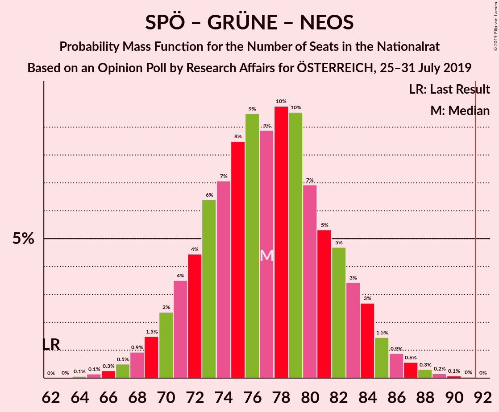

| Number of Seats | Probability | Accumulated | Special Marks |
|:---------------:|:-----------:|:-----------:|:-------------:|
| 62 | 0% | 100% | Last Result |
| 63 | 0% | 100% |  |
| 64 | 0.1% | 100% |  |
| 65 | 0.1% | 99.9% |  |
| 66 | 0.3% | 99.7% |  |
| 67 | 0.5% | 99.5% |  |
| 68 | 0.9% | 99.0% |  |
| 69 | 1.5% | 98% |  |
| 70 | 2% | 97% |  |
| 71 | 4% | 94% |  |
| 72 | 4% | 91% |  |
| 73 | 6% | 86% |  |
| 74 | 7% | 80% |  |
| 75 | 8% | 73% |  |
| 76 | 9% | 64% |  |
| 77 | 9% | 55% | Median |
| 78 | 10% | 46% |  |
| 79 | 10% | 36% |  |
| 80 | 7% | 27% |  |
| 81 | 5% | 20% |  |
| 82 | 5% | 14% |  |
| 83 | 3% | 10% |  |
| 84 | 3% | 6% |  |
| 85 | 1.5% | 4% |  |
| 86 | 0.9% | 2% |  |
| 87 | 0.6% | 1.2% |  |
| 88 | 0.3% | 0.6% |  |
| 89 | 0.2% | 0.3% |  |
| 90 | 0.1% | 0.1% |  |
| 91 | 0% | 0.1% |  |
| 92 | 0% | 0% | Majority |

### Österreichische Volkspartei

| Number of Seats | Probability | Accumulated | Special Marks |
|:---------------:|:-----------:|:-----------:|:-------------:|
| 55 | 0% | 100% |  |
| 56 | 0.1% | 99.9% |  |
| 57 | 0.2% | 99.8% |  |
| 58 | 0.4% | 99.6% |  |
| 59 | 0.7% | 99.3% |  |
| 60 | 1.2% | 98.6% |  |
| 61 | 2% | 97% |  |
| 62 | 3% | 95% | Last Result |
| 63 | 5% | 92% |  |
| 64 | 6% | 87% |  |
| 65 | 7% | 82% |  |
| 66 | 9% | 75% |  |
| 67 | 8% | 66% |  |
| 68 | 11% | 58% | Median |
| 69 | 11% | 47% |  |
| 70 | 8% | 36% |  |
| 71 | 7% | 28% |  |
| 72 | 6% | 21% |  |
| 73 | 4% | 15% |  |
| 74 | 4% | 10% |  |
| 75 | 3% | 6% |  |
| 76 | 1.3% | 3% |  |
| 77 | 0.9% | 2% |  |
| 78 | 0.5% | 1.2% |  |
| 79 | 0.3% | 0.7% |  |
| 80 | 0.2% | 0.3% |  |
| 81 | 0.1% | 0.1% |  |
| 82 | 0% | 0.1% |  |
| 83 | 0% | 0% |  |

### Sozialdemokratische Partei Österreichs – Die Grünen–Die Grüne Alternative

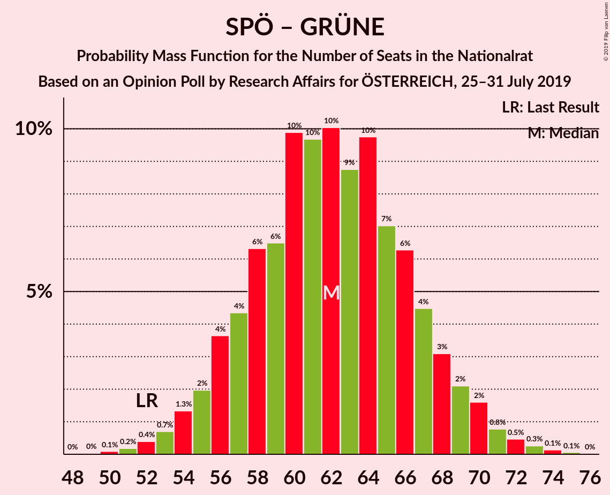

| Number of Seats | Probability | Accumulated | Special Marks |
|:---------------:|:-----------:|:-----------:|:-------------:|
| 49 | 0% | 100% |  |
| 50 | 0.1% | 99.9% |  |
| 51 | 0.2% | 99.9% |  |
| 52 | 0.4% | 99.7% | Last Result |
| 53 | 0.7% | 99.3% |  |
| 54 | 1.3% | 98.6% |  |
| 55 | 2% | 97% |  |
| 56 | 4% | 95% |  |
| 57 | 4% | 92% |  |
| 58 | 6% | 87% |  |
| 59 | 6% | 81% |  |
| 60 | 10% | 74% |  |
| 61 | 10% | 65% |  |
| 62 | 10% | 55% | Median |
| 63 | 9% | 45% |  |
| 64 | 10% | 36% |  |
| 65 | 7% | 26% |  |
| 66 | 6% | 19% |  |
| 67 | 4% | 13% |  |
| 68 | 3% | 9% |  |
| 69 | 2% | 5% |  |
| 70 | 2% | 3% |  |
| 71 | 0.8% | 2% |  |
| 72 | 0.5% | 1.0% |  |
| 73 | 0.3% | 0.5% |  |
| 74 | 0.1% | 0.2% |  |
| 75 | 0.1% | 0.1% |  |
| 76 | 0% | 0% |  |

### Sozialdemokratische Partei Österreichs

| Number of Seats | Probability | Accumulated | Special Marks |
|:---------------:|:-----------:|:-----------:|:-------------:|
| 31 | 0.1% | 100% |  |
| 32 | 0.3% | 99.9% |  |
| 33 | 0.5% | 99.6% |  |
| 34 | 1.2% | 99.1% |  |
| 35 | 2% | 98% |  |
| 36 | 4% | 96% |  |
| 37 | 5% | 92% |  |
| 38 | 8% | 87% |  |
| 39 | 10% | 80% |  |
| 40 | 11% | 70% |  |
| 41 | 10% | 59% | Median |
| 42 | 11% | 48% |  |
| 43 | 10% | 37% |  |
| 44 | 8% | 27% |  |
| 45 | 6% | 19% |  |
| 46 | 5% | 13% |  |
| 47 | 3% | 7% |  |
| 48 | 2% | 4% |  |
| 49 | 1.3% | 3% |  |
| 50 | 0.6% | 1.3% |  |
| 51 | 0.3% | 0.6% |  |
| 52 | 0.1% | 0.3% | Last Result |
| 53 | 0.1% | 0.1% |  |
| 54 | 0% | 0.1% |  |
| 55 | 0% | 0% |  |

## Technical Information

### Opinion Poll

+ **Polling firm:** Research Affairs
+ **Commissioner(s):** ÖSTERREICH
+ **Fieldwork period:** 25–31 July 2019

### Calculations

+ **Sample size:** 502
+ **Simulations done:** 1,048,576
+ **Error estimate:** 2.04%

