# Opinion Poll by Market for Der Standard, 5–8 September 2019

<a href="#voting-intentions">Voting Intentions</a> | <a href="#seats">Seats</a> | <a href="#coalitions">Coalitions</a> | <a href="#technical-information">Technical Information</a>

## Voting Intentions

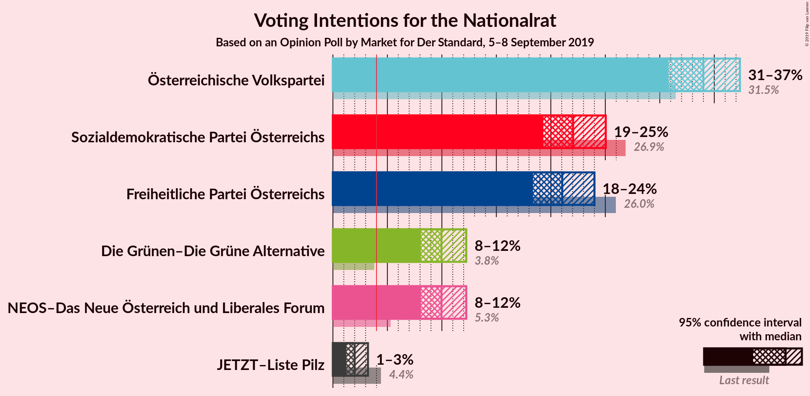

### Confidence Intervals

| Party | Last Result | Poll Result | 80% Confidence Interval | 90% Confidence Interval | 95% Confidence Interval | 99% Confidence Interval |
|:-----:|:-----------:|:-----------:|:-----------------------:|:-----------------------:|:-----------------------:|:-----------------------:|
| Österreichische Volkspartei | 31.5% | 34.0% | 31.9–36.2% |31.3–36.8% |30.8–37.4% |29.8–38.4% |
| Sozialdemokratische Partei Österreichs | 26.9% | 22.0% | 20.2–24.0% |19.7–24.6% |19.3–25.0% |18.5–26.0% |
| Freiheitliche Partei Österreichs | 26.0% | 21.0% | 19.3–23.0% |18.8–23.5% |18.4–24.0% |17.5–25.0% |
| NEOS–Das Neue Österreich und Liberales Forum | 5.3% | 10.0% | 8.7–11.4% |8.4–11.9% |8.1–12.2% |7.5–13.0% |
| Die Grünen–Die Grüne Alternative | 3.8% | 10.0% | 8.7–11.4% |8.4–11.9% |8.1–12.2% |7.5–13.0% |
| JETZT–Liste Pilz | 4.4% | 2.0% | 1.5–2.8% |1.3–3.0% |1.2–3.2% |1.0–3.6% |

*Note:* The poll result column reflects the actual value used in the calculations. Published results may vary slightly, and in addition be rounded to fewer digits.

## Seats

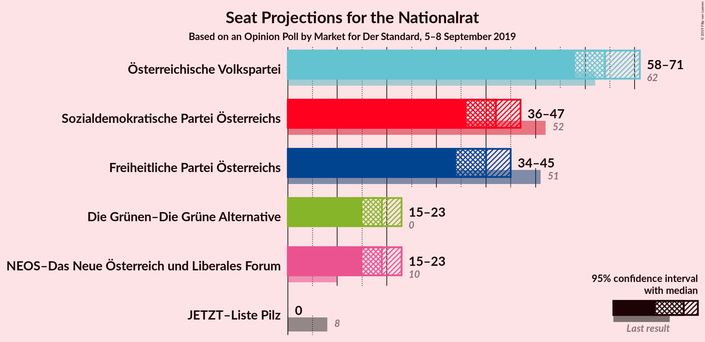

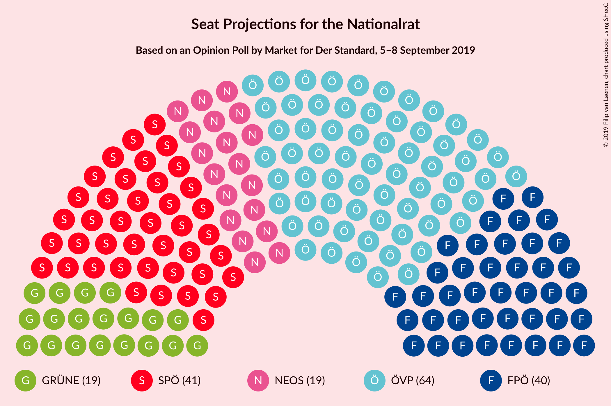

### Confidence Intervals

| Party | Last Result | Median | 80% Confidence Interval | 90% Confidence Interval | 95% Confidence Interval | 99% Confidence Interval |
|:-----:|:-----------:|:------:|:-----------------------:|:-----------------------:|:-----------------------:|:-----------------------:|
| <a href="#österreichische-volkspartei">Österreichische Volkspartei</a> | 62 | 64 | 60–68 |59–69 |58–71 |56–72 |
| <a href="#sozialdemokratische-partei-österreichs">Sozialdemokratische Partei Österreichs</a> | 52 | 42 | 38–45 |37–46 |36–47 |35–49 |
| <a href="#freiheitliche-partei-österreichs">Freiheitliche Partei Österreichs</a> | 51 | 40 | 36–43 |35–44 |34–45 |33–47 |
| <a href="#neos–das-neue-österreich-und-liberales-forum">NEOS–Das Neue Österreich und Liberales Forum</a> | 10 | 19 | 16–21 |15–22 |15–23 |14–24 |
| <a href="#die-grünen–die-grüne-alternative">Die Grünen–Die Grüne Alternative</a> | 0 | 19 | 16–21 |15–22 |15–23 |14–24 |
| <a href="#jetzt–liste-pilz">JETZT–Liste Pilz</a> | 8 | 0 | 0 |0 |0 |0 |

### Österreichische Volkspartei

*For a full overview of the results for this party, see the [Österreichische Volkspartei](party-österreichischevolkspartei.html) page.*

| Number of Seats | Probability | Accumulated | Special Marks |
|:---------------:|:-----------:|:-----------:|:-------------:|
| 54 | 0% | 100% |  |
| 55 | 0.2% | 99.9% |  |
| 56 | 0.4% | 99.8% |  |
| 57 | 0.7% | 99.4% |  |
| 58 | 2% | 98.7% |  |
| 59 | 3% | 97% |  |
| 60 | 5% | 94% |  |
| 61 | 9% | 89% |  |
| 62 | 9% | 81% | Last Result |
| 63 | 12% | 72% |  |
| 64 | 13% | 60% | Median |
| 65 | 11% | 47% |  |
| 66 | 12% | 36% |  |
| 67 | 8% | 24% |  |
| 68 | 6% | 16% |  |
| 69 | 5% | 10% |  |
| 70 | 2% | 5% |  |
| 71 | 2% | 3% |  |
| 72 | 0.8% | 1.3% |  |
| 73 | 0.3% | 0.5% |  |
| 74 | 0.2% | 0.2% |  |
| 75 | 0.1% | 0.1% |  |
| 76 | 0% | 0% |  |

### Sozialdemokratische Partei Österreichs

*For a full overview of the results for this party, see the [Sozialdemokratische Partei Österreichs](party-sozialdemokratischeparteiösterreichs.html) page.*

| Number of Seats | Probability | Accumulated | Special Marks |
|:---------------:|:-----------:|:-----------:|:-------------:|
| 33 | 0.1% | 100% |  |
| 34 | 0.3% | 99.9% |  |
| 35 | 0.7% | 99.6% |  |
| 36 | 2% | 98.9% |  |
| 37 | 4% | 97% |  |
| 38 | 7% | 93% |  |
| 39 | 9% | 87% |  |
| 40 | 12% | 77% |  |
| 41 | 14% | 65% |  |
| 42 | 13% | 51% | Median |
| 43 | 14% | 38% |  |
| 44 | 9% | 24% |  |
| 45 | 7% | 15% |  |
| 46 | 4% | 8% |  |
| 47 | 2% | 4% |  |
| 48 | 1.1% | 2% |  |
| 49 | 0.5% | 0.8% |  |
| 50 | 0.2% | 0.3% |  |
| 51 | 0.1% | 0.1% |  |
| 52 | 0% | 0% | Last Result |

### Freiheitliche Partei Österreichs

*For a full overview of the results for this party, see the [Freiheitliche Partei Österreichs](party-freiheitlicheparteiösterreichs.html) page.*

| Number of Seats | Probability | Accumulated | Special Marks |
|:---------------:|:-----------:|:-----------:|:-------------:|
| 31 | 0.1% | 100% |  |
| 32 | 0.2% | 99.9% |  |
| 33 | 0.7% | 99.7% |  |
| 34 | 2% | 99.0% |  |
| 35 | 3% | 97% |  |
| 36 | 6% | 94% |  |
| 37 | 9% | 88% |  |
| 38 | 13% | 79% |  |
| 39 | 13% | 67% |  |
| 40 | 15% | 54% | Median |
| 41 | 14% | 39% |  |
| 42 | 9% | 25% |  |
| 43 | 8% | 16% |  |
| 44 | 4% | 8% |  |
| 45 | 2% | 4% |  |
| 46 | 1.1% | 2% |  |
| 47 | 0.5% | 0.8% |  |
| 48 | 0.2% | 0.3% |  |
| 49 | 0.1% | 0.1% |  |
| 50 | 0% | 0% |  |
| 51 | 0% | 0% | Last Result |

### NEOS–Das Neue Österreich und Liberales Forum

*For a full overview of the results for this party, see the [NEOS–Das Neue Österreich und Liberales Forum](party-neos–dasneueösterreichundliberalesforum.html) page.*

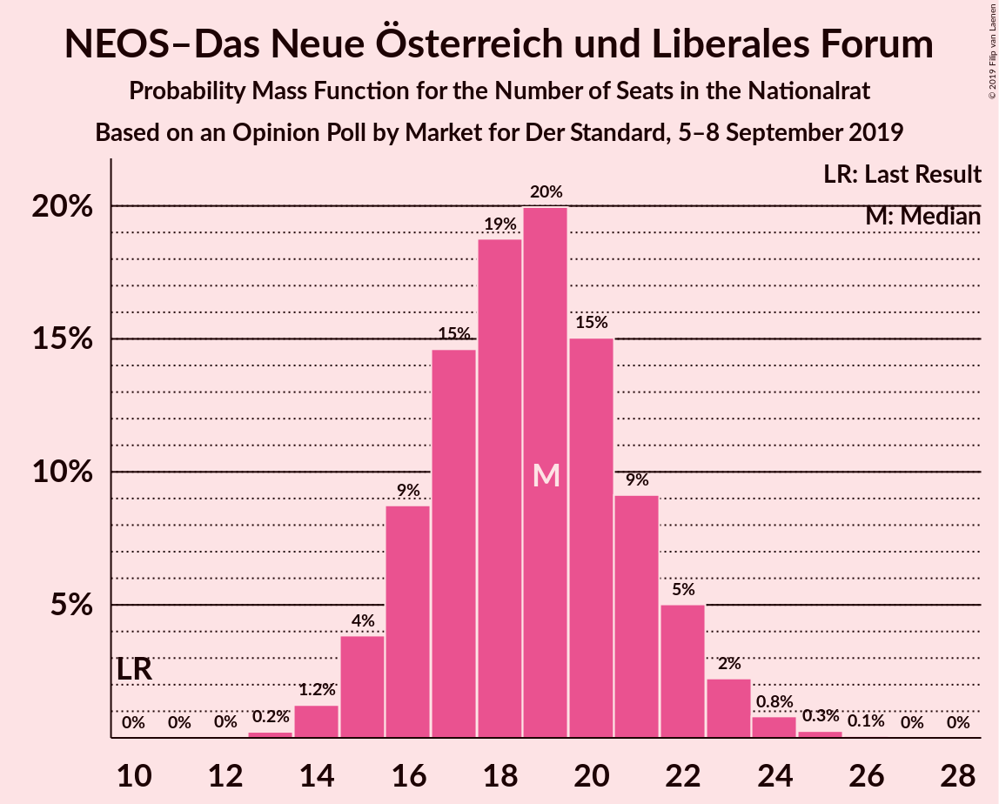

| Number of Seats | Probability | Accumulated | Special Marks |
|:---------------:|:-----------:|:-----------:|:-------------:|
| 10 | 0% | 100% | Last Result |
| 11 | 0% | 100% |  |
| 12 | 0% | 100% |  |
| 13 | 0.2% | 100% |  |
| 14 | 1.2% | 99.7% |  |
| 15 | 4% | 98.5% |  |
| 16 | 9% | 95% |  |
| 17 | 15% | 86% |  |
| 18 | 19% | 71% |  |
| 19 | 20% | 53% | Median |
| 20 | 15% | 33% |  |
| 21 | 9% | 18% |  |
| 22 | 5% | 8% |  |
| 23 | 2% | 3% |  |
| 24 | 0.8% | 1.2% |  |
| 25 | 0.3% | 0.3% |  |
| 26 | 0.1% | 0.1% |  |
| 27 | 0% | 0% |  |

### Die Grünen–Die Grüne Alternative

*For a full overview of the results for this party, see the [Die Grünen–Die Grüne Alternative](party-diegrünen–diegrünealternative.html) page.*

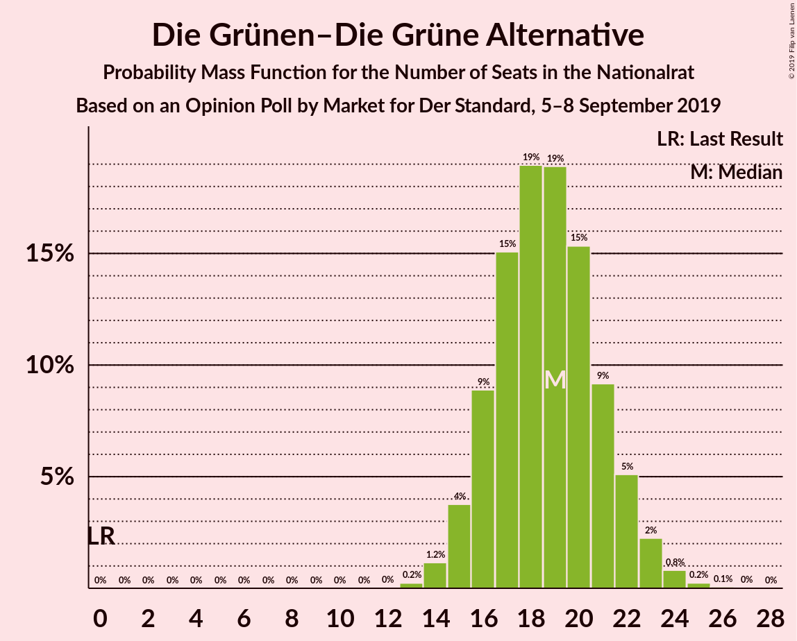

| Number of Seats | Probability | Accumulated | Special Marks |
|:---------------:|:-----------:|:-----------:|:-------------:|
| 0 | 0% | 100% | Last Result |
| 1 | 0% | 100% |  |
| 2 | 0% | 100% |  |
| 3 | 0% | 100% |  |
| 4 | 0% | 100% |  |
| 5 | 0% | 100% |  |
| 6 | 0% | 100% |  |
| 7 | 0% | 100% |  |
| 8 | 0% | 100% |  |
| 9 | 0% | 100% |  |
| 10 | 0% | 100% |  |
| 11 | 0% | 100% |  |
| 12 | 0% | 100% |  |
| 13 | 0.2% | 100% |  |
| 14 | 1.2% | 99.7% |  |
| 15 | 4% | 98.6% |  |
| 16 | 9% | 95% |  |
| 17 | 15% | 86% |  |
| 18 | 19% | 71% |  |
| 19 | 19% | 52% | Median |
| 20 | 15% | 33% |  |
| 21 | 9% | 18% |  |
| 22 | 5% | 8% |  |
| 23 | 2% | 3% |  |
| 24 | 0.8% | 1.1% |  |
| 25 | 0.2% | 0.3% |  |
| 26 | 0.1% | 0.1% |  |
| 27 | 0% | 0% |  |

### JETZT–Liste Pilz

*For a full overview of the results for this party, see the [JETZT–Liste Pilz](party-jetzt–listepilz.html) page.*

| Number of Seats | Probability | Accumulated | Special Marks |
|:---------------:|:-----------:|:-----------:|:-------------:|
| 0 | 99.9% | 100% | Median |
| 1 | 0% | 0.1% |  |
| 2 | 0% | 0.1% |  |
| 3 | 0% | 0.1% |  |
| 4 | 0% | 0.1% |  |
| 5 | 0% | 0.1% |  |
| 6 | 0% | 0.1% |  |
| 7 | 0.1% | 0.1% |  |
| 8 | 0% | 0% | Last Result |

## Coalitions

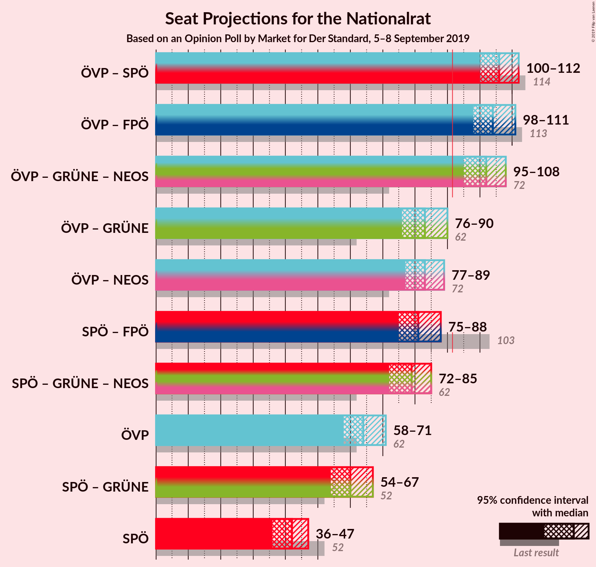

### Confidence Intervals

| Coalition | Last Result | Median | Majority? | 80% Confidence Interval | 90% Confidence Interval | 95% Confidence Interval | 99% Confidence Interval |
|:---------:|:-----------:|:------:|:---------:|:-----------------------:|:-----------------------:|:-----------------------:|:-----------------------:|
| Österreichische Volkspartei – Sozialdemokratische Partei Österreichs | 114 | 106 | 100% | 102–110 | 101–111 | 100–112 | 97–114 |
| Österreichische Volkspartei – Freiheitliche Partei Österreichs | 113 | 104 | 100% | 100–108 | 99–109 | 98–111 | 95–112 |
| Österreichische Volkspartei – Die Grünen–Die Grüne Alternative – NEOS–Das Neue Österreich und Liberales Forum | 72 | 102 | 99.9% | 97–106 | 96–107 | 95–108 | 93–110 |
| Österreichische Volkspartei – Die Grünen–Die Grüne Alternative | 62 | 83 | 0.5% | 79–87 | 78–88 | 76–90 | 75–91 |
| Österreichische Volkspartei – NEOS–Das Neue Österreich und Liberales Forum | 72 | 83 | 0.5% | 79–87 | 77–88 | 77–89 | 75–92 |
| Sozialdemokratische Partei Österreichs – Freiheitliche Partei Österreichs | 103 | 81 | 0.1% | 77–86 | 76–87 | 75–88 | 73–90 |
| Sozialdemokratische Partei Österreichs – Die Grünen–Die Grüne Alternative – NEOS–Das Neue Österreich und Liberales Forum | 62 | 79 | 0% | 75–83 | 74–84 | 72–85 | 71–88 |
| Österreichische Volkspartei | 62 | 64 | 0% | 60–68 | 59–69 | 58–71 | 56–72 |
| Sozialdemokratische Partei Österreichs – Die Grünen–Die Grüne Alternative | 52 | 60 | 0% | 56–64 | 55–66 | 54–67 | 52–68 |
| Sozialdemokratische Partei Österreichs | 52 | 42 | 0% | 38–45 | 37–46 | 36–47 | 35–49 |

### Österreichische Volkspartei – Sozialdemokratische Partei Österreichs

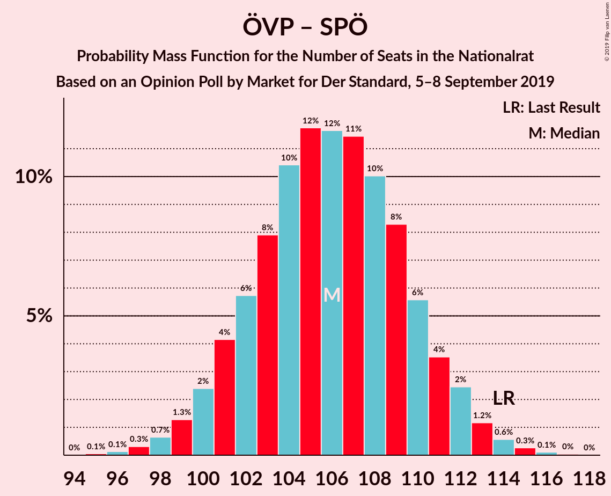

| Number of Seats | Probability | Accumulated | Special Marks |
|:---------------:|:-----------:|:-----------:|:-------------:|
| 95 | 0.1% | 100% |  |
| 96 | 0.1% | 99.9% |  |
| 97 | 0.3% | 99.8% |  |
| 98 | 0.7% | 99.5% |  |
| 99 | 1.3% | 98.8% |  |
| 100 | 2% | 98% |  |
| 101 | 4% | 95% |  |
| 102 | 6% | 91% |  |
| 103 | 8% | 85% |  |
| 104 | 10% | 77% |  |
| 105 | 12% | 67% |  |
| 106 | 12% | 55% | Median |
| 107 | 11% | 44% |  |
| 108 | 10% | 32% |  |
| 109 | 8% | 22% |  |
| 110 | 6% | 14% |  |
| 111 | 4% | 8% |  |
| 112 | 2% | 5% |  |
| 113 | 1.2% | 2% |  |
| 114 | 0.6% | 1.0% | Last Result |
| 115 | 0.3% | 0.4% |  |
| 116 | 0.1% | 0.2% |  |
| 117 | 0% | 0.1% |  |
| 118 | 0% | 0% |  |

### Österreichische Volkspartei – Freiheitliche Partei Österreichs

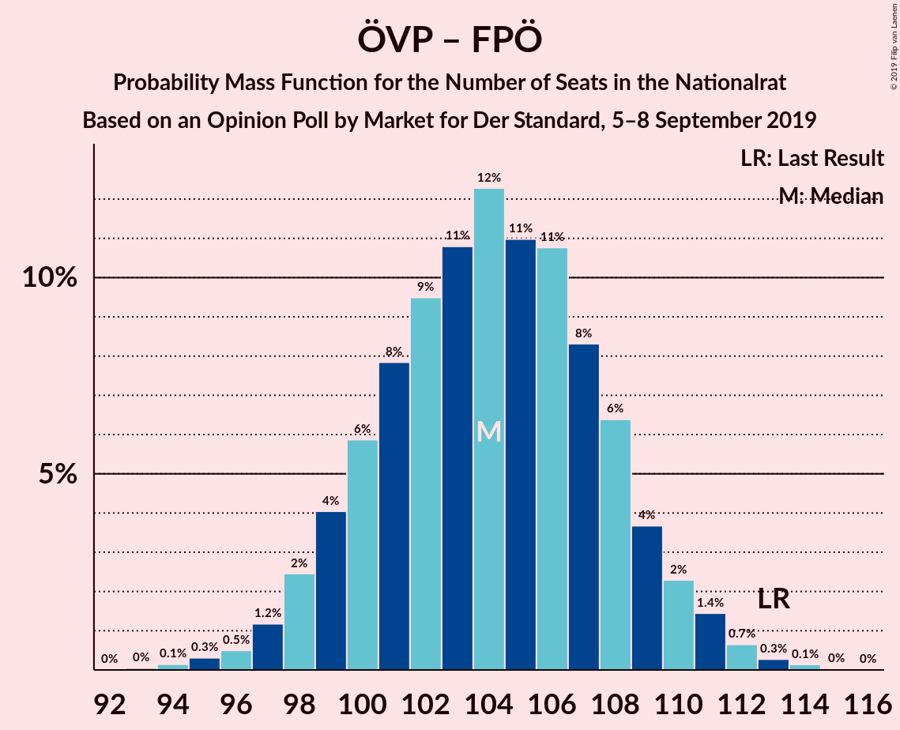

| Number of Seats | Probability | Accumulated | Special Marks |
|:---------------:|:-----------:|:-----------:|:-------------:|
| 93 | 0% | 100% |  |
| 94 | 0.1% | 99.9% |  |
| 95 | 0.3% | 99.8% |  |
| 96 | 0.5% | 99.5% |  |
| 97 | 1.2% | 99.0% |  |
| 98 | 2% | 98% |  |
| 99 | 4% | 95% |  |
| 100 | 6% | 91% |  |
| 101 | 8% | 85% |  |
| 102 | 9% | 78% |  |
| 103 | 11% | 68% |  |
| 104 | 12% | 57% | Median |
| 105 | 11% | 45% |  |
| 106 | 11% | 34% |  |
| 107 | 8% | 23% |  |
| 108 | 6% | 15% |  |
| 109 | 4% | 9% |  |
| 110 | 2% | 5% |  |
| 111 | 1.4% | 3% |  |
| 112 | 0.7% | 1.1% |  |
| 113 | 0.3% | 0.5% | Last Result |
| 114 | 0.1% | 0.2% |  |
| 115 | 0% | 0.1% |  |
| 116 | 0% | 0% |  |

### Österreichische Volkspartei – Die Grünen–Die Grüne Alternative – NEOS–Das Neue Österreich und Liberales Forum

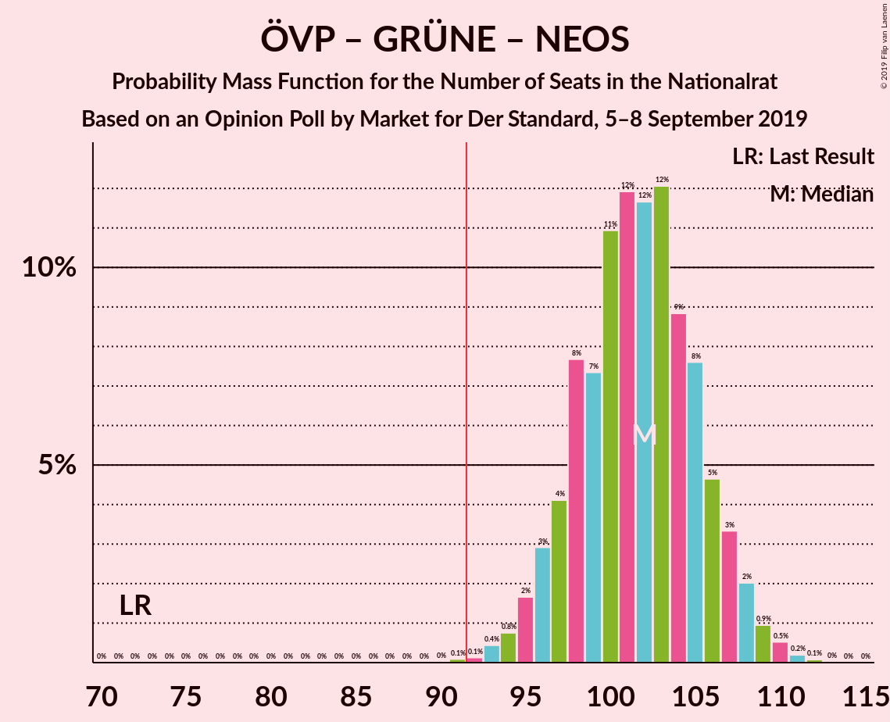

| Number of Seats | Probability | Accumulated | Special Marks |
|:---------------:|:-----------:|:-----------:|:-------------:|
| 72 | 0% | 100% | Last Result |
| 73 | 0% | 100% |  |
| 74 | 0% | 100% |  |
| 75 | 0% | 100% |  |
| 76 | 0% | 100% |  |
| 77 | 0% | 100% |  |
| 78 | 0% | 100% |  |
| 79 | 0% | 100% |  |
| 80 | 0% | 100% |  |
| 81 | 0% | 100% |  |
| 82 | 0% | 100% |  |
| 83 | 0% | 100% |  |
| 84 | 0% | 100% |  |
| 85 | 0% | 100% |  |
| 86 | 0% | 100% |  |
| 87 | 0% | 100% |  |
| 88 | 0% | 100% |  |
| 89 | 0% | 100% |  |
| 90 | 0% | 100% |  |
| 91 | 0.1% | 100% |  |
| 92 | 0.1% | 99.9% | Majority |
| 93 | 0.4% | 99.7% |  |
| 94 | 0.8% | 99.3% |  |
| 95 | 2% | 98.5% |  |
| 96 | 3% | 97% |  |
| 97 | 4% | 94% |  |
| 98 | 8% | 90% |  |
| 99 | 7% | 82% |  |
| 100 | 11% | 75% |  |
| 101 | 12% | 64% |  |
| 102 | 12% | 52% | Median |
| 103 | 12% | 40% |  |
| 104 | 9% | 28% |  |
| 105 | 8% | 19% |  |
| 106 | 5% | 12% |  |
| 107 | 3% | 7% |  |
| 108 | 2% | 4% |  |
| 109 | 0.9% | 2% |  |
| 110 | 0.5% | 0.8% |  |
| 111 | 0.2% | 0.3% |  |
| 112 | 0.1% | 0.1% |  |
| 113 | 0% | 0% |  |

### Österreichische Volkspartei – Die Grünen–Die Grüne Alternative

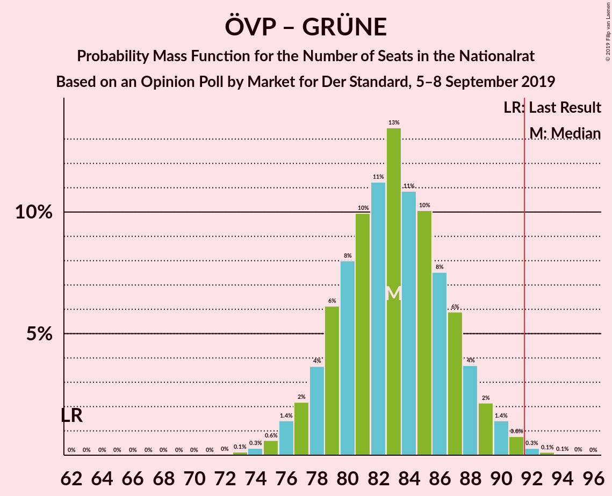

| Number of Seats | Probability | Accumulated | Special Marks |
|:---------------:|:-----------:|:-----------:|:-------------:|
| 62 | 0% | 100% | Last Result |
| 63 | 0% | 100% |  |
| 64 | 0% | 100% |  |
| 65 | 0% | 100% |  |
| 66 | 0% | 100% |  |
| 67 | 0% | 100% |  |
| 68 | 0% | 100% |  |
| 69 | 0% | 100% |  |
| 70 | 0% | 100% |  |
| 71 | 0% | 100% |  |
| 72 | 0% | 100% |  |
| 73 | 0.1% | 99.9% |  |
| 74 | 0.3% | 99.8% |  |
| 75 | 0.6% | 99.5% |  |
| 76 | 1.4% | 98.9% |  |
| 77 | 2% | 97% |  |
| 78 | 4% | 95% |  |
| 79 | 6% | 92% |  |
| 80 | 8% | 86% |  |
| 81 | 10% | 78% |  |
| 82 | 11% | 68% |  |
| 83 | 13% | 56% | Median |
| 84 | 11% | 43% |  |
| 85 | 10% | 32% |  |
| 86 | 8% | 22% |  |
| 87 | 6% | 14% |  |
| 88 | 4% | 9% |  |
| 89 | 2% | 5% |  |
| 90 | 1.4% | 3% |  |
| 91 | 0.8% | 1.3% |  |
| 92 | 0.3% | 0.5% | Majority |
| 93 | 0.1% | 0.2% |  |
| 94 | 0.1% | 0.1% |  |
| 95 | 0% | 0% |  |

### Österreichische Volkspartei – NEOS–Das Neue Österreich und Liberales Forum

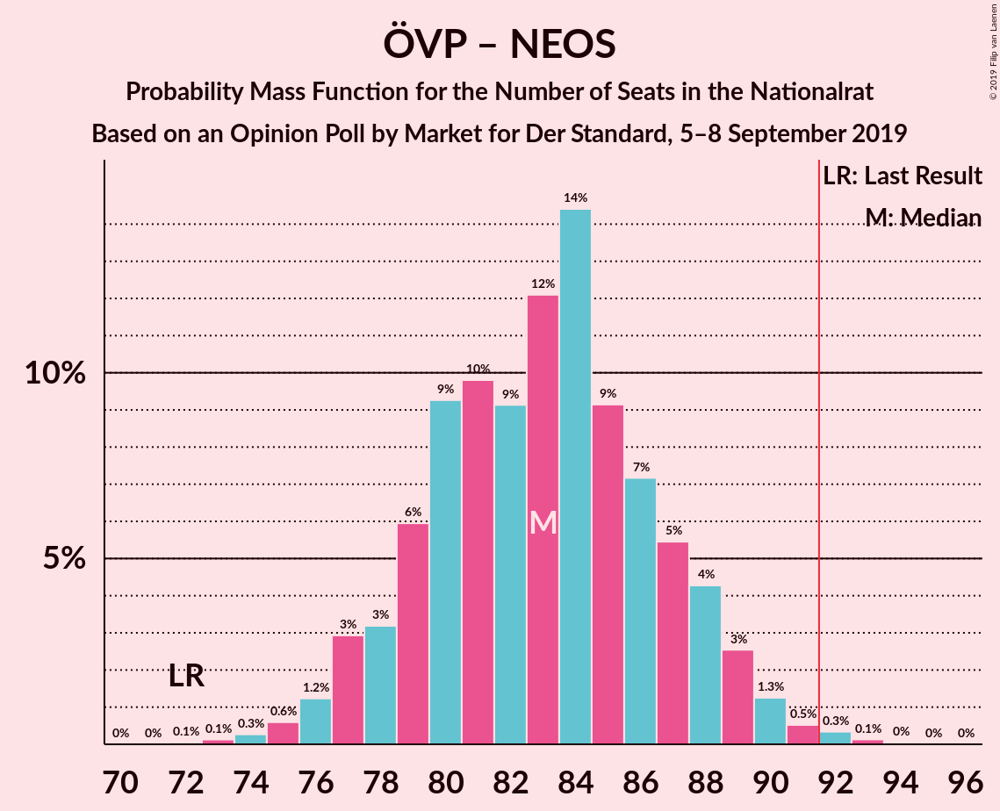

| Number of Seats | Probability | Accumulated | Special Marks |
|:---------------:|:-----------:|:-----------:|:-------------:|
| 72 | 0.1% | 100% | Last Result |
| 73 | 0.1% | 99.9% |  |
| 74 | 0.3% | 99.8% |  |
| 75 | 0.6% | 99.5% |  |
| 76 | 1.2% | 98.9% |  |
| 77 | 3% | 98% |  |
| 78 | 3% | 95% |  |
| 79 | 6% | 92% |  |
| 80 | 9% | 86% |  |
| 81 | 10% | 76% |  |
| 82 | 9% | 67% |  |
| 83 | 12% | 57% | Median |
| 84 | 14% | 45% |  |
| 85 | 9% | 31% |  |
| 86 | 7% | 22% |  |
| 87 | 5% | 15% |  |
| 88 | 4% | 9% |  |
| 89 | 3% | 5% |  |
| 90 | 1.3% | 2% |  |
| 91 | 0.5% | 1.1% |  |
| 92 | 0.3% | 0.5% | Majority |
| 93 | 0.1% | 0.2% |  |
| 94 | 0% | 0.1% |  |
| 95 | 0% | 0% |  |

### Sozialdemokratische Partei Österreichs – Freiheitliche Partei Österreichs

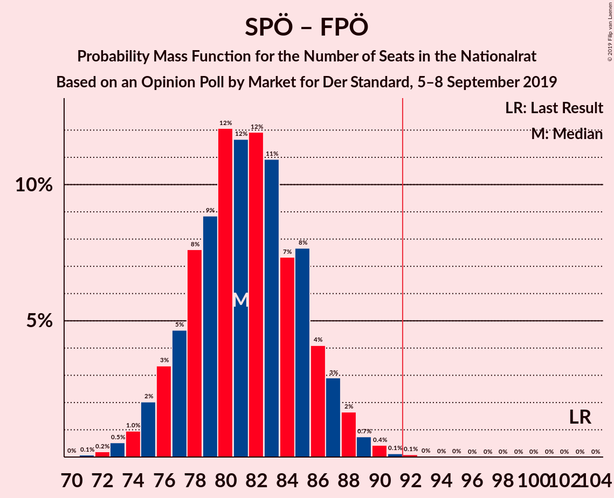

| Number of Seats | Probability | Accumulated | Special Marks |
|:---------------:|:-----------:|:-----------:|:-------------:|
| 71 | 0.1% | 100% |  |
| 72 | 0.2% | 99.9% |  |
| 73 | 0.5% | 99.7% |  |
| 74 | 1.0% | 99.1% |  |
| 75 | 2% | 98% |  |
| 76 | 3% | 96% |  |
| 77 | 5% | 93% |  |
| 78 | 8% | 88% |  |
| 79 | 9% | 81% |  |
| 80 | 12% | 72% |  |
| 81 | 12% | 60% |  |
| 82 | 12% | 48% | Median |
| 83 | 11% | 36% |  |
| 84 | 7% | 25% |  |
| 85 | 8% | 18% |  |
| 86 | 4% | 10% |  |
| 87 | 3% | 6% |  |
| 88 | 2% | 3% |  |
| 89 | 0.7% | 1.4% |  |
| 90 | 0.4% | 0.7% |  |
| 91 | 0.1% | 0.3% |  |
| 92 | 0.1% | 0.1% | Majority |
| 93 | 0% | 0% |  |
| 94 | 0% | 0% |  |
| 95 | 0% | 0% |  |
| 96 | 0% | 0% |  |
| 97 | 0% | 0% |  |
| 98 | 0% | 0% |  |
| 99 | 0% | 0% |  |
| 100 | 0% | 0% |  |
| 101 | 0% | 0% |  |
| 102 | 0% | 0% |  |
| 103 | 0% | 0% | Last Result |

### Sozialdemokratische Partei Österreichs – Die Grünen–Die Grüne Alternative – NEOS–Das Neue Österreich und Liberales Forum

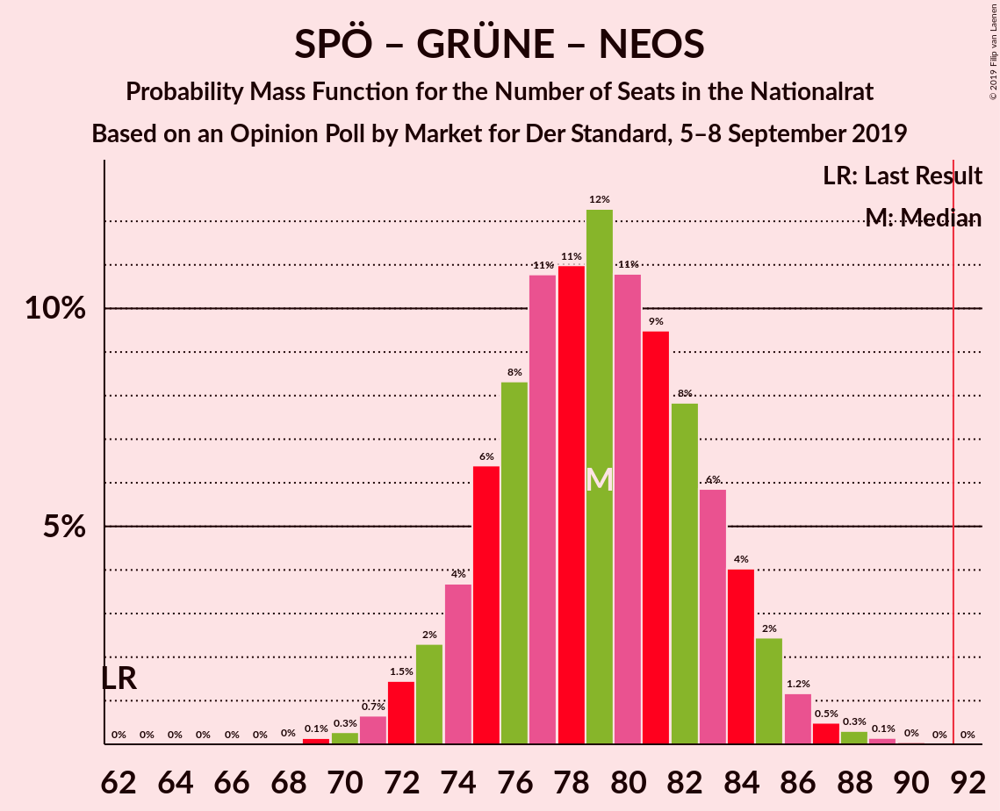

| Number of Seats | Probability | Accumulated | Special Marks |
|:---------------:|:-----------:|:-----------:|:-------------:|
| 62 | 0% | 100% | Last Result |
| 63 | 0% | 100% |  |
| 64 | 0% | 100% |  |
| 65 | 0% | 100% |  |
| 66 | 0% | 100% |  |
| 67 | 0% | 100% |  |
| 68 | 0% | 100% |  |
| 69 | 0.1% | 99.9% |  |
| 70 | 0.3% | 99.8% |  |
| 71 | 0.7% | 99.5% |  |
| 72 | 1.5% | 98.9% |  |
| 73 | 2% | 97% |  |
| 74 | 4% | 95% |  |
| 75 | 6% | 91% |  |
| 76 | 8% | 85% |  |
| 77 | 11% | 77% |  |
| 78 | 11% | 66% |  |
| 79 | 12% | 55% |  |
| 80 | 11% | 43% | Median |
| 81 | 9% | 32% |  |
| 82 | 8% | 22% |  |
| 83 | 6% | 15% |  |
| 84 | 4% | 9% |  |
| 85 | 2% | 5% |  |
| 86 | 1.2% | 2% |  |
| 87 | 0.5% | 1.0% |  |
| 88 | 0.3% | 0.5% |  |
| 89 | 0.1% | 0.2% |  |
| 90 | 0% | 0.1% |  |
| 91 | 0% | 0% |  |

### Österreichische Volkspartei

| Number of Seats | Probability | Accumulated | Special Marks |
|:---------------:|:-----------:|:-----------:|:-------------:|
| 54 | 0% | 100% |  |
| 55 | 0.2% | 99.9% |  |
| 56 | 0.4% | 99.8% |  |
| 57 | 0.7% | 99.4% |  |
| 58 | 2% | 98.7% |  |
| 59 | 3% | 97% |  |
| 60 | 5% | 94% |  |
| 61 | 9% | 89% |  |
| 62 | 9% | 81% | Last Result |
| 63 | 12% | 72% |  |
| 64 | 13% | 60% | Median |
| 65 | 11% | 47% |  |
| 66 | 12% | 36% |  |
| 67 | 8% | 24% |  |
| 68 | 6% | 16% |  |
| 69 | 5% | 10% |  |
| 70 | 2% | 5% |  |
| 71 | 2% | 3% |  |
| 72 | 0.8% | 1.3% |  |
| 73 | 0.3% | 0.5% |  |
| 74 | 0.2% | 0.2% |  |
| 75 | 0.1% | 0.1% |  |
| 76 | 0% | 0% |  |

### Sozialdemokratische Partei Österreichs – Die Grünen–Die Grüne Alternative

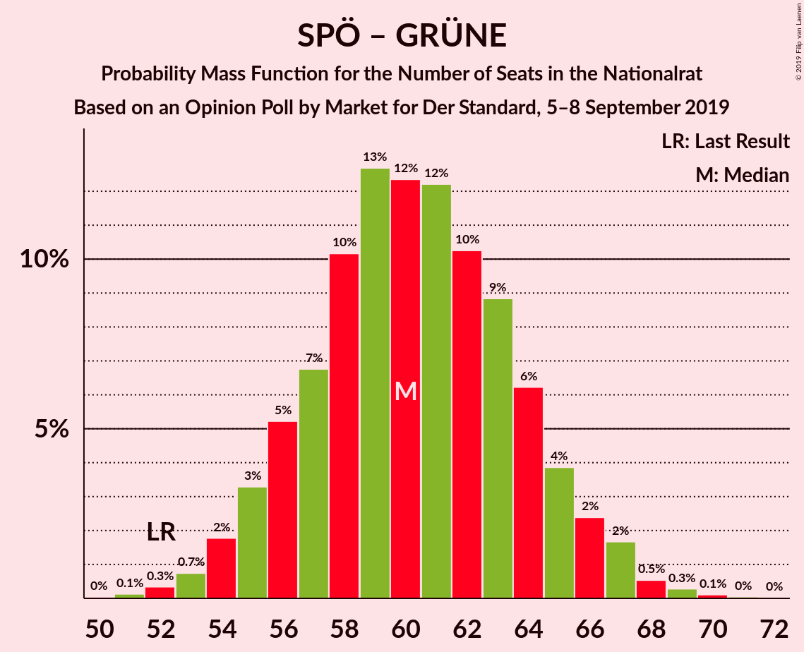

| Number of Seats | Probability | Accumulated | Special Marks |
|:---------------:|:-----------:|:-----------:|:-------------:|
| 50 | 0% | 100% |  |
| 51 | 0.1% | 99.9% |  |
| 52 | 0.3% | 99.8% | Last Result |
| 53 | 0.7% | 99.5% |  |
| 54 | 2% | 98.7% |  |
| 55 | 3% | 97% |  |
| 56 | 5% | 94% |  |
| 57 | 7% | 88% |  |
| 58 | 10% | 82% |  |
| 59 | 13% | 71% |  |
| 60 | 12% | 59% |  |
| 61 | 12% | 46% | Median |
| 62 | 10% | 34% |  |
| 63 | 9% | 24% |  |
| 64 | 6% | 15% |  |
| 65 | 4% | 9% |  |
| 66 | 2% | 5% |  |
| 67 | 2% | 3% |  |
| 68 | 0.5% | 1.0% |  |
| 69 | 0.3% | 0.5% |  |
| 70 | 0.1% | 0.2% |  |
| 71 | 0% | 0.1% |  |
| 72 | 0% | 0% |  |

### Sozialdemokratische Partei Österreichs

| Number of Seats | Probability | Accumulated | Special Marks |
|:---------------:|:-----------:|:-----------:|:-------------:|
| 33 | 0.1% | 100% |  |
| 34 | 0.3% | 99.9% |  |
| 35 | 0.7% | 99.6% |  |
| 36 | 2% | 98.9% |  |
| 37 | 4% | 97% |  |
| 38 | 7% | 93% |  |
| 39 | 9% | 87% |  |
| 40 | 12% | 77% |  |
| 41 | 14% | 65% |  |
| 42 | 13% | 51% | Median |
| 43 | 14% | 38% |  |
| 44 | 9% | 24% |  |
| 45 | 7% | 15% |  |
| 46 | 4% | 8% |  |
| 47 | 2% | 4% |  |
| 48 | 1.1% | 2% |  |
| 49 | 0.5% | 0.8% |  |
| 50 | 0.2% | 0.3% |  |
| 51 | 0.1% | 0.1% |  |
| 52 | 0% | 0% | Last Result |

## Technical Information

### Opinion Poll

+ **Polling firm:** Market
+ **Commissioner(s):** Der Standard
+ **Fieldwork period:** 5–8 September 2019

### Calculations

+ **Sample size:** 803
+ **Simulations done:** 1,048,576
+ **Error estimate:** 1.22%

