# Opinion Poll by Market for Der Standard, 16–18 September 2019

<a href="#voting-intentions">Voting Intentions</a> | <a href="#seats">Seats</a> | <a href="#coalitions">Coalitions</a> | <a href="#technical-information">Technical Information</a>

## Voting Intentions

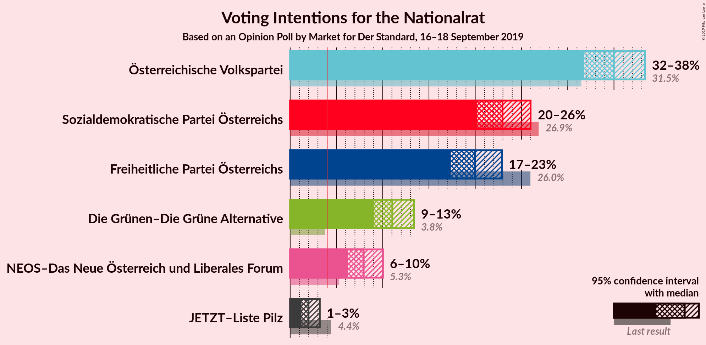

### Confidence Intervals

| Party | Last Result | Poll Result | 80% Confidence Interval | 90% Confidence Interval | 95% Confidence Interval | 99% Confidence Interval |
|:-----:|:-----------:|:-----------:|:-----------------------:|:-----------------------:|:-----------------------:|:-----------------------:|
| Österreichische Volkspartei | 31.5% | 35.0% | 32.9–37.2% |32.3–37.8% |31.8–38.3% |30.8–39.4% |
| Sozialdemokratische Partei Österreichs | 26.9% | 23.0% | 21.1–24.9% |20.6–25.5% |20.2–26.0% |19.3–27.0% |
| Freiheitliche Partei Österreichs | 26.0% | 20.0% | 18.3–21.9% |17.8–22.4% |17.4–22.9% |16.6–23.8% |
| Die Grünen–Die Grüne Alternative | 3.8% | 11.0% | 9.7–12.6% |9.4–13.0% |9.1–13.4% |8.5–14.2% |
| NEOS–Das Neue Österreich und Liberales Forum | 5.3% | 7.9% | 6.8–9.3% |6.5–9.7% |6.3–10.0% |5.8–10.7% |
| JETZT–Liste Pilz | 4.4% | 2.0% | 1.5–2.8% |1.3–3.0% |1.2–3.2% |1.0–3.6% |

*Note:* The poll result column reflects the actual value used in the calculations. Published results may vary slightly, and in addition be rounded to fewer digits.

## Seats

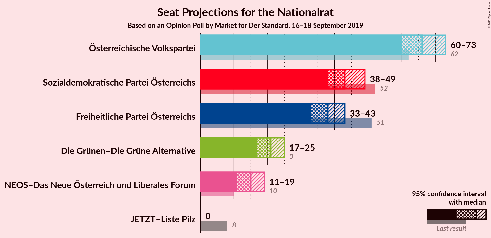

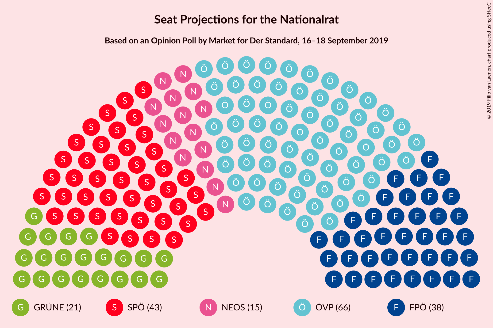

### Confidence Intervals

| Party | Last Result | Median | 80% Confidence Interval | 90% Confidence Interval | 95% Confidence Interval | 99% Confidence Interval |
|:-----:|:-----------:|:------:|:-----------------------:|:-----------------------:|:-----------------------:|:-----------------------:|
| <a href="#österreichische-volkspartei">Österreichische Volkspartei</a> | 62 | 66 | 62–70 |61–72 |60–73 |58–75 |
| <a href="#sozialdemokratische-partei-österreichs">Sozialdemokratische Partei Österreichs</a> | 52 | 43 | 40–47 |39–48 |38–49 |36–51 |
| <a href="#freiheitliche-partei-österreichs">Freiheitliche Partei Österreichs</a> | 51 | 38 | 34–41 |33–42 |33–43 |31–45 |
| <a href="#die-grünen–die-grüne-alternative">Die Grünen–Die Grüne Alternative</a> | 0 | 21 | 18–24 |17–24 |17–25 |16–27 |
| <a href="#neos–das-neue-österreich-und-liberales-forum">NEOS–Das Neue Österreich und Liberales Forum</a> | 10 | 15 | 13–17 |12–18 |11–19 |11–20 |
| <a href="#jetzt–liste-pilz">JETZT–Liste Pilz</a> | 8 | 0 | 0 |0 |0 |0 |

### Österreichische Volkspartei

*For a full overview of the results for this party, see the [Österreichische Volkspartei](party-österreichischevolkspartei.html) page.*

| Number of Seats | Probability | Accumulated | Special Marks |
|:---------------:|:-----------:|:-----------:|:-------------:|
| 56 | 0.1% | 100% |  |
| 57 | 0.2% | 99.9% |  |
| 58 | 0.4% | 99.7% |  |
| 59 | 0.8% | 99.4% |  |
| 60 | 2% | 98.6% |  |
| 61 | 3% | 97% |  |
| 62 | 5% | 94% | Last Result |
| 63 | 7% | 89% |  |
| 64 | 9% | 81% |  |
| 65 | 12% | 72% |  |
| 66 | 14% | 60% | Median |
| 67 | 11% | 46% |  |
| 68 | 11% | 35% |  |
| 69 | 7% | 24% |  |
| 70 | 7% | 16% |  |
| 71 | 4% | 9% |  |
| 72 | 2% | 5% |  |
| 73 | 1.3% | 3% |  |
| 74 | 0.7% | 1.3% |  |
| 75 | 0.4% | 0.6% |  |
| 76 | 0.1% | 0.2% |  |
| 77 | 0.1% | 0.1% |  |
| 78 | 0% | 0% |  |

### Sozialdemokratische Partei Österreichs

*For a full overview of the results for this party, see the [Sozialdemokratische Partei Österreichs](party-sozialdemokratischeparteiösterreichs.html) page.*

| Number of Seats | Probability | Accumulated | Special Marks |
|:---------------:|:-----------:|:-----------:|:-------------:|
| 35 | 0.1% | 100% |  |
| 36 | 0.4% | 99.8% |  |
| 37 | 1.0% | 99.5% |  |
| 38 | 2% | 98% |  |
| 39 | 4% | 96% |  |
| 40 | 7% | 92% |  |
| 41 | 10% | 85% |  |
| 42 | 13% | 75% |  |
| 43 | 14% | 62% | Median |
| 44 | 14% | 48% |  |
| 45 | 11% | 34% |  |
| 46 | 9% | 23% |  |
| 47 | 6% | 13% |  |
| 48 | 4% | 8% |  |
| 49 | 2% | 4% |  |
| 50 | 1.0% | 2% |  |
| 51 | 0.4% | 0.7% |  |
| 52 | 0.2% | 0.3% | Last Result |
| 53 | 0.1% | 0.1% |  |
| 54 | 0% | 0% |  |

### Freiheitliche Partei Österreichs

*For a full overview of the results for this party, see the [Freiheitliche Partei Österreichs](party-freiheitlicheparteiösterreichs.html) page.*

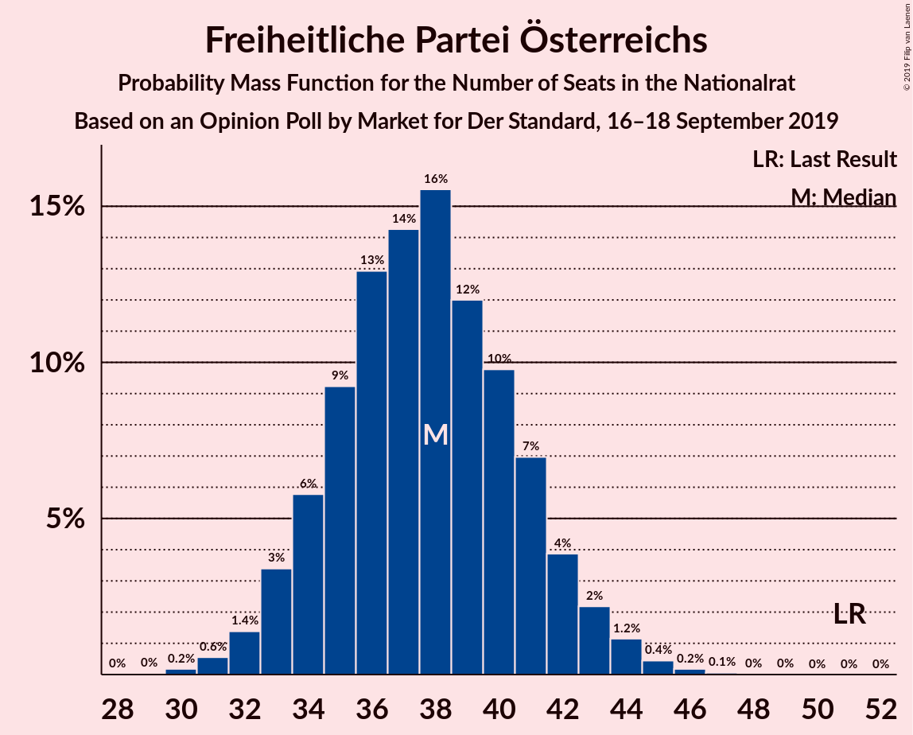

| Number of Seats | Probability | Accumulated | Special Marks |
|:---------------:|:-----------:|:-----------:|:-------------:|
| 29 | 0% | 100% |  |
| 30 | 0.2% | 99.9% |  |
| 31 | 0.6% | 99.8% |  |
| 32 | 1.4% | 99.2% |  |
| 33 | 3% | 98% |  |
| 34 | 6% | 94% |  |
| 35 | 9% | 89% |  |
| 36 | 13% | 79% |  |
| 37 | 14% | 66% |  |
| 38 | 16% | 52% | Median |
| 39 | 12% | 37% |  |
| 40 | 10% | 25% |  |
| 41 | 7% | 15% |  |
| 42 | 4% | 8% |  |
| 43 | 2% | 4% |  |
| 44 | 1.2% | 2% |  |
| 45 | 0.4% | 0.7% |  |
| 46 | 0.2% | 0.3% |  |
| 47 | 0.1% | 0.1% |  |
| 48 | 0% | 0% |  |
| 49 | 0% | 0% |  |
| 50 | 0% | 0% |  |
| 51 | 0% | 0% | Last Result |

### Die Grünen–Die Grüne Alternative

*For a full overview of the results for this party, see the [Die Grünen–Die Grüne Alternative](party-diegrünen–diegrünealternative.html) page.*

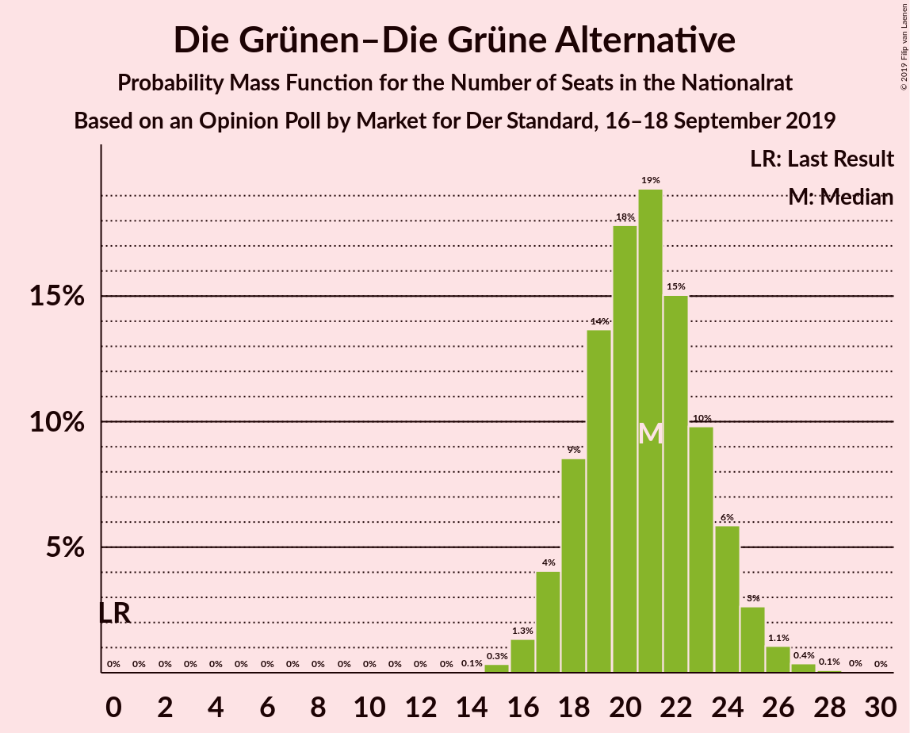

| Number of Seats | Probability | Accumulated | Special Marks |
|:---------------:|:-----------:|:-----------:|:-------------:|
| 0 | 0% | 100% | Last Result |
| 1 | 0% | 100% |  |
| 2 | 0% | 100% |  |
| 3 | 0% | 100% |  |
| 4 | 0% | 100% |  |
| 5 | 0% | 100% |  |
| 6 | 0% | 100% |  |
| 7 | 0% | 100% |  |
| 8 | 0% | 100% |  |
| 9 | 0% | 100% |  |
| 10 | 0% | 100% |  |
| 11 | 0% | 100% |  |
| 12 | 0% | 100% |  |
| 13 | 0% | 100% |  |
| 14 | 0.1% | 100% |  |
| 15 | 0.3% | 99.9% |  |
| 16 | 1.3% | 99.6% |  |
| 17 | 4% | 98% |  |
| 18 | 9% | 94% |  |
| 19 | 14% | 86% |  |
| 20 | 18% | 72% |  |
| 21 | 19% | 54% | Median |
| 22 | 15% | 35% |  |
| 23 | 10% | 20% |  |
| 24 | 6% | 10% |  |
| 25 | 3% | 4% |  |
| 26 | 1.1% | 2% |  |
| 27 | 0.4% | 0.5% |  |
| 28 | 0.1% | 0.1% |  |
| 29 | 0% | 0% |  |

### NEOS–Das Neue Österreich und Liberales Forum

*For a full overview of the results for this party, see the [NEOS–Das Neue Österreich und Liberales Forum](party-neos–dasneueösterreichundliberalesforum.html) page.*

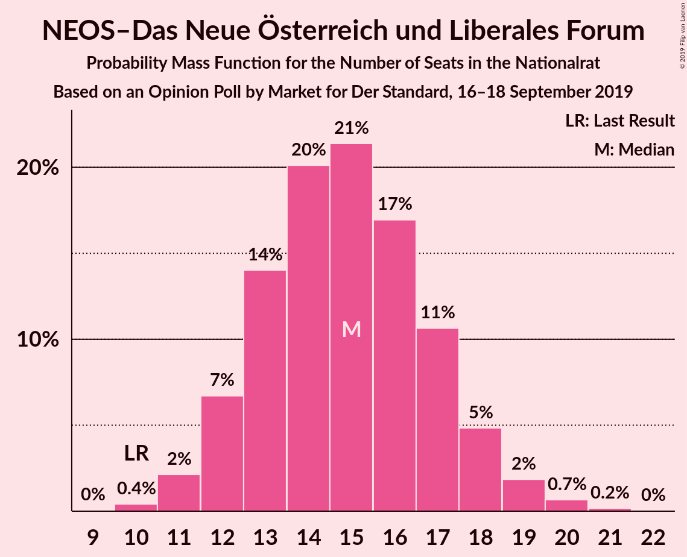

| Number of Seats | Probability | Accumulated | Special Marks |
|:---------------:|:-----------:|:-----------:|:-------------:|
| 10 | 0.4% | 100% | Last Result |
| 11 | 2% | 99.5% |  |
| 12 | 7% | 97% |  |
| 13 | 14% | 91% |  |
| 14 | 20% | 77% |  |
| 15 | 21% | 57% | Median |
| 16 | 17% | 35% |  |
| 17 | 11% | 18% |  |
| 18 | 5% | 8% |  |
| 19 | 2% | 3% |  |
| 20 | 0.7% | 0.9% |  |
| 21 | 0.2% | 0.2% |  |
| 22 | 0% | 0% |  |

### JETZT–Liste Pilz

*For a full overview of the results for this party, see the [JETZT–Liste Pilz](party-jetzt–listepilz.html) page.*

| Number of Seats | Probability | Accumulated | Special Marks |
|:---------------:|:-----------:|:-----------:|:-------------:|
| 0 | 99.9% | 100% | Median |
| 1 | 0% | 0.1% |  |
| 2 | 0% | 0.1% |  |
| 3 | 0% | 0.1% |  |
| 4 | 0% | 0.1% |  |
| 5 | 0% | 0.1% |  |
| 6 | 0% | 0.1% |  |
| 7 | 0.1% | 0.1% |  |
| 8 | 0% | 0% | Last Result |

## Coalitions

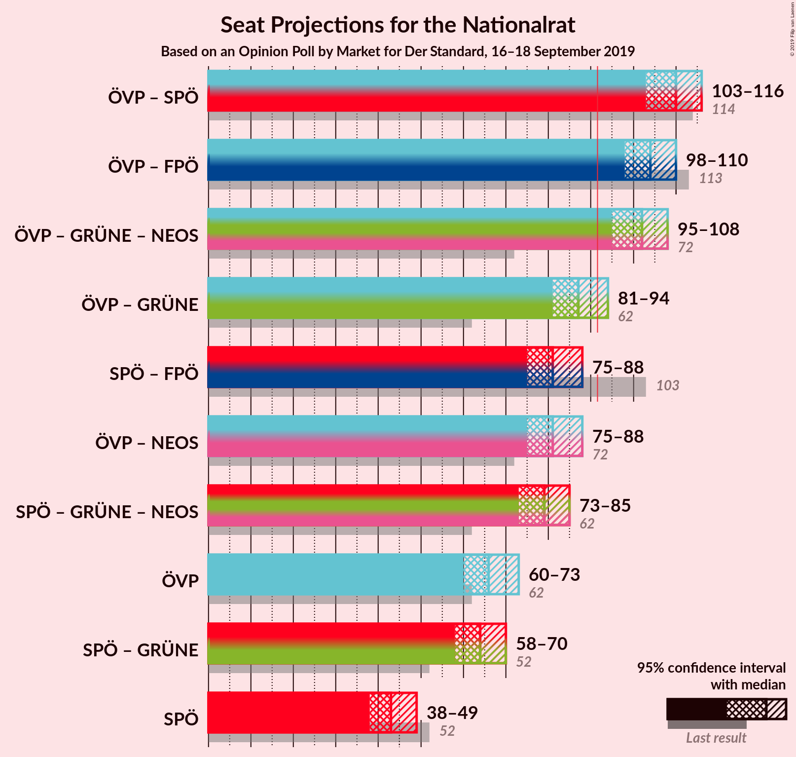

### Confidence Intervals

| Coalition | Last Result | Median | Majority? | 80% Confidence Interval | 90% Confidence Interval | 95% Confidence Interval | 99% Confidence Interval |
|:---------:|:-----------:|:------:|:---------:|:-----------------------:|:-----------------------:|:-----------------------:|:-----------------------:|
| Österreichische Volkspartei – Sozialdemokratische Partei Österreichs | 114 | 110 | 100% | 106–114 | 104–115 | 103–116 | 101–118 |
| Österreichische Volkspartei – Freiheitliche Partei Österreichs | 113 | 104 | 100% | 100–108 | 99–109 | 98–110 | 95–112 |
| Österreichische Volkspartei – Die Grünen–Die Grüne Alternative – NEOS–Das Neue Österreich und Liberales Forum | 72 | 102 | 99.9% | 98–106 | 96–107 | 95–108 | 93–110 |
| Österreichische Volkspartei – Die Grünen–Die Grüne Alternative | 62 | 87 | 9% | 83–91 | 82–92 | 81–94 | 79–96 |
| Sozialdemokratische Partei Österreichs – Freiheitliche Partei Österreichs | 103 | 81 | 0.1% | 77–85 | 76–87 | 75–88 | 73–90 |
| Österreichische Volkspartei – NEOS–Das Neue Österreich und Liberales Forum | 72 | 81 | 0.1% | 77–85 | 76–87 | 75–88 | 73–90 |
| Sozialdemokratische Partei Österreichs – Die Grünen–Die Grüne Alternative – NEOS–Das Neue Österreich und Liberales Forum | 62 | 79 | 0% | 75–83 | 74–84 | 73–85 | 71–88 |
| Österreichische Volkspartei | 62 | 66 | 0% | 62–70 | 61–72 | 60–73 | 58–75 |
| Sozialdemokratische Partei Österreichs – Die Grünen–Die Grüne Alternative | 52 | 64 | 0% | 60–68 | 59–69 | 58–70 | 56–72 |
| Sozialdemokratische Partei Österreichs | 52 | 43 | 0% | 40–47 | 39–48 | 38–49 | 36–51 |

### Österreichische Volkspartei – Sozialdemokratische Partei Österreichs

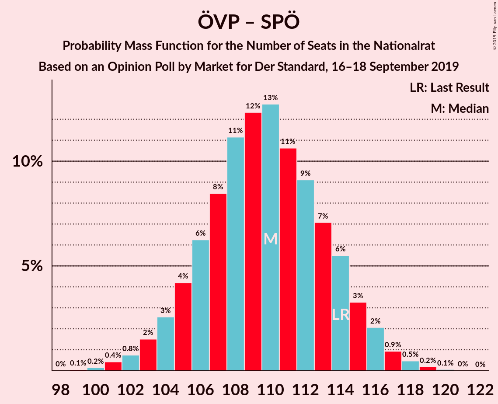

| Number of Seats | Probability | Accumulated | Special Marks |
|:---------------:|:-----------:|:-----------:|:-------------:|
| 99 | 0.1% | 100% |  |
| 100 | 0.2% | 99.9% |  |
| 101 | 0.4% | 99.8% |  |
| 102 | 0.8% | 99.3% |  |
| 103 | 2% | 98.6% |  |
| 104 | 3% | 97% |  |
| 105 | 4% | 94% |  |
| 106 | 6% | 90% |  |
| 107 | 8% | 84% |  |
| 108 | 11% | 76% |  |
| 109 | 12% | 64% | Median |
| 110 | 13% | 52% |  |
| 111 | 11% | 39% |  |
| 112 | 9% | 29% |  |
| 113 | 7% | 20% |  |
| 114 | 6% | 13% | Last Result |
| 115 | 3% | 7% |  |
| 116 | 2% | 4% |  |
| 117 | 0.9% | 2% |  |
| 118 | 0.5% | 0.8% |  |
| 119 | 0.2% | 0.3% |  |
| 120 | 0.1% | 0.1% |  |
| 121 | 0% | 0% |  |

### Österreichische Volkspartei – Freiheitliche Partei Österreichs

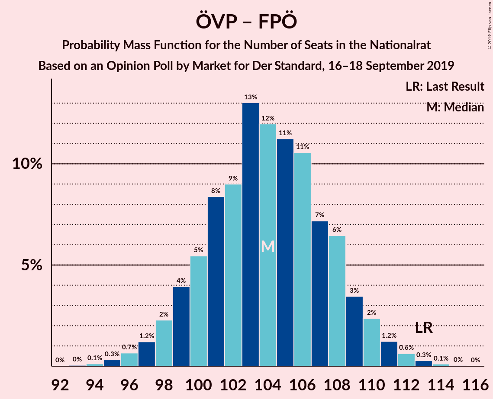

| Number of Seats | Probability | Accumulated | Special Marks |
|:---------------:|:-----------:|:-----------:|:-------------:|
| 93 | 0% | 100% |  |
| 94 | 0.1% | 99.9% |  |
| 95 | 0.3% | 99.8% |  |
| 96 | 0.7% | 99.5% |  |
| 97 | 1.2% | 98.8% |  |
| 98 | 2% | 98% |  |
| 99 | 4% | 95% |  |
| 100 | 5% | 91% |  |
| 101 | 8% | 86% |  |
| 102 | 9% | 78% |  |
| 103 | 13% | 69% |  |
| 104 | 12% | 56% | Median |
| 105 | 11% | 44% |  |
| 106 | 11% | 32% |  |
| 107 | 7% | 22% |  |
| 108 | 6% | 15% |  |
| 109 | 3% | 8% |  |
| 110 | 2% | 5% |  |
| 111 | 1.2% | 2% |  |
| 112 | 0.6% | 1.1% |  |
| 113 | 0.3% | 0.4% | Last Result |
| 114 | 0.1% | 0.2% |  |
| 115 | 0% | 0.1% |  |
| 116 | 0% | 0% |  |

### Österreichische Volkspartei – Die Grünen–Die Grüne Alternative – NEOS–Das Neue Österreich und Liberales Forum

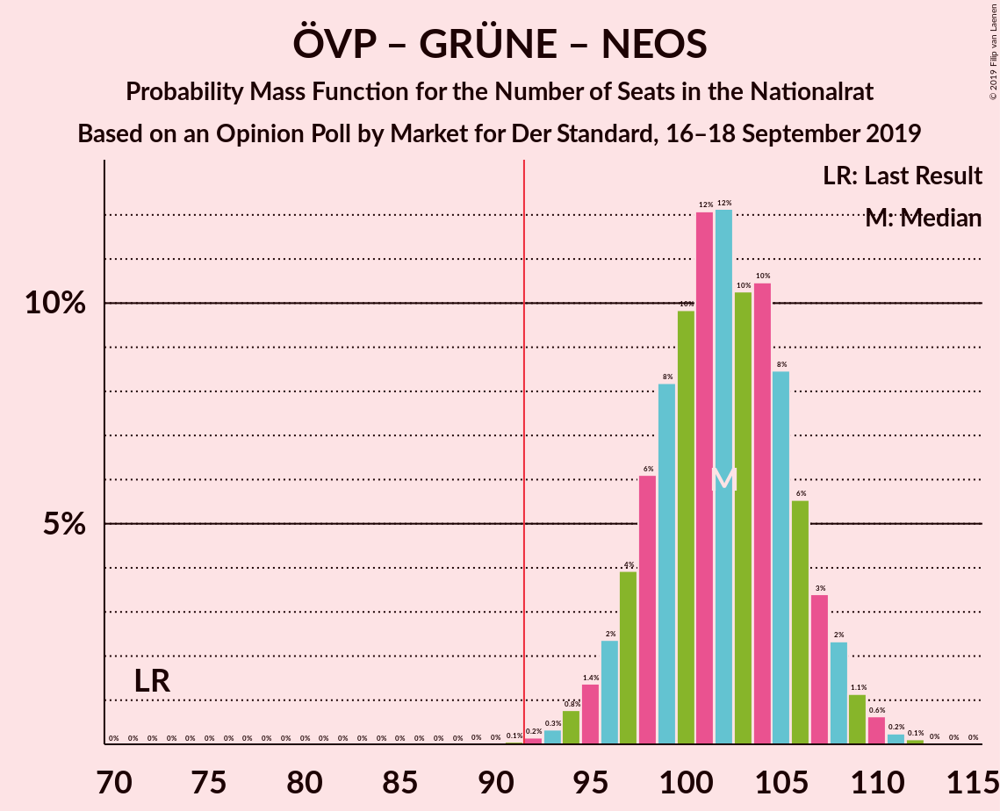

| Number of Seats | Probability | Accumulated | Special Marks |
|:---------------:|:-----------:|:-----------:|:-------------:|
| 72 | 0% | 100% | Last Result |
| 73 | 0% | 100% |  |
| 74 | 0% | 100% |  |
| 75 | 0% | 100% |  |
| 76 | 0% | 100% |  |
| 77 | 0% | 100% |  |
| 78 | 0% | 100% |  |
| 79 | 0% | 100% |  |
| 80 | 0% | 100% |  |
| 81 | 0% | 100% |  |
| 82 | 0% | 100% |  |
| 83 | 0% | 100% |  |
| 84 | 0% | 100% |  |
| 85 | 0% | 100% |  |
| 86 | 0% | 100% |  |
| 87 | 0% | 100% |  |
| 88 | 0% | 100% |  |
| 89 | 0% | 100% |  |
| 90 | 0% | 100% |  |
| 91 | 0.1% | 100% |  |
| 92 | 0.2% | 99.9% | Majority |
| 93 | 0.3% | 99.8% |  |
| 94 | 0.8% | 99.4% |  |
| 95 | 1.4% | 98.7% |  |
| 96 | 2% | 97% |  |
| 97 | 4% | 95% |  |
| 98 | 6% | 91% |  |
| 99 | 8% | 85% |  |
| 100 | 10% | 77% |  |
| 101 | 12% | 67% |  |
| 102 | 12% | 55% | Median |
| 103 | 10% | 43% |  |
| 104 | 10% | 32% |  |
| 105 | 8% | 22% |  |
| 106 | 6% | 13% |  |
| 107 | 3% | 8% |  |
| 108 | 2% | 5% |  |
| 109 | 1.1% | 2% |  |
| 110 | 0.6% | 1.0% |  |
| 111 | 0.2% | 0.4% |  |
| 112 | 0.1% | 0.2% |  |
| 113 | 0% | 0.1% |  |
| 114 | 0% | 0% |  |

### Österreichische Volkspartei – Die Grünen–Die Grüne Alternative

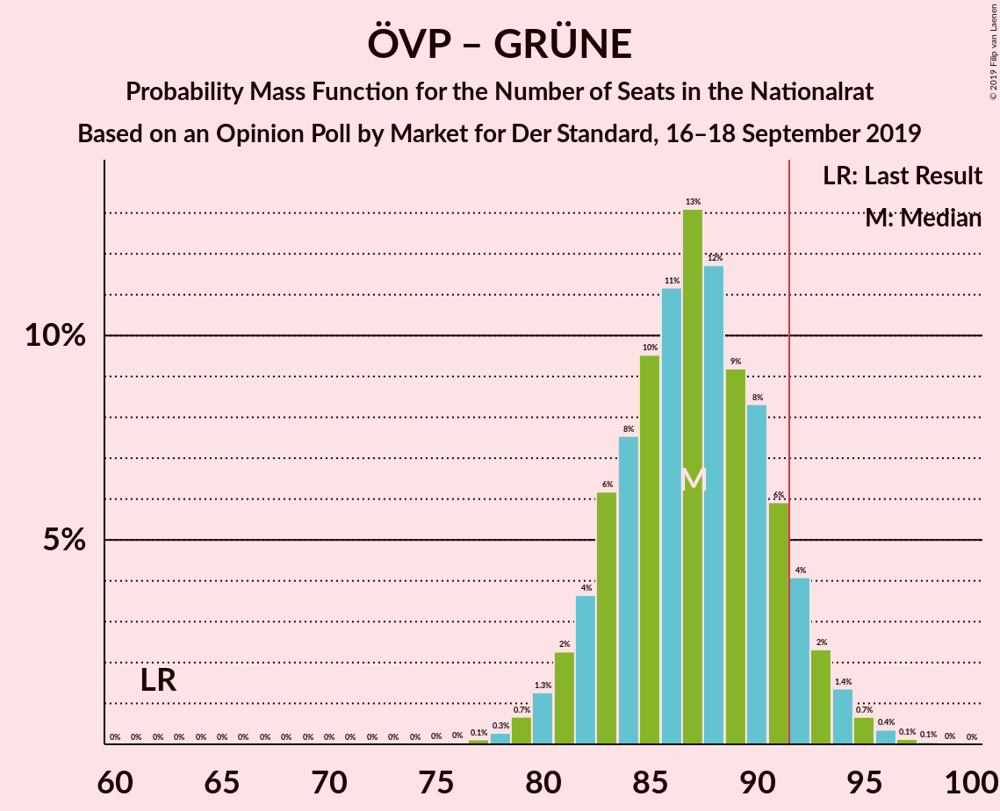

| Number of Seats | Probability | Accumulated | Special Marks |
|:---------------:|:-----------:|:-----------:|:-------------:|
| 62 | 0% | 100% | Last Result |
| 63 | 0% | 100% |  |
| 64 | 0% | 100% |  |
| 65 | 0% | 100% |  |
| 66 | 0% | 100% |  |
| 67 | 0% | 100% |  |
| 68 | 0% | 100% |  |
| 69 | 0% | 100% |  |
| 70 | 0% | 100% |  |
| 71 | 0% | 100% |  |
| 72 | 0% | 100% |  |
| 73 | 0% | 100% |  |
| 74 | 0% | 100% |  |
| 75 | 0% | 100% |  |
| 76 | 0% | 100% |  |
| 77 | 0.1% | 99.9% |  |
| 78 | 0.3% | 99.8% |  |
| 79 | 0.7% | 99.5% |  |
| 80 | 1.3% | 98.9% |  |
| 81 | 2% | 98% |  |
| 82 | 4% | 95% |  |
| 83 | 6% | 92% |  |
| 84 | 8% | 85% |  |
| 85 | 10% | 78% |  |
| 86 | 11% | 68% |  |
| 87 | 13% | 57% | Median |
| 88 | 12% | 44% |  |
| 89 | 9% | 32% |  |
| 90 | 8% | 23% |  |
| 91 | 6% | 15% |  |
| 92 | 4% | 9% | Majority |
| 93 | 2% | 5% |  |
| 94 | 1.4% | 3% |  |
| 95 | 0.7% | 1.2% |  |
| 96 | 0.4% | 0.6% |  |
| 97 | 0.1% | 0.2% |  |
| 98 | 0.1% | 0.1% |  |
| 99 | 0% | 0% |  |

### Sozialdemokratische Partei Österreichs – Freiheitliche Partei Österreichs

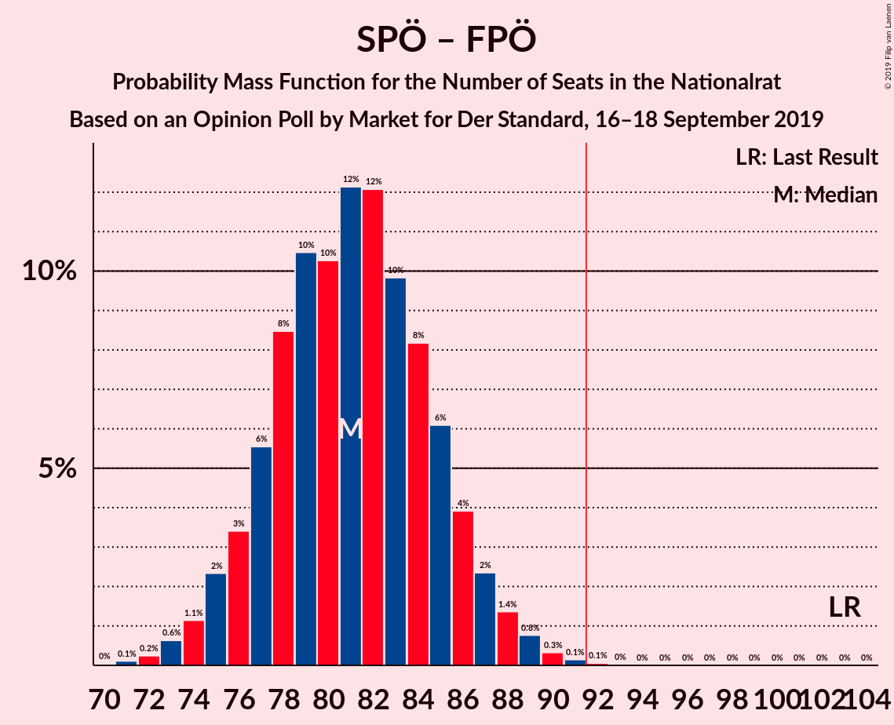

| Number of Seats | Probability | Accumulated | Special Marks |
|:---------------:|:-----------:|:-----------:|:-------------:|
| 70 | 0% | 100% |  |
| 71 | 0.1% | 99.9% |  |
| 72 | 0.2% | 99.8% |  |
| 73 | 0.6% | 99.6% |  |
| 74 | 1.1% | 99.0% |  |
| 75 | 2% | 98% |  |
| 76 | 3% | 95% |  |
| 77 | 6% | 92% |  |
| 78 | 8% | 87% |  |
| 79 | 10% | 78% |  |
| 80 | 10% | 68% |  |
| 81 | 12% | 57% | Median |
| 82 | 12% | 45% |  |
| 83 | 10% | 33% |  |
| 84 | 8% | 23% |  |
| 85 | 6% | 15% |  |
| 86 | 4% | 9% |  |
| 87 | 2% | 5% |  |
| 88 | 1.4% | 3% |  |
| 89 | 0.8% | 1.3% |  |
| 90 | 0.3% | 0.6% |  |
| 91 | 0.1% | 0.2% |  |
| 92 | 0.1% | 0.1% | Majority |
| 93 | 0% | 0% |  |
| 94 | 0% | 0% |  |
| 95 | 0% | 0% |  |
| 96 | 0% | 0% |  |
| 97 | 0% | 0% |  |
| 98 | 0% | 0% |  |
| 99 | 0% | 0% |  |
| 100 | 0% | 0% |  |
| 101 | 0% | 0% |  |
| 102 | 0% | 0% |  |
| 103 | 0% | 0% | Last Result |

### Österreichische Volkspartei – NEOS–Das Neue Österreich und Liberales Forum

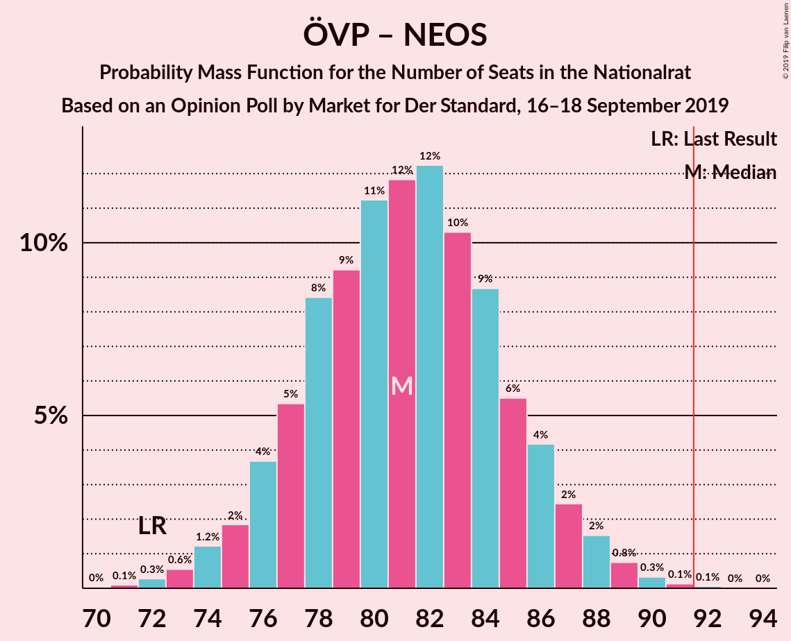

| Number of Seats | Probability | Accumulated | Special Marks |
|:---------------:|:-----------:|:-----------:|:-------------:|
| 70 | 0% | 100% |  |
| 71 | 0.1% | 99.9% |  |
| 72 | 0.3% | 99.8% | Last Result |
| 73 | 0.6% | 99.6% |  |
| 74 | 1.2% | 99.0% |  |
| 75 | 2% | 98% |  |
| 76 | 4% | 96% |  |
| 77 | 5% | 92% |  |
| 78 | 8% | 87% |  |
| 79 | 9% | 78% |  |
| 80 | 11% | 69% |  |
| 81 | 12% | 58% | Median |
| 82 | 12% | 46% |  |
| 83 | 10% | 34% |  |
| 84 | 9% | 24% |  |
| 85 | 6% | 15% |  |
| 86 | 4% | 9% |  |
| 87 | 2% | 5% |  |
| 88 | 2% | 3% |  |
| 89 | 0.8% | 1.3% |  |
| 90 | 0.3% | 0.6% |  |
| 91 | 0.1% | 0.2% |  |
| 92 | 0.1% | 0.1% | Majority |
| 93 | 0% | 0% |  |

### Sozialdemokratische Partei Österreichs – Die Grünen–Die Grüne Alternative – NEOS–Das Neue Österreich und Liberales Forum

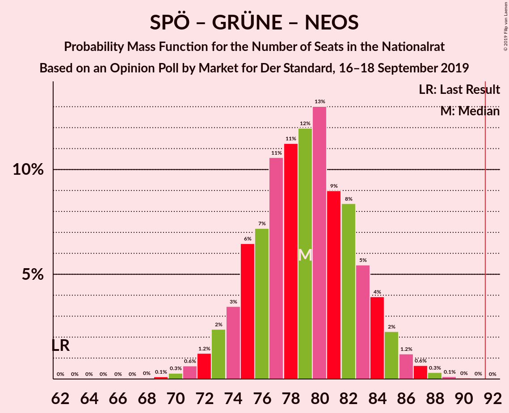

| Number of Seats | Probability | Accumulated | Special Marks |
|:---------------:|:-----------:|:-----------:|:-------------:|
| 62 | 0% | 100% | Last Result |
| 63 | 0% | 100% |  |
| 64 | 0% | 100% |  |
| 65 | 0% | 100% |  |
| 66 | 0% | 100% |  |
| 67 | 0% | 100% |  |
| 68 | 0% | 100% |  |
| 69 | 0.1% | 99.9% |  |
| 70 | 0.3% | 99.8% |  |
| 71 | 0.6% | 99.5% |  |
| 72 | 1.2% | 98.9% |  |
| 73 | 2% | 98% |  |
| 74 | 3% | 95% |  |
| 75 | 6% | 92% |  |
| 76 | 7% | 85% |  |
| 77 | 11% | 78% |  |
| 78 | 11% | 68% |  |
| 79 | 12% | 56% | Median |
| 80 | 13% | 44% |  |
| 81 | 9% | 31% |  |
| 82 | 8% | 22% |  |
| 83 | 5% | 14% |  |
| 84 | 4% | 9% |  |
| 85 | 2% | 5% |  |
| 86 | 1.2% | 2% |  |
| 87 | 0.6% | 1.2% |  |
| 88 | 0.3% | 0.5% |  |
| 89 | 0.1% | 0.2% |  |
| 90 | 0% | 0.1% |  |
| 91 | 0% | 0% |  |

### Österreichische Volkspartei

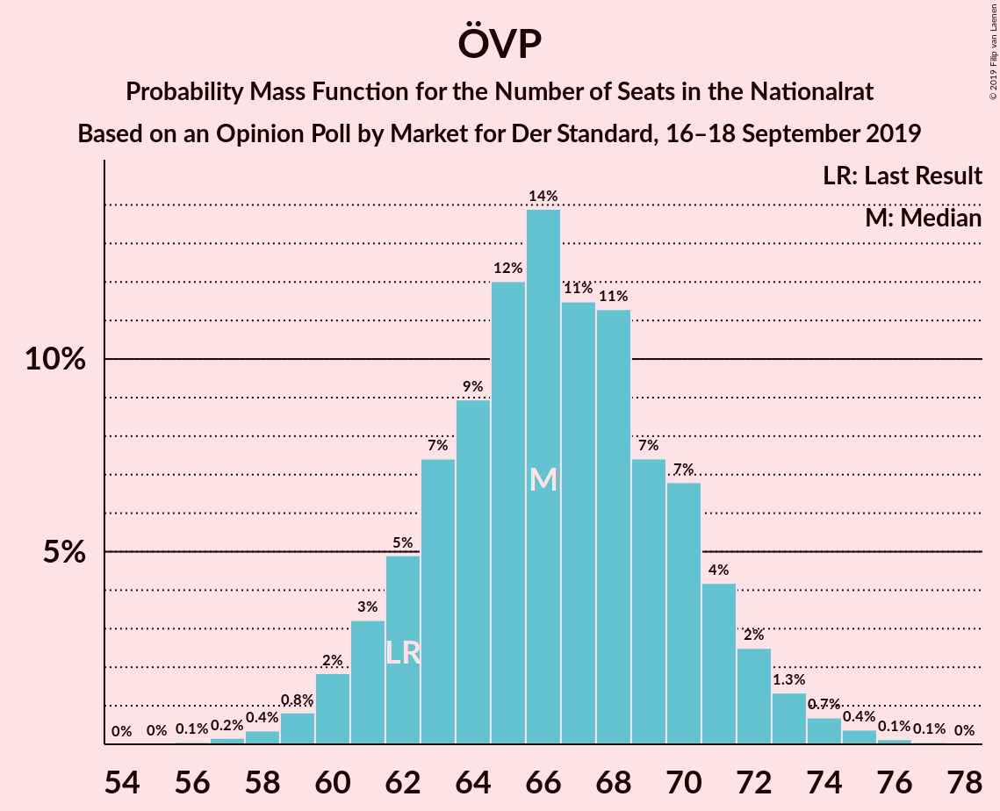

| Number of Seats | Probability | Accumulated | Special Marks |
|:---------------:|:-----------:|:-----------:|:-------------:|
| 56 | 0.1% | 100% |  |
| 57 | 0.2% | 99.9% |  |
| 58 | 0.4% | 99.7% |  |
| 59 | 0.8% | 99.4% |  |
| 60 | 2% | 98.6% |  |
| 61 | 3% | 97% |  |
| 62 | 5% | 94% | Last Result |
| 63 | 7% | 89% |  |
| 64 | 9% | 81% |  |
| 65 | 12% | 72% |  |
| 66 | 14% | 60% | Median |
| 67 | 11% | 46% |  |
| 68 | 11% | 35% |  |
| 69 | 7% | 24% |  |
| 70 | 7% | 16% |  |
| 71 | 4% | 9% |  |
| 72 | 2% | 5% |  |
| 73 | 1.3% | 3% |  |
| 74 | 0.7% | 1.3% |  |
| 75 | 0.4% | 0.6% |  |
| 76 | 0.1% | 0.2% |  |
| 77 | 0.1% | 0.1% |  |
| 78 | 0% | 0% |  |

### Sozialdemokratische Partei Österreichs – Die Grünen–Die Grüne Alternative

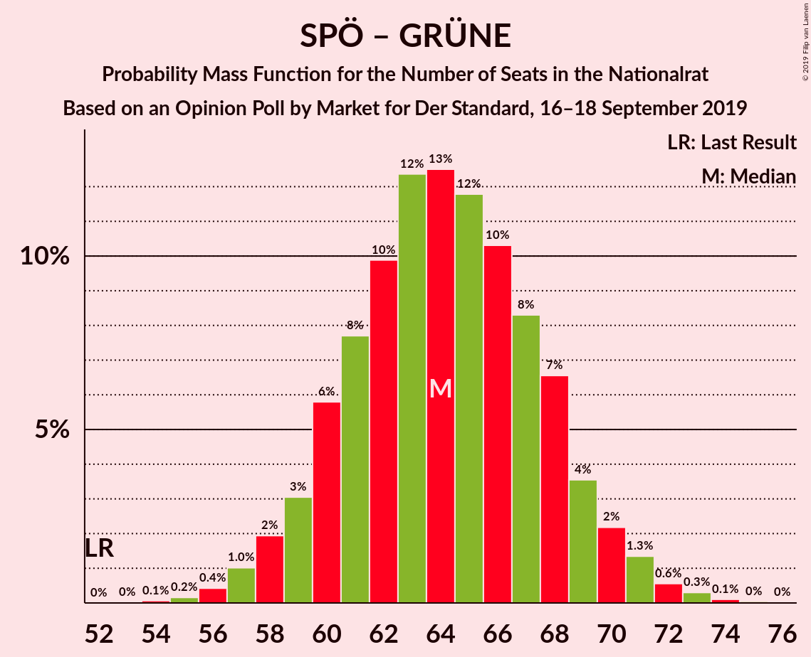

| Number of Seats | Probability | Accumulated | Special Marks |
|:---------------:|:-----------:|:-----------:|:-------------:|
| 52 | 0% | 100% | Last Result |
| 53 | 0% | 100% |  |
| 54 | 0.1% | 100% |  |
| 55 | 0.2% | 99.9% |  |
| 56 | 0.4% | 99.7% |  |
| 57 | 1.0% | 99.3% |  |
| 58 | 2% | 98% |  |
| 59 | 3% | 96% |  |
| 60 | 6% | 93% |  |
| 61 | 8% | 88% |  |
| 62 | 10% | 80% |  |
| 63 | 12% | 70% |  |
| 64 | 13% | 58% | Median |
| 65 | 12% | 45% |  |
| 66 | 10% | 33% |  |
| 67 | 8% | 23% |  |
| 68 | 7% | 15% |  |
| 69 | 4% | 8% |  |
| 70 | 2% | 5% |  |
| 71 | 1.3% | 2% |  |
| 72 | 0.6% | 1.0% |  |
| 73 | 0.3% | 0.5% |  |
| 74 | 0.1% | 0.2% |  |
| 75 | 0% | 0.1% |  |
| 76 | 0% | 0% |  |

### Sozialdemokratische Partei Österreichs

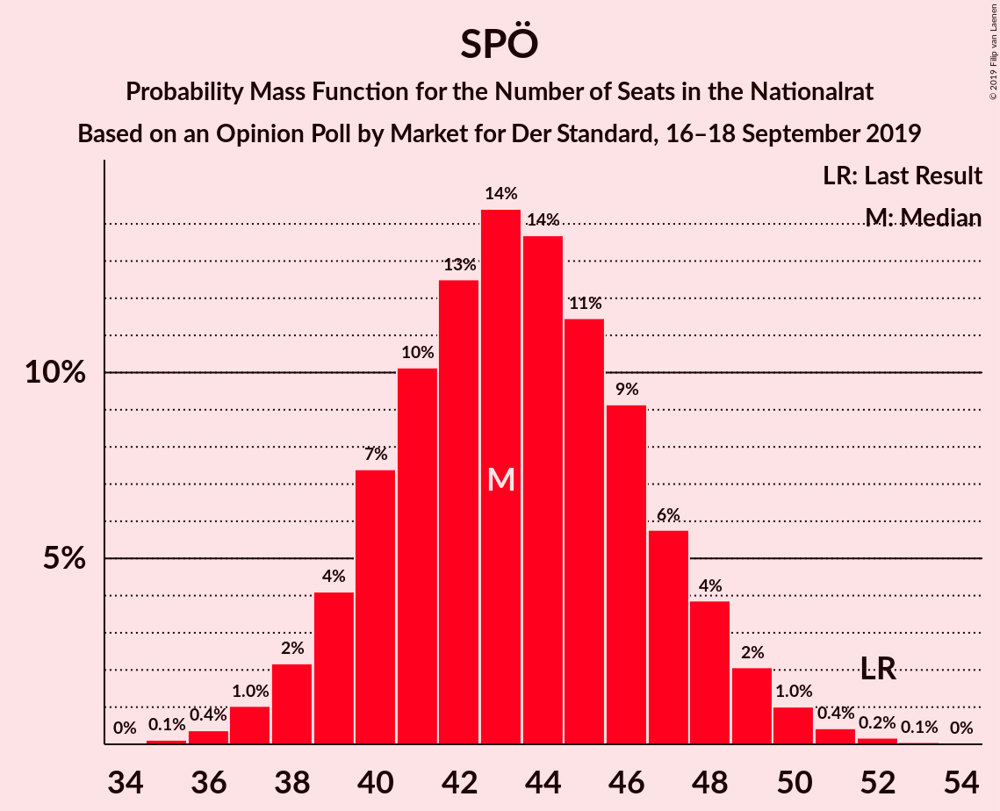

| Number of Seats | Probability | Accumulated | Special Marks |
|:---------------:|:-----------:|:-----------:|:-------------:|
| 35 | 0.1% | 100% |  |
| 36 | 0.4% | 99.8% |  |
| 37 | 1.0% | 99.5% |  |
| 38 | 2% | 98% |  |
| 39 | 4% | 96% |  |
| 40 | 7% | 92% |  |
| 41 | 10% | 85% |  |
| 42 | 13% | 75% |  |
| 43 | 14% | 62% | Median |
| 44 | 14% | 48% |  |
| 45 | 11% | 34% |  |
| 46 | 9% | 23% |  |
| 47 | 6% | 13% |  |
| 48 | 4% | 8% |  |
| 49 | 2% | 4% |  |
| 50 | 1.0% | 2% |  |
| 51 | 0.4% | 0.7% |  |
| 52 | 0.2% | 0.3% | Last Result |
| 53 | 0.1% | 0.1% |  |
| 54 | 0% | 0% |  |

## Technical Information

### Opinion Poll

+ **Polling firm:** Market
+ **Commissioner(s):** Der Standard
+ **Fieldwork period:** 16–18 September 2019

### Calculations

+ **Sample size:** 806
+ **Simulations done:** 1,048,576
+ **Error estimate:** 1.19%

