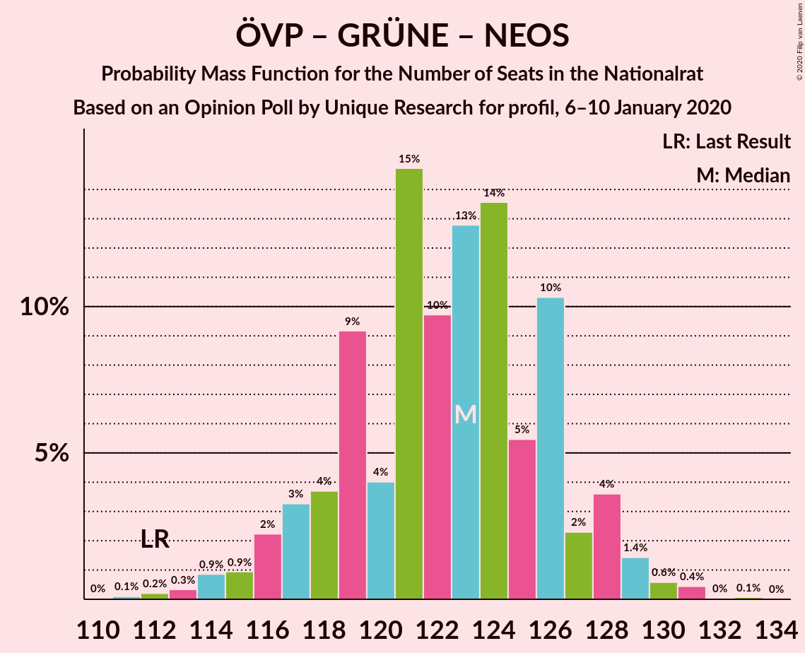
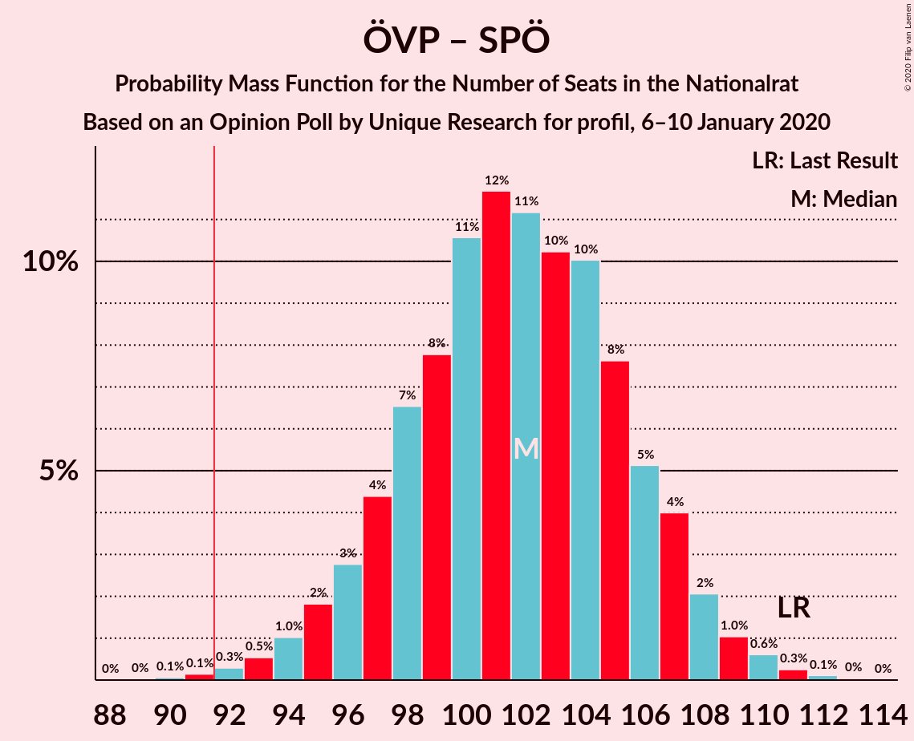
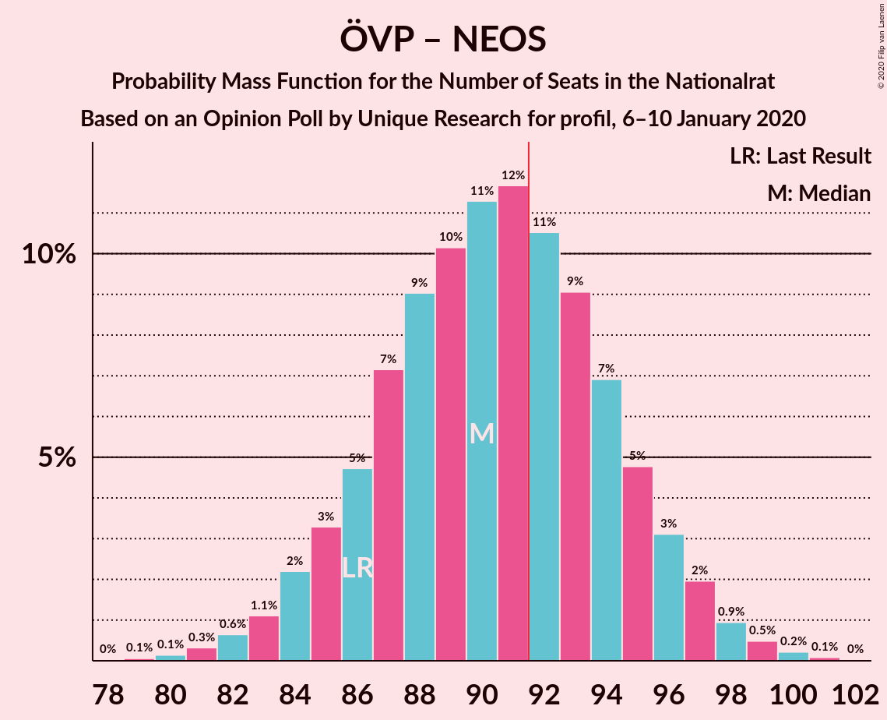
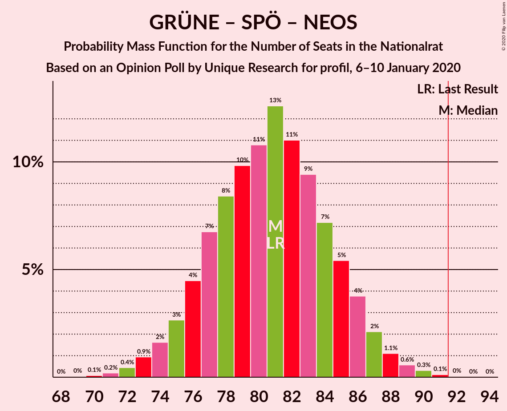
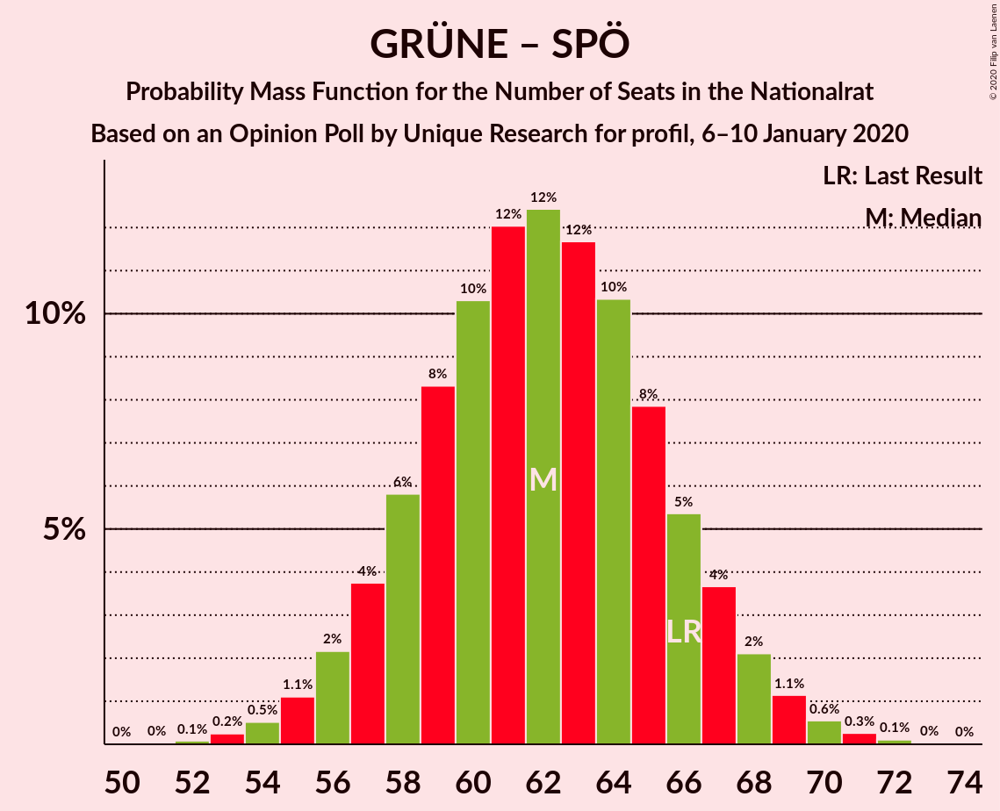

# Opinion Poll by Unique Research for profil, 6–10 January 2020

<a href="#voting-intentions">Voting Intentions</a> | <a href="#seats">Seats</a> | <a href="#coalitions">Coalitions</a> | <a href="#technical-information">Technical Information</a>

## Voting Intentions

### Confidence Intervals

| Party | Last Result | Poll Result | 80% Confidence Interval | 90% Confidence Interval | 95% Confidence Interval | 99% Confidence Interval |
|:-----:|:-----------:|:-----------:|:-----------------------:|:-----------------------:|:-----------------------:|:-----------------------:|
| Österreichische Volkspartei | 37.5% | 38.0% | 35.8–40.2% |35.2–40.8% |34.7–41.4% |33.7–42.4% |
| Die Grünen–Die Grüne Alternative | 13.9% | 17.0% | 15.4–18.8% |14.9–19.3% |14.6–19.8% |13.8–20.6% |
| Sozialdemokratische Partei Österreichs | 21.2% | 16.0% | 14.4–17.8% |14.0–18.3% |13.6–18.7% |12.9–19.6% |
| Freiheitliche Partei Österreichs | 16.2% | 16.0% | 14.4–17.8% |14.0–18.3% |13.6–18.7% |12.9–19.6% |
| NEOS–Das Neue Österreich und Liberales Forum | 8.1% | 10.0% | 8.8–11.5% |8.5–11.9% |8.2–12.3% |7.6–13.1% |

*Note:* The poll result column reflects the actual value used in the calculations. Published results may vary slightly, and in addition be rounded to fewer digits.

## Seats

### Confidence Intervals

| Party | Last Result | Median | 80% Confidence Interval | 90% Confidence Interval | 95% Confidence Interval | 99% Confidence Interval |
|:-----:|:-----------:|:------:|:-----------------------:|:-----------------------:|:-----------------------:|:-----------------------:|
| <a href="#österreichische-volkspartei">Österreichische Volkspartei</a> | 71 | 72 | 67–76 |66–77 |65–78 |63–80 |
| <a href="#die-grünen–die-grüne-alternative">Die Grünen–Die Grüne Alternative</a> | 26 | 33 | 28–34 |28–35 |27–36 |26–39 |
| <a href="#sozialdemokratische-partei-österreichs">Sozialdemokratische Partei Österreichs</a> | 40 | 30 | 27–33 |26–34 |25–35 |24–37 |
| <a href="#freiheitliche-partei-österreichs">Freiheitliche Partei Österreichs</a> | 31 | 30 | 27–33 |26–34 |25–35 |24–37 |
| <a href="#neos–das-neue-österreich-und-liberales-forum">NEOS–Das Neue Österreich und Liberales Forum</a> | 15 | 19 | 16–21 |16–22 |15–23 |14–24 |

### Österreichische Volkspartei

*For a full overview of the results for this party, see the [Österreichische Volkspartei](party-österreichischevolkspartei.html) page.*

| Number of Seats | Probability | Accumulated | Special Marks |
|:---------------:|:-----------:|:-----------:|:-------------:|
| 61 | 0.1% | 100% |  |
| 62 | 0.1% | 99.9% |  |
| 63 | 0.4% | 99.7% |  |
| 64 | 0.9% | 99.3% |  |
| 65 | 2% | 98% |  |
| 66 | 3% | 97% |  |
| 67 | 4% | 94% |  |
| 68 | 7% | 90% |  |
| 69 | 10% | 83% |  |
| 70 | 10% | 73% |  |
| 71 | 11% | 63% | Last Result |
| 72 | 13% | 52% | Median |
| 73 | 11% | 39% |  |
| 74 | 8% | 28% |  |
| 75 | 7% | 20% |  |
| 76 | 6% | 13% |  |
| 77 | 3% | 7% |  |
| 78 | 2% | 4% |  |
| 79 | 1.1% | 2% |  |
| 80 | 0.5% | 0.9% |  |
| 81 | 0.2% | 0.4% |  |
| 82 | 0.1% | 0.1% |  |
| 83 | 0% | 0.1% |  |
| 84 | 0% | 0% |  |

### Die Grünen–Die Grüne Alternative

*For a full overview of the results for this party, see the [Die Grünen–Die Grüne Alternative](party-diegrünen–diegrünealternative.html) page.*

| Number of Seats | Probability | Accumulated | Special Marks |
|:---------------:|:-----------:|:-----------:|:-------------:|
| 25 | 0.1% | 100% |  |
| 26 | 0.7% | 99.9% | Last Result |
| 27 | 4% | 99.2% |  |
| 28 | 10% | 95% |  |
| 29 | 10% | 85% |  |
| 30 | 3% | 75% |  |
| 31 | 2% | 72% |  |
| 32 | 10% | 70% |  |
| 33 | 26% | 60% | Median |
| 34 | 26% | 34% |  |
| 35 | 6% | 9% |  |
| 36 | 0.5% | 3% |  |
| 37 | 0.2% | 2% |  |
| 38 | 0.7% | 2% |  |
| 39 | 0.9% | 1.3% |  |
| 40 | 0.3% | 0.3% |  |
| 41 | 0% | 0% |  |

### Sozialdemokratische Partei Österreichs

*For a full overview of the results for this party, see the [Sozialdemokratische Partei Österreichs](party-sozialdemokratischeparteiösterreichs.html) page.*

| Number of Seats | Probability | Accumulated | Special Marks |
|:---------------:|:-----------:|:-----------:|:-------------:|
| 22 | 0% | 100% |  |
| 23 | 0.2% | 99.9% |  |
| 24 | 0.7% | 99.7% |  |
| 25 | 2% | 99.1% |  |
| 26 | 4% | 97% |  |
| 27 | 9% | 93% |  |
| 28 | 12% | 84% |  |
| 29 | 16% | 72% |  |
| 30 | 16% | 56% | Median |
| 31 | 13% | 40% |  |
| 32 | 11% | 27% |  |
| 33 | 8% | 16% |  |
| 34 | 4% | 8% |  |
| 35 | 2% | 4% |  |
| 36 | 1.2% | 2% |  |
| 37 | 0.4% | 0.6% |  |
| 38 | 0.2% | 0.2% |  |
| 39 | 0% | 0.1% |  |
| 40 | 0% | 0% | Last Result |

### Freiheitliche Partei Österreichs

*For a full overview of the results for this party, see the [Freiheitliche Partei Österreichs](party-freiheitlicheparteiösterreichs.html) page.*

| Number of Seats | Probability | Accumulated | Special Marks |
|:---------------:|:-----------:|:-----------:|:-------------:|
| 22 | 0% | 100% |  |
| 23 | 0.2% | 99.9% |  |
| 24 | 0.7% | 99.8% |  |
| 25 | 2% | 99.0% |  |
| 26 | 4% | 97% |  |
| 27 | 9% | 93% |  |
| 28 | 13% | 84% |  |
| 29 | 16% | 72% |  |
| 30 | 15% | 56% | Median |
| 31 | 13% | 40% | Last Result |
| 32 | 12% | 27% |  |
| 33 | 8% | 16% |  |
| 34 | 4% | 8% |  |
| 35 | 2% | 4% |  |
| 36 | 1.0% | 2% |  |
| 37 | 0.4% | 0.6% |  |
| 38 | 0.2% | 0.2% |  |
| 39 | 0% | 0.1% |  |
| 40 | 0% | 0% |  |

### NEOS–Das Neue Österreich und Liberales Forum

*For a full overview of the results for this party, see the [NEOS–Das Neue Österreich und Liberales Forum](party-neos–dasneueösterreichundliberalesforum.html) page.*

| Number of Seats | Probability | Accumulated | Special Marks |
|:---------------:|:-----------:|:-----------:|:-------------:|
| 13 | 0.2% | 100% |  |
| 14 | 1.2% | 99.8% |  |
| 15 | 3% | 98.6% | Last Result |
| 16 | 7% | 95% |  |
| 17 | 16% | 88% |  |
| 18 | 19% | 72% |  |
| 19 | 16% | 53% | Median |
| 20 | 16% | 37% |  |
| 21 | 12% | 20% |  |
| 22 | 5% | 8% |  |
| 23 | 2% | 4% |  |
| 24 | 1.0% | 1.4% |  |
| 25 | 0.3% | 0.4% |  |
| 26 | 0.1% | 0.1% |  |
| 27 | 0% | 0% |  |

## Coalitions

### Confidence Intervals

| Coalition | Last Result | Median | Majority? | 80% Confidence Interval | 90% Confidence Interval | 95% Confidence Interval | 99% Confidence Interval |
|:---------:|:-----------:|:------:|:---------:|:-----------------------:|:-----------------------:|:-----------------------:|:-----------------------:|
| Österreichische Volkspartei – Die Grünen–Die Grüne Alternative – NEOS–Das Neue Österreich und Liberales Forum | 112 | 123 | 100% | 118–126 | 117–128 | 115–129 | 113–131 |
| Österreichische Volkspartei – Die Grünen–Die Grüne Alternative | 97 | 104 | 99.9% | 99–108 | 98–109 | 96–110 | 94–112 |
| Österreichische Volkspartei – Freiheitliche Partei Österreichs | 102 | 102 | 99.8% | 97–106 | 96–107 | 95–109 | 92–110 |
| Österreichische Volkspartei – Sozialdemokratische Partei Österreichs | 111 | 101 | 99.7% | 97–106 | 96–107 | 95–108 | 92–111 |
| Österreichische Volkspartei – NEOS–Das Neue Österreich und Liberales Forum | 86 | 90 | 37% | 86–95 | 84–96 | 84–97 | 81–99 |
| Die Grünen–Die Grüne Alternative – Sozialdemokratische Partei Österreichs – NEOS–Das Neue Österreich und Liberales Forum | 81 | 81 | 0.1% | 76–85 | 75–86 | 74–87 | 72–90 |
| Österreichische Volkspartei | 71 | 72 | 0% | 67–76 | 66–77 | 65–78 | 63–80 |
| Die Grünen–Die Grüne Alternative – Sozialdemokratische Partei Österreichs | 66 | 62 | 0% | 58–66 | 57–67 | 56–68 | 54–70 |
| Freiheitliche Partei Österreichs – Sozialdemokratische Partei Österreichs | 71 | 60 | 0% | 56–64 | 55–66 | 54–67 | 52–69 |
| Sozialdemokratische Partei Österreichs | 40 | 30 | 0% | 27–33 | 26–34 | 25–35 | 24–37 |

### Österreichische Volkspartei – Die Grünen–Die Grüne Alternative – NEOS–Das Neue Österreich und Liberales Forum

| Number of Seats | Probability | Accumulated | Special Marks |
|:---------------:|:-----------:|:-----------:|:-------------:|
| 110 | 0% | 100% |  |
| 111 | 0.1% | 99.9% |  |
| 112 | 0.2% | 99.8% | Last Result |
| 113 | 0.4% | 99.6% |  |
| 114 | 0.9% | 99.2% |  |
| 115 | 0.9% | 98% |  |
| 116 | 2% | 97% |  |
| 117 | 3% | 95% |  |
| 118 | 4% | 92% |  |
| 119 | 9% | 88% |  |
| 120 | 3% | 78% |  |
| 121 | 13% | 75% |  |
| 122 | 8% | 62% |  |
| 123 | 13% | 54% |  |
| 124 | 13% | 41% | Median |
| 125 | 6% | 27% |  |
| 126 | 12% | 21% |  |
| 127 | 3% | 10% |  |
| 128 | 4% | 7% |  |
| 129 | 2% | 3% |  |
| 130 | 0.5% | 1.0% |  |
| 131 | 0.4% | 0.5% |  |
| 132 | 0% | 0.1% |  |
| 133 | 0.1% | 0.1% |  |
| 134 | 0% | 0% |  |

### Österreichische Volkspartei – Die Grünen–Die Grüne Alternative

| Number of Seats | Probability | Accumulated | Special Marks |
|:---------------:|:-----------:|:-----------:|:-------------:|
| 91 | 0% | 100% |  |
| 92 | 0.1% | 99.9% | Majority |
| 93 | 0.2% | 99.9% |  |
| 94 | 0.3% | 99.7% |  |
| 95 | 0.7% | 99.4% |  |
| 96 | 1.3% | 98.7% |  |
| 97 | 2% | 97% | Last Result |
| 98 | 3% | 95% |  |
| 99 | 5% | 92% |  |
| 100 | 5% | 87% |  |
| 101 | 8% | 82% |  |
| 102 | 9% | 74% |  |
| 103 | 9% | 65% |  |
| 104 | 13% | 55% |  |
| 105 | 10% | 42% | Median |
| 106 | 11% | 32% |  |
| 107 | 8% | 22% |  |
| 108 | 6% | 14% |  |
| 109 | 4% | 8% |  |
| 110 | 2% | 4% |  |
| 111 | 1.2% | 2% |  |
| 112 | 0.4% | 0.8% |  |
| 113 | 0.2% | 0.4% |  |
| 114 | 0.1% | 0.1% |  |
| 115 | 0% | 0% |  |

### Österreichische Volkspartei – Freiheitliche Partei Österreichs

| Number of Seats | Probability | Accumulated | Special Marks |
|:---------------:|:-----------:|:-----------:|:-------------:|
| 90 | 0.1% | 100% |  |
| 91 | 0.1% | 99.9% |  |
| 92 | 0.3% | 99.8% | Majority |
| 93 | 0.5% | 99.5% |  |
| 94 | 1.3% | 98.9% |  |
| 95 | 2% | 98% |  |
| 96 | 3% | 96% |  |
| 97 | 4% | 93% |  |
| 98 | 7% | 89% |  |
| 99 | 10% | 82% |  |
| 100 | 10% | 72% |  |
| 101 | 8% | 62% |  |
| 102 | 14% | 54% | Last Result, Median |
| 103 | 12% | 40% |  |
| 104 | 8% | 28% |  |
| 105 | 6% | 20% |  |
| 106 | 6% | 14% |  |
| 107 | 4% | 8% |  |
| 108 | 2% | 4% |  |
| 109 | 2% | 3% |  |
| 110 | 0.5% | 0.9% |  |
| 111 | 0.3% | 0.5% |  |
| 112 | 0.1% | 0.2% |  |
| 113 | 0.1% | 0.1% |  |
| 114 | 0% | 0% |  |

### Österreichische Volkspartei – Sozialdemokratische Partei Österreichs

| Number of Seats | Probability | Accumulated | Special Marks |
|:---------------:|:-----------:|:-----------:|:-------------:|
| 90 | 0% | 100% |  |
| 91 | 0.2% | 99.9% |  |
| 92 | 0.3% | 99.7% | Majority |
| 93 | 0.5% | 99.4% |  |
| 94 | 1.0% | 98.9% |  |
| 95 | 1.3% | 98% |  |
| 96 | 3% | 97% |  |
| 97 | 5% | 93% |  |
| 98 | 6% | 88% |  |
| 99 | 12% | 82% |  |
| 100 | 8% | 70% |  |
| 101 | 13% | 62% |  |
| 102 | 8% | 50% | Median |
| 103 | 11% | 41% |  |
| 104 | 11% | 31% |  |
| 105 | 6% | 20% |  |
| 106 | 7% | 14% |  |
| 107 | 3% | 7% |  |
| 108 | 1.5% | 4% |  |
| 109 | 1.3% | 2% |  |
| 110 | 0.6% | 1.1% |  |
| 111 | 0.4% | 0.6% | Last Result |
| 112 | 0.1% | 0.2% |  |
| 113 | 0.1% | 0.1% |  |
| 114 | 0% | 0% |  |

### Österreichische Volkspartei – NEOS–Das Neue Österreich und Liberales Forum

| Number of Seats | Probability | Accumulated | Special Marks |
|:---------------:|:-----------:|:-----------:|:-------------:|
| 79 | 0.1% | 100% |  |
| 80 | 0.1% | 99.9% |  |
| 81 | 0.3% | 99.8% |  |
| 82 | 0.7% | 99.4% |  |
| 83 | 0.9% | 98.8% |  |
| 84 | 3% | 98% |  |
| 85 | 2% | 95% |  |
| 86 | 5% | 93% | Last Result |
| 87 | 8% | 88% |  |
| 88 | 8% | 80% |  |
| 89 | 11% | 72% |  |
| 90 | 11% | 60% |  |
| 91 | 12% | 49% | Median |
| 92 | 7% | 37% | Majority |
| 93 | 12% | 29% |  |
| 94 | 5% | 17% |  |
| 95 | 4% | 11% |  |
| 96 | 4% | 7% |  |
| 97 | 2% | 4% |  |
| 98 | 0.7% | 2% |  |
| 99 | 0.5% | 0.9% |  |
| 100 | 0.2% | 0.4% |  |
| 101 | 0.1% | 0.1% |  |
| 102 | 0% | 0.1% |  |
| 103 | 0% | 0% |  |

### Die Grünen–Die Grüne Alternative – Sozialdemokratische Partei Österreichs – NEOS–Das Neue Österreich und Liberales Forum

| Number of Seats | Probability | Accumulated | Special Marks |
|:---------------:|:-----------:|:-----------:|:-------------:|
| 69 | 0% | 100% |  |
| 70 | 0.1% | 99.9% |  |
| 71 | 0.2% | 99.8% |  |
| 72 | 0.4% | 99.6% |  |
| 73 | 0.8% | 99.2% |  |
| 74 | 2% | 98% |  |
| 75 | 3% | 96% |  |
| 76 | 4% | 94% |  |
| 77 | 7% | 90% |  |
| 78 | 7% | 83% |  |
| 79 | 9% | 76% |  |
| 80 | 12% | 67% |  |
| 81 | 14% | 54% | Last Result |
| 82 | 8% | 40% | Median |
| 83 | 9% | 32% |  |
| 84 | 9% | 23% |  |
| 85 | 6% | 14% |  |
| 86 | 3% | 8% |  |
| 87 | 3% | 5% |  |
| 88 | 0.9% | 2% |  |
| 89 | 0.7% | 1.2% |  |
| 90 | 0.4% | 0.5% |  |
| 91 | 0.1% | 0.2% |  |
| 92 | 0% | 0.1% | Majority |
| 93 | 0% | 0% |  |

### Österreichische Volkspartei

| Number of Seats | Probability | Accumulated | Special Marks |
|:---------------:|:-----------:|:-----------:|:-------------:|
| 61 | 0.1% | 100% |  |
| 62 | 0.1% | 99.9% |  |
| 63 | 0.4% | 99.7% |  |
| 64 | 0.9% | 99.3% |  |
| 65 | 2% | 98% |  |
| 66 | 3% | 97% |  |
| 67 | 4% | 94% |  |
| 68 | 7% | 90% |  |
| 69 | 10% | 83% |  |
| 70 | 10% | 73% |  |
| 71 | 11% | 63% | Last Result |
| 72 | 13% | 52% | Median |
| 73 | 11% | 39% |  |
| 74 | 8% | 28% |  |
| 75 | 7% | 20% |  |
| 76 | 6% | 13% |  |
| 77 | 3% | 7% |  |
| 78 | 2% | 4% |  |
| 79 | 1.1% | 2% |  |
| 80 | 0.5% | 0.9% |  |
| 81 | 0.2% | 0.4% |  |
| 82 | 0.1% | 0.1% |  |
| 83 | 0% | 0.1% |  |
| 84 | 0% | 0% |  |

### Die Grünen–Die Grüne Alternative – Sozialdemokratische Partei Österreichs

| Number of Seats | Probability | Accumulated | Special Marks |
|:---------------:|:-----------:|:-----------:|:-------------:|
| 51 | 0% | 100% |  |
| 52 | 0.1% | 99.9% |  |
| 53 | 0.3% | 99.9% |  |
| 54 | 0.5% | 99.5% |  |
| 55 | 1.3% | 99.0% |  |
| 56 | 2% | 98% |  |
| 57 | 4% | 96% |  |
| 58 | 6% | 92% |  |
| 59 | 6% | 86% |  |
| 60 | 11% | 80% |  |
| 61 | 10% | 69% |  |
| 62 | 13% | 58% |  |
| 63 | 14% | 45% | Median |
| 64 | 10% | 31% |  |
| 65 | 8% | 21% |  |
| 66 | 4% | 14% | Last Result |
| 67 | 5% | 9% |  |
| 68 | 2% | 4% |  |
| 69 | 1.2% | 2% |  |
| 70 | 0.5% | 1.0% |  |
| 71 | 0.3% | 0.4% |  |
| 72 | 0.1% | 0.2% |  |
| 73 | 0% | 0.1% |  |
| 74 | 0% | 0% |  |

### Freiheitliche Partei Österreichs – Sozialdemokratische Partei Österreichs

| Number of Seats | Probability | Accumulated | Special Marks |
|:---------------:|:-----------:|:-----------:|:-------------:|
| 50 | 0.1% | 100% |  |
| 51 | 0.1% | 99.9% |  |
| 52 | 0.5% | 99.8% |  |
| 53 | 0.9% | 99.2% |  |
| 54 | 2% | 98% |  |
| 55 | 5% | 96% |  |
| 56 | 3% | 91% |  |
| 57 | 13% | 88% |  |
| 58 | 7% | 75% |  |
| 59 | 14% | 68% |  |
| 60 | 14% | 54% | Median |
| 61 | 8% | 40% |  |
| 62 | 13% | 32% |  |
| 63 | 2% | 19% |  |
| 64 | 8% | 17% |  |
| 65 | 3% | 8% |  |
| 66 | 3% | 5% |  |
| 67 | 2% | 3% |  |
| 68 | 0.4% | 1.0% |  |
| 69 | 0.4% | 0.6% |  |
| 70 | 0.1% | 0.2% |  |
| 71 | 0.1% | 0.1% | Last Result |
| 72 | 0% | 0% |  |

### Sozialdemokratische Partei Österreichs

| Number of Seats | Probability | Accumulated | Special Marks |
|:---------------:|:-----------:|:-----------:|:-------------:|
| 22 | 0% | 100% |  |
| 23 | 0.2% | 99.9% |  |
| 24 | 0.7% | 99.7% |  |
| 25 | 2% | 99.1% |  |
| 26 | 4% | 97% |  |
| 27 | 9% | 93% |  |
| 28 | 12% | 84% |  |
| 29 | 16% | 72% |  |
| 30 | 16% | 56% | Median |
| 31 | 13% | 40% |  |
| 32 | 11% | 27% |  |
| 33 | 8% | 16% |  |
| 34 | 4% | 8% |  |
| 35 | 2% | 4% |  |
| 36 | 1.2% | 2% |  |
| 37 | 0.4% | 0.6% |  |
| 38 | 0.2% | 0.2% |  |
| 39 | 0% | 0.1% |  |
| 40 | 0% | 0% | Last Result |

## Technical Information

### Opinion Poll

+ **Polling firm:** Unique Research
+ **Commissioner(s):** profil
+ **Fieldwork period:** 6–10 January 2020

### Calculations

+ **Sample size:** 806
+ **Simulations done:** 131,072
+ **Error estimate:** 0.93%

