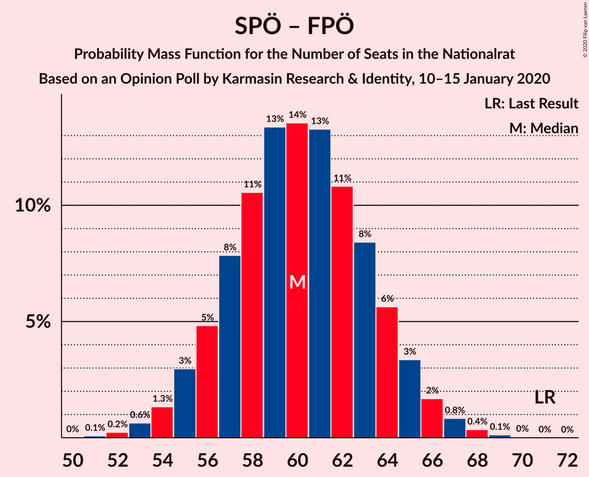

# Opinion Poll by Karmasin Research & Identity, 10 January 2019–15 January 2020

<a href="#voting-intentions">Voting Intentions</a> | <a href="#seats">Seats</a> | <a href="#coalitions">Coalitions</a> | <a href="#technical-information">Technical Information</a>

## Voting Intentions

### Confidence Intervals

| Party | Last Result | Poll Result | 80% Confidence Interval | 90% Confidence Interval | 95% Confidence Interval | 99% Confidence Interval |
|:-----:|:-----------:|:-----------:|:-----------------------:|:-----------------------:|:-----------------------:|:-----------------------:|
| Österreichische Volkspartei | 37.5% | 39.0% | 37.1–41.0% |36.5–41.6% |36.0–42.1% |35.1–43.0% |
| Sozialdemokratische Partei Österreichs | 21.2% | 17.0% | 15.5–18.6% |15.1–19.1% |14.8–19.5% |14.1–20.3% |
| Die Grünen–Die Grüne Alternative | 13.9% | 17.0% | 15.5–18.6% |15.1–19.1% |14.8–19.5% |14.1–20.3% |
| Freiheitliche Partei Österreichs | 16.2% | 15.0% | 13.6–16.5% |13.2–17.0% |12.9–17.4% |12.3–18.1% |
| NEOS–Das Neue Österreich und Liberales Forum | 8.1% | 9.0% | 7.9–10.3% |7.6–10.6% |7.4–10.9% |6.9–11.6% |

*Note:* The poll result column reflects the actual value used in the calculations. Published results may vary slightly, and in addition be rounded to fewer digits.

## Seats

### Confidence Intervals

| Party | Last Result | Median | 80% Confidence Interval | 90% Confidence Interval | 95% Confidence Interval | 99% Confidence Interval |
|:-----:|:-----------:|:------:|:-----------------------:|:-----------------------:|:-----------------------:|:-----------------------:|
| <a href="#österreichische-volkspartei">Österreichische Volkspartei</a> | 71 | 74 | 70–78 |69–79 |68–80 |66–81 |
| <a href="#sozialdemokratische-partei-österreichs">Sozialdemokratische Partei Österreichs</a> | 40 | 32 | 29–35 |28–36 |28–37 |26–38 |
| <a href="#die-grünen–die-grüne-alternative">Die Grünen–Die Grüne Alternative</a> | 26 | 32 | 29–35 |28–36 |28–37 |26–38 |
| <a href="#freiheitliche-partei-österreichs">Freiheitliche Partei Österreichs</a> | 31 | 28 | 25–31 |25–32 |24–33 |23–34 |
| <a href="#neos–das-neue-österreich-und-liberales-forum">NEOS–Das Neue Österreich und Liberales Forum</a> | 15 | 17 | 15–19 |14–20 |13–20 |13–22 |

### Österreichische Volkspartei

*For a full overview of the results for this party, see the [Österreichische Volkspartei](party-österreichischevolkspartei.html) page.*

| Number of Seats | Probability | Accumulated | Special Marks |
|:---------------:|:-----------:|:-----------:|:-------------:|
| 64 | 0.1% | 100% |  |
| 65 | 0.2% | 99.9% |  |
| 66 | 0.5% | 99.7% |  |
| 67 | 1.2% | 99.3% |  |
| 68 | 2% | 98% |  |
| 69 | 5% | 96% |  |
| 70 | 6% | 92% |  |
| 71 | 8% | 85% | Last Result |
| 72 | 12% | 77% |  |
| 73 | 13% | 65% |  |
| 74 | 12% | 53% | Median |
| 75 | 13% | 41% |  |
| 76 | 11% | 28% |  |
| 77 | 6% | 17% |  |
| 78 | 6% | 11% |  |
| 79 | 2% | 5% |  |
| 80 | 2% | 3% |  |
| 81 | 0.8% | 1.3% |  |
| 82 | 0.3% | 0.5% |  |
| 83 | 0.1% | 0.1% |  |
| 84 | 0% | 0% |  |

### Sozialdemokratische Partei Österreichs

*For a full overview of the results for this party, see the [Sozialdemokratische Partei Österreichs](party-sozialdemokratischeparteiösterreichs.html) page.*

| Number of Seats | Probability | Accumulated | Special Marks |
|:---------------:|:-----------:|:-----------:|:-------------:|
| 25 | 0.1% | 100% |  |
| 26 | 0.5% | 99.9% |  |
| 27 | 2% | 99.4% |  |
| 28 | 4% | 98% |  |
| 29 | 8% | 94% |  |
| 30 | 11% | 86% |  |
| 31 | 19% | 75% |  |
| 32 | 18% | 56% | Median |
| 33 | 13% | 38% |  |
| 34 | 12% | 25% |  |
| 35 | 6% | 13% |  |
| 36 | 4% | 6% |  |
| 37 | 2% | 3% |  |
| 38 | 0.6% | 0.9% |  |
| 39 | 0.3% | 0.3% |  |
| 40 | 0.1% | 0.1% | Last Result |
| 41 | 0% | 0% |  |

### Die Grünen–Die Grüne Alternative

*For a full overview of the results for this party, see the [Die Grünen–Die Grüne Alternative](party-diegrünen–diegrünealternative.html) page.*

| Number of Seats | Probability | Accumulated | Special Marks |
|:---------------:|:-----------:|:-----------:|:-------------:|
| 25 | 0.1% | 100% |  |
| 26 | 0.5% | 99.9% | Last Result |
| 27 | 1.5% | 99.4% |  |
| 28 | 4% | 98% |  |
| 29 | 8% | 93% |  |
| 30 | 11% | 86% |  |
| 31 | 16% | 74% |  |
| 32 | 18% | 58% | Median |
| 33 | 16% | 41% |  |
| 34 | 11% | 24% |  |
| 35 | 7% | 13% |  |
| 36 | 4% | 6% |  |
| 37 | 2% | 3% |  |
| 38 | 0.5% | 0.8% |  |
| 39 | 0.2% | 0.3% |  |
| 40 | 0.1% | 0.1% |  |
| 41 | 0% | 0% |  |

### Freiheitliche Partei Österreichs

*For a full overview of the results for this party, see the [Freiheitliche Partei Österreichs](party-freiheitlicheparteiösterreichs.html) page.*

| Number of Seats | Probability | Accumulated | Special Marks |
|:---------------:|:-----------:|:-----------:|:-------------:|
| 21 | 0.1% | 100% |  |
| 22 | 0.3% | 99.9% |  |
| 23 | 1.0% | 99.7% |  |
| 24 | 3% | 98.7% |  |
| 25 | 7% | 96% |  |
| 26 | 12% | 88% |  |
| 27 | 14% | 77% |  |
| 28 | 19% | 62% | Median |
| 29 | 17% | 44% |  |
| 30 | 12% | 27% |  |
| 31 | 8% | 15% | Last Result |
| 32 | 4% | 7% |  |
| 33 | 2% | 3% |  |
| 34 | 0.7% | 0.9% |  |
| 35 | 0.2% | 0.3% |  |
| 36 | 0.1% | 0.1% |  |
| 37 | 0% | 0% |  |

### NEOS–Das Neue Österreich und Liberales Forum

*For a full overview of the results for this party, see the [NEOS–Das Neue Österreich und Liberales Forum](party-neos–dasneueösterreichundliberalesforum.html) page.*

| Number of Seats | Probability | Accumulated | Special Marks |
|:---------------:|:-----------:|:-----------:|:-------------:|
| 11 | 0.1% | 100% |  |
| 12 | 0.4% | 99.9% |  |
| 13 | 2% | 99.5% |  |
| 14 | 7% | 97% |  |
| 15 | 15% | 91% | Last Result |
| 16 | 19% | 76% |  |
| 17 | 22% | 57% | Median |
| 18 | 16% | 35% |  |
| 19 | 11% | 19% |  |
| 20 | 5% | 7% |  |
| 21 | 2% | 2% |  |
| 22 | 0.5% | 0.6% |  |
| 23 | 0.1% | 0.1% |  |
| 24 | 0% | 0% |  |

## Coalitions

### Confidence Intervals

| Coalition | Last Result | Median | Majority? | 80% Confidence Interval | 90% Confidence Interval | 95% Confidence Interval | 99% Confidence Interval |
|:---------:|:-----------:|:------:|:---------:|:-----------------------:|:-----------------------:|:-----------------------:|:-----------------------:|
| Österreichische Volkspartei – Die Grünen–Die Grüne Alternative – NEOS–Das Neue Österreich und Liberales Forum | 112 | 123 | 100% | 119–127 | 118–128 | 116–128 | 114–130 |
| Österreichische Volkspartei – Sozialdemokratische Partei Österreichs | 111 | 107 | 100% | 102–111 | 102–111 | 99–112 | 98–112 |
| Österreichische Volkspartei – Die Grünen–Die Grüne Alternative | 97 | 106 | 100% | 102–110 | 101–111 | 99–111 | 97–114 |
| Österreichische Volkspartei – Freiheitliche Partei Österreichs | 102 | 102 | 99.9% | 98–106 | 97–107 | 96–108 | 93–110 |
| Österreichische Volkspartei – NEOS–Das Neue Österreich und Liberales Forum | 86 | 91 | 39% | 87–95 | 85–96 | 85–97 | 82–98 |
| Die Grünen–Die Grüne Alternative – Sozialdemokratische Partei Österreichs – NEOS–Das Neue Österreich und Liberales Forum | 81 | 81 | 0% | 77–85 | 76–86 | 75–87 | 73–89 |
| Österreichische Volkspartei | 71 | 74 | 0% | 70–78 | 69–79 | 68–80 | 66–81 |
| Die Grünen–Die Grüne Alternative – Sozialdemokratische Partei Österreichs | 66 | 64 | 0% | 60–68 | 59–69 | 58–69 | 57–71 |
| Sozialdemokratische Partei Österreichs – Freiheitliche Partei Österreichs | 71 | 60 | 0% | 56–64 | 55–65 | 55–66 | 53–68 |
| Sozialdemokratische Partei Österreichs | 40 | 32 | 0% | 29–35 | 28–36 | 28–37 | 26–38 |

### Österreichische Volkspartei – Die Grünen–Die Grüne Alternative – NEOS–Das Neue Österreich und Liberales Forum

| Number of Seats | Probability | Accumulated | Special Marks |
|:---------------:|:-----------:|:-----------:|:-------------:|
| 111 | 0% | 100% |  |
| 112 | 0.1% | 99.9% | Last Result |
| 113 | 0.2% | 99.9% |  |
| 114 | 0.4% | 99.7% |  |
| 115 | 1.0% | 99.3% |  |
| 116 | 1.1% | 98% |  |
| 117 | 2% | 97% |  |
| 118 | 5% | 95% |  |
| 119 | 8% | 90% |  |
| 120 | 8% | 82% |  |
| 121 | 7% | 74% |  |
| 122 | 11% | 67% |  |
| 123 | 18% | 55% | Median |
| 124 | 14% | 38% |  |
| 125 | 8% | 24% |  |
| 126 | 6% | 16% |  |
| 127 | 5% | 10% |  |
| 128 | 4% | 5% |  |
| 129 | 0.8% | 2% |  |
| 130 | 0.4% | 0.7% |  |
| 131 | 0.2% | 0.3% |  |
| 132 | 0.1% | 0.1% |  |
| 133 | 0% | 0% |  |

### Österreichische Volkspartei – Sozialdemokratische Partei Österreichs

| Number of Seats | Probability | Accumulated | Special Marks |
|:---------------:|:-----------:|:-----------:|:-------------:|
| 94 | 0% | 100% |  |
| 95 | 0.1% | 99.9% |  |
| 96 | 0% | 99.9% |  |
| 97 | 0.1% | 99.9% |  |
| 98 | 1.4% | 99.7% |  |
| 99 | 2% | 98% |  |
| 100 | 0.4% | 96% |  |
| 101 | 0.4% | 96% |  |
| 102 | 8% | 96% |  |
| 103 | 22% | 87% |  |
| 104 | 5% | 65% |  |
| 105 | 0.3% | 60% |  |
| 106 | 7% | 60% | Median |
| 107 | 32% | 52% |  |
| 108 | 9% | 20% |  |
| 109 | 0.2% | 11% |  |
| 110 | 0.7% | 11% |  |
| 111 | 7% | 10% | Last Result |
| 112 | 3% | 3% |  |
| 113 | 0.1% | 0.3% |  |
| 114 | 0% | 0.2% |  |
| 115 | 0.1% | 0.2% |  |
| 116 | 0.1% | 0.1% |  |
| 117 | 0% | 0% |  |

### Österreichische Volkspartei – Die Grünen–Die Grüne Alternative

| Number of Seats | Probability | Accumulated | Special Marks |
|:---------------:|:-----------:|:-----------:|:-------------:|
| 95 | 0.1% | 100% |  |
| 96 | 0.2% | 99.9% |  |
| 97 | 0.3% | 99.7% | Last Result |
| 98 | 0.7% | 99.4% |  |
| 99 | 1.3% | 98.8% |  |
| 100 | 2% | 97% |  |
| 101 | 5% | 95% |  |
| 102 | 6% | 91% |  |
| 103 | 8% | 84% |  |
| 104 | 10% | 77% |  |
| 105 | 14% | 66% |  |
| 106 | 13% | 53% | Median |
| 107 | 11% | 40% |  |
| 108 | 11% | 28% |  |
| 109 | 5% | 17% |  |
| 110 | 6% | 12% |  |
| 111 | 4% | 6% |  |
| 112 | 1.3% | 2% |  |
| 113 | 0.6% | 1.2% |  |
| 114 | 0.4% | 0.5% |  |
| 115 | 0.1% | 0.1% |  |
| 116 | 0% | 0% |  |

### Österreichische Volkspartei – Freiheitliche Partei Österreichs

| Number of Seats | Probability | Accumulated | Special Marks |
|:---------------:|:-----------:|:-----------:|:-------------:|
| 91 | 0.1% | 100% |  |
| 92 | 0.1% | 99.9% | Majority |
| 93 | 0.3% | 99.8% |  |
| 94 | 0.5% | 99.5% |  |
| 95 | 1.3% | 99.0% |  |
| 96 | 2% | 98% |  |
| 97 | 3% | 95% |  |
| 98 | 5% | 92% |  |
| 99 | 9% | 87% |  |
| 100 | 10% | 78% |  |
| 101 | 12% | 68% |  |
| 102 | 14% | 56% | Last Result, Median |
| 103 | 11% | 42% |  |
| 104 | 11% | 32% |  |
| 105 | 8% | 21% |  |
| 106 | 6% | 12% |  |
| 107 | 3% | 7% |  |
| 108 | 2% | 3% |  |
| 109 | 0.9% | 2% |  |
| 110 | 0.4% | 0.6% |  |
| 111 | 0.2% | 0.2% |  |
| 112 | 0% | 0.1% |  |
| 113 | 0% | 0% |  |

### Österreichische Volkspartei – NEOS–Das Neue Österreich und Liberales Forum

| Number of Seats | Probability | Accumulated | Special Marks |
|:---------------:|:-----------:|:-----------:|:-------------:|
| 80 | 0% | 100% |  |
| 81 | 0.1% | 99.9% |  |
| 82 | 0.5% | 99.8% |  |
| 83 | 0.6% | 99.3% |  |
| 84 | 1.2% | 98.7% |  |
| 85 | 3% | 98% |  |
| 86 | 4% | 94% | Last Result |
| 87 | 8% | 91% |  |
| 88 | 11% | 83% |  |
| 89 | 7% | 72% |  |
| 90 | 9% | 65% |  |
| 91 | 17% | 56% | Median |
| 92 | 14% | 39% | Majority |
| 93 | 8% | 24% |  |
| 94 | 5% | 17% |  |
| 95 | 6% | 11% |  |
| 96 | 3% | 6% |  |
| 97 | 2% | 3% |  |
| 98 | 0.9% | 1.2% |  |
| 99 | 0.2% | 0.3% |  |
| 100 | 0.1% | 0.2% |  |
| 101 | 0.1% | 0.1% |  |
| 102 | 0% | 0% |  |

### Die Grünen–Die Grüne Alternative – Sozialdemokratische Partei Österreichs – NEOS–Das Neue Österreich und Liberales Forum

| Number of Seats | Probability | Accumulated | Special Marks |
|:---------------:|:-----------:|:-----------:|:-------------:|
| 70 | 0% | 100% |  |
| 71 | 0.1% | 99.9% |  |
| 72 | 0.3% | 99.9% |  |
| 73 | 0.6% | 99.6% |  |
| 74 | 1.2% | 99.0% |  |
| 75 | 2% | 98% |  |
| 76 | 4% | 96% |  |
| 77 | 6% | 92% |  |
| 78 | 9% | 85% |  |
| 79 | 12% | 77% |  |
| 80 | 11% | 65% |  |
| 81 | 14% | 54% | Last Result, Median |
| 82 | 11% | 40% |  |
| 83 | 9% | 28% |  |
| 84 | 8% | 19% |  |
| 85 | 5% | 11% |  |
| 86 | 3% | 6% |  |
| 87 | 2% | 3% |  |
| 88 | 0.8% | 1.3% |  |
| 89 | 0.3% | 0.5% |  |
| 90 | 0.1% | 0.2% |  |
| 91 | 0.1% | 0.1% |  |
| 92 | 0% | 0% | Majority |

### Österreichische Volkspartei

| Number of Seats | Probability | Accumulated | Special Marks |
|:---------------:|:-----------:|:-----------:|:-------------:|
| 64 | 0.1% | 100% |  |
| 65 | 0.2% | 99.9% |  |
| 66 | 0.5% | 99.7% |  |
| 67 | 1.2% | 99.3% |  |
| 68 | 2% | 98% |  |
| 69 | 5% | 96% |  |
| 70 | 6% | 92% |  |
| 71 | 8% | 85% | Last Result |
| 72 | 12% | 77% |  |
| 73 | 13% | 65% |  |
| 74 | 12% | 53% | Median |
| 75 | 13% | 41% |  |
| 76 | 11% | 28% |  |
| 77 | 6% | 17% |  |
| 78 | 6% | 11% |  |
| 79 | 2% | 5% |  |
| 80 | 2% | 3% |  |
| 81 | 0.8% | 1.3% |  |
| 82 | 0.3% | 0.5% |  |
| 83 | 0.1% | 0.1% |  |
| 84 | 0% | 0% |  |

### Die Grünen–Die Grüne Alternative – Sozialdemokratische Partei Österreichs

| Number of Seats | Probability | Accumulated | Special Marks |
|:---------------:|:-----------:|:-----------:|:-------------:|
| 55 | 0.1% | 100% |  |
| 56 | 0.3% | 99.8% |  |
| 57 | 0.6% | 99.5% |  |
| 58 | 3% | 98.9% |  |
| 59 | 3% | 96% |  |
| 60 | 7% | 94% |  |
| 61 | 7% | 87% |  |
| 62 | 7% | 80% |  |
| 63 | 19% | 74% |  |
| 64 | 16% | 55% | Median |
| 65 | 12% | 38% |  |
| 66 | 8% | 26% | Last Result |
| 67 | 6% | 18% |  |
| 68 | 5% | 12% |  |
| 69 | 5% | 7% |  |
| 70 | 1.4% | 2% |  |
| 71 | 0.6% | 1.0% |  |
| 72 | 0.2% | 0.4% |  |
| 73 | 0.1% | 0.2% |  |
| 74 | 0.1% | 0.1% |  |
| 75 | 0% | 0% |  |

### Sozialdemokratische Partei Österreichs – Freiheitliche Partei Österreichs

| Number of Seats | Probability | Accumulated | Special Marks |
|:---------------:|:-----------:|:-----------:|:-------------:|
| 51 | 0.1% | 100% |  |
| 52 | 0.3% | 99.9% |  |
| 53 | 0.6% | 99.6% |  |
| 54 | 1.1% | 99.1% |  |
| 55 | 4% | 98% |  |
| 56 | 6% | 94% |  |
| 57 | 7% | 88% |  |
| 58 | 9% | 82% |  |
| 59 | 14% | 73% |  |
| 60 | 18% | 59% | Median |
| 61 | 11% | 41% |  |
| 62 | 7% | 29% |  |
| 63 | 8% | 23% |  |
| 64 | 7% | 14% |  |
| 65 | 4% | 7% |  |
| 66 | 1.3% | 3% |  |
| 67 | 0.7% | 1.5% |  |
| 68 | 0.6% | 0.8% |  |
| 69 | 0.2% | 0.2% |  |
| 70 | 0% | 0% |  |
| 71 | 0% | 0% | Last Result |

### Sozialdemokratische Partei Österreichs

| Number of Seats | Probability | Accumulated | Special Marks |
|:---------------:|:-----------:|:-----------:|:-------------:|
| 25 | 0.1% | 100% |  |
| 26 | 0.5% | 99.9% |  |
| 27 | 2% | 99.4% |  |
| 28 | 4% | 98% |  |
| 29 | 8% | 94% |  |
| 30 | 11% | 86% |  |
| 31 | 19% | 75% |  |
| 32 | 18% | 56% | Median |
| 33 | 13% | 38% |  |
| 34 | 12% | 25% |  |
| 35 | 6% | 13% |  |
| 36 | 4% | 6% |  |
| 37 | 2% | 3% |  |
| 38 | 0.6% | 0.9% |  |
| 39 | 0.3% | 0.3% |  |
| 40 | 0.1% | 0.1% | Last Result |
| 41 | 0% | 0% |  |

## Technical Information

### Opinion Poll

+ **Polling firm:** Karmasin Research & Identity
+ **Commissioner(s):** —
+ **Fieldwork period:** 10 January 2019–15 January 2020

### Calculations

+ **Sample size:** 1000
+ **Simulations done:** 131,072
+ **Error estimate:** 0.69%

