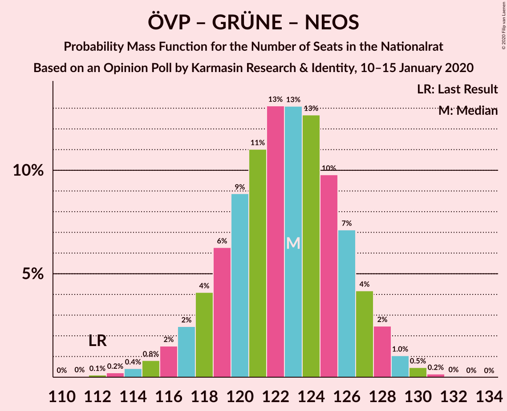

# Opinion Poll by Karmasin Research & Identity, 10 January 2019–15 January 2020

<a href="#voting-intentions">Voting Intentions</a> | <a href="#seats">Seats</a> | <a href="#coalitions">Coalitions</a> | <a href="#technical-information">Technical Information</a>

## Voting Intentions

### Confidence Intervals

| Party | Last Result | Poll Result | 80% Confidence Interval | 90% Confidence Interval | 95% Confidence Interval | 99% Confidence Interval |
|:-----:|:-----------:|:-----------:|:-----------------------:|:-----------------------:|:-----------------------:|:-----------------------:|
| Österreichische Volkspartei | 37.5% | 39.0% | 37.1–41.0% |36.5–41.6% |36.0–42.1% |35.1–43.0% |
| Sozialdemokratische Partei Österreichs | 21.2% | 17.0% | 15.5–18.6% |15.1–19.1% |14.8–19.5% |14.1–20.3% |
| Die Grünen–Die Grüne Alternative | 13.9% | 17.0% | 15.5–18.6% |15.1–19.1% |14.8–19.5% |14.1–20.3% |
| Freiheitliche Partei Österreichs | 16.2% | 15.0% | 13.6–16.5% |13.2–17.0% |12.9–17.4% |12.3–18.1% |
| NEOS–Das Neue Österreich und Liberales Forum | 8.1% | 9.0% | 7.9–10.3% |7.6–10.6% |7.4–10.9% |6.9–11.6% |

*Note:* The poll result column reflects the actual value used in the calculations. Published results may vary slightly, and in addition be rounded to fewer digits.

## Seats

### Confidence Intervals

| Party | Last Result | Median | 80% Confidence Interval | 90% Confidence Interval | 95% Confidence Interval | 99% Confidence Interval |
|:-----:|:-----------:|:------:|:-----------------------:|:-----------------------:|:-----------------------:|:-----------------------:|
| <a href="#österreichische-volkspartei">Österreichische Volkspartei</a> | 71 | 77 | 72–78 |72–79 |71–79 |71–79 |
| <a href="#sozialdemokratische-partei-österreichs">Sozialdemokratische Partei Österreichs</a> | 40 | 34 | 28–34 |28–34 |28–36 |27–40 |
| <a href="#die-grünen–die-grüne-alternative">Die Grünen–Die Grüne Alternative</a> | 26 | 29 | 29–33 |29–33 |28–33 |27–33 |
| <a href="#freiheitliche-partei-österreichs">Freiheitliche Partei Österreichs</a> | 31 | 28 | 24–31 |24–31 |24–35 |24–35 |
| <a href="#neos–das-neue-österreich-und-liberales-forum">NEOS–Das Neue Österreich und Liberales Forum</a> | 15 | 15 | 15–20 |15–20 |15–20 |12–21 |

### Österreichische Volkspartei

*For a full overview of the results for this party, see the [Österreichische Volkspartei](party-österreichischevolkspartei.html) page.*

| Number of Seats | Probability | Accumulated | Special Marks |
|:---------------:|:-----------:|:-----------:|:-------------:|
| 68 | 0.1% | 100% |  |
| 69 | 0.3% | 99.9% |  |
| 70 | 0.1% | 99.6% |  |
| 71 | 4% | 99.5% | Last Result |
| 72 | 10% | 95% |  |
| 73 | 0.8% | 85% |  |
| 74 | 0% | 84% |  |
| 75 | 1.0% | 84% |  |
| 76 | 2% | 83% |  |
| 77 | 49% | 81% | Median |
| 78 | 23% | 32% |  |
| 79 | 9% | 9% |  |
| 80 | 0% | 0% |  |

### Sozialdemokratische Partei Österreichs

*For a full overview of the results for this party, see the [Sozialdemokratische Partei Österreichs](party-sozialdemokratischeparteiösterreichs.html) page.*

| Number of Seats | Probability | Accumulated | Special Marks |
|:---------------:|:-----------:|:-----------:|:-------------:|
| 26 | 0.1% | 100% |  |
| 27 | 0.6% | 99.9% |  |
| 28 | 25% | 99.3% |  |
| 29 | 8% | 75% |  |
| 30 | 3% | 67% |  |
| 31 | 11% | 64% |  |
| 32 | 0.2% | 53% |  |
| 33 | 1.1% | 53% |  |
| 34 | 49% | 52% | Median |
| 35 | 0% | 3% |  |
| 36 | 2% | 3% |  |
| 37 | 0% | 1.2% |  |
| 38 | 0.1% | 1.1% |  |
| 39 | 0.1% | 1.0% |  |
| 40 | 0.9% | 0.9% | Last Result |
| 41 | 0% | 0% |  |

### Die Grünen–Die Grüne Alternative

*For a full overview of the results for this party, see the [Die Grünen–Die Grüne Alternative](party-diegrünen–diegrünealternative.html) page.*

| Number of Seats | Probability | Accumulated | Special Marks |
|:---------------:|:-----------:|:-----------:|:-------------:|
| 26 | 0.1% | 100% | Last Result |
| 27 | 0.8% | 99.9% |  |
| 28 | 2% | 99.1% |  |
| 29 | 59% | 97% | Median |
| 30 | 4% | 37% |  |
| 31 | 1.0% | 33% |  |
| 32 | 12% | 32% |  |
| 33 | 20% | 20% |  |
| 34 | 0% | 0% |  |

### Freiheitliche Partei Österreichs

*For a full overview of the results for this party, see the [Freiheitliche Partei Österreichs](party-freiheitlicheparteiösterreichs.html) page.*

| Number of Seats | Probability | Accumulated | Special Marks |
|:---------------:|:-----------:|:-----------:|:-------------:|
| 23 | 0.4% | 100% |  |
| 24 | 10% | 99.6% |  |
| 25 | 0.1% | 90% |  |
| 26 | 1.1% | 90% |  |
| 27 | 1.3% | 88% |  |
| 28 | 69% | 87% | Median |
| 29 | 4% | 19% |  |
| 30 | 0% | 14% |  |
| 31 | 11% | 14% | Last Result |
| 32 | 0.5% | 3% |  |
| 33 | 0% | 3% |  |
| 34 | 0.2% | 3% |  |
| 35 | 3% | 3% |  |
| 36 | 0% | 0% |  |

### NEOS–Das Neue Österreich und Liberales Forum

*For a full overview of the results for this party, see the [NEOS–Das Neue Österreich und Liberales Forum](party-neos–dasneueösterreichundliberalesforum.html) page.*

| Number of Seats | Probability | Accumulated | Special Marks |
|:---------------:|:-----------:|:-----------:|:-------------:|
| 12 | 0.6% | 100% |  |
| 13 | 0% | 99.4% |  |
| 14 | 0% | 99.4% |  |
| 15 | 52% | 99.4% | Last Result, Median |
| 16 | 24% | 48% |  |
| 17 | 3% | 24% |  |
| 18 | 0.5% | 22% |  |
| 19 | 10% | 21% |  |
| 20 | 10% | 11% |  |
| 21 | 1.0% | 1.2% |  |
| 22 | 0% | 0.2% |  |
| 23 | 0% | 0.2% |  |
| 24 | 0.2% | 0.2% |  |
| 25 | 0% | 0% |  |

## Coalitions

### Confidence Intervals

| Coalition | Last Result | Median | Majority? | 80% Confidence Interval | 90% Confidence Interval | 95% Confidence Interval | 99% Confidence Interval |
|:---------:|:-----------:|:------:|:---------:|:-----------------------:|:-----------------------:|:-----------------------:|:-----------------------:|
| Österreichische Volkspartei – Die Grünen–Die Grüne Alternative – NEOS–Das Neue Österreich und Liberales Forum | 112 | 121 | 100% | 121–127 | 118–130 | 118–130 | 115–130 |
| Österreichische Volkspartei – Sozialdemokratische Partei Österreichs | 111 | 111 | 100% | 103–111 | 102–111 | 101–112 | 101–112 |
| Österreichische Volkspartei – Die Grünen–Die Grüne Alternative | 97 | 106 | 100% | 101–111 | 101–111 | 101–111 | 99–112 |
| Österreichische Volkspartei – Freiheitliche Partei Österreichs | 102 | 105 | 100% | 103–106 | 102–107 | 100–107 | 98–108 |
| Österreichische Volkspartei – NEOS–Das Neue Österreich und Liberales Forum | 86 | 92 | 93% | 92–95 | 89–98 | 88–98 | 87–98 |
| Die Grünen–Die Grüne Alternative – Sozialdemokratische Partei Österreichs – NEOS–Das Neue Österreich und Liberales Forum | 81 | 78 | 0% | 77–80 | 76–81 | 76–83 | 73–85 |
| Österreichische Volkspartei | 71 | 77 | 0% | 72–78 | 72–79 | 71–79 | 71–79 |
| Sozialdemokratische Partei Österreichs – Freiheitliche Partei Österreichs | 71 | 62 | 0% | 56–62 | 53–62 | 53–65 | 53–66 |
| Die Grünen–Die Grüne Alternative – Sozialdemokratische Partei Österreichs | 66 | 63 | 0% | 60–63 | 60–63 | 60–64 | 58–70 |
| Sozialdemokratische Partei Österreichs | 40 | 34 | 0% | 28–34 | 28–34 | 28–36 | 27–40 |

### Österreichische Volkspartei – Die Grünen–Die Grüne Alternative – NEOS–Das Neue Österreich und Liberales Forum

| Number of Seats | Probability | Accumulated | Special Marks |
|:---------------:|:-----------:|:-----------:|:-------------:|
| 112 | 0% | 100% | Last Result |
| 113 | 0.4% | 100% |  |
| 114 | 0% | 99.6% |  |
| 115 | 0.7% | 99.5% |  |
| 116 | 0.1% | 98.8% |  |
| 117 | 0.9% | 98.7% |  |
| 118 | 3% | 98% |  |
| 119 | 0% | 95% |  |
| 120 | 0% | 95% |  |
| 121 | 60% | 95% | Median |
| 122 | 0% | 35% |  |
| 123 | 2% | 35% |  |
| 124 | 0.4% | 33% |  |
| 125 | 0.2% | 32% |  |
| 126 | 4% | 32% |  |
| 127 | 20% | 28% |  |
| 128 | 0% | 8% |  |
| 129 | 0% | 8% |  |
| 130 | 8% | 8% |  |
| 131 | 0% | 0% |  |

### Österreichische Volkspartei – Sozialdemokratische Partei Österreichs

| Number of Seats | Probability | Accumulated | Special Marks |
|:---------------:|:-----------:|:-----------:|:-------------:|
| 98 | 0.2% | 100% |  |
| 99 | 0% | 99.7% |  |
| 100 | 0% | 99.7% |  |
| 101 | 3% | 99.7% |  |
| 102 | 2% | 97% |  |
| 103 | 9% | 95% |  |
| 104 | 0.2% | 85% |  |
| 105 | 0.1% | 85% |  |
| 106 | 24% | 85% |  |
| 107 | 1.0% | 61% |  |
| 108 | 8% | 60% |  |
| 109 | 0.1% | 52% |  |
| 110 | 0.4% | 52% |  |
| 111 | 49% | 51% | Last Result, Median |
| 112 | 3% | 3% |  |
| 113 | 0% | 0% |  |

### Österreichische Volkspartei – Die Grünen–Die Grüne Alternative

| Number of Seats | Probability | Accumulated | Special Marks |
|:---------------:|:-----------:|:-----------:|:-------------:|
| 96 | 0.2% | 100% |  |
| 97 | 0.2% | 99.8% | Last Result |
| 98 | 0.1% | 99.6% |  |
| 99 | 0% | 99.5% |  |
| 100 | 2% | 99.5% |  |
| 101 | 13% | 98% |  |
| 102 | 1.0% | 85% |  |
| 103 | 0% | 84% |  |
| 104 | 2% | 84% |  |
| 105 | 0.1% | 82% |  |
| 106 | 50% | 82% | Median |
| 107 | 0% | 32% |  |
| 108 | 0% | 32% |  |
| 109 | 0% | 32% |  |
| 110 | 4% | 32% |  |
| 111 | 27% | 28% |  |
| 112 | 0.8% | 0.8% |  |
| 113 | 0% | 0% |  |

### Österreichische Volkspartei – Freiheitliche Partei Österreichs

| Number of Seats | Probability | Accumulated | Special Marks |
|:---------------:|:-----------:|:-----------:|:-------------:|
| 94 | 0.1% | 100% |  |
| 95 | 0% | 99.9% |  |
| 96 | 0.1% | 99.9% |  |
| 97 | 0.1% | 99.8% |  |
| 98 | 1.5% | 99.7% |  |
| 99 | 0% | 98% |  |
| 100 | 3% | 98% |  |
| 101 | 0% | 95% |  |
| 102 | 3% | 95% | Last Result |
| 103 | 17% | 93% |  |
| 104 | 0.1% | 76% |  |
| 105 | 49% | 76% | Median |
| 106 | 22% | 27% |  |
| 107 | 5% | 5% |  |
| 108 | 0.1% | 0.5% |  |
| 109 | 0.4% | 0.5% |  |
| 110 | 0% | 0% |  |

### Österreichische Volkspartei – NEOS–Das Neue Österreich und Liberales Forum

| Number of Seats | Probability | Accumulated | Special Marks |
|:---------------:|:-----------:|:-----------:|:-------------:|
| 83 | 0.1% | 100% |  |
| 84 | 0.1% | 99.9% |  |
| 85 | 0.1% | 99.8% |  |
| 86 | 0% | 99.6% | Last Result |
| 87 | 1.0% | 99.6% |  |
| 88 | 3% | 98.6% |  |
| 89 | 0.4% | 95% |  |
| 90 | 0.7% | 95% |  |
| 91 | 0.9% | 94% |  |
| 92 | 59% | 93% | Median, Majority |
| 93 | 0.4% | 35% |  |
| 94 | 24% | 34% |  |
| 95 | 2% | 10% |  |
| 96 | 0.2% | 8% |  |
| 97 | 0.1% | 8% |  |
| 98 | 8% | 8% |  |
| 99 | 0% | 0% |  |

### Die Grünen–Die Grüne Alternative – Sozialdemokratische Partei Österreichs – NEOS–Das Neue Österreich und Liberales Forum

| Number of Seats | Probability | Accumulated | Special Marks |
|:---------------:|:-----------:|:-----------:|:-------------:|
| 71 | 0.1% | 100% |  |
| 72 | 0.1% | 99.9% |  |
| 73 | 0.7% | 99.9% |  |
| 74 | 0.5% | 99.2% |  |
| 75 | 0.7% | 98.7% |  |
| 76 | 5% | 98% |  |
| 77 | 22% | 93% |  |
| 78 | 49% | 71% | Median |
| 79 | 0.1% | 22% |  |
| 80 | 17% | 22% |  |
| 81 | 2% | 5% | Last Result |
| 82 | 0.1% | 3% |  |
| 83 | 2% | 3% |  |
| 84 | 0% | 1.1% |  |
| 85 | 1.1% | 1.1% |  |
| 86 | 0% | 0% |  |

### Österreichische Volkspartei

| Number of Seats | Probability | Accumulated | Special Marks |
|:---------------:|:-----------:|:-----------:|:-------------:|
| 68 | 0.1% | 100% |  |
| 69 | 0.3% | 99.9% |  |
| 70 | 0.1% | 99.6% |  |
| 71 | 4% | 99.5% | Last Result |
| 72 | 10% | 95% |  |
| 73 | 0.8% | 85% |  |
| 74 | 0% | 84% |  |
| 75 | 1.0% | 84% |  |
| 76 | 2% | 83% |  |
| 77 | 49% | 81% | Median |
| 78 | 23% | 32% |  |
| 79 | 9% | 9% |  |
| 80 | 0% | 0% |  |

### Sozialdemokratische Partei Österreichs – Freiheitliche Partei Österreichs

| Number of Seats | Probability | Accumulated | Special Marks |
|:---------------:|:-----------:|:-----------:|:-------------:|
| 51 | 0.4% | 100% |  |
| 52 | 0% | 99.6% |  |
| 53 | 8% | 99.6% |  |
| 54 | 0.6% | 92% |  |
| 55 | 0% | 91% |  |
| 56 | 20% | 91% |  |
| 57 | 4% | 71% |  |
| 58 | 0.2% | 67% |  |
| 59 | 0.2% | 67% |  |
| 60 | 3% | 67% |  |
| 61 | 0% | 64% |  |
| 62 | 60% | 64% | Median |
| 63 | 0.3% | 4% |  |
| 64 | 0% | 4% |  |
| 65 | 3% | 4% |  |
| 66 | 0.9% | 1.1% |  |
| 67 | 0% | 0.2% |  |
| 68 | 0% | 0.1% |  |
| 69 | 0% | 0.1% |  |
| 70 | 0.1% | 0.1% |  |
| 71 | 0% | 0% | Last Result |

### Die Grünen–Die Grüne Alternative – Sozialdemokratische Partei Österreichs

| Number of Seats | Probability | Accumulated | Special Marks |
|:---------------:|:-----------:|:-----------:|:-------------:|
| 55 | 0% | 100% |  |
| 56 | 0% | 99.9% |  |
| 57 | 0.2% | 99.9% |  |
| 58 | 0.7% | 99.7% |  |
| 59 | 0.4% | 99.0% |  |
| 60 | 17% | 98.6% |  |
| 61 | 29% | 81% |  |
| 62 | 0.5% | 52% |  |
| 63 | 49% | 52% | Median |
| 64 | 2% | 3% |  |
| 65 | 0% | 1.2% |  |
| 66 | 0% | 1.1% | Last Result |
| 67 | 0.1% | 1.1% |  |
| 68 | 0% | 1.0% |  |
| 69 | 0.1% | 1.0% |  |
| 70 | 0.9% | 0.9% |  |
| 71 | 0% | 0% |  |

### Sozialdemokratische Partei Österreichs

| Number of Seats | Probability | Accumulated | Special Marks |
|:---------------:|:-----------:|:-----------:|:-------------:|
| 26 | 0.1% | 100% |  |
| 27 | 0.6% | 99.9% |  |
| 28 | 25% | 99.3% |  |
| 29 | 8% | 75% |  |
| 30 | 3% | 67% |  |
| 31 | 11% | 64% |  |
| 32 | 0.2% | 53% |  |
| 33 | 1.1% | 53% |  |
| 34 | 49% | 52% | Median |
| 35 | 0% | 3% |  |
| 36 | 2% | 3% |  |
| 37 | 0% | 1.2% |  |
| 38 | 0.1% | 1.1% |  |
| 39 | 0.1% | 1.0% |  |
| 40 | 0.9% | 0.9% | Last Result |
| 41 | 0% | 0% |  |

## Technical Information

### Opinion Poll

+ **Polling firm:** Karmasin Research & Identity
+ **Commissioner(s):** —
+ **Fieldwork period:** 10 January 2019–15 January 2020

### Calculations

+ **Sample size:** 1000
+ **Simulations done:** 1,024
+ **Error estimate:** 3.35%

