# Opinion Poll by Research Affairs for ÖSTERREICH, 10–16 January 2020

<a href="#voting-intentions">Voting Intentions</a> | <a href="#seats">Seats</a> | <a href="#coalitions">Coalitions</a> | <a href="#technical-information">Technical Information</a>

## Voting Intentions

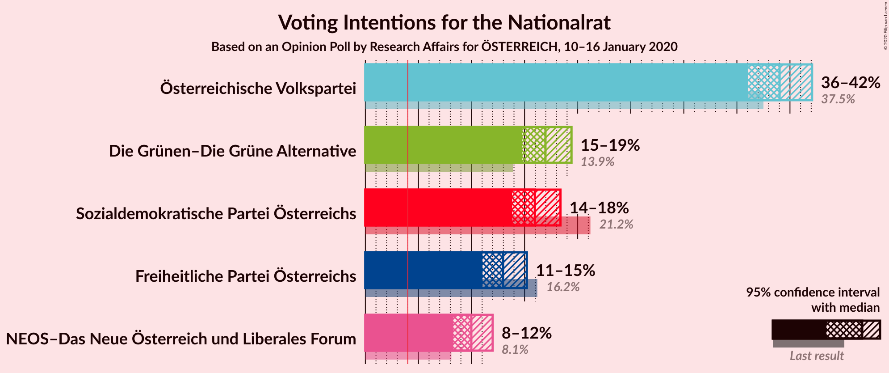

### Confidence Intervals

| Party | Last Result | Poll Result | 80% Confidence Interval | 90% Confidence Interval | 95% Confidence Interval | 99% Confidence Interval |
|:-----:|:-----------:|:-----------:|:-----------------------:|:-----------------------:|:-----------------------:|:-----------------------:|
| Österreichische Volkspartei | 37.5% | 39.0% | 37.1–41.0% |36.5–41.6% |36.0–42.1% |35.1–43.1% |
| Die Grünen–Die Grüne Alternative | 13.9% | 17.0% | 15.5–18.6% |15.1–19.0% |14.8–19.4% |14.1–20.2% |
| Sozialdemokratische Partei Österreichs | 21.2% | 16.0% | 14.6–17.5% |14.2–18.0% |13.8–18.4% |13.2–19.1% |
| Freiheitliche Partei Österreichs | 16.2% | 13.0% | 11.7–14.4% |11.3–14.8% |11.0–15.2% |10.4–15.9% |
| NEOS–Das Neue Österreich und Liberales Forum | 8.1% | 10.0% | 8.9–11.3% |8.5–11.7% |8.3–12.0% |7.8–12.7% |

*Note:* The poll result column reflects the actual value used in the calculations. Published results may vary slightly, and in addition be rounded to fewer digits.

## Seats

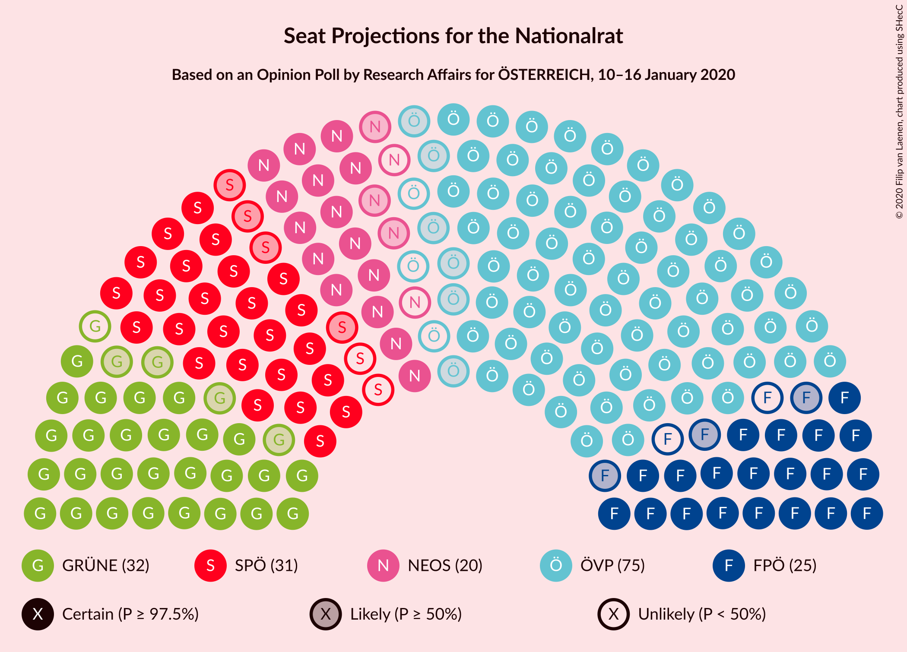

### Confidence Intervals

| Party | Last Result | Median | 80% Confidence Interval | 90% Confidence Interval | 95% Confidence Interval | 99% Confidence Interval |
|:-----:|:-----------:|:------:|:-----------------------:|:-----------------------:|:-----------------------:|:-----------------------:|
| <a href="#österreichische-volkspartei">Österreichische Volkspartei</a> | 71 | 72 | 68–76 |67–77 |66–78 |65–80 |
| <a href="#die-grünen–die-grüne-alternative">Die Grünen–Die Grüne Alternative</a> | 26 | 31 | 28–34 |28–35 |27–36 |26–37 |
| <a href="#sozialdemokratische-partei-österreichs">Sozialdemokratische Partei Österreichs</a> | 40 | 29 | 27–32 |26–33 |25–34 |24–35 |
| <a href="#freiheitliche-partei-österreichs">Freiheitliche Partei Österreichs</a> | 31 | 24 | 21–26 |21–27 |20–28 |19–29 |
| <a href="#neos–das-neue-österreich-und-liberales-forum">NEOS–Das Neue Österreich und Liberales Forum</a> | 15 | 18 | 16–20 |15–21 |15–22 |14–23 |

### Österreichische Volkspartei

*For a full overview of the results for this party, see the [Österreichische Volkspartei](party-österreichischevolkspartei.html) page.*

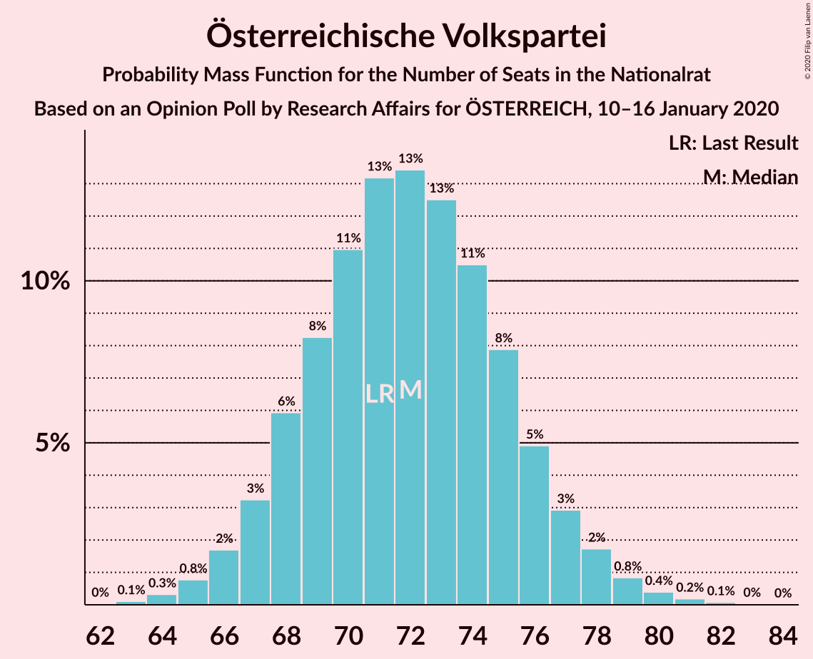

| Number of Seats | Probability | Accumulated | Special Marks |
|:---------------:|:-----------:|:-----------:|:-------------:|
| 63 | 0.1% | 100% |  |
| 64 | 0.3% | 99.8% |  |
| 65 | 0.8% | 99.5% |  |
| 66 | 2% | 98.7% |  |
| 67 | 3% | 97% |  |
| 68 | 6% | 94% |  |
| 69 | 8% | 88% |  |
| 70 | 11% | 80% |  |
| 71 | 13% | 69% | Last Result |
| 72 | 13% | 55% | Median |
| 73 | 13% | 42% |  |
| 74 | 11% | 30% |  |
| 75 | 8% | 19% |  |
| 76 | 5% | 11% |  |
| 77 | 3% | 6% |  |
| 78 | 2% | 3% |  |
| 79 | 0.8% | 2% |  |
| 80 | 0.4% | 0.7% |  |
| 81 | 0.2% | 0.3% |  |
| 82 | 0.1% | 0.1% |  |
| 83 | 0% | 0% |  |

### Die Grünen–Die Grüne Alternative

*For a full overview of the results for this party, see the [Die Grünen–Die Grüne Alternative](party-diegrünen–diegrünealternative.html) page.*

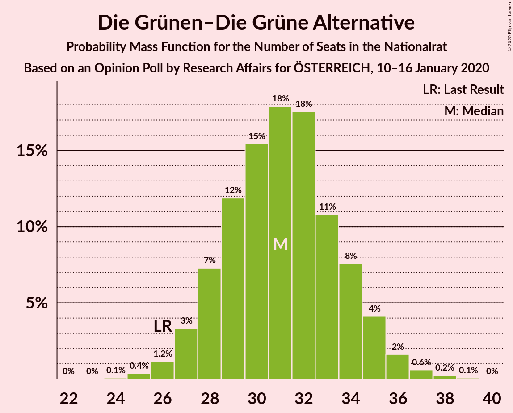

| Number of Seats | Probability | Accumulated | Special Marks |
|:---------------:|:-----------:|:-----------:|:-------------:|
| 24 | 0.1% | 100% |  |
| 25 | 0.3% | 99.9% |  |
| 26 | 1.2% | 99.6% | Last Result |
| 27 | 3% | 98% |  |
| 28 | 7% | 95% |  |
| 29 | 12% | 88% |  |
| 30 | 16% | 76% |  |
| 31 | 18% | 60% | Median |
| 32 | 16% | 42% |  |
| 33 | 12% | 26% |  |
| 34 | 7% | 14% |  |
| 35 | 4% | 7% |  |
| 36 | 2% | 3% |  |
| 37 | 0.7% | 1.0% |  |
| 38 | 0.2% | 0.3% |  |
| 39 | 0.1% | 0.1% |  |
| 40 | 0% | 0% |  |

### Sozialdemokratische Partei Österreichs

*For a full overview of the results for this party, see the [Sozialdemokratische Partei Österreichs](party-sozialdemokratischeparteiösterreichs.html) page.*

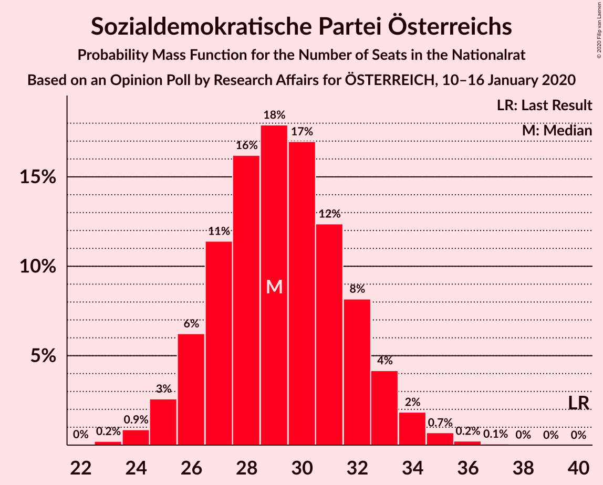

| Number of Seats | Probability | Accumulated | Special Marks |
|:---------------:|:-----------:|:-----------:|:-------------:|
| 23 | 0.2% | 100% |  |
| 24 | 0.9% | 99.7% |  |
| 25 | 3% | 98.9% |  |
| 26 | 6% | 96% |  |
| 27 | 11% | 90% |  |
| 28 | 16% | 79% |  |
| 29 | 18% | 62% | Median |
| 30 | 17% | 45% |  |
| 31 | 12% | 28% |  |
| 32 | 8% | 15% |  |
| 33 | 4% | 7% |  |
| 34 | 2% | 3% |  |
| 35 | 0.7% | 1.0% |  |
| 36 | 0.2% | 0.3% |  |
| 37 | 0.1% | 0.1% |  |
| 38 | 0% | 0% |  |
| 39 | 0% | 0% |  |
| 40 | 0% | 0% | Last Result |

### Freiheitliche Partei Österreichs

*For a full overview of the results for this party, see the [Freiheitliche Partei Österreichs](party-freiheitlicheparteiösterreichs.html) page.*

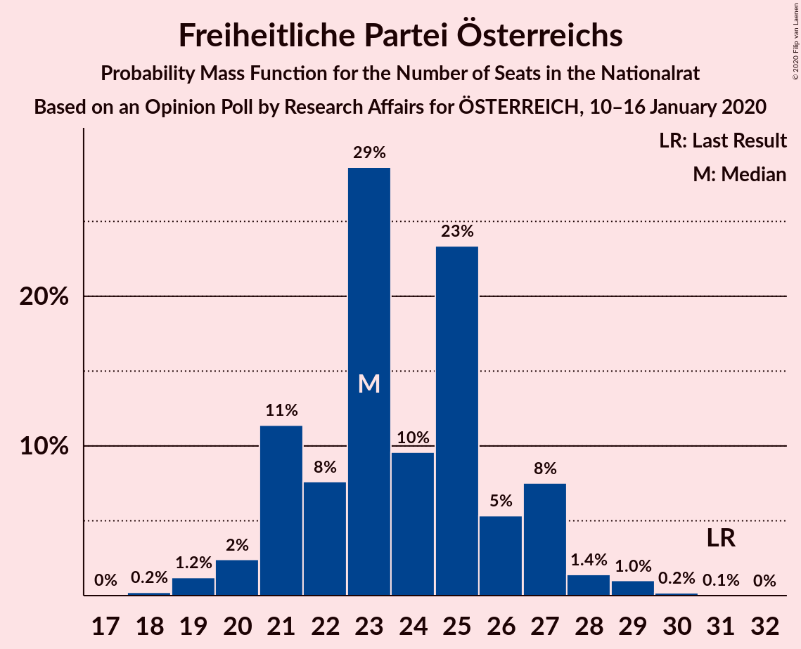

| Number of Seats | Probability | Accumulated | Special Marks |
|:---------------:|:-----------:|:-----------:|:-------------:|
| 18 | 0.2% | 100% |  |
| 19 | 1.0% | 99.7% |  |
| 20 | 4% | 98.7% |  |
| 21 | 8% | 95% |  |
| 22 | 15% | 87% |  |
| 23 | 19% | 72% |  |
| 24 | 20% | 53% | Median |
| 25 | 15% | 33% |  |
| 26 | 10% | 18% |  |
| 27 | 5% | 8% |  |
| 28 | 2% | 3% |  |
| 29 | 0.8% | 1.1% |  |
| 30 | 0.2% | 0.3% |  |
| 31 | 0.1% | 0.1% | Last Result |
| 32 | 0% | 0% |  |

### NEOS–Das Neue Österreich und Liberales Forum

*For a full overview of the results for this party, see the [NEOS–Das Neue Österreich und Liberales Forum](party-neos–dasneueösterreichundliberalesforum.html) page.*

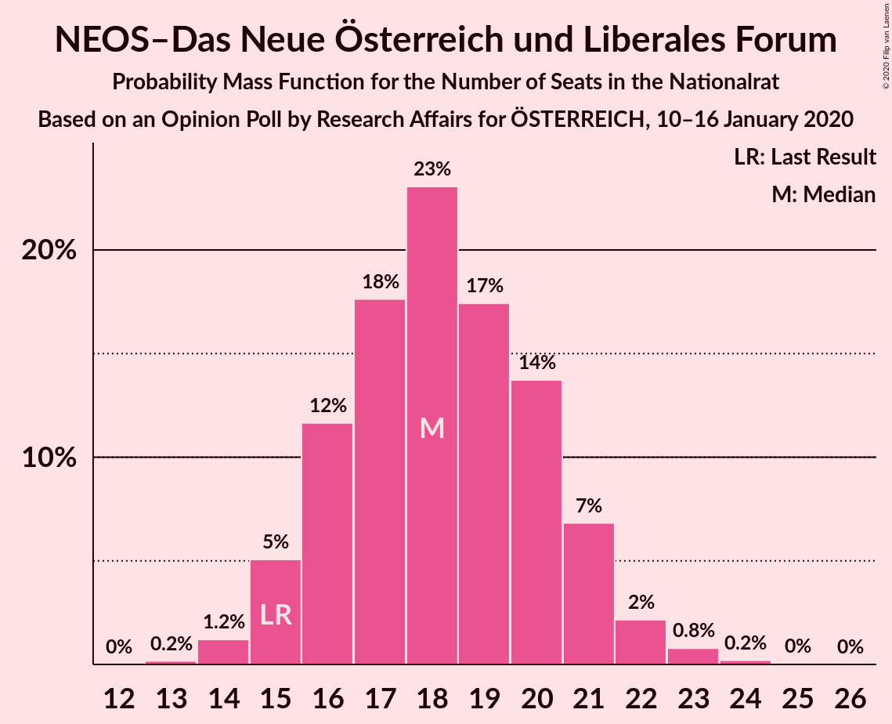

| Number of Seats | Probability | Accumulated | Special Marks |
|:---------------:|:-----------:|:-----------:|:-------------:|
| 13 | 0.2% | 100% |  |
| 14 | 1.2% | 99.8% |  |
| 15 | 5% | 98.5% | Last Result |
| 16 | 11% | 94% |  |
| 17 | 19% | 83% |  |
| 18 | 22% | 64% | Median |
| 19 | 19% | 41% |  |
| 20 | 13% | 22% |  |
| 21 | 6% | 10% |  |
| 22 | 2% | 3% |  |
| 23 | 0.8% | 1.0% |  |
| 24 | 0.2% | 0.2% |  |
| 25 | 0% | 0.1% |  |
| 26 | 0% | 0% |  |

## Coalitions

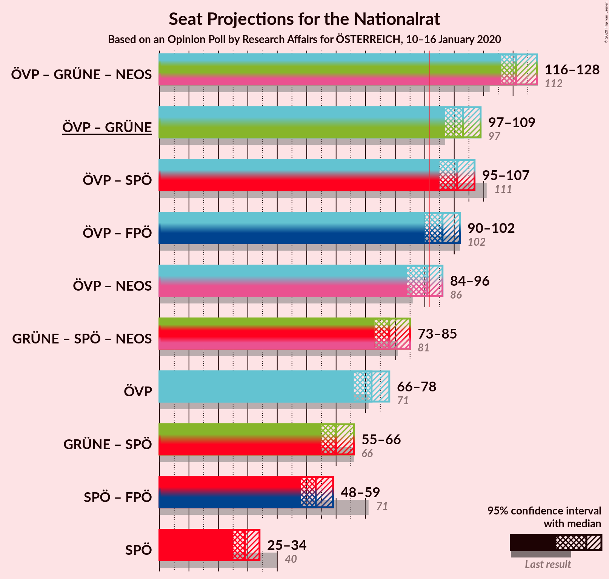

### Confidence Intervals

| Coalition | Last Result | Median | Majority? | 80% Confidence Interval | 90% Confidence Interval | 95% Confidence Interval | 99% Confidence Interval |
|:---------:|:-----------:|:------:|:---------:|:-----------------------:|:-----------------------:|:-----------------------:|:-----------------------:|
| Österreichische Volkspartei – Die Grünen–Die Grüne Alternative – NEOS–Das Neue Österreich und Liberales Forum | 112 | 121 | 100% | 117–125 | 116–126 | 116–128 | 114–130 |
| Österreichische Volkspartei – Die Grünen–Die Grüne Alternative | 97 | 103 | 100% | 99–107 | 98–108 | 97–109 | 95–112 |
| Österreichische Volkspartei – Sozialdemokratische Partei Österreichs | 111 | 101 | 99.9% | 97–105 | 96–106 | 95–107 | 94–110 |
| Österreichische Volkspartei – Freiheitliche Partei Österreichs | 102 | 96 | 92% | 92–100 | 91–101 | 90–102 | 88–104 |
| Österreichische Volkspartei – NEOS–Das Neue Österreich und Liberales Forum | 86 | 90 | 32% | 86–94 | 85–95 | 84–96 | 82–99 |
| Die Grünen–Die Grüne Alternative – Sozialdemokratische Partei Österreichs – NEOS–Das Neue Österreich und Liberales Forum | 81 | 78 | 0% | 75–82 | 74–84 | 73–85 | 71–87 |
| Österreichische Volkspartei | 71 | 72 | 0% | 68–76 | 67–77 | 66–78 | 65–80 |
| Die Grünen–Die Grüne Alternative – Sozialdemokratische Partei Österreichs | 66 | 60 | 0% | 57–64 | 56–65 | 55–66 | 53–68 |
| Sozialdemokratische Partei Österreichs – Freiheitliche Partei Österreichs | 71 | 53 | 0% | 50–56 | 49–57 | 48–58 | 46–60 |
| Sozialdemokratische Partei Österreichs | 40 | 29 | 0% | 27–32 | 26–33 | 25–34 | 24–35 |

### Österreichische Volkspartei – Die Grünen–Die Grüne Alternative – NEOS–Das Neue Österreich und Liberales Forum

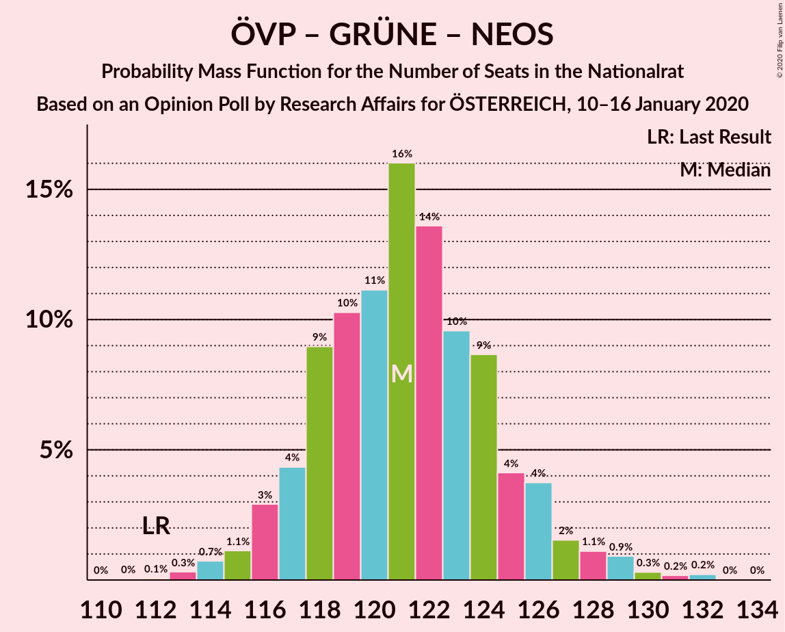

| Number of Seats | Probability | Accumulated | Special Marks |
|:---------------:|:-----------:|:-----------:|:-------------:|
| 112 | 0.1% | 100% | Last Result |
| 113 | 0.3% | 99.9% |  |
| 114 | 0.6% | 99.6% |  |
| 115 | 1.4% | 99.0% |  |
| 116 | 3% | 98% |  |
| 117 | 5% | 95% |  |
| 118 | 7% | 90% |  |
| 119 | 11% | 82% |  |
| 120 | 12% | 71% |  |
| 121 | 14% | 59% | Median |
| 122 | 13% | 45% |  |
| 123 | 11% | 31% |  |
| 124 | 8% | 21% |  |
| 125 | 5% | 13% |  |
| 126 | 3% | 8% |  |
| 127 | 2% | 4% |  |
| 128 | 1.0% | 3% |  |
| 129 | 0.7% | 2% |  |
| 130 | 0.4% | 0.9% |  |
| 131 | 0.2% | 0.5% |  |
| 132 | 0.1% | 0.3% |  |
| 133 | 0.1% | 0.1% |  |
| 134 | 0% | 0% |  |

### Österreichische Volkspartei – Die Grünen–Die Grüne Alternative

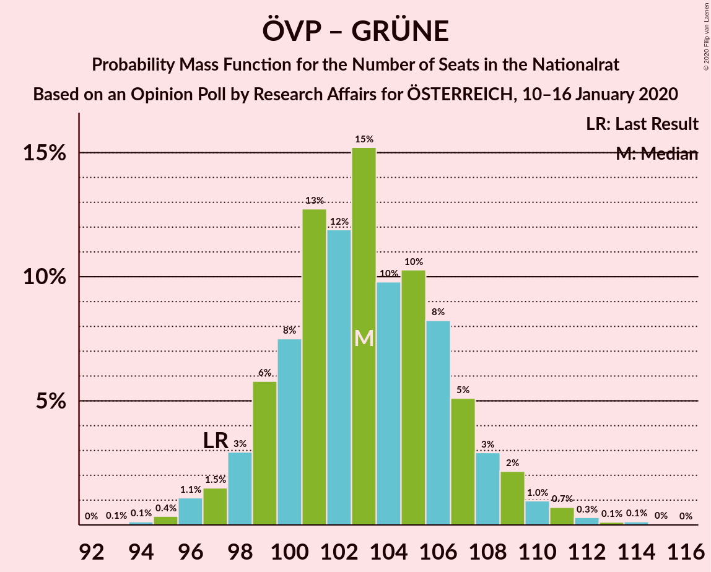

| Number of Seats | Probability | Accumulated | Special Marks |
|:---------------:|:-----------:|:-----------:|:-------------:|
| 93 | 0.1% | 100% |  |
| 94 | 0.1% | 99.9% |  |
| 95 | 0.4% | 99.8% |  |
| 96 | 0.9% | 99.4% |  |
| 97 | 2% | 98.5% | Last Result |
| 98 | 3% | 97% |  |
| 99 | 6% | 93% |  |
| 100 | 8% | 88% |  |
| 101 | 11% | 80% |  |
| 102 | 13% | 69% |  |
| 103 | 14% | 57% | Median |
| 104 | 12% | 43% |  |
| 105 | 10% | 31% |  |
| 106 | 8% | 21% |  |
| 107 | 5% | 13% |  |
| 108 | 3% | 7% |  |
| 109 | 2% | 4% |  |
| 110 | 1.1% | 2% |  |
| 111 | 0.6% | 1.2% |  |
| 112 | 0.3% | 0.6% |  |
| 113 | 0.2% | 0.3% |  |
| 114 | 0.1% | 0.2% |  |
| 115 | 0% | 0.1% |  |
| 116 | 0% | 0% |  |

### Österreichische Volkspartei – Sozialdemokratische Partei Österreichs

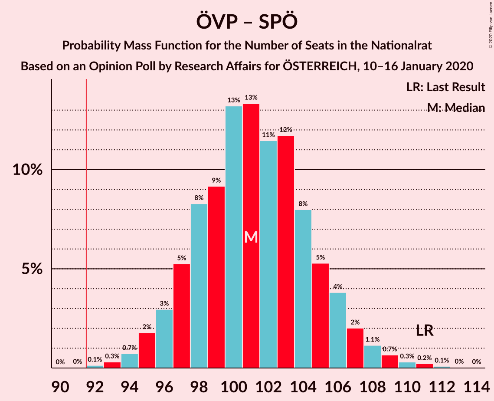

| Number of Seats | Probability | Accumulated | Special Marks |
|:---------------:|:-----------:|:-----------:|:-------------:|
| 91 | 0% | 100% |  |
| 92 | 0.1% | 99.9% | Majority |
| 93 | 0.3% | 99.8% |  |
| 94 | 0.7% | 99.5% |  |
| 95 | 2% | 98.8% |  |
| 96 | 3% | 97% |  |
| 97 | 5% | 94% |  |
| 98 | 8% | 89% |  |
| 99 | 9% | 80% |  |
| 100 | 13% | 71% |  |
| 101 | 13% | 58% | Median |
| 102 | 11% | 45% |  |
| 103 | 12% | 33% |  |
| 104 | 8% | 22% |  |
| 105 | 5% | 14% |  |
| 106 | 4% | 8% |  |
| 107 | 2% | 5% |  |
| 108 | 1.1% | 2% |  |
| 109 | 0.7% | 1.3% |  |
| 110 | 0.3% | 0.7% |  |
| 111 | 0.2% | 0.4% | Last Result |
| 112 | 0.1% | 0.2% |  |
| 113 | 0% | 0.1% |  |
| 114 | 0% | 0% |  |

### Österreichische Volkspartei – Freiheitliche Partei Österreichs

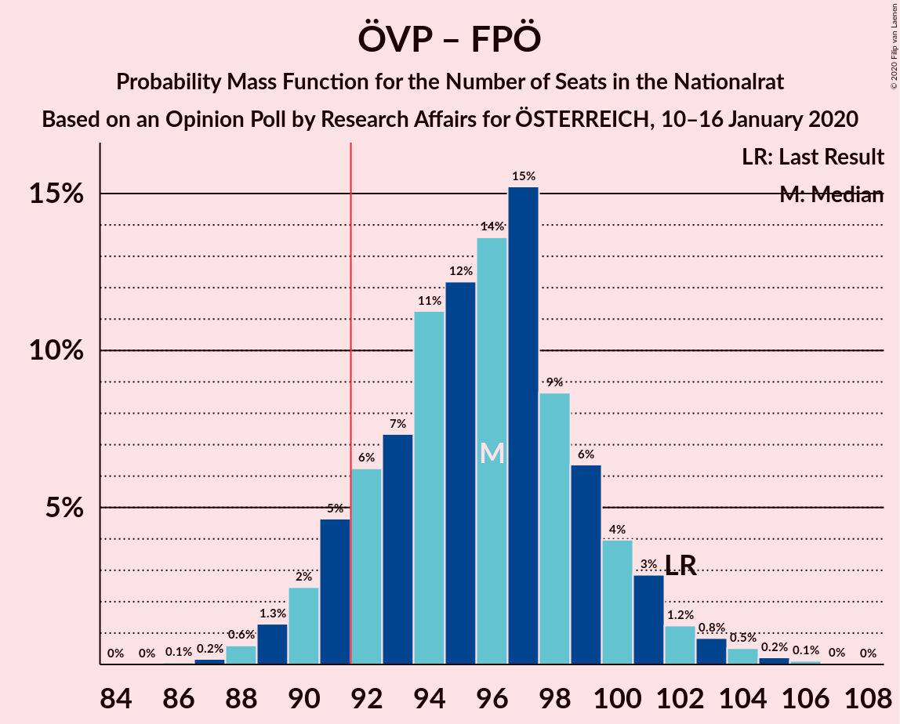

| Number of Seats | Probability | Accumulated | Special Marks |
|:---------------:|:-----------:|:-----------:|:-------------:|
| 86 | 0.1% | 100% |  |
| 87 | 0.2% | 99.9% |  |
| 88 | 0.5% | 99.7% |  |
| 89 | 1.2% | 99.1% |  |
| 90 | 2% | 98% |  |
| 91 | 4% | 96% |  |
| 92 | 7% | 92% | Majority |
| 93 | 9% | 85% |  |
| 94 | 11% | 76% |  |
| 95 | 13% | 64% |  |
| 96 | 13% | 51% | Median |
| 97 | 12% | 38% |  |
| 98 | 9% | 27% |  |
| 99 | 7% | 17% |  |
| 100 | 4% | 10% |  |
| 101 | 3% | 6% |  |
| 102 | 2% | 3% | Last Result |
| 103 | 0.8% | 2% |  |
| 104 | 0.4% | 0.9% |  |
| 105 | 0.2% | 0.4% |  |
| 106 | 0.1% | 0.2% |  |
| 107 | 0% | 0.1% |  |
| 108 | 0% | 0% |  |

### Österreichische Volkspartei – NEOS–Das Neue Österreich und Liberales Forum

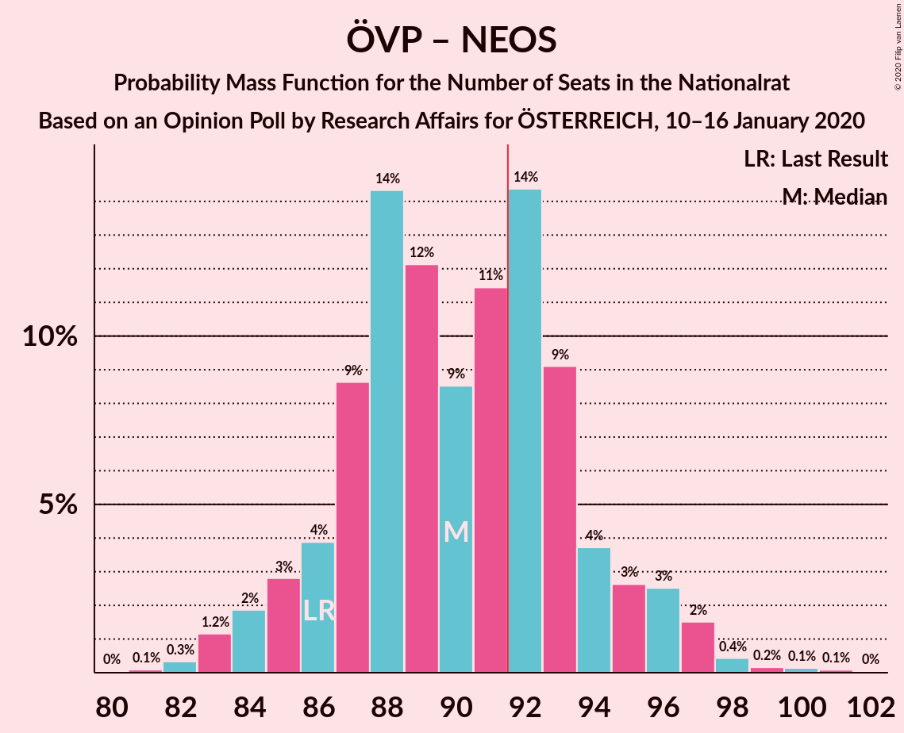

| Number of Seats | Probability | Accumulated | Special Marks |
|:---------------:|:-----------:|:-----------:|:-------------:|
| 80 | 0% | 100% |  |
| 81 | 0.1% | 99.9% |  |
| 82 | 0.4% | 99.8% |  |
| 83 | 0.9% | 99.5% |  |
| 84 | 2% | 98.6% |  |
| 85 | 3% | 97% |  |
| 86 | 5% | 94% | Last Result |
| 87 | 8% | 88% |  |
| 88 | 11% | 80% |  |
| 89 | 12% | 69% |  |
| 90 | 13% | 57% | Median |
| 91 | 13% | 45% |  |
| 92 | 11% | 32% | Majority |
| 93 | 8% | 21% |  |
| 94 | 5% | 13% |  |
| 95 | 3% | 8% |  |
| 96 | 2% | 4% |  |
| 97 | 1.1% | 2% |  |
| 98 | 0.5% | 1.1% |  |
| 99 | 0.3% | 0.6% |  |
| 100 | 0.2% | 0.3% |  |
| 101 | 0.1% | 0.1% |  |
| 102 | 0% | 0% |  |

### Die Grünen–Die Grüne Alternative – Sozialdemokratische Partei Österreichs – NEOS–Das Neue Österreich und Liberales Forum

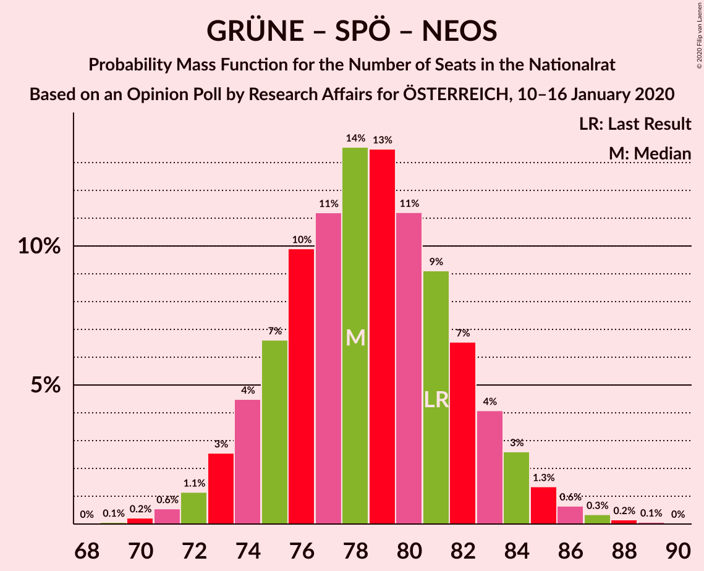

| Number of Seats | Probability | Accumulated | Special Marks |
|:---------------:|:-----------:|:-----------:|:-------------:|
| 69 | 0.1% | 100% |  |
| 70 | 0.2% | 99.9% |  |
| 71 | 0.6% | 99.7% |  |
| 72 | 1.1% | 99.1% |  |
| 73 | 3% | 98% |  |
| 74 | 4% | 95% |  |
| 75 | 7% | 91% |  |
| 76 | 10% | 84% |  |
| 77 | 11% | 74% |  |
| 78 | 14% | 63% | Median |
| 79 | 13% | 50% |  |
| 80 | 11% | 36% |  |
| 81 | 9% | 25% | Last Result |
| 82 | 7% | 16% |  |
| 83 | 4% | 9% |  |
| 84 | 3% | 5% |  |
| 85 | 1.3% | 3% |  |
| 86 | 0.6% | 1.3% |  |
| 87 | 0.3% | 0.6% |  |
| 88 | 0.2% | 0.3% |  |
| 89 | 0.1% | 0.1% |  |
| 90 | 0% | 0% |  |

### Österreichische Volkspartei

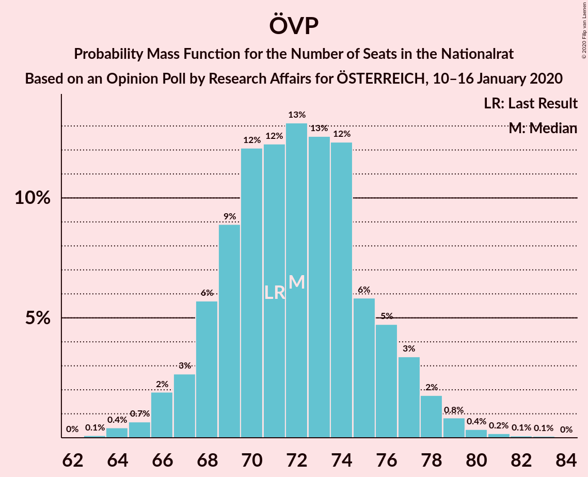

| Number of Seats | Probability | Accumulated | Special Marks |
|:---------------:|:-----------:|:-----------:|:-------------:|
| 63 | 0.1% | 100% |  |
| 64 | 0.3% | 99.8% |  |
| 65 | 0.8% | 99.5% |  |
| 66 | 2% | 98.7% |  |
| 67 | 3% | 97% |  |
| 68 | 6% | 94% |  |
| 69 | 8% | 88% |  |
| 70 | 11% | 80% |  |
| 71 | 13% | 69% | Last Result |
| 72 | 13% | 55% | Median |
| 73 | 13% | 42% |  |
| 74 | 11% | 30% |  |
| 75 | 8% | 19% |  |
| 76 | 5% | 11% |  |
| 77 | 3% | 6% |  |
| 78 | 2% | 3% |  |
| 79 | 0.8% | 2% |  |
| 80 | 0.4% | 0.7% |  |
| 81 | 0.2% | 0.3% |  |
| 82 | 0.1% | 0.1% |  |
| 83 | 0% | 0% |  |

### Die Grünen–Die Grüne Alternative – Sozialdemokratische Partei Österreichs

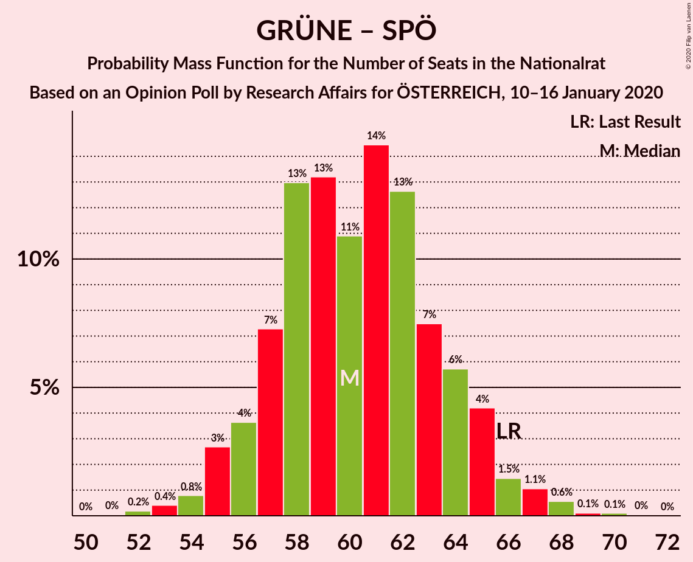

| Number of Seats | Probability | Accumulated | Special Marks |
|:---------------:|:-----------:|:-----------:|:-------------:|
| 51 | 0% | 100% |  |
| 52 | 0.1% | 99.9% |  |
| 53 | 0.4% | 99.8% |  |
| 54 | 1.1% | 99.4% |  |
| 55 | 2% | 98% |  |
| 56 | 4% | 96% |  |
| 57 | 7% | 92% |  |
| 58 | 10% | 84% |  |
| 59 | 13% | 74% |  |
| 60 | 15% | 61% | Median |
| 61 | 13% | 47% |  |
| 62 | 12% | 34% |  |
| 63 | 9% | 22% |  |
| 64 | 6% | 13% |  |
| 65 | 4% | 7% |  |
| 66 | 2% | 4% | Last Result |
| 67 | 1.0% | 2% |  |
| 68 | 0.4% | 0.8% |  |
| 69 | 0.2% | 0.3% |  |
| 70 | 0.1% | 0.1% |  |
| 71 | 0% | 0% |  |

### Sozialdemokratische Partei Österreichs – Freiheitliche Partei Österreichs

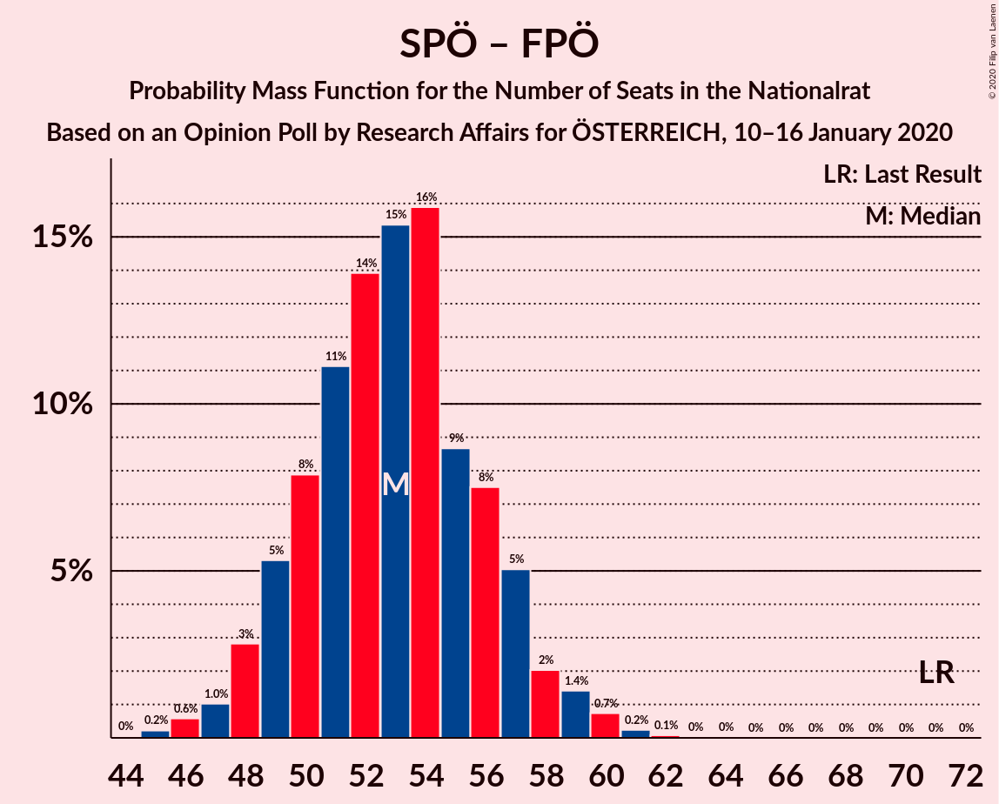

| Number of Seats | Probability | Accumulated | Special Marks |
|:---------------:|:-----------:|:-----------:|:-------------:|
| 44 | 0% | 100% |  |
| 45 | 0.2% | 99.9% |  |
| 46 | 0.5% | 99.8% |  |
| 47 | 1.3% | 99.3% |  |
| 48 | 3% | 98% |  |
| 49 | 5% | 95% |  |
| 50 | 9% | 90% |  |
| 51 | 11% | 82% |  |
| 52 | 14% | 70% |  |
| 53 | 15% | 56% | Median |
| 54 | 14% | 41% |  |
| 55 | 10% | 28% |  |
| 56 | 8% | 17% |  |
| 57 | 5% | 10% |  |
| 58 | 3% | 5% |  |
| 59 | 1.4% | 2% |  |
| 60 | 0.6% | 1.0% |  |
| 61 | 0.2% | 0.4% |  |
| 62 | 0.1% | 0.1% |  |
| 63 | 0% | 0.1% |  |
| 64 | 0% | 0% |  |
| 65 | 0% | 0% |  |
| 66 | 0% | 0% |  |
| 67 | 0% | 0% |  |
| 68 | 0% | 0% |  |
| 69 | 0% | 0% |  |
| 70 | 0% | 0% |  |
| 71 | 0% | 0% | Last Result |

### Sozialdemokratische Partei Österreichs

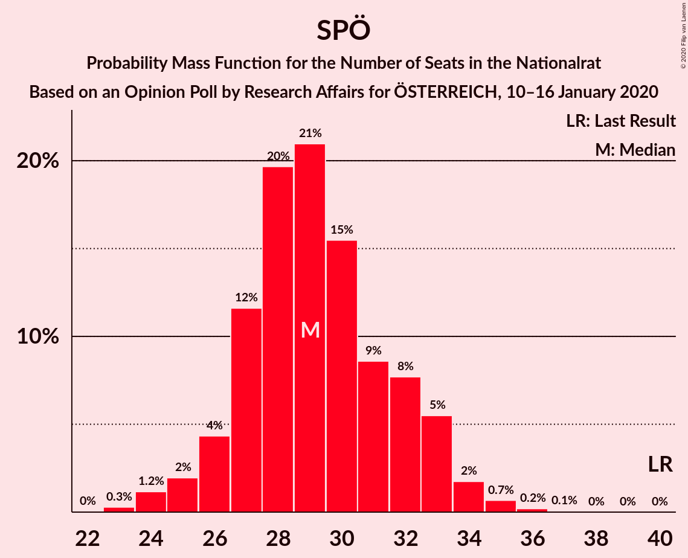

| Number of Seats | Probability | Accumulated | Special Marks |
|:---------------:|:-----------:|:-----------:|:-------------:|
| 23 | 0.2% | 100% |  |
| 24 | 0.9% | 99.7% |  |
| 25 | 3% | 98.9% |  |
| 26 | 6% | 96% |  |
| 27 | 11% | 90% |  |
| 28 | 16% | 79% |  |
| 29 | 18% | 62% | Median |
| 30 | 17% | 45% |  |
| 31 | 12% | 28% |  |
| 32 | 8% | 15% |  |
| 33 | 4% | 7% |  |
| 34 | 2% | 3% |  |
| 35 | 0.7% | 1.0% |  |
| 36 | 0.2% | 0.3% |  |
| 37 | 0.1% | 0.1% |  |
| 38 | 0% | 0% |  |
| 39 | 0% | 0% |  |
| 40 | 0% | 0% | Last Result |

## Technical Information

### Opinion Poll

+ **Polling firm:** Research Affairs
+ **Commissioner(s):** ÖSTERREICH
+ **Fieldwork period:** 10–16 January 2020

### Calculations

+ **Sample size:** 1002
+ **Simulations done:** 1,048,576
+ **Error estimate:** 0.78%

