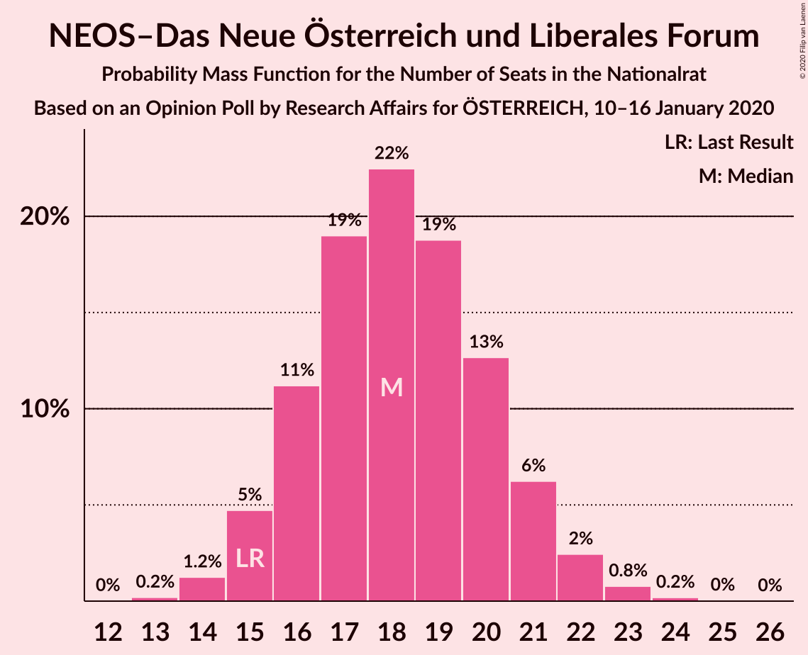
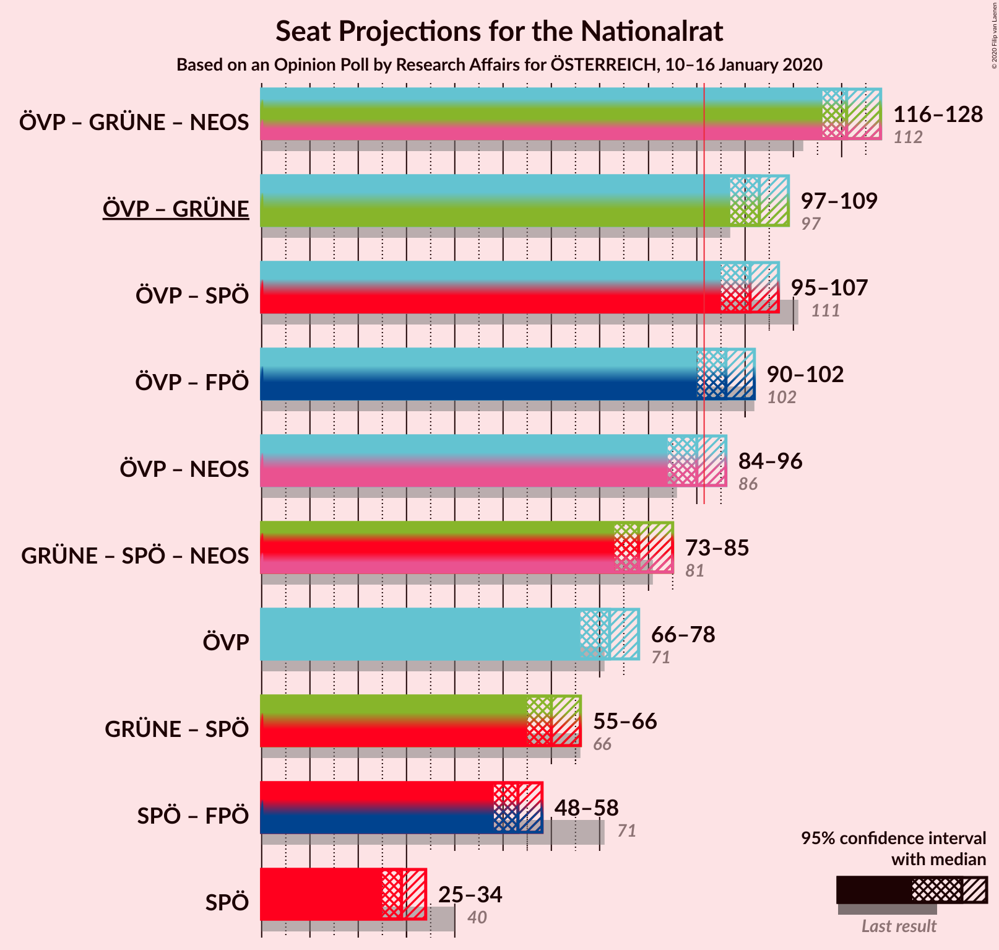
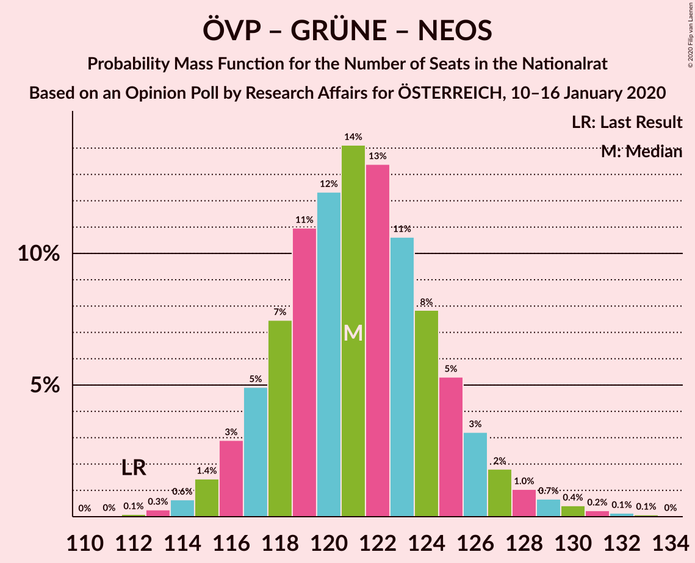
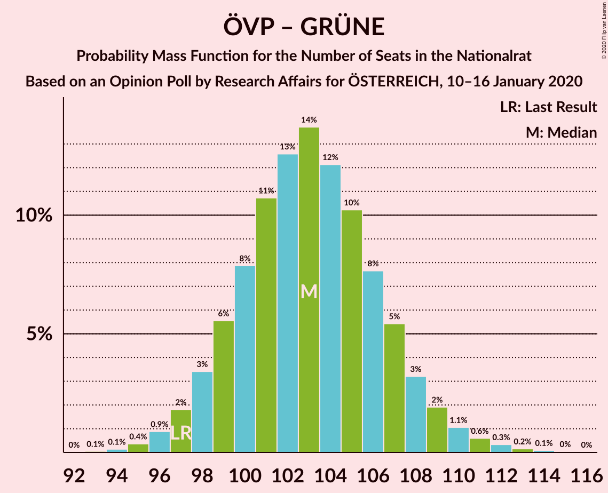
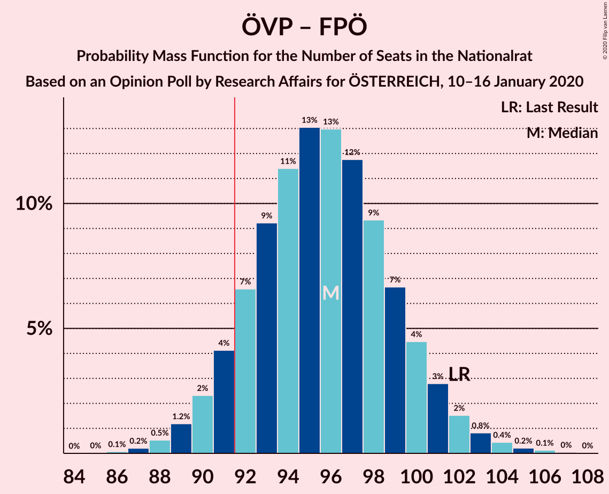
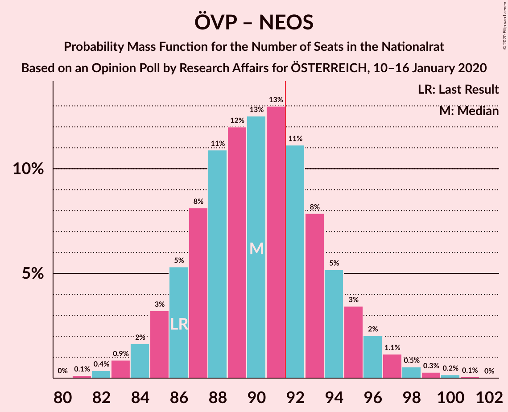
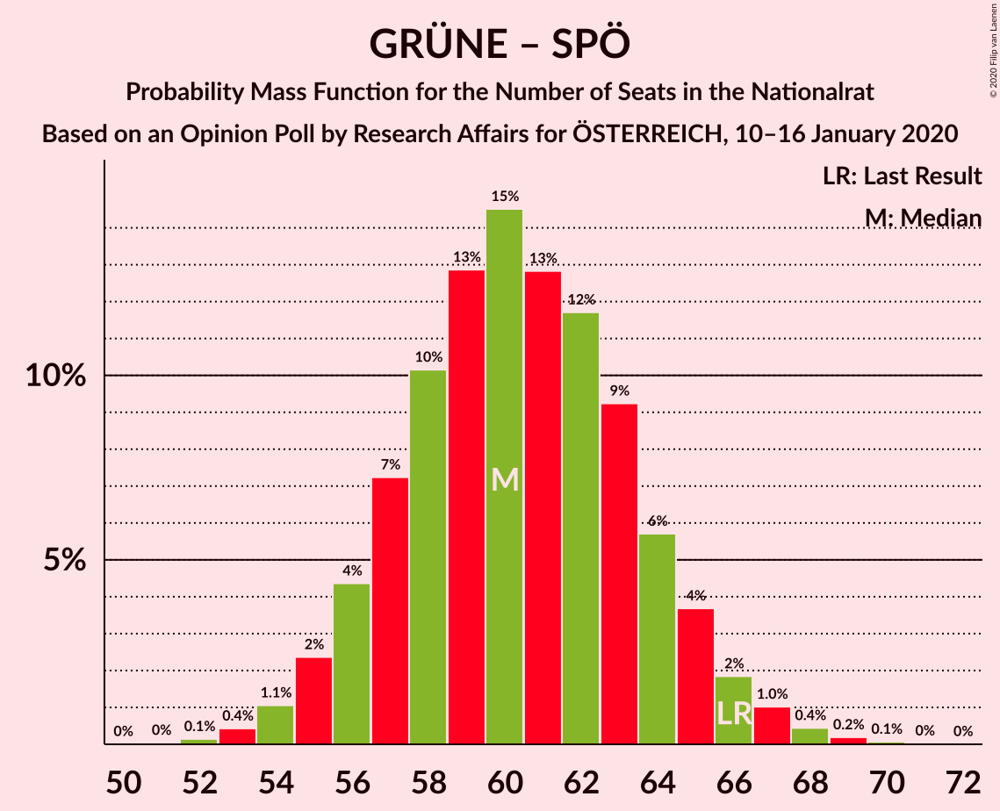
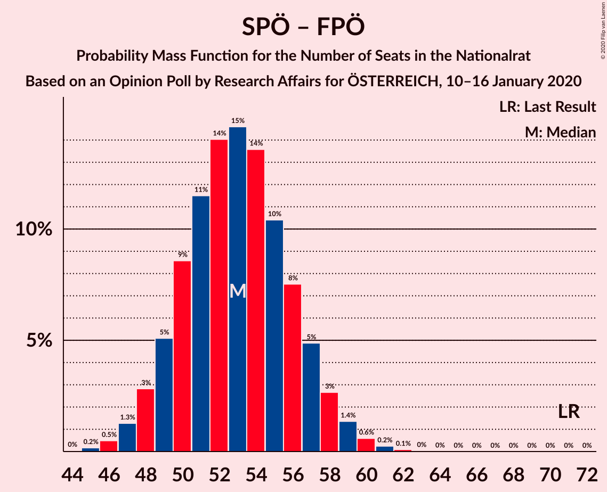

# Opinion Poll by Research Affairs for ÖSTERREICH, 10–16 January 2020

<a href="#voting-intentions">Voting Intentions</a> | <a href="#seats">Seats</a> | <a href="#coalitions">Coalitions</a> | <a href="#technical-information">Technical Information</a>

## Voting Intentions

### Confidence Intervals

| Party | Last Result | Poll Result | 80% Confidence Interval | 90% Confidence Interval | 95% Confidence Interval | 99% Confidence Interval |
|:-----:|:-----------:|:-----------:|:-----------------------:|:-----------------------:|:-----------------------:|:-----------------------:|
| Österreichische Volkspartei | 37.5% | 39.0% | 37.1–41.0% |36.5–41.6% |36.0–42.1% |35.1–43.1% |
| Die Grünen–Die Grüne Alternative | 13.9% | 17.0% | 15.5–18.6% |15.1–19.0% |14.8–19.4% |14.1–20.2% |
| Sozialdemokratische Partei Österreichs | 21.2% | 16.0% | 14.6–17.5% |14.2–18.0% |13.8–18.4% |13.2–19.1% |
| Freiheitliche Partei Österreichs | 16.2% | 13.0% | 11.7–14.4% |11.3–14.8% |11.0–15.2% |10.4–15.9% |
| NEOS–Das Neue Österreich und Liberales Forum | 8.1% | 10.0% | 8.9–11.3% |8.5–11.7% |8.3–12.0% |7.8–12.7% |

*Note:* The poll result column reflects the actual value used in the calculations. Published results may vary slightly, and in addition be rounded to fewer digits.

## Seats

### Confidence Intervals

| Party | Last Result | Median | 80% Confidence Interval | 90% Confidence Interval | 95% Confidence Interval | 99% Confidence Interval |
|:-----:|:-----------:|:------:|:-----------------------:|:-----------------------:|:-----------------------:|:-----------------------:|
| <a href="#österreichische-volkspartei">Österreichische Volkspartei</a> | 71 | 72 | 68–76 |67–77 |66–78 |64–80 |
| <a href="#die-grünen–die-grüne-alternative">Die Grünen–Die Grüne Alternative</a> | 26 | 31 | 28–34 |28–35 |27–36 |26–37 |
| <a href="#sozialdemokratische-partei-österreichs">Sozialdemokratische Partei Österreichs</a> | 40 | 29 | 27–32 |26–33 |25–34 |24–35 |
| <a href="#freiheitliche-partei-österreichs">Freiheitliche Partei Österreichs</a> | 31 | 23 | 21–27 |21–27 |20–27 |19–29 |
| <a href="#neos–das-neue-österreich-und-liberales-forum">NEOS–Das Neue Österreich und Liberales Forum</a> | 15 | 18 | 16–21 |15–21 |15–22 |14–23 |

### Österreichische Volkspartei

*For a full overview of the results for this party, see the [Österreichische Volkspartei](party-österreichischevolkspartei.html) page.*

| Number of Seats | Probability | Accumulated | Special Marks |
|:---------------:|:-----------:|:-----------:|:-------------:|
| 63 | 0.1% | 100% |  |
| 64 | 0.4% | 99.9% |  |
| 65 | 0.7% | 99.4% |  |
| 66 | 2% | 98.8% |  |
| 67 | 3% | 97% |  |
| 68 | 6% | 94% |  |
| 69 | 9% | 89% |  |
| 70 | 12% | 80% |  |
| 71 | 12% | 68% | Last Result |
| 72 | 13% | 55% | Median |
| 73 | 13% | 42% |  |
| 74 | 12% | 30% |  |
| 75 | 6% | 17% |  |
| 76 | 5% | 11% |  |
| 77 | 3% | 7% |  |
| 78 | 2% | 3% |  |
| 79 | 0.8% | 2% |  |
| 80 | 0.4% | 0.7% |  |
| 81 | 0.2% | 0.3% |  |
| 82 | 0.1% | 0.2% |  |
| 83 | 0.1% | 0.1% |  |
| 84 | 0% | 0% |  |

### Die Grünen–Die Grüne Alternative

*For a full overview of the results for this party, see the [Die Grünen–Die Grüne Alternative](party-diegrünen–diegrünealternative.html) page.*

| Number of Seats | Probability | Accumulated | Special Marks |
|:---------------:|:-----------:|:-----------:|:-------------:|
| 24 | 0.1% | 100% |  |
| 25 | 0.4% | 99.9% |  |
| 26 | 1.2% | 99.6% | Last Result |
| 27 | 3% | 98% |  |
| 28 | 7% | 95% |  |
| 29 | 13% | 88% |  |
| 30 | 16% | 75% |  |
| 31 | 17% | 60% | Median |
| 32 | 18% | 43% |  |
| 33 | 10% | 25% |  |
| 34 | 8% | 15% |  |
| 35 | 4% | 7% |  |
| 36 | 2% | 3% |  |
| 37 | 0.6% | 0.9% |  |
| 38 | 0.2% | 0.3% |  |
| 39 | 0.1% | 0.1% |  |
| 40 | 0% | 0% |  |

### Sozialdemokratische Partei Österreichs

*For a full overview of the results for this party, see the [Sozialdemokratische Partei Österreichs](party-sozialdemokratischeparteiösterreichs.html) page.*

| Number of Seats | Probability | Accumulated | Special Marks |
|:---------------:|:-----------:|:-----------:|:-------------:|
| 23 | 0.3% | 100% |  |
| 24 | 1.2% | 99.7% |  |
| 25 | 2% | 98.5% |  |
| 26 | 4% | 97% |  |
| 27 | 12% | 92% |  |
| 28 | 20% | 81% |  |
| 29 | 21% | 61% | Median |
| 30 | 15% | 40% |  |
| 31 | 9% | 24% |  |
| 32 | 8% | 16% |  |
| 33 | 5% | 8% |  |
| 34 | 2% | 3% |  |
| 35 | 0.7% | 1.0% |  |
| 36 | 0.2% | 0.3% |  |
| 37 | 0.1% | 0.1% |  |
| 38 | 0% | 0% |  |
| 39 | 0% | 0% |  |
| 40 | 0% | 0% | Last Result |

### Freiheitliche Partei Österreichs

*For a full overview of the results for this party, see the [Freiheitliche Partei Österreichs](party-freiheitlicheparteiösterreichs.html) page.*

| Number of Seats | Probability | Accumulated | Special Marks |
|:---------------:|:-----------:|:-----------:|:-------------:|
| 18 | 0.3% | 100% |  |
| 19 | 0.9% | 99.7% |  |
| 20 | 3% | 98.8% |  |
| 21 | 10% | 96% |  |
| 22 | 10% | 86% |  |
| 23 | 27% | 76% | Median |
| 24 | 11% | 49% |  |
| 25 | 23% | 38% |  |
| 26 | 4% | 15% |  |
| 27 | 9% | 11% |  |
| 28 | 1.1% | 2% |  |
| 29 | 1.1% | 1.4% |  |
| 30 | 0.1% | 0.2% |  |
| 31 | 0.1% | 0.1% | Last Result |
| 32 | 0% | 0% |  |

### NEOS–Das Neue Österreich und Liberales Forum

*For a full overview of the results for this party, see the [NEOS–Das Neue Österreich und Liberales Forum](party-neos–dasneueösterreichundliberalesforum.html) page.*

| Number of Seats | Probability | Accumulated | Special Marks |
|:---------------:|:-----------:|:-----------:|:-------------:|
| 13 | 0.2% | 100% |  |
| 14 | 1.2% | 99.8% |  |
| 15 | 5% | 98.6% | Last Result |
| 16 | 12% | 94% |  |
| 17 | 18% | 82% |  |
| 18 | 23% | 64% | Median |
| 19 | 17% | 41% |  |
| 20 | 14% | 24% |  |
| 21 | 7% | 10% |  |
| 22 | 2% | 3% |  |
| 23 | 0.8% | 1.0% |  |
| 24 | 0.2% | 0.3% |  |
| 25 | 0% | 0.1% |  |
| 26 | 0% | 0% |  |

## Coalitions

### Confidence Intervals

| Coalition | Last Result | Median | Majority? | 80% Confidence Interval | 90% Confidence Interval | 95% Confidence Interval | 99% Confidence Interval |
|:---------:|:-----------:|:------:|:---------:|:-----------------------:|:-----------------------:|:-----------------------:|:-----------------------:|
| Österreichische Volkspartei – Die Grünen–Die Grüne Alternative – NEOS–Das Neue Österreich und Liberales Forum | 112 | 121 | 100% | 118–125 | 116–126 | 116–128 | 114–130 |
| Österreichische Volkspartei – Die Grünen–Die Grüne Alternative | 97 | 103 | 100% | 99–107 | 98–108 | 97–109 | 95–112 |
| Österreichische Volkspartei – Sozialdemokratische Partei Österreichs | 111 | 101 | 100% | 97–105 | 96–106 | 95–107 | 94–110 |
| Österreichische Volkspartei – Freiheitliche Partei Österreichs | 102 | 96 | 91% | 92–99 | 91–101 | 90–102 | 88–104 |
| Österreichische Volkspartei – NEOS–Das Neue Österreich und Liberales Forum | 86 | 91 | 33% | 87–94 | 86–96 | 84–96 | 82–99 |
| Die Grünen–Die Grüne Alternative – Sozialdemokratische Partei Österreichs – NEOS–Das Neue Österreich und Liberales Forum | 81 | 78 | 0% | 75–82 | 74–84 | 73–85 | 71–87 |
| Österreichische Volkspartei | 71 | 72 | 0% | 68–76 | 67–77 | 66–78 | 64–80 |
| Die Grünen–Die Grüne Alternative – Sozialdemokratische Partei Österreichs | 66 | 60 | 0% | 57–64 | 56–65 | 55–66 | 53–68 |
| Sozialdemokratische Partei Österreichs – Freiheitliche Partei Österreichs | 71 | 53 | 0% | 49–56 | 49–57 | 48–59 | 46–60 |
| Sozialdemokratische Partei Österreichs | 40 | 29 | 0% | 27–32 | 26–33 | 25–34 | 24–35 |

### Österreichische Volkspartei – Die Grünen–Die Grüne Alternative – NEOS–Das Neue Österreich und Liberales Forum

| Number of Seats | Probability | Accumulated | Special Marks |
|:---------------:|:-----------:|:-----------:|:-------------:|
| 112 | 0.1% | 100% | Last Result |
| 113 | 0.3% | 99.9% |  |
| 114 | 0.7% | 99.6% |  |
| 115 | 1.1% | 98.8% |  |
| 116 | 3% | 98% |  |
| 117 | 4% | 95% |  |
| 118 | 9% | 90% |  |
| 119 | 10% | 81% |  |
| 120 | 11% | 71% |  |
| 121 | 16% | 60% | Median |
| 122 | 14% | 44% |  |
| 123 | 10% | 30% |  |
| 124 | 9% | 21% |  |
| 125 | 4% | 12% |  |
| 126 | 4% | 8% |  |
| 127 | 2% | 4% |  |
| 128 | 1.1% | 3% |  |
| 129 | 0.9% | 2% |  |
| 130 | 0.3% | 0.8% |  |
| 131 | 0.2% | 0.5% |  |
| 132 | 0.2% | 0.3% |  |
| 133 | 0% | 0.1% |  |
| 134 | 0% | 0% |  |

### Österreichische Volkspartei – Die Grünen–Die Grüne Alternative

| Number of Seats | Probability | Accumulated | Special Marks |
|:---------------:|:-----------:|:-----------:|:-------------:|
| 93 | 0.1% | 100% |  |
| 94 | 0.1% | 99.9% |  |
| 95 | 0.4% | 99.8% |  |
| 96 | 1.1% | 99.4% |  |
| 97 | 1.5% | 98% | Last Result |
| 98 | 3% | 97% |  |
| 99 | 6% | 94% |  |
| 100 | 8% | 88% |  |
| 101 | 13% | 81% |  |
| 102 | 12% | 68% |  |
| 103 | 15% | 56% | Median |
| 104 | 10% | 41% |  |
| 105 | 10% | 31% |  |
| 106 | 8% | 21% |  |
| 107 | 5% | 12% |  |
| 108 | 3% | 7% |  |
| 109 | 2% | 4% |  |
| 110 | 1.0% | 2% |  |
| 111 | 0.7% | 1.3% |  |
| 112 | 0.3% | 0.6% |  |
| 113 | 0.1% | 0.3% |  |
| 114 | 0.1% | 0.2% |  |
| 115 | 0% | 0.1% |  |
| 116 | 0% | 0% |  |

### Österreichische Volkspartei – Sozialdemokratische Partei Österreichs

| Number of Seats | Probability | Accumulated | Special Marks |
|:---------------:|:-----------:|:-----------:|:-------------:|
| 92 | 0.1% | 100% | Majority |
| 93 | 0.3% | 99.8% |  |
| 94 | 0.7% | 99.5% |  |
| 95 | 2% | 98.9% |  |
| 96 | 3% | 97% |  |
| 97 | 5% | 94% |  |
| 98 | 8% | 89% |  |
| 99 | 8% | 80% |  |
| 100 | 16% | 72% |  |
| 101 | 13% | 56% | Median |
| 102 | 10% | 43% |  |
| 103 | 11% | 33% |  |
| 104 | 9% | 22% |  |
| 105 | 4% | 13% |  |
| 106 | 4% | 9% |  |
| 107 | 2% | 4% |  |
| 108 | 1.0% | 2% |  |
| 109 | 0.5% | 1.1% |  |
| 110 | 0.3% | 0.7% |  |
| 111 | 0.2% | 0.4% | Last Result |
| 112 | 0.1% | 0.2% |  |
| 113 | 0% | 0.1% |  |
| 114 | 0% | 0.1% |  |
| 115 | 0% | 0% |  |

### Österreichische Volkspartei – Freiheitliche Partei Österreichs

| Number of Seats | Probability | Accumulated | Special Marks |
|:---------------:|:-----------:|:-----------:|:-------------:|
| 86 | 0.1% | 100% |  |
| 87 | 0.2% | 99.9% |  |
| 88 | 0.6% | 99.7% |  |
| 89 | 1.3% | 99.1% |  |
| 90 | 2% | 98% |  |
| 91 | 5% | 95% |  |
| 92 | 6% | 91% | Majority |
| 93 | 7% | 84% |  |
| 94 | 11% | 77% |  |
| 95 | 12% | 66% | Median |
| 96 | 14% | 54% |  |
| 97 | 15% | 40% |  |
| 98 | 9% | 25% |  |
| 99 | 6% | 16% |  |
| 100 | 4% | 10% |  |
| 101 | 3% | 6% |  |
| 102 | 1.2% | 3% | Last Result |
| 103 | 0.8% | 2% |  |
| 104 | 0.5% | 0.9% |  |
| 105 | 0.2% | 0.4% |  |
| 106 | 0.1% | 0.2% |  |
| 107 | 0% | 0.1% |  |
| 108 | 0% | 0% |  |

### Österreichische Volkspartei – NEOS–Das Neue Österreich und Liberales Forum

| Number of Seats | Probability | Accumulated | Special Marks |
|:---------------:|:-----------:|:-----------:|:-------------:|
| 81 | 0.1% | 100% |  |
| 82 | 0.5% | 99.9% |  |
| 83 | 1.2% | 99.3% |  |
| 84 | 1.1% | 98% |  |
| 85 | 1.2% | 97% |  |
| 86 | 6% | 96% | Last Result |
| 87 | 13% | 90% |  |
| 88 | 13% | 77% |  |
| 89 | 5% | 64% |  |
| 90 | 9% | 59% | Median |
| 91 | 18% | 51% |  |
| 92 | 16% | 33% | Majority |
| 93 | 5% | 17% |  |
| 94 | 2% | 12% |  |
| 95 | 4% | 10% |  |
| 96 | 4% | 6% |  |
| 97 | 1.1% | 2% |  |
| 98 | 0.1% | 0.6% |  |
| 99 | 0.1% | 0.5% |  |
| 100 | 0.3% | 0.4% |  |
| 101 | 0.1% | 0.1% |  |
| 102 | 0% | 0% |  |

### Die Grünen–Die Grüne Alternative – Sozialdemokratische Partei Österreichs – NEOS–Das Neue Österreich und Liberales Forum

| Number of Seats | Probability | Accumulated | Special Marks |
|:---------------:|:-----------:|:-----------:|:-------------:|
| 69 | 0.1% | 100% |  |
| 70 | 0.2% | 99.9% |  |
| 71 | 0.5% | 99.6% |  |
| 72 | 1.1% | 99.2% |  |
| 73 | 2% | 98% |  |
| 74 | 4% | 96% |  |
| 75 | 7% | 92% |  |
| 76 | 9% | 84% |  |
| 77 | 13% | 75% |  |
| 78 | 15% | 62% | Median |
| 79 | 14% | 48% |  |
| 80 | 9% | 34% |  |
| 81 | 9% | 25% | Last Result |
| 82 | 6% | 16% |  |
| 83 | 5% | 10% |  |
| 84 | 2% | 5% |  |
| 85 | 2% | 3% |  |
| 86 | 0.8% | 1.3% |  |
| 87 | 0.3% | 0.6% |  |
| 88 | 0.2% | 0.3% |  |
| 89 | 0.1% | 0.1% |  |
| 90 | 0% | 0.1% |  |
| 91 | 0% | 0% |  |

### Österreichische Volkspartei

| Number of Seats | Probability | Accumulated | Special Marks |
|:---------------:|:-----------:|:-----------:|:-------------:|
| 63 | 0.1% | 100% |  |
| 64 | 0.4% | 99.9% |  |
| 65 | 0.7% | 99.4% |  |
| 66 | 2% | 98.8% |  |
| 67 | 3% | 97% |  |
| 68 | 6% | 94% |  |
| 69 | 9% | 89% |  |
| 70 | 12% | 80% |  |
| 71 | 12% | 68% | Last Result |
| 72 | 13% | 55% | Median |
| 73 | 13% | 42% |  |
| 74 | 12% | 30% |  |
| 75 | 6% | 17% |  |
| 76 | 5% | 11% |  |
| 77 | 3% | 7% |  |
| 78 | 2% | 3% |  |
| 79 | 0.8% | 2% |  |
| 80 | 0.4% | 0.7% |  |
| 81 | 0.2% | 0.3% |  |
| 82 | 0.1% | 0.2% |  |
| 83 | 0.1% | 0.1% |  |
| 84 | 0% | 0% |  |

### Die Grünen–Die Grüne Alternative – Sozialdemokratische Partei Österreichs

| Number of Seats | Probability | Accumulated | Special Marks |
|:---------------:|:-----------:|:-----------:|:-------------:|
| 51 | 0% | 100% |  |
| 52 | 0.2% | 99.9% |  |
| 53 | 0.4% | 99.8% |  |
| 54 | 0.8% | 99.3% |  |
| 55 | 3% | 98.6% |  |
| 56 | 4% | 96% |  |
| 57 | 7% | 92% |  |
| 58 | 13% | 85% |  |
| 59 | 13% | 72% |  |
| 60 | 11% | 59% | Median |
| 61 | 14% | 48% |  |
| 62 | 13% | 33% |  |
| 63 | 7% | 21% |  |
| 64 | 6% | 13% |  |
| 65 | 4% | 8% |  |
| 66 | 1.5% | 3% | Last Result |
| 67 | 1.1% | 2% |  |
| 68 | 0.6% | 0.8% |  |
| 69 | 0.1% | 0.3% |  |
| 70 | 0.1% | 0.2% |  |
| 71 | 0% | 0% |  |

### Sozialdemokratische Partei Österreichs – Freiheitliche Partei Österreichs

| Number of Seats | Probability | Accumulated | Special Marks |
|:---------------:|:-----------:|:-----------:|:-------------:|
| 44 | 0% | 100% |  |
| 45 | 0.2% | 99.9% |  |
| 46 | 0.6% | 99.7% |  |
| 47 | 1.0% | 99.1% |  |
| 48 | 3% | 98% |  |
| 49 | 5% | 95% |  |
| 50 | 8% | 90% |  |
| 51 | 11% | 82% |  |
| 52 | 14% | 71% | Median |
| 53 | 15% | 57% |  |
| 54 | 16% | 42% |  |
| 55 | 9% | 26% |  |
| 56 | 8% | 17% |  |
| 57 | 5% | 10% |  |
| 58 | 2% | 5% |  |
| 59 | 1.4% | 3% |  |
| 60 | 0.7% | 1.1% |  |
| 61 | 0.2% | 0.4% |  |
| 62 | 0.1% | 0.1% |  |
| 63 | 0% | 0.1% |  |
| 64 | 0% | 0% |  |
| 65 | 0% | 0% |  |
| 66 | 0% | 0% |  |
| 67 | 0% | 0% |  |
| 68 | 0% | 0% |  |
| 69 | 0% | 0% |  |
| 70 | 0% | 0% |  |
| 71 | 0% | 0% | Last Result |

### Sozialdemokratische Partei Österreichs

| Number of Seats | Probability | Accumulated | Special Marks |
|:---------------:|:-----------:|:-----------:|:-------------:|
| 23 | 0.3% | 100% |  |
| 24 | 1.2% | 99.7% |  |
| 25 | 2% | 98.5% |  |
| 26 | 4% | 97% |  |
| 27 | 12% | 92% |  |
| 28 | 20% | 81% |  |
| 29 | 21% | 61% | Median |
| 30 | 15% | 40% |  |
| 31 | 9% | 24% |  |
| 32 | 8% | 16% |  |
| 33 | 5% | 8% |  |
| 34 | 2% | 3% |  |
| 35 | 0.7% | 1.0% |  |
| 36 | 0.2% | 0.3% |  |
| 37 | 0.1% | 0.1% |  |
| 38 | 0% | 0% |  |
| 39 | 0% | 0% |  |
| 40 | 0% | 0% | Last Result |

## Technical Information

### Opinion Poll

+ **Polling firm:** Research Affairs
+ **Commissioner(s):** ÖSTERREICH
+ **Fieldwork period:** 10–16 January 2020

### Calculations

+ **Sample size:** 1002
+ **Simulations done:** 65,536
+ **Error estimate:** 1.04%

