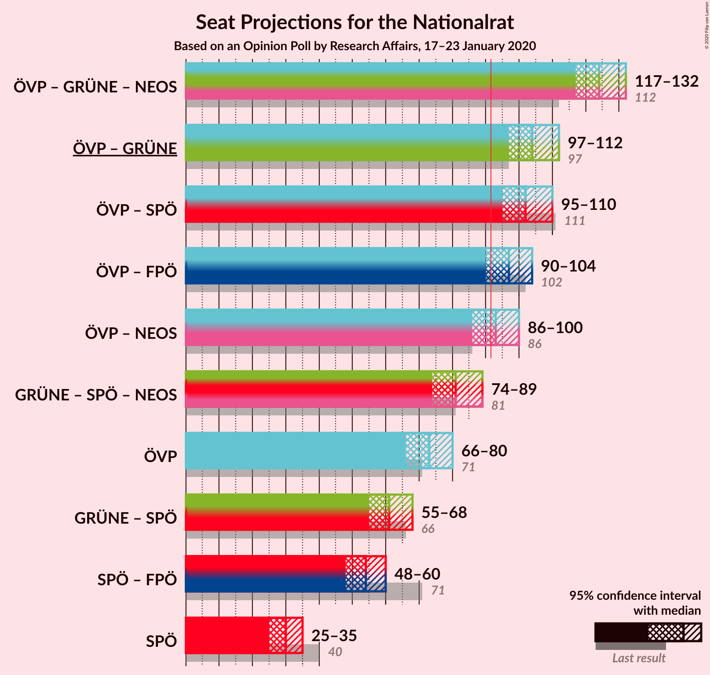
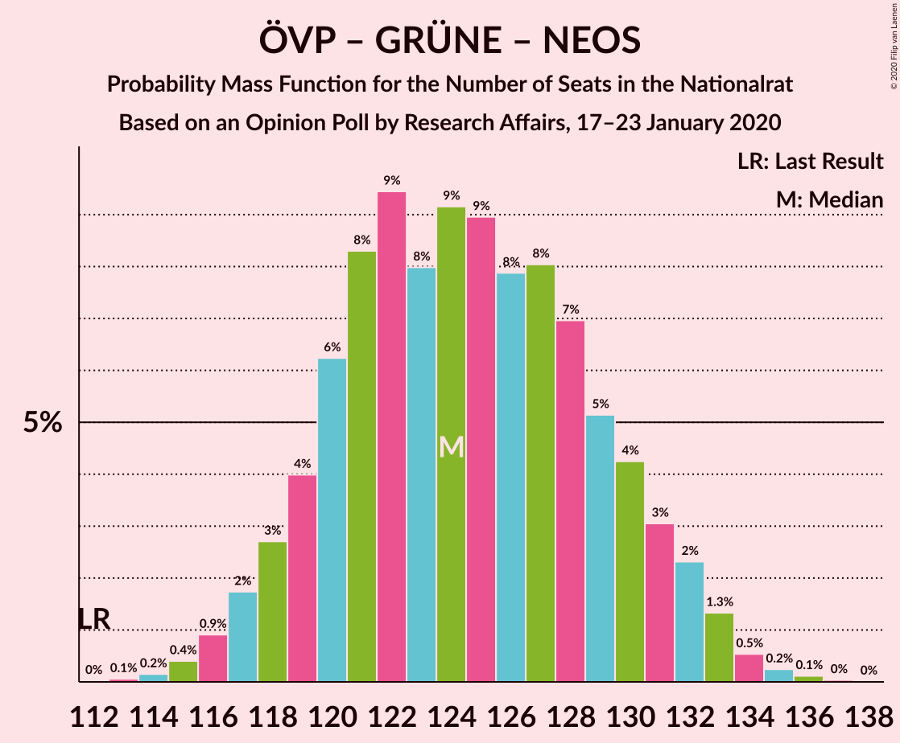
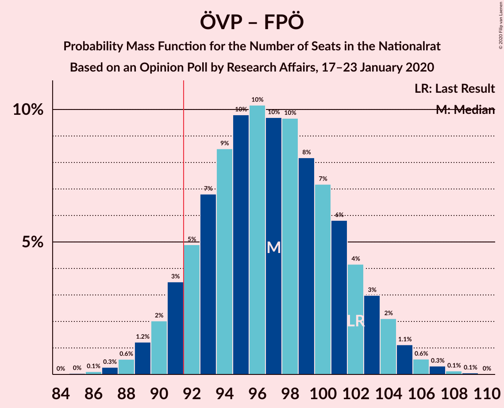
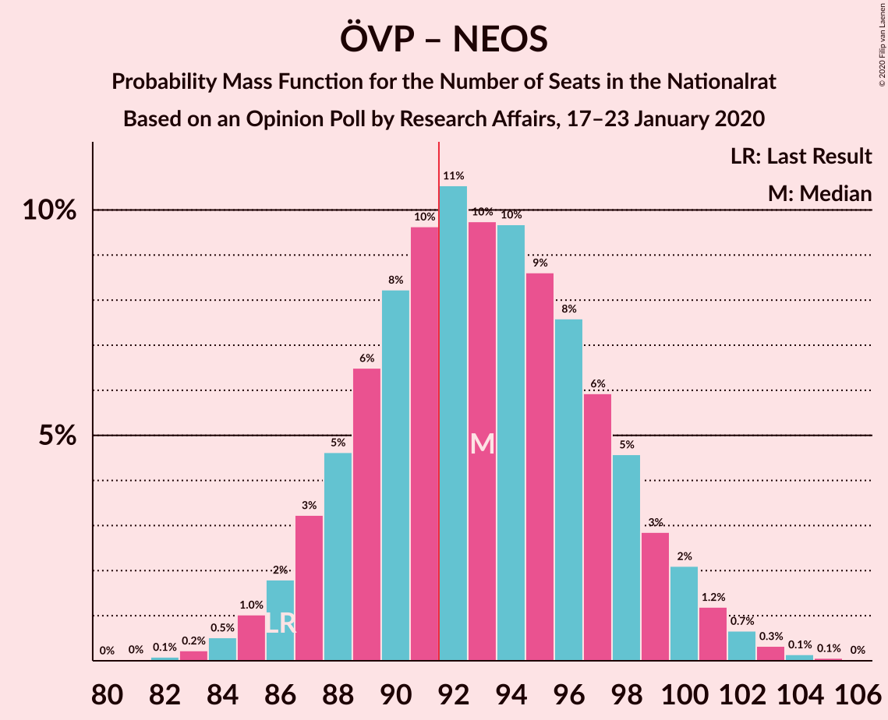

# Opinion Poll by Research Affairs, 17–23 January 2020

<a href="#voting-intentions">Voting Intentions</a> | <a href="#seats">Seats</a> | <a href="#coalitions">Coalitions</a> | <a href="#technical-information">Technical Information</a>

## Voting Intentions

### Confidence Intervals

| Party | Last Result | Poll Result | 80% Confidence Interval | 90% Confidence Interval | 95% Confidence Interval | 99% Confidence Interval |
|:-----:|:-----------:|:-----------:|:-----------------------:|:-----------------------:|:-----------------------:|:-----------------------:|
| Österreichische Volkspartei | 37.5% | 39.0% | 36.9–41.1% |36.3–41.7% |35.8–42.3% |34.8–43.3% |
| Die Grünen–Die Grüne Alternative | 13.9% | 17.0% | 15.5–18.7% |15.0–19.2% |14.6–19.6% |13.9–20.5% |
| Sozialdemokratische Partei Österreichs | 21.2% | 16.0% | 14.5–17.6% |14.0–18.1% |13.7–18.5% |13.0–19.4% |
| Freiheitliche Partei Österreichs | 16.2% | 13.0% | 11.6–14.6% |11.2–15.0% |10.9–15.4% |10.3–16.2% |
| NEOS–Das Neue Österreich und Liberales Forum | 8.1% | 10.9% | 9.7–12.4% |9.3–12.8% |9.0–13.2% |8.5–13.9% |

*Note:* The poll result column reflects the actual value used in the calculations. Published results may vary slightly, and in addition be rounded to fewer digits.

## Seats

### Confidence Intervals

| Party | Last Result | Median | 80% Confidence Interval | 90% Confidence Interval | 95% Confidence Interval | 99% Confidence Interval |
|:-----:|:-----------:|:------:|:-----------------------:|:-----------------------:|:-----------------------:|:-----------------------:|
| <a href="#österreichische-volkspartei">Österreichische Volkspartei</a> | 71 | 73 | 68–77 |67–79 |66–80 |64–82 |
| <a href="#die-grünen–die-grüne-alternative">Die Grünen–Die Grüne Alternative</a> | 26 | 31 | 28–35 |28–36 |27–37 |26–38 |
| <a href="#sozialdemokratische-partei-österreichs">Sozialdemokratische Partei Österreichs</a> | 40 | 30 | 27–33 |26–34 |25–35 |24–36 |
| <a href="#freiheitliche-partei-österreichs">Freiheitliche Partei Österreichs</a> | 31 | 24 | 21–27 |21–28 |20–29 |19–30 |
| <a href="#neos–das-neue-österreich-und-liberales-forum">NEOS–Das Neue Österreich und Liberales Forum</a> | 15 | 20 | 18–23 |17–24 |16–24 |15–26 |

### Österreichische Volkspartei

*For a full overview of the results for this party, see the [Österreichische Volkspartei](party-österreichischevolkspartei.html) page.*

| Number of Seats | Probability | Accumulated | Special Marks |
|:---------------:|:-----------:|:-----------:|:-------------:|
| 62 | 0.1% | 100% |  |
| 63 | 0.2% | 99.9% |  |
| 64 | 0.4% | 99.8% |  |
| 65 | 0.9% | 99.4% |  |
| 66 | 2% | 98.5% |  |
| 67 | 3% | 97% |  |
| 68 | 4% | 94% |  |
| 69 | 6% | 89% |  |
| 70 | 9% | 83% |  |
| 71 | 10% | 74% | Last Result |
| 72 | 11% | 63% |  |
| 73 | 11% | 52% | Median |
| 74 | 11% | 41% |  |
| 75 | 9% | 30% |  |
| 76 | 7% | 21% |  |
| 77 | 5% | 14% |  |
| 78 | 4% | 9% |  |
| 79 | 3% | 5% |  |
| 80 | 1.4% | 3% |  |
| 81 | 0.8% | 1.4% |  |
| 82 | 0.4% | 0.7% |  |
| 83 | 0.2% | 0.3% |  |
| 84 | 0.1% | 0.1% |  |
| 85 | 0% | 0% |  |

### Die Grünen–Die Grüne Alternative

*For a full overview of the results for this party, see the [Die Grünen–Die Grüne Alternative](party-diegrünen–diegrünealternative.html) page.*

| Number of Seats | Probability | Accumulated | Special Marks |
|:---------------:|:-----------:|:-----------:|:-------------:|
| 24 | 0.1% | 100% |  |
| 25 | 0.4% | 99.9% |  |
| 26 | 1.2% | 99.5% | Last Result |
| 27 | 3% | 98% |  |
| 28 | 6% | 95% |  |
| 29 | 10% | 89% |  |
| 30 | 13% | 79% |  |
| 31 | 16% | 66% | Median |
| 32 | 16% | 50% |  |
| 33 | 13% | 34% |  |
| 34 | 9% | 21% |  |
| 35 | 6% | 11% |  |
| 36 | 3% | 6% |  |
| 37 | 2% | 3% |  |
| 38 | 0.7% | 1.1% |  |
| 39 | 0.3% | 0.4% |  |
| 40 | 0.1% | 0.1% |  |
| 41 | 0% | 0% |  |

### Sozialdemokratische Partei Österreichs

*For a full overview of the results for this party, see the [Sozialdemokratische Partei Österreichs](party-sozialdemokratischeparteiösterreichs.html) page.*

| Number of Seats | Probability | Accumulated | Special Marks |
|:---------------:|:-----------:|:-----------:|:-------------:|
| 22 | 0.1% | 100% |  |
| 23 | 0.3% | 99.9% |  |
| 24 | 0.9% | 99.7% |  |
| 25 | 3% | 98.7% |  |
| 26 | 6% | 96% |  |
| 27 | 10% | 90% |  |
| 28 | 14% | 81% |  |
| 29 | 16% | 67% |  |
| 30 | 16% | 51% | Median |
| 31 | 13% | 35% |  |
| 32 | 10% | 22% |  |
| 33 | 6% | 12% |  |
| 34 | 3% | 6% |  |
| 35 | 2% | 3% |  |
| 36 | 0.6% | 0.9% |  |
| 37 | 0.2% | 0.3% |  |
| 38 | 0.1% | 0.1% |  |
| 39 | 0% | 0% |  |
| 40 | 0% | 0% | Last Result |

### Freiheitliche Partei Österreichs

*For a full overview of the results for this party, see the [Freiheitliche Partei Österreichs](party-freiheitlicheparteiösterreichs.html) page.*

| Number of Seats | Probability | Accumulated | Special Marks |
|:---------------:|:-----------:|:-----------:|:-------------:|
| 17 | 0% | 100% |  |
| 18 | 0.3% | 99.9% |  |
| 19 | 1.1% | 99.7% |  |
| 20 | 3% | 98.5% |  |
| 21 | 7% | 95% |  |
| 22 | 12% | 88% |  |
| 23 | 17% | 76% |  |
| 24 | 18% | 59% | Median |
| 25 | 16% | 41% |  |
| 26 | 12% | 25% |  |
| 27 | 7% | 13% |  |
| 28 | 4% | 6% |  |
| 29 | 2% | 3% |  |
| 30 | 0.6% | 0.9% |  |
| 31 | 0.2% | 0.3% | Last Result |
| 32 | 0.1% | 0.1% |  |
| 33 | 0% | 0% |  |

### NEOS–Das Neue Österreich und Liberales Forum

*For a full overview of the results for this party, see the [NEOS–Das Neue Österreich und Liberales Forum](party-neos–dasneueösterreichundliberalesforum.html) page.*

| Number of Seats | Probability | Accumulated | Special Marks |
|:---------------:|:-----------:|:-----------:|:-------------:|
| 14 | 0.1% | 100% |  |
| 15 | 0.5% | 99.9% | Last Result |
| 16 | 2% | 99.4% |  |
| 17 | 6% | 97% |  |
| 18 | 11% | 91% |  |
| 19 | 17% | 80% |  |
| 20 | 20% | 63% | Median |
| 21 | 18% | 43% |  |
| 22 | 12% | 25% |  |
| 23 | 7% | 13% |  |
| 24 | 4% | 6% |  |
| 25 | 1.5% | 2% |  |
| 26 | 0.5% | 0.7% |  |
| 27 | 0.1% | 0.2% |  |
| 28 | 0% | 0.1% |  |
| 29 | 0% | 0% |  |

## Coalitions

### Confidence Intervals

| Coalition | Last Result | Median | Majority? | 80% Confidence Interval | 90% Confidence Interval | 95% Confidence Interval | 99% Confidence Interval |
|:---------:|:-----------:|:------:|:---------:|:-----------------------:|:-----------------------:|:-----------------------:|:-----------------------:|
| Österreichische Volkspartei – Die Grünen–Die Grüne Alternative – NEOS–Das Neue Österreich und Liberales Forum | 112 | 124 | 100% | 120–130 | 118–131 | 117–132 | 115–134 |
| Österreichische Volkspartei – Die Grünen–Die Grüne Alternative | 97 | 104 | 100% | 99–109 | 98–111 | 97–112 | 95–114 |
| Österreichische Volkspartei – Sozialdemokratische Partei Österreichs | 111 | 102 | 99.9% | 97–107 | 96–109 | 95–110 | 93–112 |
| Österreichische Volkspartei – Freiheitliche Partei Österreichs | 102 | 97 | 92% | 92–102 | 91–103 | 90–104 | 88–107 |
| Österreichische Volkspartei – NEOS–Das Neue Österreich und Liberales Forum | 86 | 93 | 64% | 88–98 | 87–99 | 86–100 | 84–103 |
| Die Grünen–Die Grüne Alternative – Sozialdemokratische Partei Österreichs – NEOS–Das Neue Österreich und Liberales Forum | 81 | 81 | 0.3% | 77–86 | 76–87 | 74–89 | 73–91 |
| Österreichische Volkspartei | 71 | 73 | 0% | 68–77 | 67–79 | 66–80 | 64–82 |
| Die Grünen–Die Grüne Alternative – Sozialdemokratische Partei Österreichs | 66 | 61 | 0% | 57–65 | 56–67 | 55–68 | 53–70 |
| Sozialdemokratische Partei Österreichs – Freiheitliche Partei Österreichs | 71 | 54 | 0% | 50–58 | 49–59 | 48–60 | 46–62 |
| Sozialdemokratische Partei Österreichs | 40 | 30 | 0% | 27–33 | 26–34 | 25–35 | 24–36 |

### Österreichische Volkspartei – Die Grünen–Die Grüne Alternative – NEOS–Das Neue Österreich und Liberales Forum

| Number of Seats | Probability | Accumulated | Special Marks |
|:---------------:|:-----------:|:-----------:|:-------------:|
| 112 | 0% | 100% | Last Result |
| 113 | 0.1% | 100% |  |
| 114 | 0.2% | 99.9% |  |
| 115 | 0.4% | 99.8% |  |
| 116 | 0.9% | 99.4% |  |
| 117 | 2% | 98% |  |
| 118 | 3% | 97% |  |
| 119 | 4% | 94% |  |
| 120 | 6% | 90% |  |
| 121 | 8% | 84% |  |
| 122 | 9% | 75% |  |
| 123 | 8% | 66% |  |
| 124 | 9% | 58% | Median |
| 125 | 9% | 49% |  |
| 126 | 8% | 40% |  |
| 127 | 8% | 32% |  |
| 128 | 7% | 24% |  |
| 129 | 5% | 17% |  |
| 130 | 4% | 12% |  |
| 131 | 3% | 8% |  |
| 132 | 2% | 5% |  |
| 133 | 1.3% | 2% |  |
| 134 | 0.5% | 0.9% |  |
| 135 | 0.2% | 0.4% |  |
| 136 | 0.1% | 0.2% |  |
| 137 | 0% | 0.1% |  |
| 138 | 0% | 0% |  |

### Österreichische Volkspartei – Die Grünen–Die Grüne Alternative

| Number of Seats | Probability | Accumulated | Special Marks |
|:---------------:|:-----------:|:-----------:|:-------------:|
| 93 | 0.1% | 100% |  |
| 94 | 0.2% | 99.9% |  |
| 95 | 0.4% | 99.7% |  |
| 96 | 0.9% | 99.2% |  |
| 97 | 2% | 98% | Last Result |
| 98 | 3% | 97% |  |
| 99 | 4% | 94% |  |
| 100 | 6% | 89% |  |
| 101 | 8% | 83% |  |
| 102 | 9% | 76% |  |
| 103 | 10% | 67% |  |
| 104 | 10% | 57% | Median |
| 105 | 10% | 47% |  |
| 106 | 9% | 37% |  |
| 107 | 7% | 28% |  |
| 108 | 6% | 21% |  |
| 109 | 5% | 15% |  |
| 110 | 3% | 10% |  |
| 111 | 3% | 6% |  |
| 112 | 2% | 3% |  |
| 113 | 0.9% | 2% |  |
| 114 | 0.4% | 0.8% |  |
| 115 | 0.2% | 0.4% |  |
| 116 | 0.1% | 0.1% |  |
| 117 | 0% | 0.1% |  |
| 118 | 0% | 0% |  |

### Österreichische Volkspartei – Sozialdemokratische Partei Österreichs

| Number of Seats | Probability | Accumulated | Special Marks |
|:---------------:|:-----------:|:-----------:|:-------------:|
| 91 | 0.1% | 100% |  |
| 92 | 0.2% | 99.9% | Majority |
| 93 | 0.4% | 99.7% |  |
| 94 | 0.8% | 99.3% |  |
| 95 | 2% | 98% |  |
| 96 | 3% | 97% |  |
| 97 | 4% | 94% |  |
| 98 | 6% | 90% |  |
| 99 | 8% | 84% |  |
| 100 | 9% | 76% |  |
| 101 | 9% | 67% |  |
| 102 | 10% | 58% |  |
| 103 | 9% | 48% | Median |
| 104 | 9% | 38% |  |
| 105 | 8% | 30% |  |
| 106 | 7% | 22% |  |
| 107 | 5% | 15% |  |
| 108 | 4% | 10% |  |
| 109 | 3% | 6% |  |
| 110 | 2% | 3% |  |
| 111 | 0.9% | 2% | Last Result |
| 112 | 0.5% | 0.9% |  |
| 113 | 0.2% | 0.4% |  |
| 114 | 0.1% | 0.2% |  |
| 115 | 0% | 0.1% |  |
| 116 | 0% | 0% |  |

### Österreichische Volkspartei – Freiheitliche Partei Österreichs

| Number of Seats | Probability | Accumulated | Special Marks |
|:---------------:|:-----------:|:-----------:|:-------------:|
| 85 | 0% | 100% |  |
| 86 | 0.1% | 99.9% |  |
| 87 | 0.3% | 99.8% |  |
| 88 | 0.6% | 99.6% |  |
| 89 | 1.2% | 99.0% |  |
| 90 | 2% | 98% |  |
| 91 | 3% | 96% |  |
| 92 | 5% | 92% | Majority |
| 93 | 7% | 87% |  |
| 94 | 9% | 81% |  |
| 95 | 10% | 72% |  |
| 96 | 10% | 62% |  |
| 97 | 10% | 52% | Median |
| 98 | 10% | 42% |  |
| 99 | 8% | 33% |  |
| 100 | 7% | 24% |  |
| 101 | 6% | 17% |  |
| 102 | 4% | 12% | Last Result |
| 103 | 3% | 7% |  |
| 104 | 2% | 4% |  |
| 105 | 1.1% | 2% |  |
| 106 | 0.6% | 1.1% |  |
| 107 | 0.3% | 0.5% |  |
| 108 | 0.1% | 0.2% |  |
| 109 | 0.1% | 0.1% |  |
| 110 | 0% | 0% |  |

### Österreichische Volkspartei – NEOS–Das Neue Österreich und Liberales Forum

| Number of Seats | Probability | Accumulated | Special Marks |
|:---------------:|:-----------:|:-----------:|:-------------:|
| 82 | 0.1% | 100% |  |
| 83 | 0.2% | 99.9% |  |
| 84 | 0.5% | 99.6% |  |
| 85 | 1.0% | 99.1% |  |
| 86 | 2% | 98% | Last Result |
| 87 | 3% | 96% |  |
| 88 | 5% | 93% |  |
| 89 | 6% | 88% |  |
| 90 | 8% | 82% |  |
| 91 | 10% | 74% |  |
| 92 | 11% | 64% | Majority |
| 93 | 10% | 54% | Median |
| 94 | 10% | 44% |  |
| 95 | 9% | 34% |  |
| 96 | 8% | 25% |  |
| 97 | 6% | 18% |  |
| 98 | 5% | 12% |  |
| 99 | 3% | 7% |  |
| 100 | 2% | 5% |  |
| 101 | 1.2% | 2% |  |
| 102 | 0.7% | 1.2% |  |
| 103 | 0.3% | 0.6% |  |
| 104 | 0.1% | 0.2% |  |
| 105 | 0.1% | 0.1% |  |
| 106 | 0% | 0% |  |

### Die Grünen–Die Grüne Alternative – Sozialdemokratische Partei Österreichs – NEOS–Das Neue Österreich und Liberales Forum

| Number of Seats | Probability | Accumulated | Special Marks |
|:---------------:|:-----------:|:-----------:|:-------------:|
| 70 | 0% | 100% |  |
| 71 | 0.1% | 99.9% |  |
| 72 | 0.3% | 99.8% |  |
| 73 | 0.7% | 99.5% |  |
| 74 | 1.4% | 98.8% |  |
| 75 | 2% | 97% |  |
| 76 | 4% | 95% |  |
| 77 | 6% | 91% |  |
| 78 | 7% | 86% |  |
| 79 | 9% | 78% |  |
| 80 | 11% | 69% |  |
| 81 | 11% | 59% | Last Result, Median |
| 82 | 11% | 48% |  |
| 83 | 9% | 37% |  |
| 84 | 8% | 28% |  |
| 85 | 7% | 20% |  |
| 86 | 5% | 13% |  |
| 87 | 3% | 8% |  |
| 88 | 2% | 5% |  |
| 89 | 1.3% | 3% |  |
| 90 | 0.7% | 1.3% |  |
| 91 | 0.3% | 0.6% |  |
| 92 | 0.2% | 0.3% | Majority |
| 93 | 0.1% | 0.1% |  |
| 94 | 0% | 0% |  |

### Österreichische Volkspartei

| Number of Seats | Probability | Accumulated | Special Marks |
|:---------------:|:-----------:|:-----------:|:-------------:|
| 62 | 0.1% | 100% |  |
| 63 | 0.2% | 99.9% |  |
| 64 | 0.4% | 99.8% |  |
| 65 | 0.9% | 99.4% |  |
| 66 | 2% | 98.5% |  |
| 67 | 3% | 97% |  |
| 68 | 4% | 94% |  |
| 69 | 6% | 89% |  |
| 70 | 9% | 83% |  |
| 71 | 10% | 74% | Last Result |
| 72 | 11% | 63% |  |
| 73 | 11% | 52% | Median |
| 74 | 11% | 41% |  |
| 75 | 9% | 30% |  |
| 76 | 7% | 21% |  |
| 77 | 5% | 14% |  |
| 78 | 4% | 9% |  |
| 79 | 3% | 5% |  |
| 80 | 1.4% | 3% |  |
| 81 | 0.8% | 1.4% |  |
| 82 | 0.4% | 0.7% |  |
| 83 | 0.2% | 0.3% |  |
| 84 | 0.1% | 0.1% |  |
| 85 | 0% | 0% |  |

### Die Grünen–Die Grüne Alternative – Sozialdemokratische Partei Österreichs

| Number of Seats | Probability | Accumulated | Special Marks |
|:---------------:|:-----------:|:-----------:|:-------------:|
| 51 | 0.1% | 100% |  |
| 52 | 0.2% | 99.9% |  |
| 53 | 0.5% | 99.7% |  |
| 54 | 1.1% | 99.3% |  |
| 55 | 2% | 98% |  |
| 56 | 4% | 96% |  |
| 57 | 5% | 93% |  |
| 58 | 8% | 87% |  |
| 59 | 10% | 79% |  |
| 60 | 12% | 69% |  |
| 61 | 12% | 57% | Median |
| 62 | 12% | 45% |  |
| 63 | 10% | 33% |  |
| 64 | 8% | 23% |  |
| 65 | 6% | 15% |  |
| 66 | 4% | 9% | Last Result |
| 67 | 3% | 5% |  |
| 68 | 1.5% | 3% |  |
| 69 | 0.7% | 1.4% |  |
| 70 | 0.4% | 0.6% |  |
| 71 | 0.2% | 0.3% |  |
| 72 | 0.1% | 0.1% |  |
| 73 | 0% | 0% |  |

### Sozialdemokratische Partei Österreichs – Freiheitliche Partei Österreichs

| Number of Seats | Probability | Accumulated | Special Marks |
|:---------------:|:-----------:|:-----------:|:-------------:|
| 44 | 0.1% | 100% |  |
| 45 | 0.2% | 99.9% |  |
| 46 | 0.5% | 99.7% |  |
| 47 | 1.2% | 99.1% |  |
| 48 | 2% | 98% |  |
| 49 | 4% | 96% |  |
| 50 | 7% | 91% |  |
| 51 | 9% | 84% |  |
| 52 | 10% | 75% |  |
| 53 | 12% | 64% |  |
| 54 | 12% | 52% | Median |
| 55 | 12% | 40% |  |
| 56 | 10% | 28% |  |
| 57 | 7% | 18% |  |
| 58 | 5% | 11% |  |
| 59 | 3% | 7% |  |
| 60 | 2% | 3% |  |
| 61 | 1.0% | 2% |  |
| 62 | 0.4% | 0.7% |  |
| 63 | 0.2% | 0.3% |  |
| 64 | 0.1% | 0.1% |  |
| 65 | 0% | 0% |  |
| 66 | 0% | 0% |  |
| 67 | 0% | 0% |  |
| 68 | 0% | 0% |  |
| 69 | 0% | 0% |  |
| 70 | 0% | 0% |  |
| 71 | 0% | 0% | Last Result |

### Sozialdemokratische Partei Österreichs

| Number of Seats | Probability | Accumulated | Special Marks |
|:---------------:|:-----------:|:-----------:|:-------------:|
| 22 | 0.1% | 100% |  |
| 23 | 0.3% | 99.9% |  |
| 24 | 0.9% | 99.7% |  |
| 25 | 3% | 98.7% |  |
| 26 | 6% | 96% |  |
| 27 | 10% | 90% |  |
| 28 | 14% | 81% |  |
| 29 | 16% | 67% |  |
| 30 | 16% | 51% | Median |
| 31 | 13% | 35% |  |
| 32 | 10% | 22% |  |
| 33 | 6% | 12% |  |
| 34 | 3% | 6% |  |
| 35 | 2% | 3% |  |
| 36 | 0.6% | 0.9% |  |
| 37 | 0.2% | 0.3% |  |
| 38 | 0.1% | 0.1% |  |
| 39 | 0% | 0% |  |
| 40 | 0% | 0% | Last Result |

## Technical Information

### Opinion Poll

+ **Polling firm:** Research Affairs
+ **Commissioner(s):** —
+ **Fieldwork period:** 17–23 January 2020

### Calculations

+ **Sample size:** 877
+ **Simulations done:** 1,048,576
+ **Error estimate:** 1.10%

