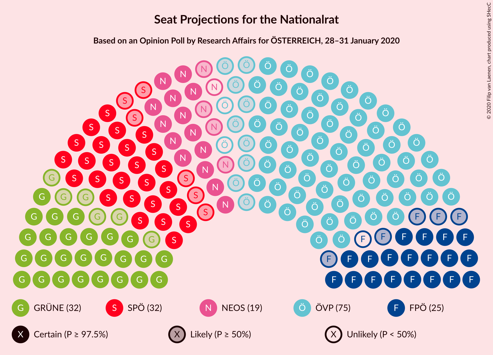
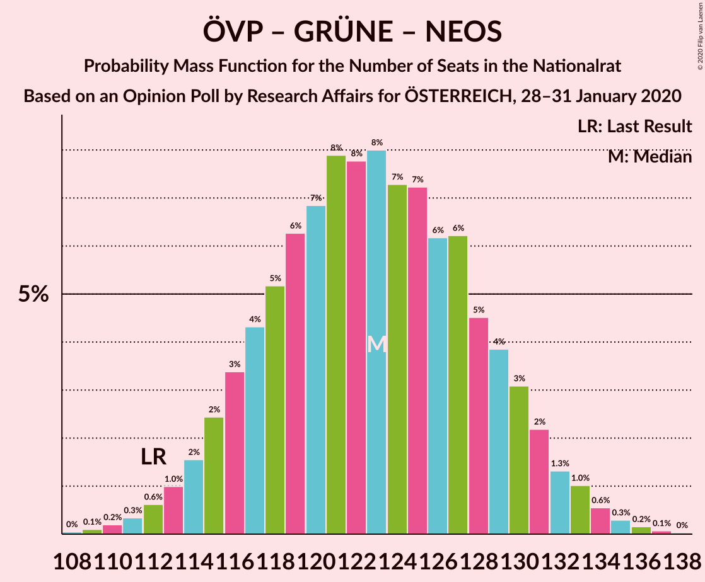
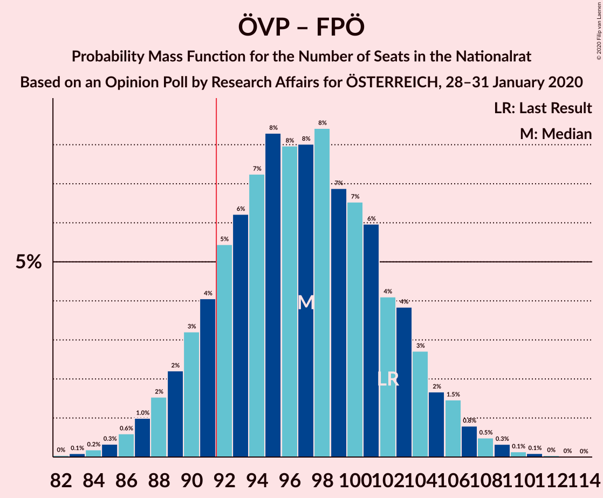

# Opinion Poll by Research Affairs for ÖSTERREICH, 28–31 January 2020

<a href="#voting-intentions">Voting Intentions</a> | <a href="#seats">Seats</a> | <a href="#coalitions">Coalitions</a> | <a href="#technical-information">Technical Information</a>

## Voting Intentions

### Confidence Intervals

| Party | Last Result | Poll Result | 80% Confidence Interval | 90% Confidence Interval | 95% Confidence Interval | 99% Confidence Interval |
|:-----:|:-----------:|:-----------:|:-----------------------:|:-----------------------:|:-----------------------:|:-----------------------:|
| Österreichische Volkspartei | 37.5% | 39.0% | 36.3–41.9% |35.5–42.7% |34.8–43.3% |33.5–44.7% |
| Sozialdemokratische Partei Österreichs | 21.2% | 17.0% | 15.0–19.3% |14.4–20.0% |14.0–20.5% |13.0–21.7% |
| Die Grünen–Die Grüne Alternative | 13.9% | 17.0% | 15.0–19.3% |14.4–20.0% |14.0–20.5% |13.0–21.7% |
| Freiheitliche Partei Österreichs | 16.2% | 13.0% | 11.2–15.1% |10.7–15.7% |10.3–16.2% |9.5–17.3% |
| NEOS–Das Neue Österreich und Liberales Forum | 8.1% | 10.0% | 8.5–11.9% |8.0–12.5% |7.7–13.0% |7.0–13.9% |

*Note:* The poll result column reflects the actual value used in the calculations. Published results may vary slightly, and in addition be rounded to fewer digits.

## Seats

### Confidence Intervals

| Party | Last Result | Median | 80% Confidence Interval | 90% Confidence Interval | 95% Confidence Interval | 99% Confidence Interval |
|:-----:|:-----------:|:------:|:-----------------------:|:-----------------------:|:-----------------------:|:-----------------------:|
| <a href="#österreichische-volkspartei">Österreichische Volkspartei</a> | 71 | 73 | 69–78 |67–79 |66–80 |64–82 |
| <a href="#sozialdemokratische-partei-österreichs">Sozialdemokratische Partei Österreichs</a> | 40 | 31 | 27–35 |26–36 |26–37 |24–40 |
| <a href="#die-grünen–die-grüne-alternative">Die Grünen–Die Grüne Alternative</a> | 26 | 32 | 28–36 |27–37 |26–38 |24–41 |
| <a href="#freiheitliche-partei-österreichs">Freiheitliche Partei Österreichs</a> | 31 | 24 | 21–28 |20–29 |19–29 |18–31 |
| <a href="#neos–das-neue-österreich-und-liberales-forum">NEOS–Das Neue Österreich und Liberales Forum</a> | 15 | 18 | 15–21 |15–23 |14–23 |13–25 |

### Österreichische Volkspartei

*For a full overview of the results for this party, see the [Österreichische Volkspartei](party-österreichischevolkspartei.html) page.*

| Number of Seats | Probability | Accumulated | Special Marks |
|:---------------:|:-----------:|:-----------:|:-------------:|
| 59 | 0% | 100% |  |
| 60 | 0% | 99.9% |  |
| 61 | 0.1% | 99.9% |  |
| 62 | 0.1% | 99.8% |  |
| 63 | 0.2% | 99.7% |  |
| 64 | 0.3% | 99.6% |  |
| 65 | 0.7% | 99.3% |  |
| 66 | 1.4% | 98.6% |  |
| 67 | 3% | 97% |  |
| 68 | 4% | 95% |  |
| 69 | 6% | 90% |  |
| 70 | 8% | 84% |  |
| 71 | 10% | 76% | Last Result |
| 72 | 9% | 65% |  |
| 73 | 10% | 56% | Median |
| 74 | 11% | 46% |  |
| 75 | 9% | 35% |  |
| 76 | 8% | 26% |  |
| 77 | 6% | 18% |  |
| 78 | 5% | 12% |  |
| 79 | 3% | 8% |  |
| 80 | 2% | 4% |  |
| 81 | 1.0% | 2% |  |
| 82 | 0.7% | 1.1% |  |
| 83 | 0.2% | 0.4% |  |
| 84 | 0.1% | 0.1% |  |
| 85 | 0% | 0.1% |  |
| 86 | 0% | 0% |  |

### Sozialdemokratische Partei Österreichs

*For a full overview of the results for this party, see the [Sozialdemokratische Partei Österreichs](party-sozialdemokratischeparteiösterreichs.html) page.*

| Number of Seats | Probability | Accumulated | Special Marks |
|:---------------:|:-----------:|:-----------:|:-------------:|
| 22 | 0.1% | 100% |  |
| 23 | 0.2% | 99.9% |  |
| 24 | 0.6% | 99.7% |  |
| 25 | 1.5% | 99.1% |  |
| 26 | 3% | 98% |  |
| 27 | 5% | 95% |  |
| 28 | 8% | 90% |  |
| 29 | 10% | 82% |  |
| 30 | 13% | 72% |  |
| 31 | 13% | 59% | Median |
| 32 | 13% | 46% |  |
| 33 | 10% | 33% |  |
| 34 | 9% | 23% |  |
| 35 | 6% | 14% |  |
| 36 | 4% | 9% |  |
| 37 | 2% | 5% |  |
| 38 | 1.3% | 2% |  |
| 39 | 0.5% | 1.1% |  |
| 40 | 0.4% | 0.6% | Last Result |
| 41 | 0.1% | 0.2% |  |
| 42 | 0.1% | 0.1% |  |
| 43 | 0% | 0% |  |

### Die Grünen–Die Grüne Alternative

*For a full overview of the results for this party, see the [Die Grünen–Die Grüne Alternative](party-diegrünen–diegrünealternative.html) page.*

| Number of Seats | Probability | Accumulated | Special Marks |
|:---------------:|:-----------:|:-----------:|:-------------:|
| 22 | 0.1% | 100% |  |
| 23 | 0.2% | 99.9% |  |
| 24 | 0.6% | 99.7% |  |
| 25 | 2% | 99.0% |  |
| 26 | 2% | 98% | Last Result |
| 27 | 4% | 95% |  |
| 28 | 7% | 91% |  |
| 29 | 10% | 84% |  |
| 30 | 11% | 74% |  |
| 31 | 12% | 63% |  |
| 32 | 13% | 51% | Median |
| 33 | 11% | 38% |  |
| 34 | 9% | 28% |  |
| 35 | 7% | 19% |  |
| 36 | 4% | 12% |  |
| 37 | 3% | 7% |  |
| 38 | 2% | 4% |  |
| 39 | 1.1% | 2% |  |
| 40 | 0.6% | 1.1% |  |
| 41 | 0.3% | 0.5% |  |
| 42 | 0.1% | 0.2% |  |
| 43 | 0.1% | 0.1% |  |
| 44 | 0% | 0% |  |

### Freiheitliche Partei Österreichs

*For a full overview of the results for this party, see the [Freiheitliche Partei Österreichs](party-freiheitlicheparteiösterreichs.html) page.*

| Number of Seats | Probability | Accumulated | Special Marks |
|:---------------:|:-----------:|:-----------:|:-------------:|
| 16 | 0.1% | 100% |  |
| 17 | 0.4% | 99.9% |  |
| 18 | 0.9% | 99.5% |  |
| 19 | 3% | 98.6% |  |
| 20 | 5% | 96% |  |
| 21 | 8% | 91% |  |
| 22 | 12% | 83% |  |
| 23 | 14% | 71% |  |
| 24 | 15% | 57% | Median |
| 25 | 13% | 42% |  |
| 26 | 11% | 29% |  |
| 27 | 8% | 18% |  |
| 28 | 5% | 10% |  |
| 29 | 3% | 5% |  |
| 30 | 1.4% | 2% |  |
| 31 | 0.6% | 1.1% | Last Result |
| 32 | 0.3% | 0.5% |  |
| 33 | 0.1% | 0.2% |  |
| 34 | 0% | 0.1% |  |
| 35 | 0% | 0% |  |

### NEOS–Das Neue Österreich und Liberales Forum

*For a full overview of the results for this party, see the [NEOS–Das Neue Österreich und Liberales Forum](party-neos–dasneueösterreichundliberalesforum.html) page.*

| Number of Seats | Probability | Accumulated | Special Marks |
|:---------------:|:-----------:|:-----------:|:-------------:|
| 11 | 0.1% | 100% |  |
| 12 | 0.4% | 99.9% |  |
| 13 | 1.3% | 99.5% |  |
| 14 | 3% | 98% |  |
| 15 | 9% | 95% | Last Result |
| 16 | 9% | 86% |  |
| 17 | 16% | 77% |  |
| 18 | 18% | 62% | Median |
| 19 | 12% | 43% |  |
| 20 | 14% | 31% |  |
| 21 | 8% | 17% |  |
| 22 | 4% | 9% |  |
| 23 | 3% | 5% |  |
| 24 | 0.9% | 2% |  |
| 25 | 0.4% | 0.8% |  |
| 26 | 0.2% | 0.3% |  |
| 27 | 0% | 0.1% |  |
| 28 | 0% | 0% |  |

## Coalitions

### Confidence Intervals

| Coalition | Last Result | Median | Majority? | 80% Confidence Interval | 90% Confidence Interval | 95% Confidence Interval | 99% Confidence Interval |
|:---------:|:-----------:|:------:|:---------:|:-----------------------:|:-----------------------:|:-----------------------:|:-----------------------:|
| Österreichische Volkspartei – Die Grünen–Die Grüne Alternative – NEOS–Das Neue Österreich und Liberales Forum | 112 | 123 | 100% | 117–129 | 116–130 | 115–132 | 112–134 |
| Österreichische Volkspartei – Die Grünen–Die Grüne Alternative | 97 | 105 | 99.8% | 100–110 | 99–111 | 97–113 | 95–115 |
| Österreichische Volkspartei – Sozialdemokratische Partei Österreichs | 111 | 104 | 99.9% | 99–110 | 97–112 | 96–113 | 93–116 |
| Österreichische Volkspartei – Freiheitliche Partei Österreichs | 102 | 97 | 90% | 91–103 | 90–105 | 89–106 | 86–109 |
| Österreichische Volkspartei – NEOS–Das Neue Österreich und Liberales Forum | 86 | 91 | 49% | 86–97 | 84–99 | 83–100 | 81–103 |
| Die Grünen–Die Grüne Alternative – Sozialdemokratische Partei Österreichs – NEOS–Das Neue Österreich und Liberales Forum | 81 | 81 | 0.8% | 76–87 | 74–88 | 73–90 | 71–92 |
| Österreichische Volkspartei | 71 | 73 | 0% | 69–78 | 67–79 | 66–80 | 64–82 |
| Die Grünen–Die Grüne Alternative – Sozialdemokratische Partei Österreichs | 66 | 63 | 0% | 58–68 | 56–70 | 55–71 | 53–74 |
| Sozialdemokratische Partei Österreichs – Freiheitliche Partei Österreichs | 71 | 55 | 0% | 51–60 | 50–61 | 49–62 | 47–65 |
| Sozialdemokratische Partei Österreichs | 40 | 31 | 0% | 27–35 | 26–36 | 26–37 | 24–40 |

### Österreichische Volkspartei – Die Grünen–Die Grüne Alternative – NEOS–Das Neue Österreich und Liberales Forum

| Number of Seats | Probability | Accumulated | Special Marks |
|:---------------:|:-----------:|:-----------:|:-------------:|
| 109 | 0% | 100% |  |
| 110 | 0.1% | 99.9% |  |
| 111 | 0.1% | 99.9% |  |
| 112 | 0.3% | 99.8% | Last Result |
| 113 | 0.5% | 99.5% |  |
| 114 | 0.9% | 99.0% |  |
| 115 | 2% | 98% |  |
| 116 | 3% | 96% |  |
| 117 | 4% | 93% |  |
| 118 | 5% | 89% |  |
| 119 | 6% | 84% |  |
| 120 | 7% | 78% |  |
| 121 | 9% | 71% |  |
| 122 | 9% | 62% |  |
| 123 | 8% | 53% | Median |
| 124 | 8% | 45% |  |
| 125 | 7% | 37% |  |
| 126 | 7% | 30% |  |
| 127 | 7% | 24% |  |
| 128 | 6% | 17% |  |
| 129 | 4% | 11% |  |
| 130 | 3% | 8% |  |
| 131 | 2% | 5% |  |
| 132 | 1.4% | 3% |  |
| 133 | 0.7% | 1.4% |  |
| 134 | 0.4% | 0.7% |  |
| 135 | 0.2% | 0.3% |  |
| 136 | 0.1% | 0.1% |  |
| 137 | 0% | 0% |  |

### Österreichische Volkspartei – Die Grünen–Die Grüne Alternative

| Number of Seats | Probability | Accumulated | Special Marks |
|:---------------:|:-----------:|:-----------:|:-------------:|
| 89 | 0% | 100% |  |
| 90 | 0% | 99.9% |  |
| 91 | 0.1% | 99.9% |  |
| 92 | 0.1% | 99.8% | Majority |
| 93 | 0% | 99.7% |  |
| 94 | 0.1% | 99.7% |  |
| 95 | 0.1% | 99.6% |  |
| 96 | 0.4% | 99.5% |  |
| 97 | 2% | 99.1% | Last Result |
| 98 | 2% | 97% |  |
| 99 | 4% | 95% |  |
| 100 | 6% | 91% |  |
| 101 | 7% | 85% |  |
| 102 | 7% | 78% |  |
| 103 | 10% | 72% |  |
| 104 | 10% | 62% |  |
| 105 | 10% | 52% | Median |
| 106 | 9% | 42% |  |
| 107 | 7% | 33% |  |
| 108 | 7% | 25% |  |
| 109 | 6% | 19% |  |
| 110 | 4% | 13% |  |
| 111 | 3% | 8% |  |
| 112 | 2% | 5% |  |
| 113 | 1.3% | 3% |  |
| 114 | 0.7% | 1.3% |  |
| 115 | 0.3% | 0.6% |  |
| 116 | 0.2% | 0.3% |  |
| 117 | 0% | 0% |  |

### Österreichische Volkspartei – Sozialdemokratische Partei Österreichs

| Number of Seats | Probability | Accumulated | Special Marks |
|:---------------:|:-----------:|:-----------:|:-------------:|
| 90 | 0% | 100% |  |
| 91 | 0.1% | 99.9% |  |
| 92 | 0.1% | 99.9% | Majority |
| 93 | 0.3% | 99.8% |  |
| 94 | 0.5% | 99.5% |  |
| 95 | 1.0% | 99.0% |  |
| 96 | 1.2% | 98% |  |
| 97 | 2% | 97% |  |
| 98 | 4% | 95% |  |
| 99 | 5% | 91% |  |
| 100 | 5% | 86% |  |
| 101 | 7% | 81% |  |
| 102 | 9% | 74% |  |
| 103 | 9% | 65% |  |
| 104 | 8% | 56% | Median |
| 105 | 7% | 47% |  |
| 106 | 9% | 41% |  |
| 107 | 6% | 32% |  |
| 108 | 7% | 26% |  |
| 109 | 6% | 19% |  |
| 110 | 4% | 13% |  |
| 111 | 2% | 9% | Last Result |
| 112 | 3% | 7% |  |
| 113 | 2% | 4% |  |
| 114 | 0.8% | 2% |  |
| 115 | 0.6% | 1.3% |  |
| 116 | 0.4% | 0.7% |  |
| 117 | 0.2% | 0.3% |  |
| 118 | 0% | 0.1% |  |
| 119 | 0% | 0.1% |  |
| 120 | 0% | 0% |  |

### Österreichische Volkspartei – Freiheitliche Partei Österreichs

| Number of Seats | Probability | Accumulated | Special Marks |
|:---------------:|:-----------:|:-----------:|:-------------:|
| 83 | 0% | 100% |  |
| 84 | 0.1% | 99.9% |  |
| 85 | 0.2% | 99.8% |  |
| 86 | 0.3% | 99.7% |  |
| 87 | 0.6% | 99.4% |  |
| 88 | 1.1% | 98.8% |  |
| 89 | 1.5% | 98% |  |
| 90 | 3% | 96% |  |
| 91 | 4% | 94% |  |
| 92 | 5% | 90% | Majority |
| 93 | 5% | 84% |  |
| 94 | 7% | 79% |  |
| 95 | 9% | 72% |  |
| 96 | 8% | 64% |  |
| 97 | 9% | 56% | Median |
| 98 | 9% | 47% |  |
| 99 | 7% | 38% |  |
| 100 | 6% | 30% |  |
| 101 | 7% | 24% |  |
| 102 | 5% | 17% | Last Result |
| 103 | 4% | 13% |  |
| 104 | 4% | 9% |  |
| 105 | 2% | 5% |  |
| 106 | 1.4% | 3% |  |
| 107 | 1.0% | 2% |  |
| 108 | 0.4% | 0.9% |  |
| 109 | 0.3% | 0.6% |  |
| 110 | 0.1% | 0.2% |  |
| 111 | 0.1% | 0.1% |  |
| 112 | 0% | 0.1% |  |
| 113 | 0% | 0% |  |

### Österreichische Volkspartei – NEOS–Das Neue Österreich und Liberales Forum

| Number of Seats | Probability | Accumulated | Special Marks |
|:---------------:|:-----------:|:-----------:|:-------------:|
| 78 | 0% | 100% |  |
| 79 | 0.1% | 99.9% |  |
| 80 | 0.2% | 99.8% |  |
| 81 | 0.3% | 99.6% |  |
| 82 | 0.9% | 99.3% |  |
| 83 | 1.3% | 98% |  |
| 84 | 2% | 97% |  |
| 85 | 3% | 95% |  |
| 86 | 5% | 91% | Last Result |
| 87 | 5% | 86% |  |
| 88 | 7% | 81% |  |
| 89 | 8% | 74% |  |
| 90 | 9% | 67% |  |
| 91 | 9% | 58% | Median |
| 92 | 9% | 49% | Majority |
| 93 | 9% | 40% |  |
| 94 | 7% | 31% |  |
| 95 | 7% | 24% |  |
| 96 | 5% | 17% |  |
| 97 | 5% | 13% |  |
| 98 | 3% | 8% |  |
| 99 | 2% | 5% |  |
| 100 | 1.5% | 3% |  |
| 101 | 0.8% | 2% |  |
| 102 | 0.5% | 1.1% |  |
| 103 | 0.4% | 0.6% |  |
| 104 | 0.1% | 0.2% |  |
| 105 | 0.1% | 0.1% |  |
| 106 | 0% | 0% |  |

### Die Grünen–Die Grüne Alternative – Sozialdemokratische Partei Österreichs – NEOS–Das Neue Österreich und Liberales Forum

| Number of Seats | Probability | Accumulated | Special Marks |
|:---------------:|:-----------:|:-----------:|:-------------:|
| 68 | 0% | 100% |  |
| 69 | 0.1% | 99.9% |  |
| 70 | 0.3% | 99.8% |  |
| 71 | 0.5% | 99.6% |  |
| 72 | 1.0% | 99.1% |  |
| 73 | 1.2% | 98% |  |
| 74 | 2% | 97% |  |
| 75 | 3% | 94% |  |
| 76 | 4% | 91% |  |
| 77 | 6% | 87% |  |
| 78 | 8% | 81% |  |
| 79 | 8% | 73% |  |
| 80 | 10% | 65% |  |
| 81 | 9% | 56% | Last Result, Median |
| 82 | 10% | 47% |  |
| 83 | 7% | 37% |  |
| 84 | 8% | 29% |  |
| 85 | 7% | 22% |  |
| 86 | 4% | 15% |  |
| 87 | 4% | 11% |  |
| 88 | 2% | 7% |  |
| 89 | 2% | 4% |  |
| 90 | 1.3% | 3% |  |
| 91 | 0.6% | 1.4% |  |
| 92 | 0.4% | 0.8% | Majority |
| 93 | 0.2% | 0.4% |  |
| 94 | 0.1% | 0.2% |  |
| 95 | 0.1% | 0.1% |  |
| 96 | 0% | 0% |  |

### Österreichische Volkspartei

| Number of Seats | Probability | Accumulated | Special Marks |
|:---------------:|:-----------:|:-----------:|:-------------:|
| 59 | 0% | 100% |  |
| 60 | 0% | 99.9% |  |
| 61 | 0.1% | 99.9% |  |
| 62 | 0.1% | 99.8% |  |
| 63 | 0.2% | 99.7% |  |
| 64 | 0.3% | 99.6% |  |
| 65 | 0.7% | 99.3% |  |
| 66 | 1.4% | 98.6% |  |
| 67 | 3% | 97% |  |
| 68 | 4% | 95% |  |
| 69 | 6% | 90% |  |
| 70 | 8% | 84% |  |
| 71 | 10% | 76% | Last Result |
| 72 | 9% | 65% |  |
| 73 | 10% | 56% | Median |
| 74 | 11% | 46% |  |
| 75 | 9% | 35% |  |
| 76 | 8% | 26% |  |
| 77 | 6% | 18% |  |
| 78 | 5% | 12% |  |
| 79 | 3% | 8% |  |
| 80 | 2% | 4% |  |
| 81 | 1.0% | 2% |  |
| 82 | 0.7% | 1.1% |  |
| 83 | 0.2% | 0.4% |  |
| 84 | 0.1% | 0.1% |  |
| 85 | 0% | 0.1% |  |
| 86 | 0% | 0% |  |

### Die Grünen–Die Grüne Alternative – Sozialdemokratische Partei Österreichs

| Number of Seats | Probability | Accumulated | Special Marks |
|:---------------:|:-----------:|:-----------:|:-------------:|
| 50 | 0.1% | 100% |  |
| 51 | 0% | 99.9% |  |
| 52 | 0.3% | 99.9% |  |
| 53 | 0.5% | 99.6% |  |
| 54 | 0.6% | 99.1% |  |
| 55 | 2% | 98.5% |  |
| 56 | 2% | 96% |  |
| 57 | 3% | 95% |  |
| 58 | 6% | 91% |  |
| 59 | 3% | 85% |  |
| 60 | 11% | 82% |  |
| 61 | 8% | 71% |  |
| 62 | 8% | 62% |  |
| 63 | 13% | 55% | Median |
| 64 | 6% | 42% |  |
| 65 | 10% | 36% |  |
| 66 | 8% | 26% | Last Result |
| 67 | 4% | 18% |  |
| 68 | 6% | 14% |  |
| 69 | 3% | 9% |  |
| 70 | 2% | 6% |  |
| 71 | 2% | 4% |  |
| 72 | 0.5% | 2% |  |
| 73 | 0.8% | 1.4% |  |
| 74 | 0.3% | 0.6% |  |
| 75 | 0.1% | 0.3% |  |
| 76 | 0.1% | 0.2% |  |
| 77 | 0% | 0.1% |  |
| 78 | 0% | 0% |  |

### Sozialdemokratische Partei Österreichs – Freiheitliche Partei Österreichs

| Number of Seats | Probability | Accumulated | Special Marks |
|:---------------:|:-----------:|:-----------:|:-------------:|
| 44 | 0% | 100% |  |
| 45 | 0.1% | 99.9% |  |
| 46 | 0.3% | 99.8% |  |
| 47 | 0.6% | 99.5% |  |
| 48 | 1.4% | 98.9% |  |
| 49 | 2% | 98% |  |
| 50 | 4% | 95% |  |
| 51 | 5% | 92% |  |
| 52 | 8% | 86% |  |
| 53 | 9% | 78% |  |
| 54 | 11% | 70% |  |
| 55 | 11% | 59% | Median |
| 56 | 11% | 48% |  |
| 57 | 10% | 36% |  |
| 58 | 8% | 27% |  |
| 59 | 6% | 18% |  |
| 60 | 5% | 12% |  |
| 61 | 3% | 8% |  |
| 62 | 2% | 4% |  |
| 63 | 0.9% | 2% |  |
| 64 | 0.6% | 1.2% |  |
| 65 | 0.3% | 0.6% |  |
| 66 | 0.1% | 0.3% |  |
| 67 | 0.1% | 0.2% |  |
| 68 | 0% | 0.1% |  |
| 69 | 0% | 0.1% |  |
| 70 | 0% | 0% |  |
| 71 | 0% | 0% | Last Result |

### Sozialdemokratische Partei Österreichs

| Number of Seats | Probability | Accumulated | Special Marks |
|:---------------:|:-----------:|:-----------:|:-------------:|
| 22 | 0.1% | 100% |  |
| 23 | 0.2% | 99.9% |  |
| 24 | 0.6% | 99.7% |  |
| 25 | 1.5% | 99.1% |  |
| 26 | 3% | 98% |  |
| 27 | 5% | 95% |  |
| 28 | 8% | 90% |  |
| 29 | 10% | 82% |  |
| 30 | 13% | 72% |  |
| 31 | 13% | 59% | Median |
| 32 | 13% | 46% |  |
| 33 | 10% | 33% |  |
| 34 | 9% | 23% |  |
| 35 | 6% | 14% |  |
| 36 | 4% | 9% |  |
| 37 | 2% | 5% |  |
| 38 | 1.3% | 2% |  |
| 39 | 0.5% | 1.1% |  |
| 40 | 0.4% | 0.6% | Last Result |
| 41 | 0.1% | 0.2% |  |
| 42 | 0.1% | 0.1% |  |
| 43 | 0% | 0% |  |

## Technical Information

### Opinion Poll

+ **Polling firm:** Research Affairs
+ **Commissioner(s):** ÖSTERREICH
+ **Fieldwork period:** 28–31 January 2020

### Calculations

+ **Sample size:** 500
+ **Simulations done:** 131,072
+ **Error estimate:** 1.14%

