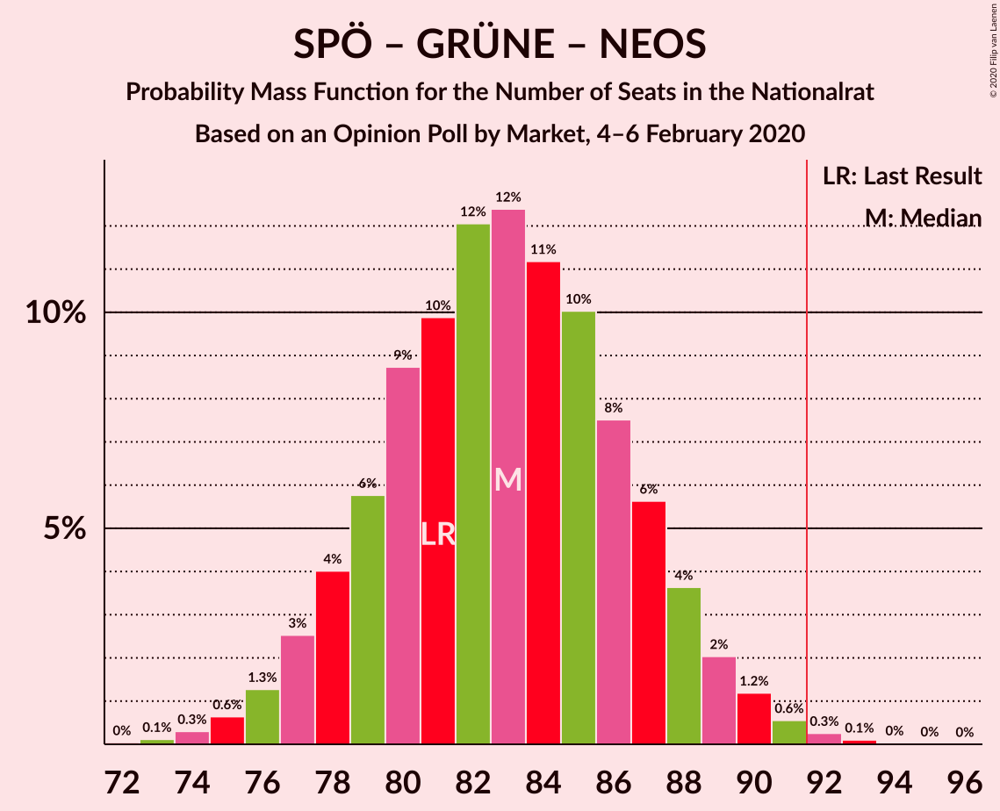
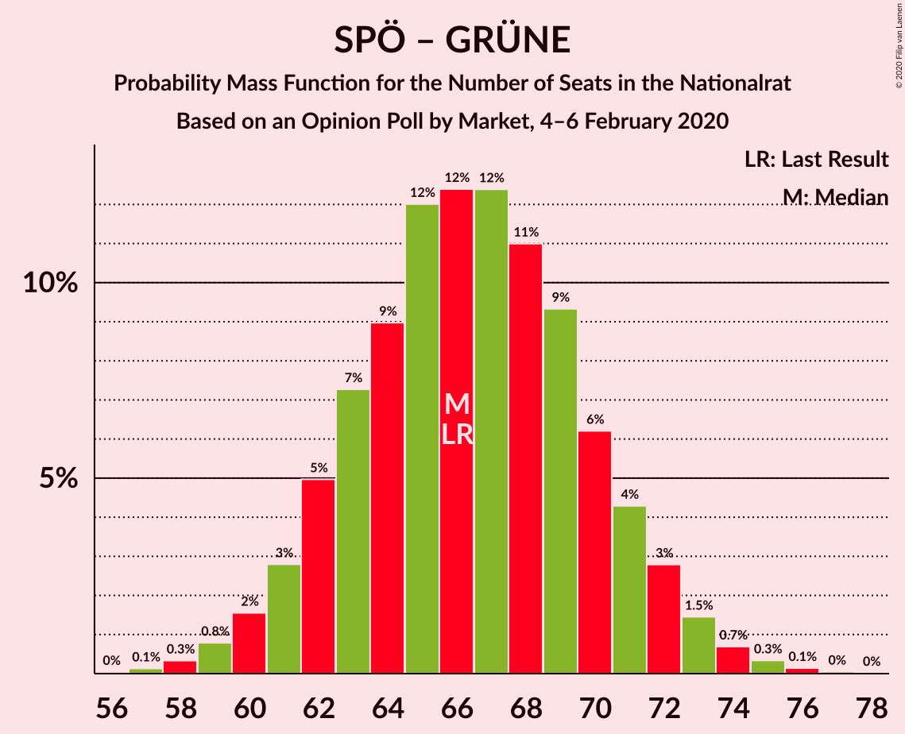
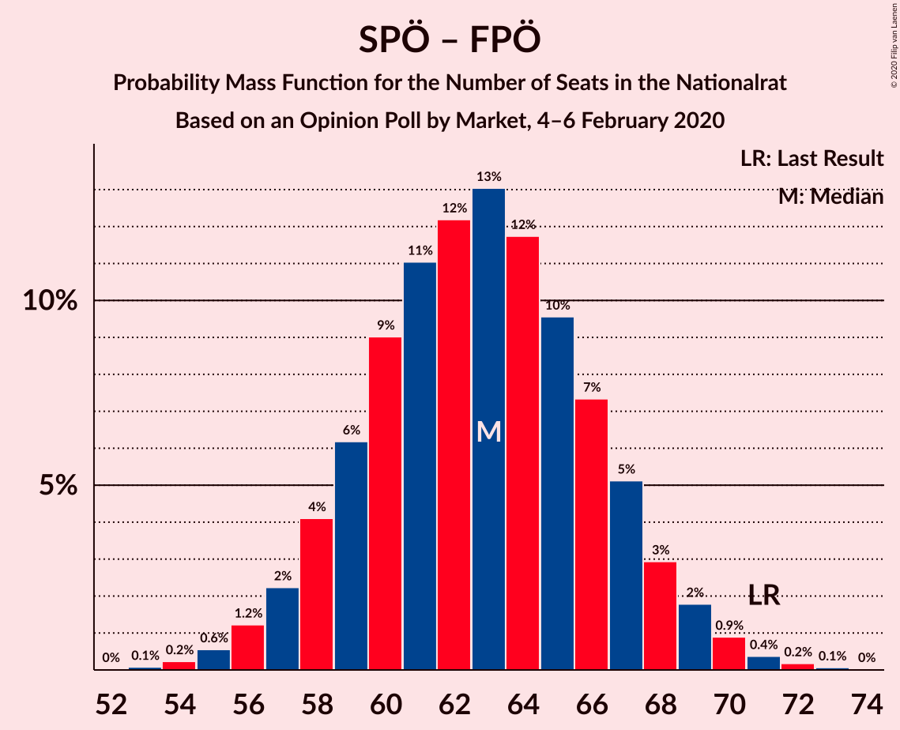

# Opinion Poll by Market, 4–6 February 2020

<a href="#voting-intentions">Voting Intentions</a> | <a href="#seats">Seats</a> | <a href="#coalitions">Coalitions</a> | <a href="#technical-information">Technical Information</a>

## Voting Intentions

### Confidence Intervals

| Party | Last Result | Poll Result | 80% Confidence Interval | 90% Confidence Interval | 95% Confidence Interval | 99% Confidence Interval |
|:-----:|:-----------:|:-----------:|:-----------------------:|:-----------------------:|:-----------------------:|:-----------------------:|
| Österreichische Volkspartei | 37.5% | 39.0% | 36.8–41.2% |36.2–41.9% |35.7–42.4% |34.7–43.5% |
| Sozialdemokratische Partei Österreichs | 21.2% | 18.9% | 17.3–20.8% |16.8–21.3% |16.4–21.8% |15.6–22.7% |
| Die Grünen–Die Grüne Alternative | 13.9% | 17.0% | 15.4–18.8% |14.9–19.3% |14.5–19.7% |13.8–20.6% |
| Freiheitliche Partei Österreichs | 16.2% | 15.0% | 13.5–16.7% |13.1–17.2% |12.7–17.6% |12.0–18.5% |
| NEOS–Das Neue Österreich und Liberales Forum | 8.1% | 9.0% | 7.8–10.4% |7.5–10.8% |7.2–11.2% |6.7–11.9% |

*Note:* The poll result column reflects the actual value used in the calculations. Published results may vary slightly, and in addition be rounded to fewer digits.

## Seats

### Confidence Intervals

| Party | Last Result | Median | 80% Confidence Interval | 90% Confidence Interval | 95% Confidence Interval | 99% Confidence Interval |
|:-----:|:-----------:|:------:|:-----------------------:|:-----------------------:|:-----------------------:|:-----------------------:|
| <a href="#österreichische-volkspartei">Österreichische Volkspartei</a> | 71 | 72 | 68–76 |67–78 |66–79 |64–81 |
| <a href="#sozialdemokratische-partei-österreichs">Sozialdemokratische Partei Österreichs</a> | 40 | 35 | 32–38 |31–39 |30–40 |29–42 |
| <a href="#die-grünen–die-grüne-alternative">Die Grünen–Die Grüne Alternative</a> | 26 | 31 | 28–34 |27–36 |27–36 |25–38 |
| <a href="#freiheitliche-partei-österreichs">Freiheitliche Partei Österreichs</a> | 31 | 28 | 25–31 |24–32 |23–32 |22–34 |
| <a href="#neos–das-neue-österreich-und-liberales-forum">NEOS–Das Neue Österreich und Liberales Forum</a> | 15 | 16 | 14–19 |13–20 |13–20 |12–22 |

### Österreichische Volkspartei

*For a full overview of the results for this party, see the [Österreichische Volkspartei](party-österreichischevolkspartei.html) page.*

| Number of Seats | Probability | Accumulated | Special Marks |
|:---------------:|:-----------:|:-----------:|:-------------:|
| 62 | 0.1% | 100% |  |
| 63 | 0.2% | 99.9% |  |
| 64 | 0.4% | 99.8% |  |
| 65 | 0.6% | 99.3% |  |
| 66 | 1.4% | 98.7% |  |
| 67 | 4% | 97% |  |
| 68 | 4% | 94% |  |
| 69 | 7% | 89% |  |
| 70 | 9% | 82% |  |
| 71 | 12% | 73% | Last Result |
| 72 | 13% | 61% | Median |
| 73 | 13% | 48% |  |
| 74 | 9% | 35% |  |
| 75 | 8% | 26% |  |
| 76 | 9% | 18% |  |
| 77 | 4% | 9% |  |
| 78 | 2% | 5% |  |
| 79 | 2% | 3% |  |
| 80 | 0.8% | 1.4% |  |
| 81 | 0.4% | 0.6% |  |
| 82 | 0.1% | 0.2% |  |
| 83 | 0.1% | 0.1% |  |
| 84 | 0% | 0% |  |

### Sozialdemokratische Partei Österreichs

*For a full overview of the results for this party, see the [Sozialdemokratische Partei Österreichs](party-sozialdemokratischeparteiösterreichs.html) page.*

| Number of Seats | Probability | Accumulated | Special Marks |
|:---------------:|:-----------:|:-----------:|:-------------:|
| 27 | 0.1% | 100% |  |
| 28 | 0.3% | 99.9% |  |
| 29 | 0.8% | 99.6% |  |
| 30 | 2% | 98.8% |  |
| 31 | 5% | 97% |  |
| 32 | 8% | 92% |  |
| 33 | 12% | 84% |  |
| 34 | 14% | 72% |  |
| 35 | 15% | 58% | Median |
| 36 | 14% | 43% |  |
| 37 | 13% | 28% |  |
| 38 | 7% | 16% |  |
| 39 | 5% | 9% |  |
| 40 | 2% | 4% | Last Result |
| 41 | 1.2% | 2% |  |
| 42 | 0.4% | 0.7% |  |
| 43 | 0.2% | 0.3% |  |
| 44 | 0.1% | 0.1% |  |
| 45 | 0% | 0% |  |

### Die Grünen–Die Grüne Alternative

*For a full overview of the results for this party, see the [Die Grünen–Die Grüne Alternative](party-diegrünen–diegrünealternative.html) page.*

| Number of Seats | Probability | Accumulated | Special Marks |
|:---------------:|:-----------:|:-----------:|:-------------:|
| 24 | 0.1% | 100% |  |
| 25 | 0.4% | 99.8% |  |
| 26 | 1.5% | 99.4% | Last Result |
| 27 | 4% | 98% |  |
| 28 | 6% | 94% |  |
| 29 | 9% | 88% |  |
| 30 | 16% | 79% |  |
| 31 | 16% | 63% | Median |
| 32 | 13% | 46% |  |
| 33 | 16% | 34% |  |
| 34 | 8% | 18% |  |
| 35 | 4% | 10% |  |
| 36 | 3% | 6% |  |
| 37 | 1.5% | 2% |  |
| 38 | 0.4% | 0.7% |  |
| 39 | 0.2% | 0.3% |  |
| 40 | 0.1% | 0.1% |  |
| 41 | 0% | 0% |  |

### Freiheitliche Partei Österreichs

*For a full overview of the results for this party, see the [Freiheitliche Partei Österreichs](party-freiheitlicheparteiösterreichs.html) page.*

| Number of Seats | Probability | Accumulated | Special Marks |
|:---------------:|:-----------:|:-----------:|:-------------:|
| 21 | 0.2% | 100% |  |
| 22 | 0.7% | 99.8% |  |
| 23 | 2% | 99.0% |  |
| 24 | 5% | 97% |  |
| 25 | 9% | 92% |  |
| 26 | 13% | 82% |  |
| 27 | 18% | 70% |  |
| 28 | 16% | 52% | Median |
| 29 | 14% | 35% |  |
| 30 | 10% | 21% |  |
| 31 | 6% | 12% | Last Result |
| 32 | 3% | 5% |  |
| 33 | 1.3% | 2% |  |
| 34 | 0.6% | 0.9% |  |
| 35 | 0.2% | 0.3% |  |
| 36 | 0.1% | 0.1% |  |
| 37 | 0% | 0% |  |

### NEOS–Das Neue Österreich und Liberales Forum

*For a full overview of the results for this party, see the [NEOS–Das Neue Österreich und Liberales Forum](party-neos–dasneueösterreichundliberalesforum.html) page.*

| Number of Seats | Probability | Accumulated | Special Marks |
|:---------------:|:-----------:|:-----------:|:-------------:|
| 11 | 0.2% | 100% |  |
| 12 | 1.1% | 99.8% |  |
| 13 | 4% | 98.7% |  |
| 14 | 9% | 95% |  |
| 15 | 15% | 86% | Last Result |
| 16 | 22% | 70% | Median |
| 17 | 21% | 49% |  |
| 18 | 15% | 28% |  |
| 19 | 8% | 14% |  |
| 20 | 4% | 6% |  |
| 21 | 1.5% | 2% |  |
| 22 | 0.5% | 0.7% |  |
| 23 | 0.1% | 0.2% |  |
| 24 | 0% | 0% |  |

## Coalitions

### Confidence Intervals

| Coalition | Last Result | Median | Majority? | 80% Confidence Interval | 90% Confidence Interval | 95% Confidence Interval | 99% Confidence Interval |
|:---------:|:-----------:|:------:|:---------:|:-----------------------:|:-----------------------:|:-----------------------:|:-----------------------:|
| Österreichische Volkspartei – Die Grünen–Die Grüne Alternative – NEOS–Das Neue Österreich und Liberales Forum | 112 | 120 | 100% | 116–124 | 115–125 | 114–126 | 112–128 |
| Österreichische Volkspartei – Sozialdemokratische Partei Österreichs | 111 | 107 | 100% | 103–112 | 102–113 | 101–114 | 99–116 |
| Österreichische Volkspartei – Die Grünen–Die Grüne Alternative | 97 | 104 | 100% | 100–108 | 98–109 | 97–110 | 96–112 |
| Österreichische Volkspartei – Freiheitliche Partei Österreichs | 102 | 100 | 99.6% | 96–104 | 95–105 | 94–106 | 92–108 |
| Österreichische Volkspartei – NEOS–Das Neue Österreich und Liberales Forum | 86 | 89 | 18% | 85–93 | 84–94 | 82–95 | 80–97 |
| Sozialdemokratische Partei Österreichs – Die Grünen–Die Grüne Alternative – NEOS–Das Neue Österreich und Liberales Forum | 81 | 83 | 0.4% | 79–87 | 78–88 | 77–89 | 75–91 |
| Österreichische Volkspartei | 71 | 72 | 0% | 68–76 | 67–78 | 66–79 | 64–81 |
| Sozialdemokratische Partei Österreichs – Die Grünen–Die Grüne Alternative | 66 | 66 | 0% | 62–71 | 61–72 | 60–73 | 58–75 |
| Sozialdemokratische Partei Österreichs – Freiheitliche Partei Österreichs | 71 | 63 | 0% | 59–67 | 58–68 | 57–69 | 55–71 |
| Sozialdemokratische Partei Österreichs | 40 | 35 | 0% | 32–38 | 31–39 | 30–40 | 29–42 |

### Österreichische Volkspartei – Die Grünen–Die Grüne Alternative – NEOS–Das Neue Österreich und Liberales Forum

| Number of Seats | Probability | Accumulated | Special Marks |
|:---------------:|:-----------:|:-----------:|:-------------:|
| 110 | 0.1% | 100% |  |
| 111 | 0.2% | 99.9% |  |
| 112 | 0.4% | 99.7% | Last Result |
| 113 | 0.8% | 99.3% |  |
| 114 | 2% | 98% |  |
| 115 | 2% | 96% |  |
| 116 | 5% | 94% |  |
| 117 | 7% | 89% |  |
| 118 | 11% | 82% |  |
| 119 | 9% | 71% | Median |
| 120 | 16% | 62% |  |
| 121 | 14% | 46% |  |
| 122 | 8% | 33% |  |
| 123 | 10% | 24% |  |
| 124 | 5% | 14% |  |
| 125 | 5% | 9% |  |
| 126 | 2% | 4% |  |
| 127 | 2% | 2% |  |
| 128 | 0.6% | 0.9% |  |
| 129 | 0.2% | 0.3% |  |
| 130 | 0.1% | 0.1% |  |
| 131 | 0% | 0% |  |

### Österreichische Volkspartei – Sozialdemokratische Partei Österreichs

| Number of Seats | Probability | Accumulated | Special Marks |
|:---------------:|:-----------:|:-----------:|:-------------:|
| 97 | 0.1% | 100% |  |
| 98 | 0.2% | 99.9% |  |
| 99 | 0.5% | 99.7% |  |
| 100 | 0.6% | 99.3% |  |
| 101 | 2% | 98.6% |  |
| 102 | 3% | 97% |  |
| 103 | 4% | 94% |  |
| 104 | 8% | 90% |  |
| 105 | 9% | 82% |  |
| 106 | 9% | 73% |  |
| 107 | 16% | 63% | Median |
| 108 | 10% | 47% |  |
| 109 | 11% | 38% |  |
| 110 | 10% | 26% |  |
| 111 | 5% | 16% | Last Result |
| 112 | 6% | 11% |  |
| 113 | 2% | 5% |  |
| 114 | 2% | 3% |  |
| 115 | 0.8% | 1.3% |  |
| 116 | 0.4% | 0.6% |  |
| 117 | 0.1% | 0.2% |  |
| 118 | 0% | 0.1% |  |
| 119 | 0% | 0% |  |

### Österreichische Volkspartei – Die Grünen–Die Grüne Alternative

| Number of Seats | Probability | Accumulated | Special Marks |
|:---------------:|:-----------:|:-----------:|:-------------:|
| 93 | 0% | 100% |  |
| 94 | 0.1% | 99.9% |  |
| 95 | 0.3% | 99.8% |  |
| 96 | 0.7% | 99.5% |  |
| 97 | 2% | 98.8% | Last Result |
| 98 | 2% | 97% |  |
| 99 | 4% | 95% |  |
| 100 | 8% | 91% |  |
| 101 | 7% | 83% |  |
| 102 | 11% | 76% |  |
| 103 | 8% | 65% | Median |
| 104 | 17% | 57% |  |
| 105 | 12% | 40% |  |
| 106 | 10% | 29% |  |
| 107 | 6% | 19% |  |
| 108 | 4% | 13% |  |
| 109 | 5% | 8% |  |
| 110 | 2% | 4% |  |
| 111 | 0.9% | 2% |  |
| 112 | 0.5% | 0.8% |  |
| 113 | 0.2% | 0.3% |  |
| 114 | 0.1% | 0.1% |  |
| 115 | 0% | 0% |  |

### Österreichische Volkspartei – Freiheitliche Partei Österreichs

| Number of Seats | Probability | Accumulated | Special Marks |
|:---------------:|:-----------:|:-----------:|:-------------:|
| 89 | 0% | 100% |  |
| 90 | 0.1% | 99.9% |  |
| 91 | 0.3% | 99.8% |  |
| 92 | 0.5% | 99.6% | Majority |
| 93 | 1.0% | 99.0% |  |
| 94 | 2% | 98% |  |
| 95 | 5% | 96% |  |
| 96 | 5% | 91% |  |
| 97 | 8% | 86% |  |
| 98 | 10% | 79% |  |
| 99 | 10% | 69% |  |
| 100 | 16% | 59% | Median |
| 101 | 10% | 43% |  |
| 102 | 10% | 33% | Last Result |
| 103 | 9% | 23% |  |
| 104 | 5% | 14% |  |
| 105 | 5% | 9% |  |
| 106 | 2% | 4% |  |
| 107 | 1.2% | 2% |  |
| 108 | 0.8% | 1.2% |  |
| 109 | 0.2% | 0.4% |  |
| 110 | 0.1% | 0.2% |  |
| 111 | 0% | 0.1% |  |
| 112 | 0% | 0% |  |

### Österreichische Volkspartei – NEOS–Das Neue Österreich und Liberales Forum

| Number of Seats | Probability | Accumulated | Special Marks |
|:---------------:|:-----------:|:-----------:|:-------------:|
| 78 | 0% | 100% |  |
| 79 | 0.2% | 99.9% |  |
| 80 | 0.4% | 99.7% |  |
| 81 | 0.5% | 99.4% |  |
| 82 | 1.5% | 98.9% |  |
| 83 | 2% | 97% |  |
| 84 | 4% | 95% |  |
| 85 | 5% | 91% |  |
| 86 | 6% | 86% | Last Result |
| 87 | 13% | 80% |  |
| 88 | 14% | 67% | Median |
| 89 | 9% | 53% |  |
| 90 | 12% | 44% |  |
| 91 | 13% | 31% |  |
| 92 | 5% | 18% | Majority |
| 93 | 5% | 13% |  |
| 94 | 5% | 9% |  |
| 95 | 1.5% | 4% |  |
| 96 | 1.3% | 2% |  |
| 97 | 0.7% | 1.1% |  |
| 98 | 0.2% | 0.4% |  |
| 99 | 0.1% | 0.2% |  |
| 100 | 0% | 0.1% |  |
| 101 | 0% | 0% |  |

### Sozialdemokratische Partei Österreichs – Die Grünen–Die Grüne Alternative – NEOS–Das Neue Österreich und Liberales Forum

| Number of Seats | Probability | Accumulated | Special Marks |
|:---------------:|:-----------:|:-----------:|:-------------:|
| 72 | 0% | 100% |  |
| 73 | 0.1% | 99.9% |  |
| 74 | 0.2% | 99.8% |  |
| 75 | 0.8% | 99.6% |  |
| 76 | 1.2% | 98.8% |  |
| 77 | 2% | 98% |  |
| 78 | 5% | 96% |  |
| 79 | 5% | 91% |  |
| 80 | 9% | 86% |  |
| 81 | 10% | 77% | Last Result |
| 82 | 10% | 67% | Median |
| 83 | 16% | 57% |  |
| 84 | 10% | 41% |  |
| 85 | 10% | 31% |  |
| 86 | 8% | 21% |  |
| 87 | 5% | 14% |  |
| 88 | 5% | 9% |  |
| 89 | 2% | 4% |  |
| 90 | 1.0% | 2% |  |
| 91 | 0.5% | 1.0% |  |
| 92 | 0.3% | 0.4% | Majority |
| 93 | 0.1% | 0.2% |  |
| 94 | 0% | 0.1% |  |
| 95 | 0% | 0% |  |

### Österreichische Volkspartei

| Number of Seats | Probability | Accumulated | Special Marks |
|:---------------:|:-----------:|:-----------:|:-------------:|
| 62 | 0.1% | 100% |  |
| 63 | 0.2% | 99.9% |  |
| 64 | 0.4% | 99.8% |  |
| 65 | 0.6% | 99.3% |  |
| 66 | 1.4% | 98.7% |  |
| 67 | 4% | 97% |  |
| 68 | 4% | 94% |  |
| 69 | 7% | 89% |  |
| 70 | 9% | 82% |  |
| 71 | 12% | 73% | Last Result |
| 72 | 13% | 61% | Median |
| 73 | 13% | 48% |  |
| 74 | 9% | 35% |  |
| 75 | 8% | 26% |  |
| 76 | 9% | 18% |  |
| 77 | 4% | 9% |  |
| 78 | 2% | 5% |  |
| 79 | 2% | 3% |  |
| 80 | 0.8% | 1.4% |  |
| 81 | 0.4% | 0.6% |  |
| 82 | 0.1% | 0.2% |  |
| 83 | 0.1% | 0.1% |  |
| 84 | 0% | 0% |  |

### Sozialdemokratische Partei Österreichs – Die Grünen–Die Grüne Alternative

| Number of Seats | Probability | Accumulated | Special Marks |
|:---------------:|:-----------:|:-----------:|:-------------:|
| 56 | 0% | 100% |  |
| 57 | 0.1% | 99.9% |  |
| 58 | 0.3% | 99.8% |  |
| 59 | 0.9% | 99.5% |  |
| 60 | 1.5% | 98.6% |  |
| 61 | 3% | 97% |  |
| 62 | 4% | 94% |  |
| 63 | 8% | 90% |  |
| 64 | 7% | 82% |  |
| 65 | 15% | 75% |  |
| 66 | 10% | 60% | Last Result, Median |
| 67 | 14% | 50% |  |
| 68 | 10% | 36% |  |
| 69 | 11% | 26% |  |
| 70 | 5% | 15% |  |
| 71 | 5% | 10% |  |
| 72 | 3% | 6% |  |
| 73 | 1.4% | 3% |  |
| 74 | 0.8% | 1.3% |  |
| 75 | 0.3% | 0.5% |  |
| 76 | 0.1% | 0.2% |  |
| 77 | 0% | 0.1% |  |
| 78 | 0% | 0% |  |

### Sozialdemokratische Partei Österreichs – Freiheitliche Partei Österreichs

| Number of Seats | Probability | Accumulated | Special Marks |
|:---------------:|:-----------:|:-----------:|:-------------:|
| 53 | 0.1% | 100% |  |
| 54 | 0.2% | 99.9% |  |
| 55 | 0.6% | 99.7% |  |
| 56 | 2% | 99.1% |  |
| 57 | 2% | 98% |  |
| 58 | 5% | 96% |  |
| 59 | 5% | 91% |  |
| 60 | 10% | 86% |  |
| 61 | 8% | 76% |  |
| 62 | 14% | 67% |  |
| 63 | 16% | 54% | Median |
| 64 | 9% | 38% |  |
| 65 | 11% | 29% |  |
| 66 | 7% | 18% |  |
| 67 | 5% | 11% |  |
| 68 | 2% | 6% |  |
| 69 | 2% | 4% |  |
| 70 | 0.8% | 2% |  |
| 71 | 0.4% | 0.7% | Last Result |
| 72 | 0.2% | 0.3% |  |
| 73 | 0.1% | 0.1% |  |
| 74 | 0% | 0% |  |

### Sozialdemokratische Partei Österreichs

| Number of Seats | Probability | Accumulated | Special Marks |
|:---------------:|:-----------:|:-----------:|:-------------:|
| 27 | 0.1% | 100% |  |
| 28 | 0.3% | 99.9% |  |
| 29 | 0.8% | 99.6% |  |
| 30 | 2% | 98.8% |  |
| 31 | 5% | 97% |  |
| 32 | 8% | 92% |  |
| 33 | 12% | 84% |  |
| 34 | 14% | 72% |  |
| 35 | 15% | 58% | Median |
| 36 | 14% | 43% |  |
| 37 | 13% | 28% |  |
| 38 | 7% | 16% |  |
| 39 | 5% | 9% |  |
| 40 | 2% | 4% | Last Result |
| 41 | 1.2% | 2% |  |
| 42 | 0.4% | 0.7% |  |
| 43 | 0.2% | 0.3% |  |
| 44 | 0.1% | 0.1% |  |
| 45 | 0% | 0% |  |

## Technical Information

### Opinion Poll

+ **Polling firm:** Market
+ **Commissioner(s):** —
+ **Fieldwork period:** 4–6 February 2020

### Calculations

+ **Sample size:** 813
+ **Simulations done:** 131,072
+ **Error estimate:** 1.19%

